## 电路原理

(上册)

江缉光 主编

## 清华大学出版社

# 电路原理

上册

江缉光 主编

清华大学出版社

## (京)新登字 158 号

## 内 容 简 介

本书是为大学本科电类各专业的《电路》课程编写的教科书，它的内容包括了工科电工课程教学指导委员会制订的对高等学校电路课程教学的基本要求，并在某些内容上有所拓展。

全书共分十九章，分上下册出版。上册有十三章：电路元件和电路定律；简单电阻电路的分析方法；线性电阻电路的一般分析方法；电路的若干定理；非线性电阻电路；一阶电路；二阶和高阶电路；正弦电流电路的稳态分析；有互感的电路；电路中的谐振；电路的频率特性；三相电路；周期性激励下电路的稳态响应。下册有六章：傅里叶变换和拉普拉斯变换；二端口；网络图论基础；状态变量法；非线性电路简介；分布参数的电路。另有附录，介绍磁路和含铁心的线圈。各章均附有习题，书末附有答案。

本书可供高等学校工科电类各专业作为《电路》课程的教材，也可供从事电力、电子、自动化、计算机等方面工作的工程技术人员作为参考书。

图书在版编目(CIP)数据

2065/0

电路原理 上册/江辑光主编. — 北京: 清华大学出版社, 1995 ISBN 7-302-01968-1

1. 电… I. 江… I. 电脑理论? N. TM13

中国版本图书馆 CIP 数据核字（955第31324号

出版者：清华大学出版社(北京清华大学校内邮编100084)

责任编辑：刘元元

印刷者：北京市海淀区清华园印刷厂

发行者：新华书店总店北京科技发行所

开本： $ 850 \times 1168 $ 1/32 印张：16.125 字数：416 千字

版次：1996年5月第1版 1996年5月第1次印刷

书号：ISBN 7-302-01968-1/TM·22

印数：0001—5000

定 价：12.80元

## 前言

本书是为工科大学电类专业本科学生学习《电路原理》而编写的教科书，全书共19章，分上下两册出版。

本书的内容覆盖了电类专业电路课程的基本内容，并在某些方面稍有拓展。作为一门技术基础课程的教科书，本书着重于基本的传统内容，也包含近代电路理论的一些基本内容。在编写此书时，作了下面的一些考虑和相应的安排。

(1) 考虑到《电路原理》是一门技术基础课程, 它的内容是许多电类专业课程的共同的基础, 更考虑到现代电工技术的发展, 电力技术和电子技术的相互结合日益密切, 习惯上称为强电和弱电的各专业在对电路原理的基础理论的需要上并无太多的差异, 所以此教材是作为电类各专业的通用教材而编写的。自然, 在课程安排有所不同的情况下使用时, 可以对书中的某些章节作稍有不同的取舍。

(2) 着重于基本传统内容的叙述和应用。对于基本概念、方法、定理均以相当的篇幅作了力求准确、易懂的阐述。例如: 在第4章中用简明的方法导出了特勒根定理, 以突出其与基尔霍夫定律的等价普遍性; 及早地引入受控电源模型和含运算放大器的电路, 以使随后关于含这类器件的电路的分析得以加强。

（3）在电路的正弦稳态分析之后，即在第11章中，引入复频率和复指数形式的激励，由电路在这种激励下的强制响应导出网络函数，随即对其零、极点、频率特性、波特图等内容进行分析。这将有助于读者及早熟悉这些概念和方法。

(4) 有关非线性电路(第 5、第 18 两章)的内容主要是一些基

本概念和方法。就几个简单的电路，对非线性电路的工作点的稳定性、非线性自激振荡等重要的概念和分析方法作了简单的初步介绍，以使读者能从最简单的电路开始建立对它们的认识。

(5) 考虑到学习后续课程或自学的需要,本书将关于磁路的内容作为附录,放在书末。

（6）本书各章均附有习题。习题的内容着重于使读者理解此课程中的基本概念，掌握电路分析的基本方法及其应用。有少数需要用计算机进行数值求解的习题可以作为计算机辅助电路计算的作业。

本书末附有绝大部分习题的答案。

本书各章的编写者分别是江缉光(第1,2,3,4,5,18,19,20章)，陈允康(第6,7,10,11,16,17章)，陆文娟(第8,9,14章)，王树民(12,13,15章)。各章习题的选编者有赵莼善、徐福媛、李志康等。由江缉光担任全书的统稿和校定。

在编写此书的过程中肖达川教授提出了许多宝贵的意见，谨此致谢。

限于编者水平，本书在许多方面都可能存在缺点、错误，衷心欢迎批评指正。

作者 1995 年 10 月于清华园

## 目录

第1章 电路元件和电路定律 …… 1  
1.1 电路和电路模型 …… 1  
1.2 电流、电压、电动势 …… 3  
1.3 电路元件的功率 …… 7  
1.4 电阻元件 …… 8  
1.5 电感元件 …… 10  
1.6 电容元件 …… 13  
1.7 电源元件 …… 15  
1.8 受控电源 …… 18  
1.9 基尔霍夫定律 …… 20  
习题 …… 24  
  
第2章 简单电阻电路的分析方法 …… 31  
2.1 串联电阻电路 …… 31  
2.2 并联电阻电路 …… 33  
2.3 理想电源的串联和并联 …… 37  
2.4 电压电源和电流电源的等效转换 …… 40  
2.5 星形联接与三角形联接的电阻的等效变换 (Y-△变换) …… 45  
习题 …… 50  
  
第3章 线性电阻电路的一般分析方法 …… 54  
3.1 支路电流法 …… 54

3.2 回路电流法 …… 60  
3.3 节点电压法 …… 66  
3.4 运算放大器和它的外部特性 …… 73  
3.5 含运算放大器的电路的分析 …… 76  
习题 …… 81  
第4章 电路的若干定理 …… 89  
4.1 叠加定理 …… 89  
4.2 替代定理 …… 95  
4.3 戴维南定理和诺顿定理 …… 97  
4.4 特勒根定理 …… 105  
4.5 互易定理 …… 109  
4.6 对偶电路与对偶原理 …… 112  
习题 …… 119  
第5章 非线性电阻电路 …… 127  
5.1 非线性电阻的伏安特性 …… 127  
5.2 非线性电阻的串联、并联电路 …… 129  
5.3 非线性电阻电路的方程 …… 132  
5.4 小信号分析方法 …… 135  
5.5 非线性电阻电路方程解答的存在性与唯一性 …… 139  
5.6 非线性电阻电路方程的数值求解方法 …… 143  
5.7 非线性代数方程组的求解方法 …… 148  
5.8 复杂非线性电阻电路的求解 …… 150  
习题 …… 152  
• IV •

第6章 一阶电路……157  
6.1 动态电路概述……157  
6.2 阶跃函数和冲激函数……159  
6.3 电路中起始条件的确定……165  
6.4 一阶电路的零输入响应……169  
6.5 一阶电路的零状态响应……177  
6.6 一阶电路的全响应……187  
6.7 求解一阶电路的三要素法……193  
6.8 脉冲序列作用下的R-C电路……198  
6.9 一阶电路的冲激响应……201  
6.10 电路在任意波形的激励下的零状态响应……208  
习题……214  
第7章 二阶和高阶电路……222  
7.1 线性二阶电路的微分方程及其标准形式……222  
7.2 二阶电路的零输入响应……225  
7.3 二阶电路的零状态响应……236  
7.4 二阶电路的冲激响应……239  
7.5 一个线性含受控源电路的分析……242  
7.6 高阶电路……246  
习题……253  
第8章 正弦电流电路的稳态分析……258  
8.1 正弦量的基本概念……258  
8.2 周期性电流、电压的有效值……262  
8.3 复数复习……264

8.4 正弦量的相量表示 …… 267  
8.5 正弦电流电路中的电路元件 …… 274  
8.6 电阻、电感和电容元件上电压和电流的相量关系 …… 280  
8.7 基尔霍夫定律的相量形式和电路的相量模型 …… 285  
8.8 电阻、电感和电容串联的电路 …… 289  
8.9 电阻、电感和电容并联的电路 …… 291  
8.10 复阻抗、复导纳及其等效转换 …… 294  
8.11 阻抗串联、并联的电路 …… 301  
8.12 用相量法分析电路的正弦稳态响应 …… 304  
8.13 正弦电流电路中的功率 …… 311  
8.14 复功率 …… 315  
8.15 最大功率传输定理 …… 323  
习题 …… 325  
  
第9章 有互感的电路 …… 334  
9.1 互感和互感电压 …… 334  
9.2 互感线圈的串联和并联 …… 340  
9.3 有互感的电路的计算 …… 344  
9.4 全耦合变压器和理想变压器 …… 349  
9.5 变压器的电路模型 …… 352  
习题 …… 354  
  
第10章 电路中的谐振 …… 360  
10.1 串联电路的谐振 …… 360  
10.2 并联电路的谐振 …… 368  
10.3 串并联电路的谐振 …… 370  
习题 …… 374

第11章 电路的频率特性 …… 378  
11.1 复频率和相量法的拓广 …… 378  
11.2 网络函数 …… 384  
11.3 网络函数的频率响应 …… 386  
11.4 有源 RC 电路及其网络函数 …… 396  
11.5 波特图 …… 404  
习题 …… 418  
  
第12章 三相电路 …… 422  
12.1 三相电源 …… 422  
12.2 对称三相电路 …… 427  
12.3 不对称三相电路示例 …… 441  
12.4 三相电路的功率 …… 445  
习题 …… 451  
  
第13章 周期性激励下电路的稳态响应 …… 457  
13.1 周期性非正弦激励 …… 457  
13.2 周期性时间函数的谐波分析——傅里叶级数 …… 458  
13.3 周期性激励下电路的稳态响应 …… 465  
13.4 周期电压、电流的有效值和平均值，电路的平均功率 …… 470  
13.5 周期性激励下的三相电路 …… 479  
习题 …… 486  
  
习题答案 …… 492

## 第 1 章 电路元件和电路定律

### 1.1 电路和电路模型

电路是电工设备构成的整体,它为电流的流通提供途径。电路的基本功能是传输、变换、存储电能或电的信号。有时也称电路为电网络。

在电工技术中有着数不胜数的电工器件、设备和由它们组成的系统，例如由发电机、变压器、输电线、各种用电负载组成的电力系统；各种通信系统；含有许多电子计算机的信息系统。这些器件、设备的作用、功能虽有许多不同，但它们作为电路都遵循同样的电路定律，可以置于共同的理论中进行研究。

电路的工作是以其中的电压、电流、电荷、磁链等物理量来描述的。在电路理论中，引入一些抽象化的理想元件构成实际电路的模型。这些理想电路元件能够反映实际电路中的电磁现象，表征其电磁性质：电阻元件能表示消耗电能的器件；电感元件能表示各种电感线圈产生磁场、储存磁能的作用；电容元件能表示各种电容器产生电场、储存电能的作用；电源元件能表示各种诸如发电机、电池等器件将其它形式的能量转换成电能的作用。将这些元件适当地联接起来，便可构成实际电路的模型。分析和设计电路，都使用这样的模型。

例如图 1-1-1(a) 的一个由蓄电池通过连接导线向一白炽灯供电的装置, 是一个实际的电路, 可以用图 1-1-1(b) 的电路作为它的电路模型。在这模型中蓄电池由一电压为  $ U_{s} $ 的电源和一个与它串联的电阻  $ R_{i} $ 表示, 白炽灯由一个电阻 R 表示。又例如一个用导

线绕制的线圈，在低频情况下可以用一个电感与一电阻串联的电路作为它的电路模型。

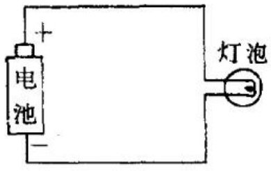

(a)

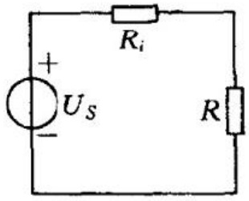

(b)

图 1-1-1 一个实际的电路和它的电路模型   (a) 实际电路；(b) 电路模型

电路理论中的一些理想元件,如上面所述的电阻、电感、电容等,都分别集总地表现实际电路中的电场或磁场的作用。每一种具有两个端钮的元件中有确定的电流,端钮间有确定的电压。这样的元件称为集总参数元件,由集总参数元件构成的电路称为集总参数的电路。

对于实际的电路,由它的电路特性,构成它的电路模型,称为电路的建模。有的电路的建模较简单,例如上面所举的两个例子;有的器件或系统的建模则需要深入分析其中的物理现象才能作出它们的电路模型,例如对交流发电机、半导体晶体管,便需要分别运用有关的知识去建模,这是相应的专门课程的课题。

实际电路要能用集总参数的电路去近似,需要满足以下的条件:实际电路的线度必须远小于电路工作频率下的电磁波的波长。

电路原理课程的主要内容是分析电路中的电磁现象和过程，研究电路定律、定理和电路的分析方法，这些知识是认识和分析实际电路的理论基础，更是分析和设计电路的重要工具。

### 1.2 电流、电压、电动势

在这一节里简要地复习电流、电压、电动势的概念，着重说明它们的参考方向。

## 电流

带电质点的运动形成电流。为了表示电流的大小，引入电流强度一量。它的定义是：在时刻 t，穿过一个面 S 的电流强度 i 等于在从 t 到  $ t+\Delta t $ 的时间内，从此面的一方穿到另一方的电荷量的代数和  $ \Delta q $ 与此时间间隔  $ \Delta t $ 之比，当  $ \Delta t \rightarrow 0 $ 时的极限，即

 $$ i\left(t\right)\stackrel{\mathrm{def}}{=}\lim_{\Delta t\rightarrow0}\frac{\Delta q}{\Delta t}=\frac{\mathrm{d}q}{\mathrm{d}t} $$ 

所以某一时刻 t 穿过 S 面的电流强度的值, 就等于在该时刻单位时间内穿过 S 面的电荷量的代数和。通常将电流强度简称为电流。

在电路中一导线或一元件中的电流等于穿过该导线或元件任一截面的电流。为了表明电流的方向，我们必须先从两个可能的方向中选取一个方向作为参考方向，例如图1-2-1中的由元件的一端A经元件至另一端B的方向，并约定：沿此方向的正电荷运动所形成的电流为正值，即i>0；逆着此方向的正电荷运动所形成的电流为负值。在电路图中用顺着参考方向的箭头表示参考方向。在图1-2-1中，实线箭头表示参考方向，当电流的实际方向（图中虚线箭头所示）与参考方向一致时（图1-2-1(a)），此电流为正值；当电流的实际方向与参考方向相反时（图1-2-1(b)），此电流为负值。可见，电流的参考方向并不一定是电流的实际方向。但当有了在所选定的参考方向下的电流的表达式，我们就可以确定每一时刻电流的实际方向。电流的参考方向也称为电流的正方向。

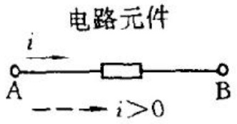

(a)

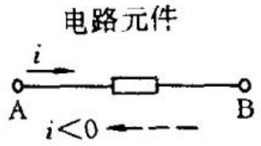

(b)

图 1-2-1 说明电流的参考方向用图 (a) i 为正时；(b) i 为负时

表示电流的参考方向还可以用双下标,例如表示图 1-2-1 中的由 A 流向 B 的电流使用  $ i_{AB} $。同一电流在不同的正方向选择下,所得电流的表达式符号相反,例如在图 1-2-1 中,便有

 $$ \dot{i}_{\mathrm{A B}}=-i_{\mathrm{B A}} $$ 

在电工技术中普遍采用的国际单位制(SI)中,电荷的单位名称是库[仑],符号是C;时间的单位名称是秒,符号是s;电流的单位名称是安[培],符号是A。每秒流过1库[仑]的电流即为1安。度量大的电流用千安(kA),度量小的电流用毫安(mA)或微安( $ \mu A $)等单位。

## 电压

在物理学的电磁学中已经知道:电荷在电场中受到电场力的作用,当将电荷由电场中的一点移至另一点时,电场对电荷作功。处在电场中的电荷具有电位(势)能。恒定电场中的每一点有一定的电位,由此引入重要的物理量电压与电位。

电场中某两点 A, B 间的电压(或称电压降) $ U_{AB} $ 等于将点电荷 q 由 A 点移至 B 点电场力所作的功  $ W_{AB} $ 与该电荷 q 的比值，即

 $$ U_{\mathrm{AB}}\xlongequal{\mathrm{def}}\frac{W_{\mathrm{AB}}}{q} $$ 

在电场中可取一点，称为参考点，记为 P，设此点的电位为零。电场中的一点 A 至 P 点的电压  $ U_{AP} $ 规定为 A 点的电位，记为  $ \varphi_{A} $，

即

 $$ \varphi_{\mathrm{A}}=U_{\mathrm{A P}} $$ 

在电路问题中,可以任选电路中的一点作为参考点,例如取“地”作为参考点。两点间的电压不随参考点的不同选择而改变。用电位表示 A,B 两点间的电压,就有

 $$ U_{\mathrm{A B}}=\varphi_{\mathrm{A}}-\varphi_{\mathrm{B}} $$ 

又显然有

 $$ U_{\mathrm{B A}}=\varphi_{\mathrm{B}}-\varphi_{\mathrm{A}}=-U_{\mathrm{A B}} $$ 

即两点间沿两个相反方向(从 A 至 B 与从 B 至 A)所得的电压符号相反。

描述一电压必须先取定一参考方向。在电路图中用以下方式表示 A, B 两点间电压的参考方向: 在 A 点标以“+”号, 在 B 点标以“-”号, 如图 1-2-2(a); 或者用从 A 指向 B 的箭头, 如图 1-2-2(b)。电压的参考方向的选取是任意的。在图 1-2-2 中, 若 A 点的电位高于 B 点的电位, 即  $ \varphi_{A} > \varphi_{B} $, 则沿此参考方向的电压为正值, 即电压的实际方向与此参考方向相同; 反之, 若 A 点的电位低于 B 的电位, 即  $ \varphi_{A} < \varphi_{B} $, 则沿此参考方向的电压为负值, 即电压的实际方向与此参考方向相反。所以每当提到一电压时, 必须先指明它的参考方向, 否则就无从判断两点间电压的真实方向。

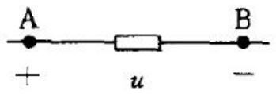

(a)

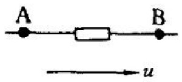

(b)

图 1-2-2 表示电压的参考方向用图

在国际单位制中能量的单位名称是焦[耳]，符号是J，电荷的单位名称是库[仑]，符号是C，电压的单位名称是伏[特]，符号是V。将1库(C)的电荷由一点移至另一点，电场力所作的功等于1

焦(J)，此两点间的电压便等于1伏(V)。度量大电压有时用千伏(kV,  $ 10^{3}V $)，度量小电压有时用毫伏(mV,  $ 10^{-3}V $)、微伏( $ \mu V $,  $ 10^{-6}V $)等单位。

## 电动势

电路中一般都接有电源以维持电流的流动。从能量角度看，电源具有能将电荷从低电位处经电源内部转移到高电位处的能力，从而对电荷作功。图1-2-3是电源的示意图，图中电源的两极A，B间有“非静电力”的作用，使得电源具有移动电荷并对之作功的能力。用电动势表征电源的这种能力。设在dt的时间内，一电源使正电荷dq从负极经电源内部移至正极所作的功为dA，电源的电动势可用下式定义：

 $$ e=\frac{\mathrm{d}A}{\mathrm{d}q} $$ 

亦即电源的电动势的数值等于将单位正电荷从负极经电源内部移到正极电源所作的功。电动势的单位与电压相同。电动势的参考方向规定为由负极经电源内部指向正极的指向。

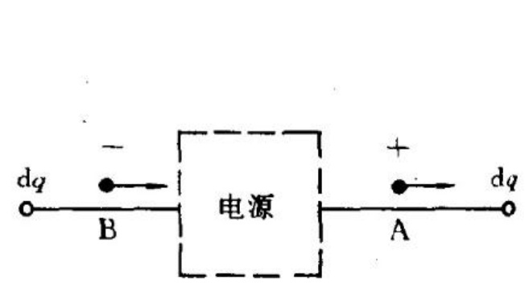

图 1-2-3 电源的示意图

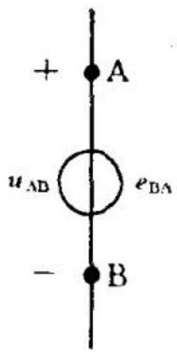

1-2-4 理想电压源符号

在电路图中常用图 1-2-4 的符号表示理想电压电源,由标有“+”号的一端(图 1-2-4 中的 A 点)到标有“-”号的一端(图 1-2-4 中的 B 点)的指向为电源电压的参考方向,这电压就等于由 B 点指向 A 点的电动势,用双下标表示就有

 $$ e_{\mathrm{B A}}=U_{\mathrm{A B}} $$ 

亦即由 B 点至 A 点的电动势等于由 A 至 B 的电压降。对于其电动势随时间变化的电源,我们总是按照取定的参考方向,写出以时间函数表示的电动势的表达式  $ e(t) $,根据各时刻  $ e(t) $ 的数值就可以判定各该时刻电动势的实际方向和大小。

### 1.3 电路元件的功率

根据电流和电压的定义,可以得到电路元件的功率的表示式。设二端元件的两端有电压  $ u(t) $,元件中有电流  $ i(t) $ (图 1-3-1),则此元件所吸收的功率的瞬时值  $ p(t) $ 等于  $ u(t) $ 与  $ i(t) $ 的乘积,即

 $$ p(t)=u(t)i(t) $$ 

注意，在上式中 $ u(t) $与 $ i(t) $的参考方向一致，见图1-3-1(a)。当 $ u(t) $与 $ i(t) $同号时， $ p(t)>0 $，就表示这时元件确实吸收功率；当 $ u(t) $与 $ i(t) $异号时， $ p(t)<0 $，就表示这时元件吸收负的功率，实际上是在输出功率。式(1-3-1)适用于任何二端元件。

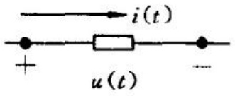

(a)

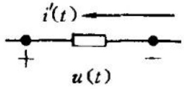

(b)

图 1-3-1 说明电路元件的功率的图

(a) u,i 参考方向一致; (b) u,i 参考方向相反

如果对一个二端元件,所取电压与电流的参考方向相反,如图1-3-1(b)所示,则此二端元件所发出的功率等于 $ u(t) $与 $ i'(t) $的乘积,即

 $$ p(t)=u(t)i^{^{\prime}}(t) $$ 

当  $  u(t), i'(t)  $ 同号时，此功率为正；当  $  u(t), i'(t)  $ 异号时，此功率为负。

### 1.4 电阻元件

在电工中有着许多具有下述特性的一类二端器件,它们的端电压可表示为其中的电流的函数,或者器件中的电流可表示为其端电压的函数,亦即其端电压u与其中的电流i的关系可以用其伏安特性表示。这类器件都可以用电阻作为其电路模型,金属丝灯泡、电阻加热炉、实验室中用的各种电阻器都是这类器件的典型的例子。

凡是其端电压与其中的电流成正比的电阻元件称为线性电阻。线性电阻的符号如图1-4-1(a)所示。一线性电阻的伏安特性是穿过原点的一直线，此直线的斜率即为它的电阻值，如图1-4-1(b)所示。

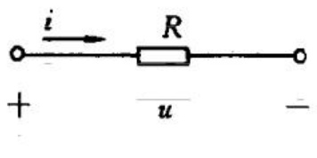

(a)

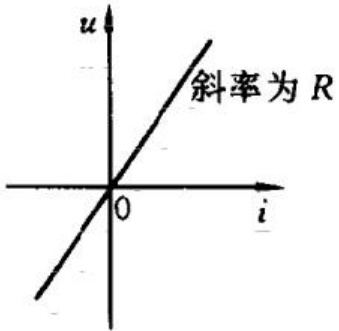

(b)

图 1-4-1 线性电阻的符号和它的伏安特性 (a) 符号；(b) 伏安特性

线性电阻的电压与电流的关系式就是欧姆定律

 $$ u=Ri $$ 

其中 R 就是电阻。式 $  (1-4-1)  $又可写作

 $$ i=G u $$ 

G 就是电导。线性电阻 R 与电导 G 有着互为倒数的关系，即

 $$ G=\frac{1}{R}\qquad 或 \qquad R=\frac{1}{G} $$ 

在国际单位制中,电阻的单位名称是欧[姆],符号是  $ \Omega $;电导的单位名称是西[门子],符号是 S。以后用到电阻这一名词,有时是指电阻元件,有时是指电阻元件的参数 R。

一个用电阻率为  $ \rho $ 的材料制成的长为 l、具有均匀截面 S 的导线的电阻数值为

 $$ R=\rho\frac{l}{S} $$ 

计算形状不规则的导体的电阻需要用电场的理论。有多种仪器可用以量测电阻器实物的电阻值。

在式(1-4-1)和式(1-4-2)中, 假定了电阻上的电压与电流的参考方向一致, 即电流从标有“+”号的端点流入, 从标有“-”号的端点流出。如果取电阻中电流的参考方向与电压的参考方向相反, 例如像图1-4-2中那样, 电流从标有“-”号的端点流入, 从标有“+”号的端点流出, 电压u与电流i的关系便应是

 $$ u=-\boldsymbol{R}\boldsymbol{i}^{\prime} $$ 

或

 $$ i^{^{\prime}}=-G u $$ 

以后在列写电路方程时,常会遇到这样的情形。

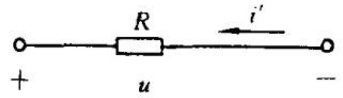

图 1-4-2 电阻上电压与电流参考方向相反的情形

电阻是消耗电能的元件,这里称“消耗电能”是习惯上的说法,实际上是电阻将电能转换成热能。电阻 R(电导 G)所吸收的电功率是

 $$ p=u i=R i^{2}=\frac{u^{2}}{R}=G u^{2}=\frac{i^{2}}{G} $$ 

由上式可见: 在一定的电压下, R 愈小(或 G 愈大), 电阻所吸收的功率愈大; 在一定的电流下, R 愈大(或 G 愈小), 电阻所得的功率愈大。

凡是其电压、电流关系不符合欧姆定律的电阻就称之为非线性电阻。

### 1.5 电感元件

为表示载流回路中电流产生磁场的作用，引入电感元件。

设有一形状一定的导体线圈(图 1-5-1)，它有 N 匝。当该线圈中有电流 i 通过时，电流产生磁场，线圈所围的面上有磁通穿过，假设每匝线圈都链有磁通  $ \Phi $，该线圈所链的磁链  $ \Psi $ 即等于匝数 N 与磁通  $ \Phi $ 的乘积，即

 $$ \Psi=N\Phi $$ 

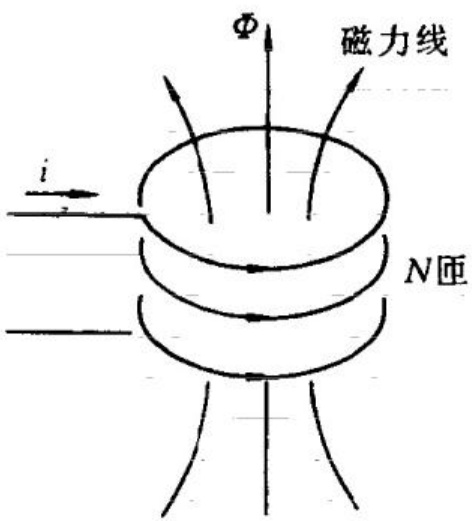

图 1-5-1 电感线圈

如果线圈周围没有铁磁物质，则磁通  $ \Phi $、磁链  $ \Psi $ 与电流 i 成正比，线圈所链合的磁链与电流 i 的比值

 $$ L\xlongequal{\mathrm{d e f}}\frac{\Psi}{i}=\frac{N\Phi}{i} $$ 

为一常数值,称为此线圈的电感或自感。在国际单位制中,电感的单位名称是亨[利],符号是H,有

 $$ 1\mathrm{H}=1\frac{\mathrm{Wb}}{\mathrm{A}}=1\frac{\mathrm{V}\cdot\mathrm{s}}{\mathrm{A}}=1\Omega\cdot\mathrm{s} $$ 

线圈电感的大小决定于线圈的形状、几何尺寸、匝数和线圈周围磁介质的磁导率。线圈的电感可以根据电磁学的理论计算得出，还可以用量测电感的仪器测量得出。在电路图中用图 1-5-2 的符号表示电感。

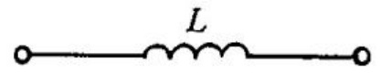

图 1-5-2 电感的电路符号

如果电感线圈中有随时间变化的电流,那么,线圈所链的磁通、磁链也随时间变化。按照电磁感应定律,磁链的变化便在线圈所形成的回路中产生感应电动势

 $$ e_{L}(t)=-\frac{\mathrm{d}\Psi(t)}{\mathrm{d}t}=-L\frac{\mathrm{d}i(t)}{\mathrm{d}t} $$ 

在上式中， $ \Psi $ 的参考方向与  $ e_{L} $ 的参考方向是按右手螺旋法则选择的，电流与磁通的参考方向也符合这一法则（图 1-5-3），i 与  $ e_{L} $ 同在线圈回路中，所以  $ e_{L} $ 与 i 的参考方向一致，因此沿与电流的参考方向一致的方向的电感电压降应与  $ e_{L} $ 相差一负号，即有

 $$ u_{L}(t)=-e_{L}(t)=L\frac{\mathrm{d}i(t)}{\mathrm{d}t} $$ 

所示的电感的电流、电压、电动势的关系，在电路中就可以表示成如图 1-5-4 那样。如果取电感电压与其中的电流的参考方向相反，像图 1-5-5 中所示的那样，电感电压与电流的关系就应是

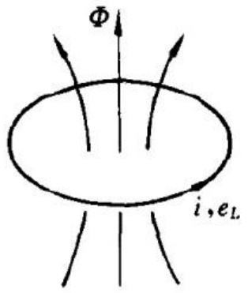

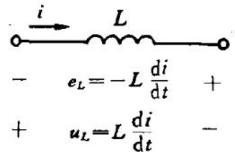

图 1-5-3 线圈中电流、电动势与磁通的参考方向

图 1-5-4 电感电压、电流、电动势的关系

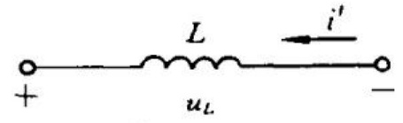

图 1-5-5 参考方向相反时电感的电压、电流关系

 $$ u_{L}(t)=-L\frac{\mathrm{d}i^{\prime}(t)}{\mathrm{d}t} $$ 

式(1-5-2)和式(1-5-3)两式表示的自感电动势、电压的实际方向与楞茨定律所表示的结果是一致的:当 $ \frac{di}{dt}>0 $时, $ u_{L}>0 $;当 $ \frac{di}{dt}<0 $时, $ u_{L}<0 $。

对式(1-5-3)作由时刻  $ t_{0} $ 至 t 的积分，可以得到以积分形式表示的电感的电压与电流的关系：

 $$ i(t)=i(t_{0})+\frac{1}{L}\int_{t_{0}}^{t}u_{L}(\tau)\mathrm{d}\tau $$ 

对电感的电压与电流的关系作以下说明:式(1-5-3)表明在某时刻电感两端的电压决定于该时刻电感中的电流的变化率;式(1-5-4)表明要由  $ t_{0} $ 至 t 期间的电压求 t 时的电流, 就还必须知道在 t 时刻之前,  $ t_{0} $ 时的电流值。式(1-5-4)中的前一项即为这一数值, 式中的后一项则是以电感电压表示的由  $ t_{0} $ 至 t 期间电流的增量。

电感是不消耗电能的元件,虽然它有瞬时功率  $ p_{L}=u_{L}i $ 。电感电流由零增至 I,电源对电感所作的功都转换为磁能,储存于电感

电流的磁场之中。这一能量可这样求得:设在 dt 的时间里,由外部电源输送到电感的能量 dA 为

 $$ \mathrm{d}A=u_{L}i\mathrm{d}t=Li\frac{\mathrm{d}i}{\mathrm{d}t}\mathrm{d}t=L\mathrm{i}\mathrm{d}i $$ 

dA 也就是磁场能量的增量  $ dW_{m} $，即  $ dW_{m}=dA $，电流由零增至 I 磁场能量即为

 $$ W_{m}=\int\mathrm{d}W_{m}=\int_{0}^{I}L\mathrm{d}i=\frac{1}{2}L I^{2}=\frac{\Psi^{2}}{2L} $$ 

式中  $ \Psi=LI $，所以线性电感 L 的磁场储能等于电感 L 与电流平方的乘积之半。

### 1.6 电容元件

为表示带电导体上电荷产生电场的作用,引入电容元件。

两个导体分别带有恒定电荷 $  +q, -q  $，导体周围便有静电场，在两导体间的绝缘介质是线性的，即其介电常数为一定值的情形下，这两个导体间由带 $  +q  $的导体到带 $  -q  $的导体的电压 $  u_{c}  $与电荷q成正比，比值

 $$ C\stackrel{\mathrm{d e f}}{=}\frac{q}{u_{C}} $$ 

称为这两个导体间的电容。在国际单位制中，电荷的单位名称是库[仑]，电压的单位名称是伏[特]，电容的单位名称是法[拉]，符号是F，有

 $$ 1\mathrm{F}=\frac{1\mathrm{C}}{1\mathrm{V}}=1\frac{\mathrm{s}}{\Omega} $$ 

在实用中，这个单位太大，常用微法( $ \mu F $)、皮法(pF)作为电容的单位， $ 1\mu F = 10^{-6}F $， $ 1pF = 10^{-9}F $。

上述的导体结构便形成一电容器。电容器的电容只决定于导体的几何形状、尺寸和导体间绝缘物质的介电常数。平板形电容器

是最常见的电容器(图 1-6-1)，它由两平板形电极和极板间绝缘介质构成，它的电容为

 $$ C=\varepsilon\frac{S}{d} $$ 

式中 S 是极板面积; d 是极间的距离;  $ \varepsilon $ 是极间绝缘介质的介电常数。给定了导体的几何结构和极间介质的介电常数, 可以根据静电场的理论计算出电容器的电容, 还可以用测量电容的仪器测量电容器的电容。在电路图中用图 1-6-2 所示的符号表示电容。

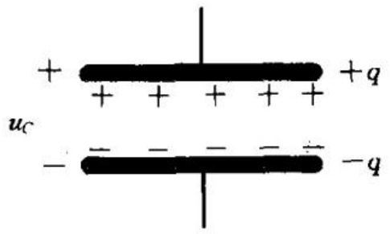

图 1-6-1 平板形电容器

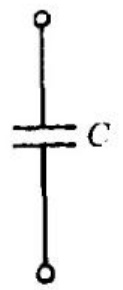

图 1-6-2 电容元件的电路符号

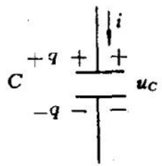

图 1-6-3 电容电压   电流关系

现在来导出电容 C 的电压与电流的关系式。设在一电容元件（图 1-6-3）两端加一电压  $ u_{C}(t) $，则此电容极板上的电荷与此电压成正比地变化。电压升高，电容上的电荷便增多；电压减小，电容上的电荷便减少。电容器极板上电荷变化说明外部有电荷转移到电容器的极板上，这便形成电容电流。由于

 $$ q(t)=C u_{C}(t) $$ 

电容电流就等于电容极板上电荷的变化率,也等于单位时间内流向带+q极板的电荷量,即

 $$ i(t)=\frac{\mathrm{d}q(t)}{\mathrm{d}t}=C\frac{\mathrm{d}u_{C}(t)}{\mathrm{d}t} $$ 

上式即为电容元件的电流与电压的关系式,也就是电容元件的方程。它表明电容电流等于电容C与电容电压的时间导数  $ \mathrm{d}u_{C}/\mathrm{d}t $ 的乘积。在电容器极板间的电场中有与  $ \mathrm{d}q/\mathrm{d}t $ 相等的位移电流,由一

极板流至另一极板。在电路理论中,只需以式(1-6-2)作为电容元件的方程就够了。

对式 $ （1-6-2） $作由 $ t_{0} $至t的积分，便得到

 $$ u_{C}(t)=u_{C}(t_{0})+\frac{1}{C}\int_{t_{0}}^{t}i(\tau)\mathrm{d}\tau $$ 

这是电容元件方程的另一形式。此式中第一项是  $ u_{C} $ 在  $ t_{0} $ 时的数值，第二项是  $ t_{0} $ 至 t 期间电容极板上增加的电荷所引起的电容电压的增加量。由此式可见，如果要由  $ t_{0} $ 至 t 期间的电容电流求 t 时的电容电压，就需要知道  $ t_{0} $ 时的电容电压  $ u_{C}(t_{0}) $。

电容元件也是储能元件，它能将外部输入的电能储存在它的电场中。电容的电压由零增至  $ U_{c} $，电容的电荷便由零增至  $ Q = C U_{c} $，在 dt 的时间内外部输入的能量增量 dA 等于电容储能的增量  $ dW_{e} $， $ dW_{e} $ 又等于  $ u_{c}dq $ 也即等于  $ u_{c}idt $，于是

 $$ \mathrm{d}A=\mathrm{d}W_{e}=u_{c}\mathrm{id}t=C u_{c}\frac{\mathrm{d}u_{c}}{\mathrm{d}t}\mathrm{d}t=C u_{c}\mathrm{d}u_{c} $$ 

对上式积分得到电容的储能

 $$ W_{e}=\int\mathrm{d}W_{e}=\int_{0}^{v_{c}}C u_{c}\mathrm{d}u_{c}=\frac{1}{2}C U_{c}^{2}=\frac{Q^{2}}{2C} $$ 

即电容中的电场储能等于电容与其电压的平方的乘积之半。

### 1.7 电源元件

一般的电路中都有电源,电源可以在电路中引起电流,为电路提供电能。实际的电源有许多种,如蓄电池、发电机、光电池都是实际电源。在电路理论中,根据电源元件的不同特性可以作出电源的两种电路模型:一种模型是理想电压源;另一种模型是理想电流源。

## 电压电源

理想电压电源是具有下述特性的二端元件,即它的两端间有电压  $ u_{s} $,此电压的量值与电源中的电流无关。

例如一蓄电池或直流发电机,如果可以忽略其端电压随其中电流的变化,就可以用一理想电压电源作为它的电路模型。理想电压电源的电路符号如图1-7-1所示。在这图中由标有“+”号的端点至标有“-”号的端点的方向是电压 $ u_{S} $的参考方向,即沿此方向的电压降是 $ u_{S} $,或者说由“-”端至“+”端的电位升(电动势)是 $ u_{S} $。理想的恒定电压源的特性可以用图1-7-2中的伏安特性来表示,它是一条与i轴平行的直线,不论i为何值,端电压都为一恒定值 $ U_{S} $,这就表示端电压与i无关。一般的理想电压源的电压是时间的函数 $ u_{S}(t) $,在某一瞬间 $ t_{0} $,电源的端电压即为 $ u_{S}(t_{0}) $,也可以作出在该瞬间理想电压源的伏安特性,这与图1-7-2的特性相似。

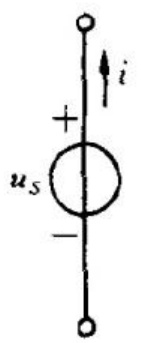

图 1-7-1 理想电压电源的电路符号

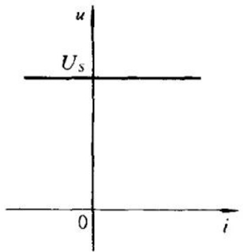

图 1-7-2 理想的恒定电压电源的伏安特性

## 电流电源

理想的电流电源是具有以下特性的二端元件,即它输出的电流为 $ i_{s} $,此电流的量值与此电源的端电压u无关。

理想电流电源的电路符号如图 1-7-3 所示, 其中的箭头表示电流  $ i_{s} $ 的参考方向。理想的恒定电流源的特性可以用图 1-7-4 中的伏安特性表示, 它是一条与 u 轴平行的直线, 不论电流源两端的电压如何, 电流源中总是保持有恒定的电流, 即其中的电流与其端电压无关。时变电流电源中的电流是时间的函数。在实际元件中, 确实有着这样的元件, 它的特性很接近于上述特性, 例如光电池。

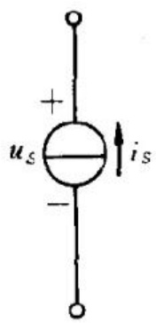

图 1-7-3 理想的电流电源的电路符号

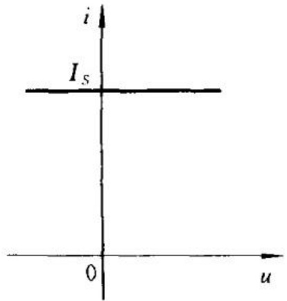

图 1-7-4 理想的恒定电流电源的伏安特性

在电路中不应当出现电压电源 $ (u_{s}\neq0) $被短路的情形,因为这种情形与建立理想电压源模型所作的假设相矛盾:电压电源两端的电压不为零,而短接其两端又要求其间的电压为零。实际的电源(例如一蓄电池)可能被短接(例如在错误的联接情形下),这时便需要考虑实际电路中存在的即使是很小的电阻,而电源中将出现较大的电流,这样也就不会有任何矛盾了。与上述情形类似,在电路中也不应当出现电流电源 $ (i_{s}\neq0) $被开路的情形,因为这一情形也与建立电流电源所作的假设相矛盾。

一个理想电压电源有一定的电压,其中的电流大小则有赖于该电压源两端所联接的电路;一个理想电流电源中有一定的电流,其两端的电压则有赖于该电流源两端所联接的电路。

## 电源的功率

在电路分析中常需计算电源发出的功率。作为有源元件的电源，不论是电压源还是电流源，它所发出的功率，总是等于电源电压u与参考方向与u的参考方向相反的电流i的乘积。如果用电源的电动势e表示电源发出的功率，假设电源电压、电流的参考方向如图1-7-5所示，则由“一”端至“+”端的电动势等于电压u，所以电源发出的功率可表示为

 $$ p=ui=ei $$ 

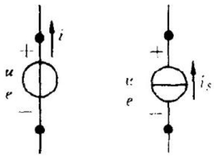

图 1-7-5 计算电源发出的功率用附图

一般情形下,u,i随时间变化,某时刻的u,i乘积即为电源在该时刻发出的功率。当p值为正时,就表明电源在发出功率(如蓄电池放电);当p值为负时,就表明电源实际上是在吸收功率(如蓄电池充电)。

### 1.8 受控电源

在电工中有一些这样的元件，它们有着电源的一些特性，但它们的电压或电流，又不像独立电源那样是给定的时间函数，而是受电路中某个电压或电流的控制。依受控量、控制量的不同，有四种常见的受控源，又称非独立电源的模型。控制量与受控量之间，一般可能有复杂的关系，这里只引入受控量与控制量成正比的受控电源，即线性受控源。

四种受控电源的电路符号示于图 1-8-1 中。

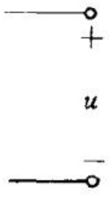

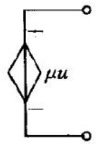

(a)

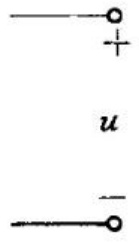

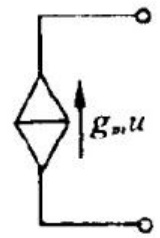

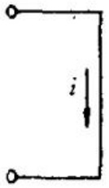

(b)

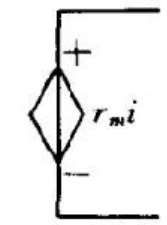

(c)

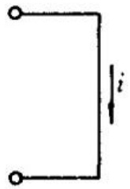

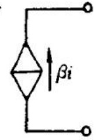

(d)

图 1-8-1 四种受控电源的电路符号

(a) 电压控制的电压源(VCVS); (b) 电压控制的电流源(VCCS);

(c) 电流控制的电压源(CCVS); (d) 电流控制的电流源(CCCS)

图 1-8-1(a) 是电压控制的电压源(VCVS)。其中受控源的电压与一控制电压成正比而为  $ \mu u $，u 是控制电压， $ \mu $ 是一比例常数，称为转移电压比。

图 1-8-1(b) 是电压控制的电流源 (VCCS)，其中受控电流源的电流与控制电压成正比而为  $ g_{m}u $。u 是控制电压； $ g_{m} $ 是一比例常数，它有电导的量纲，称为转移电导。

图 1-8-1(c) 是电流控制的电压源(CCVS)，其中受控电压源的电压与控制电流成正比而为  $ r_{m}i $。i 是控制电流； $ r_{m} $ 是一比例常数，它有电阻的量纲，称为转移电阻。

图 1-8-1(d) 是电流控制的电流源(CCCS)，其中受控电流源的电流与控制电流成正比而为  $ \beta i, i $ 是控制电流； $ \beta $ 是一比例常数，称为转移电流比。

受控电源常用作一些电子器件或电路的模型。例如电子管、半导体晶体三极管、场效应管等器件在工作时，都有一个控制电压或

电流来控制它们的输出电压或电流，以实现它们的功能，例如从微小的控制量(电压或电流)，获得增大了的输出量以实现其放大功能。在这些器件的电路模型中，都含有某种受控电源。

### 1.9 基尔霍夫定律

在前面几节里研究了几种基本的电路元件的电压与电流的关系，这都是元件约束。若干电路元件联接成一电路后，各元件的电压、电流还要受到由电路结构决定的约束关系。这就是本节要说明的由基尔霍夫定律提出的约束条件。

在叙述基尔霍夫定律之前，先介绍几个表述电路结构用的名词。

支路 由一个或一个以上的元件串接成的分支称为一个支路。例如图 1-9-1 所示的电路中含有 3 个支路:  $ R_{1} $ 和电压源  $ U_{1} $ 串接成一个支路;  $ R_{2} $ 和电压源  $ U_{2} $ 串接成另一支路;  $ R_{3} $ 单独成为一个支路。

节点 三个或三个以上的支路的联接点称为节点。图 1-9-1 中的电路含有两个节点，即图中的 A, B 两点。

回路 由电路中的支路组成的闭合路径称为回路。例如图1-9-1中的电路有三个回路，其中三个支路中的任意两支都构成一个回路。

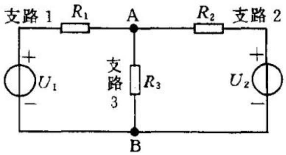

图 1-9-1 一个含三个支路的电路

以上关于支路、节点的定义只是一种约定,还可以有其它的约

定。例如可将每一个二端元件规定为一个支路；将两个和两个以上的支路的联接点规定为一个节点。对于同一电路，采用这样的规定，得出的支路数、节点数一般都比按前述规定得出的要多。例如对图1-9-1的电路，用前一规定得出的支路数为3，节点数为2；而按后一规定得出的支路数为5，节点数为4。

现在给出基尔霍夫定律的陈述。基尔霍夫定律有基尔霍夫电流定律(KCL) $ ^{①} $ 和基尔霍夫电压定律(KVL) $ ^{②} $，它们是集总参数电路的基本定律。

基尔霍夫电流定律(KCL) 在任何集总电路中，在任一时刻，流出(或流入)任一节点的各支路电流的代数和为零。

对任一节点，KCL 可以用下式表述：

 $$ \sum i(t)=0 $$ 

其中的求和是对接到所考虑的节点的所有支路进行的。在此式中，如果某支路电流的参考方向背离所考虑的节点，此支路电流前应有“+”号；如果某支路电流的参考方向指向所考虑的节点，此电流之前应有“-”号，因为此时经该支路流出这一节点的电流应与流入的电流反号。

对图 1-9-2 中的节点, 可写出它的 KCL 方程如下:

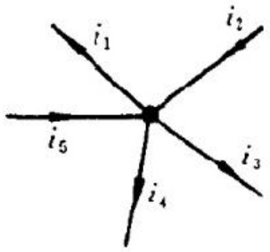

图 1-9-2 KCL 方程 示例用图

 $$ i_{1}-i_{2}+i_{3}+i_{4}-i_{5}=0 $$ 

基尔霍夫电流定律的成立,是基于电磁学中的电荷守恒原理,根据这一原理得出电流连续性定理:穿出任一闭合面的电流的代数和为零。电路中的电流自然也遵从这一普

遍规律。KCL 就是电流连续性定理在电路中的表述。

在列写电路的 KCL 方程时, 常采取这样的列写方式: 将接到所考虑的节点的电流源流入的各电流项放在方程的右端; 将接至该节点的其余各支路流出的电流项放在方程的左端。这样列写的 KCL 方程便有以下形式:

 $$ \sum i(t)=\sum i_{S}(t) $$ 

上式中右端的求和是对接到所考虑的节点的电流源支路；左端的

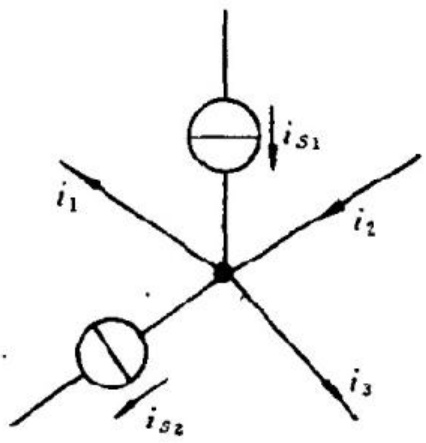

图 1-9-3 列写 KCL 方程的例图

求和是对接至该节点的其余支路。例如对于图 1-9-3 中的节点，便可以列出这一形式的方程为

 $$ i_{1}-i_{2}+i_{3}=i_{S1}-i_{S2} $$ 

按照这样的方式列写一节点的 KCL 方程，右端的各电流源电流，凡其参考方向是指向该节点的，均应有“十”号，背离该节点的，均应有“一”号；左端的各电流中凡其参考方向背离该节点的，均应有“十”号，指向该节点的，均应有“一”号。

根据电流连续性定理, 将前述KCL中的“节点”一词, 换成“闭合面”, 所得结论亦成立, 即流出任一闭合面的所有电流的代数和为零。例如对于图1-9-4的电路, 便可立即得到

 $$ -i_{1}+i_{2}-i_{3}+i_{4}=0 $$ 

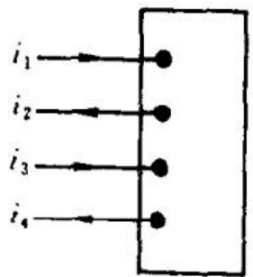

图 1-9-4 对闭合面的电流列写 KCL 方程示例

基尔霍夫电压定律(KVL) 基尔霍夫电压定律表述电路中各电压间的

约束关系,此定律称:在任何集总电路中,在任一时刻,沿任一闭合回路,各支路电压的代数和为零。用式子表示即

 $$ \sum u(t)=0 $$ 

上式中的求和是对一回路中的所有各支路进行的。

在列写 KVL 的方程时,须先对所考虑的回路选取一个绕行方向,各支路电压应取为沿此回路绕行方向的电压,即支路电压的参考方向应与回路绕行方向一致。例如对图 1-9-5 中所示的某电路中的一个回路,设支路电阻、电压电源、支路电流如图中所给出,各节点电位分别为  $ \varphi_{a}, \varphi_{b}, \varphi_{c}, \varphi_{d} $ 。取顺时针方向为回路的参考方向,便可写出沿此回路方向各支路电压:

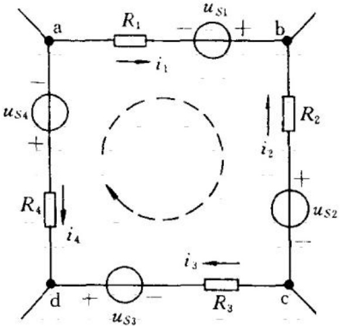

图 1-9-5 电路中的一个回路

 $$ \begin{aligned}&u_{\mathrm{ab}}=R_{1}i_{1}-u_{S1}=\varphi_{\mathrm{a}}-\varphi_{\mathrm{b}}\\&u_{\mathrm{bc}}=-R_{2}i_{2}+u_{S2}=\varphi_{\mathrm{b}}-\varphi_{\mathrm{c}}\\&u_{\mathrm{cd}}=R_{3}i_{3}-u_{S3}=\varphi_{\mathrm{c}}-\varphi_{\mathrm{d}}\\&u_{\mathrm{da}}=-R_{4}i_{4}+u_{S4}=\varphi_{\mathrm{d}}-\varphi_{\mathrm{a}}\\ \end{aligned} $$ 

将这一回路中的各支路电压相加，便得

 $$ R_{1}i_{1}-u_{S1}-R_{2}i_{2}+u_{S2}+R_{3}i_{3}-u_{S3}-R_{4}i_{4}+u_{S4}=0 $$ 

上式即是沿着所选取的回路参考方向时回路中各支路电压降之和，这个和等于 $ \left(\varphi_{\mathrm{a}}-\varphi_{\mathrm{b}}\right)+\left(\varphi_{\mathrm{b}}-\varphi_{\mathrm{c}}\right)+\left(\varphi_{\mathrm{c}}-\varphi_{\mathrm{d}}\right)+\left(\varphi_{\mathrm{d}}-\varphi_{\mathrm{a}}\right)=0 $，由此可见，基尔霍夫电压定律的成立是由于电路中的每一节点只有

一个电位,沿一回路,各支路的电压降之和必然为零。

在上面的例子里,将所得回路电压方程中的各电阻上的电压放在方程式的一端,将电压源电压放在另一端,便得到下面的方程:

 $$ R_{1}i_{1}-R_{2}i_{2}+R_{3}i_{3}-R_{4}i_{4}=u_{S1}-u_{S2}+u_{S3}-u_{S4} $$ 

在上式左端，凡是支路电流参考方向与回路方向相同的，它所产生的电压降前面均有正号，如  $ R_{1}i_{1} $， $ R_{3}i_{3} $；反之，凡是支路电流参考方向与回路方向相反的，它所产生的电压降前面均有负号，如  $ R_{2}i_{2} $， $ R_{4}i_{4} $。在上式的右端是回路中各电压源电动势（或电压），凡是其参考方向（由“一”端指向“+”端）与回路方向相同的电动势前面均有正号，如  $ u_{S1} $， $ u_{S3} $；凡是其参考方向与回路方向相反的，电动势前面均有负号，如  $ u_{S2} $， $ u_{S4} $。对于任何回路，也都可以写出相应的回路电压方程。所以，可以将基尔霍夫电压定律用下式表述：

 $$ \sum u(t)=\sum u_{S}(t) $$ 

即:沿任一回路,除电压源之外的所有各元件上的电压降的代数和,等于该回路中各电源电动势之和。这里电动势的参考方向须与回路的参考方向一致,而各电源电压降的参考方向则应与回路的参考方向相反。

基尔霍夫定律是关于电路中各个电流、电压间由电路的结构所决定的约束关系的定律,适用于任何集总电路。各种分析电路的方法,都依据它去建立所需的方程式,所以它们是电路的基本定律。

## 习题

1-1 按题图 1-1 中指定的电压 u 和电流 i 的参考方向，写出各元件 u 和 i 的约束方程。

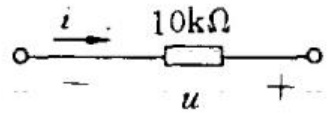

(a)

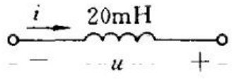

(b)

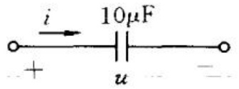

(c)

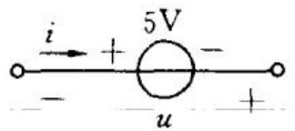

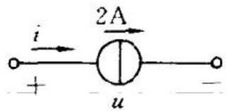

(d)

(e)

题图 1-1

1-2 题图 1-2 电路中, 已知各支路的电流、电阻和电压源电压, 试写出各支路电压 U 的表达式。

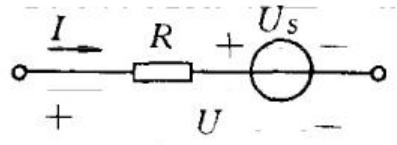

(a)

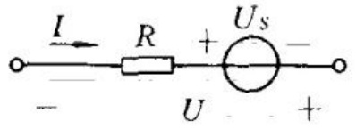

(b)

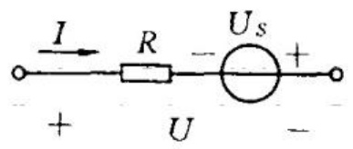

(c)

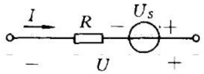

(d)

题图 1-2

1-3 电路如题图 1-3 所示，求电压  $ U_{AB}, U_{BC} $ 和  $ U_{CA} $。

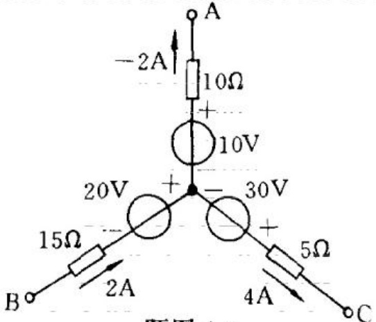

题图 1-3

## 1 -4 用最简单的方法，求题图 1-4 中各电路的待求量 U，I。

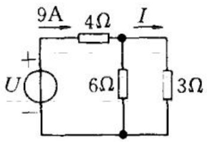

(a)

(b)

(c)

(d)

(e)

题图 1-4

(f)

1-5 求题图 1-5 各电路中电源的功率, 并指出它们是吸收功率还是发出功率。

(a)

(b)

 $ (\bar{c}) $

(d)

题图 1-5

1-6 求题图 1-6 中各含源支路中的未知量。图(d)中的  $ P_{is} $ 表示电流源吸收的功率。

(a)

(b)

(c)

(d)

题图 1-6

1-7 试绘出题图 1-7(a)，(b)所示电路的 u-i 特性曲线(图中 D 为理想二极管)。

(a)

(b)

题图 1-7

1-8 求题图 1-8 所示电路中的 I,  $ U_{s} $ 及 R。

题图 1-8

1-9 求题图 1-9 所示电路中的各支路电流。

题图 1-9

1-10 已知电路参数如题图 1-10 所示,试求各电阻支路的电流。

题图 1-10

1-11 电路参数如题图 1-11 中所注明，且知  $ I_{1}=3A, I_{2}=2A $，求  $ I_{3}, R_{5} $ 及  $ U_{S} $。

题图 1-11

1-12 求题图 1-12 所示电路中的  $ U_{AB}, I_{1} $ 及  $ I_{2} $ 。

题图 1-12

1-13 题图 1-13 所示电路中，已知  $ U_{S}=8V, R_{1}=4\Omega, R_{2}=3\Omega, I_{S}=3A $ 。试求电源输出的功率和电阻吸收的功率。

题图 1-13

1-14 电路如题图 1-14 所示, 求

(1) 图(a)中电流  $ i_{1} $ 和电压  $ u_{ab} $;

(2) 图(b)中电压  $ u_{ab} $ 和  $ \overline{u}_{cb} $;

(3) 图(c)中电压 u 和电流  $ i_{1}, i_{2} $

(a)

(b)

(c)

题图 1-14

1-15 电路如题图 1-15 所示, 已知  $ U_{1}=1V $, 试求电阻 R 的值。

题图 1-15

## 第 2 章 简单电阻电路的分析方法

在本章里,将要介绍一些简单的电阻电路的分析方法。这里的电阻电路是指仅含线性电阻和电源的电路,线性电阻是指电阻(或电导)值与电流、电压无关的电阻(或电导)。

电路分析的典型问题是要求对给定电路的工作情况,主要是电流、电压等作出分析。分析电路的依据是基尔霍夫定律和各电路元件的特性方程。虽然本章所分析的是一些简单的电路,但所得结果却是在分析电路时经常用到的,而且所用的方法与分析电路的一般方法有着密切的联系。

### 2.1 串联电阻电路

串联是电路元件的一种常见的联接方式。设有若干个二端电阻元件，将第一个电阻的一个端点与第二个电阻的一个端点相联，将第二个电阻的另一端与第三个电阻相联……这样便将这些电阻联接成一个二端电路。n个电阻串联接成的电路如图2-1-1所示。在各个电阻中，根据基尔霍夫电流定律，有相同的电流流过。假设

图 2-1-1 串联电阻电路

流过的电流为 i，根据基尔霍夫电压定律，各电阻两端电压之和等

于串联电路两端的电压，即

 $$ u_{1}+u_{2}+\cdots+u_{k}+\cdots+u_{n}=u $$ 

每一电阻两端的电压，等于 i 与该电阻的乘积，即  $ u_{k}=R_{ki}(k=1,2,\cdots,n) $，于是

 $$ (R_{1}+R_{2}+\cdots+R_{k}+\cdots+R_{n})i=\sum_{k=1}^{n}R_{k}i=u $$ 

将上式记作

 $$ u=Ri $$ 

其中

 $$ R=\sum_{k=1}^{n}R_{k} $$ 

由此可见:串联电阻电路等效于一电阻 R, 此电阻 R 等于串联电路中诸电阻之和。式(2-1-2)给出了串联电路的电压 u 与其中电流 i 的关系。如果给定串联电路两端的电压 u, 容易求出各个电阻上所分有的电压。电阻  $ R_{k} $ 上的电压为

 $$ u_{k}=R_{k}i=\frac{R_{k}}{\sum_{j=1}^{n}R_{j}}u=\frac{R_{k}}{R}u $$ 

上式即为串联电阻电路的分压公式。以两个电阻(即 n=2)串联的电路为例,便有

 $$ \begin{aligned}R&=R_{1}+R_{2}\\u_{1}&=\frac{R_{1}}{R_{1}+R_{2}}u\\u_{2}&=\frac{R_{2}}{R_{1}+R_{2}}u\end{aligned} $$ 

由上式可见:两个电阻串联时,电阻值大的电阻上的电压大于电阻值小的电阻上的电压。

在串联电阻电路中,各电阻所吸收的功率之和与其等效电阻

在同一电流下所吸收的功率相同。

### 2.2 并联电阻电路

并联也是电路元件的一种常见的联接方式。在并联电阻的电

图 2-2-1 并联电阻电路

路中，将每一电阻的一个端点相联，形成一个节点；将每一电阻的另一个端点也相联，形成另一节点。图2-2-1中是n个电阻并联的电路图。设各电阻值为 $ R_{k} $，电导值为 $ G_{k}(=1/R_{k})(k=1,2,\cdots,n) $。在并联电阻电路中，根据基尔霍夫电压定律，所有各电阻两端有同一电压；根据基尔霍夫电流定律，其中的总电流i等于各分支电流 $ i_{k}(k=1,2,\cdots,n) $之和。即

 $$ u_{k}\equiv u $$ 

 $$ \sum_{k=1}^{n}i_{k}=i $$ 

而  $ i_{k}=u/R_{k}=G_{k}u $，所以有

 $$ \begin{aligned}\sum_{k=1}^{n}\frac{1}{R_{k}}u&=i\\u&=\frac{i}{\sum_{k=1}^{n}G_{k}}=\frac{i}{G}\end{aligned} $$ 

其中

 $$ G=\sum_{k=1}^{n}G_{k} $$ 

上式表明： $ G_{1},\cdots,G_{n} $ n个电导并联构成的电路，与一个电导G等效，此电导等于各个并联的电导之和。而并联电路的电压等于总电

流除以总电导。这 n 个电导(阻)并联的等效电阻 R 即等于等效电导 G 的倒数,即

 $$ R=\frac{1}{G}=\frac{1}{\sum_{k=1}^{n}G_{k}}=\frac{1}{\sum_{k=1}^{n}\frac{1}{R_{k}}} $$ 

由式(2-2-3)、(2-2-4)容易导出由总电流i求各分支电流 $ i_{k} $的公式:由总电流i与电阻R的乘积得电压u,此电压被 $ R_{k} $除(或与 $ G_{k} $相乘)即得 $ R_{k} $中的电流 $ i_{k} $,所以有

 $$ i_{k}=G_{k}u=\frac{G_{k}}{\sum_{k=1}^{n}G_{k}}i $$ 

式(2-2-6)就是并联电阻电路的分流分式。这公式与式(2-1-4)给出的串联电阻电路的分压公式形式上相同，只要将式(2-1-4)中的电阻 R、电压 u 和电流 i 分别以电导 G、电流 i 和电压 u 替换即得式(2-2-6)。

以两个电阻(导)并联的电路(图 2-2-2)为例,便有总电导

 $$ G=G_{1}+G_{2} $$ 

等效电阻

 $$ R=\frac{1}{G}=\frac{1}{G_{1}+G_{2}}=\frac{R_{1}R_{2}}{R_{1}+R_{2}} $$ 

在这种情况下分流公式即是

 $$ \begin{aligned}&i_{1}=\frac{G_{1}}{G_{1}+G_{2}}i=\frac{R_{2}}{R_{1}+R_{2}}i\\ &i_{2}=\frac{G_{2}}{G_{1}+G_{2}}i=\frac{R_{1}}{R_{1}+R_{2}}i\\ \end{aligned} $$ 

直接应用前节和本节分析串联和并联电阻电路的结果,便可以分析任何仅由电阻串联和并联组成的电路。

图 2-2-2 两个电阻并联的电路

例 2-1 求图 2-2-3 所示电路中各支路电流  $ I_{1}, I_{2}, I_{3} $ 。给定各电阻数值如下： $ R_{1}=2\Omega, R_{2}=3\Omega, R_{3}=4\Omega, R_{4}=2\Omega, U=12V $ 。

解 在此电路中, $ R_{3},R_{4} $ 是串联的,它们串联之后的等效电阻与 $ R_{2} $ 并联,这样并联之后所得的电阻又与 $ R_{1} $ 串联,所以这个电路的等效电阻是

图 2-2-3 例 2-1 附图

 $$ R=R_{1}+\frac{R_{2}(R_{3}+R_{4})}{R_{2}+R_{3}+R_{4}}=2+\frac{3\times6}{3+6}=4\Omega $$ 

于是得电阻  $ R_{1} $ 中的电流  $ I_{1} $ 为

 $$ I_{1}=\frac{U}{R}=\frac{12}{4}=3\mathbf{A} $$ 

用分流公式可得电流  $ I_{2}, I_{3} $ :

 $$ \begin{aligned}&I_{2}=\frac{R_{3}+R_{4}}{R_{2}+R_{3}+R_{4}}I_{1}=\frac{6}{9}\times3=2A\\ &I_{3}=\frac{R_{2}}{R_{2}+R_{3}+R_{4}}I_{1}=\frac{3}{9}\times3=1A\\ \end{aligned} $$ 

在并联电阻的电路中,各个电阻所吸收的功率之和与其等效电阻在同样的电压下所吸收的功率相等。

在这里介绍以后常用到的二端电路的入端电阻的概念。上面所述的串联电阻电路、并联电阻电路的等效电阻，都是入端电阻，即在它们串联或并联后从它们与外部联接的两端视入的电阻。图2-2-3中电路的入端电阻就等于例2-1中已求出的 $ R=4\Omega $。

一般情况下,一个不含独立电源的线性二端电阻网络的入端电阻  $ R_{in} $ 定义为该二端网络的两端间的电压  $ u $ (图 2-2-4) 与流入该网络的电流  $ i $ 之比,即

 $$ R_{in}\stackrel{def}{=}\frac{u}{i} $$ 

图 2-2-4 二端电阻电路的入端电阻

如果用一个测量电阻的仪表接至一个二端电阻网络两端,此仪表的指示就是该二端网络的入端电阻。容易证明:任一线性二端电阻网络的入端电阻只决定于该网络的结构和它内部各电阻值,而与外加电压或电流无关。

要计算一个给定二端线性电阻网络的入端电阻，可以在该网络的两端加一电压u，然后去求电流i；或者设有一流入该网络的电流i，然后去求电压u，由u与i的比值，即可求得此二端电阻网络的入端电阻。

例 2-2 求图 2-2-5 所示电路的入端电阻。已知  $ R_{1}=1k\Omega, R_{2}=1k\Omega $，电流控制电流源的转移电流比  $ \beta=98 $。

图 2-2-5 例 2-2 附图

解 假设有电流 i 流入此电路，受控电流电源中便有电流  $ \beta i $，所以  $ R_{2} $ 中的电流为  $ (1+\beta)i $，于是得此电路两端的电压为

 $$ u=R_{1}i+(1+\beta)i R_{2}=\left[R_{1}+(1+\beta)R_{2}\right]i $$ 

又得此二端电路的入端电阻为

 $$ R_{in}=\frac{u}{i}=R_{1}+(1+\beta)R_{2} $$ 

代入数字, 得

 $$ R_{i n}=1+(1+98)=100\mathrm{~k}\Omega $$ 

### 2.3 理想电源的串联和并联

多个理想电源串联和并联时,可以将它们合并简化为一个电源,这样的简化对分析电路是有帮助的。

## 理想电压电源的串联和并联

多个理想电压电源串联可以等效为一个理想电压电源。假设有 n 个理想电压电源, 其中第 k 个的电压为  $ u_{sk}(k=1,2,\cdots,n) $, 当将它们依图 2-3-1 串联起来, 它们在 a, b 两端产生的电压为此 n 个电源电压之和, 这个端电压即应等于与它们串联组合等效的一个电压电源的电压, 即

图 2-3-1 n 个理想电压电源的串联

在计算电压电源串联后的电压时,须注意各电源电压的参考方向,

例如图 2-3-2 中三个电压源串联后的电压为

图 2-3-2 电压电源的串联示例

 $$ u_{S}=u_{S1}-u_{S2}+u_{S3} $$ 

多个理想电压源只在各个电压源的电压相等时才能够并联，并联后，它们的电压仍为并联前每一电源的电压。例如两个电压为 $ u_{s} $的理想电压源并联后的等效电源的电压仍为 $ u_{s} $（图2-3-3）。

图 2-3-3 两个电压源的并联

有一个值得注意的事实是多个理想电压电源并联后,形成有完全由理想电压源组成的回路,每一电源中的电流是不能确定的,因为由它们组成的回路中的电阻为零。例如图2-3-3中的两个电压源组成的回路中可以有任何值的回路电流,而不影响电路中的电压。实际的电压电源,都有一定的不为零的串联电阻,这样的电压源在并联后电源中的电流就是确定的。

## 理想电流源的并联和串联

多个理想电流源并联后可等效为一个理想电流源。假设有 n 个理想电流源，其中第 k 个的电流为  $ i_{Sk}(k=1,2,\cdots,n) $，当将它们按图 2-3-4 中的方式并联起来，它们等效于一个理想电流电源。根据 KCL，此等效电流源的电流等于并联的各电流电源的电流之和，即

 $$ \begin{aligned}i_{S}&=i_{S1}+i_{S2}+\cdots+i_{S k}+\cdots+i_{S n}\\&=\sum_{k=1}^{n}i_{S k}\end{aligned} $$ 

图 2-3-4 n 个理想电流电源的并联

在计算 $ \underline{\text{电流源并联后的等效电流源电流}} $时，须注意各电源电流的参考方向。例如图2-3-5中的三个 $ \underline{\text{电流源并联后的等效电流}} $源电流为

 $$ i_{S}=i_{S1}-i_{S2}+i_{S3} $$ 

图 2-3-5 电流电源的并联示例

多个理想电流电源只在各个电流源的电流相等时才能串联，串联后的等效电流源电流仍为串联前的电流源电流。例如图2-3-6

中的两个电流为  $ i_{S} $ 的理想电流源串联后的等效电流源电流仍为  $ i_{S} $。

还有一个值得注意的事实是多个理想电流源串联后,形成有完全由电流源支路接成的节点(每一节点仅有两个电流电源与之相联),在这种情形下每一电流源的电压是不能确定的。例如设图2-3-6中的a,b两端间有某一电压 $ u_{S}=u_{S1}+u_{S2} $,显然由此不能确定 $ u_{S1} $和 $ u_{S2} $。实际的电流电源都有一定的不为零的并联电导,这样的电流电源串联后每一电流电源的电压就是确定的。

图 2-3-6 两个电流源的串联

### 2.4 电压电源与电流电源的等效转换

本节要说明实际的电压电源和电流电源的模型，并导出这两种电源能够相互等效转换的条件。

一个实际的恒定电压电源,比如一个蓄电池或一个直流发电机,常具有图 2-4-1 的外部特性:随着输出电流 i 的增加,电源的端电压降低。假设此特性可以用以下直线方程表示:

 $$ u=u_{s}-R_{;i} $$ 

则可以用图 2-4-2 的电路模型表示这一电源。此模型由一电压为  $ u_{S} $ 的理想电压源与一电阻  $ R_{i} $ 串联组成，其中  $ u_{S} $ 为电源电流为零时电源端电压的值，即图 2-4-2 中伏安特性在 u 轴上的截距；电阻

 $ R_{i} $ 则由伏安特性的斜率确定。

图 2-4-1 实际的恒定电压电源的外特性

如果一实际的电压电源的内阻很小,它的作用可以忽略,这电源便可近似为一个理想电压源。

一个实际的恒定电流电源常具有图 2-4-3 所示的外特性: 随着端电压 u 的增加, 输出的电流减小。假设此特性可以用以下直线方程表示:

 $$ i=i_{s}-G_{i}u $$ 

图 2-4-2 实际恒定电压电源的等效电路

则可以用图 2-4-4 的电路模型表示

这一电源。此模型由一电流为：的理想电流源与一内电导  $ G_{i} $ 并联组成，其中  $ i_{s} $ 为此电源电压为零时 i 的值，即图 2-4-3 中伏安特性在 i 轴上的截距；内电导  $ G_{i} $ 则由伏安特性的斜率确定。

如果一实际的电流电源的并联电导  $ G_{i} $ 很小, 它的作用可以忽略, 这电源便可近似为一个理想的电流源。

图 2-4-3 实际的恒定电流电源的外特性

图 2-4-4 恒定电流电源的等效电路

上面给出的实际电源的两种电路模型, 是可以互相转换的, 只要它们的电源电压、电流和串联电阻  $ R_{i} $ 、并联电导  $ G_{i} $ 保持下面导出的关系。将式(2-4-1)除以  $ R_{i} $, 得

 $$ \frac{u}{R_{i}}=\frac{u_{s}}{R_{i}}-i $$ 

即

 $$ i=\frac{u_{S}}{R_{i}}-\frac{u}{R_{i}} $$ 

欲使图 2-4-2 的电压源与图 2-4-4 的电流源等效，则须使式(2-4-4)和式(2-4-2)相同，即须在同样的输出电压 u 下，两个电路有相同的电流，所以此二式右端两项应分别相等，即

 $$ i_{s}=\frac{u_{s}}{R_{i}}\quad,\quad G_{i}=\frac{1}{R_{i}} $$ 

上式中的  $ u_{s}/R_{i} $ 是电压源两端短路时的电流，此式即为电压源电路与电流源电路等效的条件。它表明：一个与  $ R_{i} $ 串联的电压为  $ u_{s} $ 的理想电压源电路和一个与  $ G_{i} $ 并联的电流为  $ i_{s} $ 的理想电流源电路对它们的外部电路的作用等效，只要  $ i_{s} $ 等于电压源的短路电流  $ u_{s}/R_{i} $，与之并联的电导  $ G_{i}=1/R_{i} $，即其电阻与电压电源中的串联

电阻相等。

应用式(2-4-5)便可以将图2-4-2电压源转换成与之等效的图2-4-4的电流源。反过来，如果给定电流源的 $ i_{s} $、并联电导 $ G_{i} $（或 $ R_{i} $），则可由此得到实现等效转换的条件是

 $$ \left.\begin{aligned}u_{s}&\approx R_{i}i_{s}\\ R_{i}&=\frac{1}{G_{i}}\end{aligned}\right\} $$ 

即等效的电压电源的电压是  $ R_{i}i_{S} $，它就是电流源两端开路时的电压，电压源中的串联电阻  $ R_{i} $ 就等于电流源中的并联电导的倒数，或者说这两个电阻相等。

应当注意这里电压电源与电流电源的等效是指在满足式(2-4-5)或式(2-4-6)的条件时，它们对外部的作用等效，这表现在二者对外呈有相同的外特性，即u-i关系相同。这两个电路就它们的内部而言，显然是不同的。例如：电压电源两端开路时，其中没有电流，而电流电源两端开路时，却有 $ i_{s} $流经并联电导；电压电源两端短路时，内阻 $ R_{i} $中有短路电流，而电流电源两端短路时，并联电导中却没有电流。另外要指出，理想电压源 $ (R_{i}=0) $与理想电流源 $ (G_{i}=0) $是不能相互转换的。

本节中导出的电压电源与电流电源相互等效转换的条件实质上是理想电压源和电阻串联的电路与理想电流源和电导并联电路相互等效转换的条件。运用这一转换条件，再根据KCL和KVL，可以将含电源的并联和串联电路化简。下面是一个运用这一转换方法分析电路的例子。

例 2-3 求图 2-4-5(a) 所示的电路中电阻  $ R_{3} $ 中的电流  $ i_{3} $ 和电流  $ i_{1}, i_{2} $ 。假设图中各电源电压、电阻均为已知。

解 先用电源转换方法将图 2-4-5(a) 中两个含电压源的支路进行化简。为此将图中每一含电压源的支路转换为与之等效的电流源电路，得到图 2-4-5(b) 的电路。再将此图中的两个电流源合并

为一个电流源,此电流源的电流等于图 2-4-5(b)中两个电流源电流之和,即

 $$ i_{S}=\frac{u_{S1}}{R_{1}}+\frac{u_{S2}}{R_{2}} $$ 

(b)

(c)

图 2-4-5 例 2-3 附图

再将  $ R_{1}, R_{2} $ 并联，得

 $$ R^{\prime}=\frac{R_{1}R_{2}}{R_{1}+R_{2}} $$ 

这样就将图 2-4-5(a) 的电路简化成图 2-4-5(c) 所示电路。由图(c) 的电路即可用分流公式求得

 $$ i_{3}=\frac{R^{\prime}}{R^{\prime}+R_{3}}i_{S} $$ 

由  $ i_{3} $ 求得  $ R_{3} $ 两端的电压为

 $$ u_{3}=R_{3}i_{3} $$ 

由图 2-4-5(a) 的电路, 可得

 $$ \begin{aligned}&i_{1}=\frac{u_{S1}-u_{3}}{R_{1}}\\ &i_{2}=\frac{u_{S2}-u_{3}}{R_{2}}\\ \end{aligned} $$ 

### 2.5 星形联接与三角形联接的电阻的等效变换(Y-△变换)

本节介绍一个电路的变换方法。

图 2-5-1(a)中的电路是一个三角形的(△形)联接的电阻电路,它有三个节点,即图中的1、2、3点,两节点间有一电阻支路,它的三个支路组成一个回路。图 2-5-1(b)中的电路是一个星形(Y形)联接的电阻电路,它有三个支路,这三个支路的每一支路有一个端点接到星形电路的一个节点,另一个端点接到一个共同的节点。这两种联接的电阻常作为电路的一部分出现在电路中。

(a)

(b)

图 2-5-1 三角形联接和星形联接的电阻 (a) 三角形联接的电阻；(b) 星形联接的电阻

下面证明这两个电路当它们的电阻满足一定的关系时是能够相互等效的。

这两个电路都是三端电路,要求它们相互等效,便要求它们具有相同的外部特性,即对应的端点间的电压与对应的支路电流的关系相同。

假设这两个电路中的各电压、电流的参考方向如图中所示。对于图2-5-1(b)的星形电路，设端点间的各电压为 $ u_{12Y} $， $ u_{23Y} $， $ u_{31Y} $；各电阻中的电流为 $ i_{1Y} $， $ i_{2Y} $， $ i_{3Y} $，可写出端点间电压与电流的关系式如下：

 $$ \begin{aligned}\boldsymbol{u}_{12\mathrm{Y}}&=\boldsymbol{R}_{1}\boldsymbol{i}_{1\mathrm{Y}}-\boldsymbol{R}_{2}\boldsymbol{i}_{2\mathrm{Y}}\\\boldsymbol{u}_{23\mathrm{Y}}&=\boldsymbol{R}_{2}\boldsymbol{i}_{2\mathrm{Y}}-\boldsymbol{R}_{3}\boldsymbol{i}_{3\mathrm{Y}}\\\boldsymbol{u}_{31\mathrm{Y}}&=\boldsymbol{R}_{3}\boldsymbol{i}_{3\mathrm{Y}}-\boldsymbol{R}_{1}\boldsymbol{i}_{1\mathrm{Y}}\end{aligned} $$ 

对于图 2-5-1(a) 的三角形电路, 设端点间的电压为  $ u_{12\triangle} $,  $ u_{23\triangle} $,  $ u_{31\triangle} $; 各电阻中的电流为  $ i_{12} $,  $ i_{23} $,  $ i_{31} $, 可写出端点间电压与电流的关系式如下

 $$ \begin{aligned}\boldsymbol{u}_{12\triangle}&=\boldsymbol{R}_{12}\boldsymbol{i}_{12}\\\boldsymbol{u}_{23\triangle}&=\boldsymbol{R}_{23}\boldsymbol{i}_{23}\\\boldsymbol{u}_{31\triangle}&=\boldsymbol{R}_{31}\boldsymbol{i}_{31}\end{aligned} $$ 

将式 $ （2-5-2） $中的三个式子相加，得

 $$ \begin{aligned}u_{12\triangle}+u_{23\triangle}+u_{31\triangle}&=R_{12}i_{12}+R_{23}i_{23}+R_{31}i_{31}\\&=0\end{aligned} $$ 

现在要用流入三角形电路的电流  $ i_{1\triangle}, i_{2\triangle}, i_{3\triangle} $ 来表示  $ i_{12}, i_{23}, i_{31} $ 。根据 KCL:  $ i_{23} = i_{12} + i_{2\triangle} $;  $ i_{31} = i_{12} - i_{1\triangle} $ 。将这些关系式代入式（2-5-3），得

 $$ R_{12}i_{12}+R_{23}(i_{12}+i_{2\triangle})+R_{31}(i_{12}-i_{1\triangle})=0 $$ 

由此解出

 $$ i_{12}=\frac{1}{R_{12}+R_{23}+R_{31}}(R_{31}i_{1\triangle}-R_{23}i_{2\triangle}) $$ 

用类似的方法，或将式(2-5-4)的下标1,2,3轮换，即可求出 $ i_{23} $， $ i_{31} $。将这些关系式代入式(2-5-2)，得到三角形联接的电路中的端

电压与流入此电路的各电流的关系,其中

 $$ u_{12\triangle}=\frac{R_{12}R_{31}}{R_{12}+R_{23}+R_{13}}i_{1\triangle}-\frac{R_{23}R_{12}}{R_{12}+R_{23}+R_{31}}i_{2\triangle} $$ 

 $ u_{23\triangle}, u_{31\triangle} $ 的式子只需轮换上式中的下标即可得出。

一个三角形联接的电阻电路与一个星形联接的电阻电路相互等效，就要求对任意一组端电压  $ u_{12\triangle} = u_{12Y} $， $ u_{23\triangle} = u_{23Y} $（从而有  $ u_{31\triangle} = u_{31Y} $），两个电路中对应的电流相等，即  $ i_{1\triangle} = i_{1Y} $； $ i_{2\triangle} = i_{2Y} $（从而有  $ i_{3\triangle} = i_{3Y} $），这就要求式（2-5-1）与式（2-5-5）两式中对应的系数相等，于是得到

 $$ \begin{aligned}&R_{1}=\frac{R_{12}R_{31}}{R_{12}+R_{23}+R_{31}}\\ &R_{2}=\frac{R_{23}R_{12}}{R_{12}+R_{23}+R_{31}}\\ &R_{3}=\frac{R_{31}R_{23}}{R_{12}+R_{23}+R_{31}}\\ \end{aligned} $$ 

上式就是由已知三角形联接的电阻电路求与之等效的星形联接的电阻的公式。将式(2-5-6)的两端取倒数，便得到以电导表示的相应的关系式

 $$ \begin{aligned}&G_{1}=G_{12}+G_{31}+\frac{G_{12}G_{31}}{G_{23}}\\ &G_{2}=G_{23}+G_{12}+\frac{G_{23}G_{12}}{G_{31}}\\ &G_{3}=G_{31}+G_{23}+\frac{G_{31}G_{23}}{G_{12}}\\ \end{aligned} $$ 

上式中的各电导分别等于有相同下标的电阻的倒数。

如果给定星形联接电阻电路中的  $ R_{1}, R_{2}, R_{3} $，要求与之等效的三角形联接的电阻电路中的  $ R_{12}, R_{23}, R_{31} $，则可从式(2-5-6)或式(2-5-7)求解，得到

 $$ \left.\begin{aligned}R_{12}&=R_{1}+R_{2}+\frac{R_{1}R_{2}}{R_{3}}\\ R_{23}&=R_{2}+R_{3}+\frac{R_{2}R_{3}}{R_{1}}\\ R_{31}&=R_{3}+R_{1}+\frac{R_{3}R_{1}}{R_{2}}\end{aligned}\right\} $$ 

对上式两端取倒数,便得到以电导表示的相应的关系式

 $$ \begin{aligned}&G_{12}=\frac{G_{1}G_{2}}{G_{1}+G_{2}+G_{3}}\\ &G_{23}=\frac{G_{2}G_{3}}{G_{1}+G_{2}+G_{3}}\\ &G_{31}=\frac{G_{3}G_{1}}{G_{1}+G_{2}+G_{3}}\\ \end{aligned} $$ 

星形(三角形)联接的电阻电路中三个电阻相等的称为对称星形(三角形)电阻电路。记对称星形电路中的电阻为  $ R_{Y}=R_{1}=R_{2}=R_{3} $; 对称三角形电路中的电阻为  $ R_{\triangle}=R_{12}=R_{23}=R_{31} $，由上面所得结果可知: 对称星形电路经 Y- $ \triangle $ 变换后得到一个对称的三角形电路，反之亦然。对称星形与三角形电路的电阻有以下关系：

 $$ R_{\Delta}=3R_{\mathrm{Y}} $$ 

或

 $$ G_{\mathrm{Y}}=3G_{\triangle} $$ 

式中  $ G_{Y}=\frac{1}{R_{Y}} $， $ G_{\triangle}=\frac{1}{R_{\triangle}} $

利用 Y- $ \triangle $变换常可将电路化简，使之更便于计算。

例 2-4 求图 2-5-2 所示电路中各支路的电流。

解 图 2-5-2 的电路中,  $ R_{1}, R_{2} $ 和  $ R_{5} $ 组成一个三角形联接的电路;  $ R_{3}, R_{4} $ 和  $ R_{5} $ 组成另一个三角形联接的电路。将它们中的任一个转换为等效的星形电路, 便可用串联、并联方法将题中的电路化简。现将  $ R_{1}, R_{5} $ 和  $ R_{4} $ 化为星形联接的电路, 便得到等效电路如

图 2-5-3 所示，图中电阻  $ R_{6}, R_{7}, R_{8} $

图 2-5-2 例 2-4 附图

图 2-5-3 图 2-5-2 电路的等效电路

可由式 $ （2-4-6） $求出：

 $$ R_{6}=\frac{R_{1}R_{2}}{R_{1}+R_{2}+R_{5}}=\frac{1\times3}{1+2+3}=\frac{1}{2}=0.5\Omega $$ 

 $$ \frac{R_{7}}{R_{1}+R_{2}+R_{5}}=\frac{1\times2}{1+2+3}=\frac{1}{3}=0.333\Omega $$ 

 $$ R_{8}=\frac{R_{2}R_{5}}{R_{1}+R_{2}+R_{5}}=\frac{3\times2}{1+2+3}=1\Omega $$ 

在此电路中, $ R_{7} $ 和  $ R_{3} $ 是串联的； $ R_{8} $ 和  $ R_{4} $ 是串联的，这两个串联支路是并联的。于是可求出：

 $$ I_{3}=\frac{R_{8}+R_{4}}{R_{7}+R_{3}+R_{8}+R_{4}}I=\frac{5}{10\frac{1}{3}}=\frac{15}{31}=0.484A $$ 

 $$ I_{4}=\frac{R_{7}+R_{3}}{R_{7}+R_{3}+R_{8}+R_{4}}I=\frac{5\frac{1}{3}}{10\frac{1}{3}}=\frac{16}{31}=0.516A $$ 

为求电流  $ I_{1}, I_{2}, I_{5} $，先求出②，③两点间的电压  $ U_{23} $，有

 $$ U_{23}=R_{3}I_{3}-R_{4}I_{4}=5\times0.484-4\times0.516=0.355V $$ 

于是求得

 $$ I_{5}=\frac{U_{23}}{R_{5}}=\frac{0.355}{2}=0.178\ A $$ 

由 KCL, 可求得

 $$ I_{1}=I_{3}+I_{5}=0.484+0.178=0.662\ A $$ 

 $$ I_{2}=I_{4}-I_{5}=0.516-0.178=0.338\ A $$ 

## 习题

2-1 题图 2-1 所示电路中，已知： $ R_{1}=2\Omega $， $ R_{2}=3\Omega $， $ R_{3}=6\Omega $。总电流 I=6A。试求各电阻中的电流  $ I_{1} $， $ I_{2} $， $ I_{3} $ 及端电压 U。

题图 2-1

题图 2-2

2-2 电路如题图 2-2 所示，已知： $ R_{1}=120\Omega $， $ R_{2}=400\Omega $， $ R_{3}=240\Omega $， $ R_{4}=400\Omega $， $ R_{5}=300\Omega $。求开关 S 打开与闭合时的入端电阻。

2-3 试求题图 2-3 所示各电路的入端等效电阻  $ R_{ab} $。

(a)

(b)

(c)

题图 2-3

2-4 电路如题图 2-4 所示，已知  $ U_{AB}=8V $，求通过各电阻的电流及电压  $ U_{AC}, U_{CD} $ 及  $ U_{DB} $。

题图 2-4

题图 2-5

2-5 试计算题图 2-5 所示电阻网络 a, b 端间的等效电阻。

2-6 电路如题图 2-6 所示，各电阻值已标于图中，若  $ U_{AB} = 114V $ 。求 CF 和 DE 支路中的电流。

题图 2-6

2-7 求题图 2-7 所示电路中 AB 间的等效电阻。

题图 2-7

题图 2-8

2-8 电路如题图 2-8 所示，求图中  $ 90\Omega $ 电阻所吸收的功率。

2-9 将题图 2-9 中各电路化成最简单形式。

(a)

(b)

(c)

(d)

题图 2-9

(e)

2-10 试把题图 2-10 所示电路化成最简单的形式。

2-11 电路如题图 2-11 所示。已知  $ u_{S1}=6V, R_{1}=5\Omega, R_{2}=R_{3}=3\Omega $，求电阻  $ R_{1} $ 支路的电流  $ i_{1}, R_{3} $ 两端的电压  $ u_{3} $。

2-12 用电源等效变换方法计算题图 2-12 所示电路中各元件所吸收的功率。

题图 2-10

题图 2-11

题图 2-12

## 第 3 章 线性电阻电路的一般分析方法

在这一章里将要介绍几种分析线性电阻电路的一般方法。我们就线性电阻电路研究分析电路的一般方法，是因为这类电路比较简单，而且这些方法和由之得到许多结果都可容易地推广用于一般的线性电路。

首先要提出本章要研究的线性电阻电路分析的一般问题。假定有结构已知,含有b个支路、n个节点的线性电阻电路,其中所有各电阻值、电压源电压值、电流源电流值均为已知,我们需要确定电路中各处的电压、电流。这类问题是电路分析中最典型的问题。

### 3.1 支路电流法

支路电流法是分析电路的一个最基本的方法。这一方法以各个支路电流为求解对象，列写所给定的电路的独立的 KCL 方程，即节点电流方程和独立的 KVL 方程，即回路电压方程。在回路电压方程中，每个含有电阻的支路的电压都可以此支路中的电阻、电压源电压、电流源电流来表示。例如对一由电压电源  $ u_{S} $ 和电阻 R 串联的支路（图 3-1-1a）有

 $$ u=Ri-u_{s} $$ 

对由电流源支路  $ i_{s} $ 和电阻 R 并联的支路（这里将它们看作一个支路）（图 3-1-1b），有

 $$ u=Ri-Ri_{s} $$ 

所以在 KVL 方程中,用上面那样的式子表示各支路电压,得到的

方程都是以支路电流为未知变量的。为了分析一个给定的电路，需要知道总共需要多少个方程，又怎样根据 KCL 和 KVL 写出这些方程。

假设给定的电路含有 n 个节点, b 个支路, 每一支路中都设有一个未知电流, 每一未知电流的大小和参考方向都是假设的。这样就共需求出 b 个未知电流, 为此就需要写出 b 个这些电流所满足的独立方程。

用 KCL，在每一节点写一

(a)

(b)

图 3-1-1 说明支路电压与电流的关系   (a) 含电压源支路；(b) 含电流源支路

个 KCL 方程，共有 n 个方程。这 n 个方程中有一个是不独立的。这是因为每一支路电流都带不同的符号在这些方程中出现两次，即在该支路所联接的两个节点的 KCL 方程中，此电流在一个节点的方程式中带正号出现，在另一节点的方程中带负号出现，所以将

图 3-1-2 支路电流法示例用图

这 n 个方程相加，结果便是 0=0，这意味着这 n 个方程中任意 n-1 个方程相加的结果与余下的一个方程只相差一个负号。所以全部 n 个节点的 n 个 KCL 方程至少有一个是不独立的。可以证明，任意 n-1 个 KCL 方程是独立的。下面就以图 3-1-2 中的电

路为例,写出各节点的 KCL 方程。

图 3-1-2 中的电路有四个节点, 可以写出四个 KCL 方程, 但只有三个是独立的。选取各支路电流的参考方向如图中所示, 分别对图中的节点①, ②, ③列写 KCL 方程, 有

节点 $ ^{①} $

节点 $ ^{②} $

节点 $ ^{③} $

 $$ \begin{aligned}&\left.\begin{aligned}\\ &-i_{1}+i_{4}+i_{5}=0\\&-i_{2}-i_{5}+i_{6}=0\\&-i_{3}-i_{4}-i_{6}=0\\ &\end{aligned}\right.\\ \end{aligned} $$ 

将以上三个方程相加,即得节点 $ ^{①} $的KCL方程

 $$ -i_{1}-i_{2}-i_{3}=0 $$ 

为求解全部的 b 个支路的电流,还需要有  $ l=b-n+1 $ 个独立的方程,这 l 个方程需要由 KVL 写出,而根据 KVL,恰好可得出  $ b-n+1 $ 个独立的回路电压方程。这是因为对于每一支路可写出一个支路方程表示其两端的电压与支路中电流的关系,例如图 3-1-3 中的支路,就有

 $$ \varphi_{\mathrm{a}}-\varphi_{\mathrm{b}}\doteq R_{\mathrm{a b}}i_{\mathrm{a b}}-u_{S} $$ 

其中  $ \varphi_{a}, \varphi_{b} $ 分别是此支路两个端点的电位； $ R_{ab}, i_{ab}, u_{S} $ 分别是此支路中的电阻、电流、电源电压。这样的方程共有 b 个，其中有 b 个电流，还有 n-1 个节点

图 3-1-3 电路中的一个支路

的电位(n个节点中有一个可取为参考点,其电位值可任意假定,例如设为零)。由b个这样的独立支路方程中消去n-1个电位,便可得到l个独立的回路电压方程。事实上我们并不需要按上面的步骤而只要遵循下面的法则就可以方便地写出l个独立的回路电压方程。这一法则是:每选取一个新的回路时,使此回路至少包括一个新的支路,即未包含在已选回路中的支路,从而使此回路的KVL方程中至少包含一个新的未知电流。按照这样的法则选取回路,写出的回路电压方程一定独立于已写出的回路电压方程,而且

这一做法一定是可行的。

电路中的支路、节点和它们的联接关系可以用线图表示。电路中的每一节点在线图中有一对应的节点，每一支路在线图中有一对应的线段。图3-1-4是图3-1-2的电路的线图。这图中 $ b=6,n=4,l=3 $。它有三个独立回路。按照上面的法则，从这个电路中选出三个独立回路可以有多种选择。图3-1-5中举出了几种(并非全部的)可以选取的独立回路组。它们的选取都符合本节中所述的法则。还可以看出，这许多组回路电压方程实质上表示了同等的对回路电压的约束，这意味着由图3-1-5中的任何一组回路电压方程可以导

图 3-1-4 图 3-1-2 电路的线图

出任何其它组的方程。例如将图3-1-5(a)中的三个回路方程相加，得一方程，保留这一方程而舍去图3-1-5(a)中的回路Ⅱ的电压方程，所得回路电压方程便是图3-1-5(b)的回路电压方程组。

(a)

(b)

(c)

(d)

图 3-1-5 图 3-1-2 电路中的几组独立回路

有一类具有这样的结构特征的电路，它的电路图可以画在平面上而没有支路的交叉，这类电路称为平面电路。平面电路中有许多由支路围成的小格（小格中没有任何支路）。围成小格的支路所组成的回路，称为网孔。例如图3-1-2中有三个网孔。可以证明：任何一个有b条支路、n个节点的连通的平面电路恰有 $ l=b-n+1 $

个网孔，这 l 个网孔就是一组独立的回路。这样，选取平面电路中的独立回路组就成为一目了然的事：就每一网孔写一 KVL 方程就得到所需的 l 个独立的 KVL 方程。

在列写回路的 KVL 方程时, 常用式(1-9-2)所示形式的方程。在这一形式的 KVL 方程中, 对一个回路, 方程的左端是回路中各电阻的电压降的和, 凡电阻中的电流的参考方向与回路的参考方向相同(反)的, 则沿回路参考方向的电压降为此电流与该电阻的乘积并冠有正(负)号; 方程式的右端是该回路中各电源电压升之和, 凡一电源电压降的参考方向与回路参考相反(同)的, 即其电动势(电位升)的参考方向与回路参考方向相同(反)的, 则沿该回路参考方向的电源电压升中有此电源电压并冠有正(负)号。

对图 3-1-2 的电路，选取其中的三个网孔作为独立回路组，并取顺时针方向为回路参考方向，可列出 KVL 方程如下：

 $$ \begin{aligned}& 网孔 1\quad&R_{1}i_{1}+R_{5}i_{5}-R_{2}i_{2}=u_{S1}-u_{S2}\\\& 网孔 2\quad&R_{2}i_{2}+R_{6}i_{6}-R_{3}i_{3}=u_{S2}-u_{S3}\\\& 网孔 3\quad&R_{4}i_{4}-R_{6}i_{6}-R_{5}i_{5}=0\end{aligned} $$ 

由式 $  (3-1-1)  $的三个独立节点KCL方程，连同式 $  (3-1-2)  $的三个独立回路的KVL方程，便可解出全部（6个）支路电流。

用支路电流法分析电路的步骤可以归纳如下:对有 n 个节点、b 个支路的电路,在每一支路设一支路电流;对 n-1 个节点列写 KCL 方程;对 l=b-n+1 个独立回路列写 KVL 方程,对平面电路可取各网孔为独立回路;将所列写 b 个方程联立求解,即可求得全部支路电流。

支路电流法是以支路电流为求解对象,列写 KCL,KVL 两组共 b 个方程,由之求解。如果支路数多,要联立求解的方程也就随之而多,所以通常只在分析较简单的电路时采用这一方法。

例 3-1 写出用支路电流法求图 3-1-6 所示电路中各支路电

图 3-1-6 例 3-1 附图

流所需的方程式,假设其中的电阻、电源电压均为已知。

解 此电路的支路数 b=5，节点数 n=3，独立回路数 l=5-3+1=3，取图中的三个网孔为独立回路。设各支路电流的参考方向如图所示。分别对此电路的节

点①,②列写KCL方程,有

节点 ①  $ -i_{1}-i_{2}+i_{3}=0 $

节点②  $ -i_{3}+i_{4}+i_{5}=0 $

设各回路的参考方向如图示,对此电路的三个网孔列写 KVL 方程,有

网孔 1  $ R_{1}i_{1}-R_{2}i_{2}=u_{S1}-u_{S2} $

网孔 2  $ R_{2}i_{2}+R_{3}i_{3}+R_{4}i_{4}=u_{S2} $

网孔 3  $ -\overline{R_{4}i_{4}}+\overline{R_{5}i_{5}}=-\overline{u_{S5}} $

由上面的方程即可解得各支路

电流。

例 3-2 求图 3-1-7 所示电路中的各支路电流和电流源  $ I_{s} $ 两端的电压 U。给定  $ R_{1}=1\Omega, R_{2}=6\Omega, R_{3}=2\Omega, R_{4}=5\Omega $，电压源电压  $ U_{s1}=15V $，电流源电流  $ I_{s}=1A $。

解 设各支路电流如图

图 3-1-7 例 3-2 附图

示。此例中的电路有5个支路(如将电流电源单独视为一支路)，但其中电流源支路中的电流 $ I_{s} $是已知的，所以只有4个未知电流。分别对节点①，②列写KCL方程，有

节点 $ ^{①} $

节点 $ ^{②} $

 $$ \begin{aligned}&-I_{1}+I_{2}+I_{3}=0\\&-I_{3}+I_{4}-I_{S}=0\end{aligned} $$ 

取回路 1,2，并取回路参考方向如图，列写回路 KVL 方程，有

回路 1

回路 2

 $$ \begin{aligned}R_{1}I_{1}+R_{2}I_{2}=&U_{S1}\\-R_{2}I_{2}+R_{3}I_{3}+R_{4}I_{4}=&0\\U=&R_{4}I_{4}\end{aligned} $$ 

电流源电压

代入数字,得以下方程组:

 $$ \begin{aligned}-\boldsymbol{I}_{1}+\boldsymbol{I}_{2}+\boldsymbol{I}_{3}&=0\\-\boldsymbol{I}_{3}+\boldsymbol{I}_{4}&=1\\-\boldsymbol{I}_{1}+6\boldsymbol{I}_{2}&=15\\-6\boldsymbol{I}_{2}+2\boldsymbol{I}_{3}+5\boldsymbol{I}_{4}&=0\end{aligned} $$ 

由以上方程解得

 $$ I_{1}=3\mathrm{A}\qquad I_{2}=2\mathrm{A} $$ 

 $$ I_{3}=1A\qquad I_{4}=2A $$ 

又得电流源电压

 $$ U=R_{4}I_{4}=5\times2=10V $$ 

### 3.2 回路电流法

为了分析一电路,用前节所述的支路电流法,需要的方程数与支路数相同。而用本节介绍的回路电流法,能以为数比支路电流法中的方程数少的方程进行电路的分析计算。

电路中电流的分布,要受到电路元件特性方程的约束,还要受到由电路结构决定的约束,即需满足KCL方程和KVL方程。回

路电流法的基本思想是:在每一独立回路中假设一个闭合的电流,即回路电流,而某一支路电流等于流经该支路的各回路电流的代数和;对每一独立回路列写回路电压方程,由这一组方程就可解出各回路电流,继而求出各支路电流。

对于回路电流假设的合理性,可以从基尔霍夫电流定律来说明。由于所设的回路电流是闭合的,它流经任何一个节点时,都一定是经联至该节点的一支路流入,由另一支路流出,这就符合或满足了基尔霍夫电流定律。也正因为如此,用回路电流法分析电路时,就不再需要列写基尔霍夫电流定律的方程了,这些方程已被包含在回路电流的假设之中。这就使需要求解的未知量数目、方程式数目比起支路法来都要少。也可以把用回路电流法所列写的方程看作是把用支路电流写出的方程中的KCL方程代入KVL方程,消去了某些支路电流后的结果,所以用回路电流法分析电路只需写出 $ l=b-n+1 $个回路电压方程,便可解出各回路电流,而由回路电流只需做简单的计算就

路电流只需做简单的计算就可求出各支路电流。

用图 3-2-1 中的电路为例, 现在来写出用回路法求此电路各电流所需的方程。这电路有两个独立回路, 取图中的两个网孔为独立回路, 设回路电流为  $ i_{1}, i_{1} $ 。各支路电流可用回路电流表示如下:

图 3-2-1 回路电流法示例用电路图

 $$ i_{1}=i_{1},i_{2}=i_{1}-i_{1},i_{3}=-i_{1} $$ 

这里支路 1,3 均分别只在一个回路中，所以其中的电流就只有其所在的那个回路中的电流， $ i_{3} = -i_{1} $ 是因为它们的参考方向相反；支路 2 中的电流等于流过它的回路电流的代数和（以该支路电流

的参考方向为参考方向)，所以有 $ i_{2}=i_{1}-i_{1} $。

取顺时针方向为回路参考方向,此电路的两个回路电压方程可写出如下:

回路 I

回路 II

 $$ \begin{aligned}&(R_{1}+R_{2})i_{1}-R_{2}i_{1}=u_{S1}-u_{S2}\\&-R_{2}i_{1}+(R_{2}+R_{3})i_{1}=u_{S2}\\ \end{aligned} $$ 

在列写以上方程时，为了简便，将一个回路电流流过回路时产生的电压降写成一项，这样在回路Ⅰ的KVL方程中， $ i_{1} $ 的系数便是回路Ⅰ中所有电阻之和  $ R_{1}+R_{2} $，称之为回路Ⅰ的自电阻； $ i_{1} $ 的系数是  $ -R_{2} $，它是回路Ⅰ与Ⅱ共有的电阻，称为回路Ⅰ与回路Ⅱ的互电阻，其中负号的出现是因为  $ i_{1} $ 在  $ R_{2} $ 中的方向与回路Ⅰ的（也是  $ i_{1} $ 的）参考方向相反，所以它在回路Ⅰ中产生的电压降是  $ -R_{2}i_{1} $，在此方程的右端是回路Ⅰ中电源电压之和，凡电源电压升的方向与回路参考方向相同的有正号，反之则有负号，所以回路Ⅰ中电压升之和为  $ u_{S1}-u_{S2} $。回路Ⅱ的电压方程，也是用同样的写法得出的。

这里要指出的是,存在于电路中的电流是支路电流。由于独立回路组可以有不同的选择,解得的回路电流可以不同,但由它们求支路电流,所得到的结果一定相同。

下面给出并讨论以回路电流法写出的电阻电路方程的一般形式。对于有 l 个独立回路的电路，假设电路中仅含有线性电阻和电压电源（电流电源可以变换为电压源），设回路 k 中的回路电流为  $ i_{k} $，可列写出用回路电流法分析电路的一般形式的方程如下：

回路 1

 $$ R_{11}i_{1}+R_{12}i_{2}+\cdots+R_{1k}i_{k}+\cdots+R_{1l}i_{l}=u_{i1} $$ 

回路 2

 $$ \begin{aligned}&R_{21}i_{1}+R_{22}i_{2}+\cdots+R_{2k}i_{k}+\cdots+R_{2l}i_{l}=u_{l2}\\ &\cdots\cdots\\ &R_{k1}i_{1}+R_{k2}i_{2}+\cdots+R_{kk}i_{k}+\cdots+R_{kl}i_{l}=u_{lk}\\ &\cdots\cdots\\ &R_{l1}i_{1}+R_{l2}i_{2}+\cdots+R_{lk}i_{k}+\cdots+R_{ll}i_{l}=u_{ll}\\ \end{aligned} $$ 

回路 k

回路  $ l $  $ R_{11}i_1 + R_{12}i_2 + \cdots + R_{1k}i_k + \cdots + R_{ll}i_l = u_{ll} $

上式中  $ R_{kk}, R_{jk}, u_{lb} $ 含意如下：

 $ R_{kk}(k=1,2,\cdots,l) $ 是第 k 个回路的自电阻，它等于第 k 个回路所含各支路电阻之和，此电阻为正值；

 $ R_{jk}(j,k=1,2,\cdots,l;j\neq k) $ 是第 j 个回路与第 k 个回路所共有的电阻，即  $ i_{j}, i_{k} $ 均流经其中的电阻，并且当  $ i_{j}, i_{k} $ 流经公共电阻，参考方向相同时乘以 +1，相反时乘以 -1；如  $ i_{k} $ 不流经回路 j，即回路 j, k 间没有公共的支路，则  $ R_{jk}=0 $；对于平面电路，若选网孔为独立回路，并对各网孔均取顺（逆）时针方向为回路的参考方向，则所有的互电阻均为负值；

 $ u_{ik}(k=1,2,\cdots,l) $ 是第 k 个回路中各电源电压的代数和，凡电源电压参考方向与回路参考方向相反的有正号，否则有负号。

式 $ （3-2-4） $是一个l元线性代数方程组，它的解答可表示如下

 $$ \left.\begin{aligned}&i_{1}=\frac{\Delta_{i1}}{\Delta}u_{i1}+\frac{\Delta_{z1}}{\Delta}u_{i2}+\cdots+\frac{\Delta_{k1}}{\Delta}u_{l k}+\cdots+\frac{\Delta_{l1}}{\Delta}u_{l l}\\ &i_{2}=\frac{\Delta_{i2}}{\Delta}u_{i1}+\frac{\Delta_{22}}{\Delta}u_{i2}+\cdots+\frac{\Delta_{k2}}{\Delta}u_{l k}+\cdots+\frac{\Delta_{l2}}{\Delta}u_{l l}\\ &\cdots\cdots\\ &i_{k}=\frac{\Delta_{1k}}{\Delta}u_{i1}+\frac{\Delta_{2k}}{\Delta}u_{i2}+\cdots+\frac{\Delta_{k k}}{\Delta}u_{i k}+\cdots+\frac{\Delta_{l k}}{\Delta}u_{l l}\\ &\cdots\cdots\\ &i_{l}=\frac{\Delta_{1l}}{\Delta}u_{i1}+\frac{\Delta_{2l}}{\Delta}u_{i2}+\cdots+\frac{\Delta_{k l}}{\Delta}u_{l k}+\cdots+\frac{\Delta_{l l}}{\Delta}u_{l l}\\ \end{aligned}\right\} $$ 

式中  $ \Delta $ 是方程式(3-2-3) 的系数行列式，即

 $$ \Delta=\begin{vmatrix}R_{11}&R_{12}&\cdots&R_{1l}\\R_{21}&R_{22}&\cdots&R_{2l}\\\cdots&\cdots&\cdots&\cdots\\R_{l1}&R_{l2}&\cdots&R_{ll}\end{vmatrix} $$ 

 $ \Delta_{jk}(j,k=1,2,\cdots,l) $ 是行列式  $ \Delta $ 中元素  $ R_{jk} $ 的代数余子式，即划去  $ \Delta $ 中的第 j 行、第 k 列后的子行列式再乘以  $ (-1)^{j+k} $。

式 $ （3-2-4） $即为线性电阻电路中回路电流的一般形式。式中的

系数均只决定于电路的结构与参数，而与电压、电流无关。

解得回路电流后,即可由之求出各支路电流。

例 3-3 用回路电流法求图 3-2-2 中各支路电流以及各电源所发出的功率。各电源电压和电阻值均给定，如图中所标明。

图 3-2-2 例 3-3 附图

解 取图中的三个网孔为独立回路，设各回路电流分别为  $ I_{t1}, I_{t2}, I_{t3} $，取顺时针方向为回路的参考方向。写出回路电压方程如下：

 $$ \begin{aligned}&(R_{1}+R_{2})I_{l1}-R_{2}I_{l2}=U_{S1}-U_{S2}\\&-R_{2}I_{l1}+(R_{2}+R_{3}+R_{4})I_{l2}-R_{4}I_{l3}=U_{S2}\\&-R_{4}I_{l2}+(R_{4}+R_{5})I_{l3}=-U_{S3}\\ \end{aligned} $$ 

代入数字,得

 $$ \begin{aligned}&5I_{t_{1}}-3I_{t_{2}}=25-24=1\\&-3I_{t_{1}}+20I_{t_{2}}-15I_{t_{3}}=24\\&-15I_{t_{2}}+17I_{t_{3}}=-\ 11\\ \end{aligned} $$ 

用消去法解得回路电流

 $$ I_{\iota_{1}}=2\mathrm{A},\quad I_{\iota_{2}}=3\mathrm{A},\quad I_{\iota_{3}}=2\mathrm{A} $$ 

于是得各支路电流

 $$ I_{1}=I_{11}=2A $$ 

 $$ I_{2}=I_{l2}-I_{l1}=3-2=1A $$ 

 $$ I_{3}=-I_{t2}=-3A $$ 

 $$ I_{4}=I_{l2}-I_{l3}=3-2=1A $$ 

 $$ I_{5}=-I_{13}=-2A $$ 

图示左边支路中电压源发出的功率是

 $$ P_{1}=U_{S1}I_{1}=25\times2=50\mathbf{W} $$ 

中间支路中电压源发出的功率是

 $$ P_{2}=U_{S2}I_{2}=24\times1=24W $$ 

右边的支路中电压源发出的功率是

 $$ P_{3}=U_{S3}I_{5}=-11\times2=-22W $$ 

 $ P_{3} $值为负表明图示右边支路中的电压源实际上是在吸收功率,像电动机或被充电的电池那样工作。

在电路中含有电流电源的情形下,如果将一电流源单独视为一支路,则未知电流的数目将比独立回路的数目少,这与运用支路电流法时电路的未知电流的个数因有电流电源而减少的情形相同。

在电路中含有受控电源的情形下,列写电路方程时,可以先将受控电源看作独立电源,然后把受控源的元件方程代入,即可得到所需的方程。

例 3-4 列写用回路电流法求图 3-2-3 所示电路中各电流所

图 3-2-3 例 3-4 附图

需的方程,图中的受控电源是电压控制的电压源。

解 此例中的电路, 虽有三个独立回路, 但由于其中的电流电源的电流是已知的, 所以只有两个未知的独立回路电流。设独立回路如图所示, 写出回路电压方程如下:

 $$ \begin{aligned}&(R_{1}+R_{2})I_{t1}-R_{2}I_{t2}=U_{s}+\mu U_{1}\\&-R_{2}I_{t1}+(R_{2}+R_{3}+R_{4})I_{t2}+R_{4}I_{t3}=\mu U_{1}\\ \end{aligned} $$ 

但已知回路电流  $ I_{13}=I_{S} $，又  $ U_{1}=R_{1}I_{11} $，代入上式，得

 $$ \begin{aligned}&(R_{1}+R_{2}-\mu R_{1})I_{i1}-R_{2}I_{i2}=U_{S}\\&-(\mu R_{1}+R_{2})I_{i1}+(R_{2}+R_{3}+R_{4})I_{i2}=-R_{4}I_{S}\\ \end{aligned} $$ 

由上式可解出回路电流  $ I_{t1}, I_{t2} $，由之得到各支路电流为

 $$ \begin{aligned}&I_{1}=I_{l1}\quad&I_{3}=I_{l2}\\&I_{2}=I_{l1}-I_{l2}\quad&I_{4}=I_{l2}+I_{S}\\ \end{aligned} $$ 

由以上所得方程可见，在含有受控源的电路里会有两个回路的互电阻不相等的情形，在此例中，第一个回路里， $ R_{12}=-R_{2} $，而在第二个回路里， $ R_{21}=-(\mu R_{1}+R_{2}) $。

### 3.3 节点电压法

节点电压法是分析电路用的又一基本方法,运用这一方法,常可以数目较少的方程解得电路中的电压、电流。

在节点电压法中,对每一节点设一电位。在有n个节点的电路中,有一个节点可取为参考点,它的电位可设为零;其它每一节点至参考点的电压降即为该节点的电位。这一假设是符合或满足基尔霍夫电压定律的。对n-1个独立节点写出n-1个KCI方程,将其中的各个支路电流都用节点电压(位)去表示,在这过程中将各元件方程代入,就得到n-1个共含有n-1个节点电压的方程,由它们便可解出各节点电压。

我们先就仅含有电流电源和线性电阻(导)的电路来叙述这个

方法。图3-3-1就是这样的一个电路。这个电路中有三个节点，取节点 $ ^{⑨} $为参考点，设其电位为零。假设各电导、电流源电流值均为已知。设节点①，②的电位（即对参考点的电压）分别为 $ u_{1},u_{2} $，现在对它们列写KCL方程。由KCL，在一节点经各电导支路流出的电流代数和等于流向节点的电流源电流的代数和，于是有

节点 $ ^{①} $

 $$ \begin{aligned}&i_{1}+i_{2}+i_{3}+i_{4}=i_{S1}-i_{S2}-i_{S3}\\ &-i_{3}-i_{4}+i_{5}=i_{S3}+i_{S5}\\ \end{aligned} $$ 

节点 $ ^{②} $

图 3-3-1 一个仅含电流源和线性电阻的电路

根据各电导元件的方程,可将上式中各电导支路中的电流以节点电压表示,则有

 $$ \begin{aligned}&i_{1}=G_{1}u_{1}\\&i_{2}=G_{2}u_{1}\\&i_{3}=G_{3}(u_{1}-u_{2})\\&i_{4}=G_{4}(u_{1}-u_{2})\\&i_{5}=G_{5}u_{2}\\ \end{aligned} $$ 

将以上各关系代入式 $  (3-3-1)  $，便得

 $$ \begin{aligned}&G_{1}u_{1}+G_{2}u_{1}+G_{3}(u_{1}-u_{2})+G_{4}(u_{1}-u_{2})=i_{S1}-i_{S2}-i_{S3}\\&G_{3}(u_{2}-u_{1})+G_{4}(u_{2}-u_{1})+G_{5}u_{2}=i_{S3}+i_{S5}\\ \end{aligned} $$ 

整理以上二式，得节点电压所满足的方程

 $$ \begin{aligned}&(G_{1}+G_{2}+G_{3}+G_{4})u_{1}-(G_{3}+G_{4})u_{2}=i_{S1}-i_{S2}-i_{S3}\\&-(G_{3}+G_{4})u_{1}+(G_{3}+G_{4}+G_{5})u_{2}=i_{S3}+i_{S5}\\ \end{aligned} $$ 

将上面的方程写作以下形式

 $$ \left.\begin{array}{l}G_{11}u_{1}+G_{12}u_{2}=j_{S1}\\ G_{21}u_{1}+G_{22}u_{2}=j_{S2}\end{array}\right\} $$ 

上式中， $ G_{11} $ 是接至节点①的所有电导之和； $ G_{12} $ 是接在节点①，②之间的电导之和并冠以负号； $ G_{21}, G_{22} $ 也有类似的意义，即

 $$ \begin{aligned}&G_{11}=G_{1}+G_{2}+G_{3}+G_{4}\\&G_{12}=G_{21}=-\left(G_{3}+G_{4}\right)\\&G_{22}=G_{3}+G_{4}+G_{5}\\ \end{aligned} $$ 

 $ j_{S1}, j_{S2} $ 分别是流入节点①, ②的电流源电流的代数和, 在节点的 KCL 方程中, 凡参考方向指向该节点的电流源电流有正号; 离开该节点的有负号, 在式(3-3-4)中

 $$ \begin{aligned}&j_{S1}=i_{S1}-i_{S2}-i_{S3}\\&j_{S2}=i_{S3}+i_{S5}\\ \end{aligned} $$ 

由式 $  (3-3-3)  $解出节点电压 $ u_{1},u_{2} $后，代入式 $  (3-3-2)  $便可得各支路电流。

按照以上列写节点电压方程的方法,可以写出具有n个独立节点(即有 $ n+1 $个节点)的由线性电导(阻)和独立电流电源组成的电路的节点电压方程如下:

 $$ \left.\begin{aligned}&G_{11}u_{1}+G_{12}u_{2}+\cdots+G_{1k}u_{k}+\cdots+G_{1n}u_{n}=j_{S1}\\ &G_{21}u_{1}+G_{22}u_{2}+\cdots+G_{2k}u_{k}+\cdots+G_{2n}u_{n}=j_{S2}\\ &\cdots\cdots\\ &G_{k1}u_{1}+G_{k2}u_{2}+\cdots+G_{k k}u_{k}+\cdots+G_{k n}u_{n}=j_{S k}\\ &\cdots\cdots\\ &G_{n1}u_{1}+G_{n2}u_{2}+\cdots+G_{n k}u_{k}+\cdots+G_{n n}u_{n}=j_{S n}\\ \end{aligned}\right\} $$ 

在上式中：

 $ G_{kk} $ 是与节点 k 相联的所有电导之和，称为节点 k 的自电导，恒为正。

 $ G_{jk}(j\neq k) $ 是跨接在节点 j,k 之间的所有支路电导之和并冠以负号，称为节点 j,k 间的互电导，如果节点 j,k 之间没有直接相联的支路，则  $ G_{jk}=0 $。

 $ j_{Sk} $ 是流向节点 k 的所有电流源电流的代数和，凡是其参考方向是指向节点 k 的电流源电流有正号；背离节点 k 的有负号。

对于含有电压电源的电阻电路,一般仍按上述方法中的原则,列写节点电压方程。现以图 3-3-2 中所示的电路为例,说明在这种情形下列写节点电压方程的方法。

图 3-3-2 一个含有电流电源、电压电源和电阻的电路

给定图 3-3-2 的电路，设节点①，②的电压（即对①点的电位）分别为  $ u_{1} $， $ u_{2} $。现在需要将各个支路电流以其两端的电压和支路中元件参数来表示。对于一个典型的含电压源的支路（图 3-3-3），设支路两端的电位（即对参考点的电压）分别为  $ u_{a} $， $ u_{b} $，支路中的电阻为  $ R_{ab} $（电导为  $ G_{ab}=1/R_{ab} $），电源电压为  $ u_{s} $，容易得出

 $$ i_{\mathrm{ab}}=\frac{u_{\mathrm{a}}-u_{\mathrm{b}}+u_{\mathrm{S}}}{R_{\mathrm{ab}}}=G_{\mathrm{ab}}(u_{\mathrm{ab}}+u_{\mathrm{S}}) $$ 

图 3-3-3 含电压源的支路

现在可写出图 3-3-2 中电路的以节点电压和电路参数表示的 KCL 方程

 $$ \left.\begin{aligned}G_{1}u_{1}+G_{2}(u_{1}-u_{S2})+G_{6}(u_{1}-u_{2})\\ +G_{5}(u_{1}-u_{2}-u_{S5})=i_{S1}\\ G_{3}(u_{2}-u_{S3})+G_{4}u_{2}+G_{6}(u_{2}-u_{1})\\ +G_{5}(u_{2}-u_{1}+u_{S5})=0\end{aligned}\right\} $$ 

整理上面方程, 得

 $$ \left.\begin{aligned}(G_{1}+G_{2}+G_{5}+G_{6})u_{1}-(G_{5}+G_{6})u_{2}\\ =i_{S1}+G_{2}u_{S2}+G_{5}u_{S5}\\ -(G_{5}+G_{6})u_{1}+(G_{3}+G_{4}+G_{5}+G_{6})u_{2}\\ =G_{3}u_{S3}-\dot{G}_{5}u_{S5}\end{aligned}\right\} $$ 

上式即为图3-3-2电路的节点电压方程。若将图3-3-2电路中的各个含电压源的支路转换为电流电源后，得到图3-3-4的电路，还可以按照前面的方法立即写出这组方程式。在这组方程中，左边的各系数电导可按前述的方法写出，而在方程的右端，则包含有由电压电源而引入的电流电源项，这实质上是将电压电源都转换成电流电源的结果。由式(3-3-7)，或由图3-3-4可见：如果一电压电源的电压降参考方向是背离一节点的，则在该节点的KCL方程中所引入的电流项前有正号，因为这时该电压电源的等效电流电源的参考方向是指向该节点的，如式(3-3-7)中第一式右端的 $ G_{2}u_{S2} $， $ G_{5}u_{S5} $；反之，如果一电压源的电压降的参考方向是指向一节点的，

则在该节点的 KCL 方程中引入的电流项前有负号,因为这时该电流电源的等效电流源的参考方向是背离节点的,如式(3-3-7)中第二式右端的  $ -G_{5}u_{S5} $。

图 3-3-4 将图 3-3-2 电路中的电压电源转换为电流电源后得到的电路图

列写含受控源电路的节点电压方程时,可以先将受控源看作独立电源,然后将所列写出的方程加以整理,即可得到所需的方程。在2.4节中所述的电压电源与电流电源的等效转换方法,同样适用于受控电源。图3-3-5中示有两个受控电源变换的例子:图3-3-5(a)中的电压控制的电压源连同与它串联的电阻 $ R_{i} $可变换成图3-3-5(b)的电压控制的电流源;图3-3-5(c)中的电流控制的电流源连同与它并联的电阻 $ R_{i} $可变换成图3-3-5(d)的电流控制的电压源。变换前后控制量不改变。图3-3-5(b)中变换后的受控电流源的比例系数就应等于等效的受控电压源中的比例系数除以串联电阻 $ R_{i} $;图3-3-5(d)中变换后的受控电压源的比例系数等于等效的受控电流源中的比例系数乘以并联电阻 $ R_{i} $。在分析含有受控电源的电路时,适当地运用这种变换有时会带来方便。

(a)

(c)

(d)

图 3-3-5 受控电压电源变换为受控电流电源

例 3-5 写出用节点电压法求图 3-3-6 电路中各节点电压和各支路电流所需的方程式。假定图中各元件参数、电压源电压、电流源电流均给定，其中的受控电源是电压控制的电压源。

图 3-3-6 例 3-3 附图

解 设节点 $ ^{①} $为电位参考点，节点 $ ^{①} $， $ ^{②} $的电压分别为 $ u_{1},u_{2} $，先将受控电源当作独立电源，写出节点电压所满足的KCL方程：

 $$ \begin{aligned}(G_{1}+G_{3}+G_{4})u_{1}-(G_{3}+G_{4})u_{2}&=G_{1}u_{S1}+i_{S2}-G_{4}u_{S4}\\-(G_{3}+G_{4})u_{1}+(G_{3}+G_{4}+G_{5}+G_{6})u_{2}\\&=G_{4}u_{S4}+G_{5}u_{S6}+G_{5}\mu u_{3}\end{aligned} $$ 

以上第二式右端的末项  $ G_{5}\mu u_{3} $ 可以看作是将图中的受控电压源转换成电流源后流入节点 2 的电流。考虑到  $ u_{3}=u_{1}-u_{2} $，将这关系代入上式，得

 $$ \begin{aligned}(G_{1}+G_{3}+G_{4})u_{1}-(G_{3}+G_{4})u_{2}&=G_{1}u_{S1}+i_{S2}-G_{4}u_{S4}\\-\ (G_{3}+G_{4}+\mu G_{5})u_{1}+\left[(G_{3}+G_{4}+G_{6}+(1+\mu)G_{5})\right]u_{2}\\&=G_{4}u_{S4}+G_{6}u_{S6}\end{aligned} $$ 

由以上方程解出  $ u_{1}, u_{2} $，即可求出各支路电流：

 $$ \begin{aligned}&i_{1}=G_{1}(u_{S1}-u_{1})\\&i_{3}=G_{3}(u_{1}-u_{2})\\&i_{4}=G_{4}(u_{1}-u_{2}+u_{S4})\\&i_{5}=G_{5}(u_{2}-\mu u_{3})=G_{5}[(1+\mu)u_{2}-\mu u_{1}]\\&i_{6}=G_{6}(u_{S6}-u_{2})\\ \end{aligned} $$ 

节点电压法以节点电压为求解对象,对独立节点写KCL方程,解出各节点电压。列写节点电压方程的手续较为简单。对于含支路多而节点少的电路,采用节点电压法进行分析尤为方便。许多分析电路的计算机程序都是采用节点电压法编写的。

### 3.4 运算放大器和它的外部特性

在本节和 3.5 节里,介绍一种常用的电路器件——运算放大器——的电路模型,研究含有这种器件的线性电路的分析方法。

运算放大器是一种在电路中有着十分广泛用途的电路器件，

这是因为用它可以便利地做成许多有用的电路，如放大器、比较器、振荡器等，而且它的制造成本随着集成电路制造技术的迅速发展而大幅度地降低。现在，运算放大器已成为常用的构成电路的“积木块”。

运算放大器基本上是高放大倍数的直接耦合的放大器。用半导体晶体管制造的运算放大器约含有20个晶体管，其中的硅片面积很小，例如 $ 3mm^{2} $。尽管它的内部结构比较复杂，但制成的运算放大器只有几个端点和它的外部相联接。图3-4-1是运算放大器的电路符号，其中示有它的与其功能密切有关的端点。图中左边的端点“-”是反向输入端；左边的端点“+”是同向输入端；右边的端点“+”是输出端。实际的运算放大器还有接至电源、接至公共端（地）等处的端点，这些在符号图中都不画出，但应理解它们的存在和作用。分析和使用运算放大器时，符号图中标出的那三个端点的工作状态是最需要关注的。这些点中的每一点的电压都是指从该点到公共端（地）的电压。在公共端（或接地端）在电路图中未画出的情形下，尤需注意到这一点。

图 3-4-1 运算放大器的电路符号

图 3-4-2 叙述运算放大器的静态特性用图

运算放大器的一个主要特征是它的高放大倍数，即输出电压与输入电压的比值。如果在输入“+”端和输入“−”端间加一电压（图 3-4-2），即  $ u_{d}=u_{+}-u_{-} $， $ u_{+} $， $ u_{-} $ 分别是输入“+”，“−”端的电

位,量测输出电压 $ u_{o} $,就可以得到表征运算放大器的输出电压与输入电压关系的特性曲线如图3-4-3,称为运算放大器的静态特性。这特性曲线可分为三个区域:

线性工作区 当  $ |u_{d}| < U_{ds} = \frac{U_{sat}}{A} $，输出电压与输入电压成正比

 $$ U_{o}=A u_{d} $$ 

图 3-4-3 运算放大器的静态特性

比例系数 A 为一常数(图 3-4-1 中所注有的 A, 即为此数), 称为运算放大器的放大倍数。

正向饱和区 当  $ u_{d}>U_{ds}=\frac{U_{sat}}{A} $，输出电压为一正的恒定值， $ u_{0}=U_{sat} $。

反向饱和区 当  $ u_{d} < -U_{ds} = -\frac{U_{sat}}{A} $，输出电压为一负的恒定值， $ u_{o} = -U_{sat} $。

运算放大器工作在线性工作区内时,放大倍数 A 很大,典型

的值是  $ 10^{5} $;  $ U_{sat} $ 是输出电压的饱和值;  $ U_{ds} $ 是运算放大器的工作进入饱和区时的输入电压值。从图 3-4-3 中的特性看到: 在线性工作区内, 运算放大器对输入电压线性地放大, 这要求输入电压的绝对值小于  $ |U_{ds}| = U_{sat} / A $。 $ U_{ds} $ 是一个数值很小的电压, 例如若  $ U_{sat} = 13V $,  $ A = 10^{5} $, 则  $ U_{ds} = 0.13mV $, 所以当运算放大器工作在线性放大区内, 可以近似地认为  $ U_{ds} \approx 0 $。又由于 ⊕ 端, ☐ 端到公共端的电阻都很大, 这就意味着 ☐ 端、☐ 端流入的电流  $ i_{+} $,  $ i_{-} $都很小。以上所述的是运算放大器的静态特性, 在电流电压变化不太快, 或频率不很高的情形下也可用它表征运算放大器的特性。

分析含有工作在线性特性区域的运算放大器的电路, 常可以将运算放大器视为理想运算放大器。理想运算放大器具有这样的特性: 放大倍数  $ A = \infty $; 各输入端的入端电阻为无限大; 输出电阻为零。显然在这样的情形下便有

 $$ i_{+}=0,\qquad i_{-}=0 $$ 

即由 $ \textcircled{+} $端和 $ \textcircled{-} $端输入的电流均为零；当输出电压在线性区内 $ |u_{0}|<U_{sat} $有

 $$ u_{d}=0 $$ 

即 $ \textcircled{+} $端与 $ \textcircled{-} $端电位相等，它们之间的电压为零。

### 3.5 含运算放大器的电路的分析

在本节中通过对几个含工作在线性区内的运算放大器的电路的分析,介绍分析这类电路的方法,同时得出一些有用的结论,利用它们可以简化含运算放大器的电路的计算。

考虑图 3-5-1 称为比例器的电路。比例器的作用是使输出电压  $ u_{0} $ 准确地与输入电压成正比。在这电路中，激励电压  $ u_{i} $ 接至电阻  $ R_{s} $，此电阻的另一端接至运算放大器的反向输入端；同向输入端接至公共端即接地端；输出端经一电阻  $ R_{f} $ 接至反向输入端（这

一措施称为负反馈)输出端与公共端间接有负载电阻 $ R_{L} $。假设运

图 3-5-1 比例器的电路

算放大器可以用图 3-5-2 的等效电路代替①,在此等效电路中,输入端到公共端有一电阻  $ R_{i} $,输出端经电阻  $ R_{o} $ 接至电压控制的电压源(电源电压为  $ -Au_{1} $)。将此等效电路置于图 3-5-1 电路中代替运算放大器,得到图 3-5-3 的比例器的等效电路。设图中各电阻参数、放大倍数 A 均为已知,现在来分析输出电压  $ u_{o} $ 与输入电

图 3-5-2 运算放大器的等效电路

图 3-5-3 比例器的等效电路

压  $ u_{i} $ 的关系。写出图 3-5-3 电路的节点电压方程。设公共端的电位为零；节点①，②的电压（位）分别为  $ u_{1}, u_{2} $，于是有以下节点电压

方程

 $$ \left.\begin{aligned}&(G_{S}+G_{i}+G_{f})u_{1}-G_{f}u_{2}=G_{S}u_{i}\\ &-G_{f}u_{1}+(G_{f}+G_{o}+G_{L})u_{2}=-G_{o}A u_{1}\\ \end{aligned}\right\} $$ 

式中的各个电导分别是图 3-5-3 中与之有相同下标的电阻的倒数。式(3-5-1)中的方程经整理有以下形式：

 $$ \left.\begin{aligned}&(G_{S}+G_{i}+G_{f})u_{1}-G_{f}u_{2}=G_{S}u_{i}\\ &(-G_{f}+A G_{o})u_{1}+(G_{f}+G_{o}+G_{L})u_{2}=0\end{aligned}\right\} $$ 

由以上方程组解得运算放大器的输出电压

 $$ u_{o}=u_{2}=-\frac{G_{S}}{G_{f}}\frac{G_{f}(A G_{o}-G_{f})}{G_{f}(A G_{o}-G_{f})+(G_{S}+G_{i}+G_{f})(G_{j}+G_{o}+G_{L})}u_{i} $$ 

上式中 A 的数值很大。就实际电路而言，上式分母中  $ G_{f}(AG_{0}-G_{f}) $ 一项的值，比它后面的乘积项  $ (G_{S}+G_{i}+G_{f})(G_{f}+G_{0}+G_{L}) $ 的值要大得多，相比之下，后一项可以忽略，所以  $ u_{0} $ 与  $ u_{i} $ 的关系，就可以相当精确地认为是

 $$ u_{o}\approx-\frac{G_{s}}{G_{f}}u_{i}=-\frac{R_{f}}{R_{S}}u_{i} $$ 

上式是工作在线性范围内的比例器的输出和输入电压的基本关系式。它表明在图3-5-1的电路中，输出电压与输入电压的比只取决于反馈电阻 $ R_{f} $和由电压输入端接至 $ \textcircled{一} $端的电阻 $ R_{s} $之比，式中的负号表明 $ u_{o} $和 $ u_{i} $总是符号相反的。在实际电路中只要 $ R_{S} $和 $ R_{f} $足够精确，就可以用此电路实现精确的比例器。

如果上述比例器中的运算放大器是理想的，则式(3-5-3)表示的输出电压与输入电压的关系便是完全准确的。而且，在这一条件下，式(3-5-3)的结果可以很方便地得出。对于理想运算放大器， $ A \rightarrow \infty $，而输出电压总是有限值，所以 $ \bigcirc $输入端到公共端的电压 $ -u_{d} \approx 0 $，即 $ \bigcirc $端电位与公共端的电位相等（ $ \bigcirc $端因此有“虚地”之称）（图3-5-4），因此 $ R_{s} $中的电流等于 $ u_{i}/R_{S} $； $ R_{f} $中的电流等于 $ u_{o}/R_{f} $，又因为 $ u_{d}=0 $，流入 $ \bigcirc $端的电流趋近于零，这样便可认为由输入端

流入的电流  $ u_{i}/R_{s} $，流经电阻  $ R_{s} $，再经电阻  $ R_{f} $ 流至输出端，通过运算放大器内部流至公共端。这样就得到

 $$ \frac{u_{o}}{u_{i}}=-\frac{R_{f}}{R_{S}} $$ 

图 3-5-4 有理想运算放大器的比例器

在下面讨论的电路中,都将其中的运算放大器视为理想运算放大器。

例 3-6 图 3-5-5 的电路是用运算放大器构成的同向输入放大器, 求输出电压  $ u_{0} $ 与输入电压  $ u_{i} $ 之比。

图 3-5-5 同向输入的放大器

解 在此电路中, 输入电压经电阻  $ R_{s} $ 接至同向输入端 $ ^{+} $, 由输入端流入 $ ^{+} $端的电流为零, 所以  $ R_{s} $ 上并没有电压降, $ ^{+} $端的电位为  $ u_{+}=u_{i} $。输出端电压经  $ R_{1}, R_{2} $ 分压, 使 $ ^{-} $端的电位为  $ u_{-}=\frac{R_{2}}{R_{1}+R_{2}}u_{o} $。由于运算放大器的放大倍数  $ A\rightarrow\infty, u_{d}=u_{+}-u_{-}=0 $, 所以  $ u_{+}=u_{-} $, 于是得

 $$ \frac{R_{2}}{R_{1}+R_{2}}u_{o}=u_{i} $$ 

 $$ \frac{u_{o}}{u_{i}}=\frac{R_{1}+R_{2}}{R_{2}}=1+\frac{R_{1}}{R_{2}} $$ 

## 加法器电路

图 3-5-6 是一个用运算放大器实现的加法运算电路,分析它的输出电压与输入电压的关系,可以看到这个电路具有实现加法运算的功能。

图 3-5-6 加法器的电路

在图 3-5-6 的电路中, 三个电阻  $ R_{1}, R_{2}, R_{3} $ 各有一个端点接到运算放大器的反向输入端, 另一端则分别接至输入信号的电压源, 它们的电压分别是  $ u_{i1}, u_{i2}, u_{i3} $; 同向输入端与公共端相连, 所以它的电位为零, 因而反向输入端的电位也为零。输出端的电压必须是

这样的大小,它要使得反向输入端的电位为零,这就需要经  $ R_{1} $,  $ R_{2} $,  $ R_{3} $ 流到反向输入端的各电流之和等于经  $ R_{f} $ 流向输出端的电流,即应有

 $$ -\frac{u_{o}}{R_{f}}=\frac{u_{i1}}{R_{1}}+\frac{u_{i2}}{R_{2}}+\frac{u_{i3}}{R_{3}} $$ 

所以输出电压有以下形式：

 $$ u_{o}=-\left(\alpha_{1}u_{i1}+\alpha_{2}u_{i2}+\alpha_{3}u_{i3}\right) $$ 

式中  $ \alpha_{k}=R_{f}/R_{k}(k=1,2,3) $ 。只要适当选择  $ R_{k}, R_{f} $ 的值，就可以使各比例系数  $ \alpha_{k} $ 为所需要的数值。如取  $ R_{1}=R_{2}=R_{3}=R_{i} $，便有

 $$ \alpha_{1}=\alpha_{2}=\alpha_{3}=R_{f}/R_{i} $$ 

于是有

 $$ u_{o}=-\frac{R_{f}}{R_{i}}(u_{i1}+u_{i2}+u_{i3}) $$ 

可见输出电压  $ u_{0} $ 就等于三个输入电压之和乘以比例常数  $ (-R_{f}/R_{i}) $，这就实现了三个输入电压相加的运算。

利用运算放大器还可以构造实现积分、微分运算的电路,即积分器电路和微分器电路,这些电路在电信号处理技术中有着广泛的应用。

通过对以上电路的分析,可以归纳出分析含理想运算放大器的电路的要点:

(1) 运算放大器的同向输入端与反向输入端的电位相等;如果两个输入端中的某一端接至公共端,则另一输入端的电位为零;

(2) 运算放大器的两个输入端流入的电流均为零(此即所谓“虚开路”)。

## 习题

3-1 用支路电流法求题图 3-1 所示电路中各支路电流。

(a)

(b)

题图 3-1

3-2 用支路电流法求题图 3-2 所示电路中  $ R_{4} $ 上的电压  $ U_{4} $

题图 3-2

3-3 电路如题图 3-3 所示。(1)用支路电流法列写求解该电路所需的方程；(2)求图中支路电流  $ I_{1}, I_{2}, I_{3}, I_{4}, I_{5} $ 的值。

题图 3-3

3-4 电路如题图 3-4 所示。用回路电流法列写求解电路所需方程。若已知电阻  $ R_{1}=R_{5}=1\Omega, R_{3}=R_{4}=2\Omega, R_{2}=3\Omega $，试问所列方程的系数行列式有何特点？并求回路电流。

题图 3-4

题图 3-5

3-5 用回路电流法求题图 3-5 所示电路中各支路电流。

3-6 题图 3-6 所示电路中，已知其回路电流方程为：

 $$ \begin{cases}2I_{1}+I_{2}=4\mathrm{V}\\4I_{2}\quad=8\mathrm{V}\end{cases} $$ 

电流单位为 A, 求各元件参数和电压源发出的功率。

题图 3-6

题图 3-7

3-7 题图 3-7 所示电路是某电路的一部分，试用回路电流法

求各支路电流。

3-8 题图 3-8 所示电路中，已知  $ R_{1}=20\Omega, R_{2}=30\Omega, R_{3}=40\Omega, R_{4}=80\Omega, R_{5}=20\Omega, R_{6}=20\Omega, E_{3}=16V, I_{S}=0.3A $ 。试用回路电流法求各支路电流。

题图 3-8

题图 3-9

3-9 列写题图 3-9 所示电路的回路电流方程。若已知各电阻值  $ R_{1}=R_{5}=1\Omega, R_{3}=R_{4}=2\Omega, R_{2}=3\Omega $，试求各回路电流值。

3-10 列写题图 3-10 所示电路的回路电流方程。

题图 3-10

题图 3-11

3-11 列写用节点电压法求解题图 3-11 所示电路中的各节点电压、各支路电流所需的方程式。

题图 3-12

3-13 求题图 3-13 所示电路中 A 点电位。

(a)

(b)

题图 3-13

3-14 电路如题图 3-14 所示，试用节点电压法求图中  $ R_{x} $ 为何值时， $ U_{S2} $ 所在的支路电流为零。

3-15 电路如题图 3-15 所示, 用节点电压法分别求出其中各独立源所发出的功率。

题图 3-14

题图 3-15

3-16 用节点电压法求题图 3-16 所示电路中各支路电流。

题图 3-16

3-17 电路如题图 3-17 所示,试用节点电压法求解: (1) 各支路电流; (2) 各理想电源(包括受控源)的输出功率。

题图 3-17

3-18 电路如题图 3-18 所示,试分别用节点电压法、回路电流法求解  $ I_{y}, U_{x} $ 。

题图 3-18

3-19 求题图 3-19 所示电路中的输出电压  $ u_{0} $。

题图 3-19

3-20 电路如题图 3-20 所示，求电压转移比  $ U_{0}/U_{S} $

题图 3-20

3-21 电路如题图 3-21 所示，求图中输出电压  $ u_{0} $ 与输入电压  $ u_{1} $ 和  $ u_{2} $ 的函数关系。

题图 3-21

## 第 4 章 电路的若干定理

在前几章的基础上,本章介绍几个重要的电路定理。关于它们的叙述和证明,虽然是就电阻电路作出的,但在以后各章里将可看到这些定理都可直接推广到范围更广的电路。

### 4.1 叠加定理

叠加定理是关于线性电路的一个重要性质的定理。一般的电路中,含有多个电源(电压源和电流源)。叠加定理说明的是在线性电路中由所有各电源共同作用(激励)所产生的各个支路电流(或任意两点间的电压)(响应)与每一电源单独作用时在该支路中产生的电流、电压的关系。

叠加定理的陈述如下:线性电阻电路中,各独立电源(电压源、电流源)共同作用时在任一支路中产生的电流(任意两点间的电压),等于各独立电源单独作用时在该支路中产生的电流(该两点间的电压)的代数和。

下面先就一个具体的电路来说明这一定理的内容。

图 4-1-1(a) 是一个含有两个独立电源的线性电阻电路, 其中的每一支路电流都是这两个电源共同作用所产生的。假设各支路电流分别是  $ i_{1}, i_{2}, i_{3} $, 如图中所示。当仅有电源电压  $ u_{S1} $ 的作用时, 各支路电流分别是  $ i_{11}, i_{21}, i_{31} $ (图 4-1-1b); 当仅有电源电压  $ u_{S2} $ 的作用时, 各支路电流分别是  $ i_{12}, i_{22}, i_{32} $ (图 4-1-1c)。按照叠加定理,

就有

 $$ \begin{aligned}&\boldsymbol{i}_{1}=\boldsymbol{i}_{11}+\boldsymbol{i}_{12}\\&\boldsymbol{i}_{2}=\boldsymbol{i}_{21}+\boldsymbol{i}_{22}\\&\boldsymbol{i}_{3}=\boldsymbol{i}_{31}+\boldsymbol{i}_{32}\\ \end{aligned}\quad\begin{cases}\\ &\\ &\\&\\ \end{cases} $$ 

图 4-1-1 说明叠加定理用图

(a) 含两个独立电源的电路；(b) 仅有  $ u_{S1} $ 作用的电路；(c) 仅有  $ u_{S2} $ 作用的电路

现在对以上结果进行证明。用回路电流法写出图 4-1-1(a) 电路的回路电流方程。设回路电流  $ i_{11}, i_{12} $ 如图，就有

 $$ \left.\begin{array}{l}R_{11}i_{l1}+R_{12}i_{l2}=u_{l1}\\ \cdots\cdots\cdots\cdots\cdots\\ R_{21}i_{l1}+R_{22}i_{l2}=u_{l2}\end{array}\right\} $$ 

式中

 $$ \begin{aligned}&R_{11}=R_{1}+R_{2},\quad R_{12}=R_{21}=-R_{2},\quad R_{22}=R_{2}+R_{3}\\ &\\&u_{11}=u_{S1}-u_{S2},\quad u_{12}=u_{S2}\\ \end{aligned} $$ 

由式 $ （4-1-2） $解得回路电流

 $$ i_{l1}=\frac{\left|\begin{array}{cc}u_{l1}&R_{12}\\u_{l2}&R_{22}\\\end{array}\right|}{\left|\begin{array}{cc}R_{11}&R_{12}\\R_{21}&R_{22}\\\end{array}\right|} $$ 

 $$ i=I_{0}(\mathrm{e}^{a u_{\mathrm{D}}}-1) $$ 

式中， $ i,u_{D} $ 分别是二极管的电流、电压； $ I_{0} $ 称为二极管的反向饱和电流；a 为一正数。这特性的图象如图 5-5-4 中的  $ i(u_{D}) $ 所示。这个电路的方程就是

 $$ I_{S}=i=I_{0}(\mathbf{e}^{a u_{\mathrm{D}}}-1) $$ 

给定一  $ I_{s} $ 值，在图 5-5-4 中作一与  $ u_{D} $ 轴平行与之相距  $ I_{s} $ 的水平线，当  $ I_{S} > -I_{0} $ （如图中的  $ I_{S} = I_{S1} $），此线与二极管的伏安特性有一交点 P，它就是这时电路的工作点；但当  $ I_{S} < -I_{0} $ 时（如图中的  $ I_{S} = I_{S2} $），作出的水平线与  $ i(u_{D}) $ 曲线没有交点，即此时方程（5-5-2）无解。

图 5-5-3 一个二极管接至电流源的电路

图 5-5-4 图 5-5-3 电路的图解

从上面的例子看到:非线性电阻电路方程可能有唯一解;也可能有多个解,这意味着给定的电路模型不足以确定其唯一的工作情况;还有可能无解,这意味着所给定的电路模型中有着互相矛盾的假设。

为了电路分析的需要,我们希望知道,在什么条件下非线性电阻电路的方程有唯一的解答。这里不加证明地给出一个一类非线

性电阻电路有唯一解的一种充分条件。

先给出一个下面要用到的严格渐增电阻特性的定义。一个二端电阻的伏安特性  $ i(u) $（图 5-5-5）上任意不同的两点： $ (u', i') $， $ (u'', i'') $ 满足

 $$ (u^{\prime}-u^{\prime\prime})(i^{\prime}-i^{\prime\prime})>c>0 $$ 

c 为正数，则称此二端电阻的伏安特性是严格渐增的。

图 5-5-5 严格渐增的电阻的伏安特性

下面是关于非线性电阻电路方程有唯一解的一个定理: 任何一由二端电阻和独立电源构成的电路若满足条件: (1) 此电路中每一电阻的伏安特性都是严格渐增的; (2) 此电路中不存在仅由独立电压源构成的回路和仅由独立电流源构成的割集 $ ^{①} $, 则此电路的方程有唯一解。

本节前面举的两个非线性电阻电路的例子都不满足以上定理中的条件,所以此定理不能保证它们的解答存在、唯一。图5-5-1的电路中非线性电阻的伏安特性不是严格渐增的,因而不满足条件(1);图5-5-4的电路中二极管的伏安特性当 $ u_{D}\rightarrow-\infty $时, $ i\rightarrow-I_{0} $,因而也不能满足条件(1)。以上定理中的条件(2)是必要的,因为任何仅由独立电压源支路构成的回路中的电流,任何仅由电

 $ \underline{\text{流源构成的割集的电压都是不能唯一确定的。}} $

### 5.6 非线性电阻电路方程的数值求解方法——牛顿法

本节中介绍一种求非线性代数方程的根的方法,它可以用于非线性电阻电路方程的求解。

## 牛顿法

设有方程

 $$ f(x)=0 $$ 

需要求此方程的根，即  $ f(x) $ 的零点。牛顿法的基本思想是线性化。按照这一想法，在 x 的一个小的范围里，把  $ f(x) $ 近似地以过此范围内某点的切线代替，此切线与 x 轴的交点即作为所欲求的根的近似值（图5-6-1）。对图5-6-1中的  $ f(x) $，选取初始值  $ x_{0} $，在  $ f(x) $

图 5-6-1 叙述牛顿法用图

的曲线上 $ [x_{0},f(x_{0})] $处作 $ f(x) $的切线，设此切线与x轴的交点是 $ x_{1} $，以 $ x_{1} $作为第一次的根的近似值；再在 $ [x_{1},f(x_{1})] $处作 $ f(x) $的

切线，得此切线与 x 轴的交点坐标为  $ x_{2} $，以  $ x_{2} $ 作为第二次的近似根……如此重复以上的作法，每一次都得到一个新的近似根，直到根的数值达到所要求的精度为止。

假设第 k 次求得的近似根是  $ x_{k}(k=0 $ 时， $ x_{0} $ 是选取的），对  $ f(x) $ 在  $ x_{k} $ 处作台劳级数展开，得

 $$ f(x)=f(x_{k})+\left.\frac{\mathrm{d}f}{\mathrm{d}x}\right|_{x=x_{k}}(x-x_{k})+ 高阶项 $$ 

忽略二阶导数以及更高阶导数项，就得到

 $$ f(x)=f(x_{k})+\frac{\mathrm{d}f}{\mathrm{d}x}\bigg|_{x=x_{k}}(x-x_{k}) $$ 

上式就是过 $ [x_{k}, f(x_{k})] $点的 $ f(x) $的切线的方程，记这切线与x轴的交点为 $ x_{k+1} $，则有

 $$ f(x_{k})+\left.\frac{\mathrm{d}f}{\mathrm{d}x}\right|_{x=x_{k}}(x_{k+1}-x_{k})=0 $$ 

解得

 $$ x_{k+1}=x_{k}-\left.\frac{f(x_{k})}{\frac{df}{dx}}\right|_{x=x_{k}}=x_{k}-\left.\frac{f(x_{k})}{f^{\prime}(x_{k})}\right. $$ 

上式就是牛顿法求非线性方程的根的基本公式，它是一个迭代算法的表示式。按照这一算法，由最初选取的  $ x_{0} $，算出  $ f(x_{0}) $ 和  $ f'(x_{0}) $，代入此式的右端（此时 k=0），得到  $ x_{1} $；再对 k=1，算出  $ f(x_{1}) $ 和  $ f'(x_{1}) $，代入上式右端，得到  $ x_{2} $；再对 k=2……这样的迭代一直进行到

 $$ \left|x_{k+1}-x_{k}\right|<\varepsilon $$ 

或

 $$ \left|f(x_{k+1})\right|<\varepsilon^{\prime} $$ 

时终止。这里  $ \varepsilon,\varepsilon' $ 是根据精度要求取定的小的正数，所求得的  $ x_{k+1} $ 就是非线性代数方程  $ f(x)=0 $ 的满足给定精度要求的根的近似值。

按照以上的算法求  $ f(x)=0 $ 的根，可能遇到数列  $ x_{1}, x_{2}, \cdots, x_{k} \cdots $ 不收敛的情形。图 5-6-2 中表示的就是这种情形：在对此图中的  $ f(x) $ 求根的迭代计算过程中，x 的值在两个数值间跳跃。从图中可以看出，出现这种情形与  $ f(x) $ 的图象有关，如果初始值选取得与根的值足够接近，迭代的结果就能很快收敛。

(a)

(b)

图 5-6-2 用牛顿法求根时, 不收敛的情形

例 5-1 图 5-6-3 中示一二极管与一线性电阻并联接至电流

图 5-6-3 例 5-1 附图

电源的电路，其中二极管的特性为  $ i_{D}=0.1\left(\mathrm{e}^{40u_{\mathrm{D}}}-1\right) $; 电阻 R=0.5 $ \Omega $, 电流源电流  $ i_{S}=1A $。求此电路中的电压  $ u(u=u_{\mathrm{D}}) $。

解 写出节点电压方程

 $$ \begin{aligned}f(u)&=\frac{u}{R}+i_{\mathrm{D}}-i_{S}\\&=\frac{u}{0.5}+0.1(\mathrm{e}^{40u_{\mathrm{D}}}-1)-1\\&=2u+0.1\mathrm{e}^{40u_{\mathrm{D}}}-1.1=0\end{aligned} $$ 

用牛顿法求此方程的数值解，设第k次的近似解为 $ u_{k} $，则有迭代式

 $$ u_{k+1}=u_{k}-\left.\frac{f(u_{k})}{\left.\frac{\mathrm{d}f}{\mathrm{d}u}\right|_{u=u_{k}}}\right. $$ 

 $ f(u) $ 在  $ u_{k} $ 处的导数为

 $$ \left.\frac{\mathrm{d}f}{\mathrm{d}u}\right|_{u=u_{k}}=2+4\mathrm{e}^{40u_{k}} $$ 

将此式代入前面的迭代式,即得

 $$ u_{k+1}=u_{k}-\frac{2u_{k}+0.1\mathrm{e}^{40u_{k}}-1.1}{2+4\mathrm{e}^{40u_{k}}} $$ 

设初始值  $ u_{0}=0 $ ，经过 7 次迭代，得 u=0.0572V ，在此 u 值下  $ f(u)\approx10^{-5}A $ ，可以认为此 u 值为足够精确的近似解。

## 牛顿法的电路解释

牛顿法的基本思想是线性化:把非线性函数作台劳级数展开后,截取到一阶导数项,从而将它近似为一线性函数,以之去求非线性方程的近似根。对这一方法可以作出电路意义上的解释,这对于理解这一方法,并将它用于分析复杂的非线性电阻电路是有帮助的。

前节中导出的牛顿法的迭代公式还可以按下面的思路导出：将电路中的非线性电阻的伏安特性作线性化处理，作出相应的电路模型；根据线性化模型建立电路方程，就可得到求解用的迭代方程。

假设某一非线性电阻的伏安特性是  $ i = f(u) $，在 u 的第 k 次

的取值  $ u_{k} $ 处对它作台劳级数展开，得

 $$ i_{k+1}=f(u_{k})+\left.\frac{\mathrm{d}f}{\mathrm{d}u}\right|_{u=u_{k}}(u_{k+1}-u_{k})+ 高阶项 $$ 

忽略上式中的高阶项，便得到该非线性电阻的线性化特性：

 $$ \begin{aligned}i_{k+1}=&i_{k}+g_{d k}(u_{k+1}-u_{k})\\=&i_{k}-g_{d k}u_{k}+g_{d k}u_{k+1}\end{aligned} $$ 

上式中  $ g_{dk}=\frac{df}{du} $ 是伏安特性上  $ u_{k} $ 处的动态电导。按照上式可以作出非线性电阻的线性化模型如图 5-6-4 所示。在式(5-6-7)中有与  $ u_{k+1} $ 成正比的一项  $ g_{dk}u_{k+1} $，因而在此模型中有一电导  $ g_{dk} $；对应于  $ i_{k}-g_{dk}u_{k} $，模型中有一电流源，其电流即为此值。

图 5-6-4 非线性电阻的线性化模型

就前节中的例 5-1，现在应用非线性电阻的这一模型来建立牛顿法中的迭代方程。将图 5-6-3 中的二极管用这一模型替代后，得到图 5-6-5 中的电路模型，这样的模型有时称为友网络模型，对这一电路写节点电压方程，便有

 $$ (G+g_{d k})u_{k+1}=i_{S}-i_{k}+g_{d k}u_{k} $$ 

于是有

 $$ u_{k+1}=\frac{1}{G+g_{d k}}(i_{S}-i_{k}+g_{d k}u_{k}) $$ 

 $$ =u_{k}-\frac{Gu_{k}+i_{k}-i_{S}}{G+g_{dk}} $$ 

图 5-6-5 例 5-1 中电路的友网络模型

上式就是例 5-1 中的迭代式。上式右端中的  $ u_{k} $ 是已求得的， $ i_{k}=f(u_{k}) $ 也是可以求出的， $ g_{dk} $ 可由  $ \left.\frac{df}{du}\right|_{u=u_{k}} $ 求出，将这些数据代入上式右端，可得  $ u_{k+1} $。如此逐次迭代，直至求得所需精度的解时终止。

由此例可见,将非线性电阻以其线性化模型替代,可以方便地建立迭代形式的电路方程。这样的做法还可以推广,应用于下面要研究的含多个非线性电阻的电路的求解问题。

### 5.7 非线性代数方程组的求解方法 ——牛顿-拉夫逊法

前两节所述的求非线性代数方程解的牛顿法可以推广到求非线性代数方程组的解。含有多个非线性电阻电路的方程一般就是一组非线性代数方程，求这类方程的解答最常用的方法就是本节要研究的牛顿-拉夫逊法。

设有 n 个非线性代数方程

 $$ \begin{aligned}&f_{1}(x_{1},x_{2},\cdots,x_{n})=0\\&\cdots\cdots\\&f_{i}(x_{1},x_{2},\cdots,x_{n})=0\\&\cdots\cdots\\&f_{n}(x_{1},x_{2},\cdots,x_{n})=0\\ \end{aligned} $$ 

现在要求以上方程组的根。将第 k 次求得的近似根记为  $ x_{1}^{(k)} $， $ x_{2}^{(k)} $， $ \cdots $， $ x_{n}^{(k)} $，并在诸  $ x_{i}^{(k)} $ 值下将以上各  $ f_{i} $ 线性化，即将它们展为台劳级数，以截取到一阶偏导数所得的函数式近似原有的非线性函数式：

 $$ \begin{array}{r l r}&{}&{f_{i}(x_{1},x_{2},\cdots,x_{n})\approx f_{i}(x_{1}^{(k)},x_{2}^{(k)},\cdots,x_{n}^{(k)})+\left.\displaystyle\sum_{j=1}^{n}\frac{\partial f_{i}}{\partial x_{j}}\right|^{k}(x_{j}-x_{j}^{(k)})}\\ &{}&{(i=1,2,\cdots,n)\quad(5-7-2)}\end{array} $$ 

上式中 $ \left.\frac{\partial f_{i}}{\partial x_{j}}\right|_{k}^{k} $表示 $ f_{i} $在 $ (x_{1}^{(k)},x_{2}^{(k)},\cdots,x_{n}^{(k)}) $处对 $ x_{j} $的偏导数。对每一i值，令上式为零，便得到一组n个线性代数方程。这组方程的解即是所欲求的第 $ k+1 $次的式(5-7-1)的近似根。记

 $$ x_{j}^{(k+1)}-x_{j}^{(k)}=\Delta x_{j}^{(k)} $$ 

则由式 $ （5-7-2） $得方程组

 $$ \begin{aligned}&\frac{\partial f_{1}}{\partial x_{1}}\left|\begin{matrix}{}^{k}\Delta x_{1}^{(k)}+\frac{\partial f_{1}}{\partial x_{2}}\end{matrix}\right|^{k}\Delta x_{2}^{(k)}+\cdots+\frac{\partial f_{1}}{\partial x_{n}}\left|\begin{matrix}{}^{k}\Delta x_{n}^{(k)}=-\left.f_{1}(x_{1}^{(k)},x_{2}^{(k)},\cdots,x_{n}^{(k)})\right.\\ \vdots\\ \end{matrix}\right.\\ &\cdots\cdots\\ &\frac{\partial f_{i}}{\partial x_{1}}\left|\begin{matrix}{}^{k}\Delta x_{1}^{(k)}+\frac{\partial f_{i}}{\partial x_{2}}\end{matrix}\right|^{k}\Delta x_{2}^{(k)}+\cdots+\frac{\partial f_{i}}{\partial x_{n}}\left|\begin{matrix}{}^{k}\Delta x_{n}^{(k)}=-\left.f_{i}(x_{1}^{(k)},x_{2}^{(k)},\cdots,x_{n}^{(k)})\right.\\ \vdots\\ \end{matrix}\right.\\ &\cdots\cdots\\ &\frac{\partial f_{n}}{\partial x_{1}}\left|\begin{matrix}{}^{k}\Delta x_{1}^{(k)}+\frac{\partial f_{n}}{\partial x_{2}}\end{matrix}\right|^{k}\Delta x_{2}^{(k)}+\cdots+\frac{\partial f_{n}}{\partial x_{n}}\left|\begin{matrix}{}^{k}\Delta x_{n}^{(k)}=-\left.f_{n}(x_{1}^{(k)},x_{2}^{(k)},\cdots,x_{n}^{(k)})\right.\\ \vdots\\ \end{matrix}\right.\\ \end{aligned} $$ 

以上方程组是一 n 元线性方程组，方程组中的所有各系数和右端项都可根据第 k 次求得的近似根  $ x_{j}^{(k)} $ 由各  $ f_{j} $ 算出。求此 n 元线性

方程的解，就求得  $ \Delta x_{j}^{(k)}(j=1,2,\cdots,n) $，便得

 $$ x_{j}^{(k+1)}=x_{j}^{(k)}+\Delta x_{j}^{(k)} $$ 

再以诸  $ x_{j}^{(k+1)} $ 代替诸  $ x_{j}^{(k)} $，重复以上步骤，直到

 $$ \sum_{j=1}^{n}\mid x_{j}^{(k+1)}-x_{j}^{(k)}\mid<\varepsilon $$ 

时终止迭代计算,这里的 $ \epsilon $是根据精度要求而选定的足够小的正数。从以上所述的计算过程可以看到,每进行一次迭代,要先算出式(5-7-3)中的 $ n^{2} $个系数和n个n元函数值,再求一个n元线性方程组的解。在实际应用中,这些工作常是用计算机去完成的。上述求非线性代数方程解的迭代算法,常称为牛顿-拉夫逊方法,它是求非线性代数方程解的最常用的算法。

### 5.8 复杂非线性电阻电路的求解 —— 友网络模型的应用

复杂的非线性电阻电路的求解,可以先写出电路方程,然后用牛顿-拉夫逊法求数值解。采用5.6节中的非线性电阻的线性化模型,可以直接写出迭代求解用的电路方程。这里用一个例子来说明这一方法。

图 5-8-1(a) 是一个含有两个非线性电阻的电路；假设非线性电阻的伏安特性已知为  $ i_{3}=f_{3}(u_{3}); i_{4}=f_{4}(u_{4}) $。设图中电路的节点 1,2 的电压分别为  $ u_{n1},u_{n2} $。用线性化模型代替图中的非线性电阻，得到图 5-8-1(b) 的友网络模型。对此电路写出节点电压方程，有

 $$ \begin{aligned}(G_{1}+g_{d3}^{(k)})u_{n1}^{(k+1)}-g_{d3}^{(k)}u_{n2}^{(k+1)}=&i_{S}-(i_{3}^{(k)}-g_{d3}^{(k)}u_{3}^{(k)})\\-g_{d3}^{(k)}u_{n1}^{(k+1)}+(g_{d3}^{(k)}+g_{d4}^{(k)}+G_{2})u_{n2}^{(k+1)}=&i_{3}^{(k)}-g_{d3}^{(k)}u_{3}^{(k)}-i_{4}^{(k)}+g_{d4}u_{4}^{(k)}\end{aligned} $$ 

在上式中用上标表示迭代次数。上式是第k次迭代时所用的算式。在这里所有上标为k的量都是可以从前一次迭代结果求得的，因

而被视为已知量；所有上标为  $ k+1 $ 的量是本次迭代中的待求量。上式中

 $$ u_{3}^{(k)}=u_{\mathrm{n}1}^{(k)}-\ u_{\mathrm{n}2}^{(k)} $$ 

 $$ u_{4}^{\mathrm{(k)}}=u_{\mathrm{n}2}^{\mathrm{(k)}} $$ 

 $$ i_{3}^{(k)}=f_{3}(u_{\mathrm{n}1}^{(k)}-u_{\mathrm{n}2}^{(k)}) $$ 

 $$ i_{4}^{(k)}=f_{4}(u_{\mathrm{n}2}^{(k)}) $$ 

 $$ g_{d3}^{(k)}=\frac{\mathrm{d}f_{3}}{\mathrm{d}u_{3}}\bigg|_{u_{3}=u_{3}^{(k)}} $$ 

 $$ g_{d4}^{(k)}=\frac{\mathrm{d}f_{4}}{\mathrm{d}u_{4}}\bigg|_{u_{4}=u_{4}^{(k)}} $$ 

(a)

(b)

图 5-8-1 非线性电阻电路和友网络模型的例子

(a) 一个有两个非线性电阻的电路；(b) 图(a)的友网络模型

上式就是用牛顿-拉夫逊法计算节点电压的迭代式。按照此式，由第k次求得的结果推得第 $ k+1 $次的结果，直到解答达到所设定的

精度为止。迭代计算所用的初始值  $ u_{n1}^{(0)} $ 和  $ u_{n2}^{(0)} $ 是选取的。

## 习题

5-1 两个非线性电阻的伏安特性分别如题图 5-1 中的曲线 1 和 2。画出这两个非线性电阻串联后的等效伏安特性和并联后的等效伏安特性。

题图 5-1

5-2 题图 5-2(a)所示电路中,非线性电阻的伏安特性如图(b)所示,求电压 U 和电流 I。

(a)

题图 5-2

(b)

5-3 题图 5-3 所示电路中，已知  $ G_{1}, G_{2}, G_{3} $ 和  $ u_{S1}, i_{S2} $，非线性

电阻的伏安特性为： $ i_{4}=2u_{4}^{1/3},i_{5}=6u_{5}^{1/5} $。写出此电路的节点电压方程。

题图 5-3

5-4 设题图 5-4 中各非线性电阻的伏安特性分别为  $ i_{1}=u_{1}^{3} $;  $ i_{2}=u_{2}^{1/3} $;  $ i_{3}=u_{3}^{5} $，试列写此电路的节点电压方程。

题图 5-4

5-5 题图 5-5(a)所示电路中电流电源  $ I_{s}=0.4A $，非线性电阻的伏安特性如(b)图所示，求非线性电阻两端的电压和其中的电流。

5-6 已知题图 5-6 中  $ U_{S}=20V, u_{S}=\sin tV $，对 i>0，非线性电阻的伏安特性为  $ u=i^{2} $，求电流 i。

5-7 题图 5-7 所示电路中，非线性电阻的伏安特性为

 $$ i=g(u)=\begin{cases}u^{2}&\cdots&u>0\\0&\cdots&u<0\end{cases} $$ 

(a)

(b)

题图 5-5

电流电源  $ I_{s}=10A $，电阻  $ R=\frac{1}{3}\Omega $。小信号电流源电流  $ i_{s}(t)= $ 0.5  $ \cos t $ A。求电压 u 和电流 i。

题图 5-6

题图 5-7

5-8 题图 5-8 所示电路中  $ I_{S}=0.7A, R_{1}=100\Omega, R_{2}=20\Omega $，非线性电阻的特性是  $ U=aI+bI^{3} $，其中  $ a=30\Omega, b=5000V/A^{3} $。求电流 I 和  $ I_{1} $。

5-9 题图 5-9 所示电路中  $ U_{s}=18V $，非线性电阻的伏安特性在电压为正值时可表为  $ I=aU^{2}, a=0.25A/V^{2} $。求非线性电阻所得到的功率。

题图 5-8

题图 5-9

5-10 题图 5-10 所示电路中  $ u_{S}=1.5V; R_{1}=0.5\Omega; R_{3}=3\Omega, $  $ R_{5}=1\Omega $ 。非线性电阻的特性分别是  $ i_{2}=u_{2}^{3}+3u_{2}; i_{4}=\frac{1}{2}u_{4}^{3}+3u_{4} $ 。求非线性电阻上的电压  $ u_{2}, u_{4} $ 。

题图 5-10

5-11 题图 5-11 所示电路中各非线性电阻的特性如下:  $ I_{1}=(0.01U_{1})^{1/3} $;  $ I_{2}=(0.005U_{2})^{1/3} $;  $ I_{3}=0.01U_{3}^{3} $。给定电源电压  $ U_{S1}=8V $;  $ U_{S2}=7V $。

用牛顿法求各非线性电阻中的电流  $ I_{1}, I_{2}, I_{3} $ 和电压  $ U_{1}, U_{2}, U_{3} $。

5-12 求出题图 5-12 电路中的电流  $ I_{1}, I_{2}, I_{3} $ 和电压  $ U_{1}, U_{2} $ 给定其中的非线性电阻的伏安特性如下： $ U_{1}=5I_{1}+1000I_{1}^{3}; U_{2}= $

 $$ 10I_{2}+2000I_{2}{}^{3}。 $$ 

题图 5-11

题图 5-12

5-13 题图 5-13 所示电路中  $ R=10\Omega, U_{S1}=15V, U_{S2}=8V $，非线性电阻的伏安特性为  $ U_{1}=20I_{1}+1000I_{1}^{3}; U_{2}=30I_{2}+2000I_{2}^{3} $。求各非线性电阻中的电流。

题图 5-13

## 第6章 一阶电路

### 6.1 动态电路概述

前几章研究了电阻电路的分析,这类电路是以代数方程来描述的。当电路中含有储能元件电容和电感时,由于这些元件的电压和电流的约束关系是以导数或积分来表达的,因此描述电路特性的方程将是以电压、电流为变量的微分方程。凡以微分方程描述的电路都称为动态电路。当电路中的电阻、电容、电感都是线性时不变元件时,它的电路方程将是线性常系数常微分方程。电路的微分方程的阶数即为该动态电路的阶数,它反映了电路中所含独立储能元件的个数。

当动态电路的结构或参数发生变化,电路从一个稳定状态变化到另一稳定状态,一般需要经历一个过程,这个过程称为过渡过程。以图6-1-1中的电路为例。图6-1-1(a)是一电阻电路,开关闭

(a)

(b)

图 6-1-1 开关闭合后  $ u_{R} $ 立即达稳态

(a) 一个纯电阻的电路；(b) 电阻电压  $ u_{R}(t) $ 的曲线

合后电阻电压  $ u_{R} $ 立即从开关闭合前的零跳变到新的稳态电压 4V，如图 6-1-1(b) 所示。而图 6-1-2(a) 是一动态电路，开关合下后，电容电压  $ u_{C} $ 从零逐渐变化到新的稳态电压 6V，大致如图 6-1-2(b) 所示，电容电压  $ u_{C} $ 从开关闭合前的稳定工作状态零变化到开关闭合后的稳定工作状态 6V，并不是瞬间就完成，而要经历一过渡过程。

(a)

(b)

图 6-1-2 开关闭合后  $ u_{c} $ 经历的过渡过程

(a) RC 串联电路；(b) 电容电压  $ u_{C}(t) $ 的曲线

出现过渡过程的原因是电路中存在储能元件。对应于电路的一定的工作状态,电容和电感都储有一定的能量,而储能元件的能量改变一般需要一段时间(即使时间很短),而不能瞬间完成。当电路中由于电源的接入或断开,元件参数或电路结构的突然改变(以后统称为“换路”),都可能引起电路中的过渡过程。

在动态电路中会出现过电流、过电压、振荡等现象，有些实际电路和电气设备就是基于这些现象而工作的；反之，在有些情况下却要设法避免这些现象的出现，以防止由此而造成危害。此外，动态电路的基本规律还反映出一般动态系统（如机械系统，自动控制系统等）的普遍规律。因此，关于动态电路的基本规律和基本分析方法不仅是必要的基础知识，而且具有重要的理论和实际意义。

在本章和第 7 章中我们要介绍一些基本电路中动态过程的进

行规律和基本分析计算方法。在分析电路时，假设换路在瞬间完成，一般常以换路的瞬间作为计时的起点  $ t=0 $（当然也可将它定为  $ t=t_{0} $），若需区分换路前后瞬间，就把刚换路前的瞬间记为  $ t=0^{-} $，刚换路后的瞬间记为  $ t=0^{+} $。

本章只研究线性时不变电路,因此所称的一阶电路将限于含一个储能元件的线性时不变电路。

### 6.2 阶跃函数和冲激函数

在动态电路的分析中常引用一些奇异函数来描述电路中的激励和响应，这类函数本身有不连续点(跃变点)或其导数与积分有不连续点。阶跃函数和冲激函数是其中两个最重要的奇异函数。

## 单位阶跃函数

单位阶跃函数定义为

 $$ \varepsilon(t)=\begin{cases}0&t<0\\1&t>0\end{cases} $$ 

这一函数的波形如图 6-2-1 所示。奇异函数  $ \varepsilon(t) $ 在 t=0 处有跃变，

图 6-2-1 单位所跃函数

在跃变点 t=0 处，它的函数值无定义。将单位阶跃函数乘以常数 K，可构成幅值为 K 的阶跃函数  $ K\varepsilon(t) $。阶跃函数可用来描述开关的动作，如图 6-2-2(a) 中电路在 t=0 时接入电压源  $ U_{S} $，则电路接

入端口处的电压  $ u(t) $ 就可用阶跃函数来表示为  $ u(t)=U_{S}\varepsilon(t) $，如图 6-2-2(b)。

(a)

(b)

图 6-2-2 电路接向电压源

还可定义延时的单位阶跃函数为

 $$ \varepsilon(t-t_{0})=\begin{cases}0&\qquad t<t_{0}\\1&\qquad\bar{t}>\bar{t}_{0}\end{cases} $$ 

这一函数的波形如图 6-2-3 所示。一个在  $ t \rightarrow t_{0} $ 时刻接入的电压源

图 6-2-3 延时的单位阶跃函数

的电压可以用延时阶跃函数表示为  $ u(t)=U_{s}\varepsilon(t-t_{0}) $。利用阶跃函数和延时阶跃函数，可以将一些阶梯状波形表示为若干个阶跃函数的叠加。例如图6-2-4中所示的幅度为1的矩形脉冲波形  $ f(t) $，可以看成是由两个阶跃函数所组成，即  $ f(t)=\varepsilon(t)-\varepsilon(t-t_{0}) $。又如图6-2-5中所示的  $ f(t) $ 波形可用图中的阶跃波形来合成，即 f

图 6-2-4 矩形脉冲的组成

图 6-2-5 阶梯波形的组成

(t)=2  $ \varepsilon(t-1)-3 $  $ \varepsilon(t-2)+\varepsilon(t-3) $。此外，单位阶跃函数还可以用来“起始”任意一个函数  $ f(t) $。设  $ f(t) $ 对所有 t 都有定义，则

 $$ f(t)\varepsilon(t-t_{0})=\begin{cases}0&\quad t<t_{0}\\f(t)&\quad t>\overline{t_{0}}\end{cases} $$ 

如图 6-2-6 所示。

## 单位冲激函数

某些物理现象需要用一个作用时间极短,但取值极大的函数来描述,如力学中瞬间作用的冲击力,电学中的瞬时放电电流等。单位冲激函数的概念就是以这类问题为背景而引出的。单位冲激函数也称为δ函数,其定义为

图 6-2-6 单位阶跃函数的“起始”作用

 $$ \left.\begin{array}{l l l}{\delta(t)=0}&{}&{t\neq0}\\ {\int_{-\infty}^{\infty}\delta(t)\mathrm{d}t=1}&{}&{}\\ \end{array}\right\} $$ 

这个函数可看作是如图 6-2-7 所示的单位脉冲函数  $ p(t) $ 当脉冲宽度  $ \Delta $ 趋于零时的极限。

单位脉冲函数  $ p(t) $ 定义为

 $$ \dot{p}(t)=\left\{\begin{aligned}\frac{1}{\Delta}\quad&\quad\quad|t|<\frac{\Delta}{2}\\ 0\quad&\quad\quad|t|>\frac{\Delta}{2}\end{aligned}\right. $$ 

单位脉冲的宽度是  $ \Delta $，高度是  $ \frac{1}{\Delta} $，具有单位面积。随着脉冲宽度  $ \Delta $ 的变窄，其高度  $ \frac{1}{\Delta} $ 将变大，而面积 A 仍保

图 6-2-7 单位脉冲函数

持为1。当$\Delta$趋于无限小时，其高度$\frac{1}{\Delta}$将趋于无限大，但面积仍保持为1，如图6-2-8所示，这时单位脉冲函数就趋近于式(6-2-2)所定义的单位冲激函数$\delta(t)$。单位冲激函数$\delta(t)$可直观地设想为在$t=0$处宽度趋于零而幅度趋于无限大，但具有单位面积的脉冲。冲激函数$\delta(t)$常用图6-2-9中所示的符号表示。冲激函数对电路的作用决定于它的面积。具有面积为$K$的冲激函数可表示为$K\delta(t)$，

K 称为冲激函数的强度。类似地可定义在  $ t = t_{0} $ 处的延时单位冲激

函数  $ \delta(t-t_{0}) $ 为

 $$ \begin{cases}\delta\left(t-t_{0}\right)=0&t\neq t_{0}\\\int_{-\infty}^{\infty}\delta\left(t-t_{0}\right)\mathrm{d}t=1\end{cases} $$ 

图 6-2-8 脉宽减小的单位脉冲函数趋近于单位冲激函数

冲激函数  $ K\delta(t-t_{0}) $ 可设想为在  $ t=t_{0} $ 处，强度为 K 的冲激函数，如图 6-2-9 中所示。

利用冲激函数可方便地表示上面提到过的一些物理现象。

图 6-2-9 冲激函数的符号

例如图 6-2-10(a) 所示的一个原处于静止状态, 质量为 m 的物体, 在 t=0 时受到一冲击力 F 的作用, 在  $ t=0^{+} $时获得速度为 v, 这个冲击力 F 就可用冲激函数表示为  $ F=m v \delta(t) $。在这里冲激强度 mv 就等于冲击力作用于该物体的冲量, 即

 $$ \int_{-\infty}^{\infty}F\mathrm{d}t=\int_{-\infty}^{\infty}m v\delta(t)\mathrm{d}t=m v $$ 

又例如图 6-2-10(b) 所示的一带电量为 Q 的电容，在 t=0 时通过短路线放电时，放电电流可表示为  $ i=Q\delta(t) $。在这里冲激强度 Q 就等于电容的放电电荷。

(a)

(b)

图 6-2-10 冲激函数应用举例

(a) 冲击力；(b) 冲激电流

 $$ \int_{-\infty}^{\infty}i\mathrm{d}t=\int_{-\infty}^{\infty}Q\delta(t)\mathrm{d}t=Q $$ 

单位阶跃函数和单位冲激函数之间有以下的关系: 单位冲激函数等于单位阶跃函数的导数。因为按照单位冲激函数的定义式(6-2-2)应有

 $$ \begin{aligned}\int_{-\infty}^{t}\delta(\hat{\xi})\mathrm{d}\hat{\xi}&=\begin{cases}0&t<0\\1&t>0\end{cases}\\&=\varepsilon(t)\end{aligned} $$ 

将上式对 t 求导, 就有

 $$ \delta(t)=\frac{\mathrm{d}}{\mathrm{d}t}\varepsilon(t) $$ 

还可以由下面的式子导出这一关系式：

 $$ \begin{aligned}\delta(t)&=\lim_{\Delta\to0}\frac{1}{\Delta}\Big[\varepsilon\Big(t+\frac{\Delta}{2}\Big)-\varepsilon\Big(t-\frac{\Delta}{2}\Big)\Big]\\&=\frac{\mathrm{d}}{\mathrm{d}t}\varepsilon(t)\end{aligned} $$ 

这里要指出，上面所给出的关于奇异函数的定义和有关的运算，在数学上是不严格的，有的甚至是不允许的，即如对阶跃函数在跳变点求导就可提出疑议。但我们可把它看成是实际问题理想化的结果。任何实际的波形不可能有真正的跳变，把单位阶跃函数看成是在t=0时以极高的速度上升到1的函数，而对它的求导就得到一

个宽度极小、幅值很大、面积为1的脉冲，这就是单位冲激函数。近代数学中的广义函数理论对这种函数已作出了严格的论述。

现在介绍  $ \delta(t) $ 函数的另一性质。设函数  $ f(t) $ 在 t=0 时连续，由于当  $ t\neq0,\delta(t)=0 $ ，所以有

 $$ f(t)\delta(t)=f(0)\delta(t) $$ 

因此

 $$ \int_{-\infty}^{\infty}f(t)\delta(t)\mathrm{d}t=f(0)\int_{-\infty}^{\infty}\delta(t)\mathrm{d}t=f(0) $$ 

同理，对于 $ t=\tau $连续的函数 $ f(t) $，有

 $$ \int_{-\infty}^{\infty}f(t)\delta(t-\tau)\mathrm{d}t=f(\tau) $$ 

上式表明: 单位冲激函数能把  $ f(t) $ 在冲激出现时刻的函数值筛选出来, 这一性质称为冲激函数的筛分性质。

### 6.3 电路中起始条件的确定

在分析动态电路时,要列写出电路的微分方程,还需知道待求电压、电流的起始值(即求解微分方程时所需的起始条件)。因此确定电路中电压、电流的起始值就是一个重要的问题,它要确定换路后电压、电流是从什么起始值开始变化的。在数学中求解微分方程时,起始条件一般是作为已知条件给出的,而在动态电路分析中则往往需要根据电路的起始情况由电路基本规律求出待求变量的起始值。

## 换路定则

对任意时刻 t，线性电容的电荷和电压可表示为

 $$ q_{c}(t)=q_{c}(t_{0})+\int_{t_{0}}^{t}i_{c}(\boldsymbol{\xi})\mathrm{d}\boldsymbol{\xi} $$ 

 $$ u_{c}(t)=u_{c}(t_{0})+\frac{1}{C}\int_{t_{0}}^{\tau}i_{c}(\xi)\mathrm{d}\xi $$ 

式中  $ q_{C}, u_{C}, i_{C} $ 分别为电容的电荷、电压和电流，令  $ t_{0}=0^{-} $， $ t=0^{+} $ 则得

 $$ q_{c}(0^{+})=q_{c}(0^{-})+\int_{0^{-}}^{0^{+}}i_{c}(\xi)\mathrm{d}\xi $$ 

 $$ u_{C}(0^{+})=u_{C}(0^{-})+\frac{1}{C}\int_{0^{-}}^{0^{+}}i_{C}(\xi)\mathrm{d}\xi $$ 

由上两式可知, 如果在换路时电流  $ i_{C}(0) $ 为有限值(即不是冲激电流), 则式中右端的积分项为零, 这时可得

 $$ q_{c}(0^{+})=q_{c}(0^{-}) $$ 

 $$ u_{C}(0^{+})=u_{C}(0^{-}) $$ 

这表明,当电容电流为有限值时,电容上的电荷和电压在换路瞬间是连续的而不会发生跃变。

同理，对于一个线性电感，其磁链  $ \Psi_{L}(t) $ 和电流  $ i_{L}(t) $ 可表示为

 $$ \Psi_{L}(t)=\Psi_{L}(t_{0})+\int_{t_{0}}^{t}u_{L}(\boldsymbol{\xi})\mathrm{d}\boldsymbol{\xi} $$ 

 $$ i_{L}(t)=i_{L}(t_{0})+\frac{1}{L}\int_{t_{0}}^{t}u_{L}(\boldsymbol{\xi})\mathrm{d}\boldsymbol{\xi} $$ 

式中  $ u_{L} $ 为电感两端的电压。令  $ t_{0}=0^{-}, t=0^{+} $，则有

 $$ \begin{aligned}&\Psi_{L}(0^{+})=\Psi_{L}(0^{-})+\int_{0^{-}}^{0^{+}}u_{L}(\xi)\mathrm{d}\xi\\&i_{L}(0^{+})=i_{L}(0^{-})+\frac{1}{L}\int_{0^{-}}^{0^{+}}u_{L}(\xi)\mathrm{d}\xi\\ \end{aligned} $$ 

由上两式可知，如果在换路瞬间  $ u_{L}(0) $ 为有限值（即不是冲激电压），则式中右端的积分项为零，则得

 $$ \Psi_{L}(0^{+})=\Psi_{L}(0^{-}) $$ 

 $$ i_{L}(0^{+})=i_{L}(0^{-}) $$ 

这表明当 $ \underline{\text{电感电压为有限值时,电感中的磁链和电流在换路瞬间}} $是连续的而不会发生跃变。

式(6-3-1)到式(6-3-4)各式有时也称为“换路定则”，在动态电路分析中，常用以确定电压、电流的起始值。

## 电压(电流)起始值的确定

电路中电压、电流起始值可以分为两类。一类是电容电压和电感电流的起始值，即  $ u_{C}(0^{+}) $ 和  $ i_{L}(0^{+}) $，我们也称之为起始状态，它们可直接利用换路定则，通过换路前瞬间的  $ u_{C}(0^{-}) $ 和  $ i_{L}(0^{-}) $ 求出。电路中其它电压、电流的起始值则属于另一类，如电容电流、电感电压、电阻电流、电阻电压的起始值。这类起始值在换路瞬间是可以跳变的，在求出了  $ u_{C}(0^{+}) $ 和  $ i_{L}(0^{+}) $ 以后，可根据基尔霍夫定律和欧姆定律计算  $ t=0^{+} $ 时的电路，求出它们的数值。在进行计算时，一种直观的方法是画出动态电路起始瞬间  $ t=0^{+} $ 的等效电路，在这样的电路中各独立电源的电压取其在  $ t=0^{+} $ 时的值，电容元件以电压为  $ u_{C}(0^{+}) $ 的电压源替代，电感元件以电流为  $ i_{L}(0^{+}) $ 的电流源替代，这样便得出一个等效的电阻电路，由它便可方便地求出各元件上的电压、电流。应注意的是，这样求出的电压、电流均是  $ t=0^{+} $ 时的起始值。

例 6-1 图 6-3-1(a)所示电路在开关断开之前处于稳定状态，求开关断开瞬间各支路电流和电感电压的起始值  $ i_{1}(0^{+}) $， $ i_{2}(0^{+}), i_{3}(0^{+}), i_{C}(0^{+}), u_{L}(0^{+}) $。

(a)

(b)

图 6-3-1 例 6-1 附图

(a) 例 6-1 中需要求起始值的电路；

(b) 求例 6-1 中电路起始值用的等效电路

解 开关断开前电路处于稳定状态,可求得

 $$ i_{L}(0^{-})=\frac{U_{s}}{R_{1}+R_{3}}=\frac{8}{3+5}=1A $$ 

 $$ u_{C}(0^{-})=i_{L}(0^{-})R_{3}=1\times5=5\mathrm{V} $$ 

由换路定则可知,其起始状态为

 $$ i_{L}(0^{+})=i_{L}(0^{-})=1\mathrm{A} $$ 

 $$ u_{C}(0^{+})=u_{C}(0^{-})=5\mathrm{V} $$ 

作出  $ t=0^{+} $ 时的等效电路，如图 6-3-1(b) 所示，其中替代电容的电压源  $ u_{C}(0^{+})=5V $，替代电感的电流源  $ i_{L}(0^{+})=1A $，由此电路可求得待求各起始值：

 $$ \begin{aligned}&i_{3}(0^{+})=i_{L}(0^{+})=1\mathrm{A}\\&i_{1}(0^{+})=0\\&i_{2}(0^{+})=i_{1}(0^{+})-i_{3}(0^{+})=-1\mathrm{A}\\&u_{L}(0^{+})=u_{C}(0^{+})+i_{2}(0^{+})R_{2}-i_{3}(0^{+})R_{3}=-2\mathrm{V}\\ \end{aligned} $$ 

需要指出的是,在分析电路动态过程时,需要分析的是电路换路后的过程,所求的起始值也是换路后 $ t=0^{+} $时的数值,因此所分析的电路都是换路后的电路。但是在应用换路定则求起始状态时,需要知道换路前 $ t=0^{-} $时的 $ u_{C}(0^{-}) $和 $ i_{L}(0^{-}) $,因此又有必要分析电路在换路前的情况。

上述的换路定则并非在任何情况下都成立，在遇到所谓的强迫跃变情况时，电容电压和电感电流都将跃变。例如图 6-3-2(a) 中，将理想电压源  $ U_{s} $ 骤然加在纯电容 C 两端，或将理想电流源  $ I_{s} $ 骤然加入电感 L 中，见图 6-3-3(a)，这时电容电压  $ u_{c} $ 和电感电流  $ i_{L} $ 在换路瞬间都将分别由零跃变到  $ U_{s} $ 和  $ I_{s} $，如图 6-3-2(b) 和 6-3-3(b) 中所示。在换路瞬间，电容和电感上将分别出现冲激电流和冲激电压，都不是有限值，可表示为

 $$ i_{C}=C U_{S}\delta(t),u_{L}=L I_{S}\delta(t) $$ 

这就使得电容电压和电感电流出现了跃变。

(a)

(b)

图 6-3-2 电容电压的跃变

(a) 一电容接至理想电压源的电路；(b) uc 的波形

(a)

(b)

图 6-3-3 电感电流的跃变

(a) 一电感接至理想电流源的电路；(b) 图(a) 电路电感电流  $ i_{L} $ 的波形

### 6.4 一阶电路的零输入响应

凡是可用一阶常微分方程描述的电路称为一阶电路。仅含一个电感或电容元件的电路都是一阶电路。如果在换路前储能元件就储存有能量，即使电路中没有外加电源，换路后电路中仍可出现电压、电流，这是因为储能元件储存的能量会通过电阻以热能形式释放。电路在没有外加输入，而仅由起始储能所引起的响应称为零输入响应。

## RC 串联电路的零输入响应

图 6-4-1 电路中，已知电容在开关闭合前已带有电荷，设 t=0 时开关闭合，电容电压  $ u_{C}(0^{-})=U_{0} $，开关闭合后由基尔霍夫定律可得  $ u_{C}=u_{R} $，将元件约束  $ u_{R}=Ri, i=-C \frac{du_{C}}{dt} $ 代入上式，可得微分方程

 $$ RC\frac{\mathrm{d}u_{c}}{\mathrm{d}t}+u_{c}=0 $$ 

图 6-4-1 RC 串联电路的零输入响应

式 $ （6-4-1） $是一个一阶齐次微分方程，由换路定则可知

 $$ u_{c}(0^{+})=u_{c}(0^{-})=U_{0} $$ 

现在要求满足微分方程式(6-4-1)和起始条件式(6-4-2)的解答 $ u_{C} $。

由微分方程课程知道，齐次微分方程的通解形式为

 $$ u_{C}=A\mathrm{e}^{p t} $$ 

式中 p 为一待求常数。将此解代入式(6-4-1)，得  $ (RCp+1)Ae^{pt}=0 $，于是得

 $$ RCp+1=0 $$ 

上式即为方程式(6-4-1)的特征方程。此特征方程的根即特征根为 $ p=-1/RC $，于是得到解答为

 $$ u_{C}=A\mathrm{e}^{-\frac{t}{RC}} $$ 

式中常数 A 需由起始条件确定：

 $$ \begin{aligned}\boldsymbol{u}_{\mathrm{C}}(0)&=\left.A\mathrm{e}^{-t/RC}\right|_{t=0}=\boldsymbol{U}_{0}\\&=\boldsymbol{U}_{0}\end{aligned} $$ 

所以

所求解答为

 $$ \begin{array}{r}{\stackrel{\circ}{u}_{C}=U_{0}\mathrm{e}^{-\imath/R C}}\end{array} $$ 

从而可求出电流

 $$ i=-C\frac{\mathrm{d}u_{C}}{\mathrm{d}t}=-C\frac{\mathrm{d}}{\mathrm{d}t}U_{0}\mathrm{e}^{-t/RC}=\frac{U_{0}}{R}\mathrm{e}^{-t/RC} $$ 

也可以从 $ i=u_{C}/R $求出i，即

 $$ i=\frac{u_{C}}{R}=\frac{U_{0}}{R}e^{-t/RC} $$ 

解出的  $ u_{C} $ 和 i 的波形如图 6-4-2 所示，它们都按照同样的指数规律变化，由起始值单调衰减到零。注意到在 t=0 换路时，电流 i 发生了跃变，由零跃变到  $ U_{0}/R $，这正是由于电容电压  $ u_{C} $ 不能跃变所决定的。

图 6-4-2  $ u_{C}(t) $,  $ i(t) $ 的曲线

## RC 串联电路的时间常数

把以上所得解答  $ u_{C}=U_{0}e^{-\tau/RC} $ 中的 RC 用  $ \tau $ 表示，即  $ \tau=RC $，它具有时间的量纲，称为这一电路的时间常数。当 C 用法 [拉]

(F), R 用欧 [姆] ( $ \Omega $) 为单位时, RC 的单位为秒 (s)。由指数函数的性质可知, 指数函数衰减的快慢取决于时间常数  $ \tau $ 的数值。算出  $ t = 0, \tau, 2\tau, 3\tau, \cdots $ 各时刻  $ e^{-t/\tau} $ 的值列成表 6-1。

表 6-1 指数函数  $ e^{-t/\tau} $ 与 t 的数值关系

<table border=1 style='margin: auto; word-wrap: break-word;'><tr><td style='text-align: center; word-wrap: break-word;'>t</td><td style='text-align: center; word-wrap: break-word;'>0</td><td style='text-align: center; word-wrap: break-word;'>\tau</td><td style='text-align: center; word-wrap: break-word;'>2\tau</td><td style='text-align: center; word-wrap: break-word;'>3\tau</td><td style='text-align: center; word-wrap: break-word;'>4\tau</td><td style='text-align: center; word-wrap: break-word;'>5\tau</td><td style='text-align: center; word-wrap: break-word;'>...</td><td style='text-align: center; word-wrap: break-word;'>∞</td></tr><tr><td style='text-align: center; word-wrap: break-word;'>$ \frac{u_C(t)}{U_0} = e^{-\frac{t}{\tau}} $</td><td style='text-align: center; word-wrap: break-word;'>1</td><td style='text-align: center; word-wrap: break-word;'>0.368</td><td style='text-align: center; word-wrap: break-word;'>0.135</td><td style='text-align: center; word-wrap: break-word;'>0.05</td><td style='text-align: center; word-wrap: break-word;'>0.018</td><td style='text-align: center; word-wrap: break-word;'>0.007</td><td style='text-align: center; word-wrap: break-word;'>...</td><td style='text-align: center; word-wrap: break-word;'>0</td></tr></table>

从上表可以看出:理论上,指数函数  $ e^{-t/\tau} $ 要到  $ t \rightarrow \infty $ 才衰减到零,但实际上经过  $ 3\tau \sim 5\tau $ 的时间后  $ (t = 3\tau \sim 5\tau) $,指数函数已衰减到起始值的 5% 以下,一般就可认为它衰减到接近于零,即可认为过渡过程已结束。因此,时间常数愈小,过渡过程愈短;反之则愈长。图 6-4-3 中给出了三个不同时间常数下的  $ u_{C} $ 变化曲线。

图 6-4-3 三种不同时间常数下的变化曲线

时间常数  $ \tau $ 的大小决定于电路的结构和参数，而和起始电压的大小无关。RC 串联电路的时间常数  $ \tau = RC $。R, C 愈大，时间常数愈大。这从物理概念上也不难理解，如电容 C 一定，电阻 R 愈大，则放电电流的起始值就愈小，放电过程就愈长；如电阻 R 一定，则放电电流的起始值一定，电容 C 愈大则电容上起始的电荷

愈多,放电时间也就愈长。

时间常数  $ \tau $ 也可以从  $ u_{C} $ 的指数曲线求得，在图 6-4-4 中，自指数曲线  $ u_{C}=U_{0}e^{-t/\tau} $ 上任一点 B 作切线交 t 轴于 D；过 B 点作 t 轴的垂线，交 t 轴于 C，有

 $$ \mathrm{CD}=\frac{\mathrm{BC}}{\mathrm{tg}\alpha}=\frac{u_{\mathrm{C}}}{-\frac{\mathrm{d}u_{\mathrm{C}}}{\mathrm{d}t}}=\frac{U_{0}\mathrm{e}^{-t/\tau}}{\frac{1}{\tau}U_{0}\mathrm{e}^{-t/\tau}}=\tau $$ 

图 6-4-4 由  $ U e^{-t/\tau} $ 的曲线求时间常数的图示

t 轴上 CD 的长度就等于时间常数。因此也可这样说:由指数函数  $ e^{-t/\tau} $ 的曲线上的任一点,以该点的斜率直线式地衰减,经过时间  $ \tau $ 后就衰减到零。

在整个放电过程中，电阻 R 上消耗的能量为

 $$ \begin{aligned}W=&\int_{0}^{\infty}i^{2}R\mathrm{d}t=\int_{0}^{\infty}\left(\frac{U_{0}}{R}\mathrm{e}^{-t/\tau}\right)^{2}R\mathrm{d}t\\=&\frac{\bar{U}_{0}^{2}}{R}\int_{0}^{\infty}\mathrm{e}^{-2t/\tau}\mathrm{d}t=\frac{\bar{U}_{0}^{2}}{R}\left(-\frac{\tau}{2}\right)\mathrm{e}^{-2t/\tau}\bigg|_{0}^{\infty}\\=&\frac{\tau U_{0}^{2}}{2R}=\frac{1}{2}CU_{0}^{2}\end{aligned} $$ 

就等于电容在放电前储存的能量,即电容的储能全部被电阻消耗,转换为热能。

## RL 串联电路的零输入响应

本节研究 RL 串联电路的零输入响应。图 6-4-5(a) 中的电路在开关 S 断开前处于稳态，电感中有电流  $ I_{0}=U/R_{1} $，电阻 R 中没有电流。当开关 S 断开后， $ R_{1} $ 中没有电流，只需考虑 R，L 构成的图 6-4-5(b) 所示的电路。在这电路中没有外加电源，但由于电感中有起始电流  $ i(0^{+})=i(0^{-})=I_{0} $，而这个电流不能立即降为零，在电流减小时，电感中会产生自感电动势，它的作用趋向于要维持电流继续依原有的方向流动。因此在 L，R 回路里形成回路电流，这个电流从起始值  $ I_{0} $ 逐渐减小，最后衰减到零，这就是电感通过电阻的放电过程。

(a)

(b)

图 6-4-5 RL 电路的零输入响应

(a) 一个使电感中有起始电流的电路；(b) RL, 串联回路

列写此电路的微分方程，有

 $$ L\frac{\mathrm{d}i}{\mathrm{d}t}+Ri=0 $$ 

这也是一个一阶齐次微分方程，令  $ i=Ae^{it} $，得到它的特征方程为

 $$ L\dot{p}+R=0 $$ 

## 解出特征根是

 $$ \dot{P}=-\frac{R}{L} $$ 

故得电流

 $$ i=A\mathrm{e}^{-Rt/L} $$ 

令  $ \tau=\frac{L}{R} $，则有

 $$ i=A\mathrm{e}^{-t/\tau} $$ 

由起始条件

 $$ i(0^{+})=i(0^{-})=I_{0} $$ 

可得  $ A=I_{0} $，电流解答为

 $$ i=I_{0}\mathrm{e}^{-\tau/\tau} $$ 

电阻和电感上电压分别为

 $$ u_{R}=R i=R I_{0}\mathrm{e}^{-t/\tau} $$ 

 $$ u_{L}=L\frac{\mathrm{d}i}{\mathrm{d}t}=-RI_{0}\mathrm{e}^{-t/\tau} $$ 

i,  $ u_{R}, u_{L} $ 具有同样的指数规律 ( $ \tau $ 相等)，它们的曲线如图 6-4-6 所

图 6-4-6 i,  $ u_{R} $,  $ u_{L} $ 随时间变化的曲线

示。RL 电路时间常数  $ \tau = L / R $ 与 RC 电路中的时间常数有相同的意义，当电感单位用 H，电阻单位用  $ \Omega $，则  $ \tau $ 的单位为 s，这里，时间常数  $ \tau $ 与 L 成正比，与 R 成反比，即 L 愈大时  $ \tau $ 愈大，而 R 愈大时

 $ \tau $ 愈小。

在电感放电过程中,电阻上消耗的能量为

 $$ \begin{aligned}W=&\int_{0}^{\infty}Ri^{2}\mathrm{d}t\\=&\int_{0}^{\infty}RI_{0}^{2}\mathrm{e}^{-2t/\tau}\mathrm{d}t\\=&RI_{0}^{2}\Big(-\left.\frac{\tau}{2}\mathrm{e}^{-2t/\tau}\right)\Big|_{0}^{\infty}=RI_{0}^{2}\frac{L}{2R}=\frac{1}{2}LI_{0}^{2}\end{aligned} $$ 

也就等于电感的初始储能；即在放电过程中，电感储能以热能形式消耗在电阻上。

值得指出的是，图6-4-5电路中，当开关S断开瞬间，电感两端可能会出现高电压。由式(6-4-7)可知， $ |u_{L}(0^{+})|=RI_{0}=\frac{R}{R_{1}}U $，若 $ R\gg R_{1} $则 $ u_{L}(0^{+})\gg U $，即断开开关瞬间 $ u_{L}(0^{+}) $可能比断开电路前的电源电压高许多倍，特别是在被断开的电感没有并联电阻时（相当于图6-4-5中 $ R=\infty $， $ u_{L}(0^{+}) $会很高。为了防止断开电感电流引起高电压，造成设备损坏，有时要采取一些措施。例如，在电感线圈的两端并联一个二极管，称为“续流二极管”，见图6-4-7。当正常工作时（开关闭合），二极管工作在反向，它的反向电流很小，对电路工作没有影响；当开关断开时，电感线圈可通过二极管正向放电。由于二极管正向电阻很小，就可避免电感两端出现高电压。

图 6-4-7 接有续流二极管的 RL 电路

### 6.5 一阶电路的零状态响应

零状态响应是指在零起始状态下，由于外加激励在电路中引起的响应。由于电路中不含起始储能，故有  $ u_{C}(0^{-})=0, i_{L}(0^{-})=0 $。

本节将讨论在两种最基本的激励—— $ \underline{\text{直流和正弦交流激励作用下，一阶电路的零状态响应}} $。

## 阶跃激励下的零状态响应

### 1. RC 串联电路

现考虑 RC 串联电路在 t=0 时接入直流电压源时的零状态响应(图 6-5-1 a)，这相当于该电路在阶跃电压  $ u_{s}(t)=U_{s}\varepsilon(t) $ 激励下的零状态响应(图 6-5-1 b)。

(a)

(b)

图 6-5-1 RC 充电电路

(a) RC 串联电路接至恒定电压源的电路；(b) 与图(a)电路等效的电路

列写电路方程。由 KVL 有

 $$ u_{R}+u_{C}=U_{S} $$ 

由元件约束有

 $$ i=C\frac{\mathrm{d}u_{C}}{\mathrm{d}t},\quad u_{R}=Ri $$ 

代入式 $  (6-5-1)  $，得

 $$ RC\frac{\mathrm{d}u_{c}}{\mathrm{d}t}+u_{c}=U_{s} $$ 

式(6-5-2)是一个一阶常系数线性非齐次微分方程。其解答可由非齐次方程的特解  $ u_{Cq} $ 和齐次方程的通解  $ u_{Cz} $ 所组成，即

 $$ u_{C}=u_{C q}+\vec{u}_{C z} $$ 

由于 $ \underline{\text{电路的稳态解满足非齐次方程，所以它就是非齐次方程}} $的一个特解，不难求出

 $$ u_{C q}=U_{S} $$ 

 $ u_{Cq} $ 也称为解答的强制分量。

齐次方程的通解具有指数形式,也称为解答的自由分量,可表示为

 $$ u_{\mathrm{C z}}=A\mathrm{e}^{-\imath/R C} $$ 

于是，方程的解为

 $$ u_{C}=u_{C q}+u_{C z}=U_{S}+A\mathrm{e}^{-t/R C} $$ 

由  $ u_{C} $ 的起始值确定积分常数 A。由于开关闭合前  $ u_{C}(0^{-})=0 $，又接通电源时电流不可能为无限大，因而  $ u_{C} $ 不能跃变， $ u_{C}(0^{+})=u_{C}(0^{-})=0 $，代入方程的解，得

 $$ \begin{aligned}u_{C}(0^{+})&=U_{S}+A=0\\A&=-U_{S}\end{aligned} $$ 

所以

于是得解为

 $$ u_{c}=U_{s}-U_{s}\mathrm{e}^{-t/R C}=U_{s}(1-\mathrm{e}^{-t/R C}) $$ 

这个解就是电容在充电过程中的电压表达式,由  $ u_{C} $, 可求出电流 i:

 $$ \begin{aligned}i=&C\frac{\mathrm{d}u_{c}}{\mathrm{d}t}=C\frac{\mathrm{d}}{\mathrm{d}t}(U_{s}-U_{s}\mathrm{e}^{-\mathrm{i}t/RC})\\=&\frac{U_{s}}{R}\mathrm{e}^{-t/RC}\end{aligned} $$ 

 $ u_{C} $ 和 i 的变化曲线如图 6-5-2 中所示。

图 6-5-2 充电过程中  $ u_{c}, i $ 的曲线 (a)  $ u_{c} $ 的曲线；(b) i 的曲线

在充电过程中， $ u_{c} $ 从起始值  $ u_{c}(0)=0 $ 开始逐渐上升到稳态值  $ U_{s} $，而电流 i 在充电起始时等于  $ U_{s}/R $，随着  $ u_{c} $ 的上升，电流逐渐减小，最后为零；由  $ i=C\frac{du_{c}}{dt} $ 易知，充电电流愈大， $ u_{c} $ 上升也愈快。在分析时，也可把电流 i 分解为强制分量和自由分量之和，即  $ i=i_{q}+i_{z} $；但在上述充电过程中，强制分量为零 ( $ i_{q}=0 $)，电流也就等于它的自由分量 ( $ i=i_{z} $)。

现在来看电容充电过程中的能量关系。在充电过程中，电容储能不断增加，直到 $ \frac{1}{2}CU_{s}^{2} $，电阻上消耗能量为

 $$ \begin{aligned}W_{R}=&\int_{0}^{\infty}i^{2}R\mathrm{d}t=\int_{0}^{\infty}\left(\frac{U_{S}}{R}\mathrm{e}^{-\tau/RC}\right)^{2}R\mathrm{d}t\\=&\frac{U_{S}^{2}}{R}\bigg(-\frac{RC}{2}\bigg)\mathrm{e}^{-2\tau/RC}\bigg|_{0}^{\infty}=\frac{1}{2}CU_{S}^{2}\end{aligned} $$ 

这表明,不论 R,C 为何值,在充电过程中,电源所供给的能量一半转换为电容储能,另一半消耗在电阻上。

电路理论中,把一电路对于单位阶跃输入的零状态响应称为

该电路的阶跃响应。由以上讨论可知，上述 RC 串联电路在电压源输入时阶跃响应为

 $$ u_{C}=(1-\mathrm{e}^{-t/R C})\varepsilon(t) $$ 

 $$ i=\frac{1}{R}\mathrm{e}^{-t/R C}\varepsilon(t) $$ 

电路的阶跃响应反映了电路的基本动态特性,如果知道了一个电路的阶跃响应,就能知道它在任意恒定激励下的零状态响应,只要把阶跃响应乘以该恒定激励的量值。

表达式(6-5-6)和对应的式(6-5-4)不同之处(除了差一 $ U_{s} $倍外)是式中多乘了一个单位阶跃函数 $ \varepsilon(t) $，这是两种不同的表达方式。表达式(6-5-4)只在 $ t\geqslant0^{+} $时成立，不论式子后面是否加以注明，都是不言而喻的；而表达式(6-5-6)则没有这个限制，因乘有 $ \varepsilon(t) $因子，在 $ t<0 $时，该表达式仍成立。

### 2. RL 并联电路

图 6-5-3(a) 的电路中,  $ i_{L}(0^{-})=0 $, t=0 时断开开关 S, 电路接入直流电流源  $ I_{S} $ 。此时相当于电路中接有大小为  $ I_{S} $ 的阶跃电流源, 即  $ i_{S}=I_{S}\varepsilon(t) $ (图 6-5-3 b)。现分析  $ i_{L}, i_{R} $ 的变化过程。

(a)

(b)

图 6-5-3 RL 并联电路接至恒定电流源的电路   (a) RL 并联电路接至恒定电流源；(b) 等效电路

由 KCl 有

 $$ i_{R}+i_{L}=I_{S} $$ 

因 $ i_{R}=\frac{u_{L}}{R}=\frac{L}{R}\frac{di_{L}}{dt} $，代入上式，得

 $$ \frac{L}{R}\frac{\mathrm{d}i_{L}}{\mathrm{d}t}+i_{L}=I_{s} $$ 

初始条件为

 $$ i_{L}(0^{+})=i_{L}(0^{-})=0 $$ 

求解上微分方程，仍将解答分解为强制分量和自由分量之和，有

 $$ \begin{aligned}i_{L}=&i_{Lq}+i_{Lz}\\=&I_{S}+Ae^{-Rt/L}\end{aligned} $$ 

由起始条件, $ i_{L}(0^{+})=I_{S}+A=0 $,可知 $ A=-I_{S} $,可得 $ i_{L} $的解答为

 $$ i_{L}=I_{S}-I_{S}\mathrm{e}^{-Rt/L}=I_{S}(1-\mathrm{e}^{-Rt/L}) $$ 

由于图中的电阻 R 与电感 L 是并联的，因此可由  $ u_{L} $ 求出  $ i_{R} $，即

 $$ i_{R}=\frac{L}{R}\frac{\mathrm{d}i_{L}}{\mathrm{d}t}=I_{S}\mathrm{e}^{-R\alpha/L} $$ 

 $ i_{L} $ 和  $ i_{R} $ 的曲线如图 6-5-4 中所示。

图 6-5-4  $ i_{L}, i_{R} $ 的曲线

由以上所得结果可知,RL 并联电路在电流源输入时的阶跃响应为

 $$ i_{L}=(1-\mathrm{e}^{-R i/L})\varepsilon(t) $$ 

 $$ i_{R}=\mathrm{e}^{-R t/L}\varepsilon(t) $$ 

### 3. RL 串联电路

图 6-5-5 中， $ i_{L}(0^{-})=0,t=0 $ 时合上开关，接入直流电压源  $ U_{s} $。现在分析此电路中的动态过程。由 KVL 可得微分方程

 $$ L\frac{\mathrm{d}i}{\mathrm{d}t}+Ri=U_{s} $$ 

图 6-5-5 RL 串联电路接入直流电压源

初始条件为

 $$ i(0^{+})=i(0^{-})=0 $$ 

上一方程的解答为

 $$ i=i_{q}+i_{z}=\frac{U_{S}}{R}+A\mathbf{e}^{-Rt/L} $$ 

由起始条件可知

 $$ i(0^{+})=\frac{U_{s}}{R}+A=0 $$ 

得

 $$ A=-\frac{U_{s}}{R} $$ 

可得解答为

 $$ i=\frac{U_{S}}{R}-\frac{U_{S}}{R}\mathrm{e}^{-Rt/L}=\frac{U_{S}}{R}(1-\mathrm{e}^{Rt/L}) $$ 

由此求得

 $$ u_{R}=R i=U_{S}(1-\mathrm{e}^{-Rt/L}) $$ 

 $$ u_{L}=L\frac{\mathrm{d}i}{\mathrm{d}t}=U_{S}\mathrm{e}^{-Rt/L} $$ 

i,  $ u_{R} $,  $ u_{L} $ 的曲线如图 6-5-6 所示。由上述结果可知, RL 串联电路在电压源输入时的阶跃响应为

 $$ i=\frac{1}{R}(1-\mathrm{e}^{-t/\tau})\varepsilon(t),\quad\tau=\frac{L}{R} $$ 

 $$ \bar{u}_{R}=(1-\mathrm{e}^{-t/\tau})\varepsilon(t) $$ 

 $$ u_{L}=\mathrm{e}^{-t/\tau}\varepsilon(t) $$ 

图 6-5-6 i,  $ u_{R} $,  $ u_{L} $ 的曲线

## 正弦激励下的零状态响应

仍以 RL 串联电路（图 6-5-7）为例。已知电压源为  $ u_{S}=U_{m}\sin\times(\omega t+\psi) $，式中  $ \psi $ 为电压源电压的初相角，它决定于接通电路

图 6-5-7 RL 电路接入正弦电压源

的时刻。现讨论开关闭合后电路的零状态 $ [i(0^{-})=0] $响应。开关闭合后的电路微分方程为

 $$ L\frac{\mathrm{d}i}{\mathrm{d}t}+Ri=U_{m}\sin(\omega t+\phi) $$ 

由于电源电压是角频率为  $ \omega $ 的正弦时间函数, 可假设上方程的特解是一与电源同频率的正弦时间函数, 于是设

 $$ i_{q}=I_{\mathrm{m}}\sin(\omega t+\theta) $$ 

其中  $ I_{m} $， $ \theta $ 分别为所设待求的正弦电流振幅和初相角，将它代入式（6-5-16）后得

 $$ \omega L I_{\mathrm{m}}\cos(\omega t+\theta)+R I_{\mathrm{m}}\sin(\omega t+\theta)=U_{\mathrm{m}}\sin(\omega t+\psi) $$ 

引入  $ \mathrm{tg}\varphi=\omega L/R $ 和  $ |Z|=\sqrt{R^{2}+\omega^{2}L^{2}} $，如图 6-5-8 所示，则有  $ \omega L=|Z|\sin\varphi, R=|Z|\cos\varphi $，代入上式，则上式左端可表示为

 $$ \begin{aligned}&I_{\mathrm{m}}\left|Z\right|\sin\varphi\cos\left(\omega t+\theta\right)+I_{\mathrm{m}}\left|Z\right|\cos\varphi\sin\left(\omega t+\theta\right)\\=&\left|Z\right|I_{\mathrm{m}}\sin\left(\omega t+\theta+\varphi\right)\\ \end{aligned} $$ 

于是得

 $$ |Z|I_{\mathrm{m}}\sin(\omega t+\theta+\varphi)=U_{\mathrm{m}}\sin(\omega t+\psi) $$ 

可求得待求常数

 $$ |Z|I_{\mathrm{m}}=U_{\mathrm{m}},\theta+\varphi=\phi $$ 

或

 $$ I_{\mathrm{m}}=\frac{U_{\mathrm{m}}}{\left|Z\right|}=\frac{U_{\mathrm{m}}}{\sqrt{R^{2}+\omega^{2}L^{2}}} $$ 

 $$ \theta=\psi-\varphi=\psi-\operatorname{arctg}\frac{\omega L}{R} $$ 

图 6-5-8 阻抗三角形

于是特解为

 $$ i_{q}=\frac{U_{\mathrm{m}}}{\left|Z\right|}\sin\left(\omega t+\phi-\varphi\right) $$ 

而此电路的微分方程的通解为

 $$ \begin{aligned}i&=i_{q}+i_{z}\\&=\frac{U_{\mathrm{m}}}{\left|Z\right|}\sin\left(\omega t+\psi-\varphi\right)+A\mathrm{e}^{-t/\tau}\end{aligned} $$ 

代入起始条件  $ i(0^{+})=i(0^{-})=0 $，故有

 $$ \frac{U_{\mathrm{m}}}{\left|Z\right|}\sin\left(\phi-\varphi\right)+A=0 $$ 

所以

 $$ A=-\frac{U_{\mathrm{m}}}{\left|Z\right|}\sin\left(\phi-\varphi\right) $$ 

最后可得解答

 $$ i=\frac{U_{\mathrm{m}}}{|Z|}\sin\left(\omega t+\phi-\varphi\right)-\frac{U_{\mathrm{m}}}{|Z|}\sin\left(\phi-\varphi\right)\mathrm{e}^{-t/\tau} $$ 

解答中,强制分量是一与激励具有相同频率的正弦函数,自由分量则以时间常数  $ \tau = L / R $ 按指数规律衰减,经过  $ (3 \sim 5) \tau $ 时间后,自由分量衰减到接近于零,电路便进入稳态。值得注意的是,由于强制分量

 $$ i_{q}=\frac{U_{\mathrm{m}}}{\left|Z\right|}\sin\left(\omega t r+\psi-\varphi\right) $$ 

是随时间变化的, 当开关在不同的时刻闭合(表现在不同的  $ \psi $ 值下),  $ i_{q} $ 将有所不同。因此, 自由分量中的系数

 $$ A=-\frac{U_{\mathrm{m}}}{\left|Z\right|}\sin\left(\phi-\varphi\right) $$ 

在不同的  $ \psi $ 值下有不同的数值。例如：当开关闭合时  $ i_{q}(0) $ 恰为零，即  $ \varphi-\varphi=0 $，则 A=0，电流中就没有自由分量，在这种情况下电路中不出现过渡过程，开关刚一闭合就进入稳态（图 6-5-9 a）；当开关闭合时强制分量正好等于最大值，即  $ i_{q}(0)=U_{m}/|Z| $，也就是说  $ \varphi-\varphi=\pi/2 $ 时，自由分量中的系数  $ A=-U_{m}/|Z| $，在这一情况下 A 的绝对值达最大，见图 6-5-9(b)。显然，一般情况下自由分量的大小介于上述两种情况之间。通过上述讨论可见，在交流电路接入电

源时，由于开关闭合瞬间不同，强制分量的起始值不同，因而自由分量的大小也就不同。在分析交流电路过渡过程时，这是值得注意的。

(a)

(b)

图 6-5-9 两种情况下的电流波形

(a)  $ \phi-\phi=0 $ 时的；(b)  $ \phi-\phi=\pi/2 $ 时的

从图 6-5-9(b) 还可以看出，在自由分量绝对值为最大的情况下，如果自由分量又衰减得很慢（即当时间常数  $ \tau = L / R $ 远大于电源电压的周期 T），则经过约半个周期后，自由分量与强制分量相加后的瞬时电流的绝对值接近于稳态幅值的两倍  $ \left|i_{\max}\right| \approx 2U_{\mathrm{m}} / |Z| $。这种过电流现象在某些实际电路中是需要考虑的。

例 6-2 图 6-5-10 所示为一输电线的等效电路，R 和 L 分别为发电机和输电线的总电阻和总电感，已知 R=0.06 $ \Omega $，L=

图 6-5-10 输电线等效电路

5.1 mH,  $ u_{s} = \sqrt{2} $ 6.3  $ \sin(314t + \phi) $ kV。试计算输电线路发生短

路时[设短路前 $ i(0^{-})=0 $]，线路中可能出现的最大瞬时电流。

解 设短路电流 $ t=0 $时短路）

 $$ i=i_{q}+i_{z}=\frac{U_{\mathrm{m}}}{\left|Z\right|}\sin\left(314t+\psi-\varphi\right)+A\mathrm{e}^{-t/\tau} $$ 

强制电流幅值为

 $$ I_{q m}=\frac{U_{m}}{|Z|}=\frac{\sqrt{2}\ 6300}{\sqrt{R^{2}+\omega^{2}L^{2}}}=\frac{\sqrt{2}\ 6300}{\sqrt{(0.06)^{2}+(1.6)^{2}}}=5500A $$ 

按短路瞬间出现最大自由分量来考虑，则有

 $$ i=i_{q}+i_{z}=5500\sin\left(314t+\frac{\pi}{2}\right)-5500\mathrm{e}^{-t/\tau} $$ 

式中  $ \tau=\frac{L}{R}=\frac{0.0051}{0.06}=0.085\ s $，最大瞬时电流  $ |i_{\max}| $ 出现在短路后的半个周期时，即  $ t=\frac{T}{2}=0.01\ s $ 时，可求出

 $$ \begin{aligned}i_{\max}&=5500\mathrm{sin}\left(\pi+\frac{\pi}{2}\right)-5500\mathrm{e}^{-\frac{0.01}{0.085}}\\&=-\ 5500-4889=-\ 10389\mathrm{A}\end{aligned} $$ 

所以  $ \left|i_{\max}\right|=10389A $（接近于  $ 2I_{qm}=11000A $）。

### 6.6 一阶电路的全响应

一个具有非零起始状态的电路受到外加激励所引起的响应称为该电路的全响应。以图6-6-1中的电路为例，电容C在开关闭合

图 6-6-1 RC 电路的全响应

前已带有电荷，起始电压为  $ u_{C}(0^{-})=U_{0} $。现分析接入直流电压源  $ U_{s} $ 后电容电压  $ u_{C} $ 的全响应。列出电路的微分方程

 $$ RC\frac{\mathrm{d}u_{c}}{\mathrm{d}t}+u_{c}=U_{s} $$ 

初始条件是

 $$ u_{c}(0^{+})=u_{c}(0^{-})=U_{0} $$ 

式(6-6-1)为一非齐次微分方程,与零状态响应的微分方程式(6-5-2)相同,只是现在的起始条件不为零。由求解微分方程的经典方法,可得出全响应为

 $$ \begin{aligned}\boldsymbol{u}_{C}&=\boldsymbol{u}_{C q}+u_{C z}\\&=\boldsymbol{U}_{S}+(U_{0}-U_{S})\boldsymbol{e}^{-t/R C}\end{aligned} $$ 

式中  $ u_{Cq} $ 和  $ u_{Cz} $ 分别为解答的强制分量和自由分量。 $ u_{C} $ 的变化曲线如图 6-6-2(a) 所示。

(a)

(b)

图 6-6-2  $ u_{c} $ 的两种分解方式

(a)  $ u_{C}=u_{C_{q}}+u_{C_{z}} $; (b)  $ u_{C}=u_{C_{z}}+u_{C_{f}} $

若将全响应  $ u_{C} $ 中的各分量重新作一组合，即

 $$ \begin{aligned}u_{C}=&U_{S}+(U_{0}-U_{S})\mathrm{e}^{-t/R C}\\=&\underbrace{U_{S}(1-\mathrm{e}^{-t/R C})}_{u_{C q}}+\underbrace{U_{0}\mathrm{e}^{-t/R C}}_{u_{C f}}\end{aligned} $$ 

式中两项  $ u_{Ce}=U_{S}(1-\mathrm{e}^{-t/RC}),u_{Cf}=U_{0}\mathrm{e}^{-t/RC} $ 分别是该电路的零状态响应和零输入响应，相应的曲线如图 6-6-2(b) 所示。式(6-6-3) 表明了线性电路的一个重要性质：

 $$  全响应 = 零状态响应 + 零输入响应 $$ 

可以通过图 6-6-3 中的电路来作出这一性质的物理解释。

图 6-6-3 全响应等于零状态响应与零输入响应之和

上述结论可证明如下:零状态响应满足原有非齐次方程和零起始条件,即

 $$ RC\frac{\mathrm{d}u_{c e}}{\mathrm{d}t}+u_{c e}=u_{S} $$ 

 $$ u_{C_{e}}(0)=0 $$ 

而零输入响应  $ u_{cf} $ 满足原方程的齐次方程和非零起始条件  $ U_{0} $，即

 $$ RC\frac{\mathrm{d}u_{cf}}{\mathrm{d}t}+u_{cf}=0 $$ 

 $$ u_{c f}(0)=U_{0} $$ 

将式 $  (6-6-5)  $，式 $  (6-6-6)  $分别与式 $  (6-6-7)  $，式 $  (6-6-8)  $相加，得

 $$ \begin{aligned}&RC\frac{\mathrm{d}(u_{Ce}+u_{Cf})}{\mathrm{d}t}+(u_{Ce}+u_{Cf})=U_{S}\\&u_{Ce}(0)+u_{Cf}(0)=U_{0}\\ \end{aligned} $$ 

显然， $ (u_{ce} + u_{cf}) $既满足原非齐次方程式(6-6-1)，又满足起始条件 $ U_{0} $，因此是式(6-6-1)满足起始条件的唯一解，也就是待求的全

响应。

全响应可分解为零状态响应和零输入响应之和，这是线性电路的可叠加性。零状态响应与输入激励有着线性关系；零输入响应与初始状态有着线性关系。但全响应与输入激励和初始状态间则不存在线性关系。

图 6-6-4 线性一阶动态电路

例如，图 6-6-4 是一线性一阶动态电路的框图，其输入为  $ v(t) $，输出为  $ y(t) $。若已知输入为  $ v(t) $ 时的零状态响应为  $ y_{e}(t) $，并知当起始状态  $ x(0)=\xi $ 时的零输入响应为  $ y_{f}(t) $，则可知当输入为  $ k_{1}v(t) $，起始状态为  $ x(0)=k_{2}\xi $ 时的全响应为  $ y(t)=k_{1}y_{e}(t)+k_{2}y_{f}(t) $。

由求解微分方程的经典法中已熟知全响应又可分解为强制分量和自由分量,即

 $$  全响应 = 强制分量 + 自由分量 $$ 

在线性有损电路中自由分量按指数函数衰减，最终趋于零。当激励为恒定（直流）或正弦时间函数时，强制分量也分别为恒定值或正弦函数，这时强制分量也称为稳态分量，式(6-6-9)可表示为

 $$  全响应 = 稳态分量 + 自由分量 $$ 

但稳态分量的含义较窄,例如当激励是一衰减的指数函数时,则强制分量将是以相同规律衰减的指数函数,但这时强制分量就不能称为稳态分量。

现在可以看到全响应的两种分解方式，式(6-6-4)和式(6-6-9)之间的区别与联系：(1)零输入响应和自由分量都满足齐次方程，它们有相同的指数规律，即具有相同的时间常数，但乘有不同的系数。零输入分量与激励无关，而自由分量的大小与起始状态和激励都有关系。(2)零状态响应和强制分量虽然都与激励有关，但前者

实际上是零状态下微分方程的解,因此它不仅包含有强制分量还含有反映电路固有性质的指数项。

需要指出的是,无论把全响应分解为零状态响应和零输入响应之和,还是分解为强制分量和自由分量之和,都不过是不同分解方法,真正的响应则是全响应。在分析电路时,采用哪一种分解可以视问题的要求和方便作出选择。

例 6-3 图 6-6-5 电路中,  $ R = 10\Omega $,  $ L = 2H $,  $ u_{S} = 6\varepsilon(t) $ V,  $ i_{S} = 2\varepsilon(t) $ A,  $ i_{L}(0) = 1 $ A, 求  $ i_{L} $,  $ u_{L} $ 的全响应、零输入响应、零状态响应。

图 6-6-5 例 6-3 附图

解 分别求电路的零输入响应和每一电源单独作用时的零状态响应,可将原电路中的各个响应分解为图 6-6-6 中的三个电路

(a)

(b)

(c)

图 6-6-6 利用叠加原理求解电路

(a) 零输入响应；(b)  $ u_{s} $ 单独作用的零状态响应；(c)  $ i_{s} $ 单独作用的零状态响应相应的响应的叠加，即

 $$ i_{L}=i_{Lf}+i^{\prime}_{L,e}+i^{\prime\prime}_{L,e} $$ 

 $$ u_{L}=u_{L f}+u^{\prime}{}_{L e}+u^{\prime\prime}{}_{L e} $$ 

上式中， $ i_{Lf} $， $ u_{Lf} $ 是零输入响应（图 6-6-6 a）； $ i_{Le}' $， $ u_{Le}' $ 是电压源单独作用时的零状态响应（图 6-6-6 b）； $ i''_{Le} $， $ u''_{Le} $ 是电流源单独作用时的零状态响应（图 6-6-6 c）。

例中电路的时间常数  $ \tau = L / R = 0.2 \, s $。由图 6-6-6 各电路不难求出各相应情况下的响应，由图(a)得

 $$ i_{L f}=1\mathrm{e}^{-t/\tau}=1\mathrm{e}^{-5t}\mathrm{~A~} $$ 

 $$ u_{L f}=-10\mathrm{e}^{-5t}\mathrm{~V~} $$ 

由图(b)得

 $$ i_{L e}^{\prime}=0.6(1-\mathrm{e}^{-5t})\mathrm{~A~} $$ 

 $$ u_{L e}{^{\prime}}=6\mathrm{e}^{-5i}\mathrm{~V~} $$ 

由图(c)得

 $$ i^{\prime\prime}{}_{L e}=2(1-\mathrm{e}^{-5t})\mathrm{~A~} $$ 

 $$ u_{_{L e}}^{\prime\prime}=20\mathrm{e}^{-5t}\mathrm{~V~} $$ 

零输入响应为

 $$ i_{L f}={\mathrm{e}}^{-5t}\mathrm{~A~} $$ 

 $$ u_{L f}=-10\mathrm{e}^{-5t}\mathrm{V} $$ 

零状态响应为

 $$ i_{L e}=i_{L e}^{\prime}+i_{L e}^{\prime\prime}=2.6(1-\mathrm{e}^{-5t})A $$ 

 $$ u_{L e}=u_{L e}^{\prime}+u_{L e}^{\prime\prime}=26\mathrm{e}^{-5t}\mathrm{~V~} $$ 

全响应为

 $$ i_{L}=i_{L f}+i_{L e}=2.6-1.6\mathrm{e}^{-5t}\mathrm{~A~} $$ 

 $$ u_{L}=u_{L f}+u_{L e}=16\mathrm{e}^{-5t}\mathrm{V} $$ 

实际问题中常会遇到只含有一个储能元件(L 或 C)，但却有分岔支路的电路，这样的电路仍是一阶电路。在求解时，可把储能元件以外的电路用戴维南定理或诺顿定理加以等效变换，如图

6-6-7中所示。然后,求出储能元件上的电压、电流,就可按照变换前的电路求出其它支路的电压、电流。

(a)

(b)

图 6-6-7 一阶电路的戴维南(诺顿)等效电路

(a) 戴维南等效电路；(b) 诺顿等效电路

### 6.7 求解一阶电路的三要素法

恒定激励下的一阶电路是在实际中经常遇到的电路。例如，电容通过电阻的充、放电电路在脉冲电路中就是多见的。在分析这类电路时，根据一阶电路的规律，可以归纳出简便的方法，判断电路中各处的电压或电流的变化趋势并写出其表达式。

由前述可知,在恒定激励作用下的一个一阶电路中的电压和电流都是按同一指数规律,从起始值开始,单调地增加或减小,最后达到稳态值。图6-7-1和6-7-2画出了电压、电流变化的几种情况。

图中, $ f(t) $代表电路中待求电流或电压; $ f(0^{+}) $表示电流或电压的起始值; $ f(\infty) $表示电流或电压的稳态值; $ \tau $表示电路的时间常数。这些曲线的数学表达式,都可表示为

 $$ f(t)=f(\infty)+[f(0^{+})-f(\infty)]\mathrm{e}^{-t/\tau} $$ 

(a)

(b)

图 6-7-1  $ f(t) $ 单调增长时的变化规律   (a) 零起始值；(b) 非零起始值

(a)

(b)

图 6-7-2  $ f(t) $ 单调减小时的变化规律 (a) 零稳态值；(b) 非零稳态值

要直接画出某一变化曲线,写出其表达式,只要求出电流或电压的下述三个特征量:

起始值  $ f(0^{+}) $ —— 其算法已在 6-3 节中讲过；

稳态值  $ f(\infty) $ —— 将电路中电容 C 看成开路，电感 L 看成短路，由此可算出各电流、电压稳态值；

时间常数  $ \tau $ —— 同一电路只有一个时间常数，RC 一阶电路的时间常数是  $ \tau = R_{i}C $；RL 一阶电路的时间常数是  $ \tau = L/R_{i} $。 $ R_{i} $ 是从电路中储能元件两端

看进去的戴维南等效电路的等效电阻。

这一方法也称为三要素法。下面看一些一阶电路的例子。

例 6-4 求图示电路在开关闭合后的电流  $ i_{1}, i_{2}, i_{L} $

解（1）求起始值。由换路定则，对电感电流有

 $$ i_{L}(0^{+})=i_{L}(0^{-})=\frac{60}{20}=3\mathrm{A} $$ 

由  $ t=0^{+} $ 时电路可求出

 $$ i_{2}(0^{+})=1.5\mathrm{A},\qquad i_{1}(0^{+})=4.5\mathrm{A} $$ 

(2) 求稳态值（视 L 为短路）

 $$ i_{2}(\infty)=i_{L}(\infty)=2\mathrm{A} $$ 

 $$ i_{1}(\infty)=4A $$ 

(3) 求时间常数  $ \tau $。由电感 L 两端看进去的戴维南等效电阻  $ R_{i}=15\Omega $，于是

 $$ \tau=\frac{L}{R_{i}}=\frac{0.3}{15}=0.02s $$ 

(4) 写出待求电流表达式

 $$ \begin{aligned}i_{L}=&i_{L}(\infty)+[i_{L}(0^{+})-i_{L}(\infty)]\mathrm{e}^{-t/\tau}\\=&2+(3-2)\mathrm{e}^{-t/0.02}=2+\mathrm{e}^{-50t}\mathrm{A}\\i_{1}=&\stackrel{\cdot}{}_{1}(\infty)+[i_{1}(0^{+})-i_{1}(\infty)]\mathrm{e}^{-t/\tau}\\=&4+0.5\mathrm{e}^{-50t}\mathrm{A}\\i_{2}=&i_{2}(\infty)+[i_{2}(0^{+})-i_{2}(\infty)]\mathrm{e}^{-t/\tau}\\=&2-0.5\mathrm{e}^{-50t}\mathrm{A}\end{aligned} $$ 

各电流变化曲线如图 6-7-3(b) 所示。

(a)

(b)

图 6-7-3 例 6-4 附图

例 6-5 RC 延时电路。图 6-7-4 中 RC 电路起延时作用，通过电压  $ u_{ab} $ 来控制一继电器，当  $ u_{ab} \geqslant 2V $ 时继电器就动作。已知 S 闭合前  $ u_{C}(0)=0 $，现要求 S 闭合后经 5s 继电器动作。试选择 R, C 参数。

图 6-7-4 例 6-5 附图

图 6-7-5  $ u_{ab} $ 变化曲线

解 利用三要素法求  $ u_{ab} $。由图 6-7-4 可见

 $$ u_{\mathrm{a b}}=u_{C}-6 $$ 

由于  $ u_{C}(0)=0 $，于是得

 $$ u_{\mathrm{ab}}(0^{+})=u_{C}(0^{+})-6=0-6=-6\mathrm{V} $$ 

又由于  $ u_{c}(\infty)=12V $，所以

 $$ u_{\mathrm{ab}}(\infty)=u_{\mathrm{C}}(\infty)-6=12-6=6\mathrm{V} $$ 

此电路的时间常数为

 $$ \tau=R C $$ 

所以

 $$ \begin{aligned}u_{\mathrm{ab}}&=u_{\mathrm{ab}}(\infty)+[u_{\mathrm{ab}}(0^{+})-u_{\mathrm{ab}}(\infty)]\mathrm{e}^{-t/\tau}\\&=6-12\mathrm{e}^{-t/RC}\mathrm{V}\end{aligned} $$ 

 $ u_{ab} $ 的曲线如图 6-7-5 中所示，现要求  $ t=5s $ 时， $ u_{ab}\mid_{t=5}=2V $，代入上式，得

 $$ 2=6-12\mathrm{e}^{-5/RC}\quad,\quad 即 \mathrm{e}^{-5/\tau}=\frac{1}{3} $$ 

可求出  $ \tau = RC = 5 / \ln 3 = 4.55s $ 。若选  $ C = 47\mu F $ ，则 R = 96.8k $ \Omega $ 。

例 6-6 微分电路和积分电路。图 6-7-6 中为用运算放大器构成的微分电路和积分电路。设运算放大器为理想运放，试用“虚短路、虚开路”模型求出输出电压  $ u_{0} $ 与输入电压  $ u_{i} $ 的关系式。

(a)

(b)

图 6-7-6 微分和积分电路

(a) 微分电路；(b) 积分电路

解 由图(a)可知

 $$ i_{C}=C\frac{\mathrm{d}u_{i}}{\mathrm{d}t},\quad i_{R}=-\frac{u_{o}}{R} $$ 

因为

 $$ i_{C}=i_{R} $$ 

所以

 $$ C\frac{\mathrm{d}u_{i}}{\mathrm{d}t}=-\frac{u_{o}}{R} $$ 

于是得

 $$ u_{o}=-\frac{RC}{\frac{du_{i}}{dt}} $$ 

即输出电压与输入电压的导数成正比,所以此电路是微分电路。读者不难自行分析图(b)电路中输出电压  $ u_{0} $ 与输入电压  $ u_{i} $ 的积分成正比,所以该电路为积分电路。

### 6.8 脉冲序列作用下的 R-C 电路

在电子电路中,常会遇到脉冲序列作用的电路。图6-8-1中示一方波序列作用于R-C电路。当方波序列作用时,电路处于不断的充电和放电过程之中。现分析电路中电容电压 $ u_{c} $随时间的变化过程。

图 6-8-1 脉冲序列作用于 R-C 电路

现在先分析一种特殊情况， $ T \gg \tau (\tau = RC) $。当时间在  $ (0 \sim T) $ 间隔内，电源电压  $ u_{s} = U $，电容处于充电过程，因设 T 远大于电路的时间常数  $ \tau $，可以认为 t = T 时电容电压  $ u_{c} $ 早已达到稳态值 U。

当时间在 $  (T \sim 2T)  $间隔内，电源电压 $ u_{s}=0 $，电容处于放电过程，当 $ t=2T $时电容电压早已衰减到接近于零。在以后的 $  (2T \sim 3T)  $， $  (3T \sim 4T)  $，…间隔内不断地重复上述充、放电过程， $ u_{C}, u_{R} $波形如图6-8-2中所示。

图 6-8-2  $ u_{C}, u_{R} $ 随时间变化的曲线 ( $ T \gg \tau $ 的情况)

下面着重讨论  $ T < \tau (\tau = RC) $ 的一般情况。图 6-8-3 中画出了在这一情况下  $ u_{C} $ 曲线图。在  $ (0 \sim T) $ 时间内，电容充电， $ u_{C} $ 从零开始上升，但因时间常数  $ \tau > T $，在 t = T 时  $ u_{C} $ 还未达到稳态值 U 时，输入方波就变为零，电容转而放电， $ u_{C} $ 开始下降，到 t = 2T 时， $ u_{C} $ 还未降到零，输入方波又变到 U，电容又开始充电，但这次充电时， $ u_{C} $ 的起始值已不再是零，比上一次要高。在最初若干个周期，每个周期开始充电时， $ u_{C} $ 的起始电压都在不断升高，直到经过足够多的充、放电周期后，这个起始电压就稳定在一定的数值上（图中所示的  $ U_{10} $ 值），这时  $ u_{C} $ 在一个周期开始电容充电时的起始值就等于该周期结束时电容放电所下降到的值， $ u_{C} $ 也就进入了周期变化的稳态过程。在分析这一电路时，应该注意到：① 在充电或放电的动态过程中， $ u_{C} $ 都是由该过程的起始值向其稳态值 U 变化，但由于

时间常数  $ \tau $ 较大，在  $ u_{C} $ 尚未达到稳态值时，电路又发生了“换路”，于是又开始了下一个过程；②  $ u_{C} $ 的每一个局部过程（如  $ 0 \sim T, T \sim 2T, \cdots $），都是 RC 电路的充电或放电的过渡过程，可以用分析过渡过程的方法进行分析，但就  $ u_{C} $ 变化的全部过程而言，也可把它分成过渡过程和稳态过程（在经过  $ 3\tau \sim 5\tau $ 时间之后）两个不同阶段。

在实际问题中,有时感兴趣的是稳态响应,达到稳态时  $ u_{c} $ 的  $ U_{10} $ 和  $ U_{20} $ 值(图 6-8-3)可按下述方法求出。

图 6-8-3  $ u_{C} $ 随时间变化的曲线 ( $ T < \tau $ 情况)

设  $ U_{10} $ 为稳态情况下充电过程的起始值，则经过时间 T 后， $ u_{c} $ 将增加到  $ U_{20} $，有

 $$ U_{20}=U_{10}+(U-U_{10})(1-\mathrm{e}^{-T/\tau}) $$ 

因 $ U_{20} $又为放电过程的起始值，经过时间T后， $ u_{c} $将下降到 $ U_{10} $，有

 $$ U_{10}=U_{20}\mathrm{e}^{-T/\tau} $$ 

由式 $ （6-8-1） $，式 $ （6-8-2） $两式解得

 $$ \begin{aligned}&U_{20}=U\frac{1-\mathrm{e}^{-T/\tau}}{1-\mathrm{e}^{-2T/\tau}}=\frac{U}{1+\mathrm{e}^{-T/\tau}}\\&U_{10}=U\frac{(1-\mathrm{e}^{-T/\tau})\mathrm{e}^{-T/\tau}}{1-\mathrm{e}^{-2T/\tau}}=\frac{U\mathrm{e}^{-T/\tau}}{1+\mathrm{e}^{-T/\tau}}\\ \end{aligned} $$ 

求出了  $ U_{10}, U_{20} $，也就不难得出  $ u_{C} $ 的稳态分量  $ u_{Cq} $，如图 6-8-4 中所示。

要求出在脉冲序列作用下  $ u_{c} $ 的全响应，只需再加上自由分

## 量，即

 $$ u_{C}=u_{C q}+u_{C z} $$ 

自由分量  $ u_{Cz}=Ae^{-t/\tau} $，由起始条件  $ u_{C}(0)=0 $ 可知

 $$ u_{C z}=-U_{10}\mathrm{e}^{-t/\tau} $$ 

显然，图 6-8-4 中， $ u_{Cq} $， $ u_{Cz} $ 两条曲线相加就等于图 6-8-3 中  $ u_{C} $ 的曲线。

图 6-8-4  $ u_{c} $ 的稳态分量  $ u_{C_{q}} $ 和自由分量  $ u_{C_{x}} $

### 6.9 一阶电路的冲激响应

本节分析一阶电路在另一重要激励情形下的响应——冲激响应。一阶电路在单位冲激函数  $ \delta(t) $ 的激励下所产生的零状态响应称为冲击响应，以  $ h(t) $ 表示。这里的激励通常是指电压源的电压、电流源的电流。在考虑冲激响应时需指明是由何种电源激励，电源是如何施加的和所关心的是哪个响应。由于冲激信号  $ \delta(t) $ 可视为在 t=0 时刻作用的幅度为无限大而持续时间为无限短的信号，因此，对任何冲激响应都显然有

 $$ h(t)=0\qquad t<0 $$ 

冲激信号作用于零状态电路所引起的响应可以分为两个阶段来考

虑:① $ t=0^{-} $到 $ 0^{+} $的时间里,电路受冲激信号激励,使储能元件得到能量(储能跃变)从而使电路建立了在 $ t=0^{+} $时的起始状态。②在t>0时, $ \delta(t) $为零,此时电路的响应便是电路在 $ t=0^{+} $时建立的起始状态所引起的零输入响应。现在需要求出在 $ \delta(t) $作用下,从 $ t=0^{-} $到 $ 0^{+} $时间区间内所引起的响应和所建立的起始状态。用下面的例子说明分析一阶电路的冲激响应的方法。

图 6-9-1 表示一 RC 并联接至冲激电流源的电路。需要求电容电压  $ u_{C} $ 和电流  $ i_{C} $ 的冲激响应。

由 KCL, 有

 $$ i_{C}+i_{R}=\delta(t) $$ 

图 6-9-1 R-C 电路冲激响应示例

即

 $$ C\frac{\mathrm{d}u_{c}}{\mathrm{d}t}+\frac{u_{c}}{R}=\delta(t) $$ 

当 t 在 0⁻ 到 0⁺ 即冲激电流作用期间，由式(6-9-1)可知，冲激电流都流过电容，即  $ i_{C}=\delta(t) $，而  $ i_{R} $ 不可能含冲激电流。这是因为，如果  $ i_{R} $ 中含冲激电流，则  $ u_{R}(u_{R}=Ri_{R}) $ 和  $ u_{C}(u_{C}=u_{R}) $ 也都含冲激函数，而  $ i_{C}=C\frac{du_{C}}{dt} $ 中将含有冲激函数的一阶导数，这样式(6-9-2)就不能成立，即不满足 KCL。当  $ i_{C}=\delta(t) $ 时， $ u_{C} $ 将有跃变（但为有限值），可求得

 $$ \begin{aligned}u_{C}(0^{+})&=u_{C}(0^{-})+\frac{1}{C}\int_{0^{-}}^{0^{+}}i_{C}\mathbf{d}t\\&=0+\frac{1}{C}\int_{0^{-}}^{0^{+}}\delta(t)\mathbf{d}t=\frac{1}{C}\end{aligned} $$ 

因此，在 $ t=0^{+} $时建立的起始状态为 $ u_{C}(0^{+})=1/C $。再求 $ t>0^{+} $时

的响应，这时  $ \delta(t)=0 $ ，可视电流源为开路，电路中的响应都是零输入响应，可得

 $$ u_{C}=u_{C}(0^{+})\mathrm{e}^{-t/R C}=\frac{1}{C}\mathrm{e}^{-t/R C} $$ 

 $$ i_{C}=-\frac{u_{C}}{R}=-\frac{1}{R C}\mathrm{e}^{-t/R C} $$ 

综合上述结果,可得这一电路的冲激响应为

 $$ u_{c}=\frac{1}{C}\mathrm{e}^{-i/R C}\varepsilon(t) $$ 

 $$ i_{C}=\delta(t)-\frac{1}{R C}\mathrm{e}^{-t/R C}\varepsilon(t) $$ 

 $ u_{C}, i_{C} $ 的曲线如图 6-9-2 所示。

图 6-9-2  $ u_{c}, i_{c} $ 的冲激响应

下面是另一个分析一阶电路的冲激响应的例子。

图 6-9-3 表示单位冲激电压源  $ \delta(t) $ 作用于一 R-L 串联电路，现

图 6-9-3 R-L 电路冲激响应示例

在求电感电流 i 和电压  $ u_{L} $ 的冲激响应。

由 KVL, 得

 $$ u_{L}+u_{R}=\delta(t) $$ 

即

 $$ L\frac{\mathrm{d}i}{\mathrm{d}t}+Ri=\delta(t) $$ 

当  $ t=0^{-} $到  $ 0^{+} $即冲激电压源作用的区间，由式(6-9-5)可知，冲激电压都加在电感电压上，即  $ u_{L}=\delta(t) $，而  $ u_{R} $ 中不含冲激电压。因为，如  $ u_{R} $ 中含冲激电压，则  $ i(i=u_{R}/R) $ 也将含有冲激电流，则  $ u_{L}=L\frac{di}{dt} $ 将含有冲击函数的一阶导数，式(6-9-6)就将不成立，即不能满足 KVL。由此可得电流 i 在  $ t=0^{+} $时的值为

 $$ \begin{aligned}i\left(0^{+}\right)&=i\left(0^{-}\right)+\frac{1}{L}\int_{0^{-}}^{0^{+}}u_{L}\mathrm{d}t\\&=0+\frac{1}{L}\int_{0^{-}}^{0^{+}}\delta(t)\mathrm{d}t=\frac{1}{L}\end{aligned} $$ 

当  $ t>0^{+} $ 时，由于  $ \delta(t)=0 $ ，可以将电压源视为短路，这时的响应便是零输入响应，可得

 $$ \begin{aligned}&i=\frac{1}{L}\mathrm{e}^{-Rt/L}\\ &u_{L}=-Ri=-\frac{R}{L}\mathrm{e}^{-Rt/L}\\ \end{aligned} $$ 

综合上述结果，可得 R-L 串联电路的冲激响应

 $$ i=\frac{1}{L}\mathrm{e}^{-Rt/L}\varepsilon(t) $$ 

 $$ u_{L}=\delta(t)-\frac{R}{L}\mathrm{e}^{-Rt/L}\varepsilon(t) $$ 

 $ i,u_{L} $ 变化曲线如图 6-9-4 所示。

图 6-9-4 i,u_{L} 的冲激响应

一线性、非时变电路的冲激响应  $ h(t) $ 和阶跃响应  $ s(t) $ 之间有如下的重要关系：

 $$ h(t)=\frac{\mathrm{d}}{\mathrm{d}t}\;s(t) $$ 

或

 $$ s(t)=\int_{0}^{t}-h(\tau)\mathrm{d}\tau $$ 

这可以证明如下: 在(6-2)节中已指出单位冲激函数  $ \delta(t) $ 可用两个阶跃函数合成后取极限来表示(见图 6-9-5), 即

图 6-9-5 单位脉冲的合成

 $$ \delta(t)=\lim_{\Delta\to0}\frac{1}{\Delta}\big[\varepsilon(t)-\varepsilon(t-\Delta)\big] $$ 

 $$ =\frac{\mathrm{d}}{\mathrm{d}t}\varepsilon(t) $$ 

即单位冲激函数  $ \delta(t) $ 等于单位阶跃函数的导数。单位冲激响应便可由  $ \varepsilon(t)/\Delta $ 所产生的响应  $ s(t)/\Delta $ 与  $ \varepsilon(t-\Delta)/\Delta $ 所产生的响应  $ s(t-\Delta)/\Delta $ 的和，取  $ \Delta\rightarrow0 $ 时的极限得到，于是有

 $$ h(t)=\lim_{\Delta\to0}\frac{1}{\Delta}\big[s(t)-s(t-\Delta)\big]=\frac{\mathrm{d}}{\mathrm{d}t}s(t) $$ 

这就证明了冲激响应等于阶跃响应的导数。反之，阶跃响应就等于冲激响应的由0到t的积分。

利用线性、非时变电路这一重要性质,也可用对阶跃响应求导的方法来求冲激响应。以图 6-5-5 中的 R-L 串联电路为例,由式(6-5-13),式(6-5-15)已知该电路的阶跃响应为

 $$ i=\frac{1}{R}(1--\mathrm{e}^{-(R/L)t})\boldsymbol{\varepsilon}(t) $$ 

 $$ u_{L}=\mathrm{e}^{-(R/L)t}\varepsilon(t) $$ 

将以上阶跃响应对时间求导，可得  $ i, u_{L} $ 的冲激响应

 $$ \begin{aligned}&i=\frac{\mathrm{d}}{\mathrm{d}t}\Big[\frac{1}{R}(1-\mathrm{e}^{-(R/L)t})\varepsilon(t)\Big]\\ &=\frac{1}{L}\mathrm{e}^{-(R/L)t}\varepsilon(t)+\frac{1}{R}(1-\mathrm{e}^{-(R/L)t})\delta(t)\\ &=\frac{1}{L}\mathrm{e}^{-(R/L)t}\varepsilon(t)\\ \end{aligned} $$ 

 $$ \begin{aligned}u_{L}=&\frac{\mathrm{d}}{\mathrm{d}t}[\mathrm{e}^{-(R/L)t}\boldsymbol{\varepsilon}(t)]\\=&-\frac{R}{L}\mathrm{e}^{-(R/L)t}\boldsymbol{\varepsilon}(t)+\mathrm{e}^{-(R/L)t}\delta(t)\\=&-\frac{R}{L}\mathrm{e}^{-(R/L)t}\boldsymbol{\varepsilon}(t)+\delta(t)\end{aligned} $$ 

上两式与式(6-9-7)，式(6-9-8)中所得结果相同。需要注意的是，若要通过阶跃响应的求导来求冲激响应，则阶跃响应的表达式应写成含有  $ \varepsilon(t) $ 的形式，如上例中  $ u_{L}=e^{-(R/L)t}\varepsilon(t) $。如果写成  $ u_{L}=e^{-(R/L)t} $，则冲激响应中应有的  $ \delta(t) $ 项将被遗漏。

表 6-2 中列出了几个简单一阶电路的阶跃响应和冲激响应。

表 6-2 若干一阶电路的阶跃响应和冲激响应

<table border=1 style='margin: auto; word-wrap: break-word;'><tr><td style='text-align: center; word-wrap: break-word;'>电路</td><td style='text-align: center; word-wrap: break-word;'>阶跃响应</td><td style='text-align: center; word-wrap: break-word;'>冲激响应</td></tr><tr><td style='text-align: center; word-wrap: break-word;'> (1)</td><td style='text-align: center; word-wrap: break-word;'>$ i_S = \varepsilon(t) $  $ u_C = R(1 - e^{-t/RC}) \varepsilon(t) $  $ i_C = e^{-t/RC} \varepsilon(t) $</td><td style='text-align: center; word-wrap: break-word;'>$ i_S = \delta(t) $  $ u_C = \frac{1}{C} e^{-t/RC} \varepsilon(t) $  $ i_C = \delta(t) $  $ -\frac{1}{RC} e^{-t/RC} \varepsilon(t) $</td></tr><tr><td style='text-align: center; word-wrap: break-word;'> (2)</td><td style='text-align: center; word-wrap: break-word;'>$ u_S = \varepsilon(t) $  $ u_C = (1 - e^{-t/RC}) \varepsilon(t) $  $ i_C = \frac{1}{R} e^{-t/RC} \varepsilon(t) $</td><td style='text-align: center; word-wrap: break-word;'>$ u_S = \delta(t) $  $ u_C = \frac{1}{RC} e^{-t/RC} \varepsilon(t) $  $ i_C = \frac{1}{R} \delta(t) $  $ -\frac{1}{RC} e^{-t/RC} \varepsilon(t) $</td></tr><tr><td style='text-align: center; word-wrap: break-word;'></td><td style='text-align: center; word-wrap: break-word;'>$ i_S = \varepsilon(t) $  $ u_L = Re^{-(R/L)t} \varepsilon(t) $  $ i_L = (1 - e^{-(R/L)t}) \varepsilon(t) $</td><td style='text-align: center; word-wrap: break-word;'>$ i_S = \delta(t) $  $ u_L = R \delta(t) $  $ -\frac{R}{L} e^{-(R/L)t} \varepsilon(t) $  $ i_L = \frac{R}{L} e^{-(R/L)t} \varepsilon(t) $</td></tr></table>

(1)

(2)

<table border=1 style='margin: auto; word-wrap: break-word;'><tr><td style='text-align: center; word-wrap: break-word;'>电路</td><td style='text-align: center; word-wrap: break-word;'>阶跃响应</td><td style='text-align: center; word-wrap: break-word;'>冲激响应</td></tr><tr><td style='text-align: center; word-wrap: break-word;'> (4)</td><td style='text-align: center; word-wrap: break-word;'>$ u_{S}=\varepsilon(t) $  $ u_{L}=\dot{\varepsilon}^{-(R/L)t}\varepsilon(t) $  $ i_{L}=\frac{1}{R}(1-\mathrm{e}^{-(R/L)t})\varepsilon(t) $</td><td style='text-align: center; word-wrap: break-word;'>$ u_{S}=\delta(t) $  $ u_{L}=\delta(t) $  $ -\frac{R}{L}\mathrm{e}^{-(R/L)t}\varepsilon(t) $  $ i_{L}=\frac{1}{L}\mathrm{e}^{-(R/L)t}\varepsilon(t) $</td></tr></table>

### 6.10 电路在任意波形的激励下的零状态响应——卷积积分

本节研究在任意波形的激励下电路的零状态响应。对于线性时不变电路，当已知电路的冲激响应  $ h(t) $ 时可通过激励  $ e(t) $ 和冲激响应  $ h(t) $ 求得电路的零状态响应。

假设给定一电路的激励  $ e(t) $，已知其冲激响应为  $ h(t) $，它们的波形分别如图 6-10-1，图 6-10-2 中所示。可设想把  $ e(t) $ 的波形曲线近似地看成接连不断出现的一系列 n 个宽度为  $ \Delta t $ 高度为  $ e(k\Delta t) $ 的依次延迟  $ \Delta t $ 时间的矩形脉冲的合成，见图 6-10-3(a)。若以  $ p(t) $ 代表单位脉冲函数（面积为 1）， $ p(t-k\Delta t) $ 代表单位延迟脉冲，则序列中  $ t=k\Delta t $ 时的脉冲可表示为  $ e(k\Delta t)\Delta t p(t-k\Delta t) $  $ [e(k\Delta t)\Delta t $ 为其面积，即脉冲强度]。于是激励  $ e(t) $ 可表示为

 $$ \begin{aligned}e(t)&\approx e(0)\Delta t p(t)+e(\Delta t)\Delta t p(t-\Delta t)\\&\quad+e(2\Delta t)\Delta t p(t-2\Delta t)+\cdots\\&=\sum_{k=0}^{n}e(k\Delta t)p(t-k\Delta t)\Delta t\end{aligned} $$ 

图 6-10-1  $ e(t) $ 波形

图 6-10-2  $ h(t) $ 波形

显然， $ \Delta t $ 愈小，上式脉冲序列之和愈接近  $ e(t) $，当  $ \Delta t \to 0, n \to \infty $ 时脉冲序列之和的极限就等于  $ e(t) $，即

 $$ e(t)=\lim_{\Delta t\to0}\sum_{k=0}^{n}e(k\Delta t)p(t-k\Delta t)\Delta t $$ 

若由单位脉冲  $ p(t) $ 引起的响应为  $ h_{p}(t) $，则由时不变特性可知，延时单位脉冲  $ p(t-k\Delta t) $ 引起的响应将为  $ h_{p}(t-k\Delta t) $；序列中  $ t=k\Delta t $ 时的脉冲所引起的响应则为  $ e(k\Delta t)\Delta t h_{p}(t-k\Delta t) $，如图 6-10-3(b) 中所示。根据线性电路的可叠加性，激励  $ e(t) $ 的零状态响应等于前述的脉冲序列所产生的响应的叠加，如图 6-10-3(c) 中所示，即

 $$ r_{q}(t)=\lim_{\Delta t\to0}\sum_{k=0}^{n}e(k\Delta t)h_{p}(t-k\Delta t)\Delta t $$ 

当  $ \Delta t \rightarrow 0 $ 时，单位脉冲成为单位冲激，即  $ p(t) \rightarrow \delta(t) $；脉冲响应成为冲激响应，即  $ h_{p}(t) \rightarrow h(t) $；此时无穷小量  $ \Delta t $ 记为  $ \mathrm{d}\tau $，离散变量  $ k\Delta t $ 变成了连续变量，记为  $ \tau $，式(6-10-3)中对各项取和变成积分，式(6-10-3)可表示为

 $$ r_{q}(t)=\int_{0}^{t}e(\tau)h(t-\tau)\mathrm{d}\tau $$ 

上面的积分式中  $ \tau $ 是积分变量, t 是一个参数, 积分的结果即为所求响应在时刻 t 的值, 也就是所需求的响应。这一式子的物理含义是: 线性时不变系统在任意时刻 t 对任意激励的响应, 等于从激励

函数开始作用的时刻  $ \tau=0 $ 到指定时刻  $ \tau=t $ 的区间内，无穷多个依次连续出现的冲激响应的总和。

(a)

(b)

(c)

图 6-10-3 借助冲激响应和叠加原理求系统的零状态响应 (a) 将  $ e(t) $ 分为一系列矩形脉冲； (b) 在  $ k\Delta t $ 时出现的矩形脉冲产生的响应  $ \Delta r_{q}(t) $; (c) 将各矩形脉冲产生的响应叠加求得  $ r_{q}(t) $

式(6-10-4)中  $ e(\tau)h(t-\tau)d\tau $ 的积分运算，称为“卷积”。两个

时间函数  $ h(t) $ 和  $ e(t) $ 的卷积简记作  $ h(t) \times e(t) $，即

 $$ h(t)*e(t)=\int_{0}^{t}h(t-\tau)e(\tau)\mathrm{d}\tau $$ 

现在就下面例子中  $ h(t) $,  $ e(t) $ 的图象对卷积的含义加以说明。

设有一冲激响应  $ h(t)=\varepsilon(t) $，激励  $ e(t)=t\varepsilon(t) $，它们的波形分别示于图 6-10-4 和图 6-10-5 中，现求它们的卷积。

图 6-10-4  $ h(t) $ 波形

图 6-10-5  $ e(t) $ 波形

卷积式中的  $ e(\tau) $ 画在图 6-10-6(a) 中，这波形与  $ e(t) $ 相同只是变量换以  $ \tau $，卷积积分式中的另一函数  $ h(t-\tau) $ 也是  $ \tau $ 的函数，式中的 t 可以看作是一参数，当 t 取不同数值时，就得到不同的  $ h(t-\tau) $ 函数。当 t=0 时， $ h(t-\tau)=h(-\tau) $， $ h(-\tau) $ 的波形示于图 6-10-6(b) 中，它就相当于  $ h(\tau) $ 对于纵轴的镜象；当 t=1 和 t=2 时，将  $ h(-\tau) $ 的波形向右移动一距离 t=1 和 2 就得到  $ h(t-\tau) $ 的波形分别如图 6-10-7(b) 和图 6-10-8(b) 所示。图 6-10-6 到 6-10-8 的 (c) 图中分别画出了当 t=0,1,2 时  $ e(\tau)h(t-\tau) $ 的波形。因此，当卷积的上限 t 确定后，卷积积分的结果也就是  $ e(\tau)h(t-\tau) $ 对变量  $ \tau $ 的积分，图 6-10-7(c) 和 6-10-8(c) 中曲线  $ e(\tau)h(t-\tau) $ 下的阴影面积分别代表 t=1 和 t=2 时卷积的结果。按上述图示法可求得 t 为任意值的卷积，其结果为

 $$ \int_{0}^{t}e(\tau)h(t-\tau)\mathrm{d}\tau=\frac{t^{2}}{2} $$ 

(a)

(a)

(a)

(b)

(b)

(b)

(c)

图 6-10-6 卷积的图解 表示 $  (t=0)  $

(c)

图 6-10-7 卷积的图解 表示 $  (t=1)  $

(c)

图 6-10-8 卷积的图解 表示 $  (t=2)  $

如图 6-10-9 所示。

例 6-7 图 6-10-10 电路中，已知  $ R = 2\Omega, L = 1H, u_{S}(t) = 10e^{-6t}\varepsilon(t)V $，求电感电流  $ i_{L}(t) $。设  $ \overline{i_{L}}(0^{-}) = 0 $。

解 用卷积公式求电感电流  $ i_{L} $ 。由式(6-9-7)已知此电路的冲激响应(这里指  $ i_{L} $)为

 $$ h(t)=\frac{1}{L}\mathrm{e}^{-(R/L)t}\mathfrak{E}(t) $$ 

利用卷积积分，由式 $  (6-10-4)  $可得

图 6-10-9 例 6-7 中的卷积结果图示

图 6-10-10 例 6-7 附图

 $$ \begin{aligned}i_{L}=&\int_{0}^{t}u_{S}(\tau)h(t-\tau)\mathrm{d}\tau\\=&\int_{0}^{t}10\mathrm{e}^{-6\tau}\frac{1}{L}\mathrm{e}^{-(R/L)(t-\tau)}\mathrm{d}\tau\\=&\int_{0}^{t}10\mathrm{e}^{-6\tau}\mathrm{e}^{-2(t-\tau)}\mathrm{d}\tau\\=&10\mathrm{e}^{-2t}\int_{0}^{t}\mathrm{e}^{-4\tau}\mathrm{d}\tau\\=&2.5(\mathrm{e}^{-2t}-\mathrm{e}^{-6t})\varepsilon(t)\mathrm{V}\end{aligned} $$ 

上述卷积积分中都借助于电路的冲激响应。还可利用电路的阶跃响应来求得电路对于任意激励下的零状态响应。这时应把激励分解为许多阶跃信号之和，分别求其响应然后叠加，用这种方法所得积分公式称为杜阿美尔积分，其原理与卷积类似，这里不作介绍。

利用卷积可求得电路的零状态响应,如需要求得电路的全响应时,只需再计入电路的零输入响应即可。

## 。題

6-1 画出下列函数的波形图：

(1)  $ (t-1)\varepsilon(t-1) $;

(2)  $ -(t-1)[\varepsilon(t)-\varepsilon(t-1)] $

6-2 对以下积分求值 $  (t_{0}>0)  $:

(1)  $ \int_{-\infty}^{\infty} f(t - t_{0}) \delta(t) \, dt $;

(2)  $ \int_{-\infty}^{\infty}\delta(t-2t_{0})\varepsilon(t-t_{0})\mathrm{d}t $

6-3 在题图 6-3 的电路中, t=0 时换路。求换路后瞬间电路中所标出的电流、电压的起始值。

(a)

(b)

(c)

题图 6-3

(d)

6-4 题图 6-4 电路在 t=0 时换路，求换路后瞬间电路中所标

出的电流、电压的起始值。

(a)

(b)

(c)

题图 6-4

(d)

6-5 题图 6-5 电路在 t<0 时处于稳定状态, t=0 时断开开关 S, 经 0.5s 电容电压降为 48.5V; 经 1s 降为 29.4V。

题图 6-5

题图 6-6

(1) 求 R, C 的值;

(2) 写出电容电压  $ u_{C} $ 的表达式。

6-6 题图 6-6 中的开关 S 在  $ t = 0 $ 时闭合，求电流 i。

6-7 — 200Ω 电阻与一电感串联放电。电感中电流的初始值为 5mA，且 5ms 后电感电流降至 2mA，求电感值 L。

6-8 题图 6-8 所示电路原处于稳态, t=0 时开关  $ S_{1} $ 闭合, t=0.1s 时开关  $ S_{2} $ 闭合。求电流  $ i_{L}(t) $ 和  $ i_{1}(t) $, 并大略地画出  $ i_{L}(t) $ 曲线。

题图 6-8

6-9 题图 6-9 中 R, L 分别表示一电磁铁线圈的电阻和电感。D 是一理想二极管，当电路工作时它如同开断，在电感放电时便导通。试选择放电电阻  $ R_{f} $ 的数值，使得：(1) 放电开始时线圈两端的瞬时电压不超过正常工作电压 U 的 5 倍；(2) 整个放电过程在 1s 内基本结束。已知  $ u = 220V, R = 3\Omega, L = 2H $。

题图 6-9

## 6 -10 求题图 6-10 中各电路的时间常数。

(a)

(b)

(c)

(d)

题图 6-10

6-11 题图 6-11 电路中的开关 S 在 t=0 时断开, 求出电容电压  $ u_{C} $ 和电流源所发出的功率。设  $ u_{C}(0)=0 $。

题图 6-11

6-12 题图 6-12 电路中的开关 S 在 t=0 时闭合，求出电感电流  $ i_{L} $ 和电压源所发出的功率。设  $ i_{L}(0)=0 $。

题图 6-12

6-13 题图 6-13 的电路中的开关在 t=0 时闭合，已知  $ i_{L}(0^{-})=0 $ ，用三要素法求  $ i_{L}(t) $， $ i_{R}(t) $。

题图 6-13

题图 6-14

6-14 题图 6-14 的电路中， $ u_{C}(0^{-})=0,t=0 $ 时开关  $ S_{1} $ 闭合，t=1s 时开关  $ S_{2} $ 闭合，求  $ u_{C}(t) $，并大略地画出它的波形图。

6-15 题图 6-15 所示电路在开关闭合前处于稳态, t=0 时闭合开关 S, 经过多长时间电流  $ i_{1}(t) $ 与  $ i_{2}(t) $ 相等？这时  $ i_{1} $ 为多大？

题图 6-15

题图 6-16

6-16 题图 6-16 电路中含有一流控电压源，电容有初始储能， $ u_{C}(0)=9V $。求电路中电流  $ i(t) $。

6-17 题图 6-17 中含有一流控电压源，电感无初始储能 [即  $ i_{L}(0)=0 $]。求  $ i_{L}(t)\varepsilon(t) $，并大略地画出它的波形图。

题图 6-17

6-18 题图 6-18 所示电路中  $ i(0)=0 $，求  $ i(t)\varepsilon(t) $，并画出它的波形图。

题图 6-18

题图 6-19

6-19 题图 6-19 中  $ u_{C}(0)=2V, t=0 $ 时闭合开关 S，电源电压  $ u_{S}(t)=10\sin(314t-45^{\circ}) $，求  $ u_{C}(t) $，并画出它的波形图。

6-20 题图 6-20 电路中无初始储能,电源电压为  $ u_{S}=K\delta(t) $, 求  $ u_{C}(t), u_{R}(t) $。

题图 6-20

题图 6-21

6-21 题图 6-21 电路中无初始储能，电流源电流  $ i(t)=\delta(t) $ mA，求此电路的冲激响应  $ u_{C}(t) $。

6-22 题图 6-22 所示脉冲序列电压  $ u_{i} $ 加至 RC 电路。大略地画出在下面情况下  $ u_{0}(t) $ 的波形: (1)  $ R = 100\Omega $; (2)  $ R = 10k\Omega $。

题图 6-22

6-23 题图 6-23(a) 中所示的脉冲电压加至图(b) 的 RC 电路

两端。用卷积积分求此电路的零状态响应  $ u_{2}(t) $。

(a)

(b)

题图 6-23

## 第 7 章 二阶和高阶电路

凡以二阶微分方程描述的电路称为二阶电路。二阶电路一般都含有两个储能元件(两个电容,或两个电感,或一个电容和一个电感)。本章将介绍分析线性时不变二阶电路的基本方法,阐明二阶电路的零输入响应、零状态响应、全响应、阶跃响应和冲激响应等基本概念。本章的最后将对高阶电路作一般的介绍。

### 7.1 线性二阶电路的微分方程及其标准形式

下面以 RLC 串联和并联电路为例, 列写二阶电路的微分方程。

第一个例子是图 7-1-1 中的 RLC 串联电路。由 KVL 可得

 $$ u_{L}+u_{R}+u_{C}=u_{S} $$ 

即

 $$ L\frac{\mathrm{d}i}{\mathrm{d}t}+Ri+\dot{u}_{c}=u_{s} $$ 

图 7-1-1 RLC 串联电路

将  $ i = C \frac{du_{c}}{dt} $ 代入上式，得

 $$ \frac{\mathrm{d}^{2}u_{\mathrm{C}}}{\mathrm{d}t^{2}}+\frac{R}{L}\frac{\mathrm{d}u_{\mathrm{C}}}{\mathrm{d}t}+\frac{1}{LC}u_{\mathrm{C}}=\frac{1}{LC}u_{s} $$ 

第二个例子是图 7-1-2 中的 RLC 并联电路。图中的电阻、电感、电容并联后接至一个电流电源。由 KCL 可知，图中电阻、电感、电容支路中的电流之和应等于电源电流，即有

 $$ i_{C}+i_{R}+i_{L}=i_{S} $$ 

即

 $$ C\frac{\mathrm{d}u}{\mathrm{d}t}+\frac{1}{R}u+i_{L}=i_{S} $$ 

图 7-1-2 RLC 并联电路

将  $ u = L \frac{di_{L}}{dt} $ 代入上式，得

 $$ \frac{\mathrm{d}^{2}i_{L}}{\mathrm{d}t^{2}}+\frac{1}{RC}\frac{\mathrm{d}i_{L}}{\mathrm{d}t}+\frac{1}{LC}i_{L}=\frac{1}{LC}i_{S} $$ 

图 7-1-3 弹簧秤系统

第三个例子是力学中的弹簧秤系统,这是一个典型的机械二阶系统,如图7-1-3所示。设其中的弹簧秤的弹簧常数为K,阻力常数为B,物体的质量为m。物体的位移为s并令重力和弹簧力处于静平衡时的位移为零(即s=0)。又设外力为F, (不包括重力),则物体在外力F,的作用下的运动方程为

 $$ m\frac{\mathrm{d}^{2}s}{\mathrm{d}t^{2}}=F_{s}-F_{K}-F_{B} $$ 

上式中, $ F_{K}=K_{S} $为物体所受的弹簧(克服重力后的)作用力; $ F_{B}=B\frac{ds}{dt} $为物体运动时所受的阻尼力,代入式(7-1-3)得

 $$ \frac{\mathrm{d}^{2}s}{\mathrm{d}t^{2}}+\frac{B}{m}\frac{\mathrm{d}s}{\mathrm{d}t}+\frac{K}{m}s=\frac{1}{m}F, $$ 

从上面所举的例子可见,二阶系统都有形式相似的微分方程,这就意味着它们中所出现的动态过程也有着相似性。为了讨论的方便,常将线性二阶常系数微分方程写成以下的标准形式:

 $$ \frac{\mathrm{d}^{2}y}{\mathrm{d}t^{2}}+2\alpha\frac{\mathrm{d}y}{\mathrm{d}t}+\omega_{0}^{2}y=e $$ 

上式中  $ \alpha $ 和  $ \omega_{0} $ 这两个参数将决定所描述的二阶系统的动态特性。为便于作对比，将上述各微分方程的  $ \alpha, \omega_{0} $ 参数值列表示于表 7-1 中。

表 7-1  $ \alpha, \omega_{0} $ 与电路和系统参数的关系

<table border=1 style='margin: auto; word-wrap: break-word;'><tr><td style='text-align: center; word-wrap: break-word;'></td><td style='text-align: center; word-wrap: break-word;'>RLC 串联电路</td><td style='text-align: center; word-wrap: break-word;'>RLC 并联电路</td><td style='text-align: center; word-wrap: break-word;'>弹簧秤系统</td></tr><tr><td style='text-align: center; word-wrap: break-word;'>$ \alpha $</td><td style='text-align: center; word-wrap: break-word;'>$ \frac{R}{2L} $</td><td style='text-align: center; word-wrap: break-word;'>$ \frac{1}{2RC} $</td><td style='text-align: center; word-wrap: break-word;'>$ \frac{B}{2m} $</td></tr><tr><td style='text-align: center; word-wrap: break-word;'>$ \omega_{0} $</td><td style='text-align: center; word-wrap: break-word;'>$ \frac{1}{\sqrt{LC}} $</td><td style='text-align: center; word-wrap: break-word;'>$ \frac{1}{\sqrt{LC}} $</td><td style='text-align: center; word-wrap: break-word;'>$ \sqrt{\frac{K}{m}} $</td></tr></table>

求解二阶电路时，还需知道两个起始条件，即  $ y(0^{+}) $ 和  $ \left.\frac{dy}{dt}\right|_{t=0^{+}} $，它们可由两个储能元件的起始状态求出。

### 7.2 二阶电路的零输入响应

本节通过 - RLC 串联电路(图 7-2-1)的放电过程来研究二阶电路的零输入响应。设开关闭合前电容已带有电荷， $ u_{c}(0^{-})=U_{0} $， $ i_{L}(0^{-})=0 $，t=0 时开关闭合，电容就将通过电阻和电感放电。由 KVL 可得

 $$ -u_{C}+u_{R}+u_{L}=0 $$ 

图 7-2-1 RLC 电路的零输入响应

因  $ i = -C \frac{du_{C}}{dt} $，将  $ u_{R} = Ri = -RC \frac{du_{C}}{dt} $， $ u_{L} = L \frac{di}{dt} = -LC \frac{d^{2}u_{C}}{dt^{2}} $ 代入上式，得此电路中变量  $ u_{C} $ 应满足的微分方程：

 $$ \frac{\mathrm{d}^{2}u_{c}}{\mathrm{d}t^{2}}+\frac{R}{L}\frac{\mathrm{d}u_{c}}{\mathrm{d}t}+\frac{1}{LC}u_{c}=0 $$ 

或写成标准形式：

 $$ \begin{aligned}\frac{\mathrm{d}^{2}y}{\mathrm{d}t^{2}}&+2\alpha\frac{\mathrm{d}y}{\mathrm{d}t}+\omega_{0}^{2}y=0\\ \alpha&=\frac{R}{2L},\omega_{0}=\frac{1}{\sqrt{LC}}\end{aligned} $$ 

式(7-2-2)为一线性常系数二阶齐次微分方程，它的通解具有指数形式。设 $ u_{C}=Ae^{pt} $，代入式(7-2-2)得

 $$ \mathrm{A}\mathrm{e}^{p t}(p^{2}+2\alpha p+\omega_{0}^{2})=0 $$ 

可得特征方程

 $$ p^{2}+2\alpha p+\omega_{0}^{2}=0 $$ 

特征方程的根，即特征根为

 $$ p_{1,2}=-\alpha\pm\sqrt{\alpha^{2}-\omega_{0}^{2}}=\left\{\begin{aligned}&-\alpha\pm\alpha_{d}& 若 \alpha>\omega_{0}>0\\&-\alpha& 若 \alpha=\omega_{0}>0\\&-\alpha\pm j\omega_{d}& 若 \omega_{0}>\alpha>0\\&\pm j\omega_{0}& 若 \alpha=0\end{aligned}\right. $$ 

在上式的“±”号中，对  $ p_{1} $ 取“+”号；对  $ p_{2} $ 取“-”号。式中

 $$ \alpha_{d}\stackrel{\mathrm{def}}{=}\sqrt{\alpha^{2}-\omega_{0}^{2}},\quad\omega_{d}\stackrel{\mathrm{def}}{=}\sqrt{\omega_{0}^{2}-\alpha^{2}} $$ 

 $ \alpha $ 和  $ \omega_{0} $ 取不同的数值时，特征根  $ p_{1}, p_{2} $ 可以有式(7-2-4)中所示的四种不同情况。由数学课程已知这四种情况下，式(7-2-2)的通解  $ y(t) $ 的表达式如表 7-2 中所示。

表 7-2 式  $ \frac{d^{2}y}{dt^{2}} + 2\alpha \frac{dy}{dt} + \omega_{0}^{2}y = 0 $ 的通解  $ y(t) $ 的表达式

(1) 过阻尼情况 $ (\alpha > \omega_{0} > 0) $

 $ p_{1}, p_{2} $ 为两个不等负实根

 $$ \begin{aligned}\dot{p}_{1}&=-\alpha+\alpha_{d}\\\dot{p}_{2}&=-\bar{\alpha}-\bar{\alpha}_{d}\end{aligned} $$ 

 $$ \mathbf{\nabla}y(t)=A_{1}\mathbf{e}^{p_{1}t}+\mathbf{\nabla}A_{2}\mathbf{e}^{p_{2}t} $$ 

(2) 临界阻尼情况 $ (\alpha=\omega_{0}>0) $

 $ p_{1}, p_{2} $ 为两相等负实根

 $$ p_{1}=p_{2}=-\alpha $$ 

 $$ y(t)=(A_{1}+A_{2}t)\mathrm{e}^{-\alpha t} $$ 

(3) 欠阻尼情况 $ (0 < \alpha < \omega_{0}) $

 $ p_{1}, p_{2} $ 为一对共轭复数

 $$ \begin{aligned}\dot{p}_{1}&=-\alpha+\mathrm{j}\omega_{d}\\ \dot{p}_{2}&=-\alpha-\mathrm{j}\omega_{d}\end{aligned} $$ 

 $$ y(t)=k\mathrm{e}^{-\alpha}\sin(\omega_{d}t+\theta) $$ 

(4) 无损情况 $ \left(\alpha=0,\omega_{0}>0\right) $

 $ p_{1}, p_{2} $ 为一对共轭虚数

 $$ \begin{aligned}&\boxed{p_{1}=\mathrm{j}\omega_{0}}\\&\boxed{p_{2}=-\mathrm{j}\omega_{0}}\\&y(t)=k\sin(\omega_{o}t+\theta)\\ \end{aligned} $$ 

表 7-2 中,  $ y(t) $ 表达式中都含有两个常数  $ \frac{dy}{dt} $ 来确定。表中四种情况可以用  $ \alpha $ 和  $ \omega_{0} $ 的大小关系作为判据, 还可用特征根在复数平面中的位置来表征, 它们分别是: (1)  $ p_{1}, p_{2} $ 在负实数轴上, 且不相等; (2)  $ p_{1}, p_{2} $ 在负实数轴上的同一点; (3)  $ p_{1}, p_{2} $ 为一对共轭复数, 且位于虚数轴的左侧平面内; (4)  $ p_{1}, p_{2} $ 为一对共轭虚数, 位于虚数轴上。

现在考察 RIC 串联电路(图 7-2-1) 在特征根为上述四种情况下的零输入响应, 由开关闭合前  $ u_{c}(0^{-})=U_{0} $ 及  $ i_{L}(0^{-})=0 $ 的起始状态来确定通解中的积分常数, 并对这些响应作物理解释。

1.  $ \alpha > \omega_{0} $（或  $ \frac{R}{2L} > \frac{1}{\sqrt{LC}} $），过阻尼情况

由表 7-2 中已知，在这一情况下特征根为

 $$ p_{1}=-\alpha+\alpha_{d},\;p_{2}=-\alpha-\alpha_{d} $$ 

其中  $ \alpha_{d}=\sqrt{\alpha^{2}-\omega_{0}^{2}} $ 。零输入响应为

 $$ u_{C}=A_{1}\mathrm{e}^{p_{1}t}+A_{2}\mathrm{e}^{p_{2}t} $$ 

由给定起始状态知  $ u_{C}(0^{+}) = u_{C}(0^{-}) = U_{0} $ 和  $ i_{L}(0^{+}) = i_{L}(0^{-}) = 0 $，由于  $ i = -C \frac{du_{C}}{dt} $，有  $ \left.\frac{du_{C}}{dt}\right|_{t=0^{+}} = -\frac{i(0^{+})}{C} = 0 $ 代入式(7-2-5)，可得

 $$ \left.\begin{aligned}A_{1}+A_{2}&=U_{0}\\ \dot{p}_{1}A_{1}+\dot{p}_{2}A_{2}&=0\end{aligned}\right\} $$ 

由以上方程解得

 $$ \begin{aligned}A_{1}&=\frac{p_{2}U_{0}}{p_{2}-p_{1}},A_{2}=-\frac{p_{1}U_{0}}{p_{2}-p_{1}}\\u_{C}&=\frac{U_{0}}{p_{2}-p_{1}}(p_{2}\mathrm{e}^{p_{1}t}-p_{1}\mathrm{e}^{p_{2}t})\end{aligned} $$ 

由上式可见，电容电压  $ u_{C} $ 等于两个单调衰减的指数函数之和。注意到式中  $ |p_{1}| < |p_{2}| $，且  $ p_{1}, p_{2} $ 均为负数，所以当 t > 0 时， $ e^{p_{1}t} > e^{p_{2}t} $， $ u_{C} $ 中的第一项  $ p_{2}e^{p_{1}t} $ 比第二项  $ p_{1}e^{p_{2}t} $ 衰减得慢，这两者之差即等于  $ u_{C}, u_{C} $ 从  $ U_{0} $ 起始单调下降，最终  $ u_{C} $ 趋于零，图 7-2-2 中示有  $ u_{C}(t) $ 的曲线。

图 7-2-2  $ u_{C} $ 随时间变化的曲线

求出  $ u_{C} $ 后，可求出放电电流 i 和电感电压  $ u_{L} $

 $$ \begin{aligned}i=&-C\frac{\mathrm{d}u_{c}}{\mathrm{d}t}=-\frac{CU_{0}p_{1}p_{2}}{p_{2}-p_{1}}(\mathrm{e}^{p_{1}t}-\mathrm{e}^{p_{2}t})\\=&\frac{-U_{0}}{L(p_{2}-p_{1})}(\mathrm{e}^{p_{1}t}-\mathrm{e}^{p_{2}t})\end{aligned} $$ 

 $$ \begin{aligned}u_{L}=&L\frac{\mathrm{d}i}{\mathrm{d}t}=-\frac{LCU_{0}}{p_{2}-p_{1}}p_{1}p_{2}(p_{1}\mathrm{e}^{p_{1}t}-p_{2}\mathrm{e}^{p_{2}t})\\=&\frac{-U_{0}}{(p_{2}-p_{1})}(p_{1}\mathrm{e}^{p_{1}t}-p_{2}\mathrm{e}^{p_{2}t})\end{aligned} $$ 

在推导上两式的过程中，利用了关系式  $ p_{2}p_{1}=1/LC $。

图 7-2-3 中画出了 i 和  $ u_{L} $ 的变化曲线，因  $ p_{2}-p_{1}<0 $，在放电过程中电流 i 始终为正；在 t=0 时， $ i(0)=0, u_{L}(0)=-\frac{U_{0}}{p_{2}-p_{1}}(p_{1}-p_{2})=U_{0} $；在电流达到最大值之前，电流不断增大，这时电感电压  $ u_{L}>0 $；在电流达到最大值的那一时刻记为  $ t_{m} $， $ u_{L}(t_{m})=0 $。 $ t_{m} $ 的值可以由  $ u_{L} $ 的表达式求出。由于  $ u_{L}(t_{m})=0 $，于是由式(7-2-9)有

 $$ p_{1}\mathrm{e}^{p_{1}t_{\mathrm{m}}}-\dot{p}_{2}\mathrm{e}^{p_{2}t_{\mathrm{m}}}=0 $$ 

或

 $$ \mathrm{e}^{(p_{1}-p_{2})t_{\mathrm{m}}}\equiv\frac{p_{2}}{p_{\mathrm{I}}} $$ 

因而得出

 $$ t_{\mathrm{m}}=\frac{\ln\frac{p_{2}}{p_{1}}}{p_{1}-p_{2}} $$ 

在  $ t = t_{m} $ 之后，电流 i 不断减小， $ u_{L} $ 为负值。令  $ \frac{du_{L}}{dt} = 0 $ 可求出电流达到最小值的时刻为

 $$ t=\frac{2\ln\frac{\dot{p}_{2}}{\dot{p}_{1}}}{p_{1}-p_{2}}=2t_{\mathrm{m}} $$ 

图 7-2-3  $ u_{C}, i, u_{L} $ 随时间变化的曲线

在  $ t > 2t_{m} $ 之后，i 和  $ u_{L} $ 逐渐趋于零，整个过程完毕时  $ u_{C} = 0, i = 0 $

 $ u_{L}=0 $

下面考察单调放电过程中的能量转换过程，由图7-2-3可知：当 $ 0<t<t_{m},u_{C} $减小，i增加，因此电容不断释放出电场能量，而电感的磁场能量不断增加，电阻总是在消耗电能，在这阶段电容放出的能量一部分转换为电感中的磁场储能，另一部分消耗于电阻的发热；当 $ t>t_{m},u_{C} $和i都不断减小，因此电容和电感都释放其电场和磁场储能供电阻中发热消耗，直到储能全部释放完毕。图7-2-4中表示出上述两阶段电路中能量的转换的情形。

(a)

(b)

图 7-2-4 单调放电过程中的能量转换情形 (a)  $ 0 < t < t_{m} $; (b)  $ t > t_{m} $

2.  $ a < \omega_{0} $ 或  $ \frac{R}{2L} < \frac{1}{\sqrt{LC}} $，欠阻尼情况

由表 7-2 中已知, 特征根为

 $$ p_{1}=-\alpha+\mathrm{j}\omega_{d},\quad p_{2}=-\alpha-\mathrm{j}\omega_{d} $$ 

其中  $ \omega_{d}=\sqrt{\omega_{0}^{2}-\alpha^{2}} $ 。零输入响应为

 $$ u_{c}=k\mathrm{e}^{-\alpha}\sin(\omega_{d}t+\theta) $$ 

现在需要决定常数 k 及  $ \theta $。将起始条件  $ u_{C}(0^{+}) = U_{0}, \left.\frac{du_{C}}{dt}\right|_{t=0^{+}} = 0 $ 代入式(7-2-10)，得

 $$ \left.\begin{array}{l}k\sin\theta=U_{0}\\ \text{……} \\ \text{……} \\ \text{tg}\theta=\frac{\omega_{d}}{\alpha}\end{array}\right\} $$ 

考虑到  $ \alpha,\omega_{d},\omega_{0} $ 三者有着图 7-2-5 中的直角三角形所示的关系，由式(7-2-11)解得

 $$ k=\frac{\omega_{0}}{\omega_{d}}U_{0},\theta=\operatorname{arctg}\frac{\omega_{d}}{\alpha}=\beta $$ 

代入式 $ （7-2-10） $，得电容电压的表达式

 $$ u_{C}=\frac{\omega_{0}}{\omega_{d}}U_{0}\mathrm{e}^{-\alpha t}\sin(\omega_{d}t+\beta) $$ 

式(7-2-12)表明， $ u_{c} $ 是其振幅以  $ \pm \frac{\omega_{0}}{\omega_{d}}U_{0}e^{-\alpha t} $ 为包线依指数衰减的正弦函数（见图 7-2-6），它的角频率为  $ \omega_{d} $。 $ \alpha $ 有时也称为衰减系数，它的值愈大，振幅就衰减愈快。

图 7-2-5 表示  $ \omega_{0}, \omega_{d} $ 和  $ \alpha $ 关系的直角三角形

由  $ u_{C} $ 可求出电流 i 和电感电压  $ u_{L} $ :

 $$ i=-\frac{C}{\underline{{\mathrm{d}u_{c}}}}=\frac{U_{0}}{\omega_{d}L}\mathrm{e}^{-\alpha t}\sin\omega_{d}t $$ 

 $$ u_{L}=L\frac{\mathrm{d}i}{\mathrm{d}t}=-\frac{\omega_{0}}{\omega_{d}}U_{0}\mathrm{e}^{-\alpha}\sin(\omega_{d}t-\beta) $$ 

由式 $ （7-2-12） $， $ （7-2-13） $， $ （7-2-14） $可知：

 $ \omega_{d}t = \pi - \beta, 2\pi - \beta, 3\pi - \beta, \cdots $ 时， $ u_{C} = 0; $

 $ \omega_{d}t=0,\pi,2\pi,\cdots $ 时， $ i=0(u_{C} $ 达极大或极小值 $  $;

 $ \omega_{d}t=\beta,\pi+\beta,2\pi+\beta,\cdots $ 时， $ u_{L}=0(i $ 达极大或极小值 $ ) $。

图 7-2-7 中画出了  $ u_{C}(t) $,  $ i(t) $ 和  $ u_{L}(t) $ 的图象。

图 7-2-6 振荡放电过程中的  $ u_{c} $ 波形

图 7-2-7 振荡放电过程中  $ u_{C}, i, u_{L} $ 波形

现在讨论振荡放电过程中的能量转换过程。在振荡放电过程中电容和电感这两种不同类型的储能元件之间进行着储能的转换，这与图7-1-3中的弹簧秤机械系统发生振荡时弹簧的位能（弹簧在拉伸或压缩时储存有位能）和物体动能之间进行的能量的转换过程形式上相似。现在看图7-2-7中的曲线，先分析半个周期（0～π）中能量的转换情形，可将这半个周期分成三个阶段，即0＜ω_{a}t＜β，β＜ω_{a}t＜(π-β)和(π-β)＜ω_{a}t＜π。表7-3中列出了这三个阶段中u_{C},i以及与其相应的电场和磁场储能的变化趋势。表中表明：当0＜ω_{a}t＜β，电容释放储能，一部分供电阻消耗，另一部分转换为电感储能；当β＜ω_{a}t＜(π-β)，电容电感均释放储能供电阻消耗；当(π-β)＜ω_{a}t＜π，电感释放储能供电阻消耗外，其余转换为电容储能。显然，在第二个半周期(π～2π)的情况和第一个半周期相似，只是电容向相反方向放电。如此周而复始，由于电阻不断消耗能量，电容中的电能和电感中的磁能不断减少，因此u_{C}和i的振幅不断衰减直到能量消耗完毕，u_{C}和i都衰减到零。

表 7-3 RLC 电路在振荡放电过程中

电压、电流和能量的变化

<table border=1 style='margin: auto; word-wrap: break-word;'><tr><td style='text-align: center; word-wrap: break-word;'></td><td style='text-align: center; word-wrap: break-word;'>$ 0 &lt; \omega_{d}t &lt; \beta $</td><td style='text-align: center; word-wrap: break-word;'>$ \beta &lt; \omega_{d}t &lt; (\pi - \beta) $</td><td style='text-align: center; word-wrap: break-word;'>$ (\pi - \beta) \gamma &lt; \omega_{d}t &lt; \pi $</td></tr><tr><td style='text-align: center; word-wrap: break-word;'>$ |u_{c}| $</td><td style='text-align: center; word-wrap: break-word;'>减小</td><td style='text-align: center; word-wrap: break-word;'>减小</td><td style='text-align: center; word-wrap: break-word;'>增加</td></tr><tr><td style='text-align: center; word-wrap: break-word;'>$ |i| $</td><td style='text-align: center; word-wrap: break-word;'>增加</td><td style='text-align: center; word-wrap: break-word;'>减小</td><td style='text-align: center; word-wrap: break-word;'>减小</td></tr><tr><td style='text-align: center; word-wrap: break-word;'>电容储能</td><td style='text-align: center; word-wrap: break-word;'>减小</td><td style='text-align: center; word-wrap: break-word;'>减小</td><td style='text-align: center; word-wrap: break-word;'>增加</td></tr><tr><td style='text-align: center; word-wrap: break-word;'>电感储能</td><td style='text-align: center; word-wrap: break-word;'>增加</td><td style='text-align: center; word-wrap: break-word;'>减小</td><td style='text-align: center; word-wrap: break-word;'>减小</td></tr><tr><td style='text-align: center; word-wrap: break-word;'>能量转换关系</td><td style='text-align: center; word-wrap: break-word;'></td><td style='text-align: center; word-wrap: break-word;'></td><td style='text-align: center; word-wrap: break-word;'></td></tr></table>

3.  $ \alpha = \omega_{0}\left(\frac{\text{或}}{\sqrt{2}L} = \frac{1}{\sqrt{LC}}\right) $，临界情况

由表 7-2 中知, 特征根为

 $$ p_{1}=p_{2}=-\alpha $$ 

零输入响应为

 $$ u_{c}=(A_{1}+A_{2}t)\mathrm{e}^{-\alpha t} $$ 

代入起始条件  $ u_{c}(0^{+})=U_{0},\frac{du_{c}}{dt}\bigg|_{t=0^{+}}=0 $ ，得

 $$ A_{1}=U_{0}^{-},\;A_{2}^{-}=\alpha U_{0} $$ 

可得解答

 $$ u_{C}=U_{0}\mathrm{e}^{-\alpha t}(1+\alpha t) $$ 

 $$ i=-\frac{C}{d t}\frac{\mathrm{d}u_{c}}{\mathrm{d}t}=\frac{U_{0}}{L}t\mathrm{e}^{-\alpha} $$ 

 $$ u_{L}=L\frac{\mathrm{d}i}{\mathrm{d}t}=U_{0}\mathrm{e}^{-\alpha t}(1-\alpha t) $$ 

 $ u_{C}, i, u_{L} $ 的波形与非振荡情况下的相应波形相似。

4. $ \alpha=-0 $（或R=0），无损情况

由表 7-2 中知，特征根为

 $$ \overline{p}_{1}=\overline{j}\omega_{0},\quad p_{2}=-\quad\overline{j}\omega_{0} $$ 

零输入响应为

 $$ u_{C}=k\sin(\omega_{0}t+\theta) $$ 

代入起始条件  $ u_{c}(0^{+})=U_{0},\frac{du_{c}}{dt}\bigg|_{\iota=0^{+}}=0 $ ，得

 $$ k=U_{0},\quad\theta=\frac{\pi}{2} $$ 

可得解答

 $$ u_{C}=U_{0}\sin\left(\omega_{0}t+\frac{\pi}{2}\right)=U_{0}\cos\omega_{0}t $$ 

 $$ i=-\frac{C}{dt}\frac{\mathrm{d}u_{c}}{\mathrm{d}t}=\frac{U_{0}}{\omega_{0}L}\sin\omega_{0}t $$ 

 $$ u_{L}=u_{C}\approx U_{0}\cos\omega_{0}t $$ 

因电路无损，因此零输入响应是不衰减的正弦振荡。

图 7-2-8 不衰减振荡过程中  $ u_{C}, i, u_{L} $ 的波形

利用含有 L, C 的电路来产生振荡在实际中有广泛的应用, 下面是一个应用实例。

为了试验高压断路器开断电弧的能力,需要在断路器中通以数千以至数十千安的工频(50Hz)正弦电流。在试验装置中采用由L,C组成的振荡回路来达到这一目的。图7-2-9是这一装置的原理图,图中SD是被试验断路器的触点,试验过程为:先断开S_{2},闭合S_{1},使电容器C上充电至所需电压U_{0},然后断开S_{1},闭合S_{2},电容器C就通过电感线圈和SD触点放电。选择合适的电路参数

图 7-2-9 振荡回路

L 和 C 及电压  $ U_{0} $，就可得到所需的正弦电流。因电感线圈的电阻很小，可忽略放电回路中的电阻，于是有  $ \alpha \approx 0, \omega_{d} \approx \omega_{0} = \frac{1}{\sqrt{LC}} $。由式(7-2-13)可知，放电电流近似一个正弦电流，即

 $$ i=\frac{U_{0}}{\omega_{d}L}\mathrm{e}^{-\alpha}\sin\omega_{d}t\approx\frac{U_{0}}{\omega_{0}L}\sin\omega_{0}t $$ 

闭合  $ S_{2} $ 后适当时间，利用自动装置断开断路器的触点 SD，就可试验其断弧能力。

例 7-1 在图 7-2-9 的振荡回路中, 已充电至  $ U_{0}=10kV $ 的电容通过电感放电产生一振荡电流, 要求电流最大值为 11kA, 振荡频率为  $ f=50Hz $, 试选择 L, C 的数值。

解 由  $ \omega_{0}=2\pi f=314\ rad/s $，可得

 $$ \frac{1}{\sqrt{LC}}=\omega_{0}=314\mathrm{rad/s} $$ 

又知

 $$ \frac{U_{0}}{\omega_{0}L}=11000\mathrm{A} $$ 

即

 $$ \frac{10000}{314L}=11000 $$ 

由上两式, 解得

 $$ L=2.9\mathrm{m H},\quad C=3500\mu\mathrm{F} $$ 

### 7.3 二阶电路的零状态响应

本节分析一个二阶电路在单位阶跃激励作用下的零状态响应,即阶跃响应。仍以 RLC 串联电路为例,由式(7-1-1)已知这个电路中电容电压  $ u_{c} $ 满足微分方程

 $$ \frac{\mathrm{d}^{2}u_{C}}{\mathrm{d}t^{2}}+\frac{R}{L}\frac{\mathrm{d}u_{C}}{\mathrm{d}t}+\frac{1}{LC}u_{C}=\frac{1}{LC}\varepsilon(t) $$ 

图 7-3-1 RLC 串联电路

写成标准形式为

 $$ \frac{\mathrm{d}^{2}u_{C}}{\mathrm{d}t^{2}}+2\alpha\frac{\mathrm{d}u_{C}}{\mathrm{d}t}+\omega_{0}^{2}u_{C}=\omega_{0}^{2}\varepsilon(t) $$ 

式中  $ \alpha = \frac{R}{2L} $;  $ \omega_{0} = \frac{1}{\sqrt{LC}} $ 。方程的解答可表示为强制分量和自由分量之和，即

 $$ u_{C}=u_{C q}+u_{C z} $$ 

不难求出强制分量 $ u_{C_{q}} $为

 $$ u_{C q}=1\qquad t\geqslant0 $$ 

按特征根的不同情况，自由分量  $ u_{Cx} $ 可表示为如表 7-2 中所示的四种不同形式，由此解答  $ u_{C} $ 可表示如下。

过阻尼 $ (a > \omega_{0} > 0) $情况

 $$ u_{C}=1+A_{1}\mathrm{e}^{p_{1}t}+A_{2}\mathrm{e}^{p_{2}t} $$ 

临界 $ \left(\alpha=\omega_{0}>0\right) $情况

 $$ u_{C}=1+(A_{1}+A_{2}t)\mathrm{e}^{-\alpha t} $$ 

欠阻尼 $ \left(\omega_{0}>\alpha>0\right) $情况

 $$ u_{C}=1+k\mathrm{e}^{-\alpha t}\sin(\omega_{d}t+\theta) $$ 

无损 $ (\alpha=0,\omega_{0}>0) $情况

 $$ u_{c}=1+k\sin(\omega_{0}t+\theta) $$ 

表达式中两个常数可由下列两个起始条件确定：

 $$ \left.\begin{aligned}u_{C}(0^{+})&=u_{C}(0^{-})=0\\ \left.\frac{\mathrm{d}u_{C}}{\mathrm{d}t}\right|_{\iota=0^{+}}&=\frac{1}{C}i_{L}(0^{+})=\frac{1}{C}i_{L}(0^{-})=0\end{aligned}\right\} $$ 

现仅讨论过阻尼  $ (\alpha > \omega_{0}) $ 情况。将起始条件式(7-3-9)代入式(7-3-5)，可得出

 $$ \left\{\begin{array}{l}1+A_{1}+A_{2}=0\\p_{1}A_{1}+p_{2}A_{2}=0\end{array}\right. $$ 

解之得

 $$ \frac{A_{1}}{p_{2}-p_{1}},\quad A_{2}=\frac{p_{1}}{p_{2}-p_{1}} $$ 

代入解答式 $  (7-3-5)  $，得

 $$ u_{c}=\left[1+\frac{1}{p_{2}-p_{1}}(p_{1}\mathrm{e}^{p_{2}t}-p_{2}\mathrm{e}^{p_{1}t})\right]\varepsilon(t) $$ 

由此求得电流为

 $$ i=C\frac{\mathrm{d}u_{c}}{\mathrm{d}t}=\left[\frac{1}{L\left(p_{2}-p_{1}\right)}\left(\mathrm{e}^{p_{2}t}-\mathrm{e}^{p_{1}t}\right)\right]\varepsilon(t) $$ 

图 7-3-2 RLC 串联回路中  $ u_{c} $ 和 i 的阶跃响应曲线

 $ u_{C} $ 和 i 的图象如图 7-3-2 所示:  $ u_{C} $ 由起始值零单调地增长到稳态值; 电流由零增至一最大值后单调地渐减至零。

求得电路的阶跃响应,也就知道了电路在任一直流输入下的零状态响应。此外,将单位阶跃响应对时间 t 求导,即可求得电路的单位冲激响应。

### 7.4 二阶电路的冲激响应

现以 RLC 并联电路为例, 讨论二阶电路的冲激响应。图 7-4-1 的电路中输入  $ i_{s} $ 为单位冲激电流源, 设电感电流是待求的冲激响应。

图 7-4-1 RLC 并联电路

由式 $ （7-1-2） $知此电路中 $ i_{L} $满足微分方程

 $$ \frac{\mathrm{d}^{2}i_{L}}{\mathrm{d}t^{2}}+\frac{1}{RC}\frac{\mathrm{d}i_{L}}{\mathrm{d}t}+\frac{1}{IC}i_{L}=\frac{1}{LC}\delta(t) $$ 

写成标准形式为

 $$ \frac{\mathrm{d}^{2}i_{L}}{\mathrm{d}t_{2}}+2\alpha\frac{\mathrm{d}i_{L}}{\mathrm{d}t}+\omega_{0}^{2}\tilde{i}_{L}=\omega_{0}^{2}\delta(t) $$ 

式中

 $$ \alpha=\frac{1}{2RC},\quad\omega_{0}\neq\frac{1}{\sqrt{IC}} $$ 

与分析——阶电路的冲激响应时的作法——样，把电路中发生的

过程分为两个阶段：由 $ t=0^{-} $至 $ t=0^{+} $和 $ t>0^{+} $。下面分别研究每一阶段电路中的响应。

 $ t = 0^{-} $到  $ 0^{+} $的期间，由于电流源的作用，使储能元件获得能量。分析这时电路中的过程，便可求出相应的  $ u_{C}(0^{+}) $ 和  $ i_{L}(0^{+}) $。由KCL有

 $$ i_{L}+i_{R}+i_{C}=\delta(t) $$ 

以  $ u_{c} $ 表示上式中各电流，便有

 $$ i_{L}=\frac{1}{L}\int u_{C}\mathrm{d}t $$ 

 $$ i_{R}=\frac{u_{C}}{R} $$ 

 $$ i_{c}=C\frac{\mathrm{d}u_{c}}{\mathrm{d}t} $$ 

将以上关系代入式 $  (7-4-3)  $，得

 $$ \frac{1}{L}\int u_{c}\mathrm{d}t+\frac{u_{c}}{R}+C\frac{\mathrm{d}u_{c}}{\mathrm{d}t}=\delta(t) $$ 

上式左边的三项中, 只有  $ C \frac{d\overline{u}_{C}}{dt} $ 项可以是  $ \delta(t) $, 其它两项不可能是  $ \delta(t) $, 否则上式左边便含有  $ \delta(t) $ 的导数项, 不可能与右端项  $ \delta(t) $ 相等, 所以有

 $$ i_{c}=C\frac{\mathrm{d}u_{c}}{\mathrm{d}t}=\delta(t) $$ 

于是有

 $$ \begin{aligned}u_{C}(0^{-})=&u_{C}(0^{-})+\frac{1}{C}\int_{0^{-}}^{0^{+}}i_{C}\mathrm{d}t\\=&0+\frac{1}{C}\int_{0^{-}}^{0^{+}}\delta(t)\mathrm{d}t=\frac{1}{C}\end{aligned} $$ 

 $$ i_{L}(0^{+})=i_{L}(0^{-})+\frac{1}{L}\int_{0^{-}}^{0^{+}}u_{C}\mathrm{d}t=0 $$ 

以上两式表明冲激电流源的作用使电容电压在  $ t = 0^{+} $ 时跃变为

 $ u_{C}(0^{+})=1/C $，而电感电流没有跃变， $ i_{L}(0^{+})=0 $。由 $ u_{L}=u_{C}= $

 $ L \frac{di_{L}}{dt} $ 可知

 $$ \left.\frac{\mathrm{d}i_{L}}{\mathrm{d}t}\right|_{t=0^{+}}=\frac{u_{C}(0^{+})}{L}=\frac{1}{LC} $$ 

当  $ t \geqslant 0^{+} $，这时电源电流为零，电路中的过程就是在起始条件  $ u_{C}(0^{+}) = 1/C $ 与  $ i_{L}(0^{+}) = 0 $ 下的零输入响应。由式（7-4-2）可得电路的特征方程为

 $$ p^{2}+2\alpha p+\omega_{0}^{2}=0 $$ 

其中

 $$ \alpha=\frac{1}{2RC},\omega_{0}=\frac{1}{\sqrt{LC}} $$ 

其特征根如式 $  (7-2-4)  $中所示，可能有四种情况。现仅讨论过阻尼和欠阻尼两种情况。

若  $ \alpha > \omega_{0} > 0 $，即在过阻尼情况下，有

 $$ i_{L}=A_{1}\mathrm{e}^{p_{1}t}+A_{2}\mathrm{e}^{p_{2}t} $$ 

由  $ i_{L}(0^{+})=A_{1}+A_{2}=0 $ 和  $ \left.\frac{di_{L}}{dt}\right|_{t=0^{+}}=p_{1}A_{1}+p_{2}A_{2}=\frac{1}{LC} $ 可解得

 $$ A_{1}=\frac{1}{LC(p_{1}-p_{2})},\quad A_{2}=-\frac{1}{LC(p_{1}-p_{2})} $$ 

于是得电感电流，即欲求的冲激响应为

 $$ i_{L}=\frac{1}{LC(p_{1}-p_{2})}(e^{p_{1}t}-e^{p_{2}t}) $$ 

若  $ \omega_{0} > \alpha > 0 $，即在欠阻尼情况下，有

 $$ i_{L}=k\mathrm{e}^{-\alpha t}\sin(\omega_{d}t+\theta) $$ 

由  $ i_{L}(0^{+})=k\sin\theta=0 $ 和  $ \left.\frac{di_{L}}{dt}\right|_{t=0^{+}}=k(\omega_{d}\cos\theta-\alpha\sin\theta)=\frac{1}{LC} $ 可解得

 $$ \theta=0^{\circ},\ k=\frac{1}{LC\omega_{d}} $$ 

于是得电感电流  $ i_{L} $，即欲求的冲激响应为

 $$ i_{L}=\frac{1}{I C\omega_{d}}\mathrm{e}^{-\alpha}\sin\omega_{d}t $$ 

### 7.5 一个线性含受控源电路的分析

在本节里考察一个线性含受控源动态电路的特点。对于不含受控源的线性时不变电路，值得提出两点:①一般有损电路的零输入响应最终都衰减到零，这是因为电路中不含电源，零输入响应由起始储能所引起，当电路有损时，其储能最终将消耗完毕。若从表7-2中的复数平面看，特征根都位于虚数轴的左半平面内。②若电路中仅含同类型储能元件(都是电感，或都是电容)时，其零输入响应不会出现振荡，即其特征根都在负的实数轴上，因为只有两种不同类型的储能元件之间才能发生能量的相互转换。

含受控源(或含运算放大器)的线性时不变电路可以有与上述不同的特点。下面以图 7-5-1 中的“文氏电桥”电路为例进行分

图 7-5-1 文氏电桥电路

析,该电路中含有电阻、电容和一个电压放大器,放大器可用理想的压控电压源表示,设其放大倍数 K 为常数。现在要讨论当 K 为不同数值时,电路的零输入响应  $ u_{2} $ 将具有何种特性。

首先列写变量  $ u_{2} $ 应满足的微分方程。这电路中没有独立电源，而含有两个电容，要分析的是它的零输入响应，所列出的微分方程将是一个二阶线性齐次方程。由 KCL，有

 $$ i_{1}=i_{2}+i_{3} $$ 

设节点电压为  $ u_{1}, u_{2}, u_{3} $ 。用节点电压表示支路电流并代入式(7-5-1)，可得

 $$ \frac{u_{2}-u_{3}}{R}=\frac{u_{1}}{R}+C\frac{\mathrm{d}u_{1}}{\mathrm{d}t} $$ 

 $$ C\frac{\mathrm{d}}{\mathrm{d}t}(u_{3}-u_{1})=\frac{u_{1}}{R}+C\frac{\mathrm{d}u_{1}}{\mathrm{d}t} $$ 

并有

 $$ u_{2}=K u_{1} $$ 

由式 $  (7-5-2)  $、 $  (7-5-3)  $、 $  (7-5-4)  $，消去 $ u_{1},u_{3} $，可得微分方程

 $$ R^{2}C^{2}\frac{\mathrm{d}^{2}u_{2}}{\mathrm{d}t^{2}}+(3-K)RC\frac{\mathrm{d}u_{2}}{\mathrm{d}t}+u_{2}=0 $$ 

写成标准形式为

 $$ \frac{\mathrm{d}^{2}u_{2}}{\mathrm{d}t^{2}}+2\alpha\frac{\mathrm{d}u_{2}}{\mathrm{d}t}+\omega_{0}^{2}u_{2}=0 $$ 

其中

 $$ \alpha=\frac{3-K}{2RC},\omega_{0}=\frac{1}{RC} $$ 

特征方程为

 $$ p^{2}+2\alpha p+\omega_{0}^{2}=0 $$ 

特征根为

 $$ p_{1,2}=-\alpha\pm\sqrt{\alpha^{2}-\omega_{0}^{2}} $$ 

 $$ =-\frac{3-K}{2RC}\pm\sqrt{\left(\frac{3-K}{2RC}\right)^{2}-\left(\frac{1}{RC}\right)^{2}} $$ 

下面讨论 K 为不同数值时, 特征根的情况。

(1) 当  $ a^{2} < \omega_{0}^{2} $ 时，即  $ (3 - K)^{2} < 4 $ 或  $ |3 - K| < 2 $ 时特征根为共轭复数， $ u_{2} $ 有振荡形式，这时 K 值范围是

 $$ 1<K<5\qquad 振荡情况 $$ 

又由  $ \alpha=\frac{3-K}{2RC} $ 知，当 3>K>1 时， $ \alpha>0 $，衰减振荡；当 K=3 时， $ \alpha=0 $，等幅振荡；当 5>K>3 时， $ \alpha<0 $，增幅振荡。

(2) 当  $ \alpha^{2} \geqslant \omega_{0}^{2} $ 时，即  $ \left|3 - K\right| \geqslant 2 $ 时，特征根为实数， $ u_{2} $ 为非振荡过程，这时 K 值范围是

 $$ K\leqslant1\quad 和 \quad K\geqslant5\quad 非振荡过程 $$ 

又知：

K>5 时，特征根为两不等正实数

 $ K=5 $ 时，特征根为两相等正实数

非振荡发散；

图 7-5-2 中归纳了不同 K 值范围下特征根和零输入响应的情况, 其中 K = 3 是产生等幅振荡的条件。

图 7-5-2 K 值在不同范围内特征根和零输入响应情况

由以上讨论可说明,当线性有损电路中含有受控源时,零输入响应除了可能是非振荡衰减、衰减振荡外,还可能是非振荡发散、等幅振荡和增幅振荡。电路方程的特征根已不限于在虚轴的左半平面,而有可能位于整个复平面上的任何点。这是因为受控源本身是有源的,可以提供能量,供电阻消耗,也可和储能元件进行能量的转换。在振荡情况下,若K值合适,提供的能量正好等于消耗能量时,就出现等幅振荡;若小于(大于)消耗能量时,就出现衰减(增幅)振荡。

需要指出的是,在含有实际的受控源的电路中,电路响应不可能无限大。因一个实际受控源(以 VCVS 为例)只是在输入电压  $ u_{1} $ (和输出电压  $ u_{2} $) 的数值不超过一定范围时才可被视为线性元件  $ (u_{2}=Ku_{1}) $, 当  $ u_{1} $ 超过一定范围而继续增大时,  $ u_{2} $ 的数值会趋于饱和, 放大倍数 K 将减小。

利用受控源的非线性特性，有可能在电路中产生“自激振荡”，即不需预先在储能元件中储能，就能产生等幅振荡电压。例如图7-5-1中的实际电路就是一个自激振荡电路，其中的振荡过程可以这样理解：当接通电路后，受控源输入端总会有极微弱的电压（如电容上有微量的残存电荷等），当放大倍数K略大于3时，在电路中就会引起增幅振荡， $ u_{2}(和u_{1}=u_{2}/K) $的振幅将会逐渐增大，但当 $ u_{1},u_{2} $的幅值超过线性工作范围而继续增加时，放大倍数K将逐渐减小，直到K=3时，电路就会出现持续的等幅振荡。显然，如受控源放大倍数K<3时，电路不会起振；当K比3大许多时， $ u_{2} $波形失真度会增大，甚至不能起振。对本节所研究的自激振荡电路，持续振荡的振幅和电路的起始状态无关，而和受控源的非线性特性有关，这与线性电路中所出现的持续振荡（例如图7-2-8）是有区别的，后者的振幅决定于电路的起始状态。关于自激振荡问题将在第18章中述及。

### 7.6 高阶电路

本节介绍用经典法分析高阶线性电路的一般方法。设外施激励只有一个  $ e(t) $，待求响应为电路中某一变量，如某支路电流或电压 y，电路变量的微分方程一般有以下形式：

 $$ \begin{aligned}\frac{\mathrm{d}^{n}y}{\mathrm{d}t^{n}}&+a_{1}\frac{\mathrm{d}^{n-1}y}{\mathrm{d}t^{n-1}}+a_{2}\frac{\mathrm{d}^{n-2}y}{\mathrm{d}t^{n-2}}+\cdots+a_{n}y\\&=b_{0}\frac{\mathrm{d}^{m}\mathrm{e}}{\mathrm{d}t^{m}}+b_{1}\frac{\mathrm{d}^{m-1}\mathrm{e}}{\mathrm{d}t^{m-1}}+\cdots+b_{m}e\end{aligned} $$ 

式(7-6-1)是一 n 阶线性常系数微分方程, 式中 y 为响应, e 为激励, 系数  $ a_{1}, a_{2}, \cdots, a_{n}; b_{1}, b_{2}, \cdots, b_{m} $ 是由电路参数决定的常数值系数。下面结合例题介绍这种形式的方程的列写和求解方法。

## 电路微分方程的列写

列写含有多个储能元件的复杂电路的方程的依据仍是基尔霍夫电流定律 KCL、电压定律 KVL 和元件约束关系。在求解电阻电路时使用的回路法、节点法仍可应用，只是现在列写的是微分方程。下面结合一些例子来说明建立电路的微分方程的方法。

第一个例子是图 7-6-1 中电路，含有  $ C_{1}, C_{2}, L $ 三个储能元件，已知其起始状态  $ u_{C1}(0), u_{C2}(0), i_{L}(0) $，列写电流  $ i_{2} $ 应满足的微分方程。现采用回路电流法。设回路电流  $ i_{1}, i_{2} $，列写出回路方程：

图 7-6-1 含有多个储能元件的电路示例之一

对回路 1

 $$ R_{1}i_{1}+\frac{1}{C_{1}}\int_{0}^{t}i_{1}(\xi)\mathrm{d}\xi+u_{c1}(0)+L\frac{\mathrm{d}i_{1}}{\mathrm{d}t}-L\frac{\mathrm{d}i_{2}}{\mathrm{d}t}=u_{s} $$ 

对回路 2

 $$ -\;L\;\frac{\mathrm{d}i_{1}}{\mathrm{d}t}+R_{2}i_{2}+\frac{1}{C_{2}}\int_{0}^{t}i_{2}(\xi)\mathrm{d}\xi+u_{C2}(0)+L\;\frac{\mathrm{d}i_{2}}{\mathrm{d}t}=0 $$ 

式中  $ u_{C1}(0) $,  $ u_{C2}(0) $ 分别为电容电压  $ u_{C1} $,  $ u_{C2} $ 的起始值。以上所列出的是一微分积分方程组，为导出某一个回路电流所满足的方程，需要从中消去另一个回路电流，应用微分、积分的算子符号可以使这样的消去过程得以简化。用算子  $ D = \frac{d}{dt} $ 表示微分运算；用  $ \frac{1}{D} $ 表示从 0 到 t 的积分运算，便可将上面的微分积分方程组，即式（7-6-2）和式（7-6-3）写成下面的形式：

 $$ \begin{aligned}&\left(R_{1}+\frac{1}{C_{1}\mathrm{D}}+L\mathrm{D}\right)i_{1}-L\mathrm{D}i_{2}=u_{s}-u_{c_{1}}(0)\\&-L\mathrm{D}i_{1}+\left(R_{2}+\frac{1}{C_{2}\mathrm{D}}+L\mathrm{D}\right)i_{2}=-u_{c_{2}}(0)\end{aligned}\\\begin{aligned}&\left(7-6-4\right)\\\end{aligned} $$ 

为消去其中的  $ i_{2} $，将上式中的第一式乘以  $ \left(R_{2}+\frac{1}{C_{2}D}+LD\right) $；第二式乘以 LD，再将第一个方程与第二个方程相加，便得

 $$ \begin{aligned}&\left(R_{1}+\frac{1}{C_{1}\mathrm{D}}+L\mathrm{D}\right)\left(R_{2}+\frac{1}{C_{2}\mathrm{D}}+L\mathrm{D}\right)i_{1}-\left(L\mathrm{D}\right)^{2}i_{1}\\&=\left(R_{2}+\frac{1}{C_{2}\mathrm{D}}+L\mathrm{D}\right)\left[u_{S}-u_{\mathrm{C}1}(0)\right]-L\mathrm{D}u_{\mathrm{C}2}(0)\\ \end{aligned} $$ 

将上式两端同乘以  $ C_{1}C_{2}D^{2} $，得

 $$ \begin{aligned}&(LC_{1}\mathbf{D}^{2}+R_{1}C_{1}\mathbf{D}+1)(LC_{2}\mathbf{D}^{2}+R_{2}C_{2}\mathbf{D}+1)i_{1}\\&-L^{2}C_{1}C_{2}\mathbf{D}^{4}i_{1}=(LC_{1}C_{2}\mathbf{D}^{3}+R_{2}C_{1}C_{2}\mathbf{D}^{2}+C_{1}\mathbf{D})u_{5}\\ \end{aligned} $$ 

由于  $ u_{C_{1}}(0) $,  $ u_{C_{2}}(0) $ 的时间导数为零，所以它们在上式中不再出

## 现。整理上式，得

 $$ \begin{aligned}\left[(R_{1}+R_{2})\mathrm{D}^{3}+\left(\frac{1}{C_{1}}+\frac{1}{C_{2}}+\frac{R_{1}R_{2}}{L}\right)\mathrm{D}^{2}\right.\\ \left.+\frac{1}{L}\Big(\frac{R_{1}}{C_{2}}+\frac{R_{2}}{C_{1}}\Big)\mathrm{D}+\frac{1}{LC_{1}C_{2}}\Big]i_{1}\right.\\ =\left(\mathrm{D}^{3}+\frac{R_{2}}{L}\mathrm{D}^{2}+\frac{\mathrm{D}}{LC_{2}}\right)u_{S}\end{aligned} $$ 

考虑到  $ D = \frac{d}{dt}, D^{2} = \frac{d^{2}}{dt^{2}}, D^{3} = \frac{d^{3}}{dt^{3}} $，将上式中的各次幂的 D 算子换成相应的对 t 求导的符号，即得  $ i_{1} $ 所满足的微分方程：

 $$ \begin{aligned}&(R_{1}+R_{2})\frac{\mathrm{d}^{3}i_{1}}{\mathrm{d}t^{3}}\\ &+\left(\frac{1}{C_{1}}+\frac{1}{C_{2}}+\frac{R_{1}R_{2}}{L}\right)\frac{\mathrm{d}^{2}i_{1}}{\mathrm{d}t^{2}}\\ &+\frac{1}{L}\Big(\frac{R_{1}}{C_{2}}+\frac{R_{2}}{C_{1}}\Big)\frac{\mathrm{d}i_{1}}{\mathrm{d}t}+\frac{1}{LC_{1}C_{2}}i_{1}\\ &=\frac{\mathrm{d}^{3}u_{S}}{\mathrm{d}t^{3}}+\frac{R_{2}}{L}\frac{\mathrm{d}^{2}u_{S}}{\mathrm{d}t^{2}}+\frac{1}{LC_{2}}\frac{\mathrm{d}u_{S}}{\mathrm{d}t}\\ \end{aligned} $$ 

第二个例子是用节点法列写图 7-6-2 所示电路的微分方程，并由此导出电压  $ u_{2} $ 所满足的微分方程。

图 7-6-2 含有多个储能元件的电路示例之二

设图 7-6-2 的电路中两个节点的电压分别为  $ u_{1}, u_{2} $，列写节点

电流方程：

对节点 1 有

 $$ C_{1}\frac{\mathrm{d}u_{1}}{\mathrm{d}t}+\frac{u_{1}}{R_{1}}+\frac{1}{L}\int_{0}^{t}u_{1}(\xi)\mathrm{d}\xi-\frac{1}{L}\int_{0}^{t}u_{2}(\xi)\mathrm{d}\xi+i_{L}(0)=i_{S} $$ 

对节点 2 有

 $$ -\frac{1}{L}\int_{0}^{t}u_{1}(\xi)\mathrm{d}\xi+C_{2}\frac{\mathrm{d}u_{2}}{\mathrm{d}t}+\frac{u_{2}}{R_{2}}+\frac{1}{L}\int_{0}^{t}u_{2}(\xi)\mathrm{d}\xi-i_{L}(0)=0 $$ 

式中  $ i_{L}(0) $ 为图中电感电流的初始值。将以上所列两式对 t 求导一次，得

 $$ \left.\begin{aligned}&C_{1}\frac{\mathrm{d}^{2}u_{1}}{\mathrm{d}t^{2}}+\frac{1}{R_{1}}\frac{\mathrm{d}u_{1}}{\mathrm{d}t}+\frac{1}{L}u_{1}-\frac{1}{L}u_{2}=\frac{\mathrm{d}i_{s}}{\mathrm{d}t}\\ &-\frac{1}{L}u_{1}+C_{2}\frac{\mathrm{d}^{2}u_{2}}{\mathrm{d}t^{2}}+\frac{1}{R_{2}}\frac{\mathrm{d}u_{2}}{\mathrm{d}t}+\frac{1}{L}u_{2}=0\\ \end{aligned}\right\} $$ 

采用微分算子符号 D，将上式改写作

 $$ \left.\begin{aligned}&\left(C_{1}\mathrm{D}^{2}+\frac{1}{R_{1}}\dot{\mathrm{D}}+\frac{1}{L}\right)u_{1}-\frac{1}{L}\dot{u_{2}}=\mathrm{D}i_{S}\\ &-\frac{1}{L}u_{1}+\left(C_{2}\mathrm{D}^{2}+\frac{1}{R_{2}}\mathrm{D}+\frac{1}{L}\right)u_{2}=0\end{aligned}\right\} $$ 

用与本节前一例中所用的相同的消去法可以由上式得到  $ u_{2} $ 所满足的方程如下：

 $$ \begin{aligned}\left[L C_{1}C_{2}\mathrm{D}^{3}+\underline{L}\left(\frac{C_{1}}{R_{2}}+\frac{C_{2}}{R_{1}}\right)\mathrm{D}^{2}+\left(C_{1}+C_{2}+\frac{L}{R_{1}R_{2}}\right)\underline{\mathrm{D}}\right.\\ \left.+\left(\frac{1}{R_{1}}+\frac{1}{R_{2}}\right)\right]u_{2}=i_{S}\end{aligned} $$ 

或即

 $$ LC_{1}C_{2}\frac{\mathrm{d}^{3}u_{2}}{\mathrm{d}t^{3}}+L\left(\frac{C_{1}}{R_{2}}+\frac{C_{2}}{R_{1}}\right)\frac{\mathrm{d}^{2}u_{2}}{\mathrm{d}t^{2}}+\left(C_{1}+C_{2}+\frac{L}{R_{1}R_{2}}\right) $$ 

 $$ \frac{\mathrm{d}u_{2}}{\mathrm{d}t}+\left(\frac{1}{R_{1}}+\frac{1}{R_{2}}\right)u_{2}=i_{S} $$ 

## 高阶线性电路的微分方程的求解

在本节里结合图 7-6-2 中电路介绍高阶方程(7-6-10)的求解步骤(本例为三阶方程)。

(1) 将解答分解为强制分量和自由分量, 即

 $$ u_{2}=u_{2q}+u_{2x} $$ 

强制分量  $ u_{2q} $ 是非齐次微分方程的特解，对于直流激励来说，可用分析稳态电路的方法求解。自由分量  $ u_{2z} $ 满足齐次方程，仍具有指数形式，设  $ u_{2z} = A e^{pt} $，将其代入齐次微分方程可得它的特征方程。

(2) 列写特征方程并求出特征根。在式 $  (7-6-10)  $的齐次方程中，将 $ \frac{du_{2}}{dt} $代以 $ p,\frac{d^{2}u_{2}}{dt^{2}} $代以 $ p^{2},\cdots\cdots $即可得特征方程

 $$ \begin{aligned}LC_{1}C_{2}\boldsymbol{p}^{3}+L\Big(\frac{C_{1}}{R_{2}}+\frac{C_{2}}{R_{1}}\Big)\boldsymbol{p}^{2}+\Big(C_{1}+C_{2}+\frac{L}{R_{1}R_{2}}\Big)\boldsymbol{p}\\+\Big(\frac{1}{R_{1}}+\frac{1}{R_{2}}\Big)=0\quad&(7)\end{aligned} $$ 

由式(7-6-11)求出特征根  $ p_{1}, p_{2}, p_{3} $。对于 n 阶电路而言，特征方程是 n 次代数方程，需求出 n 个特征根。

对应于特征方程的一实数值特征根  $ p_{i} $，自由分量中有指数形式的分量

 $$ A_{i}\mathrm{e}^{p_{i}t} $$ 

对应于特征方程的一对共轭复数根， $ p = \alpha_{i} \pm j\omega_{di} $，自由分量中具有指数正弦函数形式的分量

 $$ k_{i}\mathrm{e}^{a_{i}t}\sin(\omega_{d i}t+\theta_{i}) $$ 

对应于特征方程的重根，自由分量中有幂函数和指数函数乘积的形式的分量：

二重根：

 $$ (A_{1}+A_{2}t)\mathrm{e}^{p_{i}t} $$ 

三重根：

 $$ (A_{1}+A_{2}\dot{t}+A_{3}t^{2})\mathrm{e}^{p_{i}t} $$ 

(3) 由待求量  $ u_{2} $ 的三个起始条件  $ u_{2}(0), u_{2}^{(1)}(0), u_{2}^{(2)}(0) $ 确定积分常数，这里

 $$ u_{2}^{(1)}(0)\xlongequal{\mathrm{def}}\frac{\mathrm{du}_{2}}{\mathrm{dt}}\bigg|_{t=0} $$ 

 $$ u_{2}^{(2)}(0)\xlongequal{\mathrm{d e f}}\frac{\mathrm{d}^{2}u_{2}}{\mathrm{d}t^{2}}\bigg|_{t=0} $$ 

若要确定  $ u_{2} $ 解答中的积分常数  $ A_{1}, A_{2}, A_{3} $，则需知道  $ u_{2} $ 的起始值  $ u_{2}(0), u_{2} $ 一阶导数的起始值  $ u_{2}^{(1)}(0) $ 和  $ u_{2} $ 二阶导数的起始值  $ u_{2}^{(2)}(0) $。将这三个起始条件代入解答式（设特征根为三个不同实数）可得

 $$ \begin{aligned}&u_{2}(0)=u_{2q}(0)+A_{1}+A_{2}+A_{3}\\&u_{2}^{(1)}(0)=u_{2q}^{(1)}(0)+p_{1}A_{1}+p_{2}A_{2}+p_{3}A_{3}\\&u_{2}^{(2)}(0)=u_{2q}^{(2)}(0)+p_{1}^{2}A_{1}+p_{2}^{2}A_{2}+p_{3}^{2}A_{3}\\ \end{aligned}\left.\right\}_{(7-6-12)} $$ 

求解式 $ （7-6-12） $，可求出 $ A_{1},A_{2},A_{3} $。

## 电流、电压各阶导数起始值的确定

由于待求量的起始条件  $ u_{2}(0) $,  $ u_{2}^{(1)}(0) $,  $ u_{2}^{(2)}(0) $ 往往是未给出的，而给出的往往是电路中的起始状态  $ u_{C1}(0) $,  $ u_{C2}(0) $,  $ i_{L}(0) $，因此需要由已知的  $ u_{C1}(0) $,  $ u_{C2}(0) $,  $ i_{L}(0) $ 通过分析电路求解出  $ u_{2}(0) $,  $ u_{2}^{(1)}(0) $,  $ u_{2}^{(2)}(0) $。在所讨论的例子中（图 7-6-2 电路），设已知  $ u_{C1}(0) = 1\mathrm{V} $,  $ u_{C2}(0) = 2\mathrm{V} $,  $ i_{L}(0) = 1\mathrm{A} $; 并知电路参数  $ R_{1} = 2\Omega $,  $ R_{2} = 1\Omega $,  $ C_{1} = 1\mathrm{F} $,  $ C_{2} = 2\mathrm{F} $,  $ L = 2\mathrm{H} $;  $ i_{S} = 2\sin t\mathrm{A} $。现求  $ u_{2}(0) $,  $ u_{2}^{(1)}(0) $,  $ u_{2}^{(2)}(0) $。

根据所给定的初始条件即有

 $$ u_{1}(0^{+})=u_{C1}(0^{+})=1\mathrm{V} $$ 

 $$ u_{2}(0^{+})=u_{C2}(0^{+})=2\mathrm{V} $$ 

对所列写的电路微分方程即式 $ （7-6-6） $，式 $ （7-6-7） $，令 $ t=0^{+} $，得

 $$ C_{1}u_{1}^{(1)}(0^{+})+\frac{u_{1}(0^{+})}{R_{1}}+i_{L}(0^{+})=i_{S}(0^{+}) $$ 

 $$ C_{2}u_{2}^{(1)}(0^{+})+\frac{u_{2}(0^{+})}{R_{2}}-i_{L}(0^{+})=0 $$ 

将  $ u_{1}(0^{+})=1V, u_{2}(0^{+})=2V, i_{L}(0^{+})=1A, i_{S}(0^{+})=0 $ 及电路参数值代入式(7-6-13)，(7-6-14)，解得

 $$ u_{1}^{(1)}(0^{+})=-1.5\mathrm{V/s},\qquad u_{2}^{(1)}(0^{+})=-0.5\mathrm{V/s} $$ 

现在还需求  $ u_{1}^{(2)}(0^{+}), u_{2}^{(2)}(0^{+}) $ 。在由式（7-6-6），（7-6-7）求导而得的式（7-6-8）中含有这些二阶导数项，于是令此式中  $ t = 0^{+} $，注意到其中  $ \frac{1}{L}(u_{1} - u_{2}) = i_{L}^{(1)} $，得

 $$ C_{1}u_{1}^{(2)}(0^{+})+\frac{1}{R_{1}}u_{1}^{(1)}(0^{+})+i_{L}^{(1)}(0^{+})=i_{S}^{(1)}(0^{+}) $$ 

 $$ C_{2}u_{2}^{(2)}(0^{+})+\frac{1}{R_{2}}u_{2}^{(1)}(0^{+})-i_{L}^{(1)}(0^{+})=0 $$ 

将  $ u_{1}^{(1)}(0^{+})=-1.5\mathrm{~V}/\mathrm{s},\quad u_{2}^{(1)}(0^{+})=-0.5\mathrm{~V}/\mathrm{s},\quad i_{L}^{(1)}(0^{+})= $

 $ \frac{1}{L}\left[u_{1}(0^{+})-u_{2}(0^{+})\right]=-0.5\mathrm{~A}/\mathrm{s},\quad i_{S}^{(1)}(0^{+})=2\mathrm{~A}/\mathrm{s} $ 及电路参数

代入式(7-6-15)，(7-6-16)，便可解得

 $$ u_{1}^{(2)}(0^{+})=3.25\mathrm{V/s^{2}},\quad u_{2}^{(2)}(0^{+})=0 $$ 

最后得到所需的起始条件：

 $$ u_{2}(0)=2V,\quad u_{2}^{(1)}(0^{+})=-1.5V/s,\quad u_{2}^{(2)}(0^{+})=0 $$ 

由上可见,确定高阶电路的起始条件是经典法中比较繁复的一个步骤。对高阶电路还可采用拉普拉斯变换法或状态变量法来分析其动态过程,这些都将在本书下册中予以介绍。

## 习题

7-1 在题图 7-1 所示电路中, 判断哪些电路是二阶电路, 并指出其中哪些电路的零输入响应可能出现振荡; 给出出现振荡的条件。

(a)

(b)

(c)

(d)

题图 7-1

7-2 已知二阶电路的特征根分别为：

(1) $ p_{1}=-2,\ p_{2}=-3; $

(2) $ p_{1}=p_{2}=-2; $

(3) $ p_{1}=j2 $， $ p_{2}=-j2 $;

(4) $ p_{1}=-2+j3,\ p_{2}=-2-j3 $

试分别写出电路的零输入响应  $ y(t) $ 的一般解答式。

7-3 求上题中满足起始条件  $ y(0)=1,\left.\frac{\mathrm{d}y}{\mathrm{d}t}\right|_{t=0}=2 $ 的  $ y(t) $ 的特解。

7-4 题图 7-4 所示电路中，开关 S 在 t = 0 时闭合，若要求 S 闭合后电路中不出现过渡过程，则电路的初始状态  $ u_{c}(0^{-}), i_{L}(0^{-}) $ 应分别为何值？

题图 7-4

7-5 题图 7-5 所示电路中  $ L = 1H, R = 2k\Omega, C = 2494\mu F, $  $ u_{C}(0^{-}) = 2V, i_{L}(0^{-}) = 0, t = 0 $ 时闭合开关 S。求  $ u_{C}(t) $ 和  $ i(t) $。

题图 7-5

题图 7-6

7-6 题图 7-6 所示电路中电容已充电， $ u_{C}(0^{-})=150V $，电感无初始储能。t=0 时闭合开关 S。列写  $ i_{L} $ 所满足的微分方程，分别在以下所给定的电阻值下求解  $ i_{L}(t) $：(1)  $ R=500\Omega $ ；(2)  $ R=20\Omega $。

7-7 题图 7-7 所示电路中  $ u_{i}(t) $ 为输入电压， $ u_{o}(t) $ 为输出电压，写出  $ u_{o}(t) $ 所满足的微分方程。

题图 7-7

7-8 题图 7-8 所示电路原处于稳态，t = 0 时闭合开关 S，求出当  $ t = 2.5 \, ms $ 时电容电压  $ u_{c} $ 的值。

题图 7-8

7-9 题图 7-9 所示电路中  $ E = 8V, R = 5\Omega, R_{1} = 1\Omega, R_{2} = 2\Omega, C = 2F, L = 1H $。开关闭合前电路处于稳态，t = 0 时闭合开关 S。

(1) 列出  $ u_{c} $ 所满足的微分方程；

(2) 求  $ u_{C}(t) $

题图 7-9

7-10 题图 7-10 示一含互感电路，t=0 时闭合开关 S，列出  $ i_{2} $ 所满足的微分方程。

题图 7-10

7-1 题图 7-11 所示的电路无起始储能，已知  $ R = 50\Omega $， $ L = \frac{4}{3}H $， $ C = 100\mu F $，电流电源  $ i_{S} = 10^{-3}\delta(t)A $，求电路响应  $ i_{L}(t) $， $ u_{C}(t) $。

题图 7-11

7-12 题图 7-12 示一含压控电流源的二阶电路, 已知  $ L = 2H, C = 1F $。

(1) 列写电路中电容电压所满足的微分方程；

(2) 分别在  $ K = 1, \sqrt{2}, 2 $ 三种情况下，求出(1)中微分方程的特征根并在复平面上标出其位置；分别写出三种情况下  $ u_{c} $ 的解答的一般形式。

题图 7-12

7-13 题图 7-13 的电路中，已知  $ u_{C1}(0) = 2V, u_{C2}(0) = 1V, $  $ i_{L}(0) = 1A, R_{1} = 1\Omega, R_{2} = 2\Omega, C_{1} = 1F, C_{2} = 2F, L = 1H, u_{S} = 2e^{-2t}\varepsilon(t)V_{0} $ 求  $ i_{1}(0^{+}), i_{1}^{(1)}(0^{+}), i_{1}^{(2)}(0^{+}) $

## 第 8 章 正弦电流电路的稳态分析

### 8.1 正弦量的基本概念

随时间按正弦规律变化的电压称为正弦电压，同样地有正弦电动势、正弦电流、正弦磁通等。这些按正弦规律变化的物理量统称为正弦量。下面以正弦电流为例，说明正弦量的一些基本概念。

设有一正弦电流  $ i(t) $ 流过某元件，那么元件中电流的大小是在变化的，而且电流的方向也在改变。在选定的参考方向下（图8-1-1(a)），正弦电流可表示 $ ^{①} $为

 $$ i(t)=I_{\mathrm{m}}\mathrm{s i n}(\omega t+\psi) $$ 

图 8-1-1(b),(c) 中所示的随时间变化的曲线称为电流  $ i(t) $ 的波形图。波形图能形象、直观地表现电流的变化规律。由图 8-1-1(b) 看到，在不同时刻电流有不同的数值。电流在任一瞬时的值称为电流在该一时刻的瞬时值， $ i(t) $ 即为瞬时值的表达式。用小写字母表示瞬时值，例如瞬时电流  $ i(t) $、瞬时电压  $ u(t) $。电流值有正有负，当电流值为正时，表示电流的实际方向和参考方向一致；当电流值为负时，表示电流的实际方向和参考方向相反。

正弦电流每重复变化一次所经历的时间间隔即为它的周期，用 T 表示，周期的单位为秒(s)。正弦电流每经过一个周期 T，对应的角度变化了  $ 2\pi $ 弧度，所以

 $$ \omega T=2\pi $$ 

 $$ \omega=\frac{2\pi}{T}=2\pi f_{ 测 } $$ 

式中  $ \omega $ 为角频率，表示正弦量在单位时间内变化的角度。用弧度 / 秒 (rad/s) 作为角频率的单位； $ f = 1/T $ 是频率，表示单位时间内正弦量变化的循环次数，用 1 / 秒 (1/s) 作为频率的单位，称为赫 [兹] (Hz)。我国电力系统用的交流电的频率为 50Hz。在电子技术中，常用千赫 (kHz) (1kHz = 10³Hz)、兆赫 (MHz) (1MHz = 10⁶Hz) 或吉赫 (GHz) (1GHz = 10⁹Hz) 作为频率的单位。

(a)

(b)

(c)

图 8-1-1 正弦电流的参考方向和波形图

(a) 电流参考方向；(b)  $ \phi > 0 $ 时 i 的波形图；(c)  $ \phi < 0 $ 时 i 的波形图

式(8-1-1)中， $ I_{m} $ 为正弦电流的最大值，即正弦量的振幅，如图 8-1-1(b) 中所示。用大写字母加下标 m 表示正弦量的最大值，例如  $ I_{m}, U_{m}, \Phi_{m} $ 等。 $ \left(\omega t + \psi\right) $ 为瞬时辐角，它随时间作直线变化，称为正弦量的相位。 $ \psi $ 为 t = 0 时刻的相位，称为初相位，常用度（°）为单位表示。图 8-1-1(b)，(c) 中分别示有初相位为正和负值时的正弦电流的波形图，习惯上取  $ |\psi| \leqslant 180^{\circ} $。

本章讨论的是处于稳定工作状态的电路中的正弦电流，因此式 $  (8-1-1)  $中的t是指从 $  -\infty  $到 $  +\infty  $的整个延续时间，t=0只表示计时的起始点，并不意味电流是从t=0才开始出现。

最大值、角频率和初相位称为正弦量的三要素。知道了这三个量就可确定一个正弦量。例如，若已知一个正弦电流  $ I_{m}=10A $， $ \omega=314rad/s $， $ \phi=60^{\circ} $，就可以写出

 $$ i(t)=10\mathrm{s i n}(314t+60^{\circ})\mathrm{~A~} $$ 

设有两个同频率的正弦量  $ u(t), i(t) $，它们的波形如图 8-1-2 所示，此电压  $ u(t) $ 和电流  $ i(t) $ 表达式分别为

 $$ u(t)=U_{\mathrm{m}}\mathrm{s i n}(\omega t+\psi_{u}) $$ 

 $$ i(t)=I_{\mathrm{m}}\mathrm{s i n}(\omega t+\psi_{\mathrm{i}}) $$ 

图 8-1-2 同频正弦电压、电流的相位差

若以  $ \varphi $ 表示电压 u 和电流 i 之间的相位差，则

 $$ \begin{aligned}\varphi&=(\omega t+\psi_{u})-(\omega t+\psi_{i})\\&=\psi_{u}-\psi_{i}\end{aligned} $$ 

可见，频率相同的正弦电压和正弦电流的相位都是时间的函数，但由于它们的角频率相同，所以它们的相位差是一个常数，即为初相位之差。两个同频率的正弦量之间的相位差与计时起点无关。设图8-1-2中，将计时起点选为0'，则电压u和电流i的初相位要随之改变，但它们之间的相位差是不会改变的，仍为φ，这从图8-1-2可以明显地看出。

当两个同频率正弦量的相位差为零时，称这两个正弦量同相；当相位差为 $ 180^{\circ} $时，称这两个正弦量为反相；当相位差 $ \varphi=\psi_{u}-\psi_{i} $为正时，称电压u领先电流i，领先角度为 $ \varphi $，或称电流i落后电压u，落后角度为 $ \varphi_{0} $。

例 8-1 有两个同频率的正弦电压和电流。 $ u(t) = 5\sin(314t + 150^{\circ}) $ V,  $ i(t) = 7\sin(314t - 90^{\circ}) $ A。它们的波形如图 8-1-3 所示。电压 u 和电流 i 的相位差为

 $$ \varphi_{i}=\psi_{u}-\psi_{i}=240^{\circ} $$ 

图 8-1-3 例 8-1 附图

上式结果表示电压 u 领先电流  $ i 240^{\circ} $。通常用绝对值小于或等于

180°的角度来表示两个同频率正弦量的相位差。对此例中的电压、电流，我们说电压u落后于电流i120°。

### 8.2 周期性电流、电压的有效值

周期性电流、电压的瞬时值是随时间变化的。要完整地描述它们就需要用它的表达式或波形图。为表征它们的作功的能力并度量其“大小”，用以下定义的有效值是更为方便的。将一个周期性电流的作功能力和直流电流的作功能力相比，作出有效值定义如下：周期电流i流过电阻R在一个周期内所作功与直流电流I流过电阻R在时间T内所作功相等，则称此直流电流的量值为此周期性电流的有效值。

周期性电流 i 流过一个电阻 R，在时间 T 内，电流 i 所作的功为

 $$ W_{1}=\int_{0}^{T}i^{2}R\mathrm{d}t $$ 

直流电流 I 流过电阻 R 在时间 T 内所作的功为

 $$ W_{2}=I^{2}R T $$ 

当两个电流在一个周期 T 内所做功相等时，有

 $$ I^{2}R T=\int_{0}^{r}i^{2}R\mathrm{d}t $$ 

于是，得

 $$ I=\sqrt{\frac{1}{T}\int_{0}^{T}i^{2}\mathrm{d}t} $$ 

上式就是周期性电流 i 的有效值的定义式。此式表明，一个周期性电流 i 的有效值等于它的瞬时电流 i 的平方在一个周期内的平均值的平方根，故又称有效值为均方根值。

对于其它周期性的量,可以同样给出其有效值的定义。例如,

周期性电压 u 的有效值定义为

 $$ U=\sqrt{\frac{1}{T}\int_{0}^{T}u^{2}\mathrm{d}t} $$ 

在正弦电路中，依惯例采用大写字母表示正弦量的有效值，例如用 $ U(E) $表示正弦电压（电动势）的有效值。

下面导出正弦电流 i 的最大值  $ I_{m} $ 和有效值 I 之间的关系。以正弦电流  $ i(t)=I_{m}\sin(\omega t+\phi) $ 代入式(8-2-1)，得

 $$ \begin{aligned}I=&\sqrt{\frac{1}{T}\int_{0}^{T}I_{\mathrm{m}}^{2}\sin^{2}(\omega t+\psi)\mathrm{d}t}\\=&\sqrt{\frac{1}{T}\int_{0}^{T}\frac{1}{2}I_{\mathrm{m}}^{2}[1-\cos2(\omega t+\psi)]\mathrm{d}t}\\=&\frac{I_{\mathrm{m}}}{\sqrt{2}}\approx0.707I_{\mathrm{m}}\end{aligned} $$ 

同理可得

 $$ U=U_{\mathrm{m}}/\sqrt{2},E=E_{\mathrm{m}}/\sqrt{2} $$ 

由上可见，正弦量的最大值与有效值之比为  $ \sqrt{2} $。

引入了有效值概念以后，正弦电压 u 和正弦电流 i 的一般表达式又可写作

 $$ \begin{aligned}&u(t)=\sqrt{2}U\sin(\omega t+\psi_{u})\\ &\quad i(t)=\sqrt{2}I\sin(\omega t+\psi_{i})\\ \end{aligned} $$ 

一般电器设备铭牌上所标明的额定电压和电流值都是指有效值，但是电气设备的绝缘水平——耐压，则是按最大值考虑。大多数交流电压表和交流电流表都是量测有效值的，其表盘上刻度也都是正弦电流(压)的有效值。

### 8.3 复数复习

## 复数和它的表示

设 A 是一个复数，并设 a 和 b 分别为它的实部和虚部，则有

 $$ A=a+jb $$ 

式中  $ j = \sqrt{-1} $ 是虚数的单位（为避免与电流 i 混淆，电工中选用 j 表示虚数单位），常用 Re[A] 表示取复数 A 的实部，用 Im[A] 表示取复数 A 的虚部，即  $ a = \mathrm{Re}[A] $， $ b = \mathrm{Im}[A] $，a 和 b 都是实数。

在平面上给定的直角坐标系中,如果用横轴表示复数的实部,纵轴表示复数的虚部,这样的平面称为复平面。横轴称为实轴,注以“Re”;纵轴称为虚轴,注以“Im”。复数 A 可以用复平面上坐标为  $ (a,b) $ 的点来表示,如图 8-3-1 所示。 $ a+jb $ 称为复数 A 的直角坐标表示。复数 A 还可用从原点指向点  $ (a,b) $ 的向量来表示,如图 8-3-2 所示。该向量的长度称为复数 A 的模,记作  $ |A| $

 $$ |A|=\sqrt{a^{2}+b^{2}} $$ 

图 8-3-1 复数的直角坐标表示

图 8-3-2 复数的向量表示

表示复数 A 的向量与实轴正向间的夹角  $ \theta $ 称为 A 的辐角，记作

 $$ \theta=\operatorname{arc\operatorname{tg}}\frac{b}{a} $$ 

利用直角坐标与极坐标的关系有

 $$ a=\left|A\right|\cos\theta\qquad b=\left|A\right|\sin\theta $$ 

可以把复数 A 表示成如下形式：

 $$ A=\left|A\right|\left(\cos\theta+\mathrm{jsin}\theta\right) $$ 

称为复数的三角表示。

再利用欧拉公式  $ e^{i\theta} = \cos\theta + j\sin\theta $，又得

 $$ A=\mid A\mid\mathrm{e}^{\mathrm{j}\theta} $$ 

这种形式称为复数的指数表示。在工程上简写为  $ |x| / \theta $ 。

例 8-2 将复数  $ A = 3 - j4 $ 化为指数表示形式。

解

 $$ |A|=\sqrt{3^{2}+4^{2}}=5 $$ 

 $$ \operatorname{tg}\theta=\frac{-4}{3} $$ 

由于 A 在第四象限, 所以

 $$ \theta=-53.1^{\circ} $$ 

A 的指数表示形式即是

 $$ A=5/-\underline{\quad53.1^{\circ}\quad} $$ 

复数的代数运算

两个复数  $ A = a_{1} + jb_{1}, B = a_{2} + jb_{2} $ 的加法、减法的定义如下：

 $$ \begin{aligned}\boldsymbol{A}\pm\boldsymbol{B}&=(\boldsymbol{a}_{1}+\mathrm{j}\boldsymbol{b}_{1})\pm(\boldsymbol{a}_{2}+\mathrm{j}\boldsymbol{b}_{2})\\&=(\boldsymbol{a}_{1}\pm\boldsymbol{a}_{2})+\mathrm{j}(\boldsymbol{b}_{1}\pm\boldsymbol{b}_{2})\end{aligned} $$ 

复数的加、减运算就是把它们的实部和虚部分别相加、减。因此，复数的加、减运算一般采用直角坐标形式。复数相加、减也可以在复平面上进行。容易证明：两个复数相加的运算在复平面上是符合平形四边形的求和法则的，如图8-3-3所示。当两个复数相减时，先作出 $ (-B) $向量，然后再将A向量和 $ (-B) $向量相加就得 $ A-B $的向量，如图8-3-4所示。

图 8-3-3 复数相加

图 8-3-4 复数相减

复数的乘、除运算，一般采用指数形式。设复数

 $$ A=a_{1}+jb_{1}=\left|A\right|\underline{\theta_{A}} $$ 

 $$ B=a_{2}+jb_{2}=|B|/\theta_{B} $$ 

则其乘积为

 $$ AB=\left|A\right|\left|B\right|\underline{\theta_{A}+\theta_{B}} $$ 

即两个复数乘积的模等于它们模的乘积；而乘积的辐角等于它们辐角的和。

同理可得

 $$ \frac{A}{B}=\frac{|A|}{|B|}\frac{\left|\theta_{A}-\theta_{B}\right|}{\cdots} $$ 

即两个复数的商的模等于它们的模的商；两个复数的商的辐角等于被除数与除数的辐角之差。

两个复数相等, 必须且只需它们的实部和虚部分别相等; 或者是模和辐角分别相等。一个复数 A 等于 0, 必须且只须它的实部和虚部同时等于 0。当复数 A = 0 时, 复数的模  $ |A| = 0 $, 而辐角不确定。

实部相同而虚部符号相反的两个复数被称为共轭复数，与 A 共轭的复数记作  $ A^{*} $。用指数形式表示时，则共轭复数的模相等而

辐角等值异号。共轭复数有如下的性质：

 $$ \boldsymbol{A}\boldsymbol{A}^{*}=[\mathbf{R}\mathbf{e}(\boldsymbol{A})]^{2}+[\mathbf{I}\mathbf{m}(\boldsymbol{A})]^{2} $$ 

 $$ A+A^{*}=2\mathbf{R e}(A) $$ 

 $$ A-A^{*}=2\mathrm{j l m}(A) $$ 

例 8-3 计算

 $$ \frac{(3+\mathrm{j}3)(1+\mathrm{j}2)}{\mathrm{j}5(2+\mathrm{j}5)} $$ 

将结果用直角坐标形式和指数形式表示。

解

 $$ \begin{aligned}\frac{(3+j3)(1+j2)}{j5(2+j5)}&=\frac{4.243/45^{\circ}}{5/90^{\circ}}\quad2.236/63.43^{\circ}\\&=0.3514/-\underline{49.77^{\circ}}\\&=0.227-j0.268\end{aligned} $$ 

### 8.4 正弦量的相量表示

本章以下的几节主要研究线性电路在正弦波形激励下的稳态响应。正弦稳态响应是与激励同频的正弦量，所以在对电路进行正弦稳态分析时，只需确定出稳态响应的最大值（或有效值）和初相位，由最大值（如  $ I_{m} $）和初相位（如  $ \psi_{i} $）完全可以确定一个已知频率的正弦量（如电流）。用复数来表示正弦量可以为电路的正弦稳态分析提供一个十分简便的方法。

下面说明如何用复数表示正弦量。对应于正弦电压  $ u = U_{\mathrm{m}}\sin(\omega t + \psi) $，作一个复值函数  $ U_{\mathrm{m}}\mathrm{e}^{\mathrm{i}(\omega t + \psi)} $，它表示复平面上的一个旋转向量。此向量的模为  $ U_{\mathrm{m}}, t = 0 $ 时向量的辐角是  $ \psi $，向量以恒定的角频率  $ \omega $ 依逆时针方向旋转，在 t 时刻其辐角为  $ \omega t + \psi $，如图 8-4-1 所示。

由欧拉公式有

 $$ U_{\mathrm{m}}\mathrm{e}^{\mathrm{j}(\omega t+\phi)}=U_{\mathrm{m}}\mathrm{c o s}(\omega t+\psi)+\mathrm{j}U_{\mathrm{m}}\mathrm{s i n}(\omega t+\psi) $$ 

从上式可以看出,该复值函数的虚部恰好是上述正弦电压 u 的表示式,即

 $$ \begin{aligned}u=&U_{\mathrm{m}}\sin(\omega t+\psi)=\mathrm{Im}[U_{\mathrm{m}}\mathrm{e}^{(\omega t+\psi)}]\\=&\mathrm{Im}[U_{\mathrm{m}}\mathrm{e}^{\mathrm{i}\psi}\mathrm{e}^{\mathrm{j}\omega t}]\\=&\mathrm{Im}[\sqrt{2}U\mathrm{e}^{\mathrm{i}\psi}\mathrm{e}^{\mathrm{j}\omega t}]\\=&\mathrm{Im}[\sqrt{2}\dot{U}\mathrm{e}^{\mathrm{j}\omega t}]\end{aligned} $$ 

式中

 $$ \dot{U}=U\mathrm{e}^{j\phi} $$ 

 $ U e^{\dot{\psi}} $ 是一个复常数，称该复数为正弦电压 u 的相量。简写为

 $$ \dot{U}=U/\dot{\psi} $$ 

按惯例用大写字母上加一小圆点来表示相量。加小圆点的目的是为了将相量和一般复数加以区别，强调相量是代表一个正弦时间函数的复数。

用相量表示正弦量时，必须把正弦量和相量加以区分。正弦量是时间函数，而相量只包含了正弦量的有效值和初相位，它只能代表正弦量，而并

图 8-4-1 旋转向量

不等于正弦量。在确定的频率下，正弦量和相量之间存在一一对应关系。给定了正弦量，可以得出表示它的相量；反之，由一已知的相量及其所代表的正弦量的频率，可以写出它所代表的正弦量。

例 8-4 已知  $ i(t) = 10\sqrt{2}\cos(314t - 60^{\circ}) $ A, 求相量  $ \dot{I} $

解 将  $ i(t) $ 写成正弦函数, 再表示成对应的复值函数的虚部:

 $$ i\left(t\right)=10\sqrt{2}\sin\left(314t+30^{\circ}\right) $$ 

 $$ \begin{aligned}=&\mathrm{Im}[10\sqrt{2}\mathrm{e}^{\mathrm{j}30^{\circ}}\mathrm{e}^{\mathrm{j}314t}]\\=&\mathrm{Im}[10\sqrt{2}\sqrt{30^{\circ}}\mathrm{e}^{\mathrm{j}314t}]\end{aligned} $$ 

于是得

 $$ \dot{I}=10\underline{{/30^{\circ}}}\mathrm{A} $$ 

例 8-5 设电压相量  $ \dot{U}=5/60^{\circ} $ V，求它所代表的正弦电压。已知电压的角频率  $ \omega=1000\mathrm{rad/s} $。

解 根据式 $  (8-4-2)  $有

 $$ \begin{aligned}u=&\mathrm{Im}\left[5\sqrt{2}\left/\underline{60}\right.\right.\mathrm{e}^{\mathrm{j}1000t}]\\=&\mathrm{Im}\left[5\sqrt{2}\mathrm{e}^{\mathrm{j}60^{\circ}}\mathrm{e}^{\mathrm{j}1000t}\right]\\=&5\sqrt{2}\sin(1000t+60^{\circ})\mathrm{V}\end{aligned} $$ 

一个相量作为一个复数，也可以在复平面上用一个有向线段来表示，此有向线段的长度为相量的模，它和实轴的夹角为相量的辐角。图8-4-2中画出了代表电压相量 $ \dot{U}=U/\psi_{u} $ 和电流相量 $ \dot{I}=I/\psi_{i} $ 的两个相量。在复平面上用有向线段表示的相量图形称为相量图。

图 8-4-2 电压、电流相量图

下面讨论式 $  (8-4-2)  $的几何解释。式中 $  e^{j\omega t}  $是一个复数，其模为

1,辐角为  $ \omega t $。因为  $ \omega t $ 是 t 的函数，所以  $ e^{j\omega t} $ 是以角速度  $ \omega $ 逆时针方向旋转的单位长度的有向线段，称  $ e^{j\omega t} $ 为旋转因子。相量  $ \dot{U} $ 乘以  $ \sqrt{2} $，再乘一旋转因子，即  $ \dot{U}_{m}e^{j\omega t} $ 就成为一个旋转相量。它是以角速度  $ \omega $ 逆时针方向旋转的长度为  $ U_{m} $ 的有向线段，如图 8-4-3(a) 所示。从几何图形来看， $ U_{m}e^{j(\omega t+\phi)} $ 的虚部就是旋转相量在纵轴上的投影。若以  $ \omega t $ 为横轴，以该投影为纵轴，可得正弦电压波形如图 8-4-3(b) 所示。

(a)

(b)

图 8-4-3 旋转相量和正弦量

若在一复平面上有多个同频的正弦量，则由于表示它们的各旋转相量的旋转角速度相同，任何时刻它们之间的相对位置保持不变，因此，当考虑它们的大小和相位时，就可以不考虑它们在旋转，而只需指明它们的初始位置，画出各正弦量的相量就够了，这样画出的图就是图8-4-2中所示的相量图。从相量图上可以十分清晰地看出各相量的大小和相位关系。

例 8-6 已知正弦电流  $ i_{1}=4\sqrt{2}\sin(314t+30^{\circ}) $ A, $ i_{2}= $

 $ -3\sqrt{2}\cos(314t+30^{\circ}) $ A, 试画出代表它们的相量图, 并求出它们之间的相位差。

解

 $$ \begin{aligned}i_{2}&=-\ 3\ \sqrt{2}\cos(314t^{\prime}+30^{\circ})\\&=-\ 3\ \sqrt{2}\sin(314t+120^{\circ})\ A\end{aligned} $$ 

设分别用  $ \dot{I}_{1} $ 和  $ \dot{I}_{2} $ 代表  $ i_{1} $ 和  $ i_{2} $ 的相量，则

 $$ \dot{I}_{1}=4\sqrt{30^{\circ}A} $$ 

 $$ \dot{I}_{2}=-3\angle120^{\circ}=3\angle60^{\circ} $$ 

 $$ \varphi=\psi_{1}-\psi_{2}=\angle90^{\circ} $$ 

相量图如图 8-4-4 所示。电流  $ i_{1} $ 领先电流  $ i_{2}90^{\circ} $

图 8-4-4 例 8-6 中的相量图

用相量代表正弦时间函数将给正弦稳态电流电路的分析带来许多便利。这里先叙述用相量计算正弦时间函数的和的方法。

设有两个同频正弦量

 $$ \begin{aligned}&v_{1}=A_{1\mathrm{m}}\sin(\omega t+\psi_{1})=\mathrm{Im}[\sqrt{2\ \dot{A}_{1}}\mathrm{e}^{\mathrm{j}\omega t}]\\ &v_{2}=A_{2\mathrm{m}}\sin(\omega t+\psi_{2})=\mathrm{Im}[\sqrt{2\ \dot{A}_{2}}\mathrm{e}^{\mathrm{j}\omega t}]\\ \end{aligned} $$ 

它们的和是

 $$ v=v_{1}+v_{2}=\mathrm{Im}[\sqrt{2}\dot{A}_{1}\mathrm{e}^{\mathrm{j}\omega t}]+\mathrm{Im}[\sqrt{2}\dot{A}_{2}\mathrm{e}^{\mathrm{j}\omega t}] $$ 

交换取虚部与求和的顺序,即先将括号中的复值函数相加,然后再取虚部,便有

 $$ v=v_{1}+v_{2}=\mathrm{Im}\left[\sqrt{2}\left(\dot{A}_{1}+\dot{A}_{2}\right)\mathrm{e}^{\mathrm{j}\omega t}\right] $$ 

v 可表示为

 $$ v=\mathrm{Im}[\sqrt{2}\dot{A}\mathrm{e}^{\mathrm{j}\omega t}] $$ 

对任何 t，上两式中等号右端的复值函数的虚部相等，所以就有

 $$ \dot{A}=\dot{A}_{1}+\dot{A}_{2} $$ 

由上式, 只要将代表  $ v_{1}, v_{2} $ 的相量相加, 就可得到代表它们的和 v 的相量  $ \dot{A} $, 由  $ \dot{A} $ 就得到 v 的幅值和相位。

设  $ \dot{A}_{1}=a_{1}+jb_{1},\quad\dot{A}_{2}=a_{2}+jb_{2} $

则有

 $$ \begin{aligned}\dot{A}&=(a_{1}+a_{2})+\mathrm{j}(b_{1}+b_{2})\\&=a+\mathrm{jb}=|A|/\psi\end{aligned} $$ 

上式中 $ a=a_{1}+a_{2},\quad b=b_{1}+b_{2} $

 $$ \left|A\right|=\sqrt{a^{2}+b^{2}} $$ 

 $$ \varphi=\operatorname{arc\tg}\frac{b}{a} $$ 

求得  $ \dot{A} $ 的幅值和辐角后便可得到 v 的幅值和相位。

上述求同频正弦量的和的方法,也可以在复平面上将相量  $ \dot{A}_{1} $ 和  $ \dot{A}_{2} $ 按平行四边形法则相加。如果要求正弦时间函数的差,例如  $ v_{1}-v_{2} $, 则只须求  $ \dot{A}_{1}+(-\dot{A}_{2}) $ 的相量, 这是直观而又简便的方法。上述用相量求同频正弦函数的和(差)的方法很容易推广到多个正弦时间函数求和(差)的情况。图 8-4-5 中示有用这一方法求正弦量的和与差的相量图。

## 例 8-7 设有正弦时间函数

 $$ v_{1}=10\ \sqrt{2}\sin(\omega t+30^{\circ}),\quad v_{2}=5\ \sqrt{2}\sin(\omega t-40^{\circ}) $$ 

求  $ v=v_{1}+v_{2} $ 和  $ v^{\prime}=v_{1}-v_{2} $

解 用相量加法求 v 和  $ v^{\prime} $。 $ v_{1}, v_{2} $ 的相量分别为

 $$ \dot{A}_{1}=10/30^{\circ}=8.66+j5 $$ 

 $$ \dot{A}_{2}=5/\underline{\quad40^{\circ}\quad}=3.83-\quad\dot{j}3.21 $$ 

图 8-4-5 用相量求正弦量的和、差的相量图

将  $ v $ 和  $ v' $ 的相量分别记为  $ \dot{A} $ 和  $ \dot{A}' $，则

 $$ \begin{aligned}\dot{A}&=\dot{A}_{1}+\dot{A}_{2}=(8.66+3.83)+\mathrm{j}(5-3.21)\\&=12.49+\mathrm{j}1.79=12.6\underline{/8.16^{\circ}}\end{aligned} $$ 

 $$ \begin{aligned}\dot{A}^{\prime}&=\dot{A}_{1}-\dot{A}_{2}=(8.66-3.83)+\mathrm{j}(5+3.21)\\&=4.83+\mathrm{j}8.21=9.53\underline{59.5^{\circ}}\end{aligned} $$ 

由相量  $ \dot{A}, \dot{A}' $ 即可得出它们所代表的正弦时间函数为

 $$ \begin{aligned}&v=12.6\sqrt{2}\sin(\omega t+8.16^{\circ})\\ &v^{\prime}=9.53\sqrt{2}\sin(\omega t+59.5^{\circ})\\ \end{aligned} $$ 

图 8-4-6 中示有相应的相量图。

图 8-4-6 两个相量的和、差

### 8.5 正弦电流电路中的电路元件

在本节里将分别讨论三种基本电路元件在正弦电流电路中的工作情况，这包括元件上的电压、电流和功率等。

## 电阻元件

设有电阻 R，其中有正弦电流 i（图 8-5-1），若

 $$ i=I_{\mathrm{m}}\mathrm{s i n}(\omega t+\psi_{i}) $$ 

图 8-5-1 电阻元件

则电阻两端的电压为

 $$ \bar{u_{R}}=R i=R I_{\mathrm{m}}\mathrm{s i n}(\omega t+\psi_{i}) $$ 

将 $ u_{R} $记为

 $$ u_{R}=U_{R\mathrm{m}}\mathrm{s i n}(\omega t+\phi_{u}) $$ 

由式 $ （8-5-1） $可得，电阻电压的幅值和初相位分别是

 $$ U_{R\mathrm{m}}=R I_{\mathrm{m}},\quad\phi_{u}=\phi_{i} $$ 

电压有效值是

 $$ U_{R}=RI $$ 

由此可见：电阻上的电压是与电流同频率的正弦波，它的幅值等于电流的幅值与电阻 R 的乘积；电压与电流的相位角相等，即同相。电阻上电压的有效值  $ U_{R} $ 与电流的有效值 I 之间也有由欧姆定律所表示的关系。图 8-5-2 中示有电压、电流的波形图（图中设  $ \psi_{i}=0 $）。

电阻 R 中流过正弦电流 i 时，它所吸收的瞬时功率为

 $$ \begin{aligned}\dot{p}_{R}&=u_{R}i\\&=U_{R\mathrm{m}}I_{\mathrm{m}}\sin^{2}\omega t\\&=U_{R}I(1-\cos2\omega t)\end{aligned} $$ 

由上式可见：电阻 R 吸收的功率恒为非负值，只要有电流流过，无

图 8-5-2 电阻元件上正弦电压、电流和瞬时功率的波形图

论其方向如何，电阻都吸收功率。式(8-5-2)所表示的功率的瞬时值中，有一项 $ U_{R}I $是不随时间变化的，另一项是以二倍电流频率，即 $ 2\omega $随时间变化的。电阻R所吸收的瞬时功率在一个周期内的平均值为

 $$ \begin{aligned}P_{R}&=\frac{1}{T}\int_{0}^{T}\dot{p}_{R}\mathrm{d}t\\&=\frac{1}{T}\int_{0}^{T}U_{R}I(1-\cos2\omega t)\mathrm{d}t\\&=U_{R}I=RI^{2}\end{aligned} $$ 

可见电阻中流过正弦电流时所吸收的平均功率的表达式与流过恒定电流时电阻所吸收的功率的表达式形式相同。

## 电感元件

设一电感 L 中有正弦电流 i 流过(图 8-5-3)，

 $$ i=I_{\mathrm{m}}\mathrm{s i n}(\omega t+\psi_{i}) $$ 

图 8-5-3 电感元件

则电感两端的电压为

 $$ \begin{aligned}u_{L}=&L\frac{\mathrm{d}i}{\mathrm{d}t}\\=&L\frac{\mathrm{d}}{\mathrm{d}t}I_{\mathrm{m}}\sin(\omega t+\psi_{i})\\=&\omega LI_{\mathrm{m}}\cos(\omega t+\psi_{i})\\=&\omega LI_{\mathrm{m}}\sin\left(\omega t+\psi_{i}+\frac{\pi}{2}\right)\end{aligned} $$ 

将上式写为

 $$ u_{L}=U_{L\mathrm{m}}\mathrm{s i n}(\omega t+\psi_{u}) $$ 

可得  $ u_{L} $ 的幅值和初相位分别是

 $$ \begin{aligned}&U_{L\mathrm{m}}=\omega LI_{\mathrm{m}}\\ &U_{L}=\omega LI\\ &\quad\psi_{u}=\psi_{i}+\frac{\pi}{2}\quad 或 \quad\psi_{u}-\psi_{i}=\frac{\pi}{2}\\ \end{aligned} $$ 

由以上各式可见：电感上的电压是与电流同频率的正弦波，它的幅值等于电流的幅值与  $ \omega L $ 的乘积，即有

 $$ \frac{U_{L\mathrm{m}}}{I_{\mathrm{m}}}=\frac{U_{L}}{I}=\omega L $$ 

电感上电压的初相位  $ \psi_{u} $ 领先于电流的初相位  $ \psi_{i} $ 的角度为  $ \pi/2 $。电感上正弦电压、电流有效值之比为  $ \omega L $。 $ \omega L $ 的单位是欧[姆]( $ \Omega $)，这个比值与角频率  $ \omega $ 成正比。图 8-5-4 中示有电感 L 两端的电压与其中电流的波形图（图中设  $ \psi_{i}=0 $）。

正弦电流流过电感 L 时，它所吸收的功率是

 $$ \begin{aligned}p_{L}&=u_{L}i\\&=U_{L\mathrm{m}}I_{\mathrm{m}}\sin(\omega t+\psi_{i})\cos(\omega t+\psi_{i})\\&=U_{L}I\sin2(\omega t+\psi_{i})\\ \end{aligned} $$ 

图 8-5-4 中示有  $ p_{L} $ 的波形图。由上式或此波形图都可看到，这功率是以角频率  $ 2\omega $ 作正弦变化的。

图 8-5-4 电感电压、电流和瞬时功率的波形图

电感在有正弦电流流过时，所吸收的功率的平均值为

 $$ P_{L}=\frac{1}{T}\int_{0}^{T}\dot{p}_{L}\mathrm{d}t $$ 

 $$ \begin{aligned}&=\frac{1}{T}\int_{0}^{T}U_{L}I\sin2(\omega t+\psi_{i})\mathrm{d}t\\&=0\end{aligned} $$ 

表明电感是不耗能的元件。电感吸收的瞬时功率不为零，但其平均功率为零，这表明电感与它的外部电路间，有着能量交换的现象。电感是一种储能元件，在电流绝对值增加时，所储存的磁场能量增加，输入功率便为正；反之当电流绝对值减小时，所储存的磁场能量减少，输入功率即为负，表明这时电感将能量输出。

## 电容元件

设一电容 C 两端加有正弦电压  $ u_{C} $ （图 8-5-5），

 $$ u_{C}=U_{\mathrm{C m}}\mathrm{s i n}(\omega t+\psi_{u}) $$ 

图 8-5-5 电容元件

则电容中流过的电流 i 为

 $$ \begin{aligned}i=&C\frac{\mathrm{d}u_{c}}{\mathrm{d}t}\\=&\omega C U_{\mathrm{c m}}\cos\left(\omega t+\psi_{u}\right)\\=&\omega C U_{\mathrm{c m}}\sin\left(\omega t+\psi_{u}+\frac{\pi}{2}\right)\end{aligned} $$ 

将电容中的电流记为

 $$ i=I_{\mathrm{m}}\mathrm{s i n}(\omega t+\psi_{i}) $$ 

则有

\[\begin{aligned}&I_{\mathrm{m}}=\omega C U_{\mathrm{C m}}\\ &\quad\quad

电压与电流的有效值的关系为

 $$ I=\omega C U_{c}\quad 或 \quad U_{c}=\frac{1}{\omega C}I $$ 

由以上各式可见:电容中的电流与其两端的电压是同频的正弦波;电流的幅值等于电压的幅值乘以  $ \omega C $, 即有比值

 $$ \frac{U_{C\mathrm{m}}}{I_{\mathrm{m}}}=\frac{U_{C}}{I}=\frac{1}{\omega C} $$ 

这个比值与角频率  $ \omega $ 成反比， $ 1/\omega C $ 的单位与电阻的单位相同。电容上电流的相位领先于电压  $ \pi/2 $。

图 8-5-6 中示有电容上的正弦电压与其中的电流的波形图（图中设  $ \psi_{u}=0 $）。

图 8-5-6 电容电压、电流和瞬时功率的波形图

电容在有正弦电流流过时所吸收的瞬时功率是

 $$ \begin{aligned}p_{c}=&u_{c}i=U_{C\mathbf{m}}I_{\mathbf{m}}\sin(\omega t+\phi_{u})\cos(\omega t+\phi_{u})\\=&U_{c}I\sin2(\omega t+\phi_{u})\end{aligned} $$ 

图 8-5-6 中示有  $ p_{C} $ 的波形图。由上式或此波形图可见，电容所吸收的功率是以角频率  $ 2\omega $ 作正弦变化的。

电容两端加有正弦电压时,所吸收的功率的平均值为

 $$ \begin{aligned}P_{C}&=\frac{1}{T}\int_{0}^{T}\dot{p}_{c}\mathrm{d}t\\&=\frac{1}{T}\int_{0}^{T}U_{c}I\sin2(\omega t+\psi_{u})\mathrm{d}t\\&=0\end{aligned} $$ 

表明电容是不耗能的元件。电容的瞬时功率不为零，但其平均功率为零，这也表明电容与外部电路进行着能量的交换。电容也是一种储能元件，当电容电压的绝对值增加时，所储存的电能增加，输入功率便为正值；反之当电压绝对值减小时，储能减少，输入功率便为负值，表明这时电容将能量输出。

### 8.6 电阻、电感和电容元件上电压和电流的相量关系

在本节里，讨论用相量表示电路元件的电压、电流关系。这种表示方法非常简便，而且能使有关的运算大为简化。

当流过 R、L 和 C 元件的电流为正弦电流时,元件两端的电压是和电流同频率的正弦时间函数。因此,电压 u 和电流 i 都可以用相量表示。下面将分别讨论 R、L 和 C 元件上电压和电流的相量关系,并得出元件在正弦稳态下的以相量表示的电路元件模型。

## 电阻元件上电压、电流的相量关系

设流过电阻 R 的电流为

 $$ i=\sqrt{2}I\mathrm{s i n}(\omega t+\psi_{i})=\mathrm{I m}\big[\sqrt{2}\dot{I}\mathrm{e}^{\mathrm{i}\omega t}\big] $$ 

 $$ \dot{I}=I/\underline{{\psi}} $$ 

式中

由式 $ （8-5-1） $有

 $$ u=R i=R\mathrm{I m}\big[\sqrt{2}\dot{I}\mathrm{e}^{\mathrm{i}\omega t}\big]=\mathrm{I m}\big[\sqrt{2}R\dot{I}\mathrm{e}^{\mathrm{i}\omega t}\big] $$ 

由上式可得

 $$ \dot{U}=R\dot{I} $$ 

上式就是电阻元件上电压和电流的相量关系式,它和欧姆定律的形式相同。

将式 $ （8-6-1） $改写为

 $$ U\underline{{\psi_{u}}}=R I\underline{{\psi_{i}}} $$ 

比较上式等号两边,可得

 $$ U=RI\quad 和 \quad\psi_{u}=\psi_{i} $$ 

这就是8.5节中已得出的结论:电阻元件上电压的有效值U等于电阻R和其中的电流的有效值I的乘积,电压和电流的相位相同。图8-6-1表示电阻元件的相量模型。电阻上电压和电流的相量图如图8-6-2所示。

图 8-6-1 电阻元件的相量模型

图 8-6-2 电阻元件电压、电流相量图

电感元件上的电压、电流的相量关系

设流过电感元件 L 的电流为

 $$ i=\sqrt{2}I\mathrm{s i n}(\omega t+\psi_{i})=\mathrm{I m}[\sqrt{2}\dot{I}\mathrm{e}^{\mathrm{j o t}}] $$ 

由式 $ （8-5-4） $得

 $$ \begin{aligned}u=L\frac{\mathrm{d}i}{\mathrm{d}t}=&L[\frac{\mathrm{d}}{\mathrm{d}t}\mathrm{Im}(\sqrt{2}\dot{I}\mathrm{e}^{\mathrm{j}\omega t})]\\=&L[\mathrm{Im}\frac{\mathrm{d}}{\mathrm{d}t}(\sqrt{2}\dot{I}\mathrm{e}^{\mathrm{j}\omega t})]\\=&L[\mathrm{Im}(\sqrt{2}\mathrm{j}\omega\dot{I}\mathrm{e}^{\mathrm{j}\omega t})]\\=&\mathrm{Im}[\sqrt{2}\mathrm{j}\omega L\dot{I}\mathrm{e}^{\mathrm{j}\omega t}]\end{aligned} $$ 

在上式的推导过程中,交换了对旋转相量取虚部和对旋转相量求

导的先后次序，读者可以自己证明它的正确性。由上式可以看到，如果正弦电流 i 对应的相量是  $ \dot{I} $，则此电流的导数  $ \mathrm{d}i/\mathrm{d}t $ 所对应的相量就是  $ \mathrm{j}\omega\dot{I} $。通过相量变换，将对正弦量在时域中微分运算变成频域中对相应的相量的乘法运算。

由式 $ （8-6-2） $很容易得出电感元件电压和电流的相量关系如下：

 $$ \dot{U}=\mathrm{j}\omega L\dot{I}=\mathrm{j}X_{L}\dot{I} $$ 

式中  $ X_{L}=\omega L $，称为电感的感抗。它的单位与电阻的单位相同。将式（8-6-3）改写为

 $$ U/\underline{{\psi_{u}}}=\omega L I/\underline{{\psi_{i}+90^{\circ}}} $$ 

比较上面等式两边，得

 $$ U=\omega LI\quad 和 \quad\psi_{u}=\psi_{i}+90^{\circ} $$ 

前面已得出的电感上电压与电流的有效值的关系和相位间关系表现在式(8-6-4)中。图8-6-3示出了电感元件的相量模型。电感元件上电压和电流的相量图如图8-6-4所示(图中设 $ \psi_{i} $为零)。

图 8-6-3 电感元件的相量模型

8-6-4 电感元件电压、电流相量图

由式 8-6-3, 又可得电感元件的电流与电压的相量关系为

 $$ \dot{I}=\frac{1}{\mathrm{j}\omega L}\dot{U}=\mathrm{j}B_{L}\dot{U} $$ 

 $ B_{L}=-\frac{1}{\omega L} $ 称为电感的电纳，简称感纳，它的单位与电导的单位

相同。

例 8-8 设有一正弦交流电压  $ u=220\sqrt{2}\sin(1000t+30^{\circ}) $ V，加到 0.4H 的电感上。(1) 求出流过电感的电流  $ i(t) $; (2) 画出电感电压和电流的相量图。

解

(1)

 $$ \dot{I}=\frac{\dot{U}}{\mathrm{j}\omega L}=\frac{220/30^{\circ}}{\mathrm{j}400}=0.55/\mathrm{~-~}60^{\circ}\mathrm{~A~} $$ 

 $$ i=0.55\sqrt{2}\sin(1000t-60^{\circ})A $$ 

(2) 电压和电流相量图如图 8-6-5 所示。

图 8-6-5 电感电压、电流相量图

电容元件上的电压和电流的相量关系

设流过电容元件 C 的电流为

 $$ i(t)=\sqrt{2}I\sin(\omega t+\phi_{i})=\mathrm{Im}[\sqrt{2}\dot{I}\mathrm{e}^{\mathrm{j}\omega t})] $$ 

由式 $ （8-5-7） $有

 $$ \begin{aligned}u(t)=&\frac{1}{C}\int i\mathrm{~d}t=\frac{1}{C}\int\left[\mathrm{Im}(\sqrt{2}\dot{I}\mathrm{e}^{\mathrm{j}\omega t})\mathrm{d}t\right]\\=&\frac{1}{C}\left[\mathrm{Im}(\int\sqrt{2}\dot{I}\mathrm{e}^{\mathrm{j}\omega t}\mathrm{d}t)\right]\\=&\mathrm{Im}\Big[\sqrt{2}\frac{1}{\mathrm{j}\omega C}\dot{I}\mathrm{e}^{\mathrm{j}\omega t}\Big]+A\end{aligned} $$ 

 $$ =\mathrm{Im}\left[\sqrt{2}\frac{1}{\mathrm{j}\omega C}\dot{I}\mathrm{e}^{\mathrm{j}\omega t}\right] $$ 

上式中的积分常数 A 取为零, 因为现在研究的是正弦稳态分析, 电容元件上的电压不会出现直流分量。

由上式得到, 如果正弦电流 i 对应的相量是  $ \dot{I} $, 则电流 i 的积分  $ \int i dt $ 所对应的相量就是  $ \dot{I}/j\omega $。通过相量变换, 将正弦量在时域中的积分运算变换成频域中对相应相量的除法运算。

由式 $ （8-6-5） $得

 $$ \dot{U}=\frac{1}{\mathrm{j}\omega C}\dot{I}=-\mathrm{j}\frac{1}{\omega C}\dot{I}=\mathrm{j}X_{c}\dot{I} $$ 

式中  $ X_{c} = -1/\omega C $ 称为电容的容抗。它的单位与电阻的单位相同。将式(8-6-6)改写为

 $$ \underline{U/\psi_{u}}=-\ j\frac{1}{\omega C}\underline{I/\psi_{i}}=\frac{1}{\omega C}\underline{I/\psi_{i}-90^{\circ}} $$ 

比较等式两边,可得

 $$ U=\frac{1}{\omega C}I\quad 和 \quad\psi_{u}=\psi_{i}-90^{\circ} $$ 

图 8-6-6 表示了电容元件的相量模型。电容元件上电压、电流相量图如图 8-6-7 所示（图中设  $ \psi_{i} $ 为零）。

图 8-6-6 电容元件的相量模型

图 8-6-7 电容元件电压、电流相量图

由式 $ （8-6-6） $，又可将电容元件的电流与电压相量的关系表

示为

 $$ \dot{I}=\mathrm{j}\omega C\dot{U}=\mathrm{j}B\mathrm{c}\dot{U} $$ 

式中  $ B_{C} = \omega C $，称为电容的电纳，简称容纳，它的单位与电导的单位相同。

例 8-9 设电流  $ i = 0.05 \sqrt{2} \sin(1000t + 120^{\circ}) $ A 流过  $ 10\mu F $ 电容器，求电容的端电压  $ u(t) $ 并画出电压、电流的相量图。

## 解 电容电压相量

 $$ \dot{U}=\dot{I}\frac{1}{\mathrm{j}\omega C}=0.05\sqrt{120^{\circ}}\times100/\mathrm{~-~}90^{\circ}=5\sqrt{30^{\circ}}\mathrm{~V~} $$ 

电容电压

 $$ u(t)=5\ \sqrt{2}\sin(1000t+30^{\circ})\ V $$ 

电容电压、电流相量图如图 8-6-8 所示。

图 8-6-8 电压和电流相量图

### 8.7 基尔霍夫定律的相量形式和电路的相量模型

基尔霍夫电流定律指出:在任何时刻,由任一节点流出的所有支路电流的代数和等于零。它的时域表示为

 $$ \sum i(t)=0 $$ 

当电路处于正弦稳态时,各支路的电流都是同一频率的正弦

电流。根据式 $ （8-4-2） $，可将上式写为

 $$ \sum\mathrm{Im}[\sqrt{2}\dot{I}\mathrm{e}^{\mathrm{j}\omega}]=0 $$ 

式 $ （8-7-1） $表示对复数电流取虚部后再求和。交换取虚部与求和的次序，得

 $$ \sum\mathrm{Im}[\sqrt{2}\dot{I}\mathrm{e}^{\mathrm{j}\omega t}]=\mathrm{Im}[\sqrt{2}\sum\dot{I}\mathrm{e}^{\mathrm{j}\omega t}]=0 $$ 

对任何 t 上式中方括号内的旋转相量之和的虚部均为零，所以有  $ \sum i e^{j\omega t} = 0 $，从而得

 $$ \sum\dot{I}=0 $$ 

这就是基尔霍夫电流定律的相量形式。它表明在正弦电流电路中，由任一节点流出的各支路电流相量的代数和等于零。

同理可得基尔霍夫电压定律的相量形式为

 $$ \sum\dot{U}=0 $$ 

它表明在正弦稳态下,沿着电路中任一回路的所有支路的电压相量的代数和等于零。

8.5 和 8.6 两节所述的正弦量的相量表示和电阻、电感、电容元件上电压、电流的相量关系，以及本节得出的基尔霍夫定律的相量形式，都是建立电路相量模型和列写电路相量方程的基本依据。下面通过一个简单例子来说明电路的时域模型和相量模型的关系。

在图 8-7-1 (a) 中,  $ u(t) = \sqrt{2}U\sin(\omega t + \phi) $, 电路处于稳态。用支路电流法求解该电路所需方程的时域形式为

 $$ \begin{aligned}&i_{L}=i_{C}+i_{R}\\ &L\frac{\mathrm{d}i_{L}}{\mathrm{d}t}+\frac{1}{C}\int i_{C}\mathrm{d}t=u(t)\\ &Ri_{R}=\frac{1}{C}\int i_{C}\mathrm{d}t\\ \end{aligned} $$ 

假设各元件电流  $ i_{R}, i_{L} $ 和  $ i_{C} $ 所对应的电流相量为  $ \dot{I}_{R}, \dot{I}_{L} $ 和  $ \dot{I}_{C} $，则根据相量的性质，可得式（8-7-4）的频域形式的电路方程为

 $$ \begin{aligned}&\dot{I}_{L}=\dot{I}_{c}+\dot{I}_{R}\\&\mathrm{j}\omega L\dot{I}_{L}+\frac{1}{\mathrm{j}\omega C}\dot{I}_{C}=\dot{U}\\&R\dot{I}_{R}=\frac{1}{\mathrm{j}\omega C}\dot{I}_{C}\\ \end{aligned} $$ 

根据相量形式的基尔霍夫定律，作出由式(8-7-5)所描述的电路模型，如图8-7-1(b)所示。该图就是图(a)电路时域模型所对应的相量模型。由此可见，很容易由电路原来的时域模型得出它的相量模型。具体做法是：在原电路中，将所有各正弦量都用对应的相量代替；将所有的元件都用它们的相量模型代替。

(a)

(b)

图 8-7-1 一个电路的时域模型、相量模型 (a) 时域模型；(b) 电路的相量模型

电路的相量模型只适用于输入为同频率的正弦量，且已处于稳定状态的电路，即相量模型只能用于正弦稳态响应的分析。式(8-7-4)是一组微分方程，因此，在时域中求解正弦稳态响应就是要求该电路微分方程的周期性的特解。而式(8-7-5)是一组复系数代数方程，只需对这组复系数的代数方程求解，就能得出所要求的响应的相量，进而得出响应的正弦量。

例 8-10 已知一电路的时域模型如图 8-7-2(a) 所示。(1) 画出此电路的相量模型；(2) 定性画出此电路中各元件电压、电流的相量图。

## 解

(1) 将电路中电压  $ u, u_{L}, u_{C} $ 和电流  $ i_{C}, i_{L} $ 和  $ i_{R} $ 用对应的电压相量  $ \dot{U}, \dot{U}_{L} $ 和  $ \dot{U}_{C} $，电流相量  $ \dot{I}_{C}, \dot{I}_{L} $ 和  $ \dot{I}_{R} $ 代替。元件 R, L 和 C 用相量模型代替，得到图 8-7-2(b) 所示电路的相量模型。

(a)

(b)

(c)

图 8-7-2 例 8-10 附图

(a) 电路时域模型；(b) 电路相量模型；(c) 各元件上电压、电流相量图

(2) 选  $ \dot{U}_{L} $ 为参考相量（设它的初相位为零），由元件的伏安关系得  $ \dot{I}_{L} $ 落后  $ \dot{U}_{L}90^{\circ}, \dot{I}_{R} $ 和  $ \dot{U}_{L} $ 同相，根据 KCL  $ \dot{I}_{C} = \dot{I}_{L} + \dot{I}_{R} $，由平行四边形法则得电容电流相量  $ \dot{I}_{C} $，电容电压  $ \dot{U}_{C} $ 落后  $ \dot{I}_{C}90^{\circ} $，最后由 KVL  $ \dot{U} = \dot{U}_{C} + \dot{U}_{L} $ 得总电压相量  $ \dot{U} $。相量图如图 8-7-2(c) 所示。

### 8.8 电阻、电感和电容串联的电路

在本节里,运用相量法分析一个由电阻 R、电感 L 和电容 C 串联组成的电路在正弦稳态下的工作情况。电路如图 8-8-1(a) 所示。

这一电路的相量模型如图 8-8-1(b) 所示。设电源电压、电阻、电感和电容的电压及电流相量依次为  $ \dot{U}=U/\psi_{s}, \dot{U}_{R}, \dot{U}_{L}, \dot{U}_{C} $ 和  $ \dot{I}=I/\psi_{i} $。由基尔霍夫定律和各元件的方程有

(a)

(b)

图 8-8-1 RLC 串联电路

(a) 时域模型；(b) 相量模型

 $$ \begin{aligned}\dot{U}=&\dot{U}_{R}+\dot{U}_{L}+\dot{U}_{C}\\=&R\dot{I}+\mathrm{j}\omega L\dot{I}+\frac{1}{\mathrm{j}\omega C}\dot{I}\\=&\left(R+\mathrm{j}\omega L+\frac{1}{\mathrm{j}\omega C}\right)\dot{I}\end{aligned} $$ 

将上式右端中电流  $ \dot{I} $ 前的系数记为  $ Z = |Z| \angle \varphi $，即

 $$ Z=\frac{\dot{U}}{\dot{I}}=R+\mathrm{j}\omega L+\frac{1}{\mathrm{j}\omega C}=R+\mathrm{j}\left(\omega L-\frac{1}{\omega C}\right) $$ 

 $$ =R+j(X_{L}+X_{c}) $$ 

令

 $$ X=X_{L}+X_{C} $$ 

则有

 $$ Z=\frac{\dot{U}}{\dot{I}}=R+\mathrm{j}X $$ 

可见电压相量  $ \dot{U} $ 与电流相量  $ \dot{I} $ 之比为一复数 Z，它的实部为此电路中的电阻 R，虚部为此电路中的感抗  $ X_{L} $ （为正值）与容抗  $ X_{C} $ （为负值）的和。称 X 为此电路中的电抗，称 Z 为此电路的复阻抗。将复阻抗写成指数形式，便有

 $$ \begin{aligned}Z&=\sqrt{R^{2}+X^{2}}\left\lfloor\operatorname{arc\tg}\frac{X}{R}\right\rfloor\\&=|Z|\mathrm{e}^{\mathrm{j}\varphi}=|Z|/\varphi\end{aligned} $$ 

其中

 $$ |Z|=\sqrt{R^{2}+X^{2}},\varphi=\operatorname{arctg}\frac{X}{R} $$ 

| Z | 是复阻抗 Z 的模, 它等于电压的有效值与电流的有效值之比;  $ \varphi $ 是复阻抗 Z 的辐角, 称为此电路的阻抗角, 它等于电压领先于电流的相位差角, 即

 $$ \frac{U}{I}=\left|Z\right|,\quad\phi_{u}-\phi_{i}=\varphi $$ 

由此可见,复阻抗 Z 决定了电压、电流的有效值大小和相位间的关系。

如果给定图 8-8-1 中的电源电压  $ \dot{U} $ 和各元件参数，可以求出

 $$ \begin{aligned}&\dot{I}=\frac{\dot{U}}{Z}=\frac{U}{|Z|}\frac{\dot{\psi}_{u}-\varphi}{}\\ &I=\frac{U}{|Z|}=\frac{U}{\sqrt{R^{2}+(X_{L}+X_{C})^{2}}}\\ \end{aligned} $$ 

 $$ \psi_{i}=\psi_{u}-\varphi=\psi_{u}-\operatorname{arctg}\frac{X}{R} $$ 

由以上得到的电流表达式可见：如果  $ \omega L > \frac{1}{\omega C} $，则总电抗 X 为正值，阻抗角  $ \varphi > 0 $，此时电流滞后于电压；如果  $ \omega L < \frac{1}{\omega C} $，则总电抗 X 为负值，阻抗角  $ \varphi < 0 $，此时电流领先于电压。根据式（8-8-1）可以作出 RLC 串联电路的相量图，如图 8-8-2 所示，其中图(a) 对应于  $ \omega L > \frac{1}{\omega C} $ 的情形；图(b) 对应于  $ \omega L < \frac{1}{\omega C} $ 的情形，图中设  $ \varphi_{i} = 0 $。

(a)

(b)

图 8-8-2 RLC 串联电路中电压、电流相量图 (a)  $ \omega L > \frac{1}{\omega C} $; (b)  $ \omega L < \frac{1}{\omega C} $

### 8.9 电阻、电感和电容并联的电路

在本节里,分析一个由电阻 R(电导  $ G = 1/R $)、电感 L 和电容 C 并联的电路(图 8-9-1)在正弦稳态下的工作情况。

设此电路中电阻、电容和电感中的电流分别为  $ \dot{I}_{R}, \dot{I}_{C} $ 和  $ \dot{I}_{L} $。这些元件并联地接至电流电源  $ \dot{I}_{S} = I_{S} / \psi_{i} $，所以它们的两端有同一电压  $ \dot{U} = U / \psi_{u} $。根据 KCL，有

 $$ \begin{aligned}\dot{I}_{S}=&\dot{I}_{R}+\dot{I}_{C}+\dot{I}_{L}\\=&\frac{\dot{U}}{R}+\mathrm{j}\omega C\dot{U}+\frac{1}{\mathrm{j}\omega L}\dot{U}\\=&\left[\frac{1}{R}+\mathrm{j}\left(\omega C-\frac{1}{\omega L}\right)\right]\dot{U}.\end{aligned} $$ 

图 8-9-1 RLC 并联电路

将上式右端的电压 $ \dot{U} $前的系数记为Y，即

 $$ \dot{Y}=\frac{\dot{I}_{S}}{\dot{U}}=\frac{1}{R}+\mathrm{j}\left(\omega C-\frac{1}{\omega L}\right) $$ 

这里 Y 的实部是电阻 R 的倒数即电导 G，虚部包含两项，一项是电容的容纳  $ B_{C} = \omega C $，另一项是电感的感纳  $ B_{L} = -1/\omega L $，它们的和就是此电路中的电纳，记为  $ B = B_{C} + B_{L} $。电导与电纳的并联组合，称为复导纳 Y，即

 $$ Y=G+\mathrm{j}(B_{c}+B_{L})=G+\mathrm{j}B $$ 

将 Y 写成指数形式，有

 $$ \begin{aligned}Y&=\sqrt{G^{2}+B^{2}}\left|\underline{\operatorname{arc}\operatorname{tg}\frac{B}{G}}\right.\\&=\left|Y\right|\mathrm{e}^{\mathrm{j}\varphi^{\prime}}=\left|Y\right|/\underline{\varphi^{\prime}}\end{aligned} $$ 

其中

 $$ \left|Y\right|=\sqrt{G^{2}+B^{2}}\quad\varphi^{\prime}=\operatorname{arctg}\frac{B}{G} $$ 

 $ |Y| $ 是复导纳 Y 的模，它等于此电路中电流的有效值与电压的有

效值之比； $ \varphi' $ 是复导纳的辐角，称为此电路的导纳角，它等于电流领先于电压的相位角，即

 $$ \left|Y\right|=\frac{I_{S}}{U},\quad\varphi^{\prime}=\psi_{i}-\psi_{u} $$ 

由此可见,复导纳 Y 决定了电流、电压的有效值大小和相位间的关系。

如果给定图 8-9-1 中的  $ \dot{I}_{s} $ 和各元件参数值，可以得出

 $$ \dot{U}=\frac{\dot{I}_{s}}{Y}=\frac{I}{\left|Y\right|}\mathrm{/\underline{\psi_{i}-\varphi^{\prime}}} $$ 

于是得电压的有效值为

 $$ U=\frac{I}{\sqrt{G^{2}+(B_{c}+B_{L})^{2}}} $$ 

电压的初相位角为

 $$ \psi_{u}=\psi_{i}-\operatorname{arctg}{\frac{B}{G}} $$ 

图 8-9-2 中给出了此电路中电压、电流的相量图(图中设  $ \psi_{u}=0 $)。在此电路中，若  $ \omega C>\frac{1}{\omega L} $，则  $ \varphi^{\prime}>0 $，电流  $ \dot{I}_{s} $ 领先于电压  $ \dot{U} $，其相量图如图(a)所示；若  $ \omega C<1/\omega L $，则  $ \varphi^{\prime}<0 $，电流  $ \dot{I}_{s} $ 落后于电

(a)

(b)

图 8-9-2 RLC 并联电路中电压、电流相量图 (a)  $ \varphi^{\prime}>0 $; (b)  $ \varphi^{\prime}<0 $

压 $ \dot{U} $，其相量图如图(b)所示。

本节所讨论的电导、电容和电感并联的电路与 8.8 节里讨论的电阻、电感和电容串联的电路是相互对偶的。

### 8.10 复阻抗、复导纳及其等效转换

8.8,8.9 节里就两个具体电路引入了复阻抗、复导纳的概念，它们对电路的稳态分析是重要的，本节对它们作一般的说明。

## 复阻抗

一个不含独立电源的线性二端电路或二端网络的入端复阻抗  $ Z $（图 8-10-1）定义为该电路的二端间的电压相量  $ \dot{U} = U / \psi_u $ 与流入此电路的电流相量  $ \dot{I} = I / \psi_i $ 之比，即

 $$ Z=\frac{\dot{U}}{\dot{I}}=\left|Z\right|\mathrm{e}^{\mathrm{j}\varphi}=\left|Z\right|\angle\varphi $$ 

(a)

(b)

图 8-10-1 线性二端电路的复阻抗 Z

(a) 线性二端电路；(b) 图(a) 电路的复阻抗

即复阻抗的模等于电压与电流有效值之比；复阻抗的角度等于电压与电流的相位差。在电路图中有时用图8-10-1(b)中的符号表示复阻抗。复阻抗的模、阻抗角与它的电阻、电抗间的关系由下式决定：

 $$ Z=R+\mathrm{j}X=\left|Z\right|\angle\varphi $$ 

因而有由 $ |Z|\angle\varphi $求R,X的关系式

 $$ R=\left|Z\right|\cos\varphi $$ 

 $$ X=|Z|\sin\varphi $$ 

和由 R, X 求  $ \left|Z\right| $,  $ \varphi $ 的关系式

 $$ |Z|=\sqrt{R^{2}+X^{2}} $$ 

 $$ \varphi=\operatorname{arctg}\frac{X}{R} $$ 

以上各关系式可以由一所谓阻抗三角形表示,如图8-10-2所示。此三角形是底边为R、对边为X、斜边为|Z|的直角三角形,斜边与底边的夹角即为阻抗角φ,图8-10-2中的(a),(b)图分别对应于X>0和X<0两种情形。

(a)

(b)

图 8-10-2 阻抗三角形

(a) X>0; (b) X<0

在前面已讨论过的元件方程中,对于 R,L 和 C 元件,有

 $$ Z_{R}=\frac{\dot{U}_{R}}{\dot{I}}=R $$ 

 $$ Z_{L}=\frac{\dot{U}_{L}}{\dot{I}}=\mathrm{j}\omega L=\mathrm{j}X_{L} $$ 

 $$ Z_{c}=-\frac{\dot{U}_{c}}{\dot{I}}=\frac{1}{\mathrm{j}\omega C}=-\mathrm{j}\frac{1}{\omega C}=\mathrm{j}X_{c} $$ 

这些元件上电压与电流的比,也都是这些元件的复阻抗,只是电阻的复阻抗为实数,电感、电容的复阻抗是虚数。

一个二端电路的复阻抗  $ Z = R + jX $ 可等效地看作是由电阻 R 与电抗 X 串联组成。复数阻抗中的电阻一般为正值，如果 X > 0，则  $ \varphi > 0 $，称该阻抗为电感性阻抗；如果 X < 0，则  $ \varphi < 0 $，称该阻抗为电容性阻抗。图 8-10-3(a) 中示出了电感性阻抗的电路图，与之相似可以作出电容性阻抗的电路图。图 8-10-3(b) 中示出了图 8-10-3(a) 中的复阻抗 Z 上的电压相量图，其中  $ \dot{U}_{R} $ 是电阻上的电压相量；它与电流同相； $ \dot{U}_{X} $ 是电抗上的电压相量，它与  $ \dot{U}_{R} $ 正交，当 X > 0 时它领先于电流  $ \pi/2 $。

(a)

(b)

图 8-10-3 电感性阻抗   (a) 电路图；(b) 相量图

## 复导纳

一个不含独立电源的二端电路(图 8-10-4)的复导纳定义为流入该电路的电流相量  $ \dot{I} $ 与该电路的端电压  $ \dot{U} $ 之比，即

 $$ \mathbf{Y}=\frac{\dot{I}}{\dot{U}}=|\mathbf{Y}|\underline{{\mathbf{\varphi^{\prime}}}} $$ 

或即

 $$ \left|Y\right|=\frac{I}{U},\quad\varphi^{\prime}=\psi_{i}-\psi_{u} $$ 

(a)

(b)

图 8-10-4 复导纳 Y

复导纳的模等于电流与电压的有效值之比；复导纳的角度等于电流与电压的相位差角。复导纳的模、角与它的电导、电纳间的关系由下式决定：

 $$ Y=G+\mathrm{j}B=\left|\mathbf{Y}\right|\left/\boldsymbol{\varphi}^{\prime}\right. $$ 

由此可得由 $ |Y|,\varphi' $求G,B的关系式

 $$ \begin{aligned}&G=\left|Y\right|\cos\varphi^{\prime}\\&B=\left|Y\right|\sin\varphi^{\prime}\\ \end{aligned} $$ 

和由 G, B 求  $ \left|Y\right| $,  $ \varphi' $ 的关系式

 $$ \begin{aligned}&|Y|=\sqrt{G^{2}+B^{2}}\\ &\varphi^{\prime}=\operatorname{arctg}\frac{B}{G}\\ \end{aligned} $$ 

以上各式可以用一所谓导纳三角形表示(图 8-10-5)，此三角形是底边为 G、对边为 B 和斜边为 |Y| 的直角三角形，斜边与底边间的夹角即为导纳角  $ \varphi' $。图 8-10-5(a)，(b) 分别对应于 B>0 和 B<0

两种情形。

对于 R, L 和 C 元件有

 $$ Y_{R}=\frac{\dot{I}_{R}}{\dot{U}}=G=\frac{1}{R} $$ 

 $$ Y_{c}=\frac{\dot{I}_{c}}{\dot{U}}=\mathrm{j}\omega C=\mathrm{j}\underline{B}_{c} $$ 

 $$ Y_{L}=\frac{\dot{I}_{L}}{\dot{U}}=\frac{1}{\mathrm{j}\omega L}=\mathrm{j}\left(-\frac{1}{\omega L}\right)=\mathrm{j}B_{L} $$ 

(a)

(b)

图 8-10-5 导纳三角形

(a) B > 0; (b) B < 0

这些元件的电流与其两端电压的比,也都是这些元件的复导纳,只是电导的复导纳为实数,电容、电感的复导纳是虚数。

一个二端电路的复导纳  $ Y = G + jB $ 可等效地看作是电导 G 与电纳 B 并联组成的电路，如图 8-10-6 所示。

图 8-10-7 是图 8-10-6 中的复导纳 Y 上的电流相量图，其中  $ \dot{I}_{G} $ 是电导中的电流相量，它与电压同相； $ \dot{I}_{B} $ 是电纳中的电流相量，它与  $ \dot{I}_{G} $ 正交，当 B>0 时，它领先于电压  $ \pi/2 $。

## 复阻抗和复导纳间的转换

从复阻抗和复导纳的定义可知，同一个不含独立电源的二端

图 8-10-6 电导和电纳并联电路

图 8-10-7 电流相量图

电路的复阻抗和复导纳之间有着互为倒数的关系，即

 $$ Y=\frac{1}{Z}\quad 或 \quad Z=\frac{1}{Y} $$ 

设有复阻抗  $ Z = R + jX $，它的复导纳为

 $$ Y=\frac{1}{Z}=\frac{1}{R+jX}=\frac{R-jX}{R^{2}+X^{2}}=G+jB $$ 

由上式可见

 $$ G=\frac{R}{R^{2}+X^{2}}\qquad B=\frac{-X}{R^{2}+X^{2}} $$ 

设有复导纳  $ Y = G + jB $，它的复阻抗就应是

 $$ Z=\frac{1}{Y}=\frac{1}{G+\mathrm{j}B}=\frac{G-\mathrm{j}B}{G^{2}+\mathrm{B}^{2}}=R+\mathrm{j}X $$ 

由此可见

 $$ R=\frac{G}{G^{2}+B^{2}}\qquad X=\frac{-B}{G^{2}+B^{2}} $$ 

当用指数形式表示同一个不含独立电源的二端电路的复阻抗和复导纳时，它们之间的关系更简单，为

 $$ \left|Y\right|=\frac{1}{\left|Z\right|},\quad\varphi^{\prime}=-\varphi $$ 

即复阻抗与复导纳的模互为倒数，它们的角度相差一负号。

例 8-11 已知图 8-10-8 电路中， $ R=100\Omega $， $ C=10\mu F $， $ L=0.1H $。计算角频率分别为(1) $ \omega=314rad/s $，(2) $ \omega=1000rad/s $，(3) $ \omega=4000rad/s $时此电路的复阻抗。

图 8-10-8 例 8-11 附图

解 此电路的复导纳为  $ Y=\frac{1}{R}+\frac{1}{\mathrm{j}\omega L}+\mathrm{j}\omega C $。

(1)  $ \omega = 314 \, \text{rad/s} $

 $$ \mathrm{Y}_{1}=\frac{1}{100}+\frac{1}{\mathrm{j}314\times0.1}+\mathrm{j}314\times10^{-5}=(0.01-\mathrm{j}0.0287)\mathrm{S} $$ 

 $$ Z_{1}=\frac{1}{0.01-j0.0287}=(10.8+j31.1)\Omega $$ 

此并联电路在  $ \omega=314rad/s $ 时呈感性。

(2)  $ \omega = 1000 \, \text{rad/s} $

 $$ Y_{2}=\frac{1}{100}+\frac{1}{j1000\times0.1}+j1000\times10^{-5}=0.01\mathrm{~S~}. $$ 

 $$ Z_{2}=100\ \Omega $$ 

当  $ \omega=1000\mathrm{rad/s} $ 时, 电容和电感的电纳互相抵消, 等效阻抗就只是一个电阻 R。

(3)  $ \omega = 4000 \, rad/s $

 $$ Y_{3}=\frac{1}{100}+\frac{1}{j4000\times0.1}+j4000\times10^{-5}=(0.01+j0.0375)S $$ 

 $$ Z_{3}=\frac{1}{0.01+j0.0375}=(6.64-j24.9)\Omega $$ 

当  $ \omega=4000rad/s $ 时，本例中 RLC 并联电路呈容性。

由上面例子可知,一般情形下复阻抗(或复导纳)是角频率  $ \omega $ 的函数,同一个电路在不同的频率下所呈现的复阻抗是不同的,甚至于复阻抗的性质也会发生变化。因此,一个实际电路,在不同的频率下有不同的等效电路。

### 8.11 阻抗串联、并联的电路

从前面的讨论看到,运用相量并引入了复阻抗、复导纳,这就把电路的正弦稳态分析变得与电阻电路的分析形式上相同:正弦稳态电路中的复阻抗、复导纳分别对应于电阻电路中的电阻、电导;电流、电压相量分别对应于电阻电路中的电流、电压。前面讨论过的简单电路的分析方法都可以用于分析电路的正弦稳态。本节分析两个简单的电路。

## 阻抗串联的电路

设有两个复阻抗  $ Z_{1}, Z_{2} $ 串联组成的电路如图 8-11-1 所示，则有

 $$ \dot{U}_{1}+\dot{U}_{2}=\dot{U} $$ 

图 8-11-1 两个复阻抗串联

由每一复阻抗的电压、电流相量关系，有

 $$ \dot{U}_{1}=Z_{1}\dot{I},\quad\dot{U}_{2}=Z_{2}\dot{I} $$ 

于是有

 $$ (Z_{1}+Z_{2})\dot{I}=\dot{U} $$ 

 $$ \dot{I}=\frac{\dot{U}}{Z_{1}+Z_{2}} $$ 

由上式可见两个复阻抗串联等效于一个复阻抗 Z，它等于这两个复阻抗的和，即

 $$ Z=Z_{1}+Z_{2} $$ 

两个阻抗串联时的分压公式为

 $$ \dot{U}_{1}=\frac{Z_{1}}{Z_{1}+Z}\dot{U},\dot{U}_{2}=\frac{Z_{2}}{Z_{1}+Z_{2}}\dot{U} $$ 

由此容易导出分析多个阻抗串联的电路的相应的公式。

## 导纳并联的电路

假设有两个复导纳  $ Y_{1}, Y_{2} $ 并联组成的电路如图 8-11-2 所示。这电路的 KCL 方程是

 $$ \dot{I}_{1}+\dot{I}_{2}=\dot{I} $$ 

由每一复导纳的电压、电流关系，有

 $$ \dot{I}_{1}=Y_{1}\dot{U},\quad\dot{I}_{2}=Y_{2}\dot{U} $$ 

于是有

图 8-11-2 两个复导纳并联

 $$ \begin{aligned}&(Y_{1}+Y_{2})\dot{U}=\dot{I}\\ &\quad\dot{U}=\frac{\dot{I}}{Y_{1}+Y_{2}}\\ \end{aligned} $$ 

由上式可见两个复导纳并联等效于一个复导纳 Y，它等于这两个复导纳的和，即

 $$ Y=\underline{Y}_{1}+Y_{2} $$ 

它们并联后的等效阻抗为

 $$ Z=\frac{1}{Y}=\frac{1}{Y_{1}+Y_{2}}=\frac{Z_{1}Z_{2}}{Z_{1}+Z_{2}} $$ 

两个导纳并联时的分流公式为

 $$ \dot{I}_{1}=Y_{1}\dot{U}=\frac{Y_{1}}{Y_{1}+Y_{2}}\dot{I}=\frac{Z_{2}}{Z_{1}+Z_{2}}\dot{I} $$ 

 $$ \dot{I}_{2}=Y_{2}\dot{U}=\frac{Y_{2}}{Y_{1}+Y_{2}}\dot{I}=\frac{Z_{1}}{Z_{1}+Z_{2}}\dot{I} $$ 

例 8-12 求图 8-11-3 所示电路在正弦稳态下各支路中的电流。已知  $ U=100V $，频率  $ f=50Hz $， $ R=20\Omega $， $ L=0.2H $， $ C=100\mu F $。

解 设各支路电流分别为  $ \dot{I}_{R}, \dot{I}_{L} $ 和  $ \dot{I}_{C} $ 。依已知条件可计算：

电源角频率

 $$ \omega=2\pi f=2\pi\times50=314.2\mathrm{rad/s} $$ 

电感的电抗

 $$ \omega L=314.2\times0.2=62.84\Omega $$ 

电容的电抗

 $$ -\frac{1}{\omega C}=-\frac{1}{314.2\times10^{-4}}=-31.83\Omega $$ 

电路的入端阻抗

 $$ \begin{aligned}Z&=R+\frac{\mathrm{j}\omega L\frac{1}{\mathrm{j}\omega C}}{\mathrm{j}\omega L+\frac{1}{\mathrm{j}\omega C}}=R+\frac{\frac{L}{C}}{\mathrm{j}\left(\omega L-\frac{1}{\omega C}\right)}\\&=20+\frac{0.2\times10^{4}}{\mathrm{j}(62.84-31.83)}=(20-\mathrm{j}64.50)\\&=67.53/\underline{\quad-72.77^{\circ}}\Omega\\ \end{aligned} $$ 

图 8-11-3 例 8-12 附图

得电流

 $$ \dot{I}_{R}=\frac{\dot{U}}{Z}=\frac{100/0^{\circ}}{67.53/-72.77^{\circ}}=1.481/72.77^{\circ}\mathrm{~A~} $$ 

运用分流公式, 得

 $$ \begin{aligned}\dot{I}_{L}=&\frac{\frac{1}{\mathrm{j}\omega C}}{\mathrm{j}\left(\omega L-\frac{1}{\omega C}\right)}\dot{I}_{R}\\=&\frac{-\mathrm{j}31.83}{\mathrm{j}(62.84-31.83)}\times1.481/72.77^{\circ}\\=&1.52/-\underline{107.2}^{\circ}\mathrm{A}\end{aligned} $$ 

 $$ \begin{aligned}\dot{I}_{C}=&\frac{\mathrm{j}\omega L}{\mathrm{j}\left(\omega L-\frac{1}{\omega C}\right)}\dot{I}_{R}\\=&\frac{\mathrm{j}62.84}{\mathrm{j}(62.84-31.83)}\times1.481\underline{72.77^{\circ}}\\=&3.00\underline{72.8^{\circ}}\mathrm{A}\end{aligned} $$ 

### 8.12 用相量法分析电路的正弦稳态响应

将相量形式的欧姆定律和基尔霍夫定律应用于电路的相量模型,建立相量形式的电路方程并求解,即可得到电路的正弦稳态响应。这一方法常称为相量法,也称为符号法。和电阻电路的电路方程一样,相量形式的电路方程也是线性代数方程,只是方程式的系数一般是复数,因此分析电阻电路的各种公式、方法和定理乃至技巧都适用于正弦电路的相量分析法。

用相量法分析正弦稳态响应的步骤可以归纳如下：

(1) 画出和时域电路相对应的电路相量模型；

(2) 建立相量形式的电路方程,求出响应的相量;

(3) 将求得的相量变换成对应的时域的实函数。

下面举例说明如何用节点电压法、回路电流法以及戴维南定理、诺顿定理来分析正弦电流电路。

例 8-13 图 8-12-1(a) 所示电路中，已知  $ R = 10\Omega, L = 40\mathrm{mH} $， $ C = 500\mu\mathrm{F}, u_{1}(t) = 40\sqrt{2}\sin400t\mathrm{V}, u_{2}(t) = 30\sqrt{2}\sin(400t + 90^{\circ})\mathrm{V} $。用回路法求  $ 10\Omega $ 电阻两端电压  $ u_{R}(t) $。

解 图 8-12-1（a）所示电路的相量模型如图(b)所示。以电流 $ I_{1} $和 $ I_{2} $为回路电流相量列写回路电压方程，得

 $$ \begin{aligned}&(R+\mathrm{j}\omega L)\dot{I}_{1}-R\dot{I}_{2}=\dot{U}_{1}\\&-\dot{R}\dot{I}_{1}+\left(R+\frac{1}{\mathrm{j}\omega C}\right)\dot{I}_{2}=-\dot{U}_{2}\end{aligned} $$ 

(a)

(b)

图 8-12-1 例 8-13 附图

(a) 时域电路；(b) 相量模型

代入数字,有

 $$ \begin{aligned}&(10+\mathrm{j}16)\dot{I}_{1}-10\dot{I}_{2}=40\underline{/0^{\circ}}\\&-10\dot{I}_{1}+(10-\mathrm{j}5)\dot{I}_{2}=-30\underline{/90^{\circ}}\end{aligned} $$ 

对以上方程求解，得

 $$ \dot{I}_{1}=\frac{\left|\begin{array}{cc}40&-10\\-j30&10-j5\end{array}\right|}{\left|\begin{array}{cc}10+j16&-10\\-10&10-j5\end{array}\right|}=\frac{400-j500}{80+j110}=4.71/\underline{\quad105^{\circ}A\quad} $$ 

 $$ \dot{I}_{2}=\frac{\left|\begin{array}{cc}10+\mathrm{j}16&40\\-10&-\mathrm{j}30\end{array}\right|}{\left|\begin{array}{cc}10+\mathrm{j}16&-10\\-10&10-\mathrm{j}5\end{array}\right|}=\frac{880-\mathrm{j}300}{80+\mathrm{j}110}=6.84/\underline{\quad72.8^{\circ}}\mathrm{A} $$ 

 $$ \dot{U}_{R}=R(\dot{I}_{1}-\dot{I}_{2})=\frac{10(-480-\mathrm{j}200)}{80+\mathrm{j}110}=38.2\underline{{149^{\circ}}}\mathrm{V} $$ 

得

 $$ u_{R}(t)=38.2\ \sqrt{2}\sin(400t+149^{\circ})\mathrm{~V~} $$ 

例 8-14 图 8-12-2 所示电路中，已知  $ u_{S}(t)=10\sqrt{2}\times\sin10000t $ V,  $ R_{1}=R_{2}=R_{3}=1\Omega $,  $ R_{4}=4\Omega $,  $ C=400\mu F $,  $ L=0.4mH $。

图 8-12-2 例 8-14 附图

试用节点电压法求电阻  $ R_{4} $ 两端电压  $ u_{3}(t) $ 。

解 设图中电路各节点电压分别为  $ \dot{U}_{1}, \dot{U}_{2} $ 和  $ \dot{U}_{3} $，运用节点分析法，可得

 $$ \begin{aligned}&\left(\frac{1}{R_{1}}+\frac{1}{R_{2}}+\mathrm{j}\omega C\right)\dot{U}_{1}-\frac{1}{R_{2}}\dot{U}_{2}-\mathrm{j}\omega C\dot{U}_{3}=\frac{\dot{U}_{S}}{R_{1}}\\&-\frac{1}{R_{2}}\dot{U}_{1}+\left(\frac{1}{R_{2}}+\frac{1}{R_{3}}+\frac{1}{\mathrm{j}\omega L}\right)\dot{U}_{2}-\frac{1}{R_{3}}\dot{U}_{3}=0\\&-\mathrm{j}\omega C\dot{U}_{1}-\frac{1}{R_{3}}\dot{U}_{2}+\left(\frac{1}{R_{3}}+\frac{1}{R_{4}}+\mathrm{j}\omega C\right)\dot{U}_{3}=0\end{aligned} $$ 

代入数字, 得

 $$ \begin{aligned}&(2+\mathrm{j}4)\dot{U}_{1}-\dot{U}_{2}-\mathrm{j}4\dot{U}_{3}=10\underline{0^{\circ}}\\&-\dot{U}_{1}+\left(2-\mathrm{j}\frac{1}{4}\right)\dot{U}_{2}-\dot{U}_{3}=0\\&-\mathrm{j}4\dot{U}_{1}-\dot{U}_{2}+\left(\frac{5}{4}+\mathrm{j}4\right)\dot{U}_{3}=0\end{aligned} $$ 

联立求解以上方程, 得节点电压相量为

 $$ \begin{aligned}\dot{U}_{1}=&7.61/10.1^{\circ}\mathrm{~V~}\\\dot{U}_{2}=&7.62/19.2^{\circ}\mathrm{~V~}\\\dot{U}_{3}=&7.76/14.0^{\circ}\mathrm{~V~}\end{aligned} $$ 

因此，电阻两端电压的时域形式为

 $$ u_{3}(t)=7.76\ \sqrt{2}\sin(10000t+14^{\circ})\ V $$ 

例 8-15 求图 8-12-3(a) 所示电路的戴维南等效电路。已知  $ \dot{I}_{S}=0.2/0^{\circ} $ A,  $ R=250\Omega $,  $ X_{c}=-250\Omega $, 受控源为流控电流源,  $ \beta=0.5 $。

解 在图(a)电路中,对a点写KCL方程,得

 $$ \dot{I}_{c}=\dot{I}_{s}+\beta\dot{I}_{c}=0.2/0^{\circ}+0.5\dot{I}_{c} $$ 

即

 $$ \dot{I}_{c}=0.4\angle0^{\circ}\mathrm{~A~} $$ 

于是开路电压为

 $$ \begin{aligned}&\dot{U}_{o}=R\beta\dot{I}_{c}+\mathrm{j}X_{c}\dot{I}_{c}=(250\times0.5-\mathrm{j}250)\dot{I}_{c}\\&=(125-\mathrm{j}250)\times0.4/\mathrm{~^{\circ}~}=111.8/\mathrm{~^{\circ}~}-63.4\mathrm{~^{\circ}~V}\\ \end{aligned} $$ 

为确定内阻抗  $ Z_{0} $，令图(a)电路中的独立电流源的电流为零，保留受控电流源，在所得的电路两端加电压  $ \dot{U} $ (图 b)，求其中的电流  $ \dot{I} $，再用  $ Z_{0} = \dot{U} / \dot{I} $ 来确定内阻抗。

由欧姆定律得

 $$ \dot{I}_{c}=\frac{\dot{U}}{\overline{R}+\mathrm{j}X_{c}}=\frac{\dot{U}}{250-\mathrm{j}250} $$ 

由 KCL

 $$ \dot{I}=\dot{I}_{c}-0.5\dot{I}_{c}=0.5\dot{I}_{c} $$ 

因此

 $$ Z_{o}=\frac{\dot{U}}{\dot{I}}=\frac{\dot{U}}{0.5\dot{I}_{c}}=(500-\mathrm{j}500)\Omega $$ 

于是得图 8-12-3(a) 电路的戴维南等效电路如图(c)所示。

例 8-16 图 8-12-4 所示为电桥电路，已知  $ Z_{2}=R_{2} $， $ Z_{3}=R_{3} $， $ 1/Z_{1}=G+\mathrm{j}\omega C $， $ Z_{4}=R_{X}+\mathrm{j}\omega L_{X} $。问在什么条件下电桥平衡？怎样由平衡时各桥臂的电阻、电容值测出  $ R_{X} $ 和  $ L_{X} $ 的值。

解 电桥平衡时，有

 $$ \dot{I}_{o}=0\quad 且 \quad\dot{U}_{o}=0 $$ 

即应有

 $$ \frac{Z_{2}}{Z_{1}+Z_{2}}\dot{U}_{s}-\frac{Z_{4}}{Z_{3}+Z_{4}}\dot{U}_{s}=0 $$ 

由上式得出电桥平衡条件为

 $$ \bar{Z}_{1}Z_{4}=Z_{2}Z_{3} $$ 

(a)

(b)

(c)

图 8-12-3 例 8-15 附图

(a) 例 8-15 相量模型；(b) 求内阻用图；(c) 等效电路图

代入电路参数，得

 $$ \frac{R_{X}+\mathrm{j}\omega L_{X}}{G+\mathrm{j}\omega C}=R_{2}R_{3} $$ 

即

 $ R_{X} + j\omega L_{X} = GR_{2}R_{3} + jR_{2}R_{3}\omega C $

上式等号两边的实部和虚部应分别相等，得

 $$ \begin{aligned}&R_{X}=GR_{2}R_{3}\\&L_{X}=R_{2}R_{3}C\\ \end{aligned} $$ 

图 8-12-4 例 8-16 附图

上式即为由平衡时电桥中各元件值计算  $ R_{X} $ 和  $ L_{X} $ 的式子。

相量图可以清晰地反映电路中各电压和电流间的大小和相位关系。因此，在分析正弦电流电路问题时，画出电路中各电压、电流的相量图，往往对分析电路问题会有所帮助。下面举一个例子。

例 8-17 图 8-12-5(a)电路中，已知  $ I = \sqrt{3} A, I_{1} = I_{2} = 1 A, R_{1} = 10 \Omega $ 。求电感线圈的电阻  $ R_{2} $ 和感抗  $ X_{2} $ 。

解 图 8-12-5(a) 电路的相量图如图(b) 所示。已知  $ I=\sqrt{3}A $,  $ I_{1}=I_{2}=1A $, 由三角知识可得出  $ \dot{I}_{1} $ 和  $ \dot{I}_{2} $ 两个电流相量间夹角为  $ 60^{\circ} $。由此可得

 $$ U_{R}=U\cos60^{\circ}=0.5U $$ 

 $$ U_{x}=U\sin60^{\circ}=0.866U $$ 

(b)

图 8-12-5 例 8-17 附图

(a) 电路图；(b) 电压、电流相量图

而

 $$ U=R_{1}I_{1}=10V $$ 

最后可得

 $$ R_{2}=\frac{U_{R}}{I_{2}}=5\Omega $$ 

 $$ X_{2}=\frac{U_{X}}{I_{2}}=8.66\Omega $$ 

还可以直接根据电流有效值、电压有效值和阻抗模量之间的关系，列出关于  $ R_{2} $ 和  $ X_{2} $ 的两个方程，联立求解方程可得出结果。

### 8.13 正弦电流电路中的功率

设有一个二端网络,取电压、电流的参考方向如图 8-13-1 所示,则网络在任一瞬时吸收的功率即瞬时功率为

 $$ p(t)=u(t)\;i(t) $$ 

下面讨论正弦电流电路的瞬时功率。设端口的电压和电流分别为

 $$ \begin{aligned}u(t)&=\sqrt{2}U\sin(\omega t+\phi_{u})\\i(t)&=\sqrt{2}I\sin(\omega t+\phi_{i})\end{aligned} $$ 

为了讨论方便，令  $ \varphi=\psi_{u},\psi_{i}=0 $，则二端网络吸收的瞬时功率为

 $$ \begin{aligned}p\left(t\right)=&u\left(t\right)i\left(t\right)=2UI\sin\omega t\sin\left(\omega t+\varphi\right)\\=&UI\cos\varphi-UI\cos\left(2\omega t+\varphi\right)\end{aligned} $$ 

图 8-13-2 中示有电压 u、电流 i 和瞬时功率 p 的波形图，由式(8-13-1)或图 8-13-2 可见：瞬时功率中有一项  $ UI\cos\varphi $，是不随时间而变化的；还有一项  $ -UI\cos(2\omega t + \varphi) $，是以两倍的角频率  $ (2\omega) $ 随时间作余弦变化的。当 u, i 符号相同时，p 为正值，表明在这样的时刻电路从它的外部得

图 8-13-1 二端网络

到功率;当u,i符号相异时,则p为负值,表明在这样的时刻电路实际上是在向外输出功率。电路的瞬时功率的这种变化表明,外部电路和所考虑的二端网络之间有着能量交换的现象。如果所考虑的二端网络内不含有独立电源,这种能量交换的现象就是由网络内

图 8-13-2 电流、电压和瞬时功率的波形图

部的储能元件所引起的,这时电压与电流的相位差,就是二端,络的入端阻抗的阻抗角。

二端网络吸收的平均功率 P 为瞬时功率  $ p(t) $ 在一个周期内的平均值，即

 $$ P=\frac{1}{T}\int_{0}^{T}p(t)\mathrm{d}t $$ 

将式 $ （8-13-1） $代入上式，得

 $$ \begin{aligned}P=&\frac{1}{\underline{T}}\int_{0}^{T}[UI\cos\varphi-UI\cos\left(2\omega t+\varphi\right)]\mathrm{d}t\\=&UI\cos\varphi\end{aligned} $$ 

由此可见，网络吸收的平均功率等于电压、电流有效值和电压、电流相位差角余弦的乘积。平均功率的单位是瓦(W)。二端网络两端的电压U和电流I的乘积UI称为该网络的视在功率，用符号S来表示，即

 $$ S=U I $$ 

视在功率用伏安(VA)作单位，以区别于平均功率。式(8-13-2)中 $ \cos\varphi $称为该电路的功率因数， $ \varphi $角叫做功率因数角，用字母 $ \lambda $表示功率因数，即 $ \lambda=\cos\varphi $。正弦稳态下电路的功率因数是平均功率和

视在功率的比值，即

 $$ \lambda=\cos\varphi=\frac{P}{S} $$ 

在二端网络为纯电阻网络情况下，电压和电流同相，阻抗角  $ \varphi = 0^{\circ} $，所以功率因数  $ \cos\varphi = 1 $，网络吸收的平均功率即为

 $$ P_{R}=UI $$ 

如二端网络的入端电阻为 R，则有

 $$ P_{R}=I^{2}R=\frac{U^{2}}{R} $$ 

在二端网络是纯电抗网络情况下，阻抗角  $ \varphi=\pm90^{\circ} $，功率因数  $ \cos\varphi=0 $，则网络吸收的平均功率

沨

 $$ P_{x}=0 $$ 

这就是说，由电感和电容组成的纯电抗网络吸收的平均功率为零，表明电抗元件不消耗电能，称它们为无损元件。

在一般情况下，不含独立电源的线性二端网络的入端阻抗可表示为  $ Z = R + jX $。当  $ X > 0 $ 时，此阻抗呈感性； $ X < 0 $ 时，此阻抗呈容性。假如电阻 R 为正值，则感性阻抗的阻抗角

 $$ 0<\varphi=\operatorname{arccsc}\frac{X}{R}<\frac{\pi}{2} $$ 

功率因数角为正,因为电流相位落后于电压相位,称为滞后的功率因数;而容性阻抗的阻抗角

 $$ \frac{\pi}{2}<\varphi=\operatorname{arccsc}\frac{X}{R}<0 $$ 

即功率因数角为负，因为电流相位领先于电压相位，称为超前的功率因数。一般网络的功率因数在0~1范围内。例如  $ \lambda=\cos\varphi=0.5 $（滞后），则表示入端阻抗角  $ \varphi=60^{\circ} $，阻抗呈感性。

例 8-18 求图 8-13-3 所示电路中  $ 4\Omega $ 电阻吸收的平均功率并分别求出各电源所发出的平均功率。

解 设回路电流  $ \dot{I}_{1} $ 和  $ \dot{I}_{2} $ 如图中所示方向。记  $ 4\Omega $ 电阻所吸收

图 8-13-3 例 8-18 附图

的功率为  $ P_{R} $; 40V 电源和 20V 电源发出的平均功率分别为  $ P_{1} $ 和  $ P_{2} $。

回路电压方程为

 $$ \begin{aligned}&(4-\mathrm{j}4)\dot{I}_{1}-4\dot{I}_{2}=40\angle0^{\circ}\\&-4\dot{I}_{1}+(4+\mathrm{j}4)\dot{I}_{2}=-20\angle0^{\circ}\end{aligned} $$ 

解出

 $$ \begin{aligned}\dot{I}_{1}&=5+\mathrm{j}10=11.18\underline{/63.4^{\circ}}\mathrm{A}\\\dot{I}_{2}&=5+\mathrm{j}5=7.07\underline{/45^{\circ}}\mathrm{A}\\\dot{I}_{R}&=\mathrm{j}5=5\underline{/90^{\circ}}\mathrm{A}\end{aligned} $$ 

所以， $ 4\Omega $ 电阻吸收的平均功率  $ P_{R} $ 为

 $$ P_{R}=I_{R}^{2}R=25\times4=100W $$ 

40V 电源发出的平均功率为

 $$ P_{1}=40\times11.18\cos(0^{\circ}-63.4^{\circ})=200\mathrm{W} $$ 

20V 电源发出的平均功率为

 $$ P_{2}=-20\times7.07\cos(0^{\circ}-45^{\circ})=-100W $$ 

例 8-19 一台额定功率为  $ 1 \, kW $ 的电动机接到电压有效值为  $ 220 \, V $，频率为  $ 50 \, Hz $ 的电源，如图 8-13-4 所示。已知电动机的功率因数  $ \lambda = \cos\theta = 0.8 $（滞后），和电动机并联的电容为  $ 30 \mu F $。求负载

电路的功率因数。

解 设电源电压  $ \dot{U}=220\angle0^{\circ}V $

由式 $ （8-13-2） $得

 $$ I_{\mathrm{M}}=\frac{P}{U\cos\theta}=\frac{1000}{220\times0.8}=5.682\mathrm{~A} $$ 

又已知电动机的功率因数

 $$ \cos\theta=0.8\quad( 滞后 ) $$ 

得

 $$ \theta\rightleftharpoons36.87^{\circ} $$ 

因此电动机中电流

 $$ \dot{I}_{M}=5.682/\mathrm{~-~}36.87^{\circ}\mathrm{~A~} $$ 

图 8-13-4 例 8-19 附图

电容中电流

 $$ \dot{I}_{\mathrm{c}}=\frac{\dot{U}}{-\mathrm{j}\frac{1}{\omega C}}=\frac{220/0^{\circ}}{-\mathrm{j}106.1}=\mathrm{j}2.074\mathrm{A} $$ 

于是得总电流

 $$ \dot{I}=\dot{I}_{\mathrm{M}}+\dot{I}_{\mathrm{C}}=4.546-\mathrm{j}1.335=4.74/\mathrm{~A~} $$ 

并联负载电路的功率因数为

 $$ \lambda=\cos\varphi=\cos\left[0^{\circ}-(-16.4^{\circ})\right]=0.959\quad( 滞后 ) $$ 

从此例看到，并入电容后电路的功率因数由滞后的0.8提高到0.959。由于电容不消耗平均功率，电动机在并入电容前后吸收的功率不变，在接有和未接有电容的两种情况下，电源发出的功率均为1kW，但电源所提供的电流却由5.682A减为4.74A。输电线上电流的减少，就能够减少线路损失的功率。

### 8.14 复功率

用相量法分析正弦电流电路，引入复功率的概念，可以简化功

率的计算。

在图 8-14-1 中，二端网络端钮间的电压和流入电流的相量分别为  $ \dot{U}=U/\psi_{u} $ 和  $ \dot{I}=I/\psi_{i} $，负载吸收的平均功率为

 $$ P=U I\mathrm{c o s}(\psi_{u}-\psi_{i}) $$ 

利用欧拉公式,上式可写成

 $$ \begin{aligned}{P=}&{{}U I\mathrm{R e}\big[\mathrm{e}^{\mathrm{j}(\phi_{u}-\phi_{i})}\big]}\\ {=}&{{}\mathrm{R e}\left(U\mathrm{e}^{\mathrm{j}\phi_{u}}I\mathrm{e}^{-\mathrm{j}\phi_{i}}\right)}\\ \end{aligned} $$ 

上式括号内的  $ U e^{i\phi_{*}} $ 项是电压相量  $ \dot{U} $，而  $ I e^{-i\phi_{i}} $ 是电流相量  $ \dot{I} $ 的共轭

相量，即

 $$ \dot{I}^{*}=I\mathrm{e}^{-\mathrm{i}\phi_{i}} $$ 

图 8-14-1 二端网络

于是式 $  (8-14-1)  $可写为

 $$ P=\mathbf{R}\mathbf{e}[\dot{U}\dot{I}^{*}] $$ 

上式表明负载吸收的平均功率是复数 $ (\dot{U}\dot{I}^{*}) $的实部。把乘积 $ \dot{U}\dot{I}^{*} $记为 $ \bar{S} $，即

 $$ \vec{S}=\dot{U}\dot{I}^{*} $$ 

称为此二端网络所吸收的复功率,用 S 符号上面加一短横线表示。

复功率也可写成

 $$ \overline{S}=UI\mathrm{e}^{\mathrm{j}\varphi}=UI\angle\varphi=S\angle\varphi $$ 

由此可见:复功率的模就是视在功率 S;复功率的辐角就是功率因数角。将复功率的表示式写成直角坐标形式的复数,便有

 $$ \overline{S}=UI(\cos\varphi+\mathrm{jsin}\varphi)=UI\cos\varphi+\mathrm{j}UI\sin\varphi $$ 

可见复功率的实部是负载吸收的平均功率，也称有功功率，即  $ \mathrm{Re}[\overline{S}]=\mathrm{UI}\cos\varphi=P $；复功率的虚部称为无功功率，用符号 Q 来表示，即  $ \mathrm{Im}[\overline{S}]=\mathrm{UI}\sin\varphi=Q $。P 的单位是瓦(W)，Q 的单位是乏(var)，称为无功伏安，复功率和视在功率的单位相同，都是伏安

(VA)。

视在功率、有功功率和无功功率的关系可以用一个直角三角形表示。这个三角形的两条直角边分别表示 P 和 Q，斜边则表示 S。感性电路的功率三角形如图 8-14-2 所示。由功率三角形可得以下各关系式：

 $$ \begin{aligned}&S=\sqrt{P^{2}+Q^{2}}\\ &\varphi=\operatorname{arc\operatorname{tg}}\frac{Q}{P}\\ \end{aligned} $$ 

 $$ \cos\varphi=\frac{P}{S} $$ 

对于有功功率和无功功率可作如下解释。一般情况下，在电压、电流间存在着相位差，如图8-14-3所示。将所讨论的二端

图 8-14-2 功率三角形

(a)

(b)

图 8-14-3 电流相量的两个分量 (a) 感性电路；(b) 容性电路

网络等效为一个电导和电纳并联的电路，如图8-14-4所示，则电导中的电流  $ \dot{I}_{G} $ 与电压同相，大小是  $ I\cos\varphi $，它和电压有效值的乘积就是有功功率 P，因而称  $ \dot{I}_{G} $ 为电流  $ \dot{I} $ 有功分量；另一个分量即电纳中的电流  $ \dot{I}_{B} $ 与电压相量  $ \dot{U} $ 的相位差为  $ \pm90^{\circ} $，有效值是  $ |I\sin\varphi| $， $ I\sin\varphi $ 与电压有效值的乘积就是无功功率，因而称  $ \dot{I}_{B} $ 为电流  $ \dot{I} $ 的无

功分量。还可以将所讨论的二端网络等效为一个电阻与电抗串联的电路，如图8-14-5所示。这时可将电压相量分解为两个分量，如图8-14-6所示。一个分量是电阻上的电压 $ \dot{U}_{R} $，大小是 $ U\cos\varphi $，它和电流有效值的乘积就是有功功率P，因而称 $ \dot{U}_{R} $为电压 $ \dot{U} $的有功分量；另一个分量是电抗上的电压 $ \dot{U}_{X} $，有效值是 $ |U\sin\varphi| $， $ U\sin\varphi $和电流有效值的乘积就是无功功率，因而称 $ \dot{U}_{X} $为电压 $ \dot{U} $的无功分量。

图 8-14-4 二端网络的并联等效电路

图 8-14-5 二端网络的串联等效电路

(a)

(b)

图 8-14-6 电压相量的两个分量 (a) 感性电路；(b) 容性电路

根据式 $  (8-14-3)  $可分别得到电阻、电感和电容元件吸收的无功功率 $ Q_{R}, Q_{L} $ 和 $ Q_{C} $：

 $$ Q_{R}=U I\sin0^{\circ}=0 $$ 

 $$ Q_{L}=UI\sin90^{\circ}=UI=I^{2}X_{L}=\frac{U^{2}}{X_{L}}>0 $$ 

 $$ Q_{c}=UI\sin\left(-90^{\circ}\right)=-UI=I^{2}X_{c}=\frac{U^{2}}{X_{c}}<0 $$ 

由此可见:电阻元件的无功功率为零;电感元件吸收的无功功率等于电感电压与电流有效值的乘积,或电流的平方乘以感抗,电感吸收正的无功功率;电容元件吸收的无功功率等于电容电压与电流有效值的乘积并加以负号,或电流有效值的平方乘以它的电抗,电容吸收负的无功功率,即发出无功功率。

对于不含独立电源的二端网络而言,感性电路有滞后的功率因数( $ \varphi>0 $),所以吸收无功功率。而容性电路有超前的功率因数( $ \varphi<0 $),所以发出无功功率。电感吸收的无功功率为正,电容吸收的无功功率为负,这是因为取了 $ \varphi=\psi_{u}-\psi_{i} $。如果取 $ \varphi=\psi_{i}-\psi_{u} $,就会有相反的结果:电感吸收的无功功率为负,电容吸收的无功功率为正。

## 复功率平衡定理

与电阻电路中有功功率平衡定理相似,正弦稳态下的电路有下述复功率平衡定理:在正弦稳态下,任一电路的所有各支路吸收的复功率之和为零。设电路有b个支路,第k个支路的电压、电流分别记为 $ \dot{U}_{k},\dot{I}_{k} $,则复功率平衡定理可表示为

 $$ \sum_{k=1}^{b}\overline{S}_{k}=\sum\dot{U}_{k}\dot{I}_{k}^{*}=0 $$ 

或

 $$ \sum_{k=1}^{b}(P_{k}+\mathrm{j}Q_{k})=0 $$ 

即

 $$ \sum_{k=1}^{b}P_{k}=0 $$ 

 $$ \sum_{k=1}^{b}Q_{k}=0 $$ 

这表明正弦稳态下电路的所有支路的有功功率之和为零；无功功率之和亦为零。用另一种叙述方式即：电路中各电源所发出的有功功率、无功功率之和分别等于所有各负载吸收的有功功率、无功功率之和。

这一定理的证明很容易由特勒根定理作出。只要注意到支路电压相量  $ \dot{U}_{k} $ 满足 KVL，支路电流相量的共轭相量  $ \dot{I}_{k} $ 满足 KCL，就可以证明。

例 8-20 图 8-14-7 所示电路中，已知  $ \dot{I}_{S}=10/0^{\circ} $ A， $ Z_{1}=-j5\Omega, Z_{2}=(6+j4)\Omega, \beta=7 $ 。求各元件的复功率。

图 8-14-7 例 8-20 附图

解 用节点电压法列方程，得

 $$ \left(\frac{1}{Z_{1}}+\frac{1}{Z_{2}}\right)\dot{U}=\dot{I}_{s}+\frac{\beta\dot{I}_{2}}{Z_{1}} $$ 

代入数据,求得

 $$ \dot{U}=(50+\mathrm{j}250)\mathrm{~V~} $$ 

 $$ \dot{I}_{2}=\frac{\dot{U}}{Z_{2}}=25(1+\mathrm{j}1)\mathrm{A} $$ 

 $$ \dot{I}_{1}=\dot{I}_{s}-\dot{I}_{2}=(-15-\mathrm{j}25)\mathrm{~A~} $$ 

电流源  $ I_{s} $ 发出复功率

 $$ \bar{S}=\dot{U}\dot{I}_{s}^{*}=(50+\dot{j}250)\times10=(500+\dot{j}2500)\mathrm{~VA~} $$ 

 $ Z_{2} $ 吸收的复功率

 $$ \overline{S}_{2}=\dot{U}\dot{I}_{2}^{*}\;=\;Z_{2}\dot{I}_{2}\dot{I}_{2}^{*}\;=\;I_{2}^{2}Z_{2}=\left(7500+\mathrm{j}5000\right)\mathrm{VA} $$ 

 $ Z_{1} $ 吸收的复功率

 $$ \tilde{S}_{1}=I_{1}^{2}Z_{1}=-\mathrm{~j4250~V A} $$ 

受控源吸收的复功率

 $$ \bar{S}_{3}=\beta\dot{I}_{2}\dot{I}_{1}^{*}\;=\;(\dot{U}-Z_{1}\dot{I}_{1})\dot{I}_{1}^{*}\;=\;(-7000+\mathrm{j}1750)\;\mathrm{V A} $$ 

电路元件吸收的总复功率为三个元件的复功率之和

 $$ \overline{S}_{1}+\overline{S}_{2}+\overline{S}_{3}=(500+j2500)\mathrm{~VA~} $$ 

它与电源发出的复功率相等。

## 功率因数的提高

在电力工程中，一般都采用并联供电的方式，用电设备(负载)都并联地接至供电线路上。由输电线传输到用户的总功率  $ P = UI \cos \varphi $，它除了和电压、电流有关外，还和负载的功率因数  $ \lambda = \cos \varphi $ 有关。在实际用电设备中，小部分负载是纯电阻负载，大部分负载是作为动力用途的交流异步电动机，异步电动机的功率因数(滞后)较低，工作时一般在 0.75～0.85 左右，轻载时可能低于 0.5。在传送相同功率的情况下，负载的功率因数低，那么负载向供电设备所取的电流就必然相对地大，也就是说电源设备向负载提供的电流要大。这会产生两个方面的不良后果：一方面是因为输电线路

具有一定的阻抗,电流增大就会使线路上电压降和功率损失增加,前者会使负载的用电电压降低,而后者则造成较大的电能损耗;另一方面,从电源设备角度看,例如在电源(发电机)电压、电流一定的情形下, $ \cos\varphi $愈低,电源可能输出的功率愈低,就限制了电源输出功率的能力。因此,有必要提高负载的功率因数。

可以从两个方面来提高负载的功率因数:一方面是改进用电设备的功率因数,但这要涉及更换或改进设备;另一方面是在感性负载上适当地并联电容以提高负载的功率因数,下面举例说明。

例 8-21 已知图 8-14-8 电路中, 电动机的端电压为 U, 功率为 P, 功率因数为  $ \cos\varphi_{1} $ 。为了使电路的功率因数提高到  $ \cos\varphi_{2} $, 需并联多大的电容(设电源角频率为  $ \omega $)。

解 以电源电压为参考相量,画出图 8-14-8 所示电路的相量,如图 8-14-9 所示。并入电容前,电源提供的电流就是流过电动

图 8-14-8 例 8-21 附图

图 8-14-9 例 8-21 电路的相量图

机的电流  $ \dot{I}_{M} $ 。接入电容后，电路中便有了电容电流  $ \dot{I}_{C}, \dot{I}_{C} $ 与  $ \dot{I}_{M} $ 之和即是这时的总电流  $ \dot{I} $，它与电源电压之间的相位差为  $ \varphi_{2} $，从图中可见  $ \varphi_{2} < \varphi_{1} $，电路的功率因数便得以提高。下面计算所需的电容值。

由图 8-14-9, 可得出

 $$ I_{\mathrm{M}}\mathrm{c o s}\varphi_{1}=I\mathrm{c o s}\varphi_{2}=\frac{P}{U} $$ 

流过电容的电流

 $$ I_{C}=I_{M}\mathrm{s i n}\varphi_{1}-I\mathrm{s i n}\varphi_{2}=\frac{P}{U}(\mathrm{t g}\varphi_{1}-\mathrm{t g}\varphi_{2}) $$ 

又

 $$ I_{C}=U\omega C $$ 

代入前式,得

 $$ C=\frac{P}{\omega U^{2}}(\mathrm{t g}\varphi_{1}-\mathrm{t g}\varphi_{2}) $$ 

从图 8-14-9 可以看出, 当选择  $ I_{c}=I_{M}\sin\varphi_{1} $ 时, 则电流相量  $ \dot{I} $ 和电压相量  $ \dot{U} $ 同相, 功率因数  $ \cos\varphi=1 $。若再增大电容, 使  $ I_{c}>I_{M}\sin\varphi_{1} $, 这时功率因数反而会下降。一般并联电容时, 不必将功率因数提高到 1, 因为这样做将增加电容设备的投资, 而功率因数改善并不显著, 通常达到 0.9 左右即可。

### 8.15 最大功率传输定理

在很多实际应用中会遇到下面关于功率的问题:在正弦电源电压有效值保持不变和电源内阻抗一定的电源两端,接入怎样的负载才能获取最大的平均功率。本节介绍的下述定理对此作出了回答。

## 最大功率传输定理

接至电压为 U 内阻抗为  $ Z_{i} $ 的电源的负载，当负载阻抗  $ Z_{L} $ 等于电源内阻抗  $ Z_{i} $ 的共轭复数即  $ Z_{L}=Z_{i}^{*} $ 时，负载吸收的平均功率为最大。

就此定理作出图 8-15-1 所示的电路, 其中  $ Z_{i} $ 表示一个一定

值的阻抗, $ \dot{U}_{s} $表示角频率为 $ \omega $的一给定的电压源的电压相量。此电路中的电流相量为

 $$ \dot{I}=\frac{\dot{U}_{s}}{Z_{i}+Z_{L}} $$ 

令

 $$ \begin{aligned}Z_{i}&=R_{i}+\mathrm{j}X_{i}\\Z_{L}&=R_{L}+\mathrm{j}X_{L}\end{aligned} $$ 

图 8-15-1 说明最大的功率传输定理的电路

于是，电流的有效值为

 $$ I=\frac{U_{S}}{\sqrt{(R_{i}+R_{L})^{2}+(X_{i}+X_{L})^{2}}} $$ 

 $$ P=I^{2}R_{L}=\frac{U_{S}^{2}R_{L}}{(R_{i}+R_{L})^{2}+(X_{i}+X_{L})^{2}} $$ 

负载吸收的平均功率

选择上式中  $ R_{L} $ 和  $ X_{L} $ 的值，使平均功率 P 为最大。首先看到  $ X_{L} $ 仅在分母中出现，对任何的  $ R_{L} $ 值，当  $ X_{L} = -X_{i} $ 时分母为极小，因此可先定出  $ X_{L} $ 值。在  $ X_{L} $ 选定后，P 变成

 $$ P=\frac{U_{S}^{2}R_{L}}{(R_{i}+R_{L})^{2}} $$ 

为确定  $ R_{L} $ 值，将 P 对  $ R_{L} $ 求导数，得

 $$ \frac{\mathrm{d}P}{\mathrm{d}R_{L}}=U_{S}^{2}\left[\frac{1}{(R_{i}+R_{L})^{2}}-\frac{2R_{L}}{(R_{i}+R_{L})^{3}}\right] $$ 

令上式等于零，解得

 $$ R_{L}\approx R_{i} $$ 

因而能获得最大功率的负载阻抗应满足

 $$ R_{L}=R_{i},\quad X_{L}=-X_{i} $$ 

在上述条件下负载所得的功率最大值为

 $$ P_{\mathrm{m a x}}=\frac{U_{S}^{2}}{4R_{i}} $$ 

综上便有负载获得最大功率的条件是

 $$ Z_{L}=R_{i}-\mathrm{j}X_{i}=Z_{i}^{*} $$ 

当上式成立时,我们称负载阻抗和电源阻抗共轭匹配,简称负载与电源匹配。

在共轭匹配电路中，负载得到的功率  $ P_{\max} = U_{S}^{2}/(4R_{i}) $，电源输出的功率  $ P_{S} = IU_{S} = U_{S}^{2}/(2R_{i}) $。因此，电路的传输效率  $ \eta = P_{\max} / P_{S} = 0.5 $。也就是说，共轭匹配电路的传输效率只有 50%。由于它传输效率低，所以共轭匹配电路只用在效率问题不是最重要的场合，如测量、信号处理等应用中的一些小功率电路，在这些应用中负载获最大功率相对于效率是更为重要的。对于电力系统，首要的考虑是效率，就不考虑匹配了。

## 习题

8-1 (1) 已知电压  $ u(t) = 220\sin\left(314t + \frac{\pi}{6}\right) $ V，求当纵坐标轴向左移动  $ \pi/3 $ 时，该电压的初相位；(2) 已知电流  $ i(t) = 4\sin\left(314t + \frac{\pi}{6}\right) $ A，求当纵坐标轴向右移动  $ \frac{\pi}{6} $ 时，该电流的初相位；(3) 已知电流  $ i_{1}(t) = 10\sin314t $ A， $ i_{2}(t) = 8\sin\left(314t - \frac{\pi}{6}\right) $ A，求电流  $ i_{1}(t) $ 领先电流  $ i_{2}(t) $ 的相位差角；(4) 已知电压  $ u_{1}(t) = 10\sin\left(314t + \frac{\pi}{3}\right) $ V， $ u_{2}(t) = 5\cos\left(314t - \frac{\pi}{6}\right) $ V，求电压  $ u_{1}(t) $ 领先电压  $ u_{2}(t) $ 的相位差角。

8-2 求题图 8-2 所示信号电压的平均值和有效值。

题图 8-2

8-3 已知电压  $ u_{1}(t) = U_{m}\sin(314t + 30^{\circ})V, u_{2}(t) = U_{m}\sin(314t + 150^{\circ})V, u_{3}(t) = U_{m}\sin(314t - 120^{\circ})V, u_{4}(t) = U_{m}\sin(314t + 330^{\circ})V. $ 作出这些电压的波形，并画出各电压的相量图。

8-4 题图 8-4 所示电路中, 电流源  $ i_{S}(t) = 2\sin(\omega t + 30^{\circ}) $ A, 频率  $ f = 200Hz $, 电阻  $ R = 10\Omega $, 电感  $ L = 0.01H $, 电容  $ C = 80\mu F $。求各元件电压的瞬时值和相量表示式。

题图 8-4

8-5 求题图 8-5(a) 和 (b) 中电流表的读数(有效值)。已知  $ i_{1}(t)=14.14\sin(\omega t-20^{\circ}) $ A,  $ i_{2}(t)=7.07\sin(\omega t+60^{\circ}) $ A,  $ i_{3}(t)=5\sin(\omega t+45^{\circ}) $ A,  $ i_{4}(t)=5\sin(\omega t-75^{\circ}) $ A,  $ i_{5}(t)=5\sin(\omega t-195^{\circ}) $ A。

(a)

(b)

题图 8-5

8-6 根据相量图确定题图 8-6(a)，(b) 和 (c) 中电压  $ \dot{u}(t) $ 超前电流  $ i(t) $ 还是滞后电流  $ i(t) $。

(a)

(b)

题图 8-6

(c)

8-7 已知题图 8-7 所示电路中电压表读数(有效值) $ \textcircled{v} $为 6V， $ \textcircled{v} $为 10V 和  $ \textcircled{v} $为 10V。电流表的读数 $ \textcircled{A} $为 5A， $ \textcircled{A} $为 8A 和  $ \textcircled{A} $为 4A。求电压表 $ \textcircled{v} $和电流表 $ \textcircled{A} $的读数。

(a)

题图 8-7

(b)

## 8 -8 已知题图 8-8 所示无源二端网络，其端纽上电压和电流

题图 8-8

题图 8-9

分别为(1) $ u(t)=283\sin(800t+150^{\circ}) $ V, $ i(t)=11.3\sin(800t+140^{\circ}) $ A,(2) $ u(t)=50\sin(2000t-25^{\circ}) $ V, $ i(t)=8\sin(2000t+5^{\circ}) $ A,分别求网络的等效电路参数R和L或R和C的值。

8-9 已知题图 8-9 所示 RL 串联电路中, 电感  $ L = 21.2 \, mH $, 当电源频率为 50Hz 时, 电流落后电压 53.1°。试求电阻 R 的值。

8-10 题图 8-10 所示电桥已达平衡。求出被测元件  $ R_{4} $ 和 L 值与电桥其他各臂中元件值的关系式（电源的角频率为  $ \omega $）。

题图 8-10

8-11 求题图 8-11 所示电路的输出电压  $ \dot{U}_{0} $ 。

(a)

(b)

题图 8-11

题图 8-12

题图 8-13

8-12 用回路电流法求题图 8-12 所示电路中的各网孔电流。

8-13 用节点电压法求题图 8-13 所示电路中各电流。已知电压源  $ \dot{U}_{s} = 10/0^{\circ}\mathrm{V} $，电流源  $ \dot{I}_{s} = 10/45^{\circ}\mathrm{mA} $， $ \omega L = 1k\Omega $， $ 1/\omega C = 2k\Omega $， $ R = 1k\Omega $。

8-14 求题图 8-14 所示电路的戴维南等效电路。

题图 8-14

8-15，用戴维南定理求题图 8-15 所示电路中的电流  $ \dot{I} $

题图 8-15

8-16 求题图 8-16 所示电路中的电压  $ \dot{U}_{X} $ 。

题图 8-16

8-17 题图 8-17 所示电路为一 RC 选频电路。已知输入电压

题图 8-17

题图 8-18

 $ \dot{U}_{i} $ 和电路元件的参数 R, C。写出输出电压  $ \dot{U}_{0} $ 的表达式，并求输出电压和输入电压同相位的频率和此频率下输出电压与输入电压的比值。

8-18 在题图 8-18 所示电路中，已知  $ I_{1}=5A, I_{2}=4A, X_{C}=-12.5\Omega, U=100V $，且  $ \dot{U} $ 和  $ \dot{I} $ 同相位。作出图中各电压、电流的相量图并求出  $ R, R_{L} $ 和  $ X_{L} $ 的值。

8-19 题图 8-19 所示电路中，电阻  $ R_{1} $ 和 R 是固定不变的，电感 L 是变化的，电源电压  $ u_{S}(t)=\sqrt{2}U\sin\omega t $ V。试证明电压  $ \dot{U}_{AB}=0.5U/-\frac{2\theta}{2} $ （其中角  $ \theta $ 为  $ R_{1} $ 和 L 串联支路的阻抗角）。

题图 8-19

题图 8-20

8-20 将一电阻为  $ 5\Omega $ 的线圈与可变电容器串联，接到  $ 20V $ 的正弦交流电压源上，电路如题图 8-20 所示。调节电容器的电容大小，使线圈两端电压  $ U_{ab} $ 和电容器端电压  $ U_{bc} $ 与电源电压相等，即  $ U_{ab} = U_{bc} = 20V $。画出电路中各电压的相量图，并计算电路消耗的有功功率。

8-21 设题图 8-21 所示电路中负载电阻  $ R_{L}=10\Omega $，求负载电阻  $ R_{L} $ 消耗的功率。

8-22 已知题图 8-22 所示电路中， $ \dot{U}_{S}=10/0^{\circ}\mathrm{V} $， $ \dot{I}_{S}=1/0^{\circ}\mathrm{A} $， $ X_{1}=5\Omega $， $ X_{2}=10\Omega $， $ R=5\Omega $， $ X_{C}=-5\Omega $。求两个电源各自发出的有功功率和无功功率。

题图 8-21

题图 8-22

8-23 三个负载并联接于电压为 220V 的电源上。感性负载  $ Z_{1} $ 吸收功率  $ P_{1}=4.4kW $,  $ I_{1}=44.7A $,  $ Z_{2} $ 吸收功率  $ P_{2}=8.8kW $,  $ I_{2}=50A $, 容性负载  $ Z_{3} $ 吸收功率  $ P_{3}=6.6kW $,  $ I_{3}=60A $。求电源输出电流的有效值和电路总的功率因数。

8-24 接到 220V 工频电源的交流异步电动机, 其功率为 2kW, 功率因数  $ \cos\varphi = 0.7 $ (滞后)。现欲将功率因数提高到 0.9, 问应并联多大的电容?

8-25 两个负载并联接到 220V 50Hz 的电压上。已知其消耗总功率为 3000W，功率因数为 0.9（滞后）。并已知其中一个负载吸收的功率为 1000W，功率因数为 0.82（滞后）。求（1）另一负载吸收的功率和功率因数；（2）应并接什么电抗元件才能使电路总的功率因数为 1，并算出其值。

8-26 已知题图 8-26 所示电路中，电表 $ ^{①} $的读数为 5A， $ v_{1} $

题图 8-26

和 $ ^{②} $的读数为220V和200V， $ ^{③} $和 $ ^{④} $的读数分别为650W和620W。求电路元件参数 $ R_{1},R_{2},X_{1} $和 $ X_{2} $。

8-27 试求题图 8-27 所示电路中 L 和 C 值，使得当  $ \omega = 10^{3} $rad/s 时，电源输送给负载的功率最大。

题图 8-27

8-28 （1）试求题图 8-21 中负载电阻  $ R_{L} $ 为何值时该负载电阻能获得最大功率，求出此最大功率；（2）试将负载电阻  $ R_{L} $ 用一个能吸收最大功率的阻抗代替，然后求出这个功率。

## 第 9 章 有互感的电路

### 9.1 互感和互感电压

当电流 i 通过一线圈时，就在它周围产生磁场。如果有两个线圈相互靠近，那么其中一个线圈中的电流所产生的磁通有一部分穿过另一个线圈，在两个线圈间形成了磁的耦合，这两个线圈称为一对耦合线圈。

在图 9-1-1 中，线圈 1 中有电流  $ i_{1} $。由电流  $ i_{1} $ 所产生的磁通为  $ \Phi_{11} $，磁通  $ \Phi_{11} $ 的参考方向与电流  $ i_{1} $ 参考方向符合右螺旋定则。磁通  $ \Phi_{11} $ 中有一部分与线圈 2 相交链，称之为线圈 1 对线圈 2 的互感磁通，用  $ \Phi_{21} $ 表示。它与线圈 2 相交链而形成的磁链记为  $ \Psi_{21} $，它等于  $ \Phi_{21} $ 与  $ N_{2} $ 的乘积，即

 $$ \Psi_{21}=N_{2}\Phi_{21} $$ 

图 9-1-1 一对耦合线圈

类似于自感的定义,定义线圈1对线圈2的互感量为互感磁链 $ \Psi_{21} $与产生此磁链的电流 $ i_{1} $之比,即

 $$ M_{21}\xlongequal{def}\left|\frac{\Psi_{21}}{i_{1}}\right| $$ 

同样，如线圈 2 中有电流  $ i_{2} $，它所产生的磁通为  $ \Phi_{22} $，其中与线圈 1 相耦合的磁通为  $ \Phi_{12} $，它与线圈 1 相交链而形成的磁链记为  $ \Psi_{12} $，磁链为

 $$ \Psi_{12}\approx N_{1}\Phi_{12} $$ 

线圈 2 对线圈 1 的互感量定义为

 $$ M_{12}\stackrel{\mathrm{d e f}}{=}\left|\frac{\boldsymbol{\Psi}_{12}}{i_{z}}\right| $$ 

如果线圈周围的磁介质都是线性的(磁导率为常值)， $ M_{12} $ 和  $ M_{21} $ 就都是常数值，而与电流值无关。由电磁场理论可以证明互感量  $ M_{12} $ 与  $ M_{21} $ 相等，即

 $$ M_{12}=M_{21}=M $$ 

M 称为线圈 1 和线圈 2 之间的互感量，简称互感。互感与自感有相同的单位，也是亨(H)。

为表示两个线圈磁耦合紧密的程度,引入一个系数 k,称为耦合系数,它是这样定义的:设两个线圈的自感分别为  $ L_{1}, L_{2} $, 两个线圈间的互感为 M, 耦合系数

 $$ k^{2}=\frac{M^{2}}{L_{1}L_{2}}\qquad\quad 或 \qquad\quad k=\frac{M}{\sqrt{L_{1}L_{2}}} $$ 

耦合系数愈大，两个线圈的磁耦合愈紧密，而且有  $ 0 \leqslant k \leqslant 1 $。这可从下面的情形看出：设两个线圈中分别有电流  $ i_{1}, i_{2} $，两个线圈的匝数分别为  $ N_{1}, N_{2} $，于是

 $$ k^{2}=\frac{M^{2}i_{1}i_{2}}{L_{1}i_{1}L_{2}i_{2}}=\frac{N_{2}\bar{\Phi}_{21}N_{1}\bar{\Phi}_{12}}{N_{1}\bar{\Phi}_{11}N_{2}\bar{\Phi}_{22}}=\frac{\bar{\Phi}_{21}\bar{\Phi}_{12}}{\bar{\Phi}_{11}\bar{\Phi}_{22}} $$ 

由于  $ \Phi_{11} \geqslant \Phi_{21}; \Phi_{22} \geqslant \Phi_{12} $，所以有  $ 0 \leqslant k \leqslant 1 $。当互链磁通  $ \Phi_{21}, \Phi_{12} $ 为零时，就是两个线圈间无磁耦合的情形，这时 k = 0；当  $ \Phi_{11} = \Phi_{21}, \Phi_{22} = \Phi_{12} $ 时，就是两个线圈间全耦合的情形，这时耦合系数 k = 1。

根据电磁感应定律,按右螺旋定则取互感电压和互感耦合磁通的参考方向,互感电压为

 $$ u_{2M}=\frac{\mathrm{d}\Psi_{21}}{\mathrm{d}t}=M\frac{\mathrm{d}i_{1}}{\mathrm{d}t} $$ 

 $$ u_{1M}=\frac{\mathrm{d}\Psi_{12}}{\mathrm{d}t}=M\frac{\mathrm{d}i_{2}}{\mathrm{d}t} $$ 

下面考虑图 9-1-2(a) 和 (b) 两组耦合线圈, 它们之间的区别就是第二个线圈的绕向不同。根据右螺旋定则, 图 (a) 和 (b) 中由电流  $ i_{1} $ 所产生的互感耦合磁通方向如图中箭头所示为向上。但由于第二个线圈的绕向不同, 所以图 (a) 中互感电压为

 $$ u_{\mathrm{s b}}=M\frac{\mathrm{d}i_{1}}{\mathrm{d}t} $$ 

(a)

(b)

图 9-1-2 互感线圈

(a) 两线圈的绕向相同；(b) 两线圈的绕向相反

图(b)中互感电压为

 $$ u_{\mathrm{a b}}=-\;M\frac{\mathrm{d}i_{1}}{\mathrm{d}t} $$ 

由此可见,互感电压的方向不仅和耦合磁通的方向有关,而且还和线圈的绕向有关。为了确定互感电压的方向,就需要在电路图中画

出互感线圈的绕向，这样做很不方便。为了能方便地确定互感电压的方向，在有互感的两个线圈的端点注以“同名端”的标记。同名端是分属于两个线圈的这样两个端点：当两个电流各自从分属于两个线圈的这两端流入，与每个线圈相链的自感磁通同由另一线圈的电流产生的互感磁通方向相同，因而互相加强，这两个端点便是同名端。同名端用点“·”或星号“*”来表示。按此定义，图9-1-2中两个线圈的同名端如图中所示。注明了同名端就可以确定互感电压的方向，这样在电路图中就不必再画出互感线圈的绕向，只需标出它们的同名端，例如图9-1-3中所示的那样。

图 9-1-3 互感线圈的电路图

根据右螺旋定则,很容易得到确定互感电压方向的法则。当电流和互感电压的参考方向相对于同名端一致时,电流由一个线圈的同名端流入,另一个线圈由同名端至另一端的互感电压为  $ u_{M}=M\frac{\mathrm{d}i}{\mathrm{d}t} $,反之则为  $ u_{M}=-M\frac{\mathrm{d}i}{\mathrm{d}t} $。根据这一法则写出图9-1-2所示电路中互感线圈的互感电压,所得结果与前面结果是一致的。

现在就图 9-1-3 所示的两个互感线圈的电路写出其电压与电流的方程。此电路中线圈 1 的端电压包括自感电压和互感电压，因为电流  $ i_{1} $ 和电压  $ u_{1} $ 参考方向一致，所以自感电压是  $ L_{1} \frac{di}{dt} $，电流  $ i_{2} $ 和电压  $ u_{1} $ 的参考方向相对于同名端一致，所以互感电压为  $ M \frac{di_{2}}{dt} $，于是有

 $$ u_{1}=L_{1}\frac{\mathrm{d}i_{1}}{\mathrm{d}t}+M\frac{\mathrm{d}i_{2}}{\mathrm{d}t} $$ 

同理可得

 $$ u_{2}=L_{2}\frac{\mathrm{d}i_{2}}{\mathrm{d}t}+M\frac{\mathrm{d}i_{1}}{\mathrm{d}t} $$ 

若互感线圈的同名端和电压、电流参考方向如图9-1-4(a)所示，线圈的电压、电流关系如下：

 $$ u_{1}=L_{1}\frac{\mathrm{d}i_{1}}{\mathrm{d}t}-M\frac{\mathrm{d}i_{2}}{\mathrm{d}t} $$ 

 $$ u_{2}=M\frac{\mathrm{d}i_{1}}{\mathrm{d}t}-L_{2}\frac{\mathrm{d}i_{2}}{\mathrm{d}t} $$ 

(a)

(b)

图 9-1-4 互感线圈的电路及其相量模型

(a) 互感线圈的电路；(b) 图(a)电路的相量模型

图 9-1-4(b) 是图 9-1-4(a) 电路的相量模型, 其中的电压、电流的相量关系如下:

 $$ \begin{aligned}\dot{U}_{1}&=\mathrm{j}\omega L_{1}\dot{I}_{1}-\mathrm{j}\omega M\dot{I}_{2}\\\dot{U}_{2}&=\mathrm{j}\omega M\dot{I}_{1}-\mathrm{j}\omega L_{2}\dot{I}_{2}\end{aligned} $$ 

将上式中的  $ \dot{I}_{2} $ 换成  $ (- \dot{I}_{2}) $，就得到图 9-1-3 电路中电压、电流的相量关系式。

两个线圈的同名端还可用实验方法确定。一个简单的方法是

采用图9-1-5的电路。线圈1经过一个开关接到直流电压源上，串接一电阻以限制电流，线圈2接到一个直流电压表上，极性如图所示。当开关S合下后，电流 $ i_{1} $由零逐渐增大到一个稳态值。在合S瞬间， $ \frac{di_{1}}{dt}>0 $。此时，线圈2中会产生互感电压，使电压表指针发生偏转。如果电压表指针正偏，表明电压 $ u_{22'} $大于零。那么根据 $ u_{22'}=M\frac{di_{1}}{dt} $可知1和2两个端钮是一对同名端，当然另两个端钮也是一对同名端。

图 9-1-5 测定互感线圈的同名端的电路

下面讨论互感线圈电路储存的能量。在图9-1-3所示电路中，电压和电流的参考方向和线圈的同名端均已设定。为简单起见，令电路中电流起始值 $ i_{1}(0)=0,i_{2}(0)=0 $，即电路的初始储能为零。此互感电路在 $ \xi $时刻吸收的瞬时功率为

 $$ p(\hat{\xi})=u_{1}(\hat{\xi})i_{1}(\hat{\xi})+u_{2}(\hat{\xi})i_{2}(\hat{\xi}) $$ 

在从  $ \xi $ 至  $ \xi + d\xi $ 的时间里，此电路所获能量即其中储能的增量为

 $$ \begin{aligned}\mathrm{d}W=&p(\xi)\mathrm{d}\xi\\=&[u_{1}(\xi)i_{1}(\xi)+u_{2}(\xi)i_{2}(\xi)]\mathrm{d}\xi\\=&\left[\left(L_{1}\frac{\mathrm{d}i_{1}(\xi)}{\mathrm{d}\xi}+M\frac{\mathrm{d}i_{2}(\xi)}{\mathrm{d}\xi}\right)i_{1}(\xi)\right]\mathrm{d}\xi\\&+\left[\left(L_{2}\frac{\mathrm{d}i_{2}(\xi)}{\mathrm{d}\xi}+M\frac{\mathrm{d}i_{1}(\xi)}{\mathrm{d}\xi}\right)i_{2}(\xi)\right]\mathrm{d}\xi\end{aligned} $$ 

 $$ \begin{aligned}=&L_{1}i_{1}(\boldsymbol{\xi})\mathrm{d}i_{1}(\boldsymbol{\xi})+L_{2}i_{2}(\boldsymbol{\xi})\mathrm{d}i_{2}(\boldsymbol{\xi})\\&+M i_{2}(\boldsymbol{\xi})\mathrm{d}i_{1}(\boldsymbol{\xi})+M i_{1}(\boldsymbol{\xi})\mathrm{d}i_{2}(\boldsymbol{\xi})\\=&L_{1}i_{1}(\boldsymbol{\xi})\mathrm{d}i_{1}(\boldsymbol{\xi})+L_{2}i_{2}(\boldsymbol{\xi})\mathrm{d}i_{2}(\boldsymbol{\xi})\\&+M\mathrm{d}(i_{1}(\boldsymbol{\xi})i_{2}(\boldsymbol{\xi}))\end{aligned} $$ 

当此互感电路中的电流  $ i_{1} $， $ i_{2} $ 由零分别增至 t 时的  $ i_{1}(t) $， $ i_{2}(t) $，电路中的储能即可由上式的积分求得，而为

 $$ \begin{aligned}W=&\int_{0}^{i_{1}(t)}L_{1}i_{1}\mathrm{d}i_{1}+\int_{0}^{i_{2}(t)}L_{2}i_{2}\mathrm{d}i_{2}+\int_{0}^{i_{1}(t)i_{2}(t)}M\mathrm{d}\left(i_{1}i_{2}\right)\\=&\frac{1}{2}L_{1}i_{1}^{2}(t)+\frac{1}{2}L_{2}i_{2}^{2}(t)+M i_{1}(t)i_{2}(t)\end{aligned} $$ 

如果在图 9-1-3 的电路中, 电流  $ i_{1}, i_{2} $ 是分别由两个非同名的端点流入(例如图 9-1-3 中一个线圈标有“·”的端点是在线圈的下端), 此时只需将式(9-1-4)中的互感 M 前加以负号, 即可用它计算这一情形下互感线圈的磁场能量。所以两个有互感的线圈的磁场储能可以表示为

 $$ W_{M}=\frac{1}{2}L_{1}i_{1}^{2}+\frac{1}{2}L_{2}i_{2}^{2}\pm Mi_{1}i_{2} $$ 

上式中，当 $ i_{1},i_{2} $从同名端流入时M前取正号，否则取负号。

### 9.2 互感线圈的串联和并联

将有互感的两个线圈串联，有两种不同的连接方式：一种是将两个线圈的两个非同名端相连接，这种接法称为顺接，如图9-2-1所示；另一种是将两个线圈的同名端相连接，称为反接，如图9-2-2所示。无论是哪一种连接都可用一个不含互感的电路来等效替代。设两个线圈的电阻分别为 $ R_{1} $和 $ R_{2} $，自电感分别为 $ L_{1} $和 $ L_{2} $，它们之间的互感为M，则可得串联线圈两端的电压和电流的关系式为

 $$ u(t)=L_{1}\frac{\mathrm{d}i}{\mathrm{d}t}\pm2M\frac{\mathrm{d}i}{\mathrm{d}t}+L_{2}\frac{\mathrm{d}i}{\mathrm{d}t}+R_{1}i_{1}+R_{2}i_{2} $$ 

 $$ =(L_{1}+L_{2}\pm2M)\frac{\mathrm{d}i}{\mathrm{d}t}+(R_{1}+R_{2})i $$ 

由此可见,两个有互感的线圈串联后的等效电感为

 $$ L=L_{1}+L_{2}\pm2M $$ 

图 9-2-1 互感线圈的顺接

图 9-2-2 互感线圈的反接

式9-2-1中，当顺接时互感M前面取正号，反接时取负号。所以，顺接时等效电感大于两个线圈自感之和，而反接时等效电感小于两个线圈自感之和。这是因为顺接时电流自两个线圈的同名端流入，因此两个线圈中电流产生的磁通是相互加强的，线圈的总磁链增多；反接时两个线圈中电流产生的磁通是相互削弱的，线圈的总磁链减少。

在正弦电流激励下，可得电压相量之间关系为

 $$ \dot{U}=[R_{1}+R_{2}+\mathrm{j}\omega(L_{1}\pm2M+L_{2})]\dot{I} $$ 

(a)

(b)

图 9-2-3 有互感的两线圈串联时的电压、电流相量图   (a) 顺接时的；(b) 反接时的

相应的电压、电流相量图如图 9-2-3 所示。其中图(a)为顺接时电压、电流相量图；图(b)为反接时的电压、电流相量图。当互感 M 大于两线圈中某个线圈的自感时，该线圈的电压相量落后于电流相量，但总电压相量仍领先电流相量。

具有互感的线圈也可以并联联接。联接方式也有两种：一种是线圈的同名端同侧并联，如图9-2-4(a)所示；另一种是线圈的同名端异侧并联，如图9-2-4(b)所示。按图中标出的参考方向，有

 $$ \begin{aligned}\dot{U}=&\mathrm{j}\omega L_{1}\dot{I}_{1}\pm\mathrm{j}\omega\dot{M}\dot{I}_{2}\\\dot{U}=&\mathrm{j}\omega L_{2}\dot{I}_{2}\pm\mathrm{j}\omega M\dot{I}_{1}\\\dot{I}=&\dot{I}_{1}+\dot{I}_{2}\end{aligned} $$ 

联立求解上面方程，可得入端阻抗

 $$ Z=\frac{\dot{U}}{\dot{I}}=\mathrm{j}\omega\frac{L_{1}L_{2}-M^{2}}{L_{1}+L_{2}\mp2M} $$ 

即并联等效电感为

 $$ L=\frac{L_{1}L_{2}-M^{2}}{L_{1}+L_{2}\mp2M} $$ 

(a)

(b)

图 9-2-4 两个有互感的线圈的并联

(a) 同名端同侧并联；(b) 同名端异侧并联

线圈同名端同侧并联时，上式分母中2M项前取负号，线圈同名端异侧并联时取正号。

对具有互感耦合的电路，将互感电压的作用看作是电流控制的电压源，就可以用含有受控源的电路模型来等效。图9-2-4(a)所示并联电路的受控源电路模型如图9-2-5所示。

图 9-2-5 用受控电源构成的图 9-2-4 (a)电路的等效模型

### 9.3 有互感的电路的计算

具有互感耦合电路的典型例子是变压器。本节着重分析空心变压器的电路。这种变压器有两个绕在同一个非铁磁材料的芯柱上的线圈，其中一个线圈接到电源，称之为原边；另一个线圈接到负载，称之为副边，它通过磁耦合把电能由电源一侧传送到负载一侧。

空心变压器的电路模型如图 9-3-1 所示。图中原边的电阻为  $ R_{1} $，电感为  $ L_{1} $，副边的电阻为  $ R_{2} $，电感为  $ L_{2} $，线圈之间的互感为 M。

图 9-3-1 空心变压器电路模型

 $ U_{s} $ 是电源电压,  $ Z = R + jX $ 为负载阻抗。原、副边回路的电压方程如下:

 $$ \begin{aligned}&(R_{1}+\mathrm{j}\omega L_{1})\dot{I}_{1}-\mathrm{j}\omega M\dot{I}_{2}=\dot{U}_{S}\\&-\mathrm{j}\omega M\dot{I}_{1}+(R_{2}+\mathrm{j}\omega L_{2}+R+\mathrm{j}X)\dot{I}_{2}=0\end{aligned} $$ 

令  $ Z_{11}=R_{1}+\mathrm{j}\omega L_{1} $ 为原边回路总阻抗； $ Z_{22}=(R_{2}+R)+\mathrm{j}(\omega L_{2}+X)=R_{22}+\mathrm{j}X_{22} $ 为副边回路总阻抗，上式可改写为

 $$ \begin{aligned}&Z_{11}\dot{I}_{1}-\mathrm{j}\omega M\dot{I}_{2}=\dot{U}_{S}\\&-\mathrm{j}\omega M\dot{I}_{1}+Z_{22}\dot{I}_{2}=0\\ \end{aligned} $$ 

由以上方程解得

 $$ \dot{I}_{1}=\frac{\dot{U}_{s}}{Z_{11}+\frac{(\omega M)^{2}}{Z_{22}}} $$ 

由上式可见有载空心变压器的输入阻抗为

 $$ Z_{in}=\frac{\dot{U}_{S}}{\dot{I}_{1}}=Z_{11}+\frac{(\omega M)^{2}}{\bar{Z}_{22}} $$ 

空心变压器原边的等效电路如图9-3-2所示。该电路中除了原边回路阻抗外，还有阻抗 $ (\omega\mathrm{M})^{2}/\mathrm{Z}_{22} $，称为引入阻抗。它表现了副边对原边的影响。若副边不接负载，即Z为无穷大，副边对原边的作用就不存在。副边接有负载时，则副边电路中的电流要影响原边的电流，引入阻抗的存在就反映了这一事实。为了更清楚地说明这一点，可将引入阻抗 $ Z_{t} $有理化，得

图 9-3-2 空心变压器原边等效电路

 $$ \begin{aligned}Z_{l}=&\frac{(\omega M)^{2}}{Z_{22}}=\frac{(\omega M)^{2}}{R_{22}+\mathrm{j}X_{22}}\\=&\frac{\omega^{2}M^{2}R_{22}}{R_{22}^{2}+X_{22}^{2}}-\frac{\mathrm{j}\omega^{2}M^{2}X_{22}}{R_{22}^{2}+X_{22}^{2}}\\=&R_{l}+\mathrm{j}X_{l}\end{aligned} $$ 

上式中第一项称为引入电阻，第二项称为引入电抗。

电源输出功率  $ P = I_{1}^{2}(R_{1} + R_{2}) $ 中，有一部分消耗在原边线圈上，其余部分消耗在引入电阻上，即

 $$ P_{\iota}=I_{1}^{2}R_{\iota}=I_{1}^{2}\frac{\omega^{2}M^{2}R_{22}}{R_{22}^{2}+X_{22}^{2}} $$ 

很容易证明这部分功率就是通过互感耦合传送到副边电路的功率。

由式(9-3-2)可以看出，原边电流  $ I_{1} $ 和原副边线圈同名端的相对位置无关，而副边电流的相位和同名端的位置有关，改变其中一个线圈的绕向，负载电流  $ \dot{I}_{2} $ 的相位将改变  $ 180^{\circ} $。

例 9-1 已知图 9-3-3 所

示变压器电路中， $ R_{1}=3\Omega $， $ \omega L_{1}=40\Omega $， $ R_{2}=10\Omega $， $ \omega L_{2}=120\Omega $， $ \omega M=30\Omega $，原边接电源电压 $ \dot{U}_{S}=10/0^{\circ}V $，副边接负载电阻 $ R=90\Omega $。求原边电流 $ \dot{I}_{1} $和通过互感耦合传送到副边回路的功率。

图 9-3-3 变压器电路

解 变压器原边回路总阻抗

 $$ Z_{11}=R_{1}+\mathrm{j}\omega L_{1}=(3+\mathrm{j}40)\Omega $$ 

副边回路总阻抗

 $$ Z_{22}=R+R_{2}+\mathrm{j}\omega L_{2}=(100+\mathrm{j}120)\ \Omega $$ 

由式 $ （9-3-2） $可得原边电流

 $$ \begin{aligned}\dot{I}_{1}=&\frac{\dot{U}_{s}}{Z_{11}+\frac{(\omega M)^{2}}{Z_{22}}}=\frac{10\mathrm{\ \frac{/0^{\circ}}{}}\}}{3+\mathrm{j}40+\frac{900}{100+\mathrm{j}120}}\\=&0.2767\mathrm{\ \frac{/-79.38^{\circ}\mathrm{A}}{}}\end{aligned} $$ 

副边电流

 $$ \begin{aligned}\dot{I}_{2}=&\frac{\mathrm{j}\omega M\dot{I}_{1}}{Z_{22}}=\frac{\mathrm{j}30\times0.2767/-79.38^{\circ}}{100+\mathrm{j}120}\\=&0.05314/-39.57^{\circ}\mathrm{~A}.\end{aligned} $$ 

经互感耦合输送到副边回路的功率即副边回路消耗的功率为

 $$ P=I_{2}^{2}(R_{2}+R)=0.05314^{2}\times100=0.282W $$ 

由互感耦合到副边回路的功率也可通过引入电阻消耗的功率得

到,即

 $$ P=I_{1}^{2}R_{l}=I_{1}^{2}\frac{\omega^{2}M^{2}R_{22}}{R_{22}^{2}+X_{22}^{2}}=0.282\mathbf{W} $$ 

图 9-3-1 所示空心变压器电路模型也可用 T 型等效电路来替代。等效电路中电压、电流之间关系仍应满足式(9-3-1)，即

 $$ \begin{aligned}&(R_{1}+\mathrm{j}\omega L_{1})\dot{I}_{1}-\mathrm{j}\omega M\dot{I}_{2}=\dot{U}_{S}\\&-\mathrm{j}\omega M\dot{I}_{1}+(R_{2}+\mathrm{j}\omega L_{2}+Z)\dot{I}_{2}=0\end{aligned} $$ 

将上面两个式子改写成下面形式：

 $$ \begin{aligned}&\left[R_{1}+\mathrm{j}\omega(L_{1}-M)\right]\dot{I}_{1}+\mathrm{j}\omega M\dot{I}\dot{\left(}_{1}-\dot{I}_{2}\right)}=\dot{U}_{s}\\&-\mathrm{j}\omega M(\dot{I}_{1}-\dot{I}_{2})+\left[R_{2}+\mathrm{j}\omega(L_{2}-M)+Z\right]\dot{I}_{2}=0\end{aligned} $$ 

根据以上的方程可以画出空心变压器的 T 型等效电路如图 9-3-4 所示。在该等效电路中，三个电感都是自感，不存在互感，因此这个等效电路也称为互感耦合电路的去耦等效电路。

图 9-3-4 空心变压器的 T 型等效电路

空心变压器去耦等效方法也适用于有一个公共端连接的两个互感线圈。假如线圈的同名端都在公共端一侧，可得到它的去耦等效电路如图9-3-5(a)所示。如果改变其中任一个线圈的同名端的位置，则所得的去耦等效电路如图9-3-5(b)所示。在图(b)去耦等效电路中出现了负电感，在图(a)电路中也可能出现负电感，在这样的情形下，这些去耦等效电路仍然是适用的，尽管这样的元件没

有实际意义。

(a)

(b)

图 9-3-5 互感的去耦等效电路

(a) 两同名端相联；(b) 两非同名端相联

例 9-2 求图 9-3-6 所示电路 ab 端钮的入端阻抗。

解 图 9-3-6 所示电路的去耦等效电路如图 9-3-7 所示。很容易根据阻抗串并联公式得到入端阻抗为

 $$ Z_{ab}=10+j15+\frac{j10(20+j5)}{20+j15}=(13.2+j22.6)\Omega $$ 

图 9-3-6 例 9-2 附图

图 9-3-7 例 9-2 电路的去耦等效电路

### 9.4 全耦合变压器和理想变压器

全耦合变压器的两个线圈的耦合系数为 1, 它的电路可用图 9-4-1 来表示。在图示参考方向下, 电压、电流的相量关系为

 $$ \begin{aligned}\dot{U}_{1}=&\mathrm{j}\omega L_{1}\dot{I}_{1}+\mathrm{j}\omega M\dot{I}_{2}\\\dot{U}_{2}=&\mathrm{j}\omega M\dot{I}_{1}+\mathrm{j}\omega L_{2}\dot{I}_{2}\end{aligned} $$ 

由上式可得

 $$ \dot{I}_{1}=\frac{\dot{U}_{2}-\mathrm{j}\omega L_{2}\dot{I}_{2}}{\mathrm{j}\omega M} $$ 

将全耦合关系式  $ M = \sqrt{L_{1}L_{2}} $ 和式(9-4-2)代入式(9-4-1)，可得

 $$ \dot{U}_{1}=\frac{L_{1}}{M}\dot{U}_{2}=\sqrt{\frac{L_{1}}{L_{2}}}\dot{U}_{2} $$ 

图 9-4-1 全耦合变压器

上式表明全耦合变压器原、副边电压的比值等于原、副边线圈电感比值的平方根  $ \sqrt{L_{1}/L_{2}} $，这一比值称为全耦合变压器的变比，用 n 来表示。n 的数值也等于原边与副边线圈的匝数比。这一事实可以这样理解：设有 A，B 两个互感线圈，匝数分别为  $ N_{1} $ 和  $ N_{2} $，为简单起见，假设每一线圈的所有各匝所链的磁通都相等，则有

 $$ L_{1}=N_{1}^{2}G_{m}\quad L_{2}=N_{2}^{2}G_{m} $$ 

式中 $ G_{m} $是一常数，所以

 $$ \sqrt{\frac{L_{1}}{L_{2}}}=\sqrt{\frac{N_{1}^{2}}{N_{2}^{2}}}=\frac{N_{1}}{N_{2}}=n $$ 

在全耦合变压器中,输入电压和输出电压的关系由原、副边线圈的匝数决定,即

 $$ \dot{U}_{1}=n\dot{U}_{2} $$ 

将上式和全耦合关系式  $ M = \sqrt{L_{1}L_{2}} $ 和  $ n = \sqrt{L_{1}/L_{2}} $ 代入式(9-4-2)可得全耦合变压器原、副边间电流关系为

 $$ \dot{I}_{1}=\frac{\dot{U}_{1}}{\mathrm{j}\omega L_{1}}-\frac{1}{n}\dot{I}_{2} $$ 

式 $ （9-4-4） $和式 $ （9-4-5） $就是全耦合变压器原、副边间电压和电流的关系式。

如果两个全耦合线圈的自感  $ L_{1} $ 和  $ L_{2} $ 趋向无穷大，但保持  $ L_{1} $ 和  $ L_{2} $ 的比值仍为 n 的平方，式(9-4-5)即简化为

 $$ \dot{I}_{1}=-\frac{1}{n}\dot{I}_{2} $$ 

在这种情形下的全耦合变压器就成为理想变压器,其电压和电流的关系为

 $$ \begin{aligned}\dot{U}_{1}&=n\dot{U}_{2}\\\dot{I}_{1}&=-\frac{1}{n}\dot{I}_{2}\end{aligned} $$ 

理想变压器的电路图如图 9-4-2 所示。它的受控源模型如图 9-4-3 所示。

图 9-4-2 理想变压器的电路图

图 9-4-3 理想变压器的受控源模型

理想变压器是一种理想化的电路元件模型,实际的变压器线圈的电感  $ L_{1} $ 和  $ L_{2} $ 不可能趋于无穷大。含铁心的变压器当工作在铁心不饱和时,它的磁导率很大,因而电感较大,将铁心损耗忽略,就可以近似地视为理想变压器。

在理想变压器中,原绕组吸收的功率为  $ u_{1}i_{1} $, 副绕组吸收的功率为  $ u_{2}i_{2} = -u_{1}i_{1} $, 即输入到变压器原边的功率都通过副边输出给负载。变压器吸收的总功率为零, 所以理想变压器是一种不储存能量也不消耗能量的元件。

图 9-4-4 理想变压器的输入阻抗

理想变压器还有变换阻抗的作用。在图 9-4-4 中,如果理想变压器的副边接以阻抗 Z,则变压器原边的输入阻抗为

 $$ Z_{in}=\frac{\dot{U}_{1}}{\dot{I}_{1}}=\frac{n\dot{U}_{2}}{-\frac{1}{n}\dot{I}_{2}}=n^{2}\left(-\frac{\dot{U}_{2}}{\dot{I}_{2}}\right)=n^{2}Z $$ 

在电子电路中常用具有接近于理想变压器性能的变压器来改变阻抗以满足电路的需要。例如某一放大器要求负载的阻抗为

1kΩ,而实际负载为10Ω,可以在放大器和负载间接入一个匝数比 $ n=\sqrt{1000/10}=10 $的变压器,这样就可以满足放大器对所接负载阻抗的要求。

全耦合变压器其实就是两个全耦合的互感线圈，可以用一个含理想变压器和电感组成的电路构成它的电路模型。根据式(9-4-4)和式(9-4-5)可以得到全耦合变压器的电路模型如图9-4-5所示。全耦合变压器和理想变压器是有差别的，前者一般是储能元件，而后者是不储能的元件。当全耦合变压器的等效电路中的 $ L_{1}\rightarrow\infty $时，它就成为理想变压器了。

图 9-4-5 全耦合变压器的电路模型

### 9.5 变压器的电路模型

一个实际的变压器原边和副边的线圈不可能是全耦合的，因为总会有一些漏磁通，且线圈的电感和两线圈间的互感也不可能是无穷大，另外线圈导线总具有电阻，有电流流过时便会有功率损耗。现在考虑到上述情况，建立并分析实际变压器的电路模型。

先看非全耦合、无损耗的变压器。设变压器原边线圈中的总磁通为  $ \Phi_{11} $，其中不与副边线圈相链的磁通即漏磁通为  $ \Phi_{S1} $，与副边线圈耦合的磁通为  $ \Phi_{21} $，见图 9-1-1。那么，原边线圈的电感为

 $$ \begin{aligned}L_{1}=&\frac{N_{1}\varPhi_{11}}{i_{1}}=\frac{N_{1}\varPhi_{S1}}{i_{1}}+\frac{N_{1}\varPhi_{21}}{i_{1}}\\=&\frac{N_{1}\varPhi_{S1}}{i_{1}}+\frac{N_{1}}{N_{2}}\bullet\frac{N_{2}\varPhi_{21}}{i_{1}}=L_{S1}+nM\end{aligned} $$ 

其中  $ L_{S1} $ 是由漏磁通决定的电感，称为漏磁电感。类似地，副边线圈的电感为

 $$ \begin{aligned}L_{2}=&\frac{N_{2}\Phi_{22}}{i_{2}-\cdot}=\frac{N_{2}\Phi_{S2}}{i_{2}-\cdot}+\frac{N_{2}\Phi_{12}}{i_{2}-\cdot}\\=&\frac{N_{2}\Phi_{S2}}{i_{2}-\cdot}+\frac{N_{2}}{N_{1}}\cdot\frac{N_{1}\Phi_{12}}{i_{2}-\cdot}=L_{S2}+\frac{M}{n}\end{aligned} $$ 

图 9-5-1 变压器等效电路模型

因此一个非全耦合的变压器可用图 9-5-1 所示的等效电路作为它的电路模型。把漏磁电感从线圈电感中分离出来后，图中虚线框内的两个耦合线圈便是全耦合的了。根据 9.4 节得出的全耦合变压器的电路模型，图 9-5-1 所示电路可以改画成图 9-5-2 的电路

图 9-5-2 实际变压器的电路模型

模型,其中考虑到线圈的损耗,在原边和副边中分别引入了串联电阻 $ R_{1} $和 $ R_{2} $。

顺便指出，在实际的铁心变压器中，由于铁心材料的  $ B \sim H $ 曲线呈非线性关系，在交变磁化的情形下，铁心中还有磁滞和涡流损耗，所以它的等效电路与上面所述的等效电路还有不同。

## 习题

9-1 电路如题图 9-1 所示。已知电流  $ I_{1}=5A $，漏磁通  $ \Phi_{S1}= $

题图 9-1

0.2 mWh, 耦合磁通  $ \Phi_{21} = 0.4 \, mWb $。假设线圈的匝数分别为  $ N_{1} = 500 $,  $ N_{2} = 1500 $。求自感系数  $ L_{1} $ 和  $ L_{2} $，互感系数 M 和耦合系数 k。

9-2 已知一对耦合线圈之间的耦合系数 k = 0.5，线圈的自电感分别为  $ L_{1} = 0.05H $， $ L_{2} = 0.2H $，线圈 2 有 1000 匝。假如线圈中通以电流  $ i_{1} = 5\sin400t $ A，求线圈 1 中磁通的最大值。

9-3 已知题图 9-3 所示一对耦合线圈  $ L_{1}=0.3H,\ L_{2}=1.2H $ ，耦合系数  $ k=0.5 $。 $ i_{1}=2i_{2}=2\sin(100t+30^{\circ}) $ A。求 t=0 时（1）电压  $ u_{1} $ 和  $ u_{2} $；（2）线圈储存的总能量。

9-4 分别求题图 9-4 中 0.8H 的电感当其两端(1)开路；(2)短路；(3)接 5Ω 电阻三种情况下电路在 t = 0 时总的储能。

9-5 试标出题图 9-5 所示每对线圈的同名端。

题图 9-3

题图 9-4

(a)

(b)

:

(c)

题图 9-5

9-6 两个线圈串联时等效电感为  $ 160 \, mH $，将其中一个线圈反接后等效串联电感为  $ 40 \, mH $。已知其中一个线圈的自感为  $ 20 \, mH $，求耦合系数 k。

9-7 列出求题图 9-7 所示电路中电流  $ i_{1} $ 和  $ i_{2} $ 所需的方程。

题图 9-7

9-8 求题图 9-8 中电流  $ I_{1} $ 和  $ I_{2} $ 。已知电源的角频率  $ \omega = 100 \, \text{rad/s} $ 。

题图 9-8

9-9 求题图 9-9 中负载电阻  $ 10\Omega $ 两端电压  $ \dot{U} $ 。若将电流源改为  $ \dot{U}_{s}=2/0^{\circ}\mathrm{V} $ 的电压源，负载电阻两端的电压为多少？

题图 9-9

9-10 求题图 9-10 所示电路中  $ 5\Omega $ 电阻上的电压  $ \dot{U} $

题图 9-10

9-11 已知题图 9-11 中  $ X_{1}=40\Omega $,  $ X_{2}=10\Omega $,  $ X_{C}=-50\Omega $,  $ X_{M}=20\Omega $,  $ \dot{E}_{1}=100/\underline{-36.9}^{\circ}\mathrm{V} $,  $ \dot{E}_{2}=50/\underline{36.9}^{\circ}\mathrm{V} $。求图中电流表的读数（电流表的内阻为零）。

题图 9-11

9-12 已知题图 9-12 中各元件参数为:  $ X_{1}=10\Omega $,  $ X_{2}=15\Omega $,  $ X_{M}=5\Omega $,  $ R=4\Omega $, 且知道电流表的读数为 5A。求功率表的读数。

题图 9-12

9-13 求题图 9-13 中电路在工作频率为  $ \omega = 5 \, rad/s $ 时的入

端阻抗 $ Z_{in} $。

(a)

(b)

题图 9-13

(c)

9-14 已知题图 9-14 中电源电压  $ u(t) = 12\sin(3t - 60^{\circ})\mathrm{V} $。求变压器电路的输出电压  $ u_{c} $ 和输入电压 u 的幅值比和相位差。

题图 9-14

9-15 题图 9-15 所示为一变压器电路。已知  $ \omega L_{1} = 1000\Omega $， $ \omega L_{2} = 4000\Omega $， $ \omega M = 1200\Omega $， $ R_{1} = 200\Omega $， $ R_{2} = 800\Omega $， $ R = 1000\Omega $。求变压器副边至原边的引入阻抗以及变压器的输入阻抗。

题图 9-15

题图 9-16

9-16 求题图 9-16 所示电路的输入阻抗。

9-17 求题图 9-17 所示电路中电阻元件的平均功率。

题图 9-17

题图 9-18

9-18 若题图 9-18 中的耦合线圈是理想的，求其入端电阻。

## 第 10 章 电路中的谐振

电路中的谐振是电路的一种特殊的工作状况,本章将介绍串联措施、并联谐振、串并联谐振,着重讨论产生谐振的条件、谐振现象和谐振电路的频率特性等问题。

### 10.1 串联电路的谐振

谐振现象在无线电和电工技术中得到广泛的应用,但在有些场合下发生谐振却又可能破坏系统的正常工作,因此研究谐振现象有重要的意义。图10-1-1中为一最基本的RLC串联谐振电路,在正弦激励下,该电路的复阻抗为

 $$ \begin{aligned}Z&=R+\mathrm{j}X\\&=R+\mathrm{j}\left(\omega L-\frac{1}{\omega C}\right)\end{aligned} $$ 

当  $ X = \omega L - \frac{1}{\omega C} = 0 $ 时，有

 $$ Z=R,\quad\dot{I}=\frac{\dot{U}}{R} $$ 

这时整个电路的阻抗等于电阻 R，电压  $ \dot{U} $ 与电流  $ \dot{I} $ 同相，称这一工

图 10-1-1 串联谐振电路

作状况为串联谐振。发生串联谐振的角频率称为串联谐振角频率，记作  $ \omega_{0} $，即有

 $$ \omega_{0}L-\frac{1}{\omega_{0}C}=0 $$ 

所以

 $$ \omega_{0}=\frac{1}{\sqrt{LC}} $$ 

谐振频率为

 $$ f_{0}=\frac{1}{2\pi\sqrt{LC}} $$ 

式(10-1-2)即为 RLC 串联电路发生谐振的条件。这一谐振频率与电路中的电阻无关，仅决定于电路中 L 和 C 的数值。由谐振条件式(10-1-2)可见，改变  $ \omega, L, C $ 中的任一个量都可使电路达到谐振。在实际应用中经常是在电感 L 和频率  $ \omega $ 一定时改变电容 C，或在电感 L 和电容 C 一定时改变电源频率  $ \omega $ 以达到谐振。

现在讨论谐振现象的一些特征。当保持电压 U 一定，谐振时电路的总电抗  $ X = X_{L} + X_{C} = 0 $，电流与电压同相，电流的有效值 I = U / R 达最大，R 愈小时 I 将愈大。谐振时感抗和容抗的绝对值为

 $$ \omega_{0}L=\frac{1}{\omega_{0}C}=\frac{1}{\sqrt{LC}}L=\sqrt{\frac{L}{C}}\stackrel{\mathrm{def}}{=}\rho $$ 

 $ \rho $ 称为串联谐振电路的特性阻抗, 它由电路的 L, C 参数决定。电工技术中将谐振电路的特性阻抗与回路电阻的比值定义为该谐振电路的品质因数, 即

 $$ Q\xlongequal{def}\frac{p}{R} $$ 

Q 是一个无量纲的量，Q 值的大小可反映谐振电路的性能。

谐振时电路中各元件上的电压分别为

 $$ \dot{U}_{R}=R\dot{I}=R\frac{\dot{U}}{R}=\dot{U} $$ 

 $$ \begin{aligned}\dot{U}_{i\_{}=j}\omega_{0}L\dot{I}=j\omega_{0}L\frac{\dot{U}}{R}=j\frac{\rho}{R}\dot{U}=j Q\dot{U}\\\dot{U}_{c}=-j\frac{1}{\omega_{0}C}\dot{I}=-j\frac{1}{\omega_{0}C}\frac{\dot{U}}{R}=-j\frac{\rho}{R}\dot{U}=-j Q\dot{U}\end{aligned} $$ 

并有

 $$ \dot{U}=\dot{U}_{R}+\dot{U}_{L}+\dot{U}_{C} $$ 

图 10-1-2 中画出 RLC 串联电路谐振时的相量图。由上可见，谐振时电感电压  $ \dot{U}_{L} $ 和电容电压  $ \dot{U}_{C} $ 大小相等、相位相反，相互抵消，即  $ \dot{U}_{L} + \dot{U}_{C} = 0 $，外加电压全部加在电阻上， $ \dot{U}_{R} $ 达最大值  $ \dot{U}_{R} = \dot{U} $，因此，串联谐振又称电压谐振。此外，谐振时  $ U_{L} $ 和  $ U_{C} $ 的大小是外加电压的 Q 倍，即  $ U_{L} = U_{C} = QU $。当  $ \rho \gg R $ 时  $ Q \gg 1 $， $ U_{L} $ 和  $ U_{C} $ 将远大于外加电压  $ U $。在无线电技术中就利用串联谐振的这一特性，将微弱信号输入到串联谐振回路中，在电感或电容两端可获得比输入电压高得多的电压（为输入电压的 Q 倍）。但在电力系统中则要避免因串联谐振而引起的过电压，因为这会导致电气设备的损坏。

例 10-1 已知一接收器中的串联调

图 10-1-2 串联谐振时的电压、电流相量图

谐回路的参数为  $ C = 150 \, \text{pF}, L = 250 \mu \text{H}, R = 20 \Omega $，求电路的谐振频率  $ f_{0} $ 和品质因数 Q。

解

 $$ \begin{aligned}&\omega_{0}=\frac{1}{\sqrt{IC}}=\frac{1}{\sqrt{150\times10^{-12}\times250\times10^{-6}}}\\ &\quad=5.15\times10^{6}rad/s\\ \end{aligned} $$ 

 $$ f_{0}=\frac{\omega_{0}}{2\pi}=820\mathrm{k H z} $$ 

 $$ \omega_{0}L=5.15\times10^{6}\times250\times10^{-6}=1290\Omega $$ 

 $$ Q=\frac{\omega_{0}L}{R}=\frac{1290}{20}=65 $$ 

现在讨论串联谐振时电路中的功率。谐振时电压与电流同相，功率因数  $ \lambda = \cos \varphi = 1 $ 。电路吸收的有功功率为

 $$ P=U I\cos\varphi=U I=I^{2}R $$ 

电路吸收的无功功率为零，即  $ Q_{L} + Q_{C} = 0 $ 。

从瞬时功率看，电源发出的瞬时功率等于各元件所吸收的瞬时功率之和，即  $ p = p_{R} + p_{L} + p_{C} = (u_{R} + u_{L} + u_{C})i $，串联谐振时  $ u_{L} + u_{C} = 0 $，于是有

 $$ \not{p}_{L}+\not{p}_{C}=0 $$ 

 $$ p=p_{R} $$ 

这表明谐振时电感和电容进行着磁场能和电场能的转换,它们不与电源交换能量。

设谐振时电源电压  $ u = U_{m} \sin \omega t $，电流  $ i = I_{m} \sin \omega t $，电容电压  $ u_{c} = -U_{cm} \cos \omega t $（见图 10-1-2 中相量图），则谐振时电感和电容中所存的磁场和电场能量的总和 W 为

 $$ \begin{aligned}W=&W_{L}+W_{c}=\frac{1}{2}Li^{2}+\frac{1}{2}Cu_{c}^{2}\\=&\frac{1}{2}LI_{\mathrm{m}}^{2}\sin^{2}\omega t+\frac{1}{2}CU_{\mathrm{Cm}}^{2}\cos^{2}\omega t\end{aligned} $$ 

由于  $ U_{cm} = \rho I_{m} = \sqrt{\frac{L}{C}} I_{m} $，便有  $ \frac{1}{2}CU_{cm}^{2} = \frac{1}{2}LI_{m}^{2} $，即磁场能量的最大值与电场能量的最大值相同。将这一关系代入上式可得

 $$ W=\frac{1}{2}LI_{\mathrm{m}}^{2}=\frac{1}{2}CU_{\mathrm{cm}}^{2}=\frac{1}{2}CQ^{2}U_{\mathrm{m}}^{2} $$ 

可见，一串联谐振电路在幅值一定的正弦电压的作用下，谐振时电感和电容中所储存的电场能和磁场能量的总和是一不随时间变化的恒定值，而且这一值与回路的品质因数 Q 值的平方成正比。

现在考察 RIC 串联电路的频率特性。频率特性是指电路中电

流、电压、阻抗(或导纳)等量随频率变化的关系。先考虑 RLC 串联电路阻抗的频率特性，有

 $$ Z=R+\mathrm{j}\bigg(\omega L-\frac{1}{\omega C}\bigg)=R+\mathrm{j}(X_{L}+X_{c})=R+\mathrm{j}X $$ 

可得

 $$ X(\omega)=\omega L-\frac{1}{\omega C} $$ 

 $$ |Z(\omega)|=\sqrt{R^{2}+\left(\omega L-\frac{1}{\omega C}\right)^{2}} $$ 

 $$ \varphi(\omega)=\operatorname{arctg}\frac{\omega L-\frac{1}{\omega C}}{R} $$ 

 $ X(\omega),|Z(\omega)| $ 和  $ \varphi(\omega) $ 的频率特性曲线分别示于图 10-1-3(a)，(b) 中。

当外加电压的有效值 U 不变时,电流的频率特性为

 $$ I\left(\omega\right)=\frac{U}{\left|Z\left(\omega\right)\right|}=\frac{U}{\sqrt{R^{2}+\left(\omega L-\frac{1}{\omega C}\right)^{2}}} $$ 

 $ I(\omega) $的频率特性曲线示于图10-1-3(c)中。表明电流(或电压)与频率关系的曲线有时也称为谐振曲线。由谐振曲线可见：当  $ \omega = \omega_{0} $ 谐振频率时， $ |Z(\omega)| $ 达极小， $ |Z(\omega_{0})| = R $；电流  $ I(\omega) $ 达极大， $ I(\omega_{0}) = \frac{U}{R} $；当  $ \omega < \omega_{0} $ 时电路呈容性； $ \omega > \omega_{0} $ 时呈感性，且随着  $ \omega $ 偏离  $ \omega_{0} $ 渐远，电流  $ I $ 逐渐减小，直到  $ \omega = 0 $ 或  $ \omega = \infty $ 时  $ I $ 趋于零。因此，若 RLC 串联电路中有若干不同频率的电源电压同时作用时，则接近于谐振频率  $ \omega_{0} $ 的电流成分将可能大于其它偏离谐振频率的电流成分而可被选择出来，这种性能在无线电技术中称为“选择性”。通信接收机中就是利用了谐振电路的选择性来选择所需接收

(a)

(b)

(c)

图 10-1-3 RLC 串联电路的频率特性

(a) 阻抗的模  $ \left|Z(\omega)\right| $; (b) 阻抗的辐角  $ \varphi(\omega) $; (c) 电流  $ I(\omega) $

的信号(各电台发射的信号具有不同的频率)。显然，当谐振变化曲线愈陡(品质因数 Q 愈大)时电路的选择性也愈好，图 10-1-3(c) 中给出了改变 R 时两条不同 Q 值下的谐振曲线。许多实用的谐振电路的 Q 值可达到 200 至 500。为了显示品质因数 Q 对串联谐振回路选择性的影响，将谐振曲线图中的坐标变量  $ \omega $ 和  $ I(\omega) $ 分别改用相对值  $ \eta = \omega / \omega_{0} $ 和  $ I(\eta) / I_{0} = I(\omega) / I(\omega_{0}) $ 来表示，其中  $ I_{0} = U / R $ 为谐振时的电流，这样便可将式(10-1-12)改写成以下的形式：

 $$ \begin{aligned}I(\omega)&=\frac{U}{\sqrt{R^{2}+\left(\omega L-\frac{1}{\omega C}\right)^{2}}}\\&=\frac{U}{\sqrt{R^{2}+\left(\frac{\omega\omega_{0}L}{\omega_{0}}-\frac{\omega_{0}}{\omega\omega_{0}C}\right)^{2}}}\\&=\frac{U}{R\sqrt{1+Q^{2}\left(\frac{\omega}{\omega_{0}}-\frac{\omega_{0}}{\omega}\right)^{2}}}.\end{aligned} $$ 

 $$ \begin{aligned}=\frac{I_{0}}{\sqrt{1+Q^{2}\left(\eta-\frac{1}{\eta}\right)^{2}}}\end{aligned} $$ 

最后可得

 $$ \frac{I(\eta)}{I_{0}}=\frac{1}{\sqrt{1+Q^{2}\Big(\eta-\frac{1}{\eta}\Big)^{2}}} $$ 

 $ \eta $ 表示电源频率和谐振频率之比。由式(10-1-13)可见  $ I(\eta)/I_{0} $ 的

图 10-1-4 串联谐振电路的通用曲线

值在  $ \eta=1 $，即谐振时最大而为 1；在  $ \eta\gg1 $ 或  $ \eta\ll1 $ 即远离谐振频率时趋于零。 $ I(\eta)/I_{0} $ 的值称为相对抑制比，它表明在频率偏离谐振频率的情形下电路对非谐振电流的抑制能力。式（10-1-13）表明了相对抑制比与谐振电路的品质因数 Q 的关系。图 10-1-4 画出了在 Q=0.5,1,10 时三条  $ (I(\eta)/I_{0}\sim\eta) $ 谐振曲线，由于这些曲线中所用的变量都是相对值，这就使它对具有不同参数的 RLC 串联电路都适用，所以也称这种曲线为 RLC 串联电路的通用谐振曲线。

这一组曲线表明:Q值愈大,曲线就愈尖锐,电路对非谐振频率电流的抑制能力也愈强,电路的选择性也愈好;反之,Q值愈小,曲线愈平坦,选择性也愈差。

用同样的方法可分析  $ U_{c} $ 和  $ U_{L} $ 的频率特性，可得出

 $$ \begin{aligned}U_{C}&=\frac{U}{\omega C\sqrt{R^{2}+\left(\omega L-\frac{1}{\omega C}\right)^{2}}}\\&=\frac{QU}{\sqrt{\eta^{2}+Q^{2}(\eta^{2}-1)^{2}}}\end{aligned} $$ 

 $$ \begin{aligned}U_{L}=&\frac{\omega L U}{\sqrt{R^{2}+\left(\omega L+\frac{1}{\omega C}\right)^{2}}}\\ =&\frac{Q U}{\sqrt{\frac{1}{\eta^{2}}+Q^{2}\left(1-\frac{1}{\eta^{2}}\right)^{2}}}\end{aligned} $$ 

它们的曲线如图 10-1-5 所示(图中 Q = 1.25)。曲线的形状和 Q 值

图 10-1-5 串联谐振电路的  $ U_{L}, U_{C} $ 的频率特性

有关。可以证明：当  $ Q > \frac{1}{\sqrt{2}} = 0.707 $ 时， $ U_{c}(\eta) $ 和  $ U_{L}(\eta) $ 有峰值出现，且两者的峰值电压相等，即有

 $$ U_{C\max}=U_{L\max}=\frac{QU}{\sqrt{1-\frac{1}{4Q^{2}}}}>QU $$ 

 $ U_{c} $ 和  $ U_{L} $ 出现峰值的频率分别为

 $$ \eta_{1}=\sqrt{1-\frac{1}{2Q^{2}}}<1\quad 或 \quad\omega_{1}=\omega_{0}\sqrt{1-\frac{1}{2Q^{2}}}<\omega_{0} $$ 

 $$ \eta_{2}=\sqrt{\frac{2Q^{2}}{2Q^{2}-1}}>1\quad 或 \quad\omega_{2}=\omega_{0}\sqrt{\frac{2Q^{2}}{2Q^{2}-1}}>\omega_{0} $$ 

由上式可见：当Q值很大时， $ U_{C} $ 和 $ U_{L} $ 出现峰值的频率都接近于谐振频率，即 $ \omega_{1}\approx\omega_{2}\approx\omega_{0} $；电容电压、电感电压的最大值都趋近于电源电压的Q倍，即

 $$ U_{C\mathrm{max}}=U_{L\mathrm{max}}\approx QU $$ 

### 10.2 并联电路的谐振

图 10-2-1(a) 为一 RLC 并联谐振电路, 这一电路的复导纳为

 $$ \begin{aligned}Y=&\frac{1}{R}+\mathrm{j}\Big(\omega C-\frac{1}{\omega L}\Big)\\=&G+\mathrm{j}(B_{\mathrm{C}}+B_{L})\end{aligned} $$ 

(a)

(b)

图 10-2-1 RLC 并联谐振电路及其相量图

(a) RLC 并联电路；(b) 电路的相量图

当  $ B_{C} + B_{L} = 0 $ 即  $ \omega C = \frac{1}{\omega L} $，满足这一条件的角频率为  $ \omega = \omega_{0} $，有

 $$ \omega_{0}=\frac{1}{\sqrt{LC}} $$ 

在  $ \omega = \omega_{0} $ 的角频率下有

 $$ \begin{aligned}&Y=\frac{1}{R}=G\\&\dot{I}=Y\dot{U}=G\dot{U}=\dot{I}_{R}\\&\dot{I}_{L}+\dot{I}_{C}=0\\ \end{aligned} $$ 

这时称电路发生并联谐振。并联谐振时  $ \dot{I}_{L} $ 和  $ \dot{I}_{C} $ 相互抵消， $ \dot{I}=\dot{I}_{R} $，电压  $ \dot{U} $ 和电流  $ \dot{I} $ 同相，因此，并联谐振又称为电流谐振。并联谐振时电压、电流的相量图如图 10-2-1(b) 所示。若保持电压 U 大小一定，则在并联谐振时电流 I 最小。若图 10-2-1(a) 电路中无电阻支路（仅有 L，C 并联支路），则当  $ \omega_{0}=1/\sqrt{LC} $ 发生并联谐振时， $ \dot{I}=\dot{I}_{L}+\dot{I}_{C}=0 $，电路相当于开路。

图 10-2-2(a) 中为另一种常见的并联电路, 当 U 和 I 同相时称电路发生并联谐振。现讨论这一电路的谐振条件。可写出电路的入端导纳

(a)

(b)

图 10-2-2 并联谐振电路及其相量图

(a) 一个并联谐振电路；(b) 电路谐振时的相量图

 $$ Y(\mathrm{j}\omega)=\frac{R}{R^{2}+(\omega L)^{2}}-\mathrm{j}\frac{\omega L}{R^{2}+(\omega L)^{2}}+\mathrm{j}\omega C $$ 

谐振条件为复导纳  $ Y(j\omega) $ 的虚部为零，即

 $$ -\frac{\omega L}{R^{2}+\omega^{2}L^{2}}+\omega C=0 $$ 

由上式解得谐振频率  $ \omega = \omega_{0} $，为

 $$ \omega_{0}=\sqrt{\frac{L-CR^{2}}{L^{2}C}}=\frac{1}{\sqrt{LC}}\sqrt{1-\frac{CR^{2}}{L}} $$ 

由上式可见，电路的谐振频率完全由电路参数决定，只有当  $ 1 - \frac{CR^{2}}{L} > 0 $，即  $ R < \sqrt{\frac{L}{C}} $ 时  $ \omega_{0} $ 才是实数，电路才有谐振频率；若  $ R > \sqrt{\frac{L}{C}} $，谐振频率为虚数，则电路不可能发生谐振，也就是在这样的电路参数下，对任何频率， $ \dot{U} $ 和  $ \dot{I} $ 都不可能同相。

并联谐振时，电路导纳为零，其复数导纳为纯电导，有

 $$ Y(\mathrm{j}\omega_{0})=\frac{R}{R^{2}+(\omega_{0}L)^{2}}=\frac{CR}{L} $$ 

此时整个电路相当于一个电阻，如以电阻表示则有  $ R_{eq}=L/CR $，谐振时电路的相量图见图 10-2-2(b)。改变电路参数也可达到谐振。例如图 10-2-2(a) 电路，当频率一定，改变电容 C，总可以使电流  $ \dot{I} $ 与电压同相，达到并联谐振。通常在电感性负载两端并联适当的电容以提高功率因数的电路，实际上就是图 10-2-2 那样的电路。

### 10.3 串并联电路的谐振

本节讨论由纯电感和纯电容所组成的简单串并联电路的谐

振。图 10-3-1 中画出了这种电路的两个例子。分析这种电路时将见到:由电感、电容组成的二端网络的谐振频率不止一个,而且既有串联谐振频率又有并联谐振频率。在分析具体电路以前,再次熟悉下面两个基本的电感、电容电路的频率特性。

图 10-3-1 串并联电路的谐振

(a) 由两个电感和一个电容组成的谐振电路；

(b) 由两个电容和一个电感组成的谐振电路

(1) 一个由 LC 组成的串联电路 [图 10-3-2(a)] 的入端阻抗是

 $$ \begin{aligned}Z(\omega)=&\mathrm{j}X(\omega)=\mathrm{j}X_{L}+\mathrm{j}X_{C}\\=&\mathrm{j}\Big(\omega L-\frac{1}{\omega C}\Big)\end{aligned} $$ 

 $$ X(\omega)=\Big(\omega L-\frac{1}{\omega\;C}\Big)=L\Big(\frac{\omega^{2}-\omega_{0}^{2}}{-\omega}\Big) $$ 

式中  $ \omega_{0}^{2}=1/LC $，当  $ \omega=\omega_{0} $ 串联谐振时  $ X(\omega_{0})=0 $，当  $ \omega<\omega_{0} $ 时  $ X(\omega)<0 $，电路呈容性；当  $ \omega>\omega_{0} $ 时  $ X(\omega)>0 $ 电路呈感性。 $ X(\omega) $ 的频率特性如图 10-3-2(b) 所示。

(2) 一个由 LC 组成的并联电路 [图 10-3-3(a)] 的入端阻抗是

 $$ \begin{aligned}Z(\omega)&=\mathrm{j}X(\omega)=\frac{\mathrm{j}X_{L}\mathrm{j}X_{\mathrm{c}}}{\mathrm{j}(X_{L}+X_{\mathrm{c}})}\\&=\mathrm{j}\frac{\omega L}{1-\omega^{2}LC}\end{aligned} $$ 

 $$ X(\omega)=\frac{\omega L}{1-\omega^{2}LC}=\frac{\omega}{C(\omega_{0}^{2}-\omega^{2})} $$ 

(a)

(b)

图 10-3-2 LC 串联电抗的频率特性

式中  $ \omega_{0}^{2}=1/LC $，当  $ \omega=\omega_{0} $ 时发生并联谐振  $ X(\omega_{0})=\infty $；当  $ \omega<\omega_{0} $ 时  $ X(\omega)>0 $ 电路呈感性，当  $ \omega>\omega_{0} $ 时  $ X(\omega)<0 $ 电路呈容性。 $ X(\omega) $ 的频率特性示于图 10-3-3(b) 中。

(a)

(b)

图 10-3-3 LC 并联电路的频率特性

(a) LC 并联电路；(b) 图(a)电路的电抗  $ X(\omega) $ 曲线

现在分析图 10-3-1(a)所示电路的谐振条件。不难看出，当频率  $ \omega_{1}=1/\sqrt{L_{1}C_{2}} $ 时， $ L_{1}C_{2} $ 并联环节发生并联谐振，这时它的电抗为无穷大，整个电路的电抗也为无穷大，这相当于并联谐振。当  $ \omega $ 大于  $ \omega_{1} $ 时，并联环节呈容性，在某一频率  $ \omega_{2}(\omega_{2}>\omega_{1}) $ 时与  $ L_{3} $ 发生

串联谐振，这时整个电路的电抗为零，相当于短路。为确定谐振频率，写出此电路的入端阻抗为

 $$ \begin{aligned}Z(\omega)=&\mathrm{j}\omega L_{3}+\frac{\mathrm{j}\omega L_{1}\Big(-\mathrm{j}\frac{1}{\omega C_{2}}\Big)}{\mathrm{j}\omega L_{1}-\mathrm{j}\frac{1}{\omega C_{2}}}\\=&\mathrm{j}\Big[\frac{\omega^{3}L_{1}L_{3}C_{2}-\omega(L_{1}+L_{3})}{\omega^{2}L_{1}C_{2}-1}\Big]\end{aligned} $$ 

当式 $  (10-3-1)  $中，分母为零，即  $ \omega^{2}L_{1}C_{2}-1=0 $ 时可得并联谐振频率

 $$ \omega_{1}=\frac{1}{\sqrt{L_{1}C_{2}}} $$ 

这时  $  Z(\omega_{1}) = j\infty  $ （相当于开路）。当式（10-3-1）中分子为零时，即  $ \omega^{3}L_{1}L_{3}C_{2} - \omega(L_{1} + L_{3}) = 0 $ 时，可得串联谐振频率

 $$ \omega_{2}=\sqrt{\frac{L_{1}+L_{3}}{L_{1}L_{3}C_{2}}} $$ 

这时  $ Z(\omega_{2}) = j0 $ （相当于短路）。还有一个频率  $ \omega = 0 $ 也可以看作一个串联谐振频率。

图 10-3-4 所示为图 10-3-1(a) 电路的频率特性曲线  $ X(\omega) $，这一曲线可按以下步骤作出。先作出  $ L_{2}C_{1} $ 并联电路的电抗与频率的关系曲线，如图中的曲线①所示，在  $ \omega = \omega_{1} $ 处此电抗为无穷大，这一频率就是并联谐振频率；再作出电感  $ L_{3} $ 的电抗曲线，如图中的曲线②所示，将  $ L_{2}C_{1} $ 的电抗与  $ L_{1} $ 的电抗相加，便得到总的电抗  $ X(\omega) $ 曲线，如图中曲线③所示。总电抗在  $ \omega = \omega_{1} $ 处为无限大，在  $ \omega = \omega_{2} $ 处为零。在  $ \omega \rightarrow \infty $ 处，总电抗趋近于  $ X_{3} = \omega L_{3} $。

图 10-3-4 图 10-3-1(a) 电路的频率特性

## 习题

10-1 在题图 10-1 所示电路中,电源电压  $ U = 10V $,角频率  $ \omega = 5000rad/s $。调节电容 C 使电路中的电流达最大,这时电流为 200mA,电容电压为 600V。试求 R,L,C 之值及回路的品质因数 Q。

题图 10-1

10-2 电路如题图 10-2 中所示，已知  $ U = 100V $，谐振时  $ I_{1} = I_{2} = 10A $。求 R， $ X_{C} $ 及  $ U_{L} $。

题图 10-2

题图 10-3

10-3 在题图 10-3 所示电路中, 已知  $ u_{S}=10\sqrt{2}\sin(2500t+30^{\circ}) $ V, 当  $ C=8\mu F $ 时电路中吸收的功率最大, 且  $ P_{max}=100W $。求 (1) 由感  $ L_{1} $ (2) 作电路的相量图

求(1)电感  $ L; $ (2)作电路的相量图。

10-4 试求题图 10-4 所示电路的谐振频率。

(a)

(b)

题图 10-4

10-5 电路如题图 10-5 中所示，已知电流源  $ I_{s}=1A $， $ R_{1}=R_{2}=100\Omega $， $ L=0.2H $，当  $ \omega_{0}=1000\ rad/s $ 时电路发生谐振。求电路谐振时电容 C 的值和电流源的端电压。

题图 10-5

10-6 在题图 10-6 所示电路中, 已知电压  $ U = 200V $,  $ \omega = 10^{4}rad/s $,  $ R = 100\Omega $,  $ L_{1} = 30mH $,  $ L_{2} = M = 10mH $, 求使电路发生谐振时的电容值及各电流表读数。

题图 10-6

10-7 在题图 10-7 所示电路中有两种不同频率电源同时作用，其中  $ u_{S1} = \sqrt{2}U_{S1}\sin\omega_{1}t $ V， $ u_{S2} = \sqrt{2}U_{S2}\sin\omega_{2}t $ V，设  $ \omega_{1} < \omega_{2} $，为使负载 Z 上只含有频率为  $ \omega_{2} $ 的电压，而不含频率为  $ \omega_{1} $ 的电压，且有  $ u = u_{S2} = \sqrt{2}U_{S2}\sin\omega_{2}t $ V；在电路中接入由  $ L_{1}, C_{2}, L_{3} $ 组成的滤波电路（图中虚线框所示）。设已知  $ \omega_{1} = 314\mathrm{rad/s} $， $ \omega_{2} = 3\omega_{1} = 3 \times 314\mathrm{rad/s} $， $ L_{1} = 0.2\mathrm{H} $。试选择  $ C_{2} $ 和  $ L_{3} $ 的值。

题图 10-7

10-8 在题图 10-8 所示电路中， $ R_{S}=5\Omega,\ R_{L}=10\Omega,\ C=1\mu F,\ u_{S}(t)=\sin10^{5}t\ V $，如果把  $ R_{L} $ 和 C 的组合作为负载，试求其

功率。为了使负载获得最大功率，可在电路中串接一电感 L，试计算 L 应取的值。

题图 10-8

## 第 11 章 电路的频率特性

在前面的正弦稳态电路的分析中,用相量法引入了阻抗和导纳。阻抗和导纳一般都是频率的函数。本章中将对频率和相量法加以推广,引入复频率和网络函数。结合一些基本的无源和有源滤波电路,通过对它们的网络函数的零、极点分析来阐明其中的概念和方法。在本章的最后将对表示频率特性的波特图作一介绍。本章中所说的电路都是指线性、非时变电路;电路的响应都是指这类电路中的强制响应。

### 11.1 复频率和相量法的拓广

## 复频率和指数正弦函数的复数表示

在正弦电路的稳态分析里，所涉及的电压、电流等变量都是随时间依正弦函数变化的，用相量法使对这类电路的分析得到简化。在对电路的更一般的研究中，有必要考察具有更为一般形式的指数正弦形电压、电流和它们所作用的电路。

指数正弦形电流的表达式是

 $$ i=I\mathrm{e}^{\alpha}\mathrm{s i n}(\omega t+\theta) $$ 

由上式可见，指数正弦函数可以看作是  $ \sin(\omega t + \theta) $ 与  $ I e^{\alpha t} $ 相乘而得出的。其中的  $ \omega $ 可视为  $ \sin(\omega t + \theta) $ 的角频率； $ \sigma $ 为一常数，它决定了指数正弦电流的波形的包线随时间增长（当  $ \sigma > 0 $）或随时间衰减（当  $ \sigma < 0 $）的快慢； $ I $ 为一与时间无关的恒定值，且有  $ I > 0 $。

一般情况下， $ \sigma $ 与  $ \omega $ 均不为零，指数正弦形电流并不是周期性电流。图 11-1-1 中示有在不同的  $ \sigma $， $ \omega $ 值下，指数正弦形电流 i 的波

形图: 当  $ \sigma < 0 $ 或  $ \sigma > 0 $，它就分别为一幅值依指数函数衰减或增长

(a)

(b)

(c)

i(t)

(d)

(e)

(f)

图 11-1-1 指数正弦函数

(a)  $ \sigma < 0 $;

(b) $ \sigma>0; $

c)  $ \omega = 0, \sigma < 0; $

(d)  $ \omega = 0, \sigma > 0; $

 $$ \sigma=0; $$ 

(f) $ \sigma=0,\omega=0 $

的正弦函数，如图 11-1-1(a)，(b)；当  $ \omega = 0 $ 时，它就是一指数函数，如图 11-1-1(c)，(d)；当  $ \sigma = 0 $ 时，它就是一正弦函数，如图 11-1-1(e)；当  $ \sigma = 0, \omega = 0 $ 时，它就是一恒定值，如图 11-1-1(f)。

对于式(11-1-1)所表示的指数正弦形电流，也可引入一复指数函数来表示它。复指数函数  $ I e^{\alpha t} e^{j(\alpha t+\theta)} $ 可依欧拉公式展为

 $$ I\mathrm{e}^{\sigma t}\mathrm{e}^{\mathrm{j}(\alpha t+\theta)}=I\mathrm{e}^{\sigma t}\cos\left(\omega t+\theta\right)+\mathrm{j}I\mathrm{e}^{\sigma t}\sin\left(\omega t+\theta\right) $$ 

可见指数正弦函数就等于以上的复指数函数的虚部。即

 $$ \begin{aligned}{i}&{{}=\operatorname{I m}\big[I\mathbf{e}^{\sigma_{i}}\mathbf{e}^{\mathbf{j}(\omega t+\theta)}\big].}\\ {}&{{}=\operatorname{I m}\big[I\dot{\mathbf{e}}^{\mathbf{j}\theta}\mathbf{e}^{(\sigma+\mathbf{j}\omega)t}\big]}\\ \end{aligned} $$ 

令  $ s = \sigma + j\omega $;  $ I = I e^{j\theta} $，便可将上式写成

 $$ i=\mathrm{Im}\dot{\boldsymbol{\mathrm{I}}}\boldsymbol{\mathrm{e}}^{s t} $$ 

上式中的  $ \dot{I} $ 即为代表电流 i 的复数①,  $ \dot{I} $ 的模  $ |\dot{I}| = I $ 等于电流 i 的包线在 t = 0 时的绝对值, 辐角  $ \theta $ 是电流 i 的初相角。对于一定的 s 值, i 与复数  $ \dot{I} $ 有着一一对应的关系, 因而可用复数  $ \dot{I} $ 代表指数正弦电流 i。将 i 与  $ \dot{I} $ 间的关系用  $ i \longleftrightarrow \dot{I} $ 表示。式(11-1-4) 中的  $ e^{s} $ 是一复指数函数因子, 其中  $ s - \sigma + j\omega $ 是一复数, 它的实部是指数正弦函数中的指数衰减（或发散）因数  $ \sigma $; 虚部是其中的正弦函数的角频率。称 s 为复频率。

在复平面上复指数函数  $ I\mathrm{e}^{i\theta}\mathrm{e}^{(\sigma+j\omega)t}=\dot{I}\mathrm{e}^{st} $ 表示一初相位为  $ \theta $，以角频率  $ \omega $ 依逆时针方向旋转；模的大小按指数  $ I\mathrm{e}^{at} $ 变化的旋转向量。在任一时刻 t，此向量在虚轴上的分量就等于它所代表的指数正弦函数在该时刻的瞬时值，如图 11-1-2 所示（图中设  $ \sigma<0 $），这就是式（11-1-4）的几何意义。

## 相量法的拓广

采用相量法分析电路的正弦稳态有许多方便: 正弦量被相应的相量替代; 同频正弦量的相加、减被转换为对应的相量的加、减;

图 11-1-2 旋转向量和指数正弦量

对正弦量的求导、积分被转换为对相应的相量与  $ j\omega $ 相乘、除。这些运算法则对于指数正弦量也都适用，只需将前一情形下的  $ j\omega $ 换以复频率 s，即对指数正弦量和对应的复数，有：

 $$ i_{1}\leftrightarrow\dot{I}_{1};i_{2}\leftrightarrow\dot{I}_{2},\quad 则 \quad i_{1}\pm i_{2}\leftrightarrow\dot{I}_{1}\pm\dot{I}_{2}; $$ 

 $$ (2)\  若 \ i\longleftrightarrow\dot{I},\quad\quad\quad\quad 则 \quad\quad\frac{\mathrm{d}i}{\mathrm{d}t}\longleftrightarrow s\dot{I}； $$ 

 $$ (3) 若 i\longleftrightarrow\dot{I},\quad 则 \quad\int i\mathrm{d}t\longleftrightarrow\frac{\dot{I}}{s} $$ 

以上各式的证明留给读者去完成。

与正弦电流电路的稳态分析相似,对于指数正弦形的激励下的电路,现在要研究的是电路中的强制响应。由微分方程的理论可以证明:当激励的复频率 $ s=\sigma+j\omega $不等于电路的微分方程的特征根时,电路中的强制响应也具有和激励相同的指数正弦形式,即它的复频率与激励的复频率相同。

对于指数正弦电流的电路,利用复数表示法可将电路的基尔霍夫定律的方程转换成对应的复数形式的方程,即由KCL, $ \sum i=0 $和KVL, $ \sum u=0 $分别可得

 $$ \begin{array}{r l}{\mathrm{K C L}}&{{}\quad\sum i=0}\end{array} $$ 

 $$ \begin{array}{r l}{\mathrm{K V L}}&{{}\quad\sum\dot{U}=0}\end{array} $$ 

同样,可将电路元件约束关系的瞬时值表达式转换为相应的复数形式的表达式。对于电阻 R、电感 L、电容 C 元件有

 $$ u_{R}=R i\quad u_{L}=L\frac{\mathrm{d}i}{\mathrm{d}t}\quad u_{C}=\frac{1}{C}\int i\mathrm{d}t $$ 

对应的复数形式的关系式即为

 $$ \dot{\boldsymbol{U}}_{R}=\boldsymbol{R}\dot{\boldsymbol{I}}\quad\dot{\boldsymbol{U}}_{L}=s\boldsymbol{L}\dot{\boldsymbol{I}}\quad\dot{\boldsymbol{U}}_{C}=\frac{\dot{\boldsymbol{U}}}{s\boldsymbol{C}} $$ 

分别如图 11-1-3 中的(a)，(b)，(c)所示。

图 11-1-3 在复频率激励下的 R, L, C 元件

从以上关于指数正弦函数和它们的复数表示、复频率下的电路定律和电路元件方程,我们便可将分析正弦电流电路的稳态的相量法拓广,用于分析指数正弦电流电路中的强制响应。

(a)

(b)

图 11-1-4 指数正弦电流电路示例

(a) 电路图；(b) 用复频率下的阻抗表示的(a)图；

现在以图 11-1-4(a) 中的电路为例来说明这样的方法, 图中的电源电压

 $$ u=U\mathrm{e}^{\sigma t}\sin(\omega t+\theta) $$ 

是指数正弦形式的。现在用相量法求此电路中电流的强制分量。作出以复频率下的阻抗表示的电路图如图11-1-3(b)所示，其中的 $ \dot{U}=U e^{i\theta} $，由图11-1-3(b)即可得到此电路在复频率s下的阻抗为

 $$ Z(s)=R+sL $$ 

于是得电流 I 等于  $ \dot{U} $ 与  $ Z(s) $ 之比，即

 $$ \begin{aligned}\dot{I}=&\frac{\dot{U}}{Z(s)}=\frac{\dot{U}}{R+sL}\\=&\frac{\dot{U}}{(R+\sigma L)+\mathrm{j}\omega L}\\=&\frac{U}{\sqrt{(R+\sigma L)^{2}+(\omega L)^{2}}}\mathrm{e}^{\mathrm{j}(\theta-\varphi)}\\=&I\mathrm{e}^{j\phi}\end{aligned} $$ 

上式中

 $$ \begin{aligned}&I=\frac{U}{\sqrt{(R+\sigma L)^{2}+(\omega L)^{2}}},\quad\varphi=\operatorname{arctg}\frac{\omega L}{R+\sigma L}\\ &\psi=\theta-\varphi\\ \end{aligned} $$ 

于是得电流的强制分量 i 为

 $$ i=\frac{U}{\sqrt{(R+\sigma L)^{2}+(\omega L)^{2}}}\mathrm{e}^{\sigma\sin(\omega t+\theta-\varphi)} $$ 

在以上的例子里已提到了复频率阻抗  $ Z(s) $，同样可定义复频率导纳  $ Y(s)=\frac{1}{Z(s)} $。在指数正弦电流的电路中，阻抗  $ Z(s) $、导纳  $ Y(s) $ 和正弦电流的电路中的阻抗 Z、导纳 Y 有同样的意义，只是以复频率  $ s=\sigma+j\omega $ 代替  $ j\omega $。以上所讨论的是一个简单的例子，从中可见，前面研究的分析线性电路正弦稳态的所有方法，都可以拓广应用于指数正弦电流的电路。

### 11.2 网络函数

上一节里引入了复频率阻抗  $ Z(s) $ 和导纳  $ Y(s) $，它们是二端电路上的电压（电流）和电流（电压）复数值之比。现在把这概念推广，引出网络函数。

在内部不含独立电源的电路的某一端口施加指数正弦激励 $ \dot{E} $，由此激励在电路内产生某一强制响应R，此响应与激励的复数值之比即为一网络函数① $ N(s) $（图11-2-1）：

图 11-2-1 网络函数

 $$ N(s)\stackrel{\mathrm{d e f}}{=}\frac{\dot{R}}{\dot{E}} $$ 

指明激励、响应所在的端口。网络函数是复频率 s 的函数，它与电路的结构、参数以及激励与响应所在的端口均有关。下面看一个例子。

例 11-1 图 11-2-2 中，设激励为  $ \dot{U}_{1} $，响应为  $ \dot{I}_{2} $，求网络函数  $ N(s)=\frac{\dot{I}_{2}}{\dot{U}_{1}} $。

图 11-2-2 例 11-1 附图

解 用回路法列写回路方程为

 $$ \begin{aligned}&(R_{1}+sL)\dot{I}_{1}-sL\dot{I}_{2}=\dot{U}_{1}\\&-sL\dot{I}_{1}+\left(R_{2}+sL+\frac{1}{sC}\right)\dot{I}_{2}=0\end{aligned} $$ 

消去 $ \dot{I}_{1} $得

 $$ N(s)=\frac{\dot{I}_{2}}{\dot{U}_{1}}=\frac{L s^{2}}{(R_{1}+R_{2})L s^{2}+\left(R_{1}R_{2}+\frac{L}{C}\right)s+\frac{R_{1}}{C}} $$ 

给定某一确定的复频率 s，可得出在该 s 值下的网络函数值。如果我们讨论正弦稳态情形，即  $ s = j\omega $，则只要在网络函数中将 s 代以  $ j\omega $，即可，如对例 11-1 有

 $$ \begin{aligned}N(\mathrm{j}\omega)&=\frac{L(\mathrm{j}\omega)^{2}}{(R_{1}+R_{2})L(\mathrm{j}\omega)^{2}+\left(R_{1}R_{2}+\frac{L}{C}\right)\mathrm{j}\omega+\frac{R_{1}}{C}}\\&=\frac{-L\omega^{2}}{-(R_{1}+R_{2})L\omega^{2}+\frac{R_{1}}{C}+\mathrm{j}\omega\left(R_{1}R_{2}+\frac{L}{C}\right)}\end{aligned} $$ 

根据激励和响应是否在同一端口,网络函数可分为以下两种类型:

(1) 驱动点函数 如果激励和响应,一个是端口两端间的电压,另一个是流入该端口的电流(图 11-2-3),则称这种情形下的网络函数为驱动点函数。

(a)

(b)

图 11-2-3 驱动点函数的定义

(a) 驱动点导纳函数；(b) 驱动点阻抗函数；

如果激励是施于某一端口的电压  $ U_{1} $，响应是流入该端口的电流  $ \dot{I}_{1} $，这一情况下的网络函数就是该端口的驱动点导纳（图 11-2-3 a）；如果激励是某一端口的电流  $ \dot{I}_{1} $，响应是该端口的电压  $ \dot{U}_{1} $，这一情况下的网络函数就是该端口的驱动点阻抗（图 11-2-3 b）。

(2) 转移函数 激励和响应不在同一端口时的网络函数都称为转移函数,包括图 11-2-4 所示的四种情况。

(a)

(b)

(c)

(d)

图 11-2-4 转移函数的定义

(a) 转移阻抗；(b) 转移导纳；(c) 转移电压比；(d) 转移电流比

### 11.3 网络函数的频率响应

网络函数  $ N(s) $ 是复变数 s 的函数，可表示为

 $$ N(s)=\left|N(s)\right|\underline{{\left/\theta\right\rangle}}(s) $$ 

 $ |N(s)| $ 为网络函数的模， $ \theta(s) $ 为网络函数的辐角。在正弦情况下  $ s=j\omega $，则有

\[N(\mathrm{j}\omega)=|N(\mathrm{j}\omega)|\;\underline{{\mathord{\mathord{\mathord{\mathord{\mathord{\mathord{\mathord{\mathord{\mathord{\mathord{\mathord{\mathord{\mathord{\mathord{\mathord{\mathord{\mathord{\mathord{\mathord{\mathord{\mathord{\mathord{\mathord{\mathord{\mathord{\mathord{\mathord{\mathord{\mathord{\mathord{\mathord{\mathord{\mathord{\mathord{\mathord{\mathord{\mathord{\mathord{\mathord{\mathord{\mathord{\mathord{\mathord{\mathord{\mathord{\mathord{\mathord{\mathord{\mathord{\mathord{\mathord{\mathord{\mathord{\mathord{\mathord{\mathord{\mathord{\mathord{\mathord{\mathord{\mathord{\mathord{\mathord{\mathord{\mathord{\mathord{\mathord{\mathord{\mathord{\mathord{\mathord{\mathord{\mathord{\mathord{\mathord{\mathord{\mathord{\mathord{\mathord{\mathord{\mathord{\mathord{\mathord{\mathord{\mathord{\mathord{\mathord{\mathord{\mathord{\mathord{\mathord{\mathord{\mathord{\mathord{\mathord{\mathord{\mathord{\mathord{\mathord{\mathord{\mathord{\mathord{\mathord{\mathord{\mathord{\mathord{\mathord{\mathord{\mathord{\mathord{\mathord{\mathord{\mathord{\mathord{\mathord{\mathord{\mathord{\mathord{\mathord{\mathord{\mathord{\mathord{\mathord{\mathord{\mathord{\mathord{\mathord{\mathord{\mathord{\mathord{\mathord{\mathord{\mathord{\mathord{\mathord{\mathord{\mathord{\mathord{\mathord{\mathord{\mathord{\mathord{\mathord{\mathord{\mathord{\mathord{\mathord{\mathord{\mathord{\mathord{\mathord{\mathord{\mathord{\mathord{\mathord{\mathord{\mathord{\mathord{\mathord{\mathord{\mathord{\mathord{\mathord{\mathord{\mathord{\mathord{\mathord{\mathord{\mathord{\mathord{\mathord{\mathord{\mathord{\mathord{\mathord{\mathord{\mathord{\mathord{\mathord{\mathord{\mathord{\mathord{\mathord{\mathord{\mathord{\mathord{\mathord{\mathord{\mathord{\mathord{\mathord{\mathord{\mathord{\mathord{\mathord{\mathord{\mathord{\mathord{\mathord{\mathord{\mathord{\mathord{\mathord{\mathord{\mathord{\mathord{\mathord{\mathord{\mathord{\mathord{\mathord{\mathord{\mathord{\mathord{\mathord{\mathord{\mathord{\mathord{\mathord{\mathord{\mathord{\mathord{\mathord{\mathord{\mathord{\mathord{\mathord{\mathord{\mathord{\mathord{\mathord{\mathord{\mathord{\mathord{\mathord{\mathord{\mathord{\mathord{\mathord{\mathord{\mathord{\mathord{\mathord{\mathord{\mathord{\mathord{\mathord{\mathord{\mathord{\mathord{\mathord{\mathord{\mathord{\mathord{\mathord{\mathord{\mathord{\mathord{\mathord{\mathord{\mathord{\mathord{\mathord{\mathord{\mathord{\mathord{\mathord{\mathord{\mathord{\mathord{\mathord{\mathord{\mathord{\mathord{\mathord{\mathord{\mathord{\mathord{\mathord{\mathord{\mathord{\mathord{\mathord{\mathord{\mathord{\mathord{\mathord{\mathord{\mathord{\mathord{\mathord{\mathord{\mathord{\mathord{\mathord{\mathord{\mathord{\mathord{\mathord{\mathord{\mathord{\mathord{\mathord{\mathord{\mathord{\mathord{\mathord{\mathord{\mathord{\mathord{\mathord{\mathord{\mathord{\mathord{\mathord{\mathord{\mathord{\mathord{\mathord{\mathord{\mathord{\mathord{\mathord{\mathord{\mathord{\mathord{\mathord{\mathord{\mathord{\mathord{\mathord{\mathord{\mathord{\mathord{\mathord{\mathord{\mathord{\mathord{\mathord{\mathord{\mathord{\mathord{\mathord{\mathord{\mathord{\mathord{\mathord{\mathord{\mathord{\mathord{\mathord{\mathord{\mathord{\mathord{\mathord{\mathord{\mathord{\mathord{\mathord{\mathord{\mathord{\mathord{\mathord{\mathord{\mathord{\mathord{\mathord{\mathord{\mathord{\mathord{\mathord{\mathord{\mathord{\mathord{\mathord{\mathord{\mathord{\mathord{\mathord{\mathord{\mathord{\mathord{\mathord{\mathord{\mathord{\mathord{\mathord{\mathord{\mathord{\mathord{\mathord{\mathord{\mathord{\mathord{\mathord{\mathord{\mathord{\mathord{\mathord{\mathord{\mathord{\mathord{\mathord{\mathord{\mathord{\mathord{\mathord{\mathord{\mathord{\mathord{\mathord{\mathord{\mathord{\mathord{\mathord{\mathord{\mathord{\mathord{\mathord{\mathord{\mathord{\mathord{\mathord{\mathord{\mathord{\mathord{\mathord{\mathord{\mathord{\mathord{\mathord{\mathord{\mathord{\mathord{\mathord{\mathord{\mathord{\mathord{\mathord{\mathord{\mathord{\mathord{\mathord{\mathord{\mathord{\mathord{\mathord{\mathord{\mathord{\mathord{\mathord{\mathord{\mathord{\mathord{\mathord{\mathord{\mathord{\mathord{\mathord{\mathord{\mathord{\mathord{\mathord{\mathord{\mathord{\mathord{\mathord{\mathord{\mathord{\mathord{\mathord{\mathord{\mathord{\mathord{\mathord{\mathord{\mathord{\mathord{\mathord{\mathord{\mathord{\mathord{\mathord{\mathord{\mathord{\mathord{\mathord{\mathord{\mathord{\mathord{\mathord{\mathord{\mathord{\mathord{\mathord{\mathord{\mathord{\mathord{\mathord{\mathord{\mathord{\mathord{\mathord{\mathord{\mathord{\mathord{\mathord{\mathord{\mathord{\mathord{\mathord�mathرد�math�mathرد�math�math�math裏裏裏裏裏裏裏裏裏裏裏裏裏裏裏裏裏裏裏裏裏裏裏裏裏裏裏裏裏裏裏裏裏裏裏裏裏裏裏裏裏裏裏裏裏裏裏裏裏裏裏裏裏裏裏裏裏裏裏裏裏裏裏裏裏裏裏裏裏裏裏裏裏裏裏裏裏裏裏裏裏裏裏裏裏裏裏裏裏裏裏裏裏裏裏裏裏裏裏裏裏裏裏裏裏裏裏裏裏裏裏裏裏裏裏裏裏裏裏裏裏裏裏裏裏裏裏裏裏裏裏裏裏裏裏裏裏裏裏裏裏裏裏裏裏裏裏裏裏裏裏裏裏裏裏裏裏裏裏裏裏裏裏裏裏裏裏裏裏裏裏裏裏裏裏裏裏裏裏裏裏裏裏裏裏裏裏裏裏裏裏裏裏裏裏裏裏裏裏裏裏裏裏裏裏裏裏裏裏裏裏裏裏裏裏裏裏裏裏裏裏裏裏裏裏裏裏裏裏裏裏裏裏裏裏裏裏裏裏裏裏裏裏裏裏裏裏裏裏裏裏裏裏裏裏裏裏裏裏裏裏裏裏裏裏裏裏裏裏裏裏裏裏裏裏裏裏裏裏裏裏裏裏裏裏裏裏裏裏裏裏裏裏裏裏裏裏裏裏裏裏裏裏裏裏裏裏裏裏裏裏裏裏裏裏裏裏裏裏裏裏裏裏裏裏裏裏裏裏裏裏裏裏裏裏裏裏裏裏裏裏裏裏裏裏裏裏裏裏裏裏裏裏裏裏裏裏裏裏裏裏裏裏裏裏裏裏裏裏裏裏裏裏裏裏裏裏裏裏裏裏裏裏裏裏裏裏裏裏裏裏裏裏裏裏裏裏裏裏裏裏裏裏裏裏裏裏裏裏裏裏裏裏裏裏裏裏裏裏裏裏裏裏裏裏裏裏裏裏裏裏裏裏裏裏裏裏裏裏裏裏裏裏裏裏裏裏裏裏裏裏裏裏裏裏裏裏裏裏裏裏裏裏裏裏裏裏裏裏裏裏裏裏裏裏裏裏裏裏裏裏裏裏裏裏裏裏裏裏裏裏裏裏裏裏裏裏裏裏裏裏裏裏裏裏裏裏裏裏裏裏裏裏裏裏裏裏裏裏裏裏裏裏裏裏裏裏裏裏裏裏裏裏裏裏裏裏裏裏裏裏裏裏裏裏裏裏裏裏裏裏裏裏裏裏裏裏裏裏裏裏裏裏裏裏裏裏裏裏裏裏裏裏裏裏裏裏裏裏裏裏裏裏裏裏裏裏裏裏裏裏裏裏裏裏裏裏裏裏裏裏裏裏裏裏裏裏裏裏裏裏裏裏裏裏裏裏裏裏裏裏裏裏裏裏裏裏裏裏裏裏裏裏裏裏裏裏裏裏裏裏裏裏裏裏裏裏裏裏裏裏裏裏裏裏裏裏裏裏裏裏裏裏裏裏裏裏裏裏裏裏裏裏裏裏裏裏裏裏裏裏裏裏裏裏裏裏裏裏裏裏裏裏裏裏裏裏裏裏裏裏裏裏裏裏裏裏裏裏裏裏裏裏裏裏裏裏裏裏裏裏裏裏裏裏裏裏裏裏裏裏裏裏裏裏裏裏裏裏裏裏裏裏裏裏裏裏裏裏裏裏裏裏裏裏裏裏裏裏裏裏裏裏裏裏裏裏裏裏裏裏裏裏裏裏裏裏裏裏裏裏裏裏裏裏裏裏裏裏裏裏裏裏裏裏裏裏裏裏裏裏裏裏裏裏裏裏裏裏裏裏裏裏裏裏裏裏裏裏裏裏裏裏裏裏裏裏裏裏裏裏裏裏裏裏裏裏裏裏裏裏裏裏

 $ |N(j\omega)| $ 称为网络函数的幅频响应，它表示响应与激励的振幅比和频率  $ \omega^{\textcircled{1}} $ 的关系； $ \theta(j\omega) $ 称为网络函数的相频响应，它表示响应与激励的相位差对频率  $ \omega $ 的关系。

例如图 11-2-2 电路中，设  $ R_{1}=R_{2}=1\Omega, L=1H, C=1F $，由式(11-2-3)可得其频率响应为

 $$ \begin{aligned}N(\mathrm{j}\omega)&=\frac{-L\omega^{2}}{-(R_{1}+R_{2})L\omega^{2}+\frac{R_{1}}{C}+\mathrm{j}\omega\left(R_{1}R_{2}+\frac{L}{C}\right)}\\&=\frac{\omega^{2}}{\sqrt{(2\omega)^{2}+(2\omega^{2}-1)^{2}}}\left\lfloor90^{\circ}-\operatorname{arctg}\frac{2\omega^{2}-1}{2\omega}\right\rfloor\end{aligned} $$ 

幅频响应为

 $$ \left|N(\mathrm{j}\omega)\right|=\frac{\omega^{2}}{\sqrt{\left(2\omega\right)^{2}+\left(2\omega^{2}-1\right)^{2}}} $$ 

相频响应为

 $$ \theta(\omega)=90^{\circ}-\operatorname{arctg}\frac{2\omega^{2}-1}{2\omega} $$ 

## 零 点和极点

下面介绍利用网络函数的零点和极点分析频率响应的方法。

任一集中参数的线性、时不变电路的网络函数都可表示为一个复频率 s 的实系数有理函数：

 $$ N(s)=\frac{P(s)}{Q(s)}=\frac{K(s-z_{1})(s-z_{2})\cdots(s-z_{m})}{(s-p_{1})(s-p_{2})\cdots(s-p_{n})} $$ 

式中，K为一实常数， $ z_{1},z_{2},\cdots,z_{m} $ 为其分子多项式  $ P(s)=0 $ 的根，称为网络函数  $ N(s) $ 的零点，当  $ s=z_{j}(j=1,2,\cdots,m) $ 时， $ N(s) $ 的分子  $ P(s) $ 为零， $ N(s) $ 也为零； $ p_{1},p_{2},\cdots,p_{n} $ 为  $ N(s) $ 的分母  $ Q(s)=0 $ 的根，称为网络函数  $ N(s) $ 的极点，当  $ s=p_{j}(j=1,2,\cdots,n) $ 时，

 $ N(s) $ 的分母  $ Q(s) $ 为零， $ N(s) $ 为无穷大。

在复频率 s 平面上把  $ N(s) $ 的极点和零点标示出来: 极点用 “×” 表示, 零点用 “○” 表示。这样作出的图称为零、极点图。根据极点、零点的位置可以确定网络函数  $ N(s) $ 在任一复频率 s 值下的数值, 这可以用图解法来进行, 为确定  $ N(s) $ 的数值及其频率特性带来方便。下面介绍这一方法。设给定网络函数

 $$ N(s)=\frac{K(s-z_{1})(s-z_{2})}{(s-p_{1})(s-p_{2})(s-p_{3})} $$ 

 $ N(s) $有三个极点 $ p_{1},p_{2},p_{3} $和两个零点 $ z_{1},z_{2} $，它们在s平面上的位置如图11-3-1中所示。当 $ s=s_{a} $时，有

 $$ N(s_{a})=\frac{K(s_{a}-z_{1})(s_{a}-z_{2})}{(s_{a}-p_{1})(s_{a}-p_{2})(s_{a}-p_{3})} $$ 

图 11-3-1 利用零、极点求幅频、相频特性

式中 K 是已知常数。上式分母中的第一个因子  $ (s_{a} - p_{1}) $ 等于从  $ p_{1} $ 到  $ s_{a} $ 的矢量，它是模为  $ M_{1} $、角度为  $ \psi_{1} $ 的复数，如图 11-3-1 所示；同理，分子中的第一因子  $ (s_{a} - z_{1}) $ 等于从  $ z_{1} $ 到  $ s_{a} $ 的矢量，它是模为  $ l_{1} $、辐角为  $ \varphi_{1} $ 的一个复数。这样，在分母中对应于极点的因子可分别表示为

 $$ (s_{a}-p_{1})=M_{1}\mathrm{e}^{j\psi_{1}} $$ 

 $$ (s_{a}-\dot{p}_{2})=M_{2}\mathrm{e}^{\dot{\psi}_{2}} $$ 

 $$ (s_{a}-\dot{p}_{3})=M_{3}\mathrm{e}^{j\phi_{3}} $$ 

而分子中对应于零点的因子可分别表示为

 $$ (s_{a}-z_{1}).=l_{1}\mathrm{e}^{j\varphi_{1}} $$ 

 $$ (s_{a}-z_{2})=l_{2}\mathrm{e}^{i\phi_{2}} $$ 

因而

 $$ \begin{aligned}N(s_{a})=&\frac{K l_{1}l_{2}\underline{\varphi_{1}+\varphi_{2}}}{M_{1}M_{2}M_{3}\underline{\varphi_{1}+\varphi_{2}+\psi_{3}}}\\=&\frac{K l_{1}l_{2}}{M_{1}M_{2}M_{3}}\frac{\varphi_{1}+\varphi_{2}-\varphi_{1}-\varphi_{2}-\psi_{3}}{\end{aligned} $$ 

因此，当  $ s = s_{a} $ 时， $ N(s_{a}) $ 的模为

 $$ \left|N(s_{\mathrm{a}})\right|=\frac{K l_{1}l_{2}}{M_{1}M_{2}M_{3}} $$ 

而其辐角为

 $$ \theta(s_{a})=\varphi_{1}+\varphi_{2}-\psi_{1}-\psi_{2}-\psi_{3} $$ 

可见，当 K 已知时，在复频域平面中，从极点和零点的位置可方便地确定  $ N(s) $ 在任一复频率 s 时的复数值。

由于正弦量的复频率  $ j\omega $ 是复频率  $ s $ 在  $ \sigma = 0 $ 时的特殊情况，因此只要将  $ s_\alpha $ 选在虚轴上某一  $ j\omega_1 $ 处，就可求在频率为  $ \omega_1 $ 时的  $ N(j\omega_1) $ 值。在不同的频率下求出  $ N(j\omega) $ 的值就可以方便地得出网络函数的频率响应。设想  $ s_\alpha = j\omega $ 在虚轴上从 0 点开始沿虚轴不断变化到  $ j\infty $，则在不同位置  $ j\omega_1, j\omega_2, \cdots $，可得出网络函数  $ N(j\omega) $ 在各不同频率下的复数值。

## 低通、高通和带通滤波器

以下利用零点和极点分析一些典型电路的频率响应。

1. 一阶低通电路

图 11-3-2 是一个一阶 RC 低通电路，它的网络函数

 $$ N(s)=\frac{\dot{U}_{2}}{\dot{U}_{1}}=\frac{\frac{1}{sC}}{R+\frac{1}{sC}}=\frac{1}{RC}\frac{1}{s+\frac{1}{RC}} $$ 

图 11-3-2 一阶 RC 低通电路

这网络函数有一极点  $ p_{1} = -1/RC $ 。在正弦稳态下则有

 $$ N(\mathrm{j}\omega)=\frac{1}{RC}\frac{1}{\mathrm{j}\omega+\frac{1}{RC}} $$ 

当  $ \omega $ 变化时，s 便在虚轴上变化，图 11-3-3(a) 是  $ s = j\omega_{1}, j\omega_{2} $ 和  $ j\omega_{3} $ 的情况。

当  $ s = j\omega_{1} $ 时有

 $$ \begin{aligned}\left|N(\mathrm{j}\omega_{1})\right|&=\left|\frac{\dot{U}_{2}}{\dot{U}_{1}}\right|_{s=\mathrm{j}\omega_{1}}=\frac{\frac{1}{RC}}{M_{1}}\\&\theta(\mathrm{j}\omega_{1})=-\phi_{1}\end{aligned} $$ 

不难得出，当  $ \omega $ 从 0 变化到  $ \infty $，网络函数的幅频和相频特性曲线，分别如图 11-3-3(b)，(c) 所示。在  $ \omega = 0 $ 时，其幅值为 1，而  $ \theta $ 为零度；随着  $ \omega $ 的增加， $ |\dot{U}_{2}/\dot{U}_{1}| $ 下降， $ \theta $ 的绝对值则增加；当  $ \omega \rightarrow \infty $ 时， $ |\dot{U}_{2}/\dot{U}_{1}| \rightarrow 0 $，而  $ \theta \rightarrow -90^{\circ} $。这一特性表明：在输入电压振幅一定的情形下，频率越高，输出电压就越小。因此，低频的正弦信号比高频的正弦信号更易通过这一网络。具有这种性质的网络函数也常称为低通函数，又因这一函数中含有一个极点，所以又称为一阶低

(a)

(b)

(c)

图 11-3-3 一阶 RC 低通电路的幅频特性和相频特性 (a) 极点图；(b) 幅频特性；(c) 相频特性

通函数。由相频特性可知， $ \theta $ 角由  $ 0^{\circ} $ 单调地趋于  $ -90^{\circ} $，表明输出滞后于输入，因此这类网络也常称为滞后网络。

由式 $  (11-3-5)  $也可写出网络函数的正弦幅频特性和相频特性表达式为

 $$ \begin{aligned}\left|N(\mathrm{j}\omega)\right|&=\left|\frac{1}{RC}\frac{1}{\mathrm{j}\omega+\frac{1}{RC}}\right|\\&=\frac{1}{\sqrt{1+\omega^{2}R^{2}C^{2}}}\end{aligned} $$ 

 $$ \theta(\mathrm{j}\omega)=-\operatorname{arctg}\omega R C $$ 

低通函数的幅频特性  $ \left|N(j\omega)\right| $ 下降到起始值  $ \left|N(0)\right|=1 $ 的 0.707（即 1/ $ \sqrt{2} $）的频率记为  $ \omega_{C} $。工程技术中把角频率 0 到  $ \omega_{C} $ 的范围定为低通函数的通频带。 $ \omega_{C} $ 有时也称为 3 分贝（dB）频率。有关分贝的定义参见 11.5 节。

### 2. 一阶 RC 高通电路

图 11-3-4 所示为一个一阶 RC 高通电路，它的网络函数

 $$ N(s)=\frac{\dot{U}_{2}}{\dot{U}_{1}}=\frac{R}{R+\frac{1}{sC}}=\frac{s}{s+\frac{1}{RC}} $$ 

图 11-3-4 一阶 RC 高通电路

这网络函数有一个零点  $ z_{1}=0 $ 和一个极点  $ p_{1}=-1/RC $，其位置在图 11-3-5(a) 中复平面上表出。在正弦稳态下则有

 $$ N(\mathrm{j}\omega)=\frac{\mathrm{j}\omega}{\mathrm{j}\omega+\frac{1}{RC}} $$ 

(a)

(b)

(c)

图 11-3-5 一阶 RC 高通电路的幅频和相频特性 (a)零点、极点图；(b)幅频特性；(c)相频特性

同样，利用零、极点分析，可求出网络函数的幅频和相频特性(见图11-3-5(b)、(c))。

高通电路的幅频特性曲线形状与低通电路的正好相反，高频

信号比低频信号更易通过。式(11-3-8)所示的网络函数中含有一个极点，因此也称之为一阶高通函数。相频特性的趋势是随着  $ \omega $ 的增高，相移由  $ 90^{\circ} $ 单调地趋向于  $ 0^{\circ} $，且相移总是正值。同样可导出 3 分贝频率  $ \omega_{C} = \frac{1}{RC} = \frac{1}{\tau} $，对高通电路通常以  $ \omega > \omega_{C} $ 为其通频带。

3. RLC 谐振电路(带通电路)

图 11-3-6 为我们熟悉的 RLC 谐振电路，它的网络函数

 $$ \begin{aligned}N(s)&=\frac{\dot{U}_{R}}{\dot{U}_{S}}=\frac{R^{\prime}}{sL+R+\frac{1}{sC}}=\frac{R}{L}\frac{s}{s^{2}+\frac{R}{L}s+\frac{1}{LC}}\\&=\frac{R}{L}\frac{s}{(s-p_{1})(s-p_{2})}\end{aligned} $$ 

图 11-3-6 RLC 谐振电路

这网络函数有一个零点  $ z_{1}=0 $，和两个极点

 $$ \begin{aligned}\dot{p}_{1,2}&=-\frac{R}{2L}\pm\sqrt{\left(\frac{R}{2L}\right)^{2}-\frac{1}{LC}}\\&=-\delta\pm\mathrm{j}\omega_{d}\end{aligned} $$ 

式中  $ \delta = R/2L, \omega_{0} = 1/\sqrt{LC}, \omega_{d} = \sqrt{\omega_{0}^{2} - \delta^{2}} $

假定  $ \omega_{0}=1/\sqrt{LC} $ 不变，现在看极点的位置如何随  $ \delta $ (或 R) 的数值的不同而改变：当 R=0 时， $ p_{1,2}=\pm j\omega_{d}=\pm j\omega_{0} $，两个极点位于虚轴上；随着 R 的增加，两个极点将沿着图 11-3-7 中所示的半圆移动；当  $ \delta=\omega_{0} $ 时， $ p_{1,2}=-\delta $，两个极点就重合（重根）且位于负实

轴上；当 R 再增大时，两个极点仍将在负实轴上，但各自分别向左右移动；一直到  $ R \rightarrow \infty $ 时，一个极点趋于零，另一个极点趋向负无

图 11-3-7 RLC 谐振电路的零点和极点

穷大。可见当 R 比较小时，两个极点将是一对共轭复数，且位于虚轴点  $ \pm j\omega_{0} $ 附近。现在讨论正弦稳态情况的网络函数频率特性。网络函数表示为

 $$ N(\mathrm{j}\omega)=\frac{R}{L}\frac{\mathrm{j}\omega}{(\mathrm{j}\omega-p_{1})(\mathrm{j}\omega-p_{2})} $$ 

利用零、极点分析，当  $ \omega = \omega_{1} $ 时，网络函数幅值和相位，可由图 11-3-8(a) 中得出

 $$ \left|N(\mathrm{j}\omega_{1})\right|=\frac{R}{L}\frac{l_{1}}{M_{1}M_{2}} $$ 

 $$ \theta(\mathrm{j}\omega_{1})=\varphi_{1}-(\psi_{1}+\psi_{2}) $$ 

当频率  $ \omega $ 沿着虚轴从 0 到  $ \infty $ 变化，可得出网络函数幅频和相频特性曲线，如图 11-3-8(b)，(c) 所示。显然，当  $ \omega = 0 $ 时， $ |N(j0)| = 0 $， $ \theta(j0) = 90^{\circ} $；当  $ \omega \to \infty $ 时  $ |N(j\infty)| = 0 $， $ \theta(j\infty) = -90^{\circ} $；特别应

(a)

(b)

(c)

图 11-3-8 RLC 谐振电路的幅频和相频特性 (a) 零极点图；(b) 幅频特性；(c) 相频特性

注意到: 当  $ \omega_{1} $ 沿着轴  $ \mathrm{j}\omega $ 移动而经过极点  $ p_{1} $ 附近时, 向量  $ M_{1} $ 的长度  $ M_{1} $ 和角度  $ \psi_{1} $ 都经历迅速的变化, 它的长度先迅速地减短, 继而迅速增长, 相应地  $ |N(\mathrm{j}\omega)| $ 会先迅速地增大继而又变小, 因此在  $ p_{1} $ 附近的一小段频率范围内,  $ |N(\mathrm{j}\omega)| $ 对频率的变化很灵敏, 且在  $ \omega = \omega_{0} $ 处,  $ |N(\mathrm{j}\omega)| $ 出现极大值, 这就是我们已熟知的谐振现象(图中  $ |N(\mathrm{j}\omega)|\sim\omega $ 曲线相当于串联谐振中的  $ I\sim\omega $ 曲线)。且当  $ \delta/\omega_{0} $ 愈小时, 极点  $ p_{1} $ 距离  $ \mathrm{j}\omega $ 轴愈近, 则在  $ p_{1} $ 附近  $ |N(\mathrm{j}\omega)| $ 对频率的变化愈灵敏, 曲线变化也愈陡, 这也就是过去讨论谐振电路时所指出的, 当电路品质因数 Q 愈大时谐振曲线愈陡。

从滤波角度看，具有图11-3-8(b)中幅频特性的电路可称为带通电路，它能使频率为  $ \omega_{0} $ 附近的正弦波通过，而抑制此频带范围以外的正弦波。工程上称带通电路的幅频特性上出现尖峰的频率为该电路的中心频率。在中心频率两侧，当幅频特性下降为峰值的0.707时的两个频率，分别称为上3分贝频率  $ \omega_{C1} $ 和下3分贝频率  $ \omega_{C2} $，这两个频率的差值规定为网络函数的通频带(BW)，即  $ BW = \omega_{C1} - \omega_{C2} $ 。由于这一网络函数含有两个极点，因此称为二阶带通

函数。

通过以上几个例子,可以看到零点、极点在复频域平面上的位置对网络函数的频率响应和滤波特性都具有重要的意义。此外,网络函数的极点和零点对网络的动态特性也具有决定性的影响。

### 11.4 有源 RC 电路及其网络函数

在第 4 章中介绍过含理想运算放大器的电阻电路，如“比例器电路”，“求和电路”等。本节中将讨论有源 RC 电路，这种电路在有源滤波电路中得到广泛的应用。下面介绍几种基本的有源 RC 电路，着重讨论导出这种电路网络函数的方法，利用运算放大器的“虚短路、虚开路”模型，引用复频率阻抗  $ Z(s) $ 或复频率导纳  $ Y(s) $，不难导出所要求的网络函数。

## 反向和正向比例电路

反向和正向比例电路是有源 RC 电路中最常用的一种电路，它的一般形式可以用图 11-4-1 表示。和有源电阻电路不同的只是，运算放大器（简称运放）的外接电阻在这里换成了复频率阻抗  $ Z_{1}(s) $， $ Z_{2}(s) $。假设图 11-4-1 中的运算放大器是理想的，可以方便地求出反向比例电路和正向比例电路的网络函数。

### 1. 反向比例电路

在图 11-4-1(a) 的反向比例电路中，由于流入运放“-”端的电流为零，所以有  $ \dot{I}_{1} = \dot{I}_{2} $，而且“-”端到公共端的电压  $ \dot{U} = 0 $，于是

 $$ \dot{U}_{1}=Z_{1}(s)\dot{I}_{1} $$ 

 $$ \dot{U}_{2}=-Z_{2}(s)\dot{I}_{2}=-Z_{2}(s)\dot{I}_{1} $$ 

从而得网络函数

 $$ N(s)=\frac{\dot{U}_{2}}{\dot{U}_{1}}=-\frac{Z_{2}(s)}{Z_{1}(s)} $$ 

(a)

(b)

图 11-4-1 反向和正向比例电路

(a) 反向比例电路；(b) 正向比例电路

### 2. 正向比例电路

在图 11-4-1(b) 的正向比例电路中，流入运放“+”端、“−”端的电流均为零，所以  $ \dot{I}_{1} = \dot{I}_{2} $，于是

 $$ \dot{U}_{2}=[Z_{1}(s)+Z_{2}(s)]\dot{I}_{1} $$ 

 $$ \dot{U}_{1}=Z_{1}(s)\dot{I}_{1} $$ 

上面的后一式是由运放的“+”、“-”端电压相等得出的，从而得网络函数

 $$ N(s)=\frac{\dot{U}_{2}}{\dot{U}_{1}}=1+\frac{Z_{2}(s)}{Z_{1}(s)} $$ 

表 11-1 中给出了当  $ Z_{1}(s) $,  $ Z_{2}(s) $ 由不同 R, C 组合时的网络函数和相应的零、极点图。

表 11-1 网络函数和相应的零、极点图

<table border=1 style='margin: auto; word-wrap: break-word;'><tr><td style='text-align: center; word-wrap: break-word;'>有源RC电路</td><td style='text-align: center; word-wrap: break-word;'>网络函数 $ N(s) $</td><td style='text-align: center; word-wrap: break-word;'>零、极点图</td></tr><tr><td style='text-align: center; word-wrap: break-word;'>(1)</td><td rowspan="4">$ -\frac{1}{RCs} $（积分电路）</td><td rowspan="3"></td></tr><tr><td style='text-align: center; word-wrap: break-word;'></td></tr><tr><td style='text-align: center; word-wrap: break-word;'>$ Z_{1}(s)=R $</td></tr><tr><td style='text-align: center; word-wrap: break-word;'>$ Z_{2}(s)=\frac{1}{sC} $</td><td style='text-align: center; word-wrap: break-word;'>有一极点在原点</td></tr><tr><td style='text-align: center; word-wrap: break-word;'>(2)</td><td rowspan="4">$ -RCs $（微分电路）</td><td rowspan="2"></td></tr><tr><td style='text-align: center; word-wrap: break-word;'></td></tr><tr><td style='text-align: center; word-wrap: break-word;'>$ Z_{1}(s)=\frac{1}{sC} $</td><td rowspan="2">有一零点在原点</td></tr><tr><td style='text-align: center; word-wrap: break-word;'>$ Z_{2}(s)=R $</td></tr><tr><td style='text-align: center; word-wrap: break-word;'>(3)</td><td rowspan="2">$ -\frac{R_{2}/R_{1}}{1+R_{2}C_{2}s} $</td><td rowspan="2"></td></tr><tr><td style='text-align: center; word-wrap: break-word;'></td></tr><tr><td style='text-align: center; word-wrap: break-word;'>$ Z_{1}(s)=R_{1} $</td><td rowspan="2">一阶低通</td><td rowspan="2">有一极点在 $ -\frac{1}{R_{2}C_{2}} $处</td></tr><tr><td style='text-align: center; word-wrap: break-word;'>$ Z_{2}(s)=\frac{R_{2}}{1+R_{2}C_{2}s} $</td></tr></table>

续表

<table border=1 style='margin: auto; word-wrap: break-word;'><tr><td style='text-align: center; word-wrap: break-word;'>有源RC电路</td><td style='text-align: center; word-wrap: break-word;'>网络函数 $ N(s) $</td><td style='text-align: center; word-wrap: break-word;'>零、极点图</td></tr><tr><td style='text-align: center; word-wrap: break-word;'>(4)</td><td rowspan="2">$ -\frac{R_2C_1s}{1+R_1C_1s} $ 一阶高通</td><td rowspan="4"></td></tr><tr><td style='text-align: center; word-wrap: break-word;'></td></tr><tr><td style='text-align: center; word-wrap: break-word;'>$ Z_1(s)=\frac{1+R_1C_1s}{C_1s} $</td><td rowspan="2">有一零点在原点，有一极点在 $ -\frac{1}{R_1C_1} $处</td></tr><tr><td style='text-align: center; word-wrap: break-word;'>$ Z_2(s)=R_2 $</td></tr><tr><td style='text-align: center; word-wrap: break-word;'>(5)</td><td rowspan="2">$ -\frac{R_2C_1s}{(1+R_2C_2s)(1+R_1C_1s)} $ 二阶带通</td><td rowspan="4"></td></tr><tr><td style='text-align: center; word-wrap: break-word;'></td></tr><tr><td style='text-align: center; word-wrap: break-word;'>$ Z_1(s)=\frac{1+R_1C_1s}{C_1s} $</td><td rowspan="2">有一零点在原点，有两极点在 $ -\frac{1}{R_1C_1} $和 $ -\frac{1}{R_2C_2} $处</td></tr><tr><td style='text-align: center; word-wrap: break-word;'>$ Z_2(s)=\frac{R_2}{1+R_2C_2s} $</td></tr></table>

续表

<table border=1 style='margin: auto; word-wrap: break-word;'><tr><td style='text-align: center; word-wrap: break-word;'>有源RC电路</td><td style='text-align: center; word-wrap: break-word;'>网络函数 $ N(s) $</td><td style='text-align: center; word-wrap: break-word;'>零、极点图</td></tr><tr><td style='text-align: center; word-wrap: break-word;'>(6)</td><td style='text-align: center; word-wrap: break-word;'>$ 1+\frac{C_1/C_2}{1+R_1C_1s} $</td><td style='text-align: center; word-wrap: break-word;'></td></tr><tr><td style='text-align: center; word-wrap: break-word;'>$ Z_1(s)=\frac{1+R_1C_1s}{C_1s} $</td><td style='text-align: center; word-wrap: break-word;'>$ Z_2(s)=\frac{1}{C_2s} $</td><td style='text-align: center; word-wrap: break-word;'>有一零点在 $ -\left(\frac{1}{R_1C_1}+\frac{1}{R_1C_2}\right) $有一极点在 $ -\frac{1}{R_1C_1} $</td></tr><tr><td style='text-align: center; word-wrap: break-word;'>(7)</td><td style='text-align: center; word-wrap: break-word;'>$ 1+\frac{R_2C_1s}{1+R_1C_1s} $</td><td style='text-align: center; word-wrap: break-word;'></td></tr><tr><td style='text-align: center; word-wrap: break-word;'></td><td rowspan="2">$ Z_1(s)=\frac{1+R_1C_1s}{C_1s} $</td><td rowspan="2">有一零点在 $ -\frac{1}{R_1C_1+R_2C_2} $有一极点在 $ -\frac{1}{R_1C_1} $</td></tr><tr><td style='text-align: center; word-wrap: break-word;'>$ Z_2(s)=R_2 $</td></tr></table>

表中各电路除(5)外都是一阶电路。电路(2)中的网络函数

 $ N(s)=\dot{U}_{2}/\dot{U}_{1}=Ks(K=-RC) $，即  $ \dot{U}_{2}=Ks\dot{U}_{1} $，在时域中则有  $ u_{2}=Kdu_{2}/dt $，可见这网络函数具有微分性质；电路(1)中  $ \dot{U}_{2}=KU_{1}/s $，在时域中则有  $ u_{2}=K\int u_{1}dt $，可见此网络函数具有积分性质。对照 11.3 节的几个例子的零点极点位置，可知表中电路(3)，(4)，(5)分别具有一阶低通、一阶高通、二阶带通的性质。

## 高阶有源电路之例

对于一般的高阶有源电路,可以用分析电路的一般方法进行分析。下面是几个二阶电路的例子。用节点电压法不难列出电路方程并导出它们的网络函数。

图 11-4-2 中电路是一低通电路, 为求此电路的网络函数  $ N(s)=\frac{\dot{U}_{o}}{\dot{U}_{i}} $, 列写节点电压方程:

节点 1  $ \left(\frac{1}{R_{1}}+\frac{1}{R_{2}}+sC_{1}\right)\dot{U}_{1}-\frac{1}{R_{2}}\dot{U}_{2}-sC\dot{U}_{3}=\frac{1}{R_{1}}\dot{U}_{1} $

节点 2  $ -\frac{1}{R_{2}}\dot{U}_{1}+\left(\frac{1}{R_{2}}+sC_{2}\right)\dot{U}_{2}=0 $

图 11-4-2 一个二阶低通滤波器的电路

又  $ \dot{U}_{2} = \dot{U}_{3} = \dot{U}_{c} $，代入上面方程中，并消去  $ U_{1}(s) $ 得网络函数

 $$ N(s)=\frac{\dot{U}_{0}}{\dot{U}_{i}}=\frac{\frac{1}{R_{1}R_{2}C_{1}C_{2}}}{s^{2}+\frac{R_{1}+R_{2}}{R_{1}R_{2}C_{1}}s+\frac{1}{R_{1}R_{2}C_{1}C_{2}}} $$ 

这一网络函数在合适的参数值下，有一对共轭极点  $ p_{1}, p_{2}(p_{1}=p_{2}^{*}) $ 如图 11-4-3(a) 所示。利用零、极点分析，不难定性画出其幅频特性（图 11-4-3b），并可看到这个电路是二阶低通电路。

(a)

(b)

图 11-4-3 一个二阶低通电路的幅频特性

图 11-4-4(a)，(b) 中给出了两个二阶电路，读者可导出它们的网络函数，并判断出它们分别是二阶高通和二阶带通电路。

(a)

(b)

图 11-4-4 二阶高通和带通电路的例子

## 级联电路

有源电路常采用级联形式,由于有源电路一般具有较高的输入阻抗和较低的输出阻抗,因此总的网络函数可以近似地由各级电路的网络函数的乘积求出。

图 11-4-5 所示为一两级级联电路，已知其参数： $ R_{1}=R_{3}=1\Omega,R_{2}=3\Omega,C_{1}=\frac{1}{2}F,C_{2}=\frac{1}{4}F,C_{3}=\frac{1}{3}F $ 。此级联电路的网络函数可看成是两级网络函数的乘积，即

 $$ N(s)=N_{1}(s)N_{2}(s) $$ 

图 11-4-5 电路的级联

对照表 11-1 中(6)，(3)电路可知，图 11-4-5 中的虚线两侧的电路的网络函数为

 $$ N_{1}(s)=1+\frac{C_{1}/C_{2}}{1+R_{1}C_{1}s}=\frac{s+6}{s+2} $$ 

 $$ N_{2}(s)=-\frac{R_{3}/R_{2}}{1+R_{2}C_{2}s}=\frac{-1}{s+3} $$ 

可得

 $$ N(s)=N_{1}(s)N_{2}(s)=-\frac{(s+6)}{(s+2)(s+3)} $$ 

### 11.5 波 特 图

在前几节分析网络函数的频率特性时,都是直接从网络函数绘制幅频和相频特性曲线。当网络函数较为复杂时,尤其是频率范围很宽时,用这种方法就不很方便。因此,在电子电路及自动控制系统的分析与设计中,绘制频率特性常常采用对数坐标。这样做的好处是:可以把频率的范围大大展宽,把宽广范围的频率特性显示在一幅图中;此外,频率特性曲线有可能用折线来近似,便于作图也易于在设计电路时使用。采用对数坐标的幅频特性、相频特性的曲线图分别称为幅频波特图和相频波特图,或者简单地统称为波特图。下面说明波特图的作法。

设网络函数  $ N(j\omega)=|N(j\omega)|\mathrm{e}^{j\theta(\omega)} $，取它的自然对数，即有

 $$ \begin{aligned}\ln\big[N(\mathrm{j}\omega)\big]=&\ln\big|N(\mathrm{j}\omega)\big|+\ln\big[\mathrm{e}^{\mathrm{j}\theta(\omega)}\big]\\=&\ln\big|N(\mathrm{j}\omega)\big|+\mathrm{j}\theta(\omega)\end{aligned} $$ 

上式表明：网络函数的自然对数仍是一复值函数，它的虚部为这网络函数的辐角，单位为弧度(rad)；实部为网络函数模的对数。当 $ N(j\omega) $为电压比或电流比时， $ \ln|N(j\omega)| $称为对数增益或增益，其单位为奈伯(Np)。在波特图中，幅频特性不取自然对数，而取以10为底的常用对数乘以20，它的单位称为分贝(dB)。用 $ M(\omega) $表示以分贝为单位的幅频特性，则

 $$ M(\omega)=20\mathrm{l g}\left|N(\mathrm{j}\omega)\right|\mathrm{d B} $$ 

分贝与奈伯的换算关系为

 $$ \mathbf{1}\mathbf{N}\mathbf{p}\triangleq\mathbf{8.68}\mathrm{d B} $$ 

分贝(dB)是贝[尔](B)这一单位的1/10,而贝[尔]最先是用于量度两功率 $ P_{1},P_{2} $之比,其定义为

 $$  贝尔数 =1g\frac{P_{2}}{P_{1}} $$ 

分贝规定为贝[尔]的1/10，故得

 $$  分贝数 =10\lg\frac{P_{2}}{P_{1}} $$ 

如果  $ P_{1}, P_{2} $ 是电阻值相等的电阻 R 所吸收的功率，若  $ P_{1} = U_{1}I_{1} $， $ P_{2} = U_{2}I_{2} $，则

 $$ \begin{aligned} 分贝数 &=10\lg\frac{U_{2}^{2}/R}{U_{1}^{2}/R}=10\lg\frac{I_{2}^{2}R}{I_{1}^{2}R}\\&=20\lg\frac{U_{2}}{U_{1}}=20\lg\frac{I_{2}}{I_{1}}\end{aligned} $$ 

严格说,分贝只能用于表示功率比,或电阻值相等的电阻的电压比或电流比。但目前分贝已用于表示电压或电流比而不论有关电阻是否相等。

现以  $ A = U_{2}/U_{1} $ 为例，此电压比 A 与增益分贝数的关系如表 11-2 所示。

表 11-2 电压比与增益分贝数的关系

<table border=1 style='margin: auto; word-wrap: break-word;'><tr><td style='text-align: center; word-wrap: break-word;'>A</td><td style='text-align: center; word-wrap: break-word;'>0.001</td><td style='text-align: center; word-wrap: break-word;'>0.01</td><td style='text-align: center; word-wrap: break-word;'>0.1</td><td style='text-align: center; word-wrap: break-word;'>0.2</td><td style='text-align: center; word-wrap: break-word;'>0.707</td></tr><tr><td style='text-align: center; word-wrap: break-word;'>lg A</td><td style='text-align: center; word-wrap: break-word;'>-3</td><td style='text-align: center; word-wrap: break-word;'>-2</td><td style='text-align: center; word-wrap: break-word;'>-1</td><td style='text-align: center; word-wrap: break-word;'>-0.699</td><td style='text-align: center; word-wrap: break-word;'>-0.151</td></tr><tr><td style='text-align: center; word-wrap: break-word;'>(M) 20lgA</td><td style='text-align: center; word-wrap: break-word;'>-60</td><td style='text-align: center; word-wrap: break-word;'>-40</td><td style='text-align: center; word-wrap: break-word;'>-20</td><td style='text-align: center; word-wrap: break-word;'>-14</td><td style='text-align: center; word-wrap: break-word;'>-3.0</td></tr><tr><td style='text-align: center; word-wrap: break-word;'>A</td><td style='text-align: center; word-wrap: break-word;'>1</td><td style='text-align: center; word-wrap: break-word;'>2</td><td style='text-align: center; word-wrap: break-word;'>3</td><td style='text-align: center; word-wrap: break-word;'>10</td><td style='text-align: center; word-wrap: break-word;'>100</td></tr><tr><td style='text-align: center; word-wrap: break-word;'>lg A</td><td style='text-align: center; word-wrap: break-word;'>0</td><td style='text-align: center; word-wrap: break-word;'>0.301</td><td style='text-align: center; word-wrap: break-word;'>0.477</td><td style='text-align: center; word-wrap: break-word;'>1</td><td style='text-align: center; word-wrap: break-word;'>2</td></tr><tr><td style='text-align: center; word-wrap: break-word;'>(M) 20lgA</td><td style='text-align: center; word-wrap: break-word;'>0</td><td style='text-align: center; word-wrap: break-word;'>6.0</td><td style='text-align: center; word-wrap: break-word;'>9.5</td><td style='text-align: center; word-wrap: break-word;'>20</td><td style='text-align: center; word-wrap: break-word;'>40</td></tr></table>

由上表可见：A=1 时 M=0, A 每增大（或减小）至 10 倍，M 的分贝数则增加（或减小）20；A 每增加（或减小）一倍，M 的分贝数则增加（或减少）6。

在波特图的横坐标上采用  $ \omega $ 的对数标度，如图 11-5-1 所示，即以  $ \lg \omega $ 作为横坐标，这样  $ \omega = 1 $ 便标在横坐标  $ \lg \omega $ 轴上的 0 点处； $ \omega = 10, 100, 1000, \cdots $ 便依次标在  $ \lg \omega $ 轴上的 1, 2, 3,  $ \cdots $ 处； $ \omega = 0.1, 0.01, 0.001 $ 便依次标在  $ \lg \omega $ 轴上的 -1, -2, -3, 处。

图 11-5-1 频率  $ \omega $ 的对数坐标

采用波特图,带来了分析上的方便。取对数后,可把网络函数中各因子的乘、除运算转换为加、减运算。这样,网络函数的对数频率特性可通过将其各因子的对数频率曲线相加减而得到。一般的网络函数中含有的基本因子有:

微分因子 s;

积分因子  $ s^{-1} $;

一阶因子  $ \left(\frac{s}{\omega_{C}}+1\right),\left(\frac{s}{\omega_{C}}+1\right)^{-1} $，其中  $ \omega_{C} $ 为实数；

二阶因子  $ \left(\frac{s}{\omega_{0}}\right)^{2}+2\zeta\left(\frac{s}{\omega_{0}}\right)+1,\left[\left(\frac{s}{\omega_{0}}\right)^{2}+2\zeta\left(\frac{s}{\omega_{0}}\right)+1\right]^{-1} $

因子中有一对共轭复根

现分别讨论这些基本因子的波特图。

(1) $ N(s)=s,\quad s=0 $是一零点

 $$ N(\mathrm{j}\omega)=\mathrm{j}\omega $$ 

 $$ M(\omega)=20\mathrm{~l g}\left|N(\mathrm{j}\omega)\right|=20\mathrm{~l g}\omega\mathrm{~d B} $$ 

 $$ \theta(\omega)=90^{\circ} $$ 

当  $ \omega = 1 $  $ M(\omega) = 0 \, \text{dB} $

 $$ \omega=0.1\quad M(\omega)=-20\mathrm{d B} $$ 

 $$ \omega=10\quad M(\omega)=20\mathrm{d B} $$ 

其幅频波特图  $ M(\omega) \sim \omega $ 曲线是一条直线 [图 11-5-2 a]，它与横轴

交于  $ \omega = 1 $ 处，这直线的斜率为  $ 20 \, \text{dB/dec} $ ①，即频率每提高至 10 倍，M 增加  $ 20 \, \text{dB} $，对于这直线斜率的另一种说法是  $ 6 \, \text{dB/oct} $ ②，即频率每提高一倍（提高到二倍），M 增加  $ 6 \, \text{dB} $。这一因子的相频特性  $ \theta(\omega) \sim \omega $ 是一水平线， $ \theta $ 恒为  $ 90^\circ $ [图 11-5-2 (b)]。

(a)

(b)

图 11-5-2  $ N(s)=s $ 的波特图

(a) 幅频波特图；(b) 相频波特图

例如

 $$ N(s)=\frac{s}{\omega_{\mathrm{C}}} $$ 

 $$ N(\mathrm{j}\omega)=\mathrm{j}\frac{\omega}{\omega_{C}} $$ 

 $$ M(\omega)=20\mathrm{l g}\frac{\omega}{\omega_{\mathrm{C}}}\mathrm{d B} $$ 

则当  $ \omega/\omega_{C}=1 $ 时（即  $ \omega=\omega_{C}M(\omega)=0 $ ，其幅频波特图仍为直线，在  $ \omega=\omega_{C} $ 处与横轴相交（见图 11-5-2（a）中虚线所示），相当于  $ N(s)=s $ 的幅频特性向右平移  $ \omega_{C} $ 。

(2) $ N(s)=\frac{1}{s},s=0 $是一极点

 $$ N(\mathrm{j}\omega)=\frac{1}{\mathrm{j}\omega} $$ 

 $$ M(\omega)=20\lg\vert\frac{1}{\omega}\vert=-20\lg\omega\mathrm{d}B $$ 

 $$ \theta(\omega)=-90^{\circ} $$ 

这一因子的幅频特性也是一条直线，斜率为  $ -20\mathrm{dB}/\mathrm{dec} $，它与横轴也在  $ \omega = 1 $ 处相交，其相频特性也是一条水平线， $ \theta $ 恒为  $ -90^{\circ} $（图 11-5-3）。对比图 11-5-2 和图 11-5-3 可知， $ N(s) = s $ 与  $ N(s) = 1/s $ 的幅频和相频特性形成横轴对称图形。同理，可画出  $ N(s) = \frac{1}{s/\omega_{C}} $ 的幅频波特图，如图 11-5-3（a）中虚线所示。

(a)

(b)

图 11-5-3  $ N(s)=1/s $ 的波特图

(a) 幅频波特图；(b) 相频波特图

(3) $ N(s)=\left(\frac{s}{\bar{\omega}_{C}}+1\right) $， $ s=-\omega_{C} $是一零点

 $$ N(\mathrm{j}\omega)=\left(\mathrm{j}\frac{\omega}{\omega_{\mathrm{C}}}+1\right) $$ 

 $$ \begin{aligned}M(\omega)&=20\lg|N(\mathrm{j}\omega)|\\&=2\dot{\mathrm{o}}\lg\sqrt{1+\left(\frac{\omega}{\omega_{C}}\right)^{2}}\mathrm{d}\mathrm{B}\end{aligned} $$ 

 $$ \theta(\omega)=\operatorname{arctg}\frac{\omega}{\omega_{\mathrm{C}}} $$ 

首先讨论幅频特性。由式（11-5-6）可知，在低频段，即  $ \omega \ll \omega_{C} $ 时， $ M(\omega) \approx 20\lg 1 = 0 $， $ M(\omega) $ 近似为一条 0dB 直线，或者说这条直线是  $ M(\omega) $ 的低频渐近线；在高频段，即  $ \omega \gg \omega_{C} $ 时， $ M(\omega) \approx 20\lg (\omega/\omega_{C}) $， $ M(\omega) $ 近似为一条斜率是 20dB/dec 的直线，或者说这条直线是  $ M(\omega) $ 的高频渐近线。高频段、低频段的这两条渐近线相交于  $ \omega = \omega_{C} $ 处，称  $ \omega_{C} $ 为转折频率。我们可以用由以上两段渐近线组成的折线来近似  $ M(\omega) $ 曲线，见图 11-5-4。图中还画出了  $ M(\omega) $ 的曲线。显然，用这样的折线作近似是有误差的，把用折线近似  $ M(\omega) $ 所得的值记为  $ M_{\text{近似}}(\omega) $，表 11-3 中给出了在转折频率附近的误差值  $ M(\omega) - M_{\text{近似}}(\omega) $，由表中可见，最大误差约为 3dB，发生在转折频率处。在必要时可利用该表对折线近似的图形进行修正，通常只需在转折频率  $ \omega = \omega_{C} $ 处进行 3dB 的修正，在该频率之上、之下的一倍频程处各进行 1dB 的修正即可。

图 11-5-4  $ N(s)=\left(\frac{s}{\omega_{C}}+1\right) $ 的幅频波特图

表 11-3  $ M(\omega) $ 用折线近似时的误差

<table border=1 style='margin: auto; word-wrap: break-word;'><tr><td style='text-align: center; word-wrap: break-word;'>频率 $ \frac{\omega}{\omega_{C}} $</td><td style='text-align: center; word-wrap: break-word;'>M( $ \omega $)/dB</td><td style='text-align: center; word-wrap: break-word;'>M_{近似}( $ \omega $)/dB</td><td style='text-align: center; word-wrap: break-word;'>误差/dB</td></tr><tr><td style='text-align: center; word-wrap: break-word;'>0.25</td><td style='text-align: center; word-wrap: break-word;'>0.26</td><td style='text-align: center; word-wrap: break-word;'>0</td><td style='text-align: center; word-wrap: break-word;'>0.26</td></tr><tr><td style='text-align: center; word-wrap: break-word;'>0.5</td><td style='text-align: center; word-wrap: break-word;'>0.96</td><td style='text-align: center; word-wrap: break-word;'>0</td><td style='text-align: center; word-wrap: break-word;'>0.96</td></tr><tr><td style='text-align: center; word-wrap: break-word;'>1</td><td style='text-align: center; word-wrap: break-word;'>3.01</td><td style='text-align: center; word-wrap: break-word;'>0</td><td style='text-align: center; word-wrap: break-word;'>3.01</td></tr><tr><td style='text-align: center; word-wrap: break-word;'>2</td><td style='text-align: center; word-wrap: break-word;'>6.99</td><td style='text-align: center; word-wrap: break-word;'>6</td><td style='text-align: center; word-wrap: break-word;'>0.99</td></tr><tr><td style='text-align: center; word-wrap: break-word;'>4</td><td style='text-align: center; word-wrap: break-word;'>12.3</td><td style='text-align: center; word-wrap: break-word;'>12</td><td style='text-align: center; word-wrap: break-word;'>0.3</td></tr></table>

现在看相频特性  $ \theta(\omega) $，由式(11-5-7)不难看出，当  $ \omega \ll \omega_{C} $ 时， $ \theta \approx 0^{\circ} $；当  $ \omega \gg \omega_{C} $ 时， $ \theta \approx 90^{\circ} $；当  $ \omega = \omega_{C} $ 时  $ \theta = 45^{\circ} $。因此， $ \theta(\omega) $ 曲线可以用三段直线来近似；当  $ \omega \leqslant 0.1\omega_{C} $ 时，以  $ \theta = 0^{\circ} $ 的直线来近似；在  $ 0.1\omega_{C} < \omega < 10\omega_{C} $ 的范围内，以斜率为  $ 45^{\circ}/dec $ 的直线来近似；当  $ \omega \geqslant 10\omega_{C} $ 时，以  $ \theta = 90^{\circ} $ 的直线来近似，如图11-5-5所示。把这样近似  $ \theta(\omega) $ 所得的值记为  $ \theta_{\text{近似}}(\omega) $，以它近似  $ \theta(\omega) $ 所带来的最大误差为  $ 6^{\circ} $，分别发生在  $ \omega = 0.1\omega_{C} $ 及  $ \omega = 10\omega_{C} $ 处。表11-4中给出了在不同频率下的  $ \theta(\omega) $， $ \theta_{\text{近似}}(\omega) $ 和误差  $ \theta(\omega) - \theta_{\text{近似}}(\omega) $ 的值。

图 11-5-5  $ N(s)=\frac{s}{\omega_{C}}+1 $ 的相频波特图

表 11-4  $ \theta(\omega) $ 用折线近似时的误差

<table border=1 style='margin: auto; word-wrap: break-word;'><tr><td style='text-align: center; word-wrap: break-word;'>频率  $ \omega/\omega_{c} $</td><td style='text-align: center; word-wrap: break-word;'>$ \theta $</td><td style='text-align: center; word-wrap: break-word;'>$ \theta_{近似}(\omega) $</td><td style='text-align: center; word-wrap: break-word;'>误差</td></tr><tr><td style='text-align: center; word-wrap: break-word;'>0.125</td><td style='text-align: center; word-wrap: break-word;'>7.1°</td><td style='text-align: center; word-wrap: break-word;'>4.5°</td><td style='text-align: center; word-wrap: break-word;'>+2.6°</td></tr><tr><td style='text-align: center; word-wrap: break-word;'>0.25</td><td style='text-align: center; word-wrap: break-word;'>14.0°</td><td style='text-align: center; word-wrap: break-word;'>18°</td><td style='text-align: center; word-wrap: break-word;'>-4.0°</td></tr><tr><td style='text-align: center; word-wrap: break-word;'>0.5</td><td style='text-align: center; word-wrap: break-word;'>26.6°</td><td style='text-align: center; word-wrap: break-word;'>31.5°</td><td style='text-align: center; word-wrap: break-word;'>-4.9°</td></tr><tr><td style='text-align: center; word-wrap: break-word;'>1</td><td style='text-align: center; word-wrap: break-word;'>45°</td><td style='text-align: center; word-wrap: break-word;'>45°</td><td style='text-align: center; word-wrap: break-word;'>0</td></tr><tr><td style='text-align: center; word-wrap: break-word;'>2</td><td style='text-align: center; word-wrap: break-word;'>63.4°</td><td style='text-align: center; word-wrap: break-word;'>58.5°</td><td style='text-align: center; word-wrap: break-word;'>+4.9°</td></tr><tr><td style='text-align: center; word-wrap: break-word;'>4</td><td style='text-align: center; word-wrap: break-word;'>76°</td><td style='text-align: center; word-wrap: break-word;'>72°</td><td style='text-align: center; word-wrap: break-word;'>+4.0°</td></tr><tr><td style='text-align: center; word-wrap: break-word;'>8</td><td style='text-align: center; word-wrap: break-word;'>82.9°</td><td style='text-align: center; word-wrap: break-word;'>85.5°</td><td style='text-align: center; word-wrap: break-word;'>-2.6°</td></tr></table>

(4) $ N(s)=\frac{1}{\left(\frac{s}{\omega_{C}}+1\right)} $， $ s=-\omega_{C} $是一极点

 $$ N(\mathrm{j}\omega)=\frac{1}{\left(\mathrm{j}\frac{\omega}{\omega_{C}}+1\right)} $$ 

 $$ M(\omega)=20\lg\left|N(\mathrm{j}\omega)\right|=-\left.20\lg\sqrt{1+\left(\frac{\omega}{\omega_{C}}\right)^{2}}\right.\mathrm{dB} $$ 

图 11-5-6  $ N(s)=\left(\frac{s}{\omega_{\mathrm{C}}}+1\right)^{-1} $ 的幅频波特图

 $$ \theta(\omega)=-\operatorname{arctg}\frac{\omega}{\omega_{c}} $$ 

式(11-5-8)，(11-5-9)与式(11-5-6)，(11-5-7)比较，只差一负号，不难作出其幅频和相频波特图分别如图11-5-6、图11-5-7中所示，相当于将图11-5-4和图11-5-5中的图绕横轴转180°所得的图象。

图 11-5-7  $ N(s)=\left(\frac{s}{\omega_{C}}+1\right)^{-1} $ 的相频波特图

关于二阶因子的波特图本教材中不作介绍，可参阅有关参考书籍。

任何一个仅包含实数零点和极点的网络函数

 $$ N(s)=\frac{K^{\prime}(s-z_{1})(s-z_{2})\cdots(s-z_{m})}{(s-p_{1})(s-p_{2})\cdots(s-p_{n})} $$ 

均可用上述各一阶基本因子组成，式 $  (11-5-10)  $可写成

 $$ N(s)=K\frac{\left(1-\frac{s}{z_{1}}\right)\left(1-\frac{s}{z_{2}}\right)\cdots\left(1-\frac{s}{z_{m}}\right)}{\left(1-\frac{s}{p_{1}}\right)\left(1-\frac{s}{p_{2}}\right)\cdots\left(1-\frac{s}{p_{n}}\right)} $$ 

若 s = jω 则有

 $$ N(\mathrm{j}\omega)=K\frac{\left(1-\mathrm{j}\frac{\omega}{z_{1}}\right)\left(1-\mathrm{j}\frac{\omega}{z_{2}}\right)\cdots\left(1-\mathrm{j}\frac{\omega}{z_{m}}\right)}{\left(1-\mathrm{j}\frac{\omega}{p_{1}}\right)\left(1-\mathrm{j}\frac{\omega}{p_{2}}\right)\cdots\left(1-\mathrm{j}\frac{\omega}{p_{n}}\right)} $$ 

记  $ \left|N(j\omega)\right| $ 的分贝数为  $ M(\omega) $，则有

 $$ \begin{aligned}M(\omega)&=20\lg\left|N(\mathrm{j}\omega)\right|=20\lg K+20\lg\left|1-\mathrm{j}\frac{\omega}{z_{1}}\right|\\&+20\lg\left|1-\mathrm{j}\frac{\omega}{z_{2}}\right|+\cdots+20\lg\left|1-\mathrm{j}\frac{\omega}{z_{m}}\right|\\&+20\lg\left|\frac{1}{1-\mathrm{j}\frac{\omega}{p_{1}}}\right|+20\lg\left|\frac{1}{1-\mathrm{j}\frac{\omega}{p_{2}}}\right|+\cdots\\&+20\lg\left|\frac{1}{1-\mathrm{j}\frac{\omega}{p_{n}}}\right|\\ \end{aligned} $$ 

因此，把具有  $ 20 \lg \left|1 - j \frac{\omega}{z_{i}}\right| $ 和  $ 20 \lg \left|\frac{1}{1 - j \frac{\omega}{p_{i}}}\right| $ 形式的各个因子的渐近线纵坐标相加，便可得到  $ M(\omega) $ 的渐近线图象。由于它们都是直线，相加是很容易进行的。相移  $ \theta(\omega) $ 为

 $$ \begin{aligned}\theta(\omega)=&-\operatorname{arctg}\frac{\omega}{z_{1}}-\operatorname{arctg}\frac{\omega}{z_{2}}-\cdots-\operatorname{arctg}\frac{\omega}{z_{m}}\\&+\operatorname{arctg}\frac{\omega}{p_{1}}+\operatorname{arctg}\frac{\omega}{p_{2}}+\cdots+\operatorname{arctg}\frac{\omega}{p_{n}}\end{aligned} $$ 

同样,把  $ N(\mathrm{j}\omega) $ 分子分母各个因子的相频波特图的纵坐标相加减就可得到网络函数的相频波特图。

例 11-2 画出网络函数  $ N(s)=\frac{360s}{(s+6)^{2}} $ 的幅频波特图。

解 将网络函数写成标准形式：

 $$ N(s)=\frac{10s}{\left(1+\frac{s}{6}\right)^{2}}=\frac{\frac{s}{0.1}}{\left(1+\frac{s}{6}\right)^{2}} $$ 

 $$ N(\mathrm{j}\omega)=\frac{\frac{\mathrm{j}\omega}{0.1}}{\left(1+\frac{\mathrm{j}\omega}{6}\right)^{2}} $$ 

 $$ M(\omega)=20\lg\left|\frac{\mathrm{j}\omega}{0.1}\right|-40\lg\left|1+\frac{\mathrm{j}\omega}{6}\right| $$ 

其波特图示于图 11-5-8 中(粗线所示)。

图 11-5-8 例 11-2 的幅频波特图

例 11-3 画出图 11-4-5 中有源 RC 电路的网络函数的波特图。

解式 $  (11-4-1)  $中已得出这个两级电路的网络函数为

 $$ N(s)=N_{1}(s)N_{2}(s)=\frac{s+6}{s+2}\cdot\frac{-1}{s+3} $$ 

 $$ \frac{-(s+6)}{(s+2)(s+3)} $$ 

在 s = -6 处有零点，在 s = -2, -3 处有极点。写成一阶基本因子形式为

 $$ N(j\omega)=\frac{-\left(1+j\frac{\omega}{6}\right)}{\left(1+j\frac{\omega}{2}\right)\left(1+j\frac{\omega}{3}\right)} $$ 

幅频特性

 $$ \begin{aligned}M(\omega)&=20\lg\left|N(\mathrm{j}\omega)\right|=20\lg\left|1+\mathrm{j}\frac{\omega}{6}\right|\\&-20\lg\left|1+\mathrm{j}\frac{\omega}{2}\right|-20\lg\left|1+\mathrm{j}\frac{\omega}{3}\right|\end{aligned} $$ 

先画出各基本因子  $ \left(1+\mathrm{j}\frac{\omega}{6}\right) $， $ \left(1+\mathrm{j}\frac{\omega}{2}\right)^{-1} $， $ \left(1+\mathrm{j}\frac{\omega}{3}\right)^{-1} $ 的幅频的近似折线，分别用 A，B，C 标明。将三条折线相加，就得到总的幅频波特图，示于图 11-5-9 中。

图 11-5-9 例 11-3 的幅频波特图

相频特性

 $$ \theta(\omega)=180^{\circ}+\operatorname{arctg}\frac{\omega}{6}-\operatorname{arctg}\frac{\omega}{2}-\operatorname{arctg}\frac{\omega}{3} $$ 

同理，可分别画出各基本因子  $ \left(1+\mathrm{j}\frac{\omega}{6}\right) $， $ \left(1+\mathrm{j}\frac{\omega}{3}\right)^{-1} $， $ \left(1+\mathrm{j}\frac{\omega}{2}\right)^{-1} $ 的相频近似折线如图 11-5-10 中所示，分别用 A，B，C 标明，将三条折线相加，再加上  $ 180^{\circ} $ 常数项，就得到总的相频波特图。

图 11-5-10 例 11-3 的相频波特图

以上两例均为由已知网络函数画出波特图，而在电路设计问题中常会遇到相反的问题，即已知波特图要求写出网络函数。

例 11-4 已知幅频波特图，如图 11-5-11(a) 所示(为了简化问题，不考虑相频波特图)，试写出一个网络函数  $ N(s) $，使它具有此幅频特性。

解 首先判断待求网络函数包含哪些基本因子,不难看出图(a)中折线可由图(b)中三条基本折线合成,网络函数可表示为

图 11-5-11 例 11-4 附图

(a) 给定的幅频波特图；(b) 用以合成  $ M(\omega) $ 的三个基本因子的幅频波特图

 $$ N(s)=\frac{K}{\left(1+\frac{s}{100}\right)\left(1+\frac{s}{2000}\right)} $$ 

令  $ s = j\omega $，就有

 $$ N(\mathrm{j}\omega)=\frac{K}{\left(1+\frac{\mathrm{j}\omega}{100}\right)\left(1+\frac{\mathrm{j}\omega}{2000}\right)} $$ 

现进一步确定 K，由图(a) 中波特图可知

 $$ 20\lg K-20\lg\frac{2000}{100}-40\lg\frac{3000}{2000}=0 $$ 

可解出 K = 45，于是得待求网络函数为

 $$ N(s)=\frac{45}{\left(1+\frac{s}{100}\right)\left(1+\frac{s}{2000}\right)} $$ 

## 习题

11-1 在题图 11-1 所示电路中， $ \dot{U}_{1} $ 是激励， $ \dot{U}_{2} $ 是响应，求此电路的网络函数  $ N(s) $。

题图 11-1

11-2 在题图 11-2 所示电路中， $ \dot{U}_{1} $ 是激励， $ \dot{U}_{2} $ 是响应，求此电路的网络函数  $ N(s) $。

题图 11-2

11-3 在题图 11-3 的电路中， $ I_{1} $ 是激励， $ U_{1} $ 是响应，求此电路的网络函数  $ N(s) $。

11-4 试根据题图 11-4 所示电路的网络函数的零极点分布情形, 定性地画出网络函数  $ N(s) = \dot{U}_{0} / \dot{U}_{i} $ 的幅频特性。

题图 11-3

(a)

(b)

题图 11-4

11-5 在题图 11-5 所示电路中, 已知  $ R_{1}=1k\Omega, R_{2}=10k\Omega $  $ C_{1}=10\mu F, C_{2}=1\mu F $。试写出网络函数  $ N(s)=\dot{U}_{2}/\dot{U}_{1} $，并画出其幅频波特图。

11-6 题图 11-6 所示电路中， $ C_{1}=C_{2}=1F, R_{1}=R_{2}=1\Omega $。求：(1) 网络函数  $ N(s)=\dot{U}_{0}/\dot{U}_{1} $; (2) 作出零、极点图并画出  $ N(s) $ 的幅频波特图。

题图 11-5

题图 11-6

11-7 在题图 11-7 电路中， $ R_{1}=R_{2}=1\Omega, C_{1}=C_{2}=1F, R_{3}=2\Omega $ 。求(1) 网函数  $ N(s)=\dot{U}_{0}/\dot{U}_{i} $ ；(2) 作出零、极点图并画出  $ N(s) $ 的幅频波特图。

题图 11-7

11-8 已知电路的幅频波特图分别如题图 11-8(a)、(b) 所示，试分别求出其网络函数。

(a)

(b)

题图 11-8

## 第 12 章 三 相 电路

### 12.1 三相电源

三相电源是具有三个频率相同、幅值相等但相位不同的电动势的电源，用三相电源供电的电路就称为三相电路。当今的绝大多数电力系统采用三相电路来产生和传输大量的电能。这表现在几乎所有的发电厂都用三相交流发电机，绝大多数的输电线都是三相输电线，而且电气设备中的大部分是三相交流电动机。三相电路的应用如此广泛，是由于它有着许多技术和经济上的优点。

## 对称三相电源

在电力工业中,三相电路中的电源通常是三相发电机,由它可以获得三个频率相同、幅值相等、相位不同的电动势。图12-1-1是三相同步发电机的原理图。

图 12-1-1 三相同步发电机原理图

三相发电机中转子上的励磁线圈 MN 内通有直流电流，使转子成为一个电磁铁。在定子内侧面、空间相隔  $ 120^{\circ} $ 的槽内装有三

个完全相同的线圈 A-X, B-Y, C-Z。转子与定子间磁场被设计成正弦分布。当转子以角速度  $ \omega $ 转动时，三个线圈中便感应出频率相同、幅值相等、相位互相差  $ 120^{\circ} $ 的三个电动势。有这样的三个电动势的发电机便构成一对称三相电源。

三相发电机中三个线圈的首端分别用 A, B, C 表示；尾端分别用 X, Y, Z 表示，三相电压的参考方向均设为由首端指向尾端。对称三相电源的电路符号如图 12-1-2 所示。

图 12-1-2 对称三相电源

对称三相电压的瞬时值表达式为

 $$ \left.\begin{aligned}{u_{A}}&{{}=\;\sqrt{2}\;U\mathrm{s i n}(\omega t+\psi)}\\ {u_{B}}&{{}=\;\sqrt{2}\;U\mathrm{s i n}(\omega t+\psi-120^{\circ})}\\ {u_{C}}&{{}=\;\sqrt{2}\;U\mathrm{s i n}(\omega t+\psi-240^{\circ})}\\ {}&{{}=\;\sqrt{2}\;U\mathrm{s i n}(\omega t+\psi+120^{\circ})}\\ \end{aligned}\right\} $$ 

对称三相电压的相量为

 $$ \left.\begin{array}{l}\dot{U}_{A}=U\left/\psi\right.\\ \dot{U}_{B}=U\left/\psi-120^{\circ}\right.\\ \dot{U}_{C}=U\left/\psi-240^{\circ}\right.=U\left/\psi+120^{\circ}\right.\end{array}\right\} $$ 

图 12-1-3 和图 12-1-4 分别是对称三相电压的波形图和相量

图 12-1-3 对称三相电压波形图

图 12-1-4 对称三相电压相量图

图(图中设  $ \phi=0 $)。

对称三相电压三个电压的瞬时值之和为零,即

 $$ u_{\mathrm{A}}+u_{\mathrm{B}}+u_{\mathrm{C}}=0 $$ 

三个电压相量之和亦为零，即

 $$ \dot{U}_{\mathrm{A}}+\dot{U}_{\mathrm{B}}+\dot{U}_{\mathrm{C}}=0 $$ 

这是对称三相电源的重要特点。

对称三相电源中的每一相电压经过同一值(如正的最大值)的先后次序称为相序。对上述对称三相电源, $ u_{A} $ 领先于 $ u_{B} $  $ 120^{\circ} $, $ u_{B} $ 领先于 $ u_{C} $  $ 120^{\circ} $,则称它们的相序为正序或顺序。若将 $ u_{B} $ 与 $ u_{C} $ 互换,相量图如图12-1-5所示。此时 $ u_{A} $ 滞后于 $ u_{B} $  $ 120^{\circ} $, $ u_{B} $ 滞后于 $ u_{C} $  $ 120^{\circ} $,则称它们的相序为负序或逆序。

图 12-1-5 负序相量图

对称三相电源以一定方式联接起来就形成三相电路的电源。通常的联接方式是星形联接(也称Y联接)和三角形联接(也称△联接)。

## 三 相电源的星形联接

将对称三相电源的尾端 X, Y, Z 联在一起, 如图 12-1-6 所示, 就形成了对称三相电源的星形联接。联接在一起的 X, Y, Z 点称为对称三相电源的中点, 用 N 表示。

图 12-1-6 星形联接的对称三相电源

三个电源的首端引出的导线称为端线。由中点 N 引出的导线称为中线。

每相电源的电压称为电源的相电压,用  $ u_{A}, u_{B}, u_{C} $ 表示;两条端线之间的电压称为电源的线电压,用  $ u_{AB}, u_{BC}, u_{CA} $ 表示。下面分析星形联接的对称三相电源的线电压与相电压的关系。

由图 12-1-6 可见，三相电源的线电压与相电压有以下关系：

 $$ \begin{aligned}&u_{\mathrm{AB}}=u_{\mathrm{A}}-u_{\mathrm{B}}\\ &u_{\mathrm{BC}}=u_{\mathrm{B}}-u_{\mathrm{C}}\\ &u_{\mathrm{CA}}=u_{\mathrm{C}}-u_{\mathrm{A}}\\ \end{aligned} $$ 

采用相量表示,对称三相电源的相电压(以下均设相序是正相序)表示为

 $$ \dot{U}_{A}=U\underline{{/0^{\circ}}},\quad\dot{U}_{B}=U\underline{{/-120^{\circ}}},\quad\dot{U}_{C}=U\underline{{/120^{\circ}}}。 $$ 

从而得到

 $$ \left.\begin{aligned}\dot{U}_{\mathrm{AB}}&=\dot{U}_{\mathrm{A}}-\dot{U}_{\mathrm{B}}=\sqrt{3}U\frac{30^{\circ}}{}\quad=\quad\sqrt{3}\dot{U}_{\mathrm{A}}\frac{30^{\circ}}{}\quad\\ \dot{U}_{\mathrm{BC}}&=\dot{U}_{\mathrm{B}}-\dot{U}_{\mathrm{C}}=\quad\sqrt{3}U\quad\frac{1}{1}\quad\frac{90^{\circ}}{}\quad=\quad\sqrt{3}\dot{U}_{\mathrm{B}}\quad\frac{30^{\circ}}{}\quad\\ \dot{U}_{\mathrm{CA}}&=\dot{U}_{\mathrm{C}}-\dot{U}_{\mathrm{A}}=\quad\sqrt{3}U\quad\frac{150^{\circ}}{}\quad=\quad\sqrt{3}\dot{U}_{\mathrm{C}}\quad\frac{30^{\circ}}{}\quad\end{aligned}\right\} $$ 

由式(12-1-3)看出，星形联接的对称三相电源的线电压也是对称的。线电压的有效值(用 $ U_{t} $表示)是相电压有效值(用 $ U_{p} $表示)的 $ \sqrt{3} $倍，即 $ U_{t}=\sqrt{3}U_{p} $，此式中各线电压的相位领先于相应的相电压 $ 30^{\circ} $。它们的相量关系如图12-1-7所示。

(a)

(b)

图 12-1-7 星形联接对称三相电源的电压相量图

图 12-1-6 所示的供电方式称为三相四线制(三条端线和一条中线)，如果没有中线，就称为三相三线制。

## 三 相电源的三角形联接

将对称三相电源中的三个单相电源首尾相接(见图 12-1-8)，由三个联接点引出三条端线就形成三角形联接的对称三相电源。

对称三相电源接成三角形时,只有三条端线,没有中线,它是三相三线制。设  $ u_{A} $、 $ u_{B} $、 $ u_{C} $ 为相电压,  $ u_{AB} $、 $ u_{BC} $、 $ u_{CA} $ 为线电压,显然

 $$ \begin{aligned}u_{\mathrm{AB}}&=u_{\mathrm{A}}&\dot{U}_{\mathrm{AB}}&=\dot{U}_{\mathrm{A}}\\u_{\mathrm{BC}}&=u_{\mathrm{B}}& 或 &\dot{U}_{\mathrm{BC}}&=\dot{U}_{\mathrm{B}}\\u_{\mathrm{CA}}&=u_{\mathrm{C}}&\dot{U}_{\mathrm{CA}}&=\dot{U}_{\mathrm{C}}\end{aligned} $$ 

上式说明对三角形联接的对称三相电源,线电压等于相应的相电压。

图 12-1-8 三角形联接的对称三相电源

三角形联接的三相电源形成了一个回路(见图 12-1-8)。由于对称三相电源电压有  $ u_{A} + u_{B} + u_{C} = 0 $，所以回路中不会有电流。但若有一相电源极性被反接，造成三相电源电压之和不为零，将会在回路中产生足以造成损坏的短路电流，所以在将对称三相电源接成三角形时这是需要注意的。

### 12.2 对称三相电路

对称三相电路是由对称三相电源和对称三相负载联接组成。对称三相负载是三个完全相同的负载(例如三相电动机的三个绕

组)，它们一般也接成星形或三角形，如图 12-2-1 所示。

分析由对称三相电源向一组对称三相负载供电的电路, 便可以看到对称三相电路的特点。

图 12-2-1 对称三相负载的联接

首先分析图 12-2-2 所示的对称三相电路。电路中的对称三相电源作星形联接，三相负载也接成星形，没有接中线。

图 12-2-2 电源和负载都是星形联接的对称三相电路

每相负载上的电压称为负载的相电压，用  $ \dot{U}_{an}, \dot{U}_{bn}, U_{cn} $ 表示；负载的端线间的电压称为负载的线电压，用  $ \dot{U}_{ab}, \dot{U}_{bc}, \dot{U}_{ca} $ 表示；流过每条端线的电流称为线电流，用  $ \dot{I}_{A}, \dot{I}_{B}, \dot{I}_{C} $ 表示；流过每相负载的电流称为相电流。显然，对称三相负载接成星形时，负载的相电

流与对应端线的线电流是相等的。

三相电路实际上就是含有多个电源的正弦电流电路,所有分析正弦电流电路的方法都可用于分析三相电路。这里采用节点法分析此电路。设对称三相电源电压为

 $$ \begin{aligned}\dot{U}_{\mathrm{A}}&=U\left/\psi\right.\\\dot{U}_{\mathrm{B}}&=U\left/\psi-120^{\circ}\right.\\\dot{U}_{\mathrm{C}}&=U\left/\psi+120^{\circ}\right.\end{aligned} $$ 

对称三相负载每相阻抗为

 $$ z=|z|\angle\varphi $$ 

以电源中点 N 为参考点, 负载中点 n 的电位值等于  $ U_{nN} $ 。节点电压方程为

 $$ \left(\frac{1}{Z}+\frac{1}{Z}+\frac{1}{Z}\right)\dot{U}_{\mathrm{nN}}=\frac{1}{Z}\dot{U}_{\mathrm{A}}+\frac{1}{Z}\dot{U}_{\mathrm{B}}+\frac{1}{Z}\dot{U}_{\mathrm{C}} $$ 

即

 $$ \frac{3}{Z}\dot{U}_{\mathrm{nN}}=\frac{1}{Z}(\dot{U}_{\mathrm{A}}+\dot{U}_{\mathrm{E}}+\dot{U}_{\mathrm{C}}) $$ 

由于

 $$ \dot{U}_{\mathrm{A}}+\dot{U}_{\mathrm{B}}+\dot{U}_{\mathrm{C}}=0 $$ 

所以有

 $$ \dot{U}_{n N}=0 $$ 

这说明负载中点 n 与电源中点 N 之间电压为零,也就是说 n 与 N 等电位,所以负载的相电压等于对应的电源的相电压,即

 $$ \begin{aligned}\dot{U}_{\mathrm{an}}&=\dot{U}_{\mathrm{A}}\\\dot{U}_{\mathrm{bn}}&=\dot{U}_{\mathrm{B}}\\\dot{U}_{\mathrm{cn}}&=\dot{U}_{\mathrm{c}}\end{aligned} $$ 

式 $ （12-2-2） $表明负载上的相电压是一组对称三相电压。

负载上的线电压为

 $$ \begin{aligned}\dot{U}_{\mathrm{ab}}&=\left.\sqrt{3}\dot{U}_{\mathrm{an}}\angle30^{\circ}\right\}\\\dot{U}_{\mathrm{bc}}&=\left.\sqrt{3}\dot{U}_{\mathrm{bn}}\angle30^{\circ}\right\}\\\dot{U}_{\mathrm{cn}}&=\left.\sqrt{3}\dot{U}_{\mathrm{cn}}\angle30^{\circ}\right\}\end{aligned} $$ 

式(12-2-3)表明,负载上的线电压也是对称三相电压。负载上的线电压与相电压的关系,与星形联接的对称三相电源的线电压与相电压的关系相同,这里不再赘述。

电路中的线电流

 $$ \left.\begin{aligned}\dot{I}&=\frac{\dot{U}_{\mathrm{an}}}{Z}=\frac{U}{|Z|}/\psi-\varphi\\ \dot{I}_{\mathrm{B}}&=\frac{\dot{U}_{\mathrm{bn}}}{Z}=\frac{U^{*}}{|Z|}/\psi-120^{\circ}-\varphi\\ \dot{I}_{\mathrm{C}}&=\frac{\dot{U}_{\mathrm{cn}}}{Z}=\frac{U}{|Z|}/\psi+120^{\circ}-\varphi\end{aligned}\right\} $$ 

可见三相线电流是对称的。由于相电流与相应的线电流相等，因此三相负载的相电流也一定是对称的。

从以上计算结果可以看出，在电源和负载都是星形联接的对称三相电路里，三相电压、电流均为对称，只需对其中的一相（通常取 A 相）电路进行计算就够了。求出一相（A 相）的电压、电流后，根据对称性，就可以求出另外两相的相应的各电压、电流。

由于电源中点 N 与负载中点 n 电位相等, 用一导线将 N 与 n 连接起来, 该导线(称为中线)中电流为零, 因此对原电路不会产生任何影响。这样, 每一相成为一个独立的电路。将 A 相电路取出, 就得到图 12-2-3 所示的一相等效电路。由一相等效电路, 很容易得出前面的结果。

图 12-2-3 一相等效电路

例 12-1 图 12-2-4 示一对称三相电路，对称三相电源的相电压为 220V，对称三相负载阻抗  $ Z = 100 / 30^\circ \Omega $，输电线阻抗  $ Z_t = 1 + j2 \Omega $，求三相负载的电压和电流。

图 12-2-4 例 12-1 附图

解 设  $ \dot{U}_{A}=200\ \mathrm{~/~Q~}^{\circ}\mathrm{~V} $。取 A 相的等效电路如图 12-2-5 所示。线电流

 $$ \begin{aligned}\dot{I}_{\mathrm{A}}&=\frac{\dot{U}_{\mathrm{A}}}{Z+Z_{t}}=\frac{220\ \mathrm{/0^{\circ}}}{100\ \mathrm{/30^{\circ}}+1+\mathrm{j}2}=\frac{220\ \mathrm{/0^{\circ}}}{101.9\ \mathrm{/30.7^{\circ}}}\\ &=2.159\ \mathrm{/}-30.7^{\circ}\mathrm{A}\end{aligned} $$ 

将 $ i_{A} $的相位后移或前移 $ 120^{\circ} $即得

 $$ \dot{I}_{\mathrm{B}}=2.159\mathrm{~\overline{~}-150.7^{\circ}~A},\quad\dot{I}_{\mathrm{C}}=2.159\mathrm{~\overline{~}89.3^{\circ}~A} $$ 

图 12-2-5 例 12-1 电路的一相等效电路

三相负载相电压

 $$ \begin{aligned}\dot{U}_{\mathrm{an}}=&Z\dot{I}_{\mathrm{A}}=100\ \underline{/30^{\circ}}\times2.159\ \underline{/-30.7^{\circ}}\\=&215.9\ \underline{/-0.7^{\circ}}\mathrm{V}\end{aligned} $$ 

由对称性可得

 $$ \dot{U}_{\mathrm{bn}}=215.9\mathrm{~\overline{~}-~}120.7^{\circ}\mathrm{~V~},\quad\dot{U}_{\mathrm{cn}}=215.9\mathrm{~\overline{~}119.3^{\circ}\mathrm{~V~}} $$ 

三相负载线电压

 $$ \dot{U}_{\mathrm{ab}}=\sqrt{3}\dot{U}_{\mathrm{an}}\angle30^{\circ}=373.9\angle29.3^{\circ}\mathrm{V} $$ 

于是有

 $$ \dot{U}_{bc}=373.9\ \mathrm{J}\ \mathrm{L}^{-90.7}\mathrm{~V},\quad\dot{U}_{ca}=373.9\ \mathrm{J}\ \mathrm{L}^{-149.3}\mathrm{~V} $$ 

输电线压降

 $$ \dot{U}_{a l}=Z_{l}\dot{I}_{A}=(1+j2)\times2.159\frac{1-30.7^{\circ}}{4.83\frac{1}{32.7^{\circ}}\mathrm{V}} $$ 

于是有

 $$ \dot{U}_{bl}=4.83\ \mathrm{J}\ \mathrm{L}^{-87.3}\mathrm{~V},\quad\dot{U}_{cl}=4.83\ \mathrm{J}\ \mathrm{L}^{-152.7}\mathrm{~V} $$ 

此例仍为 Y 联接三相电路, 只不过每相阻抗由  $ Z_{t} $ 与 Z 串联组成。计算时仍可用一相等效电路进行计算。但应注意, 此电路里负载的相电压、线电压与电源的相电压、线电压是不相等的。

电源和负载都是星形联接的对称三相电路,电源中点与负载

中点等电位,在两个中点间接一根导线或接一个阻抗(图 12-2-6)对电路的电流、电压没有影响。因此,图 12-2-6 所示电路的一相等效电路、计算过程和计算结果与图 12-2-2 所示电路完全相同。

(a)

(b)

图 12-2-6 中点间接无源支路的对称三相电路

下面分析另一个简单的对称三相电路——图 12-2-7 所示的电路。

12-2-7 电源星形联接、负载三角形联接的对称三相电路

此电路中的电源是星形联接的对称三相电源，负载是三角形联接的对称三相负载。 $ \dot{I}_{A},\dot{I}_{B},\dot{I}_{C} $ 是线电流； $ \dot{I}_{ab},\dot{I}_{bc},\dot{I}_{ca} $ 是相电流； $ \dot{U}_{ab},\dot{U}_{bc},\dot{U}_{ca} $ 既是负载的相电压又是负载的线电压。

由图 12-2-7 所示电路可求得：

负载的相电流

 $$ \left.\begin{aligned}\dot{I}_{\mathrm{ab}}&=\frac{\dot{U}_{\mathrm{ab}}}{Z}=\frac{\dot{U}_{\mathrm{AB}}}{Z}\\ \dot{I}_{\mathrm{bc}}&=\frac{\dot{U}_{\mathrm{bc}}}{Z}=\frac{\dot{U}_{\mathrm{BC}}}{Z}\\ \dot{I}_{\mathrm{ca}}&=\frac{\dot{U}_{\mathrm{ca}}}{Z}=\frac{\dot{U}_{\mathrm{CA}}}{Z}\end{aligned}\right\} $$ 

线电流

 $$ \left.\begin{aligned}\dot{I}_{\mathrm{A}}&=\dot{I}_{\mathrm{ab}}-\dot{I}_{\mathrm{ca}}=\sqrt{3}\dot{I}_{\mathrm{ab}}\angle-\frac{30^{\circ}}{}\\ \dot{I}_{\mathrm{B}}&=\dot{I}_{\mathrm{bc}}-\dot{I}_{\mathrm{ab}}=\sqrt{3}\dot{I}_{\mathrm{bc}}\angle-\frac{30^{\circ}}{}\\ \dot{I}_{\mathrm{C}}&=\dot{I}_{\mathrm{ca}}-\dot{I}_{\mathrm{bc}}=\sqrt{3}\dot{I}_{\mathrm{ca}}\angle-\frac{30^{\circ}}{}\end{aligned}\right\} $$ 

对电源是星形联接、负载是三角形联接的对称三相电路,电路中的三相电压或电流都是对称的。每相负载上的线电压与相电压相等,线电流的大小是相电流的  $ \sqrt{3} $ 倍,各个相线电流的相位滞后相应的相电流  $ 30^{\circ} $ 。电压、电流的相位关系如图 12-2-8 所示。

图 12-2-8 图 12-2-7 电路的相量图

图 12-2-7 所示电路还可以用下面的方法计算。利用阻抗的 Y- $ \triangle $ 等效变换，将此电路中的三角形联接的对称三相负载变换成

等效的星形联接的对称三相负载,得到图 12-2-9 所示的电路。然后就可按照前述电源和负载都是星形联接对称三相电路的计算方法从中取其一相等效电路去作计算。

图 12-2-9 三角形联接的三相负载变换成星形联接的三相负载

图 12-2-10 图 12-2-9 所示电路的一相等效电路

图 12-2-9 所示电路的一相等效电路如图 12-2-10 所示。从电路中可求得

 $$ \begin{aligned}\dot{U}_{\mathrm{an}}&=\dot{U}_{\mathrm{A}}\\\dot{U}_{\mathrm{ab}}&=\sqrt{3}\dot{U}_{\mathrm{A}}\angle30^{\circ}\\\dot{I}_{\mathrm{A}}&=\frac{\dot{U}_{\mathrm{A}}}{Z/3}=\frac{3\dot{U}_{\mathrm{A}}}{Z}\end{aligned} $$ 

 $$ \dot{I}_{\mathrm{ab}}=\frac{\dot{I}_{\mathrm{A}}}{\sqrt{3}}\frac{30^{\circ}}{} $$ 

根据对称性就可以得到另外两相的 $ \underline{\text{电压、电流}} $，计算结果与前面的计算结果是相同的。

例 12-2 一对称三相电路如图 12-2-11 所示。对称三相电源电压  $ \dot{U}_{A}=220\ \dot{/}0^{\circ}\mathrm{V} $，负载阻抗  $ Z=60\ \dot{/}60^{\circ}\Omega $，线路阻抗  $ Z_{i}=1+\mathrm{j}1\Omega $，求电路中电压和电流。

图 12-2-11 例 12-2 附图

解 将三角形联接的对称三相负载变换成星形联接的对称三相负载。取经变换后的电路中的一相等效电路如图 12-2-12 所示。

图 12-2-12 例 12-2 电路的一相等效电路

线电流

 $$ \begin{aligned}\dot{I}_{\mathrm{A}}&=\frac{\dot{U}_{\mathrm{A}}}{Z_{l}+Z/3}=\frac{220\left/0^{\circ}\right.}{1+\mathrm{j}1+20\left/60^{\circ}\right.}\\&=\frac{220\left/0^{\circ}\right.}{21.37\left/59.0^{\circ}\right.}=10.3\left/-\underline{59.0^{\circ}}\mathrm{A}\right.\end{aligned} $$ 

负载相电流

 $$ \dot{I}_{\mathrm{ab}}=\frac{1}{\sqrt{3}}\dot{I}_{\mathrm{A}}\frac{1}{30^{\circ}}=5.95\frac{1}{129.0^{\circ}}\mathrm{A} $$ 

等效星形负载相电压

 $$ \dot{U}_{\mathrm{a n}}=\frac{1}{3}Z\dot{I}_{\mathrm{A}}=20\angle60^{\circ}\times10.3\angle-59=206\angle1^{\circ}\mathrm{V} $$ 

负载线电压(也是三角形负载相电压)

 $$ \dot{U}_{ab}=\sqrt{3}\dot{U}_{an}\angle30^{\circ}=356.8\angle31^{\circ}V $$ 

线路上的压降

 $$ \begin{aligned}\dot{U}_{AI}&=Z_{i}\dot{I}_{A}=(1+\mathrm{j}1)\times10.3\underline{\mathrm{/}-59.0^{\circ}}\\&=14.6\underline{\mathrm{/}-14^{\circ}}\mathrm{V}\end{aligned} $$ 

对于对称三相电源是三角形联接的对称三相电路, 只要把三角形联接的对称三相电源变换成等效的星形联接的对称三相电源, 就可用前面介绍过的方法进行分析。星形联接与三角形联接的两对称三相电源等效的条件是它们的线电压相同(即对负载提供相同的对称三相电压)。

对星形联接的对称三相电源(图 12-2-13 a)，有

 $$ \dot{U}_{YA}=\frac{1}{\sqrt{3}}\dot{U}_{AB}\angle-30^{\circ} $$ 

对三角形联接的对称三相电源(图 12-2-13 b)，有

 $$ \dot{U}_{\triangle\mathbf{A}}=\dot{U}_{\mathbf{A}\mathbf{B}} $$ 

要使两种联接的对称三相电源的线电压相同,可以取

(a)

(b)

图 12-2-13 电源的等效

 $$ \left.\begin{aligned}\dot{U}_{\mathrm{YA}}&=\frac{1}{\sqrt{3}}\dot{U}_{\triangle\mathrm{A}}\angle-30^{\circ}\\ \dot{U}_{\mathrm{YB}}&=\frac{1}{\sqrt{3}}\dot{U}_{\triangle\mathrm{B}}\angle-30^{\circ}\\ \dot{U}_{\mathrm{YC}}&=\frac{1}{\sqrt{3}}\dot{U}_{\triangle\mathrm{C}}\angle-30^{\circ}\end{aligned}\right\} $$ 

只要使星形联接的对称三相电源的相电压与三角形联接的对称三相电源的电压满足上式中的关系,它们就是互相等效的。

关于对称三相电路的分析,可综述其要点如下:

(1) 对称三相电路中,三相的电压、电流都是对称的。负载为星形联接时,由式(12-2-3)知,线电压的大小等于相电压的  $ \sqrt{3} $ 倍,线电压的相位领先相应的相电压  $ 30^{\circ} $,线电流与相应的相电流相等;负载为三角形联接时,线电压与相应的相电压相等,而由式(12-2-6)知,线电流大小是相电流的  $ \sqrt{3} $ 倍,线电流的相位滞后相应的相电流  $ 30^{\circ} $。

(2)分析对称三相电路时,可以按下面的做法,只取一相(A相)的电路进行计算:

①将对称三相电源变换成等效的星形联接的对称三相电源；

②将对称三相负载变换成等效的星形联接的对称三相负载；

③将电源中点与负载中点用一导线短接起来(因为它们是等电位的)，形成三相各自独立的电路，取出其中的一相(A相)电路。

④计算出一相电路中的电压、电流，根据对称性求出另外两相相应的各电压、电流。

(3)通常的三相电路只给出对称三相电源的线电压,并不指明电源的联接方式。这时常将电源看作星形联接的,但需使其线电压等于给定的线电压。

例 12-3 一对称三相电路如图 12-2-14 所示。对称三相电源线电压为  $ U_{t} $，画出一相等效电路图并求电路中各电压、电流。

图 12-2-14 例 12-3 附图

解 图示电路中的对称三相电源为星形联接的,其中 A 相电源电压  $ \dot{U}_{A} = \frac{U_{t}}{\sqrt{3}} / 0^{\circ} $ 。将三角形联接的对称三相负载变换成等效的星形联接的对称三相负载,便可得到此三相电路的一相等效电路如图 12-2-15 所示。

电源线电流

图 12-2-15 例 12-3 电路的一相等效电路

 $$ \dot{I}_{\mathrm{A}}=\frac{\dot{U}_{\mathrm{A}}}{Z_{11}+\frac{Z_{1}Z}{Z_{1}+Z}} $$ 

其中， $ Z=Z_{12}+(Z_{2}/3) $。

星形负载  $ Z_{1} $ 中的线电流与相电流相等, 即

 $$ \dot{I}_{\mathrm{A}1}=\dot{I}_{\mathrm{A}}\frac{Z}{Z_{1}+Z} $$ 

三角形负载  $ Z_{2} $ 的线电流

 $$ \dot{I}_{\mathrm{A}2}=\dot{I}_{\mathrm{A}}\frac{Z_{1}}{Z_{1}+Z} $$ 

三角形负载中相电流

 $$ \dot{I}_{\mathrm{ab}2}=\frac{\dot{I}_{\mathrm{A}2}}{\sqrt{3}}\frac{\left/30^{\circ}\right.}{} $$ 

星形负载  $ Z_{1} $ 上的相电压

 $$ \dot{U}_{\mathrm{a l n l}}=Z_{1}\dot{I}_{\mathrm{A l}} $$ 

星形负载上的线电压

 $$ \dot{U}_{\mathrm{a l b1}}=\sqrt{3}\dot{U}_{\mathrm{a l n1}}\left/30^{\circ}\right. $$ 

三角形负载  $ Z_{2} $ 上线电压与相电压相同，可表示为

 $$ \dot{U}_{\mathrm{a2b2}}=Z_{2}\dot{I}_{\mathrm{ab2}} $$ 

线路阻抗压降

 $$ \dot{U}_{i1}=Z_{i1}\dot{I}_{\mathrm{A}} $$ 

 $$ \dot{U}_{l2}=Z_{l2}\dot{I}_{A2} $$ 

按对称性可得到另外两相的电压、电流。

### 12.3 不对称三相电路示例

三相电路中的负载，除上节中介绍的对称三相负载(例如三相电动机、三相变压器等)外，还有许多单相负载(例如照明负载)。这些单相负载接到电源上，就可能使三个相的负载阻抗不相同，从而形成不对称三相负载。这一节所讨论的是一个由对称三相电源和不对称三相负载组成的不对称三相电路。

图 12-3-1 所示电路是一个电源和负载都是星形联接的不对称三相电路，其中  $ Z_{A}, Z_{B}, Z_{C} $ 是不对称三相负载。对称三相电源的中点 N 与负载中点 n 之间接有中线。

由于接有阻抗为零的中线,使得每相负载上的电压一定等于该相电源的电压,而与每相负载阻抗无关,即

 $$ \dot{U}_{\mathrm{a n}}=\dot{U}_{\mathrm{A}},\qquad\dot{U}_{\mathrm{b n}}=\dot{U}_{\mathrm{B}},\qquad\dot{U}_{\mathrm{c n}}=\dot{U}_{\mathrm{c}} $$ 

式 $  (12-3-1)  $表明，三相负载上的电压是对称的。但由于三相负载不相同，所以三相电流是不对称的，有

 $$ \dot{I}_{\mathrm{A}}=\frac{\dot{U}_{\mathrm{an}}}{Z_{\mathrm{A}}},\qquad\dot{I}_{\mathrm{B}}=\frac{\dot{U}_{\mathrm{bn}}}{Z_{\mathrm{B}}},\qquad\dot{I}_{\mathrm{c}}=\frac{\dot{U}_{\mathrm{cn}}}{Z_{\mathrm{c}}} $$ 

此时中线电流  $ \dot{I}_{N} $ 为

图 12-3-1 有中线的不对称三相电路

 $$ \dot{I}_{\mathrm{N}}=\dot{I}_{\mathrm{A}}+\dot{I}_{\mathrm{B}}+\dot{I}_{\mathrm{C}} $$ 

一般不等于零。

下面再分析另一个不对称三相电路,如图 12-3-2 所示。这个电路和图 12-3-1 电路的不同之处是没有中线。

图 12-3-2 没有中线的不对称三相电路

采用节点法来分析此电路。设节点 n 至电源中点 N 的电压为  $ \dot{U}_{nN} $，此电路节点电压方程是

 $$ \left(\frac{1}{Z_{\mathrm{A}}}+\frac{1}{Z_{\mathrm{B}}}+\frac{1}{Z_{\mathrm{C}}}\right)\dot{U}_{\mathrm{nN}}=\frac{1}{Z_{\mathrm{A}}}\dot{U}_{\mathrm{A}}+\frac{1}{Z_{\mathrm{B}}}\dot{U}_{\mathrm{B}}+\frac{1}{Z_{\mathrm{C}}}\dot{U}_{\mathrm{C}} $$ 

由此得

 $$ \dot{U}_{\mathrm{nN}}=\left(\frac{1}{Z_{\mathrm{A}}}\dot{U}_{\mathrm{A}}+\frac{1}{Z_{\mathrm{B}}}\dot{U}_{\mathrm{B}}+\frac{1}{Z_{\mathrm{C}}}\dot{U}_{\mathrm{C}}\right)\left(\frac{1}{Z_{\mathrm{A}}}+\frac{1}{Z_{\mathrm{B}}}+\frac{1}{Z_{\mathrm{C}}}\right) $$ 

显然,这一电路的中点间的电压  $ U_{nN} $ 一般不等于零,即负载中点 n 的电位与电源中点 N 的电位不相等,这一现象常称为“中点位移”,中点间的电压  $ \dot{U}_{nN} $ 称为中点位移电压。

三相负载上的相电压分别为

 $$ \begin{aligned}\dot{U}_{\mathrm{an}}&=\dot{U}_{\mathrm{A}}-\dot{U}_{\mathrm{nN}}\\\dot{U}_{\mathrm{bn}}&=\dot{U}_{\mathrm{B}}-\dot{U}_{\mathrm{nN}}\\\dot{U}_{\mathrm{cn}}&=\dot{U}_{\mathrm{C}}-\dot{U}_{\mathrm{nN}}\end{aligned} $$ 

由于发生中点位移,电压 $ U_{nN} $不等于零,所以三相负载上的电压不是对称三相电压,各电压相量如图12-3-3所示。

图 12-3-3 中点位移

由图 12-3-3 可以看出, 中点位移电压  $ U_{nN} $ 的出现, 造成负载上相电压的不对称。就电压有效值而言, 其中有的相电压高于电源相电压(如 B 相), 有的相电压低于电源相电压(如 A 相)。

三相负载的电流分别为

 $$ \dot{I}_{\mathrm{A}}=\frac{\dot{U}_{\mathrm{an}}}{\dot{Z}_{\mathrm{A}}},\quad\dot{I}_{\mathrm{B}}=\frac{\dot{U}_{\mathrm{bn}}}{\dot{Z}_{\mathrm{B}}},\quad\dot{I}_{\mathrm{C}}=\frac{\dot{U}_{\mathrm{cn}}}{\dot{Z}_{\mathrm{C}}} $$ 

由上式可以看出三相电流也是不对称的。

低压配电电路一般采用三相四线制。中线的存在保证了每相负载上的电压等于电源的相电压而与负载的大小无关。但如果中线断开，将会产生“中点位移”，便可能影响负载的正常工作。

例 12-4 图 12-3-4 所示电路为一不对称三相电路。对称三相电源线电压为  $ U_{i}, R = 1/\omega C $，其中 R 是白炽灯电阻。求中点位移电压和各个电阻上的电压。

图 12-3-4 例 12-4 附图

解 设  $ \dot{U}_{A}=U_{p}/0^{\circ} $，其中  $ U_{p}=U_{l}/\sqrt{3} $。

中点位移电压

 $$ \begin{aligned}\dot{U}_{\mathrm{nN}}&=\frac{\mathrm{j}\omega C\dot{U}_{\mathrm{A}}+\frac{1}{R}\dot{U}_{\mathrm{B}}+\frac{1}{R}\dot{U}_{\mathrm{C}}}{\mathrm{j}\omega C+\frac{1}{R}+\frac{1}{R}}=\frac{\dot{j}\dot{U}_{\mathrm{A}}+\dot{U}_{\mathrm{B}}+\dot{U}_{\mathrm{C}}}{\mathrm{j}+2}\\&=\frac{(\mathrm{j}-1)\dot{U}_{\mathrm{A}}}{\mathrm{j}+2}=0.632U_{p}/108.4^{\circ}\end{aligned} $$ 

B 相白炽灯上的电压

 $$ \begin{aligned}\dot{U}_{\mathrm{bn}}&=\dot{U}_{\mathrm{B}}-\dot{U}_{\mathrm{nN}}=U_{p}\xlongequal{ 记 }-120^{\circ}-0.632U_{p}\xlongequal{ 记 }108.4^{\circ}\\&\approx1.5U_{p}\xlongequal{ 记 }-101.6^{\circ}\end{aligned} $$ 

C 相白炽灯上的电压

 $$ \begin{aligned}\dot{U}_{\mathrm{cn}}&=\dot{U}_{\mathrm{c}}-\dot{U}_{\mathrm{nN}}=U_{p}\underline{/120^{\circ}}-0.632U_{p}\underline{/108.4^{\circ}}\\&\approx0.4U_{p}\underline{/138.4^{\circ}}\end{aligned} $$ 

由所得结果可以看出:三相电源 A 相接电容时,B 相灯上的电压比 C 相灯上的电压高,因此 B 相灯要比 C 相灯亮。利用这一电路可以确定三相电源的相序。

不对称三相电路中还有三相电源不对称的情况,这里就不作讨论了。

### 12. 4 三相电路的功率

## 三 相电路的功率

在三相电路中,三相负载吸收的有功功率 P、无功功率 Q 分别等于各相负载吸收的有功功率、无功功率之和,即

 $$ \begin{aligned}&P=P_{\mathrm{A}}+P_{\mathrm{B}}+P_{\mathrm{C}}\\ &\bar{Q}=\bar{Q}_{\mathrm{A}}+\bar{Q}_{\mathrm{B}}+\bar{Q}_{\mathrm{C}}\\ \end{aligned} $$ 

若负载是对称三相负载,各相负载吸收的功率相同,三相负载吸收的总功率可表示为

 $$ \left.\begin{array}{l}P=3P_{\mathrm{A}}=3U_{p}I_{p}\cos\varphi_{p}\\ Q=3Q_{\mathrm{A}}=3U_{p}I_{p}\sin\varphi_{p}\end{array}\right\} $$ 

上式中： $ U_{p}, I_{p} $ 分别是每相负载上的相电压和相电流的有效值； $ \varphi_{p} $ 是每相负载的阻抗角（ $ \varphi_{p} $ 也等于每相负载上的相电压与相电流之间的相位差）。

当对称三相负载是星形联接时，有

 $$ U_{i}=\sqrt{3}U_{p},\qquad I_{i}=I_{p} $$ 

式 $ （12-4-1） $可改写成：

 $$ \begin{aligned}&\left\{\begin{aligned}\\ &P=3U_{p}I_{p}\cos\varphi_{p}=3\frac{U_{l}}{\sqrt{3}}I_{l}\cos\varphi_{p}=\sqrt{3}U_{l}I_{l}\cos\varphi_{p}\\&Q=3U_{p}I_{p}\sin\varphi_{p}=3\frac{U_{l}}{\sqrt{3}}I_{l}\sin\varphi_{p}=\sqrt{3}U_{l}I_{l}\sin\varphi_{p}\\ &\end{aligned}\right.\\ \end{aligned} $$ 

当对称三相负载是三角形联接时，有

 $$ U_{i}=U_{p},\qquad I_{i}=\sqrt{3}I_{p} $$ 

式 $ （12-4-1） $也可改写成：

 $$ \begin{aligned}&\left\{\begin{aligned}\\ &P=3U_{p}I_{p}\cos\varphi_{p}=3U_{l}\frac{I_{l}}{\sqrt{3}}\cos\varphi_{p}=\sqrt{3}U_{l}I_{l}\cos\varphi_{p}\\&Q=3U_{p}I_{p}\sin\varphi_{p}=3U_{l}\frac{I_{l}}{\sqrt{3}}\sin\varphi_{p}=\sqrt{3}U_{l}I_{l}\sin\varphi_{p}\\ &\end{aligned}\right.\\ \end{aligned} $$ 

由此可见，星形联接和三角形联接的对称三相负载的有功功率、无功功率均可以线电压、线电流表示为

 $$ \begin{aligned}&P=\sqrt{3}U_{t}I_{t}\cos\varphi_{p}\\&Q=\sqrt{3}U_{t}I_{t}\sin\varphi_{p}\\ \end{aligned} $$ 

式中： $ U_{t}, I_{t} $ 分别是负载的线电压、线电流的有效值； $ \varphi_{p} $ 仍是每相负载的阻抗角。

对称三相电路的视在功率和功率因数分别定义如下：

 $$ \begin{aligned}&S\xlongequal{def}\sqrt{P^{2}+Q^{2}}\quad&( 或 S^{2}=P^{2}+Q^{2})\\&\cos\varphi\xlongequal{def}\frac{P}{S}\\ \end{aligned} $$ 

## 三 相电路的瞬时功率

下面分析对称三相电路的瞬时功率。

设有对称三相电路如图 12-4-1 所示。设

 $$ \dot{U}_{\mathrm{a n}}=\dot{U}_{\mathrm{A}}=U_{p}\angle0^{\circ} $$ 

则线电流

 $$ \dot{I}_{\mathrm{A}}=\frac{\dot{U}_{\mathrm{an}}}{Z}=\frac{U_{p}}{|Z|}\angle-\varphi_{p}=I_{p}\angle-\varphi_{p} $$ 

对称三相电路中各相负载的瞬时功率分别为

图 12-4-1 对称三相电路的瞬时功率

 $$ \begin{aligned}\dot{p}_{\mathrm{A}}&=u_{\mathrm{an}}i_{A}=\sqrt{2}U_{p}\sin\omega t\sqrt{2}I_{p}\sin(\omega t-\varphi_{p})\\&=U_{p}I_{p}\left[\cos\varphi_{p}-\cos(2\omega t-\varphi_{p})\right]\end{aligned} $$ 

 $$ \begin{aligned}\dot{p}_{\mathrm{B}}&=u_{\mathrm{bn}}i_{\mathrm{B}}=\sqrt{2}U_{p}\sin(\omega t-120^{\circ})\sqrt{2}I_{p}\sin(\omega t-120^{\circ}-\varphi_{p})\\&=U_{p}I_{p}[\cos\varphi_{p}-\cos(2\omega t-240^{\circ}-\varphi_{p})]\end{aligned} $$ 

 $$ \begin{aligned}&p_{\mathrm{C}}=u_{\mathrm{cn}}i_{\mathrm{C}}=\sqrt{2}U_{p}\sin(\omega t+120^{\circ})\sqrt{2}I_{p}\sin(\omega t+120^{\circ}-\varphi_{p})\\ &\quad=U_{p}I_{p}[\cos\varphi_{p}-\cos(2\omega t+240^{\circ}-\varphi_{p})]\\ \end{aligned} $$ 

三相负载的瞬时功率等于各相负载的瞬时功率之和，即

 $$ p=p_{\mathrm{A}}+p_{\mathrm{B}}+p_{\mathrm{C}}=3U_{p}I_{p}cos\varphi_{p}=P $$ 

上式表明,对称三相电路的瞬时功率是一常数,它恰等于平均功率P。对三相电动机负载来说,瞬时功率恒定意味着电动机转动平稳,这是三相制的优点之一。

## 三 相电路功率的测量

在三相四线制电路中,采用三功率表法测量三相负载的功率。因为有中线,可以方便地用功率表分别测量各相负载的功率,将测得的结果相加就可以得到三相负载的功率。若负载对称,只需测出

一相负载的功率乘 3 即可得三相负载的功率。

在三相三线制电路中,由于没有中线,直接测量各相负载的功率不方便,可以采用二功率表法测量三相负载的功率。

二功率表法所用的测量电路如图 12-4-2 所示。下面证明，这两个功率表指示的功率之和等于三相负载的功率。不妨设想这电路的电源是图中所示的星形联接的三个电压源，电源电压分别是  $ u_{A}, u_{B}, u_{C} $，三相负载所吸收的总的瞬时功率等于这三个电源发出的瞬时功率之和，所以有

 $$ \dot{p}=u_{\mathrm{A}}i_{\mathrm{A}}+u_{\mathrm{B}}i_{\mathrm{B}}+u_{\mathrm{C}}i_{\mathrm{C}} $$ 

图 12-4-2 二功率表法测量三相负载功率的电路图

在三相三线制电路中  $ i_{A} + i_{B} + i_{C} = 0 $，所以有  $ i_{C} = -i_{A} - i_{B} $，代入上式，得

 $$ \begin{aligned}p&=(u_{\mathrm{A}}-u_{\mathrm{C}})i_{\mathrm{A}}+(u_{\mathrm{B}}-u_{\mathrm{C}})i_{\mathrm{B}}\\&=u_{\mathrm{AC}}i_{\mathrm{A}}+u_{\mathrm{BC}}i_{\mathrm{B}}\end{aligned} $$ 

上式表明，三相负载所得的功率的瞬时值之和 p 等于上式右端两项之和。对上式各项取其在一周期内的平均值，在正弦稳态下即有

 $$ P=U_{\mathrm{A C}}I_{\mathrm{A}}\cos\varphi_{1}+U_{\mathrm{B C}}I_{\mathrm{B}}\cos\varphi_{2} $$ 

式中： $ \varphi_{1} $ 是  $ u_{AC} $ 和  $ i_{A} $ 之间的相位差； $ \varphi_{2} $ 是  $ u_{BC} $ 和  $ i_{B} $ 之间的相位差。

式(12-4-3)右端的第一、二两项分别是图12-4-2中功率表 $ ^{①} $， $ ^{②} $的指示值。这就证明了这两个功率表指示的功率值之和等于三

相负载吸收的总功率。

需要指出，在用二功率表法测量三相负载功率时，每一功率表指示的功率值没有确定的意义，而两个功率表指示的功率值之和恰好是三相负载吸收的总功率。

例 12-5 对称三相电源线电压为 380V，接有两组对称三相负载，如图 12-4-3 所示。一组负载接成星形，每相负载阻抗  $ Z_{1}=30+j40\ \Omega $；另一组是三相电动机负载，电动机的功率是 1.7kW，功率因数是 0.8（滞后）。(1) 求线电流及电源发出的总功率；(2) 画出用二功率表法测电动机功率时，功率表的接线图，并求每一功率表的指示值。

图 12-4-3 例 12-5 附图

解 题中的电动机可用一星形联接的对称三相负载替代,每相阻抗设为  $ Z_{M} $ 。作出图 12-4-3 电路的一相等效电路如图 12-4-4 所示。

图 12-4-4 例 12-5 中三相电路的一相等效电路

设  $ \dot{U}_{A}=220\ \dot{0}^{\circ}\ V $，星形负载的线电流

 $$ \dot{I}_{\mathrm{A}1}=\frac{\dot{U}_{\mathrm{A}}}{Z_{1}}=\frac{220/0^{\circ}}{30+j40}=4.4/-\frac{53.1^{\circ}}{A} $$ 

对电动机负载,有

 $$ P=\sqrt{3}U_{l}I_{A2}\cos\varphi $$ 

 $$ I_{A2}=\frac{P}{\sqrt{3}U_{i}\cos\varphi}=\frac{1700}{\sqrt{3}\times380\times0.8}=3.23A $$ 

又由  $ \cos\varphi=0.8 $（滞后），得

 $$ \varphi=36.9^{\circ} $$ 

而

 $$ \varphi=\varphi_{u_{\mathrm{A}}}\mathrm{~--~}\varphi_{i\mathrm{A}2} $$ 

所以

 $$ \varphi_{A2}=\varphi_{u_{A}}-\varphi=0-36.9^{\circ}=-36.9^{\circ} $$ 

于是得

 $$ I_{A2}=I_{A2}/\varphi_{A2}=3.23/\frac{36.9^{\circ}}{A} $$ 

A 相线电流为  $ \dot{I}_{A1} $ 与  $ \dot{I}_{A2} $ 之和，即

 $$ \begin{aligned}\dot{I}_{\mathrm{A}}&=\dot{I}_{\mathrm{A}1}+\dot{I}_{\mathrm{A}2}=4.4\underline{/-53.1^{\circ}}+3.23\underline{/-36.9^{\circ}}\\&=7.56\underline{/-46.2^{\circ}}\mathrm{A}\end{aligned} $$ 

 $ \dot{U}_{A} $ 与  $ \dot{I}_{A} $ 间的相位差  $ \varphi^{\prime}=0^{\circ}+46.2^{\circ} $，于是得三相电源发出的总功率

 $$ \begin{array}{l} \displaystyle \rho = \frac{3}{3} U_{l} I_{A} \cos \varphi^{\prime} \\ \displaystyle \qquad = \frac{3}{3} \times 380 \times 7.56 \times \cos 46.2^{\circ} \\ \displaystyle \qquad = 3.44 \text{kW} \end{array} $$ 

用二功率表法测电动机功率的接线图如图 12-4-5 所示。

 $ \dot{U}_{AC} $ 与  $ \dot{I}_{A2} $ 间的相位差  $ \varphi_{1} = -30^{\circ} + 36.9^{\circ} = 6.9^{\circ} $，于是得功率表  $ w_{1} $ 的指示值为

图 12-4-5 二功率表法测电动机功率的接线图

 $$ \begin{aligned}P_{1}&=U_{\mathrm{AC}}I_{\mathrm{A}2}\cos\varphi_{1}=380\times3.23\times\cos6.9^{\circ}\\&=1218.5\mathrm{W}\end{aligned} $$ 

 $ \dot{U}_{BC} $ 与  $ \dot{I}_{B2} $ 间的相位差  $ \varphi_{2}=30^{\circ}+36.9^{\circ}=66.9^{\circ} $，于是得功率表②的指示值为

 $$ \begin{aligned}P_{2}&=U_{\mathrm{BC}}I_{\mathrm{B2}}\cos\varphi_{2}=380\times3.23\times\cos66.9^{\circ}\\&=481.6\mathrm{W}\end{aligned} $$ 

两个功率表指示值之和为

 $$ P_{1}+P_{2}=1218.5+481.6=1700.1\mathrm{W}\approx1.7\mathrm{kW} $$ 

其值刚好等于电动机的功率。

## 习题

12-1 一对称三相电源接成星形,电源相电压为U。若将C相电源极性接反,则电源线电压将如何变化?

12-2 一对称三相电源线电压为  $ U_{t} $，对称三相负载每相阻抗  $ Z = |Z| / \varphi $。(1) 将此对称三相负载接成星形，线电流为若干？(2) 将此对称三相负载接成三角形，线电流又为若干？(3) 比较(1)，(2) 所得线电流大小，能得出什么结论。

12-3 一对称三相电路如题图 12-3 所示。对称三相电源线电压是 380V，星形联接的对称三相负载每相阻抗  $ Z_{1}=30/30^{\circ}\Omega $，三

题图 12-3

角形联接的对称三相负载每相阻抗  $ Z_{2}=60\ \angle60^{\circ}\Omega $，求各电压表和电流表的读数（有效值）。

12-4 题图 12-4 所示为一对称三相电路。对称三相电源线电压为 380V，星形联接的对称三相负载每相阻抗  $ Z_{2}=5+j10\ \Omega $，三角形联接的对称三相负载每相阻抗  $ Z_{1}=30+j15\ \Omega $，输电线阻抗  $ Z_{0}=0.5+j0.2\ \Omega $。试计算电源的线电流  $ \dot{I}_{A}, \dot{I}_{B}, \dot{I}_{C} $ 和负载上的线电压  $ \dot{U}_{A'B'}, \dot{U}_{B'C'}, \dot{U}_{C'A'} $。

题图 12-4

12-5 计算题图 12-3 电路中负载吸收的总功率。

12-6 三角形联接的对称三相负载接到线电压是 380V 的对称三相电源上(电路如题图 12-6 所示)。若三相负载吸收的功率为

11.4kW, 线电流为  $ 20A $, 求每相负载 Z 的等值参数 R, X。

题图 12-6

12-7 两组对称三相负载并联运行(电路如题图 12-7 所示)。一组接成三角形，每相阻抗  $ Z_{2}=34.7/36.9^{\circ}\Omega $；另一组接成星形，负载功率为 5.28kW，功率因数为 0.855（滞后）。输电线阻抗  $ Z_{0}=0.1+j0.2\Omega $。若负载上线电压为 380V，那么电源端线电压应为多少伏？

题图 12-7

12-8 三相电路如题图 12-8 所示。对称三相电源线电压为 380V，对称三相负载每相阻抗  $ Z = 15 + j30\ \Omega $，阻抗  $ Z_A = 20 + j10\ \Omega $，求三相电源的线电流。

题图 12-8

12-9 三相电路如题图 12-9 所示。对称三相电源线电压是 380V。求: (1) 开关 Q 闭合时三个电压表的读数; (2) 开关 Q 打开时三个电压表的读数。

题图 12-9

12-10 一对称三相电路如题图 12-10 所示。工频对称三相电源的线电压为  $ 380 \, V $。(1) 计算此电路的有功功率、无功功率和功率因数；(2) 采用并联对称三相电容负载的办法可提高电路的功率因数。现若将功率因数提高到 0.9，求所需并联的电容的数值。分别计算星形联接和三角形联接两种联接方式下每相电容值，并比较优缺点。

题图 12-10

题图 12-11

12-11 如题图 12-11 所示电路。对称三相电源线电压为 380V，接一组不对称三相负载。其中， $ Z_{A}=40+j20\ \Omega $， $ Z_{B}=15+j25\ \Omega $， $ Z_{C}=30+j10\ \Omega $。(1) 求电源的线电流；(2) 采用二功率表法测不对称三相负载功率，求每一功率表的读数。

12-12 一对称三相电路如题图 12-12 所示。电动机端线电压为 380V，电动机的功率为 1.5kW， $ \cos\varphi=0.91 $（滞后）。(1) 求电源端线电压和线电流；(2) 若用二功率表法测电动机功率，试画出两只功率表的接线图。

题图 12-12

12-13 题图 12-13 所示为一由两个单相电源供电的三相电路。其中有两组对称三相负载和一个跨接在 A, C 间的单相负载

(参数如图)。求每一电源发出的平均功率。

题图 12-13

12-14 有一种测试对称三相电源相序的电路如题图 12-14 所示。若三相电源相序如图所示，则电压表⑨读数较大；若 B，C 两相与图中所标相序颠倒时，则电压表⑦读数较小。(1) 利用相量图说明上述电路能够测定相序的原理；(2) 若已知  $ R_{1}/R_{2}=1 $，可  $ R_{3}/|X_{c}| $ 等于多少可使相序颠倒时电压表读数为零。

题图 12-14

## 第 13 章 周期性激励下电路的稳态响应

### 13.1 周期性非正弦激励

在电工和无线电技术等领域中存在着许多周期性非正弦电压、电流(或信号)。例如:电力系统中发电机发出的电压波形并不是理想的正弦波;在信号处理技术中,有着大量的周期性非正弦信号;当电路中有非线性元件时,即使电路中激励波形是正弦的,也会产生非正弦电压和电流。图13-1-1中示有几种周期性非正弦电压波形的例子。

方波

三角波

脉冲

全波整流电压

图 13-1-1 几种非正弦电压波形

本章分析线性电路在周期性非正弦激励下的稳态响应。利用傅里叶级数，可以把周期性时间函数分解成许多不同频率的正弦时间函数之和。然后应用叠加定理对每一频率的正弦时间函数，用相量法计算它们的稳态响应，将所有这些响应叠加起来，就可以得到周期性时间函数激励下的稳态响应。

### 13.2 周期性时间函数的谐波分析 ——傅里叶级数

任何满足狄里赫利条件的周期性时间函数  $ f(t) $，其周期记为 T，可以展开成由正弦函数和余弦函数项组成的三角级数，即傅里叶级数。所谓狄里赫利条件是：

(1) $ f(t) $在一个周期内只有有限个不连续点；

(2) $ f(t) $在一个周期内只有有限个极大和极小值；

(3) 积分 $ \int_{0}^{T}|f(t)|\mathrm{d}t $ 存在。

工程上所遇到的周期函数一般都满足上述条件。

周期为 T，角频率  $ \omega = 2\pi / T $ 的周期函数  $ f(t) $，满足上述条件，可以展开成下面的傅里叶级数：

 $$ \begin{aligned}f(t)&=a_{0}+a_{1}\cos\omega t+b_{1}\sin\omega t+a_{2}\cos2\omega t+b_{2}\sin2\omega t\\&\quad+\cdots+a_{k}\cos k\omega t+b_{k}\sin k\omega t+\cdots\\&=a_{0}+\sum_{k=1}^{\infty}(a_{k}\cos k\omega t+b_{k}\sin k\omega t)\quad&(1)\end{aligned} $$ 

以上展开式中的各系数可以按以下公式求得：

 $$ a_{o}=\frac{1}{T}\int_{0}^{T}f(t)\mathrm{d}t $$ 

 $$ a_{k}=\frac{2}{T}\int_{0}^{T}f(t)\mathrm{c o s}k\omega t\mathrm{d}t=\frac{1}{\pi}\int_{0}^{2\pi}f(t)\mathrm{c o s}k\omega t\mathrm{d}\left(\omega t\right) $$ 

 $$ b_{k}=\frac{2}{T}\int_{0}^{T}f(t)\mathrm{s i n k}\omega\mathrm{t}\mathrm{d}t=\frac{1}{\pi}\int_{0}^{2\pi}f(t)\mathrm{s i n k}\omega\mathrm{t}\mathrm{d}(\omega t) $$ 

其中，k=1,2,3, $ \cdots $。

将式 $  (13-2-1)  $中同频率的正弦函数和余弦函数项合并，可以把 $ f(t) $的傅里叶级数写成以下的形式：

 $$ \begin{aligned}f(t)&=c_{0}+c_{1}\sin(\omega t+\theta_{1})+c_{2}\sin(2\omega t+\theta_{2})\\&\quad+\cdots+c_{k}\sin(k\omega t+\theta_{k})+\cdots\\&=c_{0}+\sum_{k=1}^{\infty}c_{k}\sin(k\omega t+\theta_{k})\end{aligned} $$ 

比较式(13-2-1)和式(13-2-5)，可得到两式中系数间的关系如下：

 $$ \begin{aligned}&c_{0}=a_{0}\\&c_{k}=\sqrt{a_{k}^{2}+b_{k}^{2}}\\&\theta_{k}=\operatorname{arctg}\frac{a_{k}}{b_{k}}\\&a_{k}=c_{k}\sin\theta_{k}\\&b_{k}=c_{k}\cos\theta_{k}\\ \end{aligned} $$ 

或

图 13-2-1 系数间的关系

这些系数间的关系可以用图 13-2-1

所示的直角三角形表示。

式(13-2-5)表明:任何周期性时间函数,只要满足狄里赫利条件就可以展开成频率为  $ f(t) $ 的频率的整数倍的一系列正弦量。在电路分析中,称常数项为直流分量;称角频率为  $ \omega $ 的正弦量为基波或一次谐波,它的频率与  $ f(t) $ 的频率相同;称角频率为  $ 2\omega,3\omega,\cdots $ 等的正弦量分别为二次谐波、三次谐波……。二次及其以上的谐波统称为高次谐波,谐波次数为偶数的谐波称为偶次谐波,谐波次数为奇数的谐波称为奇次谐波。

例 13-1 求图 13-2-2 所示的周期性方波的傅里叶级数展开式。

图 13-2-2 例 13-1 附图

解 图中所示方波在一个周期内 $ \left(-\frac{T}{2}\sim\frac{T}{2}\right) $的表达式为

 $$ f(t)=\begin{cases}0&\left(-\frac{T}{2}<t<-\frac{T}{4}\right)\\A&\left(-\frac{T}{4}<t<\frac{T}{4}\right)\\0&\left(\frac{T}{4}<t<\frac{T}{2}\right)\end{cases} $$ 

用式 $  (13-2-2)  $计算直流分量 $ a_{0} $

 $$ a_{0}=\frac{1}{T}\int_{-\frac{T}{2}}^{\frac{T}{2}}f(t)\mathrm{d}t=\frac{1}{T}\int_{-\frac{T}{4}}^{\frac{T}{4}}A\mathrm{d}t=\frac{A}{2} $$ 

用式 $  (13-2-3)  $计算 $ a_{k} $:

 $$ \begin{aligned}a_{k}&=\frac{1}{\pi}\int_{-\pi}^{\pi}f(t)\mathrm{c o s}k\omega\mathrm{t}\mathrm{d}\left(\omega t\right)\\&=\frac{1}{\pi}\int_{-\frac{\pi}{2}}^{\frac{\pi}{2}}A\mathrm{c o s}k\omega\mathrm{t}\mathrm{d}\left(\omega t\right)\\&=\frac{2A}{k\pi}\mathrm{s i n}\left(\frac{k\pi}{2}\right)\\ \end{aligned} $$ 

 $$ \begin{aligned}&=\left\{\begin{aligned}\\ &0&k=2,4,6,\cdots\\&\frac{2A}{k\pi}&k=1,5,9,\cdots\\&-\frac{2A}{k\pi}&k=3,7,11,\cdots\\ &\end{aligned}\right.\\ \end{aligned} $$ 

用式 $  (13-2-4)  $计算 $ b_{k} $

 $$ \begin{aligned}b_{k}&=\frac{1}{\pi}\int_{-\pi}^{\pi}f(t)\mathrm{sink}\omega\mathrm{d}(\omega t)\\&=\frac{1}{\pi}\int_{-\frac{\pi}{2}}^{\frac{\pi}{2}}A\mathrm{sink}\omega\mathrm{d}(\omega t)\\&=0\end{aligned} $$ 

于是得上述方波的傅里叶级数展开式为

 $$ \begin{aligned}f(t)&=\frac{A}{2}+\frac{2A}{\pi}\cos\omega t-\frac{2A}{3\pi}\cos3\omega t+\frac{2A}{5\pi}\cos5\omega t\\&\quad-\frac{2A}{7\pi}\cos7\omega t+\cdots\\&=\frac{A}{2}+\frac{2A}{\pi}\Big(\cos\omega t-\frac{1}{3}\cos3\omega t+\frac{1}{5}\cos5\omega t\\&\quad-\frac{1}{7}\cos7\omega t+\cdots\Big)\end{aligned} $$ 

此例中谐波幅值与谐波次数成反比地减小。

把式 $  (13-2-6)  $中各谐波幅值对频率的关系绘成图 13-2-3 那样

图 13-2-3 幅度频谱

的线图,可以清楚地看出各谐波的相对大小。这样的图称为周期性时间函数(或信号)的幅度频谱。图中在某一频率处的一条竖线代表该频率谐波的幅值,称为谱线。

类似地,还可以绘出各谐波相位对频率的线图,称之为相位频谱。

从图 13-2-3 可以看出，周期性时间函数或信号的频谱中的谱线只出现在  $ 0, \omega, 2\omega, \cdots $ 等离散频率上，这样的频谱称为离散频谱。相邻谱线间的间隔为  $ \omega $，周期性时间函数的周期 T 增大，频率  $ \omega $ 就减小，谱线间的间隔将减小。

式(13-2-6)傅里叶级数的项数取得越多,其合成波形就越趋近于图13-2-2中的方波。图13-2-4所示为取方波的傅里叶级数展开式的前4项和前7项所得的波形。

图 13-2-4 取不同项数谐波合成的波形

有的周期性时间函数由于具有某种性质，在它的展开式中没有某些项，即其展开式中的系数  $ a_{k} $、 $ b_{k} $、 $ c_{k} $ 中的某些个为零。常见的有以下几种情形：

(1) 若周期性时间函数为偶函数, 即

 $$ f(t)=f(-t) $$ 

则其傅里叶级数中的系数  $ b_{k}=0\left(k=1,2,\cdots\right) $，即展开式中不含有

正弦项。

图 13-2-5 是周期性偶函数图象的一个例子。凡是这类的周期性函数，它的傅里叶级数中的每一项都必须是偶函数，而不能有奇函数项，所以所有正弦项的系数  $ b_{k}=0 $。

图 13-2-5 偶函数波形示例

(2) 若周期性时间函数为奇函数, 即

 $$ f(t)=-f(-t) $$ 

则其傅里叶级数的系数  $ a_{k}=0(k=1,2,\cdots) $，即展开式中不含有余弦项（包括常数项）。

图 13-2-6 是周期性奇函数图象的一个例子。凡是这类周期性函数，它的傅里叶级数中的每一项都必须是奇函数，而不能有偶函数。

图 13-2-6 奇函数波形示例

数，所以所有余弦项的系数 $ a_{k}=0 $。

(3) 若周期性时间函数  $ f(t) $ 满足条件

 $$ f(t)=-f\Big(t+\frac{T}{2}\Big) $$ 

则其傅里叶级数中的系数

 $$ a_{2k}=0 $$ 

 $$ b_{2k}=0\qquad(k=0,\;1,\;2,\;\cdots) $$ 

即  $ f(t) $ 的波形中不含有偶次谐波。

图 13-2-7 是满足上述条件的周期性时间函数的波形的例子。我们称这类的波形是对称的波形，这是因为将  $ f(t) $ 的波形移动半个周期后所得的波形与  $ f(t) $ 的波形对于 t 轴对称。凡是这类的周期性时间函数，它的傅里叶级数中的每一项在 t 时的值与  $ t+\frac{T}{2} $ 时的值符号相反而绝对值相同。任何偶次谐波在 t 与  $ t+\frac{T}{2} $ 时的数值相等而不满足上述条件，所以它们不可能存在于具有对称波形的  $ f(t) $ 的傅里叶级数之中，这样就得到  $ a_{2k}=b_{2k}=0 $ 的结论。

周期性的对称的波形是电工中很常见的,例如交流发电机发出的电压,由于电机中磁极是对称的,就有着对称的波形而不含有偶次谐波。

图 13-2-7 满足  $ f(t) = -f\left(t + \frac{T}{2}\right) $ 的时间函数波形示例

例 13-2 求图 13-2-8 波形的傅里叶级数展开式。

解 此例中的  $ f(t) $ 是奇函数，又有对称的波形。因此它的傅里叶级数只包含正弦函数的奇次谐波。直流分量、余弦函数项及正弦函数的偶次谐波项均为零。由式(13-2-4)有

 $$ \begin{aligned}b_{b}&=\frac{2}{T}\int_{-\frac{T}{2}}^{\frac{T}{2}}f(t)\mathrm{sink}\omega\mathrm{dt}\\&=\frac{4}{T}\int_{0}^{\frac{T}{2}}f(t)\mathrm{sink}\omega\mathrm{dt}\\&=\frac{4}{T}\int_{0}^{\frac{T}{2}}U_{0}\mathrm{sink}\omega\mathrm{dt}\\&=\frac{4U_{0}}{k\pi}\end{aligned} $$ 

图 13-2-8 例 13-2 附图

式中 k=1, 3, 5,  $ \cdots $.

上述波形的傅里叶级数展开式为

 $$ f(t)=\frac{4U_{0}}{\pi}\Big(\sin\omega t+\frac{1}{3}\sin3\omega t+\frac{1}{5}\sin5\omega t+\cdots\Big) $$ 

最后需要指出,改变纵坐标轴的位置可能改变周期函数的奇偶性,但其波形是否为对称的特性则不会变化。因此,有时适当选择纵坐标轴位置,可使周期函数的傅里叶级数展开式比较简洁。

### 13.3 周期性激励下电路的稳态响应 —— 谐波分析法

利用 13.2 节介绍的将周期函数分解成谐波的方法,就可以计算线性电路在周期性非正弦激励下的稳态响应。具体计算可按以下步骤进行:

(1) 利用傅里叶级数, 将周期性非正弦激励分解成直流分量

和各次谐波分量的和的形式。根据误差要求截取有限项；

(2) 根据叠加定理, 分别计算激励的直流分量和各次谐波分量单独作用时在电路中产生的稳态响应;

（3）对每一响应，将它的直流分量和各次谐波的瞬时值相加就得到电路在周期性非正弦激励下该稳态响应的瞬时值。

上述方法称为谐波分析法。下面举例说明这一方法的应用。

例 13-3 图 13-3-1(a) 所示电路中，电压源电压  $ u_{S}(t) $ 波形如图 13-3-1(b) 所示。 $ L=1H,\ C=1\mu F,\ R=100\Omega,\ U_{m}=120V,\ \omega=1000rad/s $ 。求电路中的电流。

解 将  $ u_{s}(t) $ 分解成傅里叶级数，取前三项

 $$ \begin{aligned}u_{S}(t)&\approx\frac{U_{\mathrm{m}}}{2}+\frac{2U_{\mathrm{m}}}{\pi}\cos\omega t-\frac{2U_{\mathrm{m}}}{3\pi}\cos3\omega t\\&=60+76.4\cos\omega t-25.5\cos3\omega t\mathrm{~V}\end{aligned} $$ 

首先计算  $ u_{s}(t) $ 中的直流分量单独作用时在电路中产生的电流。此时可将电感短路，电容开路，得到此例的电路对于直流分量的等效电路如图 13-3-1(c) 所示。显然

 $$ I_{0}=0 $$ 

电压源  $ u_{s}(t) $ 的基波分量单独作用时，电路中的电流可按图 13-3-1(d) 的电路来计算。采用相量法，有

 $$ \begin{aligned}\mathrm{j}\omega L&=\mathrm{j}1000\ \Omega\\-\mathrm{j}\frac{1}{\omega\ C}&=-\mathrm{j}1000\ \Omega\end{aligned} $$ 

此时，L 和 C 发生串联谐振

 $$ \dot{U}_{R1}=\dot{U}_{1}=\frac{76.4}{\sqrt{2}}\left/\frac{0^{\circ}}{}\right.V $$ 

 $$ \dot{I}_{1}=\frac{\dot{U}_{1}}{R}=\frac{76.4/\sqrt{2}}{100}\frac{0^{\circ}}{0}=0.54\frac{0^{\circ}}{0} $$ 

电流的瞬时值表达式

(a)

(b)

(c)

(d)

图 13-3-1

(e)

例 13-3 附图

(a) 电路图；(b) 电源电压  $ u_{S}(t) $ 的波形图；(c) 直流分量的电路图；(d) 基波分量的电路图；(e) 三次谐波分量的电路图

电压源  $ u_{s}(t) $ 的三次谐波单独作用时，电路中的电流可按图 13-3-1(e) 的电路来计算。用相量法，有

 $$ \begin{aligned}&j3\omega L=j3000\ \Omega\\&-\mathrm{j}\frac{1}{3\omega\ C}=-\mathrm{j}333.3\ \Omega\\Z=R+\mathrm{j}3\omega L-\mathrm{j}\frac{1}{3\omega\ C}=100+\mathrm{j}2666.7\\&=2668.6\ \underline{/87.9^{\circ}}\ \Omega\\&=\frac{\dot{U}_{3}}{Z}=\frac{\frac{-25.5}{\sqrt{2}}\underline{/0^{\circ}}}{2668.6\ \underline{/87.9^{\circ}}}=-6.76\times10^{-3}\underline{/-87.9^{\circ}}\mathrm{A}\end{aligned} $$ 

电流的瞬时值表达式

 $$ i_{3}=-\ \sqrt{2}\ 6.76\times10^{-3}\cos(3\omega t-87.9^{\circ}) $$ 

 $$ \begin{aligned}=-9.56\times10^{-3}\mathrm{c o s}(3\omega t-87.9^{\circ})\mathrm{~A~}\end{aligned} $$ 

将计算得到的各次谐波电流瞬时值相加得到电路中的电流 i，即

 $$ \begin{aligned}&i=I_{0}+i_{1}+i_{3}\\ &=0.764\cos\omega t-9.56\times10^{-3}\cos(3\omega t-87.9^{\circ})\mathrm{~A}\\ \end{aligned} $$ 

例 13-4 给定电路如图 13-3-2(a) 所示。电路中非正弦电流源  $ i_{S}=10+5\sin\omega t+2\sin2\omega t $ A， $ R=2\Omega $， $ L=0.3H $， $ C_{1}=5\mu F $， $ C_{2}=10\mu F $， $ \omega=500\mathrm{rad/s} $，求  $ u_{C}(t) $。

解 电流源  $ i_{s} $ 的直流分量单独作用时，可按图 13-3-2(b) 的

(a)

(b)

(c)

(d)

图 13-3-2 例 13-4 附图

(a) 电路图；

(b) 直流分量的电路图；

(c) 基波分量的电路图；(d) 二次谐波的电路图

电路来计算。由电路可求

 $$ U_{c0}=2\times10=20\mathrm{~V~} $$ 

电流源  $ i_{s} $ 的基波分量单独作用时，可按图 13-3-2(c) 的电路

来计算,整个电路的入端导纳

 $$ Y=\frac{1}{2}+\frac{1}{-\mathrm{j}400}+\frac{1}{-\mathrm{j}50}\approx0.5\left/\frac{2.58^{\circ}}{}\right.S $$ 

入端阻抗

 $$ Z=\frac{1}{Y}=2\underline{\text{--2.58^{\circ}}}\Omega $$ 

 $$ \dot{U}_{1}=Z\dot{I}_{1}=\frac{5}{\sqrt{2}}\frac{10^{\circ}\times2\frac{1}{2}-2.58^{\circ}=5\sqrt{2}\frac{1}{2}-2.58^{\circ}V}{} $$ 

 $$ \dot{U}_{c1}=\dot{U}_{1}\frac{-\mathrm{~j}200}{\mathrm{~j}150-\mathrm{~j}200}=4\dot{U}_{1}=20\sqrt{2}\mathrm{~\frac{~}{~}-2.58^{\circ}~}\mathrm{V} $$ 

电容上基波电压的瞬时值表达式为

 $$ u_{\mathrm{C1}}=40\mathrm{s i n}(\omega t-2.58^{\circ})\mathrm{~V~} $$ 

电流源  $ i_{s} $ 的二次谐波分量单独作用时，可按图 13-3-2(d) 的电路来计算。此电路中，L 与  $ C_{2} $ 串联支路阻抗为  $ j200\Omega $， $ C_{1} $ 支路阻抗为  $ -j200\Omega $，两支路发生并联谐振。

整个电路的入端阻抗

 $$ Z=R=2\Omega $$ 

 $$ \dot{U}_{2}=R\dot{I}_{2}=2\times2/\sqrt{2}\ \underline{/0^{\circ}}=2\sqrt{2}\ \underline{/0^{\circ}}\ V $$ 

 $$ \dot{U}_{c_{2}}=\dot{U}_{2}\frac{-\mathrm{j}100}{\mathrm{j}300-\mathrm{j}100}=-\frac{\dot{U}_{2}}{2}=\sqrt{2}\mathrm{\frac{1}{180^{\circ}}}\mathrm{V} $$ 

电容上二次谐波电压的瞬时值表达式为

 $$ u_{C2}=2\sin(2\omega t+180^{\circ})V $$ 

将各谐波瞬时值相加，求得电容电压为

 $$ \begin{aligned}u_{C}=&U_{C0}+u_{C1}+u_{C2}\\=&20+40\sin\left(\omega t-2.58^{\circ}\right)+2\sin\left(2\omega t+180^{\circ}\right)\\=&20+40\sin\left(\omega t-2.58^{\circ}\right)-2\sin2\omega t\mathrm{~V}\end{aligned} $$ 

采用谐波分析法计算电路在周期性非正弦激励下的稳态响应须注意以下几点：

（1）激励中直流分量单独作用时的电路是直流稳态电路。此时可将电感看作短路，电容看作开路；

（2）激励中各次谐波分量单独作用时的电路是正弦稳态电路，可采用相量法计算。须注意，各次谐波的频率不同，故对应的电感和电容的电抗值也不同；

（3）将各次谐波响应的瞬时值相加便可求得响应的瞬时值。不能将各次谐波响应的相量相加，因为它们的频率是不同的。

### 13.4 周期电压、电流的有效值和平均值,电路的平均功率

## 有效值

在第 8 章正弦稳态分析中,已给出周期电流 i 的有效值的定义为

 $$ I\xlongequal{\mathrm{def}}\sqrt{\frac{1}{T}\int_{0}^{T}i^{2}\mathrm{d}t} $$ 

这一定义适用于任何周期性变化的电流。

若周期性非正弦电流 i 的傅里叶级数展开式为

 $$ i=I_{0}+\sum_{k=1}^{\infty}I_{mk}\sin(k\omega t+\theta_{k}) $$ 

将它代入有效值的定义式,得出它的有效值为

 $$ I=\sqrt{\frac{1}{T}\int_{0}^{T}\left[I_{0}+\sum_{k=1}^{\infty}I_{\mathrm{mk}}\sin(kwt+\theta_{k})\right]^{2}\mathrm{d}t} $$ 

上式中，积分号内 $ \left[I_{0}+\sum_{k=1}I_{mk}\sin(kwt+\theta_{k})\right]^{2} $展开后有下面四种类型的项：

(1) $ I_{0}^{2} $，即直流分量的平方；

(2) $ \left[I_{\mathrm{mk}}\sin(kwt+\theta_{k})\right]^{2}(k=1,2,3,\cdots) $，即各次谐波分量

的平方；

(3)

 $$ 2I_{0}I_{\mathrm{m}k}\mathrm{s i n}(k\omega t+\theta_{k})\qquad(k=1,2,3,\cdots) $$ 

 $$ \begin{aligned}&(4)I_{\mathrm{mp}}\sin(p\omega t+\theta_{p})I_{\mathrm{mq}}\sin(q\omega t+\theta_{q})\quad(p,q=1,2,3,\\&\cdots;p\neq q)\end{aligned} $$ 

对以上四类项分别在一个周期内积分并取平均值，得

(1)

 $$ \frac{1}{T}\int_{0}^{T}I_{0}^{2}\mathrm{d}t=I_{0}^{2} $$ 

(2)

 $$ \begin{aligned}\frac{1}{T}\int_{0}^{T}\left[I_{\mathrm{mk}}\sin(k\omega t+\theta_{k})\right]^{2}\mathrm{d}t&=\frac{I_{\mathrm{mk}}^{2}}{2}=I_{k}^{2}\ $ k=1,2,3,\cdots)\end{aligned} $$ 

(3)，(4)两类项在周期 T 内的积分值为零，其平均值亦为零。由此可得周期性非正弦电流的有效值为

 $$ I=\sqrt{I_{0}^{2}+\sum_{k=1}^{\infty}I_{k}^{2}} $$ 

上式中， $ I_{0} $ 为直流分量， $ I_{k} $ 为第 k 次谐波电流的有效值。上式表明，周期性非正弦电流 i 的有效值等于直流分量平方和各次谐波有效值平方之和的平方根。

同理，周期性非正弦电压

 $$ u=U_{0}+\sum_{k=1}^{\infty}U_{mk}\sin(k\omega t+\theta_{k}) $$ 

的有效值为

 $$ U=\sqrt{U_{0}^{2}+\sum_{k=1}^{\infty}U_{k}^{2}} $$ 

例 13-5 周期性锯齿波形电流如图 13-4-1 所示, 求它的有效值。

解 图中所示锯齿波的表达式为

 $$ i\left(t\right)=\frac{I_{0}}{T}t\quad0<t<T $$ 

根据有效值的定义可得它的有效值为

 $$ \begin{aligned}I&=\sqrt{\frac{1}{T}\int_{0}^{T}i^{2}\mathrm{d}t}=\sqrt{\frac{1}{T}\int_{0}^{T}(\frac{I_{0}}{T}t)^{2}\mathrm{d}t}\\&=\sqrt{\frac{1}{T}\left(\frac{I_{0}^{2}}{T^{2}}\times\left.\frac{1}{3}t^{3}\right|_{0}^{T}\right)}=\frac{I_{0}}{\sqrt{3}}\end{aligned} $$ 

图 13-4-1 例 13-5 附图

例 13-6 周期性非正弦电压、电流分别为

 $$ \begin{aligned}&u=100+50\sin\omega t+10\sin2\omega t\mathrm{~V~}\\ &i=10+4\sin(\omega t+30^{\circ})+2\sin(3\omega t-45^{\circ})\mathrm{~A~}\\ \end{aligned} $$ 

求电压、电流的有效值。

解

 $$ \begin{aligned}U&=\sqrt{U_{0}^{2}+U_{1}^{2}+U_{2}^{2}}=\sqrt{100^{2}+\left(\frac{50}{\sqrt{2}}\right)^{2}+\left(\frac{10}{\sqrt{2}}\right)^{2}}\\&=100.9V\end{aligned} $$ 

 $$ \begin{aligned}I&=\sqrt{I_{0}^{2}+I_{1}^{2}+I_{3}^{2}}=\sqrt{10^{2}+\left(\frac{4}{\sqrt{2}}\right)^{2}+\left(\frac{2}{\sqrt{2}}\right)^{2}}\\&=10.5\ A\end{aligned} $$ 

关于非正弦电流(或电压)，会出现这样的情形：有相同有效值的电流(或电压)可能有不同的波形和不同的最大值。例如图13-4-2所示的两个非正弦电流。其中一个 $ i^{\prime}=i_{1}+i_{3} $；另一个 $ i^{\prime\prime}=i_{1}-i_{3} $。 $ i_{1},i_{3} $分别是它们的基波和三次谐波。虽然它们的有效值相同，均

为  $ I=\sqrt{I_{1}^{2}+I_{3}^{2}} $，但它们的波形、最大值显然不同。

(a)

(h)

图 13-4-2 两个有效值相同而波形不同的非正弦电流   (a) 电流  $ i' $ 波形图；(b) 电流  $ i'' $ 波形图

## 平均值

电工中有时用到电压、电流的平均值。常用的电流 i 的平均值  $ I_{av} $ 的定义是

 $$ I_{\mathrm{a v}}\stackrel{\mathrm{d e f}}{=}\frac{1}{T}\int_{0}^{T}\left|i\right|\mathrm{d}t $$ 

上式中，电流 i 的平均值定义为 i 的绝对值在一个周期内的平均值。对图 13-4-3(a) 所示的正弦电流 i，它的绝对值的波形如图

(a)

(b)

图 13-4-3 正弦电流及其绝对值波形

(a) 正弦电流的波形；(b) 正弦电流取绝对值后的波形

13-4-3(b)所示。

若正弦电流

 $$ i=I_{\mathrm{m}}\mathrm{s i n}\omega t $$ 

它的平均值是

 $$ \begin{aligned}I_{\mathrm{av}}&=\frac{1}{T}\int_{0}^{T}\left|i\right|\mathrm{d}t=\frac{1}{T}\int_{0}^{T}\left|I_{\mathrm{m}}\sin\omega t\right|\mathrm{d}t\\&=\frac{2}{T}\int_{0}^{\frac{T}{2}}I_{\mathrm{m}}\sin\omega t\mathrm{d}t\\&\xlongequal{}\frac{2}{T}\Biggl[-\left.I_{\mathrm{m}}\frac{1}{\omega}\cos\omega t\right]\Biggr|_{0}^{T/2}\\&=\frac{2I_{\mathrm{m}}}{\pi}\approx0.637I_{\mathrm{m}}\approx0.9I\end{aligned} $$ 

上述结果表明,正弦电流(或电压)的平均值是有效值的 0.9 倍(或有效值约为平均值的 1.11 倍)。

采用不同类型的仪表测量非正弦电压、电流会得到不同的测量结果。采用磁电系仪表测量非正弦电压、电流时，仪表的指示数是非正弦电压、电流的直流分量；采用电磁系和电动系仪表测量非正弦电压、电流时，仪表指示数是非正弦电压、电流的有效值；整流型仪表的指示数则与非正弦电压、电流的平均值成正比。

## 平均功率

下面讨论非正弦电流电路的平均功率。

设图 13-4-4 所示的二端网络 N 的端口电压、电流是周期性非正弦形的，即有

 $$ u=U_{0}+\sum_{k=1}^{\infty}U_{mk}\sin(kwt+\theta_{uk}) $$ 

图 13-4-4 非正弦电流作用下的二端网络

 $$ i=I_{0}+\sum_{k=1}^{\infty}I_{mk}\sin(k\omega t+\theta_{ik}) $$ 

网络 N 吸收的平均功率为

 $$ \begin{aligned}P&=\frac{1}{T}\int_{0}^{T}uidt\\&=\frac{1}{T}\int_{0}^{T}\left[U_{0}+\sum_{k=1}^{\infty}U_{mk}\sin(k\omega t+\theta_{uk})\right]\\&\quad\times\left[I_{0}+\sum_{k=1}^{\infty}I_{mk}\sin(k\omega t+\theta_{ik})\right]\mathrm{d}t\end{aligned} $$ 

其中电压和电流的乘积展开后有下面四类项：

(1)

 $$ U_{0}I_{0} $$ 

(2)

 $$ \begin{aligned}{}&{{}I_{0}\sum_{k=1}^{\infty}U_{\operatorname{m}k}\operatorname{s i n}(k\omega t+\theta_{u k})}\\ {}&{{}U_{0}\sum_{k=1}^{\infty}I_{\operatorname{m}k}\operatorname{s i n}(k\omega t+\theta_{i k})}\\ \end{aligned} $$ 

(3)

 $$ \begin{aligned}& Ⅱ )\sum_{k=1}^{\infty}U_{mk}\sin\left(k\omega t+\theta_{uk}\right)I_{mk}\sin\left(k\omega t+\theta_{ik}\right)\\& Ⅱ )\sum_{p=1}^{\infty}U_{mp}\sin\left(p\omega t+\theta_{up}\right)\sum_{q=1}^{\infty}U_{mq}\sin\left(q\omega t+\theta_{iq}\right)\qquad(p\neq q)\end{aligned} $$ 

(4)

分别对以上四类项对时间 t 在周期 T 内的积分进行计算。

(2)和(4)两类项在一周期内的积分均为零,而(1)与(3)两类的项在周期内积分后便有:

 $$ \begin{aligned}\frac{1}{T}&\int_{0}^{T}U_{0}I_{0}\mathrm{d}t=U_{0}I_{0}\\\frac{1}{T}&\int_{0}^{T}\sum_{k=1}^{\infty}U_{mk}\sin(k\omega t+\theta_{uk})I_{mk}\sin(k\omega t+\theta_{ik})\mathrm{d}t\\&=\sum_{k=1}^{\infty}U_{k}I_{k}\cos(\theta_{uk}-\theta_{ik})\end{aligned} $$ 

 $$ =\sum_{k=1}^{\infty}U_{k}I_{k}\cos\varphi_{k} $$ 

上式中， $ U_{k} $， $ I_{k} $ 是第 k 次谐波电压、电流的有效值； $ \varphi_{k}=\theta_{uk}-\theta_{ik} $ 是第 k 次谐波电压和电流间的相位差。

于是得到网络 N 所吸收的平均功率

 $$ \begin{aligned}P&=U_{0}I_{0}+\sum_{k=1}^{\infty}U_{k}I_{k}\cos\varphi_{k}\\&=P_{0}+\sum_{k=1}^{\infty}P_{k}=\sum_{k=0}^{\infty}P_{k}\end{aligned} $$ 

上式表明:周期性非正弦电流的电路吸收的平均功率等于其直流分量与各次谐波吸收的平均功率之和。这也表明,不同频率的电压、电流谐波的乘积对平均功率没有贡献,只有同频率的电压、电流才可能产生平均功率。

例 13-7 图 13-4-5 所示网络的端电压、电流分别为

 $$ \begin{aligned}&u=2+10\sin\omega t+5\sin2\omega t+2\sin3\omega t\mathrm{~V~}\\ &i=1+2\sin(\omega t-30^{\circ})+\sin(2\omega t-60^{\circ})\mathrm{~A~}\\ \end{aligned} $$ 

试计算此网络吸收的平均功率。

解

 $$ \begin{aligned}P=&U_{0}I_{0}+U_{1}I_{1}\cos\varphi_{1}+U_{2}I_{2}\cos\varphi_{2}\\=&2\times1+\frac{10}{\sqrt{2}}\times\frac{2}{\sqrt{2}}\times\cos30^{\circ}\\&+\frac{5}{\sqrt{2}}\times\frac{1}{\sqrt{2}}\cos60^{\circ}\\=&11.9W\end{aligned} $$ 

图 13-4-5 例 13-7 附图

在此电路中,电压中有三次谐波,但电流中没有三次谐波,所以三次谐波的功率为零。

例 13-8 在图 13-4-6(a) 所示电路中, 已知  $ u = 100 + 100\sin\omega t + 50\sin2\omega t $ V,  $ \omega L = 10\Omega $,  $ R = 20\Omega $,  $ 1/\omega C = 20\Omega $, 求电流 i 的有效值及此电路吸收的平均功率。

解 直流分量单独作用时可以用图 13-4-6（b）的电路进行计

算。电流 i 中直流分量为

 $$ I_{0}=\frac{100}{20}=5A $$ 

电源中直流电压所发出的功率为

 $$ P_{0}=U_{0}I_{0}=100\times5=500\mathrm{W} $$ 

基波单独作用时，可按图 13-4-6(c) 所示的电路计算，其中， $ \dot{U}_{1} $

(a)

(c)

(b)

(d)

图 13-4-6 例 13-8 附图

(b) 直流分量的电路图；

 $ -\frac{100}{\sqrt{2}} $  $ \angle0^{\circ}V $。此电路对基波的入端阻抗为

 $$ Z_{1}=j10+\frac{20(-j20)}{20-j20}=10\ \Omega $$ 

电源中基波电流为

 $$ \dot{I}_{1}=\frac{\dot{U}_{1}}{Z_{1}}=\frac{\frac{100}{\sqrt{2}}\frac{0^{\circ}}{}\cdots}{10}=7.07\frac{0^{\circ}}{}\mathrm{A} $$ 

电源中的基波发出的功率为

 $$ \begin{aligned}P_{1}&=U_{1}I_{1}\cos\varphi_{1}=70.7\times7.07\times\cos0^{\circ}\\&=499.8\ W\end{aligned} $$ 

二次谐波单独作用时，可按图 13-4-6(d) 的电路计算，其中， $ \dot{U}_{2}=\frac{50}{\sqrt{2}}\frac{10^{\circ}}{V} $ 。此电路对二次谐波的入端阻抗为

 $$ Z_{2}=j20+\frac{20(-j10)}{20-j10}=4.02+j12=12.66\underline{71.5}^{\circ}\Omega $$ 

电源中二次谐波电流

 $$ \dot{I}_{2}=\frac{\dot{U}_{2}}{Z_{2}}=\frac{\frac{50}{\sqrt{2}}\frac{10^{\circ}}{12.66\sqrt{71.5^{\circ}}}=2.79\left(-\frac{71.5^{\circ}}{12.66\sqrt{71.5^{\circ}}}\right) $$ 

电源中二次谐波电压所发出的功率为

 $$ \begin{aligned}&P_{2}=U_{2}I_{2}\cos\varphi_{2}=35.35\times2.79\times\cos71.5^{\circ}\\ &\quad=31.3W\\ \end{aligned} $$ 

于是得电流的有效值

 $$ I=\sqrt{I_{0}^{2}+I_{1}^{2}+I_{2}^{2}}=\sqrt{5^{2}+7.07^{2}+2.79^{2}}=9.1A $$ 

电路吸收的平均功率就是电源发出的平均功率,为

 $$ \begin{aligned}P&=P_{0}+P_{1}+P_{2}\\&=500+499.8+31.3\\&=1031.1\mathbf{W}\end{aligned} $$ 

对于非正弦电流的电路，与正弦稳态下的电路相仿，可以引入各次谐波的无功功率的定义。这里对此就不作详细的讨论了。

### 13.5 周期性激励下的三相电路

第 12 章讨论了三相电路，其中的电源都是三相对称的正弦交流电源。这一节讨论三相对称非正弦电源激励下三相电路的分析。

三相对称非正弦电压源是指三个频率相同、电压波形相同而在时间上依次相差三分之一周期的电压源。这样的三相电压可表示为

 $$ u_{\mathrm{A}}=u(t) $$ 

 $$ u_{\mathrm{B}}=u\Big(t-\frac{T}{3}\Big) $$ 

 $$ u_{\mathrm{C}}=u\left(t-\frac{2}{3}T\right) $$ 

其中 T 为周期。

在电力工程中的三相电源里,相电压的波形都是对称的,它的傅里叶级数只含奇次谐波项。对于这种波形,采用式(13-2-5)级数形式时,可设A相电压的表达式为

 $$ \begin{aligned}u_{\mathrm{A}}&=\sqrt{2}U_{1}\sin(\omega t+\theta_{1})+\sqrt{2}U_{3}\sin(3\omega t+\theta_{3})\\&+\sqrt{2}U_{5}\sin(5\omega t+\theta_{5})+\sqrt{2}U_{7}\sin(7\omega t+\theta_{7})+\cdots\end{aligned} $$ 

其中, $ \omega=2\pi/T $。只要将上式中的t改作 $ (t-T/3) $（或将 $ \omega t $改作 $ \omega t-120^{\circ} $），就可得到B相电压的表达式 $ u_{B} $。由于

 $$ \begin{aligned}\sin&\left[k(\omega t-120^{\circ})+\theta_{k}\right]\\&=\begin{cases}\sin(k\omega t+\theta_{k}-120^{\circ})&k=1,7,\cdots\\\sin(k\omega t+\theta_{k})&k=3,9,\cdots\\\sin(k\omega t+\theta_{k}+120^{\circ})&k=5,11,\cdots\end{cases}\end{aligned} $$ 

于是得

 $$ \begin{aligned}u_{\mathrm{B}}&=\sqrt{2}U_{1}\sin(\omega t+\theta_{1}-120^{\circ})+\sqrt{2}U_{3}\sin(3\omega t+\theta_{3})\\&+\sqrt{2}U_{5}\sin(5\omega t+\theta_{5}+120^{\circ})\\ \end{aligned} $$ 

 $$ +\sqrt{2}U_{7}\sin(7\omega t+\theta_{7}-120^{\circ})+\cdots $$ 

类似地,可得

 $$ \begin{aligned}u_{\mathrm{C}}&=\sqrt{2}U_{1}\sin(\omega t+\theta_{1}+120^{\circ})+\sqrt{2}U_{3}\sin(3\omega t+\theta_{3})\\&+\sqrt{2}U_{5}\sin(5\omega t+\theta_{5}-120^{\circ})\\&+\sqrt{2}U_{7}\sin(7\omega t+\theta_{7}+120^{\circ})+\cdots\\ \end{aligned} $$ 

从以上三相电压表达式中可以看出:三相电压中的基波、7次、13次、19次谐波等构成正序对称三相正弦电压;5次、11次、17次谐波等构成负序对称三相正弦电压;三相中的三次谐波是相位相同的正弦电压,9次、15次谐波等也都有这样的特性,称为零序谐波电压。

图 13-5-1 给出了基波、三次谐波和五次谐波电压的相量图。

图 13-5-1 基波、三次、五次谐波电压的相量图

分析对称三相非正弦激励下的三相电路,也可以根据叠加定理,先分别计算各谐波电压单独作用时三相电路中的电压、电流谐波,然后叠加求出各电压、电流。正序的谐波电压(1,7,13,…各次谐波)和负序的谐波电压(5,11,17,…各次谐波)作用时的电路均为对称三相电路。电路中的三相电压、电流都是对称的。可按第12章中的分析方法进行计算,但要注意三相电路中不同频率谐波的相序不同。对零序谐波电压(3,9,15,…各次谐波),由于三相中同一频率的谐波电压相位相同,因此不能按前述的对称三相电路的计算方法来进行计算。下面就讨论不同联接方式下零序电压、电流

的计算。

首先讨论无中线的 Y 接的三相电路。对它的每一次谐波，都可作出一个对应的等效电路。现在只考虑在零序谐波中的三次谐波作用下的等效电路(图 13-5-2)。

图 13-5-2 无中线 Y 接零序等效电路

在图 13-5-2 的电路中, 三相电源电压是三次谐波电压,  $ \dot{U}_{A3} = \dot{U}_{B3} = \dot{U}_{C3} $ 。用节点法分析, 可知 n 点的电位与电源电压相等, 各相负载中的电流为零, 负载的相电压、线电压也都为零。

对于其他频率的零序谐波,此三相电路的工作情况都可仿此进行分析。

由以上分析可见,无中线的 Y 接三相电路,只有电源的相电压中含有零序的谐波电压。因此三相电源的相电压的有效值为

 $$ U_{p}=\sqrt{U_{p1}^{2}+U_{p3}^{2}+U_{p5}^{2}+U_{p7}^{2}+U_{p9}^{2}+U_{p11}^{2}} $$ 

而线电压的有效值为

 $$ \begin{aligned}&U_{l}\\ &=\sqrt{(\sqrt{3}U_{p1})^{2}+(\sqrt{3}U_{p5})^{2}+(\sqrt{3}U_{p7})^{2}+(\sqrt{3}U_{p11})^{2}+\cdots}\\ &=\sqrt{3}\sqrt{U_{p1}^{2}+U_{p5}^{2}+U_{p7}^{2}+U_{p11}^{2}+\cdots}\\ \end{aligned} $$ 

上式中, $ U_{pk}(k=1,3,5,7,\cdots) $是相电压中第k次谐波的有效值。可见在此电路中

 $$ U_{i}<\sqrt{3}U_{p} $$ 

如果在上述 Y 联接的三相电路中接有中线,对正序、负序谐波电压而言,三相电路的工作情况与未接中线时的情况相同。对零序谐波中的三次谐波,电路的工作情况可用图 13-5-3 的等效电路来分析。

图 13-5-3 有中线、Y 接零序等效电路

图 13-5-3 的对称三相电路中, 两点间接有无阻抗的中线, 每相负载的相电压等于电源的相电压。中线为零序谐波的电流提供了通路, 三相负载中的三次谐波电流为

 $$ \dot{I}_{\mathrm{A}3}=\dot{I}_{\mathrm{B}3}=\dot{I}_{\mathrm{C}3}=\frac{\dot{U}_{\mathrm{A}3}}{Z_{3}} $$ 

式中  $ Z_{3} $ 是每相负载对三次谐波的复阻抗。中线电流  $ \dot{I}_{N}=3\dot{I}_{A3} $。三次谐波的线电压仍为零。

下面分析对称三相非正弦电源接成三角形的情况。仍然讨论零序谐波中的三次谐波的电路。在这一情形下，可作出如图 13-54 所示的等效电路。

考虑到实际电源是有内阻抗的，在图 13-5-4 的电路中接有电源对三次谐波的内阻抗  $ Z_{3} $。由于三次谐波三相电压相同，即

 $$ \dot{U}_{\mathrm{A}3}=\dot{U}_{\mathrm{B}3}=\dot{U}_{\mathrm{C}3} $$ 

将此三相电源接成三角形后会引起环行电流。此电流的数值为

 $$ \dot{I}_{3}=\frac{3\dot{U}_{A3}}{3Z_{3}}=\frac{\dot{U}_{A3}}{Z_{3}} $$ 

三相电源的三次谐波线电压

 $$ \dot{U}_{\mathrm{AB}3}=\dot{U}_{\mathrm{A}3}-Z_{3}\dot{I}_{3}=\dot{U}_{\mathrm{A}3}-\dot{U}_{\mathrm{A}3}=0 $$ 

图 13-5-4 △接零序等效电路

从以上的分析可知,当三相对称非正弦电源接成三角形时,电源的线电压只有正序谐波和负序谐波。这样的电源接至对称三相负载组成的三相电路,负载电路中的电压、电流也都只有正序的谐波和负序的谐波而没有零序的谐波。

例 13-9 一三相电路如图 13-5-5(a) 所示。三相对称非正弦电源中  $ u_{A} = \sqrt{2} 220\sin\omega t + \sqrt{2} 100\sin3\omega t $ V。电路中  $ R = 300\Omega $， $ L = 0.2H $， $ C = 10\mu F $， $ \omega = 314\text{rad/s} $，求线电压  $ U_{AB} $、线电流  $ I_{A} $、中线电流  $ I_{N} $ 和中点电压  $ U_{nN} $。

## 解 根据叠加定理进行计算。

三相电源中的基波是正序对称三相电压,基波作用的电路是对称三相电路。电路中中点间电压为零,中线电流也等于零。取其中一相的等效电路如图 13-5-5(b)所示。于是有

 $$ \dot{U}_{\mathrm{A1}}=220\angle0^{\circ}\mathrm{~V~} $$ 

 $$ \frac{1}{\omega C}=\frac{1}{314\times10\times10^{-6}}=318\Omega $$ 

 $$ Z_{1}=R-j\frac{1}{\omega C}=300-j318=437.2/-46.7^{\circ}\Omega $$ 

 $$ \dot{I}_{\mathrm{A}1}=\frac{\dot{U}_{\mathrm{A}1}}{Z_{1}}=\frac{220\left/0^{\circ}\right.}{437.2\left/-\right.46.7^{\circ}}=0.503\left/\frac{46.7^{\circ}}{A}\right. $$ 

 $$ \dot{U}_{\mathrm{AB1}}=\sqrt{3}\dot{U}_{\mathrm{A1}}\frac{30^{\circ}}{10^{\circ}}=380\frac{30^{\circ}}{10^{\circ}}\mathrm{V} $$ 

 $$ \dot{I}_{\mathrm{N}1}=0,\quad\dot{U}_{\mathrm{n N}1}=0 $$ 

(a)

(b)

(c)

(d)

图 13-5-5 例 13-9 附图

(b) 基波分量的一相等效电路；

(c) 三次谐波的电路图；(d) 三次谐波的一相等效电路

三相电源中三次谐波单独作用时,可按图 13-5-5(c) 的电路来

计算。三相电源中三次谐波电压是零序电压，线电压  $ U_{AB3}=0 $，中线电流  $ \dot{I}_{N3}=3\dot{I}_{A3} $，所以可用图 13-5-5(d) 的一相等效电路计算。考虑到此等效电路中电流为  $ \dot{I}_{A3} $，接入了 3 倍的原中线阻抗来保持中点间电压  $ \dot{U}_{nN3} $ 不变。A 线中的三次谐波电流为

 $$ \begin{aligned}\dot{I}_{\mathrm{A}3}&=\frac{\dot{U}_{\mathrm{A}3}}{R+\mathrm{j}9\omega L-\mathrm{j}\frac{1}{3\omega C}}=\frac{100/0^{\circ}}{300+\mathrm{j}459.2}=\frac{100/0^{\circ}}{548.5/56.8^{\circ}}\\ &=0.182/\mathrm{~-~}56.8^{\circ}\mathrm{~A~}\\ \end{aligned} $$ 

中线电流

 $$ \dot{I}_{\mathrm{N}3}=3\dot{I}_{\mathrm{A}3}=0.546\mathrm{~\/~}-56.8^{\circ}\mathrm{~A~} $$ 

中点间电压

 $$ \dot{U}_{\mathrm{a N3}}=\mathrm{j}9\omega L\dot{I}_{\mathrm{A3}}=103~\mathrm{\overline{/}}33.2^{\circ}\mathrm{~V~} $$ 

线电压

 $$ \dot{U}_{\mathrm{A B3}}=0 $$ 

在基波和三次谐波共同作用下：

线电流有效值为

 $$ I_{A}=\sqrt{I_{A1}^{2}+I_{A3}^{2}}=\sqrt{0.503^{2}+0.182^{2}}=0.535A $$ 

线电压的有效值为

 $$ U_{\mathrm{AB}}=\sqrt{U_{\mathrm{AB}1}^{2}+U_{\mathrm{AB}3}^{2}}=\sqrt{380^{2}+0^{2}}=380\mathrm{~V} $$ 

中线电流的有效值为

 $$ I_{\mathrm{N}}=\sqrt{I_{\mathrm{N}1}^{2}+I_{\mathrm{N}3}^{2}}=\sqrt{0^{2}+0.546^{2}}=0.546\mathrm{~A} $$ 

中点电压的有效值为

 $$ U_{\mathrm{nN}}=\sqrt{U_{\mathrm{nN1}}^{2}+U_{\mathrm{nN3}}^{2}}=\sqrt{0^{2}+103^{2}}=103\mathrm{~V} $$ 

## 习题

13-1 求出题图13-1所示周期性时间函数  $ f(t) $ 的傅里叶级数。

题图 13-1

13-2 判断题图 13-2 所示各波形的傅里叶级数中包含哪些分量。

(a)

(b)

(c)

(d)

题图 13-2

13-3 给定  $ f(t) $ 在 0 至 T/4 的波形如题图 13-3 所示。要使  $ f(t) $ 满足下列条件，试画出  $ f(t) $ 的波形图。

(1) 只包含正弦函数项；

(2) 包含常数项和余弦函数项；

(3) 只包含正弦函数的奇次谐波项。

题图 13-3

题图 13-4

13-4 计算题图 13-4 所示电路中的电流 i 和  $ i_{c} $。给定电路参数如下:  $ R = 6\Omega $,  $ \omega L = 2\Omega $,  $ 1/\omega C = 18\Omega $, 电源电压  $ u = 180\sin\omega t + 60\sin(3\omega t + 20^{\circ})V $。

13-5 题图 13-5 所示电路。按所给  $ u_{1}, u_{2} $ 求总电压 u 的有效值。

 $$ (1)u_{1}=100V,u_{2}=\sqrt{2}100\sin\omega t\ V; $$ 

 $$ (2)u_{1}=\sqrt{2}100\sin2\omega t\mathrm{~V},u_{2}=\sqrt{2}100\sin\omega t\mathrm{~V}; $$ 

(3)

 $$ \begin{aligned}&u_{1}=100+\sqrt{2}100\sin(\omega t-30^{\circ})\mathrm{V},\\&\overline{u_{2}}=\sqrt{2}100\sin\omega t\mathrm{V}。\\ \end{aligned} $$ 

13-6 一电路如题图 13-6 所示。已知端口电压、电流分别为： $ u = 100 + 100\sin\omega t + 50\sin3\omega t + 20\sin5\omega t $ V,  $ i = 10 + 4\sin(3\omega t + 36.9^\circ) + 2\sin5\omega t $ A。求：(1) 电压、电流的有效值；(2) 电路吸收的平均功率。

题图 13-5

题图 13-6

13-7 题图 13-7 示一电路。电源电压  $ u = 60 + 100\sqrt{2}\sin\omega t + 50\sqrt{2}\sin3\omega t\mathrm{~V}, R_{1} = 6\Omega, \omega L_{1} = 8\Omega, R_{2} = 8\Omega, \omega L_{2} = 4\Omega, 1/\omega C_{2} = 12\Omega $ ，计算此电路中各支路电流的瞬时值、有效值及电路消耗的平均功率。

题图 13-7

13-8 求题图 13-8 所示电路中电压表和电流表的读数(有效

题图 13-8

值）。电路中直流电压源  $ U=10V $，交流电流源  $ i_{s}=2\sqrt{2}\sin100t $ A。

13-9 题图 13-9 所示为一滤波器电路。已知输入电压  $ u_{1}=80\sin314t+40\sin942t $ V，电路中  $ L=0.12H, R=2\Omega $ 。要使输出电压  $ u_{2}=80\sin314t $ V（即输出电压中没有三次谐波电压，而使输出的基波电压等于输入中的基波电压）， $ C_{1} $ 和  $ C_{2} $ 值须为多少？并求电容电压  $ u_{C1} $ 和  $ u_{C2} $ 。

题图 13-9

13-10 题图 13-10 所示电路中, 已知三线圈自感均为 L, 每两个线圈间互感均为 M。正弦交流电源  $ u_{1} = 100\sin314t $ V,  $ u_{2} = 141\sin942t $ V,  $ L = 1H $,  $ M = 0.8H $, 求电流 i 的有效值。

题图 13-10

13-11 题图 13-11 所示电路中，①是测电流有效值的交流电

流表， $ A_{2} $ 和  $ A_{3} $ 是测电流 i 中直流分量的直流电流表。当 i > 0 时，电流流过  $ A_{3} $; i < 0 时电流流过二极管而不流过  $ A_{3} $。设  $ i = \sin 314t + 0.25 \sin 942t $ A，求三个电流表的读数。

题图 13-11

13-12 题图 13-12 示一电路。电源电压含有直流电压  $ U_{0} $ 和一角频率为  $ \omega $ 的正弦交流电压 u。给定  $ R_{1}=50\Omega $， $ \omega L_{2}=70\Omega $， $ 1/\omega C=100\Omega $， $ R_{2}=100\Omega $，在稳态下，电流表 $ ^{①} $的读数是 1A，电流表 $ ^{②} $的读数是 1.5A，求电源电压及电源发出的平均功率。

题图 13-12

13-13 题图 13-13 所示电路中, 三相对称非正弦电源  $ u_{A} = 200 \sqrt{2} \sin \omega t + 50 \sqrt{2} \sin 3 \omega t $ V,  $ R = 40 \Omega $,  $ \omega L = 10 \Omega $。求开关打开和闭合两种情况下负载上的相电压、线电压、线电流以及中线电流。

13-14 三相对称非正弦电源  $ u_{A}=100\sqrt{2}\sin\omega t+80\sqrt{2}\times\sin3\omega t+50\sqrt{2}\sin5\omega t $ V,  $ R=12\Omega,\omega L=3\Omega $ ，求题图13-14中各

表读数(有效值)。

题图 13-13

题图 13-14

## 习题答案

## 第1章

1-3 20V,0,-20V

1-4 6A,30V,3A,20mA,18V,8V

1-5 图(a),(d)吸收功率6W

图(b),(c)发出功率6W

1-6 图(a)R=4Ω,图(b)u=50V

图(c)i=-0.4A,图(d)90W

1-8 1A,90V,1.5Ω

1-9 -0.3A,1A,0.8A,-0.1A,

0.2A,-1.3A,0.2A,0.9A

1-10  $ I_{10n}=1A,I_{20n}=0.5A,I_{50}=4A $

1-11 1A,3.75Ω,24V

1-12 4V,5A,5A

1-13  $ P_{v}=-8W,P_{i}=51W,P_{R_{1}}=16W,P_{R_{2}}=27W $

1-14 图(a)2.22A,0.889V

图(b)-3V,-13V

图(c)10V,2A,2.5A

1-15 R=0

## 第 2 章

2-1 3A, 2A, 1A, 6V  
2-2 S 打开时: 164.2Ω  
S 闭合时: 120Ω

2-3 4.67 $ \Omega $,40 $ \Omega $,14 $ \Omega $

2-4  $ U_{AC}=4V $,  $ U_{CD}=2V $,  $ U_{DB}=2V $

2-5  $ (2/3)R $

2-6  $ I_{CF}=0.8A $,  $ I_{DE}=1.2A $

2-7 3.75 $ \Omega $

2-8 3.60W

2-10  $ (4/15)V $ (负极在上端) 的电压源串联一个阻值为  $ (-8/15)\Omega $ 的电阻

2-11 3A, 18V

2-12 电流源输出功率 16W，受控电流源吸收功率 1.2W，各电阻吸收功率分别为 5W，0.12W，9.68W

## 第 3 章

3-1 (1) -1.875A, 6.25A, -4.375A

(2) 0.625A, -5.625A, 6.25A

3-2  $ -\beta R_{4}U_{s}/[R_{1}+R_{2}+(1+\beta)R_{3}] $

3-3 0.2A, 0.7A, -0.5A, 0.6A, 0.1A

3-4 系数行列式对称。3A, 2A, 3A

3-5 0.333A, 0.5A, 0.833A, 0.5A, 0, 0.833A

3-6  $ R_{1}=2\Omega $,  $ R_{3}=1\Omega $,  $ K=0.5 $,  $ U_{s1}=8V $,  $ U_{s2}=12V $

电压源  $ U_{s1} $ 发出功率 8W,  $ U_{s2} $ 发出功率 24W。

3-7 0.53A, 0.73A, 1.26A, -0.74A

3-8 0.3A, 0.2A, 0.1A, 0.1A, 0.2A, 0.1A

3-9 15A, 11A, 17A

3-12 -1A, 3A, 0.2A, -1.5A, 0.5A, 0.3A

3-13 (1) 10V, (2) 16.7V

3-14 50Ω

3-15 电压源发出功率 70W, 电流源发出功率 72W。

3-16 6.25A,2.5A,3.75A,2.5A,6.25A,3.75A

3-17  $ I_{4s}=8A, I_{3s}=-3A, I_{1s}=2A, I_{ccvs}=-2A, I_{5s}=15A. $

8A 电流源发出功率 56W, 3A 电流源发出功率 3W,

25A 电流源发出功率 75W, CCVS 吸收功率 2W.

3-18 1.67A, 3.11V

3-19  $ \frac{R_{4}(R_{1}+R_{2})}{R_{1}(R_{3}+R_{4})}u_{2}-\frac{R_{2}}{R_{1}}u_{1} $

3-20 -0.048

3-21  $ (u_{1}-u_{2})R_{2}R_{4}/R_{1}R_{3} $

## 第4章

4-1 (1) -50mA, 15mA, 60mA

(2) -1.25W

4-2 190mA

4-3 0.5A

4-4 1.8倍

4-5 2V, 4.2V, 6.82V; 1A, 1.1A, 1.31A, 1.65A; 10.12V;

9.88A

4-6 1.68A, 0.96V

4-7 (1) 0, (2) 4Ω

4-8 3A

4-9 (1)  $ U_{o}=7V $,  $ R_{eq}=2\Omega $

(2)  $ U_{o}=55V $,  $ R_{eq}=13.75\Omega $

4-10 (1)  $ U_{o}=0 $,  $ R_{eq}=8\Omega $

(2)  $ U_{o}=-7V $,  $ R_{eq}=3.5\Omega $

4-11 1.8A, 1A

4-12 0.75A

4-13 1mA

4-14 (1)−107.5V, (2)2.5Ω, (3)1155.6W
4-15 1.71A
4-16 (1) $ R_{1}=2\Omega $, 4050W; (2)  $ R_{1}=0.571\Omega $
4-17 1.0V
4-18 100V
4-19 1V, 2A
4-20  $ P_{E1} = -5W $,  $ P_{E2} = 30W $

## 第 5 章

 $$ 5-2\quad U=3V,\;I=1.5A $$ 

 $$ 5-5\quad I=30mA,U=0.5V $$ 

 $$ \begin{array}{r l}{5-6}&{{}i=4+0.111\mathrm{s i n t~A}}\end{array} $$ 

 $$ 5-7\quad u=0.07143cost\mathbf{V};i=0.2857cost\mathbf{A},U_{0}=2\mathbf{V}, $$ 

 $$ I_{0}=4\mathrm{A} $$ 

 $$ 5-8\quad I=0.2A,I_{1}=0.5A $$ 

5-9 2W

 $$ U_{1}=4.1\mathrm{V},U_{2}=3.1\mathrm{V},U_{3}=3.9\mathrm{V} $$ 

 $$ I_{1}=0.345\mathrm{A},I_{2}=0.249\mathrm{A},I_{3}=0.593\mathrm{A} $$ 

5-12  $ I_{1}=0.3A, I_{2}=0.2A, I_{3}=0.1A $

 $$ U_{1}=28.5V,U_{2}=18V $$ 

 $$ 5-13\cdot I_{1}=0.2\mathrm{A},I_{2}=0.1\mathrm{A} $$ 

## 第6章

6-2 (1) $ f(t_{0}) $ (2)1

6-3 (1) $ i(0^{+})=1A,u_{L}(0^{+})=1V $

 $$ i(0^{+})=8\mathrm{A},u_{L}(0^{+})=-8\mathrm{V} $$ 

(3) $ i(0^{+})=U/r,\bar{u}(0^{+})=U/2 $

 $$ i\left(0^{+}\right)=-E_{\mathrm{m}}/2\omega L,u\left(0^{+}\right)=-E_{\mathrm{m}}r/2\omega L $$ 

6-4 (1) $ u_{C}(0^{+})=6V,i_{C}(0^{+})=0.2mA $

(2) $ i_{C}(0^{+})=-I_{S}(r_{1}+r_{2})/r_{1},u(0^{+)}=-I_{S}r_{2} $

 $$ u_{C}(0^{+})=-255\mathrm{V},i_{C}(0^{+})=-2.55\mathrm{A} $$ 

(4) $ i_{C}(0^{+})=U/3r,u(0^{+})=U/3 $

6-5  $ R = 40k\Omega $,  $ C = 25\mu F $,  $ u_{c} = 80e^{-t}V $

6-6 0.24(e^{-500t}-e^{-1000t}) A t \geqslant 0

6-7  $ L=1.09H $

6-8  $ i_{L}(t)=2\mathrm{e}^{-t/0.06}\left[\varepsilon(t)-\varepsilon(t-0.1)\right] $

+0.378e $ ^{-(t-0.1)/0.1} $  $ \varepsilon(t-0.1) $ A

 $$ i_{1}(t)=12-2\mathrm{e}^{-i/0.06}\left[\varepsilon(t)-\varepsilon(t-0.1)\right]\mathrm{~A~} $$ 

6-9  $ 7\Omega \leqslant R_{f} \leqslant 12\Omega $

6-10 (1) $ \frac{r_{1}r_{2}}{(r_{1}+r_{2})}C $，(2) $ \frac{L}{2R} $，(3) $ (r_{1}+r_{2})C $，

(4) $ (C_{1}+C_{2})R $

 $$ 6-11\quad u_{C}=R I_{S}\left(1-\mathrm{e}^{-\frac{t}{2R C}}\right)\quad,p=R I_{S}^{2}\left(1-\frac{1}{2}\mathrm{e}^{-\frac{t}{2R C}}\right) $$ 

6-12  $ i_{L}=\frac{U_{S}}{R}\left(1-\frac{1}{2}\mathrm{e}^{-\frac{Rt}{2L}}\right) $,  $ p=\frac{U_{S}^{2}}{R}\left(1-\frac{1}{2}\mathrm{e}^{-\frac{Rt}{2L}}\right) $

6-13  $ i_{L} = \left(1 - e^{-\frac{t}{0.05}}\right) A $

 $$ i_{\mathrm{R}}=\left(3.5-0.5\mathrm{e}^{-\frac{t}{0.05}}\right)\mathrm{A} $$ 

 $$ \begin{aligned}u_{c}&=10(1-\mathrm{e}^{-t})\big[\varepsilon(t)-\varepsilon(t-1)\big]\\&\quad+(5+1.32\mathrm{e}^{-(t-1)/0.5})\varepsilon(t-1)\mathrm{V}\end{aligned} $$ 

6-15  $ t = 0.512s, i_{1} = i_{2} = 1A $

6-16 - 2.5e $ ^{-1/(1.8\times10^{-4})} $ A

6-17 20(1 - e $ ^{-2500t} $)m A

 $$ \begin{array}{r l}{6-18}&{{}2(1-\mathrm{e}^{-t/0.9})\varepsilon(t)+\dot{4}(1-\mathrm{e}^{-(t-2)/0.9})\varepsilon(t-2)\mathrm{~A~}}\end{array} $$ 

 $$ \begin{array}{r l}{6-19}&{{}1.11\sqrt{2}\sin(314t-126^{\circ})+3.27\mathrm{e}^{-t/0.02}\mathrm{~V}}\end{array} $$ 

6-20  $  u_C(t) = \frac{K}{RC} e^{-t/RC} \varepsilon(t)  $,

 $$ u_{R}(t)=K\delta(t)-\frac{K}{R C}\mathrm{e}^{-\frac{t}{R C}}\varepsilon(t) $$ 

6-21  $ 80e^{-20t}V $

 $$ \begin{array}{r l}{6-23}&{{}1.004\mathrm{e}^{-500t}-0.004\mathrm{e}^{-2t}\mathrm{~V~}}\end{array} $$ 

## 第7章

7-1 (3)，(4)是二阶

(4) 可能振荡，当  $ 0 < \frac{1}{2RC} < \frac{1}{\sqrt{LC}} $

7-2 (1)  $  y(t) = A_{1}e^{-2t} + A_{2}e^{-3t}  $

(2) $ y(t)=A_{1}e^{-2t}+A_{2}te^{-2t} $

(3)  $  y(t) = k \sin(2t + \theta)  $

(4)  $  y(t) = k e^{-2t} \sin(3t + \theta)  $

7-3 (1)  $ y(t) = 5e^{-2t} - 4e^{-3t} $

(2) $ y(t)=\mathrm{e}^{-2t}+4\mathrm{te}^{-2t} $

(3) $ y(t)=1.414\sin(2t+45^{\circ}) $

(4)  $  y(t) = 1.667e^{-2t} \sin(3t + 36.86^\circ)  $

7-4  $ u_{C}(0^{-})=6V,i_{L}(0^{-})=2mA $

7-5  $ u_{C}(t) = -2 \times 10^{-4} e^{-2000t} + 2e^{-0.2t} V $

 $ i_C(t) = 1 \times 10^{-3} \left( \mathrm{e}^{-0.2t} - \mathrm{e}^{-2000t} \right) \mathrm{A} $

7-6 (1)  $ -1.005e^{-10t}\sin99.5t A $

(2) 0.218(e^{-479t} - e^{-21t}) A

 $$ 7-7\quad R_{1}^{2}C^{2}\frac{\mathrm{d}^{2}u_{o}}{\mathrm{d}t^{2}}+\left(\frac{R_{1}^{2}C}{R_{f1}}+\frac{R_{1}^{2}C}{R_{f2}}\right)\frac{\mathrm{d}u_{o}}{\mathrm{d}t}+\frac{R_{1}^{2}}{R_{f1}+R_{f2}}u_{o}=u_{i} $$ 

7-8 1.81 V

7-9 (1) $ \frac{d^{2}u_{C}}{dt^{2}}+2.5\frac{du_{C}}{dt}+1.5u_{C}=0 $

(2) $ u_{C}^{-}=3e^{-t}-e^{-1.5t} $

7-10  $ (L_{1}L_{2}-M^{2})\frac{d^{2}i_{2}}{dt^{2}}+(L_{2}R_{1}+L_{1}R_{2})\frac{di_{2}}{dt}+R_{1}R_{2}i_{2}=0 $

 $ u_{C}(t)=(-1.25\mathrm{e}^{-50t}+11.25\mathrm{e}^{-150t})\varepsilon(t)\mathrm{V} $

7-12 (1) $ \frac{\mathrm{d}^{2}u_{C}}{\mathrm{d}t^{2}}-K\frac{\mathrm{d}u_{C}}{\mathrm{d}t}+0.5u_{C}=0 $

(2) $ K=1 $时  $ u_{C}=k\mathrm{e}^{0.5t}\sin(0.5t+\theta) $

 $ K=\sqrt{2} $时  $ u_{C}=A_{1}\mathrm{e}^{0.707t}+A_{2}\mathrm{t}\mathrm{e}^{0.707t} $

 $ K=2 $时  $ u_{C}=A_{1}\mathrm{e}^{1.707t}+A_{2}\mathrm{t}\mathrm{e}^{0.293t} $

(特征根均在复数平面的右半平面)

7-13  $ i_{1}(0^{+})=0.333\mathrm{A},\quad i_{1}^{(1)}(0^{+)}=-1.556\mathrm{A}/\mathrm{s} $

 $ i_{1}^{(2)}(0^{+})=1.537\mathrm{A}/\mathrm{s}^{2} $

第8章

8-1  $ -\frac{\pi}{6},\frac{\pi}{3},\frac{\pi}{6},0 $

8-2  $ 0.5U_{m},0.577U_{m} $

8-4  $ u_{R}(t)=20\sin(\omega t+30^{\circ})\mathrm{V},\dot{U}_{R}=14.1/30^{\circ}\mathrm{V} $

 $ u_{L}(t)=25.1\sin(\omega t+120^{\circ})\mathrm{V},\dot{U}_{L}=17.8/120^{\circ}\mathrm{V} $

 $ u_{C}(t)=19.9\sin(\omega t-60^{\circ})\mathrm{V},\dot{U}_{C}=14.1/- $

8-5 11.9 A,0 A

8-6 滞后，超前，滞后

8-7 2V 或 18V,5A

8-8 (1)  $ R=24.7\Omega,L=5.44\mathrm{mH} $

(2)  $ R=5.41\Omega, $

 $ C=160\mu\mathrm{F} $

8-9  $ R=4.98\Omega $

8-10  $ R_{4}=R_{2}R_{3}/R_{1},L=R_{2}R_{3}C $

8-11  $ \dot{U}_{o}=2.98/56.6^{\circ}\mathrm{V},\dot{U}_{o}=0.949/- $

 $$ 8-12\quad\dot{I}_{1}=0.566\overline{\quad}-40.4^{\circ}\mathrm{A},\dot{I}_{2}=1.11\overline{\quad}-16.5^{\circ}\mathrm{A} $$ 

 $$ \dot{I}_{3}=1.01/-\underline{{18.9^{\circ}A}} $$ 

8-13  $ \dot{I}_{1}=5mA,\dot{I}_{2}=7.37/-\underline{106}^{\circ}mA, $

 $$ \dot{I}_{3}=6.13/80.3^{\circ}\mathrm{~mA},\dot{I}_{4}=1.46/135^{\circ}\mathrm{mA} $$ 

 $$ 8-14\dot{U}_{o}=8.49\angle-75^{\circ}\quad\mathrm{V},\quad\mathrm{Z}_{0}=(0.5-\mathrm{j}9.5)\Omega $$ 

 $$ \begin{array}{r l}{8-15}&{{}\dot{I}=3/-36.9^{\circ}\mathrm{A}}\end{array} $$ 

 $$ \dot{U}_{x}=10/-\underline{{15^{\circ}}}\mathrm{~V~} $$ 

8-17 1/RC, 1/3

 $$ \begin{aligned}8-18\quad R&=16.7\Omega,R_{L}=6\Omega,X_{L}=8\Omega\end{aligned} $$ 

8-20  $ P = 60W $

8-21  $ P = 33.8W $

8-22  $ i_{s}(t) $ 发出:  $ P = 4.17W, Q = 5.83var $

 $ u_{S}(t) $ 发出:  $ P = 8.33W, Q = 1.67var $

 $$ 8-23=91.8A,\cos\varphi=0.981 $$ 

8-24  $ C = 70.5\mu F $

 $$ \begin{aligned}8-25\quad P_{2}&=2000\mathbf{W},\cos\varphi_{2}=0.936,C=95.6\mu\mathrm{F}\end{aligned} $$ 

 $$ R_{1}=1.2\Omega,R_{2}=24.8\Omega,X_{1}=4.12\Omega,X_{2}=31.4\Omega $$ 

 $$ 8-27\quad L=268\mathrm{m H},C=4.48\mu\mathrm{F} $$ 

 $$ \begin{aligned}8-28\quad R&=5\Omega,P=39.1\mathrm{W}。Z=(3-j4)\Omega,P=52.1\mathrm{W}\end{aligned} $$ 

第9章

 $$ \begin{aligned}9-1\quad L_{1}&=60\mathrm{mH},L_{2}=540\mathrm{mH},M=120\mathrm{mH},k=0.667\end{aligned} $$ 

 $$ \begin{array}{r l}{9-2}&{{}\Phi_{\mathrm{l m a x}}=0.5\times10^{-3}\mathrm{W b}}\end{array} $$ 

9-3 0.45J

 $$ \begin{array}{r l}{9-4}&{{}20\mathrm{J},0,7.43\mathrm{J}}\end{array} $$ 

 $$ 9-6\quad k=0.75 $$ 

9-8  $ \dot{I}=0.92/-\underline{21.2}^{\circ}\mathrm{A},\dot{I}_{2}=0.137/42.2^{\circ}\mathrm{A} $
9-9  $ 2.83/-\underline{135}^{\circ}\mathrm{V},0.591/-\underline{164}^{\circ}\mathrm{V} $
9-10  $ \dot{U}=43.1/-\underline{24.9}^{\circ}\mathrm{V} $
9-11 电流表的读数为 4.04A
9-12 功率表的读数为 384W
9-13  $ (1+\mathrm{j}8)\Omega,\mathrm{j}1\Omega,\mathrm{j}0.91\Omega $
9-14  $ \dot{U}_{c}/\dot{U}=0.172/59^{\circ} $
9-15  $ (134.7-\mathrm{j}299)\Omega,(334.7+\mathrm{j}701)\Omega $
9-16  $ Z=4.75\Omega $
9-17 1.33W,1.33W,10.7W
9-18  $ Z=\left(1+\frac{N_{1}}{N_{2}}\right)^{2}R $

## 第 10 章

10-1 50 $ \Omega $, 0.6H, 0.0667 $ \mu $F, Q = 60

10-2  $ R = 14.1\Omega, X_{c} = -14.1\Omega, U_{L} = 100V $

10-3 20mH

10-4 (a)

 $$ \omega_{并1}=\frac{1}{\sqrt{L_{1}C_{1}}},\quad\omega_{并2}=\frac{1}{\sqrt{L_{2}C_{2}}} $$ 

 $$ \omega_{ 串 }=\sqrt{\frac{L_{1}+L_{2}}{L_{1}L_{2}(C_{1}+C_{2})}} $$ 

(b)

 $$ \omega_{ 串 }=\frac{1}{\sqrt{3LC}} $$ 

10-5 25  $ \mu $F, 180 V

 $$ 10-6\quad0.5\mu F,\;I_{2}=I_{3}=1\mathrm{~A},\;I=I_{1}=2\mathrm{A} $$ 

10-7 50.7 $ \mu $F, 0.025H

 $$ 10-8\quad0.0198\mathrm{W},0.05\mathrm{m H} $$ 

## 第11章

11-1

 $$ -\frac{6s}{2s^{2}+6s+3}g_{m} $$ 

11-2

 $$ \frac{s^{2}}{s^{2}+3s+1} $$ 

11-3

 $$ \frac{4s^{2}+4s+3}{2s^{2}+s+1} $$ 

11-5

 $$ \begin{array}{r} 0.1s\\ \hline 1+\frac{s}{100}\end{array}^{2} $$ 

11-6

 $$ \frac{s^{2}}{(s+1)^{2}} $$ 

11-7

 $$ \frac{2s}{2s^{2}+7s+2} $$ 

 $$ \begin{array}{r l}{11-8}&{{}\pm\frac{\mathbf{s}^{2}}{10\left(1+\frac{\mathbf{s}}{100}\right)^{2}\left(1+\frac{\mathbf{s}}{1000}\right)}}\end{array} $$ 

第 12 章

12-1

 $$ \dot{U}_{\mathrm{A B}}=\sqrt{3}\;U\;\underline{{/30^{\circ}}}\;\mathrm{V}, $$ 

 $$ \dot{U}_{\mathrm{B C}}=U\underline{{/180^{\circ}}}\mathrm{V}, $$ 

 $$ U_{\mathrm{C A}}=U\angle-120^{\circ}\mathrm{~V~} $$ 

 $$ \begin{aligned}12-2\quad\dot{I}_{\mathrm{YA}}&=\frac{U_{t}}{\sqrt{3}\left|\underline{Z}\right|}/\underline{-\varphi},\quad\dot{I}_{\triangle\mathrm{A}}=\frac{\sqrt{3}U_{t}}{\left|\underline{Z}\right|}/\underline{-\varphi},\\I_{\mathrm{YA}}&=\frac{1}{3}I_{\triangle\mathrm{A}}\end{aligned} $$ 

12-3  $ \textcircled{v}_{1}=220\text{V}, \quad \textcircled{v}_{2}=380\text{V}, \textcircled{A}_{1}=17.73\text{A} $

 $ \textcircled{A}_{2}=7.33\text{A}, \textcircled{A}_{3}=6.33\text{A} $

 $$ \dot{I}_{\mathrm{A}}=34.42/-43.1^{\circ}\mathrm{~A~},\dot{I}_{\mathrm{B}}=34.42/-163.1^{\circ}\mathrm{~A~} $$ 

 $$ \dot{I}_{\mathrm{C}}=34.42/76.9^{\circ}\mathrm{~A},\dot{U}_{\mathrm{A^{\prime}B^{\prime}}}=351.3/31.9^{\circ}\mathrm{~V} $$ 

 $$ \dot{U}_{BC}=351.3/-88.1^{\circ}\quad V,\quad\dot{U}_{CA}=351.3/151.9^{\circ}\quad V $$ 

12-5  $ P = 7795W, Q = 8682var $

 $$ 12-6\quad R=28.5\Omega,\ X=\pm16.5\Omega $$ 

12-7  $ \dot{U}_{AB}=391/30.8^{\circ} $ V

 $$ \begin{aligned}12-8\quad&\dot{I}_{\mathrm{A}}=20.5\overline{--13.7}^{\circ}\mathrm{~A},\dot{I}_{\mathrm{B}}=23.5\overline{--179}^{\circ}\mathrm{~A}\\&\dot{I}_{\mathrm{C}}=6.56\overline{56.6}^{\circ}\mathrm{~A}\end{aligned} $$ 

 $$ 12-9\quad\textcircled{v}_{1}=329\mathrm{~V~},\quad\textcircled{v}_{2}=\textcircled{v}_{3}=190\mathrm{~V~} $$ 

 $$ \begin{aligned}12-10\quad&P=2316W,\ Q=1739var,\ \cos\varphi=0.\ 8\\&C_{\triangle}=4.\ 53\mu F\end{aligned} $$ 

 $$ \dot{I}_{\mathrm{A}}=18.5/-57.2^{\circ}\mathrm{~A}\quad\dot{I}_{\mathrm{B}}=20.9/-190^{\circ}\mathrm{~A} $$ 

 $$ \dot{I}_{\mathrm{c}}=16\underline{{/48.4^{\circ}}}\mathrm{~A},\textcircled{w}]=7022\mathrm{W},\textcircled{w}2=2748\mathrm{W} $$ 

 $$ \dot{U}_{AB}=395/36.8^{\circ}\mathrm{~V},\dot{I}_{A}=4.6/13.1^{\circ}\mathrm{~A} $$ 

 $$ P_{u_{S1}}=1899\mathrm{W},P_{u_{S2}}=4457\mathrm{W} $$ 

 $$ 12-14\quad R_{3}/|X_{c}|=\sqrt{3} $$ 

第 13 章

 $$ \begin{aligned}f(t)=&\frac{8A}{\pi^{2}}\Big(\sin\omega t-\frac{1}{9}\sin3\omega t+\frac{1}{25}\sin5\omega t\\&-\frac{1}{49}\sin7\omega t+\cdots\Big)\end{aligned} $$ 

 $$ 13-4i=85.4\sin(\omega t-69.4^{\circ})+10\sin(3\omega t+20^{\circ}) $$ 

 $$ i_{\mathrm{C}}=10\sin\left(\omega t+90^{\circ}\right)+10\sin\left(3\omega t+110^{\circ}\right)\mathrm{~A~} $$ 

 $$ 13-5\quad U=141.4\ V,U=141.4\ V,U=217.5\ V $$ 

 $$ \begin{aligned}13-6\quad&U=128.3\ V,I=10.58\ A\\&\quad P=1100\ W\end{aligned} $$ 

 $$ \begin{aligned}i_{1}=&10+10\sqrt{2}\sin(\omega t-53.1^{\circ})\\&+2.02\sqrt{2}\sin(3\omega t-76^{\circ})\mathrm{A}\end{aligned} $$ 

 $$ \begin{aligned}i_{2}&=8.84\sqrt{2}\sin(\omega t+45^{\circ})\\&\quad+4.42\sqrt{2}\sin(3\omega t-45^{\circ})A\end{aligned} $$ 

 $$ \begin{aligned}i=&10+12.4\sqrt{2}\sin(\omega t-8.13^{\circ})\\ &+6.24\sqrt{2}\sin(3\omega t-54.6^{\circ})A\end{aligned} $$ 

 $$ I_{1}=14.3\mathrm{A},I_{2}=9.88\mathrm{A},I=17.1\mathrm{A} $$ 

 $$ P=2008\mathrm{~W~} $$ 

 $$ 13-8\quad\textcircled{A}=0.866\ \mathrm{A},\textcircled{v}=16.6\ \mathrm{V} $$ 

 $$ \begin{array}{r l}{13-9}&{{}C_{1}=9.39~\mu\mathrm{F},C_{2}=75~\mu\mathrm{F}}\end{array} $$ 

 $$ u_{C1}=1698\mathrm{s i n}(314\;t+90^{\circ})+40\mathrm{s i n}942\;t\;\mathrm{V} $$ 

 $$ u_{C2}=1698\mathrm{s i n}(314\;t-90^{\circ})\;\mathrm{V} $$ 

 $$ 13-10\quad I=2.31\ A $$ 

 $$ 13-11\quad\textcircled{A}1=0.\;729\mathrm{A},\textcircled{A}2=0,\textcircled{A}3=0.\;345\mathrm{A} $$ 

 $$ 13-12\quad U=221\ V,\ P=387.4\ W $$ 

 $$ 13-13\quad U_{\mathrm{A N}}=206\mathrm{~V},U_{\mathrm{A B}}=346.4\mathrm{~V},I_{\mathrm{A}}=5.43\mathrm{~A},I_{\mathrm{N}}=3\mathrm{A} $$ 

 $$ 13-14\quad\textcircled{v}_{1}=193.6\mathrm{~V},\textcircled{A}_{1}=20.3\mathrm{~A},\textcircled{A}_{2}=11.7\mathrm{~A},\textcircled{v}_{2}=113.9\mathrm{~V} $$ 

