# 电路原理

(下册)

江缉光 主编

清华大学出版社

TM13不是非

# 电路原理

下册

江缉光 主编

清华大学出版社

## (京)新登字 158 号

## 内 容 简 介

本书是为大学本科电类各专业的《电路》课程编写的教科书，它的内容包括了工科电工课程教学指导委员会制订的对高等学校电路课程教学的基本要求，并在某些内容上有所拓展。

全书共分十九章，分上下册出版。上册有十三章：电路元件和电路定律；简单电阻电路的分析方法；线性电阻电路的一般分析方法；电路的若干定理；非线性电阻电路；一阶电路；二阶和高阶电路；正弦电流电路的稳态分析；有互感的电路；电路中的谐振；电路的频率特性；三相电路；周期性激励下电路的稳态响应。下册有六章：傅里叶变换和拉普拉斯变换；二端口；网络图论基础；状态变量法；非线性动态电路简介；分布参数的电路。另有附录，介绍磁路和含铁心的线圈。各章均附有习题，书末附有答案。

本书可供高等学校工科电类各专业作为《电路》课程的教材，也可供从事电力、电子、自动化、计算机等方面工作的工程技术人员作为参考书。

## 图书在版编目(CIP)数据

电路原理 下册/江缉光主编. —北京:清华大学出版社,1996

ISBN 7-302-02297-6

Ⅰ. 电… Ⅱ. 江… Ⅲ. 电路理论 Ⅳ. TM13

中国版本图书馆 CIP 数据核字(96)第 24034 号

出版者：清华大学出版社(北京清华大学校内，邮编100084) http://www.tup.tsinghua.edu.cn

责任编辑：刘元元

印刷者：北京市清华园胶印厂

发行者：新华书店总店北京发行所

开本： $ 850 \times 1168 \frac{1}{32} $ 印张：11.25 字数：290 千字

版次：1997年2月第1版 1999年4月第3次印刷

书号：ISBN 7-302-02297-6/TM·25

印数：8001～11000

定 价：12.80 元

## 目 录

第14章 傅里叶变换和拉普拉斯变换 …… 1  
14.1 傅里叶级数的指数形式 …… 1  
14.2 非周期性时间函数的谐波分析 ——傅里叶积分变换 …… 7  
14.3 傅里叶变换在电路分析中的应用 …… 12  
14.4 拉普拉斯变换 …… 15  
14.5 一些常用函数的拉普拉斯变换 …… 17  
14.6 拉普拉斯变换的基本性质 …… 19  
14.7 拉普拉斯反变换 …… 28  
14.8 复频域中的电路定律、电路元件与模型 …… 34  
14.9 用拉普拉斯变换法分析电路 …… 38  
14.10 网络函数 …… 44  
14.11 网络函数的极点分布与电路冲激响应的关系 …… 48  
14.12 卷积定理 …… 50  
习题 …… 52  
第15章 二端口(网络) …… 59  
15.1 二端口概述 …… 59  
15.2 二端口的参数和方程 …… 60  
15.3 二端口的转移函数 …… 76  
15.4 二端口的等效电路 …… 80  
15.5 二端口的联接 …… 85  
15.6 二端口的特性阻抗和传播常数 …… 94

15.7 回转器与负阻抗变换器 …… 99    
习题 …… 104    
  
第 16 章 网络图论基础 …… 110    
16.1 网络的图 …… 110    
16.2 图的矩阵表示和 KCL, KVL 方程的矩阵形式 … 115    
16.3 典型支路和支路约束的矩阵形式 …… 127    
16.4 节点法 …… 135    
16.5 含受控源电路的节点分析 …… 142    
16.6 割集法 …… 146    
16.7 回路法 …… 151    
16.8 改进节点法 …… 154    
16.9 表格法 …… 158    
习题 …… 161    
  
第 17 章 状态变量法 …… 165    
17.1 状态变量和状态方程 …… 165    
17.2 状态方程的列写方法 …… 169    
17.3 状态方程的解析解法 …… 181    
习题 …… 193    
  
第 18 章 非线性动态电路简介 …… 196    
18.1 非线性电路元件 …… 196    
18.2 二阶非线性电路的状态方程 …… 200    
18.3 非线性动态电路方程的数值求解方法 …… 202    
18.4 相平面 …… 207    
18.5 非线性电路方程的线性化 …… 217    
18.6 平衡点的稳定性的概念 …… 219

18.7 一个非线性振荡电路……226    
18.8 范德坡方程的近似解……230    
习题……234    
  
第19章 分布参数的电路……237    
19.1 问题的提出……237    
19.2 均匀传输线方程……238    
19.3 无损传输线方程的通解……240    
19.4 终端开路的无损传输线接至恒定电压源……245    
19.5 无损传输线上波的反射和透射……248    
19.6 接入电阻负载时传输线上的波过程……252    
19.7 终端接电阻的无损传输线上波的多次反射过程……256    
19.8 终端接电容的无损传输线上的波过程……259    
19.9 均匀传输线方程的正弦稳态解……263    
19.10 均匀传输线上的行波……265    
19.11 均匀传输线方程的双曲函数解……268    
19.12 传播常数与特性阻抗……274    
19.13 传输线上波的反射系数……277    
19.14 终端接特性阻抗的传输线……279    
19.15 不同负载条件下的传输线……281    
19.16 无损传输线上的驻波现象……287    
19.17 均匀传输线的等效网络……295    
习题……297    
  
附录 磁路和含铁心的线圈……300    
A·1 磁路概述……300    
A·2 磁场与磁场定律……301    
A·3 铁磁物质的磁化特性……304    
  
·Ⅲ·

A·4 磁路定理 …… 310    
A·5 恒定磁通的磁路计算 …… 315    
A·6 铁心中的功率损失 …… 324    
A·7 铁心线圈中电流、磁通与电压的波形 …… 326    
A·8 交流电路中铁心线圈的电路模型 …… 330    
习题 …… 334    
  
题答案 …… 337

## 第 14 章 傅里叶变换和拉普拉斯变换

### 14.1 傅里叶级数的指数形式

在 13 章里讨论了周期性时间函数的傅里叶级数的三角函数形式,它将周期为 T 的信号展开表示为直流分量和一系列谐波分量之和,即

 $$ f(t)=a_{0}+\sum_{k=1}^{\infty}(a_{k}\mathrm{c o s}k\omega_{0}t+b_{k}\mathrm{s i n}k\omega_{0}t) $$ 

式中

 $$ \omega_{0}=\frac{2\pi}{T}\qquad k=1,2,3,\cdots $$ 

本节将导出此级数的指数形式，它在应用中有许多方便之处。

根据欧拉公式

 $$ \mathbf{e}^{\mathrm{j}\theta}=\cos\theta+\mathrm{j}\sin\theta $$ 

 $$ \mathrm{e}^{-j\theta}=\cos\theta-\mathrm{j}\sin\theta $$ 

可得

 $$ \cos\theta=\frac{1}{2}(\mathbf{e}^{j\theta}+\mathbf{e}^{-j\theta}) $$ 

 $$ \sin\theta=\frac{1}{2\mathrm{j}}(\mathrm{e}^{\mathrm{j}\theta}-\mathrm{e}^{-\mathrm{j}\theta}) $$ 

按照上面的关系式, 将式 $  (14-1-1)  $中的各三角函数项以相应的指数函数代换, 则有

 $$ \begin{aligned}f(t)=&a_{0}+\sum_{k=1}^{\infty}\left[\frac{1}{2}a_{k}(\mathrm{e}^{\mathrm{j}k\omega_{0}t}+\mathrm{e}^{-\mathrm{j}k\omega_{0}t})-\frac{1}{2}\mathrm{j}b_{k}(\mathrm{e}^{\mathrm{j}k\omega_{0}t}-\mathrm{e}^{-\mathrm{j}k\omega_{0}t})\right]\\=&a_{0}+\sum_{k=1}^{\infty}\left[\frac{1}{2}(a_{k}-\mathrm{j}b_{k})\mathrm{e}^{\mathrm{j}k\omega_{0}t}+\frac{1}{2}(a_{k}+\mathrm{j}b_{k})\mathrm{e}^{-\mathrm{j}k\omega_{0}t}\right]\end{aligned} $$ 

 $$ k=1,2,3,\cdots $$ 

令复常数

 $$ \begin{aligned}&\dot{c}_{k}=\frac{1}{2}(a_{k}-\mathrm{jb}_{k})\\ &\dot{c}_{-k}=\frac{1}{2}(a_{k}+\mathrm{jb}_{k})\quad k=1,2,3,\cdots\\ \end{aligned} $$ 

将式 $  (14-1-2)  $记为

 $$ \begin{aligned}f(t)&=a_{0}+\sum_{k=1}^{\infty}(\dot{c}_{k}\mathrm{e}^{\mathrm{j}k\omega_{0}t}+\dot{c}_{-k}\mathrm{e}^{-\mathrm{j}k\omega_{0}t})\\&=\sum_{k=-\infty}^{\infty}\dot{c}_{k}\mathrm{e}^{\mathrm{j}k\omega_{0}t}\end{aligned} $$ 

上式中对于  $ k=0,\dot{c}_{0}=a_{0} $。注意上式后一等式右端是对从一 $ \infty $到 $ +\infty $的整数求和。式(14-1-4)就是傅里叶级数的指数形式。

下面导出由给定的  $ f(t) $ 求  $ \dot{c}_{k} $ 的公式。将求  $ a_{k} $ 和  $ b_{k} $ 的公式（13-2-3）和（13-2-4）代入式（14-1-3），得

 $$ \begin{aligned}\dot{c}_{k}=&\frac{1}{2}(a_{k}-\mathrm{jb}_{k})\\=&\frac{1}{2}\Big[\frac{2}{T}\int_{0}^{T}f(t)\mathrm{c o s}k\omega_{0}t\mathrm{d}t-\mathrm{j}\frac{2}{T}\int_{0}^{T}f(t)\mathrm{s i n}k\omega_{0}t\mathrm{d}t\Big]\\=&\frac{1}{T}\int_{0}^{T}f(t)(\mathrm{c o s}k\omega_{0}t-\mathrm{j}\mathrm{s i n}k\omega_{0}t)\mathrm{d}t\\=&\frac{1}{T}\int_{0}^{T}f(t)\mathrm{e}^{-\mathrm{j}k\omega_{0}t}\mathrm{d}t\end{aligned} $$ 

上式对于所有的整数的 k 值，包括正整数、负整数和零都是适用的。将式(14-1-5)中的 k 换成 -k，便可得出式(14-1-3)中求  $ \dot{c}_{-k} $ 的公式。如果 k=0，则有

 $$ \dot{c}_{0}=\frac{1}{T}\int_{0}^{T}f(t)\mathrm{d}t=a_{0} $$ 

由上面分析可以看出，傅里叶级数的三角函数形式和指数函数形式虽有不同，但实质上是属于同一级数的两种表示。它的三角

函数形式将周期信号表示为直流分量和一系列谐波分量之和；指数形式是将周期信号表示为直流分量和一系列角频率为  $ \pm \omega_{0} $， $ \pm 2\omega_{0} $，…的指数函数之和。在指数形式的傅里叶级数中出现有负频率的项，可以这样来理解它的含义。对应于式(14-1-1)中一个 k 值，在式(14-1-4)中总存在有  $ \dot{c}_{k}e^{jk\omega_{0}t} $ 和  $ \dot{c}_{-k}e^{-jk\omega_{0}t} $ 两项，由式(14-1-3)可见  $ \dot{c}_{k} $ 和  $ \dot{c}_{-k} $ 是一对共轭复数。设  $ \dot{c}_{k}=|c_{k}|e^{j\psi_{k}} $，则

 $$ \stackrel{\cdot}{c}_{-k}=|c_{-k}|\mathrm{e}^{\mathrm{j}\phi}_{-k}=\left|c_{k}\right|\mathrm{e}^{-\mathrm{j}\phi_{k}} $$ 

将这两项相加得

 $$ \begin{aligned}{}&{{}\dot{c}_{k}\mathbf{e}^{\mathbf{j}k\omega_{0}t}+\dot{c}_{-k}\mathbf{e}^{-\mathbf{j}k\omega_{0}t}}\\ {=}&{{}\left|\dot{c}_{k}\right|(\mathbf{e}^{\mathbf{j}\phi_{k}}\mathbf{e}^{\mathbf{j}k\omega_{0}t}+\mathbf{e}^{-\mathbf{j}\phi_{k}}\mathbf{e}^{-\mathbf{j}k\omega_{0}t})}\\ {=}&{{}2\left|\dot{c}_{k}\right|\operatorname{c o s}(k\omega_{0}t+\psi_{k})}\\ \end{aligned} $$ 

由此可见，式(14-1-4)中复指数项  $ \dot{c}_{k}e^{jk\omega_{0}t} $ 和  $ \dot{c}_{-k}e^{-jk\omega_{0}t} $ 组成了式(14-1-1)三角形式傅里叶级数中第 k 次谐波。负频率的出现仅是数学表示的结果，并非存在有频率为负的谐波。

当  $ k \neq 0 $ 时， $ \dot{c}_{k} = \frac{1}{2}(a_{k} - jb_{k}) $， $ \dot{c}_{-k} = \frac{1}{2}(a_{k} + jb_{k}) $

 $$ \left|\dot{c}_{k}\right|=\left|\dot{c}_{-k}\right|=\frac{1}{2}\sqrt{a_{k}^{2}+b_{k}^{2}} $$ 

可见， $ \dot{c}_{k} $ 和  $ \dot{c}_{-k} $ 的模等于  $ f(t) $ 的三角形式傅里叶级数中第 k 次谐波幅值的二分之一。

将  $ \dot{c}_{k} $ 写成指数形式， $ \dot{c}_{k}=|\dot{c}_{k}|\mathrm{e}^{\mathrm{j}\phi_{k}},|\dot{c}_{k}| $ 是指数形式傅里叶级数中角频率为  $ k\omega_{0} $ 的谐波的振幅， $ \phi_{k} $ 是它的初相角。表示各次谐波的振幅与频率的关系用幅频特性；表示各次谐波的初相角与频率的关系用相频特性。因  $ \dot{c}_{k} $ 和  $ \dot{c}_{-k} $ 是一对共轭复数，有

 $$ \begin{aligned}\left|\dot{c}_{k}\right|&=\left|\dot{c}_{-k}\right|\\\dot{\psi}_{k}&=-\dot{\psi}_{-k}\end{aligned} $$ 

这表明: 幅频特性是  $ k\omega_{0} $ 的偶函数; 相频特性是  $ k\omega_{0} $ 的奇函数。

例 14-1 求图 14-1-1 所示周期矩形脉冲的指数形式傅里叶级数。图中 T 为周期， $ \omega_{0}=2\pi/T $。

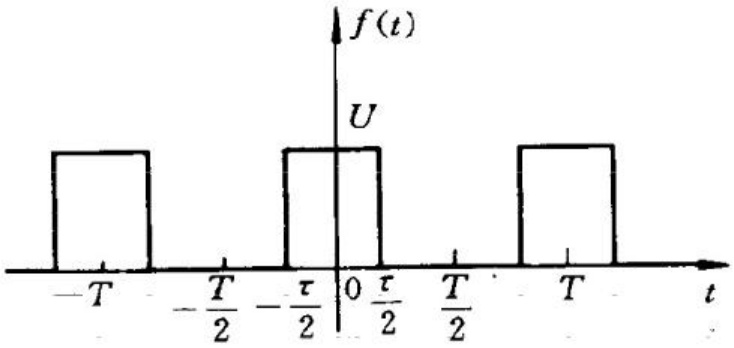

图 14-1-1 周期矩形脉冲

解 根据求  $ \dot{c}_{k} $ 的公式(14-1-5)，得

 $$ \begin{aligned}\dot{c}_{k}=&\frac{1}{T}\int_{-\frac{T}{2}}^{\frac{T}{2}}f(t)\mathrm{e}^{-\mathrm{j}k\omega_{0}t}\mathrm{d}t\\=&\frac{1}{T}\int_{-\frac{T}{2}}^{\frac{T}{2}}U\mathrm{e}^{-\mathrm{j}k\omega_{0}t}\mathrm{d}t\\=&\frac{-U\mathrm{e}^{-\mathrm{j}k\omega_{0}t}}{T}\bigg|_{-\frac{T}{2}}^{\frac{T}{2}}\\=&\frac{U}{\mathrm{j}k\omega_{0}T}(\mathrm{e}^{0.5\mathrm{j}k\omega_{0}\tau}-\mathrm{e}^{-0.5\mathrm{j}k\omega_{0}\tau})\\=&\frac{U\tau}{T}\frac{\sin\frac{k\omega_{0}\tau}{2}}{\frac{k\omega_{0}\tau}{2}}\\=&\frac{U\tau}{T}\frac{\sin\frac{k\pi\tau}{T}}{\frac{k\pi\tau}{T}}\end{aligned} $$ 

由此得出周期矩形脉冲的傅里叶级数展开式

 $$ \begin{aligned}f(t)=&\frac{U\tau}{T}\sum_{k=-\infty}^{\infty}\frac{\sin\frac{k\pi\tau}{T}}{\frac{k\pi\tau}{T}}\mathrm{e}^{\mathrm{j}k w_{0}t}\\=&\frac{U\tau}{T}\sum_{k=-\infty}^{\infty}\mathrm{Sa}\left(\frac{k\pi\tau}{T}\right)\mathrm{e}^{\mathrm{j}k w_{0}t}\end{aligned} $$ 

式中

 $$ Sa(x)=\frac{\sin x}{x} $$ 

称为采样函数。

由上面的例子可见，周期性时间信号(函数)的频谱是离散的，相邻谱线的间隔为  $ \omega_{0}=2\pi/T $，脉冲的周期愈大，则谱线愈靠近。还可以看出各次谐波分量的大小与信号的周期 T 成反比，与脉冲的宽度  $ \tau $ 成正比。而各分量的幅值按采样函数  $ S_{a}(k\pi\tau/T) $ 规律变化，当  $ k\pi\tau/T $ 等于  $ k\omega_{0}\tau/2 $ 为  $ \pm n\pi $ 时，即  $ \omega=k\omega_{0}=2n\pi/\tau $ 时，各分量的幅值为零。

下面分别讨论不同脉宽  $ \tau $ 和不同周期 T 两种情况下周期矩形脉冲信号频谱的变化规律。

(1) 设脉冲宽度  $ \tau $ 不变，而  $ T_{1}=2\tau $ 和  $ T_{2}=4\tau $

当  $ T_{1}=2\tau $ 时周期矩形脉冲的谐波的复振幅为

 $$ \dot{c}_{k}=\frac{U}{2}\frac{\sin\left(k\pi/2\right)}{\frac{k\pi}{2}} $$ 

取  $ k=0,\pm1,\pm2,\cdots $ 可得  $ c_{0}=0.5U,c_{\pm1}=0.318U\cdots $ 。其复频谱如图 14-1-2(a) 所示。由于这里的复振幅均为正、负实数，各次谐波的幅值和初相角由复频谱很容易得到。

当  $ T_{2}=4\tau $ 时，复振幅为

 $$ \dot{c}_{k}=\frac{U}{4}\frac{\sin\frac{k\pi}{4}}{\frac{k\pi}{4}} $$ 

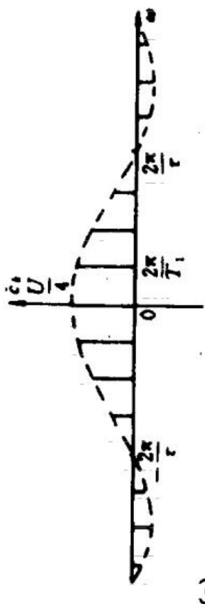

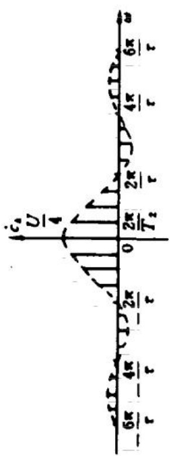

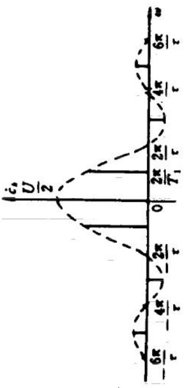

(b)

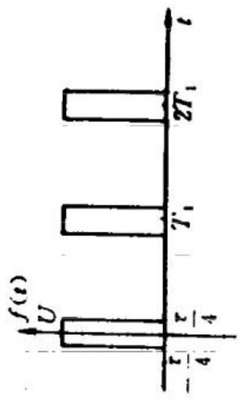

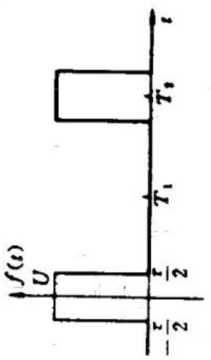

( )

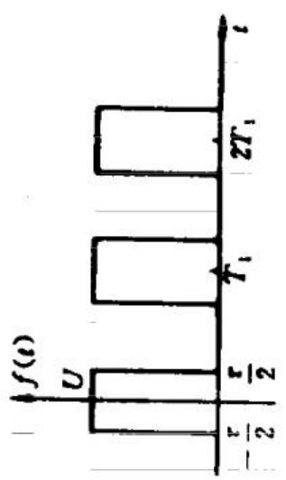

取  $ k=0,\pm1,\pm2,\cdots $ , 得  $ c_{0}=0.25U,\dot{c}_{\pm1}=0.225U,\dot{c}_{\pm2}=0.159U $ … , 其复频谱如图 14-1-2(b) 所示。

由图 14-1-2(a) 和图 14-1-2(b) 看出，当脉冲宽度  $ \tau $ 不变，而周期 T 增大时，频谱包络线零值的位置不变 ( $ \omega = 2n\pi/\tau $)，但相邻谱线的间隔变密，幅度频谱的谱线长度减小。

(2) 设周期矩形脉冲的周期  $ T_{1} $ 不变，而脉冲宽度由  $ \tau = T_{1} / 2 $ 变为  $ \tau = T_{1} / 4 $。显然由于周期  $ T_{1} $ 不变，基波频率也不变，即频谱谱线间隔也不改变，仅是频谱幅度相应减小，频谱包络线过零点的频率  $ \omega = 2n\pi / \tau $ 增高。 $ \tau = T_{1} / 4 $ 时的复频谱如图 14-1-2(c) 所示。

### 14.2 非周期性时间函数的谐波分析 ——傅里叶积分变换

本节要研究非周期性时间函数的谐波分析。

前一节里得到了周期性时间函数的傅里叶级数和它的离散频谱。与此类似，还可以对非周期性时间函数作谐波分析，并得出它们的频谱。这样的分析在概念上和应用上都与傅里叶级数的分析非常相似。下面从上一节所得的傅里叶级数导出非周期性时间函数的谐波分析公式，即傅里叶积分。

设周期性时间函数  $ f(t) $，它的周期为 T。它的傅里叶级数的指数形式为

 $$ f(t)=\sum_{k=-\infty}^{\infty}\dot{c}_{k}\mathrm{e}^{\mathrm{j}k\omega_{0}t} $$ 

式中

 $$ \begin{aligned}&\omega_{0}=\frac{2\pi}{T}\\ &\dot{c}_{k}=\frac{1}{T}\int_{-\frac{T}{2}}^{\frac{T}{2}}f(t)\mathrm{e}^{-\mathrm{j}k\omega_{0}t}\mathrm{d}t\\ \end{aligned} $$ 

将上式等号两边分别乘以周期 T，得

 $$ \dot{c}_{k}T=\int_{-\frac{T}{2}}^{\frac{T}{2}}f(t)\mathrm{e}^{-\mathrm{j}k\omega_{0}t}\mathrm{d}t $$ 

令上式等号左边项

 $$ \dot{c}_{k}T=\dot{c}_{k}\frac{2\pi}{\omega_{0}}\stackrel{\mathrm{d e f}}{=}F(\mathrm{j}k\omega_{0}) $$ 

则式 $ （14-2-2） $可改写为

 $$ F(\mathrm{j}k\omega_{0})=\int_{-\frac{T}{2}}^{\frac{T}{2}}f(t)\mathrm{e}^{-\mathrm{j}k\omega_{0}t}\mathrm{d}t $$ 

现在令  $ T \to \infty $，则基波的角频率  $ \omega_{0} $ 趋于无穷小，可用微分来表示  $ \omega_{0} $，即有  $ \omega_{0} \to \mathrm{d}\omega $。而谐波的角频率  $ k\omega_{0} $，当 k 取遍由  $ -\infty $ 至  $ \infty $ 间整数值时， $ k\omega_{0} $ 便取遍由  $ -\infty $ 至  $ \infty $ 间的任何角频率值，就成为连续变量  $ \omega $，即  $ k\omega_{0} \to \omega $。

将上面极限情况应用于式 $  (14-2-4)  $，可得

 $$ F(\mathrm{j}\omega)=\int_{-\infty}^{\infty}f(t)\mathrm{e}^{-\mathrm{j}\omega t}\mathrm{d}t $$ 

将式 $ （14-2-3） $代入式 $ （14-2-1） $中，可得

 $$ \begin{aligned}f(t)&=\sum_{k=-\infty}^{\infty}\frac{\omega_{0}F(\mathrm{j}k\omega_{0})}{2\pi}\mathrm{e}^{\mathrm{j}k\omega_{0}t}\\&=\frac{1}{2\pi}\sum_{k=-\infty}^{\infty}F(\mathrm{j}k\omega_{0})\mathrm{e}^{\mathrm{j}k\omega_{0}t}\omega_{0}\end{aligned} $$ 

当  $ \omega_{0} \rightarrow d\omega $，上面求和式的极限便成为下面的对  $ \omega $ 的积分

 $$ f(t)=\frac{1}{2\pi}\int_{-\infty}^{\infty}F(j\omega)\mathrm{e}^{j\omega t}\mathrm{d}\omega $$ 

式(14-2-5)称为  $ f(t) $ 的傅里叶正变换，常用符号  $ \mathcal{F}[f(t)] $ 来表示，即

 $$ \mathcal{F}[f(t)]=F(\mathrm{j}\omega) $$ 

式(14-2-6)称为  $ F(\mathrm{j}\omega) $ 的傅里叶反变换，常用符号  $ \mathcal{F}^{-1}[F(\mathrm{j}\omega)] $ 表示，即

 $$ \mathcal{F}^{-1}\big[F(\mathrm{j}\omega)\big]=f(t) $$ 

式 $ （14-2-5） $和式 $ （14-2-6） $称为傅里叶变换对。

式(14-2-6)是将非周期信号  $ f(t) $ 表示成频率从  $ -\infty $ 到  $ \infty $ 各指数函数分量（谐波）的和。式中  $ \frac{1}{2\pi}F(j\omega)d\omega $ 是角频率为  $ \omega $ 的谐波的幅值。而  $ F(j\omega) $ 则是单位频带宽度内谐波的复振幅，或者说是谐波的（复）振幅在  $ \omega $ 轴上的分布密度。它随  $ \omega $ 的改变而改变，表明不同频率谐波振幅密度的分布，因此，称  $ F(j\omega) $ 为非周期信号的频谱密度。频谱密度是连续变量  $ \omega $ 的函数。

频谱密度函数  $  F(j\omega)  $ 可写为

 $$ F(\mathrm{j}\omega)=|F(\mathrm{j}\omega)|\ \underline{\angle\theta(\omega)} $$ 

其中  $ \left|F(j\omega)\right| $ 是  $ F(j\omega) $ 的模，代表信号谐波振幅密度的分布；而  $ \theta(\omega) $ 是  $ F(j\omega) $ 的辐角，代表信号  $ f(t) $ 中各频率分量的相位。习惯上把  $ \left|F(j\omega)\right| $ 和  $ \theta(\omega) $ 分别称为非周期信号的幅度频谱函数和相位频谱函数。式(14-2-5)可写成

 $$ \begin{aligned}-\ F(\mathrm{j}\omega)&=\int_{-\infty}^{\infty}f(t)\mathrm{e}^{-\mathrm{j}\omega t}\mathrm{d}t\\&=\int_{-\infty}^{\infty}f(t)\cos\omega t\mathrm{d}t-\mathrm{j}\int_{-\infty}^{\infty}f(t)\sin\omega t\mathrm{d}t\\&=a(\omega)-\mathrm{j}b(\omega)\\&=\left|F(\mathrm{j}\omega)\right|\angle\theta(\omega)\end{aligned} $$ 

则有

 $$ \left|F(\mathrm{j}\omega)\right|=\sqrt{a^{2}(\omega)+b^{2}(\omega)} $$ 

 $$ \theta(\omega)=\operatorname{arctg}\frac{-b(\omega)}{a(\omega)} $$ 

显而易见，幅度频谱是  $ \omega $ 的偶函数，而相位频谱是  $ \omega $ 的奇函数。

例 14-2 求  $ f(t) $ 的频谱密度函数。

 $$ f(t)=\left\{\begin{aligned}&Ae^{-at}\quad&t>0,&\alpha>0\\ &0\quad&t<0\end{aligned}\right. $$ 

解 由傅里叶正变换式 $  (14-2-5)  $，得

 $$ \begin{aligned}F(\mathrm{j}\omega)&=\int_{-\infty}^{\infty}f(t)\mathrm{e}^{-\mathrm{j}\omega t}\mathrm{d}t\\&=\int_{0}^{\infty}A\mathrm{e}^{-\alpha t}\mathrm{e}^{-\mathrm{j}\omega t}\mathrm{d}t\\&=\int_{0}^{\infty}A\mathrm{e}^{-(\alpha+\mathrm{j}\omega)\mathrm{t}}\mathrm{d}t\\&=\frac{-A}{\alpha+\mathrm{j}\omega}\mathrm{e}^{-(\alpha+\mathrm{j}\omega)t}\bigg|_{0}^{\infty}\\&=\frac{A}{\alpha+\mathrm{j}\omega}\end{aligned} $$ 

由此可得幅频函数

 $$ \left|F(\mathrm{j}\omega)\right|=\left|\frac{A}{\alpha+\mathrm{j}\omega}\right|=\frac{A}{\sqrt{\alpha^{2}+\omega^{2}}} $$ 

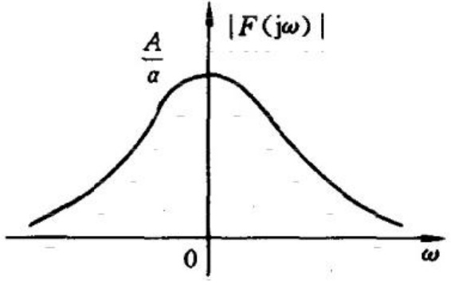

(a)

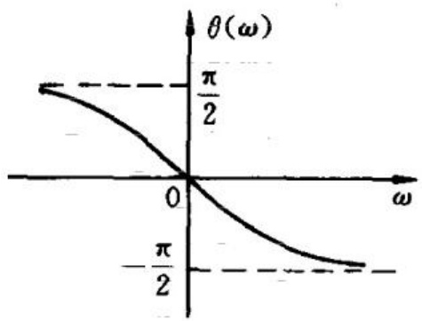

(b)

图 14-2-1  $ Ae^{-\alpha} $ 函数的幅度频谱和相位频谱   (a) 幅度频谱；(b) 相位频谱

相频函数

 $$ \theta(\omega)=-\ \mathrm{arctg}\frac{\omega}{\alpha} $$ 

以上的幅度频谱和相位频谱分别如图 14-2-1(a) 和 (b) 所示。

例 14-3 求图 14-2-2 所示单个矩形脉冲函数的频谱函数。

解 由傅里叶正变换式 $  (14-2-5)  $，得

 $$ \begin{aligned}F(\mathrm{j}\omega)=&\int_{-\infty}^{\infty}f(t)\mathrm{e}^{-\mathrm{j}\omega t}\mathrm{d}t\\=&U\int_{-\frac{\tau}{2}}^{\frac{\tau}{2}}\mathrm{e}^{-\mathrm{j}\omega t}\mathrm{d}t\\=&-\left.\frac{U}{\mathrm{j}\omega}\mathrm{e}^{-\mathrm{j}\omega t}\right|_{-\frac{\tau}{2}}^{\frac{\tau}{2}}\\=&U\tau\frac{\sin\frac{\omega\tau}{2}}{\frac{\omega\tau}{2}}\end{aligned} $$ 

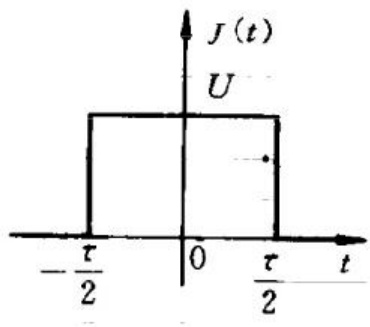

图 14-2-2 单个矩形脉冲函数

其频谱如图 14-2-3 所示。它的形状与例 14-1 周期矩形脉冲信号的频谱的包络线相同，只不过在非周期信号情形下，其频谱是连续

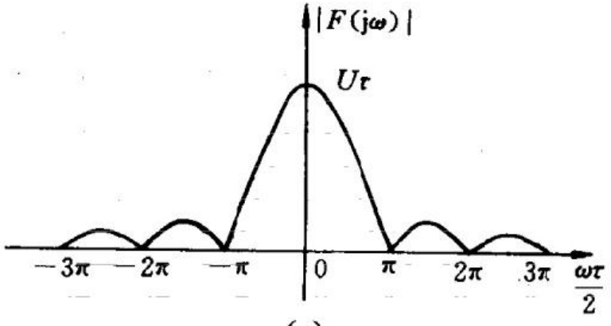

(a)

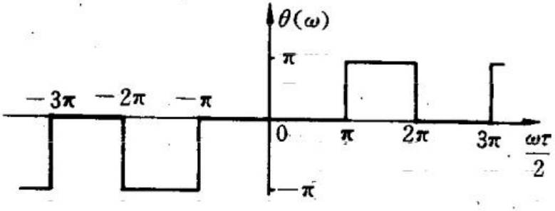

(b)

图 14-2-3 单个矩形脉冲的频谱

(a) 幅度频谱；(b) 相位频谱

的，这表明了非周期信号包含从零到无穷大的所有频率分量。

最后要指出,以上导出傅里叶变换的方法在数学上不是严格的。函数  $ f(t) $ 须满足一定的条件,它的傅里叶变换才存在。在区间  $ (-\infty, \infty) $ 满足狄里赫利条件的时间函数  $ f(t) $, 它的傅里叶变换存在的充分条件是  $ f(t) $ 在  $ (-\infty, \infty) $ 上绝对可积, 即

 $$ \int_{-\infty}^{\infty}\left|f(t)\right|\mathrm{d}t<\infty $$ 

在引入了广义函数如单位冲激函数和单位阶跃函数后,有些不满足上述条件的函数的傅里叶变换也存在,这里不作深入讨论。

### 14.3 傅里叶变换在电路分析中的应用

在第 12 章中已经讨论了线性电路在非正弦周期激励下电路的稳态响应。周期激励是无始无终的，可以认为激励在  $ t = -\infty $ 时就接入电路，在  $ t = \infty $ 时才结束，这样的激励在电路中产生的响应是稳态响应。在第 12 章中所研究的分析周期性非正弦激励在线性电路中产生的稳态响应的方法可以用来分析非周期性激励在线性电路中产生的动态过程。

假设有一个从  $ t = -\infty $ 至  $ t = \infty $ 都在电路中作用的正弦波形激励（例如电压源或电流源），它在线性电路中产生的稳态响应是容易求得的。如果有一个周期性非正弦激励，用傅里叶级数将它展开为一系列正弦形激励之和，分别计算每一谐波的激励在线性电路中产生的稳态响应，根据叠加定理，就可求出这周期性非正弦激励所产生的稳态响应。

对于一个非周期性激励  $ f(t) $，假定它的傅里叶变换存在，便可以求出它的频谱函数  $ F(j\omega) $。 $ f(t) $ 中的频率在  $ \omega $ 到  $ \omega + d\omega $ 间的谐波的复振幅是  $ \frac{1}{2\pi}F(j\omega)d\omega $（它与傅里叶级数中的  $ c_{k} $ 对应），而在

此无限小的频率区间的谐波即为 $ \left[\frac{1}{2\pi}F(j\omega)d\omega\right]e^{j\omega t} $（它与傅里叶级数中的 $ \dot{c}_{k}e^{jk\omega_{0}t} $对应）。要求激励 $ f(t) $在线性电路中产生的响应，也可以分别求出不同频率的谐波激励在线性电路中所产生的稳态响应，再根据叠加定理，就可以求出非周期性激励所产生的响应，这样的响应是电路的零状态响应。

结合下面的例子来阐述用傅里叶变换分析非周期性激励在线性电路中所产生的动态过程的方法。

例 14-4 设有 RC 电路接至电压为  $ u_{S}(t)=U\mathrm{e}^{-\alpha t}\varepsilon(t) $ 的电压源（图 14-3-1），求电容电压  $ u_{C}(t),t>0 $。

解 用傅里叶积分公式  $ (14-2-5) $，求得  $ u_{S}(t) $ 的频谱函数为

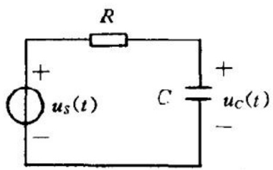

 $$ U_{S}(\mathrm{j}\omega)=\int_{-\infty}^{\infty}u_{S}(t)\mathrm{e}^{-\mathrm{j}\omega t}\mathrm{d}t $$ 

图 14-3-1 例 14-4 用图

在例 14-2 中已求得

 $$ U_{s}(j\omega)=\frac{U}{\alpha+j\omega} $$ 

根据  $ u_{s}(t) $ 的频谱函数  $ U_{s}(j\omega) $，用分析线性电路正弦稳态的方法即可得  $ u_{c}(t) $ 的频谱函数  $ U_{c}(j\omega) $

 $$ U_{c}(\mathrm{j}\omega)=\frac{\frac{1}{\mathrm{j}\omega C}}{R+\frac{1}{\mathrm{j}\omega C}}U_{s}(\mathrm{j}\omega)=\frac{U}{(\alpha+\mathrm{j}\omega)(1+\mathrm{j}\omega RC)} $$ 

将所有的谐波相加即得  $ u_{C}(t) $，这一求和即为  $ U_{C}(j\omega) $ 的傅里叶反变换

 $$ \begin{aligned}u_{c}(t)=&\frac{1}{2\pi}\int_{-\infty}^{\infty}U_{c}(\mathrm{j}\omega)\mathrm{e}^{\mathrm{i}\omega t}\mathrm{d}\omega\\=&\frac{1}{2\pi}\int_{-\infty}^{\infty}\frac{U}{RC(\alpha+\mathrm{j}\omega)\left(\frac{1}{RC}+\mathrm{j}\omega\right)}\mathrm{e}^{\mathrm{i}\omega t}\mathrm{d}\omega\end{aligned} $$ 

将上式被积函数中的分式化为简单分式，有

 $$ \begin{aligned}&\frac{1}{RC(\alpha+j\omega)\left(\frac{1}{RC}+j\omega\right)}\\=&\frac{1}{(1-\alpha RC)}\left[\frac{1}{\alpha+j\omega}-\frac{1}{\left(\frac{1}{RC}+j\omega\right)}\right]\end{aligned} $$ 

由例 14-2 中的结果

 $$ \mathcal{F}^{-1}\left[\frac{1}{\alpha+\mathrm{j}\omega}\right]=\mathrm{e}^{-\alpha t}\varepsilon(t) $$ 

即可得到  $ \mathcal{F}^{-1}[U_c(j\omega)] $ 为

 $$ u_{\mathrm{C}}(t)=\frac{U}{1-\alpha R C}\left(\mathrm{e}^{-\alpha t}-\mathrm{e}^{-\frac{t}{R C}}\right)\varepsilon(t) $$ 

这就是图 14-3-1 所示电路中  $ u_{C}(t) $ 的表达式，它是在所给定激励下电路的零状态响应。如果  $ \alpha \to 0 $，就得到我们熟知的结果  $ u_{C}(t) = U(1 - e^{-\frac{t}{RC}}) \varepsilon(t) $。

由上面的例子可以看出,用傅里叶变换分析线性电路的零状态响应的方法与前一章里用傅里叶级数分析线性电路的正弦稳态响应的方法是相同的。这是由于在傅里叶变换中将非周期性时间函数分解成无穷多个存在于全部时间域 $ (-∞,∞) $的谐波,用分析正弦稳态电路的方法求出这无穷多个正弦频率分量在电路中产生的正弦稳态响应,把这些稳态响应进行叠加就得到电路在非周期性激励作用下的动态响应。用傅里叶变换分析线性电路得到的是电路对给定激励的零状态响应。

傅里叶变换在理论和应用上都有着丰富的内容。用这一变换方法分析激励(信号)在线性电路中的作用，可建立起电路在稳态下的频率特性和在动态下的性状的联系，所以这一方法成为在线性电路和系统研究中广泛使用的频域方法的基础。

下面以这一变换方法为基础引入拉普拉斯变换。

### 14.4 拉普拉斯变换

在电路分析中,如果把电路中动态过程的起始时刻作为计时的原点 $ t=0 $,那么,只需要研究电路中变量(函数)在 $ t $为 $ [0,\infty) $区间的情形,而无须考虑它们在 $ t $为 $ (-∞,0) $区间的情形。这使我们在研究电路问题时,可以限定于研究定义在区间 $ 0≤t<\infty $的函数 $ f(t) $。这相当于把所有被研究的函数 $ f(t) $,都乘以单位阶跃函数,即

 $$ f(t)\boldsymbol{\varepsilon}(t)=\left\{\begin{aligned}&f(t)&&0\leqslant t<\infty\\ &0&&-\infty<t<0\end{aligned}\right. $$ 

对于上述时间函数  $ f(t) $，用一因子  $ e^{-\alpha t} $ 与之相乘，选择适当的  $ \sigma(\sigma > \sigma_{0}, \sigma_{0} $ 为一实数)，使得  $ f(t)e^{-\alpha t} $ 在  $ [0, \infty) $ 区间内绝对可积，则乘积  $ f(t)e^{-\alpha t} $ 的傅里叶变换存在而为

 $$ \begin{aligned}F(\mathrm{j}\omega)=&\int_{0^{-}}^{\infty}f(t)\mathrm{e}^{-\sigma t}\mathrm{e}^{-\mathrm{j}\omega t}\mathrm{d}t\\=&\int_{0^{-}}^{\infty}f(t)\mathrm{e}^{-\left(\sigma+\mathrm{j}\omega\right)t}\mathrm{d}t\end{aligned} $$ 

由于前面已约定对于  $ t<0, f(t)=0 $ ，又为了把 t=0 时可能有的冲激函数也包含在被积函数中，所以上式中的积分下限取为  $ 0^{-} $ 。

上式的积分结果中不出现时间变量 t，它仅是复变量  $ s = \sigma + j\omega $ 的函数，可将上式写成

 $$ F(s)=\int_{0}^{+\infty}f(t)\mathrm{e}^{-st}\mathrm{d}t $$ 

式(14-4-1)给出的变换  $ F(s) $ 称为  $ f(t) $ 的拉普拉斯变换。给定一个时间函数  $ f(t) $，用该式便可得到一个  $ F(s) $，称  $ F(s) $ 为  $ f(t) $ 的象函数；称  $ f(t) $ 为  $ F(s) $ 的原函数。这里的  $ s = \sigma + j\omega $ 称为复频率。

对  $ F(s) $ 进行傅里叶反变换，有

 $$ f(t)\mathrm{e}^{-\sigma t}=\frac{1}{2\pi}\int_{-\infty}^{\infty}F(s)\mathrm{e}^{\mathrm{j}\omega t}\mathrm{d}\omega $$ 

将上式两边同乘  $ e^{\alpha} $，并将右边的这一因子放在积分号内，得

 $$ \begin{aligned}f(t)=&\frac{1}{2\pi}\int_{-\infty}^{\infty}F(s)\mathrm{e}^{(\sigma+\mathrm{j}\omega)t}\mathrm{d}\omega\\=&\frac{1}{2\pi\mathrm{j}}\int_{C-\mathrm{j}\infty}^{C+\mathrm{j}\infty}F(s)\mathrm{e}^{s t}\mathrm{d}s\end{aligned} $$ 

式(14-4-2)称为 $ F(s) $的拉普拉斯反变换。其中的C是一常数， $ C>\sigma_{0} $， $ \mathrm{Re}(s)=\sigma>\sigma_{0} $。根据此式，可从已知的 $ F(s) $求出它的原函数。

式(14-4-1)和式(14-4-2)是拉普拉斯变换对,常用符号“ $ \mathcal{L} $”表示拉普拉斯变换,写作

 $$ \begin{aligned}&F(s)=\mathcal{L}[f(t)]\\&f(t)=\mathcal{L}^{-1}[F(s)]\\ \end{aligned} $$ 

最后简单地说明拉普拉斯变换的存在性。对于  $ f(t) $ 若  $ \sigma $ 大于某一实数  $ \sigma_{0} $，即  $ \sigma > \sigma_{0} $，积分  $ \int_{0}^{\infty} |f(t)e^{-\sigma t}| \, dt $ 收敛， $ f(t) $ 的拉普拉斯变换就存在，就可以对它作拉普拉斯变换，而  $ \sigma_{0} $ 是使积分  $ \int_{0}^{\infty} |f(t)e^{-\sigma t}| \, dt $ 收敛的最小实数。不同的函数， $ \sigma_{0} $ 的值不同，称  $ \sigma_{0} $ 为  $ F(s) $ 在复平面  $ s = \sigma + j\omega $ 内的收敛横坐标。

在电路问题中常见的函数(实际的信号)一般是指数阶函数。指数阶函数是指满足

 $$ \left|f(t)\right|\leqslant M\mathrm{e}^{c_{t}}\quad t\in\left[0,\infty\right) $$ 

的函数,其中 M 是正实数,C 为有限值的实数。当函数  $ f(t) $ 是指数阶函数时,则有

 $$ \begin{aligned}\int_{0^{-}}^{\infty}\left|f(t)\right|\mathrm{e}^{-\sigma t}\mathrm{d}t\leqslant&\int_{0^{-}}^{\infty}M\mathrm{e}^{C_{t}}\mathrm{e}^{-\sigma t}\mathrm{d}t\\=&\frac{M}{\sigma-C}\qquad(\sigma>C)\end{aligned} $$ 

可见只要选择  $ \sigma > C $，则  $ f(t)e^{-\sigma t} $ 的绝对积分就存在，就可以对它进

行拉普拉斯变换。对具有发散性的指数阶函数，如  $ f(t)=\mathrm{e}^{5t} $，总可选择  $ \sigma>5 $，使  $ \mathrm{e}^{5t}\mathrm{e}^{-\sigma t} $ 为随时间衰减的函数，当  $ t\to\infty $ 时，它的极限为零，所以可对它作拉普拉斯变换。在数学中还有一些函数如  $ t^{\prime}\varepsilon(t) $， $ \mathrm{e}^{t^{2}}\varepsilon(t) $，比指数函数增长得更快，它们的拉普拉斯变换不存在，但这样的函数并没有实际的意义。

### 14.5 一些常用函数的拉普拉斯变换

在本节里按拉普拉斯变换的定义式(14-4-1)导出一些常用函数的拉普拉斯变换式，这些函数在电路分析中占有重要的地位。

(1) 指数函数  $ f(t)=\mathrm{e}^{-at}\varepsilon(t) $  $ \alpha $ 为实数

 $$ \begin{aligned}F(s)&=\mathcal{L}\left[\mathrm{e}^{-a t}\varepsilon(t)\right]=\int_{0^{-}}^{\infty}\mathrm{e}^{-a t}\mathrm{e}^{-s t}\mathrm{d}t\\&=\int_{0^{-}}^{\infty}\mathrm{e}^{-(s+a)t}\mathrm{d}t=-\left.\frac{\mathrm{e}^{-(\sigma+a)t}\mathrm{e}^{-\mathrm{j}\omega t}}{s+\alpha}\right|_{0^{-}}^{\infty}\\&=\frac{1}{s+\alpha}\qquad\sigma>\sigma_{0}=-\alpha\end{aligned} $$ 

容易证明当  $ \alpha $ 为复数值时，这一变换式亦成立。

(2) 单位阶跃函数  $  f(t) = \varepsilon(t)  $

 $$ \begin{aligned}F(s)&=\mathcal{L}\big[\boldsymbol{\varepsilon}(t)\big]=\int_{0^{-}}^{\infty}\mathbf{e}^{-s t}\boldsymbol{\varepsilon}(t)\mathrm{d}t=\int_{0^{+}}^{\infty}\mathbf{e}^{-s t}\mathrm{d}t\\&=-\left.\frac{1}{s}\mathbf{e}^{-s t}\right|_{0^{+}}^{\infty}=\frac{1}{s}\qquad\sigma>\sigma_{0}=0\end{aligned} $$ 

或令指数函数  $ \mathrm{e}^{-\alpha t}\varepsilon(t) $ 中的  $ \alpha=0 $，这样的指数函数就是单位阶跃函数。令此指数函数的象函数中的  $ \alpha=0 $，就得到单位阶跃函数的象函数为

 $$ F(s)=\mathcal{L}\big[\varepsilon(t)\big]\simeq\frac{1}{s}\;.\quad\sigma>\sigma_{0}=0 $$ 

(3) 单位冲激函数  $ f(t)=\delta(t) $

 $$ \begin{aligned}F(s)&=\mathcal{L}[\delta(t)]=\int_{0}^{+\infty}\delta(t)\mathrm{e}^{-st}\mathrm{d}t\\&=\int_{0}^{0^{+}}\delta(t)\mathrm{e}^{-st}\mathrm{d}t=1\quad\sigma>\sigma_{0}=-\infty\end{aligned} $$ 

(4)  $ t^n \varepsilon(t) $ n 为正整数

 $$ \begin{aligned}F(s)&=\mathcal{L}\left[t^{n}\boldsymbol{\epsilon}(t)\right]=\int_{0^{-}}^{\infty}t^{n}\mathrm{e}^{-st}\mathrm{d}t\\&=-\left.\frac{1}{s}t^{n}\mathrm{e}^{-st}\right|_{0^{-}}^{\infty}+\left.\frac{n}{s}\int_{0^{-}}^{\infty}t^{n-1}\mathrm{e}^{-st}\mathrm{d}t\right.\\&=\frac{n}{s}\int_{0^{-}}^{\infty}t^{n-1}\mathrm{e}^{-st}\mathrm{d}t\end{aligned} $$ 

则

 $$ \mathcal{L}\big[t^{n}\varepsilon(t)\big]=\frac{n}{s}\mathcal{L}\big[t^{n-1}\varepsilon(t)\big] $$ 

当n=1时  $ \mathcal{L}[t\varepsilon(t)]=\frac{1}{s^{2}}\quad\sigma>\sigma_{0}=0 $

n=2 时  $ \mathcal{L}[t^{2}\varepsilon(t)]=\frac{2}{s^{3}}\quad\sigma>\sigma_{0}=0 $

依次类推，得

 $$ \mathcal{L}\big[t^{n}\varepsilon(t)\big]=\frac{n!}{s^{n+1}}\qquad\sigma>\sigma_{0}=0 $$ 

表 4-5-1 中列出了一些常用函数的拉普拉斯变换式，前几个已在上面导出，其它的也可以像上面那样由拉普拉斯变换的定义求得，在下节里根据拉普拉斯变换的性质却可更方便地导出。

表 4-5-1 一些常用函数的拉普拉斯变换

<table border=1 style='margin: auto; word-wrap: break-word;'><tr><td style='text-align: center; word-wrap: break-word;'>$ f(t) $</td><td style='text-align: center; word-wrap: break-word;'>$ F(s) $</td></tr><tr><td style='text-align: center; word-wrap: break-word;'>$ \delta(t) $</td><td style='text-align: center; word-wrap: break-word;'>1</td></tr><tr><td style='text-align: center; word-wrap: break-word;'>$ \epsilon(t) $</td><td style='text-align: center; word-wrap: break-word;'>$ \frac{1}{s} $</td></tr></table>

<table border=1 style='margin: auto; word-wrap: break-word;'><tr><td style='text-align: center; word-wrap: break-word;'>f(t)</td><td style='text-align: center; word-wrap: break-word;'>F(s)</td></tr><tr><td style='text-align: center; word-wrap: break-word;'>e^{-at}</td><td style='text-align: center; word-wrap: break-word;'>$ \frac{1}{s + \alpha} $</td></tr><tr><td style='text-align: center; word-wrap: break-word;'>t^{n}(n 是正整数)</td><td style='text-align: center; word-wrap: break-word;'>$ \frac{n!}{s^{n+1}} $</td></tr><tr><td style='text-align: center; word-wrap: break-word;'>sin $ \omega t $</td><td style='text-align: center; word-wrap: break-word;'>$ \frac{\omega}{s^{2} + \omega^{2}} $</td></tr><tr><td style='text-align: center; word-wrap: break-word;'>cos $ \omega t $</td><td style='text-align: center; word-wrap: break-word;'>$ \frac{s}{s^{2} + \omega^{2}} $</td></tr><tr><td style='text-align: center; word-wrap: break-word;'>e^{-at}sin $ \omega t $</td><td style='text-align: center; word-wrap: break-word;'>$ \frac{\omega}{(s + \alpha)^{2} + \omega^{2}} $</td></tr><tr><td style='text-align: center; word-wrap: break-word;'>e^{-at}cos $ \omega t $</td><td style='text-align: center; word-wrap: break-word;'>$ \frac{s + \alpha}{(s + \alpha)^{2} + \omega^{2}} $</td></tr><tr><td style='text-align: center; word-wrap: break-word;'>te^{-at}</td><td style='text-align: center; word-wrap: break-word;'>$ \frac{1}{(s + \alpha)^{2}} $</td></tr><tr><td style='text-align: center; word-wrap: break-word;'>t^{n}e^{-at}(n 是正整数)</td><td style='text-align: center; word-wrap: break-word;'>$ \frac{n!}{(s + \alpha)^{n+1}} $</td></tr></table>

* 对表中的  $ f(t) $ 均有或设有  $ f(t)=0 $ (当 t<0)。

### 14.6 拉普拉斯变换的基本性质

14.4 节得出了拉普拉斯变换式, 即式(14-4-1)的由原函数  $ f(t) $ 求象函数  $ F(s) $ 的式子和式(14-4-2) 的由象函数  $ F(s) $ 求原函数  $ f(t) $ 的式子。现在研究拉普拉斯变换的一些基本性质, 这些性质对于了解拉普拉斯变换是重要的, 在应用拉普拉斯变换时将可带来许多方便。

### 1. 线性性质

若  $ \mathcal{L}[f_{1}(t)]=F_{1}(s) $;  $ \mathcal{L}[f_{2}(t)]=F_{2}(s) $，则对任意常数  $ k_{1} $， $ k_{2} $，下式成立：

 $$ \mathcal{L}\left[k_{1}f_{1}(t)+k_{2}f_{2}(t)\right]=k_{1}F_{1}(s)+k_{2}F_{2}(s) $$ 

这一性质表明拉普拉斯变换是线性变换。根据这一性质便有：一个原函数的常数倍的拉普拉斯变换等于此原函数的象函数乘以同一常数；两个原函数的和的拉普拉斯变换等于这两个原函数的象函数之和。

线性性质可根据拉普拉斯变换的定义证明如下：

 $$ \begin{aligned}\mathcal{L}\big[k_{1}f_{1}(t)+k_{2}f_{2}(t)\big]&=\int_{0^{-}}^{\infty}\big[k_{1}f_{1}(t)+k_{2}f_{2}(t)\big]\mathrm{e}^{-st}\mathrm{d}t\\&=k_{1}\int_{0^{-}}^{\infty}f_{1}(t)\mathrm{e}^{-st}\mathrm{d}t+k_{2}\int_{0^{-}}^{\infty}f_{2}(t)\mathrm{e}^{-st}\mathrm{d}t\\&=k_{1}F_{1}(s)+k_{2}F_{2}(s)\end{aligned} $$ 

例 14-5 求  $ f(t)=\sin\omega t\varepsilon(t) $ 的拉普拉斯变换。

解 将  $ \sin\omega t $ 写为指数形式

 $$ f(t)=\sin\omega t\,\varepsilon(t)=\frac{1}{2\mathrm{j}}(\mathrm{e}^{\mathrm{j}\omega t}-\mathrm{e}^{-\mathrm{j}\omega t})\,\varepsilon(t) $$ 

又

 $$ \mathcal{L}\left[\mathrm{e}^{\mathrm{j}\omega t}\varepsilon(t)\right]=\frac{1}{s-\mathrm{j}\omega} $$ 

 $$ \mathcal{L}\left[\mathrm{e}^{-\mathrm{j}\omega t}\varepsilon(t)\right]=\frac{1}{s+\mathrm{j}\omega} $$ 

根据线性性质,可得

 $$ \begin{aligned}\mathcal{L}[\sin\omega t\;\varepsilon(t)]=&\frac{1}{2\mathrm{j}}\left(\frac{1}{s-\mathrm{j}\omega}-\frac{1}{s+\mathrm{j}\omega}\right)\\=&\frac{\omega}{s^{2}+\omega^{2}}\end{aligned} $$ 

同样可得

 $$ \mathcal{L}\left[\cos\omega t\varepsilon(t)\right]=\frac{s}{s^{2}+\omega^{2}} $$ 

2. 原函数的微分性质

若  $ \mathcal{L}[f(t)]=F(s) $，则

 $$ \mathcal{L}\left[\frac{\mathrm{d}f(t)}{\mathrm{d}t}\right]=s F(s)-f(0^{-}) $$ 

即原函数  $ f(t) $ 对 t 的导数的拉普拉斯变换等于  $ f(t) $ 的象函数  $ F(s) $ 乘以 s，减去原函数  $ f(t) $ 在  $ t=0^{-} $ 时的值  $ f(0^{-}) $。证明如下：按拉普拉斯变换的定义

 $$ \mathcal{L}\Big[\frac{\mathrm{d}f(t)}{\mathrm{d}t}\Big]=\int_{0^{-}}^{\infty}\frac{\mathrm{d}f(t)}{\mathrm{d}t}\mathrm{e}^{-st}\mathrm{d}t $$ 

用分部积分公式, 将上式写作

 $$ \mathcal{L}\left[\frac{\mathrm{d}f(t)}{\mathrm{d}t}\right]=f(t)\mathrm{e}^{-st}\bigg|_{0}^{\infty}-\int_{0}^{\infty}f(t)(-\mathrm{s})\mathrm{e}^{-st}\mathrm{d}t $$ 

上式中的第一项，当以上限  $ t=\infty $ 代入时，其值为零，因为 s 的实部  $ \sigma $ 总可以取得足够大，当  $ t\to\infty $ 时，使  $ f(t)\mathrm{e}^{-\sigma t} $ 趋于零；当以下限 t=0 代入时，其值为  $ f(0^{-}) $。上式中的第二项等于  $ sF(s) $，于是得

 $$ \mathcal{L}\left[\frac{\mathrm{d}f(t)}{\mathrm{d}t}\right]=s F(s)-f(0^{-}) $$ 

重复运用这一结果,可得

 $$ \begin{aligned}\mathcal{L}\Big[\frac{\mathrm{d}^{2}f(t)}{\mathrm{d}t^{2}}\Big]=&s\big[sF(s)-f(0^{-})\big]-f^{\prime}(0^{-})\\=&s^{2}F(s)-s f(0^{-})-f^{\prime}(0^{-})\\&\vdots\end{aligned} $$ 

 $$ \begin{aligned}{\mathcal{L}\Big[\frac{\mathrm{d}^{n}f(t)}{\mathrm{d}t^{n}}\Big]=}&{{}s^{n}F(s)-s^{n-1}f(0^{-})-s^{n-2}f^{\prime}(0^{-})-\cdots}\\ {}&{{}-s f^{(n-2)}(0^{-})-f^{(n-1)}(0^{-})}\\ \end{aligned} $$ 

式中  $ f^{(k)}(0^{-})(k=0,1,\cdots,n-1) $ 是  $ f(t) $ 的 k 阶导数的初值。若  $ f'(0^{-})=0, f''(0^{-})=0, \cdots, f^{(n-1)}(0^{-})=0 $，则有

 $$ \begin{aligned}&\mathcal{L}[f^{\prime}(t)]=sF(s)\\&\mathcal{L}[f^{\prime \prime}(t)]=s^{2}F(s)\\&\cdots\cdots\cdots\cdots\\&\mathcal{L}[f^{(n)}(t)]=s^{n}F(s)\\ \end{aligned} $$ 

例 14-6 已知  $ \mathcal{L}[\varepsilon(t)] = \frac{1}{s} $，求  $ \mathcal{L}[\delta(t)] $。

解 由于  $ \delta(t)=\frac{\mathrm{d}}{\mathrm{d}t}\varepsilon(t) $，又  $ \varepsilon(t)\bigg|_{t=0^{-}}=0 $，得

 $$ \mathcal{L}\left[\delta(t)\right]=s\frac{1}{s}=1 $$ 

例 14-7 已知  $ \mathcal{L}[\sin\omega t\varepsilon(t)]=\frac{\omega}{s^{2}+\omega^{2}} $，求  $ \mathcal{L}[\cos\omega t\varepsilon(t)] $。

解 由于

 $$ \begin{aligned}\frac{\mathrm{d}}{\mathrm{d}t}\big[\sin\omega t\varepsilon(t)\big]&=\omega\cos\omega t\varepsilon(t)+\sin\omega t\delta(t)\\&=\omega\cos\omega t\varepsilon(t)\end{aligned} $$ 

则

 $$ \begin{aligned}\mathcal{L}[\cos\omega t\ \varepsilon(t)]=&\frac{1}{\omega}\mathcal{L}\bigg[\frac{\mathrm{d}}{\mathrm{d}t}(\sin\omega t\ \varepsilon(t))\bigg]\\=&\frac{s}{s^{2}+\omega^{2}}-\left.\sin\omega t\ \varepsilon(t)\right|_{0^{-}}\\=&\frac{s}{s^{2}+\omega^{2}}\end{aligned} $$ 

### 3. 原函数的积分性质

若  $ \mathcal{L}[f(t)]=F(s) $，则

 $$ \mathcal{L}\left[\int_{0}^{t}f(\tau)\mathrm{d}\tau\right]=\frac{F(s)}{s} $$ 

这一性质表明  $ \int_{0}^{t}f(\tau)d\tau $ 的拉普拉斯变换等于  $ f(t) $ 的拉普拉斯变换  $ F(s) $ 除以 s。利用原函数的微分性质很容易作出这一性质的证明。证明如下：

记  $ \mathcal{L}\left[\int_{0}^{t}f(\tau)\mathrm{d}\tau\right]=G(s) $，则其导数  $ \frac{\mathrm{d}}{\mathrm{d}t}\left[\int_{0}^{t}f(\tau)\mathrm{d}\tau\right] $ 的拉普拉斯变换，按微分性质

 $$ \mathcal{L}\left[\frac{\mathrm{d}}{\mathrm{d}t}\int_{0}^{t}f(\tau)\mathrm{d}\tau\right]=sG(S)-\int_{0}^{t}f(\tau)\mathrm{d}\tau\bigg|_{t=0} $$ 

上式中的等号右边第二项显然为零，等号左边

 $$ \mathcal{L}\left[\frac{\mathrm{d}}{\mathrm{d}t}\int_{0}^{t}f(\tau)\mathrm{d}\tau\right]=\mathcal{L}\left[f(t)\right]=F(s) $$ 

于是得

 $$ G(s)=\frac{F(s)}{s} $$ 

即

 $$ \mathcal{L}\left[\int_{0}^{t}f(\tau)\mathrm{d}\tau\right]=\frac{F(s)}{s} $$ 

例 14-8 已知  $ \mathcal{L}[\varepsilon(t)] = \frac{1}{s} $，求  $ \mathcal{L}[t\varepsilon(t)] $。

解 由于

 $$ t\varepsilon(t)=\int_{0}^{t}\varepsilon(\tau)\mathrm{d}\tau $$ 

可得

 $$ \begin{aligned}\mathcal{L}\big[t\boldsymbol{\varepsilon}(t)\big]&=\mathcal{L}\Big[\int_{0}^{t}\boldsymbol{\varepsilon}(\tau)\mathrm{d}\tau\Big]\\&=\frac{1}{s}\frac{1}{s}=\frac{1}{s^{2}}\end{aligned} $$ 

### 4. 延时(时域平移)性质

若  $ \mathcal{L}[f(t)]=F(s) $，则对任何  $ t_{0}>0 $，有

 $$ \mathcal{L}\big[f(t-t_{0})\epsilon(t-t_{0})\big]=\mathrm{e}^{-s t_{0}}F(s) $$ 

此式中  $ f(t-t_{0})\varepsilon(t-t_{0}) $ 是以  $ t-t_{0} $ 代替  $ f(t)\varepsilon(t) $ 中的 t 所得的时间函数。 $ f(t-t_{0})\varepsilon(t-t_{0}) $ 在  $ t=t_{1}+t_{0} $ 时的数值与  $ f(t)\varepsilon(t) $ 在  $ t_{1} $ 时的数值相等。从图象上看  $ f(t-t_{0})\times\varepsilon(t-t_{0}) $ 的波形就是将  $ f(t)\varepsilon(t) $ 的波形向右推移  $ t_{0} $ 后所得的波形（见图 14-6-1）。

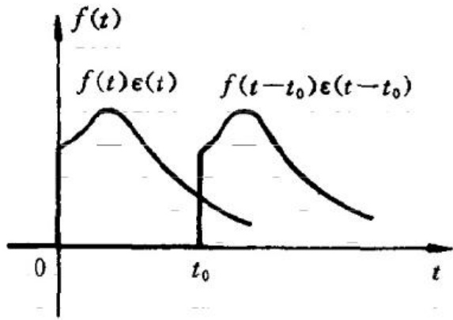

图 14-6-1  $ f(t)\varepsilon(t) $ 函数的平移

延时性质表明  $  f(t - t_{0}) \varepsilon(t - t_{0})  $ 的拉普拉斯变换就等于  $  f(t)  $ 的拉普拉斯变换  $  F(s)  $ 乘以  $  e^{-st_{0}}  $ 。这一性质可以证明如下：

 $$ \begin{aligned}{}&{{}\mathcal{L}[f(t-t_{0})\varepsilon(t-t_{0})]}\\ {=}&{{}\int_{0}^{+\infty}f(t-t_{0})\varepsilon(t-t_{0})\mathrm{e}^{-s t}\mathrm{d}t}\\ {=}&{{}\int_{t_{0}}^{+\infty}f(t-t_{0})\mathrm{e}^{-s(t-t_{0})}\mathrm{e}^{-s t_{0}}\mathrm{d}t}\\ \end{aligned} $$ 

令  $ \tau = t - t_{0} $，则  $ t = \tau + t_{0} $，代入上式得

 $$ \begin{aligned}{}&{{}\mathcal{L}[f(t-t_{0})\varepsilon(t-t_{0})]}\\ {=}&{{}\mathrm{e}^{-s t_{0}}\int_{0}^{+\infty}f(\tau)\mathrm{e}^{-s\tau}\mathrm{d}\tau}\\ {=}&{{}\mathrm{e}^{-s t_{0}}F(s)}\\ \end{aligned} $$ 

例 14-9 求图 14-6-2 所示的函数  $ f(t) $ 的拉普拉斯变换式。

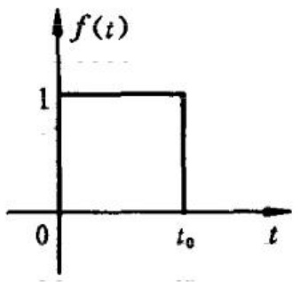

图 14-6-2 例 14-9 用图

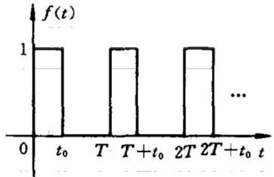

图 14-6-3 周期矩形脉冲函数

解 函数  $ f(t) $ 可以看成由单位阶跃函数  $ \varepsilon(t) $ 和延时的单位阶跃函数  $ \varepsilon(t-t_{0}) $ 之差，即

 $$ f(t)=\varepsilon(t)-\varepsilon(t-t_{0}) $$ 

于是，有

 $$ \begin{aligned}\mathcal{L}[f(t)]=&\mathcal{L}[\varepsilon(t)-\varepsilon(t-t_{0})]\\=&\frac{1}{s}-\frac{1}{s}\mathrm{e}^{-s t_{0}}\end{aligned} $$ 

 $$ \begin{aligned}=(1-\mathrm{e}^{-st_{0}})\frac{1}{s}\end{aligned} $$ 

例 14-10 求图 14-6-3 所示周期矩形脉冲函数  $ f(t) $ 的拉普拉斯变换式。

解 设周期矩形脉冲函数  $ f(t) $ 在  $ 0 < t \leq T $ 时间区间的函数为  $ f_{1}(t)\varepsilon(t) $，则  $ f(t) $ 可写为

 $$ \begin{aligned}f(t)=&f_{1}(t)\varepsilon(t)+f_{1}(t-T)\varepsilon(t-T)+\\&\cdots\quad f_{1}(t-2T)\varepsilon(t-2T)+\cdots\end{aligned} $$ 

若

 $$ \mathcal{L}\big[f_{1}(t)\varepsilon(t)\big]=F_{1}(s) $$ 

由拉普拉斯变换的延时性质和线性性质, 得  $ f(t) $ 的拉普拉斯变换  $ F(s) $ 为

 $$ \begin{aligned}F(s)&=F_{1}(s)+F_{1}(s)\mathrm{e}^{-sT}+F_{1}(s)\mathrm{e}^{-2sT}+\cdots\\&=F_{1}(s)\left(1+\mathrm{e}^{-sT}+\mathrm{e}^{-2sT}+\cdots\right)\end{aligned} $$ 

上式括号内是一个公比为  $ q = e^{-sT} $ 的等比级数，其和为  $ 1/(1 - e^{-sT}) $，于是得

 $$ F(s)=\frac{F_{1}(s)}{1-\mathrm{e}^{-sT}} $$ 

由此可见，只要对表示周期函数第一个周期的波形的函数  $ f_{1}(t) \times \varepsilon(t) $，求出其拉普拉斯变换，就可用上式确定周期函数  $ f(t) $ 的拉普拉斯变换。

本例中,表示第一个周期的波形的函数

 $$ f_{1}(t)\varepsilon(t)=\varepsilon(t)-\varepsilon(t-t_{0}) $$ 

例 14-9 中已得出它的拉普拉斯变换为

 $$ F_{1}(s)=\frac{1-\mathrm{e}^{-s t_{0}}}{s} $$ 

 $$ F(s)=\frac{F_{1}(s)}{1-\mathrm{e}^{-sT}}=\frac{1-\mathrm{e}^{-sT_{0}}}{s(1-\mathrm{e}^{-sT})} $$ 

所以

### 5. 复频域平移性质

若  $ \mathcal{L}[f(t)] = F(s) $，则

 $$ \mathcal{L}\left[e^{-at}f(t)\right]=F(s+a) $$ 

这一性质表明，时域函数  $ f(t) $ 与指数函数  $ e^{-at} $ 的乘积的象函数等于  $ F(s) $ 在 s 域中右移  $ \alpha $ 后所得的象函数。

由拉普拉斯变换的定义容易证明这一结论。证明如下：

 $$ \begin{aligned}\mathcal{L}\left[\mathbf{e}^{-\alpha t}f(t)\right]&=\int_{0}^{+\infty}\mathbf{e}^{-\alpha t}f(t)\mathbf{e}^{-s t}\mathrm{d}t\\&=\int_{0}^{+\infty}f(t)\mathbf{e}^{-(s+\alpha)t}\mathrm{d}t\\&=F(s+\alpha)\end{aligned} $$ 

例 14-11 求  $ e^{-\alpha t}\sin\omega t\varepsilon(t) $ 的拉普拉斯变换式。

解 已知

 $$ \mathcal{L}\left[\sin\omega t\varepsilon(t)\right]=\frac{\omega}{s^{2}+\omega^{2}} $$ 

由复频域平移性质,得

 $$ \mathcal{L}\left[\mathrm{e}^{-\alpha t}\sin\omega t\varepsilon(t)\right]=\frac{\omega}{(s+\alpha)^{2}+\omega^{2}} $$ 

同样地可得

 $$ \mathcal{L}\left[\mathrm{e}^{-\alpha t}\cos\omega t\varepsilon(t)\right]=\frac{s+\alpha}{(s+\alpha)^{2}+\omega^{2}} $$ 

### 6. 初值定理

若  $ \mathcal{L}[f(t)]=F(s) $，且  $ f(t) $ 在 t=0 处无冲激，则

 $$ \lim_{t\to0^{+}}f(t)=f(0^{+})=\lim_{s\to\infty}F(s) $$ 

证明 将原函数的微分性质  $ \mathcal{L}\left[\frac{\mathrm{d}f(t)}{\mathrm{d}t}\right]=sF(s)-f(0^{-}) $ 写作

 $$ \begin{aligned}sF(s)-f(0^{-})=&\int_{0^{-}}^{\infty}\frac{\mathrm{d}f(t)}{\mathrm{d}t}\mathrm{e}^{-st}\mathrm{d}t\\=&\int_{0^{-}}^{0^{+}}\frac{\mathrm{d}f(t)}{\mathrm{d}t}\mathrm{e}^{-st}\mathrm{d}t+\int_{0^{+}}^{\infty}\frac{\mathrm{d}f(t)}{\mathrm{d}t}\mathrm{e}^{-st}\mathrm{d}t\end{aligned} $$ 

由于  $  f(t)  $ 在 t = 0 处无冲激，上式等号右端第一项为  $  f(0^{+}) - f(0^{-})  $，所以

 $$ s F(s)-f(0^{-})=f(0^{+})-f(0^{-})+\int_{0^{+}}^{\infty}\frac{\mathrm{d}f(t)}{\mathrm{d}t}\mathrm{e}^{-s t}\mathrm{d}t $$ 

当  $ s \rightarrow \infty $，上式等号右端的积分项趋于零，这样便得

 $$ \lim_{s\to\infty}sF(s)=f(0^{+}) $$ 

初值定理得证。

例如，已知单位阶跃函数的拉普拉斯变换式为

 $$ \mathcal{L}[\varepsilon(t)]=\frac{1}{s} $$ 

则阶跃函数  $ \varepsilon(t) $ 的初值

 $$ \varepsilon(0^{+})=\lim_{s\to\infty}s\frac{1}{s}=1 $$ 

可见，利用初值定理，可以由象函数  $ F(s) $ 求出它所对应的时域函数  $ f(t) $ 在  $ 0^{+} $ 时刻的值，即其初始值。

### 7. 终值定理

若  $ \mathcal{L}[f(t)]=F(s) $，且  $ \lim_{t\to\infty}f(t) $ 存在，则

 $$ \lim_{s\to0}sF(s)=\lim_{t\to\infty}f(t) $$ 

证明 作  $ f(t) $ 的导数的拉普拉斯变换，得

 $$ \mathcal{L}\left[\frac{\mathrm{d}f(t)}{\mathrm{d}t}\right]=\int_{0}^{\infty}\frac{\mathrm{d}f(t)}{\mathrm{d}t}\mathrm{e}^{-s t}\mathrm{d}t=s F(s)-f(0^{-}) $$ 

当  $ s \rightarrow 0 $ 时， $ e^{-st} \rightarrow 1 $，上式可写成

 $$ \int_{0}^{\infty}\frac{\mathrm{d}f(t)}{\mathrm{d}t}\mathrm{d}t=\lim_{s\to0}sF(s)-f(0^{-}) $$ 

于是有

 $$ \lim_{t\to\infty}f(t)-f(0^{-})=\lim_{t\to\infty}sF(s)-f(0^{-}) $$ 

所以

 $$ \lim_{t\to\infty}\dot{f}(t)=\lim_{s\to0}s F(s) $$ 

终值定理只适用于 $ \lim_{t\to\infty}f(t) $存在的函数。例如

 $$ \mathcal{L}\left[\left(1-\mathrm{e}^{-t}\right)\varepsilon(t)\right]=\frac{1}{s}-\frac{1}{s+1}=\frac{1}{s(s+1)} $$ 

由终值定理即可得

 $$ \lim_{t\to\infty}f(t)=\lim_{s\to0}s\frac{1}{s(s+1)}=1 $$ 

 $ \lim_{t\to\infty}f(t) $是否存在，可从 $ F(s) $的极点在s域中所处的位置作出判断，这个问题将在本章14.11节中加以讨论。

### 14.7 拉普拉斯反变换

根据拉普拉斯变换的定义式(14-4-1)，可以对给定的时间函数求出其拉普拉斯变换式。现在研究由象函数  $ F(s) $ 求它的原函数，即作拉普拉斯反变换。由式(14-4-2)

 $$ f(t)=\frac{1}{2\pi\mathrm{j}}\int_{C-\mathrm{j}\infty}^{C+\mathrm{j}\infty}F(s)\mathrm{e}^{s t}\mathrm{d}s $$ 

将  $ F(s) $ 代入此式, 进行积分, 即可求得  $ f(t) $ 。作这样的积分有时并不方便。用下面叙述的一种求反变换的方法, 在许多情形下, 可以较方便地得到要求的原函数。

一种最常见的拉普拉斯变换式  $ F(s) $ 是两个 s 的多项式的比，即 s 的有理分式：

 $$ F(s)=\frac{F_{1}(s)}{F_{2}(s)}=\frac{a_{m}s^{m}+a_{m-1}s^{m-1}+\cdots+a_{1}s+a_{0}}{b_{n}s^{n}+b_{n-1}s^{n-1}+\cdots+b_{1}s+b_{0}} $$ 

式中分子、分母多项式的系数均为实数。假设分母多项式  $ F_{2}(s) $ 的次数高于分子多项式的次数，即  $ m<n; F_{1}(s), F_{2}(s) $ 没有公因子，否则可先将公因子消去。在上述假设下，可以先将  $ F(s) $ 按部分分式展开为若干简单分式之和，然后分别求出每一项简单分式的原函数，就可得出  $ F(s) $ 的原函数。

为将  $ F(s) $ 作部分分式展开，先求代数方程  $ F_{2}(s)=0 $ 的根。当  $ n \leqslant 4 $ 时，这些根都可以由  $ F_{2}(s) $ 的系数方便地求出，在 n > 4 的情况下可以用数值计算方法求出。假设这些根已求出，记作  $ s_{i}(i=1,2,\cdots,n) $。

按照所求出的根的不同类型，下面分三种情况进行讨论。

1.  $ F_{2}(s)=0 $ 有 n 个不同的实数根

在这种情况下, $ F(s) $的部分分式有以下形式：

 $$ \begin{aligned}F(s)=&\frac{F_{1}(s)}{F_{2}(s)}=\frac{A_{1}}{s-s_{1}}+\frac{A_{2}}{s-s_{2}}+\\&\cdots+\frac{A_{i}}{s-s_{i}}+\cdots+\frac{A_{n}}{s-s_{n}}\end{aligned} $$ 

现在需要求出这一展开式中各常数系数  $ A_{i} $ 。为求  $ A_{i} $，将上式等号两端分别乘以  $ s - s_{i} $，得

 $$ \begin{aligned}\frac{F_{1}(s)}{F_{2}(s)}(s-s_{i})&=\frac{A_{i}}{s-s_{i}}(s-s_{i})+\\&\left( 上式中除 \frac{A_{i}}{s-s_{i}} 外的所有各项 \right)(s-s_{i})\end{aligned} $$ 

当  $ s \rightarrow s_{i} $ 时，上式右端第一项就等于  $ A_{i} $，其余各项均因有  $ (s - s_{i}) $ 因子，而其分母  $ (s - s_{k}) $，其中  $ k = 1, 2, \cdots, n; k \neq i $，在  $ s = s_{i} $ 处不为零，所以在  $ s \rightarrow s_{i} $ 时，这些项均为零。于是得

 $$ A_{i}=\lim_{s\rightarrow s_{i}}\frac{F_{1}(s)}{F_{2}(s)}(s-s_{i}) $$ 

当  $ s \rightarrow s_{i} $ 时，上式中  $ F_{1}(s)\big|_{s_{i}} $ 不为零，而  $ F_{2}(s)\big|_{s_{i}} $ 和  $ (s - s_{i}) $ 均等于零，其比值的极限可用洛比达法则求出，于是有

 $$ A_{i}=\lim_{s\rightarrow s_{i}}\frac{F_{1}(s)}{\frac{F_{2}(s)}{s-s_{i}}}=\left.\frac{F_{1}(s)}{F_{2}^{\prime}(s)}\right|_{s=s_{i}} $$ 

逐个地求出各系数  $ A_{i} $ 后，即可求出  $ F(s) $ 的拉普拉斯反变换。象函数中的第 i 项  $ A_{i}/(s-s_{i}) $ 的原函数是  $ A_{i}e^{s_{i}t}\varepsilon(t) $，根据线性性质就得

到

 $$ \begin{aligned}\mathcal{L}^{-1}\big[F\left(s\right)\big]&=\mathcal{L}^{-1}\Big[\frac{F_{1}\left(s\right)}{F_{2}\left(s\right)}\Big]=\mathcal{L}^{-1}\Big[\sum_{i=1}^{n}\frac{A_{i}}{s-s_{i}}\Big]\\&=\sum_{i=1}^{n}\frac{F_{1}\left(s\right)}{F_{2}^{\prime}\left(s\right)}\Big|_{s=s_{i}}\mathrm{e}^{s_{i}t}\varepsilon(t)\end{aligned} $$ 

例 14-12 求  $ F(s)=\frac{s+1}{(s+2)(s+3)} $ 的原函数。

解  $ F(s) $ 的部分分式展开式为

 $$ F(s)=\frac{F_{1}(s)}{F_{2}(s)}=\frac{A}{s+2}+\frac{B}{s+3} $$ 

由式 $  (14-7-1)  $得

 $$ \begin{aligned}A=&\lim_{s\rightarrow-2}\frac{s+1}{(s+2)(s+3)}(s+2)\\=&\frac{s+1}{s+3}\bigg|_{s=-2}=-1\end{aligned} $$ 

 $$ \begin{aligned}B=&\lim_{s\rightarrow-3}\frac{s+1}{(s+2)(s+3)}(s+3)\\=&\frac{s+1}{s+2}\bigg|_{s=-3}=2\end{aligned} $$ 

如用式 $  (14-7-2)  $，则有

 $$ F_{2}^{\prime}(s)=2s+5 $$ 

得

 $$ A=\frac{s+1}{2s+5}\bigg|_{s=-2}=-1 $$ 

 $$ B=\frac{s+1}{2s+5}\bigg|_{s=-3}=2 $$ 

于是得

 $$ \mathcal{L}^{-1}\left[\frac{s+1}{(s+2)(s+3)}\right]=(-e^{-2t}+2e^{-3t})\varepsilon(t) $$ 

### 2. $ F_{2}(s)=0 $ 包含有共轭复数根

在这一情况下仍可用式(14-7-1)或式(14-7-2)求出部分分式的系数。设  $ F_{2}(s)=0 $ 有一对共轭复数根  $ s_{1}=-\alpha+j\omega, s_{2}=-\alpha-j\omega $，这时  $ F(s) $ 的部分分式展开式可写作

 $$ \begin{aligned}F(s)&=\frac{F_{1}(s)}{F_{2}(s)}=\frac{F_{1}(s)}{(s+\alpha-\mathrm{j}\omega)(s+\alpha+\mathrm{j}\omega)F_{3}(s)}\\&=\frac{k_{1}}{s+\alpha-\mathrm{j}\omega}+\frac{k_{2}}{s+\alpha+\mathrm{j}\omega}+\frac{F_{4}(s)}{F_{3}(s)}\end{aligned} $$ 

式中  $ F_{3}(s_{1}) \neq 0, F_{3}(s_{2}) \neq 0. $

上式中系数  $ k_{1} $ 和  $ k_{2} $ 也是一对共轭复数，因为  $ F(s) $ 是实系数有理分式。由式(14-7-1)可得

 $$ k_{1}=\frac{F_{1}(s)}{F_{2}(s)}(s+\alpha-\mathrm{j}\omega)\bigg|_{s=-\alpha+\mathrm{j}\omega}\stackrel{\mathrm{def}}{=}|K|\mathrm{e}^{\mathrm{j}\theta} $$ 

 $$ k_{2}=\frac{F_{1}(s)}{F_{2}(s)}(s+\alpha+\mathrm{j}\omega)\bigg|_{s=-\alpha-\mathrm{j}\omega}\stackrel{\mathrm{def}}{=}|K|\mathrm{e}^{-\mathrm{j}\theta} $$ 

将以上的部分分式展开式中的前两项记为

 $$ F_{c}(s)=\frac{k_{1}}{s+\alpha-\mathrm{j}\omega}+\frac{k_{2}}{s+\alpha+\mathrm{j}\omega} $$ 

其原函数  $ f_{c}(t) $ 为

 $$ \begin{aligned}f_{C}(t)&=\mathcal{L}^{-1}[F_{C}(s)]\\&=k_{1}\mathrm{e}^{(-\alpha+\mathrm{j}\omega)t}\varepsilon(t)+k_{2}\mathrm{e}^{-(\alpha+\mathrm{j}\omega)t}\varepsilon(t)\\&=|K|\mathrm{e}^{-\alpha t}\left[\mathrm{e}^{\mathrm{j}(\omega t+\theta)}+\mathrm{e}^{-\mathrm{j}(\omega t+\theta)}\right]\varepsilon(t)\\&=2|K|\mathrm{e}^{-\alpha t}\cos(\omega t+\theta)\varepsilon(t)\\ \end{aligned} $$ 

例 14-13 求象函数  $ F(s)=\frac{s^{2}+3s+8}{(s+3)(s^{2}+2s+5)} $ 的原函数。

解  $ F(s) $ 的部分分式展开式为

 $$ F(s)=\frac{A}{s+3}+\frac{B}{s+1-j2}+\frac{C}{s+1+j2} $$ 

由式 $  (14-7-1)  $式求得

 $$ A=F(s)(s+3)\mid_{s=-3}=1 $$ 

 $$ B=F(s)\left(s+1-\mathrm{j}2\right)\mid_{s=-1+\mathrm{j}2}=-\mathrm{j}\ 0.25 $$ 

 $$ C=F(s)(s+1+\mathrm{j}2)\mid_{s=-1-\mathrm{j}2}=\mathrm{j}0.25 $$ 

于是有

 $$ F(s)=\frac{1}{s+3}+\frac{-j\ 0.\ 25}{s+1-j2}+\frac{j\ 0.\ 25}{s+1+j2} $$ 

 $ F(s) $ 的原函数即为

 $$ \begin{aligned}f(t)&=\mathrm{e}^{-3t}\varepsilon(t)+0.25\mathrm{e}^{-t}\left[\mathrm{e}^{\mathrm{j}(2t-90^{\circ})}+\mathrm{e}^{-\mathrm{j}(2t-90^{\circ})}\right]\varepsilon(t)\\&=\left[\mathrm{e}^{-3t}+0.5\mathrm{e}^{-t}\cos(2t-90^{\circ})\right]\varepsilon(t)\\&=\left[\mathrm{e}^{-3t}+0.5\mathrm{e}^{-t}\sin2t\right]\varepsilon(t)\\ \end{aligned} $$ 

3.  $ F_{2}(s)=0 $ 包含有重根

我们只讨论  $ F_{2}(s)=0 $ 在  $ s=s_{i} $ 处有一个 k 重根的情形。这时可将  $ F_{2}(s) $ 分解为

 $$ F_{2}(s)=(s-s_{i})^{k}F_{3}(s). $$ 

式中的  $ F_{3}(s_{i}) \neq 0 $，即  $ s_{i} $ 不是  $ F_{3}(s) = 0 $ 的根。于是可将  $ F(s) $ 的部分分式展开式写作

 $$ \begin{aligned}F(s)=&\frac{F_{1}(s)}{F_{2}(s)}=\frac{F_{1}(s)}{(s-s_{i})^{k}F_{3}(s)}\\=&\frac{A_{i1}}{s-s_{i}}+\frac{A_{i2}}{(s-s_{i})^{2}}+\cdots+\frac{A_{i(k-1)}}{(s-s_{i})^{k-1}}+\\&\frac{A_{ik}}{(s-s_{i})^{k}}+\frac{F_{4}(s)}{F_{3}(s)}\end{aligned} $$ 

式中  $ A_{i1},\cdots,A_{ik} $ 均为常数。

上式最后一项的部分分式展开式可以用式(14-7-1)求出(如果  $ F_{3}(s)=0 $ 无重根)。为求出上式中的各系数  $ A_{i1},\cdots,A_{ik} $，将该式等号两端分别乘以  $ (s-s_{i})^{k} $，便有

 $$ \frac{F_{1}(s)}{F_{2}(s)}(s-s_{i})^{k}=A_{i1}(s-s_{i})^{k-1}+A_{i2}(s-s_{i})^{k-2}+\cdots+ $$ 

 $$ A_{i(k-1)}(s-s_{i})+A_{ik}+\frac{F_{4}(s)}{F_{3}(s)}(s-s_{i})^{k} $$ 

上式右端各项除  $ A_{ik} $ 一项外，均有  $ (s-s_{i}) $ 的因子，当  $ s \rightarrow s_{i} $，它们都趋近于零，所以这时此式右端就等于  $ A_{ik} $，于是得

 $$ A_{ik}=\lim_{s\to s_{i}}\frac{F_{1}(s)}{F_{2}(s)}(s-s_{i})^{k} $$ 

将式 $  (14-7-3)  $对 s 求导一次，再令  $ s \rightarrow s_{i} $，便可求得  $ A_{i(k-1)} $， $ \cdots $。

对式 $  (14-7-3)  $求导 k-1 次以后，它的右端成为  $ A_{i1}(k-1)! $，最后得到

 $$ \frac{1}{(k-1)!}\lim_{s\to s_{i}}\frac{\mathrm{d}^{(k-1)}}{\mathrm{d}s^{k-1}}\left[\frac{F_{1}(s)}{F_{2}(s)}(s-s_{i})^{k}\right] $$ 

得到了  $ F(s) $ 的部分分式展开式以后，分别求出每一项的原函数，它们的和就是所求的  $ F(s) $ 的原函数。

例 14-14 求象函数  $ F(s)=\frac{s+1}{(s+2)^{3}(s+3)} $ 的原函数。

解 给定的  $ F(s) $ 中， $ F_{2}(s)=0 $ 在 s=-2 处有 3 重根，在 s=-3 处有单根，它的部分分式展开式为

 $$ \frac{s+1}{(s+2)^{3}(s+3)}=\frac{A_{11}}{s+2}+\frac{A_{12}}{(s+2)^{2}}+\frac{A_{13}}{(s+2)^{3}}+\frac{B}{s+3} $$ 

将上式两端乘以 $ (s+2)^{3} $后，再令 $ s\rightarrow-2 $，得

 $$ A_{13}=\lim_{s\rightarrow-2}\frac{s+1}{(s+2)^{3}(s+3)}(s+2)^{3}=\left.\frac{s+1}{s+3}\right|_{s=-2}=-1 $$ 

再用式 $  (14-7-4)  $，可得

 $$ \begin{aligned}A_{12}&=\lim_{s\to-2}\frac{\mathrm{d}}{\mathrm{d}s}\left[\frac{s+1}{(s+2)^{3}(s+3)}(s+2)^{3}\right]\\&=\frac{\mathrm{d}}{\mathrm{d}s}\left(\frac{s+1}{s+3}\right)\bigg|_{s=-2}=2\end{aligned} $$ 

 $$ \begin{aligned}A_{11}&=\frac{1}{2}\lim_{s\to-2}\frac{\mathrm{d}^{2}}{\mathrm{d}s^{2}}\bigg[\frac{s+1}{(s+2)^{3}(s+3)}(s+2)^{3}\bigg]\\&=\frac{1}{2}\frac{\mathrm{d}}{\mathrm{d}s}\bigg(\frac{2}{(s+3)^{2}}\bigg)\bigg|_{s=-2}\end{aligned} $$ 

 $$ \left.\frac{1}{2}\frac{-4}{(s+3)^{3}}\right|_{s=-2}=-2 $$ 

又

 $$ \lim_{s\to-3}\frac{s+1}{(s+2)^{3}(s+3)}(s+3)=\left.\frac{s+1}{(s+2)^{3}}\right|_{s=-3}=2 $$ 

于是得到所给的  $ F(s) $ 的原函数为

 $$ \begin{aligned}f(t)=&\mathcal{L}^{-1}[F(s)]=\mathcal{L}^{-1}\Big[\frac{s+1}{(s+2)^{3}(s+3)}\Big]\\=&\Big(-2\mathrm{e}^{-2t}+2t\mathrm{e}^{-2t}-\frac{1}{2}t^{2}\mathrm{e}^{-2t}+2\mathrm{e}^{-3t}\Big)\varepsilon(t)\end{aligned} $$ 

### 14.8 复频域中的电路定律、电路元件与模型

电路分析的典型问题是对给定电路在给定的激励下进行分析,求出其中电流、电压等。集总参数的动态电路的分析一般都归结为电路的微分-积分方程的求解。如果对电路的微分方程作拉普拉斯变换,就可以将描述电路性状的微分-积分方程变换成代数方程;求未知电流、电压象函数的问题就成为这样的代数方程的求解问题。

如果将电路的基本定律和元件方程都以电路中电压、电流等变量的象函数来表述,我们就可以直接从电路中的变量的象函数着手分析电路。

电路中的基尔霍夫定律是:流出任一节点的电流的代数和为零(KCL);沿任一闭合回路各电压代数和为零(KVL),即

 $$ \begin{aligned}&\sum i(t)=0\quad&KCL\\&\sum u(t)=0\quad&KVL\\ \end{aligned} $$ 

对这两个定律的方程式作拉普拉斯变换,即有

 $$ \sum I(s)=0\qquad\mathrm{K C L} $$ 

 $$ \begin{array}{r l}{\sum U(s)=0}&{{}\quad\mathrm{K V L}}\end{array} $$ 

上面两式就是基尔霍夫定律的复频域形式。它表明了支路电流的象函数仍遵循KCL；回路中电压的象函数仍遵循KVL。

例如对图 14-8-1 中的 RLC 串联电路，有电压方程

 $$ u_{R}(t)+u_{L}(t)+u_{C}(t)=u(t) $$ 

而以电压的象函数表示,则有

 $$ \bar{U_{R}}(\bar{s})+\bar{U_{L}}(s)+U_{C}(s)=U(s) $$ 

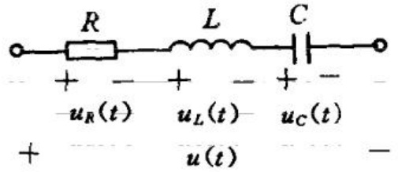

图 14-8-1 RLC 串联电路

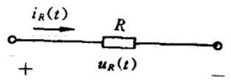

图 14-8-2 电阻元件时域模型

现在来建立电路元件的复频域模型。对于一些最常见的线性电路元件，我们将表征其特性的电流与电压关系用它的象函数表示，得到电路元件的复频域模型或称运算电路模型。

线性电阻元件(图 14-8-2)的电流与电压关系是

 $$ \begin{aligned}&u_{R}(t)=Ri_{R}(t)\\&i_{R}(t)=Gu_{R}(t)\\ \end{aligned} $$ 

或

与之对应的电阻上电压与电流的象函数间的关系是

 $$ U_{R}(s)=R I_{R}(s) $$ 

或

 $$ I_{R}(s)=G U_{R}(s) $$ 

其复频域模型如图 14-8-3 所示。

线性电感元件(图 14-8-4)的电流与电压的关系是

 $$ \begin{aligned}&u_{L}(t)=L\frac{\mathrm{d}i_{L}(t)}{\mathrm{d}t}\\ &i_{L}(t)=i_{L}(0^{-})+\frac{1}{L}\int_{0^{-}}^{t}u_{L}(\tau)\mathrm{d}\tau\\ \end{aligned} $$ 

或

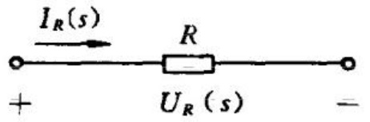

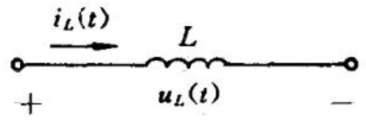

图 14-8-3 电阻元件复频域模型

图 14-8-4 电感元件时域模型

以上两式经作拉普拉斯变换后，便有

 $$ U_{L}(s)=s L I_{L}(s)-L i_{L}(0^{-}) $$ 

或

 $$ I_{L}(s)=\frac{i_{L}(0^{-})}{s}+\frac{1}{sL}U_{L}(s) $$ 

由式(14-8-1)和式(14-8-2)两式,可以作出表示电感元件的电压、电流象函数关系的电路复频域模型,如图14-8-5所示。图14-8-5(a)是由式(14-8-1)得出的复频域模型,其中sL称为电感的运算阻抗; $ Li_{L}(0^{-}) $仅取决于电感电流的初始值,它在这个模型中如同独立电压源,其参考方向如图中所示。电感电压 $ U_{L}(s) $即等于它的运算阻抗sL与 $ I_{L}(s) $的乘积与 $ Li_{L}(0^{-}) $的差。图14-8-5(b)是由式(14-8-2)得出的复频域模型,也可以通过将图14-8-5(a)中的独立电压源等效变换成独立电流源得到。这个模型中sL仍是电感

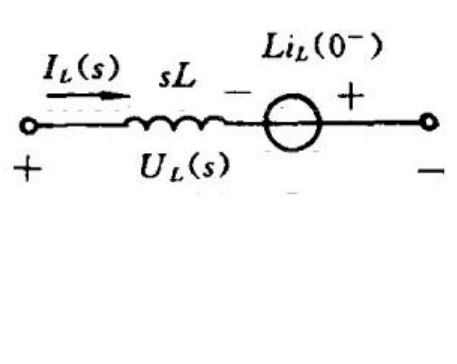

(a)

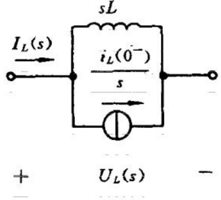

(b)

图 14-8-5 电感元件的复频域模型

(a) 电压源与电感串联；(b) 电流源与电感并联

的运算阻抗，而与之并联的 $ i_{L}(0^{-})/s $就如同独立电流源。

在电感中电流的初始值为零的情形下,电感的运算电路模型就是一个运算阻抗 sL,即

 $$ U_{L}(s)=s L I_{L}(s) $$ 

或

 $$ I_{L}(s)=\frac{1}{sL}\;U_{L}(s) $$ 

线性电容(图 14-8-6)的电压与电流时域中的关系是

 $$ \begin{aligned}&u_{C}(t)=u_{C}(0^{-})+\frac{1}{C}\int_{0^{-}}^{\tau}i_{C}(\tau)\mathrm{d}\tau\\&i_{C}(t)=C\frac{\mathrm{d}u_{C}(t)}{\mathrm{d}t}\\ \end{aligned} $$ 

将以上两式作拉普拉斯变换，得

 $$ \begin{aligned}U_{c}(s)&=\frac{u_{c}(0^{-})}{s}+\frac{1}{sC}I_{c}(s)\\&(14-8-3)\\I_{c}(s)&=sCU_{c}(s)-Cu_{c}(0^{-})\\&(14-8-4)\end{aligned} $$ 

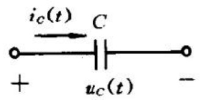

图 14-8-6 电容元件的时域模型

由此两式可作出表示电容元件电压和电流的象函数关系的运算电路模型如图 14-8-7 所示。图 14-8-7(a) 是根据式(14-8-3)作出的，其中的 1/sC 叫做电容的运算阻抗， $ u_{c}(0^{-})/s $ 仅决定于电容电压的初始值，它在这一模型中如同有恒定电压  $ u_{c}(0)/s $ 的独立电压源，其参考方向如图所示。电容电压  $ U_{c}(s) $ 即等于它的运算阻抗 1/sC 与  $ I_{c}(s) $ 的乘积与  $ u_{c}(0^{-})/s $ 之和。图 14-8-7(b) 是根据式(14-8-4)作出的。它也可以通过将图 14-8-7(a) 中的独立电压源等效变换成电流源得到。这个模型中的 1/sC 仍是运算阻抗，与之并联的  $ C_{uc}(0^{-}) $ 就如同一个独立电流源。

在电容电压初值为零的情形下,电容的运算电路模型就是一个运算阻抗  $ 1/sC $。即

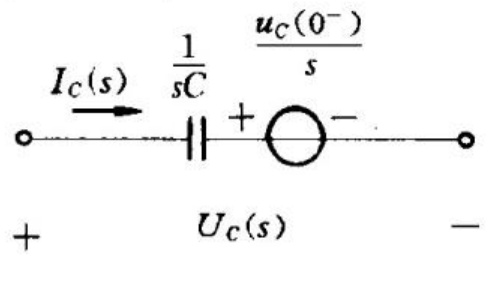

(a)

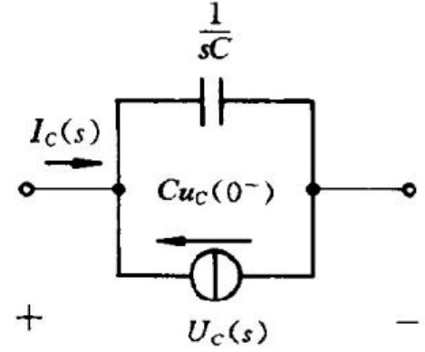

(b)

图 14-8-7 电容元件的复频域模型

(a) 电压源与电容串联；(b) 电流源与电容并联

 $$ U_{c}(s)=\frac{1}{sC}I_{c}(s) $$ 

 $$ I_{c}(s)=s C U_{c}(s) $$ 

### 14.9 用拉普拉斯变换法分析电路

用拉普拉斯变换方法分析线性电路中的动态过程问题一般是按照下面的做法进行的。将所要研究的电路中的每个元件都用它的复频域模型(运算阻抗和附加电源)来代替,把电源的电压或电流以其拉普拉斯变换式表示,就得到电路的复频域模型,即运算电路。将复频域形式的KCL和KVL应用于该电路,建立所需求解变量的象函数的方程,由这些方程解出所需的象函数,将它们进行反变换后就得到所求的过渡过程问题的解。这一方法常称为运算法。它与用相量法分析电路正弦稳态响应在原理和形式上是相同的,只需将s代替jω,用电压和电流的象函数代替电压和电流相量,并在电路中引入考虑初始条件作用的附加电源,便可得到运算电路模型,而且在用相量法分析电路的正弦稳态响应时所用的定

理和方法都可用于运算电路,分析其中的动态过程。

综上所述,可以把用拉普拉斯变换法(运算法)分析电路的步骤归纳如下:

(1) 将激励函数进行拉普拉斯变换。

（2）作出电路的运算电路，在其中引入考虑储能元件初始条件作用的附加电源。

(3) 建立复频域形式的电路的 KCL, KVL 方程, 求出响应的象函数。

(4) 将(3)中求得的象函数进行拉普拉斯反变换, 求出原函数。

例 14-15 RLC 串联电路如图 14-9-1(a) 所示。已知  $ i(0^{-}) = 0.5A, u_{C}(0^{-}) = 0 $，求  $ u_{C}(t) $ 和  $ i(t) $，对  $ t \geqslant 0 $。

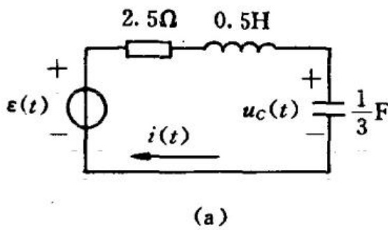

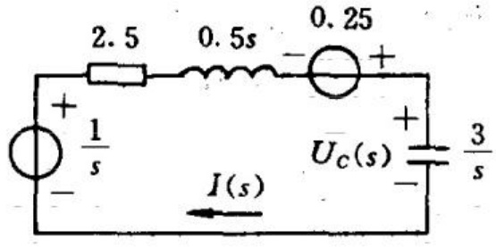

(b)

图 14-9-1 例 14-15 用图

(a) 时域电路；(b) 运算电路

解 这是求具有初始条件不为零的电路中的全响应问题,作出运算电路如图 14-9-1(b) 所示。由 KVL 得电流的象函数  $ I(s) $ 应满足的方程:

 $$ \left(2.5+0.5s+\frac{3}{s}\right)I(s)=\frac{1}{s}+0.25 $$ 

 $$ I(s)=\frac{s+4}{2s^{2}+10s+12} $$ 

 $$ U_{c}(s)=\frac{3}{s}I(s)=\frac{3s+12}{2s(s^{2}+5s+6)} $$ 

象函数  $ I(s) $ 和  $ U_{c}(s) $ 的部分分式展开式为

 $$ I(s)=\frac{s+4}{2(s+2)(s+3)}=\frac{1}{s+2}-\frac{1}{2(s+3)} $$ 

 $$ U_{c}(s)=\frac{3s+12}{2s(s+2)(s+3)}=\frac{1}{s}-\frac{3}{2(s+2)}+\frac{1}{2(s+3)} $$ 

求上面两式的拉普拉斯反变换，即得电流  $ i(t) $ 和  $ u_{C}(t) $ 为

 $$ i(t)=\left(\mathrm{e}^{-2t}-\frac{1}{2}\mathrm{e}^{-3t}\right)\varepsilon(t)\quad\mathrm{A} $$ 

 $$ u_{C}(t)=\left(1-\frac{3}{2}\mathrm{e}^{-2t}+\frac{1}{2}\mathrm{e}^{-3t}\right)\varepsilon(t)\quad\mathrm{V} $$ 

由此例可以看出，利用拉普拉斯变换分析电路，由于在运算电路中已考虑了初始条件，所以可直接得到电路的全响应。

例 14-16 求图 14-9-2(a) 所示 RC 电路的零状态响应  $ u_{C}(t) $。已知  $ R = 5\Omega, C = 0.4F, u_{S}(t) = [\varepsilon(t) - \varepsilon(t-3)]V $。

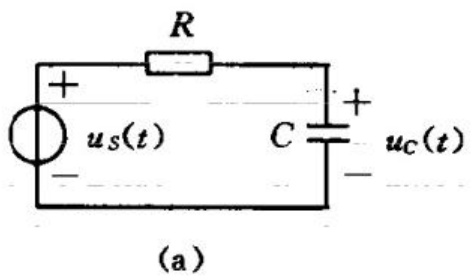

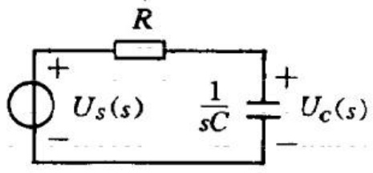

(b)

图 14-9-2 例 14-16 附图

(a) 时域电路；(b) 运算电路

解 画出已知 RC 时域电路的运算电路如图 14-9-2(b) 所示。图中

 $$ U_{S}(s)=\mathcal{L}[u_{S}(t)]=\frac{1}{s}-\frac{\mathrm{e}^{-3s}}{s} $$ 

由分压公式得

 $$ \begin{aligned}U_{c}(s)&=\frac{\frac{1}{sC}}{\_R+\frac{1}{sC}\_U_{s}(s)=\frac{U_{s}(s)}{sRC+1}\\&=\frac{1}{sRC\left(s+\frac{1}{RC}\right)}(1-e^{-3s})\end{aligned} $$ 

代入数据得

 $$ \begin{aligned}U_{c}(s)&=\frac{1}{2s\left(s+\frac{1}{2}\right)}(1-\mathrm{e}^{-3s})\\&=\left(\frac{1}{s}-\frac{1}{s+\frac{1}{2}}\right)(1-\mathrm{e}^{-3s})\\ \end{aligned} $$ 

对上式取拉普拉斯反变换得电路的零状态响应  $ u_{C}(t) $

 $$ \begin{aligned}u_{C}(t)=&\left(1-\mathrm{e}^{-\frac{1}{2}t}\right)\varepsilon(t)-\left[1-\mathrm{e}^{-\frac{1}{2}(t-3)}\right]\varepsilon(t-3)\\=&\left(1-\mathrm{e}^{-\frac{1}{2}t}\right)\left[\varepsilon(t)-\varepsilon(t-3)\right]\\&+\left[\mathrm{e}^{-\frac{1}{2}(t-3)}-\mathrm{e}^{-\frac{1}{2}t}\right]\varepsilon(t-3)\end{aligned} $$ 

上式的时间分段表示式为

 $$ u_{C}(t)=\left\{\begin{aligned}&1-\mathrm{e}^{-\frac{1}{2}t}&\quad&1<t\leqslant3\\ &0.777\mathrm{e}^{-\frac{1}{2}(t-3)}&\quad&t>3\end{aligned}\right. $$ 

 $ u_{C}(t) $ 的波形图如图 14-9-3 所示。

例 14-17 图 14-9-4(a) 所示电路中， $ R_{1}=2\Omega $， $ R_{2}=3\Omega $， $ C_{1}=1F $， $ C_{2}=0.5F $， $ u_{S}(t)=10\varepsilon(t) $ V。求  $ u_{C2}(t) $ 的零状态响应，对  $ t\geqslant0 $。

解 由已知时域电路作出其运算电路如图 14-9-4(b)所示。

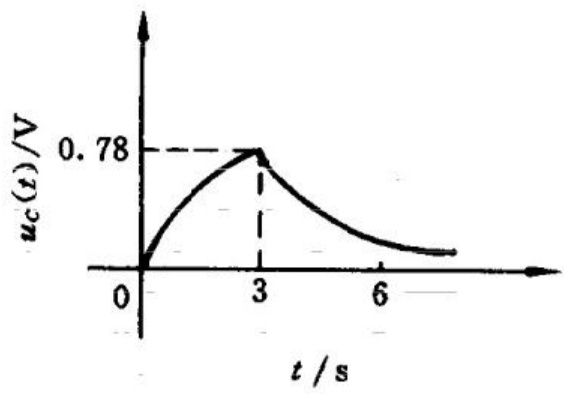

图 14-9-3  $ u_{C}(t) $ 的波形

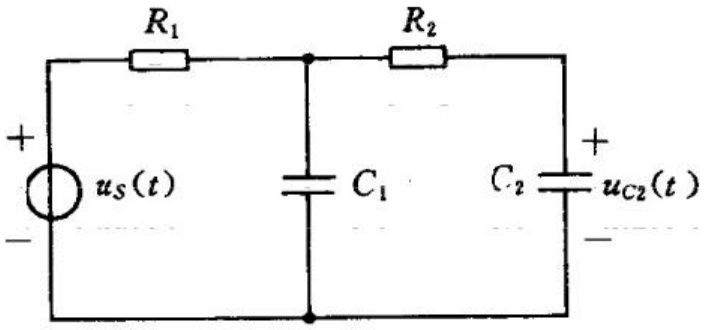

(a)

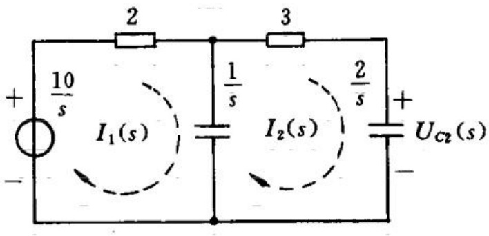

(b)

图 14-9-4 例 14-17 用图

(a) 时域电路；(b) 运算电路

设两个独立回路的回路电流分别为  $ I_{1}(s) $、 $ I_{2}(s) $，参考方向如图中所示。分别对两个回路列 KVL 方程，得

 $$ \left(\frac{1}{s}+2\right)I_{1}(s)-\frac{1}{s}I_{2}(s)=\frac{10}{s} $$ 

 $$ -\frac{1}{s}I_{1}(s)+\left(\frac{1}{s}+\frac{2}{s}+3\right)I_{2}(s)=0 $$ 

由式 $ ⑵ $得

 $$ I_{1}(s)=3(s+1)I_{2}(s) $$ 

将它代入式(1)，得

 $$ I_{2}(s)=\frac{10}{6s^{2}+9s+2} $$ 

由此可得

 $$ U_{C_{2}}(s)=\frac{1}{sC_{2}}I_{2}(s)=\frac{20}{s(6s^{2}+9s+2)} $$ 

 $$ \begin{aligned}=&\frac{10}{s}+\frac{-10s-15}{s^{2}+1.5s+\frac{1}{3}}\\=&\frac{10}{s}+\frac{-10s-15}{(s+0.2713)(s+1.229)}\\=&\frac{10}{s}+\frac{-12.8}{s+0.2713}+\frac{2.83}{s+1.229}\end{aligned} $$ 

由  $ U_{C2}(s) $ 反变换得电容电压  $ u_{C2}(t) $ 为

 $$ u_{C2}^{-}(t)=(10-12.8\mathrm{e}^{-0.271t}+2.83\mathrm{e}^{-1.23t})\varepsilon(t)\mathrm{V} $$ 

例 14-18 求图 14-9-5(a) 所示电路中的  $ i_{2}(t) $ 和  $ u_{2}(t) $。已知  $ u_{2}(0^{-})=0 $，开关在 t=0 时闭合。

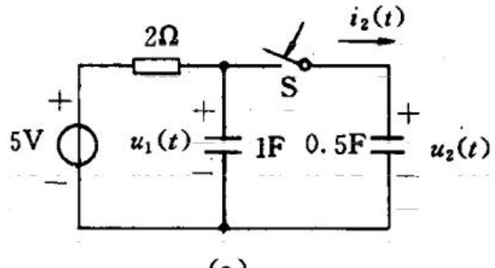

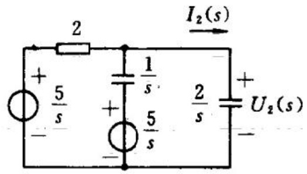

(b)

图 14-9-5 例 14-18 用图

(a) 时域电路；(b) 运算电路

解 由图 14-9-5(a) 电路求得  $ u_{1}(0^{-})=5V $，画出运算电路如图 14-9-5(b) 所示。

应用节点电压法得

 $$ \left(\frac{1}{2}+s+\frac{s}{2}\right)U_{2}(s)=\frac{5}{2s}+5 $$ 

剛

 $$ U_{2}(s)=\frac{10s+5}{3s\left(s+\frac{1}{3}\right)}=\frac{5}{s}-\frac{\frac{5}{3}}{s+\frac{1}{3}} $$ 

 $$ I_{2}(s)=\frac{s}{2}U_{2}(s)=\frac{5}{3}+\frac{5}{18\left(s+\frac{1}{3}\right)} $$ 

取 $ U_{2}(s) $， $ I_{2}(s) $的拉普拉斯反变换，得

 $$ u_{2}(t)=\left(5-\frac{5}{3}\mathrm{e}^{-\frac{1}{3}t}\right)\varepsilon(t)\mathrm{~V~} $$ 

 $$ i_{z}(t)=\frac{5}{3}\delta(t)+\frac{5}{18}\mathrm{e}^{-\frac{1}{3}t}\varepsilon(t)\mathrm{~A~} $$ 

当  $ t=0^{+} $ 时， $ u_{2}(0^{+})=\frac{10}{3}V $，而  $ u_{2}(0^{-})=0 $，电容电压在 t=0 处发生了跃变。这是冲激电流  $ 5\delta(t)/3 $ 对电容器充电的结果，它使得

 $$ u_{C}(0^{+})=\frac{1}{0.5}\int_{0^{-}}^{0^{+}}\frac{5}{3}\delta(t)\mathrm{d}t=\frac{10}{3}\mathrm{V} $$ 

由本例可见,用拉普拉斯变换法分析换路瞬间电容电压(电感电流)有跃变情形时,无需先求出 $ 0^{+} $时的电压值(电流值),因为拉普拉斯变换式中积分下限定为 $ 0^{-} $,则 $ 0^{-} $到 $ 0^{+} $的变化情况已经包含在变换式中。

### 14.10 网络函数

电路在时域中响应  $ r(t) $ 和激励  $ e(t) $ 的关系是由该电路的微分方程表示的。在复频域中，可以用下面方式引入网络函数表示它们之间的关系。

在图 14-10-1(a) 的框图中,  $ e(t) $ 表示电路中某个激励,  $ r(t) $ 是该激励在电路中产生的某一零状态响应。表示  $ e(t) $ 和  $ r(t) $ 关系的网络函数  $ H(s) $ 定义为: 电路零状态响应  $ r(t) $ 的拉普拉斯变换与激励函数  $ e(t) $ 的拉普拉斯变换之比, 即

 $$ H(s)\stackrel{\mathrm{d e f}}{=}\frac{\mathcal{L}\big[r(t)\big]}{\mathcal{L}\big[e(t)\big]}\stackrel{}{=}\frac{R(s)}{E(s)} $$ 

在 11.2 节中，曾定义网络函数为指数正弦电源激励下响应的

复数值和激励的复数值之比。可以看出这两个定义是相同的。

按照式 14-10-1 定义, 要求出表示电路中某一激励  $ e(t) $ 与响应  $ r(t) $ 间的关系的网络函数  $ H(s) $, 只需求出该电路在此激励  $ E(s) = \mathcal{L}[e(t)] $ 作用下指定的响应  $ r(t) $ 的拉普拉斯变换  $ R(s) $, 它们的比值  $ R(s)/E(s) $ 即为所要求的  $ H(s) $。例如图 14-10-2(a) 的电

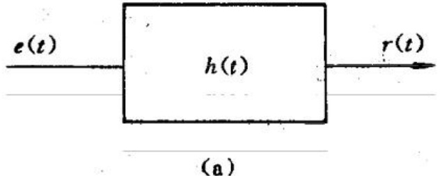

(a)

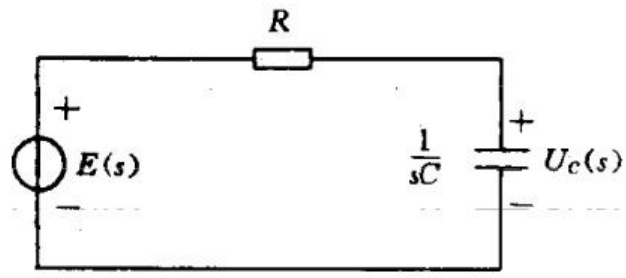

(a)

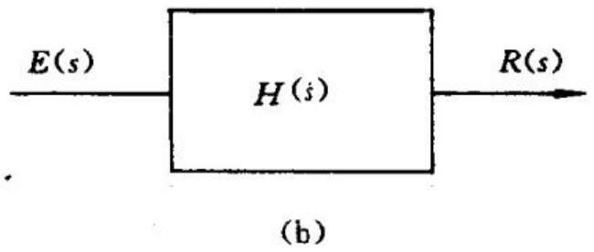

图 14-10-1 表示电路中激励和响应关系的框图

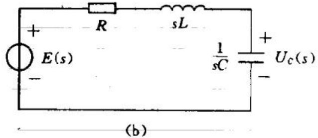

(a) 时域形式框图；

图 14-10-2 RC 和 RLC 串联电路 (a) RC 串联电路；

(b) 复频域形式框图

(b) RLC 串联电路

路中,网络函数是

 $$ H(s)=\frac{U_{c}(s)}{E(s)}=\frac{\frac{1}{sC}E(s)}{\left(R+\frac{1}{sC}\right)\bar{E}(s)}=\frac{1}{RCs+1} $$ 

在图 14-10-2(b) 的电路中网络函数是

 $$ H(s)=\frac{U_{c}(s)}{E(s)}=\frac{\frac{1}{sC}E(s)}{\left(R+sL+\frac{1}{sC}\right)\frac{E(s)}{}} $$ 

 $$ =\frac{1}{L C s^{2}+R C s+1} $$ 

由此可见，网络函数只决定于网络的结构和参数，而与激励(电源)无关。

若已知网络函数,要求电路在任意激励下的零状态响应,由网络函数的定义可得

 $$ R(s)=H(s)E(s) $$ 

对于线性集总参数的电路,任何激励与响应的关系都可由一相应的常系数线性微分方程描述。因此,响应与激励的象函数的比 $ H(s) $可表示为实系数的有理分式,即两个实系数的复频率s的多项式之比,即

 $$ \begin{aligned}H(s)=&\frac{N(s)}{D(s)}=\frac{b_{m} s^{m}+b_{m-1}s^{m-1}+\cdots+b_{1}s+b_{0}}{a_{n} s^{n}+a_{n-1}s^{n-1}+\cdots+a_{1}s+a_{0}}.\\=&\frac{H_{0}\prod_{j=1}^{m}(s-z_{j})}{\prod_{i=1}^{n}(s-p_{i})}\quad(14)\end{aligned} $$ 

式中  $ H_{0}=b_{m}/a_{n}, z_{j} $ 和  $ p_{i} $ 分别为分子多项式  $ N(s)=0 $ 和分母多项式  $ D(s)=0 $ 的根，称  $ z_{j} $ 为  $ H(s) $ 的零点， $ p_{i} $ 为  $ H(s) $ 的极点。

假设网络中的激励  $ e(t) $ 的象函数  $ E(s)=P(s)/Q(s) $， $ P(s) $ 和  $ Q(s) $ 分别是 s 的  $ m' $， $ n' $ 次多项式，即

 $$ E(s)=\frac{P(s)}{Q(s)}=E_{0}\frac{\prod_{k=1}^{m^{\prime}}(s-z_{k})}{\prod_{l=1}^{n^{\prime}}(s-p_{l})} $$ 

 $ z_{k} $ 和  $ p_{i} $ 分别是  $ E(s) $ 的零点和极点。电路的零状态响应便可表示为

 $$ R(s)=H(s)E(s) $$ 

 $$ \begin{aligned}&\frac{H_{0}E_{0}\prod_{j=1}^{m}\left(s-z_{j}\right)\prod_{k=1}^{m^{\prime}}\left(s-z_{k}\right)}{\prod_{i=1}^{n}\left(s-p_{i}\right)\prod_{l=1}^{n^{\prime}}\left(s-p_{l}\right)}\\ \end{aligned} $$ 

显然,响应  $ R(s) $ 的零点、极点分别由  $ H(s) $ 和  $ E(s) $ 的零点、极点决定。假设式(14-10-4)中的  $ n>m, n'>m' $，分子与分母中没有相同因子，且在  $ R(s) $ 中不含有多重极点的情形下，式(14-10-4)的部分分式展开式为

 $$ \begin{aligned}&R(s)=\sum_{i=1}^{n}\frac{k_{i}}{s-p_{i}}+\sum_{l=1}^{n^{\prime}}\frac{k_{l}}{s-p_{l}}\\&r(t)=\sum_{i=1}^{n}k_{i}\mathrm{e}^{p_{i}t}+\sum_{l=1}^{n^{\prime}}k_{l}\mathrm{e}^{p_{l}t}.\\ \end{aligned} $$ 

则

式(14-10-5)中的前一部分响应是自由分量,其中的每一  $ \mathrm{e}^{p_{i}t} $ 项与网络函数  $ H(s) $ 的一个极点  $ p_{i} $ 对应;后一部分响应是由激励函数在电路响应中产生的强制分量,每一  $ \mathrm{e}^{p_{i}t} $ 项与激励  $ E(s) $ 的极点  $ p_{i} $ 对应。

容易得出网络函数和电路单位冲激响应的关系。设输入激励为单位冲激函数  $ \delta(t) $，则

 $$ R(s)=H(s)\mathcal{L}[\delta(t)]=H(s) $$ 

因此，电路对于单位冲激函数  $ \delta(t) $ 的响应为

 $$ r(t)=\mathcal{L}^{-1}[R(s)]=\mathcal{L}^{-1}[H(s)] $$ 

设函数  $ h(t) $ 为

 $$ h(t)=\mathcal{L}^{-1}[H(s)] $$ 

称  $ h(t) $ 为单位冲激响应。可见，单位冲激响应和网络函数是一对拉普拉斯变换对。

### 14. 11 网络函数的极点分布与电路冲激响应的关系

网络函数  $ H(s) $ 与单位冲激响应是拉普拉斯变换对。因此，只要知道  $ H(s) $ 在 s 平面上零点、极点的分布情况，就可以判断冲激响应的特性。下面讨论  $ H(s) $ 的极点在 s 平面上不同位置时冲激响应的波形。

由网络函数  $ H(s) $ 的一般形式

 $$ H(s)=H_{0}\frac{\prod_{j=1}^{m}(s-z_{j})}{\prod_{i=1}^{n}(s-p_{i})} $$ 

又假定  $ H(s) $ 的所有的极点皆相异，且 n > m，则  $ H(s) $ 可展开成以下简单分式的和：

 $$ H(s)=\sum_{i=1}^{n}\frac{A_{i}}{s-s_{i}}\stackrel{\mathrm{def}}{=}\sum_{i=1}^{n}H_{i}(s) $$ 

式中  $ H_{i}(s)=A_{i}/(s-s_{i}) $， $ A_{i} $ 是上式的部分分式展开式中的系数。对于每一极点  $ s_{i} $，网络函数中有对应的一项，所以  $ H(s) $ 的拉普拉斯反变换即冲激响应  $ h(t) $ 就是诸  $ H_{i}(s) $ 的拉普拉斯反变换  $ h_{i}(t) $ 之和，即  $ h(t)=\sum h_{i}(t) $。这样，便可分别考虑与每一极点  $ p_{i} $ 对应的因子对冲激响应的贡献。

若  $ H(s) $ 有一位于 s 平面实轴上的极点，即  $ p_{i}=\alpha, \alpha $ 为一实数，如  $ H_{i}(s)=A/(s-\alpha) $ (A 为常数)，则  $ h_{i}(t)=A\exp(\alpha t) $。当  $ \alpha $ 为负实数时，冲激响应中的  $ h_{i}(t) $ 为指数衰减函数，当  $ \alpha $ 为正实数时， $ h_{i}(t) $ 为指数增幅函数。

若  $ H(s) $ 有一极点位于 s 平面的原点，如  $ H_{i}(s)=A/s $ (A 为常数)，则  $ h_{i}(t)=A\varepsilon(t) $，冲激响应中的  $ h_{i}(t) $ 为阶跃函数。

若  $ H(s) $ 有一对共轭极点位于 s 平面的虚轴上，设极点为  $ p_{1}=j\omega_{0}, p_{2}=-j\omega_{0} $，网络函数中对应的两项和为  $ (Bs+D)/(s^{2}+\omega_{0}^{2})(B, D $ 均为常数)，在冲激响应中就有角频率为  $ \omega_{0} $ 的等幅正弦振荡分量。

若  $ H(s) $ 有一对共轭复数极点  $ p_{1}=\alpha_{0}+\mathrm{j}\omega_{0}, p_{2}=\alpha_{0}-\mathrm{j}\omega_{0} $，网络函数中对应的两项之和为  $ (E s + F)/[(s - \alpha_{0})^{2} + \omega_{0}^{2}] $ (E, F 均为常数)，它所对应的冲激响应中的分量，当  $ \alpha_{0} < 0 $ 时是衰减振荡；当  $ \alpha_{0} > 0 $ 时是振幅随时间按指数增长的振荡。

图 14-11-1 表示了网络函数  $ H(s) $ 的极点分布位置和相应的网络冲激响应的关系。由此图可以看出: 若  $ H(s) $ 的极点都在左半平面,  $ h_{i}(t) $ 的波形是随时间的增长而衰减的, 这样的电路中的动态过程是稳定的; 若  $ H(s) $ 有位于右半平面的极点, 相应的冲激响应的波形是随时间无限增长的, 这样的电路中的动态过程是不稳定的。

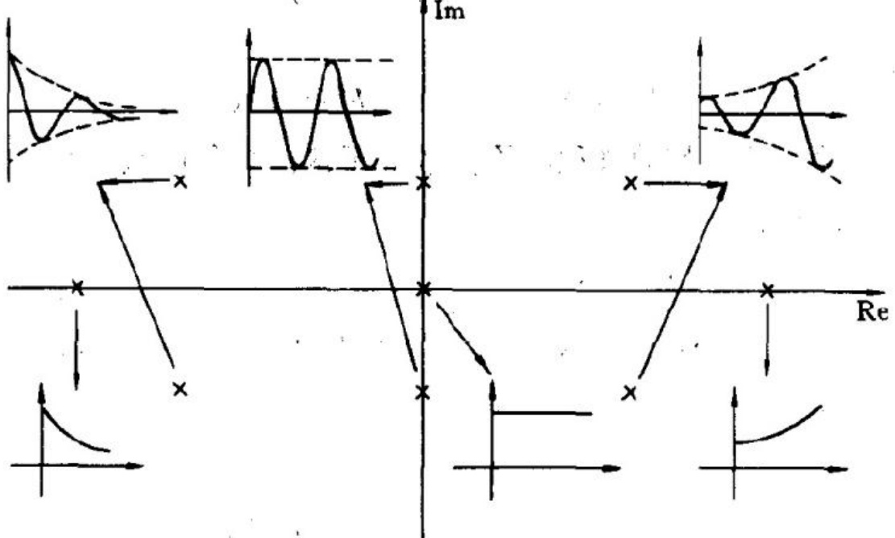

图 14-11-1 极点分布和冲激响应的关系

### 14.12 卷积定理

在 6.9 节中介绍了卷积积分，用电路的单位冲激响应  $ h(t) $ 和激励  $ e(t) $ 进行卷积积分，便可得到电路的零状态响应  $ r(t) $，即有

 $$ r(t)=e(t)*h(t)=\int_{0}^{t}e(\tau)h(t-\tau)\mathrm{d}\tau $$ 

在 14.10 节中, 得到电路中的网络函数  $ H(s) $ 与激励的象函数的乘积等于响应的象函数, 即

 $$ R(s)=E(s)H(s) $$ 

比较这两个式子,就可以看到两个象函数的乘积  $ H(s)E(s) $ 与所对应的原函数  $ h(t), e(t) $ 之间的关系,这就是卷积定理所要说明的。

卷积定理 若  $ \mathcal{L}[f_{1}(t)]=F_{1}(s) $;  $ \mathcal{L}[f_{2}(t)]=F_{2}(s) $，则

 $$ \mathcal{L}^{-1}\left[F_{1}(s)F_{2}(s)\right]=f_{1}(t)*f_{2}(t)=\int_{0}^{\tau}f_{1}(\tau)f_{2}(t-\tau)\mathrm{d}\tau $$ 

或

 $$ \mathcal{L}[f_{1}(t)*f_{2}(t)]=F_{2}(s)F_{2}(s) $$ 

它表明两个象函数的乘积的原函数等于这两个象函数分别对应的原函数的卷积。

卷积定理证明如下：

 $$ f_{1}(t)*f_{2}(t)=\int_{0}^{t}f_{1}(\tau)f_{2}(t-\tau)\mathrm{d}\tau $$ 

由于

 $$ \varepsilon(t-\tau)=\begin{cases}1&\qquad t>\tau\\ 0&\qquad t<\tau\end{cases} $$ 

式 $ （14-12-1） $可改写为

 $$ f_{1}(t)*f_{2}(t)=\int_{0}^{\infty}f_{1}(\tau)f_{2}(t-\tau)\varepsilon(t-\tau)\mathrm{d}\tau $$ 

则

 $$ \begin{aligned}&\mathcal{L}\big[f_{1}(t)*f_{2}(t)\big]\\=&\int_{0}^{\infty}\mathrm{e}^{-st}\Big[\int_{0}^{t}f_{1}(\tau)f_{2}(t-\tau)\mathrm{d}\tau\Big]\mathrm{d}t\\=&\int_{0}^{\infty}\mathrm{e}^{-st}\Big[\int_{0}^{\infty}f_{1}(\tau)f_{2}(t-\tau)\varepsilon(t-\tau)\mathrm{d}\tau\Big]\mathrm{d}t\\=&\int_{0}^{\infty}f_{1}(\tau)\Big[\int_{0}^{\infty}f_{2}(t-\tau)\varepsilon(t-\tau)\mathrm{e}^{-st}\mathrm{d}t\Big]\mathrm{d}\tau\end{aligned} $$ 

令  $ x=t-\tau $，则  $ \mathrm{e}^{-st}=\mathrm{e}^{-s(x+\tau)} $， $ dt=dx $，于是上式可改写为

 $$ \begin{aligned}&\mathcal{L}\big[f_{1}(t)*f_{2}(t)\big]\\=&\int_{0}^{\infty}f_{1}(\tau)\Biggl[\int_{-\tau}^{\infty}f_{2}(x)\boldsymbol{\varepsilon}(x)\mathrm{e}^{-s x}\mathrm{e}^{-s\tau}\mathrm{d}x\Biggr]\mathrm{d}\tau\\=&\int_{0}^{\infty}f_{1}(\tau)\mathrm{e}^{-s\tau}\mathrm{d}\tau\int_{0}^{\infty}f_{2}(x)\mathrm{e}^{-s x}\mathrm{d}x\\=&F_{1}(s)F_{2}(s)\end{aligned} $$ 

卷积定理得证。

例 14-19 电路如图 14-12-1 所示。设开关在 t=0 时闭合，输入电压  $ e(t)=5e^{-2t} $ V。求输出电压  $ u_{2}(t), t \geqslant 0 $。

解 设输入激励  $ e(t) $ 和响应  $ u_{2}(t) $ 的象函数分别为  $ E(s) $， $ U_{2}(s) $。由阻抗串联分压关系得网络函数

 $$ H(s)=\frac{U_{2}(s)}{E(s)}=\frac{\frac{12}{s}}{6+\frac{2}{s}}\quad\frac{1}{3+\frac{12}{6s+2}}=\frac{2}{3(s+1)} $$ 

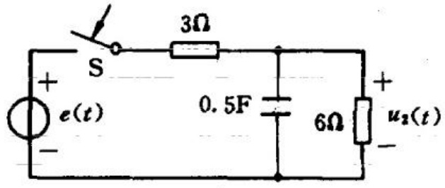

图 14-12-1 例 14-19 附图

单位冲激响应为

 $$ h(t)=\mathcal{L}^{-1}\big[H(s)\big]=\frac{2}{3}\mathrm{e}^{-t}\varepsilon(t) $$ 

用卷积积分求得输出电压

 $$ \begin{aligned}u_{2}(t)=&\int_{0}^{t}h(\tau)\mathrm{e}(t-\tau)\mathrm{d}\tau\\=&\frac{10}{3}\int_{0}^{t}\mathrm{e}^{-\tau}\mathrm{e}^{-2(t-\tau)}\mathrm{d}\tau.\\=&\frac{10}{3}(\mathrm{e}^{-t}-\mathrm{e}^{-2t})\varepsilon(t)\mathrm{~V~}\end{aligned} $$ 

也可以用卷积定理来求输出电压。则

 $$ \begin{aligned}U_{2}(s)=&H(s)E(s)=\frac{2}{3(s+1)}\frac{5}{s+2}\\=&\frac{10}{3}\Big(\frac{1}{s+1}-\frac{1}{s+2}\Big)\end{aligned} $$ 

对 $ U_{2}(s) $进行拉普拉斯反变换，得

 $$ u_{2}(t)=\frac{10}{3}(\mathrm{e}^{-t}-\mathrm{e}^{-2t})\varepsilon(t)\quad V $$ 

## 习题

14-1 求函数  $ f(t)=|\sin\pi t| $ 的指数形式的傅里叶级数，并画出其幅度频谱和相位频谱。

14-2 求下列各函数的拉普拉斯变换式。

(1)  $ \delta(t) + (a - b)e^{-bt}\varepsilon(t) $

(2) $ (t+1)\left[\varepsilon(t-2)-\varepsilon(t-3)\right] $

(3) $ (t-a)e^{-b(t-a)}e(t-a) $

(4)  $ \sin\omega(t-\tau)\varepsilon(t) $

(5)  $ \sin\omega t\varepsilon(t-\tau) $

14-3 求题图 14-3 中各时间函数的拉普拉斯变换。

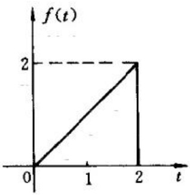

(a)

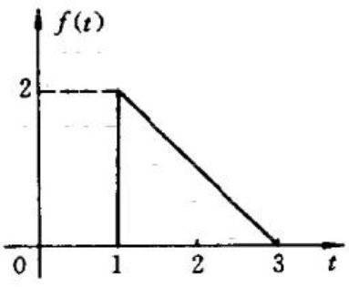

(b)

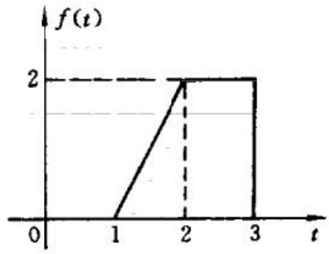

题图 14-3

(c)

14-4 求题图 14-4 所示周期函数的拉普拉斯变换。

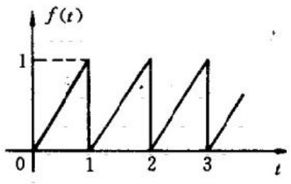

(a)

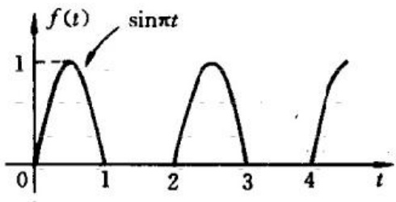

(b)

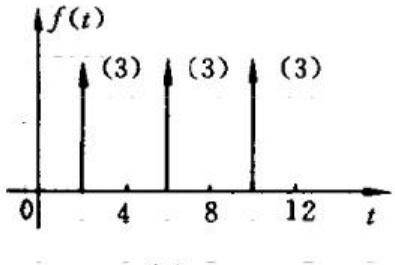

(c)

题图 14-4

14-5 求下列各象函数的拉普拉斯反变换。

(1) $ \frac{600}{s(s+10)(s+30)} $

(2) $ \frac{s+4}{s(s+2)(s+12)} $

(3) $ \frac{1}{s^{2}+6s+13} $

(4) $ \frac{12s}{(s+3)(s^{2}+9)} $

(5)  $ \frac{2s^{2}+3}{(s+2)(s^{2}+2s+5)} $

(6)  $ \frac{e^{-(s-1)}}{(s+1)^{2}+4} $

(8) $ \frac{s^{3}+s^{2}+1}{(s+1)(s+2)} $

(7) $ \frac{se^{-2s}}{s+3} $

14-6 求题图 14-6 所示电路中的电压  $ u_{C}(t) $ 。已知  $ i(0)=1A $， $ u_{C}(0)=2V $。

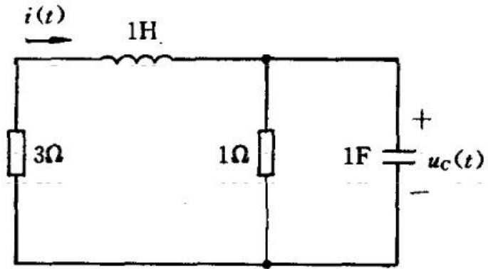

题图 14-6

14-7 求题图 14-7 所示电路的电压  $ u_{C}(t) $ 和电流  $ i_{L}(t) $。已知  $ i_{L}(0)=0.5A, u_{C}(0)=0 $。

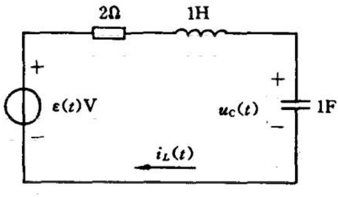

题图 14-7

14-8 求解图 14-8 所示电路在开关 S 闭合后电容 C 两端的电压。已知开关闭合前电路处于稳态。

14-9 用拉普拉斯变换法求题图 14-9 所示电路的零状态响应  $ u_{0}(t) $。已知  $ i_{S}(t)=2\mathrm{e}^{-2t}\varepsilon(t)\mathrm{~V} $。

14-10 题图 14-10 所示电路在开关 S 断开之前处于稳态。求开关断开后的电压  $ u(t) $。

14-11 题图 14-11 电路已处于稳态。当 t=0 时闭合开关，求

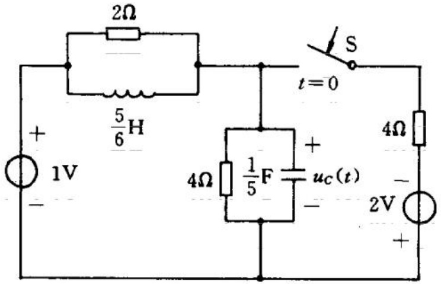

题图 14-8

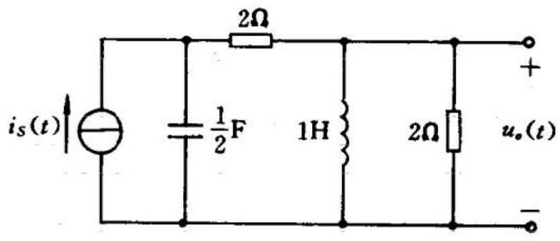

题图 14-9

题图 14-10

开关 S 中电流  $ i(t) $。

14-12 求题图 14-12 所示电路的戴维南等效电路（运算电

题图 14-11

路)。

题图 14-12

14-13 求题图 14-13 所示电路的零状态响应  $ i(t) $。

题图 14-13

## 14 -14 求题图 14-14 所示电路的下列网络函数：

(a)  $ H(s)=\frac{I(s)}{U_{s}(s)} $ (b)  $ H(s)=\frac{I(s)}{I_{s}(s)} $ (c)  $ H(s)=\frac{U_{o}(s)}{U_{s}(s)} $ (d)  $ H(s)=\frac{U_{o}(s)}{U_{s}(s)} $

(a)

(b)

(c)

(d)

题图 14-14

## 14 -15 求题图 14-15 所示电路中的网络函数

 $$ H(s)=U_{o}(s)/U(s) $$ 

14-16 已知某函数的象函数  $ F(s) $ 有一个零点，两个极点。零点为 s = -2，极点为  $ s = -1 \pm j2 $。且知  $ F(0) = 2 $，求原函数  $ f(t) $。

14-17 已知某系统的单位冲激响应  $ h(t) $，其波形如题图 14-17(a) 所示。分别用卷积积分和卷积定理求题图 14-17(b) 所示输入波形  $ u(t) $ 对系统作用时产生的响应  $ y(t) $（结果用时间分段函数表示）。

题图 14-15

(a)

(b)

题图 14-17

14-18 用卷积定理求  $ F(s)=\frac{s^{2}}{(s^{2}+1)^{2}} $ 的原函数  $ f(t) $。

14-19 求积分方程  $ \int_{0}^{t} x(\tau) e^{-(t-\tau)} d\tau = \sin t $ 中的  $ x(t) $。

14-20 用卷积定理求题图 14-20 所示电路的输出电压  $ u(t) $。已知  $ i_{S}(t)=\mathrm{e}^{-at}(a\neq1/RC) $。

题图 14-20

## 第 15 章 二端口(网络)

### 15.1 二端口概述

网络的一个端口是指网络的有以下性质的一对端点:从这一对端点中的一端流入网络的电流等于从另一端流出的电流。图15-1-1中示有一网络的一个端口k,对于此端口,即应有

 $$ i_{k}=-i_{k}^{\prime} $$ 

以后称这一条件为端口条件。

含有两个端口的网络称为二端口。图 15-1-2 所示的电路是一个二端口，它的两个端口的电流即应满足：对端口 11'（22'），从网络外部流入端点 1（2）的电流，等于由网络内部流出端点 1'（2'）的电流。在常见的情形下，一个端口是输入端口，电流、电压信号或功率由此端口输入；另一个端口是输出端口，电流、电压信号或功率由此端口输出。图 15-1-3 给出了几个可以视为二端口的电路的例子。

图 15-1-1 一端口

图 15-1-2 二端口

对二端口的研究，是将一二端口作为一个整体来研究它对外部的作用或呈现的特性。由于二端口仅通过它的两个端口与它的

图 15-1-3 二端口电路示例

外部电路相连,所以它对外部的作用就可由它的两个端口的电压、电流的关系来描述,研究二端口便需要研究这一关系。

本章所研究的二端口是内部不含有独立电源、可由线性电阻、电感、电容、互感和线性受控源等元件构成的二端口。当考虑二端口的动态过程时，还假定网络内部所有储能元件的初始储能为零，即所有电容的初始电压(电荷)、电感的初始电流(磁链)均为零，这样所考虑的二端口中任何响应都是该网络的零状态响应。

下面用相量方法研究二端口在正弦稳态下的外部特性,导出两个端口的电压、电流相量的关系。这样的关系是一组含有若干为数不多的参数的线性方程,其中的参数与网络的结构和各元件的参数都有关。对于一二端口,一旦这样的方程得出后,我们就可以用它描述此二端口的作用,而无需再考虑网络内部电路的工作情况。由在正弦稳态分析中所得的结果,很容易推广得到在复频率s下的相应的结果,用于分析二端口在暂态下的工作情况。

### 15.2 二端口的参数和方程

考虑 15.1 节中所述的二端口，假设在频率为  $ \omega $ 的正弦稳态下，两个端口的电压、电流相量分别为  $ \dot{U}_{1}, \dot{I}_{1}, \dot{U}_{2}, \dot{I}_{2} $ （见图 15-2-1）。从前面的电路理论可知，对于一给定的二端口，如果给定这四个量

中的任何两个，另外两个就一定被确定了。这意味着这四个量中的两个量是另外两个量的函数；或者说，将这四个量中的某两个取为自变量，另外的两个便可表为这两个自变量的函数。取不同的两个量为自变量，便可得到不同的方程，这样共可选取  $ C_{4}^{2}=6 $ 种，相应地，有6组描述二端口的参数。下面导出这些描述二端口特性的方程和相应的参数。

图 15-2-1

图 15-2-2 二端口的 Y 参数和方程

## Y 参数和方程

如果在一二端口的两个端口各施加一电压源(见图 15-2-2)，每个端口的电压就等于所施加于该端口的电压源的电压。根据叠加定理，端口电流是这两个电压的线性函数，即

 $$ \begin{aligned}\dot{I}_{1}&=Y_{11}\dot{U}_{1}+Y_{12}\dot{U}_{2}\\\dot{I}_{2}&=Y_{21}\dot{U}_{1}+Y_{22}\dot{U}_{2}\end{aligned} $$ 

式(15-2-1)中系数  $ Y_{ij}(i,j=1,2) $ 决定于二端口内部元件的参数和联接方式，它表示端口电流对电压的关系，这些系数都具有导纳的量纲，称这些系数为二端口的 Y 参数。式(15-2-1)称为二端口的 Y 参数方程。将 Y 参数方程写成矩阵形式，即有

 $$ \begin{bmatrix}\dot{I}_{1}\\ \dot{I}_{2}\end{bmatrix}=\begin{bmatrix}Y_{11}&Y_{12}\\ Y_{21}&Y_{22}\end{bmatrix}\begin{bmatrix}\dot{U}_{1}\\ \dot{U}_{2}\end{bmatrix} $$ 

上式中的系数矩阵称为 Y 参数矩阵。给定一二端口，它的 Y 参数可以通过计算或测量得到。

在式 $  (15-2-1)  $中，若令 $ \dot{U}_{2}=0 $ [对应的电路如图15-2-3(a)所示]，便有

 $$ \dot{Y}_{11}=\frac{\dot{I}_{1}}{\dot{U}_{1}}\bigg|_{\dot{U}_{2}=0} $$ 

 $$ \boldsymbol{Y}_{21}=\left.\frac{\dot{\boldsymbol{I}}_{2}}{\dot{\boldsymbol{U}}_{1}}\right|_{\dot{\boldsymbol{U}}_{2}=0} $$ 

由上式可见  $ Y_{11} $ 是端口  $ 22' $ 短路时，端口  $ 11' $ 的入端导纳； $ Y_{21} $ 是端口  $ 22' $ 短路时，端口  $ 11' $ 到端口  $ 22' $ 的转移导纳。

同样，若令  $ \dot{U}_{1}=0 $ [对应的电路如图 15-2-3(b) 所示]，就有

 $$ \mathbf{Y}_{12}=\frac{\dot{\mathbf{I}}_{1}}{\dot{U}_{2}}\Bigg|_{\dot{U}_{1}=0} $$ 

 $$ \begin{aligned}&\mathbf{Y}_{22}=\left.\frac{\dot{I}_{2}}{\dot{U}_{2}}\right|_{\dot{U}_{1}=0}\end{aligned} $$ 

可见  $ Y_{22} $ 是端口 11' 短路时，端口 22' 的入端导纳； $ Y_{12} $ 是端口 11' 短路时，端口 22' 到端口 11' 的转移导纳。

(a)

(b)

图 15-2-3 说明 Y 参数意义的图

(a) 计算  $ Y_{11}, Y_{21} $ 的电路；(b) 计算  $ Y_{12}, Y_{22} $ 的电路

从以上分析可见,Y参数中的四个参数都可以分别在某一个端口短路时,通过计算或测量端口电压、电流求得。Y参数也称为短路导纳参数。

例 15-1 求图 15-2-4(a) 所示二端口的 Y 参数。

(a)

(b)

(c)

图 15-2-4 例 15-1 附图

(a) 例 15-1 的电路；(b) 计算  $ Y_{11}, Y_{21} $ 的电路；(c) 计算  $ Y_{12}, Y_{22} $ 的电路

解 可借助图 15-2-4(b) 的电路计算参数  $ Y_{11} $ 和  $ Y_{21} $，电路中端口 22' 被短接，此时有

 $$ \underline{Y}_{11}=\left.\frac{\dot{I}_{1}}{\dot{U}_{1}}\right|_{\dot{U}_{2}=0}=\underline{Y}_{1}+\underline{Y}_{2} $$ 

 $$ \left.Y_{21}=\frac{\dot{I}_{2}}{\dot{U}_{1}}\right|_{\dot{U}_{2}=0}=-\left.Y_{2}\right. $$ 

可借助图 15-2-4(c) 的电路计算参数  $ Y_{12} $ 和  $ Y_{22} $，电路中端口 11' 被短接，此时有

 $$ \begin{aligned}Y_{_{12}}&=\left.\frac{\dot{I}_{1}}{\dot{U}_{2}}\right|_{\dot{U}_{1}=0}=-\left.Y_{2}\right.\end{aligned} $$ 

 $$ \left.Y_{22}=\frac{\dot{I}_{2}}{\dot{U}_{2}}\right|_{\dot{U}_{1}=0}=\left.Y_{2}+Y_{3}\right. $$ 

仅由线性电阻、电感、电容、互感元件组成的二端口满足互易

定理,这种二端口的 Y 参数中, $ Y_{12}=Y_{21} $，因此四个参数中只有三个是独立的。网络内部含有受控源的二端口一般不满足互易定理，这种二端口的参数 $ Y_{12} $和 $ Y_{21} $就不相等。

如果一个二端口的 Y 参数除满足  $ Y_{12}=Y_{21} $ 外，还有  $ Y_{11}=Y_{22} $，则此二端口的两个端口互换位置后与外电路联接，其外部特性将没有任何变化，这种二端口称为对称二端口。对称二端口从任一端口看进去，它的电路特性是相同的。结构上左右对称的二端口是对称二端口（例如图 15-2-4(a) 电路中  $ Y_{1}=Y_{3} $ 时）。但应指出，二端口的对称是指两个端口电路特性上对称，可以有这样的二端口，它的电路结构不对称，而在电路特性上却是对称的。

例 15-2 一二端口如图 15-2-5(a) 所示, 求此二端口的 Y 参数。

(a)

(b)

(c)

图 15-2-5 例 15-2 附图

(a) 例 15-2 的电路；(b) 计算  $ Y_{11}, Y_{21} $ 的电路；(c) 计算  $ Y_{12}, Y_{22} $ 的电路

解 这是一个含受控电源的二端口。可借助图 15-2-5(b) 的电

路来计算它的参数  $ Y_{11} $ 和  $ Y_{21} $ 。此时令  $ \dot{U}_{2}=0 $ ，则

 $$ \left.Y_{11}=\frac{\dot{I}_{1}}{\dot{U}_{1}}\right|_{\dot{U}_{2}=0}=\left.Y_{1}+Y_{2}\right. $$ 

 $$ \begin{aligned}Y_{_{21}}&=\left.\frac{\dot{I}_{2}}{\dot{U}_{1}}\right|_{\dot{U}_{2}=0}=-\left.Y_{2}+Y_{}\right.\end{aligned} $$ 

可借助图 15-2-5(c) 的电路计算参数  $ Y_{12} $ 和  $ Y_{22} $ 。此时令  $ \dot{U}_{1}=0 $ ，从而有

 $$ \mathbf{Y}_{12}=\left.\frac{\dot{I}_{1}}{\dot{U}_{2}}\right|_{\dot{U}_{1}=0}=-\mathbf{Y}_{2} $$ 

 $$ \left.Y_{22}=\frac{\dot{I}_{2}}{\dot{U}_{2}}\right|_{\dot{U}_{1}=0}=\left.Y_{2}+\right.\left.Y_{3}\right. $$ 

该二端口内部含有受控源，使得参数 $ Y_{12} $和 $ Y_{21} $不相等。

## Z 参数和方程

若在一个二端口的两个端口处各施加一个电流源(见图15-2-6)，则此时两个端口电流分别等于所施加的电流源的电流。根据叠加定理，端口电压为电流的线性函数，即有

 $$ \begin{aligned}\dot{U}_{1}&=Z_{11}\dot{I}_{1}+Z_{12}\dot{I}_{2}\\\dot{U}_{2}&=Z_{21}\dot{I}_{1}+Z_{22}\dot{I}_{2}\end{aligned} $$ 

图 15-2-6 二端口的 Z 参数和方程

上式中的系数  $ Z_{ij}(i,j=1,2) $ 表示了电压对电流的关系，它们都具有阻抗的量纲，称为二端口的 Z 参数。

将式 $  (15-2-3)  $写成矩阵形式，即有

 $$ \begin{bmatrix}\dot{U}_{1}\\ \dot{U}_{2}\end{bmatrix}=\begin{bmatrix}Z_{11}&Z_{12}\\ Z_{21}&Z_{22}\end{bmatrix}\begin{bmatrix}\dot{I}_{1}\\ \dot{I}_{2}\end{bmatrix} $$ 

上式中的系数矩阵称为 Z 参数矩阵。

一个二端口的 Z 参数也可以通过对该网络的计算或测量求出。

图 15-2-7 说明 Z 参数意义的图.

(a) 计算  $ Z_{11}, Z_{21} $ 的电路；(b) 计算  $ Z_{12}, Z_{22} $ 的电路

在式 15-2-3 中，令  $ \dot{I}_{2}=0 $ [对应的电路如图 15-2-7(a)]，便可得出

 $$ Z_{11}=\left.\frac{\dot{U}_{1}}{\dot{I}_{1}}\right|_{\dot{I}_{2}=0} $$ 

 $$ Z_{21}=\left.\frac{\dot{U}_{2}}{\dot{I}_{1}}\right|_{\dot{I}_{2}=0} $$ 

可见  $ Z_{11} $ 是端口 22' 开路时，端口 11' 的入端阻抗； $ Z_{21} $ 是端口 22' 开路时，端口 11' 到端口 22' 的转移阻抗。

同理，令  $ \dot{I}_{1}=0 $ [对应的电路如图 15-2-7(b)]，可得

 $$ Z_{12}=\left.\frac{\dot{U}_{1}}{\dot{I}_{2}}\right|_{\dot{I}_{1}=0} $$ 

 $$ Z_{22}=\left.\frac{\dot{U}_{2}}{\dot{I}_{2}}\right|_{i_{1}=0} $$ 

对  $ Z_{22}, Z_{12} $ 也可作出与对  $ Z_{11}, Z_{21} $ 所作过的相似的解释。

从以上分析可见,可以将一个二端口的一个端口开路时,对端口电压、电流的计算或测量得到它的Z参数。Z参数也称为开路阻抗参数。

对于满足互易定理的二端口，参数  $ Z_{12}=Z_{21} $。对于对称二端口，除满足  $ Z_{12}=Z_{21} $ 外，还满足  $ Z_{11}=Z_{22} $ 的条件。

例 15-3 求图 15-2-8(a) 所示的二端口的 Z 参数。

图 15-2-8 例 15-3 附图

(a) 例 15-3 的电路；(b) 计算  $ Z_{11}, Z_{21} $ 的电路；(c) 计算  $ Z_{12}, Z_{22} $ 的电路

解 借助图 15-2-8(b) 的电路，计算参数  $ Z_{11} $ 和  $ Z_{21} $，此时令  $ \dot{I}_{2} $

##  $ =0, $ 则有

 $$ Z_{11}=\left.\frac{\dot{U}_{1}}{\dot{I}_{1}}\right|_{\dot{I}_{2}=0}=Z_{1}+Z_{2} $$ 

 $$ Z_{21}=\left.\frac{\dot{U}_{2}}{\dot{I}_{1}}\right|_{\dot{I}_{2}=0}=\boldsymbol{Z}_{2}+\boldsymbol{Z} $$ 

借助图 15-2-8(c) 的电路计算参数  $ Z_{12} $ 和  $ Z_{22} $，此时令  $ \dot{I}_{1}=0 $，从而有受控电压源的电压  $ Z\dot{I}_{1}=0 $，则有

 $$ Z_{12}=\frac{\dot{U}_{1}}{\dot{I}_{2}}\bigg|_{\dot{I}_{1}=0}=\underline{Z}_{2} $$ 

 $$ Z_{22}=\left.\frac{\dot{U}_{2}}{\dot{I}_{2}}\right|_{\dot{I}_{1}=0}=\underline{Z}_{2}+\boldsymbol{Z}_{3} $$ 

由于图 15-2-8(a) 中的二端口内部含有受控源，这样的二端口一般不满足互易定理，它的参数  $ Z_{12} $ 与  $ Z_{21} $ 不相等。

同一个二端口的端口电压和电流的相互关系既可以用 Y 参数来描述, 又可以用 Z 参数来描述, 因此这两种参数必然有一定的关系。由式(15-2-2)的 Y 参数方程经矩阵求逆(假如它有逆)运算可得

 $$ \begin{bmatrix}\dot{U}_{1}\\ \dot{U}_{2}\end{bmatrix}=\begin{bmatrix}Y_{11}&Y_{12}\\ Y_{21}&Y_{22}\end{bmatrix}^{-1}\begin{bmatrix}\dot{I}_{1}\\ \dot{I}_{2}\end{bmatrix}=\begin{bmatrix}\frac{\dot{Y}_{22}}{\Delta_{Y}}&-\frac{Y_{12}}{\Delta_{Y}}\\ -\frac{Y_{21}}{\Delta_{Y}}&\frac{Y_{11}}{\Delta_{Y}}\end{bmatrix}\begin{bmatrix}\dot{I}_{1}\\ \dot{I}_{2}\end{bmatrix}. $$ 

其中  $ \Delta_{Y}=Y_{11}Y_{22}-Y_{12}Y_{21} $。以上方程就是 Z 参数方程。方程中的系数矩阵就是 Z 参数矩阵。由此可以得到同一二端口的 Z 参数与 Y 参数的关系是

 $$ Z_{11}=\frac{Y_{22}}{\Delta_{Y}}\qquad Z_{12}=\frac{-Y_{12}}{\Delta_{Y}} $$ 

 $$ Z_{21}=\frac{-Y_{21}}{\Delta_{Y}}\qquad Z_{22}=\frac{Y_{11}}{\Delta_{Y}} $$ 

## T 参数和方程

T 参数方程是以输出端口的电压、电流(即  $ \dot{U}_{2} $ 和  $ \dot{I}_{2} $) 为自变量的方程。T 参数也称为传输参数。

图 15-2-9 二端口的 T 参数

图 15-2-9 所示的二端口的 T 参数方程是

 $$ \left.\begin{array}{l}\dot{U}_{1}=A\dot{U}_{2}-B\dot{I}_{2}\\ \dot{I}_{1}=C\dot{U}_{2}-D\dot{I}_{2}\end{array}\right\} $$ 

上式中的系数 A, B, C, D 称为 T 参数。式(15-2-5)所示的 T 参数方程矩阵形式如下：

 $$ \begin{bmatrix}\dot{U}_{1}\\ \dot{\mathbf{i}}_{1}\end{bmatrix}=\begin{bmatrix}\boldsymbol{A}&\boldsymbol{B}\\ \dot{\boldsymbol{C}}&\boldsymbol{D}\end{bmatrix}\begin{bmatrix}\dot{U}_{2}\\ \dot{\mathbf{i}}_{2}\end{bmatrix} $$ 

上式中的系数矩阵称为 T 参数矩阵。

式(15-2-5)所示的 T 参数方程可以由式(15-2-1)所示的 Y 参数方程导出。同一二端口的 T 参数与 Y 参数的关系是

 $$ \begin{aligned}A&=-\frac{Y_{22}}{Y_{21}}\\B&=-\frac{1}{Y_{21}}\end{aligned} $$ 

 $$ C=Y_{12}-\frac{Y_{11}Y_{22}}{Y_{21}} $$ 

 $$ D=-\frac{Y_{11}}{Y_{21}} $$ 

前面的分析表明，一二端口若满足互易定理，它的 Y 参数满足  $ Y_{12}=Y_{21} $，由此可得到互易的二端口 T 参数满足的互易条件是

 $$ AD-BC=1 $$ 

对于对称二端口，它的 Y 参数还满足对称条件  $ Y_{11}=Y_{22} $，由此可得出对称二端口的 T 参数还须满足的条件是 A=D。

T 参数也可以由计算或测量求出。在式(15-2-5)中，令  $ \dot{I}_{2}=0 $，可得出

 $$ A=\left.\frac{\dot{U}_{1}}{\dot{U}_{2}}\right|_{\dot{z}=0} $$ 

 $$ C=\left.\frac{\dot{I}_{1}}{\dot{U}_{2}}\right|_{\dot{I}_{2}=0} $$ 

同理，令  $ \dot{U}_{2}=0 $，则可得

 $$ B=\left.\frac{\dot{U}_{1}}{-\dot{I}_{2}}\right|_{\dot{U}_{2}=0} $$ 

 $$ \begin{aligned}D=\left.\frac{\dot{I}_{1}}{--\dot{I}_{2}}\right|_{\dot{U}_{2}=0}\end{aligned} $$ 

由以上各式可见，A 是端口  $ 22' $ 开路时两个端口电压之比，它是一个无量纲的量；B 是端口  $ 22' $ 短路时的转移阻抗；C 是端口  $ 22' $ 开路时的转移导纳；D 是端口  $ 22' $ 短路时的两个端口电流之比，它也是一个无量纲的量。现在，用下面的例子说明计算二端口的 T 参数的方法。

例 15-4 求图 15-2-10(a) 所示二端口的传输参数（即 T 参

数)。

(a)

(b)

(c)

图 15-2-10 例 15-4 附图

(a) 例 15-4 的电路；(b) 计算 A, C 的电路；(c) 计算 B, D 的电路

解 可借助图 15-2-10(b) 的电路计算参数 A 和 C，此时令  $ \dot{I}_{2}=0 $，则有

 $$ A=\left.\frac{\dot{U}_{1}}{\dot{U}_{2}}\right|_{\dot{I}_{2}=0}=1+\frac{Z_{1}}{\overline{Z}_{3}} $$ 

 $$ C=\left.\frac{\dot{I}_{1}}{\dot{U}_{2}}\right|_{\dot{I}_{2}=0}=\frac{Z_{1}+Z_{2}+Z_{3}}{Z_{2}Z_{3}} $$ 

可借助图 15-2-10(c) 的电路计算参数 B 和 D，此时令  $ \dot{U}_{2}=0 $，则有

 $$ \underline{B}=\frac{\dot{U}_{1}}{-\dot{I}_{2}}\bigg|_{\dot{U}_{2}=0}=\underline{Z}_{1} $$ 

 $$ D=\frac{\dot{I}_{1}}{-\dot{I}_{2}}\bigg|_{\dot{U}_{2}=0}=1+\frac{Z_{1}}{Z_{2}} $$ 

## H 参数和方程

如果以二端口的输入电流  $ \dot{I}_{1} $ 和输出电压  $ \dot{U}_{2} $ 为自变量（见图15-2-9所示电路），则可将二个端口的电压、电流关系表示为

 $$ \dot{U}_{1}=H_{11}\dot{I}_{1}+H_{12}\dot{U}_{2} $$ 

 $$ \dot{I}_{2}=H_{21}\dot{I}_{1}+H_{22}\dot{U}_{2} $$ 

上式中的系数  $ H_{ij}(i,j=1,2) $ 称为二端口的 H 参数或混合参数。式(15-2-8)称为二端口的 H 参数方程。H 参数方程的矩阵形式如下：

 $$ \begin{bmatrix}\dot{U}_{1}\\ \dot{I}_{2}\end{bmatrix}=\begin{bmatrix}H_{11}&H_{12}\\ H_{21}&H_{22}\end{bmatrix}\begin{bmatrix}\dot{I}_{1}\\ \dot{U}_{2}\end{bmatrix} $$ 

上式中系数矩阵称为 H 参数矩阵。H 参数也可以通过计算或测量得到。

在式 $  (15-2-8)  $中，令 $  \dot{U}_{2}=0  $，可以得出

 $$ H_{11}=\left.\frac{\dot{U}_{1}}{\dot{I}_{1}}\right|_{\dot{U}_{2}=0} $$ 

 $$ H_{21}=\left.\frac{\dot{I}_{2}}{\dot{I}_{1}}\right|_{\dot{U}_{2}=0} $$ 

同理，令  $ \dot{I}_{1}=0 $，可得

 $$ \left.H_{12}=\frac{\dot{U}_{1}}{\dot{U}_{2}}\right|_{\dot{I}_{1}=0} $$ 

 $$ \left.H_{22}=\frac{\dot{I}_{2}}{\dot{U}_{2}}\right|_{\dot{I}_{1}=0} $$ 

由以上各式可见： $ H_{11} $ 是端口 22' 短路时端口 11' 的入端阻抗； $ H_{12} $ 是端口 11' 开路时的转移电压比； $ H_{21} $ 是端口 22' 短路时的转移电流比； $ H_{22} $ 是端口 11' 开路时端口 22' 的入端导纳。

一个二端口的 H 参数也可以由它的 Y 参数导出。同一二端口，这两组参数间的关系是

 $$ H_{11}=\frac{1}{Y_{11}} $$ 

 $$ H_{12}=-\frac{Y_{12}}{Y_{11}} $$ 

 $$ H_{21}=\frac{Y_{21}}{Y_{11}} $$ 

 $$ H_{22}=Y_{22}-\frac{Y_{12}Y_{21}}{Y_{11}} $$ 

对于互易的二端口，有  $ Y_{12}=Y_{21} $，因此它的 H 参数就有以下互易条件：

 $$ H_{12}=-H_{21} $$ 

对于对称二端口，则由  $ Y_{11}=Y_{22} $ 可得出它的 H 参数应满足以下关系式：

 $$ H_{11}H_{22}-H_{12}H_{21}=1 $$ 

例 15-5 图 15-2-11 是晶体管在低频小信号下的简化等效电路，它是一个二端口，求此二端口的 H 参数。

图 15-2-11 例 15-5 附图

解 对于图 15-2-11 的电路可以简单地写出  $ \dot{U}_{1}, \dot{I}_{2} $ 的方程为

 $$ \begin{aligned}\dot{U}_{1}&=R_{1}\dot{I}_{1}\\\dot{I}_{2}&=\beta\dot{I}_{1}+\frac{\dot{U}_{2}}{R_{2}}\end{aligned} $$ 

上述方程即为 H 参数方程,由此方程即可求得这一二端口的 H 参数是

 $$ H_{11}=R_{1} $$ 

 $$ H_{21}=\beta $$ 

 $$ H_{12}=0 $$ 

 $$ H_{22}=\frac{1}{R_{2}} $$ 

系数  $ \beta $ 称为晶体管的电流放大系数， $ R_{1} $ 称为晶体管的输入电阻； $ R_{2} $ 称为晶体管的输出电阻。

上例中采用了直接列写二端口的参数方程来确定二端口的参数的方法。这种方法也可以用来确定二端口的其它参数。

除上述四组参数外,二端口还有两组参数。这两组参数分别与T参数和H参数相类似,只是将两个端口的变量进行了互换,这里就不作详述了。

从本节分析中可以看出,线性二端口可以用本节介绍的各种参数来描述其两个端口的电压和电流之间的关系。由一个二端口的一组参数可以求出其它各组参数,各组参数间的关系可见表15-1。在分析二端口时,视不同情况采用合适的参数可以简化分析。

最后需要指出的是，并非任何一个二端口都具有前述各组参数，有些二端口可能只具有其中的几组。例如图 15-2-12 中所示的

(a)

(b)

(c)

图 15-2-12 几种特殊的二端口

(a) Z 参数不存在的二端口；(b) Y 参数不存在的二端口；

(c) Z、Y 参数都不存在的二端口

表 15-1 各组参数间的关系

<table border=1 style='margin: auto; word-wrap: break-word;'><tr><td style='text-align: center; word-wrap: break-word;'></td><td style='text-align: center; word-wrap: break-word;'>Y</td><td style='text-align: center; word-wrap: break-word;'>Z</td><td style='text-align: center; word-wrap: break-word;'>H</td><td style='text-align: center; word-wrap: break-word;'>T</td><td style='text-align: center; word-wrap: break-word;'>互易性</td></tr><tr><td rowspan="2">Y</td><td style='text-align: center; word-wrap: break-word;'>$ Y_{11} $  $ Y_{12} $</td><td style='text-align: center; word-wrap: break-word;'>$ \frac{Z_{22}}{\Delta z} $  $ -\frac{Z_{12}}{\Delta z} $</td><td style='text-align: center; word-wrap: break-word;'>$ \frac{1}{H_{11}} $  $ -\frac{H_{12}}{H_{11}} $</td><td style='text-align: center; word-wrap: break-word;'>$ \frac{D}{B} $  $ -\frac{\Delta_T}{B} $</td><td rowspan="2">$ Y_{12}=Y_{21} $</td></tr><tr><td style='text-align: center; word-wrap: break-word;'>$ Y_{21} $  $ Y_{22} $</td><td style='text-align: center; word-wrap: break-word;'>$ -\frac{Z_{21}}{\Delta z} $  $ -\frac{Z_{11}}{\Delta z} $</td><td style='text-align: center; word-wrap: break-word;'>$ \frac{H_{21}}{H_{11}} $  $ -\frac{\Delta_H}{H_{11}} $</td><td style='text-align: center; word-wrap: break-word;'>$ -\frac{1}{B} $  $ -\frac{A}{B} $</td></tr><tr><td rowspan="2">Z</td><td style='text-align: center; word-wrap: break-word;'>$ \frac{Y_{22}}{\Delta_Y} $  $ -\frac{Y_{12}}{\Delta_Y} $</td><td style='text-align: center; word-wrap: break-word;'>$ Z_{11} $  $ Z_{12} $</td><td style='text-align: center; word-wrap: break-word;'>$ \frac{\Delta_H}{H_{22}} $  $ \frac{H_{12}}{H_{22}} $</td><td style='text-align: center; word-wrap: break-word;'>$ \frac{A}{C} $  $ \frac{\Delta_T}{C} $</td><td rowspan="2">$ Z_{12}=Z_{21} $</td></tr><tr><td style='text-align: center; word-wrap: break-word;'>$ -\frac{Y_{21}}{\Delta_Y} $  $ -\frac{Y_{11}}{\Delta_Y} $</td><td style='text-align: center; word-wrap: break-word;'>$ Z_{21} $  $ Z_{22} $</td><td style='text-align: center; word-wrap: break-word;'>$ -\frac{H_{21}}{H_{22}} $  $ -\frac{1}{H_{22}} $</td><td style='text-align: center; word-wrap: break-word;'>$ \frac{1}{C} $  $ \frac{D}{C} $</td></tr><tr><td rowspan="2">H</td><td style='text-align: center; word-wrap: break-word;'>$ \frac{1}{Y_{11}} $  $ -\frac{Y_{12}}{Y_{11}} $</td><td style='text-align: center; word-wrap: break-word;'>$ \frac{\Delta_2}{Z_{22}} $  $ \frac{Z_{12}}{Z_{22}} $</td><td style='text-align: center; word-wrap: break-word;'>$ H_{11} $  $ H_{12} $</td><td style='text-align: center; word-wrap: break-word;'>$ \frac{B}{D} $  $ \frac{\Delta_T}{D} $</td><td rowspan="2">$ H_{12}=-H_{21} $</td></tr><tr><td style='text-align: center; word-wrap: break-word;'>$ Y_{21} $  $ -\frac{\Delta_Y}{Y_{11}} $</td><td style='text-align: center; word-wrap: break-word;'>$ -\frac{Z_{21}}{Z_{22}} $  $ -\frac{1}{Z_{22}} $</td><td style='text-align: center; word-wrap: break-word;'>$ H_{21} $  $ H_{22} $</td><td style='text-align: center; word-wrap: break-word;'>$ -\frac{1}{D} $  $ -\frac{C}{D} $</td></tr><tr><td rowspan="2">T</td><td style='text-align: center; word-wrap: break-word;'>$ -\frac{Y_{22}}{Y_{21}} $  $ -\frac{-1}{Y_{21}} $</td><td style='text-align: center; word-wrap: break-word;'>$ \frac{Z_{11}}{Z_{21}} $  $ \frac{\Delta_2}{Z_{21}} $</td><td style='text-align: center; word-wrap: break-word;'>$ -\frac{\Delta_H}{H_{21}} $  $ -\frac{-H_{11}}{H_{21}} $</td><td style='text-align: center; word-wrap: break-word;'>A B</td><td rowspan="2">AD-BC=1</td></tr><tr><td style='text-align: center; word-wrap: break-word;'>$ -\frac{\Delta_Y}{Y_{21}} $  $ -\frac{-Y_{11}}{Y_{21}} $</td><td style='text-align: center; word-wrap: break-word;'>$ \frac{1}{Z_{21}} $  $ \frac{Z_{22}}{Z_{21}} $</td><td style='text-align: center; word-wrap: break-word;'>$ -\frac{H_{22}}{H_{21}} $  $ -\frac{-1}{H_{21}} $</td><td style='text-align: center; word-wrap: break-word;'>C D</td></tr></table>

注：表中  $ \Delta y = Y_{11}Y_{22} - Y_{12}Y_{21} $， $ \Delta z = Z_{11}Z_{22} - Z_{12}Z_{21} $

 $ \Delta_H = H_{11}H_{22} - H_{12}H_{21} $,  $ \Delta_T = AD - BC $

几个二端口，其中图(a)电路的 Z 参数不存在；图(b)电路的 Y 参数不存在；图(c)电路的 Z，Y 参数都不存在。

### 15.3 二端口的转移函数

二端口常被接在信号源和负载之间，以完成某些功能，例如对信号的放大、滤波等，这种网络的性能可用它的转移函数来描述。二端口的转移函数(或称传递函数)是在零状态下，输出端的电压或电流的象函数与输入端的电压或电流的象函数之比，转移函数是复频率s的函数。

二端口的转移函数与二端口本身以及两个端口所接的电路均有关。下面就电压、电流的象函数讨论几种不同情况下二端口的转移函数。

首先讨论输入端信号源内阻为零,输出端没有外接负载的二端口的转移函数(图 15-3-1)。这样的二端口的转移函数只需用它的 Y 参数或 Z 参数就能表示。下面就输出端口开路和短路两种情况下推导此类二端口的转移函数。

图 15-3-1 所示二端口的运算形式的 Z 参数方程和 Y 参数方程可分别写作

图 15-3-1 信号源内阻为零、输出端无外接负载的二端口的转移函数

 $$ \left.\begin{aligned}U_{1}(s)&=Z_{11}(s)I_{1}(s)+Z_{12}(s)I_{2}(s)\\ U_{2}(s)&=Z_{21}(s)I_{1}(s)+Z_{22}(s)I_{2}(s)\end{aligned}\right\} $$ 

和

 $$ \left.\begin{array}{l}{I_{1}(s)=Y_{11}(s)U_{1}(s)+Y_{12}(s)U_{2}(s)}\\ {\left.\begin{array}{l l l l l}\cdots&-\cdots&-\cdots&-\cdots&-\cdots\\ I_{2}(s)=Y_{21}(s)U_{1}(s)+Y_{22}(s)U_{2}(s)\end{array}\right\}.}\end{array}\right. $$ 

当输出端口开路时 $ [I_{2}(s)=0] $，根据式(15-3-1)，则有电压转移函数

 $$ \frac{U_{2}(s)}{U_{1}(s)}=\frac{Z_{21}(s)}{Z_{11}(s)} $$ 

转移阻抗

 $$ \frac{U_{2}(s)}{I_{1}(s)}=Z_{21}(s) $$ 

或根据式 $  (15-3-2)  $，有电压转移函数

 $$ \frac{U_{2}(s)}{U_{1}(s)}=-\frac{Y_{21}(s)}{Y_{22}(s)} $$ 

当输出端口短路时 $ [U_{2}(s)=0] $，根据式(15-3-2)，则有电流转移函数

 $$ \frac{I_{2}(s)}{I_{1}(s)}=\frac{Y_{21}(s)}{Y_{11}(s)} $$ 

转移导纳

 $$ \frac{I_{2}(s)}{U_{1}(s)}=Y_{21}(s) $$ 

或根据式 $  (15-3-1)  $，有电流转移函数

 $$ \frac{I_{2}(s)}{I_{1}(s)}=-\frac{Z_{21}(s)}{Z_{22}(s)} $$ 

上述二端口的转移函数也可以由 T 参数或 H 参数等参数导出。

现在考虑输入端信号源内阻为零，输出端接有电阻  $ R_{2} $ 的二端口的转移函数（图 15-3-2）。

图 15-3-2 所示接有电阻  $ R_{2} $ 的二端口的输出端口的电压、电流有以下关系式

 $$ U_{2}(s)=-\boldsymbol{R}_{2}\boldsymbol{I}_{2}(s) $$ 

由上式和式(15-3-1)、式(15-3-2)，可求得接有电阻  $ R_{2} $ 的二端口的各转移函数。

图 15-3-2 输出端接电阻的二端口

根据下面的关系式

 $$ \begin{aligned}&I_{2}(s)=Y_{21}(s)U_{1}(s)+Y_{22}(s)U_{2}(s)\\&U_{2}(s)=-R_{2}I_{2}(s)\\ \end{aligned} $$ 

消去 $ I_{2}(s) $，得电压转移函数

 $$ \frac{U_{2}(s)}{U_{1}(s)}=-\frac{Y_{21}(s)}{\frac{1}{R_{2}}+Y_{22}(s)} $$ 

消去 $ U_{2}(s) $，得转移导纳

 $$ \frac{I_{2}(s)}{U_{1}(s)}=\frac{Y_{21}(s)}{1+R_{2}Y_{22}(s)} $$ 

根据下面的关系式

 $$ \begin{aligned}\underline{U}_{2}(s)&=\underline{Z}_{21}(s)\underline{I}_{1}(s)+\underline{Z}_{22}(s)\underline{I}_{2}(s)\\U_{2}(s)&=-\;R_{2}I_{2}(s)\end{aligned} $$ 

消去 $ U_{2}(s) $，得电流转移函数

 $$ \frac{I_{2}(s)}{I_{1}(s)}=-\frac{Z_{21}(s)}{R_{2}+Z_{22}(s)} $$ 

消去 $ I_{2}(s) $，得转移阻抗

 $$ \frac{U_{2}(s)}{I_{1}(s)}=\frac{Z_{21}(s)}{1+\frac{Z_{22}(s)}{R_{2}}} $$ 

最后研究输入端信号源内阻不为零，输出端接有负载电阻时二端口的转移函数(见图 15-3-3)。在此只推导网络函数  $ U_{2}(s)/U_{s}(s) $。

图 15-3-3 信号源内阻不为零的二端口

图 15-3-3 所示二端口的输入端口、输出端口的电压、电流有以下关系式：

 $$ U_{1}(s)=U_{s}(s)-R_{1}I_{1}(s) $$ 

 $$ U_{2}(s)=-R_{2}I_{2}(s) $$ 

将上式代入式 $  (15-3-2)  $，消去 $  I_{1}(s)  $， $  I_{2}(s)  $，得

 $$ \begin{aligned}\frac{U_{s}(s)-U_{1}(s)}{R_{1}}=&Y_{11}(s)U_{1}(s)+Y_{12}(s)U_{2}(s)\\-\frac{U_{2}(s)}{R_{2}}=&Y_{21}(s)U_{1}(s)+Y_{22}(s)U_{2}(s)\end{aligned} $$ 

再消去 $ U_{1}(s) $，得电压转移函数

 $$ \frac{U_{2}(s)}{U_{s}(s)}=\frac{Y_{21}(s)/R_{1}}{Y_{12}(s)Y_{21}(s)-\left[Y_{11}(s)+\frac{1}{R_{1}}\right]\left[Y_{22}(s)+\frac{1}{R_{2}}\right]} $$ 

由以上分析可以看出，端口接有电阻的二端口的转移函数与二端口的参数及两个端口所接电阻均有关。

### 15.4 二端口的等效电路

一个二端口可以用一个简单的二端口来表征它的两个端口特性，这个简单的二端口就称为原二端口的等效电路。一个二端口的等效电路应有与该二端口相同的端口特性，因此，它们的对应参数必须相同。根据这一条件就可确定给定的二端口的等效电路。

## 互易二端口的等效电路

描述互易二端口的每一组参数的四个参数中只有三个参数是独立的，用三个阻抗(或导纳)元件联接成图 15-4-1 中的 T 型电路或 II 型电路，都可以构成这类二端口的等效电路。

(b)

图 15-4-1 二端口的 T 型和Ⅱ型等效电路 (a) T 型等效电路；(b) Ⅱ型等效电路

对于一给定的二端口只需使 T 型等效电路或  $ \Pi $ 型等效电路的各二端口参数分别等于给定的二端口的相应的参数, 就可确定二端口的等效电路中各阻抗(或导纳)的数值。

假定已知一二端口的 Z 参数, 要求此二端口的等效电路。

所求二端口的 T 型等效电路如图 15-4-2 所示。这一 T 型等效电路的 Z 参数容易求出(方法见 15.2 节)如下：

 $$ Z_{11}^{\prime}=\frac{\dot{U}_{1}}{\dot{I}_{1}}\bigg|_{\dot{I}_{2}=0}=Z_{\mathrm{a}}+Z_{\mathrm{b}} $$ 

 $$ Z_{21}^{\prime}=\left.\frac{\dot{U}_{2}}{\dot{I}_{1}}\right|_{\dot{I}_{2}=0}=Z_{b}=Z_{12}^{\prime} $$ 

 $$ Z_{22}^{\prime}=\left.\frac{\dot{U}_{2}}{\dot{I}_{2}}\right|_{\dot{I}_{1}=0}=Z_{\mathrm{b}}+Z_{\mathrm{c}} $$ 

使以上求得的 Z 参数与给定的二端口的 Z 参数相等, 即有

 $$ Z_{\mathrm{a}}+Z_{\mathrm{b}}=Z_{11} $$ 

 $$ Z_{\mathrm{b}}=Z_{12} $$ 

 $$ Z_{\mathrm{b}}+Z_{\mathrm{c}}=Z_{22} $$ 

图 15-4-2 计算二端口的等效电路用图

图 15-4-3 例 15-6 附图

由以上三个关系式就可以求出 T 型等效电路的三个阻抗的数值为

 $$ Z_{a}=Z_{11}-Z_{12} $$ 

 $$ Z_{\mathrm{b}}=Z_{12} $$ 

 $$ Z_{\mathrm{c}}=Z_{22}-Z_{12} $$ 

用类似的方法可以求出Ⅱ型等效电路中各阻抗(或导纳)的数值。

例 15-6 一二端口的传输参数矩阵是  $ T=\begin{bmatrix}3 & 7\Omega \\ 2S & 5\end{bmatrix} $，求此二端口的Ⅱ型等效电路。

解 二端口的Ⅱ型等效电路如图 15-4-3 所示。

首先计算Ⅱ型等效电路的 T 参数：

 $$ \left.A=\frac{\dot{U}_{1}}{\dot{U}_{2}}\right|_{\dot{I}_{2}=0}=\frac{Z_{2}+Z_{3}}{Z_{3}}=1+\frac{Z_{2}}{Z_{3}} $$ 

 $$ B=\frac{\dot{U}_{1}}{-\dot{I}_{2}}\bigg|_{\dot{U}_{2}=0}=Z_{2} $$ 

 $$ D=\left.\frac{\dot{I}_{1}}{-\dot{I}_{2}}\right|_{\dot{U}_{2}=0}=\frac{Z_{1}+Z_{2}}{Z_{1}}=1+\frac{Z_{2}}{Z_{1}} $$ 

由所给定的二端口的 T 参数, 便应有

 $$ 1+\frac{Z_{2}}{Z_{3}}=3 $$ 

 $$ Z_{2}=7\Omega $$ 

 $$ 1+\frac{Z_{2}}{Z_{1}}=5 $$ 

由以上三式可解得

 $$ Z_{1}=1.75\Omega,Z_{2}=7\Omega,Z_{3}=3.5\Omega $$ 

一般的二端口的等效电路

对于一般的非互易二端口,需要用四个元件构成它的等效电路。下面说明确定一般的二端口的等效电路的方法。

假设给定一二端口的 Y 参数矩阵为  $ Y=\begin{bmatrix}Y_{11}&Y_{12}\\ Y_{21}&Y_{22}\end{bmatrix} $，现在需要确定此二端口的等效电路。

根据二端口的 Y 参数方程

 $$ \left.\begin{array}{l}\dot{I}_{1}=Y_{11}\dot{U}_{1}+Y_{12}\dot{U}_{2}\\ \dot{I}_{2}=Y_{21}\dot{U}_{1}+Y_{22}\dot{U}_{2}\end{array}\right\} $$ 

可以作出它的等效电路如图 15-4-4 所示。容易看出这一等效电路的 Y 参数方程就是式(15-4-1)。

图 15-4-4 二端口的一种等效电路

用下面的方法可以作出上述给定的二端口的另一种形式的等效电路。

将式 $ （15-4-1） $改写成

 $$ \left.\begin{array}{l}\dot{I}_{1}=Y_{11}\dot{U}_{1}+Y_{12}\dot{U}_{2}\\ \dot{I}_{2}=Y_{12}\dot{U}_{1}+Y_{22}\dot{U}_{2}+(Y_{21}-Y_{12})\dot{U}_{1}\end{array}\right\} $$ 

令  $ \dot{I}_{2}^{\prime}=Y_{12}\dot{U}_{1}+Y_{22}\dot{U}_{2} $，则可得

 $$ \left.\begin{array}{l}\dot{I}_{1}=Y_{11}\dot{U}_{1}+Y_{12}\dot{U}_{2}\\ \dot{I}_{2}=Y_{12}\dot{U}_{1}+Y_{22}\dot{U}_{2}\end{array}\right\} $$ 

式(15-4-3)可以看作一互易二端口的Y参数方程,它的Ⅱ型等效电路如图15-4-5(a)所示。其中

 $$ \begin{aligned}\boldsymbol{Y}_{a}&=\boldsymbol{Y}_{11}+\boldsymbol{Y}_{12}\\\boldsymbol{Y}_{b}&=-\boldsymbol{Y}_{12}\\\boldsymbol{Y}_{c}&=\boldsymbol{Y}_{22}+\boldsymbol{Y}_{12}\end{aligned} $$ 

在图 15-4-5(a)所示的二端口的输出端口并联一个电流为  $ (Y_{21}-Y_{12})\dot{U}_{1} $ 的压控电流源，便可得到图 15-4-5(b)所示的二端口。图 15-4-5(b)所示二端口的 Y 参数方程和式 (15-4-2)相同，因此，图 15-4-5(b)所示的电路也是上述给定二端口的等效电路。在给定一般的二端口的其它参数的情形下，也可以用与上面所用的类似方法作出其等效电路。

图 15-4-5 二端口的另一形式的等效电路

例 15-7 某一二端口的 Z 参数矩阵为  $ Z=\begin{bmatrix}\frac{3}{7}&\frac{1}{7}\\ -\frac{4}{7}&\frac{8}{7}\end{bmatrix} $  $ \Omega $，求此二端口的等效电路。

解 给定二端口的 Z 参数方程为

 $$ \begin{aligned}\dot{U}_{\underline{1}}&=\underline{Z}_{11}\dot{I}_{\underline{1}}+\underline{Z}_{12}\dot{I}_{\underline{2}}\\\dot{U}_{2}&=Z_{21}\dot{I}_{1}+Z_{22}\dot{I}_{2}\end{aligned} $$ 

将上式改写成

 $$ \left.\begin{array}{l}\dot{U}_{1}=Z_{11}\dot{I}_{1}+Z_{12}\dot{I}_{2}\\ \dot{U}_{2}=Z_{12}\dot{I}_{1}+Z_{22}\dot{I}_{2}+(Z_{21}-Z_{12})\dot{I}_{1}\end{array}\right\} $$ 

根据上式可以作出图 15-4-6 所示二端口，它的 Z 参数方程与式 (15-4-4) 相同，因此，图 15-4-6 所示二端口就是所给定的二端口的等效电路。代入各参数值可得

 $$ \begin{aligned}&Z_{a}=Z_{11}-Z_{12}=\frac{2}{7}\Omega\\&Z_{b}=Z_{12}=\frac{1}{7}\Omega\\&Z_{c}=Z_{22}-Z_{12}=1\Omega\\ \end{aligned} $$ 

 $$ Z_{21}-Z_{12}=-\frac{5}{7}\Omega $$ 

图 15-4-6 例 15-7 附图

### 15.5 二端口的联接

在分析和设计电路时,常将多个二端口适当地联接起来组成一个新的网络,或将一网络视为由多个二端口联接成的网络,所以研究把二端口做为“积木块”经联接后构成的网络的特性是有意义的。

二端口常见的联接方式有级联、并联、串联等。本节研究由两个二端口以不同联接方式联接后所形成的复合二端口的参数与原来的各二端口的参数的关系。这种参数间的关系也可推广到多个二端口联接中去。

## 二 端口的级联

将一个二端口的输出端口与另一个二端口的输入端口联接在一起，如图 15-5-1，形成一个复合二端口（图 15-5-1 的虚线框内），这样的联接方式称为两个二端口的级联。

分析二端口级联的电路,使用传输参数比较方便。给定级联的两个二端口的传输参数矩阵分别是

图 15-5-1 二端口的级联

 $$ \boldsymbol{T}^{\prime}=\begin{bmatrix}\boldsymbol{A}^{\prime}&\boldsymbol{B}^{\prime}\\\boldsymbol{C}^{\prime}&\boldsymbol{D}^{\prime}\end{bmatrix} 和 \boldsymbol{T}^{\prime \prime}=\begin{bmatrix}\boldsymbol{A}^{\prime \prime}&\boldsymbol{B}^{\prime \prime}\\\boldsymbol{C}^{\prime \prime}&\boldsymbol{D}^{\prime \prime}\end{bmatrix} $$ 

级联后形成的复合二端口的传输参数矩阵设为

 $$ \boldsymbol{T}=\begin{bmatrix}{{{A}}}&{{{B}}} \\{{{\bar{C}}}}&{{{\bar{D}}}}\end{bmatrix} $$ 

下面分析 T 与  $ T' $， $ T'' $ 之间的关系。级联的两个二端口的传输参数方程分别是

 $$ \begin{bmatrix}\dot{U}_{1}^{\prime}\\\dot{I}_{1}^{\prime}\end{bmatrix}=\boldsymbol{T}^{\prime}\begin{bmatrix}\dot{U}_{2}^{\prime}\\-\dot{I}_{2}^{\prime}\end{bmatrix} 和 \begin{bmatrix}\dot{U}_{1}^{\prime\prime}\\\dot{I}_{1}^{\prime\prime}\end{bmatrix}=\boldsymbol{T}^{\prime\prime}\begin{bmatrix}\dot{U}_{2}^{\prime\prime}\\-\dot{I}_{2}^{\prime\prime}\end{bmatrix} $$ 

图 15-5-1 所示的两个二端口级联后应有以下关系式：

 $$ \left[\begin{matrix}{\dot{U}_{1}}\\ {\dot{I}_{1}}\\ \end{matrix}\right]=\left[\begin{matrix}{\dot{U}_{1}^{\prime}}\\ {\dot{I}_{1}^{\prime}}\\ \end{matrix}\right],\quad\left[\begin{matrix}{\dot{U}_{2}}\\ {-\dot{I}_{2}}\\ \end{matrix}\right]=\left[\begin{matrix}{\dot{U}_{2}^{\prime\prime}}\\ {-\dot{I}_{2}^{\prime\prime}}\\ \end{matrix}\right],\quad\left[\begin{matrix}{\dot{U}_{2}^{\prime}}\\ {-\dot{I}_{2}^{\prime}}\\ \end{matrix}\right]=\left[\begin{matrix}{\dot{U}_{1}^{\prime\prime}}\\ {\dot{I}_{1}^{\prime\prime}}\\ \end{matrix}\right] $$ 

由以上关系式和传输参数方程，可得

 $$ \begin{aligned}\begin{bmatrix}\dot{U}_{1}\\ \dot{I}_{1}\end{bmatrix}&=\begin{bmatrix}\dot{U}_{1}^{\prime}\\ \dot{I}_{1}^{\prime}\end{bmatrix}=\mathbf{T}^{\prime}\begin{bmatrix}\dot{U}_{2}^{\prime}\\ -\dot{I}_{2}^{\prime}\end{bmatrix}=\mathbf{T}^{\prime}\begin{bmatrix}\dot{U}_{1}^{\prime\prime}\\ -\dot{I}_{1}^{\prime\prime}\end{bmatrix}=\mathbf{T}^{\prime}\mathbf{T}^{\prime\prime}\begin{bmatrix}\dot{U}_{2}^{\prime\prime}\\ -\dot{I}_{2}^{\prime\prime}\end{bmatrix}\\ &=\mathbf{T}^{\prime}\mathbf{T}^{\prime\prime}\begin{bmatrix}\dot{U}_{2}\\ -\dot{I}_{2}\end{bmatrix}\stackrel{\mathrm{def}}{=}\mathbf{T}\begin{bmatrix}\dot{U}_{2}\\ -\dot{I}_{2}\end{bmatrix}\end{aligned} $$ 

上式即为两个二端口级联后所形成的复合二端口的传输参数方程。由此得出两个二端口的传输参数矩阵  $ T' $， $ T'' $ 和级联后形成的复合二端口的传输参数矩阵 T 间有以下关系：

 $$ T=T^{\prime}T^{\prime \prime} $$ 

或即

 $$ \begin{aligned}\begin{bmatrix}\boldsymbol{A}&\boldsymbol{B}\\ \overline{\boldsymbol{C}}&\overline{\boldsymbol{D}}\end{bmatrix}&=\begin{bmatrix}\boldsymbol{A}^{\prime}&\boldsymbol{B}^{\prime}\\ \overline{\boldsymbol{C}}^{\prime}&\overline{\boldsymbol{D}}^{\prime}\end{bmatrix}\begin{bmatrix}\boldsymbol{A}^{\prime \prime}&\boldsymbol{B}^{\prime \prime}\\ \overline{\boldsymbol{C}}^{\prime \prime}&\overline{\boldsymbol{D}}^{\prime \prime}\end{bmatrix}\\ &=\begin{bmatrix}\boldsymbol{A}^{\prime}\boldsymbol{A}^{\prime \prime}+\boldsymbol{B}^{\prime}\boldsymbol{C}^{\prime \prime}&\boldsymbol{A}^{\prime}\boldsymbol{B}^{\prime \prime}+\boldsymbol{B}^{\prime}\boldsymbol{D}^{\prime \prime}\\ \overline{\boldsymbol{C}}^{\prime}\boldsymbol{A}^{\prime \prime}+\overline{\boldsymbol{D}}^{\prime}\boldsymbol{C}^{\prime \prime}&\overline{\boldsymbol{C}}^{\prime}\overline{\boldsymbol{B}}^{\prime \prime}+\overline{\boldsymbol{D}}^{\prime}\overline{\boldsymbol{D}}^{\prime \prime}\end{bmatrix}\end{aligned} $$ 

上式表明:两个二端口级联后形成的复合二端口的传输参数矩阵等于该两个二端口的传输参数矩阵的矩阵乘积。

例 15-8 求图 15-5-2 所示二端口的传输参数矩阵 T。

图 15-5-2 例 15-8 附图

解 图 15-5-2 所示的二端口可看成是四个二端口  $ (T_{1}, T_{2}, T_{3}, T_{4}) $ 的级联。每个二端口的 T 参数矩阵可分别用 15.2 节所述的方法求出，它们分别为

 $$ \boldsymbol{T}_{1}=\begin{bmatrix}{{{1}}}&{{{2\Omega}}} \\{{{0}}}&{{{1}}}\end{bmatrix},\qquad\boldsymbol{T}_{2}=\begin{bmatrix}{{{1}}}&{{{0}}} \\{{{1\mathrm{S}}}}&{{{1}}}\end{bmatrix} $$ 

 $$ \boldsymbol{T}_{3}=\begin{bmatrix}{{{1}}}&{{{2\boldsymbol{\Omega}}}} \\{{{0}}}&{{{1}}}\end{bmatrix},\qquad\boldsymbol{T}_{4}=\begin{bmatrix}{{{1}}}&{{{0}}} \\{{{1\mathrm{S}}}}&{{{1}}}\end{bmatrix} $$ 

将以上四个 T 参数矩阵相乘就可求得图 15-5-2 所示二端口的 T

参数矩阵为

 $$ \begin{aligned}\boldsymbol{T}&=\boldsymbol{T}_{1}\boldsymbol{T}_{2}\boldsymbol{T}_{3}\boldsymbol{T}_{4}\\&=\begin{bmatrix}{{{1}}}&{{{2}}} \\{{{0}}}&{{{1}}}\end{bmatrix}\begin{bmatrix}{{{1}}}&{{{0}}} \\{{{1}}}&{{{1}}}\end{bmatrix}\begin{bmatrix}{{{1}}}&{{{2}}} \\{{{0}}}&{{{1}}}\end{bmatrix}\begin{bmatrix}{{{1}}}&{{{0}}} \\{{{1}}}&{{{1}}}\end{bmatrix}\\&=\begin{bmatrix}{{{3}}}&{{{2}}} \\{{{1}}}&{{{1}}}\end{bmatrix}\begin{bmatrix}{{{3}}}&{{{2}}} \\{{{1}}}&{{{1}}}\end{bmatrix}\\&=\begin{bmatrix}{{{11}}}&{{{8\Omega}}} \\{{{4\mathrm{S}}}}&{{{3}}}\end{bmatrix}\end{aligned} $$ 

## 二 端口的并联

将两个二端口的输入端口和输出端口分别并联，形成一复合二端口(图 15-5-3)，这样的联接方式称为二端口的并联。

图 15-5-3 二端口的并联

讨论二端口并联时，使用 Y 参数比较方便。给定并联的两个二端口如图 15-5-3，其 Y 参数矩阵分别为

 $$ \mathbf{Y}^{\prime}=\begin{bmatrix}Y_{11}^{\prime}&Y_{12}^{\prime}\\ Y_{21}^{\prime}&Y_{22}^{\prime}\end{bmatrix} 和 \mathbf{Y}^{\prime \prime}=\begin{bmatrix}Y_{11}^{\prime \prime}&Y_{12}^{\prime \prime}\\ Y_{21}^{\prime \prime}&Y_{22}^{\prime \prime}\end{bmatrix} $$ 

这两个二端口的 Y 参数方程分别为

 $$ \begin{bmatrix}\dot{I}_{1}^{\prime}\\\dot{I}_{2}^{\prime}\end{bmatrix}=\mathbf{Y}^{\prime}\begin{bmatrix}\dot{U}_{1}^{\prime}\\\dot{U}_{2}^{\prime}\end{bmatrix} 和 \begin{bmatrix}\dot{I}_{1}^{\prime \prime}\\\dot{I}_{2}^{\prime \prime}\end{bmatrix}=\mathbf{Y}^{\prime \prime}\begin{bmatrix}\dot{U}_{1}^{\prime \prime}\\\dot{U}_{2}^{\prime \prime}\end{bmatrix} $$ 

两个二端口并联后端口电压、电流有以下关系：

 $$ \begin{bmatrix}\dot{U}_{1}\\ \dot{U}_{2}\end{bmatrix}=\begin{bmatrix}\dot{U}_{1}^{\prime}\\ \dot{U}_{2}^{\prime}\end{bmatrix}=\begin{bmatrix}\dot{U}_{1}^{\prime \prime}\\ \dot{U}_{2}^{\prime \prime}\end{bmatrix} $$ 

 $$ \begin{bmatrix}\dot{I}_{1}\\ \dot{I}_{2}\end{bmatrix}=\begin{bmatrix}\dot{I}_{1}^{\prime}\\ \dot{I}_{2}^{\prime}\end{bmatrix}+\begin{bmatrix}\dot{I}_{1}^{\prime \prime}\\ \dot{I}_{2}^{\prime \prime}\end{bmatrix} $$ 

假设这两个二端口并联后，每一二端口的方程仍然成立(即不违背端口条件)，则由以上关系式和 Y 参数方程可得

 $$ \begin{aligned}\begin{bmatrix}\dot{I}_{1}\\ \dot{I}_{2}\end{bmatrix}&=\begin{bmatrix}\dot{I}_{1}^{\prime}\\ \dot{I}_{2}^{\prime}\end{bmatrix}+\begin{bmatrix}\dot{I}_{1}^{\prime \prime}\\ \dot{I}_{2}^{\prime \prime}\end{bmatrix}=\mathbf{Y}^{\prime}\begin{bmatrix}\dot{U}_{1}^{\prime}\\ \dot{U}_{2}^{\prime}\end{bmatrix}+\mathbf{Y}^{\prime \prime}\begin{bmatrix}\dot{U}_{1}^{\prime \prime}\\ \dot{U}_{2}^{\prime \prime}\end{bmatrix}\\&=\begin{bmatrix}\mathbf{Y}^{\prime}+\mathbf{Y}^{\prime \prime}\end{bmatrix}\begin{bmatrix}\dot{U}_{1}\\ \dot{U}_{2}\end{bmatrix}\xlongequal{\mathrm{def}}\mathbf{Y}\begin{bmatrix}\dot{U}_{1}\\ \dot{U}_{2}\end{bmatrix}\end{aligned} $$ 

上式即为两个二端口并联后形成的复合二端口的 Y 参数方程，所以复合二端口的 Y 参数矩阵为

 $$ \boldsymbol{Y}=\boldsymbol{Y}^{\prime}+\boldsymbol{Y}^{\prime \prime} $$ 

或即

 $$ \begin{aligned}\begin{bmatrix}Y_{11}&Y_{12}\\ Y_{21}&Y_{22}\end{bmatrix}&=\begin{bmatrix}Y_{11}^{\prime}&Y_{12}^{\prime}\\ Y_{21}^{\prime}&Y_{22}^{\prime}\end{bmatrix}+\begin{bmatrix}Y_{11}^{\prime \prime}&Y_{12}^{\prime \prime}\\ Y_{21}^{\prime \prime}&Y_{22}^{\prime \prime}\end{bmatrix}\\ &=\begin{bmatrix}Y_{11}^{\prime}+Y_{11}^{\prime \prime}&Y_{12}^{\prime}+Y_{12}^{\prime \prime}\\ Y_{21}^{\prime}+Y_{21}^{\prime \prime}&Y_{22}^{\prime}+Y_{22}^{\prime \prime}\end{bmatrix}\end{aligned} $$ 

式(15-5-2)表明:两个二端口并联后形成的复合二端口的Y参数矩阵等于并联的两个二端口的Y参数矩阵相加。

值得注意的是，两个二端口并联时，每个二端口的端口条件可

能在并联后就不再成立,这时式(15-5-2)也就不成立。但是对于输入端口与输出端口具有公共端的两个二端口,如图15-5-4,将它们按图中所示的方式并联,每个二端口的端口条件总是能满足的,也就一定能用式(15-5-2)计算并联所得复合二端口的Y参数。

图 15-5-4 两个具有公共端的二端口的并联

例 15-9 求图 15-5-5(a) 所示二端口的 Y 参数矩阵。

(a)

(b)

图 15-5-5 例 15-9 附图

解 图 15-5-5(a)所示电路可以看成是图 15-5-5(b)中的两个二端口并联形成的电路。容易求出

 $$ \mathbf{Y}^{\prime}=\begin{bmatrix}\frac{1}{Z_{4}}&-\frac{1}{Z_{4}}\\ -\frac{1}{Z_{4}}&\frac{1}{Z_{4}}\end{bmatrix}\qquad\mathbf{Y}^{\prime \prime}=\begin{bmatrix}\frac{Z_{2}+Z_{3}}{\Delta}&\frac{-Z_{2}}{\Delta}\\ \frac{-Z_{2}}{\Delta}&\frac{Z_{1}+Z_{2}}{\Delta}\end{bmatrix} $$ 

其中  $ \Delta = Z_{1}Z_{2} + Z_{2}Z_{3} + Z_{3}Z_{1} $

根据式(15-5-2)即可以求得图 15-5-5(a)所示二端口的 Y 参数矩阵为

 $$ \begin{aligned}\boldsymbol{Y}&=\boldsymbol{Y}^{\prime}+\boldsymbol{Y}^{\prime \prime}\\&=\begin{bmatrix}\frac{1}{Z_{4}}&-\frac{1}{Z_{4}}\\ -\frac{1}{Z_{4}}&\frac{1}{Z_{4}}\end{bmatrix}+\begin{bmatrix}\frac{Z_{2}+Z_{3}}{\Delta}&\frac{-Z_{2}}{\Delta}\\ \frac{-Z_{2}}{\Delta}&\frac{Z_{1}+Z_{2}}{\Delta}\end{bmatrix}\\&=\begin{bmatrix}\frac{1}{Z_{4}}+\frac{Z_{2}+Z_{3}}{\Delta}&-\frac{1}{Z_{4}}-\frac{Z_{2}}{\Delta}\\ -\frac{1}{Z_{4}}-\frac{Z_{2}}{\Delta}&\frac{1}{Z_{4}}+\frac{Z_{1}+Z_{2}}{\Delta}\end{bmatrix}\end{aligned} $$ 

## 二 端口的串联

将两个二端口的输入端口和输出端口分别串联形成一复合二端口，如图 15-5-6 所示，这种联接方式称为二端口的串联。

分析二端口串联的电路时, 使用 Z 参数比较方便。给定串联的两个二端口的 Z 参数矩阵分别为

 $$ \mathbf{Z}^{\prime}=\begin{bmatrix}Z_{11}^{\prime}&Z_{12}^{\prime}\\ Z_{21}^{\prime}&Z_{22}^{\prime}\end{bmatrix}\quad 和 \quad\mathbf{Z}^{\prime \prime}=\begin{bmatrix}Z_{11}^{\prime \prime}&Z_{12}^{\prime \prime}\\ Z_{21}^{\prime \prime}&Z_{22}^{\prime \prime}\end{bmatrix} $$ 

它们的 Z 参数方程分别为

 $$ \begin{bmatrix}\dot{U}_{1}^{\prime}\\\dot{U}_{2}^{\prime}\end{bmatrix}=\mathbf{Z}^{\prime}\begin{bmatrix}\dot{I}_{1}^{\prime}\\\dot{I}_{2}^{\prime}\end{bmatrix} 和 \begin{bmatrix}\dot{U}_{1}^{\prime \prime}\\\dot{U}_{2}^{\prime \prime}\end{bmatrix}=\mathbf{Z}^{\prime \prime}\begin{bmatrix}\dot{I}_{1}^{\prime \prime}\\\dot{I}_{2}^{\prime \prime}\end{bmatrix} $$ 

这两个二端口串联后应有以下关系：

图 15-5-6 二端口的串联

 $$ \begin{bmatrix}\dot{U}_{1}\\ \dot{U}_{2}\end{bmatrix}=\begin{bmatrix}\dot{U}_{1}^{\prime}\\ \dot{U}_{2}^{\prime}\end{bmatrix}+\begin{bmatrix}\dot{U}_{1}^{\prime \prime}\\ \dot{U}_{2}^{\prime \prime}\end{bmatrix} $$ 

 $$ \begin{bmatrix}\dot{I}_{1}\\ \dot{I}_{2}\end{bmatrix}=\begin{bmatrix}\dot{I}_{1}^{\prime}\\ \dot{I}_{2}^{\prime}\end{bmatrix}=\begin{bmatrix}\dot{I}_{1}^{\prime \prime}\\ \dot{I}_{2}^{\prime \prime}\end{bmatrix} $$ 

假设这两个二端口串联后每一二端口的方程仍成立，则由以上各关系式和 Z 参数方程可得

 $$ \begin{aligned}\begin{bmatrix}\dot{U}_{1}\\ \dot{U}_{2}\end{bmatrix}&=\begin{bmatrix}\dot{U}_{1}^{\prime}\\ \dot{U}_{2}^{\prime}\end{bmatrix}+\begin{bmatrix}\dot{U}_{1}^{\prime \prime}\\ \dot{U}_{2}^{\prime \prime}\end{bmatrix}=\underline{\mathbf{Z}^{\prime}}\begin{bmatrix}\dot{I}_{1}^{\prime}\\ \dot{I}_{2}^{\prime}\end{bmatrix}+\underline{\mathbf{Z}^{\prime \prime}}\begin{bmatrix}\dot{I}_{1}^{\prime \prime}\\ \dot{I}_{2}^{\prime \prime}\end{bmatrix}\\&=[\mathbf{Z}^{\prime}+\mathbf{Z}^{\prime \prime}]\begin{bmatrix}\dot{I}_{1}\\ \dot{I}_{2}\end{bmatrix}\stackrel{\mathrm{def}}{=}\mathbf{Z}\begin{bmatrix}\dot{I}_{1}\\ \dot{I}_{2}\end{bmatrix}\\ \end{aligned} $$ 

上式即为两个二端口串联后形成的复合二端口的 Z 参数方程，复合二端口的 Z 参数矩阵可表示为

 $$ \mathbf{z}=\mathbf{z}^{\prime}+\mathbf{z}^{\prime \prime} $$ 

或即

 $$ \begin{aligned}\begin{bmatrix}Z_{11}&Z_{12}\\ Z_{21}&Z_{22}\end{bmatrix}=&\begin{bmatrix}Z_{11}^{\prime}&Z_{12}^{\prime}\\ Z_{21}^{\prime}&Z_{22}^{\prime}\end{bmatrix}+\begin{bmatrix}Z_{11}^{\prime \prime}&Z_{12}^{\prime \prime}\\ Z_{21}^{\prime \prime}&Z_{22}^{\prime \prime}\end{bmatrix}\\ =&\begin{bmatrix}Z_{11}^{\prime}+Z_{11}^{\prime \prime}&Z_{12}^{\prime}+Z_{12}^{\prime \prime}\\ Z_{21}^{\prime}+Z_{21}^{\prime \prime}&Z_{22}^{\prime}+Z_{22}^{\prime \prime}\end{bmatrix}\end{aligned} $$ 

图 15-5-7 一种二端口串联后端口条件仍成立的情形

上式表明:两个二端口串联后形成的复合二端口的 Z 参数矩阵等于串联的两个二端口的 Z 参数矩阵之和。

两个二端口串联,也可能出现每一个二端口的端口条件因串联而不再成立、每一二端口的方程就不再适用的情况,此时式(15-5-3)就失去了意义。两个具有公共端的二端口,如图15-5-7,如果按图中所示的方式串联联接时,每一个二端口的端口条件是一定能够满足的,由它们串联得到的复合二端口的Z参数就一定可以用式(15-5-3)计算。

例 15-10 求图 15-5-8(a) 所示二端口的 Z 参数矩阵。

(a)

(b)

图 15-5-8 例 15-10 附图

(a) 例 15-10 的电路；(b) 分解成二个二端口串联的电路

解 将图 15-5-8(a) 所示的二端口看作是由图 15-5-8(b) 所示的两个二端口的串联组成。求出每一个二端口的 Z 参数矩阵，再用式(15-5-3)就可以求出图 15-5-8(a) 所示电路的 Z 参数矩阵。具体计算留作练习。

二端口的联接除了以上介绍的三种方式外，还有串并联和并串联两种联接方式，如图 15-5-9(a)，(b)所示，这里不作详细介绍。

(a)

(b)

图 15-5-9 二端口的串并联和并串联联接方式 (a) 二端口的串并联；(b) 二端口的并串联

### 15.6 二端口的特性阻抗和传播常数

对于线性二端口,可以引入特性阻抗和传播常数来表征其特性。下面只就对称二端口研究其特性阻抗和传播常数。

## 特性阻抗

设有一二端口如图 15-6-1 所示。它的 T 参数方程为

 $$ \begin{aligned}\dot{U}_{1}&=A\dot{U}_{2}-B\dot{I}_{2}\\\dot{I}_{1}&=C\dot{U}_{2}-D\dot{I}_{2}\end{aligned} $$ 

在此二端口的输出端口接一阻抗

图 15-6-1 二端口的特性阻抗

 $ Z_{L} $，则  $ \dot{U}_{2}, \dot{I}_{2} $ 有关系式

 $$ \dot{U}_{2}=-\;Z_{L}\dot{I}_{2} $$ 

将上式代入式(15-6-1)中, 可求得此二端口输入端口的入端阻抗  $ Z_{i} $ 为

 $$ Z_{i}=\frac{\dot{U}_{1}}{\dot{I}_{1}}=\frac{A Z_{L}+B}{C Z_{L}+D} $$ 

由式(15-6-2)可以看出， $ Z_{i} $ 随  $ Z_{L} $ 的改变而改变。若在一负载阻抗  $ Z_{L}=Z_{C} $ 时， $ Z_{i} $ 恰好等于  $ Z_{C} $，则称此  $ Z_{C} $ 值为二端口的特性阻抗。利用式(15-6-2)可确定特性阻抗  $ Z_{C} $ 与 T 参数有以下关系：

 $$ Z_{c}=\frac{AZ_{c}+B}{CZ_{c}+D} $$ 

或

 $$ CZ_{c}^{2}-(A-D)Z_{c}-B=0 $$ 

对于对称二端口有

 $$ A=D $$ 

将此关系代入上式即得

 $$ Z_{c}=\sqrt{\frac{B}{C}} $$ 

式 $ （15-6-3） $就是对称二端口特性阻抗与其传输参数的关系。

对称二端口的特性阻抗还可用下面的方法求出。

根据式(15-6-1)，设二端口的输出端口开路 $ \left(\dot{I}_{2}=0\right) $，此时输入端口的入端阻抗为

 $$ Z_{o}=\frac{A}{C} $$ 

当输出端口短路时 $ (\dot{U}_{2}=0) $，输入端口的入端阻抗为

 $$ Z_{s}=\frac{B}{D} $$ 

将  $ Z_{0} $ 与  $ Z_{s} $ 相乘，得

 $$ Z_{o}Z_{s}=\frac{A}{C}\frac{B}{D}=\frac{B}{C} $$ 

比较上式与式 $  (15-6-3)  $，可得

 $$ Z_{c}=\sqrt{Z_{o}Z_{s}} $$ 

## 传播常数

图 15-6-2 为一对称二端口，输出端口接有特性阻抗  $ Z_{c} $。写出该二端口的 T 参数方程为

 $$ \left.\begin{array}{l}\dot{U}_{1}=A\dot{U}_{2}-B\dot{I}_{2}\\ \dot{I}_{1}=C\dot{U}_{2}-D\dot{I}_{2}\end{array}\right\} $$ 

图 15-6-2 二端口的传播常数

输出端口的电压、电流关系为

 $$ \dot{U}_{2}=-\;Z_{\mathrm{C}}\dot{I}_{2} $$ 

将上式代入式(15-6-4)中,分别消去第一个方程中的  $ \dot{I}_{2} $ 和第二个方程中的  $ \dot{U}_{2} $,可得

 $$ \begin{aligned}&\dot{U}_{1}=\left(\boldsymbol{A}+\frac{\boldsymbol{B}}{\boldsymbol{Z}_{c}}\right)\dot{U}_{2}\\&\dot{I}_{1}=(CZ_{c}+D)(-\dot{I}_{2})\\ \end{aligned} $$ 

从而有

 $$ \frac{\dot{U}_{1}}{\dot{U}_{2}}=A+\frac{B}{Z_{c}}=A+\sqrt{BC} $$ 

 $$ \frac{\dot{I}_{1}}{-\dot{I}_{2}}=CZ_{c}+D=\sqrt{BC}+D $$ 

其中  $ Z_{c}=\sqrt{\frac{B}{C}} $。

又因为对称二端口 A=D，因此可得

 $$ \frac{\dot{U}_{1}}{\dot{U}_{2}}=\frac{\dot{I}_{1}}{-\dot{I}_{2}}=A+\sqrt{BC} $$ 

上式表明:一对称二端口,当输出端口接特性阻抗  $ Z_{c} $ 时,两个端口的电压比和电流比相同。

令

 $$ \frac{\dot{U}_{1}}{\dot{U}_{2}}=\mathbf{e}_{ 灬 }^{r} $$ 

其中  $ \Gamma = a + jb $ 为一复数  $ (a, b $ 分别为  $ \Gamma $ 的实部和虚部 $ ) $。从而有

 $$ \frac{\dot{U}_{1}}{\dot{U}_{2}}=\mathrm{e}^{a+\mathrm{j}b}=\mathrm{e}^{a}\mathrm{e}^{\mathrm{j}b} $$ 

上式两端的模和幅角应分别相等，于是有

 $$ \begin{aligned}&\frac{U_{1}}{U_{2}}=\mathrm{e}^{a}\\&\varphi_{u_{1}}-\varphi_{u_{2}}=b\\ \end{aligned} $$ 

其中  $ \varphi_{u_{1}} $ 和  $ \varphi_{u_{2}} $ 分别为  $ \dot{U}_{1} $ 和  $ \dot{U}_{2} $ 的初相位。由上式可以看出：a 的值是输出电压和输入电压有效值的比的自然对数，称为二端口的衰减常数；b 的值则表示了输出电压和输入电压的相位差，称为二端口的相位常数。而  $ \Gamma = a + jb $ 就称为二端口的传播常数。 $ \Gamma $ 的值决定

了二端口输出端口接特性阻抗时，两个端口的电压(或电流)的有效值及相位间的关系。

## 对称二端口的传输参数方程

二端口的传输参数方程为

 $$ \left.\begin{array}{l}\dot{U}_{1}=A\dot{U}_{2}-B\dot{I}_{2}\\ \dot{I}_{1}^{-}=C\dot{U}_{2}^{-}-D\dot{I}_{2}^{-}\end{array}\right\} $$ 

对于对称二端口，A=D，AD-BC=1。根据前面分析的结果，有

 $$ \mathrm{e}^{r}=A+\sqrt{BC} $$ 

而

 $$ \mathrm{e}^{-r}=\frac{1}{\mathrm{e}^{r}}=\frac{1}{A+\sqrt{BC}}=\frac{A-\sqrt{BC}}{A^{2}-BC}=A-\sqrt{BC} $$ 

由以上两式即有

 $$ \mathrm{Ch}\Gamma=\frac{1}{2}(\mathrm{e}^{r}+\mathrm{e}^{-r})=A=D $$ 

 $$ \mathrm{sh}\Gamma=\frac{1}{2}(\mathrm{e}^{r}\mathrm{--}\mathrm{e}^{-r})=\sqrt{BC} $$ 

从而有

 $$ \begin{aligned}&Z_{c}\mathrm{sh}\Gamma=\sqrt{\frac{B}{C}}\ \sqrt{\overline{BC}}=B\\&\frac{\mathrm{sh}\Gamma}{\overline{Z_{c}}}=\frac{\sqrt{BC}}{\sqrt{\frac{B}{C}}}=C\\ \end{aligned} $$ 

所以可以将式 $  (15-6-5)  $表示成

 $$ \left.\begin{array}{l}\dot{U}_{1}=\mathrm{C h}\Gamma\dot{U}_{2}-Z_{c}\mathrm{s h}\Gamma\dot{I}_{2}\\ \dot{I}_{1}=\frac{\mathrm{s h}\Gamma}{\mathrm{Z}_{c}}\dot{U}_{2}-\mathrm{C h}\Gamma\dot{I}_{2}\end{array}\right\} $$ 

式(15-6-6)是用特性阻抗  $ Z_{c} $ 和传播常数  $ \Gamma $ 表示的对称二端口的传输参数方程。由于对称二端口只有两个参数是独立的，因此，用

 $ Z_{c} $ 和  $ \Gamma $ 两个参数就可以表示两个端口的电压、电流关系。

将 n 个相同的对称二端口级联, 如图 15-6-3, 若每个二端口的传播常数为  $ \Gamma $, 特性阻抗为  $ Z_{c} $, 则级联成的二端口的传播常数即为  $ n\Gamma $, 而特性阻抗仍为  $ Z_{c} $。此时它的 T 参数方程即为

 $$ \begin{aligned}\dot{U}_{1}&=\mathrm{Chn}\Gamma\dot{U}_{2}-Z_{c}\mathrm{shn}\Gamma\dot{I}_{2}\\\dot{I}_{1}&=\frac{\mathrm{shn}\Gamma}{Z_{c}}\dot{U}_{2}-\mathrm{Chn}\Gamma\dot{I}_{2}\end{aligned} $$ 

图 15-6-3

这个结论的正确性留给读者证明。

### 15.7 回转器与负阻抗变换器

回转器和负阻抗变换器是两种多端元件，也都是二端口。下面分别介绍回转器与负阻抗变换器的特性。

## 回转器

图 15-7-1 所示是回转器的电路符号。它的两个端口的电压、电流有以下关系：

 $$ \left.\begin{array}{l}u_{1}=-\boldsymbol{r}\dot{\boldsymbol{i}}_{2}\\ \dot{\boldsymbol{u}}_{2}=\boldsymbol{r}\dot{\boldsymbol{i}}_{1}\end{array}\right\} $$ 

或写为

 $$ \left.\begin{array}{l}i_{1}=g u_{2}\\ i_{2}=-\left.g u_{1}\right.\end{array}\right\} $$ 

图 15-7-1 回转器

图 15-7-2 电感的实现

式中 r 具有电阻的量纲，称为回转电阻；而 g 具有电导的量纲，称为回转电导，r，g 也简称为回转常数。比较式(15-7-1)和式(15-7-2)可知 r 与 g 互为倒数。

将式 $  (15-7-1)  $和式 $  (15-7-2)  $写成矩阵形式，即有

 $$ \begin{bmatrix}u_{1}\\ u_{2}\end{bmatrix}=\begin{bmatrix}0&-r\\ r&0\end{bmatrix}\begin{bmatrix}i_{1}\\ i_{2}\end{bmatrix} $$ 

 $$ \begin{bmatrix}i_{1}\\ i_{2}\end{bmatrix}=\begin{bmatrix}0&g\\ -g&0\end{bmatrix}\begin{bmatrix}u_{1}\\ u_{2}\end{bmatrix} $$ 

式中系数矩阵分别为回转器的 Z 参数矩阵和 Y 参数矩阵。

由式(15-7-1)和式(15-7-2)可以看出,回转器具有把一个端口的电流“回转”成另一个端口的电压或把一个端口的电压“回转”成另一个端口的电流的性质。这一性质使回转器具有把一个电容“回转”成一个电感或把一个电感“回转”成一个电容的本领。下面以回转器把电容“回转”成电感的例子来作说明。

图 15-7-2 为一回转器电路，其中一个端口接有电容元件 C。此回转器中  $ u_{2}, i_{2} $ 有如下关系：

 $$ i_{2}=-C\frac{\mathrm{d}u_{2}}{\mathrm{d}t} $$ 

由上式及回转器的特性方程式(15-7-1)有

 $$ \begin{aligned}u_{1}=&-ri_{2}=-r\Big(-C\frac{\mathrm{d}u_{2}}{\mathrm{d}t}\Big)=rC\frac{\mathrm{d}u_{2}}{\mathrm{d}t}\\=&rC\frac{\mathrm{d}(ri_{1})}{\mathrm{d}t}=r^{2}C\frac{\mathrm{d}i_{1}}{\mathrm{d}t}\stackrel{\mathrm{def}}{=}L\frac{\mathrm{d}i_{1}}{\mathrm{d}t}\end{aligned} $$ 

由上式可见, $ u_{1} $与 $ i_{1} $的关系等同于一电感元件上的电压、电流关系,此等效电感为

 $$ L=r^{2}C $$ 

若  $ r=10k\Omega, C=1\mu F $，则  $ L=100H $。这意味着利用回转器可以把  $ 1\mu F $ 的电容“回转”成  $ 100H $ 的电感。这种技术可应用于模拟集成电路的制造中。

回转器吸收的功率为

 $$ p=u_{1}i_{1}+u_{2}i_{2}=-ri_{2}i_{1}+ri_{1}i_{2}=0 $$ 

这表明回转器是不耗能的，而且也是不储能的。由式 $  (15-7-1)  $还可看出回转器是非互易元件。

图 15-7-3 是用运算放大器实现回转器电路的一个例子, 这个电路的特性关系留给读者分析。

## 负阻抗变换器

负阻抗变换器(NIC)没有专用的电路符号,通常用图 15-7-4 中的符号表示。其中图(a)表示电压反向型负阻抗变换器(VNIC),图(b)表示电流反向型负阻抗变换器(INIC)。

电压反向型负阻抗变换器的电压、电流关系为

 $$ \left.\begin{array}{l}u_{1}=-\left.k u_{2}\right.\\i_{1}=-\left.i_{2}\right.\end{array}\right\} $$ 

写成矩阵形式即为

 $$ \begin{bmatrix}{{{u_{1}}}} \\{{{i_{1}}}}\end{bmatrix}=\begin{bmatrix}{{{-\ k}}}&{{{0}}} \\{{{0}}}&{{{1}}}\end{bmatrix}\begin{bmatrix}{{{u_{2}}}} \\{{{-i_{2}}}}\end{bmatrix} $$ 

由式 $  (15-7-3)  $可以看出，经过 VNIC 后输入电压被反向。

电流反向型负阻抗变换器的电压、电流关系为

图 15-7-3 实现回转器的一个电路

图 15-7-4 负阻抗变换器

(a) 电压反向型负阻抗变换器；(b) 电流反向型负阻抗变换器

 $$ \left.\begin{array}{l}u_{1}=u_{2}\\i_{1}=k i_{2}\end{array}\right\} $$ 

写成矩阵形式即为

 $$ \begin{bmatrix}{{{u_{1}}}} \\{{{i_{1}}}}\end{bmatrix}=\begin{bmatrix}{{{1}}}&{{{0}}} \\{{{0}}}&{{{-k}}}\end{bmatrix}\begin{bmatrix}{{{u_{2}}}} \\{{{-i_{2}}}}\end{bmatrix} $$ 

由式(15-7-4)可以看出,经过INIC后输入端的电流被反向。

上述矩阵方程中的系数矩阵均为传输参数矩阵。下面分析负阻抗变换器的特性。

图 15-7-5 中的负阻抗变换器为电流反向型负阻抗变换器。在其中的端口 2 接一阻抗  $ Z_{L} $，考察端口 1 的入端阻抗  $ Z_{i} $ 就可以看到它的负阻抗变换作用（电压、电流采用相量形式）。

电流反向型负阻抗变换器的电压、电流关系式为

 $$ \begin{aligned}\dot{U}_{1}&=\dot{U}_{2}\\\dot{I}_{1}&=k\dot{I}_{2}\end{aligned} $$ 

端口 2 接阻抗  $ Z_{L} $ 时， $ \dot{U}_{2}, \dot{I}_{2} $ 满足以下关系，即

 $$ \dot{U}_{2}=-\;Z_{L}\dot{I}_{2} $$ 

图 15-7-5 负阻抗变换的实现

图 15-7-6 负阻抗变换器的一个实际电路

由以上三式可求得

 $$ Z_{i}=\frac{\dot{U}_{1}}{\dot{I}_{1}}=\frac{\dot{U}_{2}}{k\dot{I}_{2}}=\frac{-Z_{L}\dot{I}_{2}}{k\dot{I}_{2}}=-\frac{1}{k}Z_{L} $$ 

当 k=1 时，则有

 $$ Z_{i}=-Z_{L} $$ 

以上分析表明，当在负阻抗变换器的端口2接一阻抗 $ Z_{L} $时，端口1的入端阻抗 $ Z_{i}=-Z_{L} $，这就实现了负阻抗的变换。

图 15-7-6 给出了一个负阻抗变换器的电路,可以求得其端口的电压、电流关系为

 $$ U_{1}=U_{2} $$ 

 $$ I_{1}=\frac{R_{2}}{R_{1}}I_{2} $$ 

这是一个电流反向型负阻抗变换器。当端口2接一电阻 $ R_{L} $时，端口1的入端电阻 $ R_{i} $可表示成

 $$ R_{i}=-\frac{R_{1}}{R_{2}}R_{L} $$ 

可见  $ R_{i} $ 是一个负电阻。

用负阻抗变换器还可以得到负电感和负电容。负值的电阻、电感、电容在电路中常会引起不稳定的问题(这在后面第18章里将讨论到)，所以它们的应用并不很多。

## 习题

15-1 求题图 15-1 所示二端口的 Y 参数矩阵和 Z 参数矩阵。

(a)

(b)

题图 15-1

15-2 求题图 15-2 所示二端口的 Y 参数矩阵和 Z 参数矩阵。

题图 15-2

15-3 求题图 15-3 所示二端口的传输参数(T 参数)。

(a)

(b)

(c)

(d)

(e)

题图 15-3

(f)

15-4 求题图 15-4 所示二端口的传输参数。

15-5 求题图 15-5 所示二端口的混合参数(H 参数)。

15-6 已知一二端口的传输参数矩阵是  $ \begin{bmatrix} 1.5 & 4\Omega \\ 0.5S & 2 \end{bmatrix} $，求此二端口的 T 型等值电路和  $ \Pi $ 型等值电路。

15-7 题图 15-7 中二端口的传输参数  $ T=\begin{bmatrix}2 & 8\Omega \\ 0.5S & 2.5\end{bmatrix}, U_{s} $

题图 15-4

题图 15-5

 $ =10V, R_{1}=1\Omega $ 求：

(1) $ R_{2}=3\Omega $ 时转移电压比 $ U_{2}/U_{S} $ 和转移电流比 $ I_{2}/I_{1} $

(2) $ R_{2} $ 为何值时，它所获功率为最大？求出此最大功率值。

题图 15-7

15-8 一低通滤波器如题图 15-8 所示。求  $ \omega = 2500 \, rad/s $ 和

 $ \omega=7500\ rad/s $ 时的特性阻抗和  $ U_{1}/U_{2} $ 的值。

题图 15-8

15-9 试设计一对称 T 型二端口(题图 15-9)，使: (1)  $ R = 75\Omega $ 时，此二端口的输入电阻也是  $ 75\Omega $; (2) 转移电压比  $ U_{2}/U_{1} = 1/2 $。试确定电阻  $ R_{s} $ 和  $ R_{b} $ 的值。

题图 15-9

15-10 已知一二端口(见题图 15-10)，为求其参数做了以下空载和短路实验：

(1) 当  $ 22' $ 端口开路，给定  $ U_{1}=4V $，测得  $ I_{1}=2A $;

(2) 当  $ 11' $ 端口开路，给定  $ U_{2}=1.875V $; 测得  $ I_{2}=1A $。

(3) 当  $ 11' $ 端口短路，给定  $ U_{2}=1.75V $，测得  $ I_{2}=1A $。

求：(1) 此二端口的 T 参数；

(2) 此二端口的 T 型等值电路；

(3) 若  $ 11' $ 端口接一  $ 3V $ 的电压源， $ 22' $ 端口接一  $ 2A $ 的电

流源，试求 $ I_{1} $和 $ U_{2} $。

题图 15-10

15-11 已知一二端口的参数  $ Z=\begin{bmatrix}10 & 8 \\ 5 & 10\end{bmatrix} $  $ \Omega $，可以用题图 15-11 的电路作为它的等效电路求其中的  $ R_{1}, R_{2}, R_{3} $ 和 r 的值。

题图 15-11

题图 15-12

15-12 求题图 15-12 所示二端口的 Y 参数。

15-13 一二端口如题图 15-13 所示，求：

(1) T 参数；

(2) 当  $ 22' $ 端口接一  $ 10V $ 电压源， $ 11' $ 端口接一  $ R = 2\Omega $ 电阻时，求此  $ 2\Omega $ 电阻消耗的功率。

15-14 一线性电阻二端口[如题图 15-14(a)]的 T 参数方程为

 $$ U_{1}=2U_{2}+30I_{2} $$ 

 $$ I_{1}=0,1U_{2}+2I_{2} $$ 

题图 15-13

将电阻 R 并联在输出端时[如题图 15-14(b)]，输入电阻等于将该电阻并联在输入端时[如题图 15-14(c)]输入电阻的 6 倍，求此电阻 R 的值。

(a)

(b)

(c)

题图 15-14

15-15 求题图 15-15 所示二端口的 Y 参数。r 是回转电阻。

题图 15-15

## 第 16 章 网络图论基础

本书上册中介绍了一些列写网络方程式的基本方法，对于规模较小的电网络，用那些方法列写出所需方程并不困难。但随着现代电子电路和大型电力系统的发展，电路规模日趋庞大，结构日趋复杂，对于这类“大规模电路”，已不可能再用人工直接列写方程，而往往需要借助计算机，根据输入数据，自动地列写出网络方程并进行分析计算。为此，就需要建立一种便于计算机识别的编写电路方程的系统化方法。在这种方法中要用到网络图论的若干基本概念和线性代数中的矩阵知识。

网络图论是应用图论研究网络的几何结构及其基本性质的理论。图论是数学的一个分支，由数学家欧拉建立。图论研究的对象是从实际问题中抽象出来的用线段和顶点组成的“图”。1845年基尔霍夫运用图论解决了电网络中求解联立方程问题，并引进了“树”的概念，为网络图论奠定了基础。20世纪中期，图论在电路理论中得到了多方面的应用，网络图论已成为近代电路理论中重要的基础知识。本章对网络图论的一些基本概念和这一理论在电路分析中的应用作简要的介绍。

### 16.1 网络的图

网络的图由支路(线段)和节点(顶点)组成,每一支路都接在图中两个节点之间,通常用符号 G 来表示一个图。图中的每一支路可代表一个电路元件,也可根据需要代表多个元件的某种组合。图中只有抽象的线段和点,线段的长短曲直以及点的位置都不重

要，重要的是线段和点的联接关系。图 16-1-1(a)，(b) 中画出了两个具体的电路和它们对应的图。用图表示的点和线段的联接关系以及由此产生的全部几何性质统称为图的拓扑性质。网络图论有时又称为网络拓扑。下面给出一些与之有关的基本定义和术语。

(a)

(b)

图 16-1-1 网络和它的图的例子

(a) 一个桥式电路和它的图；(b) 一个含有变压器的电路和它的图

(1) 图 一个图 G 是节点和支路的一个集合, 每条支路的两端都联接到两个节点。例如图 16-1-1(a) 中的图共有 4 个节点和 6 条支路。

应该指出，在一个图中，允许有孤立节点存在。有时说到把一条支路移去，但这并不意味着同时把该支路所联接的节点也移去。另外，在图论中一条支路也不一定联接于两个节点而可能联接于一个节点，形成一个所谓的“自环”，如图16-1-2所示。本书中不考虑含有自环的图。图的任一支路恰好联接到两个节点，称此支路与

这两个节点关联。

(2) 子图 若图  $ G_{1} $ 的所有节点和支路都是图 G 的节点和支路，则称图  $ G_{1} $ 是图 G 的一个子图。图 16-1-3 中示出一图和它的一个子图的例子。

图 16-1-2 一个含有自环的图

图 16-1-3 图与子图示例

(a) 图 G; (b) G 的一个子图  $ G_{1} $

(3) 有向图：如图 G 中的每条支路都被标有一个方向，则称之为有向图；否则称为无向图。

(4) 连通图。若图中任意两个节点之间至少有一条由图中的支路联成的路径，则称之为连通图；否则称为非连通图。非连通图至少存在两个分离部分。例如图 16-1-1(b) 中所示就是一个非连通图。今后我们主要讨论连通图。

(5) 回路 从图中某一节点出发, 经过一些支路(只许经过一次)和一些节点(只许经过一次)又回到出发节点所经闭合路径称为回路。

(6) 树 树是图论中的一个重要概念, 其定义为: 连通图 G 的一个树是指 G 的一个子图, 它①是连通的; ②包含 G 的全部节点; ③不包含回路。例如图 16-1-4 中, 支路 (3, 4, 5) 和其节点的集合就是 G 的一个树 T。树是全部节点和联接这些节点所需的最少支路的集合。

图 16-1-4 中支路(1,2,3)，(2,5,6)，…都分别构成树。同一图

可以有许多不同的树。可以证明:一个有 n 个节点的全通图(即任意两个节点间都有一条支路的图)有  $ n^{n-2} $ 个不同的树(证明从略)。图 16-1-5 中是一个 n=5 的全通图, 共有 125 个不同的树, 而 n=10 的全通图共有  $ 10^{8} $ 个不同的树。

图 16-1-4 树的示例

图 16-1-5 n=5 的全通图

在图 G 中, 对一确定的树, 凡属于这树的支路称为树支, 不属于此树的支路称为连支。图 16-1-4 中, 若选支路 3, 4, 5 为树支, 则支路 1, 2, 6, 7 为连支。

一个连通图 G 的树支数  $ b_{i} $，连支数  $ b_{i} $ 与节点数 n，支路数 b 之间有以下的关系：

 $$ b_{t}=n-1 $$ 

 $$ b_{l}=b-n+1 $$ 

这一关系是容易证明的:设想把G的全部支路移去,只剩下它的n个节点,为了构成G的一个树,先用一条支路把任意两个节点连起来,而后,每连接一个新节点,只需也只能添加一条支路(因凡已连有支路的节点之间不能再用支路连接,否则形成回路),这样把n个节点全部连起来所需的支路数恰好是(n-1)条。即树支数 $ b_{t}=n-1 $,从而连支数 $ b_{t}=b-b_{t}=b-n+1 $。如图16-1-4中图G的节点数n=4,支路数b=7,故树支数为4-1=3,连支数为7

 $ -4+1=4 $。

(7) 割集 对于一连通图 G，常可作一闭合面，使它切割 G 的某些支路（如图 16-1-6 中支路 4，5，6），若移去被切割的支路，则剩下的图将分成两个分离部分。这样，被切割的支路集合（如支路 4，5，6）就构成一个以下所述的割集。

图 16-1-6 连通图 G 的割集

割集的定义: 连通图 G 的一个割集 Q 是它的有以下性质的一个支路集合, 如果把 Q 的全部支路移去, 图将分成两个分离部分; 只要在 Q 的全部支路中少移去任一支路, 则图仍将连通。

上述定义意味着，一个图的割集是该图中支路的一个最小集合，把这些支路移去(节点保留)，将使该图分为两个分离部分。对图16-1-6所示的连通图G，按上述定义可见：支路集合(1,3,5,6)构成一割集，见图16-1-7(a)；支路集合(1,2)也是割集，其中一个分离部分是一个孤立节点，见图16-1-7(b)；但支路集合(4,5,6,9)不是割集，因不移去支路9，图仍是分离的，这不符合割集的定义。一个连通图有许多不同的割集。

显然，在连通图中，任何连支集合不能构成割集，因为将任何连支集合移去后所得的图仍是连通的。所以，每一割集应至少包含一个树支。

(a)

(b)

图 16-1-7 割集的定义

(a) 支路 1,3,5,6 构成的割集；(b) 支路 1,2 构成的割集

### 16.2 图的矩阵表示和 KCL, KVL 方程的矩阵形式

图的支路与节点、支路与回路、支路与割集等的关联性质，都可以用相应的矩阵来描述。

网络分析的基本依据之一是网络的基本定律 KCL 和 KVL。一电网络的 KCL 和 KVL 方程仅决定于该网络的结构而与其中的元件性质无关。因此，KCL，KVL 方程可以用上述图的有关矩阵来表示。

## 关联矩阵 A

关联矩阵 A 又称节点支路关联矩阵,它描述图的支路与节点的关联情形。

设一有向图的节点数为 n，支路数为 b，对全部节点和支路分别加以编号。节点与支路的关联性质可以用一个  $ n \times b $ 的矩阵，记为  $ A_{a} $ 来描述。 $ A_{a} $ 的每一行对应于一个节点，每一列对应于一个支路，它的第 i 行第 j 列元素  $ a_{ij} $ 定义为：

 $ a_{ij}=\left\{\begin{aligned}&1& 若支路 j 与节点 i 相关联且支路方向背离节点 \\&-1& 若支路 j 与节点 i 相关联且支路方向指向节点 \\&0& 若支路 j 与节点 i 不关联 \end{aligned}\right. $

 $$ i=1,2,\cdots,n;j=1,2,\cdots,b $$ 

A. 称为图的增广关联矩阵。对于图 16-2-1 的有向图 G，它的增广关联矩阵为

 $$ \begin{aligned}A_{a}&=\begin{bmatrix}{{{1}}}&{{{2}}}&{{{\cdots}}}&{{{3}}}&{{{4}}}&{{{5}}}&{{{6}}} \\{{{①}}}&{{{1}}}&{{{0}}}&{{{0}}}&{{{-1}}}&{{{0}}}&{{{-1}}} \\{{{节②}}}&{{{-1}}}&{{{1}}}&{{{0}}}&{{{0}}}&{{{1}}}&{{{0}}} \\{{{点③}}}&{{{0}}}&{{{0}}}&{{{1}}}&{{{0}}}&{{{-1}}}&{{{1}}} \\{{{④}}}&{{{0}}}&{{{-1}}}&{{{-1}}}&{{{1}}}&{{{0}}}&{{{0}}}\end{bmatrix}\end{aligned} $$ 

图 16-2-1 一个有向图 G

 $ A_{a} $ 的每一行对应于一个节点，表明该节点上连有哪些支路； $ A_{a} $ 的每一列对应于一条支路，表明该支路联接在哪两个节点上。由于每一条支路必连至两个节点，因此  $ A_{a} $ 的每一列中只有两个非零元素，即 1 和 -1。若把  $ A_{a} $ 中所有行的元素相加，就得到元素全为零的一行。所以  $ A_{a} $ 的所有行彼此不是独立的。

如果删去  $ A_{a} $ 的任一行，将得到一个  $ (n-1)\times b $ 矩阵，此新的矩阵以 A 表示，称为降阶关联矩阵（今后主要用降阶关联矩阵）或简称关联矩阵。若把前面得出的  $ A_{a} $ 矩阵的第 4 行删去，则得

 $$ \boldsymbol{A}=\begin{bmatrix}{{{1}}}&{{{0}}}&{{{0}}}&{{{-1}}}&{{{0}}}&{{{-1}}} \\{{{-1}}}&{{{1}}}&{{{0}}}&{{{0}}}&{{{1}}}&{{{0}}} \\{{{0}}}&{{{0}}}&{{{1}}}&{{{0}}}&{{{-1}}}&{{{1}}}\end{bmatrix} $$ 

矩阵 A 的某些列中只有一个 1 或一个 -1，这样的每一列一定对应于与划去节点相关联的一条支路，而且根据该列中非零元素的正负号就可以判断那一支路的方向。所以从 A 可以导出  $ A_{\alpha} $。因此，关联矩阵 A 和增广矩阵  $ A_{\alpha} $ 一样，完全地表明了图的支路与节点的关联关系。被划去的行所对应的节点可作为参考节点。有向图 G 和它的关联矩阵 A 有完全确定的对应关系，由 G 可作出 A，由 A 也可作出 G。

一电路的 KCL 和 KVL 方程可用该电路图的关联矩阵 A 来表示。设网络含有 b 条支路和 n 个节点，可画出其有向图 G，图 G 中一支路的方向代表该支路电流和支路电压的参考方向。设支路电流向量 i(b 维列向量)，支路电压向量 u(b 维列向量)和节点电压向量  $ u_{n}(n-1 $ 维列向量)分别代表网络的 b 个支路电流，b 个支路电压和 n-1 个节点电压。以图 16-2-1 为例，b=6, n=4，有

 $$ \begin{aligned}\dot{\boldsymbol{i}}=\begin{bmatrix}i_{1}\\i_{2}\\i_{3}\\\vdots\\i_{6}\end{bmatrix},\quad\boldsymbol{u}=\begin{bmatrix}u_{1}\\u_{2}\\u_{3}\\\vdots\\u_{6}\end{bmatrix},\quad\boldsymbol{u}_{n}=\begin{bmatrix}u_{n1}\\u_{n2}\\u_{n3}\end{bmatrix}\end{aligned} $$ 

则此电路的 KCL 方程的矩阵形式可表示为

 $$ \mathbf{A}\mathbf{i}=0 $$ 

由 A 的定义和矩阵乘法规则可知,所得乘积的第 k 行元素恰好等于汇集于相应节点 k 的支路电流代数和,也就是节点 k 的 KCL 方程  $ \sum_{节点k}i=0 $。

以图 16-2-1 为例，有

 $$ \begin{aligned}&\mathbf{A}\mathbf{i}=\begin{bmatrix} \\{{{1}}}&{{{0}}}&{{{0}}}&{{{-1}}}&{{{0}}}&{{{-1}}} \\{{{-1}}}&{{{1}}}&{{{0}}}&{{{0}}}&{{{1}}}&{{{0}}} \\{{{0}}}&{{{0}}}&{{{1}}}&{{{0}}}&{{{-1}}}&{{{1}}} \\\end{bmatrix}\begin{bmatrix} \\{{{\dot{i}_{1}}}} \\{{{\dot{i}_{2}}}} \\{{{\dot{i}_{3}}}} \\{{{\dot{i}_{4}}}} \\{{{\dot{i}_{5}}}} \\{{{\dot{i}_{6}}}} \\\end{bmatrix}\\ &=\begin{bmatrix} \\{{{\dot{i}_{1}-\dot{i}_{4}-\dot{i}_{6}}}} \\{{{-\dot{i}_{1}+\dot{i}_{2}+\dot{i}_{5}}}} \\{{{\dot{i}_{3}-\dot{i}_{5}+\dot{i}_{6}}}} \\\end{bmatrix}=\begin{bmatrix} \\{{{0}}} \\{{{0}}} \\{{{0}}} \\\end{bmatrix}\\ \end{aligned} $$ 

所得结果中 $ (i_{1}-i_{4}-i_{6}) $， $ (-i_{1}+i_{2}+i_{5}) $， $ (i_{3}-i_{5}+i_{6}) $正好分别是汇集在节点①，②，③上的支路电流的代数和。

KVL 的矩阵形式可表示为

 $$ \boldsymbol{u}=\boldsymbol{A}^{T}\boldsymbol{u}_{n} $$ 

式中  $ A^{T} $ 为 A 的转置矩阵,  $ A^{T} $ 的每一行表示的是支路和节点的关联关系, 因此  $ A^{T} $ 和节点电压列向量  $ u_{n} $ 相乘后, 所得结果是一个 b 维的列向量。其中某一行元素正好是与该行对应支路两端的节点电压代数和, 也就是对应的支路电压。以图 16-2-1 为例, 有

 $$ \begin{aligned}\begin{bmatrix}{{{u_{1}}}} \\{{{u_{2}}}} \\{{{u_{3}}}} \\{{{u_{4}}}} \\{{{u_{5}}}} \\{{{u_{6}}}}\end{bmatrix}&=\begin{bmatrix}{{{1}}}&{{{-1}}}&{{{0}}} \\{{{0}}}&{{{1}}}&{{{0}}} \\{{{0}}}&{{{0}}}&{{{1}}} \\{{{-1}}}&{{{0}}}&{{{0}}} \\{{{0}}}&{{{1}}}&{{{-1}}} \\{{{-1}}}&{{{0}}}&{{{1}}}\end{bmatrix}\begin{bmatrix}{{{u_{n1}}}} \\{{{u_{n2}}}} \\{{{u_{n3}}}}\end{bmatrix}\\&\underbrace{A^{T}}_{u}\end{aligned}=\begin{bmatrix}{{{u_{n1}-u_{n2}}}} \\{{{u_{n2}}}} \\{{{u_{n3}}}} \\{{{-u_{n1}}}} \\{{{u_{n2}-u_{n3}}}} \\{{{-u_{n1}+u_{n3}}}}\end{aligned} $$ 

基本回路矩阵  $ B_{f} $

回路与支路的关联性质也可用矩阵来描述。如果一回路包含某一支路，则称此回路与该支路相关联。在有向图 G 中，任选一组

 $ l=b-n+1 $ 个独立回路，且选定回路方向，则可定义独立回路矩阵 B，或简称回路矩阵。矩阵 B 有 l 行 b 列，其中每一行对应一个回路，每一列对应于一支路，它的第 i 行第 j 列元素  $ b_{ij} $ 定义为

 $$ \begin{aligned}b_{ij}=\left\{\begin{aligned}&1\quad 若支路 j 与回路 i 关联 , 且它们的方向一致 \\&-1\quad 若支路 j 与回路 i 关联 , 且它们的方向相反 \\&0\quad 若支路 j 与回路 i 无关联 \end{aligned}\right.\end{aligned} $$ 

 $$ i=1,2,\cdots,l;j=1,2,\cdots,b $$ 

以图 16-2-2 为例，有向图 G 的节点数 n=4，支路数 b=6，可知其独立回路数为  $ b-n+1=3 $。 $ l_{1}, l_{2}, l_{3} $ 为任选的一组独立回路，可构成相应的独立回路矩阵 B。B 的一行，表明该行所对应的回路与哪些支路相关联；B 的一列对应一支路，表明该列所对应支路与哪些回路相关联。

对于一个图来说,可以取许多不同的回路,我们所感兴趣的是一组独立回路,对大规模网络如何从中选取一组足够的独立回路?现在介绍利用图中的树来确定一组独立回路的方法。

图 16-2-2 图 G 及其独立回路

图 16-2-3 基本(单连支)回路组

在连通图中任选一个树，由于树不包含回路，但树支联接了电路中所有节点。在树的图中加进一个连支，该连支和连通该连支两端的树支路径便形成一个回路。将 l 个连支加进，便得到 l 个这样

的回路，它们就是一组独立的回路。

如对于 16-2-3 中所示的图，选支路 1,2,3 为树支（图中粗体线所示），对这个树，分别加入连支 4,5,6，便形成了三个回路  $ l_{4} $， $ l_{5} $， $ l_{6} $（回路以其所含连支的编号为其编号），见图 16-2-3。

在这些回路中,每个回路只包含一个连支,其余均为树支,故称为单连支回路,或基本回路。所有这些单连支回路(如图16-2-3所示的 $ l_{4},l_{5},l_{6} $)称为单连支回路组或基本回路组。基本回路组中每一回路都包含有一条其它回路所没有的连支,所以是独立的。由此也可看出独立回路数等于它的连支数 $ b-n+1 $。当选择不同的树时,可获得不同的基本回路组。

表示基本回路组的矩阵称为基本回路矩阵,用  $ B_{f} $ 表示。为了规范化,对基本回路组的支路按先树支,后连支的顺序进行编号,且选择回路的正方向,使之与构成它的单连支方向一致,对于图16-2-3可以作出其基本回路矩阵如下:

 $$ \begin{aligned} 树支 (t)\quad&\overbrace{1\quad2\quad3}^{ 複入 }\quad\overbrace{4\quad5\quad6}^{ 连支 (l)}\\B_{f}=l_{5}\begin{bmatrix}{{{1}}}&{{{1}}}&{{{0}}}&{{{\vdots}}}&{{{1}}}&{{{0}}}&{{{0}}} \\{{{0}}}&{{{-1}}}&{{{1}}}&{{{\vdots}}}&{{{0}}}&{{{1}}}&{{{0}}} \\{{{1}}}&{{{1}}}&{{{-1}}}&{{{\vdots}}}&{{{0}}}&{{{0}}}&{{{1}}}\end{bmatrix}\\&\underbrace{B_{t}}_{ 複入 }\quad\underbrace{1_{l}}_{ 複入 }\end{aligned} $$ 

显然, $ B_{f} $中包含了一个 $ (b-n+1) $阶的单位矩阵 $ 1_{t} $，亦即在这种情况下， $ B_{f} $由下列两个子块组成：

 $$ \mathbf{B}_{f}=\left[\begin{matrix}{\mathbf{B}_{i}}&{\vdots}&{\mathbf{1}_{l}}\\ \end{matrix}\right] $$ 

式中下标 t 和 l 分别表示树支和连支。

若支路电压用 b 维向量 u 表示，则 KVL 的矩阵形式表示为

 $$ \pmb{B}_{f}\pmb{u}=0 $$ 

对于图 16-2-3 中的基本回路，有

 $$ \begin{aligned}\boldsymbol{B}_{f}\boldsymbol{u}&=\begin{bmatrix}{{{1}}}&{{{1}}}&{{{0}}}&{{{1}}}&{{{0}}}&{{{0}}} \\{{{0}}}&{{{-1}}}&{{{1}}}&{{{0}}}&{{{1}}}&{{{0}}} \\{{{1}}}&{{{1}}}&{{{-1}}}&{{{0}}}&{{{0}}}&{{{1}}}\end{bmatrix}\begin{bmatrix}{{{u_{2}}}} \\{{{u_{3}}}} \\{{{u_{4}}}} \\{{{u_{5}}}} \\{{{u_{6}}}}\end{bmatrix}\\ &=\begin{bmatrix}{{{u_{1}+u_{2}+u_{4}}}} \\{{{-u_{2}+u_{3}+u_{5}}}} \\{{{u_{1}+u_{2}-u_{3}+u_{6}}}}\end{bmatrix}=\begin{bmatrix}{{{0}}} \\{{{0}}} \\{{{0}}}\end{bmatrix}\end{aligned} $$ 

即

 $$ \begin{cases}u_{1}+u_{2}+u_{4}=0\\-u_{2}+u_{3}+u_{5}=0\\u_{1}+u_{2}-u_{3}+u_{6}=0\end{cases} $$ 

若将 u 分解为以下子块，即

 $$ \boldsymbol{u}=\begin{bmatrix}u_{t}\\ \cdots\\ u_{l}\end{bmatrix} $$ 

式中  $ u_{t} $ 和  $ u_{t} $ 分别为树支电压和连支电压列向量，则式(16-2-5)可写成

 $$ \boldsymbol{B}_{f}\boldsymbol{u}=\left[\boldsymbol{B}_{t}\mid\mathbf{1}_{l}\right]\begin{bmatrix}\boldsymbol{u}_{t}\\ \cdots\\ \boldsymbol{u}_{l}\end{bmatrix}=0 $$ 

经子块相乘后可得

 $$ B_{t}\boldsymbol{u}_{t}+\boldsymbol{u}_{l}=0 $$ 

即

 $$ \boldsymbol{u}_{i}=-\boldsymbol{B}_{i}\boldsymbol{u}_{i} $$ 

式(16-2-6)为 KVL 的一种矩阵形式,它以树支电压表示连支电压。

以图 16-2-3 为例，图中  $ u_{i}=[u_{1},u_{2},u_{3}]^{T},u_{i}=[u_{4},u_{5},u_{6}]^{T} $，代

入式 $ （16-2-6） $，有

 $$ \begin{aligned}\begin{bmatrix}{{{u_{4}}}} \\{{{u_{5}}}} \\{{{u_{6}}}}\end{bmatrix}&=-\begin{bmatrix}{{{1}}}&{{{1}}}&{{{0}}} \\{{{0}}}&{{{-1}}}&{{{1}}} \\{{{1}}}&{{{1}}}&{{{-1}}}\end{bmatrix}\begin{bmatrix}{{{u_{1}}}} \\{{{u_{2}}}} \\{{{u_{3}}}}\end{bmatrix}=\begin{bmatrix}{{{-u_{1}-u_{2}}}} \\{{{u_{2}-u_{3}}}} \\{{{-u_{1}-u_{2}+u_{3}}}}\end{bmatrix}\\&\underbrace{u_{1}}_{}\quad\underbrace{B_{t}}_{}\quad\underbrace{u_{t}}_{}\end{aligned} $$ 

即  $ u_{4} = -u_{1} - u_{2}, u_{5} = u_{2} - u_{3}, u_{6} = -u_{1} - u_{2} + u_{3} $，这正是三个单连支回路中，每个连支电压和与之形成回路的树支电压的关系式。

式(16-2-6)表明了一个重要概念:树支电压是支路电压中的一组独立变量,所有的支路电压(b个)可通过树支电压(n-1个)来表示。

## 基本割集矩阵 $ Q_{f} $

割集与支路的关联性质也可用矩阵来描述, 如果一割集包含某一支路, 则称此割集与该支路相关联。在有向图 G 中, 任选一组独立割集, 并选定割集方向, 则可定义独立割集矩阵 Q, 或简称割集矩阵。它有 n-1 行, b 列, 其中每一行对应于一个割集, 每一列对应于一条支路, 它的第 i 行第 j 列元素  $ q_{ij} $ 定义为

 $$ q_{ij}=\left\{\begin{aligned}1\quad 若支路 j 与割集 i 关联 , 且它们的方向一致 \\-1\quad 若支路 j 与割集 i 关联 , 且它们的方向相反 \\0\quad 若支路 j 与割集 i 无关联 \end{aligned}\right. $$ 

 $$ i=1,2,\cdots,n-1;j=1,2,\cdots,b $$ 

可以通过一个树确定独立割集。在图 G 中任选一个树，它的每一树支与一些相应的连支可构成一个割集，如对于图 16-2-4 中的图 G，选支路 1,2,3 为树支（图中粗线所示），对这个树，分别取树支 1,2,3 再加上相应的连支便可构成三个割集  $ C_{1}, C_{2}, C_{3} $ （割集取其所含树支的编号为编号），见图 16-2-4。在这些割集中，每个割集只包含一个树支，其余均为连支，故称之为单树支割集，或基本

割集。由全部树支组成的单树支割集(如图16-2-4中的 $ C_{1},C_{2},C_{3} $)称为单树支割集组或基本割集组。基本割集组中每一割集都包含有一条其它割集所没有的树支，所以是独立的。由此也可看出一个图的独立割集数等于它的树支数n-1。当选择不同的树时，可得不同的基本割集组。

表示基本割集的矩阵称基本割集矩阵，用 $ Q_{f} $表示。为了规范化，按上述规定，依树支在先连支在后的顺序对支路编号，且选择割集的方向使之与构成它的单树支方向一致。对于图16-2-4，基本割集矩阵 $ Q_{f} $为

图 16-2-4 基本(单树支)割集组

 $$ \begin{aligned} 树支 (t)\quad&\quad 连支 (l)\\\overbrace{1\quad2\quad3}^{}\quad&\quad\overbrace{4\quad5\quad6}^{}\\Q_{f}=&C_{2}\begin{bmatrix}{{{1}}}&{{{0}}}&{{{0}}} \\{{{0}}}&{{{1}}}&{{{0}}} \\{{{0}}}&{{{0}}}&{{{1}}}\end{bmatrix}\quad-\quad\overbrace{-1\quad0\quad-1}^{}\quad\\&C_{3}\begin{bmatrix}{{{0}}}&{{{1}}}&{{{0}}} \\{{{0}}}&{{{0}}}&{{{1}}}\end{bmatrix}\quad\overbrace{0\quad-1}^{}\quad\overbrace{1}^{}\\&\quad\underbrace{1}_{t}\quad\overbrace{Q_{t}}^{}\end{aligned} $$ 

显然, $ Q_{f} $ 中包含有一个 n-1 阶的单位子矩阵 1, 所以它可用下列两个子块表示:

 $$ \pmb{Q}_{f}=[\mathbf{1}_{t}:\pmb{Q}_{l}] $$ 

若支路电流用  $ b \times 1 $ 列向量 i 表示，则 KCL 的矩阵形式可表示为

 $$ \pmb{Q}_{f}\pmb{i}=0 $$ 

对于图 16-2-4，有

 $$ \begin{aligned}&Q_{j}i=\begin{bmatrix}{{{1}}}&{{{0}}}&{{{0}}}&{{{-1}}}&{{{0}}}&{{{-1}}} \\{{{0}}}&{{{1}}}&{{{0}}}&{{{-1}}}&{{{1}}}&{{{-1}}} \\{{{0}}}&{{{0}}}&{{{1}}}&{{{0}}}&{{{-1}}}&{{{1}}}\end{bmatrix}\begin{bmatrix}{{{\dot{i}_{1}}}} \\{{{\dot{i}_{2}}}} \\{{{\dot{i}_{3}}}} \\{{{\dot{i}_{4}}}} \\{{{\dot{i}_{5}}}} \\{{{\dot{i}_{6}}}}\end{bmatrix}\\ &=\begin{bmatrix}{{{\dot{i}_{1}-i_{4}-i_{6}}}} \\{{{\dot{i}_{2}-i_{4}+i_{5}-i_{6}}}} \\{{{\dot{i}_{3}-i_{5}+i_{6}}}}\end{bmatrix}=\begin{bmatrix}{{{0}}} \\{{{0}}} \\{{{0}}}\end{bmatrix}\\ \end{aligned} $$ 

即

 $$ \begin{cases}i_{1}-i_{4}-i_{6}=0\\i_{2}-i_{4}+i_{5}-i_{6}=0\\i_{3}-i_{5}+i_{6}=0\end{cases} $$ 

若将 i 分解为子块

 $$ \mathbf{i}=\begin{bmatrix}\mathbf{i}_{t}\\ \cdots\\ \mathbf{i}_{l}\end{bmatrix} $$ 

式中  $ i_{t} $ 和  $ i_{t} $ 分别为树支电流和连支电流列向量，则式(16-2-8)可写成

 $$ \boldsymbol{Q}_{f}\boldsymbol{i}=\left[\mathbf{1}_{i}\mid\boldsymbol{Q}_{l}\right]\begin{bmatrix}\boldsymbol{i}_{i}\\ \cdots\\ \boldsymbol{i}_{l}\end{bmatrix}=0 $$ 

经子块相乘后可得

 $$ \boldsymbol{i}_{i}+\boldsymbol{Q}_{i}\boldsymbol{i}_{i}=0 $$ 

即

 $$ i_{i}=-\;Q_{i}i_{i} $$ 

式(16-2-9)为KCL的另一种矩阵表示形式,即用连支电流表示树支电流。

以图 16-2-4 为例，图中  $ i_{t}=[i_{1}\quad i_{2}\quad i_{3}]^{T}, i_{l}=[i_{4}\quad i_{5}\quad i_{6}]^{T} $，代入式(16-2-9)，有

 $$ \begin{aligned}\begin{bmatrix}{{{i_{1}}}} \\{{{i_{2}}}} \\{{{i_{3}}}}\end{bmatrix}=&-\begin{bmatrix}{{{-1}}}&{{{0}}}&{{{-1}}} \\{{{-1}}}&{{{1}}}&{{{-1}}} \\{{{0}}}&{{{-1}}}&{{{1}}}\end{bmatrix}\begin{bmatrix}{{{i_{4}}}} \\{{{i_{5}}}} \\{{{i_{6}}}}\end{bmatrix}=\begin{bmatrix}{{{i_{4}+i_{6}}}} \\{{{i_{4}-i_{5}+i_{6}}}} \\{{{i_{5}-i_{6}}}}\end{bmatrix}\\\underbrace{}_{i_{i}}&\underbrace{}_{Q_{i}}\\\end{aligned} $$ 

即  $ i_{1}=i_{4}+i_{6}, i_{2}=i_{4}-i_{5}+i_{6}, i_{3}=i_{5}-i_{6} $，这正是三个单树支割集中，每个树支电流和与之形成割集的连支电流的关系式。

式(16-2-9)还表明了一个重要概念:连支电流是支路电流中的一组独立变量,所有支路电流(b 个)可以用连支电流 $ \left[(b-n+1)\right. $个]来表示。

矩阵  $ B_{f} $ 与  $ Q_{f} $ 间的关系

对一连通图 G，选定一个树，并按先树支后连支（当然也可先连支后树支）的顺序对支路编号，则对同一个图所列出的基本回路矩阵  $ B_{f} $ 和基本割集矩阵  $ Q_{f} $ 之间有一定的关系。例如式(16-2-4)和式(16-2-7)就是对同一个图所列出的  $ B_{f} $ 和  $ Q_{f} $。则此两式可得

 $$ \begin{aligned} 树 \quad& 支 \quad& 连 \quad& 支 \\1\quad&2\quad&3\quad&4\quad&5\quad&6\\B_{t}=l_{5}\begin{bmatrix}{{{1}}}&{{{1}}}&{{{0}}} \\{{{0}}}&{{{-1}}}&{{{1}}} \\{{{1}}}&{{{1}}}&{{{-1}}}\end{bmatrix}\quad&Q_{t}=C_{2}\begin{bmatrix}{{{-1}}}&{{{0}}}&{{{-1}}} \\{{{-1}}}&{{{1}}}&{{{-1}}} \\{{{C_{3}}}}&{{{0}}}&{{{-1}}}&{{{1}}}\end{bmatrix}\ $ b-n+1)\times(n-1)\quad&(n-1)\times(b-n+1)\end{aligned} $$ 

对比  $ B_{t} $ 和  $ Q_{t} $ 可见

 $$ \left.\begin{array}{l}\boldsymbol{B}_{i}=-\boldsymbol{Q}_{i}^{T}\\ \boldsymbol{Q}_{i}=-\boldsymbol{B}_{i}^{T}\end{array}\right\} $$ 

或

式 $ （16-2-10） $是一个普遍成立的关系式。为了便于说明，将与以上

的  $ B_{t} $ 和  $ Q_{t} $ 对应的图 G 重画于图 16-2-5 中，由此图可见：

（1）若一单连支回路和哪些树支相关联，则由这些树支所构成的单树支割集必和该连支相关联；

(2) 若一单树支割集和哪些连支相关联，则由这些连支所构成的单连支回路也都和该树支相关联；

(3) 设任意两支路 a, b 既和某一回路 l 相关联又和某一割集 C 相关联, 若支路 a, b 在回路 l 中的参考方向一致, 则在割集 C 中它们的参考方向相反。

图 16-2-5  $ B_{f} $ 与  $ Q_{f} $ 的关系

由于  $ B_{t} $ 中各行表明的是各单连支回路与哪些树支相关联；而  $ Q_{t} $ 中各列则表明各连支与哪些单树支割集相关联，因此，由上述(1)，(3)，可知  $ B_{t} $ 中每一行与  $ Q_{t} $ 中各对应列相同但符号相反，即

 $$ \boldsymbol{B}_{i}=-\boldsymbol{Q}_{i}^{T} $$ 

同理，因  $ Q_{t} $ 中各行表明的是各单树支割集与哪些连支相关联，而  $ B_{t} $ 中各列则表明各树支与哪些单连支回路相关联，由(2)，(3)可知  $ Q_{t} $ 中各行与  $ B_{t} $ 中各对应列相同但符号相反，即

 $$ \pmb{Q}_{i}=-\pmb{B}_{i}^{T} $$ 

将式 $  (16-2-10)  $代入式 $  (16-2-6)  $，可得用基本割集矩阵表示的

KVL 的矩阵形式为

 $$ u_{i}=Q_{i}^{T}u_{i} $$ 

 $$ u=Q_{f}^{T}u_{i} $$ 

将式(16-2-10)代入式(16-2-9)，可得以基本回路矩阵表示的KCL矩阵形式为

 $$ i_{t}=B_{t}^{T}i_{t} $$ 

或

 $$ i=B_{f}^{T}i_{l} $$ 

## KCL、KVL 的矩阵形式(小结)

综合本章所述，下面列出了分别用 A, B_{f} 和 Q_{f} 表示的 KCL 和 KVL 的矩阵形式。

 $$ \begin{aligned}&A\quad&KCL\quad&KVL\\&&Ai=0\quad&u=A^{T}u_{n}\\&B_{f}\quad&i=B_{f}^{T}i_{l}\quad&B_{f}u=0\\&& 或 \quad i_{t}=B_{t}^{T}i_{l}\quad& 或 \quad u_{t}=-B_{t}u_{t}\\&Q_{f}\quad&Q_{f}i=0\quad&u=Q_{f}^{T}u_{t}\\&& 或 \quad i_{t}=-Q_{i}i_{l}\quad& 或 \quad u_{t}=Q_{i}^{T}u_{t}\end{aligned} $$ 

在求解电路时,选取不同的独立变量就形成了不同的方法。下面几节中将讨论的节点法、回路法、割集法就是分别选用节点电压 $ u_{n} $、连支电流 $ i_{t} $(即回路电流)、和树支电压 $ u_{t} $作为独立变量的,所列出的KCL,KVL方程就将有以上所示的相应的形式。

### 16.3 典型支路和支路约束的矩阵形式

分析电路除了依据 KCL, KVL 外, 还要知道每一支路所含有的元件和它的特性, 即要知道支路的电压、电流约束关系。在分析

电路时,一种方便的方法是定义一种典型支路作为通用的支路模型。

图 16-3-1 中给出了正弦稳态电路的一个典型的支路模型。其中:  $ Z_{k} $ 为该支路的复数阻抗;  $ \dot{U}_{sk} $ 为独立电压源电压;  $ \dot{I}_{sk} $ 为独立电流源电流;  $ \dot{U}_{k} $ 和  $ \dot{I}_{k} $ 分别为支路电压和支路电流;  $ \dot{U}_{ek} $ 和  $ \dot{I}_{ek} $ 分别为元件电压和元件电流; 各电压、电流的参考方向如图中所示。对于不含电源的支路, 可令  $ \dot{U}_{sk} $ 和  $ \dot{I}_{sk} $ 为零, 即把电压源短路, 电流源开路。

图 16-3-1 典型支路

分析具体电路时,首先由电路图作出电路的拓扑图,这时每一条典型支路就化为一条抽象的支路。这样,网络的拓扑性质就可用图的相应矩阵来描述。然后,列写出典型支路电压、电流的约束关系,并进一步导出网络方程。

现在导出典型支路的电压、电流关系。从图 16-3-1 可知：支路  $ k(k=1,2,\cdots,b) $ 中元件电压和电流的关系为

 $$ \dot{U}_{e k}=Z_{k}\dot{I}_{e k} $$ 

式中  $ Z_{k} $ 为支路 k 中的复数阻抗。或

 $$ \dot{I}_{e k}=Y_{k}\dot{U}_{e k} $$ 

式中  $ Y_{k}=1/Z_{k} $ 为支路 k 中的复数导纳。将  $ \dot{U}_{ek}=\dot{U}_{k}+\dot{U}_{Sk},\dot{I}_{ek}=\dot{I}_{k}+\dot{I}_{Sk} $ 代入式(16-3-1)，式(16-3-2)可得

 $$ \dot{U}_{k}=Z_{k}\dot{I}_{k}-\dot{U}_{S k}+Z_{k}\dot{I}_{S k} $$ 

或

 $$ \dot{I}_{k}=Y_{k}\dot{U}_{k}-\dot{I}_{S k}+Y_{k}\dot{U}_{S k} $$ 

以上所列方程可用矩阵形式表示。将支路电压(流)，元件电压(流)，电压(流)源，分别用b维列向量表示，即

 $$ \begin{aligned}\dot{\boldsymbol{U}}&=[\dot{U}_{1}\quad\dot{U}_{2}\quad\cdots\quad\dot{U}_{b}]^{T},\quad\dot{\boldsymbol{I}}=[\dot{I}_{1}\quad\dot{I}_{2}\quad\cdots\quad\dot{I}_{b}]^{T}\\\dot{\boldsymbol{U}}_{e}&=[\dot{U}_{e1}\quad\dot{U}_{e2}\quad\cdots\quad\dot{U}_{e b}]^{T},\quad\dot{\boldsymbol{I}}_{e}=[\dot{I}_{e1}\quad\dot{I}_{e2}\quad\cdots\quad\dot{I}_{e b}]^{T}\\\dot{\boldsymbol{U}}_{S}&=[\dot{U}_{S1}\quad\dot{U}_{S2}\quad\cdots\quad\dot{U}_{S b}]^{T},\quad\dot{\boldsymbol{I}}_{S}=[\dot{I}_{S1}\quad\dot{I}_{S2}\quad\cdots\quad\dot{I}_{S b}]^{T}\end{aligned} $$ 

并用  $ b \times b $ 对角矩阵 Z 和 Y 分别表示支路阻抗矩阵和支路导纳矩阵，即

 $$ \mathbf{Z}=\mathrm{diag}[Z_{1}\quad Z_{2}\quad\cdots\quad Z_{b}] $$ 

 $$ \mathbf{Y}=\mathrm{diag}\begin{bmatrix}Y_{1}&Y_{2}&\cdots&Y_{b}\end{bmatrix} $$ 

式 $ （16-3-1） $， $ （16-3-2） $的矩阵形式表示为

 $$ \dot{U}_{e}=z\dot{I}_{e} $$ 

即

 $$ \begin{aligned}\begin{bmatrix}{{{\dot{U}_{e1}}}} \\{{{\dot{U}_{e2}}}} \\{{{\vdots}}} \\{{{\dot{U}_{eb}}}}\end{bmatrix}&=\begin{bmatrix}{{{Z_{1}}}}&{{{0}}}&{{{\cdots}}}&{{{0}}} \\{{{0}}}&{{{Z_{2}}}}&{{{\cdots}}}&{{{0}}} \\{{{\vdots}}}&{{{\vdots}}}&{{{\vdots}}} \\{{{0}}}&{{{0}}}&{{{\cdots}}}&{{{Z_{b}}}}\end{bmatrix}\begin{bmatrix}{{{\dot{I}_{e1}}}} \\{{{\dot{I}_{e2}}}} \\{{{\vdots}}} \\{{{\dot{J}_{eb}}}}\end{bmatrix}\end{aligned} $$ 

 $$ \dot{\boldsymbol{I}}_{e}=\boldsymbol{Y}\dot{\boldsymbol{U}}_{e} $$ 

即

 $$ \begin{aligned}\begin{bmatrix}{{{\dot{I}_{e1}}}} \\{{{\dot{I}_{e2}}}} \\{{{\vdots}}} \\{{{\dot{J}_{eb}}}}\end{bmatrix}=\begin{bmatrix}{{{Y_{1}}}}&{{{0}}}&{{{\cdots}}}&{{{0}}} \\{{{0}}}&{{{Y_{2}}}}&{{{\cdots}}}&{{{0}}} \\{{{\vdots}}}&{{{\vdots}}}&{{{\vdots}}} \\{{{0}}}&{{{0}}}&{{{\cdots}}}&{{{Y_{b}}}}\end{bmatrix}\begin{bmatrix}{{{\dot{U}_{e1}}}} \\{{{\dot{U}_{e2}}}} \\{{{\vdots}}} \\{{{\dot{U}_{eb}}}}\end{bmatrix}\end{aligned} $$ 

式 $  (16-3-3)  $， $  (16-3-4)  $的矩阵形式表示为

 $$ \dot{U}=\dot{z}\dot{i}-\dot{U}_{s}+\dot{z}\dot{i}_{s} $$ 

即

 $$ \begin{aligned}\begin{bmatrix}{{{\dot{U}_{1}}}} \\{{{\dot{U}_{2}}}} \\{{{\vdots}}} \\{{{\dot{U}_{b}}}}\end{bmatrix}&=\begin{bmatrix}{{{\dot{Z}_{1}}}}&{{{0}}}&{{{\cdots}}}&{{{0}}} \\{{{0}}}&{{{\dot{Z}_{2}}}}&{{{\cdots}}}&{{{0}}} \\{{{\vdots}}}&{{{\vdots}}}&{{{\vdots}}} \\{{{0}}}&{{{0}}}&{{{\cdots}}}&{{{\dot{Z}_{b}}}}\end{bmatrix}\begin{bmatrix}{{{\dot{I}_{1}}}} \\{{{\dot{I}_{2}}}} \\{{{\vdots}}} \\{{{\dot{I}_{b}}}}\end{bmatrix}-\begin{bmatrix}{{{\dot{U}_{s1}}}} \\{{{\dot{U}_{s2}}}} \\{{{\vdots}}} \\{{{\dot{U}_{s b}-}}}\end{bmatrix}\\ &+\begin{bmatrix}{{{\dot{Z}_{1}}}}&{{{0}}}&{{{\cdots}}}&{{{0}}} \\{{{0}}}&{{{\dot{Z}_{2}}}}&{{{\cdots}}}&{{{0}}} \\{{{\vdots}}}&{{{\vdots}}}&{{{\vdots}}} \\{{{0}}}&{{{0}}}&{{{\cdots}}}&{{{\dot{Z}_{b}}}}\end{bmatrix}\begin{bmatrix}{{{\dot{I}_{s1}}}} \\{{{\dot{I}_{s2}}}} \\{{{\vdots}}} \\{{{\dot{I}_{s b}}}}\end{bmatrix}\end{aligned} $$ 

 $$ \dot{\boldsymbol{I}}=\boldsymbol{Y}\dot{\boldsymbol{U}}-\dot{\boldsymbol{I}}_{S}+\boldsymbol{Y}\dot{\boldsymbol{U}}_{S} $$ 

即

 $$ \begin{bmatrix}{{{\dot{I}_{1}}}} \\{{{\dot{I}_{2}}}} \\{{{\vdots}}} \\{{{\dot{I}_{b}}}}\end{bmatrix}=\begin{bmatrix}{{{Y_{1}}}}&{{{0}}}&{{{\cdots}}}&{{{0}}} \\{{{0}}}&{{{Y_{2}}}}&{{{\cdots}}}&{{{0}}} \\{{{\vdots}}}&{{{\vdots}}}&{{{\vdots}}} \\{{{0}}}&{{{0}}}&{{{\cdots}}}&{{{Y_{b}}}}\end{bmatrix}\begin{bmatrix}{{{\dot{U}_{1}}}} \\{{{\dot{U}_{2}}}} \\{{{\vdots}}} \\{{{\dot{U}_{b}}}}\end{bmatrix}=\begin{bmatrix}{{{\dot{I}_{S1}}}} \\{{{\dot{I}_{S2}}}} \\{{{\vdots}}} \\{{{\dot{I}_{Sb}}}}\end{bmatrix} $$ 

 $$ +\begin{aligned}&\begin{bmatrix}{{{Y_{1}}}}&{{{0}}}&{{{\cdots}}}&{{{0}}} \\{{{0}}}&{{{Y_{2}}}}&{{{\cdots}}}&{{{0}}} \\{{{\vdots}}}&{{{\vdots}}}&{{{\vdots}}} \\{{{0}}}&{{{0}}}&{{{\cdots}}}&{{{Y_{b}}}}\end{bmatrix}\begin{bmatrix}{{{\dot{U}_{s_{1}}}}} \\{{{\dot{U}_{s_{2}}}}} \\{{{\vdots}}} \\{{{\dot{U}_{s_{b}}}}}\end{bmatrix}\end{aligned} $$ 

式(16-3-9)和式(16-3-10)是典型支路的支路电压和支路电流的矩阵形式。式(16-3-9)是以支路电流表示支路电压，宜用于以回路法分析电路；式(16-3-10)是以支路电压表示支路电流，宜用于以节点法和割集法分析电路。

例 16-1 写出图 16-3-2(a) 所示电路的支路电压和电流的约束关系。

(a)

(b)

图 16-3-2 例 16-1 附图

(a) 电路图；(b) 图 G

解 图 16-3-2(b) 中画出了电路的图 G，按图中支路的编号及方向，可写出支路电压、电流的关系式为

 $$ \begin{aligned}\begin{bmatrix}{{{\dot{I}_{1}}}} \\{{{\dot{I}_{2}}}} \\{{{\dot{I}_{3}}}} \\{{{\dot{I}_{4}}}} \\{{{\dot{I}_{5}}}} \\{{{\dot{I}_{6}}}}\end{bmatrix}&=\begin{bmatrix}{{{\frac{1}{R_{1}}}}} \\{{{-\mathrm{j}\frac{1}{\omega L_{2}}}}} \\{{{-\mathrm{j}\frac{1}{\omega L_{3}}}}} \\{{{\mathrm{j}\omega C_{4}}}} \\{{{\frac{1}{R_{5}}}}} \\{{{\frac{1}{R_{6}}}}}\end{bmatrix}\begin{bmatrix}{{{\dot{U}_{1}}}} \\{{{\dot{U}_{2}}}} \\{{{\dot{U}_{3}}}} \\{{{\dot{U}_{4}}}} \\{{{\dot{U}_{5}}}} \\{{{\dot{U}_{6}}}}\end{bmatrix}-\begin{bmatrix}{{{0}}} \\{{{0}}} \\{{{0}}} \\{{{0}}} \\{{{0}}} \\{{{0}}} \\{{{\dot{I}_{s_{6}}}}}\end{bmatrix}\end{aligned} $$ 

\[\overbrace{i}^{\qquad}\overbrace{\qquad\qquad}\overbrace{\qquad\qquad}\overbrace{\qquad\qquad}\overbrace{\qquad\qquad

 $$ \begin{array}{r} \left[\begin{array}{c} \frac{1}{R_{1}} \\ -{\bf j}\frac{1}{\omega L_{2}} \end{array} \right]  \left[\begin{array}{c} 0 \\ 0 \\ 0 \\ \cdots \\ j\omega C_{4} \end{array} \right]  \left[\begin{array}{c} 0 \\ \dot{U}_{s5} \\ \cdots \\ 0 \end{array} \right] \\ + \left[\begin{array}{c} -{\bf j}\frac{1}{\omega L_{3}} \\ \frac{1}{R_{5}} \\ \frac{1}{R_{6}} \end{array} \right]  \left[\begin{array}{c} \dot{U}_{s5} \\ 0 \end{array} \right] \\ \underbrace{Y}_{} \quad \underbrace{\dot{U}_{s}}_{} \end{array} $$ 

或

 $$ \begin{aligned}\begin{bmatrix}\dot{U}_{1}\\\dot{U}_{2}\\\dot{U}_{3}\\\dot{U}_{4}\\\dot{U}_{5}\\\dot{U}_{6}\end{bmatrix}&=\begin{bmatrix}R_{1}&&&\\&j\omega L_{2}&&\\&&\quad j\omega L_{3}&\\&&&-j\frac{1}{\omega C_{4}}&\\&&&R_{5}&\\&&&R_{6}\end{bmatrix}\begin{bmatrix}\dot{I}_{1}\\\dot{I}_{2}\\\dot{I}_{3}\\\dot{I}_{4}\\\dot{I}_{5}\\\dot{I}_{6}\end{bmatrix}&-\begin{bmatrix}0\\0\\0\\0\\\dot{U}_{s5}\\0\end{bmatrix}\\\begin{bmatrix}\dot{U}_{1}\\0\\0\\0\\\dot{U}_{s}\end{bmatrix}&=\begin{bmatrix}R_{1}&&&\\&j\omega L_{2}&&\\&&\quad j\omega L_{3}&\\&&&-j\frac{1}{\omega C_{4}}&\\&&&R_{5}&\\&&&R_{6}\end{bmatrix}\begin{bmatrix}0\\0\\0\\0\\-\dot{I}_{s6}\end{bmatrix}\\&\begin{bmatrix}0\\0\\0\\0\\-\dot{I}_{s6}\end{bmatrix}\end{aligned}\\&\begin{bmatrix}0\\0\\0\\0\\0\\-\dot{I}_{s6}\end{bmatrix}\end{aligned} $$ 

需要指出的是,式(16-3-5),(16-3-6)中列写的支路阻抗矩阵Z和支路导纳矩阵Y,是对不含互感、受控源的电路得出的。在这种情况下Z和Y都是对角矩阵。

现在考虑电路中含有互感的情况。设支路1,3之间有互感(见图16-3-3)。则在1,3两支路的元件电压 $ \dot{U}_{e1},\dot{U}_{e3} $中应计入由此互感所引起的电压,这时有

 $$ \begin{aligned}\dot{U}_{e1}&=Z_{1}\dot{I}_{e1}+\mathrm{j}\omega M_{13}\dot{I}_{e3}\\\dot{U}_{e3}&=Z_{3}\dot{I}_{e3}+\mathrm{j}\omega M_{31}\dot{I}_{e1}\end{aligned} $$ 

于是元件电压和元件电流关系的矩阵形式可表示为

图 16-3-3 有互感的两条支路

 $$ \begin{aligned}\begin{bmatrix}{{{\dot{U}_{e1}}}} \\{{{\dot{U}_{e2}}}} \\{{{\dot{U}_{e3}}}} \\{{{\vdots}}} \\{{{\vdots}}} \\{{{\dot{U}_{eb}}}}\end{bmatrix}&=\begin{bmatrix}{{{Z_{1}}}}&{{{0}}}&{{{\mathrm{j}\omega M_{13}}}}&{{{0}}}&{{{\cdots}}}&{{{0}}} \\{{{0}}}&{{{Z_{2}}}}&{{{0}}}&{{{0}}}&{{{\cdots}}}&{{{0}}} \\{{{\mathrm{j}\omega M_{31}}}}&{{{0}}}&{{{Z_{3}}}}&{{{0}}}&{{{\cdots}}}&{{{0}}} \\{{{0}}}&{{{0}}}&{{{0}}}&{{{0}}}&{{{\cdots}}}&{{{0}}} \\{{{\vdots}}}&{{{\vdots}}}&{{{\vdots}}}&{{{\vdots}}} \\{{{0}}}&{{{0}}}&{{{0}}}&{{{0}}}&{{{\cdots}}}&{{{Z_{b}}}}\end{bmatrix}\begin{bmatrix}{{{\dot{I}_{e1}}}} \\{{{\dot{I}_{e2}}}} \\{{{\dot{I}_{e3}}}} \\{{{\vdots}}} \\{{{\vdots}}} \\{{{\dot{I}_{eb}}}}\end{bmatrix}\end{aligned} $$ 

或

 $$ \dot{U}_{e}=z\dot{I}_{e} $$ 

上式仍是式(16-3-7)的形式，只是支路阻抗矩阵 Z 中有了非对角线元素，不再是对角线矩阵。Z 的主对角元素仍为支路阻抗  $ Z_{1}, Z_{2}, \cdots, Z_{b} $；而非对角线元素则是相应支路之间的互感阻抗，例如 1, 3 支路之间有互感，则其第一行第三列元素是  $ \mathrm{j}\omega M_{13} $，而第三行第一列的元素是  $ \mathrm{j}\omega M_{31} $。由于互感  $ M_{ij}=M_{ji} $，所以有互感时（不含受控源）支路阻抗矩阵 Z 虽不是对角矩阵，但仍是对称矩阵。

不难看出，有互感时，只要将支路阻抗矩阵 Z 中添加相应的

元素，并令 $ Y=Z^{-1}(Y $仍称为支路导纳矩阵 $ ) $，则式(16-3-8)

 $$ \dot{\boldsymbol{I}}_{e}=\boldsymbol{Y}\dot{\boldsymbol{U}}_{e} $$ 

仍成立。

此外，有互感时，支路电压和支路电流关系式(16-3-9)，(16-3-10)仍成立，即

 $$ \dot{\boldsymbol{U}}=\boldsymbol{z}\dot{\boldsymbol{i}}-\dot{\boldsymbol{U}}_{s}+\boldsymbol{z}\dot{\boldsymbol{i}}_{s} $$ 

 $$ \dot{\boldsymbol{i}}=\boldsymbol{Y}\dot{\boldsymbol{U}}-\dot{\boldsymbol{i}}_{s}+\boldsymbol{Y}\dot{\boldsymbol{U}}_{s} $$ 

只是在 Z 和 Y 中考虑了互感。

### 16.4 节点法

节点法是目前电路的计算机辅助分析和设计中应用最广泛的一种方法。采用上一节介绍的典型支路，作出所考虑的电路的图G，设图G含有b条支路和n个节点。并设支路电压向量 $ \dot{U}(b $维)，支路电流向量 $ \dot{I}(b $维)和节点电压向量 $ \dot{U}_{n}(n-1 $维)。由图G和元件参数，作出关联矩阵A，支路导纳矩阵Y和电压源向量 $ \dot{U}_{s} $，电流源向量 $ \dot{I}_{s} $，即可列写电路的矩阵方程：由式(16-2-2)表示的KCL，有

 $$ \dot{A}\dot{I}=0 $$ 

由式 $  (16-2-3)  $表示的KVL，有

 $$ \dot{\boldsymbol{U}}=\boldsymbol{A}^{T}\dot{\boldsymbol{U}}_{n} $$ 

由式 $  (16-3-10)  $表示的支路约束，有

 $$ \dot{\boldsymbol{I}}=\boldsymbol{Y}\dot{\boldsymbol{U}}-\dot{\boldsymbol{I}}_{s}+\boldsymbol{Y}\dot{\boldsymbol{U}}_{s} $$ 

将(16-4-2)代入(16-4-3)消去 $ \dot{U} $，即用节点电压表示支路电流，可得

 $$ \dot{\boldsymbol{I}}=\boldsymbol{Y}\boldsymbol{A}^{T}\dot{\boldsymbol{U}}_{n}-\dot{\boldsymbol{I}}_{S}+\boldsymbol{Y}\dot{\boldsymbol{U}}_{S} $$ 

将(16-4-4)代入(16-4-1)消去  $ \dot{I} $，即用节点电压表示 KCL，可得

\[\begin{array}{c c c c}{A Y A^{T}\dot{U}_{n}=A\dot{I}_{S}-A Y\dot{U}_{S}}\\ {\underbrace{\phantom{A Y A^{T}A^{T

上式中

 $$ Y_{n}\stackrel{\mathrm{d e f}}{=}A Y A^{T} $$ 

 $$ \dot{\boldsymbol{I}}_{n}\stackrel{\mathrm{d e f}}{=}\boldsymbol{A}\dot{\boldsymbol{I}}_{S}-\boldsymbol{A}\boldsymbol{Y}\dot{\boldsymbol{U}}_{S} $$ 

 $ Y_{n} $ 称为节点导纳矩阵； $ I_{n} $ 称为节点等效电流源电流向量。上式可写成

 $$ Y_{n}\dot{U}_{n}=\dot{I}_{n} $$ 

式(16-4-8)即为待求的节点电压方程的矩阵形式。由此方程可解出待求的节点电压向量  $ \dot{U}_{n} $

 $$ \dot{U}_{n}=Y_{n}^{-1}\dot{I}_{n} $$ 

求出了节点电压向量  $ \dot{U}_{n} $ 后，可由式(16-4-2)求出支路电压向量  $ \dot{U} $，并进而由式(16-4-3)求出支路电流向量  $ \dot{I} $。

例 16-2 列出图 16-4-1 中电路的节点电压方程。（和例 16-1 是同一电路）

解 设待求的节点电压向量  $ \dot{U}_{n}=[\dot{U}_{n1} \quad \dot{U}_{n2} \quad \dot{U}_{n3}]^{T} $，节点电压方程为

 $$ Y_{n}\dot{U}_{n}=\dot{I}_{n} $$ 

由图 16-4-1(b) 列出关联矩阵为

 $$ \begin{aligned}\boldsymbol{A}&=\begin{bmatrix}{{{1}}}&{{{0}}}&{{{0}}}&{{{-1}}}&{{{0}}}&{{{-1}}} \\{{{-1}}}&{{{1}}}&{{{0}}}&{{{0}}}&{{{1}}}&{{{0}}} \\{{{\vdots}}}&{{{\vdots}}}&{{{\vdots}}}&{{{\vdots}}}&{{{\vdots}}} \\{{{0}}}&{{{0}}}&{{{1}}}&{{{0}}}&{{{-1}}}&{{{1}}}\end{bmatrix}\end{aligned} $$ 

(a)

(b)

图 16-4-1 例 16-2 附图

(a) 电路图；(b) 图 G

由式 $  (16-4-6)  $求出节点导纳矩阵 $ Y_{n} $为

 $$ \boldsymbol{Y}_{n}=\boldsymbol{A}\boldsymbol{Y}\boldsymbol{A}^{T}=\begin{bmatrix}{{{1}}}&{{{0}}}&{{{0}}}&{{{-1}}}&{{{0}}}&{{{-1}}} \\{{{-1}}}&{{{1}}}&{{{0}}}&{{{0}}}&{{{1}}}&{{{0}}} \\{{{0}}}&{{{0}}}&{{{1}}}&{{{0}}}&{{{-1}}}&{{{1}}}\end{bmatrix}\times $$ 

 $$ \begin{aligned}&\begin{bmatrix} \\{{{\frac{1}{R_{1}}}}} \\{{{-\mathrm{j}\frac{1}{\omega L_{2}}}}} \\{{{-\mathrm{j}\frac{1}{\omega L_{3}}}}} \\{{{\mathrm{j}\omega C_{4}}}} \\{{{\frac{1}{R_{5}}}}} \\{{{\frac{1}{R_{6}}}}} \\\end{bmatrix}\begin{bmatrix} \\{{{1}}}&{{{-1}}}&{{{0}}} \\{{{0}}}&{{{1}}}&{{{0}}} \\{{{0}}}&{{{0}}}&{{{1}}} \\{{{-1}}}&{{{0}}}&{{{0}}} \\{{{0}}}&{{{1}}}&{{{-1}}} \\{{{-1}}}&{{{0}}}&{{{1}}} \\\end{bmatrix}\\ \end{aligned} $$ 

 $$ \begin{aligned}&=\begin{bmatrix}\frac{1}{R_{1}}+\frac{1}{R_{6}}+\mathrm{j}\omega C_{4}&-\frac{1}{R_{1}}&-\frac{1}{R_{6}}\\-\frac{1}{R_{1}}&\frac{1}{R_{1}}+\frac{1}{R_{5}}-\mathrm{j}\frac{1}{\omega L_{2}}&-\frac{1}{R_{5}}\\-\frac{1}{R_{6}}&-\frac{1}{R_{5}}&\frac{1}{R_{5}}+\frac{1}{R_{6}}-\mathrm{j}\frac{1}{\omega L_{3}}\end{bmatrix}\\ \end{aligned} $$ 

由式 $  (16-4-7)  $求出节点等效电流源电流向量  $ \dot{I}_{n} $ 为

 $$ \dot{\boldsymbol{I}}_{n}=\boldsymbol{A}\dot{\boldsymbol{I}}_{S}-\boldsymbol{A}\boldsymbol{Y}\dot{\boldsymbol{U}}_{S} $$ 

 $$ \begin{aligned}&\begin{bmatrix} \\{{{0}}} \\{{{\vdots}}} \\{{{0}}} \\{{{0}}} \\{{{\vdots}}} \\{{{0}}} \\\end{bmatrix}\\ &=\begin{bmatrix} \\{{{1}}}&{{{0}}}&{{{0}}}&{{{-1}}}&{{{0}}}&{{{-1}}} \\{{{-1}}}&{{{1}}}&{{{0}}}&{{{0}}}&{{{1}}}&{{{0}}} \\{{{0}}}&{{{0}}}&{{{1}}}&{{{0}}}&{{{-1}}}&{{{1}}} \\{{{\vdots}}}&{{{\vdots}}}&{{{\vdots}}}&{{{\vdots}}}&{{{\vdots}}}&{{{\vdots}}} \\{{{\vdots}}}&{{{\vdots}}}&{{{\vdots}}}&{{{\vdots}}}&{{{\vdots}}} \\{{{0}}}&{{{0}}}&{{{0}}}&{{{-1}}}&{{{0}}}&{{{-1}}} \\{{{\vdots}}}&{{{\vdots}}}&{{{\vdots}}}&{{{\vdots}}}&{{{\vdots}}}&{{{\vdots}}} \\{{{0}}}&{{{0}}}&{{{1}}}&{{{0}}}&{{{-1}}}&{{{1}}} \\\end{bmatrix}\\ &-\dot{I}_{s_{6}}\\ &\\ &-\begin{bmatrix} \\{{{1}}}&{{{0}}}&{{{0}}}&{{{-1}}}&{{{0}}}&{{{-1}}} \\{{{-1}}}&{{{1}}}&{{{0}}}&{{{0}}}&{{{1}}}&{{{0}}} \\{{{0}}}&{{{0}}}&{{{1}}}&{{{0}}}&{{{-1}}}&{{{1}}} \\\end{bmatrix}\times\\ \end{aligned} $$ 

 $$ \begin{aligned}&\begin{bmatrix} \\{{{\frac{1}{R_{1}}}}} \\{{{-\mathrm{j}\frac{1}{\omega L_{2}}}}} \\{{{-\mathrm{j}\frac{1}{\omega L_{3}}}}} \\{{{\mathrm{j}\omega C_{4}}}} \\{{{\frac{1}{R_{5}}}}} \\{{{\frac{1}{R_{6}}}}} \\\end{bmatrix}\begin{bmatrix} \\{{{0}}} \\{{{0}}} \\{{{0}}} \\{{{0}}} \\{{{\dot{U}_{s_{5}}}}} \\{{{0}}} \\\end{bmatrix}\\ \end{aligned} $$ 

 $$ \begin{aligned}&=\begin{bmatrix}\\ &\dot{I}_{s_{6}}\\&-\frac{\dot{U}_{s_{5}}}{R_{5}}\\&-\dot{I}_{s_{6}}+\frac{\dot{U}_{s_{5}}}{R_{5}}\\ &\end{bmatrix}\\ \end{aligned} $$ 

以上求出的  $ Y_{n} $ 和  $ I_{n} $ 中的各元素，与用直观方法得出的相应结果显然是一致的。

例 16-3 设图 16-4-1(a) 的电路中,  $ L_{2}, L_{3} $ 之间有互感, 如图 16-4-2 所示。试写出此电路的节点电压方程。

图 16-4-2 例 16-3 附图

解 本例中, 电路的图 G, A,  $ \dot{U}_{s} $,  $ \dot{I}_{s} $ 仍如上例(见例 16-2)。电路方程中的支路阻抗矩阵 Z 为

 $$ \mathbf{Z}=\begin{bmatrix}{{{R_{1}}}}&{{{0}}}&{{{0}}}&{{{0}}}&{{{0}}}&{{{0}}} \\{{{0}}}&{{{\mathrm{j}\omega L_{2}}}}&{{{\mathrm{j}\omega M}}}&{{{0}}}&{{{0}}}&{{{0}}} \\{{{0}}}&{{{\mathrm{j}\omega M}}}&{{{\mathrm{j}\omega L_{3}}}}&{{{0}}}&{{{0}}}&{{{0}}} \\{{{\cdots}}}&{{{\cdots}}}&{{{\cdots}}}&{{{\cdots}}}&{{{\cdots}}} \\{{{0}}}&{{{0}}}&{{{0}}}&{{{-\mathrm{j}\frac{1}{\omega C_{4}}}}}&{{{0}}}&{{{0}}} \\{{{0}}}&{{{0}}}&{{{0}}}&{{{0}}}&{{{R_{5}}}}&{{{0}}} \\{{{0}}}&{{{0}}}&{{{0}}}&{{{0.}}}&{{{0}}}&{{{R_{6}}}}\end{bmatrix} $$ 

故得支路导纳矩阵为

 $$ \mathbf{Y}=\mathbf{Z}^{-1}=\begin{bmatrix}{{{\frac{1}{R_{1}}}}}&{{{0}}}&{{{0}}}&{{{0}}}&{{{0}}}&{{{0}}} \\{{{0}}}&{{{\frac{L_{3}}{\Delta}}}}&{{{-\frac{M}{\Delta}}}}&{{{0}}}&{{{0}}}&{{{0}}} \\{{{0}}}&{{{-\frac{M}{\Delta}}}}&{{{\frac{L_{2}}{\Delta}}}}&{{{0}}}&{{{0}}}&{{{0}}} \\{{{0}}}&{{{0}}}&{{{0}}}&{{{\mathrm{j}\omega C_{4}}}}&{{{0}}}&{{{0}}} \\{{{0}}}&{{{0}}}&{{{0}}}&{{{0}}}&{{{\frac{1}{R_{5}}}}}&{{{0}}} \\{{{0}}}&{{{0}}}&{{{0}}}&{{{0}}}&{{{0}}}&{{{\frac{1}{R_{6}}}}}\end{bmatrix} $$ 

式中  $ \Delta = j\omega(L_{1}L_{2} - M^{2}) $。由此可求出节点导纳矩阵为

 $$ Y_{n}=AYA^{T} $$ 

 $$ \begin{aligned}&=\begin{bmatrix}\frac{1}{R_{1}}+\frac{1}{R_{6}}+\mathrm{j}\omega C_{4}&-\frac{1}{R_{1}}&-\frac{1}{R_{6}}\\-\frac{1}{R_{1}}&\frac{1}{R_{1}}+\frac{1}{R_{5}}+\frac{L_{3}}{\Delta}&\frac{1}{R_{5}}-\frac{M}{\Delta}\\-\frac{1}{R_{6}}&\frac{1}{R_{5}}-\frac{M}{\Delta}&\frac{1}{R_{5}}+\frac{1}{R_{6}}+\frac{L_{2}}{\Delta}\end{bmatrix}\\ \end{aligned} $$ 

节点等效电流源电流向量为

 $$ \begin{aligned}&\dot{\boldsymbol{I}}_{s}=\boldsymbol{A}\dot{\boldsymbol{I}}_{S}-\boldsymbol{A}\boldsymbol{Y}\dot{\boldsymbol{U}}_{S}=\begin{bmatrix}\\ &\dot{\boldsymbol{I}}_{S6}\\&-\frac{\dot{\boldsymbol{U}}_{S5}}{\boldsymbol{R}_{5}}\\&-\dot{\boldsymbol{I}}_{S6}+\frac{\dot{\boldsymbol{U}}_{S5}}{\boldsymbol{R}_{5}}\\ &\end{bmatrix}\\ \end{aligned} $$ 

所求节点电压方程为

 $$ Y_{n}\dot{U}_{n}=\dot{I}_{n} $$ 

从本例还可看出，当电路中含有互感而不含受控源时，节点导纳矩阵仍为对称矩阵。

在列写节点电压方程时,有时会遇到电路中含有纯电压源的支路,若仍采用上述方法会遇到困难。应用下面例子所示的“电源转移”方法可以避免这样的困难。例如对图16-4-3(a)中的含有纯电压源 $ \dot{U}_{s1} $的支路,经电压源转移后,便可将电压源 $ \dot{U}_{s1} $转移到与它相连的支路中去,如图16-4-3(b)所示。同理,对图16-4-4(a)中含有纯电流源 $ \dot{I}_{s1} $的支路,经电流源转移后,便可将电流源 $ \dot{I}_{s1} $转移到其它相关支路中去,如图16-4-4(b)所示。

(a)

(b)

图 16-4-3 电压源的转移

(a) 一含纯电压源支路的局部电路；(b) 将(a)电路中电压源转移后的电路

(a)

(b)

图 16-4-4 电流源的转移

(a) —含纯电流源支路的局部电路；(b) 将(a)电路中电流源转移后的电路

### 16.5 含受控源电路的节点分析

当电路中含有受控源时，和处理有互感时的情况相类似，只要在支路电压和支路电流关系式中考虑到受控源的作用，在支路导纳矩阵Y（或支路阻抗矩阵Z）中加入相应的元素，则上面推导出的电路方程和表达式仍都成立，就可按与16.4节所述的同样步骤建立节点电压方程。

若要考虑电路中同时有四种受控源，则节点电压方程的编写将比较复杂。由于节点法中的基本变量是节点电压，因此在节点法中，压控电流源(VCCS)是最便于处理的。本节中将仅考虑电路中存在压控电流源的情况。

现在,典型支路中将增加压控电流源元件,如图16-5-1中所示,其中受控源的电流 $ \dot{I}_{dk} $是受第j条支路中的元件电压 $ \dot{U}_{cj} $控制的,且有

 $$ \dot{I}_{d k}=g_{k j}\dot{U}_{e j} $$ 

图 16-5-1 具有受控源的典型支路

为简化讨论起见，设电路中不含互感，则对 k 支路有

 $$ \begin{aligned}\dot{I}_{k}=&Y_{k}\dot{U}_{ek}+\dot{I}_{dk}-\dot{I}_{Sk}\\=&Y_{k}\dot{U}_{ek}+g_{kj}\dot{U}_{ej}-\dot{I}_{Sk}\end{aligned} $$ 

对其它支路有

 $$ \dot{I}_{j}=Y_{j}\dot{U}_{e j}-\dot{I}_{S j}\qquad j=1,2,3,\cdots, 但 j\neq k $$ 

所有支路电流方程可写成矩阵形式

 $$ \begin{aligned}\begin{bmatrix}{{{\dot{I}_{1}}}} \\{{{\dot{I}_{2}}}} \\{{{\vdots}}} \\{{{\vdots}}} \\{{{\dot{I}_{k}}}} \\{{{\vdots}}} \\{{{\dot{I}_{b}}}}\end{bmatrix}&=\begin{bmatrix}{{{Y_{1}}}}&{{{0}}}&{{{0}}}&{{{\cdots}}}&{{{\vdots}}}&{{{\cdots}}}&{{{\vdots}}}&{{{k}}} \\{{{0}}}&{{{Y_{2}}}}&{{{0}}}&{{{\cdots}}}&{{{\vdots}}}&{{{\cdots}}}&{{{\vdots}}}&{{{\cdots}}}&{{{0}}} \\{{{0}}}&{{{0}}}&{{{Y_{3}}}}&{{{0}}}&{{{\vdots}}}&{{{\cdots}}}&{{{\vdots}}}&{{{\cdots}}}&{{{0}}} \\{{{0}}}&{{{0}}}&{{{0}}}&{{{\cdots}}}&{{{\vdots}}}&{{{\cdots}}}&{{{\vdots}}}&{{{\cdots}}}&{{{0}}} \\{{{\vdots}}}&{{{\vdots}}}&{{{\vdots}}}&{{{\vdots}}}&{{{\vdots}}}&{{{\vdots}}} \\{{{\vdots}}}&{{{\cdots}}}&{{{\vdots}}}&{{{\vdots}}}&{{{\vdots}}}&{{{g_{kj}}}}&{{{\cdots}}}&{{{Y_{k}}}}&{{{\cdots}}} \\{{{\vdots}}}&{{{\vdots}}}&{{{\vdots}}}&{{{\vdots}}}&{{{\vdots}}}&{{{\vdots}}} \\{{{0}}}&{{{0}}}&{{{0}}}&{{{\vdots}}}&{{{\vdots}}}&{{{\vdots}}}&{{{\vdots}}}&{{{\vdots}}}&{{{Y_{b}}}}\end{bmatrix}\begin{bmatrix}{{{\dot{U}_{e1}}}} \\{{{\dot{U}_{e2}}}} \\{{{\vdots}}} \\{{{\vdots}}} \\{{{\dot{U}_{ej}}}} \\{{{\vdots}}} \\{{{\dot{U}_{ek}}}} \\{{{\vdots}}} \\{{{\dot{U}_{eb}}}}\end{bmatrix}-\begin{bmatrix}{{{\dot{I}_{s1}}}} \\{{{\dot{I}_{s2}}}} \\{{{\vdots}}} \\{{{\vdots}}} \\{{{\dot{I}_{sk}}}} \\{{{\vdots}}} \\{{{\dot{I}_{sb}}}}\end{bmatrix}\\&\underbrace{\dot{I}_{k}}_{k}\\&\underbrace{\dot{I}_{b}}_{k}\end{aligned} $$ 

或

 $$ \dot{\boldsymbol{I}}=\boldsymbol{Y}\dot{\boldsymbol{U}}_{e}-\dot{\boldsymbol{I}}_{S} $$ 

将  $ \dot{U}_{e} = \dot{U} + \dot{U}_{S} $ 代入可得支路电流与支路电压关系式

 $$ \dot{\boldsymbol{I}}=\boldsymbol{Y}\dot{\boldsymbol{U}}-\dot{\boldsymbol{I}}_{s}+\boldsymbol{Y}\dot{\boldsymbol{U}}_{s} $$ 

与式(16-3-10)的形式仍一致,只是此时支路导纳矩阵Y由于受控源的存在,已不再是对角矩阵,而是按以下方法写出的。Y的对角元素是各对应支路的导纳;第k条支路有 $ \dot{V}CCS\dot{I}_{dk}=g_{kj}\dot{U}_{ej} $时,Y的第k行第j列元素等于 $ g_{kj} $,否则等于零(注意,当 $ \dot{I}_{dk} $的参考方向符合图16-5-1中规定时, $ g_{kj} $前取正号;否则取负号)。若电路中多个支路含有VCCS时,只需按上述方法逐一地在矩阵Y的相应位置上填入相应的元素。

列写节点电压方程的方法与 16.4 节所述的相同。

例 16-4 图 16-5-2(a) 中为一具有 VCCS 的电路，其中  $ \dot{I}_{d1} = g_{12} \dot{U}_{2}, \dot{I}_{d4} = g_{46} \dot{U}_{6} $ 。试列写电路的节点方程。

(a)

(b)

图 16-5-2 例 16-4 附图

(a) 电路图；(b) 图(a)电路的图

解 依照图 16-5-1 所作的关于典型支路的规定，画出电路的图 G，如图 16-5-2(b)。图 G 的关联矩阵 A 为

 $$ \begin{aligned}\boldsymbol{A}&=\begin{bmatrix}{{{1}}}&{{{0}}}&{{{0}}}&{{{\cdots}}}&{{{1}}}&{{{\cdots}}}&{{{1}}}&{{{0}}} \\{{{0}}}&{{{0}}}&{{{1}}}&{{{\cdots}}}&{{{0}}}&{{{\cdots}}}&{{{1}}}&{{{1}}} \\{{{0}}}&{{{1}}}&{{{0}}}&{{{\cdots}}}&{{{1}}}&{{{\cdots}}}&{{{0}}}&{{{1}}}\end{bmatrix}\end{aligned} $$ 

支路导纳矩阵 Y 为

 $$ \begin{aligned}\boldsymbol{Y}&=\begin{bmatrix}{{{\frac{1}{R_{1}}}}}&{{{-g_{12}}}}&{{{0}}}&{{{0}}}&{{{0}}}&{{{0}}} \\{{{0}}}&{{{\frac{1}{R_{2}}}}}&{{{0}}}&{{{0}}}&{{{0}}}&{{{0}}} \\{{{0}}}&{{{0}}}&{{{-j\frac{1}{\omega L_{3}}}}}&{{{0}}}&{{{0}}}&{{{0}}} \\{{{0}}}&{{{0}}}&{{{0}}}&{{{\frac{1}{R_{4}}}}}&{{{0}}}&{{{g_{46}}}} \\{{{0}}}&{{{0}}}&{{{0}}}&{{{0}}}&{{{j\omega C_{5}}}}&{{{0}}} \\{{{0}}}&{{{0}}}&{{{0}}}&{{{0}}}&{{{0}}}&{{{j\omega C_{6}}}}\end{bmatrix}\end{aligned} $$ 

电流源向量与电压源向量分别为

 $$ \begin{array}{r}{\dot{\boldsymbol{I}}_{S}=[0\qquad\dot{\boldsymbol{I}}_{S2}\quad0\quad-\dot{\boldsymbol{I}}_{S4}\quad0\qquad0]^{T}}\end{array} $$ 

 $$ \dot{\boldsymbol{U}}_{S}=[-\dot{\boldsymbol{U}}_{S1}\quad0\quad0\quad\dot{\boldsymbol{U}}_{S4}\quad0\quad0]^{T} $$ 

于是有

 $$ \begin{aligned}\begin{bmatrix}{{{\dot{I}_{1}}}} \\{{{\dot{I}_{2}}}} \\{{{\dot{I}_{3}}}} \\{{{\dot{I}_{4}}}} \\{{{\dot{I}_{5}}}} \\{{{\dot{J}_{6}}}}\end{bmatrix}&=\begin{bmatrix}{{{\frac{1}{R_{1}}}}}&{{{-g_{12}}}}&{{{0}}}&{{{0}}}&{{{0}}}&{{{0}}} \\{{{0}}}&{{{\frac{1}{R_{2}}}}}&{{{0}}}&{{{0}}}&{{{0}}}&{{{0}}} \\{{{0}}}&{{{0}}}&{{{-\mathrm{j}\frac{1}{\omega L_{3}}}}}&{{{0}}}&{{{0}}}&{{{0}}} \\{{{0}}}&{{{0}}}&{{{0}}}&{{{\frac{1}{R_{4}}}}}&{{{0}}}&{{{g_{46}}}} \\{{{0}}}&{{{0}}}&{{{0}}}&{{{0}}}&{{{\mathrm{j}\omega C_{5}}}}&{{{0}}} \\{{{0}}}&{{{0}}}&{{{0}}}&{{{0}}}&{{{0}}}&{{{\mathrm{j}\omega C_{6}}}}\end{bmatrix}\times\\ \end{aligned} $$ 

 $$ \begin{aligned}&\begin{bmatrix} \\{{{\dot{U}_{1}-\dot{U}_{s_{1}}}}} \\{{{\ddots}}} \\{{{\dot{U}_{2}}}} \\{{{\ddots}}} \\{{{\dot{U}_{3}}}} \\{{{\ddots}}} \\{{{\dot{U}_{4}+\dot{U}_{s_{4}}}}} \\{{{\ddots}}} \\{{{\dot{U}_{5}}}} \\{{{\ddots}}} \\{{{\dot{U}_{6}}}} \\\end{bmatrix}-\begin{bmatrix} \\{{{0}}} \\{{{\ddots}}} \\{{{\dot{I}_{s_{2}}}}} \\{{{0}}} \\{{{\ddots}}} \\{{{-\dot{I}_{s_{4}}}}} \\{{{0}}} \\{{{0}}} \\\end{bmatrix}\\ \end{aligned} $$ 

根据所得的 A,Y,  $ \dot{I}_{s} $,  $ \dot{U}_{s} $ 即可写出所需的节点电压方程。如果电路中还含有互感，则可仿例 16-3 中的方法来处理。

### 16.6 割集法

割集法是以 $ (n-1) $个割集电压为待求变量来列写电路方程。通常以基本割集作为独立割集，每一基本割集只包含一个树支，所谓割集电压就是指该割集所含的树支支路的电压。由于树支电压

是支路电压中的一组独立变量，任一支路电压都可用树支电压来表示，这和节点法中用节点电压表示支路电压是很相似的。但节点电压(参考节点选定后)是确定的，没有选择余地，而树支电压的选择比较灵活，选择不同的树可得不同的树支电压。在有些情况下，如列写含有压控非线性电阻的电路方程时，用割集法比用节点法分析电路更为方便。

按 15.3 中定义的典型支路，对所给定的电路，画出它的图 G。从图 G 中任选一树，设树支电压向量  $ \dot{U}_{t} $，支路电流向量  $ \dot{I} $，并构成图 G 的基本割集矩阵  $ Q_{f} $，支路导纳矩阵 Y，电压源向量  $ \dot{U}_{s} $ 和电流源向量  $ \dot{I}_{s} $。可列出给定电路矩阵方程。由式(16-2-8)的 KCL 方程有

 $$ \pmb{q}_{f}\dot{\pmb{i}}=0 $$ 

由式 $  (16-2-12)  $的 KVL 方程有

 $$ \dot{\boldsymbol{U}}=\boldsymbol{Q}_{f}^{T}\dot{\boldsymbol{U}}_{i} $$ 

由式 $  (16-3-10)  $的支路约束方程有

 $$ \dot{\boldsymbol{i}}=\boldsymbol{y}\dot{\boldsymbol{U}}-\dot{\boldsymbol{i}}_{s}+\boldsymbol{y}\dot{\boldsymbol{U}}_{s} $$ 

以上三式和节点法中的式(16-4-1)，(16-4-2)，(16-4-3)完全相似，所不同的只是将节点法中的 $ \dot{U}_{n} $和A分别换以 $ \dot{U}_{t} $和 $ Q_{f} $。

和节点法中的推导相似，将式 $  (16-6-2)  $代入 $  (16-6-3)  $消去 $ \dot{U} $，即用树支电压表示支路电流，可得

 $$ \dot{\boldsymbol{I}}=\boldsymbol{Y}\boldsymbol{Q}_{f}^{T}\dot{\boldsymbol{U}}_{t}-\dot{\boldsymbol{I}}_{s}+\boldsymbol{Y}\dot{\boldsymbol{U}}, $$ 

将式 $  (16-6-4)  $代入式 $  (16-6-1)  $，消去 $ \dot{I} $，即得树支电压所满足的KCL方程：

 $$ \boldsymbol{Q}_{f}\boldsymbol{Y}\boldsymbol{Q}_{f}^{T}\dot{\boldsymbol{U}}_{t}=\boldsymbol{Q}_{f}\dot{\boldsymbol{I}}_{S}-\boldsymbol{Q}_{f}\boldsymbol{Y}\dot{\boldsymbol{U}}_{s} $$ 

将上式中

 $$ Y_{t}\xlongequal{\mathrm{d e f}}Q_{f}Y Q_{f}^{T} $$ 

 $$ \dot{\boldsymbol{I}}_{t}\overset{\mathrm{d e f}}{=}\boldsymbol{Q}_{f}\dot{\boldsymbol{I}}_{S}-\boldsymbol{Q}_{f}\boldsymbol{Y}\dot{\boldsymbol{U}}_{S} $$ 

上面的  $ Y_{t} $ 称为割集导纳矩阵； $ \dot{I}_{t} $ 称为割集等效电流源电流向量。式(16-6-5)可以写成

 $$ \mathbf{Y}_{t}\dot{\mathbf{U}}_{t}=\dot{\mathbf{I}}_{t} $$ 

式(16-6-5)或式(16-6-8)即为待求的树支电压方程的矩阵形式。由此方程可解出待求的树支电压向量  $ \dot{U}_{t} $，即

 $$ \dot{\boldsymbol{U}}_{t}=\boldsymbol{Y}_{t}^{-1}\dot{\boldsymbol{I}}_{t} $$ 

并可进一步由式 $  (16-6-2)  $， $  (16-6-3)  $求出 $ \dot{U} $和 $ \dot{I} $。

例 16-5 用割集法列出图 16-6-1 所示电路的方程。

图 16-6-1 例 16-5 附图

(a) 电路图；(b) 图 G 及基本割集

解 选支路 1,2,3 为树支，设待求树支电压向量  $ \dot{U}_{t}=[\dot{U}_{1} \quad \dot{U}_{2} \quad \dot{U}_{3}]^{T} $，树支电压方程为

 $$ Y_{t}\dot{U}_{t}=\dot{I}_{t} $$ 

可写出基本割集矩阵为

 $$ \boldsymbol{Q}_{f}=\begin{bmatrix}1&0&0&-1&0&-1\\ 0&1&0&-1&1&-1\\ 0&0&1&0&-1&1\end{bmatrix} $$ 

将以上所得  $ Q_{f} $ 代入式(16-6-6)，求出割集导纳矩阵  $ Y_{t} $ 为

 $$ \begin{aligned}\boldsymbol{Y}_{t}&=\boldsymbol{Q}_{f}\boldsymbol{Y}\boldsymbol{Q}_{f}^{T}=\begin{bmatrix}1&0&0&-1&0\downarrow&-1\\0&1&0&-1&1&-1\\0&0&1&0&-1&1\end{bmatrix}\end{aligned} $$ 

 $$ \begin{aligned}&\begin{bmatrix}{{{\frac{1}{R_{1}}}}}&{{{0}}}&{{{0}}}&{{{0}}}&{{{0}}}&{{{0}}} \\{{{0}}}&{{{-\mathrm{j}\frac{1}{\omega L_{2}}}}}&{{{0}}}&{{{0}}}&{{{0}}}&{{{0}}} \\{{{0}}}&{{{0}}}&{{{-\mathrm{j}\frac{1}{\omega L_{3}}}}}&{{{0}}}&{{{0}}}&{{{0}}} \\{{{0}}}&{{{0}}}&{{{0}}}&{{{\mathrm{j}\omega C_{4}}}}&{{{0}}}&{{{0}}} \\{{{0}}}&{{{0}}}&{{{0}}}&{{{0}}}&{{{\frac{1}{R_{5}}}}}&{{{0}}} \\{{{0}}}&{{{0}}}&{{{0}}}&{{{0}}}&{{{0}}}&{{{\frac{1}{R_{6}}}}}\end{bmatrix}\begin{bmatrix}{{{1}}}&{{{0}}}&{{{0}}} \\{{{0}}}&{{{1}}}&{{{0}}} \\{{{0}}}&{{{0}}}&{{{1}}} \\{{{-1}}}&{{{-1}}}&{{{0}}} \\{{{0}}}&{{{1}}}&{{{-1}}} \\{{{-1}}}&{{{-1}}}&{{{1}}}\end{bmatrix}\\&=\begin{bmatrix}{{{\frac{1}{R_{1}}+\frac{1}{R_{6}}+\mathrm{j}\omega C_{4}}}}&{{{\frac{1}{R_{6}}+\mathrm{j}\omega C_{4}}}}&{{{-\frac{1}{R_{6}}}}} \\{{{\frac{1}{R_{6}}+\mathrm{j}\omega C_{4}}}}&{{{\frac{1}{R_{5}}+\frac{1}{R_{6}}-\mathrm{j}\frac{1}{\omega L_{2}}+\mathrm{j}\omega C_{4}}}}&{{{-\frac{1}{R_{5}}-\frac{1}{R_{6}}}}} \\{{{-\frac{1}{R_{6}}}}}&{{{-\frac{1}{R_{5}}-\frac{1}{R_{6}}}}}&{{{\frac{1}{R_{5}}+\frac{1}{R_{6}}-\mathrm{j}\frac{1}{\omega L_{3}}}}}\end{bmatrix}\end{aligned} $$ 

由式 $  (16-6-7)  $可求出割集等效电流源电流向量 $ i_{t} $

 $$ \begin{aligned}\dot{\boldsymbol{I}}_{t}=&\boldsymbol{Q}_{f}\dot{\boldsymbol{I}}_{S}-\boldsymbol{Q}_{f}\boldsymbol{Y}\dot{\boldsymbol{U}}_{S}=\begin{bmatrix}{{{1}}}&{{{0}}}&{{{0}}}&{{{-1}}}&{{{0}}}&{{{-1}}} \\{{{0}}}&{{{1}}}&{{{0}}}&{{{-1}}}&{{{1}}}&{{{-1}}} \\{{{0}}}&{{{0}}}&{{{1}}}&{{{0}}}&{{{-1}}}&{{{1}}} \\\end{bmatrix}\begin{bmatrix}{{{0}}} \\{{{0}}} \\{{{0}}} \\{{{0}}} \\{{{-\dot{I}_{S6}}}} \\\end{bmatrix}\\ &-\begin{bmatrix}{{{1}}}&{{{0}}}&{{{0}}}&{{{-1}}}&{{{0}}}&{{{-1}}} \\{{{0}}}&{{{1}}}&{{{0}}}&{{{-1}}}&{{{1}}}&{{{-1}}} \\{{{0}}}&{{{0}}}&{{{1}}}&{{{0}}}&{{{-1}}}&{{{1}}} \\\end{bmatrix}\times\\ &\begin{bmatrix}{{{\frac{1}{R_{1}}}}}&{{{0}}}&{{{0}}}&{{{0}}}&{{{0}}}&{{{0}}} \\{{{0}}}&{{{-\mathrm{j}\frac{1}{\omega L_{2}}}}}&{{{0}}}&{{{0}}}&{{{0}}}&{{{0}}} \\{{{0}}}&{{{0}}}&{{{-\mathrm{j}\frac{1}{\omega L_{3}}}}}&{{{0}}}&{{{0}}}&{{{0}}} \\{{{0}}}&{{{0}}}&{{{0}}}&{{{\mathrm{j}\omega C_{4}}}}&{{{0}}}&{{{0}}} \\{{{0}}}&{{{0}}}&{{{0}}}&{{{0}}}&{{{\frac{1}{R_{5}}}}}&{{{0}}} \\{{{0}}}&{{{0}}}&{{{0}}}&{{{0}}}&{{{0}}}&{{{\frac{1}{R_{6}}}}} \\\end{bmatrix}\begin{bmatrix}{{{0}}} \\{{{0}}} \\{{{0}}} \\{{{0}}} \\{{{\dot{U}_{S5}}}} \\{{{0}}} \\\end{bmatrix}\\ &=\begin{bmatrix}{{{\dot{I}_{S6}}}} \\{{{\dot{I}_{S6}-\frac{\dot{U}_{S5}}{R_{5}}}} \\{{{-\dot{I}_{S6}+\frac{\dot{U}_{S5}}{R_{5}}}}} \\\end{bmatrix}.\\ \end{aligned} $$ 

由上例的结果可以看出，用割集法列写方程和用节点法很相似：与节点导纳矩阵  $ Y_{n} $ 相似，割集导纳矩阵  $ Y_{t} $ 中的各元素有如下的物理含义，对于不含有受控电源的电路， $ Y_{t} $ 中的对角线元素等于

第 j 个割集所含支路的支路导纳和； $ Y_{i} $ 中的非对角线元素  $ Y_{jk} $ 等于第 j 和第 k 割集所共含有的支路的支路导纳之和，且当公共支路的方向与第 j 和第 k 割集方向均相同或均相反时则冠以正号，否则冠以负号；和节点等效电流源向量  $ \dot{I}_{n} $ 相似，割集等效电流源向量  $ \dot{I}_{i} $ 中的每一项等于流入每个割集的等效电流源的代数和。

由于割集法中的独立变量仍是电压，因此在割集法中，压控电流源(VCCS)是最便于处理的，处理方法与节点法中完全相似。

### 16.7 回路法

回路法是以 $ (b-n+1) $个独立回路电流为待求变量来列写电路方程。通常以基本回路为独立回路，每一基本回路只包含一个连支，因此可以设连支电流为包含该连支的基本回路中的回路电流。所有连支电流是支路电流中的一组独立变量，任一支路电流都可用连支电流来表示。

为列写电路的矩阵方程，在电路的图 G 中任选一树，设连支电流向量  $ \dot{I}_{t} $，支路电压向量  $ \dot{U} $，并构成基本回路矩阵  $ B_{f} $，支路阻抗矩阵 Z 和电压源向量  $ \dot{U}_{s} $，电流源向量  $ \dot{I}_{s} $。由式(16-2-14)的 KCL，有

 $$ \dot{\boldsymbol{i}}=\boldsymbol{B}_{f}^{T}\dot{\boldsymbol{i}}_{i} $$ 

由式 $  (16-2-5)  $的 KVL，有

 $$ \mathbf{B}_{f}\dot{\mathbf{U}}=0 $$ 

和由式 $  (16-3-9)  $的元件约束，有

 $$ \dot{U}=z\dot{I}-\dot{U}_{s}+z\dot{I}_{s} $$ 

由以上三个向量方程，可解得连支电流向量。将式(16-7-1)代入式(16-7-3)并消去i，即用连支电流表示支路电压，可得

 $$ \dot{\boldsymbol{U}}=\boldsymbol{Z}\boldsymbol{B}_{f}^{T}\dot{\boldsymbol{I}}_{l}-\dot{\boldsymbol{U}}_{s}+\boldsymbol{Z}\dot{\boldsymbol{I}}_{s} $$ 

将式(16-7-4)代入式(16-7-2)并消去 $ \dot{U} $，即用连支电流表示KVL，可得

 $$ \mathbf{B}_{f}\mathbf{Z}\mathbf{B}_{f}^{T}\dot{\mathbf{I}}_{l}=\mathbf{B}_{f}\dot{\mathbf{U}}_{s}-\mathbf{B}_{f}\mathbf{Z}\dot{\mathbf{I}}_{s} $$ 

令

 $$ \mathbf{Z}_{i}\stackrel{\mathrm{d e f}}{=}\mathbf{B}_{f}\mathbf{Z}\mathbf{B}_{f}^{T}, $$ 

 $$ \dot{\boldsymbol{E}}_{i}\stackrel{\mathrm{d e f}}{=}\boldsymbol{B}_{f}\dot{\boldsymbol{U}}_{s}-\boldsymbol{B}_{f}\boldsymbol{Z}\dot{\boldsymbol{I}}_{s} $$ 

 $ Z_{i} $ 称为回路阻抗矩阵； $ E_{i} $ 称为回路等效电源电压向量。式(16-7-5)可写成

 $$ \mathbf{z}_{l}\dot{\mathbf{i}}_{l}=\dot{\mathbf{E}}_{l} $$ 

式(16-7-5)或式(16-7-8)即为待求的连支电流方程的矩阵形式。由此方程解出待求的连支电流向量 $ \dot{I}_{t} $，得

 $$ \dot{\boldsymbol{I}}_{l}=\boldsymbol{Z}_{l}^{-1}\dot{\boldsymbol{E}}_{l} $$ 

求出连支电流后，即可由式 $  (16-7-1)  $和式 $  (16-7-3)  $求出 $  \dot{I}  $和 $  \dot{U}  $。

例 16-6 用回路法列出图 16-7-1 所示电路的方程。

解 选支路 1,2,3 为树支，设待求连支电流向量为  $ \dot{I}_{t}=[\dot{I}_{4},\dot{I}_{5},\dot{I}_{6}]^{T} $，连支电流方程为

 $$ \mathbf{z}_{i}\dot{\mathbf{i}}_{i}=\dot{\mathbf{E}}_{i} $$ 

基本回路矩阵为

 $$ \begin{aligned}\boldsymbol{B}_{f}&=\begin{bmatrix}{{{1}}}&{{{1}}}&{{{0}}}&{{{1}}}&{{{0}}}&{{{0}}} \\{{{0}}}&{{{-1}}}&{{{1}}}&{{{0}}}&{{{1}}}&{{{0}}} \\{{{\_}}}&{{{\_}}}&{{{\_}}}&{{{\_}}}&{{{\_}}}&{{{\_}}} \\{{{1}}}&{{{1}}}&{{{-1}}}&{{{0}}}&{{{0}}}&{{{1}}}\end{bmatrix}\end{aligned} $$ 

由式 $  (16-7-6)  $，求出回路阻抗矩阵

图 16-7-1 例 16-6 附图

(a) 电路图；(b) 图 G 及基本回路

 $$ \mathbf{Z}_{l}=\mathbf{B}_{f}\mathbf{Z}\mathbf{B}_{f}^{T}=\begin{bmatrix}{{{1}}}&{{{1}}}&{{{0}}}&{{{1}}}&{{{0}}}&{{{0}}} \\{{{0}}}&{{{-1}}}&{{{1}}}&{{{0}}}&{{{1}}}&{{{0}}} \\{{{-1}}}&{{{1}}}&{{{-1}}}&{{{0}}}&{{{0}}}&{{{1}}}\end{bmatrix}\times $$ 

 $$ \begin{bmatrix}{{{R_{1}}}}&{{{0}}}&{{{0}}}&{{{0}}}&{{{0}}}&{{{0}}} \\{{{0}}}&{{{\mathrm{j}\omega L_{2}}}}&{{{0}}}&{{{0}}}&{{{0}}}&{{{0}}} \\{{{0}}}&{{{0}}}&{{{\mathrm{j}\omega L_{3}}}}&{{{0}}}&{{{0}}}&{{{0}}} \\{{{\cdots}}}&{{{\cdots}}}&{{{\cdots}}}&{{{\cdots}}}&{{{\cdots}}} \\{{{0}}}&{{{0}}}&{{{0}}}&{{{-\mathrm{j}\frac{1}{\omega C_{4}}}}}&{{{0}}}&{{{0}}} \\{{{0}}}&{{{0}}}&{{{0}}}&{{{0}}}&{{{R_{5}}}}&{{{0}}} \\{{{0}}}&{{{0}}}&{{{0}}}&{{{0}}}&{{{0}}}&{{{R_{6}}}}\end{bmatrix}\begin{bmatrix}{{{1}}}&{{{0}}}&{{{1}}} \\{{{\bar{1}-1}}}&{{{\bar{1}}}} \\{{{\bar{0}}}}&{{{\bar{1}-1}}} \\{{{1}}}&{{{0}}}&{{{0}}} \\{{{0}}}&{{{1}}}&{{{0}}} \\{{{0}}}&{{{0}}}&{{{1}}}\end{bmatrix} $$ 

 $$ \begin{aligned}=\begin{bmatrix}R_{1}+\mathrm{j}\omega L_{2}-\mathrm{j}\frac{1}{\omega C_{4}}&-\mathrm{j}\omega L_{2}&R_{1}+\mathrm{j}\omega L_{2}\\-\mathrm{j}\omega L_{2}&\mathrm{j}\omega L_{2}+\mathrm{j}\omega L_{3}+R_{5}&-\mathrm{j}\omega L_{2}-\mathrm{j}\omega L_{3}\\R_{1}+\mathrm{j}\omega L_{2}&-\mathrm{j}\omega L_{2}-\mathrm{j}\omega L_{3}&R_{1}+\mathrm{j}\omega L_{2}+\mathrm{j}\omega L_{3}+R_{6}\end{bmatrix}\end{aligned} $$ 

由式 $ （16-7-7） $求出回路等效电压源电压向量

 $$ \dot{\boldsymbol{E}}_{l}=\boldsymbol{B}_{f}\dot{\boldsymbol{U}}_{S}-\boldsymbol{B}_{f}\boldsymbol{Z}\dot{\boldsymbol{I}}_{S}=\begin{bmatrix}{{{1}}}&{{{1}}}&{{{0}}}&{{{1}}}&{{{0}}}&{{{0}}} \\{{{0}}}&{{{-1}}}&{{{1}}}&{{{0}}}&{{{1}}}&{{{0}}} \\{{{1}}}&{{{1}}}&{{{-1}}}&{{{0}}}&{{{0}}}&{{{1}}}\end{bmatrix}\begin{bmatrix}{{{0}}} \\{{{0}}} \\{{{0}}} \\{{{0}}} \\{{{\dot{U}_{s_{5}}}}} \\{{{0}}}\end{bmatrix}- $$ 

 $$ \begin{aligned}&\begin{bmatrix}{{{1}}}&{{{1}}}&{{{0}}}&{{{1}}}&{{{0}}}&{{{0}}} \\{{{0}}}&{{{-1}}}&{{{1}}}&{{{0}}}&{{{1}}}&{{{0}}} \\{{{1}}}&{{{1}}}&{{{-1}}}&{{{0}}}&{{{0}}}&{{{1}}}\end{bmatrix}\times\\ &\begin{bmatrix}{{{R_{1}}}}&{{{0}}}&{{{0}}}&{{{0}}}&{{{0}}}&{{{0}}} \\{{{0}}}&{{{\mathrm{j}\omega L_{2}}}}&{{{0}}}&{{{0}}}&{{{0}}}&{{{0}}} \\{{{0}}}&{{{0}}}&{{{\mathrm{j}\omega L_{3}}}}&{{{0}}}&{{{0}}}&{{{0}}} \\{{{0}}}&{{{0}}}&{{{0}}}&{{{-\mathrm{j}\frac{1}{\omega C_{4}}}}}&{{{0}}}&{{{0}}} \\{{{0}}}&{{{0}}}&{{{0}}}&{{{0}}}&{{{R_{5}}}}&{{{0}}} \\{{{0}}}&{{{0}}}&{{{0}}}&{{{0}}}&{{{0}}}&{{{\boldsymbol{R}_{6}}}}\end{bmatrix}\begin{bmatrix}{{{0}}} \\{{{0}}} \\{{{0}}} \\{{{0}}} \\{{{0}}} \\{{{-\boldsymbol{i}_{S6}}}}\end{bmatrix}\\ &=\begin{bmatrix}{{{0}}} \\{{{\dot{\boldsymbol{U}}_{S5}}}} \\{{{R_{6}\dot{\boldsymbol{I}}_{S6}}}}\end{bmatrix}\\ \end{aligned} $$ 

由于回路法方程中的独立变量是电流,因此在回路法中,最便于处理的受控源是流控电压源(CCVS),在处理有互感的电路时比节点法和割集法方便。

### 16.8 改进节点法

当电路中含有纯电压源支路或纯压控电压源(VCVS)支路时，在编写节点电压方程时，除可用过去介绍过的方法(如电压源

转移法)外,还可采用下述的以矩阵形式表示的更为系统化的方法。现结合具体例子说明这一方法。

设有电路如图 16-8-1(a) 所示, 其中支路 8 和支路 3 分别为纯电压源和纯 VCVS 支路。对这两条支路单独处理, 以其中的电流为未知量, 其余支路仍按典型支路来处理, 可得电路的图 G, 如图 16-8-1(b) 所示。

为了说明列写电路方程式的法则，先用直观法列写这个电路的节点方程。对于支路8和支路3可将其中的支路电流 $ \dot{I}_{8},\dot{I}_{3} $作为未知量列入方程。设节点电压 $ \dot{U}_{n1},\dot{U}_{n2},\dot{U}_{n3},\dot{U}_{n4} $，可得节点方程：由节点①

 $$ \begin{aligned}&(G_{1}+j\omega C_{4})\dot{U}_{n1}-j\omega C_{4}\dot{U}_{n2}-G_{1}\dot{U}_{n4}+\dot{I}_{3}=0\\& 由节点 \textcircled{2} \\&\quad-j\omega C_{4}\dot{U}_{n1}+(G_{5}+G_{6}+g_{65}+j\omega C_{4})\dot{U}_{n2}-G_{6}\dot{U}_{n3}=G_{6}\dot{U}_{S6}\\& 由节点 \textcircled{3} \\&\quad(-G_{6}-g_{65})\dot{U}_{n2}+(G_{6}+j\omega C_{7})\dot{U}_{n3}+\dot{I}_{8}=-G_{6}\dot{U}_{S6}\\& 由节点 \textcircled{4} \\&\quad-G_{1}\dot{U}_{n1}+(G_{1}+G_{2})\dot{U}_{n4}=\dot{I}_{S2}\end{aligned} $$ 

以上方程组式(16-8-1)中，除节点电压未知量  $ \dot{U}_{n1}, \dot{U}_{n2}, \dot{U}_{n3}, \dot{U}_{n4} $ 外，还有两个未知量  $ \dot{I}_{3} $ 和  $ \dot{I}_{8} $，因此还需补充两个方程，由支路 8 和支路 3 可得

 $$ \begin{aligned}&\dot{U}_{n3}=\dot{U}_{S8}\\&\dot{U}_{n1}=\mu_{34}\dot{U}_{4}=\mu_{34}(\dot{U}_{n1}-\dot{U}_{n2})\\ \end{aligned} $$ 

即

(a)

(b)

图 16-8-1 说明改进节点法的例子 (a) 电路图；(b) 图 G

 $$ (\mu_{34}-1)\dot{U}_{n1}-\mu_{34}\dot{U}_{n2}=0 $$ 

以上式 $  (16-8-1)  $， $  (16-8-2)  $， $  (16-8-3)  $各式可合写成以下矩阵形式的方程：

 $$ \begin{bmatrix}{{{(G_{1}+\mathrm{j}\omega C_{4})}}}&{{{-\mathrm{j}\omega C_{4}}}}&{{{0}}}&{{{-G_{1}}}}&{{{1}}}&{{{0}}} \\{{{-\mathrm{j}\omega C_{4}}}}&{{{(G_{5}+G_{6}+g_{65}+\mathrm{j}\omega C_{4})}}}&{{{-G_{6}}}}&{{{0}}}&{{{0}}}&{{{0}}} \\{{{0}}}&{{{(-G_{6}-g_{65})}}}&{{{(G_{6}+\mathrm{j}\omega C_{7})}}}&{{{0}}}&{{{0}}}&{{{1}}} \\{{{-G_{1}}}}&{{{0}}}&{{{0}}}&{{{(G_{1}+G_{2})}}}&{{{0}}}&{{{0}}} \\{{{\frac{(\mu_{34}-1)}{}}}&{{{-\mu_{34}}}}&{{{0}}}&{{{0}}}&{{{0}}}&{{{0}}} \\{{{0}}}&{{{0}}}&{{{1}}}&{{{0}}}&{{{0}}}&{{{0}}}\end{bmatrix}\times $$ 

 $$ \begin{aligned}\begin{bmatrix}\dot{U}_{n1}\\\dot{U}_{n2}\\\dot{U}_{n3}\\\dot{U}_{n4}\\\dot{I}_{3}\\\dot{I}_{8}\end{bmatrix}&=\begin{bmatrix}0\\G_{5}\dot{U}_{S6}\\-G_{6}\dot{U}_{S6}\\\dot{I}_{S2}\\0\\\dot{U}_{S8}\end{bmatrix}\end{aligned} $$ 

或表示为一般形式：

 $$ \begin{bmatrix}\frac{Y_{n}}{H_{21}}&\frac{H_{12}}{0}\end{bmatrix}\begin{bmatrix}\dot{U}_{n}\\ \dot{\dot{I}}_{u}\end{bmatrix}=\begin{bmatrix}\dot{I}_{n}\\ \dot{U}_{S}\end{bmatrix} $$ 

式中  $ \dot{U}_{n} $ 为节点电压列向量， $ \dot{I}_{n} $ 为纯电压支路和压控电压源支路电流列向量，现在作为未知量来处理。对比式（16-8-4）和式（16-8-5），不难看出：子矩阵  $ Y_{n} $ 是把纯电压源和纯 VCVS 支路断开后的电路节点导纳矩阵；等号右端的  $ \dot{I}_{n} $ 为注入各节点的等效电流源列向量。子矩阵  $ H_{12} $ 表明了每个节点与哪几个纯电压源支路和纯 VCVS 支路相关联； $ H_{21} $ 则表明这些支路电压和哪些节点电压相关联；等号右端的  $ \dot{U}_{s} $ 为纯电压源支路的电压源向量。

以上介绍的方法称为改进节点法。当电路中有 CCVS 时，可把控制量(电流)用等效变换的方法变为相应的电压，这样就将它们变为 VCVS，然后就可以按压控电压源处理。

### 16.9 表 格 法

上一节介绍的改进节点法的基本思想是，为了使列写方程的规则简单和通用，不惜增加未知量和方程式的数目。在以人工求解电路时这种方法是不足取的，因为这样做会增加求解联立方程时的困难。但在用计算机求解电路时这种作法则是可行的，注意到大规模电路方程组的系数矩阵中零元素较多，是所谓的稀疏矩阵，现在已有一种有效的“稀疏矩阵算法”，可以方便地用于求解这一类高阶联立方程。下面将介绍基于这一思想的又一种求解电路的方法。

表格法是以电路中全部支路电压、支路电流和一组辅助变量作为待求量以求解电路的方法。这组辅助变量通常采用节点电压，有时也采用树支电压或连支电流（本节只讨论辅助变量为节点电压的这一种）。设连通电路中支路数为b，节点数为n，则未知量和所需列写的方程式数均为 $ 2b+n-1 $。现结合具体电路说明这一方法。图16-9-1所示为一含理想变压器的电路， $ n_{1}, n_{2} $为变压器原副边线圈匝数，R，r，C为电路参数， $ \dot{U}_{s6} $为电压源电压。支路数为b=

图 16-9-1 说明表格法的例子

6, 节点数为 n=3, 支路电压为  $ \dot{U}_{1}, \dot{U}_{2}, \dot{U}_{3}, \dot{U}_{4}, \dot{U}_{5}, \dot{U}_{6} $, 支路电流为  $ \dot{I}_{1}, \dot{I}_{2}, \dot{I}_{3}, \dot{I}_{4}, \dot{I}_{5}, \dot{I}_{6} $ 和节点电压  $ \dot{U}_{n1}, \dot{U}_{n2} $, 共  $ 2b+n-1=14 $ 个待求量, 现列写此电路的方程。

设支路电压向量为  $ \dot{U} $，支路电流向量为  $ \dot{I} $，节点电压向量为  $ \dot{U}_{x} $，支路电压源向量  $ \dot{U}_{s} $，由 KCL 可得

即

 $$ \dot{A}\dot{I}=0 $$ 

 $$ \begin{bmatrix}{{{1}}}&{{{0}}}&{{{1}}}&{{{0}}}&{{{1}}}&{{{0}}} \\{{{0}}}&{{{1}}}&{{{0}}}&{{{1}}}&{{{0}}}&{{{1}}}\end{bmatrix}\begin{bmatrix}{{{\dot{I}_{1}}}} \\{{{\dot{I}_{2}}}} \\{{{\dot{I}_{3}}}} \\{{{\dot{I}_{4}}}} \\{{{\dot{I}_{5}}}} \\{{{\dot{I}_{6}}}}\end{bmatrix}=0 $$ 

由 KVL 可得

 $$ \dot{\boldsymbol{U}}-\boldsymbol{A}^{T}\dot{\boldsymbol{U}}_{n}=0 $$ 

即

 $$ \begin{aligned}&\begin{bmatrix}{{{\dot{U}_{1}}}} \\{{{\dot{U}_{2}}}} \\{{{\dot{U}_{3}}}} \\{{{\dot{U}_{4}}}} \\{{{\dot{U}_{5}}}} \\{{{\dot{U}_{6}}}}\end{bmatrix}-\begin{bmatrix}{{{1}}}&{{{0}}} \\{{{0}}}&{{{1}}} \\{{{1}}}&{{{0}}} \\{{{0}}}&{{{1}}} \\{{{1}}}&{{{0}}} \\{{{0}}}&{{{1}}}\end{bmatrix}\begin{bmatrix}{{{\dot{U}_{n1}}}} \\{{{\dot{U}_{n2}}}}\end{bmatrix}=\begin{bmatrix}{{{0}}} \\{{{0}}} \\{{{0}}} \\{{{0}}} \\{{{0}}} \\{{{0}}}\end{bmatrix}\end{aligned} $$ 

由支路约束可得

 $$ \begin{aligned}n_{2}\dot{U}_{1}-n_{1}\dot{U}_{2}&=0\quad&-r\dot{U}_{3}+\dot{I}_{4}&=0\\n_{1}\dot{I}_{1}+n_{2}\dot{I}_{2}&=0\quad&\dot{U}_{5}-\frac{1}{\mathbf{j}\omega C}\dot{I}_{5}&=0\\\dot{U}_{3}-R\dot{I}_{3}&=0\quad&\dot{U}_{6}=\dot{U}_{s6}\end{aligned} $$ 

上面所有支路约束方程可写成以下的矩阵形式：

 $$ M\dot{U}+N\dot{I}=\dot{U}_{s} $$ 

即

 $$ \begin{aligned}\begin{bmatrix}{{{n_{2}-n_{1}}}}&{{{0}}}&{{{0}}}&{{{0}}}&{{{0}}} \\{{{0}}}&{{{0}}}&{{{0}}}&{{{0}}}&{{{0}}} \\{{{0}}}&{{{0}}}&{{{1}}}&{{{0}}}&{{{0}}} \\{{{0}}}&{{{0}}}&{{{-r}}}&{{{0}}}&{{{0}}} \\{{{0}}}&{{{0}}}&{{{0}}}&{{{0}}}&{{{1}}} \\{{{0}}}&{{{0}}}&{{{0}}}&{{{0}}}&{{{1}}} \\\end{bmatrix}\begin{bmatrix}{{{\dot{U}_{1}}}} \\{{{\dot{U}_{2}}}} \\{{{\dot{U}_{3}}}} \\{{{\dot{U}_{4}}}} \\{{{\dot{U}_{5}}}} \\{{{\dot{U}_{6}}}} \\\end{bmatrix}+\begin{bmatrix}{{{0}}}&{{{0}}}&{{{0}}}&{{{0}}}&{{{0}}} \\{{{n_{1}n_{2}}}}&{{{0}}}&{{{0}}}&{{{0}}}&{{{0}}} \\{{{0}}}&{{{0}}}&{{{-R_{3}}}}&{{{0}}}&{{{0}}} \\{{{0}}}&{{{0}}}&{{{0}}}&{{{1}}}&{{{0}}} \\{{{0}}}&{{{0}}}&{{{0}}}&{{{0}}}&{{{\frac{-1}{j\omega C}}}} \\{{{0}}}&{{{0}}}&{{{0}}}&{{{0}}}&{{{0}}} \\\end{bmatrix}\begin{bmatrix}{{{\dot{I}_{1}}}} \\{{{\dot{I}_{2}}}} \\{{{\dot{I}_{3}}}} \\{{{\dot{I}_{4}}}} \\{{{\dot{I}_{5}}}} \\{{{\dot{I}_{6}}}} \\\end{bmatrix}=\begin{bmatrix}{{{0}}} \\{{{0}}} \\{{{0}}} \\{{{0}}} \\{{{0}}} \\{{{\dot{U}_{s_{6}}}}} \\\end{bmatrix}\\\underbrace{M}_{\quad}\end{aligned} $$ 

式中 M, N 为表示支路约束的  $ b \times b $ 系数矩阵。

以上式 $  (16-9-1)  $， $  (16-9-2)  $， $  (16-9-3)  $等三式可合写成矩阵形式的方程如下：

 $$ \underbrace{\left[\begin{matrix}{0}&{0}&{\mathbf{A}}\\ {\overline{{-A^{T}}}}&{\mathbf{1}}&{0}\\ {\overline{{0}}}&{\mathbf{M}}&{\mathbf{N}}\\ \end{matrix}\right]}_{\mathbf{W}}\left[\begin{matrix}{\dot{U}_{n}}\\ {\overline{{\dot{U}}}}\\ {\overline{{\dot{I}}}}\\ \end{matrix}\right]=\left[\begin{matrix}{0}\\ {\overline{{\cdots}}}\\ {0}\\ {\overline{{\dot{U}_{s}}}}\\ \end{matrix}\right] $$ 

式中 W 为系数矩阵，由上述的  $ A, A^{T}, 1, M, N $ 等子块组成。本例中 W 中共有 196 个元素，其中零元素有 166 个，可见它是一个稀疏矩阵。

上述表格法中,若将节点电压未知量改用树支电压或连支电流,则可得出相应的含割集矩阵 $ Q_{f} $或回路矩阵 $ B_{f} $的电路方程。

在表格法中,建立系数矩阵 W 的规则很简单,相当于填写一张表格,易于用计算机来完成,而且这种方法通用性强,因此随着计算机的广泛应用,这种方法在求解大规模电路中日益受到重视。

## 习题

16-1 写出题图 16-1 所示图的关联矩阵。

题图 16-1

16-2 由给定的关联矩阵 A 画出它所对应的图。

 $$ \begin{aligned}\boldsymbol{A}&=\begin{bmatrix}{{{-1}}}&{{{-1}}}&{{{0}}}&{{{0}}}&{{{0}}}&{{{0}}}&{{{0}}}&{{{1}}}&{{{0}}}&{{{0}}}&{{{0}}} \\{{{0}}}&{{{-1}}}&{{{1}}}&{{{0}}}&{{{0}}}&{{{0}}}&{{{0}}}&{{{1}}}&{{{0}}}&{{{0}}}&{{{0}}} \\{{{0}}}&{{{0}}}&{{{-1}}}&{{{1}}}&{{{0}}}&{{{0}}}&{{{0}}}&{{{0}}}&{{{1}}}&{{{0}}}&{{{0}}} \\{{{0}}}&{{{0}}}&{{{0}}}&{{{-1}}}&{{{1}}}&{{{0}}}&{{{0}}}&{{{0}}}&{{{0}}}&{{{1}}}&{{{0}}} \\{{{0}}}&{{{0}}}&{{{0}}}&{{{0}}}&{{{-1}}}&{{{1}}}&{{{0}}}&{{{0}}}&{{{0}}}&{{{0}}}&{{{1}}} \\{{{1}}}&{{{0}}}&{{{0}}}&{{{0}}}&{{{0}}}&{{{-1}}}&{{{1}}}&{{{0}}}&{{{0}}}&{{{0}}}&{{{0}}}\end{bmatrix}\end{aligned} $$ 

16-3 对题图 16-3，指出下列支路集合中，哪一个构成一个割集。

(1) $ (1,9,5,8) $;

(2) $ (1,9,4) $;

(3) $ (6,8) $;

(4) $ (1,9,4,7,6) $;

(5) $ (3,4,5,6) $;

题图 16-3

题图 16-4

16-4 对题图 16-4，指出下列支路集合哪些是树，哪些是割集。

(1) $ (4,5,8,9) $;

(2) $ (1,4,6,7) $;

(3) $ (1,4,6,7,8) $;

(4) $ (4,3,9) $;

(5) $ (5,2,6,8,9) $;

(6) $ (2,6,7) $。

16-5 题图 16-5 中选支路 1,3,7,9,8 为树，写出基本割集矩阵  $ Q_{f} $ 和基本回路矩阵  $ B_{f} $。并验证关系式  $ Q_{t} = -B_{t}^{T} $。

16-6 设电路如题图 16-6 所示。若  $ G_{1}=2S, G_{2}=1S, G_{3}=3S, G_{4}=1S, G_{5}=1S, i_{S1}=2A, u_{S5}=1V $。试用节点分析法求出网络各支路电压和电流。

题图 16-5

题图 16-6

16-7 列写题图 16-7 所示电路的矩阵形式的节点电压方程。

题图 16-7

16-8 列写题图 16-8 所示电路的矩阵形式的节点电压方程。

16-9 设电路如题图 16-9(a) 所示, 其图如图(b)。各支路电阻均为 1Ω。选择支路 1, 2, 6, 7 为树, 分别写出矩阵形式的节点电压方程、回路电流方程和割集电压方程。

16-10 一电路的图如题图 16-10 所示，若已知  $ I_{2}=3A, I_{3}=2A, I_{4}=5A, I_{5}=2A, I_{11}=2A, I_{12}=4A $，试计算其余各支路电流。

若给定的电流是： $ I_{2}=4A, I_{3}=5A, I_{5}=2A, I_{7}=3A, I_{9}=1A, $  $ I_{12}=3A $，能否算出其余各支路电流？

16-11 接上题，若  $ U_{1}=1V, U_{5}=5V, U_{6}=6V, U_{7}=7V, U_{9}= $

题图 16-8

(b)

题图 16-9

9V,  $ U_{10}=10V $,  $ U_{13}=13V $, 试算出其余各支路电压。

若给定的电压是： $ U_{1}=8V,U_{4}=1V,U_{6}=4V,U_{7}=2V,U_{8}=2V,U_{11}=5V,U_{12}=3V $，能否算出其余各支路电压？

题图 16-10

## 第 17 章 状态变量法

随着近代系统工程和电子计算机的发展，引出了分析电路动态过程的又一种方法，称为状态变量法。这种方法最先被应用于控制理论中，随后也被应用于电网络分析。

用拉普拉斯变换分析线性动态电路时, 常将研究对象的特性用一网络函数(或传递函数)表示, 然后根据激励(输入)函数求出响应(输出)函数。这种方法有时也称为“输入-输出”法。和输入-输出法相比, 状态变量法是一种“内部法”, 因它首先选择和分析能反映网络内部特性的某些物理量, 这些物理量称为状态变量, 然后通过这些量和输入量, 求得所需的输出量。

状态变量法不仅适用于线性网络，也适用于非线性网络，而且所列出的方程便于利用计算机进行数值求解。状态变量方程一般是一组一阶微分方程，关于这类方程的理论，数学上已有较多的研究。

本章将结合电路问题,介绍状态变量法的一些基本概念和方法。为了便于将本章中的内容和系统理论中的内容相联系,本章所用的名词中,有时对“系统”和“网络”不严加区分,读者学习时可以把系统就理解为网络。所谓系统是指由若干相互作用的元件或环节组合而成的具有特定功能的整体,而电网络也可看成是一类特定的系统,只是系统的含义更为广泛。

### 17.1 状态变量和状态方程

在电路和系统的理论中，“状态”量是一个抽象的概念。我们从

下面的例子来引入这一概念。

## 状态变量

图 17-1-1 是一个线性动态电路, 可以用任何方法(如节点法或回路法)列写这电路的某一变量(例如  $ u_{C} $)所满足的方程, 经过一定的运算后得到一个二阶微分方程。如果取电容电压  $ u_{C} $ 和电感电流  $ i_{L} $ 为求解变量——它们就是状态变量, 就可得到以下形式的方程:

 $$ \begin{aligned}\frac{\mathrm{d}u_{C}}{\mathrm{d}t}&=\frac{1}{C}(\frac{u_{S}-u_{C}}{R_{1}}-i_{L})\\\frac{\mathrm{d}i_{L}}{\mathrm{d}t}&=\frac{1}{L}(u_{C}-R_{2}i_{L})\end{aligned} $$ 

给定此电路的初始条件  $ u_{C}(0^{-}) $ 和  $ i_{L}(0^{-}) $，便可对 t > 0 解出  $ u_{C}(t) $ 和  $ i_{L}(t) $。在求出了  $ u_{C}(t) $ 和  $ i_{L}(t) $ 以后，这电路中的任何其它的电流、电压都可以求出。选取  $ u_{C} $ 和  $ i_{L} $ 为求解变量的理由是它们的起始值通

图 17-1-1

常是给定的初始条件，它们和给定的激励  $ u_{s}(t) $ (t>0)，决定了此电路问题的解答。

现在给出状态这一概念的定义:一电路的状态是指在任何时刻必需的最少量的信息,它们和自该时刻以后的输入(激励)足以确定该电路此后的性状。

状态变量就是描述电路状态的一组变量,这组变量在任何时刻的值表征了该时刻该电路的状态。

对于一个电路,状态变量的选取不是唯一的,在前面的例子中选取  $ u_{C} $ 和  $ i_{L} $ 为一组状态变量,也可取电容电荷  $ q_{C} $ 和电感磁链

 $ \Psi_{L} $，或作其它的选取，只要它们符合关于状态的定义中的要求。在电路分析中常取电容电压（或电荷）、电感电流（或磁链）为状态变量。

在含 R, L, C 的动态电路中, 状态变量的数目就等于电路中独立储能元件的数目。当电路中存在一个由纯电容和电压源构成的回路时(如图 17-1-2(a) 所示), 则其中有一个电容电压是不独立的, 因对回路有  $ \sum u = 0 $, 即  $ u_{C1} + u_{C2} + u_{C3} - u_{S} = 0 $。与此相似, 当电路中存在一个由纯电感支路和电流源构成的割集时(如图 17-1-2(b) 所示), 则其中有一个电感电流是不独立的, 因对这个割集有  $ \sum i = 0 $, 即  $ i_{L1} + i_{L2} + i_{L3} - i_{S} = 0 $。综上所述, 若电路中含有 n 个储能元件, 但含有 p 个由电容和电压源构成的独立回路, q 个由含电感支路和电流源构成的割集时, 则电路含有的独立储能元件数为  $ n - p - q $。

(a)

(b)

图 17-1-2 电容电压、电感电流不独立的情形

(a) 一个纯电容、电压源回路；(b) 一个纯电感、电流源割集

## 状态方程

将式 $  (17-1-1)  $写成以下形式：

 $$ \left.\begin{aligned}\frac{\mathrm{d}u_{c}}{\mathrm{d}t}&=-\frac{1}{R_{1}C}u_{c}-\frac{1}{C}i_{L}+\frac{1}{R_{1}C}u_{s}\\\frac{\mathrm{d}i_{L}}{\mathrm{d}t}&=\frac{1}{L}u_{c}-\frac{R_{2}}{L}i_{L}\end{aligned}\right\} $$ 

上式即为图 17-1-1 电路的状态方程。这是含两个状态变量的方程，可以将它写成矩阵形式

 $$ \begin{bmatrix}\frac{\mathrm{d}u_{c}}{\mathrm{d}t}\\ \frac{\mathrm{d}i_{L}}{\mathrm{d}t}\end{bmatrix}=\begin{bmatrix}-\frac{1}{R_{1}C}&-\frac{1}{C}\\ \frac{1}{L}&-\frac{R_{2}}{L}\end{bmatrix}\begin{bmatrix}u_{c}\\ i_{L}\end{bmatrix}+\begin{bmatrix}\frac{1}{R_{1}C}\\ 0\end{bmatrix}u_{s} $$ 

由上面的例子可以看到,状态方程是一组一阶微分方程,状态方程的数目即为状态变量的数目。状态方程的左端是状态变量对时间的导数,方程的右端包含各状态变量和激励(电压源或电流源)。对于含有n个状态变量,r个激励的线性时不变电路,状态方程的一般形式是

 $$ \dot{X}=A X+B V $$ 

式中 X 为 n 维状态变量向量, $ X=[x_{1}\quad x_{2}\quad\cdots\quad x_{n}]^{T} $;

 $ \dot{X} $ 为 n 维状态变量一阶导数向量， $ \dot{X}=[\dot{x}_{1} \quad \dot{x}_{2} \quad \cdots \quad \dot{x}_{n}]^{T} $;

A 为  $ n \times n $ 常数矩阵；

V 为 r 维输入列向量, $ V=[v_{1}\quad v_{2}\quad\cdots\quad v_{r}]^{T} $;

B 为  $ n \times r $ 常数矩阵。

## 输出方程

在用状态变量法分析电路问题时,有时还要用到输出量的方程。输出量都可以由状态变量 x 和输入 v 表出。例如在图 17-1-1 中,假定  $ i_{R1} $ 和  $ u_{R2} $ 是所关心的输出,则有

 $$ i_{R1}=-\frac{u_{C}}{R_{1}}+\frac{u_{S}}{R_{1}} $$ 

 $$ u_{R2}=R_{2}i_{L} $$ 

或写作矩阵形式

 $$ \begin{bmatrix}{{{i_{R1}}}} \\{{{u_{R2}}}}\end{bmatrix}=\begin{bmatrix}{{{-\frac{1}{R_{1}}}}}&{{{0}}} \\{{{0}}}&{{{R_{2}}}}\end{bmatrix}\begin{bmatrix}{{{u_{C}}}} \\{{{i_{L}}}}\end{bmatrix}+\begin{bmatrix}{{{\frac{1}{R_{1}}}}} \\{{{0}}}\end{bmatrix}u_{S} $$ 

一般情况下,若输出量  $ Y = [y_{1} \quad y_{2} \quad \cdots \quad y_{m}]^{T} $,则可将它以状态变量向量 X 和输入向量 V 表示为

 $$ Y=C X+D V $$ 

在本章以下各节里要研究的问题是：

(1) 对一给定的线性电路, 如何列写状态方程?

(2) 如何求线性电路状态方程的解?

### 17.2 状态方程的列写方法

本节介绍几种列写线性电路状态方程的方法。因为输出方程是代数方程，其列写和求解都较方便，在本章中就不加讨论。

## 直观法

对于不太复杂的电路可以用直观的方法列写其状态方程。图17-2-1中是一给定的线性电路，现列写其状态方程。选 $ u_{C},i_{L} $作为状态变量。注意到

图 17-2-1 用直观法列写电路的状态方程的例图

电容电流

 $$ i_{c}=C\frac{\mathrm{d}u_{c}}{\mathrm{d}t}\propto\frac{\mathrm{d}u_{c}}{\mathrm{d}t} $$ 

电感电压

 $$ u_{L}=L\frac{\mathrm{d}i_{L}}{\mathrm{d}t}\propto\frac{\mathrm{d}i_{L}}{\mathrm{d}t} $$ 

为使两个状态方程的左端分别为  $ \frac{du_{C}}{dt} $ 和  $ \frac{di_{L}}{dt} $，分别对接有电容的节点列 KCL 方程；对含有电感的回路列 KVL 方程：

由节点①, 得

 $$ C\frac{\mathrm{d}u_{c}}{\mathrm{d}t}=-G u_{c}-i_{L}+i_{S} $$ 

由回路 1, 得

 $$ L\frac{\mathrm{d}i_{L}}{\mathrm{d}t}=u_{C}\rightarrow R i_{L}-u_{S} $$ 

将以上两式分别除以 C 和 L，得状态方程

 $$ \frac{\mathrm{d}u_{c}}{\mathrm{d}t}=-\frac{G}{C}u_{c}-\frac{1}{C}i_{L}+\frac{1}{C}i_{s} $$ 

 $$ \frac{\mathrm{d}i_{L}}{\mathrm{d}t}=\frac{1}{L}u_{C}-\frac{R}{L}i_{L}-\frac{1}{L}u_{S} $$ 

写成矩阵形式则有

 $$ \begin{bmatrix}\frac{\mathrm{d}u_{c}}{\mathrm{d}t}\\ \frac{\mathrm{d}i_{L}}{\mathrm{d}t}\end{bmatrix}=\begin{bmatrix}-\frac{G}{C}&-\frac{1}{C}\\ \frac{1}{L}&-\frac{R}{L}\end{bmatrix}\begin{bmatrix}u_{c}\\ i_{L}\end{bmatrix}+\begin{bmatrix}0&\frac{1}{C}\\ -\frac{1}{L}&0\end{bmatrix}\begin{bmatrix}u_{s}\\ i_{s}\end{bmatrix} $$ 

电路较复杂时,用直观法可能并不方便。下面介绍两种较为一般化的方法。

## 叠加法

对于线性电路可用下面的叠加方法列写状态方程。

就图 17-2-2 中的电路来说明这一方法。这电路中含有一个电容 C，一个电感 L，一个电压源  $ u_{S} $，一个电流电源  $ i_{S} $。

对于给定的电路，在选定电容电压  $ u_{c} $ 和电感电流  $ i_{L} $ 作为状

态变量后，列写状态方程的关键就在于将电容电流  $ i_{C} $ （正比于  $ \frac{du_{C}}{dt} $）和电感电压  $ u_{L} $ （正比于  $ \frac{di_{L}}{dt} $）用状态变量和外加电压源电压和电流源电流来表示。现在不妨将线性网络中的储能元件电容和电感及独立电源都从网络中抽出，则网络剩余部分将是一个线性电阻网络，如图 17-2-2(a) 所示。用替代定理，将电容用电压为  $ u_{C} $ 的电压源、电感用电流为  $ i_{L} $ 的电流源替代，如图 17-2-2(b) 所示，经这样替代后电路中的电流、电压是不会变化的。列写此电路的状态方程，要求在图 17-2-2(b) 的电路中，找出以电源电压  $ u_{S} $、电源电流  $ i_{S} $ 和状态变量  $ u_{C}, i_{L} $ 分别表示的  $ i_{C} $ 和  $ u_{L} $ 的关系式，这是一个求解线性电阻电路的问题。根据叠加定理，可以得出  $ i_{C}, u_{L} $ 等于各电源

(a)

(b)

图 17-2-2 用叠加法列写电路的状态方程例图

(a) 抽出储能元件及独立源的电路；(b) 用替代定理替代后的电路

 $ u_{C}, i_{L}, u_{S}, i_{S} $ 单独作用时所产生的相应的分量的叠加，即有

 $$ \begin{aligned}i_{C}&=h_{CC}u_{C}+h_{CL}i_{L}+h_{Cu}u_{S}+h_{Ci}i_{S}\\u_{L}&=h_{LC}u_{C}+h_{LL}i_{L}+h_{Lu}u_{S}+h_{Li}i_{S}\end{aligned} $$ 

式中右端每一项代表当对应的一电源单独作用时(其它电源不作用)产生的电流(压)。上式中的  $ h_{CC}u_{C}, h_{LC}u_{C} $ 分别是  $ u_{C} $ 单独作用时的电容电流和电感电压。上式中各项的系数均为常数，都可通过对应的一个电阻电路求解得出。将上两式分别除以 C 和 L，得到所求

状态方程为

 $$ \begin{aligned}\frac{\mathrm{d}u_{C}}{\mathrm{d}t}=&\frac{h_{CC}}{C}u_{C}+\frac{h_{CL}}{C}i_{L}+\frac{h_{Cu}}{C}u_{S}+\frac{h_{Ci}}{C}i_{S}\\\frac{\mathrm{d}i_{L}}{\mathrm{d}t}=&\frac{h_{LC}}{L}u_{C}+\frac{h_{LL}}{L}i_{L}+\frac{h_{Lu}}{L}u_{S}+\frac{h_{Li}}{L}i_{S}\end{aligned} $$ 

写成矩阵形式为

 $$ \begin{bmatrix}\frac{\mathrm{d}u_{C}}{\mathrm{d}t}\\ \frac{\mathrm{d}i_{L}}{\mathrm{d}t}\end{bmatrix}=\begin{bmatrix}\frac{h_{CC}}{C}&\frac{h_{CL}}{C}\\ \frac{h_{LC}}{L}&\frac{h_{LL}}{L}\end{bmatrix}\begin{bmatrix}u_{C}\\ i_{L}\end{bmatrix}+\begin{bmatrix}\frac{h_{Cu}}{C}&\frac{h_{Ci}}{C}\\ \frac{h_{Lu}}{L}&\frac{h_{Li}}{L}\end{bmatrix}\begin{bmatrix}u_{S}\\ i_{S}\end{bmatrix} $$ 

仍以图 17-2-1 中的电路为例，用叠加法列写电路状态方程的步骤如图 17-2-3 中所示：

先用电压为  $ u_{C} $ 的电压源替代电容；用电流为  $ i_{L} $ 的电流源替代电感，得到如图 17-2-3(a) 所示的等效电路。

(a)

(b)

(c)

(d)

(e)

图 17-2-3 用叠加法列写电路的状态方程

(a) 用电源替代 L, C 所得的电路；(b)  $ u_{C} $ 单独作用的电路；(c)  $ i_{L} $ 单独作用的电路；(d)  $ u_{S} $ 单独作用的电路；(e)  $ i_{S} $ 单独作用的电路

由图 17-2-3(b)， $ u_{c} $ 单独作用时，可得

 $$ i_{c c}=h_{c c}u_{c}=-G u_{c} $$ 

所以

 $$ h_{cc}=-G $$ 

 $$ u_{L C}=h_{L C}u_{C}=u_{C} $$ 

所以

 $$ \bar{h_{L C}}=1 $$ 

由图 17-2-3(c)， $ i_{L} $ 单独作用时，可得

所以

 $$ \begin{aligned}&i_{CL}=h_{CL}i_{L}=-i_{L}\\&h_{CL}=-1\\&u_{LL}=h_{LL}i_{L}=-Ri_{L}\\&h_{LL}=-R\\ \end{aligned} $$ 

所以

由图 17-2-3(d)， $ u_{s} $ 单独作用时，可得

 $$ i_{C u}=h_{C u}u_{S}=0 $$ 

所以

 $$ h_{C u}=0 $$ 

 $$ u_{L u}=h_{L u}u_{S}=-u_{S} $$ 

所以

 $$ h_{L u}^{-}=-1 $$ 

由图 17-2-3(e)， $ i_{s} $ 单独作用时，可得

 $$ i_{C i}=h_{C i}i_{S}=+i_{S} $$ 

所以

 $$ h_{ci}=+1 $$ 

 $$ u_{Li}=h_{Li}i_{S}=0 $$ 

所以

 $$ h_{Li}=0 $$ 

将上面四个电源单独作用叠加，得

 $$ \begin{aligned}&i_{C}=i_{CC}+i_{CL}+i_{Cu}+i_{Ci}=-G u_{C}-i_{L}+0+i_{S}\\&u_{L}=u_{LC}+u_{LL}+u_{Lu}+u_{Li}=u_{C}-Ri_{L}-u_{S}+0\\ \end{aligned} $$ 

将上两式分别除以 C 和 L 即可得状态方程

 $$ \begin{bmatrix}\frac{\mathrm{d}u_{c}}{\mathrm{d}t}\\ \frac{\mathrm{d}i_{L}}{\mathrm{d}t}\end{bmatrix}=\begin{bmatrix}-\frac{G}{C}&-\frac{1}{C}\\ \frac{1}{L}&-\frac{R}{L}\end{bmatrix}\begin{bmatrix}u_{c}\\ i_{L}\end{bmatrix}+\begin{bmatrix}0&+\frac{1}{C}\\ -\frac{1}{L}&0\end{bmatrix}\begin{bmatrix}u_{s}\\ i_{s}\end{bmatrix} $$ 

所得结果式 $  (17-2-2)  $与用直观法所得结果式 $  (17-2-1)  $是一致的。

这一方法适用于线性电路，概念比较清楚。但对于含储能元件

比较多的电路用这种方法需要多次求解电阻电路,需要较多的计算工作量。

## 拓扑法

对于复杂电路，可借助于网络图论建立系统的列写状态方程的方法。这种方法特别适用于计算机辅助分析。系统地介绍这种方法，需要较多的推导，本节将结合例子介绍这种方法的基本思想。

(1) 常态树和常态电路 选电容电压  $ u_{C} $ 和电感电流  $ i_{L} $ 为状态变量。为了建立状态方程，令电路中每一元件代表一支路，在电路的图 G 中选择这样一个树：使电容支路和电压源支路都为树支，电感支路和电流源支路都为连支，这样的树称为“常态树”。凡具有常态树的电路称为常态电路。显然，并不是任何电路都具有常态树。

图 17-2-4(a) 是一简单例子, 电路中不包含电阻。设各支路参考方向如图示。图 17-2-4(b) 是它的拓扑图, 粗线所示是选择出的一个常态树, 树中包括了电容支路和电压源支路, 连支中包括了电感支路和电流源支路。

(a)

(b)

图 17-2-4 常态电路示例之一

(a) 电路图；(b) 图 G

就每一电容支路作一单树支割集，如图 17-2-4(b)，并列 KCL 方程：

由割集 $ \triangle $得

 $$ i_{C1}=i_{L1}-i_{L2}-i_{S} $$ 

由割集$\triangle$得

 $$ i_{C2}=i_{L1}-i_{L2} $$ 

由于每一单树支割集中只有一个树支，所以列写出的每一电流方程中只包含一个电容电流  $ i_{C} $（正比于  $ du_{C}/dt $），符合状态方程的要求。将它放在方程左侧；其余的连支电流  $ i_{L} $ 和  $ i_{S} $ 放在方程右侧。

然后,就每一电感支路作一单连支回路,如图17-2-4(b),并列写KVL方程:

由回路1得

 $$ u_{L1}=-u_{C1}-u_{C2} $$ 

由回路 $ ^{②} $得

 $$ u_{L2}=u_{C1}+u_{C2}+u_{S} $$ 

由于单连支回路中只有一个连支，所以写出的电压方程中只包含一个电感电压  $ u_{L} $（正比于  $ \frac{di_{L}}{dt} $），符合状态方程的要求，将它放在方程的左侧；其余的树支电压  $ u_{C} $ 和  $ u_{S} $ 放在方程右侧。

将式 $  (17-2-3)  $， $  (17-2-4)  $除以C，式 $  (17-2-5)  $， $  (17-2-6)  $除以L，即得如下式所示的状态方程，它的个数也就等于储能元件个数：

 $$ \begin{aligned}\frac{\mathrm{d}u_{C1}}{\mathrm{d}t}&=\frac{1}{C_{1}}i_{L1}-\frac{1}{C_{1}}i_{L2}-\frac{1}{C_{1}}i_{S}\\\frac{\mathrm{d}u_{C2}}{\mathrm{d}t}&=\frac{1}{C_{2}}i_{L1}-\frac{1}{C_{2}}i_{L2}\\\frac{\mathrm{d}i_{L1}}{\mathrm{d}t}&=-\frac{1}{L_{1}}u_{C1}-\frac{1}{L_{1}}u_{C2}\\\frac{\mathrm{d}i_{L2}}{\mathrm{d}t}&=\frac{1}{L_{2}}u_{L1}+\frac{1}{L_{2}}u_{C2}+\frac{1}{L_{2}}u_{S}\end{aligned} $$ 

这个电路中没有电阻,列写状态方程的过程较简单,下面是一个含有电阻的电路的例子。

图 17-2-5(a)，(b)中分别给出电路和它的图 G，粗线所示是所取的一个常态树。树支中除了包含电容、电压源支路外，还包含了电阻  $ R_{t} $ 支路；而其连支中除了包含电感支路（本例中没有电流源）外，还包含了电阻  $ R_{t} $ 支路。

为列写这个常态电路的状态方程，对每一电容支路的单树支割集列KCL方程，对每一电感支路的单连支回路列KVL方程。

(a)

(b)

图 17-2-5 常态电路示例之二 (a) 电路图；(b) 图 G

注意到所列出的 KCL 方程中，方程左侧仍是  $ i_{C} $（正比于  $ \mathrm{du}_{C}/\mathrm{dt} $），但方程右侧除了  $ i_{L} $ 和  $ i_{S} $（本例中没有  $ i_{S} $）外，还会出现  $ i_{Rl} $ 项；在所列出的 KVL 方程中，方程左侧仍是  $ u_{L} $（正比于  $ \mathrm{di}_{L}/\mathrm{dt} $），但方程右侧除了  $ u_{C} $ 和  $ u_{S} $ 外，还会出现  $ u_{Rt} $ 项。由于  $ i_{Rl} $ 和  $ u_{Rt} $ 不是状态变量，因此需要在所列方程中消去它们，才能得到所需的状态方程。对于较复杂的电路，这一步有时是较繁的。

(2) 常态网络的状态方程的列写 以图 17-2-5(a) 中的电路为例，将其拓扑图 G 重画于图 17-2-6 中，用矩阵形式列写其状态

方程的步骤如下：

(a)

(b)

图 17-2-6 基本割集和基本回路的选取   (a) 基本割集；(b) 基本回路

①取常态树，如图中粗线所示。将支路按以下顺序(先树支后连支)排序：

 $$ \begin{aligned}&1\quad2\quad3\quad4\quad5\quad6\\&\underbrace{C\quad R_{i}\quad u_{S}\quad L_{1}\quad L_{2}\quad R_{t}}_{ 树支 (t)}\quad\underbrace{ 连支 (l)}_{}\end{aligned} $$ 

设支路电压向量和支路电流向量为

 $$ \begin{aligned}u&=\begin{bmatrix}u_{t}\\ \cdots\\ u_{l}\end{bmatrix}=\begin{bmatrix}u_{C}\\ u_{Rt}\\ \cdots\\ u_{L1}\\ u_{L2}\\ \cdots\\ u_{Rl}\end{bmatrix},i=\begin{bmatrix}\dot{i}_{t}\\ \cdots\\ \dot{i}_{l}\end{bmatrix}\doteq\begin{bmatrix}\dot{i}_{C}\\ \dot{i}_{Rt}\\ \dot{i}_{u}\\ \dot{i}_{L1}\\ \dot{i}_{L2}\\ \dot{i}_{Rl}\end{bmatrix}\end{aligned} $$ 

② 取基本割集  $ \Delta $， $ \Delta $， $ \Delta $ 和基本回路  $ \boxed{4} $， $ \boxed{5} $， $ \boxed{6} $（见图 17-2-6），写出基本割集矩阵  $ Q_{f} $ 和基本回路矩阵  $ B_{f} $ 如下：

 $$ \boldsymbol{Q}_{f}=\begin{bmatrix}1&0&0&\vdots&0&-1&-1\\ 0&1&0&\vdots&1&-1&-1\\ 0&0&1&\vdots&0&\vdots&1\\ \vdots&\vdots&\vdots&\ddots&\vdots&\vdots&\\ \vdots&\vdots&\vdots&\ddots&\vdots&1&\end{bmatrix}=[1\vdots\boldsymbol{Q}_{i}] $$ 

 $$ \boldsymbol{B}_{f}=\begin{bmatrix}{{{0}}}&{{{-1}}}&{{{0}}}&{{{1}}}&{{{0}}}&{{{0}}} \\{{{1}}}&{{{1}}}&{{{-1}}}&{{{0}}}&{{{1}}}&{{{0}}} \\{{{1}}}&{{{1}}}&{{{-1}}}&{{{0}}}&{{{0}}}&{{{1}}}\end{bmatrix}=\left[\boldsymbol{B}_{t}\vdots\mathbf{1}\right] $$ 

③ 列写基本割集的 KCL 方程  $ i_{t} = -Q_{i} i_{t} $，即

 $$ \begin{aligned}\dot{\boldsymbol{i}}_{t}&=\begin{bmatrix}{{{i_{C}}}} \\{{{i_{R t}}}} \\{{{i_{u}}}}\end{bmatrix}=\begin{bmatrix}{{{0}}}&{{{1}}}&{{{1}}} \\{{{-1}}}&{{{1}}}&{{{1}}} \\{{{0}}}&{{{-1}}}&{{{-1}}}\end{bmatrix}\begin{bmatrix}{{{i_{L1}}}} \\{{{i_{L2}}}} \\{{{i_{R t}}}}\end{bmatrix}\end{aligned} $$ 

式 $ （17-2-7） $中不仅包含了电容支路的也包括了所有其它树支的单树支割集的KCL方程。

列写基本回路的 KVL 方程  $ u_{i} = -B_{i} u_{i} $，即

 $$ \boldsymbol{u}=\begin{bmatrix}{{{u_{L1}}}} \\{{{u_{L2}}}} \\{{{u_{R l}}}}\end{bmatrix}=\begin{bmatrix}{{{0}}}&{{{1}}}&{{{0}}} \\{{{-1}}}&{{{-1}}}&{{{1}}} \\{{{-1}}}&{{{-1}}}&{{{1}}}\end{bmatrix}\begin{bmatrix}{{{u_{C}}}} \\{{{u_{R t}}}} \\{{{u_{S}}}}\end{bmatrix} $$ 

式(17-2-8)中不仅包含了电感支路的也包含了所有其它连支的单连支回路的KVL方程。

从方程 $  (17-2-7)  $， $  (17-2-8)  $中选出所需的方程组，得

 $$ \left.\begin{array}{l}i_{C}=i_{L2}+i_{R l}\\ u_{L1}=u_{R t}\\ u_{L2}=-u_{C}-u_{R t}+u_{S}\end{array}\right\} $$ 

④ 从方程组式 $  (17-2-9)  $中消去非状态量  $ i_{Rl}, u_{Rl} $ 。由欧姆定律，得

 $$ u_{R t}=R_{t}i_{R t} $$ 

 $$ i_{R l}=\frac{1}{R_{l}}u_{R l} $$ 

由式 $ （17-2-7） $中得

 $$ i_{R t}=-i_{L1}+i_{L2}+i_{R l} $$ 

由式 $ （17-2-8） $中得

 $$ u_{R l}=-u_{C}-u_{R t}+u_{S} $$ 

将式 $ （17-2-12） $代入式 $ （17-2-10） $，得

 $$ u_{R t}=R_{t}(-i_{L1}+i_{L2}+i_{R l}) $$ 

将式 $ （17-2-13） $代入式 $ （17-2-11） $，得

 $$ i_{R l}=\frac{1}{R_{l}}(-u_{C}-u_{R t}+u_{S}) $$ 

将式 $  (17-2-14)  $， $  (17-2-15)  $联立求解，得

 $$ \begin{aligned}i_{Rl}=&\frac{-1}{\boldsymbol{R}_{t}+\boldsymbol{R}_{l}}u_{C}+\frac{\boldsymbol{R}_{t}}{\boldsymbol{R}_{t}+\boldsymbol{R}_{l}}i_{L1}\\&-\frac{\boldsymbol{R}_{t}}{\boldsymbol{R}_{t}+\boldsymbol{R}_{l}}i_{L2}+\frac{1}{\boldsymbol{R}_{t}+\boldsymbol{R}_{l}}u_{S}\end{aligned} $$ 

 $$ \begin{aligned}u_{R t}=&\frac{-\boldsymbol{R}_{t}}{\boldsymbol{R}_{t}+\boldsymbol{R}_{l}}u_{C}-\frac{\boldsymbol{R}_{t}\boldsymbol{R}_{l}}{\boldsymbol{R}_{t}+\boldsymbol{R}_{l}}i_{L1}\\&+\frac{\boldsymbol{R}_{t}\boldsymbol{R}_{i}}{\boldsymbol{R}_{t}+\boldsymbol{R}_{l}}i_{L2}+\frac{\boldsymbol{R}_{t}}{\boldsymbol{R}_{t}+\boldsymbol{R}_{l}}u_{S}\end{aligned} $$ 

将式(17-2-16)，(17-2-17)代入方程式(17-2-9)中，消去 $ i_{Rl}, u_{Rt} $；并用C， $ L_{1}, L_{2} $分别除式(17-2-9)中对应的三式，即得所需状态方程

 $$ \begin{aligned}\begin{bmatrix}\frac{\mathrm{d}u_{C}}{\mathrm{d}t}\\\frac{\mathrm{d}i_{L1}}{\mathrm{d}t}\\\frac{\mathrm{d}i_{L2}}{\mathrm{d}t}\end{bmatrix}&=\begin{bmatrix}\frac{-1}{(R_{t}+R_{l})C}&\frac{R_{t}}{(R_{t}+R_{l})C}&\frac{R_{l}}{(R_{t}+R_{l})C}\\\frac{-R_{t}}{(R_{t}+R_{l})L_{1}}&\frac{-R_{t}R_{l}}{(R_{t}+R_{l})L_{1}}&\frac{R_{t}R_{l}}{(R_{t}+R_{l})L_{1}}\\\frac{-R_{l}}{(R_{t}+R_{l})L_{2}}&\frac{R_{t}R_{l}}{(R_{t}+R_{l})L_{2}}&\frac{-R_{t}R_{l}}{(R_{t}+R_{l})L_{2}}\end{bmatrix}\begin{bmatrix}u_{C}\\i_{L1}\\i_{L2}\end{bmatrix}\end{aligned} $$ 

 $$ \begin{aligned}&\left.\begin{bmatrix}\frac{1}{(R_{t}+R_{l})C}\\ R_{t}\\ (R_{t}+R_{l})L_{1}\\ R_{l}\\ (R_{t}+R_{l})L_{2}\end{bmatrix}u_{s}\right.\\ &+\left.\begin{bmatrix}\frac{1}{(R_{t}+R_{l})C}\\ R_{t}\\ (R_{t}+R_{l})L_{1}\\ R_{l}\\ (R_{t}+R_{l})L_{2}\end{bmatrix}\right.\\ \end{aligned} $$ 

### 17.3 状态方程的解析解法

本节介绍线性状态方程在时域中的解析求解方法。先从一阶微分方程入手,然后推广到一阶联立微分方程组。

## 线性状态方程的解答形式

(1) 一阶状态方程的解答 一阶线性状态方程的标准形式是

 $$ \frac{\mathrm{d}x(t)}{\mathrm{d}t}=ax(t)+bv(t) $$ 

 $$ x(0)=\xi $$ 

上式中 x 为状态变量, a, b 为常数系数, v(t) 为输入, 是已知的时间函数,  $ \xi $ 为状态变量的起始值。将式(17-3-1)写作

 $$ \frac{\mathrm{d}x(t)}{\mathrm{d}t}-a x(t)=b v(t) $$ 

对上式两边同乘以  $ e^{-a} $，得

 $$ \mathrm{e}^{-at}\left[\frac{\mathrm{d}x(t)}{\mathrm{d}t}-ax(t)\right]=\mathrm{e}^{-at}bv(t) $$ 

将左端改写后，有

 $$ \frac{\mathrm{d}}{\mathrm{d}t}\left[\mathrm{e}^{-a i}x(t)\right]=\mathrm{e}^{-a i}b v(t) $$ 

将上式的两边积分，得

 $$ \int_{0}^{t}\frac{\mathrm{d}}{\mathrm{d}\tau}[\mathrm{e}^{-a\tau}x(\tau)]\mathrm{d}\tau=\int_{0}^{t}\mathrm{e}^{-a\tau}b v(\tau)\mathrm{d}\tau $$ 

于是有

 $$ \begin{aligned}\mathrm{e}^{-a\tau}x(\tau)\Big|_{0}^{\tau}=&\int_{0}^{t}\mathrm{e}^{-a\tau}b v(\tau)\mathrm{d}\tau\\\mathrm{e}^{-a\tau}x(t)-x(0)=&\int_{0}^{t}\mathrm{e}^{-a\tau}b v(\tau)\mathrm{d}\tau\end{aligned} $$ 

上式经移项后可得

 $$ \begin{aligned}x(t)&=\mathrm{e}^{at}[x(0)+\int_{0}^{t}\mathrm{e}^{-a\tau}bv(\tau)\mathrm{d}\tau]\\x(t)&=\mathrm{e}^{at}\xi+\mathrm{e}^{at}\int_{0}^{t}\mathrm{e}^{-a\tau}bv(\tau)\mathrm{d}\tau\\& 零输入响应 \quad 零状态响应 \end{aligned} $$ 

所以

式 $  (17-3-3)  $就是一阶线性状态方程式 $  (17-3-1)  $的满足起始条件式 $  (17-3-2)  $的解答，它包括两项：

①零输入响应  $ e^{\alpha t}\xi $ 项: 它只和起始状态  $ \xi $ 有关, 和输入  $ v(t) $ 无关。当输入为零时, 解答就仅有这一项, 所以它就是零输入响应;

②零状态响应  $ e^{at}\int_{0}^{t}e^{-at}bv(\tau)d\tau $ 项；它只与输入  $ v(t) $ 有关，而与起始状态  $ \xi $ 无关。当起始状态为零  $ (\xi=0) $，解答就仅有这一项，所以它是零状态响应。将这一解答  $ e^{at}\int_{0}^{t}e^{-at}bv(\tau)d\tau $ 写成  $ \int_{0}^{t}be^{a(t-\tau)}v(\tau)d\tau $，便可见它正是  $ be^{at} $ 和  $ v(t) $ 的卷积，即

 $$ \int_{0}^{t}b\mathrm{e}^{a(t-\tau)}v(\tau)\mathrm{d}\tau=b\mathrm{e}^{a t}*v(t) $$ 

可以证明  $ be^{at} $ 是相应电路的冲激响应  $ h(t) $，即  $ h(t)=be^{at} $。在 6.10 节中已知，激励和冲激响应的卷积就是电路的零状态响应。

例 17-1 写出图 17-3-1 电路的状态方程，并求其解答，给定  $ u_{C}(0)=\xi_{0} $

解 写出所给电路的状态方程

 $$ \frac{\mathrm{d}u_{c}}{\mathrm{d}t}=-\frac{1}{RC}u_{c}+\frac{1}{RC}U_{s} $$ 

图 17-3-1 例 17-1 附图

 $$ u_{c}(0)=\xi $$ 

将此方程与式 $  (17-3-1)  $所示的标准形式相比, $ a=-1/RC,b= $

 $ 1/RC,v(t)=U_{s} $，代入式 $  (17-3-3)  $，可得 $ u_{c} $为

 $$ \begin{aligned}u_{C}(t)=&\mathrm{e}^{-\frac{t}{RC}}\xi+\mathrm{e}^{-\frac{t}{RC}}\int_{0}^{t}\mathrm{e}^{\frac{r}{RC}}\frac{U_{S}}{RC}\mathrm{d}\tau\\=&\mathrm{e}^{-\frac{t}{RC}}\xi+\frac{U_{S}}{RC}\mathrm{e}^{-\frac{t}{RC}}\int_{0}^{t}\mathrm{e}^{\frac{r}{RC}}\mathrm{d}\tau\\=&\xi\mathrm{e}^{-\frac{t}{RC}}+U_{S}(1-\mathrm{e}^{-\frac{t}{RC}})\end{aligned} $$ 

此解答中的两项, 分别是我们熟知的 RC 串联电路中  $ u_{c} $ 的零输入响应和零状态响应。

(2) 状态方程组的解答 线性时不变电路或系统的状态方程可写成如下的矩阵形式：

 $$ \begin{aligned}\begin{bmatrix}\dot{x}_{1}\\ \dot{x}_{2}\\ \vdots\\ \dot{x}_{n}\end{bmatrix}&=\begin{bmatrix}a_{11}&a_{12}&\cdots&a_{1n}\\ a_{21}&a_{22}&\cdots&a_{2n}\\ \vdots&\vdots&&\vdots\\ a_{n1}&a_{n2}&\cdots&a_{nn}\end{bmatrix}\begin{bmatrix}x_{1}\\ x_{2}\\ \vdots\\ x_{n}\end{bmatrix}+\begin{bmatrix}b_{11}&b_{12}&\cdots&b_{1r}\\ b_{21}&b_{22}&\cdots&b_{2r}\\ \vdots&\vdots&&\vdots\\ b_{n1}&b_{n2}&\cdots&b_{nr}\end{bmatrix}\begin{bmatrix}v_{1}\\ v_{2}\\ \vdots\\ v_{r}\end{bmatrix}\end{aligned} $$ 

 $$ \begin{bmatrix}x_{1}(0)\\ x_{2}(0)\\ \vdots\\ x_{n}(0)\end{bmatrix}=\begin{bmatrix}\xi_{1}\\ \xi_{2}\\ \vdots\\ \xi_{n}\end{bmatrix} $$ 

或写成

 $$ \dot{\bar{X}}\left(t\right)=A\bar{X}\left(t\right)+\bar{B}V\left(t\right) $$ 

 $$ X(0)=\xi $$ 

式(17-3-4)和一阶状态方程式式(17-3-1)形式上相似。下面将表明式(17-3-4)满足起始条件式(17-3-5)的解答和一阶方程的解答，即式(17-3-3)，具有相似的形式。 $ X(t) $的矩阵表示式为

 $$ \begin{aligned}X(t)&=\mathrm{e}^{At}\xi+\mathrm{e}^{At\int_{0}^{t}\mathrm{e}^{-A\tau}BV(\tau)\mathrm{d}\tau}\\ & 零输入响应 \quad\underbrace{\quad}_{ 零状态响应 }\end{aligned} $$ 

式中两项也分别是零输入响应向量和零状态响应向量。

下面先给出上式中  $ e^{At} $ 的定义, 然后说明式(17-3-6) 是式(17-3-4), (17-3-5) 的解答。

① 矩阵指数  $ e^{A t} $ 。已知指数函数  $ e^{a t} $ 可展开为无穷级数，即

 $$ \mathrm{e}^{a t}=1+a t+\frac{1}{2!}a^{2}t^{2}+\cdots=\sum_{k=0}^{\infty}\frac{1}{k!}a^{k}t^{k} $$ 

仿照标量指数函数  $ e^{at} $ 的无穷级数展开式，可定义：

 $$ \mathrm{e}^{A t}\stackrel{\mathrm{d e f}}{=}1+\mathbf{A}t+\frac{1}{2!}\mathbf{A}^{2}t^{2}+\frac{1}{3!}\mathbf{A}^{3}t^{3}+\cdots=\sum_{k=0}^{\infty}\frac{1}{k!}\mathbf{A}^{k}t^{k} $$ 

式中，A 是一  $ n \times n $ 的方阵， $ A^{k} = \underbrace{A A A \cdots A}_{k \text{ 个}} $，不难看出  $ e^{A t} $ 也是一个  $ n \times n $ 的方阵，且有

 $$ \mathrm{e}^{A t}\mathrm{e}^{-A t}=\mathrm{e}^{(A-A)t}=1 $$ 

 $$ \begin{aligned}\frac{\mathrm{d}}{\mathrm{d}t}\mathrm{e}^{A t}=&\frac{\mathrm{d}}{\mathrm{d}t}(\mathbf{1}+\mathbf{A}t+\frac{1}{2!}\mathbf{A}^{2}t^{2}+\cdots)\\=&\mathbf{A}+\mathbf{A}^{2}t+\frac{1}{2!}\mathbf{A}^{3}t^{2}+\cdots=\mathrm{e}^{A t}\mathbf{A}\end{aligned} $$ 

② 状态方程组的解答  $ X(t) $ 。有了式(17-3-7)，(17-3-8)，(17-3-9)就可推导出方程式(17-3-4)的解答。将式(17-3-4)移项，

得

 $$ \frac{\mathrm{d}}{\mathrm{d}t}\boldsymbol{X}(t)-\boldsymbol{A}\boldsymbol{X}(t)=\boldsymbol{B}\boldsymbol{V}(t) $$ 

两边左乘  $ e^{-A t} $ 得

 $$ \mathrm{e}^{-A t}\frac{\mathrm{d}}{\mathrm{d}t}\boldsymbol{X}(t)-\mathrm{e}^{-A t}\boldsymbol{A}\boldsymbol{X}(t)=\mathrm{e}^{-A t}\boldsymbol{B}\boldsymbol{V}(t) $$ 

左端可写成

 $$ \frac{\mathrm{d}}{\mathrm{d}t}\left[\mathrm{e}^{-A t}X(t)\right]=\mathrm{e}^{-A t}B V(t) $$ 

两边取积分得

 $$ \int_{0}^{t}\frac{\mathrm{d}}{\mathrm{d}\tau}[\mathrm{e}^{-A\tau}X(\tau)]\mathrm{d}\tau=\int_{0}^{t}\mathrm{e}^{-A\tau}B V(\tau)\mathrm{d}\tau $$ 

于是得

 $$ \mathrm{e}^{-A\tau}X(\tau)\mid_{0}^{t}=\int_{0}^{t}\mathrm{e}^{-A\tau}B V(\tau)\mathrm{d}\tau $$ 

即

 $$ \mathrm{e}^{-A t}\mathbf{X}(t)-\mathbf{X}(0)=\int_{0}^{t}\mathrm{e}^{-A\tau}\mathbf{B}\mathbf{V}(\tau)\mathrm{d}\tau $$ 

上式两边左乘  $ e^{At} $，并移项，得

 $$ \mathbf{X}(t)=\mathrm{e}^{A t}\xi+\mathrm{e}^{A t}\int_{0}^{t}\mathrm{e}^{-A\tau}\mathbf{B}\mathbf{V}(\tau)\mathrm{d}\tau $$ 

此即状态方程组式 $ （17-3-4） $满足初始条件式 $ （17-3-5） $的解答。

## 矩阵指数函数  $ e^{At} $ 的计算

在运用状态方程的解答式 $  (17-3-6)  $时,需要有计算式中 $ e^{At} $的方法。下面介绍两个计算它的方法。

### 1. 用将矩阵对角线化的方法算  $ e^{A\tau} $

用将矩阵对角化的方法可以简化矩阵函数的计算。这里要用到矩阵 A 的特征值、特征向量和相似矩阵等概念。

设有  $ n \times n $ 矩阵 A，如果一数  $ \lambda $ 使

 $$ Ap=\lambda p $$ 

其中 p 是一非零的 n 维列向量，则称 λ 为 A 的一个特征值，而称 p 为 A 的属于特征值 λ 的一个特征向量。按照特征值的定义，即有

 $$ \boldsymbol{A}\boldsymbol{p}-\lambda\boldsymbol{p}=0 $$ 

或写作

 $$ [\mathbf{A}-\lambda\mathbf{1}]\mathbf{p}=0 $$ 

上式的展开式相当于一 n 元齐次线性方程组，它若要有非零的解，矩阵  $ [A-\lambda1] $ 就必须是奇异的，即应有

 $$ \begin{aligned}&\det[\boldsymbol{A}-\lambda\mathbf{1}]=0\\&\det[\lambda\mathbf{1}-\boldsymbol{A}]=0\end{aligned} $$ 

或

将式(17-3-11)中的行列式展开，就得到一个  $ \lambda $ 的 n 次多项式，因此式(17-3-11)是一个关于  $ \lambda $ 的 n 次代数方程式，称之为矩阵 A 的特征方程。特征方程的根  $ \lambda_{1}, \lambda_{2}, \cdots, \lambda_{n} $ 称为矩阵 A 的特征值。在  $ n \leqslant 4 $ 的情况下，这些特征值（根）容易求出；在  $ n \geqslant 5 $ 的情况下，需用数值计算方法求出它们的值。在下面我们假定各特征值  $ \lambda_{i} (i = 1, 2, \cdots, n) $ 都已求出。

假设矩阵 A 的特征值各不相同, 在这种情况下矩阵 A 与对角矩阵 A 相似, 即

 $$ \boldsymbol{A}=\mathrm{diag}[\lambda_{1}\quad\lambda_{2}\quad\cdots\quad\lambda_{n}] $$ 

由式 $  (17-3-10)  $，对特征值 $ \lambda_{i} $有

 $$ A\boldsymbol{p}_{i}=\lambda_{i}\boldsymbol{p}_{i}\qquad i=1,2,3,\cdots,n $$ 

这里向量  $ p_{i} $ 是 A 的属于特征值  $ \lambda_{i} $ 的特征向量 (n 维列向量)。 $ p_{i} $ 不是唯一的，因为如果  $ p_{i} $ 是式 (17-3-12) 的解，则  $ \alpha p_{i}(\alpha \neq 0) $ 也是式 (17-3-12) 的非零解。由式 (17-3-12) 可有

 $$ \begin{aligned}&\boldsymbol{A}\boldsymbol{p}_{1}=\lambda_{1}\boldsymbol{p}_{1}\\&\boldsymbol{A}\boldsymbol{p}_{2}=\lambda_{2}\boldsymbol{p}_{2}\\&\vdots\quad\vdots\\&\boldsymbol{A}\boldsymbol{p}_{i}=\lambda_{i}\boldsymbol{p}_{i}\\&\vdots\quad\vdots\\&\boldsymbol{A}\boldsymbol{p}_{s}=\lambda_{s}\boldsymbol{p}\end{aligned} $$ 

由以上各方程可得

 $$ \mathbf{A}[\mathbf{p}_{1}~\mathbf{p}_{2}~\ldots~\mathbf{p}_{i}~\ldots~\mathbf{p}_{n}]=[\mathbf{p}_{1}~\mathbf{p}_{2}~\ldots~\mathbf{p}_{i}~\ldots~\mathbf{p}_{n}]\mathbf{N} $$ 

或

 $$ AP=PA $$ 

上式中

\[\begin{array}{c} P\quad=\quad[p_{1}\quad p_{2}\quad\cdots\quad p_{i}\quad\cdots\quad p_{n}]\\ n\times n

其中 P 是由 n 个特征向量组成的矩阵，称为对角化变换矩阵。因这 n 个特征向量是线性无关的，所以矩阵 P 是非奇异的，亦即是有逆的。将式(17-3-13)两端右乘以  $ P^{-1} $，即得

 $$ A=P\wedge P^{-1} $$ 

将矩阵 A 变成这一形式，可以简化矩阵函数的计算。下面运用 A 的这一形式计算矩阵函数  $ e^{At} $。

按矩阵指数函数的定义

 $$ \mathrm{e}^{A}=\mathbf{1}+\mathbf{A}+\frac{1}{2!}\mathbf{A}^{2}+\cdots+\frac{1}{k!}\mathbf{A}^{k}+\cdots $$ 

而对于对角矩阵  $ \Lambda $，有

 $$ \mathrm{e}^{A}=\mathbf{1}+\boldsymbol{\Lambda}+\frac{1}{2!}\boldsymbol{\Lambda}^{2}+\frac{1}{k!}\boldsymbol{\Lambda}^{k}+\cdots $$ 

注意到  $ e^{A} $ 中的式中每一项都是对角矩阵，其中的第 k 项为

 $$ \boldsymbol{\Lambda}^{k}=\begin{bmatrix}\lambda_{1}^{k}&&&\\ &\lambda_{2}^{k}&&\\ &&\ddots&\\ &&&\lambda_{n}^{k}\end{bmatrix} $$ 

所以  $ e^{A} $ 也是一对角阵，因而有

 $$ \begin{aligned}\mathrm{e}^{\lambda}&=diag\left[\sum_{k=0}^{\infty}\frac{1}{k!}\lambda_{1}^{k}\sum_{k=0}^{\infty}\frac{1}{k!}\lambda_{2}^{k}\cdots\sum_{k=0}^{\infty}\frac{1}{k!}\lambda_{n}^{k}\right]\\&=diag[\mathrm{e}^{\lambda_{1}}\quad\mathrm{e}^{\lambda_{2}}\quad\cdots\quad\mathrm{e}^{\lambda_{n}}]\end{aligned} $$ 

以及

 $$ \mathrm{e}^{\lambda t}=\mathrm{diag}\left[\mathrm{e}^{\lambda_{1}t}\quad\mathrm{e}^{\lambda_{2}t}\quad\cdots\quad\mathrm{e}^{\lambda_{n}t}\right] $$ 

由于这里的 A,  $ \Lambda $ 是相似矩阵,  $ A = P \Lambda P^{-1} $, 于是得

 $$ \begin{aligned}\mathrm{e}^{A}&=1+A+\frac{1}{2!}A^{2}+\cdots\\&=P\boldsymbol{P}^{-1}+P\boldsymbol{\Lambda}\boldsymbol{P}^{-1}+\frac{1}{2!}P\boldsymbol{\Lambda}\boldsymbol{P}^{-1}P\boldsymbol{\Lambda}\boldsymbol{P}^{-1}+\cdots\\&=P(1+\boldsymbol{\Lambda}+\frac{1}{2!}\boldsymbol{\Lambda}^{2}+\cdots+\frac{1}{k!}\boldsymbol{\Lambda}^{k}+\cdots)\boldsymbol{P}^{-1}\\&=P\mathrm{e}^{\boldsymbol{\Lambda}}\boldsymbol{P}^{-1}\end{aligned} $$ 

 $$ \mathrm{e}^{A t}=P\mathrm{e}^{A t}P^{-1} $$ 

并有

所以状态方程组的零输入响应向量[见式(17-3-6)]即为

 $$ X_{f}(t)=\mathrm{e}^{A t}\xi=P\mathrm{e}^{A t}P^{-1}\xi $$ 

以上所述用矩阵对角化方法计算  $ e^{A\mu} $ 的步骤可归纳如下：

① 由矩阵 A 的特征方程

 $$ \det\left[\boldsymbol{A}-\lambda\mathbf{1}\right]=0 $$ 

解出特征值  $ \lambda_{1},\lambda_{2},\cdots,\lambda_{n} $（假设各特征值相异）。

②对每一特征值 $ \lambda_{i} $，由下式求出其特征向量 $ p_{i} $：

 $$ [\mathbf{A}-\lambda_{i}\mathbf{1}]\mathbf{p}_{i}=0 $$ 

③ 构成 A 的对角化转换矩阵

 $$ \boldsymbol{P}=[\boldsymbol{p}_{1}\quad\boldsymbol{p}_{2}\quad\cdots\quad\boldsymbol{p}_{n}] $$ 

求出它的逆矩阵  $ P^{-1} $

④ 求出  $ e^{At} $

 $$ \mathrm{e}^{A t}=P\mathrm{e}^{A t}P^{-1} $$ 

例 17-2 求  $ e^{A_{t}} $ ，已知

 $$ \boldsymbol{A}=\begin{bmatrix}-3&-1\\ 2&0\end{bmatrix} $$ 

解 A 的特征方程为  $ \det[A-\lambda\mathbf{1}]=0 $，即

 $$ \left|\begin{array}{ccc}-3-\lambda&-1&\\2&-\lambda&\\\end{array}\right|=\lambda^{2}+3\lambda+2=(\lambda+1)(\lambda+2)=0 $$ 

于是得特征值  $ \lambda_{1} = -1, \lambda_{2} = -2 $。对角矩阵  $ \Lambda $ 为

 $$ \boldsymbol{\Lambda}=\begin{bmatrix}{{{-1}}}&{{{0}}} \\{{{-0}}}&{{{-2}}}\end{bmatrix} $$ 

属于特征值  $ \lambda_{1} = -1 $ 的特征向量  $ p_{1} = \begin{bmatrix} p_{11} \\ p_{12} \end{bmatrix} $ 满足方程

 $$ [\mathbf{A}-\lambda_{1}\mathbf{1}]\mathbf{p}_{1}=0 $$ 

即

 $$ \begin{bmatrix}-3+1&-1\\ 2&1\end{bmatrix}\begin{bmatrix}p_{11}\\ p_{12}\end{bmatrix}=0 $$ 

由此得齐次代数方程组

 $$ \begin{cases}-2p_{11}-p_{12}=0\\2p_{11}^{-}+p_{12}^{-}=0\end{cases} $$ 

取  $ p_{11}=1 $，则  $ p_{12}=-2 $，得  $ p_{1}=\begin{bmatrix}1\\ -2\end{bmatrix} $。

属于特征值  $ \lambda_{2} = -2 $ 的特征向量  $ p_{2} = \begin{bmatrix} p_{21} \\ p_{22} \end{bmatrix} $ 满足方程

 $$ [\mathbf{A}-\lambda_{2}\mathbf{1}]\mathbf{p}_{2}=0 $$ 

即

 $$ \begin{bmatrix}-\ 3+2&-1\\ -\ 2&2\end{bmatrix}\begin{bmatrix}\boldsymbol{p}_{21}\\ \boldsymbol{p}_{22}\end{bmatrix}=0 $$ 

由此得齐次代数方程组

 $$ \begin{cases}-\dot{p}_{21}-\dot{p}_{22}=0\\\quad2\dot{p}_{21}+2\dot{p}_{22}=0\end{cases} $$ 

取  $ p_{21}=1 $，则  $ p_{22}=-1 $，得  $ p_{2}=\begin{bmatrix}1\\ -1\end{bmatrix} $。于是得矩阵

 $$ \boldsymbol{P}=\left[\boldsymbol{p}_{1}\quad\boldsymbol{p}_{2}\right]=\begin{bmatrix}{{{1}}}&{{{1}}} \\{{{-2}}}&{{{-1}}}\end{bmatrix} $$ 

 $$ \boldsymbol{P}^{-1}=\frac{1}{-1+2}\begin{bmatrix}-1&-1\\ -2&-1\end{bmatrix}=\begin{bmatrix}-1&-1\\ 2&1\end{bmatrix} $$ 

可写出

 $$ \mathbf{e}_{\cdot\cdot}^{\mathcal{N}t}=\left[\begin{matrix}{\mathbf{e}^{-t}}&{0}\\ {0}&{\mathbf{e}^{-2t}}\\ \end{matrix}\right] $$ 

由  $ e^{At} = P e^{At} P^{-1} $ 可得

 $$ \begin{aligned}\mathrm{e}^{A t}&=\begin{bmatrix}{{{1}}}&{{{1}}} \\{{{-2}}}&{{{-1}}}\end{bmatrix}\begin{bmatrix}{{{\mathrm{e}^{-t}}}}&{{{0}}} \\{{{-0}}}&{{{\mathrm{e}^{-2t}}}}\end{bmatrix}\begin{bmatrix}{{{-1}}}&{{{-1}}} \\{{{2}}}&{{{1}}}\end{bmatrix}\\&=\begin{bmatrix}{{{-\mathrm{e}^{-t}+2\mathrm{e}^{-2t}}}}&{{{-\mathrm{e}^{-t}+\mathrm{e}^{-2t}}}} \\{{{2\mathrm{e}^{-t}-2\mathrm{e}^{-2t}}}}&{{{2\mathrm{e}^{-t}-\mathrm{e}^{-2t}}}}\end{bmatrix}\end{aligned} $$ 

2. 用拉普拉斯变换的方法算  $ e^{A} $

设齐次状态方程和初始条件为

 $$ \dot{X}\left(t\right)=A X\left(t\right) $$ 

 $$ \pmb{X}(0)=\pmb{\xi} $$ 

对式 $  (17-3-17)  $作拉氏变换，得

 $$ s\boldsymbol{X}(s)-\boldsymbol{\xi}=\boldsymbol{A}\boldsymbol{X}(s) $$ 

或

 $$ (s\mathbf{1}-\mathbf{A})\mathbf{X}(s)=\xi $$ 

 $$ \boldsymbol{X}(s)=(s\mathbf{1}-\boldsymbol{A})^{-1}\boldsymbol{\xi} $$ 

 $$ \underline{{X}}(t)=\mathcal{L}^{-1}\underline{{X}}(s)=\mathcal{L}^{-1}\big[(s\mathbf{1}-\mathbf{A})^{-1}\boldsymbol{\xi}\big] $$ 

式(17-3-21)即为齐次状态方程式(17-3-17)满足初始条件  $ X(0) = \xi $ 的解答。这个解答也就是非齐次状态方程式(17-3-4)在初始条件  $ X(0) = \xi $ 时的零输入响应。前面已证明，零输入响应可表示为 [见一般解答式(17-3-6)]

 $$ X(t)=\mathrm{e}^{A t}\xi $$ 

对比式(17-3-21)和式(17-3-22)可知,两式表明的是同一解答,故有

 $$ \mathrm{e}^{A t}=\mathcal{L}^{-1}(s\mathbf{1}-\mathbf{A})^{-1} $$ 

即，将矩阵 $ (S1-A) $求逆后，再进行拉氏反变换，就得到 $ e^{A} $。[式(17-3-23)也可直接从数学推导得出。]

例 17-3 求  $ e^{At} $，已知

 $$ \begin{aligned}\boldsymbol{A}&=\begin{bmatrix}{{{1}}}&{{{0}}}&{{{0}}} \\{{{0}}}&{{{1}}}&{{{0}}} \\{{{0}}}&{{{1}}}&{{{2}}}\end{bmatrix}\end{aligned} $$ 

解

 $$ \left(s\mathbf{1}-\mathbf{A}\right)=\begin{bmatrix}{{{s-1}}}&{{{0}}}&{{{0}}} \\{{{0}}}&{{{s-1}}}&{{{0}}} \\{{{0}}}&{{{-1}}}&{{{s-2}}}\end{bmatrix} $$ 

 $$ \begin{aligned}(s1-A)^{-1}&=\frac{1}{(s-1)^{2}(s-2)}\\&\quad\times\begin{bmatrix}{{{(s-1)(s-2)}}}&{{{0}}}&{{{0}}} \\{{{0}}}&{{{(s-1)(s-2)}}}&{{{0}}} \\{{{0}}}&{{{s-1}}}&{{{(s-1)^{2}}}}\end{bmatrix}\\&=\begin{bmatrix}{{{\frac{1}{s-1}}}}&{{{0}}}&{{{0}}} \\{{{0}}}&{{{\frac{1}{s-1}}}}&{{{0}}} \\{{{0}}}&{{{\frac{1}{(s-1)(s-2)}}}}&{{{\frac{1}{s-2}}}}\end{bmatrix}\end{aligned} $$ 

进行拉氏反变换，得

 $$ \begin{aligned}\mathbf{e}^{A t}&=\mathcal{L}^{-1}(s\mathbf{1}-A)^{-1}=\begin{bmatrix}{{{\mathbf{e}^{t}}}}&{{{0}}}&{{{0}}} \\{{{\cdots}}}&{{{\cdots}}} \\{{{0}}}&{{{\mathbf{e}^{t}}}}&{{{0}}} \\{{{\vdots}}}&{{{\vdots}}} \\{{{0}}}&{{{\mathbf{e}^{2t}-\mathbf{e}^{t}}}}&{{{\mathbf{e}^{2t}}}}\end{bmatrix}\end{aligned} $$ 

例 17-4 已知一电路的状态方程为

 $$ \begin{bmatrix}\dot{x}_{1}(t)\\ \dot{x}_{2}(t)\end{bmatrix}=\begin{bmatrix}-3&-1\\ 2&0\end{bmatrix}\begin{bmatrix}x_{1}(t)\\ x_{2}(t)\end{bmatrix}+\begin{bmatrix}2\\ 0\end{bmatrix}v(t) $$ 

该电路有一个输入量  $ v(t)=1 $，起始状态为

 $$ \begin{bmatrix}x_{1}(0)\\ x_{2}(0)\end{bmatrix}=\begin{bmatrix}2\\ 5\end{bmatrix} $$ 

求解答  $ x_{1}(t) $， $ x_{2}(t) $。

解 已知

 $$ \begin{aligned}A=\begin{bmatrix}-3&-1\\ 2&0\end{bmatrix},\quad B=\begin{bmatrix}2\\ 0\end{bmatrix},\quad\xi=\begin{bmatrix}2\\ 5\end{bmatrix},\quad v(t)=1\end{aligned} $$ 

方程全解为

 $$ X(t)=\mathrm{e}^{At}\xi+\int_{0}^{t}\mathrm{e}^{A(t-\tau)}BV(\tau)\mathrm{d}\tau $$ 

在例 17-2 中已求出  $ e^{A_{t}} $ （见式（17-3-16）），代入解答式，可得零输入响应为

 $$ \begin{aligned}\boldsymbol{X}_{f}(t)&=\begin{bmatrix}x_{1f}(t)\\ \vdots\\ x_{2f}(t)\end{bmatrix}=\mathrm{e}^{A t}\boldsymbol{\xi}\\ &=\begin{bmatrix}-\mathrm{e}^{-t}+2\mathrm{e}^{-2t}&-\mathrm{e}^{-t}+\mathrm{e}^{-2t}\\ 2\mathrm{e}^{-t}-2\mathrm{e}^{-2t}&2\mathrm{e}^{-t}-\mathrm{e}^{-2t}\end{bmatrix}\begin{bmatrix}2\\ 5\end{bmatrix}\\ &=\begin{bmatrix}-7\mathrm{e}^{-t}+9\mathrm{e}^{-2t}\\ 14\mathrm{e}^{-t}-9\mathrm{e}^{-2t}\end{bmatrix}\\ \end{aligned} $$ 

零状态响应为

 $$ \begin{aligned}\boldsymbol{X}_{e}(t)&=\begin{bmatrix}x_{1e}(t)\\ x_{2e}(t)\end{bmatrix}=\int_{0}^{t}\mathrm{e}^{A(t-\tau)}\boldsymbol{B}\boldsymbol{V}(\tau)\mathrm{d}\tau\\&=\int_{0}^{t}\begin{bmatrix}-\mathrm{e}^{-(t-\tau)}+2\mathrm{e}^{-2(t-\tau)}&-\mathrm{e}^{-(t-\tau)}+\mathrm{e}^{-2(t-\tau)}\\ 2\mathrm{e}^{-(t-\tau)}-2\mathrm{e}^{-2(t-\tau)}&2\mathrm{e}^{-(t-\tau)}-\mathrm{e}^{-2(t-\tau)}\end{bmatrix}\begin{bmatrix}2\\ 0\end{bmatrix}\mathrm{d}\tau\\&=\int_{0}^{t}\begin{bmatrix}-2\mathrm{e}^{-(t-\tau)}+4\mathrm{e}^{-2(t-\tau)}\\ 4\mathrm{e}^{-(t-\tau)}-4\mathrm{e}^{-2(t-\tau)}\end{bmatrix}\mathrm{d}\tau\\&=\begin{bmatrix}2\mathrm{e}^{-t}-2\mathrm{e}^{-2t}\\ 2-4\mathrm{e}^{-t}+2\mathrm{e}^{-2t}\end{bmatrix}\end{aligned} $$ 

全响应为

 $$ \begin{aligned}\mathbf{X}(t)&=\mathbf{X}_{f}(t)+\mathbf{X}_{e}(t)\\&=\begin{bmatrix}-5\mathrm{e}^{-\iota}+7\mathrm{e}^{-2\iota}\\10\mathrm{e}^{-\iota}-7\mathrm{e}^{-2\iota}+2\end{bmatrix}\end{aligned} $$ 

## 习题

17-1 列写题图 17-1 所示电路的状态方程和输出方程。

(a)

(b)

题图 17-1

17-2 列写题图 17-2 所示电路的状态方程和输出方程。 $ u_{R1} $ 为输出量。

题图 17-2

题图 17-3

17-3 题图 17-3 所示电路中, 开关 S 在 t=0 时闭合, S 闭合前电路已处于稳定状态。试列写该电路的状态方程。

17-4 电路如题图 17-4 所示， $ \underline{\text{列写该电路的状态方程。}} $

17-5 写出题图 17-5 所示电路的状态方程。

17-6 列写题图 17-6 所示电路的状态方程。

题图 17-4

题图 17-5

题图 17-6

17-7 列写题图 17-7 所示电路的状态方程。图中受控源为压控电压源。

题图 17-7

17-8 列写题图 17-8 所示电路的状态方程。图中受控源为流控电流源。

题图 17-8

17-9 求状态方程的解。

 $$ \begin{bmatrix}\dot{x}_{1}\\\dot{x}_{2}\end{bmatrix}=\begin{bmatrix}-7&-1\\-0&-4\end{bmatrix}\begin{bmatrix}x_{1}\\\dot{x}_{2}\end{bmatrix} $$ 

 $$ \begin{bmatrix}x_{1}(0)\\ x_{2}(0)\end{bmatrix}=\begin{bmatrix}2\\ 4\end{bmatrix} $$ 

## 第 18 章 非线性动态电路简介

### 18.1 非线性电路元件

在第 5 章里曾介绍过若干非线性电阻元件。本节里将介绍非线性电容、非线性电感元件。

## 非线性电容

非线性电容的特性以其电荷与电压的关系表示[见图 18-1-1(a)]。凡是其电荷 q 可用其电压 u 的单值函数

 $$ q=f(u) $$ 

(a)

(b)

图 18-1-1 非线性电容的特性及其电路符号

(a) 非线性电容的特性；(b) 非线性电容的电路符号

表示的电容称为压控电容；凡是其电压 u 可用其电荷 q 的单值函数

 $$ u=h(q) $$ 

表示的电容称为荷控电容,q 与 u 不成正比的电容都是非线性电容。图 18-1-1(b) 是常用的非线性电容的电路符号。

对于非线性电容可以定义其静态电容  $ C_{s} $ 为电荷 q 与电压 u 之比，即

 $$ C_{s}\xlongequal{def}\frac{q}{u} $$ 

 $ C_{s} $ 与 q 或 u 有关，而不是常数值。还可以定义非线性电容的动态电容  $ C_{d} $ 为其电荷 q 对电压 u 的导数，即

 $$ C_{d}\xlongequal{def}\frac{dq}{du} $$ 

动态电容也与 q 或 u 有关。就图 18-1-1(a) 中的 q-u 曲线看，在 a 点处的静态电容等于该点的 q 与 u 之比，它与  $ t g \alpha $ 成正比；而在 a 点处的动态电容等于在 a 点 q-u 曲线的斜率，它与  $ t g \beta $ 成正比。

非线性电容中电流与电压的关系仍是  $ i = \mathrm{d}q / \mathrm{d}t $。对于压控电容，设  $ q = f(u) $，则此关系即可表为

 $$ i=\frac{\mathrm{d}q}{\mathrm{d}t}=\frac{\mathrm{d}f(u)}{\mathrm{d}t}=\frac{\mathrm{d}f(u)}{\mathrm{d}u}\frac{\mathrm{d}u}{\mathrm{d}t}=C_{d}(u)\frac{\mathrm{d}u}{\mathrm{d}t} $$ 

式中的  $ C_{d}(u)=\frac{dJ(u)}{du} $ 即为动态电容。由此可见压控电容中的电流等于动态电容  $ C_{d}(u) $ 与电压的变化率  $ du/dt $ 的乘积。

非线性电容也是储能元件,使一电容的电荷由零增至 Q,它所储存的电能为

 $$ W_{e}=\int_{0}^{Q}u\mathrm{d}q $$ 

这能量可用图 18-1-2 中 q-u 平面上  $ u(q) $ 曲线下画有阴影线的面积表示。

非线性电容的一个例子是以铁电材料作为介质的电容器。铁电材料(如钛酸钡)的介电特性与铁磁材料的磁化特性

图 18-1-2 非线性电容的储能

有形式上的相似。如果在一电容器的两极间充填以这种介质，则此电容器的电荷与电压的关系  $ q(u) $ 呈现出图 18-1-3(a) 中所示的特性。这一电容器就是一非线性电容器。它的静态电容  $ C_{s}(u)=q/u $ 随电压的增大而减小，如图18-1-3(b) 所示。非线性电容的  $ C_{s}, C_{d} $ 随电压的变化而变化，这一性质在电子电路中是很有用的。

(a)

(b)

图 18-1-3 非线性电容的一例

(a) q-u 特性 (b) 动态电容与电压的关系曲线

## 非线性电感

非线性电感的特性以其磁链  $ \Psi $ 与电流 i 的关系来表征。凡是其中的电流 i 可以由其中的磁链  $ \Psi $ 的单值函数  $ i = f(\Psi) $ 表示的电感称为链控电感；凡是其中的磁链  $ \Psi $ 可以由其中的电流 i 的单值函数  $ \Psi = h(i) $ 表示的电感称为流控电感。一个含有铁心的线圈，如果不考虑磁滞现象的影响，铁心中的磁通与线圈中的电流有非线性关系，就可用一个非线性电感作为它的电路模型。

对于非线性电感,也可定义其静态电感  $ L_{s} $ 和动态电感  $ L_{d} $ 如下:

 $$ L_{S}\xlongequal{\mathrm{d e f}}\frac{\Psi}{i} $$ 

 $$ L_{d}\xlongequal{\mathrm{def}}\frac{d\Psi}{d i} $$ 

设有一非线性电感的  $ \Psi(i) $ 特性如图 18-1-4(a) 中曲线所示，则在图中的 a 点处， $ L_{s}, L_{d} $ 分别与图中的  $ \operatorname{tg}\alpha, \operatorname{tg}\beta $ 成正比。图 18-1-4(b) 中示有常用的非线性电感的电路符号。

非线性电感的电压与磁链的关系仍是

 $$ u=\frac{\mathrm{d}\Psi}{\mathrm{d}t} $$ 

对于流控电感，设其磁链与电流的关系表为  $ \Psi = f(i) $，可导出其电压与电流的关系为

 $$ \begin{aligned}u=\frac{\mathrm{d}\boldsymbol{\Psi}}{\mathrm{d}t}=\frac{\mathrm{d}f(i)}{\mathrm{d}t}=\frac{\mathrm{d}f(i)}{\mathrm{d}i}\frac{\mathrm{d}i}{\mathrm{d}t}=L_{d}(i)\frac{\mathrm{d}i}{\mathrm{d}t}\\L_{d}(i)=\frac{\mathrm{d}f(i)}{\mathrm{d}i}\end{aligned} $$ 

式中

即为非线性电感的动态电感。由此可见非线性流控电感的电压等于它的动态电感  $ L_{d}(i) $ 与  $ di/dt $ 的乘积。

非线性电感也是储能元件。假设非线性电感中的电流与磁链有图 18-1-5 所示的关系，则从时刻 t=0 至 T，磁链由零增至  $ \Psi_{T} $，

(a)

(b)

图 18-1-4 非线性电感特性示例

(a)  $ \Psi^{-i} $ 特性；(b) 非线性电感的电路符号

图 18-1-5 非线性电感的储能

电感中所储存的磁能即为

 $$ W_{\mathrm{m}}=\int_{0}^{T}\frac{\mathrm{d}\Psi}{\mathrm{d}t}i\mathrm{d}t=\int_{0}^{\Psi_{T}}i\mathrm{d}\Psi $$ 

这一能量可用图中画有阴影线的那块面积代表。

### 18.2 二阶非线性电路的状态方程

二阶电路的状态用两个状态变量  $ x_{1}(t) $,  $ x_{2}(t) $ 表示, 状态变量的方程一般可写为

 $$ \left.\begin{array}{l}\frac{\mathrm{d}x_{1}}{\mathrm{d}t}=f_{1}(x_{1},x_{2},t)\\ \frac{\mathrm{d}x_{2}}{\mathrm{d}t}=f_{2}(x_{1},x_{2},t)\end{array}\right\} $$ 

式中的  $ f_{1}, f_{2} $ 是状态变量  $ x_{1}, x_{2} $ 和时间变量 t 的已知函数。给定状态变量在某一时刻  $ t_{0} $ 的值  $ x_{1}(t_{0}) $ 和  $ x_{2}(t_{0}) $，式(18-2-1) 的满足给定初始条件的解就描述了状态变量随时间  $ t > t_{0} $ 的变化情形。

若方程式 $  (18-2-1)  $中右端的函数项  $ f_{1}, f_{2} $ 中不显含时间变量 t，即

 $$ \left.\begin{array}{l}\frac{\mathrm{d}x_{1}}{\mathrm{d}t}=f_{1}(x_{1},x_{2})\\ \frac{\mathrm{d}x_{2}}{\mathrm{d}t}=f_{2}(x_{1},x_{2})\end{array}\right\} $$ 

则称此方程为自治方程，由它所描述的电路称为自治电路。凡电路元件参数不随时间变化，在恒定的激励(如恒定电压或电流源)或零输入情况下的电路的状态方程都是自治方程；凡电路元件的参数随时间变化和(或)有随时间变化的激励(例如正弦激励)，其状态方程右端显含有t的电路的方程就是非自治方程，由这样的方程所描述的电路称为非自治电路。

建立非线性电路的状态方程的依据仍是电路的 KCL, KVL

方程和电路元件的约束方程。只是对于非线性电路，有的元件约束方程是非线性的。用下面的例子来说明列写非线性电路的状态方程的方法。

例 18-1 图 18-2-1 示出一电路，其中的电感是非线性的。假设电感电流 i 与磁链  $ \Psi $ 的关系为

 $$ i=a\Psi+b\Psi^{3} $$ 

其中 a,b 为常数。写出此电路的状态方程。

图 18-2-1 例 18-1 附图

解 取电容电压  $ u_{c} $ 和电感磁链  $ \Psi $ 为状态变量,  $ u_{c} $ 与 i 的关系是

 $$ C\frac{\mathrm{d}u_{C}}{\mathrm{d}t}=i $$ 

电感电压  $ u_{L} $ 与磁链的关系是  $ u_{L}=d\Psi/dt $。由 KVL 应有

 $$ \frac{\mathrm{d}\Psi}{\mathrm{d}t}=u_{S}(t)-u_{C}-u_{R}=u_{S}(t)-u_{C}-R i $$ 

将给定的 i 与  $ \Psi $ 的关系代入以上两式, 即得到此电路的状态方程为

 $$ \frac{\mathrm{d}u_{C}}{\mathrm{d}t}=\frac{1}{C}(a\Psi+b\Psi^{3}) $$ 

 $$ \begin{array}{r}{\frac{\mathrm{d}\Psi}{\mathrm{d}t}=-\;u_{C}-R(a\Psi+b\Psi^{3})+u_{S}(t)}\end{array} $$ 

如果  $ u_{S}(t) $ 为恒定电压，则此方程为自治方程；如果  $ u_{S}(t) $ 是随时间变化的[例如  $ u_{S}(t)=U_{m}\sin\omega t $]，则此方程便是非自治方程。

例 18-2 图 18-2-2 示

图 18-2-2 例 18-2 附图

出一电路，其中电阻 R、电感 L、电容 C 都是常数值，非线性电阻的伏-安特性设为  $ u = f(i) $ 。写出此电路的状态方程。

解 取电容电压  $ u_{c} $ 、电感电流 i 为状态变量，则由 KVL，有

 $$ u_{C}=u_{L}+u=L\frac{\mathrm{d}i}{\mathrm{d}t}+f(i) $$ 

 $$ u_{S}-R i_{R}=u_{C} $$ 

由 KCL, 有

 $$ i_{R}=i_{C}+i $$ 

即

 $$ i_{C}=i_{R}-i $$ 

消去以上式中的  $ i_{R} $，并由  $ i_{C}=Cdu_{C}/dt $，即得出此电路的状态方程如下：

 $$ \frac{\mathrm{d}i}{\mathrm{d}t}=\frac{1}{L}\big[u_{c}-f(i)\big] $$ 

 $$ \frac{\mathrm{d}u_{C}}{\mathrm{d}t}=\frac{1}{C}\Big(\frac{u_{S}-u_{C}}{R}-i\Big)=-\frac{1}{RC}u_{C}-\frac{1}{C}i+\frac{u_{S}}{RC} $$ 

### 18.3 非线性动态电路方程的数值求解方法

非线性动态电路的求解问题,归结为对描述电路的非线性微分方程的求解。而非线性微分方程中,能求出其解析解的,是很少的,因此在许多情况下利用计算机采用数值方法求数值解。本节中对求微分方程的数值解的方法作一初步介绍。

以一阶微分方程的数值求解方法为例来说明求微分方程数值解方法的基本思想。

设有一阶微分方程

 $$ \frac{\mathrm{d}x}{\mathrm{d}t}=f(x,t)\qquad a\leqslant t\leqslant b $$ 

并给定初始条件： $ x(t_{0})=x_{0} $。上式中  $ f(x,t) $ 是 x,t 的已知函数。方程式（18-3-1）的解是连续变量 t 在  $ [a,b] $ 区间的函数。求此微分方程。

程的数值解，只能在 $ [a,b] $区间里的若干离散的点处，例如在a,b间的一系列时刻 $ t_{k}(k=1,2,\cdots,n) $

 $$ a\leqslant t_{0}<t_{1}<t_{2}<\cdots<t_{n}=b $$ 

处，计算  $ x(t_{k}) $ 的近似值。通常取  $ t_{0}, t_{1}, \cdots, t_{n} $ 中任一相邻两个时刻的间隔相等，即取

 $$ h=t_{k+1}-t_{k}=\frac{t_{n}-t_{0}}{n} $$ 

或即

 $$ t_{k}=t_{0}+kh\qquad k=0,1,2,\cdots,n $$ 

称 h 为步长。建立数值求解方法，首先要把微分方程用一定的方法化为在给定的  $ n+1 $ 个点上的近似的差分方程，这一过程称为离散化，下面说明离散化的做法。把  $ x(t) $ 在  $ t_{k} $ 时的值记作  $ x_{k} $，将  $ x(t) $ 在  $ (t_{k}, x_{k}) $ 处作台劳级数展开，则可将  $ x_{k+1} $ 表为

 $$ x_{k+1}=x_{k}+\left.\frac{\mathrm{d}x}{\mathrm{d}t}\right|_{\tau_{k}}h+\left.\frac{1}{2}\frac{\mathrm{d}^{2}x}{\mathrm{d}t^{2}}\right|_{\tau_{k}}h^{2}+\cdots $$ 

假设步长 h 很小, 可以忽略上式中二阶以及更高阶导数的各项, 便有

 $$ x_{k+1}\approx x_{k}+\left.\frac{\mathrm{d}x}{\mathrm{d}t}\right|_{t_{k}}h $$ 

于是得到以差商表示微商的近似表达式

 $$ \left.\frac{\mathrm{d}x}{\mathrm{d}t}\right|_{t_{k}}\approx\frac{x_{k+1}-x_{k}}{h} $$ 

上式可写成下面的递推形式：

 $$ x_{k+1}=x_{k}+f(x_{k},t_{k})h $$ 

运用上式，就可以递推地算出在各离散时刻的  $ x_{k} $ 值：当 k=0,  $ x_{0} $ 为给定的初始值，将  $ t_{0}, x_{0} $ 代入上式右端，就可算出  $ x_{1} $；再令 k=1，将  $ x_{1}, t_{1} $ 代入上式右端，就可算出  $ x_{2};\cdots $。依此递推，便可在一系列的  $ t_{k} $ 值下求出 x 的值  $ x_{k} $，这样就得到用上述算法求出的方程式

(18-3-1)的近似数值解。

上述由式(18-3-3)给出的求微分方程式(18-3-1)的数值解的算法称为前向欧拉法。这一算法实际上是在自 $ t_{k} $至 $ t_{k+1} $的时间间隔内将 $ x(t) $近似为一小段直线，此直线的斜率即为 $ f(x_{k},t_{k}) $（见图18-3-1）。式(18-3-3)中的后一项即为x以此斜率经过步长h后的增量。在这一算法中忽略了高阶导数项的作用，所以采用这一算法求微分方程的数值解时，步长h必须取得小，以减小因此而引起的误差。但也并非将h取得愈小愈好，这是因为计算机的字长有限，每经一次运算都引起舍入误差，减小步长便使在一定长的区间内迭代运算的次数增多，使舍入误差增大，而且使计算工作量加大。

图 18-3-1 前向欧拉法的图象说明

前向欧拉法最为简单,但是精度不高。不同的求微分方程数值解的方法,关键在于如何由  $ x_{k} $ 求  $ x_{k+1} $ 。下面再简单地介绍几个求微分方程数值解的公式。

## 后向欧拉法

对于方程式 $  (18-3-1)  $在点 $ x_{k+1} $处列出的方程

 $$ \left.\frac{\mathrm{d}x}{\mathrm{d}t}\right|_{t_{k+1}}=f(x_{k+1},t_{k+1}) $$ 

若用后向差商，即以

 $$ \left.\frac{\mathrm{d}x}{\mathrm{d}t}\right|_{t_{k+1}}\approx\frac{x_{k+1}-x_{k}}{h} $$ 

代替导数  $ \left.\frac{dx}{dt}\right|_{t_{k+1}} $，则可将式(18-3-1)离散化为

 $$ x_{k+1}=x_{k}+hf(x_{k+1},t_{k+1}) $$ 

此式即为后向欧拉法的公式。与前向欧拉法的公式不同的是，它的右端是关于待求量  $ x_{k+1} $ 的函数式，而式(18-3-5)就是一个求  $ x_{k+1} $ 时要求解的一个方程式。这样的算式称为隐式的，因为它的右端隐含有待求量。求式(18-3-5)的解常需用迭代法，这势必增大计算工作量。

图 18-3-2 后向欧拉法的图象说明

后向欧拉法的公式中，用  $ t_{k+1} $ 处 x 的导数，由  $ x_{k} $ 计算  $ x_{k+1} $ 。从图象上看，假设  $ x(t) $ 在  $ [t_{k}, t_{k+1}] $ 的解如图 18-3-2 中所示，用前向欧拉法算出的  $ x_{k+1} $，由 P 点表示，它是过  $ (t_{k}, x_{k}) $ 点所作的  $ x(t) $ 的切线与直线  $ t = t_{k+1} $ 的交点；用后向欧拉法算出的

 $ x_{k+1} $，由Q点表示，它是过 $ (t_{k},x_{k}) $点所作的斜率为 $ f(x_{k+1},t_{k+1}) $ [即过 $ (t_{k+1},x_{k+1}) $点 $ x(t) $的切线的斜率]的直线与 $ t=t_{k+1} $的交点。就图中的情形看，P，Q点的纵坐标都与准确的 $ x_{k+1} $有差别。

## 梯形法

这一方法的思路是，在由  $ x_{k} $ 计算  $ x_{k+1} $ 的式子中，兼取前向欧拉法和后向欧拉法的做法，用  $ x(t) $ 在  $ (t_{k}, x_{k}) $ 处的导数  $ f(x_{k}, t_{k}) $ 和在  $ (t_{k+1}, x_{k+1}) $ 处的导数  $ f(x_{k+1}, t_{k+1}) $ 的平均值，作为在  $ t_{k} $ 至  $ t_{k+1} $ 间  $ x(t) $ 的导数值。它的计算公式是

 $$ x_{k+1}=x_{k}+\frac{h}{2}[f(x_{k},t_{k})+f(x_{k+1},t_{k+1})] $$ 

可以用图 18-3-3 来说明这一方法的思路。图中，设  $ (t_{k}, x_{k}) $ 在积分曲线上，按照式(18-3-6)决定出  $ x_{k+1} $。直观上便可看到，这一方法的误差比前向或后向欧拉法的误差小。

图 18-3-3 梯形法的图象说明

梯形法的公式也是隐式的，它的求解精度比欧拉公式高。

## 改进的欧拉法

梯形法虽然比欧拉法的求解精度高，但它仍是隐式的，算法较复杂，计算量较大。在改进的欧拉法中，先用前向欧拉法算出 x 在  $ t_{k+1} $ 时的值，记作  $ \overline{x}_{k+1} $，称为  $ x_{k+1} $ 的预测值，再将此值用于梯形法公式的右端，算出  $ x_{k+1} $ 值，称为校正值。这一方法的计算公式如下：

 $$ \overline{x}_{k+1}=x_{k}+hf(x_{k},t_{k}) $$ 

校正值

 $$ x_{k+1}=x_{k}+\frac{h}{2}[f(x_{k},t_{k})+f(\overline{x}_{k+1},t_{k+1})] $$ 

改进的欧拉法的公式,还可以写成下面的预测值与校正值的平均形式:

预测值

校正值

 $$ \left.\begin{array}{l}x_{p}=x_{k}+h f(x_{k},t_{k})\\ x_{c}=x_{k}+h f(x_{p},t_{k+1})\\ x_{k+1}=\frac{1}{2}(x_{p}+x_{c})\end{array}\right\} $$ 

以上简单地介绍了几个求解单个常微分方程数值解的方法。对于一阶微分方程组，例如电路中多变量的状态方程  $ \dot{X}=F(X,t) $，只要把式(18-3-1)中的 x 和 f 理解为向量，所得出的各公式都仍可应用。

用数值计算方法求微分方程的数值解有一个重要问题,就是算法的数值稳定性问题。这里仅对此作初步概念性的介绍。在实际计算中,由于计算机的字长有限,在运算中不可避免地产生舍入误差,逐次计算下去,便要影响以后的结果。所谓数值稳定性,就是指误差的积累是否能受到控制的问题。简单地说,如果用一算法得到的结果对初始数据的误差和计算过程中的舍入误差不敏感,就说这一算法是稳定的,否则就称之为不稳定的。本节所介绍的几个方法中,前向欧拉法在步长不够小时,便会出现数值不稳定问题,而后向欧拉法则是稳定的,其它几个算法在稳定性上均优于前向欧拉法。深入地研究各种算法和它们的数值稳定性等问题,属于计算数学的研究范围。

### 18.4 相 平 面

二阶自治电路一般可用下面的状态变量的微分方程描述：

 $$ \left.\begin{array}{l}\frac{\mathrm{d}x_{1}}{\mathrm{d}t}=f_{1}(x_{1},x_{2})\\ \frac{\mathrm{d}x_{2}}{\mathrm{d}t}=f_{2}(x_{1},x_{2})\end{array}\right\} $$ 

式中  $ f_{1}, f_{2} $ 是状态变量  $ x_{1}, x_{2} $ 的已知函数。对二阶非线性自治电

路常用相平面法来进行分析,通过对相平面上的相轨迹或积分曲线的几何特征的研究,可以获得对电路中的动态过程的定性的了解。

在一给定的初始条件  $ x_{1}(t_{0}), x_{2}(t_{0}) $ 下，方程式（18-4-1）有一特解  $ x_{1}(t), x_{2}(t) $。给定一 t 值， $ x_{1}(t), x_{2}(t) $ 各有一值，它们对应于  $ x_{1}-x_{2} $ 平面——称为相平面（亦称状态平面）——上的一个点，这样的点称为相点。当 t 连续变化时，相点的轨迹形成相平面上的曲线。这样的曲线称为相轨线。在相平面上有许多不同的相轨线，对应于式（18-4-1）的不同的特解，它们形成一相轨线族。相平面上所有相轨线的图象，称为相平面图。

对方程式(18-4-1)可以作这样的力学解释:t 是时间, 把  $ x_{1}, x_{2} $ 看作是平面上运动点的坐标,  $ \mathrm{d}x_{1}/\mathrm{d}t, \mathrm{d}x_{2}/\mathrm{d}t $ 便分别是运动点沿  $ x_{1}, x_{2} $ 的正方向的运动速度。由式(18-4-1)容易确定相平面上相点的运动速度的大小和方向, 这只要将所考察的点的坐标代入  $ f_{1}(x_{1}, x_{2}), f_{2}(x_{1}, x_{2}) $, 所得的值就分别等于运动点在该点的速度分量  $ \mathrm{d}x_{1}/\mathrm{d}t, \mathrm{d}x_{2}/\mathrm{d}t $。

给定方程式(18-4-1)，在它的相平面上的每一点，有一定的 $ dx_{1}/dt $， $ dx_{2}/dt $值，它们决定了通过该点的相轨线的切线方向，所以通过相平面上的每一点，有一条且仅有一条相轨线。由此还可见相平面上的各相轨线是不相交的。

## 奇点(平衡点)

对于式 $  (18-4-1)  $相平面上的点 $  (x_{1e}, x_{2e})  $满足

 $$ \left.\begin{array}{l}f_{1}(x_{1e},x_{2e})=0\\ f_{2}(x_{1e},x_{2e})=0\end{array}\right\} $$ 

的称为它的奇点。奇点的坐标就是方程式(18-4-2)的常数解。在奇点处  $ dx_{1}/dt = dx_{2}/dt = 0 $，即相点的运动速度为零，这表示由式(18-4-1)描述的电路的工作状态就逗留在由奇点代表的状态，所以奇点又称为平衡点。

相平面上的相轨线方程,可以由求得的式(18-4-1)的解  $ x_{1}=x_{1}(t) $,  $ x_{2}=x_{2}(t) $ 作出,这样的解答可以看成是相轨线的参数形式的方程式;但可以更直接地用下面的方程求出。将式(18-4-1)中的两式相除,得

 $$ \frac{\mathrm{d}x_{2}}{\mathrm{d}x_{1}}=\frac{f_{2}(x_{1},x_{2})}{f_{1}(x_{1},x_{2})} $$ 

上式即为相轨线所满足的微分方程。这方程是一个一阶方程，其中不含时间变量 t，它的解就是相平面上相轨线的方程。这方程的解析解一般也不容易求出，所以常用数值计算方法求它的数值解。

如果有了式(18-4-3)的相轨线,可以回到方程式(18-4-1)求出相点从相轨线上的一点运动到另一点所经历的时间。由方程式(18-4-1)可知,状态变量变化 $ dx_{1},dx_{2} $所经的时间是

 $$ \mathrm{d}t=\frac{\mathrm{d}x_{1}}{f_{1}(x_{1},x_{2})}=\frac{\mathrm{d}x_{2}}{f_{2}(x_{1},x_{2})} $$ 

所以相点由一点 A: $ (x_{10},x_{20}) $ 沿一相轨线运动到另一点 B: $ (x_{11},x_{21}) $ 所经历的时间，可由上式积分得出。取相点在 A $ (x_{10},x_{20}) $ 点的时刻为  $ t=t_{0} $，在 B $ (x_{11},x_{21}) $ 点的时刻为  $ t_{1} $，则有

 $$ \begin{aligned}\int_{t_{0}}^{t_{1}}\mathrm{d}t&=t_{1}-t_{0}=\int_{x_{10}}^{x_{11}}\frac{\mathrm{d}x_{1}}{f_{1}\left[x_{1},x_{2}\left(x_{1}\right)\right]}\\&=\int_{x_{20}}^{x_{21}}\frac{\mathrm{d}x_{2}}{f_{2}\left[x_{1}\left(x_{2}\right),x_{2}\right]}\end{aligned} $$ 

上式中  $ x_{1}(x_{2}), x_{2}(x_{1}) $ 是通过 A, B 点的相轨线方程。

## 线性二阶电路的相平面图

线性二阶电路的方程和它们的解答是我们已熟悉的。现在就图 18-4-1 所示的 RLC 电路（在 7-2 中已分析过）考察它的相轨线和相平面上的奇点。

图 18-4-1 RLC 电路

此电路的状态方程是

 $$ \left.\begin{array}{l}\frac{\mathrm{d}u_{c}}{\mathrm{d}t}=\frac{i}{C}\\ \frac{\mathrm{d}i}{\mathrm{d}t}=-\frac{1}{L}u_{c}-\frac{R}{L}i\end{array}\right\} $$ 

电容电压  $ u_{c} $ 满足的方程是

 $$ \frac{\mathrm{d}^{2}u_{c}}{\mathrm{d}t^{2}}+\frac{R}{L}\frac{\mathrm{d}u_{c}}{\mathrm{d}t}+\frac{1}{LC}u_{c}=0 $$ 

令  $ x_{1}=u_{C}, x_{2}=i/C, \omega_{0}^{2}=1/LC, \delta=R/2L $ ，式(18-4-5)可写作

 $$ \left.\begin{array}{l}\frac{\mathrm{d}x_{1}}{\mathrm{d}t}=x_{2}\\ \frac{\mathrm{d}x_{2}}{\mathrm{d}t}=-\omega_{0}^{2}x_{1}-2\delta x_{2}\end{array}\right\} $$ 

从上式中消去  $ x_{2} $，或由式(18-4-6)，得到  $ x_{1} $ 所满足的方程

 $$ \frac{\mathrm{d}^{2}x_{1}}{\mathrm{d}t^{2}}+2\delta\frac{\mathrm{d}x_{1}}{\mathrm{d}t}+\omega_{0}^{2}x_{1}=0 $$ 

下面分别考察在不同的电路参数值下,方程式(18-4-7)的相轨线图。

(1) 若  $ \delta = 0 $ (即 R = 0) 这时图 18-4-1 的电路是由 L, C 组成的回路, 式 (18-4-7) 即有以下形式:

 $$ \left.\begin{array}{l}\frac{\mathrm{d}x_{1}}{\mathrm{d}t}=x_{2}\\ \frac{\mathrm{d}\bar{x}_{2}}{\mathrm{d}t}=-\omega_{0}^{2}x_{1}\end{array}\right\} $$ 

相轨线所满足的方程即为

 $$ \frac{\mathrm{d}x_{2}}{\mathrm{d}\bar{x}_{1}}=-\omega_{0}^{2}\frac{x_{1}}{\bar{x}_{2}} $$ 

于是有

 $$ x_{2}\mathrm{d}x_{2}+\omega_{0}^{2}x_{1}\mathrm{d}x_{1}=0 $$ 

对上式积分，得相轨线方程为

 $$ \frac{x_{2}^{2}}{(\omega_{0}K)^{2}}+\frac{x_{1}^{2}}{K^{2}}=1 $$ 

其中 K 是积分常数。上式所表示的相轨线是一族椭圆，如图 18-4-2 所示。椭圆的横半轴长为 K，纵半轴长为  $ \omega_{0}K $。由式（18-4-10）可见，当  $ x_{2}=0 $（即 i=0）若  $ x_{1}=u_{C}=U_{0} $，则  $ K=U_{0} $。对应于一 K 值有一椭圆。椭圆形的相轨线表示电路中的正弦振荡。在上册 7.2 节中曾

图 18-4-2  $ \delta=0 $ 时的相轨线

分析过这一二阶电路，当 R=0 时，此电路的特征方程有一对共轭虚根， $ u_{C} $ 和 i 分别是

 $$ \left.\begin{aligned}{u_{C}=}&{{}U_{o}\operatorname{c o s}\omega_{0}t}\\ {i=}&{{}-\frac{U_{o}}{\omega_{0}L}\operatorname{s i n}\omega_{0}t}\\ \end{aligned}\right\} $$ 

从上式中消去 t，也可以得到式 $  (18-4-10)  $表示的相轨线方程。

由式 $ （18-4-8） $可见，此电路有唯一的平衡点，即相平面上的 $ (0,0) $点，所有的相轨线都包围此点，这样的平衡点称为中心点。

(2) 若  $ \delta>0 $ ，且  $ \delta<\omega_{0} $ 即  $ R/2L>0, R/2L<1/\sqrt{LC} $ 。在这一情形下，式(18-4-7)的解已在上册中求得，方程式(18-4-7)或式(18-4-6)的特征方程的根是一对实部为负值的共轭复根，它的解答是

 $$ \left.\begin{array}{l}{x_{1}=K\mathrm{e}^{-\delta t}\mathrm{c o s}\left(\omega t+\theta\right)}\\ {x_{2}=-\;K\omega_{0}\mathrm{e}^{-\delta t}\mathrm{s i n}\left(\omega t+\theta+\beta\right)}\end{array}\right\} $$ 

式中  $ \omega^{2}=\omega_{0}^{2}-\delta^{2},\beta=\operatorname{arctg}(\delta/\omega) $; K,  $ \theta $ 是由初始条件决定的积分常数。在这种情形下， $ x_{1}(t),x_{2}(t) $ 都是衰减振荡，随着 t 的增大，振荡振幅逐渐衰减，当  $ t\to\infty $ 时， $ x_{1},x_{2} $ 都趋于零。在相平面上，相轨

线是一族收缩的螺旋线，大略如图 18-4-3 所示：相点围绕着平衡点运动，相轨线最终（当  $ t \rightarrow \infty $ 时）都趋于唯一的平衡点——原点。这样的平衡点称为稳定焦点。

(3) 若  $ \delta>0 $ ，且  $ \delta>\omega_{0} $ 即  $ R/2L>0, R/2L>1/\sqrt{LC} $ 。这时方程式(18-4-7)的特征方程的根是两个不等的负实根，式(18-4-7)的解是

是两个不等的负实根，式图18-4-3  $ \delta>0,\delta<\omega_{0} $ 时的相轨线(18-4-7)的解是

 $$ \left.\begin{array}{l}x_{1}=K_{1}\mathbf{e}^{\lambda_{1}t}+K_{2}\mathbf{e}^{\lambda_{2}t}\\ x_{2}=K_{1}\lambda_{1}\mathbf{e}^{\lambda_{1}t}+K_{2}\lambda_{2}\mathbf{e}^{\lambda_{2}t}\end{array}\right\} $$ 

上式中  $ \lambda_{1}=-\delta+\sqrt{\delta^{2}-\omega_{0}^{2}},\lambda_{2}=-\delta-\sqrt{\delta^{2}-\omega_{0}^{2}};K_{1},K_{2} $ 是积分常数，它们由初始条件决定。

由以上已知的解答,就可看出相应的相轨线的主要特征。当 $ K_{2}=0 $——这对应于某些初始条件——有一相轨线方程 $ x_{2}=\lambda_{1}x_{1} $;当 $ K_{1}=0 $——这对应于某另一些初始条件——有另一相轨线方程 $ x_{2}=\lambda_{2}x_{1} $,它们是相平面上的两条直线,其中的每一条直线是两条分别从不同方向趋于原点的相轨线,如图18-4-4所示。注意到

 $$ \begin{aligned}\frac{\mathrm{d}x_{2}}{\mathrm{d}x_{1}}=&\frac{K_{1}\lambda_{1}^{2}\mathrm{e}^{\lambda_{1}t}+K_{2}\lambda_{2}^{2}\mathrm{e}^{\lambda_{2}t}}{K_{1}\lambda_{1}\mathrm{e}^{\lambda_{1}t}+K_{2}\lambda_{2}\mathrm{e}^{\lambda_{2}t}}\\=&\frac{K_{1}\lambda_{1}^{2}\mathrm{e}^{(\lambda_{1}-\lambda_{2})t}+K_{2}\lambda_{2}^{2}}{K_{1}\lambda_{1}\mathrm{e}^{(\lambda_{1}-\lambda_{2})t}+K_{2}\lambda_{2}}\end{aligned} $$ 

考虑到  $ \lambda_{1},\lambda_{2} $ 均为负值，且  $ |\lambda_{1}|<|\lambda_{2}| $，由上式可见：当  $ t\rightarrow\infty $ 时， $ \frac{\mathrm{d}x_{2}}{\mathrm{d}x_{1}}\rightarrow\lambda_{1} $，这表示此时所有的相轨线的斜率均趋于  $ \lambda_{1} $，即趋于与直线  $ x_{2}=\lambda_{1}x_{1} $ 平行；作与此类似的分析还可知，当  $ t\rightarrow-\infty $ 时

图 18-4-4  $ \delta>0,\delta>\omega_{0} $ 时的相轨线

 $ \left.\frac{\mathrm{d}x_{2}}{\mathrm{d}x_{1}}\right|_{t=-\infty}\rightarrow\lambda_{2} $，表示此时所有相轨线的斜率均趋于  $ \lambda_{2} $，即趋于与直线  $ x_{2}=\lambda_{2}x_{1} $ 平行。所有的相轨线都在  $ t\rightarrow\infty $ 时趋于唯一的平衡点——原点。这样的平衡点称为稳定的节点。

以上考虑的是本节中的二阶电路参数均为正值时的相轨线，对应的平衡点都是稳定的。如果电路参数出现负值（例如负电阻），便将出现电路方程的特征根为正值或实部为正的复数值情形。下面讨论这些情形下的相轨线。

(4) 若  $ \delta<0,\delta^{2}>\omega_{0}^{2} $ 即  $ \frac{R}{2L}<0,\frac{R^{2}}{4L^{2}}>\frac{1}{LC}>0 $。若电路有负电阻，而且是过阻尼就属于这种情形。这时式(18-4-7)的特征根  $ \lambda_{1},\lambda_{2} $ 都是正值，解答是  $ K_{1}e^{\lambda_{1}t}+K_{2}e^{\lambda_{2}t} $ 的形式，它的解都在  $ t\rightarrow\infty $ 时趋于  $ \pm\infty $，而在  $ t\rightarrow-\infty $ 时趋于零。这一情形下相轨线的图象与图 18-4-4 的图象相似，但相点的运动方向与之相反，如图 18-4-5 所示。由图可见，这里的平衡点是不稳定的，只要电路中的变量  $ (x_{1}, $

 $ x_{2} $ 对平衡点有任何小的偏移，它们就要沿某一轨线变化，最终趋于无限远处。这种情形下的平衡点称为不稳定节点。

图 18-4-5  $ \delta<0,\delta^{2}>\omega_{0}^{2} $ 时的相轨线

(5)  $ \delta<0,\delta^{2}<\omega_{0}^{2} $ 即  $ \frac{R}{2L}<0,\frac{R^{2}}{4L^{2}}<\frac{1}{LC} $。若电路有负电阻而且是欠阻尼就属于这种情形。这时式(18-4-7)的特征根  $ \lambda_{1},\lambda_{2} $ 是实部为正的共轭复数，它的解是  $ Ke^{-\delta t} $

 $ \sin(\omega t+\phi) $的形式， $ K,\phi $为任意积分常数。这一振荡的振幅随时间t的增长而增大，振荡角频率 $ \omega=\sqrt{\omega_{0}^{2}-\delta^{2}} $。振荡的振幅在 $ t\rightarrow\infty $时趋于 $ \infty $，在 $ t\rightarrow-\infty $时趋于零。这种情形下的相轨线与图18-4-3中的图象相似，但相点的运动方向与之相反。如图18-4-6中所示；

图 18-4-6  $ \delta<0,\delta^{2}<\omega_{0}^{2} $ 时的相轨线

随着时间的增长，相点离平衡点愈来愈远，最终在  $ t \rightarrow \infty $ 时趋于无限远处。这一情形下的平衡点也是不稳定的，称为不稳定焦点。

(6) L, C 中有一个是正值, 另一个是负值 这时变量  $ x_{1} $ 所满足的微分方程是

 $$ \frac{\mathrm{d}^{2}x_{1}}{\mathrm{d}t^{2}}+2\delta\frac{\mathrm{d}x_{1}}{\mathrm{d}t}-\omega_{1}^{2}x_{1}=0 $$ 

式中  $ \delta=\frac{R}{2L},-\omega_{1}^{2}=\frac{1}{LC} $。上面方程的状态变量方程即是

 $$ \left.\begin{array}{l}\frac{\mathrm{d}x_{1}}{\mathrm{d}t}=x_{2}\\ \frac{\mathrm{d}x_{2}}{\mathrm{d}t}=\omega_{1}^{2}x_{1}-2\delta x_{2}\end{array}\right\} $$ 

式(18-4-14)或式(18-5-15)的特征方程根是两个异号的实根  $ \lambda_{1}, \lambda_{2} $，它们的解是  $ K_{1}e^{\lambda_{1}t} + K_{2}e^{\lambda_{2}t} $ 形式的。设  $ \lambda_{1} > 0, \lambda_{2} < 0 $，则  $ e^{\lambda_{1}t} $ 在  $ t \to \infty $ 时趋于  $ \infty $； $ e^{\lambda_{2}t} $ 在  $ t \to -\infty $ 时趋于  $ \infty $。仿照本节(3)中的讨论方法可以见到：有两条直线  $ x_{2} = \lambda_{1}x_{1} $ 和  $ x_{2} = \lambda_{2}x_{1} $ 是相轨线，它们分别对应于特解  $ x_{1} = K_{1}e^{\lambda_{1}t}, x_{2} = K_{1}\lambda_{1}e^{\lambda_{1}t} $ 和  $ x_{1} = K_{2}e^{\lambda_{2}t}, x_{2} = K_{2}\lambda_{2}e^{\lambda_{2}t} $。由于  $ \lambda_{1} > 0 $，所以  $ x_{2} = \lambda_{1}x_{1} $ 上的相点走向无限远处；而  $ \lambda_{2} < 0 $，所以  $ x_{2} = \lambda_{2}x_{1} $ 上

图 18-4-7 两特征根为异号实数值时的相轨线

的相点走向原点。由此可见，在两特征根为异号的实数值的情形下，相轨线大略如图 18-4-7 所示。在这图中，只有两条相轨线在  $ t \rightarrow \infty $ 时趋于原点，另有两条轨线在  $ t \rightarrow -\infty $ 时趋于原点。这一情形下的平衡点称为鞍点，鞍点总是不稳定的。

将二阶线性电路的方程式(18-4-6)的特征根  $ \lambda $ (即  $ \lambda_{1}, \lambda_{2} $) 与对应的相平面上的平衡点类型间的关系归纳如下：

(1) 中心点  $ \mathrm{Re}(\lambda_{1})=\mathrm{Re}(\lambda_{2})=0,\mathrm{Im}(\lambda)\neq0; $

(2) 稳定焦点  $ \mathrm{Re}(\lambda)<0,\mathrm{Im}(\lambda)\neq0; $

(3) 不稳定焦点  $ \mathrm{Re}(\lambda)>0,\mathrm{Im}(\lambda)\neq0; $

(4) 稳定节点  $ \mathrm{Re}(\lambda)<0,\mathrm{Im}(\lambda)=0; $

(5) 不稳定节点  $ \mathrm{Re}(\lambda)>0,\mathrm{Im}(\lambda)=0; $

(6) 鞍点  $ \mathrm{Re}(\lambda_{1})>0,\mathrm{Re}(\lambda_{2})<0,\mathrm{Im}(\lambda)=0 $

## 极限环的概念

非线性自治电路和系统的相平面图中,还可能出现称为极限环的轨线。极限环是相平面上的孤立的闭轨线,“孤立”的闭轨线是指闭轨线的邻域中没有其它的闭轨线。极限环可分为稳定的极限环和不稳定的极限环两种。稳定的极限环附近的轨线都随着时间的增长而趋近于该极限环,如图18-4-8(a)所示;不稳定极限环附近的轨线却随着时间的增长而愈来愈远地离开极限环,如图18-4-8(b)所示。

(a)

(b)

图 18-4-8 稳定的和不稳定的极限环 (a) 稳定的；(b) 不稳定的

相平面上的一条闭轨线对应于一个周期性的振荡，这在本节

中关于 LC 回路的相图的讨论中已看到(见图 18-4-2)，但那个相图中的闭轨线的附近有着许多不同的闭轨线，并非孤立的，所以那样的闭轨线不是极限环。

有一些非线性自治电路中可以激发稳定的周期振荡,例如正弦波振荡器,方波信号发生器中激起的振荡便是典型的例子。这种振荡称为自激振荡,对应于相应的自治状态方程的稳定的周期解或稳定的极限环。在18.7节里将分析一个可以产生自激振荡的二阶非线性电路并作出它的相平面图,其中就含有一个稳定的极限环。

非稳定的极限环则表示一种实际上不能实现的振荡过程，因为只要起始状态对极限环有任何小的偏离，就将使此后相点的运动永久地离开极限环所表示的轨线。

### 18.5 非线性电路方程的线性化

非线性电路一般由一组非线性微分方程描述。在研究非线性电路在平衡点附近的工作状态、考察平衡点的稳定性时，常将非线性微分方程做线性化处理，得到相应的线性微分方程，而研究线性方程比研究非线性方程要容易得多。本节中以二阶自治电路的方程为例，说明线性化方法。

二阶非线性自治电路的微分方程的一般形式是

 $$ \left.\begin{array}{l}\frac{\mathrm{d}x_{1}}{\mathrm{d}t}=f_{1}(x_{1},x_{2})\\ \frac{\mathrm{d}x_{2}}{\mathrm{d}t}=f_{2}(x_{1},x_{2})\end{array}\right\} $$ 

它的平衡点是非线性方程

 $$ \left.\begin{array}{l}f_{1}(x_{1},x_{2})=0\\ f_{2}(x_{1},x_{2})=0\end{array}\right\} $$ 

的解。设上述方程的解为  $ x_{1}=x_{1e}, x_{2}=x_{2e} $ 。在电路问题中，将非线性电路中的电容开路  $ (i_{C}=0, u_{C}= $ 常数），将电感短路  $ (u_{L}=0, i_{L}= $ 常数）后，所得的电阻电路方程，就是式（18-5-2）那样的方程。直线化的做法是将式（18-5-1）右端的  $ x_{1}, x_{2} $ 的非线性函数  $ f_{1}, f_{2} $ 在平衡点  $ (x_{1e}, x_{2e}) $ 处展开为台劳级数：

 $$ \begin{aligned}\frac{\mathrm{d}x_{1}}{\mathrm{d}t}=&f_{1}(x_{1e},x_{2e})+\left.\frac{\partial f_{1}}{\partial x_{1}}\right|_{x_{1}=x_{1e}\atop x_{2}=x_{2e}}(x_{1}-x_{1e})\\&+\left.\frac{\partial f_{1}}{\partial x_{2}}\right|_{x_{1}=x_{1e}\atop x_{2}=x_{2e}}(x_{2}-x_{2e})+( 高阶项 )\end{aligned} $$ 

 $$ \begin{aligned}\frac{\mathrm{d}x_{2}}{\mathrm{d}t}=&f_{2}(x_{1e},x_{2e})+\left.\frac{\partial f_{2}}{\partial x_{1}}\right|_{x_{1}=x_{1e}(x_{1}-x_{1e})}\\&+\left.\frac{\partial f_{2}}{\partial x_{2}}\right|_{x_{1}=x_{1e}(x_{2}-x_{2e})+( 高阶项 )}\end{aligned} $$ 

由于上式是将式(18-5-1)的右端在平衡点 $ (x_{1e}, x_{2e}) $处展为台劳级数而得到的，所以 $ f_{1}(x_{1e}, x_{2e}) = f_{2}(x_{1e}, x_{2e}) = 0 $。将状态变量 $ x_{1}, x_{2} $对平衡状态的偏离记作

 $$ \left.\begin{array}{l}\xi=x_{1}-x_{1e}\\ \eta=x_{2}-x_{2e}\end{array}\right\} $$ 

将式 $  (18-5-3)  $中以平衡点处  $ f_{1}, f_{2} $ 的偏导数表示的系数——它们都是常数——分别用以下的符号表示：

 $$ \begin{aligned}\left.\frac{\partial f_{1}}{\partial x_{1}}\right|_{x_{1}=x_{1e}\atop x_{2}=x_{2e}}&=a\quad&\left.\frac{\partial f_{1}}{\partial x_{2}}\right|_{x_{1}^{-}x_{1e}\atop x_{2}=x_{2e}}&=b\\\left.\frac{\partial f_{2}}{\partial x_{1}}\right|_{x_{1}^{-}x_{1e}\atop x_{2}=x_{2e}}&=c\quad&\left.\frac{\partial f_{2}}{\partial x_{2}}\right|_{x_{1}^{-}x_{1e}\atop x_{2}=x_{2e}}&=d\end{aligned} $$ 

假设  $ \xi,\eta $ 的值足够小，可以忽略式(18-5-3)中的高阶导数项，就得到式(18-5-3)线性化后的方程式为

 $$ \left.\begin{array}{l}\frac{\mathrm{d}\boldsymbol{\xi}}{\mathrm{d}t}=a\boldsymbol{\xi}+b\boldsymbol{\eta}\\ \frac{\mathrm{d}\boldsymbol{\eta}}{\mathrm{d}t}=c\boldsymbol{\xi}+d\boldsymbol{\eta}\end{array}\right\} $$ 

上式即为  $ x_{1}, x_{2} $ 对  $ x_{1e}, x_{2e} $ 的偏离（扰动）所满足的微分方程。这是一组常系数线性微分方程，在  $ \xi, \eta $ 很小的情形下，可以用它研究  $ \xi, \eta $ 随时间变化的过程，也可以利用它研究方程式（18-5-1）的平衡点在小范围内的稳定性。

对于有更多状态变量的状态方程组,也可以用这样的线性化方法,得到相应的线性方程组。

### 18.6 平衡点的稳定性的概念

自治电路的平衡点可以由电路方程确定。例如二阶自治电路的平衡点可以由方程式(18-4-2)的解给出。平衡点有稳定的和不稳定的两种。这从18.4节中对线性二阶电路的分析已可见到。平衡点的稳定性质对于电路的工作是重要的，如果一电路的某平衡点是不稳定的，就表明该电路不可能稳定地工作在该平衡点所表示的工作状态。本节对两个非线性电路的平衡点的稳定性进行分析，以了解电路中平衡点的稳定性的概念和判断其稳定性的基本方法。

先看一个简单的力学的例子。图18-6-1(a)中示一在重力作用下的刚性单摆，它的一端0固定，摆可以在图中的平面上绕0点转动。摆的位置用图中的θ角表示。这样的摆有两个平衡位置，如图18-6-1(b)，(c)中所示。图(b)的情形对应于平衡点 $ \dot{\theta}=0,\theta=\pi $；图(c)的情形对应于平衡点 $ \dot{\theta}=0,\theta=0 $。图18-6-1(b)中的平衡是不稳定的，因为只要摆的位置对这一平衡位置有任何小的偏离，摆的运动就会使它有更大的偏离，最终离开这一平衡点。图18-6-1(c)中所示的平衡点是稳定的，因为当摆的位置对此平衡点有任何偏离，在重力、摩擦阻力的作用下，它最终会回到此平衡位置。从这个例子可见，要考察电路（或系统）的一平衡点是否稳定，可以通过考

察偏离平衡点后运动将如何变化来判定。简略地说，对于一平衡点，如果有一小的偏离，随着运动的进行，此偏离能逐渐减小，最终回复到原来的平衡点，这平衡点便是稳定的。

(a)

(b)

(c)

图 18-6-1 单摆的平衡点

(a) 刚性单摆; (b)  $ \dot{\theta}=0,\theta=\pi; $ (c)  $ \dot{\theta}=0,\theta=0 $

现在考虑 5.5 节中讨论过的非线性电阻电路的平衡点的稳定性。将此电路重画在图 18-6-2 中。这是一个隧道二极管经线性电阻接至恒定电压  $ U_{s} $ 的电路，隧道二极管的伏安特性  $ i = f(u_{d}) $ 如图 18-6-3 所示。在图 18-6-2 中与隧道二极管并联有一电容 C，它是实际电路中一定有的（二极管的两极间总有即使很小但不为零的电容）。这电路是一个一阶电路，考虑到其中的电容电压  $ u_{c} $ 与二极管电压  $ u_{d} $ 相等，它的方程可写为

图 18-6-2 一个一阶非线性电路

 $$ C\frac{\mathrm{d}u_{d}}{\mathrm{d}t}=\frac{U_{s}-u_{d}}{R}-f(u_{d}) $$ 

 $$ i=f(u_{d}) $$ 

为求出此电路的平衡点，令式 $  (18-6-1a)  $中的 $ \frac{du_{d}}{dt}=0 $，得到方程式

 $$ \frac{U_{s}-u_{d}}{R}-f(u_{d})=0 $$ 

于是有

 $$ Ri+u_{d}=U_{s} $$ 

 $$ i=f(u_{d}) $$ 

上式即为式(5-5-1)，它的解答由图18-6-3中的直线[按式(18-6-3a)作出]与曲线 $ i=f(u_{d}) $的交点给出，这样的交点有三个，即图18-6-3中的①，②，③三个点。现在考察这些平衡点的稳定性。

图 18-6-3 图 18-6-2 中电路的平衡点

图 18-6-4 图 18-6-2 电路中  $ C \frac{du_{c}}{dt} $ 与  $ u_{d} $ 的关系曲线

回到式(18-6-1a)，当  $ u_{d} $ 不等于平衡点处的数值时， $ C\frac{du_{d}}{dt} $，即电容中的电流不为零。由式(18-6-1)或图18-6-3可求出  $ C\frac{du_{d}}{dt} $ 与  $ u_{d} $ 的关系：在某一  $ u_{d} $ 值下，图18-6-3中的直线与  $ i=f(u_{d}) $ 的纵坐标之差即为在该  $ u_{d} $ 值下的  $ C\frac{du_{d}}{dt} $。由此可得  $ C\frac{du_{d}}{dt} $ 与  $ u_{d} $ 的关系如图18-6-4所示。由此图可见：在平衡点处， $ C\frac{du_{d}}{dt}=0 $；在非平衡点

处， $ C\frac{\mathrm{d}u_{d}}{\mathrm{d}t} $ 均不为零。在  $ 0<u_{d}<u_{d1} $ 区间， $ C\frac{\mathrm{d}u_{d}}{\mathrm{d}t}>0; $ 在  $ u_{d1}<u_{d}<u_{d2} $ 区间， $ C\frac{\mathrm{d}u_{d}}{\mathrm{d}t}<0; $ 在  $ u_{d2}<u_{d}<u_{d3} $ 区间， $ C\frac{\mathrm{d}u_{d}}{\mathrm{d}t}>0; $ 当  $ u_{d3}<u_{d} $ 时， $ C\frac{\mathrm{d}u_{d}}{\mathrm{d}t}<0. $ 由此可以判断各平衡点的稳定性。平衡点③是稳定的，因为  $ u_{d} $ 对  $ u_{d3} $ 有一小的正偏离时， $ \frac{\mathrm{d}u_{d}}{\mathrm{d}t}<0, $ 使偏离减小，而当  $ u_{d} $ 对  $ u_{d3} $ 有一小的负偏离时， $ \frac{\mathrm{d}u_{d}}{\mathrm{d}t}>0, $ 使偏离的绝对值减小。平衡点②是不稳定的，因为在它附近，正的偏离使  $ u_{d} $ 继续增大，负的偏离使  $ u_{d} $ 继续减小，其结果都是使电路的工作点离开此点。用同样的分析可说明平衡点①是稳定的。电路究竟工作在两个平衡点中的哪一个，则由其历史情况决定。

下面用 18.5 节中所述的线性化方法来考察图 18-6-2 电路的平衡点的稳定性。设图 18-6-3 中电路的平衡点是  $ u_{de}=u_{dk}(k=1,2,3) $，记  $ u_{d}=u_{dk}+\Delta u_{d}, i_{d}=I_{dk}+\Delta i_{d} $。将式(18-6-1)的右端在平衡点  $ u_{dk} $ 处展为  $ u_{d} $ 的台劳级数，并截取至其一阶导数项，得到下面的线性方程

 $$ \begin{aligned}C\frac{\mathrm{d}}{\mathrm{d}t}(u_{d k}+\Delta u_{d})&\approx\frac{U_{S}-(u_{d k}+\Delta u_{d})}{R}-f(u_{d k})-\left.\frac{\mathrm{d}f(u_{d})}{\mathrm{d}u_{d}}\right|_{u_{d k}}\Delta u_{d}\\&=\frac{U_{S}-u_{d k}}{R}-\frac{\Delta u_{d}}{R}-I_{d k}-g_{d k}\Delta u_{d}\end{aligned} $$ 

式中  $ g_{dk}=\frac{df(u_{d})}{du_{d}}\bigg|_{u_{dk}} $ 是在平衡点 k 处非线性电阻的动态电导。上式中第 1,3 两项之和为零，因为它就是平衡状态下的电流平衡式（即式 18-6-2），于是有

 $$ C\frac{\mathrm{d}\Delta u_{d}}{\mathrm{d}t}=(-\frac{1}{R}-g_{a k})\Delta u_{d} $$ 

令 G=1/R，将以上方程写作

 $$ (G+g_{d k})\Delta u_{d}+C\frac{\mathrm{d}\Delta u_{d}}{\mathrm{d}t}=0 $$ 

上一方程的特征方程是

 $$ C\lambda+G+g_{d k}=0 $$ 

特征根是

 $$ \lambda=-\frac{G+g_{dk}}{C} $$ 

方程式 $ （18-6-4） $的解是

 $$ \begin{aligned}\Delta u_{d}&=\Delta u_{d}(0)\mathrm{e}^{-\frac{G+g_{dk}}{C}t}\\&=\Delta u_{d}(0)\mathrm{e}^{-\frac{t}{R_{e} C}}\end{aligned} $$ 

上式中  $ R_{e}=1/(G+g_{dk}) $,  $ \Delta u_{d}(0) $ 是 t=0 时  $ u_{d} $ 对平衡点的偏离值, 即  $ u_{d}(0)-u_{dk} $。由式(18-6-5) 可以判别图 18-6-3 中各平衡点的稳定性。在平衡点①和③处,  $ g_{d1}, g_{d3} $ 均为正值,  $ u_{d} $ 的偏离将随时间的增长而依指数衰减, 所以平衡点①, ③都是稳定的; 在平衡点②处,  $ g_{d2} $ 为负值, 且其绝对值大于 G, 所以这时方程式(18-6-4) 的特征根为正值, 它意味着  $ \Delta u_{d2} $ 的绝对值随时间的增长而依指数函数增大, 这就表明平衡点②是不稳定的, 如果  $ \Delta u_{d}(0) $ 为正,  $ u_{d} $ 就会增大到  $ u_{d3} $ (平衡点③); 如果  $ \Delta u_{d2}(0) $ 为负,  $ u_{d} $ 就要减小到  $ u_{d1} $ (平衡点①)。 $ \Delta u_{d} $ 不会无限增大, 因为  $ \Delta u_{d} $ 的绝对值大, 就表示离平衡点远, 那时方程式(18-6-4) 就不再适用了。

## 一 个二阶电路的平衡点的稳定性

仍用上面分析平衡点稳定性的方法,下面考察一个二阶非线性电路的平衡点的稳定性。

图 18-6-5 所示电路有线性电感 L、线性电容 C、线性电阻 R 和一非线性电阻。非线性电阻的伏安特性  $ u = f(i) $ 如图 18-6-6 所示。现考察此电路的平衡点的稳定性。取此电路中的电流 i、电压  $ u_{c} $ 为状态变量，写出状态方程如下：

图 18-6-5 一个含有非线性电阻的二阶电路

图 18-6-6 图 18-6-5 电路中非线性电阻的伏安特性和它的静态工作点

 $$ \left.\begin{array}{l}\frac{\mathrm{d}u_{c}}{\mathrm{d}t}=\frac{1}{C}\left(\frac{U_{s}-u_{c}}{R}-i\right)\\ \frac{\mathrm{d}i}{\mathrm{d}t}=\frac{1}{L}\left[u_{c}-f(i)\right]\end{array}\right\} $$ 

为求此电路的平衡点，令上式的左端为零，得到以下方程：

 $$ \begin{aligned}\frac{U_{s}-u_{c}}{R}-i&=0\\u_{c}-f(i)&=0\end{aligned} $$ 

上面方程又可写作

 $$ \left.\begin{array}{l}U_{s}-R i=f(i)\\ u_{c}-f(i)=0\end{array}\right\} $$ 

图 18-6-6 中的直线与  $ f(i) $ 曲线的交点①,②,③即为平衡点,各平衡点  $ u(=u_{C}) $, i 值均可求出。将各平衡点处的  $ u_{C},i $ 分别表示为  $ U_{Ck},I_{k}(k=1,2,3) $。将电压  $ u_{C} $,电流 i 写作

 $$ \begin{aligned}u_{C}=&U_{C k}+x_{1}\\ \cdot&i=I_{k}+x_{2}\end{aligned} $$ 

上式中的  $ x_{1}, x_{2} $ 分别是  $ u_{C}, i $ 对平衡点  $ U_{Ck}, I_{k} $ 的偏离量或增量。将

方程式 $  (18-6-6)  $在某一平衡点处线性化，得到 $ x_{1}, x_{2} $所满足的线性微分方程：

 $$ \left.\begin{array}{l}\frac{\mathrm{d}x_{1}}{\mathrm{d}t}=-\frac{1}{C R}x_{1}-\frac{1}{C}x_{2}\\ \frac{\mathrm{d}x_{2}}{\mathrm{d}t}=\frac{1}{L}x_{1}-\frac{r_{d e}}{L}x_{2}\end{array}\right\} $$ 

式中的  $ r_{de}=\left.\frac{\mathrm{d}f(i)}{\mathrm{d}i}\right|_{i=I_{k}} $ ，即为非线性电阻在平衡点 k 处的动态电阻。由式(18-6-8)可得到它的特征方程为

 $$ \begin{aligned}\left|\begin{matrix}\lambda+\frac{1}{RC}&\frac{1}{C}\\-\frac{1}{L}&\lambda+\frac{r_{de}}{L}\end{matrix}\right|&=0\end{aligned} $$ 

即

 $$ \lambda^{2}+\left(\frac{r_{de}}{L}+\frac{1}{RC}\right)\lambda+\frac{1}{LC}(1+\frac{r_{de}}{R})=0 $$ 

现在就可根据上面的特征方程,考察各平衡点的稳定性。在平衡点①处,由图18-6-6可见, $ r_{de}=r_{d1}>0 $,方程式(18-6-9)的各系数均为正值,所以平衡点①或为稳定节点或为稳定焦点,总之是稳定的。在平衡点②处, $ r_{de}=r_{d2}<0 $,且 $ |r_{de}|>R $,特征方程式(18-6-9)中的常数项为负值,它的两个特征根是异号实数值的,所以平衡点②是鞍点,一定是不稳定的。在平衡点③处, $ r_{d3}<0 $,但 $ |r_{d3}|<R $,所以式(18-6-9)中的常数项为正,若 $ |\tau_{d3}|<\frac{L}{RC} $,则平衡点③是稳定焦点或节点;若 $ |r_{d3}|>\frac{L}{RC} $,则平衡点③就是不稳定的。

在以上例子中所分析的平衡点的稳定性,只是在平衡点附近,在线性化方程适用的范围里的稳定性,因此它们都只是局部或小范围的稳定性。

以上例子中所用的考察电路平衡点的稳定性的方法和结论，可以这样推广：将非线性电路的微分方程在一平衡点处线性化，得

到偏离(增量)所满足的线性微分方程,如果此线性微分方程的所有特征根为负值或实部为负的复数值,则此平衡点是稳定的;如果各特征根中有一个或多个为正值或实部为正的复数值,则此平衡点是不稳定的。

当电路的线性化方程的特征方程有实部为零的根时,就不能根据线性化方程判断平衡点是否稳定。

### 18.7 一个非线性振荡电路

振荡是各种物理系统中普遍存在的一种运动形式。关于振荡

的研究是富有理论意义和应用价值的。本节中研究一个非线性电路中产生的自激振荡。

任何一个自激振荡电路都必须含有储能元件(电感或电容)和非线性元件。图18-7-1的电路是由一个线性电感L、电容C、电导G并联，经一非线性电阻接至一恒定电压 $ U_{0} $的电路，其中的非线性电阻的伏安特性 $ i=f(u_{1}) $如图18-7-2所示，它有一段是呈下降趋向的。在这一段里动态电阻(导)为负值。伏安特性中动

图 18-7-1 一个非线性振荡电路

图 18-7-2  $ i = f(u_{1}) $ 的图象

态电阻为负值的区域称为负阻区。这负阻区对产生自激振荡起着关键性的作用。设图 18-7-1 电路中的电压、电流如图示，此电路的状态变量方程可写出为

 $$ \begin{aligned}&C\frac{\mathrm{d}u}{\mathrm{d}t}=f(U_{0}-u)-Gu-i_{L}\\&\left.\begin{aligned}\\ &L\frac{\mathrm{d}i_{L}}{\mathrm{d}t}=u\\ &\end{aligned}\right.\\ \end{aligned} $$ 

式中  $ U_{0}-u=u_{1}, f(U_{0}-u)=f(u_{1})=i $ ，方程式(18-7-1)有唯一的平衡点： $ u=0, i_{L}=i=f(U_{0})=I_{0} $ 。假设  $ U_{0} $ 的值使非线性电阻中的电流  $ I_{0} $ 在负阻区内，并设  $ i=f(u_{1}) $ 的曲线图象对图中的 Q 点对称，且可以用下式表示：

 $$ \begin{aligned}i&=I_{0}-g_{1}(u_{1}-U_{0})+\frac{1}{3}g_{3}(u_{1}-U_{0})^{3}\\&=I_{0}+g_{1}u-\frac{1}{3}g_{3}u^{3}\end{aligned} $$ 

从图 18-7-2 中的伏安特性可见  $ g_{1}>0, g_{3}>0 $ 。将式(18-7-2)代入式(18-7-1)，得

 $$ \left.\begin{array}{l}C\frac{\mathrm{d}u}{\mathrm{d}t}=(I_{0}-i_{L})+(g_{1}-G)u-\frac{1}{3}g_{3}u^{3}\\ \ldots\ldots\ldots\ldots\ldots\ldots\\ L\frac{\mathrm{d}}{\mathrm{d}t}(I_{0}-i_{L})=-u\end{array}\right\} $$ 

设线性电导 G 值小，满足  $ g_{1} > G $。现将上式化为无因次的变量的方程，令

 $$ \begin{array}{r l}{\boldsymbol{x}_{1}=\sqrt{\frac{g_{3}}{g_{1}-G}}u}&{{}\quad\boldsymbol{x}_{2}=\sqrt{\frac{L}{C}\left(\frac{g_{3}}{g_{1}-G}\right)}(\boldsymbol{I}_{0}-\boldsymbol{i}_{L})}\\ {\boldsymbol{\tau}=\frac{t}{\sqrt{L C}}}&{{}\quad\boldsymbol{\mu}=\sqrt{\frac{L}{C}}(g_{1}-G)>0}\end{array} $$ 

将式(18-7-3)中的变量和参数用式(18-7-4)中无因次的量代换，就得到下面的范德坡方程：

 $$ \left.\begin{array}{l}\frac{\mathrm{d}x_{1}}{\mathrm{d}\tau}=x_{2}+\mu(x_{1}-\frac{x_{1}^{3}}{3})\\ \frac{\mathrm{d}x_{2}}{\mathrm{d}\tau}=-\ x_{1}\end{array}\right\} $$ 

消去上式中的  $ x_{2} $，并将  $ x_{1} $ 改记为 x，得到它所满足的微分方程

 $$ \frac{\mathrm{d}^{2}x}{\mathrm{d}\tau^{2}}+\mu(x^{2}-1)\frac{\mathrm{d}x}{\mathrm{d}\tau}+x\stackrel{ 冇 }{=}0 $$ 

这方程也是范德坡方程。

在图 18-7-1 的电路中能产生一定频率和一定振幅的振荡。将此电路的方程式(18-7-6)与一 RLC 并联电路的方程作一比较，后一方程是

 $$ \frac{\mathrm{d}^{2}u}{\mathrm{d}t^{2}}+\frac{1}{RC}\frac{\mathrm{d}u}{\mathrm{d}t}+\frac{1}{LC}u=0 $$ 

上式中u是并联电路两端的电压。在RLC并联电路中，电阻R起着阻尼的作用，在欠阻尼的情形下，如果R为正，则u将是衰减振荡形式的；如果R为负，则u便是增幅振荡形式的。现在将式(18-7-6)中 $ \frac{dx}{d\tau} $项前的 $ \mu(x^{2}-1) $视为它的系数，则当 $ |x|<1 $时，此系数为负，x的变化与增幅振荡相近；当 $ |x|>1 $时，此系数为正，x的变化与衰减振荡相近。这样便可估计到在此电路中最终会产生具有某一振幅的振荡。这振荡的振幅、周期和波形需要求方程式(18-7-5)或(18-7-6)的解得出。在18.8节里将介绍一个求这方程解的方法。

图 18-7-3 中给出了用数值计算方法算出的范德坡方程(式18-7-5)在两个不同的  $ \mu $ 值下的相平面图。由图可见，无论初始值如何，相轨线都趋于一极限环，它代表式(18-7-5)的周期解。图18-7-3(a) 是  $ \mu=0.1 $ 时的相平面图，其中的极限环很接近于一个半径为 2 的圆，表明此时电路中的变量  $ x_{1} $ 接近于一个振幅为 2 的振荡。图18-7-3(b) 是  $ \mu=1 $ 时的相平面图，其中的极限环与椭圆——它在这里表示正弦形的振荡——有很明显的差别，表明此时电路中的振荡是非正弦形的，含有许多高次谐波。

(a)

(b)

图 18-7-3 范德坡方程的相平面图 (a)  $ \mu=0.1; $ (b)  $ \mu=1 $

### 18.8 范德坡方程的近似解

在 18.7 节里导出了一个负阻 LC 电路的方程，并用数值计算方法作出了表示该电路中的自激振荡的极限环。本节里将用一种近似的解析方法求该电路方程在  $ \mu $ 值很小时的周期解。

考虑 18.7 节中导出的范德坡方程

 $$ \frac{\mathrm{d}^{2}x}{\mathrm{d}\tau^{2}}+\mu(x^{2}-1)\frac{\mathrm{d}x}{\mathrm{d}\tau}+x=0 $$ 

我们要求此方程的周期解，但此刻并不知道周期(或频率)的值。于是引入一个新的时间变量  $ \theta = \omega \tau $，这里  $ \omega $ 是待求的周期解的基波角频率。这样，原来对  $ \tau $ 而言，解答的周期是  $ 2\pi / \omega $，用  $ \theta $ 作自变量后，对于  $ \theta $ 而言，周期即为  $ 2\pi $。于是有  $ \frac{dx}{d\tau} = \omega \frac{dx}{d\theta}, \frac{d^2 x}{d\tau^2} = \omega^2 \frac{d^2 x}{d\theta^2} $。将式(18-8-1)改写成

 $$ \omega^{2}\frac{\mathrm{d}^{2}x}{\mathrm{d}\theta^{2}}+\mu\omega(x^{2}-1)\frac{\mathrm{d}x}{\mathrm{d}\theta}+x=0 $$ 

以撇号表示对 $ \theta $的求导，则可将上式写为

 $$ \omega^{2}x^{\prime \prime}+\mu\omega(x^{2}-1)x^{\prime}+x=0 $$ 

下面所用的求解方法称为摄动法或小参数法。式(18-8-1)中的  $ \mu $ 就是一个小参数。在这方法中，先不把  $ \mu $ 看作常数，而把它看作一个在某一区间中连续取值的参数。式(18-8-2)就是一个含参数  $ \mu $ 的微分方程，要求的解答便是  $ x(\theta, \mu) $。注意到当  $ \mu=0 $，方程式(18-8-1)就是一个线性微分方程（相当于一个 LC 回路的电路方程），它的解是一角频率为 1 的正弦振荡，振荡的振幅由初始条件决定。当  $ \mu \neq 0 $ 时，设方程式(18-8-2)的周期解  $ x(\theta, \mu) $ 和角频率  $ \omega $ 都可表为  $ \mu $ 的幂级数，即设

 $$ \left.\begin{array}{l}\omega=\omega_{0}+\mu\omega_{1}+\mu^{2}\omega_{2}+\cdots\\ x(\theta,\mu)=x_{0}(\theta)+\mu x_{1}(\theta)+\mu^{2}x_{2}(\theta)+\cdots\end{array}\right\} $$ 

当  $ \mu $ 值充分小时，只求出以上级数的前几项就够了。数学上可以证明，对于充分小的  $ \mu $ 值，方程式(18-8-1)的这一形式的级数解是收敛的。由上式便有

 $$ \left.\begin{aligned}\omega^{2}&=\dot{\omega}_{0}^{2}+2\omega_{0}\omega_{1}\mu+(\omega_{1}^{2}+2\omega_{0}\omega_{2})\mu^{2}+\cdots\\ x^{2}&=x_{0}^{2}+2x_{0}x_{1}\mu+(x_{1}^{2}+2x_{0}x_{2})\mu^{2}+\cdots\end{aligned}\right\} $$ 

将上式代入式 $  (18-8-2)  $，得

 $$ \begin{aligned}&\left[\omega_{0}^{2}+2\mu\omega_{0}\omega_{1}+\mu^{2}(\omega_{1}^{2}+2\omega_{0}\omega_{2})+\cdots\right](x_{2}^{\prime\prime}+\mu x_{1}^{\prime\prime}+\mu^{2}x_{2}^{\prime\prime}+\cdots)\\ &+\mu(\omega_{0}+\mu\omega_{1}+\mu^{2}\omega_{2}+\cdots)[x_{0}^{2}-1+2\mu x_{0}x_{1}+\mu^{2}(x_{1}^{2}+2x_{0}x_{2})\\ &+\cdots](x_{0}^{\prime}+\mu x_{1}^{\prime}+\mu^{2}x_{2}^{\prime}+\cdots)+(x_{0}+\mu x_{1}+\mu^{2}x_{2}+\cdots)=0\\ \end{aligned} $$ 

由于要求对某一区间内的  $ \mu $ 值，上面方程都成立，所以必须此方程中  $ \mu $ 的任何次幂的系数都为零，因此有

 $$ \begin{array}{r l}{\mu^{0}:}&{{}\omega_{0}^{2}x_{0}^{\prime\prime}+x_{0}=0}\end{array} $$ 

 $$ \begin{array}{r l}{\mu^{1}:}&{{}\omega_{0}^{2}x_{1}^{\prime\prime}+x_{1}=-2\omega_{0}\omega_{1}x_{0}^{\prime\prime}+\omega_{0}(1-x_{0}^{2})x_{0}^{\prime}}\end{array} $$ 

 $$ \begin{aligned}\mu^{2}:\quad\omega_{0}^{2}x_{2}^{\prime\prime}+x_{2}=&-2\omega_{0}\omega_{1}x_{1}^{\prime\prime}-(\omega_{1}^{2}+2\omega_{0}\omega_{2})x_{0}^{\prime\prime}\\&-\omega_{0}(x_{0}^{2}-1)x_{1}^{\prime}-\omega_{1}(x_{0}^{2}-1)x_{0}^{\prime}\\&-2\omega_{0}x_{0}x_{1}x_{0}^{\prime}\quad(18)\end{aligned} $$ 

如此等等,这里只写到  $ \mu^{2} $ 项的系数的方程为止。这一系列方程都是常系数线性微分方程,而且是一系列迭代方程:由式(18-8-6a)求出  $ x_{0} $,代入式(18-8-6b)的右端,求出  $ x_{1} $;再将  $ x_{0},x_{1} $ 代入式(18-8-6c)的右端;求出  $ x_{2} $;……

式 $ （18-8-6a） $的通解是

 $$ x_{0}=A_{0}cos\frac{\theta}{\omega_{0}}+B_{0}sin\frac{\theta}{\omega_{0}} $$ 

上式中  $ A_{0}, B_{0} $ 都是积分常数。由于要求的是  $ x(\theta) $ 的周期解，所以可以要求  $ x(\theta) $ 满足以  $ 2\pi $ 为周期的周期性条件，即

 $$ x(\theta)=x(\theta+2\pi) $$ 

还可以取周期振荡在最大(小)值的时刻为计时的起点,因而可要求

 $$ x^{\prime}\left(0\right)=0 $$ 

由于对变化的  $ \mu $ 值，要求  $ x(\theta) $ 满足式(18-7-8)和式(18-7-9)的条件，所以必须所有的  $ x_{i}(\theta)(i=1,2,\cdots) $ 都满足上述周期性条件和导数的起始值为零的条件，即须有：

 $$ x_{i}(\theta)=x_{i}(\theta+2\pi) $$ 

 $$ x_{i}^{\prime}(0)=0\qquad i=0,1,2,\cdots $$ 

对于式 $  (18-8-7)  $的  $ x_{0}(\theta) $，由以上所述的条件可得  $ \omega_{0}=1 $ 和  $ B_{0}=0 $，于是得到

 $$ x_{0}(\theta)=A_{0}\cos\theta $$ 

 $ A_{0} $ 的值将在下一步求  $ x_{1}(\theta) $ 的过程中确定。

将解得的  $ x_{0} $ 代入式(18-8-6b)，并考虑到  $ \omega_{0}=1 $，得到 $ ^{①} $

 $$ \begin{aligned}x_{1}^{\prime \prime}+x_{1}&=2A_{0}\omega_{1}\cos\theta-(1-A_{0}^{2}\cos^{2}\theta)A_{0}\sin\theta\\&=2A_{0}\omega_{1}\cos\theta-A_{0}(1-A_{0}^{2}+\frac{3}{4}A_{0}^{2})\sin\theta+\frac{1}{4}A_{0}^{3}\sin3\theta\end{aligned} $$ 

上面的方程是一二阶线性非齐次方程，可分别考虑与右端每一项对应的特解。右端的  $ \cos\theta, \sin\theta $ 项，可视为角频率为 1 的激励。由它们决定的式（18-8-12）的特解（即电路中所称的强制响应），分别是  $ \theta\cos\theta, \theta\sin\theta $ 形式的（还各乘有一常数）。这样的解对应于振幅随时间直线增长的振荡，它们都不是周期性的，称为长期项。要满足解答的周期性条件，便须消除长期项，因而式（18-8-12）右端的  $ \cos\theta $，

 $$ \begin{aligned}\cos^{3}\theta&=\frac{3}{4}\cos\theta+\frac{1}{4}\cos3\theta,\quad\sin^{3}\theta=\frac{3}{4}\sin\theta-\frac{1}{4}\sin3\theta\\\cos^{2}\theta\sin\theta&=\frac{1}{4}\sin\theta+\frac{1}{4}\sin3\theta,\quad\sin^{2}\theta\cos\theta=\frac{1}{4}\cos\theta-\frac{1}{4}\cos3\theta\end{aligned} $$ 

 $ \sin\theta $ 项的系数必须为零，即须有

 $$ \left.\begin{array}{l}A_{0}\omega_{1}=0\\A_{0}(1-\frac{1}{4}A_{0}^{2})=0\end{array}\right\} $$ 

由此便确定了 $ A_{0} $ 和  $ \omega_{1} $

 $$ A_{0}=2,\qquad\omega_{1}=0 $$ 

方程式(18-8-13)的另一解:  $ A_{0}=0,\omega_{1}= $ 任意值 是无意义的, 不需要考虑。在用小参数法求周期解的过程中, 消除长期项是关键性的步骤。

将  $ A_{0}, \omega_{0} $ 的值代入式(18-8-12)，得到  $ x_{1} $ 应满足的方程

 $$ x_{1}^{\prime \prime}+x_{1}=2\sin3\theta $$ 

上面方程的通解是

 $$ x_{1}(\theta)=A_{1}\cos\theta+B_{1}\sin\theta-\frac{1}{4}\sin3\theta $$ 

由初始条件  $ x_{1}^{\prime}(0)=0 $ 求得  $ B_{1}=\frac{3}{4} $， $ A_{1} $ 的值尚待确定。在下一步对  $ x_{2} $ 的方程求解的过程中，将用与由式（18-8-12）确定  $ A_{0} $ 所用的同样的方法确定  $ A_{1} $。

将已求得的  $ x_{0}, x_{1} $ 及其导数，代入式(18-8-6c)，经过若干三角函数的运算，得到  $ x_{2} $ 的方程如下：

 $$ \begin{aligned}x_{2}^{\prime \prime}+x_{2}=&\frac{5}{4}\cos5\theta-\frac{3}{2}\cos3\theta+3A_{1}\sin3\theta\\&+(4\omega_{2}+\frac{1}{4})\cos\theta+2A_{1}\sin\theta\end{aligned} $$ 

为了消除长期项，仍使上式右端  $ \cos\theta,\sin\theta $ 项的系数为零，于是得

 $$ A_{1}=0,\quad\omega_{2}=-\frac{1}{16} $$ 

至此求出了  $ x_{0}, x_{1}, \omega_{0}, \omega_{1}, \omega_{2} $，于是得到  $ x(\theta) $ 准确到  $ \mu $ 的 1 次方项的近似解

 $$ \begin{aligned}x(\theta)&\approx x_{0}(\theta)+\mu x_{1}(\theta)\\&=2\cos\theta+\frac{3}{4}\mu\cos\theta-\frac{1}{4}\mu\sin3\theta\end{aligned} $$ 

和  $ \omega(\mu) $ 的准确至  $ \mu^{2} $ 项的近似值

 $$ \omega\approx\omega_{0}+\mu\omega_{1}+\mu^{2}\omega_{2}=1-\frac{\mu^{2}}{16} $$ 

如果要求更准确的解，可以继续以上的迭代过程，求出  $ x_{2}, x_{3}, \cdots; $  $ \omega_{3}, \omega_{4}, \cdots\cdots $。

从所得的结果式(18-8-17)和式(18-8-18)可见: 当  $ \mu $ 值小时（例如  $ \mu=0.1 $， $ x(\theta) $ 很接近于一振幅为 2 的正弦振荡，其中所含三次谐波的振幅比基波的振幅小得多，这与 18.7 节中图 18-7-3（a）的极限环所表示的结果一致。振荡的角频率很接近于 1，这表明图 18-7-1 的电路的振荡角频率很接近于  $ 1/\sqrt{LC} $。

## 习题

18-1 题图 18-1 所示电路中的非线性电容是电荷控制的，它们的特性分别是： $ u_{C1}=f_{1}(q_{1}),u_{C2}=f_{2}(q_{2}) $；非线性电感是磁链控制的，其特性是  $ i_{L3}=f_{3}(\Psi_{3}) $；电阻 R 是线性的。写出此电路的状态方程。

题图 18-1

题图 18-2

18-2 题图 18-2 所示电路中, 非线性电感的特性是  $ i_{3}=f_{3}(\Psi_{3}) $, 非线性电容的特性是  $ u_{4}=f_{4}(q_{4}) $。列写此电路的状态方程。

18-3 写出题图 18-3 所示电路的状态变量方程, 分别在所给定各组电路参数值下判断它的平衡点的类型。

(1)

 $$ L=1H,C=\frac{1}{2}F,R=\frac{1}{3}\Omega $$ 

(2) $ L=1H,C=2F,R=\infty $

(3)

 $$ L=\frac{1}{2}\mathrm{H},C=1\mathrm{F},R=\frac{1}{2}\Omega $$ 

(4)

 $$ L=1\mathrm{H},C=\frac{1}{2}\mathrm{F},R=-\frac{1}{3}\Omega $$ 

(5)

 $$ L=\frac{1}{2}H,C=1F,R=-\frac{1}{2}\Omega $$ 

题图 18-3

(6)

 $$ L=-1H,C=1F,R=1\Omega $$ 

18-4 题图 18-4(a)示一 LC 振荡器的电路,其中的放大器可以用图 18-4(b)中的等效电路替代,图中的 K 为正值的常数,r 是输出端的入端电阻。欲使此电路产生自激振荡,放大倍数 K 至少应大于何值?

(a)

(b)

题图 18-4

18-5 用数值计算方法求范德坡方程

 $$ \left\{\begin{array}{l}\frac{\mathrm{d}x_{1}}{\mathrm{d}t}=x_{2}+\mu(x_{1}-\frac{x_{1}^{3}}{3})\\ \frac{\mathrm{d}x_{2}}{\mathrm{d}t}=-x_{1}\end{array}\right. $$ 

的周期解，设  $ \mu=0.2 $。（初始条件可自行设定。）

18-6 承上题，作出相平面图。

## 第 19 章 分布参数的电路

### 19.1 问题的提出

在此之前,我们所研究过的电路都是所谓集总参数的电路。用这种电路理论分析实际的电路时,常用若干个理想的集总电路元件如电阻、电感、电容等构作电路实物的电路模型。然而,任何实际的电路的参数都是分布着的。例如一电感线圈,由若干匝导体线匝构成,常用一集总的电感作为其电路参数,但如果考虑到每一线匝甚至一匝中的各部分,都与周围的导体间分布着电容,就不能仅用一个电感作为这一实物的电路模型了。对于实际的电阻器、电容器,也都有类似这样的问题。由这一例子看到,用集总的电路元件构作实际电路的模型,总需要忽略某些次要的因素。电磁场的研究表明:当电路的线度(即尺寸大小)远小于电路工作频率f下的电磁波长 $ \lambda=c/f $ (c为真空中的光速)时,用集总参数电路能构作实际电路的足够准确的模型。许多常见的电路都显然满足这一条件。例如在工频下, $ f=50Hz,\lambda=6000km $,常见的工频下的电路器件、设备尺寸远远小于这一长度,显然都可以用集总参数的电路构作它们的电路模型。

在电工技术中也有其线度可与波长相比,甚至大于波长的电路,例如长距离的输电线路(数百公里以上)、长距离的有线通信线路,还有在高频、超高频下工作的传输线。所有这些传输线的轴向长度往往可与其工作频率下的电磁波长相比,但组成传输线的导线间的距离仍较波长小。图19-1-1中示有几种传输线的结构略图,其中图(a)是由两平行导线组成的传输线,图(b)是同轴传输

线。此外还有多导线组成的传输线，多芯电缆等传输线。在上述各种传输线中，电路的参数(电感、电容等)都是分布着的。所有这些传输线的工作情况都需要用分布参数电路的理论去分析。

研究分布参数电路的理论,首先要建立这种电路的模型和电路方程,然后根据这些方程去分析在暂态和稳态下电路的工作情况,这也就是本章的主要内容。

(a)

(b)

图 19-1-1 传输线的结构示意图

(a) 平行传输线；(b) 同轴传输线

### 19.2 均匀传输线方程

首先引入表征传输线特性的电路参数。对于图 19-1-1 中所示的传输线，可以引入以下参数：

 $ R_{0} $——单位长度传输线的电阻，单位取为  $ \Omega/m $;

 $ L_{0} $——单位长度传输线的电感，单位取为 H/m；

 $ C_{0} $——单位长度传输线两导线间的电容，单位取为 F/m；

 $ G_{0} $ ——单位长度传输线两导线间的电导，单位取为 S/m。

凡是其以上各参数沿线均匀分布的传输线，称为均匀传输线。传输线的这些参数，可以根据传输线的几何形状、尺寸和它周围的介质的特性，用电磁场的理论计算得出，也可以用实验方法测出。将架

空传输线与电缆作一对比,不难想见,一般架空线的电感比电缆的电感大(因其回路面积较大),而电缆的电容比架空线的电容大(因其两极间距离较小)。 $ R_{0} $ 的值主要取决于导线的电导率和截面积等;  $ G_{0} $ 的值决定于两导线间绝缘的完善程度。

传输线上的电流、两线间的电压，一般是随时间变化的；又由于在传输线上和线间分布有上述电路参数，所以不同位置处的电压、电流也不等。取

图 19-2-1 传输线上的电流、电压

位置坐标轴 x 与传输线轴平行，并取某点为此坐标的原点，线上的电流、两线间的电压都是坐标变量 x 和时间变量 t 的函数，分别以  $ i(x,t) $， $ u(x,t) $ 表示（见图 19-2-1）。

把传输线分成无穷多的小段,整个传输线便可视为由这许多传输线的小段级联构成。对从x到 $ x+dx $的一小段传输线可以作出图19-2-2中所示的电路模型。此电路模型中, $ R_{0}dx $, $ L_{0}dx $分别

图 19-2-2 传输线的电路模型

是 dx 长的一段传输线的电阻、电感； $ G_{0}dx $， $ C_{0}dx $ 分别是 dx 长的

一段传输线两线间的电导、电容。在 x 处，传输线中的电流用  $ i(x, t) $，两线间的电压用  $ u(x, t) $ 表示；在  $ x + dx $ 处，电流、电压就分别是  $ i(x, t) + \frac{\partial i(x, t)}{\partial x} dx $ 和  $ u(x, t) + \frac{\partial u(x, t)}{\partial x} dx $。根据基尔霍夫定律，对长度为 dx 的传输线可列写出下列方程：

 $$ \begin{aligned}u-\Big(u+\frac{\partial u}{\partial x}\mathrm{d}x\Big)=&R_{0}\mathrm{d}x\ i+L_{0}\mathrm{d}x\frac{\partial i}{\partial t}\\i-\Big(i+\frac{\partial i}{\partial x}\mathrm{d}x\Big)=&G_{0}\mathrm{d}x\Big(u+\frac{\partial u}{\partial x}\mathrm{d}x\Big)\\&+C_{0}\mathrm{d}x\frac{\partial}{\partial t}\Big(u+\frac{\partial u}{\partial x}\mathrm{d}x\Big)\end{aligned} $$ 

整理上式，并略去二阶微量，即得

 $$ -\frac{\partial u}{\partial x}=R_{0}i+L_{0}\frac{\partial i}{\partial t} $$ 

 $$ -\frac{\partial i}{\partial x}=G_{0}u+C_{0}\frac{\partial u}{\partial t} $$ 

式(19-2-1)即为均匀传输线的电压、电流所满足的方程,该方程也称为电报方程。式(19-2-1a)表明沿着x的正方向传输线两线间电压的减小率等于单位长度线上的电阻和电感上的电压降;式(19-2-1b)表明沿着x的正方向传输线中的电流减小率等于单位长度两线间的电导和电容中的电流。

式(19-2-1)是一组合u,i对坐标x和时间t的偏导数的方程，是偏微分方程。传输线的某一工作情况就对应于这组方程的一个特解。要求出这样的解需要知道初始条件(例如 $ t=t_{0} $时线上的电流、电压值)和边界条件(例如传输线两端的电压或电流的值)。一般情况下这方程的解析解是不易求出的。

### 19.3 无损传输线方程的通解

无损传输线是指  $ R_{0}=0, G_{0}=0 $ 的传输线。这种传输线在工作

时没有任何功率消耗，所以称之为无损的。

令式 $  (19-2-1)  $中的 $ R_{0}=0,G_{0}=0 $，即得出无损传输线的电压、电流所满足的方程：

 $$ -\frac{\partial u}{\partial x}=L_{0}\frac{\partial i}{\partial t} $$ 

 $$ -\frac{\partial i}{\partial x}=C_{0}\frac{\partial u}{\partial t} $$ 

将式 $  (19-3-1)  $中的一个对 x 求偏导数，然后将另一个代入，即得到 u，i 分别满足的方程：

 $$ \frac{\partial^{2}u}{\partial x^{2}}=L_{0}C_{0}\frac{\partial^{2}u}{\partial t^{2}}=\frac{1}{v^{2}}\frac{\partial^{2}u}{\partial t^{2}} $$ 

 $$ \frac{\partial^{2}i}{\partial x^{2}}=\underline{L}_{0}C_{0}\frac{\partial^{2}i}{\partial t^{2}}=\frac{1}{v^{2}}\frac{\partial^{2}i}{\partial t^{2}} $$ 

式(19-3-2)中  $ v=\frac{1}{\sqrt{L_{0}C_{0}}} $。此方程称为达朗贝尔方程或波动方程。现在来求它的通解。

引入新的变量

 $$ \xi=x-v t $$ 

 $$ \eta=x+v t $$ 

现将方程(19-3-2)变换成以自变量  $ \xi, \eta $ 表示的形式, 为此先求出以  $ \xi, \eta $ 表示的 u, i 对 x, t 的一阶、二阶偏导数。按照求偏导数的法则, 有

 $$ \begin{aligned}\frac{\partial u}{\partial x}&=\frac{\partial u}{\partial\xi}\frac{\partial\xi}{\partial x}+\frac{\partial u}{\partial\eta}\frac{\partial\eta}{\partial x}=\frac{\partial u}{\partial\xi}+\frac{\partial u}{\partial\eta}\\\frac{\partial u}{\partial t}&=\frac{\partial u}{\partial\xi}\frac{\partial\xi}{\partial t}+\frac{\partial u}{\partial\eta}\frac{\partial\eta}{\partial t}=-v\frac{\partial u}{\partial\xi}+v\frac{\partial u}{\partial\eta}\\\frac{\partial^{2}u}{\partial x^{2}}&=\frac{\partial^{2}u}{\partial\xi^{2}}+2\frac{\partial^{2}u}{\partial\xi\partial\eta}+\frac{\partial^{2}u}{\partial\eta^{2}}\\\frac{\partial^{2}u}{\partial t^{2}}&=v^{2}\frac{\partial^{2}u}{\partial\xi^{2}}-2v^{2}\frac{\partial^{2}u}{\partial\xi\partial\eta}+v^{2}\frac{\partial^{2}u}{\partial\eta^{2}}\end{aligned} $$ 

将以上后两式代入式 $  (19-3-2a)  $，得

 $$ \frac{\partial^{2}u}{\partial\xi\partial\eta}=0\quad 或 \quad\frac{\partial}{\partial\xi}\Big(\frac{\partial u}{\partial\eta}\Big)=0 $$ 

这表明 $ \frac{\partial u}{\partial \eta} $与 $ \xi $无关，将上式对 $ \xi $积分就有

 $$ \frac{\partial u}{\partial\eta}=f(\eta) $$ 

再将上式对  $ \eta $ 积分，得

 $$ u=\int f(\eta)\mathrm{d}\eta+f_{1}(\xi)=f_{1}(\xi)+f_{2}(\eta) $$ 

上式中  $ f_{2}(\eta)=\int f(\eta)d\eta $。 $ f_{1}(\xi) $， $ f_{2}(\eta) $ 分别是  $ \xi $， $ \eta $ 的任意函数。将式(19-3-3)代入上式，便得到方程式(19-3-2a)的通解为

 $$ u=f_{1}(x-v t)+f_{2}(x+v t) $$ 

为求出 i，根据  $ -\frac{\partial i}{\partial x}=C_{0}\frac{\partial u}{\partial t} $，有

 $$ \begin{aligned}-\frac{\partial i}{\partial x}=&C_{0}\frac{\partial}{\partial t}[f_{1}(\xi)+f_{2}(\eta)]\\=&C_{0}\Big[\frac{\partial f_{1}}{\partial\xi}\frac{\partial\xi}{\partial t}+\frac{\partial f_{2}}{\partial\eta}\frac{\partial\eta}{\partial t}\Big]\\=&C_{0}v\Big(-\frac{\partial f_{1}}{\partial\xi}+\frac{\partial f_{2}}{\partial\eta}\Big)\\=&-\sqrt{\frac{C_{0}}{L_{0}}}\Big(\frac{\partial f_{1}}{\partial\xi}-\frac{\partial f_{2}}{\partial\eta}\Big)\end{aligned} $$ 

考虑到 $ \frac{\partial f_{1}}{\partial x}=\frac{\partial f_{1}}{\partial\xi};\frac{\partial f_{2}}{\partial x}=\frac{\partial f_{2}}{\partial\eta} $，将上式对x积分，得

 $$ i=\sqrt{\frac{C_{0}}{L_{0}}}\left[f_{1}(x-v t)-f_{2}(x+v t)\right]+a(t) $$ 

上式中  $ a(t) $ 是积分后式中与 x 无关的项。由  $ -\frac{\partial u}{\partial x}=L_{0}\frac{\partial i}{\partial t} $ 来看， $ a(t) $ 只可能是一常数值，即  $ a(t)=A $，而与 t 无关，否则不能满足此式。可以设此常数 A=0；若  $ A\neq0 $，可以用  $ g_{1}=f_{1}+A/2 $， $ g_{2}=f_{2}-\frac{A}{2} $ 代替原来的  $ f_{1} $， $ f_{2} $，而使之不出现，于是得到无损传输线上的电流的表达式为

 $$ i=\left[f_{1}(x-v t)-f_{2}(x+v t)\right]/Z_{c} $$ 

上式中  $ Z_{c}=\sqrt{\frac{L_{0}}{C_{0}}} $，称为无损传输线的特性阻抗或波阻抗，它的单位与电阻相同，式(19-3-4)和式(19-3-5)表示无损传输线电压、电流的一般形式，是方程式(19-3-2)的通解。

在无损传输线电压 u 的表达式(19-3-4)中，第一项  $ f_{1}(x-vt) $ 表示以速度 v 朝 x 的正方向传播的波，称为正向行波。可以这样来看  $ f_{1}(x-vt) $ 的图象：在 t 时，x 处  $ f_{1}(x-vt) $ 的值与  $ t+\Delta t $ 时  $ x+\Delta x=x+v\Delta t $ 处  $ f_{1}(x+v\Delta t-vt-v\Delta t) $ 的值相等。再考虑 x 可以是传输线上任何点的坐标，所以，如果某一 t 值时  $ f_{1} $ 沿线的分布是如图 19-3-1(a) 中实线所表示的那样，那么，将这一图象向 x 增加的方向移动一距离  $ \Delta x=v\Delta t $，就得到  $ t+\Delta t $ 时  $ f_{1} $ 沿线分布的图象，如图中以虚线画出的曲线所示。这就说明了  $ f_{1}(x-vt) $ 表示一个向 x 的正方向传播的波。

满足  $ x - vt = \cos t $ 的坐标点的移动速度就是波速，于是有

 $$ \mathrm{d}x-v\mathrm{d}t\approx0 $$ 

于是

 $$ v=\frac{\mathrm{d}x}{\mathrm{d}t} $$ 

所以，无损传输线的波动方程中的  $ v=\frac{1}{\sqrt{L_{0}C_{0}}} $ 就是波速。

(a)

(b)

图 19-3-1 无损传输线上的波

(a) 正向行波；(b) 反向行波

用同样的方式考察无损传输线上电压的表达式(19-3-4)中的第二项  $ f_{2}(x+vt) $，可以看出，它表示以速度 -v（即向 x 减小的方向）传播的行波，如图 19-3-1(b) 所示，称之为反向行波。

综上所述,无损传输线两线间的电压是正向行波电压与反向行波电压的和;无损传输线中的电流则等于正向行波电流与反向行波电流之差。正向行波电压与正向行波电流之比,反向行波电压与反向行波电流之比,均等于特性阻抗 $ Z_{c} $。正向行波、反向行波分别以速度 $ \pm v $沿线传播。

以上得出的是无损传输线上电压、电流的一般的表达式。对于特定的问题，需要知道传输线上的电压、电流的初始条件和边界条件才能确定该特定问题的解答，即确定  $ f_{1} $ 和  $ f_{2} $。

传输线的工作情形也有暂态和稳态过程。在以下的几节里分析无损传输线上的暂态过程。研究分布参数的电路中的暂态过程与研究集总参数的电路中的暂态过程有同样的重要意义。例如在电力输电系统中，电源或负载的接入、切断，雷击放电在输电系统中引起的暂态过程，高频传输线上信号(电压、电流)的传输过程，都是需要用分析分布参数电路暂态过程的方法来研究的。

### 19.4 终端开路的无损传输线接至恒定电压源

设有一无损传输线，特性阻抗为  $ Z_{C} $ 、波速为 v ，传输线长为 l ，终端开路，如图 19-4-1 。假定在接至电源以前线上处处电压、电流均为零，在 t=0 时将此传输线的始端接至电压为  $ U_{0} $ 的恒定电压源。现分析此传输线接至电源后线上电压、电流的波过程。

图 19-4-1 无损传输线接至恒定电压源的电路

当图 19-4-1 中的传输线在 t=0 时接至电源，立即有一正向电压行波以速度 v 沿线传播，它在始端处的大小设为  $ u_{+}^{(1)} $，则由于此时线上并没有反向行波到来，就应有  $ u_{+}^{(1)}=U_{0} $。这正向行波也可称为入射波，反向行波便称为反射波。以  $ u_{+}^{(1)} $ 表示的入射波所过之处，两线间便有电压  $ U_{0} $。与此电压入射波对应有一电流入射波  $ i_{+}^{(1)}=u_{+}^{(1)}/Z_{C} $，记其为  $ I_{0} $，这电流入射波为电压入射波向前传播提供对两线间的分布电容充电所需的电荷。这可以从下式看出：设在时刻 0<t<l/v，波前抵 x 处，这时传输线上波前所经过处都有电流

 $$ i=\frac{\mathrm{d}q}{\mathrm{d}t}=C_{0}U_{0}\frac{\mathrm{d}x}{\mathrm{d}t}=C_{0}U_{0}v=\frac{U_{0}}{Z_{\mathrm{c}}}=I_{0} $$ 

随着电流波前进 dx 距离，沿传输线包含波前在内的回路中的磁通增加  $ \mathrm{d}\Phi=L_{0}I_{0}\mathrm{d}x=L_{0}I_{0}v\mathrm{d}t $，它所产生的自感电压为

 $$ \frac{\mathrm{d}\Phi}{\mathrm{d}t}=L_{0}I_{0}v=Z_{C}I_{0}=U_{0} $$ 

这一自感电压与电源电压相等。在入射波  $ u_{+}^{(1)} $ 抵达终端之前，导线间的电场、导线周围的磁场略图如图 19-4-2 所示。

当电压波  $ u_{+}^{(1)} $ 、电流波  $ i_{+}^{(1)} $

向前传播时，电源发出的功率为 $ U_{0}I_{0} $，建立电场和建立磁场所需功率 $ p_{e},p_{m} $分别为

 $$ \begin{aligned}\dot{p}_{e}&=\frac{1}{2}C_{0}U_{0}^{2}v=\frac{1}{2}U_{0}I_{0}\\\dot{p}_{m}&=\frac{1}{2}L_{0}I_{0}^{2}v=\frac{1}{2}U_{0}I_{0}\end{aligned} $$ 

图 19-4-2 无损传输线周围的电场、磁场略图

可见建立电场、磁场所需功率各为电源发出的功率的二分之一。

图 19-4-3(a) 中示有在 0 < t < l/v 期间，线上电压、电流入射波由始端向终端传播的情形。

在  $ t=l/v $ 时， $ u_{+}^{(1)},i_{+}^{(1)} $ 的波前抵达终端，这时全线上的电压为  $ U_{0} $，电流为  $ I_{0} $。由于终端是开路的，这里的电流必须为零。从式（19-3-5）来看，这时要产生一反射波，它在终端在  $ t=l/v $ 时的值设为  $ i_{-}^{(1)} $，则应有  $ i_{+}^{(1)}-i_{-}^{(1)}=0 $，即须有  $ i_{-}^{(1)}=i_{+}^{(1)}=I_{0} $。相应地有一电压反射波  $ u_{-}^{(1)}=Z_{c}i_{-}^{(1)}=U_{0} $。这反射波以速度 v 向始端传播，于是在这反射波尚未抵达始端时，在传输线上出现这样的情况：反射波  $ u_{-}^{(1)} $ 所过之处，线上电压为  $ u=u_{+}^{(1)}+u_{-}^{(1)}=2U_{0} $；电流为  $ i_{+}^{(1)}-i_{-}^{(1)}=0 $。对于终端开路的传输线上出现电压升高到  $ 2U_{0} $ 的现象，可以作这样的解释：当  $ u_{+}^{(1)},i_{+}^{(1)} $ 抵终端时，终端处电流骤然降为零，而反射波  $ u_{-}^{(1)},i_{-}^{(1)} $ 未到之处，线上电流仍为  $ i_{+}^{(1)}=I_{0} $，于是这电流继续对传输线充电，致使从终端起始，出现电压升高到  $ 2U_{0} $ 的现象。图 19-4-3（b）中示出  $ u_{-}^{(1)},i_{-}^{(1)} $ 已出现，但尚未抵达始端时线上电压、电流的分布。

(a)

(b)

(c)

(d)

图 19-4-3 不同时刻无损传输线上电压、电流的分布

 $$ \left(a\right)0<t<\frac{l}{v}\text{；}\left(b\right)\frac{l}{v}<t<\frac{2l}{v}\text{；}\left(c\right)\frac{2l}{v}<t<\frac{3l}{v}\text{；}\left(d\right)\frac{3l}{v}<t<\frac{4l}{v} $$ 

当  $ t=2l/v $ 时， $ u_{-}^{(1)},i_{-}^{(1)} $ 的波前抵达始端，这时全线上处处电压均为  $ 2U_{0} $，电流为零。但始端电压却应为  $ U_{0} $，这是由电源电压决定的边界条件。于是从此时刻起，从电源端又有一电压入射波  $ u_{+}^{(2)} $ 出现，它的大小应满足  $ 2U_{0}+u_{+}^{(2)}=U_{0} $，所以  $ u_{+}^{(2)}=-U_{0} $。与此电压入射波对应，有电流入射波  $ i_{+}^{(2)}=u_{+}^{(2)}/Z_{C}=-U_{0}/Z_{C}=-I_{0} $。入射波  $ u_{+}^{(2)},i_{+}^{(2)} $ 以速度 v 向终端传播，所过之处的电压均为  $ U_{0} $，电流为  $ i= $

 $ i_{+}^{(2)}=-I_{0} $，这实际上是传输线经电源放电的过程。图19-4-3(c)中示出了在 $ 2l/v<t<2l/v $期间，线上电压、电流的分布情形。在 $ t=3l/v $时，入射波 $ u_{+}^{(2)} $的波前抵达终端，这时线上处处电压为 $ U_{0} $，电流为 $ -I_{0} $。

在  $ t=3l/v $ 时，为满足终端处 i=0 的边界条件，就要出现一个新的电流反射波  $ i_{-}^{(2)} $，使得终端处  $ i=-I_{0}-i_{-}^{(2)}=0 $，所以  $ i_{-}^{(2)}=-I_{0} $，相应地有电压反射波  $ u_{-}^{(2)}=Z_{c}i_{-}^{(2)}=-Z_{c}I_{0}=-U_{0} $。图 19-4-3（d）中示出了在  $ 3l/v<t<4l/v $ 期间，沿线的电压、电流分布情形。

在  $ t=4l/v $ 时， $ u_{-}^{(2)} $， $ i_{-}^{(2)} $ 的波前抵达始端，这时线上处处电压、电流均为零，回到了 t=0 时的状态。此后，传输线上的电压、电流以  $ 4l/v $ 为周期，重复以上的波过程。

图 19-4-4 中给出了终端开路的无损传输线终端的电压  $ u_{2} $ 和始端电流  $ i_{1} $ 的波形图。由图可见，它们都是周期为  $ 4l/v $ 的矩形波。

(a)

(b)

图 19-4-4 终端开路的无损传输线接至恒定电压源后电压电流的波形   (a) 终端的电压波形；(b) 始端的电流波形

### 19.5 无损传输线上波的反射和透射

## 波的反射

当传输线上的电压(流)波沿线传播抵达与其它电路相联处

时，在一般情况下，将产生电压(流)反射波。现考察一终端接有电阻 R 的无损传输线上有一矩形波抵达终端后，波的反射情形(见图 19-5-1)。

图 19-5-1 终端接有电阻的无损传输线上波的反射

设线上矩形电压波的幅值为  $ U_{0} $，传输线的特性阻抗为  $ Z_{c} $，传输线上的波速为 v。设波抵终端后，终端处电压、电流反射波分别为  $ u_{-}, i_{-} $，它们与终端处的电压 u，电流 i 应满足以下方程

 $$ \begin{aligned}&\left.\begin{aligned}\\ &U_{0}+u_{-}=u\\&\frac{U_{0}}{Z_{C}}-i_{-}=\frac{U_{0}}{Z_{C}}-\frac{u_{-}}{Z_{C}}=i\\&u=Ri\\ &\end{aligned}\right\}.\\ \end{aligned} $$ 

式(19-5-1)中的前两式分别是传输线终端处的电压、电流波与终端电压、电流的关系式；第三个方程是终端处所接电路元件决定的u,i应符合的边界条件。由此方程解得

 $$ \left.\begin{array}{l}u_{-}=\frac{R-Z_{c}}{R+Z_{c}}U_{0}\\ i_{-}=\frac{R-Z_{c}}{R+Z_{c}}\frac{U_{0}}{Z_{c}}\\ u=\frac{2R}{R+Z_{c}}U_{0}\\ i=\frac{2U_{0}}{R+Z_{c}}\end{array}\right\} $$ 

求出了终端处的电压、电流和反射波,就可作出发生了反射后线上电压、电流的分布,如图19-5-2所示,图中的波形对应于 $ R>Z_{c} $。

图 19-5-2 无损传输线上波的反射

从所得的终端电压的式子看到,可以用图 19-5-3 的电路计算

电压入射波  $ u_{+} $ 在终端产生的电压 u、电流 i。这个电路是由一个电阻值为  $ Z_{C} $ 的电阻和终端电阻 R 串联接至一电压源的回路，此电压源的电压是入射波电压的 2 倍。这表明：传输线和入射波  $ u_{+} $ 对负载电阻的作用，与一电压为  $ 2u_{+} $ 的电压源与一电阻  $ Z_{C} $ 串联的电路等效。

图 19-5-3 计算入射波作用的等效电路

由式 $  (19-5-2)  $可见，在终端接有电阻 R 的情形下，反射波 u 与入射波  $  u_{+}(=U_{0})  $ 成正比，而比例常数

 $$ n=\frac{u_{-}}{\bar{u}_{+}}=\frac{i_{-}}{i_{+}}=\frac{R-Z_{C}}{R+Z_{C}} $$ 

称为反射系数。终端处的电压、电流又可用反射系数 n 表示为

 $$ \left.\begin{array}{l}u=u_{+}+u_{-}=(1+n)u_{+}\\ i=i_{+}-i_{-}=(1-n)i_{+}\end{array}\right\} $$ 

由式(19-5-3)可见: 当  $ R > Z_{c} $ 时,  $ n > 0 $, 这时终端电压要比入射波电压高; 当  $ R < Z_{c} $ 时,  $ n < 0 $。这时终端电压就比入射波电压低; 当  $ R = Z_{c} $ 时, n = 0, 线上不出现反射波。最后这一种情况是有着重要意义的。在用传输线传输信号时, 使负载电阻与传输线的特性阻抗相等, 就不会产生反射, 负载电阻上的电压与电源电压波形相同, 只是在时间上滞后一段时间 l/v (l 是传输线的长度, v 是波速), 这一使负载电阻  $ R = Z_{c} $ 的措施也称为匹配。

## 波的透射

设有一传输线  $ L_{1} $ 的终端接至另一传输线  $ L_{2} $，它们的特性阻抗分别是  $ Z_{C1}, Z_{C2} $，现考虑入射波由  $ L_{1} $ 传播到  $ L_{2} $ 的过程（见图 19-5-4）。假设  $ L_{2} $ 上原有的电压、电流均为零，当  $ L_{1} $ 上的电压入射波  $ U_{0} $ 抵达联接点时，在  $ L_{1} $ 上将出现反射波。由于  $ L_{2} $ 对  $ L_{1} $ 的作用，如同跨接在  $ L_{1} $ 终端的电阻，所以，只需将式（19-5-2）中的 R 换成  $ Z_{C2} $，即可得出  $ L_{1} $ 上的电压反射波以及两线联接点处的电压。 $ L_{2} $ 上有一个由  $ L_{1} $ 透入的以速度  $ v_{2} $ 传播的电压（流）波，称此波为透

图 19-5-4 两传输线相连的电路

图 19-5-5 两传输线相连处波的反射和透射

射波(图 19-5-5)。此电压透射波在  $ L_{1}, L_{2} $ 相联接处的大小  $ u_{2+} $ 等于联接点处的电压值[即式(19-5-2)中的 u]，即有

 $$ u_{2+}=\frac{2Z_{c_{2}}}{Z_{c_{1}}+Z_{c_{2}}}U_{0}=pU_{0} $$ 

上式中  $ p=\frac{2Z_{C2}}{Z_{C1}+Z_{C2}} $，称为波由  $ L_{1} $ 透入  $ L_{2} $ 的透射系数。 $ L_{2} $ 上的电流透射波的大小等于  $ u_{2+} $ 除以  $ Z_{C2} $，即

 $$ i_{z+}=\frac{u_{2+}}{Z_{C2}}=\frac{2U_{0}}{Z_{C1}+Z_{C2}} $$ 

电压、电流透射波以  $ v_{2} $ (波在  $ L_{2} $ 上的速度) 传播。由式(19-5-5)可见，当电压波  $ U_{0} $ 由  $ L_{1} $ 透入  $ L_{2} $ 时，如  $ Z_{c2} > Z_{c1} $，电压透射波的大小要大于  $ U_{0} $；反之，如  $ Z_{c2} < Z_{c1} $，则电压透射波的大小就小于  $ U_{0} $。

### 19.6 接入电阻负载时传输线上的波过程

将一负载接至一已有电压和(或)电流的传输线,也会在线上引起电压、电流的波过程。这正像在集总参数的电路里,负载的接入会引起暂态过程。

设有一已处于稳态的传输线，线上的电压为恒定值  $ U_{0} $，电流为  $ I_{0}=U_{0}/R_{2} $，现考虑电阻 R 接入后（如图 19-6-1）线上的波过程。

传输线上已有的电压  $ U_{0} $ 、电流  $ I_{0} $ 即为传输线上电压、电流的初始条件。电阻 R 接入后，它两端的电压设为  $ u_{R} $ 。把图 19-6-1 中

图 19-6-1 电阻与传输线相连的电路

向 R 左方传播的波视为反射波  $ u_{1} $; 向 R 右方传播的波视为入射

波  $ u_{2+} $，设电阻 R 两边线上的电流分别为  $ i_{1}, i_{2} $。由传输线上电压方程和 KVL，有

 $$ U_{0}+u_{1-}=U_{0}+u_{2+}=u_{R} $$ 

由传输线上电流方程和 KCL 有

 $$ \begin{aligned}i_{1}&=-I_{0}-i_{1-}\\i_{2}&=I_{0}+i_{2+}\\i_{1}-i_{2}&=i_{R}\end{aligned} $$ 

将 $ i_{1},i_{2} $代入上面的第三式，便得

 $$ (I_{c}-i_{1-})=-(I_{0}+i_{2+})=i_{R} $$ 

又

 $$ \begin{aligned}&i_{1-}=\frac{u_{1-}}{Z_{c}}\\&i_{2+}=\frac{u_{2+}}{Z_{c}}\\&i_{R}=\frac{u_{R}}{R}\\ \end{aligned} $$ 

由式 $  (19-6-1) \sim  $式 $  (19-6-3)  $解得

 $$ \begin{aligned}&u_{1-}=u_{2+}=\frac{-Z_{c}}{2R+Z_{c}}U_{0}\\&i_{1-}=i_{2+}=\frac{-U_{0}}{2R+Z_{c}}\\&i_{R}=-2i_{1-}=\frac{U_{0}}{R+\frac{Z_{c}}{2}}\\&u_{R}=Ri_{R}=\frac{R}{R+\frac{Z_{c}}{2}}U_{0}\\ \end{aligned} $$ 

图 19-6-2 示出电阻接入后线上波的情形。由式(19-6-4)可见，在电阻接入后，传输线上与电阻相连处的电压立即由  $ U_{0} $ 降至

图 19-6-2 接入电阻后传输线上的波

 $ \frac{RU_{0}}{R+Z_{c}/2} $，电阻 R 中流过电流  $ i_{R} $，而这一电流即等于传输线上的电容放电的电流，而这一放电便伴随着上述电压降低的现象。所有这些变化都表现为传输线上电压、电流的波动过程。

例 19-1 一无损传输线的特性阻抗为  $ Z_{c} $，波速为 v。在两线间接有电阻 R，此电路原处于稳态，线上电压为  $ U_{0} $（图 19-6-3）。求将图中的电阻 R 从电路中断开后传输线上的电压、电流。

图 19-6-3 一接有电阻的无损传输线的电路

解 R 断开前，图中电阻左侧传输线中有电流  $ I_{0}=U_{0}/R $；右侧传输线中的电流为零。R 断开后，向左方与向右方传播的电压波

分别设为  $ u_{1}-,u_{2}- $ 。电阻 R 左侧线上的电压为  $ U_{0}+u_{1}- $，右侧线上的电压为  $ U_{0}+u_{2}+ $，它们应相等，于是有

 $$ U_{0}+u_{1-}=U_{0}+u_{2+} $$ 

所以

 $$ u_{1-}\xlongequal{}\;u_{2-} $$ 

又电阻 R 断开后，它两侧线上的电流应相等，左侧的电流是  $ I_{0}-u_{1}-/Z_{C} $; 右侧的电流是  $ u_{2+}/Z_{C} $，于是有

 $$ I_{0}-\frac{u_{1-}}{Z_{c}}=\frac{u_{2+}}{Z_{c}} $$ 

于是解得

 $$ u_{1-}~=~u_{2+}~=~\frac{Z_{C}I_{0}}{2} $$ 

 $$ i_{i-}~=~i_{2+}~=~\frac{I_{0}}{2} $$ 

这些波分别以速度 v 向始端、终端传播。在它们分别抵达始端、终端前，线上电压、电流的分布可由图 19-6-4 中的图象表示。由此图可见：切除电阻 R 后，传输线上出现电压暂时升高  $ Z_{c}I_{0}/2 $ 的现象。

图 19-6-4 断开电阻 R 后，传输线上的波

### 19. 7 终端接电阻的无损传输线上波的多次反射过程

本节中分析一终端接有电阻的无损传输线接至一恒定电压源后，由初始的零状态到稳定状态的全部波过程。

设有一无损传输线，它的特性阻抗为  $ Z_{c} $，线上波速为 v，线长为 l，终端接有电阻 R，线的始端在 t=0 时接至恒定电压  $ U_{0} $（见图 19-7-1）。假定此电压源内阻为零，在与电源接通之前，线上处处电压、电流为零。这个电路从接至电源时起，一直到达到稳态，其间要经历许多次——理论上是无限多次——的波的反射过程。

图 19-7-1 一终端接有电阻的无损传输线

由 19.5 节中所述的传输线上波的反射情形可知: 任何由始端向终端传播的入射波  $ u_{+}, i_{+} $，抵达终端时，立即产生反射波  $ u_{-} $， $ i_{-} $，有

 $$ \left.\begin{array}{l}u_{-}=n u_{+}\\ i_{-}=n i_{+}=n\frac{u_{+}}{Z_{C}}\end{array}\right\} $$ 

式中  $ n=(R-Z_{c})/(R+Z_{c}) $ 是反射系数。任何由终端向始端传播的反射波  $ u_{-},i_{-} $ 到达始端时，立即产生新的入射波  $ u_{+}^{\prime}=-u_{-},i_{+}^{\prime}=-u_{-}/Z_{c} $，以适合始端电压为恒定的边界条件。

用图 19-7-2 表示图 19-7-1 电路中的波的多次反射过程。在此图中，横坐标是时间 t，在 x-t 平面上作出电压波前位置 x 与时间 t

的关系曲线,就得到图19-7-2中的图象。图中有许多斜率为 $ \pm v $的直线段,这表示入射波、反射波的速度分别是 $ \pm v $,各线段上的箭头

图 19-7-2 说明无损传输线上波过程的附图

表示波的传播方向，线段旁的数字表示电压波的大小与 $ U_{0} $的比值。①①线段表示有一入射波电压在t=0时由始端 $ (x=0) $出发，它在 $ t=l/v $时抵达终端。这时就出现了由①②线段表示的、大小为 $ nU_{0} $的电压反射波，它在 $ t=2l/v $时抵达始端，随即出现由线段②③表示的、大小为 $ -nU_{0} $的电压入射波，它在 $ t=3l/v $时抵达终端，随即引起大小为 $ -n^{2}U_{0} $的电压反射波，此后线上的波过程可以用同样的方式去分析。

某一时刻线上的电压(流)是在该时刻之前历次入射波电压(流)与反射波电压(流)之和(差)，由此可以写出终端电压和始端电流的表达式。

当 $ (2k+1)l/v<t<(2k+3)l/v $  $ (k=0,1,2,\cdots) $ 时，记终端电压为 $ u_{2}^{(k)} $，有

 $$ \begin{aligned}u_{2}^{(k)}=&[(1+n)-(n+n^{2})+(n^{2}+n^{3})-\cdots\\&+(-1)^{k}(n^{k}+n^{k+1})]U_{0}\\=&[1+(-1)^{k}n^{k+1}]U_{0}\end{aligned} $$ 

当  $ 2kl/v<t<2(k+1)l/v $ 时，记始端电流为  $ i_{1}^{(k)} $，有

 $$ \begin{aligned}i_{1}^{(k)}=&\left[1-2n+2n^{2}-2n^{3}+\cdots+(-1)^{k}2n^{k}\right]\frac{U_{0}}{Z_{C}}\\ =&\left\{2\left[1-n+n^{2}-n^{3}+\cdots+(-1)^{k}n^{k}\right]-1\right\}\frac{U_{0}}{Z_{C}}\end{aligned} $$ 

(a)

(b)

图 19-7-3 终端电压和始端电流的波形图   (a) 终端电压；(b) 始端电流

令式(19-7-2)，(19-7-3)两式中， $ k \rightarrow \infty $，即可得出达到稳态时的终端电压  $ U_{2} $ 和始端电流  $ I_{1} $。当  $ |n| < 1 $ 时，显然有

 $$ U_{2}=\lim_{k\to\infty}u_{2}^{(k)}=\lim_{k\to\infty}[1+(-1)^{k}n^{k+1}]U_{0}=U_{0} $$ 

又由式 $  (19-7-3)  $，用等比级数求和公式，可得

 $$ \begin{aligned}I_{1}=&\lim_{k\rightarrow\infty}i_{1}^{(k)}=\left(\frac{2}{1+n}-1\right)\frac{U_{0}}{Z_{c}}=\frac{1-n}{1+n}\frac{U_{0}}{Z_{c}}\\=&\frac{2Z_{c}}{2R}\frac{U_{0}}{Z_{c}}=\frac{U_{0}}{R}\quad.\end{aligned} $$ 

图 19-7-3 中给出了 n=0.5（即  $ R=3Z_{c} $）时  $ u_{2} $ 和  $ i_{1} $ 的波形图。由此图可见，经过几倍的 l/v 的时间，电压、电流实际上就达到了恒定的稳态值。

若  $ n=\pm1 $，这分别对应于终端开路  $ (R=\infty) $ 和短路  $ (R=0) $，则当  $ k\rightarrow\infty $ 时，式（19-7-2）表示的  $ u_{2}^{(k)} $ 和式（19-7-3）表示的  $ i_{1}^{(k)} $ 的级数都不收敛，在这两种情形下的电压、电流都没有稳态。其中 n=1 就是 19.4 节中讨论过的情形，这时  $ u_{2} $ 有以 4l/v 为周期的矩形波形。

### 19.8 终端接电容的无损传输线上的波过程

本节研究终端接电容的无损传输线上的波过程的计算方法，这虽然是一种特殊情形，但由它可以看到在无损传输线的电路中接有电容、电感时，计算波过程的一般方法。

图 19-8-1 的电路示一无损传输线, 终端接有电容 C, 现考虑一幅值为  $ U_{0} $ 的无限长矩形电压波抵达终端以后线上的波过程。与以前曾考虑过的传输线终端接电阻时的波过程问题不同的地方在于, 这时终端处的边界条件有由电容决定的终端电流  $ i_{C} $ 与电压  $ u_{C} $ 间的导数关系, 即  $ i_{C}=C\frac{du_{C}}{dt} $。

图 19-8-1 终端接电容的无损传输线

设矩形波抵达终端的时刻为 t=0，波抵终端后即产生反射波。设终端处电压、电流的反射波分别为  $ u_{-}, i_{-} $，则由传输线上电压、电流与电压波、电流波的关系式和终端处的边界条件：终端处的电压等于电容电压；终端处的电流等于电容电流，即可得出以下的方程：

 $$ \left.\begin{array}{l}U_{0}+u_{-}=u_{C}\\ \underline{U}_{0}/\underline{Z}_{C}-i_{-}=i_{C}\\ \underline{u}_{-}=Z_{C}i_{-}\end{array}\right\} $$ 

又由于终端处接有电容 C，所以又有

 $$ i_{c}=C\frac{\mathrm{d}u_{c}}{\mathrm{d}t} $$ 

从以上各式中消去 $ u_{-},i_{-} $和 $ i_{C} $，得到 $ u_{C} $所满足的方程

 $$ Z_{c}C\frac{\mathrm{d}u_{c}}{\mathrm{d}t}+u_{c}=2U_{0} $$ 

记  $ z_{c}C=\tau $，由此方程解得终端处的电压即  $ u_{c} $ 为

 $$ u_{C}=2U_{0}+Ae^{-\frac{t}{\tau}} $$ 

积分常数 A 由电容电压的初始条件决定，若设  $ u_{C}(0)=0 $，则 A=-2U_{0}，便得

 $$ u_{C}(t)=2U_{0}(1-\mathrm{e}^{-\frac{t}{\tau}})\varepsilon(t) $$ 

电容电流  $ i_{c} $ 即等于

 $$ i_{c}=C\frac{\mathrm{d}u_{c}}{\mathrm{d}t}=\frac{2U_{0}}{Z_{c}}\mathrm{e}^{-\frac{t}{\tau}}\varepsilon(t) $$ 

由所得结果可见: 在本节所讨论的电路中入射波  $ U_{0} $ 和传输线对电容的作用, 如同一个电压为  $ 2U_{0} $ 的理想电压源与一电阻  $ Z_{c} $ 串联的电源;  $ \tau = Z_{c}C $ 就是这一电源接至电容 C 所形成的电路的时间常数。

由终端处的电压、电流即可求得线上电压反射波和电流反射波在终端的值为

 $$ \left.\begin{array}{l}{u_{-}=u_{\mathrm{C}}-U_{0}=(U_{0}-2U_{0}\mathrm{e}^{-\frac{t}{\tau}})\boldsymbol{\varepsilon}(t)}\\ {i_{-}=u_{-}/Z_{\mathrm{C}}=\frac{U_{0}}{Z_{\mathrm{C}}}(1-2\mathrm{e}^{-\frac{t}{\tau}})\boldsymbol{\varepsilon}(t)}\end{array}\right\} $$ 

要求电压、电流波沿线的分布，便需求出  $ u_{-}(x,t) $， $ i_{-}(x,t) $。这只要将  $ \underline{u_{-},i_{-}} $ 中的变量 t 改换为  $ t-x/v $ 即可得出，这样便得

 $$ \begin{aligned}&u_{-}\left(x,t\right)=\left[U_{0}-2U_{0}\mathrm{e}^{-\frac{1}{\tau}\left(t-\frac{x}{v}\right)}\right]\varepsilon\Big(t-\frac{x}{v}\Big)\\ &i_{-}\left(x,t\right)=\frac{U_{0}}{Z_{C}}\Big[1-2\mathrm{e}^{-\frac{1}{\tau}\left(t-\frac{x}{v}\right)}\Big]\varepsilon\Big(t-\frac{x}{v}\Big)\\ \end{aligned} $$ 

反射波以速度 v 向始端传播，在 t 时刻，反射波的波前抵达 x=vt 处，上式中变量是复合变量  $ (t-x/v) $ 就表明这一事实。将电压入射波表为  $ U_{0}\varepsilon(t+x/v) $，由式（19-8-7）就可求得电压、电流沿线的分布

 $$ \begin{aligned}u(x,t)=&U_{0}\varepsilon\Big(t+\frac{x}{v}\Big)+u_{-}\\=&U_{0}\varepsilon\Big(t+\frac{x}{v}\Big)+\big[U_{0}-2U_{0}\mathrm{e}^{-\frac{1}{\tau}\left(t-\frac{x}{v}\right)}\big]\varepsilon\Big(t-\frac{x}{v}\Big)\end{aligned} $$ 

 $$ i\left(x,t\right)=\frac{U_{0}}{Z_{C}}\varepsilon\left(\left(t+\frac{x}{v}\right)-i_{-}\right. $$ 

 $$ \begin{aligned}=\frac{U_{0}}{Z_{C}}\varepsilon\Big(t+\frac{x}{v}\Big)-\frac{U_{0}}{Z_{C}}\big[1-2\mathrm{e}^{-\frac{1}{\tau}\left(\iota-\frac{x}{v}\right)}\big]\varepsilon\Big(t-\frac{x}{v}\Big)\end{aligned} $$ 

图 19-8-2 中给出了在某一时刻  $ t_{1} $ 沿线电压、电流分布的图形，由

(a)

(b)

(c)

(d)

图 19-8-2 终端接电容的无损传输线上的波过程

(a) 入射波；(b) 反射波；(c) 电压分布曲线；(d) 电流分布曲线

此即可看到反射波出现后的波过程。在时刻  $ t_{1} $，反射波的波前抵达  $ x_{1}=vt_{1} $ 处，在  $ x>vt_{1} $ 的线上，反射波尚未抵达，电压  $ u(x,t) $，电流  $ i(x,t) $ 均只有入射波；在  $ x<vt_{1} $ 的线上，入射波与反射波合成的结果便形成了线上分布着的电压、电流。

由上面的例子可以看到当无损传输线的电路中接有电容、电感元件时，分析波过程的一般方法。利用传输线的电压、电流方程，结合传输线电路的边界条件，就可得到边界处电压、电流的方程，对这样得到的方程求解后，求出反射波，便可作出对其中的波过程的分析。

### 19.9 均匀传输线方程的正弦稳态解

本节分析均匀传输线在正弦稳态下的工作情形,这就需要求方程式(19-2-1)的正弦稳态解。在正弦稳态下,传输线的电压、电流都以相同的频率——即电源的频率——随时间作正弦变化,但它们的幅值和相位则随x变化。这样的电压、电流可以用相量分别表示为 $ \dot{U}(x) $, $ \dot{I}(x) $,它们都只是坐标变量x的函数,而与时间t无关。设 $ \dot{I}(x)=I(x)\mathrm{e}^{\mathrm{j}\phi(x)} $,电流的瞬时值即可由之求得,为

 $$ \begin{aligned}i(x,t)&=\mathrm{Im}[\sqrt{2}\ \dot{I}\ (x)\mathrm{e}^{\mathrm{i}\omega t}]\\&=\sqrt{2}\ I(x)\sin[\omega t+\phi(x)]\end{aligned} $$ 

用同样的方法，可由 $ \dot{U}(x) $求出 $ u(x,t) $。

用相量 $ \dot{U}(x) $， $ \dot{I}(x) $分别表示正弦稳态下的 $ u(x,t) $， $ i(x,t) $，便可用相量法求传输线方程的正弦稳态解。由式(19-2-1)得传输线电压相量 $ \dot{U}(x) $、电流相量 $ \dot{I}(x) $所满足的方程

 $$ -\frac{\mathrm{d}\dot{U}}{\mathrm{d}x}=(R_{0}+\mathrm{j}\omega L_{0})\dot{I}=Z_{0}\dot{I} $$ 

 $$ -\frac{\mathrm{d}\dot{I}}{\mathrm{d}x}=(G_{0}+\mathrm{j}\omega C_{0})\dot{U}=Y_{0}\dot{U} $$ 

式(19-9-1)中  $ Z_{0}=R_{0}+j\omega L_{0} $ 是传输线每单位长度上的复阻抗； $ Y_{0}=G_{0}+j\omega C_{0} $ 是传输线每单位长度上的复导纳（这里的  $ Z_{0}, Y_{0} $ 并没有互为倒数的关系）。这组方程就是均匀传输线在正弦稳态下电压、电流相量所满足的方程，它是两个以 x 为自变量的常微分方程，由它们可以求出  $ \dot{U}, \dot{I} $ 。将式(19-9-1a, b) 对 x 求导，再以式(19-9-1b, a) 代入求导后所得的关系式中，即得

 $$ \frac{\mathrm{d}^{2}\dot{U}}{\mathrm{d}x^{2}}=Z_{0}Y_{0}\dot{U} $$ 

 $$ \frac{\mathrm{d}^{2}I}{\mathrm{d}x^{2}}=Z_{0}Y_{0}\dot{I} $$ 

令式(19-9-2)中  $ Z_{0}Y_{0}=\gamma^{2} $。方程式(19-9-2)是线性常系数二阶常微分方程，由之得出电压相量  $ \dot{U} $ 的解为

 $$ \begin{aligned}\dot{U}&=\dot{A}_{1}\mathrm{e}^{-\gamma_{x}}+\dot{A}_{2}\mathrm{e}^{\gamma_{x}}\\&=\dot{A}_{1}\mathrm{e}^{-\alpha x}\mathrm{e}^{-\mathrm{j}\beta x}+\dot{A}_{2}\mathrm{e}^{\alpha x}\mathrm{e}^{\mathrm{j}\beta x}\end{aligned} $$ 

式中  $ \gamma \stackrel{\text{def}}{=} \sqrt{Z_{0}Y_{0}} = \sqrt{(R_{0} + j\omega L_{0})(G_{0} + j\omega C_{0})} \stackrel{\text{def}}{=} \alpha + j\beta $。 $ \gamma $ 称为传播常数， $ \alpha, \beta $ 分别是  $ \gamma $ 的实部和虚部。 $ \dot{A}_{1}, \dot{A}_{2} $ 是复数值的积分常数，其值由边界条件决定。将式(19-9-3)代入式(19-9-1a)，得到电流相量  $ \dot{I} $ 为

 $$ \begin{aligned}&\dot{I}=-\frac{1}{Z_{0}}\frac{\mathrm{d}\dot{U}}{\mathrm{d}x}=\frac{\gamma}{Z_{0}}(\dot{A}_{1}\mathrm{e}^{-\gamma x}-\dot{A}_{2}\mathrm{e}^{\gamma x})\\ &=\frac{(\dot{A}_{1}\mathrm{e}^{-\gamma x}-\dot{A}_{2}\mathrm{e}^{\gamma x})}{\sqrt{\frac{Z_{0}}{Y_{0}}}}\\ \end{aligned} $$ 

上式中的分母是一有阻抗单位的常数，记为  $ Z_{c} $

 $$ Z_{c}\xlongequal{\mathrm{def}}\sqrt{\frac{Z_{0}}{Y_{0}}}=\sqrt{\frac{R_{0}+\mathrm{j}\omega L_{0}}{G_{0}+\mathrm{j}\omega C_{0}}}=|Z_{c}|\mathrm{e}^{\mathrm{j}\theta} $$ 

 $ Z_{c} $ 称为传输线的特性阻抗， $ |Z_{c}| $， $ \theta $ 分别是  $ Z_{c} $ 的模和辐角。至此我们得出了均匀传输线方程在正弦稳态下的通解，在下面的一节里将要讨论所得解答的物理意义。

### 19.10 均匀传输线上的行波

现在来说明前节中得出的均匀传输线在正弦稳态下的电压、电流的表达式，即式 $  (19-9-3)  $和式 $  (19-9-4)  $的物理意义。

将式 $  (19-9-3)  $中的 $  \dot{A}_{1}, \dot{A}_{2}  $写作

 $$ \begin{array}{r l r}{\dot{A}_{1}=A_{1}\mathrm{e}^{\mathrm{j}\psi_{1}}}&{{}}&{\dot{A}_{2}=A_{2}\mathrm{e}^{\mathrm{j}\psi_{2}}}\end{array} $$ 

于是得到正弦稳态下，传输线的电压、电流瞬时值的表达式分别为

 $$ \begin{aligned}u&=\sqrt{2}\;A_{1}\mathrm{e}^{-\alpha x}\sin(\omega t-\beta x+\psi_{1})\\&\quad+\;\sqrt{2}\;A_{2}\mathrm{e}^{\alpha x}\sin(\omega t+\beta x+\psi_{2})\\&=u_{+}+u_{-}\\i&=\sqrt{2}\;\frac{A_{1}}{|Z_{C}|}\mathrm{e}^{-\alpha x}\sin(\omega t-\beta x+\psi_{1}-\theta)\\&\quad-\;\sqrt{2}\;\frac{A_{2}}{|Z_{C}|}\mathrm{e}^{-\alpha x}\sin(\omega t+\beta x+\psi_{2}-\theta)\\&=i_{+}-i_{-}\end{aligned} $$ 

式(19-9-1a)中的  $ u_{+} $,  $ u_{-} $ 分别是该式中对应的指数正弦函数项； $ i_{+} $,  $ i_{-} $ 也是这样。

式(19-10-1a)和(19-10-1b)右端的每一项表示一个向某一方向(x的正向或反向)传播，且沿该方向衰减的波。我们取 $ u_{+} $的表达式加以分析，它是x,t的函数，在任一固定时刻，它的图象是沿x依指数 $ e^{-\alpha x} $衰减的正弦波形；对每一固定的x值（即在某一点

处），它随时间作正弦变化，x 值愈大处，相位滞后也愈大。图 19-10-1 中绘出了不同时刻  $ u_{+} $沿 x 分布的图象，它显示  $ u_{+} $是一个朝着 x 的正向行进的行波。波的基本特征可以用相位速度和波长来表示。波的相位速度是波的相位为常数值的点运动的速度， $ u_{+} $ 的相位是  $ \omega t - \beta x + \psi_{1} $。为考察它的相位速度，令  $ \omega t - \beta x + \psi_{1} = $ 常数，于是

 $$ \frac{\mathrm{d}}{\mathrm{d}t}(\omega t-\beta x+\psi_{1})=0 $$ 

图 19-10-1 正弦稳态下,传输线上的正向行波

相位速度  $ v_{p} $ 即为

 $$ v_{p}=\frac{\mathrm{d}x}{\mathrm{d}t}=\frac{\omega}{\beta} $$ 

即  $ u_{+} $所表示的电压波以相位速度  $ \omega/\beta $ 向 x 正向行进，因此称  $ u_{+} $为电压的正向行波。

沿着波行进的方向，在任一时刻，波的相位相差  $ 2\pi $ 的两点间

的距离,就是波长  $ \lambda_{0} $ 。若传输线上两点  $ x_{1}, x_{2} $ 间的距离为一个波长，则

 $$ \begin{aligned}(\omega t-\beta x_{2}+\psi_{1})-(\omega t-\beta x_{1}+\psi_{1})&=\beta(x_{1}-x_{2})\\&=\beta\lambda=2\pi\end{aligned} $$ 

所以

 $$ \lambda=\frac{2\pi}{\beta} $$ 

又由式 $  (19-10-2)  $， $ v_{p}=\frac{\omega}{\beta}=\frac{2\pi}{\beta}f=\lambda f $，所以

 $$ \lambda=\frac{v_{p}}{f}=v_{p}T $$ 

所以波长也等于相位速度  $ v_{p} $ 与周期 T 的乘积。

传输线中电流的表达式(19-10-1b)中的第一项  $ i_{+} $也是一个向x的正方向行进的波，与电压的正向行波相似。对同一个x值，它的幅值等于电压正向行波的幅值除以 $ |Z_{c}| $，它的相位滞后于 $ u_{+} $一角度 $ \theta $，称 $ i_{-} $为电流的正向行波。对式(19-10-1a)和(19-10-1b)两式中的 $ u_{-},i_{-} $，可以作相似的分析：它们都是向x减小方向行进的波，相位速度是 $ -v_{p} $，它们的幅值随x依指数函数 $ e^{\beta z} $而增大，亦即随x的减小而衰减。这样的电压、电流波可称为反向行波。根据u-的表达式可以作出不同时刻反向电压行波沿线分布的图象如图19-10-2所示。

由以上的分析可见: 在正弦稳态下, 传输线两线间的电压等于一电压正向行波  $ u_{+} $ 与一反向行波  $ u_{-} $ 之和; 线中的电流等于电流正向行波  $ i_{+} $ 与反向行波  $ i_{-} $ 之差。式(19-9-3)和式(19-9-4)的电压相量  $ \dot{U} $、电流相量  $ \dot{I} $, 便也可看作两个行波的合成, 即

 $$ \left.\begin{array}{l}\dot{U}=\dot{U}_{+}+\dot{U}_{-}\\ \dot{I}=\dot{I}_{+}-\dot{I}_{-}\end{array}\right\} $$ 

由式 $ （19-9-3） $和式 $ （19-9-4） $可知

图 19-10-2 正弦稳态下传输线上的电压反向行波

 $$ \begin{aligned}&U_{+}=\dot{A}_{1}\mathrm{e}^{-r_{x}}\quad&\dot{U}_{-}=\dot{A}_{2}\mathrm{e}^{r_{x}}\\&\dot{I}_{+}=\frac{A_{1}}{Z_{C}}\mathrm{e}^{-r_{x}}\quad&\dot{I}_{-}=\frac{A_{2}}{Z_{C}}\mathrm{e}^{r_{x}}\\ \end{aligned} $$ 

可见电压行波与电流行波间有以下关系：

 $$ \frac{\dot{U}_{+}}{\dot{I}_{+}}=\frac{\dot{U}_{-}}{\dot{I}_{-}}=Z_{c} $$ 

这表明一传输线的正(反)向电压行波相量与正(反)向电流行波相量之比即为该传输线的特性阻抗  $ Z_{c} $。

### 19.11 均匀传输线方程的双曲线函数解

由 19.9 里得出的传输线方程在正弦稳态下的通解，再根据所

给定的边界条件就可以决定相应的特解。

假设给定传输线的边界条件如图 19-11-1 所示: 始端  $ (x=0 $ 处) 的电压  $ \dot{U}(0)=\dot{U}_{1} $; 始端的电流  $ \dot{I}(0)=\dot{I}_{1} $。将它们代入式 (19-9-3) 和式 (19-9-4), 便有

 $$ \dot{A}_{1}+\dot{A}_{2}=\dot{U}_{1} $$ 

 $$ \dot{A}_{1}-\dot{A}_{2}=Z_{c}\dot{I}_{1} $$ 

图 19-11-1 传输线的边界条件的一种给定形式

由之解得

 $$ \dot{A}_{1}=\frac{1}{2}(\dot{U}_{1}+Z_{c}\dot{I}_{1}) $$ 

 $$ \dot{A}_{2}=\frac{1}{2}(\dot{U}_{1}-Z_{c}\dot{I}_{1}) $$ 

于是得到在此边界条件下的电压、电流相量

 $$ \left.\begin{array}{l}\dot{U}\left(x\right)=\frac{1}{2}(\dot{U}_{1}+Z_{c}\dot{I}_{1})\mathrm{e}^{-\gamma_{x}}+\frac{1}{2}(\dot{U}_{1}-Z_{c}\dot{I}_{1})\mathrm{e}^{\gamma_{x}}\\ \dot{I}\left(x\right)=\frac{1}{2}\Big(\frac{\dot{U}_{1}}{Z_{c}}+\dot{I}_{1}\Big)\mathrm{e}^{-\gamma_{x}}-\frac{1}{2}\Big(\frac{\dot{U}_{1}}{Z_{c}}-\dot{I}_{1}\Big)\mathrm{e}^{\gamma_{x}}\end{array}\right\} $$ 

上式可以写成以下双曲线函数的形式：

 $$ \left.\begin{array}{l}\dot{U}\left(x\right)=\dot{U}_{1}\mathrm{c h}\gamma x-Z_{c}\dot{I}_{1}\mathrm{s h}\gamma x\\ \dot{I}\left(x\right)=-\frac{\dot{U}_{1}}{Z_{c}}\mathrm{s h}\gamma x+\dot{I}_{1}\mathrm{c h}\gamma x\end{array}\right\} $$ 

利用式(19-11-1)或式(19-11-2)，可由 $ \dot{U}_{1},\dot{I}_{1} $计算任何位置处的电压、电流相量。

如果给定传输线终端的电压 $ \dot{U}_{2} $、电流 $ \dot{I}_{2} $，如图(19-11-2)所示，可以用与上面类似的方法导出线上各点的电压、电流相量。在这一情形下，取x的正方向如图中所示，并将坐标x的原点取在终端。只需将式(19-11-1)和式(19-11-2)中的电流都加一负号，并将式中各项中的下标“1”换成“2”，即可得到所需的结果如下：

 $$ \begin{aligned}\dot{U}\left(x\right)&=\frac{1}{2}(\dot{U}_{2}-Z_{C}\dot{I}_{2})\mathrm{e}^{-\gamma_{x}}+\frac{1}{2}(\dot{U}_{2}+Z_{C}\dot{I}_{2})\mathrm{e}^{\gamma_{x}}\\\dot{I}\left(x\right)&=-\frac{1}{2}\Big(\frac{\dot{U}_{2}}{Z_{C}}-\dot{I}_{2}\Big)\mathrm{e}^{-\gamma_{x}}+\frac{1}{2}\Big(\frac{\dot{U}_{2}}{Z_{C}}+\dot{I}_{2}\Big)\mathrm{e}^{\gamma_{x}}\\&\xrightarrow{}\frac{\dot{I}\left(x\right)}{\frac{\dot{U}\left(x\right)}{x}\xrightarrow{}+\frac{\dot{U}_{2}}{}}\end{aligned} $$ 

图 19-11-2 传输线的边界条件的另一给定形式

上式又可以写成以下的双曲函数形式：

 $$ \left.\begin{array}{l}\dot{U}\left(x\right)=\dot{U}_{2}\mathrm{c h}\gamma x+Z_{C}\dot{I}_{2}\mathrm{s h}\gamma x\\ \dot{I}\left(x\right)=\frac{\dot{U}_{2}}{Z_{C}}\mathrm{s h}\gamma x+\dot{I}_{2}\mathrm{c h}\gamma x\end{array}\right\} $$ 

这样,我们求得了均匀传输线在给定边界条件下的正弦稳态

解。应用这些式子时，须注意式 $  (19-11-1)  $， $  (19-11-2)  $两式中的x与式 $  (19-11-3)  $， $  (19-11-4)  $两式中的x是不同的。

例 19-2 一架空传输线的参数如下:  $ L_{0}=1.60\mathrm{mH/km}, C_{0}=7.40\times10^{-3}\mu\mathrm{F/km}, R_{0}=1.0\Omega/km $  $ G_{0}=0 $, 工作频率  $ f=1\mathrm{kHz} $. 计算此传输线的特性阻抗  $ Z_{c} $、传播常数  $ \gamma $, 相位速度  $ v_{p} $ 和波长  $ \lambda $.

解 角频率  $ \omega = 2\pi f = 2\pi \times 1000 = 6.283 \times 10^{3} \, \text{rad/s} $

传输线单位长度上的阻抗

 $$ \begin{aligned}Z_{0}&=R_{0}+j\omega L_{0}=1.0+j6.283\times10^{3}\times1.6\times10^{-3}\\&=1.0+j10.05=10.09/84.32^{\circ}\Omega/km\end{aligned} $$ 

单位长度上的导纳

 $$ \begin{aligned}Y_{0}=&\mathrm{j}\omega C_{0}=\mathrm{j}6.283\times10^{3}\times7.40\times10^{-9}\\=&\mathrm{j}4.649\times10^{-5}\mathrm{~S}/\mathrm{km}\end{aligned} $$ 

于是得特性阻抗

 $$ Z_{c}=\sqrt{\frac{Z_{0}}{Y_{0}}}=\sqrt{\frac{10.09/84.32^{\circ}}{4.649/90^{\circ}}}=460/2.84^{\circ}\Omega $$ 

传播常数

 $$ \begin{aligned}\gamma&=\sqrt{Z_{0}Y_{0}}=\sqrt{10.09\times4.649\times10^{-5}/84.32^{\circ}+90^{\circ}}\\&=2.166\times10^{-2}/87.16^{\circ}\\&=1.073\times10^{-3}+j2.163\times10^{-2}1/km\end{aligned} $$ 

所以衰减常数

 $$ \alpha=1.073\times10^{-3}1/\mathrm{k m} $$ 

相位常数

 $$ \beta=2.163\times10^{-2}1/\mathrm{k m} $$ 

相位速度

 $$ v_{p}=\frac{\omega}{\beta}=\frac{6.282\times10^{3}}{2.163\times10^{-2}}=2.90\times10^{5}km/s $$ 

波长

 $$ \lambda=\frac{2\pi}{\beta}=\frac{6.282}{2.163\times10^{-2}}=290km $$ 

例 19-3 某三相电力传输线的单相等效参数如下:  $ R_{0}=0.208\Omega/km $;  $ X_{0}=\omega L_{0}=1.182\Omega/km $;  $ G_{0}=0 $;  $ B_{0}=\omega C_{0}=5.42\times10^{-6}S/km $。线长  $ l=250km $，终端线电压  $ U_{2i}=220kV $，三相负载功率  $ P=50MW $，功率因数  $ \cos\varphi_{2}=0.9 $（感性）。

求传输线始端电压 $ U_{11} $、电流 $ I_{1} $和功率 $ P_{1} $。

解 由给定的负载和终端电压得到终端处的电流为

 $$ \begin{aligned}I_{2}&=\frac{P}{\sqrt{3}U_{2l}\cos\varphi_{2}}=\frac{50\times10^{6}}{\sqrt{3}\times220\times10^{3}\times0.9}\\&=145.80A\\\varphi_{2}&=\arccos0.9=25.84^{\circ}\end{aligned} $$ 

等效的单相电路终端的电压为

 $$ U_{2}=\frac{U_{2t}}{\sqrt{3}}=\frac{220}{\sqrt{3}}\times10^{3}=127\mathrm{kV} $$ 

由给定的传输线参数求得特性阻抗

 $$ \begin{aligned}Z_{c}=&\sqrt{\frac{Z_{0}}{Y_{0}}}=\sqrt{\frac{R_{0}+jX_{0}}{jB_{0}}}\\=&\sqrt{\frac{0.208+j1.182}{j5.42\times10^{-6}}}\\=&\sqrt{\frac{1.20/80^{\circ}-90^{\circ}}{5.42\times10^{-6}}}\\=&470/-\ 5^{\circ}\ \Omega\end{aligned} $$ 

传播常数

 $$ \gamma=\sqrt{Z_{0}Y_{0}}=(1.20/80^{\circ}\times5.42\times10^{-6}/90^{\circ})^{1/2} $$ 

 $$ \begin{aligned}&=2.550\times10^{-3}/85^{\circ}\ 1/km\\&=2.222\times10^{-4}+j2.540\times10^{-3}\ 1/km\end{aligned} $$ 

于是有

 $$ \begin{aligned}\gamma l&=(2.222\times10^{-4}+j2.540\times10^{-3})\times250\\&=5.555\times10^{-2}+j0.6350\end{aligned} $$ 

 $$ \begin{aligned}ch\gamma l&=\frac{1}{2}(e^{0.05555}e^{j0.635}+e^{-0.05555}e^{-j0.635})\\&=0.8070/2.343^{\circ}\end{aligned} $$ 

 $$ \begin{aligned}\mathrm{sh}\gamma l&=\frac{1}{2}(\mathrm{e}^{0.05555}\mathrm{e}^{\mathrm{j}0.635}-\mathrm{e}^{-0.05555}\mathrm{e}^{-\mathrm{j}0.635})\\&=0.5958/85.7^{\circ}\end{aligned} $$ 

设 $ \dot{U}_{2}=127/0^{\circ} $ kV,根据传输线的电压、电流公式,得传输线始端电压、电流分别是

 $$ \begin{aligned}\dot{U}_{1}=&\dot{U}_{2}\mathrm{ch}\gamma l+Z_{c}\dot{I}_{2}\mathrm{sh}\gamma l\\=&127\times10^{3}\times0.807/2.343^{\circ}\\&+470\times145.8\times0.5958/-\ 25.84^{\circ}-5^{\circ}+85.7^{\circ}\\=&131.1/16.61^{\circ}\mathrm{kV}\end{aligned} $$ 

 $$ \begin{aligned}\dot{I}_{1}=&\frac{\dot{U}_{2}}{Z_{c}}\mathrm{sh}\gamma l+\dot{I}_{2}\mathrm{ch}\gamma l\\=&\frac{127\times10^{3}}{470}\times0.5958\underline{/0^{\circ}+5^{\circ}+85.7^{\circ}}\\&+145.8\times0.807\underline{-25.84^{\circ}+2.343^{\circ}}\\=&155.9\underline{/47.11^{\circ}}\mathrm{~A}\end{aligned} $$ 

始端处线电压为

 $$ \bar{U}_{u}=\sqrt{3}U_{1}=\sqrt{3}\times131.1=227.1kV $$ 

始端电源发出的功率

 $$ \begin{aligned}P_{1}&=\sqrt{3}U_{11}I_{1}\cos\varphi_{1}\\&=\sqrt{3}\times227.1\times155.9\cos(16.61^{\circ}-47.11^{\circ})\\&=52.9MW\end{aligned} $$ 

### 19.12 传播常数与特性阻抗

在 19.11 节所得传输线的电压、电流的表达式中，传播常数  $ \gamma $ 和特性阻抗  $ Z_{c} $ 都作为参数出现，传输线的工作特性和这两个参数有密切的关系，有必要对它们作进一步的讨论。

## 传播常数

传播常数  $ \gamma $ 在 19.9 节中已得出为

 $$ \gamma=\sqrt{Z_{0}Y_{0}}=\sqrt{(R_{0}+\mathrm{j}\omega L_{0})(G_{0}+\mathrm{j}\omega C_{0})}=\alpha+\mathrm{j}\beta $$ 

它一般是一复数。 $ \gamma $ 的实部  $ \alpha $ 称为衰减常数。由式(19-10-1)所得传输线上波的表达式看到， $ \alpha $ 数值的大小，决定了波沿线衰减的缓急，每经一单位长度，波的幅值衰减到原有幅值的  $ e^{\alpha} $ 分之一；经过长为 l 的传输线，就要衰减到原幅值为  $ e^{al} $ 分之一。 $ al $ 是一纯数，用它能表示传输线上波的衰减程度，所以称为衰减量，并以奈培(Np)（已见于上册 11.5 节）作为它的单位名称。波的衰减是由线上的电阻  $ R_{0} $ 和并联电导  $ G_{0} $ 引起的，因为它们总是有着消耗电能的作用。

传播常数的虚部  $ \beta $ 称为相位常数。它的数值等于单位长度所对应的弧度数。给定传输线的参数  $ R_{0}, L_{0}, G_{0}, C_{0} $ 和工作频率  $ \omega $，可以求出衰减常数和相位常数。由于传播常数

 $$ \begin{aligned}\gamma=&\sqrt{(R_{0}+\mathrm{j}\omega L_{0})(G_{0}+\mathrm{j}\omega C_{0})}\\=&\sqrt{(R_{0}G_{0}-\omega^{2}L_{0}C_{0})+\mathrm{j}\omega(L_{0}G_{0}+C_{0}R_{0})}=\alpha+\mathrm{j}\beta\end{aligned} $$ 

所以  $ \gamma^{2} $ 为

 $$ \alpha^{2}=\beta^{2}+2\mathrm{j}\alpha\beta=R_{0}G_{0}-\omega^{2}L_{0}C_{0}+\mathrm{j}\omega(L_{0}G_{0}+C_{0}R_{0}) $$ 

上式两边的实部、虚部应分别相等，由此解得

 $$ \alpha=\sqrt{\frac{1}{2}\left[(R_{0}G_{0}-\omega^{2}L_{0}C_{0})+\sqrt{(R_{0}^{2}+\omega^{2}L_{0}^{2})(G_{0}^{2}+\omega^{2}C_{0}^{2})}\right]} $$ 

 $$ \beta=\sqrt{\frac{1}{2}[(\omega^{2}L_{0}C_{0}-R_{0}G_{0})+\sqrt{(R_{0}^{2}+\omega^{2}L_{0}^{2})(G_{0}^{2}+\omega^{2}C_{0}^{2})}]} $$ 

由以上  $ \alpha, \beta $ 的表达式可见:  $ \alpha, \beta $ 一般都与频率有关,  $ \beta $ 随频率的增高而无限地增大;  $ \alpha $ 则随频率的增高而在有限的范围内变化。图 19-12-1 中示出它们的频率特性。由此图看到, 当频率足够高时,  $ \beta $ 趋近于  $ \omega \sqrt{L_{0}C_{0}} $, 而  $ \alpha $ 则趋近于一有限值。

图 19-12-1 相位常数、衰减常数与频率的关系曲线

对于无损传输线  $ R_{0}=0, G_{0}=0 $，则衰减常数  $ \alpha=0 $；相位常数

 $ \beta=\omega\sqrt{L_{0}C_{0}} $，如图19-12-1中的虚线所示。在足够高的频率下， $ \omega L_{0}\gg R_{0};\omega C_{0}\gg G_{0} $，常可将传输线近似地视为无损线。

相位常数由式(19-12-2)表示，相位速度  $ v_{p}=\omega/\beta $ 一般也与频率有关。在足够高的频率下  $ \beta\approx\omega\sqrt{L_{0}C_{0}} $；对于无损线也有  $ \beta=\omega\sqrt{L_{0}C_{0}} $，所以在这些情形下相位速度

 $$ v_{p}=\frac{\omega}{\beta}=\frac{1}{\sqrt{L_{0}C_{0}}} $$ 

从电磁场的理论可以证明:对于导线周围介质的介电常数为  $ \varepsilon $、磁导率为  $ \mu $ 的传输线, 乘积  $ L_{0}C_{0} $ 为一常数, 而且有

 $$ \mathcal{V}_{p}=\frac{1}{\sqrt{L_{0}C_{0}}}=\frac{1}{\sqrt{\epsilon\mu}}=\frac{c}{\sqrt{\epsilon_{r}\mu_{r}}} $$ 

上式中  $ \varepsilon_{r}, \mu_{r} $ 分别是介质的相对介电常数和相对磁导率；c 是真空中的光速。对于架空线  $ \varepsilon_{r} = \mu_{r} = 1 $，所以无损架空线上波的相位速度等于光速 c；对于电缆，由于其中介质的介电常数  $ \varepsilon = (4 \sim 5) \varepsilon_{0} $，故波的相位速度约为真空中光速的  $ (0.4 \sim 0.5) $ 倍。

有损线上波的相位速度总是比式 $  (19-12-3)  $给出的速度要小。

由于架空线上和电缆上波的相位速度显著地不同，在同一频率下，架空线上的波长与电缆上的波长也明显地不等。由波长  $ \lambda = v_{p}/f $ 可以看出，在工业频率  $ f = 50Hz $ 下的电力架空输电线的波长  $ \lambda = c/50 = 6000km $，所以，一般电力输电线的长度都远比波长小。但在高频、超高频下，就常遇到长度可与波长相比较的传输线。

特性阻抗  $ Z_{c} $

式 $ （19-9-5） $已给出传输线的特性阻抗

 $$ Z_{c}=\sqrt{\frac{Z_{o}}{Y_{o}}}=\sqrt{\frac{R_{o}+\mathrm{j}\omega L_{o}}{G_{o}+\mathrm{j}\omega C_{o}}}=|Z_{c}|\mathrm{e}^{\mathrm{i}\theta} $$ 

由此可得它的模和辐角分别是

 $$ \left|Z_{C}\right|=\left(\frac{R_{0}^{2}+(\omega L_{0})^{2}}{G_{0}^{2}+(\omega C_{0})^{2}}\right)^{1/4} $$ 

 $$ \theta=\frac{1}{2}\Big(\operatorname{arctg}\frac{\omega L_{0}}{R}-\operatorname{arctg}\frac{\omega C_{0}}{G_{0}}\Big) $$ 

按照以上两式，可以作出  $ Z_{C}(\omega) $， $ \theta(\omega) $ 的曲线如图 19-12-2 所示。由此图看出：当  $ \omega $ 由零增大， $ |Z_{C}| $ 由  $ \sqrt{R_{0}/G_{0}} $ 渐趋于  $ \sqrt{L_{0}/C_{0}} $； $ \theta $ 在  $ \omega=0 $ 时为零，在  $ \omega $ 充分大时也趋于零。图中  $ \theta $ 都为负值，这是因为

图 19-12-2 特性阻抗的模  $ \left|Z_{c}\right| $ 和辐角  $ \theta $ 与频率的关系曲线

实际的传输线  $ G_{0} $ 都很小， $ Z_{0} $ 的辐角小于  $ Y_{0} $ 的辐角。

对于无损线  $ Z_{c}=\sqrt{L_{0}/C_{0}},\theta=0 $ ，这表明无损线的特性阻抗是纯电阻性的，电压行波与相应的电流行波同相。

一般架空线的电感  $ L_{0} $ 比电缆的电感大,而其电容  $ C_{0} $ 比电缆的电容小,所以架空线的特性阻抗比电缆的特性阻抗大。一般架空线的特性阻抗约为  $ 300\Omega \sim 400\Omega $,电缆的特性阻抗则较小,约为  $ 50\Omega $。

### 19.13 传输线上波的反射系数

由 19.10 节中传输线方程的正弦稳态解可见: 传输线上的电

压、电流都是相应的正向行波和反向行波的合成。通常将由电源端向负载端传播的波看作入射波；由负载端向电源端传播的波看作反射波。反射波与负载阻抗有密切关系。

由式(19-11-3)，传输线上电压入射波相量 $ \dot{U}^{\prime} $、反射波相量 $ \dot{U}^{\prime\prime} $分别是

 $$ \left.\begin{array}{l}\dot{U}^{\prime}=\frac{1}{2}(\dot{U}_{z}+Z_{c}\dot{I}_{z})\mathrm{e}^{r_{x}}\\ \dot{U}^{\prime\prime}=\frac{1}{2}(\dot{U}_{z}-Z_{c}\dot{I}_{z})\mathrm{e}^{-r_{x}}\end{array}\right\} $$ 

就图 19-13-1 的电路来分析反射波与负载阻抗的关系。图中 x=0 处是负载端，设负载阻抗为  $ Z_{2} $，则有  $ \dot{U}_{2}=Z_{2}\dot{I}_{2} $，代入式（19-13-1），便有

 $$ \left.\begin{aligned}\dot{U}^{\prime}&=\frac{1}{2}(Z_{2}+Z_{C})\dot{I}_{2}\mathrm{e}^{\gamma_{x}}\\ \dot{U}^{\prime \prime}&=\frac{1}{2}(Z_{2}-Z_{C})\dot{I}_{2}\mathrm{e}^{-\gamma_{x}}\end{aligned}\right\} $$ 

反射波相量与入射波相量之比称为反射系数，于是由上式即有反射系数

 $$ n=\frac{\dot{U}^{\prime\prime}}{\dot{U}^{\prime}}=\frac{\dot{I}^{\prime\prime}}{\dot{I}^{\prime}}=\frac{Z_{2}-Z_{c}}{Z_{2}+Z_{c}}\mathrm{e}^{-2\gamma x} $$ 

可见在正弦稳态下，反射系数 n 一般是复数值，且随 x 变化。终端处  $ (x=0) $ 反射系数的绝对值最大。

反射系数还与负载阻抗  $ Z_{2} $ 有关。如在终端处  $ Z_{2}=Z_{C} $，则 n=0，表明这一情形下不出现反射波；如  $ Z_{2}=\infty $，即终端开路，则  $ n\mid_{x=0}=1 $，表示这时终端处反射波与入射波相等；如  $ Z_{2}=0 $，即终端短路，则  $ n\mid_{x=0}= $

图 19-13-1 说明波的反射的电路图

−1, 表示这时终端处反射波与入射波幅值相等, 但相位相反。

### 19.14 终端接特性阻抗的传输线

如果传输线的终端接以等于特性阻抗的阻抗(如图 19-14-1)，则终端电压 $ \dot{U}_{2}=Z_{C}\dot{I}_{2} $，将此关系代入式(19-11-3)，则有

\[\begin{aligned}\dot{U}(x)&=\frac{1}{2}(\dot{U}_{2}+Z_{c}\dot{I}_{2})\mathrm{e}^{\gamma_{x}}=\dot{U}_{2}\mathrm{e}^{\gamma_{x}}\\\dot{I}(x)&=\frac{1}{2}\left(\frac{\dot{U}_{2}}{Z_{c}}+\dot{I}_{2}\right)\mathrm{e}^{\gamma_{x}}=\frac{\dot{U}_{2}}{Z_{c}}\mathrm{e}^{\gamma_{x}}=\dot{I}_{2}\mathrm{e}^{\gamma_{x}}\\\frac{I(x)}{}+\frac{I_{2}}{Z_{c}}+\frac{I_{1}}{Z_{c}}+\frac{I_{0}}{Z_{c}}+\cdots+\frac{I_{n}}{Z_{c}}+\cdots+\frac{I_{n-1}}{Z_{c}}+\cdots+\frac{I_{n-n-1}}{Z_{c}}+\cdots+\frac{I_{n-n}}{Z_{c}}+\cdots+\frac{I_{n-n-1}}{Z_{c}}+\cdots+\frac{I_{n-n}}{Z_{c}}+\cdots+\

图 19-14-1 终端接特性阻抗的传输线

在这一负载情形下，线上电压、电流都只含有相应的入射波，而没有反射波。这就是19.13节中所述的反射系数n=0的情形。由式(19-13-1)可见，这时对任何x值都有

 $$ \frac{\dot{U}\ (x)}{\dot{I}\ (x)}=\frac{\dot{U}_{2}}{\dot{I}_{2}}=Z_{c} $$ 

这表明在这种工作情形下，由传输线的任何点向负载端看，入端阻抗都等于  $ Z_{c} $。线上电压、电流的瞬时值可由式(19-14-1)得出。设  $ \dot{U}_{2}=U_{2}/0^{\circ} $，则

 $$ \left.\begin{array}{l}u=U_{2\mathrm{m}}\mathrm{e}^{\alpha x}\sin(\omega t+\beta x)\\ i=\frac{U_{2\mathrm{m}}}{\left|Z_{C}\right|}\mathrm{e}^{\alpha x}\sin(\omega t+\beta x-\theta)\\ \end{array}\right\} $$ 

图 19-14-2 中绘出了某一瞬间的 u, i 沿线分布的图象，图 19-14-3 中示出电压、电流的有效值沿线分布的图象。

图 19-14-2  $ Z_{2}=Z_{C} $ 时传输线的电压、电流瞬时值的沿线分布曲线

在距终端 x 处向负载端传输的功率为

 $$ \begin{aligned}P=&U I\cos\theta=\frac{U_{2}^{2}}{\left|Z_{C}\right|}\mathrm{e}^{2\alpha x}\cos\theta\\=&P_{2}\mathrm{e}^{2\alpha x}\end{aligned} $$ 

上式中  $ P_{2}=\frac{U_{2}^{2}}{|Z_{C}|}\cos\theta $ 即为负载所得的功率。传输线输送的功率随 x 的增大而增大，这是因线上的串联电阻、并联电导消耗功率而引

图 19-14-3  $ Z_{2}=Z_{C} $ 时电压、电流的有效值沿线分布曲线

起的。

终端负载阻抗等于特性阻抗的传输线电路称为匹配线路。在匹配情况下所传输到负载的功率称为自然功率。许多通信用的传输线都工作在匹配情况下，以避免产生反射波带来的不利影响，例如反射波的出现会造成信号传输的失真。

长度为 l 的传输线、终端接特性阻抗，其电源端所发出的功率为

 $$ P_{1}=P_{2}\mathrm{e}^{2\alpha t} $$ 

可见在这一情形下，传输线的效率

 $$ \eta=\frac{P_{2}}{P_{1}}=\mathrm{e}^{-2\alpha t} $$ 

显然  $ \alpha $ 的值愈小，传输线的效率愈高。

### 19.15 不同负载条件下的传输线

本节讨论均匀传输线在终端接不同负载时线上电压、电流的分布。当传输线终端电压为 $ \dot{U}_{2} $、电流为 $ \dot{I}_{2} $时，终端的负载阻抗即为

 $ Z_2 = \dot{U}_2 / \dot{I}_2 $。

由式(19-11-4)可见，传输线上的电压 $ \dot{U} $、电流 $ \dot{I} $都可看作是相应的两个分量的叠加：一个分量与 $ \dot{U}_{2} $成正比；另一个分量与 $ \dot{I}_{2} $成正比。将 $ \dot{U}, \dot{I} $中与 $ \dot{U}_{2} $成正比的分量分别记为 $ \dot{U}_{0}, \dot{I}_{0} $；与 $ \dot{I}_{2} $成正比的分量分别记为 $ \dot{U}_{s}, \dot{I}_{s} $，则可将式(19-11-4)写成

 $$ \begin{aligned}\dot{\vec{U}}&=\dot{\vec{U}}_{o}+\dot{\vec{U}}_{s}\\\dot{I}&=\dot{I}_{o}+\dot{I}_{s}\end{aligned} $$ 

其中

 $$ \begin{aligned}\dot{U}_{o}&=\dot{U}_{2}\mathrm{ch}\gamma x&\dot{I}_{o}&=\frac{\dot{U}_{2}}{Z_{C}}\mathrm{sh}\gamma x\\\dot{U}_{s}&=\dot{I}_{2}Z_{C}\mathrm{sh}\gamma x&\dot{I}_{s}&=\dot{I}_{2}\mathrm{ch}\gamma x\end{aligned} $$ 

下面分别讨论终端开路、短路和接阻抗  $ Z_{L} $ 时传输线上的电压、电流分布。

## 终端开路

当终端开路时, $ I_{2}=0 $,传输线上电压、电流相量分别是

 $$ \left.\begin{array}{l}\dot{U}=\dot{U}_{o}=\dot{U}_{2}\mathrm{c h}\gamma_{x}\\ \dot{I}=\dot{I}_{o}=\frac{\dot{U}_{2}}{Z_{C}}\mathrm{s h}\gamma_{x}\end{array}\right\} $$ 

将  $ \gamma=\alpha+j\beta $ 代入上式，并将复数变量的双曲线函数展开，便得

 $$ \begin{aligned}\dot{U}_{o}=&\dot{U}_{2}(chax\ chj\beta x+shax\ shj\beta x)\\=&\dot{U}_{2}(chax\ cos\beta x+jshax\ sin\beta x)\end{aligned} $$ 

 $$ \begin{aligned}\dot{I}_{o}=&\frac{\dot{U}_{2}}{Z_{C}}(\operatorname{shax}\operatorname{chj}\beta x+\operatorname{chax}\operatorname{shj}\beta x)\\=&\frac{\dot{U}_{2}}{Z_{C}}(\operatorname{shax}\cos\beta x+\operatorname{chax}\sin\beta x)\end{aligned} $$ 

在以上的展开式中，利用了恒等式  $  \mathrm{chj}\beta x = \cos\beta x  $ 和  $  \mathrm{shj}\beta x = \mathrm{jsin}\beta x  $。由上式得电压、电流有效值的沿线分布：

 $$ \begin{aligned}U_{o}=&U_{2}\left|\mathrm{ch}\alpha x\cos\beta x+\mathrm{jsh}\alpha x\sin\beta x\right|\\=&U_{2}(\mathrm{ch}^{2}\alpha x\cos^{2}\beta x+\mathrm{sh}^{2}\alpha x\sin^{2}\beta x)^{1/2}\\=&U_{2}(\mathrm{ch}^{2}\alpha x+\cos^{2}\beta x-1)^{1/2}\\=&\frac{U_{2}}{\sqrt{2}}(\mathrm{ch}2\alpha x+\cos2\beta x)^{1/2}\end{aligned} $$ 

 $$ \begin{aligned}I_{o}&=\frac{U_{2}}{|Z_{c}|}|\mathrm{sh}\alpha x\mathrm{ch}j\beta x+\mathrm{ch}\beta x\mathrm{sh}j\beta x|\\&=\frac{U_{2}}{|Z_{c}|}(\mathrm{sh}^{2}\alpha x\cos^{2}\beta x+\mathrm{ch}^{2}\beta x\sin^{2}\beta x)^{1/2}\\&=\frac{U_{2}}{|Z_{c}|}(\mathrm{ch}^{2}\alpha x-\cos^{2}\beta x)^{1/2}\\&=\frac{U_{2}}{\sqrt{2}\left|Z_{c}\right|}(\mathrm{ch}2\alpha x-\cos2\beta x)^{1/2}\end{aligned} $$ 

由以上两式可见  $ U_{0}(x) $,  $ I_{0}(x) $ 的分布，图 19-15-1 中给出了  $ \mathrm{ch}2\alpha x $  $ \pm\cos2\beta x $ 的图象，它们分别与  $ U_{0}^{2} $,  $ I_{0}^{2} $ 成正比。由此图可见：终端电

图 19-15-1  $ U_{0}^{2}(x) $,  $ I_{0}^{2}(x) $ 的曲线表示图

流为零，约在  $ x=\lambda/4 $ 处电流  $ I_{0} $ 达最大，再约经  $ \lambda/4 $，在  $ \lambda/2 $ 处达最小，而且每隔约  $ \lambda/4 $，电流  $ I_{0} $ 的最大值与最小值交替地出现；终端处的电压为最大，在近于  $ \lambda/4 $ 处为最小，而且也是每隔约  $ \lambda/4 $，电压的最大值与最小值交替地出现。

## 终端短路

当终端短路时, $ U_{2}=0 $,传输线上的电压、电流相量分别是

 $$ \left.\begin{array}{l}\dot{U}=\dot{U}_{s}=Z_{c}\dot{I}_{2}\mathrm{s h}\gamma x\\ \dot{I}=\dot{I}_{s}=\dot{I}_{2}\mathrm{c h}\gamma x\end{array}\right\} $$ 

比较式(19-15-5)和式(19-15-2)可以看出,终端短路时电压有效值 $ U_{s}(x) $(电流有效值 $ I_{s}(x) $)沿传输线的分布与终端开路时电流有效值 $ I_{o}(x) $(电压有效值 $ U_{o}(x) $)相似,可得出

 $$ \left.\begin{array}{l}{U_{s}=\frac{1}{\sqrt{2}}\left|Z_{C}\right|I_{2}(\mathrm{c h}2a x-\cos2\beta x)^{1/2}}\\ {I_{s}=\frac{I_{2}}{\sqrt{2}}(\mathrm{c h}2a x+\cos2\beta x)^{1/2}}\\ \end{array}\right\} $$ 

图 19-15-2 中示出的曲线表示  $ U_{s}^{2}, I_{s}^{2} $ 随 x 变化的情形。

终端接阻抗 $ Z_{L} $

传输线终端接阻抗  $ Z_{L} $ 时，它的工作状态可由相应的终端开路时的状态和短路时的状态叠加得到。将  $ \dot{U}_{2}=Z_{L}\dot{I}_{2} $ 代入式(19-11-4)，得

 $$ \begin{aligned}\dot{U}=&\dot{U}_{2}\mathrm{ch}\gamma_{x}+Z_{C}\dot{I}_{2}\mathrm{ch}\gamma_{x}\\=&\dot{U}_{2}\Big(\mathrm{ch}\gamma_{x}+\frac{Z_{C}}{Z_{L}}\mathrm{sh}\gamma_{x}\Big)\\\dot{I}=&\frac{\dot{U}_{2}}{Z_{C}}\mathrm{sh}\gamma_{x}+\dot{I}_{2}\mathrm{ch}\gamma_{x}\end{aligned} $$ 

图 19-15-2  $ U_{s}^{2}(x) $,  $ I_{s}^{2}(x) $ 的曲线表示图

 $$ =\dot{I}_{2}\Big(\mathrm{ch}\gamma x_{,}+\frac{Z_{L}}{Z_{c}}\mathrm{sh}\gamma x\Big) $$ 

令  $ Z_{c}/Z_{L}=\mathrm{th}\sigma=\mathrm{th}(\mu+\mathrm{j}\nu),\sigma=\mu+j\nu $ 是一复数，可将上两式写作

 $$ \begin{aligned}\dot{U}=&\frac{\dot{U}_{2}}{\mathrm{ch}\sigma}(\mathrm{ch}\gamma_{x}\mathrm{ch}\sigma+\mathrm{sh}\gamma_{x}\mathrm{sh}\sigma)\\=&\frac{\dot{U}_{2}}{\mathrm{ch}\sigma}\mathrm{ch}(\gamma_{x}+\sigma)\end{aligned} $$ 

 $$ \begin{aligned}&\dot{I}=\frac{\dot{I}_{2}}{\operatorname{sh}\sigma}(\operatorname{ch}\gamma_{x}\operatorname{sh}\sigma+\operatorname{sh}\gamma_{x}\operatorname{ch}\sigma)\\ &=\frac{\dot{I}_{2}}{\operatorname{sh}\sigma}\operatorname{sh}(\gamma_{x}+\sigma)\\ \end{aligned} $$ 

比较式(19-15-9、10)与式(19-15-2)，可以看出终端接有阻抗  $ Z_{L} $ 时， $ U^{2}, I^{2} $ 分别与  $ \mathrm{ch}2(\alpha x + \mu) \pm \cos 2(\beta x + \nu) $ 成正比。图 19-15-3 是表示  $ U^{2}(x), I^{2}(x) $ 的曲线，这些曲线与终端开路、短路时相应的曲线很相像，主要的差别是终端电压  $ U_{2} $、终端电流  $ I_{2} $ 均不为零。

下面研究终端接 $ Z_{L} $时传输线的入端阻抗。

图 19-15-3 终端接有负载的传输线的  $ U^{2}(x) $， $ I^{2}(x) $ 的曲线

终端接  $ Z_{L} $ 的传输线（如图 19-15-4），在距终端 x 处的入端阻

图 19-15-4 终端接有阻抗  $ Z_{L} $ 的传输线

抗，可由线上的电压和电流求出。由式(19-11-4)，并考虑到 $ \dot{U}_{2}=Z_{L} $  $ \dot{I}_{2} $，即有

 $$ \begin{aligned}Z(x)&=\frac{\dot{U}\left(x\right)}{\dot{I}\left(x\right)}=\frac{Z_{L}\mathrm{ch}\gamma x+Z_{C}\mathrm{sh}\gamma x}{\frac{Z_{L}}{Z_{C}}\mathrm{sh}\gamma x+\mathrm{ch}\gamma x}\\&=Z_{c}\frac{Z_{L}+Z_{C}\mathrm{th}\gamma x}{Z_{C}+Z_{L}\mathrm{th}\gamma x}\end{aligned} $$ 

应用上式，可以由终端开路和终端短路时的入端阻抗确定传输线的  $ Z_{c} $ 和  $ \gamma $。设传输线长为 l，则终端开路时始端处  $ (x=l) $ 的入端阻抗为

 $$ Z(l)\mid_{Z_{L}=\infty}=Z_{i0}=Z_{c}\mathrm{cth}\gamma l $$ 

终端短路时始端处的入端阻抗是

 $$ Z(l)\mid_{z_{L}=0}=Z_{i s}=Z_{C}\mathrm{t h}\gamma l $$ 

由  $ Z_{io} $ 和  $ Z_{is} $ 即有

 $$ \begin{aligned}&\boldsymbol{Z}_{C}=\sqrt{\boldsymbol{Z}_{io}\boldsymbol{Z}_{is}}\\&\mathrm{th}\boldsymbol{\gamma}\boldsymbol{l}=\sqrt{\frac{\boldsymbol{Z}_{is}}{\boldsymbol{Z}_{io}}}\\ \end{aligned}\\\begin{aligned}\\ &\left\{\begin{array}{l}\\ \end{array}\right.\\ \end{aligned} $$ 

如果测出了  $ Z_{io} $ 和  $ Z_{is} $，即可由上式求出  $ Z_{C} $ 和  $ \gamma $，由它们还可以确定  $ Z_{0} $ 和  $ Y_{0} $ 等参数。

### 19.16 无损传输线上的驻波现象

如果传输线的电阻  $ R_{0}=0 $，线间的并联电导  $ G_{0}=0 $，它就不消耗功率，就是无损传输线。工作在高频下的传输线，由于  $ \omega L_{0}\gg R_{0} $， $ \omega C_{0}\gg G_{0} $，在分析其电压、电流时常可近似地看作是无损传输线。对于无损传输线

 $$ \begin{aligned}&\gamma=\mathrm{j}\beta=\mathrm{j}\omega\sqrt{L_{0}C_{0}}\quad\alpha=0\\&Z_{c}=\sqrt{\frac{L_{0}}{C_{0}}}\\ \end{aligned} $$ 

 $$ v_{p}=\frac{\omega}{\beta}=\frac{1}{\sqrt{L_{0}C_{0}}} $$ 

无损传输线在终端开路、短路或接电抗负载时，线上会出现驻波现象。下面讨论无损线的这些工作情况。

## 终端开路

终端开路时， $ I_{2}=0 $，由式(19-11-4)便可得

 $$ \left.\begin{array}{l}\dot{U}=\dot{U}_{2}\mathrm{c h j}\beta x=\dot{U}_{2}\cos\beta x\\ \dot{I}=\frac{\dot{U}_{2}}{Z_{c}}\mathrm{s h j}\beta x=\mathrm{j}\frac{\dot{U}_{2}}{Z_{c}}\mathrm{s i n}\beta x\end{array}\right\} $$ 

设 $ \dot{U}_{2}=U_{2}/0^{\circ} $，则电压、电流的瞬时值表达式分别为

 $$ \left.\begin{array}{l}u=U_{2\mathrm{m}}\cos\beta x\sin\omega t\\ i=\frac{U_{2\mathrm{m}}}{\left|Z_{C}\right|}\sin\beta x\cos\omega t\end{array}\right\} $$ 

上式所表示的就是正弦形驻波。由此式可见:线上任一点的电压、电流都随时间依正(余)弦规律变化;在任何一时刻,电压、电流沿坐标x作正(余)弦分布。驻波是幅值相等的入射波和反射波合成的(终端开路时,反射系数n=1),将式(19-16-2)改写成以下形式:

 $$ \left.\begin{array}{l}u=\frac{U_{2\mathrm{m}}}{2}\left[\sin\left(\omega t+\beta x\right)+\sin\left(\omega t-\beta x\right)\right]\\ i=\frac{U_{2\mathrm{m}}}{2\left|Z_{C}\right|}\left[\sin\left(\omega t+\beta x\right)-\sin\left(\omega t-\beta x\right)\right]\end{array}\right\} $$ 

就可以看到这一点。

图 19-16-1 中画出了不同瞬间驻波沿线分布的图象。

由式(19-16-2)可以看出:线上电压、电流振幅为最大、为零的点都出现在一些固定的位置。在  $ x=k\frac{\pi}{\beta}=k\frac{\lambda}{2} $ (k 为正整数) 的各点, 电压的振幅最大, 电流值为零, 这些点称为电压波腹、电流波节; 在  $ x=(2k+1)\frac{\pi}{2\beta}=\frac{k\lambda}{2}+\frac{\lambda}{4} $ 的各点, 电压值为零, 电流的振幅最

图 19-16-1 终端开路的无损传输线上的电压、电流驻波

大,这些点称为电压波节、电流波腹。图19-16-2中示有电压、电流的有效值沿线分布的图象。

图 19-16-2 终端开路的无损传输线上电压、电流有效值的分布

终端开路的无损传输线的入端阻抗等于

 $$ \begin{aligned}\mathrm{Z}_{i}=&\frac{\dot{U}\left(x\right)}{\dot{I}\left(x\right)}=-\mathrm{j}Z_{c}\operatorname{ctg}\beta x=-\mathrm{j}Z_{c}\operatorname{ctg}\frac{2\pi}{\lambda}x\\=&\mathrm{j}X_{i}\end{aligned} $$ 

它是一个纯电抗，电抗值决定于 x 和频率（波长），按式（19-16-4）作出此电流与 x 的关系曲线如图 19-16-3 所示。由此图可见：当 x

图 19-16-3 终端开路的无损传输线的入端电抗曲线

值在 $ \left(0,\frac{\lambda}{4}\right),\left(\frac{\lambda}{2},\frac{3\lambda}{4}\right) $，…等区间，此电抗 $ X_{i}<0 $而为容抗；当x值在 $ \left(\frac{\lambda}{4},\frac{\lambda}{2}\right),\left(\frac{3\lambda}{4},\lambda\right) $，…等区间，此电抗 $ X_{i}>0 $而为感抗。在 $ x=k\frac{\lambda}{2}+\frac{\lambda}{4} $各点，电抗 $ X_{i}=0 $，自x至终端的无损传输线，相当于一串联谐振电路；在 $ x=k\frac{\lambda}{2} $的各点， $ X_{i}=\infty $，自x至终端的无损传输

线相当于一并联谐振电路。

## 终端短路

在传输线终端短路的情形下, $ U_{2}=0 $,由式(19-11-4)便有

 $$ \left.\begin{aligned}\dot{U}&=Z_{c}\dot{I}_{2}\mathrm{s h j}\beta x=\mathrm{j}Z_{c}\dot{I}_{2}\mathrm{s i n}\beta x\\ \dot{I}&=\dot{I}_{2}\mathrm{c h j}\beta x=\dot{I}_{2}\mathrm{c o s}\beta x\end{aligned}\right\} $$ 

上式表示的电压、电流分布，也是驻波。设 $ I_{2}=I_{2}/0^{\circ} $，可写出u，i的瞬时值表达式为

 $$ \left.\begin{array}{l}{u=Z_{\mathrm{c}}I_{2\mathrm{m}}\sin\beta x\cos\omega t}\\ {i=I_{2\mathrm{m}}\cos\beta x\sin\omega t}\end{array}\right\} $$ 

这样的驻波也是振幅相同的入射波和反射波合成的结果(终端短路时,反射系数 n = -1), 将上式写作

 $$ \left.\begin{array}{l}\dot{u}=\frac{Z_{c}I_{2\mathrm{m}}}{2}\left[\sin\left(\omega t+\beta x\right)-\sin\left(\omega t-\beta x\right)\right]\\ i=\frac{I_{2\mathrm{m}}}{2}\left[\sin\left(\omega t+\beta x\right)+\sin\left(\omega t-\beta x\right)\right]\end{array}\right\} $$ 

就可明显地看到这一事实。图 19-16-4 中示出不同时刻电压、电流的瞬时值沿线分布的图象。在  $ x=k\lambda/2 $ (k 为正整数) 处是电压波节、电流波腹；在  $ x=\frac{k\lambda}{2}+\frac{\lambda}{4} $ 处是电压波腹、电流波节。图 19-16-5 中示有表示电压、电流有效值沿线分布的图象。

终端短路的无损传输线的入端阻抗是

 $$ \begin{aligned}Z_{i}=&\frac{\dot{U}\left(x\right)}{\dot{I}\left(x\right)}=jZ_{c}\operatorname{tg}\beta x\\=&jZ_{c}\operatorname{tg}\frac{2\pi}{\lambda}x=jX_{i}\end{aligned} $$ 

它也是一个纯电抗。图 19-16-6 中示出了此电抗与 x 的关系曲线。由此图可见：当 x 在  $ \left(0, \frac{\lambda}{4}\right) $， $ \left(\frac{\lambda}{2}, \frac{3}{4}\lambda\right) $，…等区间此电抗为感抗；

图 19-16-4 终端短路的无损传输线上的电压、电流驻波

图 19-16-5 终端短路的无损传输线上电压、电流有效值的分布

当  $ x $ 在  $ \left(\frac{\lambda}{4}, \frac{\lambda}{2}\right) $， $ \left(\frac{3}{4}\lambda, \lambda\right) $，…等区间，此电抗为容抗。在  $ x = k \frac{\lambda}{2} $ 处， $ X_i = 0 $，由  $ x $ 至终端的无损传输线相当于一串联谐振电路；在  $ x $

 $ =k\frac{\lambda}{2}+\frac{\lambda}{4} $处， $ X_{i}=\infty $，由x至终端的无损传输线相当于一并联谐振电路。

图 19-16-6 终端短路的无损传输线的入端电抗曲线

无损传输线在终端接纯电抗时，线上也要出现驻波，这可以从以下事实看出：任何一电抗都可代之以一段终端开路或短路的无损传输线。如果负载是感抗，则可代之以某一长度(小于  $ \lambda/4 $)的终端短路的无损传输线；如果负载是容抗，则可代之以某一长度(小于  $ \lambda/4 $)的终端开路的无损传输线。

一定长度的无损传输线,当其终端开路、短路可以作为一容抗、感抗或谐振回路来利用,在高频技术中有许多这样的应用。下面介绍四分之一波长的无损线的两个应用例子。

第一个例子是在高频下用  $ \lambda/4 $ 的终端短路传输线用作“金属

绝缘子”。在高频下，普通的绝缘子有着功率损耗太大的缺点，而四分之一波长的终端短路的无损线，由于它的入端阻抗  $ jX_{i}=j\infty $ 而与一并联谐振电路相当，所以可以用它作为“金属绝缘子”，用以支持高频传输线，如图19-16-7所示的那样。

图 19-16-7 λ/4 的终端短路的无损传输线用作“绝缘子”

图 19-16-8 四分之一波长的无损传输线用作匹配电路

另一个四分之一波长线的应用例子是用它来实现传输线的匹配。图 19-16-8 示一特性阻抗为  $ Z_{C1} $ 的无损传输线，它向一阻抗为  $ Z_{2}=r_{2}(Z_{2}\neq Z_{C1}) $ 的负载供电。为使传输线工作在匹配条件下，在此传输线与负载间接入一四分之一波长的无损传输线，设此传输线的特性阻抗为  $ Z_{C} $，则由式(19-15-11)可得特性阻抗为  $ Z_{C1} $ 的无损传输线终端的入端阻抗为

 $$ Z_{i}=Z_{c}\frac{Z_{2}+jZ_{c}\operatorname{tg}\frac{2\pi}{\lambda}\frac{\lambda}{4}}{Z_{c}+jZ_{2}\operatorname{tg}\frac{2\pi}{\lambda}\frac{\lambda}{4}} $$ 

由于  $ \operatorname{tg}\frac{\pi}{2}=\infty $，于是得

 $$ Z_{i}=\frac{Z_{c}^{2}}{Z_{2}} $$ 

因此，要使  $ Z_{i}=Z_{C1} $，只需使

 $$ Z_{c}=\sqrt{Z_{c_{1}}Z_{_{2}}} $$ 

便可达到匹配的目的。由此可见，这里接入的  $ \lambda/4 $ 长的无损传输线，起着阻抗变换的作用，经过它的变换，把原来的负载阻抗  $ Z_{2}(=r_{2}) $ 变成了  $ Z_{C}^{2}/Z_{2}=Z_{C1} $。

### 19.17 均匀传输线的等效网络

传播常数为  $ \gamma $、特性阻抗为  $ Z_{c} $、长为 l 的均匀传输线的端口电压、电流相量可根据式(19-11-4)得出，令式中的 x=l，则

 $$ \begin{aligned}\dot{U}_{1}&=\dot{U}_{2}\operatorname{ch}\gamma l+\dot{I}_{2}Z_{c}\operatorname{sh}\gamma l\\\dot{I}_{1}&=\frac{\dot{U}_{2}}{Z_{c}}\operatorname{sh}\gamma l+\dot{I}_{2}\operatorname{ch}\gamma l\end{aligned} $$ 

传输线也是双口网络，上式就是它的传输参数 $ (T $ 参数 $ ) $方程，它的传输参数即为

 $$ \left.\begin{array}{l}A=\mathrm{ch}\gamma l\\ C=\frac{1}{Z_{c}}\mathrm{sh}\gamma l\end{array}\quad\left.\begin{array}{l}B=Z_{c}\mathrm{sh}\gamma l\\ D=\mathrm{ch}\gamma l\end{array}\right\}\right. $$ 

而且，均匀传输线是对称双口网络，这表现在  $ A=D=\mathrm{ch}\gamma l $ 。根据第15章的双口网络的T形和Ⅱ形等效电路中的阻抗、导纳与双口网络的传输参数的关系，可以得出均匀传输线的等效网络中各元件的参数。

在图 19-17-1(a) 所示 T 形网络中，元件参数为

 $$ \left.\begin{aligned}Z_{\mathrm{T}}&=\frac{A-1}{C}=\frac{\mathrm{ch}\gamma l-1}{\mathrm{sh}\gamma l}Z_{\mathrm{c}}\\ Y_{\mathrm{T}}&=C=\frac{1}{Z_{\mathrm{c}}}\mathrm{sh}\gamma l\end{aligned}\right\} $$ 

在图 19-17-1(b) 所示Ⅱ形网络中，元件参数为

 $$ \left.\begin{aligned}Z_{\Pi}&=B=Z_{C}\mathbf{sh}\gamma l\\ Y_{\Pi}&=\frac{A-1}{B}=\frac{\mathbf{ch}\gamma l-1}{Z_{C}\mathbf{sh}\gamma l}\end{aligned}\right\} $$ 

(a)

(b)

图 19-17-1 传输线的等效网络

(a) T形等效网络；(b)  $ \Pi $形等效网络

当 $ |\gamma l| $甚小时，例如线路长度远小于波长时，可近似地认为 $ \mathrm{sh}\gamma l\approx\gamma l;\mathrm{ch}\gamma l\approx1+\frac{(\gamma l)^{2}}{2} $，这样式(19-17-3)和式(19-17-4)便成为

 $$ \begin{aligned}&Z_{\mathrm{T}}\approx\frac{Z_{0}l}{2}\\\&Y_{\mathrm{T}}\approx Y_{0}l\\&Z_{\mathrm{II}}\approx Z_{0}l\\&Y_{\mathrm{II}}\approx\frac{Y_{0}l}{2}\end{aligned} $$ 

由以上所得出的结果可见，可以非常简单地得出传输线在 $ |\gamma l| $很小时的等效网络：将传输线上的串联阻抗集中，分为两部分，每一部分为 $ Z_{0}l/2 $；将传输线间的并联导纳集中起来，便有 $ Y_{T}=Y_{0}l $，这样就得到图19-17-1(a)的T形等效网络。用这样的考虑，还可得到图19-17-1(b)的Ⅱ形等效网络。

应用以上结果,可以这样构造传输线的集中参数电路模型:将传输线划分为若干小段,使每一小段满足 $ |\gamma l| $很小的条件(这里是每一小段的长度),将每一小段以其等效网络替代,再将各段的等效网络依次级联,便得到传输线的模型。

## 习题

19-1 无损传输线长 3l，特性阻抗为  $ Z_{c} $，波速为 v，在终端和距终端 l 处接有电阻  $ R=2Z_{c} $，如题图 19-1 所示。在开关 K 合上前线上处处电压、电流为零，t=0 时 K 合上，电源电压为  $ U_{0} $，求在 t=5l/v 时，线上各处电压并作图表示其分布。

题图 19-1

19-2 无损架空线长  $ l=120\text{km} $，特性阻抗  $ Z_c=500\Omega $，终端接有负载电阻  $ R=1000\Omega $。在  $ t=0 $ 时将线路始端接至电压为  $ U_0=100\text{kV} $、有内阻  $ R_i=100\Omega $ 的恒定电压源，如题图 19-2 所示。试分析在  $ 0\mu\text{s}\sim1500\mu\text{s} $ 期间负载电阻上的电压波形。

题图 19-2

19-3 在一长为  $ l=150km $，特性阻抗  $ Z_{c}=500\Omega $ 的架空传输

线终端接有电容  $ C = 1\mu F $ 与电阻  $ R = 1000\Omega $ 并联的负载，传输线始端接至恒定电压  $ U = 300kV $。求在接通电源后  $ 800\mu s $ 时电压、电流沿传输线的分布。

19-4 一无损传输线长 30km，特性阻抗为  $ Z_{c}=400\Omega $，它的终端接有电感  $ L=100\mu H $ 与电阻  $ R=100\Omega $ 串联的负载，传输线的始端在 t=0 时接至  $ U=20kV $ 的电源。求  $ t=150\mu s $ 时，电压、电流的沿线分布。

19-5 一电缆参数为  $ R_{0}=7\Omega/km $,  $ L_{0}=0.3\times10^{-3}H/km $,  $ C_{0}=0.2\mu F/km $,  $ G_{0}=0.5\times10^{-6}S/km $, 电源频率  $ f=800Hz $。(1) 计算特性阻抗  $ Z_{c} $, 衰减系数  $ \alpha $ 和相位系数  $ \beta $; (2) 如电缆长 20km, 终端接一阻抗  $ Z_{2}=100/-30^{\circ} $  $ \Omega $, 始端电压  $ U_{1}=50V $, 求始端电流  $ I_{1} $ 及终端电压  $ U_{2} $, 终端电流  $ I_{2} $。

19-6 三相输电线参数如下:  $ R_{0}=0.078\Omega/km $,  $ X_{0}=0.417\Omega/km $, 容纳  $ B_{0}=2.75\times10^{-6}S/km $, 线间漏电导忽略不计。输电线长 369km, 如使线路终端线电压等于 220kV, 输出功率为 300MW, 功率因数为 0.98(滞后), 求线路始端电压、电流。

19-7 一架空输电线长  $ l_{1}=20km $，线上电阻  $ R_{01}=4\Omega/km $，线间电导  $ G_{01}=0.5\times10^{-6}S/km $，它的终端接一电缆，电缆长  $ l_{2}=40km $，电缆的电阻  $ R_{02}=0.5\Omega/km $，电缆的漏电导  $ G_{02}=0.5\times10^{-6}S/km $。架空线的始端接有电压为 10kV 的直流电压，电缆的终端接有特性电阻  $ Z_{C2} $。

求电源所发出的功率和负载所得的功率。

19-8 一三相架空输电线长  $ l = 900 \, \text{km} $，线路参数  $ R_0 = 0.08 \, \Omega/\text{km} $， $ G_0 = 3.75 \times 10^{-8} \, \text{S}/\text{km} $， $ \omega L_0 = 0.42 \, \Omega/\text{km} $， $ \omega C_0 = 2.7 \, \mu\text{S}/\text{km} $。已知传输线终端线电压为 330kV。终端负载功率为 300MW， $ \cos \varphi = 1 $。求传输线始端的电压和功率。

19-9 一传输线的线路参数如下:  $ R_{0}=0.7\Omega/km, L_{0}=10^{-3} $ H/km,  $ C_{0}=11.2\times10^{-9}F/km $,  $ G_{0}=8.9\times10^{-6}S/km $。线路长为  $ l= $

50km。终端负载阻抗等于该线的特性阻抗。频率  $ f=10\mathrm{kHz} $。传输线始端电源电压为 100V，求：

(1) 负载端电压和沿传输线的电压分布；

(2) 负载所得功率  $ P_{2} $;

(3) 传输线的效率  $ \eta = P_{2} / P_{1} $

19-10 一无损架空输电线长 300km，特性阻抗  $ Z_{c}=500\Omega $，始端接频率为 50Hz，有效值  $ U=100kV $ 的电源。

求终端开路时电压、电流的有效值的沿线分布，并求出终端处的电压和始端的电流。

19-11 一无损传输线长为  $ \lambda/2 $，特性阻抗为  $ Z_{c} $。在线的中点接有一电压为 12V，内电阻  $ R_{i}=300\Omega $ 的电源（见题图 19-11），无损线的两端短路。求：

题图 19-11

(1) 电源电流;

(2) 无损线上电压、电流的有效值沿线的分布。

19-12 已知一无损传输线长  $ l=3.25\,m $，特性阻抗  $ Z_{c}=50\Omega $，接至电压为  $ u=100\sin\omega t $ V 的电源，电源内阻  $ R_{i}=Z_{c} $。传输线上波长  $ \lambda=1\,m $。分别在以下情况下求出传输线中的电流和线间电压：

(1) 终端接匹配负载  $ R = Z_{c} $;

(2) 终端短路。

## 附录 磁路和含铁心的线圈

### A.1 磁路概述

在电工技术中广泛地利用磁场以达到许多技术目的:在发电机中利用导体在磁场中运动以产生感应电动势;在电动机中利用载流导线在磁场中受力而产生机械运动;在多种电磁继电器中利用磁场的磁力进行某些操作;在电磁式仪表中利用其中的磁场实现其测量功能。为了理解诸如上述各类设备、器件的工作原理,分析它们的性能,需要知道它们中的磁场或磁通与激励磁场的电流的关系。根据激励电流去计算它所产生的磁场,需要用磁场的理论,一般情况下,这样的计算是很复杂的,而且需要的计算工作量也很大。电工理论中建立了一种在一定条件下简化这类问题的分析计算方法,把分析磁通与激励电流的关系的问题,简化为形式上与电路分析相似的问题,这就是磁路分析的问题。

磁路是利用铁磁材料做成的具有某种形状、大小的回路。构造磁路的目的是在回路的指定空间中获得一定强度的磁场。这里举几个可以简化为磁路问题的常见的例子：图 A-1-1(a) 是一个有两个磁极的直流电机的略图；图 A-1-1(b) 是一个电磁继电器的结构图；图 A-1-1(c) 是一变压器的原理图。这些设备的结构中都有用铁磁材料制成的铁心，有激励磁场的导体线圈，线圈中的电流所产生的磁通大部分集中在铁心中（图 A-1-1 中以虚线画出了磁通的路径），散布到铁心周围的磁通比铁心中的磁通少得多，在这样的情形下，可以把激磁电流和磁通关系的研究简化为磁路来研究。

(a)

(b)

(c)

图 A-1-1 磁路问题的例图

(a) 直流电机的略图；(b) 电磁继电器；(c) 变压器的略图

### A. 2 磁场与磁场定律

## 磁感应强度

从物理学知道:电流产生磁场;置于磁场中的载电流导线受到力的作用。表征磁场的一个基本物理量是磁感应强度 B,它是向

量。一磁场空间中每一点的磁感应强度有一定的大小和方向。一点处的磁感应强度 B 可以由置于该点的长度为 dl 的电流元 Idl 所受的力 df 确定：

 $$ \mathrm{d}f=I\mathrm{d}l\times\boldsymbol{B} $$ 

在国际单位制中力 f 的单位名称是牛[顿]，符号为 N；长度 l 的单位名称是米，符号是 m；磁感应强度的单位名称是特[斯拉]，符号是 T。在高斯单位制中磁感应强度的单位名称是高斯，符号是 Gs。高斯与特[斯拉]的换算关系是

 $$ 1\mathrm{T}\triangleq10^{4}\mathrm{G s} $$ 

## 磁通

穿过一个面 S 的磁感应强度的通量称为穿过该面的磁通  $ \Phi $，

 $$ \Phi=\int_{s}\boldsymbol{B}\cdot\mathrm{d}\mathbf{S}=\int_{s}B\cos\alpha\mathrm{d}S $$ 

上式中  $ \alpha $ 是 dS 的法线方向与该面元上 B 的方向间的夹角（图 A-2-1）。如果平面 S 上磁感应强度均匀，且其方向与 S 面垂直（图 A-2-2），就可以用 B 与 S 的乘积计算穿过该面的磁通，即有

 $$ \Phi=B S $$ 

图 A-2-1 穿过一面 S 的磁通

图 A-2-2 均匀磁场中穿过一面 S 的磁通

磁通是标量，在国际单位制中它的单位名称是韦[伯]，符号是Wb。在高斯单位制中它的单位名称是麦克斯韦，符号是Mx，它与韦的换算关系是

 $$ 1\textbf{Wb}\triangleq10^{8}\textbf{Mx} $$ 

由磁通的定义可见,磁感应强度的量值等于与之垂直的单位面积上的磁通,所以磁感应强度又称磁通密度。

表示磁感应强度在磁场中的分布,可以用磁感应线。磁感应线在某点的切线方向与该点磁感应强度方向相同。如果在绘制磁感应线时,使一条磁感应线代表一定量的磁通,那么,磁场中各点的磁感应线的疏密程度就能表现磁场的强弱。

## 磁通连续性定理

磁通连续性定理表明磁场的一个基本性质。此定理称：在磁场中穿出任一闭合面的磁通之和恒为零，即

 $$ \oint_{S}\boldsymbol{B}\cdot\mathrm{d}\boldsymbol{S}=0 $$ 

上式表明:在磁场中任取一闭合面,若在其某些部分面上确有磁通穿入,则在此闭合面的其余部分面上,必有与穿入的磁通等量的磁通穿出。按照磁通连续性定理,磁感应线总是闭合的曲线。

## 磁场强度与安培环路定律

为研究磁场中磁介质的作用,引入磁场强度一量。磁场中一点的磁场强度 H 与该点的磁感应强度 B 有以下关系:

 $$ B=\mu H $$ 

上式中  $ \mu $ 是表征该点磁介质特性的一常数，称为磁导率。磁场强度与磁场中的电流有着由安培环路定律所表述的以下关系：磁场强度 H 沿一闭合回线的积分等于穿过此闭合回线所限定的面上的电流的代数和。此电流的正负依右螺旋法则确定：如果一电流的参考方向与回线绕行方向符合右螺旋法则，则此电流前有正号；否则便有负号。安培环路定律的数学表达式是：

 $$ \oint_{l}\boldsymbol{H}\cdot\mathrm{d}\boldsymbol{l}=\sum I $$ 

以图 A-2-3 所示的情形为例，其中  $ I_{1}, I_{3} $ 的参考方向与回路的绕行方向符合右螺旋法则，而  $ I_{2} $ 则不符合，所以有

 $$ \oint_{l}\boldsymbol{H}\cdot\mathrm{d}\boldsymbol{l}=I_{1}-I_{2}+I_{3} $$ 

在国际单位制中,磁场强度的单位名称是安[培]每米,符号是A/m;在高斯单位制中,H的单位名称是奥[斯特],符号是Oe。它们间的换算关系是

 $$ 1\mathrm{A/m}\triangleq4\pi\times10^{-3}\mathrm{Oe} $$ 

在国际单位制中，磁导率的单位名称可由式(A-2-4)B,H的单位名称导出，单位符号为  $ \Omega \cdot s/m = H/m $。真空的磁导率  $ \mu_{0} = 4\pi \times 10^{-7}H/m $。一种介质的磁导

图 A-2-3 安培环路定律的例子附图

率  $ \mu $ 与真空的磁导率  $ \mu_{0} $ 之比称为该种磁介质的相对磁导率  $ \mu_{r} $，即  $ \mu = \mu_{r} \mu_{0}, \mu_{r} $ 是一纯数。

### A.3 铁磁物质的磁化特性

工程上把各种物质按照其磁性区分为铁磁物质和非铁磁物质两大类。铁磁物质包括铁族元素及其合金，除此之外的物质都是非铁磁物质。非铁磁物质的磁导率与真空的磁导率相差微小，在工程上常可认为它们等于真空的磁导率。

铁磁物质的磁化特性并不能用一个为常数的磁导率表示,而需要用它的磁化曲线来表示。磁化曲线是表示物质中磁感应强度B或磁化强度J与其中磁场强度H的关系的曲线,电工中常用的是磁感应强度与磁场强度的关系曲线B(H)。一种铁磁材料的B(H)曲线原理上可以用下面的方法测得。用待测的铁磁材料制做一环形铁心(图A-3-1),环的外半径、内半径与平均半径相差不大,这就可以使铁心的磁化接近于均匀。在铁心上绕以W匝的线

圈，假设铁心的截面为 S，铁心磁路的平均长度为 l，当线圈中有电流 i 时，测出铁心中的磁通  $ \Phi $，则此时  $ B=\Phi/S, H=Wi/l $，这样就测得  $ B(H) $ 曲线上的一个点。在不同的电流下进行这样的测量，就可测得铁环材料的  $ B(H) $ 曲线。

铁磁物质的磁感应强度与磁场强度的大小不成正比，而且 B 不是 H 的单值函数。在一定的

图 A-3-1 用以测量磁化特性的铁心线圈

H 值下, B 的值还与铁磁材料的磁化历史有关, 所以一种铁磁材料有许多种分别在不同量测条件下测出的磁化曲线。下面介绍几种常用的磁化曲线, 并结合它们对铁磁物质的磁化现象作一简单的描述。

## 起始磁化曲线

对原处于磁中性(即 B=0, H=0)的铁磁物质, 在受到一方向不变、强度单调增大的磁场作用的条件下所测得的磁化曲线称为起始磁化曲线。用图 A-3-1 的试样, 在磁中性的起始状态下, 使电流 i 由零单调增大, 就可测得这种磁化曲线。

铁磁物质的起始磁化曲线的一般形状如图 A-3-2 所示。图中曲线起始的一小段(oa)，对应于可逆磁化区，在这一段里，B 与 H 成正比，但 B 增加缓慢；在起始磁化曲线中间的一段 ab，B 以较大的斜率上升；在此之后，继续增大 H，则由于磁饱和，B 的增加趋缓，磁化特性如 bc 段；在进入磁饱和状态后，再增大 H，B 几乎不再增加，起始磁化曲线的斜率最终趋近于  $ \mu_{0} $。

从起始磁化曲线上可以看出，铁磁材料的磁导率  $ \mu = B / H $ 不是常数值。在弱磁化区  $ \mu $ 的值不大；在磁感应强度急剧增加的磁化区里， $ \mu $ 有一最大值；进入饱和区后  $ \mu $ 的值减小。 $ \mu $ 与 H 的关系

图 A-3-2 起始磁化曲线

如图 A-3-2 中所示。

## 磁滞回线

使磁场强度由某一最大值  $ H_{m} $ 单调减小至  $ -H_{m} $，再从  $ -H_{m} $ 单调增大至  $ H_{m} $，如此反复多次，最终铁磁物质的磁化沿一对于原点对称的闭合回线进行。这一过程可用图 A-3-3(a) 表示：如果磁化沿起始磁化曲线①进行，在  $ H=H_{m} $ 时达到  $ B_{m1} $，这时单调地减小 H，则 B 沿图中的曲线段②下降，当 H 降到  $ -H_{m} $ 然后再单调地增加时，B 沿曲线段③增加，当 H 又回到  $ H_{m} $ 时， $ B=B_{m2} $。再经历一次 H 由  $ H_{m} $ 降至  $ -H_{m} $，再增至  $ H_{m} $ 的循环时， $ B=B_{m3} $。如此多次循环，最终磁化过程沿着一条对称于原点的磁滞回线 [见图 A-3-3(b)] 进行。

对于一种铁磁物质,对应于一个上述的  $ H_{m} $ 值,有一个对称的磁滞回线。在一系列不同的  $ H_{m} $ 值下,便可测得一系列的对称磁滞回线(见图 A-3-4)。增大  $ H_{m} $,磁滞回线所围的面积随之增大,当  $ H_{m} $ 足够大时,这面积达到一极限,这个包围面积最大的磁滞回线称为极限磁滞回线,亦称饱和磁滞回线。

(a)

(b)

图 A-3-3 磁化曲线

(a) 磁化过程示意图；(b) 磁滞回线

图 A-3-4 磁滞回线族和基本磁化曲线

在极限磁滞回线上,磁场强度 H=0 时的 B 值记为 B,称为铁磁材料的剩磁;B=0 时的 H 值,记为 H_{c},称为矫顽磁力,它是为使 B 下降到零所需有的与 B 的方向相反的磁场强度 H 的值。

如果铁磁物质中的磁场强度在某两个数值,例如在图 A-3-5 中的  $ H_{1}, H_{2} $ 间单调变化,由  $ H_{1} $ 降至  $ H_{2} $,然后由  $ H_{2} $ 增大到  $ H_{1} $,磁化过程就沿着一个小的回线进行。这样的小回线称为局部磁滞回线。

图 A-3-5 局部磁滞回线

(a)

H/A·m^{-1}

## 基本磁化曲线

连接各对称磁滞回线的顶点所得的曲线,称为基本磁化曲线。图 A-3-4 中的 OA 曲线就是基本磁化曲线。这曲线与起始磁化曲线很相近。每一种铁磁材料有一确定的基本磁化曲线。在磁路计算中,一般就以它表示铁磁物质的磁化特性。图 A-3-6 中示有几种常用的铁磁材料的基本磁化曲线。

按照铁磁材料的磁性,可以粗略地将它们分为两大类。一类是软磁材料,如硅钢片、工程纯铁、铁镍合金、软磁铁氧体,这类材料的特点是矫顽磁力 $ H_{c} $小,一般 $ H_{c}<10^{2} $A/m,磁导率大。各种发电机、电动机、变压器都用这类铁磁材料做导磁体,它们是应用最广泛的磁性材料。另一类是硬磁材料,又称永磁材料,如铝镍钴永磁、稀土钴永磁、铁氧体永磁材料等,这类材料的最主要的特点是矫顽磁力 $ H_{c} $大,一般 $ H_{c}>10^{2} $A/m,它们的最主要用途是用于制做各种永久磁铁。

### A.4 磁路定理

在本节中，结合磁路的特点，由关于磁场的定理导出便于在磁

路计算中运用的磁路定理。前已述及，一般情况下要计算磁场、磁通需要用磁场的理论。磁路的特点是，绝大部分的磁通分布在铁心中。例如在图 A-4-1 的磁路中，磁力线的图象大略如图中虚线所示：大部分磁通  $ \Phi_{0} $ 在铁心中，称之为主磁通；小部分磁通  $ \Phi_{r} $ 经空气形成闭合路径，称之为漏磁通。漏磁通的分布情况较为复杂。铁

图 A-4-1 磁路中的主磁通   与漏磁通

心中的主磁通与漏磁通的关系,可以形式地比拟为电路中导体回路中的电流与经导体间的绝缘物质中流过的漏电流的关系,但良导体(如铜、铝)与其间绝缘介质的电导率之比,在数量级上远大于铁磁材料(良导磁体)与其间的磁介质(如空气、纸、橡胶等)的磁导率之比,所以漏磁通对磁路计算准确度的影响,远比漏电流对电路计算的准确度的影响大。虽然如此,在磁路计算中我们仍常常忽略漏磁通,这可以使磁路计算问题得以简化。在必要时,还可以另行计入漏磁通。

磁路定理是由磁场理论中的有关定理在以下假设下导出的，这些假设是：

(1) 散布到磁路铁心之外的漏磁通可以忽略；

(2) 磁路中由含有铁磁物质构成的任何回路均可以划分为若干段，在每一段中的磁化是均匀的；

(3) 在磁路的每一段中, 可取导磁体的沿磁力线方向的平均长度作为该段磁路的长度;

(4) 可以用构成磁路的铁磁物质的基本磁化曲线表征磁路中的铁磁材料的磁化特性。

在以上假设下,就可导出下述磁路定理。

## 磁通连续性定理

在磁路的分岔处,联接至分岔处的各段铁心(可称为磁路的支路)中穿出的各磁通的代数和为零,即

 $$ \sum\Phi=0 $$ 

上式就是磁通连续性定理在磁路中所具有的形式。以图 A-4-2 中的磁路为例，磁通连续性定理的方程为：

 $$ \begin{aligned}&--\Phi_{1}+\Phi_{2}+\Phi_{3}=0\end{aligned} $$ 

这样就将磁场中的磁通连续性定理写成了与电路中的基尔霍夫电流定律相似的形式。由此定理可知，在一段不分岔的磁路支路中，

图 A-4-2 说明磁通连续性定理用图

由于忽略了漏磁通，在不同的横截面上有相等的磁通穿过(这与电路中一个支路中有同一电流相似)，因此，截面积大处，磁感应强度 B 小；截面积小处，磁感应强度 B 大。

## 安培环路定理

设在磁路中有一段导磁体,其截面积为 S,长为 l(见图 A-4-3)。假设磁通沿此导磁体的横截面均匀分布,则在这一段导磁体中,磁场强度 H 的分布也是均匀的。于是由 a 端至 b 端磁场强度的积分

 $$ \int_{a}^{b}\boldsymbol{H}\cdot\mathrm{d}\boldsymbol{l}=H\boldsymbol{l}=U_{m} $$ 

图 A-4-3 一段均匀磁化的导磁体

 $ U_{m} $ 称为 a, b 两点间的磁位差（可将它与电路中的电压相比）。如果此导磁体的磁导率为  $ \mu $，则可得此磁位差与磁通的关系，即

 $$ U_{m}=H l=\frac{B}{\mu}l=\frac{l}{\mu S}\Phi=R_{m}\Phi $$ 

上式中  $ R_{m}=\frac{l}{\mu S} $，称为该段导磁体的磁阻（它与电路中导体的电阻相似）。磁阻的倒数  $ G_{m}=\frac{1}{R_{m}} $，称为磁导。从式（A-4-2）和式（A-4-3）可知：在国际单位制中：磁位差的单位是 A；磁阻的单位是 1/H；磁导的单位是 H。 $ U_{m},\Phi,R_{n} $ 的关系与电路中电阻上的电压、电流、电阻的关系相似。由于铁磁物质的 B 与 H 不成正比，所以一般情况下，一段铁磁体两端的磁位差  $ U_{m} $ 与其中的磁通  $ \Phi $ 有非线性关系，这个关系可由磁体材料的  $ B(H) $ 曲线和磁体的几何形状、尺寸求出。这样的关系可以比拟为电路中非线性电阻的伏安特性。

沿磁路的任一闭合回路有

 $$ \oint_{l}\boldsymbol{H}\cdot\mathrm{d}\boldsymbol{l}=\sum\boldsymbol{W}\boldsymbol{I}=\sum\boldsymbol{F}_{m} $$ 

在磁路是分段均匀磁化的假设下，可将一磁路回路划分为若干段，在每一段内磁化均匀，第k段两端的磁位差可写为 $ H_{k}l_{k}=U_{mk} $，而式(A-4-4)左端的积分便可写作

 $$ \sum U_{m k}=\sum H_{k}l_{k}=\sum F_{m} $$ 

上式左端是沿回路 l 的磁位差的代数和,右端的  $ \sum F_{m} = \sum WI $ 称为回路 l 的磁通势。运用此式时,先选定回路 l 的绕行方向和各段中 H 的参考方向,凡 H 的参考方向与绕行方向一致的,式中的 Hl 项前有“+”号,否则有负号;凡磁通势 WI 中电流的参考方向与 l 的绕行方向符合右螺旋法则的,式中的相应项前有“+”号,否则便有“-”号。式(A-4-5)与电路中的基尔霍夫电压定律有着形式上的相似。

例如在图 A-4-4 所示的磁路中, 可写出一个安培环路定律的方程如下:

 $$ H_{1}l_{1}+H_{2}l_{2}-H_{3}l_{3}+H_{4}l_{4}=W_{1}I_{1}-W_{2}I_{2} $$ 

由上述磁路定理与电路定律的相似,可以看出磁路和电路问

图 A-4-4 说明安培环路定理用图

题的相似性。表 A-4-1 中列出了磁路中的物理量、定理和与之对应的电路中的物理量和定律。

表 A-4-1 磁路与电路的对比

<table border=1 style='margin: auto; word-wrap: break-word;'><tr><td style='text-align: center; word-wrap: break-word;'>磁路</td><td style='text-align: center; word-wrap: break-word;'>电路</td></tr><tr><td style='text-align: center; word-wrap: break-word;'>磁通  $ \Phi $</td><td style='text-align: center; word-wrap: break-word;'>电流  $ I $</td></tr><tr><td style='text-align: center; word-wrap: break-word;'>磁位差  $ U_{m} $</td><td style='text-align: center; word-wrap: break-word;'>电压  $ U $</td></tr><tr><td style='text-align: center; word-wrap: break-word;'>磁感应强度  $ B $</td><td style='text-align: center; word-wrap: break-word;'>电流密度  $ J $</td></tr><tr><td style='text-align: center; word-wrap: break-word;'>磁通势  $ F_{m} $</td><td style='text-align: center; word-wrap: break-word;'>电动势  $ E $</td></tr><tr><td style='text-align: center; word-wrap: break-word;'>磁导率  $ \mu $</td><td style='text-align: center; word-wrap: break-word;'>电导率  $ \gamma $</td></tr><tr><td style='text-align: center; word-wrap: break-word;'>磁阻  $ R_{m} $</td><td style='text-align: center; word-wrap: break-word;'>电阻  $ R $</td></tr><tr><td style='text-align: center; word-wrap: break-word;'>磁通连续性定理  $ \sum \Phi = 0 $</td><td style='text-align: center; word-wrap: break-word;'>KCL  $ \sum I = 0 $</td></tr><tr><td style='text-align: center; word-wrap: break-word;'>安培环路定理  $ \sum U_{m} = \sum F_{m} $</td><td style='text-align: center; word-wrap: break-word;'>KVL  $ \sum U = \sum E $</td></tr><tr><td style='text-align: center; word-wrap: break-word;'>磁位差-磁通特性  $ U_{m}(\Phi) $</td><td style='text-align: center; word-wrap: break-word;'>伏安特性  $ U(I) $</td></tr></table>

还可以作出与电路图相似的磁路图。例如对于图 A-4-4 的磁路便可作出对应的磁路图如图 A-4-5 所示。由此可见，恒定磁通的磁路问题与恒定电流的非线性电阻电路问题在形式上是相似的。

图 A-4-5 图 A-4-4 磁路的磁路图

必须指出,磁路与电路的相似仅仅是形式上的。电路中的电流是带电质点的运动,而磁路中的磁通就没有与之对应的物理意义;电路中电流流过电阻有功率消耗,而恒定磁通穿过磁阻却不消耗功率。

### A.5 恒定磁通的磁路计算

本节中研究恒定磁通的磁路。在这种磁路中，磁通不随时间变化，激磁电流也是恒定的，即直流电流。

电工设备如电机、电器中的磁路计算问题，一般是给定了磁路的形状、几何尺寸、导磁材料的磁化特性，要求算出为在其中产生一定的磁通(或磁感应强度B)所需的磁通势 $ F_{m} $或激磁电流；或反之，在一定的磁通势的作用下，要求计算磁路中的磁通。

## 无分支的磁路的计算

无分支的磁路就是一个回路的磁路。在忽略漏磁通的假设下，回路中任一横截面上穿过的磁通相同。假设此磁通为  $ \Phi $，要求计算磁路中所需有的磁通势。这类磁路问题的计算可按以下步骤进行：

(1) 将磁路分为若干段, 使每一段中铁心截面均匀, 取各段的磁路长度为各该段中心线的长度;

(2) 由磁通  $ \Phi $ 算出磁路各段中的磁感应强度 B。在磁感应强

度沿截面 S 分布均匀的假设下,  $ B=\Phi/S $。对于由硅钢片叠片组成的铁心, 在计算铁心的有效截面时, 应从外形截面积中减去各片表面涂有的绝缘物(如绝缘漆)所占有的截面积。通常用一系数  $ \alpha<1 $ 乘以外形截面积以计算有效截面积。 $ \alpha $ 值视钢片厚度与绝缘涂层的厚度而定, 常取  $ \alpha=0.9 $。在磁路中还可能有空气隙, 如图 A-5-1, 磁感应强度的分布在边缘处有稍向外扩张的趋势, 此即所谓边缘效应。如果气隙的长度比端面的尺寸小得很多, 可以近似地取磁通穿出铁心处的端面面积作为气隙的截面积。有时可以用此面积乘以略大于 1 的系数, 作为气隙的截面积;

图 A-5-1 磁路中空气隙中的磁力线分布

图 A-5-2 例 A-1 附图

(3) 根据步骤(2)中算出的磁感应强度 B，由磁路材料的磁化曲线，查得磁路各段中的 H，对于空气隙， $ H = B / \mu_{0} $;

(4) 由在步骤(3)中查得的 H 值和磁路各段的平均长度, 计算磁路各段的磁位降。将回路中的各段磁位降相加即得所需的磁通势, 即

 $$ \sum H l=F_{m} $$ 

例 A-1 一铸钢环形磁路如图 A-5-2 所示，其中铁心磁路的平均长度为  $ l = 10 \, \text{cm} $，空气隙的长度为  $ \delta = 0.5 \, \text{mm} $，磁路的横截面积  $ S = 4 \, \text{cm}^2 $，线圈的匝数 W = 1000。需要在铁心中产生磁通  $ \Phi = $

 $ 5 \times 10^{-4} \text{Wb} $，求线圈中需有的激磁电流的大小。[铸钢的基本磁化曲线见图 A-3-6(a)。]

解 假定磁路的铁心中磁感应强度 B 沿截面均匀分布, 可求出 B 的数值为

 $$ B=\frac{\Phi}{S}=\frac{5\times10^{-4}}{4\times10^{-4}}=1.25T $$ 

由图 A-3-6(b) 中铸钢的磁化曲线查得，在此 B 值下，铁心中的磁场强度为  $ H_{1}=1380A/m $。空气隙中的磁场密度即为

 $$ H_{0}=\frac{B}{\mu_{0}}=\frac{1.25}{4\pi\times10^{-7}}=9.94\times10^{5}A/m $$ 

铁心中的磁位差

 $$ U_{m1}=H_{1}l=1380\times0.1=138A $$ 

空气隙中的磁位差

 $$ U_{m\delta}=H_{0}\delta=9.94\times10^{5}\times0.5\times10^{-3}=497A $$ 

于是得此磁路回路中所有磁位差之和为

 $$ \sum U_{m}=U_{m1}+U_{m\delta}=138+497=635A $$ 

根据安培环路定理，此磁位差之和应等于此磁路中的磁通势  $ F_{m}=WI $，于是得激磁电流为

 $$ I=\frac{F_{m}}{W}=\frac{\sum U_{m}}{W}=\frac{635}{1000}=0.635\mathrm{A} $$ 

无分支磁路计算的另一种问题是由给定的磁通势  $ F_{m}=WI $，求磁路中的磁通。由于铁心的磁化特性的非线性性质，不能像前一种问题那样简单地求出这种问题的解答。对这种问题，可以在一系列取定的磁通值（或 B 值）下，分别求出相应的磁通势值，这相当于进行多次前一种问题的计算。由这些计算结果，就可作出磁通  $ \Phi $ 与磁通势  $ F_{m} $ 的关系曲线，由这曲线就可求得在给定的磁通势值下的磁通值。进行这类问题的求解，还可以用下面的试探算法：假设磁通  $ \Phi $ 为某一值  $ \Phi^{(1)} $，求出此时的磁通势  $ F_{m}^{(1)} $，将它与给定的

 $ F_{m} $ 相比较，视  $ F_{m}^{(1)} $ 与  $ F_{m} $ 的差值大小，再取磁通为  $ \Phi^{(2)} $，算得磁通势为  $ F_{m}^{(2)} $……直到  $ F_{m}^{(k)} $ 与  $ F_{m} $ 的差足够小时，便得到了所要求的解为  $ \Phi^{(k)} $。这样的算法实际上就是一种迭代算法。

例 A-2 图 A-5-3 所示的磁路中, 激磁线圈的匝数为 300, 铁心尺寸如图中所注明, 铁心由 D41 硅钢片叠成。铁心的有效截面取为其外形截面积的  $ \alpha = 0.9 $ 倍。

图 A-5-3 例 A-2 附图

计算当线圈中有电流 I=4A 时, 铁心中的磁通和气隙中的磁感应强度。

解 此磁路可分为 3 段，各段的长度分别是：

 $$ l_{1}=250-25\times2-1=199mm=19.9cm $$ 

 $$ \begin{aligned}l_{2}&=(250-25\times2)+(200-25-20)\times2\\&=200+310=510mm\\&=51cm\end{aligned} $$ 

 $$ l_{0}=1\mathrm{m m}=0.1\mathrm{c m} $$ 

各段的有效截面积算得如下：

 $$ S_{1}=40\times50\times0.9=1800mm^{2}=18cm^{2} $$ 

 $$ S_{2}=50\times50\times0.9=2250\mathrm{mm}^{2}=22.5\mathrm{cm}^{2} $$ 

 $$ S_{0}=40\times50=2000mm^{2}=20cm^{2} $$ 

如果气隙中的磁感应强度为  $ B_{0} $，则磁通  $ \Phi = B_{0}S_{0} $，铁心中的磁通密度即为

 $$ B_{1}=\frac{\varPhi}{S_{1}}=\frac{B_{0}S_{0}}{S_{1}}=\frac{20}{18}B_{0}=1.11B_{0} $$ 

 $$ B_{2}=\frac{\varPhi}{S_{2}}=\frac{B_{0}S_{0}}{\varsigma_{2}}=\frac{20}{22.5}B_{0}=0.889B_{0} $$ 

取一系列的  $ B_{0} $ 值，可得相应的一系列  $ B_{1}, B_{2} $ 值。由铁心材料的磁化曲线可查得相应的磁场强度  $ H_{1}, H_{2} $ 的值，对于空气隙有  $ H_{0} = B_{0} / \mu_{0} $ 。各段磁路的磁位降分别是：

 $$ U_{m1}=\boldsymbol{H}_{1}\boldsymbol{l}_{1} $$ 

 $$ U_{m2}=H_{2}l_{2} $$ 

 $$ U_{m0}=H_{0}l_{0} $$ 

激磁线圈的磁通势  $ F_{m}=\sum U_{m}=U_{m0}+U_{m1}+U_{m2} $ 。根据经验，试取  $ B_{0}=1.0,1.2,1.3,1.4T $ ，由此算出的结果列在下表中。

<table border=1 style='margin: auto; word-wrap: break-word;'><tr><td style='text-align: center; word-wrap: break-word;'>B0/T</td><td style='text-align: center; word-wrap: break-word;'>B1/T</td><td style='text-align: center; word-wrap: break-word;'>B2/T</td><td style='text-align: center; word-wrap: break-word;'>H0/A·m−1</td><td style='text-align: center; word-wrap: break-word;'>H1/A·m−1</td><td style='text-align: center; word-wrap: break-word;'>H2/A·m−1</td><td style='text-align: center; word-wrap: break-word;'>Um1/A</td><td style='text-align: center; word-wrap: break-word;'>Um2/A</td><td style='text-align: center; word-wrap: break-word;'>Um0/A</td><td style='text-align: center; word-wrap: break-word;'>Fm/A</td></tr><tr><td style='text-align: center; word-wrap: break-word;'>1.00</td><td style='text-align: center; word-wrap: break-word;'>1.11</td><td style='text-align: center; word-wrap: break-word;'>0.889</td><td style='text-align: center; word-wrap: break-word;'>7.96×105</td><td style='text-align: center; word-wrap: break-word;'>210</td><td style='text-align: center; word-wrap: break-word;'>140</td><td style='text-align: center; word-wrap: break-word;'>41.3</td><td style='text-align: center; word-wrap: break-word;'>71.4</td><td style='text-align: center; word-wrap: break-word;'>796</td><td style='text-align: center; word-wrap: break-word;'>908.7</td></tr><tr><td style='text-align: center; word-wrap: break-word;'>1.20</td><td style='text-align: center; word-wrap: break-word;'>1.33</td><td style='text-align: center; word-wrap: break-word;'>1.066</td><td style='text-align: center; word-wrap: break-word;'>9.55×105</td><td style='text-align: center; word-wrap: break-word;'>430</td><td style='text-align: center; word-wrap: break-word;'>180</td><td style='text-align: center; word-wrap: break-word;'>84.7</td><td style='text-align: center; word-wrap: break-word;'>91.8</td><td style='text-align: center; word-wrap: break-word;'>955</td><td style='text-align: center; word-wrap: break-word;'>1132</td></tr><tr><td style='text-align: center; word-wrap: break-word;'>1.30</td><td style='text-align: center; word-wrap: break-word;'>1.44</td><td style='text-align: center; word-wrap: break-word;'>1.160</td><td style='text-align: center; word-wrap: break-word;'>1.03×106</td><td style='text-align: center; word-wrap: break-word;'>780</td><td style='text-align: center; word-wrap: break-word;'>250</td><td style='text-align: center; word-wrap: break-word;'>153.6</td><td style='text-align: center; word-wrap: break-word;'>127.5</td><td style='text-align: center; word-wrap: break-word;'>1030</td><td style='text-align: center; word-wrap: break-word;'>1311</td></tr><tr><td style='text-align: center; word-wrap: break-word;'>1.40</td><td style='text-align: center; word-wrap: break-word;'>1.554</td><td style='text-align: center; word-wrap: break-word;'>1.334</td><td style='text-align: center; word-wrap: break-word;'>1.11×106</td><td style='text-align: center; word-wrap: break-word;'>1200</td><td style='text-align: center; word-wrap: break-word;'>470</td><td style='text-align: center; word-wrap: break-word;'>238.8</td><td style='text-align: center; word-wrap: break-word;'>239.7</td><td style='text-align: center; word-wrap: break-word;'>1110</td><td style='text-align: center; word-wrap: break-word;'>1589</td></tr></table>

由以上试算结果可见，当  $ F_{m}=WI=300\times4=1200A $ 时， $ B_{0} $ 的值当在 1.2T 与 1.3T 之间。用直线插值法计算此值，就得

 $$ \begin{aligned}B_{0}=&1.2+\frac{1.3-1.2}{1311-1132}(1200-1132)\\=&1.2+\frac{0.1\times68}{179}=1.2+\frac{6.8}{179}=1.24T\end{aligned} $$ 

于是求得在所给定的激磁电流下，铁心中的磁通为

 $$ \begin{aligned}\boldsymbol{\varPhi}=\boldsymbol{B}_{0}\boldsymbol{S}_{0}=1.24\times20\times10^{-4}=2.48\times10^{-3}\mathbf{W}\mathbf{b}\end{aligned} $$ 

## 有分支的磁路的计算

有分支的磁路的计算,从方法上看,与非线性电阻电路的计算有相似之处。用下面的例子来说明有分支的磁路的计算方法。

图 A-5-4 示一有分支的磁路。此磁路的铁心可分为三段。各段的平均长度分别为  $ l_{i}, S_{i} (i = 1, 2, 3) $，空气隙的长度为  $ l_{\delta} $。假定铁心材料的磁化曲线给定如图 A-5-5 所示。现给定磁通  $ \Phi_{3} $，要求激磁磁通势。可以按以下步骤进行这一问题的计算：

图 A-5-4 一个有分支的磁路

（1）由  $ \Phi_{3} $ 可知  $ B_{3}=\Phi_{3}/S_{3} $，又气隙磁感应强度近似地等于  $ B_{3} $，即  $ B_{\delta}=B_{3} $;

(2) 由  $ B_{3} $，可从  $ B(H) $ 曲线上查得  $ H_{3} $；又由它算出气隙磁场强度  $ H_{\delta}=B_{\delta}/\mu_{0} $;

(3) 沿铁心段  $ l_{3} $ 和气隙的磁位降分别是  $ U_{m3}=H_{3}l_{3} $;  $ U_{m\delta}=H_{\delta}l_{\delta} $，这两段的磁阻是串联着的，所以它们的总磁位降为  $ U_{m3}+U_{m\delta} $;

(4) 中间的磁路支路与右边的支路是并联的，它们有相同的

图 A-5-5 磁化曲线及其使用的示意图

磁位降，所以 $ U_{m2}=U_{m3}+U_{m\delta} $。

(5) 由  $ U_{m2} $ 可求得  $ H_{2}=U_{m2}/l_{2} $，由  $ H_{2} $ 从  $ B(H) $ 曲线上查得  $ B_{2} $，从而得  $ \Phi_{2}=B_{2}S_{2} $;

(6) 根据磁通连续性定理得  $ \Phi_{1}=\Phi_{2}+\Phi_{3} $，由所得  $ \Phi_{1} $ 算出  $ B_{1}=\Phi_{1}/S_{1} $，由  $ B_{1} $ 查得  $ H_{1} $，于是得左边磁路支路的磁位降  $ U_{m1}=H_{1}l_{1} $;

(7) 根据安培环路定理得

 $$ U_{m1}+U_{m2}=U_{m1}+U_{m3}+U_{m\delta}=WI=F_{m} $$ 

这样便求出了为产生所给定的磁通所需的磁通势。

如果给定了 WI, 要求各磁通, 可在一系列不同的  $ \Phi_{3} $ 值下求出相应的  $ F_{m}=WI $ 值, 作出  $ F_{m}(\Phi_{3}) $ 的曲线, 由之便可确定给定磁通势下的各磁通值。

例 A-3 给定一用铸钢做成的磁路如图 A-5-6 所示。线圈匝数 W=1000。要求空气隙中的磁通为  $ \Phi_{0}=5\times10^{-4}Wb $，求线圈中需有的电流。磁路尺寸如图中所注。

尺寸单位：mm

图 A-5-6 例 A-3 附图

解 此磁路中有 3 个支路，可作出它的磁路图如图 A-5-7 所示。

图 A-5-7 例 A-3 中的磁路图

由所给定的磁路尺寸,算出其中各支路的平均长度分别为

 $$ \begin{aligned}l_{1}&=(250-50)+(100+25+25)\times2\\&=200+300=500mm\\&=50cm\end{aligned} $$ 

 $$ l_{2}=150+50=200mm=20cm $$ 

 $$ \begin{aligned}l_{3}&=150\times2+(250-50)-2\\&=498mm=49.8cm\end{aligned} $$ 

各段磁路支路的截面积分别为

 $$ S_{1}=S_{2}=S_{3}=50\times50=2500mm^{2}=25cm^{2} $$ 

题设  $ \Phi_{3}=\Phi_{0}=5\times10^{-4}Wb $，因此

 $$ B_{3}=B_{0}=\Phi_{3}/S_{3}=5\times10^{-4}/25\times10^{-4}=0.2\mathrm{T} $$ 

由  $ B(H) $ 曲线查得  $ H_{3}=120A/m $，又空气隙中的磁场强度为  $ H_{0}=B_{0}/\mu_{0}=0.2/4\pi\times10^{-7}=1.59\times10^{5}A/m $，空气隙长  $ l_{0}=2mm $ 于是得以下各磁位差：

 $$ U_{m3}=H_{3}l_{3}=120\times49.8\times10^{-2}=59.8A $$ 

 $$ U_{m0}=H_{0}l_{0}=1.59\times10^{5}\times2\times10^{-3}=318A $$ 

 $$ U_{m2}=U_{m3}+U_{m0}=59.8+318=377.8A $$ 

由  $ U_{m2} $ 可知  $ H_{2}=U_{m2}/l_{2}=377.8/20\times10^{-2}=1889A/m $ ，从  $ B(H) $ 曲线上查得  $ B_{2}=1.39T $ ，于是有

 $$ \bar{\Phi}_{2}=B_{2}S_{2}=1.39\times25\times10^{-4}=3.47\times10^{-3}Wb $$ 

根据磁通连续性定理就得

 $$ \Phi_{1}=\Phi_{2}+\Phi_{3}=3.47\times10^{-3}+5\times10^{-4}=3.97\times10^{-3}Wb $$ 

于是

 $$ B_{1}=\frac{\Phi_{1}}{S_{1}}=\frac{3.97\times10^{-3}}{25\times10^{-4}}=1.588\mathrm{T} $$ 

由  $ B(H) $ 曲线查得  $ H_{1}=3900A/m $，所以

 $$ U_{m1}=H_{1}l_{1}=3900\times50\times10^{-2}=1950A $$ 

 $$ U_{m}=U_{m1}+U_{m2}=1950+377.8=2328A $$ 

根据安培环路定理，以上所得  $ \sum U_{m} $ 即等于磁通势  $ F_{m} $，所以线圈中的电流 I 为

 $$ I=\frac{F_{m}}{W}=\frac{2328}{1000}=2.328A $$ 

### A.6 铁心中的功率损失

恒定磁通的磁路中没有功率损耗。如果磁路中的磁通是交变的，磁路的铁心中就有功率损耗，这就是由磁滞现象引起的磁滞损失和由交变磁通穿过铁磁体引起的涡流损失。

## 磁滞损失

磁滞损失是铁磁物质在交变磁化时出现的功率损失，这一功率损失使相应的电能转换成热能。磁滞损失与磁滞回线所包围的面积成正比，这可以从以下的分析看出。在一环状铁磁体上绕以W匝的线圈(图A-6-1)，在线圈两端加以交变电压u，线圈中有电流i，此线圈的电路吸收的平均功率即为

 $$ P=\frac{1}{T}\int_{0}^{T}uidt $$ 

图 A-6-1 圆环形铁心

假设线圈电阻、铁心中的涡流损失均可忽略，则上式中的 u 应等于线圈的自感电压，因而有： $ u=W\frac{d\Phi}{dt}=WS\frac{dB}{dt} $， $ \Phi $ 是铁心中的磁通，B 是铁心中的磁感应强度，S 是铁心截面积； $ i=H l/W $，H 是铁心中的磁场强度，l 是铁心磁路的长度。将这两式代入上式，便有

 $$ \begin{aligned}P=&\frac{1}{T}\int_{0}^{T}WS\ \frac{\mathrm{d}B}{\mathrm{d}t}\ \frac{H l}{W}\mathrm{d}t\\=&fSl\oint H\mathrm{d}B\\=&fV\oint H\mathrm{d}B\end{aligned} $$ 

上式中  $ f=\frac{1}{T} $，是交变电压、磁通的频率； $ V=S l $ 是铁心的体积。由此式可见  $ \oint H dB $ 即为磁滞回线的面积（以  $ J/m^{3} $ 计），如图 A-6-2 所示，它表示单位体积的铁心每经一周期磁化所消耗的能量。电源所输入的平均功率就由磁滞损失吸收而转换成热能。

式(A-6-1)虽然给出了磁滞损失的表示式,但  $ \oint HdB $ 却不便于计算。磁滞损失与磁感应强度的最大值有关,工程上常用以下经验公式计算磁滞损失:

图 A-6-2 说明磁滞损耗的图

 $$ P_{h}=\sigma_{h}f B_{\mathrm{m}}^{n}V $$ 

式中  $ \sigma_{h} $ 是一与材料有关、由实验确定的常数，n 的值当  $ B_{m}<1T $ 时可取为 1.6， $ B_{m}>1T $ 时可取为 2。

## 涡流损失

交变磁通穿过大块导电体时,便因电磁感应作用而产生感应电动势,从而在导体内部引起电流,这样的电流称为涡电流,简称涡流。由涡流流过导体而引起的功率损失称为涡流损失。涡流损失的功率是由外部,例如由激磁电路提供的。计算涡流损失需要用电磁场的理论。电工中常见的交变磁通的磁路是由片状铁磁材料(如硅钢片)叠成,片的窄面方向与磁感应强度方向垂直(即磁感应

线穿过窄面）。对于这样的叠片铁心(如图 A-6-3 所示)，在铁片中磁感应强度均匀分布的条件下，涡流损失与片的厚度的平方成正比；且与铁心材料的电导率  $ \gamma $、频率 f、磁感应强度的最大值都有关。在工频下，叠制铁心用的硅钢片的厚度为 0.35～0.5mm，这样使涡流被限制在狭小的回路里，其中的感应电动势的大小也就受到限制，就可以有效地减小涡流损失。减小电导率  $ \gamma $ 也可以减少涡流损失，钢片中加有硅就可使它的电导率降低。在频率愈高的场合下，涡流损失愈严重。在高频下采用非金属软磁铁氧体，它们的电导率很小，可以显著地减少涡流损失。

图 A-6-3 叠片铁心中的涡流

### A. 7 铁心线圈中电流、磁通与电压的波形

铁心线圈在交流电路中有着广泛的应用，在本节里研究铁心线圈中的磁通、电流间的非线性关系以及磁滞损失、涡流损失对电流、磁通、电压波形的影响。

先考虑铁心中的磁饱和，而暂不考虑磁滞、涡流损失的影响。设有一单回路的磁路，铁心截面积为 S，其上绕有 W 匝线圈（图

A-7-1)，则线圈中的电流 i 的瞬时值与磁通  $ \Phi $ 的瞬时值的关系  $ \Phi(i) $，可以按照磁路的分析得到，如图 A-7-2 中的曲线所示。它与

图 A-7-1 单回路圆环形铁心磁路

图 A-7-2 铁心中有正弦磁通时激磁电流的波形

铁心材料的  $ B(H) $ 曲线形状相像。如果在铁心中有一正弦磁通  $ \Phi=\Phi_{m}\sin\omega t $，则线圈两端的电压 u 为

 $$ u=W\frac{\mathrm{d}\Phi}{\mathrm{d}t}=\omega W\Phi_{\mathrm{m}}\cos\omega t=U_{\mathrm{m}}\cos\omega t=\sqrt{2}U\cos\omega t $$ 

线圈电压的有效值为

 $$ U=\frac{\omega W\Phi_{\mathrm{m}}}{\sqrt{2}}=\sqrt{2}\pi f W\Phi_{\mathrm{m}}\approx4.44f W\Phi_{\mathrm{m}} $$ 

可见感应电压的有效值与磁通的最大值成正比。

如果铁心工作在不饱和的情况下,即工作在  $ \Phi(i) $ 曲线的起始的近于直线的范围内,则电流 i 近于与  $ \Phi $ 成正比而接近于正弦形;如果铁心工作进入饱和区,即  $ \Phi(i) $ 曲线的饱和段范围内,则电流波形就呈现为一尖峰波形,如图 A-7-2。这是因为在饱和区内,  $ \Phi(i) $ 曲线的斜率很小,增加一定量的磁通便需要电流有较大的增量。

如果铁心线圈中有正弦电流，则磁通  $ \Phi $ 的波形如图 A-7-3 中所示。当电流的最大值大到足以使铁心饱和时，磁通波形呈现为有一平顶的形状。这是因为进入饱和区后，电流增加引起的磁通增加越来越小的缘故。线圈两端的电压  $ u = W \frac{\mathrm{d}\Phi}{\mathrm{d}t} $ 的波形，可将  $ \Phi(t) $ 对 t 求导得出，大致如图 A-7-3 中所示。

现在考虑有铁心损失时，铁心线圈中电流、电压、磁通的波形。

首先考虑磁滞现象对电流波形的影响。假设铁心中有正弦磁通  $ \Phi=\Phi_{m}\sin\omega t $。存在磁滞现象时，铁心线圈的  $ \Phi(i) $ 曲线与磁滞回线的形状相像，如图 A-7-4 中所示。根据这一回线，对于  $ \Phi $ 的任一瞬时值，可以求出对应的 i 值。 $ \Phi $ 由  $ -\Phi_{m} $ 增至  $ \Phi_{m} $ 时，磁化过程沿图中的④①②那一段曲线进行； $ \Phi $ 由  $ \Phi_{m} $ 减至  $ -\Phi_{m} $ 时，磁化过程沿图中的②③④那一段曲线进行。例如 t=0 时， $ \Phi(0)=0 $，而且磁通在渐增，这时的 i 值就是图中①点的横坐标，这样便得到图 A-7-4 中右边图中 t=0 时的电流值；当 t=T/4 时， $ \Phi=\Phi_{m} $，这时的 i 值便应是图 A-7-4 左边图中的  $ I_{m} $。这样逐点地由各时刻的  $ \Phi $ 值，求出各该时刻的 i 值，就得到电流的波形如图 A-7-4 右边图中的 i 所示。由  $ \Phi(t) $ 和 i(t) 的波形可见：当磁化进入饱和区后，电流波形中

图 A-7-3 铁心线圈中有正弦电流时磁通、电压的波形

图 A-7-4 磁滞现象对铁心线圈中电流波形的影响

呈有尖峰,表明其中含有较大的高次谐波,主要是三次谐波;磁通的波形比电流的波形稍有滞后,这实质上是B滞后于H的结果,而线圈电压超前于磁通90°,所以电流中的基波落后于电压的角度稍小于90°,这就表明,有磁滞作用铁心线圈的电路要吸收

功率。

铁心中涡流现象的存在对线圈中的电流也有影响。定性地看，涡流的作用也要带来功率损失，因而使电流的有功分量加大。工程技术上有一些根据实验结果建立的、适用于一定条件下的计算涡流损失的方法，这些就不在本课程中讨论了。

### A. 8 交流电路中铁心线圈的电路模型

含铁心的线圈是电工中常见的一种器件。由于其中的磁饱和、磁滞、涡流现象的存在，对它的精确的分析是复杂的，也难以建立它的准确的电路模型。本节里利用等效正弦波的处理方法建立铁心线圈在交流电路中的近似的电路模型。

等效正弦波的处理方法是这样一种近似的方法:设有一个二端电路或器件,它的两端有交变电压u,流入有电流i,它们的波形中主要是基波,另外还可能含有高次谐波,它们的有效值分别为U,I。此二端电路在上述电压、电流的作用下所吸收的平均功率为P,将近于正弦波的u,i视为有效值分别为U,I,频率为基波频率的正弦波,并引入角度θ作为等效正弦电压、电流的相位差,使

 $$ \cos\theta=\frac{P}{UI} $$ 

按照这样的做法，上述二端电路就可近似地以一复阻抗  $ Z=\frac{\dot{U}}{\dot{I}}=\frac{U}{I}\mathrm{e}^{\mathrm{i}\theta}=|Z|\mathrm{e}^{\mathrm{i}\theta} $ 作为它的等效电路参数， $ \theta $ 是等效阻抗角。可以看出，如果二端电路是非线性的，这样的做法一定是近似的。

近照上述处理方法,下面导出在不同条件下,铁心线圈在交流电流电路中的近似模型。

(1) 如果仅考虑铁心的磁饱和而不考虑一切功率损失, 就可

以用一个非线性电感(图 A-8-1)作为铁心线圈的电路模型,用磁链与电流的非线性函数  $ \Psi = f(i) $ 表示其特性。在频率一定的交流电流、电压的作用下,可以得到铁心线圈的电压有效值 U 与电流有效值的关系曲线,大致如图 A-8-2 所示。用等效正弦波的处理方法,便可将铁心线圈视为一感抗 X = U / I,这感抗不是常数值,电压愈高,铁心愈饱和,此感抗值就愈小。

图 A-8-1 铁心线圈的等效非线性电感模型

图 A-8-2 铁心线圈的 U, I 关系和等效电抗

(2) 考虑铁心的磁饱和和铁心损耗, 此时铁心中的磁通、电流、电压相量如图 A-8-3 所示: 电压  $ \dot{U} $ 领先于磁通  $ \dot{\Phi}_{m} 90^{\circ} $, 电流  $ \dot{I} $ 滞后于电压的角度  $ \theta $ 小于  $ 90^{\circ} $。根据这些相量关系, 可以作出铁心线圈在这种情形下的电路模型如图 A-8-4 所示。它由一个非线性的电纳  $ B_{0} $ 和一个非线性的电导  $ G_{0} $ 并联组成。如果对于给定的 U 值, 由实验测量出或用某种计算方法得到 I 值和铁心线圈所得的功率 P 值, 就可由之得  $ B_{0} $ 和  $ G_{0} $ 的值:

 $$ \left.\begin{aligned}B_{0}&=-\frac{I_{r}}{U}=-\frac{I\left|\sin\theta\right|}{U}\\\left.G_{0}&=\frac{I_{a}}{U}=\frac{I\cos\theta}{U}\end{aligned}\right\} $$ 

图 A-8-3 考虑磁饱和、铁损,铁心中磁通、电流和电压相量关系

图 A-8-4 考虑磁饱和、铁损，铁心线圈的等效电路模型

上式中  $ \cos\theta = P / UI $ 。这里所得的  $ B_{0}, G_{0} $ 也都不是常数值，它们随 U 的改变（这意味着饱和程度的改变）而变化。

(3) 考虑线圈的电阻和漏磁通时, 可以把线圈的磁链分为两部分: 完全经铁心而闭合的磁通  $ \Phi_{0} $; 经空气而形成闭合路径的漏磁通  $ \Phi_{s} $。在这种情形下铁心线圈(图 A-8-5)的电路方程是

 $$ R i+W\frac{\mathrm{d}\Phi}{\mathrm{d}t}=R i+W\frac{\mathrm{d}\Phi_{s}}{\mathrm{d}t}+W\frac{\mathrm{d}\Phi_{0}}{\mathrm{d}t}=u_{s} $$ 

图 A-8-5 有漏磁通的铁心线圈

上式中 R 是线圈导线的电阻， $ u_{s} $ 是所加电压。漏磁通的路径有相

当大的部分是在空气中,所以这部分磁通与电流成正比,于是可以引入一线性电感  $ L_{s}=W\Phi_{s}/i $ 表示它在电路中的作用,这样就可以作出图 A-8-6 所示的铁心线圈在交流电流电路中的模型。将式(A-8-2)写成相量形式,便有

 $$ \left.\begin{array}{l}{\boldsymbol{R}\dot{\boldsymbol{I}}+\mathrm{j}\omega\boldsymbol{L}_{s}\dot{\boldsymbol{I}}+\boldsymbol{U}_{0}=\boldsymbol{U}_{s}}\\ {\dot{\boldsymbol{U}}_{0}=\frac{\mathrm{j}\omega\boldsymbol{W}\boldsymbol{\Phi}_{\mathrm{m}}}{\sqrt{2}}}\\ \end{array}\right\} $$ 

图 A-8-6 交流铁心线圈的电路模型

按照上式可作出图 A-8-7 的相量图，其中  $ \Phi_{m} $ 是铁心中磁通  $ \Phi_{0} $ 的

图 A-8-7 交流铁心线圈中电压、电流相量图

幅值。对于一给定的铁心线圈，要确定图 A-8-6 中模型的各电路参数，可用近似的计算方法或实验方法。工作在交流电流电路中的电机、电器中，含有铁心线圈，常用图 A-8-6 的模型作为铁心线圈的电路模型。

## 习题

A-1 一圆环形铁心截面积为 S，其磁路平均长度为  $ l_{f} $，铁环有空气隙，长为  $ l_{a} $。铁心上绕有 W 匝线圈。假设铁心材料的磁导率  $ \mu $ 为常数，求此线圈的电感 L。

若  $ l_{f}=30cm $,  $ l_{a}=1mm $,  $ \mu=1000\mu_{0} $,  $ S=4cm^{2} $,  $ W=1000 $, 计算电感 L 的数值。

A-2 一电磁铁的磁路由铁心,衔铁及气隙构成,各部分尺寸如题图 A-2 所示,铁心材料为 D41 电工钢,给定激磁安匝为  $ WI = 2000A $,求铁心中的磁通。

题图 A-2

A-3 题图 A-3 中圆环形磁路的磁阻为  $ R_{m} $，其上所绕两个线圈的圈数分别为  $ W_{1}=200, W_{2}=250 $。求以下四种情形下圆环磁路

回路的总磁通势 $ F_{m} $和磁通 $ \Phi $，并指明磁通方向：

题图 A-3

(1) $ I_{1}=1A,I_{2}=1A; $

(2) $ I_{1}=-1A,I_{2}=1A; $

(3) $ I_{1}=1A,I_{2}=-1A; $

(4) $ I_{1}=-1A,I_{2}=-1A $。

A-4 题图 A-4 所示磁路由 D21 热轧低硅钢片叠成，磁路尺寸是： $ l_{1}=l_{3}=50cm $;  $ l_{2}=20cm $; 气隙长  $ \delta=0.2cm $，磁路各段的截面积均为  $ 25cm^{2} $。已知气隙中的磁通为  $ 4\times10^{-3}Wb $,  $ W_{2}I_{2}=5100A $，求两铁心柱中的磁通和磁通势  $ W_{1}I_{1} $。

A-5 试设计一变压器。给定电源电压为 220V，频率为 50Hz，铁心截面积为  $ 4cm^{2} $，欲使铁心中磁通密度（最大值）不超过 1T，问需绕多少匝线圈？

A-6 题图 A-6 中的磁路用 D41 电工钢片叠成。磁路的尺寸如下：

 $$ \begin{aligned}&l^{\prime}_{1}=20cm；l^{\prime \prime}_{1}=10cm；l_{a}=0.1cm；\\&l_{2}=15cm；l_{3}=30cm；\\ \end{aligned} $$ 

各段铁心的截面积分别是：

题图 A-4

 $$ S_{1}=S_{3}=4\mathrm{c m}^{2};S_{2}=6\mathrm{c m}^{2} $$ 

已知中间铁心柱中的磁通密度  $ B_{2}=0.8I $，设该线圈的匝数 W=200。求激磁线圈中的电流 I。

题图 A-6

## 习题答案

## 第 14 章

14-1  $ f(t)=\cdots-\frac{2}{15\pi}e^{-j4\pi t}-\frac{2}{3\pi}e^{-j2\pi t}+\frac{2}{\pi} $

 $ -\frac{2}{3\pi}e^{j2\pi t}-\frac{2}{15\pi}e^{j4\pi t}-\cdots $

14-2 (1) $ \frac{s+a}{s+b} $

(2) $ \frac{1}{s^{2}}\left[(3s+1)e^{-2s}-(4s+1)e^{-3s}\right] $

(3) $ \frac{e^{-as}}{(s+b)^{2}} $

(4)  $ \frac{\omega \cos \omega \tau - s \sin \omega \tau}{s^{2} + \omega^{2}} $

(5) $ \frac{e^{-rs}}{s^{2}+w^{2}}(\omega\cos\omega\tau+s\sin\omega\tau) $

14-3 (1) $ [1-(2s+1)e^{-2s}]/s^{2} $

(2) $ \left[(2s-1)e^{-s}+e^{-3s}\right]/s^{2} $

(3)  $ 2(e^{-s}-e^{-2s}-se^{-3s})/s^{2} $

14-4 (1)  $ \frac{1-(s+1)e^{-s}}{s^{2}(1-e^{-s})} $

(2) $ \frac{\pi}{(s^{2}+\pi^{2})(1-e^{-s})} $

(3) $ \frac{3e^{-2s}}{1-e^{-4s}} $

14-5 (1)  $ (2-3\mathrm{e}^{-10t}+\mathrm{e}^{-30t})\varepsilon(t) $

(2) $ \left(\frac{1}{6}-\frac{1}{10}\mathrm{e}^{-2t}-\frac{1}{15}\mathrm{e}^{-12t}\right)\varepsilon(t) $

(3)  $ \left( \frac{1}{2} e^{-3t} \sin 2t \right) \varepsilon(t) $

(4) $ (-2\mathrm{e}^{-3t}+2\cos3t+2\sin3t)\varepsilon(t) $

(5)  $ (2.2e^{-2t}-0.2e^{-t}\cos2t-1.9e^{-t}\sin2t)\varepsilon(t) $

(6)  $ \left[\frac{1}{2}e^{-t+2}\sin2(t-1)\right]\varepsilon(t-1) $

(7)  $ \delta(t-2)-3\mathrm{e}^{-3(t-2)}\varepsilon(t-2) $

(8)  $ \delta'(t) - 2\delta(t) + (e^{-t} + 3e^{-2t})\varepsilon(t) $

14-6  $ (2e^{-2t} + 3te^{-2t}) $ V  $ t \geqslant 0 $

14-7  $ u_{C}(t)=(1-\mathrm{e}^{-t}-0.5t\mathrm{e}^{-t})\varepsilon(t)\mathrm{V} $

 $ i_{L}(t)=(0.5\mathrm{e}^{-t}+0.5t\mathrm{e}^{-t})\quad\mathrm{A}\quad t\geqslant0 $

14-8  $ (1-3.75e^{-2t}+3.75e^{-3t})V $  $ t \geqslant 0 $

 $$ \begin{aligned}14-9\quad&\left(-2\mathrm{e}^{-2t}+2\mathrm{e}^{-\frac{3}{4}t}\cos\frac{\sqrt{7}}{4}t\right.\\&\left.-\frac{2}{7}\sqrt{7}\mathrm{e}^{-\frac{3}{4}t}\sin\frac{\sqrt{7}}{4}t\right)\boldsymbol{\varepsilon}(t)\quad\mathrm{V}\end{aligned} $$ 

14-10  $ (-2.5\mathrm{e}^{-2t} + 5t + 12.5) $ V  $ t \geqslant 0 $

14-11  $ \left(-\frac{9}{11}\mathrm{e}^{-\frac{1}{6}t}-\frac{2}{11}\mathrm{e}^{-2t}+\frac{10}{9}\right)\varepsilon(t) $ A

14-12  $ U_{ab}(s)=1-\frac{1}{s} $  $ Z(s)=\frac{10}{s} $

14-13 (0.5−0.5e−t cost+0.5e−t sint)ε(t) A

14-14 (a)  $ \frac{6s^{2}+24s+9}{4(s+1)(s+3)(s+4)} $

 $$ \frac{3s}{\left(s+2\right)^{2}} $$ 

(c)  $ \frac{2(s+1)(s+2)}{4s^{2}+6s+4} $

(d)  $ \frac{R^{2}C^{2}s^{2}+1}{R^{2}C^{2}s^{2}+4RCs+1} $

14-15  $ \frac{s}{s^{3}+3s^{2}+4s+3} $

14-16  $  f(t) = (5e^{-t} \cos 2t + 2.5e^{-t} \sin 2t) \varepsilon(t)  $

 $$ f(t)=\left\{\begin{aligned}&0&t<2\\&-5t^{2}+50t-80&2<t\leqslant5\\&45&5<t\leqslant6\\&5t^{2}-90t+405&6<t\leqslant9\\&0&t\geqslant9\end{aligned}\right. $$ 

14-18  $ f(t)=0.5(\sin t+t\cos t)\varepsilon(t) $

14-19  $ x(t)=\sqrt{2}\sin(t+45^{\circ}) $

14-20  $ \frac{R}{1-aRC}\left(e^{-\alpha}-e^{-\frac{1}{RC}t}\right)\varepsilon(t) $

## 第 15 章

 $$ 15-1\quad(a)Y=\begin{bmatrix}\frac{2}{3}&-\frac{1}{2}\\ -\frac{1}{2}&\frac{2}{3}\end{bmatrix}S,Z=\begin{bmatrix}3.43&2.57\\ 2.57&3.43\end{bmatrix}\Omega $$ 

 $$ \begin{array}{r c c c c}{{(~\textbf{b}~)}}&{{Y}}&{{=}}&{{\left[\begin{matrix}{\mathrm{j}\omega C+\frac{1}{\mathrm{j}\omega L}}&{{-\frac{1}{\mathrm{j}\omega L}}}\\ {{-\frac{1}{\mathrm{j}\omega L}}}&{{{\frac{1}{\mathrm{j}\omega L}}}}\\ \end{matrix}\right],}}&{{Z}}&{{=}}\end{array} $$ 

 $$ \begin{bmatrix}\frac{1}{\mathrm{j}\omega C}&\frac{1}{\mathrm{j}\omega C}\\ \frac{1}{\mathrm{j}\omega C}&\mathrm{j}\omega L+\frac{1}{\mathrm{j}\omega C}\end{bmatrix} $$ 

15-2  $ Y=\begin{bmatrix}2 & -0.25 \\ 1 & 0.75\end{bmatrix} $ S,

 $$ Z=\begin{bmatrix}0.429&0.143\\ -0.571&1.143\end{bmatrix}\Omega $$ 

15-3 (a)

 $$ \begin{bmatrix}1&Z_{a}\\ 0&1\end{bmatrix} $$ 

 $$ \begin{bmatrix}{{{1}}}&{{{0}}} \\{{{\frac{1}{Z_{b}}}}}&{{{1}}}\end{bmatrix} $$ 

(c)

 $$ \begin{bmatrix}1+\frac{Z_{a}}{Z_{b}}&Z_{a}\\ &\frac{1}{Z_{b}}&1\end{bmatrix}\quad(d) $$ 

 $$ \begin{bmatrix}1&Z_{b}\\ \frac{1}{Z_{a}}&1+\frac{Z_{b}}{Z_{a}}\end{bmatrix} $$ 

(e)

 $$ \begin{bmatrix}L_{1}/M&j\omega\left(\frac{L_{1}L_{2}-M^{2}}{M}\right)\\ &\frac{1}{j\omega M}&L_{2}/M\end{bmatrix} $$ 

(f)

 $$ \begin{bmatrix}{{{n}}}&{{{0}}} \\{{{0}}}&{{{\frac{1}{n}}}}\end{bmatrix} $$ 

15-4

 $$ \begin{bmatrix}0.6&0.6\Omega\\ 0.267S&0.6\end{bmatrix} $$ 

15-5

 $$ \begin{bmatrix}{{{0.5\Omega}}}&{{{1}}} \\{{{0}}}&{{{-1S}}}\end{bmatrix} $$ 

(b)

 $$ \begin{bmatrix}-1.67\Omega&-0.667\\ -2.33&-0.333\mathrm{S}\end{bmatrix} $$ 

 $ \underline{15-7} $  $ \underline{1} $,— $ \underline{1} $,4.2 $ \underline{0} $,0.952W

15-8 43.3Ω,1;j55.9Ω,6.856

15-9 25Ω,100Ω

15-10  $ \begin{bmatrix} 4 & 7\Omega \\ 2S & 3.75 \end{bmatrix} $; 1.5 $ \Omega $, 0.5 $ \Omega $, 1.375 $ \Omega $; 1A, 4.25V

15-11 5Ω, 5Ω, 5Ω, 3Ω

15-12  $ \begin{bmatrix} 1 & -0.5 \\ -0.5 & 1 \end{bmatrix} $S

15-13  $ \begin{bmatrix} 11 & 8\Omega \\ 4S & 3 \end{bmatrix} $; 1.02W

15-14 3Ω

 $$ \begin{aligned}15-15\quad\begin{bmatrix}\frac{1}{R_{1}}&\frac{1}{r}\\ -\frac{1}{r}-\frac{\alpha}{R_{1}}&\frac{1}{R_{2}}\end{bmatrix}\end{aligned} $$ 

## 第 16 章

 $$ \begin{aligned}A=&\textcircled{1}\begin{bmatrix}{{{1}}}&{{{0}}}&{{{0}}}&{{{0}}}&{{{0}}}&{{{-1}}}&{{{1}}}&{{{0}}}&{{{0}}}&{{{0}}} \\{{{②}}}&{{{0}}}&{{{1}}}&{{{0}}}&{{{0}}}&{{{0}}}&{{{0}}}&{{{-1}}}&{{{-1}}}&{{{0}}}&{{{0}}} \\{{{0}}}&{{{0}}}&{{{-1}}}&{{{0}}}&{{{0}}}&{{{0}}}&{{{0}}}&{{{1}}}&{{{1}}}&{{{0}}} \\{{{⑤}}}&{{{0}}}&{{{0}}}&{{{0}}}&{{{-1}}}&{{{0}}}&{{{1}}}&{{{0}}}&{{{0}}}&{{{0}}}&{{{1}}} \\{{{⑥}}}&{{{0}}}&{{{0}}}&{{{0}}}&{{{0}}}&{{{-1}}}&{{{0}}}&{{{0}}}&{{{0}}}&{{{-1}}}&{{{-1}}} \\{{{16-3}}}\end{bmatrix}\\ \end{aligned} $$ 

(1) $ (1,9,5,8) $;(3) $ (6,8) $;(5) $ (3,4,5,6) $均构成割集。16-4

(3) $ (1,4,6,7,8) $;(5) $ (5,2,6,8,9) $;为树。

(1) (4,5,8,9); (3) (1,4,6,7,8); (4) (4,3,9) 为割集。

16-5

 $$ \begin{aligned}&\boldsymbol{Q}_{f}=\begin{bmatrix} \\{{{1}}}&{{{2}}}&{{{3}}}&{{{4}}}&{{{5}}}&{{{6}}}&{{{\cdot7}}}&{{{8}}}&{{{9}}}&{{{10}}} \\{{{\begin{bmatrix}}}} \\{{{1}}}&{{{0}}}&{{{0}}}&{{{0}}}&{{{0}}}&{{{-1}}}&{{{0}}}&{{{0}}}&{{{0}}}&{{{1}}} \\{{{\begin{bmatrix}}}} \\{{{0}}}&{{{1}}}&{{{0}}}&{{{0}}}&{{{0}}}&{{{-1}}}&{{{0}}}&{{{1}}}&{{{0}}}&{{{1}}} \\{{{\begin{bmatrix}}}} \\{{{0}}}&{{{0}}}&{{{1}}}&{{{0}}}&{{{0}}}&{{{-1}}}&{{{-1}}}&{{{1}}}&{{{1}}}&{{{1}}} \\{{{\begin{bmatrix}}}} \\{{{0}}}&{{{0}}}&{{{0}}}&{{{1}}}&{{{0}}}&{{{0}}}&{{{1}}}&{{{1}}}&{{{0}}} \\{{{\begin{bmatrix}}}} \\{{{0}}}&{{{0}}}&{{{0}}}&{{{0}}}&{{{1}}}&{{{1}}}&{{{1}}}&{{{0}}}&{{{0}}}&{{{-1}}} \\\end{bmatrix}\\ \end{bmatrix}=[\mathbf{1}_{t}:\mathbf{Q}_{t}]\\ \end{aligned} $$ 

 $$ \begin{aligned}\mathbf{B}_{f}=&\textcircled{2}\begin{bmatrix}{{{1}}}&{{{2}}}&{{{3}}}&{{{4}}}&{{{5}}}&{{{6}}}&{{{7}}}&{{{8}}}&{{{9}}}&{{{10}}} \\{{{1}}}&{{{1}}}&{{{1}}}&{{{0}}}&{{{-1}}}&{{{1}}}&{{{0}}}&{{{0}}}&{{{0}}}&{{{0}}} \\{{{0}}}&{{{0}}}&{{{1}}}&{{{0}}}&{{{-1}}}&{{{0}}}&{{{1}}}&{{{0}}}&{{{0}}}&{{{0}}} \\{{{0}}}&{{{-1}}}&{{{-1}}}&{{{-1}}}&{{{0}}}&{{{0}}}&{{{0}}}&{{{1}}}&{{{0}}}&{{{0}}} \\{{{0}}}&{{{0}}}&{{{-1}}}&{{{-1}}}&{{{0}}}&{{{0}}}&{{{0}}}&{{{1}}}&{{{0}}} \\{{{0}}}&{{{0}}}&{{{0}}}&{{{0}}}&{{{0}}}&{{{0}}}&{{{0}}}&{{{0}}}&{{{1}}}&{{{0}}} \\{{{1}}}&{{{-1}}}&{{{-1}}}&{{{-1}}}&{{{0}}}&{{{0}}}&{{{0}}}&{{{0}}}&{{{1}}} \\\end{bmatrix}=[\mathbf{B}_{t}:\mathbf{1}_{t}]\text{}\\ \end{aligned} $$ 

对比 $ [Q_{t}] $和 $ [B_{t}] $可知：

 $$ \pmb{Q}_{i}=-\;\pmb{B}_{i}^{T} $$ 

16-6

 $$ \begin{aligned}\boldsymbol{u}_{b}&=\begin{bmatrix}-0.68\\-0.64\\-0.04\\-0.52\\0.48\end{bmatrix}\quad\mathrm{V}\quad\boldsymbol{i}_{b}=\begin{bmatrix}0.64\\-0.64\\-0.12\\-0.52\\-0.52\end{bmatrix}\quad\mathrm{A}\end{aligned} $$ 

16-7 选择参考方向如题解图 16-7 所示。

题解图 16-7

 $$ \begin{bmatrix}\frac{1}{R_{2}}+\mathrm{j}\Big(-\frac{1}{\omega L_{1}}-\frac{1}{\omega L_{3}}+\omega C_{4}\Big)&\mathrm{j}\Big(\frac{1}{\omega L_{3}}-\omega C_{4}\Big)\\ \vdots&\vdots\\ \mathrm{j}\Big(\frac{1}{\omega L_{3}}-\omega C_{4}\Big)&\frac{1}{R_{6}}+\mathrm{j}\Big(-\frac{1}{\omega L_{3}}+\omega C_{4}+\omega C_{5}\Big)\end{bmatrix}\begin{bmatrix}\dot{U}_{n1}\\ \dot{U}_{n2}\end{bmatrix} $$ 

 $$ \begin{aligned}=&\begin{bmatrix}\dot{I}_{s_{1}}\\ \dot{U}_{s_{6}}\\ \frac{R_{6}}{}\end{bmatrix}\end{aligned} $$ 

16-8 选择参考方向如题解图 16-8 所示。

题解图 16-8

 $$ \begin{aligned}\left[\begin{matrix}{{{G_{1}+\mathrm{j}\omega C_{3}}}}&{{{-\mathrm{j}\omega C_{3}}}}&{{{0}}} \\{{{-\mathrm{j}\omega C_{3}-\mathrm{g}_{m}}}}&{{{G_{2}+\mathrm{j}\omega C_{3}+\mathrm{g}_{m}+\frac{L_{5}}{\Delta}}}}&{{{-\mathrm{G}_{2}-\frac{M_{45}}{\Delta}}}} \\{{{\cdots}}}&{{{\cdots}}}&{{{\cdots}}} \\{{{0}}}&{{{-\mathrm{G}_{2}-\frac{M_{45}}{\Delta}}}}&{{{G_{2}+\frac{L_{4}}{\Delta}}}} \\\end{matrix}\right]\begin{bmatrix}{{{\dot{U}_{n1}}}} \\{{{\dot{U}_{n2}}}} \\{{{\dot{U}_{n3}}}} \\\end{bmatrix}&=\begin{bmatrix}{{{-\dot{I}_{S1}}}} \\{{{0}}} \\{{{0}}} \\\end{bmatrix}\end{aligned} $$ 

 $$ \Delta=j\omega(L_{4}L_{5}-M_{45}^{2}) $$ 

16-9 选择参考方向如题解图 16-9 所示。

题解图 16-9

节点电压方程为：

 $$ \begin{bmatrix}{{{3}}}&{{{-1}}}&{{{0}}}&{{{-1}}} \\{{{-1}}}&{{{3}}}&{{{-1}}}&{{{0}}} \\{{{0}}}&{{{-1}}}&{{{3}}}&{{{-1}}} \\{{{-1}}}&{{{0}}}&{{{-1}}}&{{{3}}}\end{bmatrix}\begin{bmatrix}{{{U_{n1}}}} \\{{{U_{n2}}}} \\{{{U_{n3}}}} \\{{{U_{n4}}}}\end{bmatrix}=\begin{bmatrix}{{{0}}} \\{{{I_{S}+U_{S}}}} \\{{{-I_{S}}}} \\{{{0}}}\end{bmatrix} $$ 

割集电压方程为：

 $$ \begin{bmatrix} {3}&{2}&{2}&{-1} \\ {2}&{4}&{3}&{-1} \\ {2}&{3}&{5}&{-2} \\ {-1}&{-1}&{-2}&{3} \end{bmatrix} \begin{bmatrix} {U_{1}} \\ {U_{2}} \\ {U_{6}} \\ {U_{7}} \end{bmatrix}=\begin{bmatrix} {0} \\ {I_{s}+U_{s} \\ {U_{s}} \\ {0} \end{bmatrix} $$ 

回路电流方程为：

 $$ \begin{bmatrix} {3}&{-2}&{1}&{1} \\ {-2}&{5}&{-2}&{-3} \\ {1}&{-2}&{3}&{2} \\ {1}&{-3}&{2}&{4} \end{bmatrix}\begin{bmatrix} {I_{3}} \\ {I_{4}} \\ {I_{5}} \\ {I_{8}} \end{bmatrix}=\begin{bmatrix} {0} \\ {-I_{s}} \\ {-U_{s}+I_{s}} \\ {I_{s}} \end{bmatrix} $$ 

16-10

(1)

 $$ I_{1}=-10A,I_{9}=-1A $$ 

 $$ I_{5}=2\mathrm{A},I_{10}=0\mathrm{A} $$ 

 $$ I_{6}=8A,I_{13}=4A $$ 

 $$ I_{7}=1A $$ 

(2) 无法决定全部支路电流。

16-11

(1)

 $$ \begin{aligned}\mathbf{U}_{2}&=-11\mathbf{V}&\mathbf{U}_{8}&=6\mathbf{V}\\\mathbf{U}_{3}&=-18\mathbf{V}&\mathbf{U}_{11}&=-13\mathbf{V}\\\mathbf{U}_{4}&=5\mathbf{V}&\mathbf{U}_{12}&=-10\mathbf{V}\end{aligned} $$ 

(2) 无法决定全部支路电压。

## 第 17 章

17-1

(a)

 $$ \frac{\mathrm{d}i_{L}}{\mathrm{d}t}=-\frac{R}{L}i_{L}-\frac{R}{L}i_{S} $$ 

 $$ u=-Ri_{L}-Ri_{S} $$ 

(b)

 $$ \frac{\mathrm{d}u_{c}}{\mathrm{d}t}=-\frac{1}{RC}u_{c}+\frac{1}{RC}u_{s} $$ 

 $$ u_{R}=-u_{C}+u_{S} $$ 

17-2

 $$ \begin{bmatrix}\frac{\mathrm{d}u_{C1}}{\mathrm{d}t}\\ \frac{\mathrm{d}\overline{u_{C2}}}{\mathrm{d}t}\end{bmatrix}=\begin{bmatrix}-\frac{1}{R_{1}C_{1}}&\frac{1}{R_{1}C_{1}}\\ \frac{1}{R_{1}C_{2}}&-\frac{1}{R_{1}C_{2}}-\frac{1}{R_{2}C_{2}}\end{bmatrix}\begin{bmatrix}u_{C1}\\ u_{C2}\end{bmatrix} $$ 

 $$ u_{R1}=u_{C1}-u_{C2} $$ 

17-3

 $$ \frac{\mathrm{d}u_{C}}{\mathrm{d}t}=-\frac{R_{1}+R_{2}}{CR_{1}R_{2}}u_{C}+\frac{1}{C}i_{s} $$ 

17-4 支路编号和参考方向选择如题解图 17-4 所示。

题解图 17-4

 $$ \begin{aligned}\begin{bmatrix}\frac{\mathrm{d}u_{\mathrm{C}1}}{\mathrm{d}t}\\\frac{\mathrm{d}u_{\mathrm{C}2}}{\mathrm{d}t}\\\frac{\mathrm{d}i_{L6}}{\mathrm{d}t}\end{bmatrix}=&\begin{bmatrix}-\frac{R_{3}+R_{4}+R_{5}}{R_{3}(R_{4}+R_{5})C_{1}}&\frac{1}{(R_{4}+R_{5})C_{1}}&-\frac{R_{5}}{(R_{4}+R_{5})C_{1}}\\\frac{1}{(R_{4}+R_{5})C_{2}}&-\frac{1}{(R_{4}+R_{5})C_{2}}&-\frac{R_{4}}{(R_{4}+R_{5})C_{2}}\\\frac{R_{5}}{(R_{4}+R_{5})L_{6}}&\frac{R_{4}}{(R_{4}+R_{5})L_{6}}&-\frac{R_{4}R_{5}}{(R_{4}+R_{5})L_{6}}\end{bmatrix}\begin{bmatrix}u_{\mathrm{C}1}\\u_{\mathrm{C}2}\\i_{L6}\end{bmatrix}.\\&+\begin{bmatrix}\frac{1}{R_{3}C_{1}}\\0\\0\end{bmatrix}u_{S}\end{aligned} $$ 

17-5 参考方向选择如题解图 17-5 所示。

题解图 17-5

 $$ \begin{aligned}\begin{bmatrix}{{{\frac{\mathrm{d}u_{C}}{\mathrm{d}t}}}} \\{{{\frac{\mathrm{d}i_{L1}}{\mathrm{d}t}}}} \\{{{\frac{\mathrm{d}i_{L2}}{\mathrm{d}t}}}}\end{bmatrix}&=\begin{bmatrix}{{{0}}}&{{{\frac{1}{C}}}}&{{{\frac{1}{C}}}} \\{{{-\frac{1}{L_{1}}}}}&{{{-\frac{R_{1}}{L_{1}}}}}&{{{-\frac{R_{1}}{L_{1}}}}} \\{{{-\frac{1}{L_{2}}}}}&{{{-\frac{R_{2}}{L_{2}}}}}&{{{-\frac{R_{1}+R_{2}}{L_{2}}}}}\end{bmatrix}\begin{bmatrix}{{{u_{C}}}} \\{{{i_{L1}}}} \\{{{i_{L2}}}}\end{bmatrix}\\&+\begin{bmatrix}{{{0}}}&{{{0}}} \\{{{\frac{1}{L_{1}}}}}&{{{0}}} \\{{{\frac{1}{L_{2}}}}}&{{{-\frac{R_{2}}{L_{2}}}}}\end{bmatrix}\begin{bmatrix}{{{u_{S}}}} \\{{{i_{S}}}}\end{bmatrix}\end{aligned} $$ 

17-6 参考方向选择如题解图 17-6 所示。

题解图 17-6

 $$ \begin{aligned}\begin{bmatrix}\frac{\mathrm{d}u_{\mathrm{C}1}}{\mathrm{d}t}\\\frac{\mathrm{d}u_{\mathrm{C}2}}{\mathrm{d}t}\\\frac{\mathrm{d}i_{L3}}{\mathrm{d}t}\\\frac{\mathrm{d}i_{L4}}{\mathrm{d}t}\end{bmatrix}&=\begin{bmatrix}-\frac{1}{R_{5}C_{1}}&\frac{1}{R_{5}C_{1}}&0&-\frac{1}{C_{1}}\\\frac{1}{R_{5}C_{2}}&-\frac{1}{R_{5}C_{2}}&\frac{1}{C_{2}}&\frac{1}{C_{2}}\\-\frac{M}{\Delta}&\frac{-L_{4}+M}{\Delta}&\frac{R_{6}(M-L_{4})}{\Delta}&\frac{R_{6}(M-L_{4})}{\Delta}\\\frac{L_{3}}{\Delta}&\frac{M-L_{3}}{\Delta}&\frac{R_{6}(M-L_{3})}{\Delta}&\frac{R_{6}(M-L_{3})}{\Delta}\end{bmatrix}\begin{bmatrix}u_{\mathrm{C}1}\\u_{\mathrm{C}2}\\i_{L3}\\i_{L4}\end{bmatrix}+\\&\begin{bmatrix}u_{\mathrm{C}1}\\u_{\mathrm{C}2}\\i_{L3}\\u_{\mathrm{C}1}\\u_{\mathrm{C}2}\\u_{\mathrm{C}1}\end{bmatrix}+\end{aligned} $$ 

 $$ \begin{bmatrix}0\\ 0\\ \frac{L_{4}-M}{\Delta}\\ \frac{L_{3}-M}{\Delta}\end{bmatrix}_{u_{S}} $$ 

 $$ \Delta=L_{3}L_{4}^{-}-M^{2} $$ 

17-7

 $$ \begin{aligned}\begin{bmatrix}\frac{\mathrm{d}u_{C}}{\mathrm{d}t}\\\frac{\mathrm{d}i_{L_{1}}}{\mathrm{d}t}\\\frac{\mathrm{d}i_{L_{2}}}{\mathrm{d}t}\end{bmatrix}&=\begin{bmatrix}0&\frac{1}{C}&-\frac{1}{C}\\-\frac{1}{L_{1}}&-\frac{R}{L_{1}}&0\\\frac{1}{L_{2}}&\frac{\mu R}{L_{2}}&0\end{bmatrix}\begin{bmatrix}u_{C}\\i_{L_{1}}\\i_{L_{2}}\end{bmatrix}+\begin{bmatrix}0\\\frac{R}{L_{1}}\\-\frac{\mu R}{L_{2}}\end{bmatrix}i_{S}\end{aligned} $$ 

17-8 参考方向选择如题解图 17-8 所示。

题解图 17-7

题解图 17-8

 $$ \begin{aligned}&\begin{bmatrix}\frac{\mathrm{d}u_{C}}{\mathrm{d}t}\\ \frac{\mathrm{d}i_{L1}}{\mathrm{d}t}\\ \frac{\mathrm{d}i_{L2}}{\mathrm{d}t}\end{bmatrix}=\begin{bmatrix}-\frac{1}{R_{1}C}&-\frac{1}{C}&-\frac{1}{C}\\ \frac{R_{1}+R_{3}\beta}{R_{1}L_{1}}&-\frac{R_{3}}{L_{1}}&-\frac{R_{3}}{L_{1}}\\ \frac{R_{1}+R_{3}\beta}{R_{1}L_{2}}&-\frac{R_{3}}{L_{2}}&-\frac{R_{2}+R_{3}}{L_{2}}\end{bmatrix}\begin{bmatrix}u_{C}\\ i_{L1}\\ i_{L2}\end{bmatrix}+\begin{bmatrix}\frac{1}{R_{1}C}\\ -\frac{R_{3}\beta}{R_{1}L_{1}}\\ -\frac{R_{3}\beta}{R_{1}L_{2}}\end{bmatrix}u_{S}\\ &17-9\end{aligned} $$ 

 $$ \begin{bmatrix}x_{1}\\ x_{2}\end{bmatrix}=\begin{bmatrix}-\frac{4}{3}\mathrm{e}^{-4t}+\frac{10}{3}\mathrm{e}^{-7t}\\ 4\mathrm{e}^{-4t}\end{bmatrix}\qquad t\geqslant0 $$ 

## 第 18 章

18-3（1）稳定节点；

(2) 中心点；

(3) 稳定焦点；

(4) 不稳定节点；

(5) 不稳定焦点；

(6) 鞍点。

 $$ 18-4\quad K>\frac{L}{M}\Big(1+\frac{r}{r_{1}}\Big) $$ 

## 第 19 章

 $$ \begin{aligned}19-3\quad&u(x,t)=300\varepsilon\Big(t+\frac{x}{v}\Big)\\&+[100-400\mathrm{e}^{-\frac{1}{r}\left(t-\frac{x}{v}\right)}]\varepsilon\Big(t-\frac{x}{v}\Big)\quad\mathrm{kV}\end{aligned} $$ 

 $$ \begin{aligned}i\left(x,t\right)&=600\varepsilon\left(t+\frac{x}{v}\right)\\&\cdots\cdots\cdots\cdots\cdots-\left[200-800\mathrm{e}^{-\frac{1}{\tau}\left(t-\frac{x}{v}\right)}\right]\varepsilon\left(t-\frac{x}{v}\right)\quad\mathrm{A}\end{aligned} $$ 

其中  $ \tau = 333 \mu s $

(取入射波抵达终端的时刻为 t=0 ，取终端为 x 的原点。)

 $$ \begin{aligned}19-4\quad u(x,t)=&\underline{20}\varepsilon\Big(t+\frac{x}{v}\Big)\\&+\Big[-12+32\mathrm{e}^{-\frac{1}{\tau}\big(\tau-\frac{x}{v}\big)}\Big]\varepsilon\Big(t-\frac{x}{v}\Big)\quad\mathrm{kV}\end{aligned} $$ 

 $$ \begin{aligned}i\left(x,t\right)=&50\varepsilon\left(t+\frac{x}{v}\right)\\&-\left[-30+80\mathrm{e}^{-\frac{1}{\tau}\left(t-\frac{x}{v}\right)}\right]\varepsilon\left(t-\frac{x}{v}\right)\quad\mathrm{A}\end{aligned} $$ 

其中  $ \tau=200\mu s $

(取入射波抵达终端的时刻为 t=0 ，取终端为 x 的原点。)

 $$ Z_{c}=84.2/-38.9^{\circ}\Omega $$ 

 $$ \gamma=0.0534+j0.0662\quad1/km $$ 

 $$ \dot{U}_{2}=18.7\mathrm{~\textrm~{~V~}~} $$ 

 $$ \dot{I}_{2}=0.187\quad\mathrm{A} $$ 

 $$ \dot{I}_{1}=0.597\quad\mathrm{A} $$ 

 $$ 19{\bf{\Sigma}}6\quad U_{1l}=346\quad\mathbf{k V} $$ 

 $$ I_{1}=729\quad A $$ 

19-7  $ P_{1}=92.96 $ kW
 $ P_{2}=82.94 $ kW
19-8  $ U_{1t}=394.2 $ kV
 $ P_{1}=358 $ MW
19-9  $ U(x)=100e^{-2.478\times10^{-3}x} $
 $ U_{2}=88.36 $ V
 $ P_{2}=26.13 $ W
 $ \eta=P_{2}/P_{1}=0.781 $
19-10  $ U(x)=105.15|\cos\beta x| $ V
 $ I(x)=64.98|\sin\beta x| $ A
 $ U_{2}=105.15 $ kV
 $ I_{1}=64.98 $ A
 $ (\beta=\frac{2\pi}{6000} $ rad/km, x 以千米计。)
19-11  $ U(x)=12|\sin\beta x| $ V
 $ I(x)=30|\cos\beta x| $ mA
电源电流 I=0（取线端处 x=0）。
19-12  $ Z_{0}=Z_{C} $ 时
 $ u_{1}=50\sin\omega t $ V
 $ i_{1}=\sin\omega t $ A
线中电流  $ i(x,t)=\sin(\omega t-2\pi x) $ A。
 $ Z_{0}=0 $ 时
 $ u(x,t)=100\sin2\pi x\sin\omega t $ V
 $ i(x,t)=2\cos2\pi x\sin\left(\omega t-\frac{\pi}{2}\right) $ A

## 附 录 A

 $$ \begin{array}{r l}{\mathrm{A}-1}&{{}L=\mu S W^{2}/(l_{f}+\mu_{r}l_{a}),0.387\mathrm{~H~}}\end{array} $$ 

 $ A_{1}2\sqrt{2}\Phi=7.2\times10^{-7}Wb $

 $ A_{1}3\sqrt{3} $ (1) 450A, 450/R_{m}; (2) 50A, 50/R_{m};

(3) -50A, -50/R_{m}; (4) -450A, -450/R_{m}。

A-4  $ \Phi_{2}=1.675\times10^{-3}Wb $

 $ \Phi_{1}=2.325\times10^{-3}Wb $

 $ W_{1}I_{1}=5285A $

A-5 W=2477匝

A-6 I=8.81A

