# 电磁学

张志财

2026年2月21日

## 目录

5 引言 5  
  
6 第一章 数学预备知识 7  
  
7 1.1 标量和矢量 8  
  
8 1.2 线积分、面积分和体积分 11  
  
9 1.3 梯度、散度和旋度 20  
  
10 第二章 真空中的静电场 31  
  
11 2.1 电荷 31  
  
12 2.2 库仑定律 34  
  
13 2.3 电场和电场强度 39  
  
14 2.4 高斯定理 47  
  
15 2.5 环路定理 54  
  
16 2.6 电势 56  
  
17 第三章 有导体时的静电场 63  
  
18 3.1 物质的导电性质 64  
  
19 3.2 静电场中的导体 66  
  
20 3.3 静电场唯一性定理 73  
  
21 3.4 电镜像法 76

22 第四章 电介质 ..... 85  
23 4.1 电介质及其极化 ..... 85  
24 4.2 极化强度矢量  $ \vec{P} $ ..... 89  
25 4.3 电位移矢量  $ \vec{D} $ ..... 94  
26 4.4 电介质中静电场的边值关系 ..... 97  
27 第五章 静电场的能量、电容 ..... 101  
28 5.1 电荷体系的能量 ..... 101  
29 5.2 静电场的能量 ..... 104  
30 5.3 有介质存在时的静电能 ..... 107  
31 5.4 电容 ..... 110  
32 第六章 静磁场 ..... 115  
33 6.1 毕奥-萨伐尔定律 ..... 115  
34 6.2 静磁场的基本定理 ..... 123  
35 6.3 磁矢势 ..... 130  
36 6.4 磁力、磁力矩 ..... 135  
37 第七章 磁介质 ..... 141  
38 7.1 物质的磁化规律 ..... 141  
39 7.2 磁化强度矢量  $ \vec{M} $ ..... 143  
40 7.3 磁场强度  $ \vec{H} $ ..... 146  
41 7.4 介质中静磁场的边值关系 ..... 150  
42 第八章 电磁感应 ..... 157  
43 8.1 电动势 ..... 157  
44 8.2 法拉第电磁感应定律 ..... 160  
45 8.3 电感器与电感 ..... 165

46 8.4 磁场中的能量 ..... 170  
47 第九章 电磁波 ..... 175  
48 9.1 位移电流 ..... 175  
49 9.2 麦克斯韦方程组 ..... 179  
50 9.3 电磁波及其基本性质 ..... 180  
51 9.4 电磁场的能量和动量 ..... 184  
52 9.5 电磁波的产生和辐射 ..... 189  
53 9.6 导体中的电磁波 ..... 195  
54 9.7 电磁波在介质表面的反射和折射 ..... 199  
55 习题参考答案 ..... 207

## 引言

电磁学不仅是经典物理学的重要组成部分，也是很多现代技术的核心基础。

从物理学科本身来看，电磁学的发展，尤其是麦克斯韦在19世纪通过麦克斯韦方程组统一了电磁相互作用之后，为20世纪发展起来的相对论、量子力学等近代物理各个分支的建立奠定了重要的基础。

电磁学中大多数定律的建立，都是起源于某个电磁学现象的发现，而后物理学家们通过定量实验总结出来相应的物理规律。本书将以物理学发展历史的视角，逐步学习物理学家们对电现象和磁现象的一步步深入认识的历史，介绍各类与电磁学的发展相关的重要实验，以及与之对应的规律总结、数学推演和系统的理论的搭建。

麦克斯韦方程组是本书将要学习的最终物理目标，它包含了电场和磁场与它们的源（电荷、电流）之间的决定性演化规律，我们将逐步学习这个方程组中每一个方程对应的深刻物理含义和物理规律。首先，我们将从最简单的静止电荷产生的静电场出发，学习真空中和物质中静电场的基本规律（第二、三、四、五章）；而后，我们将学习电荷做匀速运动（即有稳恒电流）的情况下电流产生的静磁场，学习真空中和物质中的静磁场的基本规律（第六、七章）；最后，我们将学习电场和磁场随时间变化的情况下的相互转化，从而最终得出麦克斯韦方程组（第八、九章）。

72 从现代社会我们赖以生存的众多技术来看，电力与能源、通信技术、电子设备、家用电器、粒子加速器和辐射探测技术、工业与自动化技术等各种技术的基础，都是建立在电磁学的基础上，本书在各个章节都会或多或少介绍电磁学与这些相关技术的联系，例如，本书中对粒子加速器、辐射探测技术、通信技术等有较多相关介绍。这其中，从麦克斯韦方程组得出的电磁波，是现代通信技术等技术最为重要的核心基础。从数学上定量推导电磁波的辐射机制及其在不同介质和器件中的传播已经属于电动力学的范畴，不过鉴于电磁波在现代技术中的重要意义，本书将在第九章以半定量的方式认识电磁波的辐射及其在物质中的传播规律，并从现代通信等角度分析一些相关的工程应用案例。

80 从课堂教学的角度，课堂讲授本书全部内容大概可以在 50 学时内完成。全书共九章，前八章大致以每章 5 学时来分配，最后一章以 10 学时来进行讲授。

## 第一章 数学预备知识

电磁学里的几个主要定律（如库仑定律、毕奥萨伐尔定律）描述的都是“源”（电荷、电流）和它们产生的“场”（电场、磁场）之间的关系，这些定量的关系都是通过数学公式体现出来的，电和磁的对称性和统一性也是通过数学表达式体现出来的。这里有些场是标量场，有些场是矢量场，其中矢量带方向，而且大小和方向都会变，产生场的源的空间分布也存在复杂的多样性，因此电磁学里的场的计算具有一定的复杂性。利用一些数学工具，可以将复杂的问题变为简单的问题，比如：

1. 由于标量计算比矢量计算更简便（如叠加等），因此，有些时候把矢量（如电场）的计算先转化为标量（如电势）的计算要更简单。

1. 电磁学里的方程往往都是偏微分方程（如麦克斯韦方程组），直接求解它们往往比较困难，此时利用复变函数相关的傅里叶变换，可以很容易将这些偏微分方程转换成容易求解的代数方程。

94历史上，很多对电磁学的发展做过重要贡献的科学家都是数学家，他们在电磁学领域的突破都或多或少地得益于他们的扎实的数学功底，比如：

96 • 安培 Ampere（1775-1836）法国人，数学家

97 • 玻尔兹曼 Boltzmann (1844-1906) 奥地利人，数学物理学家

98 • 毕奥 Biot（1774-1862）法国人，数学家

99 • 泊松 Poisson (1781-1840) 法国人，数学家

100 • 拉普拉斯 Laplace（1749-1827）法国人，数学家

101 · 高斯 Gauss (1777-1855) 德国人，数学家

102 • 格林 Green（1793-1841）英国人，数学家

103 • 麦克斯韦 Maxwell (1831-1879) 苏格兰人，数学物理学家

104 • 开尔文 Kelvin（1824-1907）苏格兰人，数学物理学家和工程师

105 • 洛伦兹 Lorentz (1853-1928) 荷兰人，理论物理学家

接下来我们将选取几个重要的数学工具进行介绍，作为本书的数学预备知识。

### 1.1 标量和矢量

为了定量地研究物理现象，我们常常需要引入能够测量的物理量，有些物理量可以用简单的一个数字（和单位）来表示，比如质量、温度、时间、能量等，我们把这些量称为标量（scalar）；而有些物理量，比如位移、速度等，它们既有大小、也有方向，不能简单地用一个数字来表示，我们把这些量称为矢量（vector）。

#### 1.1.1 标量和矢量的定义

英语中"vector"一词源于拉丁语的"carrier"，翻译过来便是“运送者”的意思，早期曾用于导航和天文中，用来描述连接空间中的一点 A 到另一点 B，即  $ \overrightarrow{a} = \overrightarrow{AB} $，从 A 到 B 的方向即为该矢量的方向，从 A 到 B 的距离则为该矢量的大小：

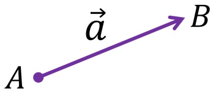

物理上的矢量大多数不具备空间距离的含义，但是它们的大小和方向仍然可以用箭头的大小和方向来表示，而具体的数学表达形式则取决于坐标系的选取。以大家熟悉的直角坐标系为例，一个矢量可以分解为三个坐标轴方向的矢量之和，矢量的运算便可以分解成三个标量的运算：

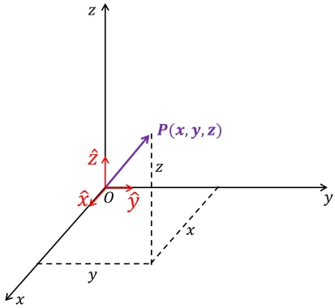

 $$ \vec{a}=x\hat{x}+y\hat{y}+z\hat{z} $$ 

在电磁学中，使用更为频繁的是柱坐标系和球坐标系，在这两个坐标系里的矢量表达式分别为:

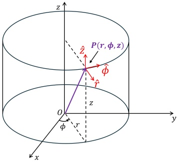

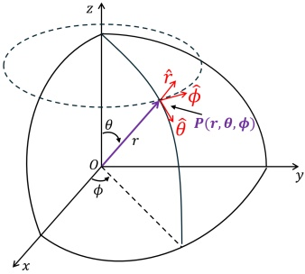

在电磁学的计算中，很重要的一点是根据物理量分布的特征，选取相应的坐标系以及合适的原点，有时候利用对称性和相应的坐标系可以减少变量，方程从三维变成一维。比如，研究有球对称性的物理体系（如点电荷），显然使用球坐标系更为方便。

 $$ \vec{a}=r\hat{\mathbf{r}}+\theta\hat{\boldsymbol{\theta}}+\phi\hat{\boldsymbol{\phi}} $$ 

 $$ \vec{a}=r\hat{\mathbf{r}}+\phi\hat{\boldsymbol{\phi}}+z\hat{\mathbf{z}} $$ 

物理上矢量的计算法则和数学中的向量的计算法则是一致的，常用的有：

#### 1.1.2 常见矢量计算公式

1. 矢量  $ \vec{r} $ 的模： $ |\vec{r}| = r = \sqrt{r_{x}^{2} + r_{y}^{2} + r_{z}^{2}} $

2. 单位矢量:  $ \hat{r} = \frac{\vec{r}}{|\vec{r}|} $

3. 矢量的加法遵循平行四边形法则和三角形法则，满足交换律和结合律

4. 矢量的减法可以看成是一个矢量加上与另一个矢量方向相反的矢量

5. 矢量的点乘： $ \vec{a} \cdot \vec{b} = |\vec{a}||\vec{b}|\cos\theta = a_x b_x + a_y b_y + a_z b_z $，其中  $ |\vec{a}|\cos\theta $ 可以理解为矢量  $ \vec{a} $ 在矢量  $ \vec{b} $ 方向上的投影长度；点乘满足交换律和分配律

6. 矢量的叉乘： $ \vec{c} = \vec{a} \times \vec{b} $，叉乘的结果是一个矢量，其中  $ \vec{c} $ 的方向垂直于  $ \vec{a} $ 与  $ \vec{b} $ 所在的平面（右手定则）， $ \vec{c} $ 的大小可以理解为当  $ \vec{a} $ 和  $ \vec{b} $ 始于相同点时它们所张成的平行四边形的面积（ $ |\vec{c}| = |\vec{a}| |\vec{b}| \sin \theta $）；叉乘满足分配律；在正交的坐标系（如直角坐标系、柱坐标系、球坐标系）中矢量的叉乘计算方法如下（ $ \hat{i}, \hat{j}, \hat{k} = \hat{x}, \hat{y}, \hat{z}/\hat{r}, \hat{\phi}, \hat{z}/\hat{r}, \hat{\theta}, \hat{\phi} $）：

 $$ \hat{\boldsymbol{i}}\times\hat{\boldsymbol{j}}=\hat{\boldsymbol{k}},\hat{\boldsymbol{j}}\times\hat{\boldsymbol{k}}=\hat{\boldsymbol{i}},\hat{\boldsymbol{k}}\times\hat{\boldsymbol{i}}=\hat{\boldsymbol{j}} $$ 

 $$ \begin{aligned}\vec{c}&=\vec{a}\times\vec{b}=(a_{i}\hat{i}+a_{j}\hat{j}+a_{k}\hat{k})\times(b_{i}\hat{i}+b_{j}\hat{j}+b_{k}\hat{k})\\&=(a_{j}b_{k}-a_{k}b_{j})\hat{i}+(a_{k}b_{i}-a_{i}b_{k})\hat{j}+(a_{i}b_{j}-a_{j}b_{i})\hat{k}\end{aligned} $$ 

7. 三个矢量的混合积/三重积： $ \vec{a} \cdot (\vec{b} \times \vec{c}) $，其结果是一个标量，该值可以理解为  $ \vec{a} $、 $ \vec{b} $ 和

始于同一点时它们所张成的平行六面体的体积，从而有下述等式：

 $$ \vec{a}\cdot(\vec{b}\times\vec{c})=\vec{b}\cdot(\vec{c}\times\vec{a})=\vec{c}\cdot(\vec{a}\times\vec{b}) $$ 

8. 双叉乘： $ \vec{a} \times (\vec{b} \times \vec{c}) $，该结果是一个矢量，其方向垂直于  $ \vec{a} $，同时也位于  $ \vec{b} $ 和  $ \vec{c} $ 所在的平面，因而可以分解成  $ \vec{b} $ 和  $ \vec{c} $ 的线性叠加 $ ^{1} $：

 $$ \vec{a}\times(\vec{b}\times\vec{c})=\vec{b}(\vec{a}\cdot\vec{c})-\vec{c}(\vec{a}\cdot\vec{b}) $$ 

由此也可以得出下面的等式（雅可比等式）：

 $$ \vec{a}\times(\vec{b}\times\vec{c})+\vec{b}\times(\vec{c}\times\vec{a})+\vec{c}\times(\vec{a}\times\vec{b})=0 $$ 

矢量的计算在电磁学中非常常见，熟练掌握常见的矢量计算对于电磁学的学习有重要意义。比如，我们中学时候学过的带电粒子在磁场中的受力（洛伦兹力）就是以矢量的叉乘来表示的。

#### 1.1.3 标量场和矢量场

历史上，物理学家们对于场的概念是经过一番争论的。传统上，物体与物体之间的相互作用力大多数是接触引起的；像电荷之间这种非接触式的相互作用力，现代观点认为该作用力不是两个带电粒子之间的直接相互作用，而是由其中一个带电粒子在空间中产生了场，而另外一个带电粒子在空间中的某一点感受到了这个场的作用力，场在这里就像一个媒介一样。这一场的概念在我们学习电磁波的时候尤为重要，比如当带电粒子运动时，其在远处产生的场是存在时间滞后的，这是由于电磁波的传播速度是有限的。电磁学中的数学主要是围绕电场和磁场的计算，计算两者在三维空间的分布。

物理上，场是指物理量的空间分布，根据物理量的性质可以分为标量场和矢量场，比如温度的空间分布是标量场，河水中的水流速度的空间分布是矢量场。

电磁学中，我们更关心的是标量场和矢量场（如电势、电场、磁场等）在空间中的变化情况，以及这些标量场在特定路径、表面或者体积内的积分情况。

以电磁学中最重要的方程组-麦克斯韦方程组为例，它的微分形式和积分形式分别为：

 $$ \nabla\cdot\vec{D}=\rho_{0} $$ 

 $$ \nabla\times\vec{E}=-\frac{\partial\vec{B}}{\partial t} $$ 

 $$ \nabla\cdot\vec{B}=0 $$ 

 $$ \nabla\times\vec{H}=\vec{J}+\frac{\partial\vec{D}}{\partial t} $$ 

 $$ \iint_{S}\vec{D}\cdot\mathrm{d}\vec{S}=\iiint_{V}\rho_{0}\mathrm{d}V $$ 

 $$ \oint_{L}\vec{E}\cdot\mathrm{d}\vec{l}=-\iint_{S}\frac{\partial\vec{B}}{\partial t}\cdot\mathrm{d}\vec{S} $$ 

 $$ \iint_{S}\vec{B}\cdot\mathrm{d}\vec{S}=0 $$ 

 $$ \oint_{L}\vec{H}\cdot\mathrm{d}\vec{l}=\iint_{S}\vec{J}\cdot\mathrm{d}\vec{S}+\iint_{S}\frac{\partial\vec{D}}{\partial t}\cdot\mathrm{d}\vec{S} $$ 

在学习上述方程组之前，我们有必要先学习（或回顾）这个方程组里面涉及到的两个重要的数学工具，即场的线、面和体积分，以及场的梯度、散度和旋度。

### 1.2 线积分、面积分和体积分

#### 1.2.1 线积分

我们常见的形如  $ \int_{a}^{b} f(x) \, dx $ 是函数  $ f(x) $ 在实数区间  $ [a, b] $ 上的积分，计算积分时函数沿着从 a 到 b 的一维区间取值，对于我们即将讨论的线积分（line integral），它的积分函数的取值是沿着被称为积分路径的特定三维曲线  $ (C) $，因此线积分也叫路径积分（path integral）。线积分中，被积函数可以是标量场，也可以是矢量场：

1. 标量场： $ \int_C f(\vec{r}) \, \mathrm{d}s $，其中  $ f(\vec{r}) $ 是被积的标量场， $ ds = |\vec{d}r| $ 是在  $ \vec{r} $ 处曲线的切向向量的长度，也可以看成该点处的一段很小的弧长（也称为线元，line element）。

2. 矢量场： $ \int_C \vec{f}(\vec{r}) \cdot d\vec{r} $，其中  $ \vec{f}(\vec{r}) $ 是被积的矢量场， $ d\vec{r} $ 是在  $ \vec{r} $ 处曲线的切向向量（也称为矢量线元，vector line element）。

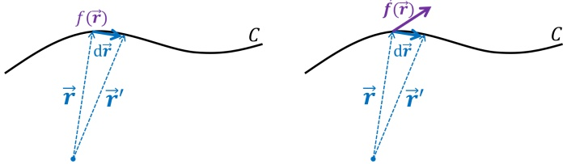

我们知道，空间中的一条曲线的方程可以用参数方程来表示，比如下式:

 $$ \vec{r}=\vec{r}(t)=x(t)\hat{x}+y(t)\hat{y}+z(t)\hat{z} $$ 

174 表示的是曲线  $ \vec{r} : [t_{0}, t_{1}] \to C $，其中  $ \vec{r}(t_{0}) $ 和  $ \vec{r}(t_{1}) $ 分别是曲线 C 的两个端点。比如，在 z = 0

175 平面上的以原点为中心，半径为 1 的圆可以写成如下参数方程：

 $$ x=\cos(\theta),\quad y=\sin(\theta),\quad z=0;\quad\theta:[0,2\pi] $$ 

176 利用曲线的参数方程，上述线积分也可以写成关于参数 t 的一个普通积分，为此，我们可以将 177 切向向量  $ \vec{d}\vec{r} $ 写成：

 $$ \mathrm{d}\vec{\boldsymbol{r}}=\frac{\mathrm{d}\vec{\boldsymbol{r}}(t)}{\mathrm{d}t}\mathrm{d}t=\vec{\boldsymbol{r}}^{\prime}(t)\mathrm{d}t $$ 

 $$ \mathrm{d}s=|\mathrm{d}\vec{\boldsymbol{r}}|=|\vec{\boldsymbol{r}}^{\prime}(t)|\mathrm{d}t $$ 

178 因此，上述标量场和矢量场的线积分就可以写成如下关于参数 t 的普通积分：

 $$ \int_{C}f(\vec{\boldsymbol{r}})\mathrm{d}s=\int_{t_{0}}^{t_{1}}f(\vec{\boldsymbol{r}}(t))|\vec{\boldsymbol{r}}^{\prime}(t)|\mathrm{d}t $$ 

 $$ \int_{C}\vec{\pmb{f}}(\vec{\pmb{r}})\cdot\mathrm{d}\vec{\pmb{r}}=\int_{t_{0}}^{t_{1}}\vec{\pmb{f}}(\vec{\pmb{r}}(t))\cdot\vec{\pmb{r}}^{\prime}(t)\mathrm{d}t $$ 

179 矢量场的线积分在物理学中非常常见，比如已知质点受到的某个外力随空间的变化（即外力场） $ \vec{F}(\vec{r}) $，则当质点沿着某一特定曲线 C 运动时，外力  $ \vec{F}(\vec{r}) $ 做的功可以写成：

 $$ W=\int_{C}\vec{F}(\vec{r})\cdot\mathrm{d}\vec{r} $$ 

181 例 1.1

质点沿如下螺旋线 C 运动  $ (t:0\rightarrow1) $:

 $$ x(t)=\cos(t),\quad y(t)=\sin(t),\quad z(t)=t $$ 

183 质点受到的力  $ \vec{F} $ 在各个方向上的分量的大小为：

 $$ F_{x}=y,\quad F_{y}=x,\quad F_{z}=z $$ 

184 求在此过程中力  $ \vec{F} $ 做的功（上述物理量的单位全部取国际单位制）。

185 解:

186 力  $ \vec{F} $ 做的功为：

 $$ \begin{aligned}W&=\int_{C}\vec{\mathbf{F}}(\vec{r})\cdot\mathrm{d}\vec{r}=\int_{0}^{1}\vec{\mathbf{F}}(\vec{r}(t))\cdot\vec{\mathbf{r}}^{\prime}(t)\mathrm{d}t=\int_{0}^{1}(y,x,z)\cdot(\cos^{\prime}(t),\sin^{\prime}(t),t^{\prime})\mathrm{d}t\\&=\int_{0}^{1}(\sin(t),\cos(t),t)\cdot(-\sin(t),\cos(t),1)\mathrm{d}t=\int_{0}^{1}(-\sin^{2}(t)+\cos^{2}(t)+t)\mathrm{d}t\\&=\int_{0}^{1}(\cos(2t)+t)\mathrm{d}t=(\frac{\sin(2t)}{2}+\frac{t^{2}}{2})|_{0}^{1}=\frac{\sin(2)}{2}+\frac{1}{2}\quad[N\cdot m]\end{aligned} $$ 

如果线积分中的曲线是一条闭合曲线（closed line integral），即从起点开始沿着曲线积分又回到起点，那么这种情况我们一般把线积分的符号由  $ \int_{C} $ 写成  $ \oint_{C} $。在力学中我们学过，质点从初始位置运动到结束位置，如果一个力对质点做的功与质点的运动路径无关，那么我们就把这个力称为保守力；这一说法也等价于当质点从某点出发，沿着闭合曲线运动回这点时，如果其所受力做的功为零，那么该力即为保守力 $ ^{2} $。在接下来的第1.3节讨论梯度和旋度的时候我们将进一步讨论保守力（或者与之对应的保守场）的一些性质。

#### 193 1.2.2 面积分

与三维空间中的曲线可以定义矢量线元  $ d\vec{r} $ 的定义类似，对于三维空间中的曲面，我们可以将这个曲面细分成多个小的面积元，对于每一个小的面积元我们可以定义一个矢量面积元  $ d\vec{S} $，其中  $ d\vec{S} $ 的大小  $ dS $ 是该面积元的面积，而  $ d\vec{S} $ 的方向是垂直于该面积元的法向方向，其中，法向的正负可以人为地约定其中一个方向为正，一般情况下，对于闭合曲面，我们约定指向闭合曲面外面的方向为正方向。

有了面积元的定义，我们就可以像线积分一样定义标量场和矢量场的面积分：

1. 标量场： $ \iint_{S}f\mathrm{d}S $，其中 f 为标量场，计算积分时该函数沿着曲面 S 取值

2. 矢量场： $ \iint_{S}\vec{f}\cdot\mathrm{d}\vec{S} $，其中  $ \vec{f} $ 为矢量场，计算积分时取该矢量场在曲面 S 的各个面积元处的值

与三维空间中的曲线可以用含一个参数的参数方程  $ \vec{r}(t) $ 来表示类似，三维空间中的曲面可以用含两个参数的参数方程  $ \vec{r}(s,t) $ 来表示，比如下式：

 $$ \vec{r}=\vec{r}(s,t)=x(s,t)\hat{x}+y(s,t)\hat{y}+z(s,t)\hat{z} $$ 

205 表示的是曲面  $ \vec{r} : [s_{0}, s_{1}] \times [t_{0}, t_{1}] \rightarrow S $。比如，以原点为中心，半径为 1 的球面可以写成如下参

206 数方程：

 $$ x=\sin\theta\cos\phi,\quad y=\sin\theta\sin\phi,\quad z=\cos\theta;\quad\theta\in[0,\pi],\phi\in[0,2\pi] $$ 

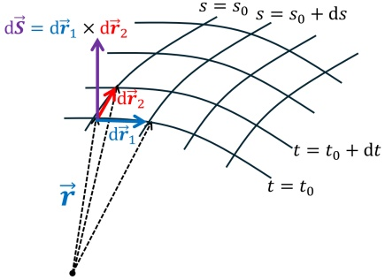

207

208 如上图所示，结合向量叉乘的几何意义（面积），我们可以利用曲面的参数方程，将面积元  $ \mathrm{d}\vec{S} $ 写成：

 $$ \mathrm{d}\vec{\boldsymbol{S}}=\mathrm{d}\vec{\boldsymbol{r}}_{1}\times\mathrm{d}\vec{\boldsymbol{r}}_{2},\quad\mathrm{d}\vec{\boldsymbol{r}}_{1}=\frac{\partial\vec{\boldsymbol{r}}(s,t)}{\partial s}\mathrm{d}s,\quad\mathrm{d}\vec{\boldsymbol{r}}_{2}=\frac{\partial\vec{\boldsymbol{r}}(s,t)}{\partial t}\mathrm{d}t $$ 

 $$ \Rightarrow\mathrm{d}\vec{S}=\frac{\partial\vec{r}(s,t)}{\partial s}\times\frac{\partial\vec{r}(s,t)}{\partial t}\mathrm{d}s\mathrm{d}t $$ 

 $$ \mathrm{d}S=\left|\frac{\partial\vec{\boldsymbol{r}}(s,t)}{\partial s}\times\frac{\partial\vec{\boldsymbol{r}}(s,t)}{\partial t}\right|\mathrm{d}s\mathrm{d}t $$ 

210 因此，上述标量场和矢量场的面积分便可以写成关于参数 s 和 t 的普通二重积分：

 $$ \iint_{S}f\mathrm{d}S=\iint_{S}f(\vec{\mathbf{r}}(s,t))\Big|\frac{\partial\vec{\mathbf{r}}(s,t)}{\partial s}\times\frac{\partial\vec{\mathbf{r}}(s,t)}{\partial t}\Big|\mathrm{d}s\mathrm{d}t $$ 

 $$ \iint_{S}\vec{f}\cdot\mathrm{d}\vec{S}=\iint_{S}\vec{f}(\vec{r}(s,t))\cdot\left(\frac{\partial\vec{r}(s,t)}{\partial s}\times\frac{\partial\vec{r}(s,t)}{\partial t}\right)\mathrm{d}s\mathrm{d}t $$ 

211 例 1.2

212 在柱坐标系中，求以 z 轴为对称轴、半径为 r 的圆柱面上位于  $ (r,\phi,z) $ 处的面积元 d $ \vec{S} $

213 解:

如右图所示，可知  $ \mathrm{d}\vec{S} $ 与  $ \vec{r} $ 同向，其大小为：

 $$ \mathrm{d}S=\left|\mathrm{d}\vec{r}_{1}\times\mathrm{d}\vec{r}_{2}\right|=r\mathrm{d}\phi\mathrm{d}z $$ 

因此，柱坐标系的圆柱面的面元为：

 $$ \mathrm{d}\vec{S}=\hat{\boldsymbol{r}}r\mathrm{d}\phi\mathrm{d}z $$ 

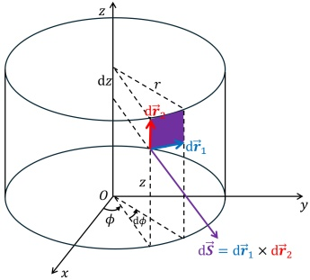

此外，也可以直接通过圆柱面的参数方程求解：首先，我们已知圆柱面的参数方程为：

 $$ \vec{r}(\phi,z)=(r\cos\phi,r\sin\phi,z) $$ 

215 将  $ \vec{r} $ 对  $ \phi $ 和 z 求偏导，可得：

 $$ \frac{\partial\vec{r}}{\partial\phi}=(-r\sin\phi,r\cos\phi,0) $$ 

 $$ \frac{\partial\vec{\bf r}}{\partial z}=(0,0,1) $$ 

216 因而：

 $$ \mathrm{d}\vec{S}=\frac{\partial\vec{r}}{\partial\phi}\times\frac{\partial\vec{r}}{\partial z}\mathrm{d}\phi\mathrm{d}z $$ 

 $$ =(-r\sin\phi,r\cos\phi,0)\times(0,0,1)\mathrm{d}\phi\mathrm{d}z $$ 

 $$ =(r\cos\phi,r\sin\phi,0)\mathrm{d}\phi\mathrm{d}z $$ 

 $$ =\hat{\boldsymbol{r}}\mathrm{r}\mathrm{d}\phi\mathrm{d}z $$ 

请注意，在上面的推导过程中，我们把圆柱面的参数方程写到了直角坐标系中（即： $ \vec{r} = r \cos \phi \hat{x} + r \sin \phi \hat{y} + z \hat{z} $），而不是写到柱坐标系中（即： $ \vec{r} = r \hat{r} + \phi \hat{\phi} + z \hat{z} $），这是因为，如果使用后者，那么在求诸如  $ \frac{\partial \vec{r}}{\partial \phi} $ 偏导时，我们就要考虑单位矢量  $ \hat{r} $ 对  $ \phi $ 的偏导（ $ \phi $ 变化时， $ \hat{r} $ 也会变），但是如果采用前者的直角坐标系，由于单位矢量  $ \hat{x}, \hat{y}, \hat{z} $ 不会随着  $ \phi $ 或者  $ z $ 的改变而改变，因而只需要考虑坐标值本身的偏导就可以了。类似这样的处理方法在本书的后面部分还会经常使用。

222 例 1.3

223 在球坐标系中，求以原点为球心、半径为 r 的球面上位于  $ (r, \theta, \phi) $ 处的面积元  $ \mathrm{d}\vec{S} $

224 解:

如右图所示，可知  $ \vec{dS} $ 与  $ \vec{r} $ 相同，其大小为：

 $$ \mathrm{d}S=\left|\mathrm{d}\vec{r}_{1}\times\mathrm{d}\vec{r}_{2}\right|=(r\mathrm{d}\theta)(r\sin\theta\mathrm{d}\phi)=r^{2}\sin\theta\mathrm{d}\theta\mathrm{d}\phi $$ 

因此，球坐标系中的球面的面元为：

 $$ \mathrm{d}\vec{S}=\hat{\boldsymbol{r}}r^{2}\sin\theta\mathrm{d}\theta\mathrm{d}\phi $$ 

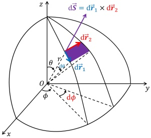

此外，也可以直接通过球面的参数方程求解：首先，我们已知球面的参数方程为：

 $$ \vec{r}(\theta,\phi)=(r\sin\theta\cos\phi,r\sin\theta\sin\phi,r\cos\theta) $$ 

226 将  $ \vec{r} $ 对  $ \theta $ 和  $ \phi $ 求偏导，可得：

 $$ \frac{\partial\vec{r}}{\partial\theta}=\left(r\cos\theta\cos\phi,r\cos\theta\sin\phi,-r\sin\theta\right) $$ 

 $$ \frac{\partial\vec{\mathbf{r}}}{\partial\phi}=(-r\sin\theta\sin\phi,r\sin\theta\cos\phi,0) $$ 

227 因而：

 $$ \begin{aligned}\vec{\mathbf{S}}&=\frac{\partial\vec{\mathbf{r}}}{\partial\theta}\times\frac{\partial\vec{\mathbf{r}}}{\partial\phi}\mathrm{d}\theta\mathrm{d}\phi\\&=(r\cos\theta\cos\phi,r\cos\theta\sin\phi,-r\sin\theta)\times(-r\sin\theta\sin\phi,r\sin\theta\cos\phi,0)\mathrm{d}\theta\mathrm{d}\phi\\&=(r^{2}\sin^{2}\theta\cos\phi,r^{2}\sin^{2}\theta\sin\phi,r^{2}\sin\theta\cos\theta\cos^{2}\phi+r^{2}\sin\theta\cos\theta\sin^{2}\phi)\mathrm{d}\theta\mathrm{d}\phi\\&=r^{2}\sin\theta(\sin\theta\cos\phi,\sin\theta\sin\phi,\cos\theta)\mathrm{d}\theta\mathrm{d}\phi\\&=\hat{\mathbf{r}}r^{2}\sin\theta\mathrm{d}\theta\mathrm{d}\phi\\ \end{aligned} $$ 

228 面积分在物理学中有很多应用，以电磁学中常用的电流的概念为例：我们熟知的电流的定义是单位时间通过某一截面的总电荷量：

 $$ I=\frac{\mathrm{d}Q}{\mathrm{d}t} $$ 

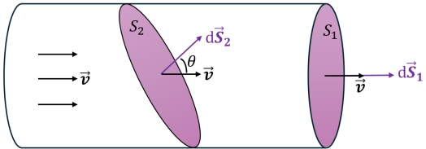

231 如上图所示的一段导线内，假设导体内自由电荷密度  $ \rho $ 和电荷的运动速度  $ \vec{v} $ 处处相等，则显然

232 单位时间通过截面  $ S_{1} $ 和  $ S_{2} $ 的总电荷量是相等的，但是截面  $ S_{1} $ 和  $ S_{2} $ 的面积并不相等，此时，

233 我们可以使用面积分将电流的定义和截面联系起来：

 $$ \begin{aligned}&I=\frac{\mathrm{d}Q}{\mathrm{d}t}=\frac{\rho v\mathrm{d}tS_{1}}{\mathrm{d}t}=\rho vS_{1}=\iint_{S_{1}}\rho\vec{\boldsymbol{v}}\cdot\mathrm{d}\vec{\boldsymbol{S}}\\&I=\frac{\mathrm{d}Q}{\mathrm{d}t}=\frac{\rho v\mathrm{d}tS_{2}\cos\theta}{\mathrm{d}t}=\rho vS_{2}\cos\theta=\iint_{S_{2}}\rho\vec{\boldsymbol{v}}\cdot\mathrm{d}\vec{\boldsymbol{S}}\\ \end{aligned} $$ 

我们把单位时间通过某个面积的物质总量，称为这个面积上的物质的通量（flux），通量是个标量；相对应地，我们把单位面积上的通量，称之为通量密度，通量密度是个矢量。在上述电流的例子中，电流可以看成是自由电荷这一“物质”的通量，而通量密度就是上式中的  $ \rho\vec{v} $，也称为电流密度（ $ \vec{J} $），即：

 $$ I=\iint_{S}\vec{J}\cdot\mathrm{d}\vec{S} $$ 

通量的概念可以延伸到一般的矢量场，对于一般的矢量场  $ \vec{F} $，则  $ \vec{F} $ 本身可以看成是通量密度，而通量密度在某个面积  $ \vec{S} $ 上的面积分就是这个矢量场在该面积上的通量 $ ^{3} $，我们一般用符号  $ \Phi $ 来表示：

 $$ \Phi=\iint_{S}\vec{F}\cdot\mathrm{d}\vec{S} $$ 

如果计算面积分（或通量）时的曲面是一个闭合曲面，那么这种情况我们一般把面积分的符号由  $ \iint_{S} $ 写成  $ \oint_{S} $。在第1.3节我们将知道，矢量场通过一个闭合曲面的通量是否为零，取决于这个闭合曲面内部是否存在产生这个矢量场的源；如果闭合曲面内部没有源，那从曲面的一侧进来的通量将从另一侧离开，即最后这个闭合曲面的净通量将为零。

#### 245 1.2.3 体积分

体积分相对于前面学习的线积分和面积分来说是最直观的，因为体积只是个标量，所以一般我们也只是对标量场进行体积分，其物理含义也很容易理解，比如对密度场进行体积分得到的就是总质量，对电荷密度进行体积分得到的就是总电荷，等等。一般标量场  $ \phi(\vec{r}) $ 的体积分可以写成：

 $$ \iiint_{V}\phi(\vec{\boldsymbol{r}})\mathrm{d}V $$ 

其中，$\mathrm{d}V$ 是 $\vec{r}$ 处的体积元。如下图所示，对于任意一个三维坐标系 $(\hat{i}, \hat{j}, \hat{k})$，在 $\vec{r}$ 处的体积元，就是 $\mathrm{d}\vec{r}_{i}, \mathrm{d}\vec{r}_{j}, \mathrm{d}\vec{r}_{k}$ 这三个线元所张成的平行六面体的体积，而由矢量的混合积的几何意义我们知道，这个平行六面体的体积可以写成这三个线元的混合积：

 $$ \begin{aligned}\mathrm{d}V&=\mathrm{d}\vec{r}_{i}\cdot(\mathrm{d}\vec{r}_{j}\times\mathrm{d}\vec{r}_{k})\\&=(\frac{\partial\vec{r}}{\partial i}\mathrm{d}i)\cdot\left((\frac{\partial\vec{r}}{\partial j}\mathrm{d}j)\times(\frac{\partial\vec{r}}{\partial k}\mathrm{d}k)\right)\\&=\frac{\partial\vec{r}}{\partial i}\cdot\left(\frac{\partial\vec{r}}{\partial j}\times\frac{\partial\vec{r}}{\partial k}\right)\mathrm{d}i\mathrm{d}j\mathrm{d}k\end{aligned} $$ 

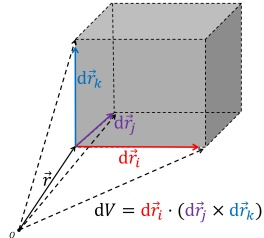

下面我们将分别计算在几种典型的坐标系中的体积元的表达式：

1\. 直角坐标系：

 $$ \begin{aligned}\vec{\boldsymbol{r}}&=(x,y,z)\\\frac{\partial\vec{\boldsymbol{r}}}{\partial x}&=(1,0,0),\quad\frac{\partial\vec{\boldsymbol{r}}}{\partial y}=(0,1,0),\quad\frac{\partial\vec{\boldsymbol{r}}}{\partial z}=(0,0,1)\end{aligned} $$ 

 $$ \begin{aligned}\mathrm{d}V&=\frac{\partial\vec{r}}{\partial x}\cdot\left(\frac{\partial\vec{r}}{\partial y}\times\frac{\partial\vec{r}}{\partial z}\right)\mathrm{d}x\mathrm{d}y\mathrm{d}z\\&=(1,0,0)\cdot\left((0,1,0)\times(0,0,1)\right)\mathrm{d}x\mathrm{d}y\mathrm{d}z\\&=(1,0,0)\cdot(1,0,0)\mathrm{d}x\mathrm{d}y\mathrm{d}z\\&=\mathrm{d}x\mathrm{d}y\mathrm{d}z\end{aligned} $$ 

显然，对于直角坐标系，我们也可以通过下图很直观地看出， $ \vec{r} $ 处的三个线元的大小分别是 dx, dy, dz，且它们之间互相垂直，因此体积元就是 dxdydz。

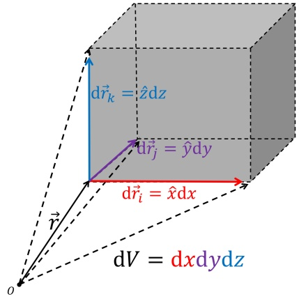

2. 柱坐标系：

 $$ \vec{r}=(r\cos\phi,r\sin\phi,z) $$ 

 $$ \frac{\partial\vec{\mathbf{r}}}{\partial r}=(\cos\phi,\sin\phi,0) $$ 

 $$ \frac{\partial\vec{r}}{\partial\phi}=(-r\sin\phi,r\cos\phi,0) $$ 

 $$ \frac{\partial\vec{\bf r}}{\partial z}=(0,0,1) $$ 

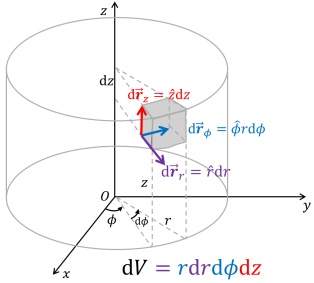

 $$ \begin{aligned}\mathrm{d}V=&\frac{\partial\vec{r}}{\partial r}\cdot\left(\frac{\partial\vec{r}}{\partial\phi}\times\frac{\partial\vec{r}}{\partial z}\right)\mathrm{d}r\mathrm{d}\phi\mathrm{d}z\\=&(\cos\phi,\sin\phi,0)\cdot\left((-r\sin\phi,r\cos\phi,0)\times(0,0,1)\right)\mathrm{d}r\mathrm{d}\phi\mathrm{d}z\\=&(\cos\phi,\sin\phi,0)\cdot(r\cos\phi,r\sin\phi,0)\mathrm{d}r\mathrm{d}\phi\mathrm{d}z\\=&r\mathrm{d}r\mathrm{d}\phi\mathrm{d}z\end{aligned} $$ 

260 当然我们也可以通过上面右侧的示意图直观地得出  $ dV = rdrd\phi dz $ 的结论。

### 3. 球坐标系：

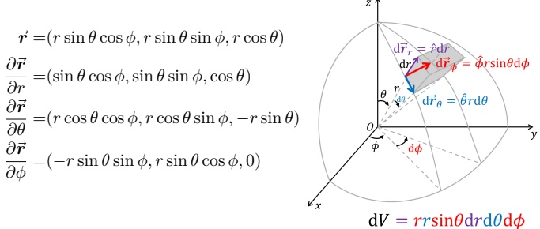

 $$ \begin{aligned}\vec{r}=&(r\sin\theta\cos\phi,r\sin\theta\sin\phi,r\cos\theta)\\\frac{\partial\vec{r}}{\partial r}=&(\sin\theta\cos\phi,\sin\theta\sin\phi,\cos\theta)\\\frac{\partial\vec{r}}{\partial\theta}=&(r\cos\theta\cos\phi,r\cos\theta\sin\phi,-r\sin\theta)\\\frac{\partial\vec{r}}{\partial\phi}=&(-r\sin\theta\sin\phi,r\sin\theta\cos\phi,0)\end{aligned} $$ 

 $$ \begin{aligned}\mathrm{d}V=&\frac{\partial\vec{r}}{\partial r}\cdot\left(\frac{\partial\vec{r}}{\partial\theta}\times\frac{\partial\vec{r}}{\partial\phi}\right)\mathrm{d}r\mathrm{d}\theta\mathrm{d}\phi\\=&(\sin\theta\cos\phi,\sin\theta\sin\phi,\cos\theta)\cdot\\&\left((r\cos\theta\cos\phi,r\cos\theta\sin\phi,-r\sin\theta)\times(-r\sin\theta\sin\phi,r\sin\theta\cos\phi,0)\right)\mathrm{d}r\mathrm{d}\phi\mathrm{d}z\\=&r^{2}\sin\theta\mathrm{d}r\mathrm{d}\theta\mathrm{d}\phi\end{aligned} $$ 

同样的，我们也可以通过上面右侧的示意图直观地得出  $  \mathrm{d}V = r^2 \sin \theta \, \mathrm{d}r \, \mathrm{d}\theta \, \mathrm{d}\phi  $ 的结论。

### 1.3 梯度、散度和旋度

在电磁学中，我们经常要分析场随时间和空间的变化，其中时间是个标量，场随时间的变化可以直接使用常见的对时间求微分来计算，比如，对于一个矢量场  $ \vec{f}(\vec{r},t) $，它对时间的微分为：

 $$ \frac{\mathrm{d}\vec{f}}{\mathrm{d}t}=\frac{\mathrm{d}f_{x}}{\mathrm{d}t}\hat{\boldsymbol{x}}+\frac{\mathrm{d}f_{y}}{\mathrm{d}t}\hat{\boldsymbol{y}}+\frac{\mathrm{d}f_{z}}{\mathrm{d}t}\hat{\boldsymbol{z}} $$ 

电磁学里更有趣的是场随空间的变化，由于三维空间有三个自由度 x, y, z，因此，需要分别研究场在三个不同方向  $ \hat{x}, \hat{y}, \hat{z} $ 的变化，接下来我们将讨论如何分析标量场和矢量场随着空间的变化情况。

#### 1.3.1 梯度

对于标量场  $ U(\vec{r}) $，如果我们把它在三个方向的变化放到一起组成一个矢量，则我们便可以定义一个新的量，我们称之为标量场  $ U(\vec{r}) $ 的梯度（gradient）：

 $$ \nabla U=\hat{\mathbf{x}}\frac{\partial U}{\partial x}+\hat{\mathbf{y}}\frac{\partial U}{\partial y}+\hat{z}\frac{\partial U}{\partial z} $$ 

其中  $ \nabla $ 为矢量算符 (Nabla 算符):

 $$ \nabla=(\frac{\partial}{\partial x},\frac{\partial}{\partial y},\frac{\partial}{\partial z}) $$ 

下面我们来分析一下梯度的物理含义，即它的大小和方向分别包含什么信息。通过微积分里的全微分（泰勒展开），我们知道，一个标量场 U 在  $ \vec{r} = (x, y, z) $ 处沿  $ \mathrm{d}\vec{r} = (\mathrm{d}x, \mathrm{d}y, \mathrm{d}z) $ 的变化（即  $ U(\vec{r} + \mathrm{d}\vec{r}) - U(\vec{r}) $）为：

 $$ \mathrm{d}U=\frac{\partial U}{\partial x}\mathrm{d}x+\frac{\partial U}{\partial y}\mathrm{d}y+\frac{\partial U}{\partial z}\mathrm{d}z $$ 

278 上式也可写成：

 $$ \begin{aligned}\mathrm{d}U&=(\frac{\partial U}{\partial x},\frac{\partial U}{\partial y},\frac{\partial U}{\partial z})\cdot(\mathrm{d}x,\mathrm{d}y,\mathrm{d}z)\\&=\nabla U\cdot\mathrm{d}\vec{r}\end{aligned} $$ 

79 我们不妨在标量场的等势面上（即  $ U(x,y,z) = \text{constant} $ 的点所组成的平面）处取一点  $ \vec{r} $ 以及该点沿着等势面的切线  $ \mathrm{d}\vec{r} $，由于  $ \mathrm{d}\vec{r} $ 沿着等势面的切线，因此 U 沿着  $ \mathrm{d}\vec{r} $ 的变化为 0，即  $ 81 \mathrm{~d}U = U(\vec{r} + \mathrm{d}\vec{r}) - U(r) = 0 $，从而有：

 $$ \nabla U\cdot\mathrm{d}\vec{r}=0 $$ 

282 也就是说，∇U 的方向与等势面的切线方向垂直，即：∇U 的方向平行于等势面的法向。现在，

283 我们再把  $ d\vec{r} $ 改成等势面的法线方向，那么我们知道：

 $$ \mathrm{d}U=\nabla U\cdot\mathrm{d}\vec{r}=|\nabla U||\mathrm{d}\vec{r}| $$ 

284 即：此时  $ |\nabla U| = \frac{\mathrm{d}U}{|\mathrm{d}\vec{r}|} $，也就是说， $ \nabla U $ 的大小，等于 U 在等势面法向方向的导数。

在第1.2节学习线积分的时候，我们提到了保守力的概念：即如果一个力对质点做的功与质点的运动路径无关，那么我们就把这个力称为保守力。保守力的概念可以延伸到一般的矢量场，即如果一个矢量场  $ \vec{F} $ 的线积分与从起点到终点的具体路径无关，那么我们把这种矢量场称为保守场。关于保守场，我们还有一个定理，即：

### 定理 1.1 梯度定理

如果一个矢量场  $ \vec{F} $ 可以写成一个标量场的梯度  $ \vec{F} = \nabla \Phi $，那么这个矢量场  $ \vec{F} $ 是保守场。

290 证明：

取空间中的任意两点 A 和 B，如果  $ \vec{F} $ 可以写成  $ \vec{F} = \nabla \Phi $，那么  $ \vec{F} $ 从 A 到 B 沿某一路径 C 的线积分为：

 $$ \int_{C}\vec{F}\cdot\mathrm{d}\vec{r}=\int_{C}\nabla\Phi\cdot\mathrm{d}\vec{r}=\int_{C}\mathrm{d}\Phi=\Phi(B)-\Phi(A) $$ 

293 可知，该线积分的值  $ \Phi(B) - \Phi(A) $ 只与 A 点和 B 点的  $ \Phi $ 值之差有关，与从 A 到 B 取哪条路径无关，因此  $ \vec{F} $ 是保守场。

实际上，上述定理反过来说也是成立的（梯度定理的逆定理），即：如果  $ \vec{F} $ 是一个保守场，那  $ \vec{F} $ 一定可以写成一个标量场的梯度的形式  $ \vec{F} = \nabla \Phi $。证明很简单，因为当  $ \vec{F} $ 是保守场时，我们可以这样定义  $ \Phi(\vec{r}) $：

 $$ \Phi(\vec{r})=\int_{C}\vec{F}\cdot\mathrm{d}\vec{r} $$ 

298 其中 C 是从原点到  $ \vec{r} $ 的任意一条曲线，由于  $ \vec{F} $ 是保守场，所以上述  $ \Phi(\vec{r}) $ 的值与具体路径无关，是唯一定义的。因此，根据积分的定义，我们有：

 $$ \mathrm{d}\Phi(\vec{r})=\vec{F}\cdot\mathrm{d}\vec{r} $$ 

300 同时，根据上面关于梯度的定义，我们有：

 $$ \mathrm{d}\Phi(\vec{r})=\nabla\Phi\cdot\mathrm{d}\vec{r} $$ 

301 结合上述两式，可知：

 $$ \vec{F}\cdot\mathrm{d}\vec{r}=\nabla\Phi\cdot\mathrm{d}\vec{r} $$ 

302 且上式对任意  $ d\vec{r} $ 都是成立的，因而  $ \vec{F} = \nabla \Phi $。

#### 1.3.2 散度

当我们考虑一个矢量场  $ \vec{F} $ 随着空间的变化的时候，我们不仅要考虑空间中的三个自由度 x, y, z，还需要考虑矢量场本身有三个分量  $ F_{x}, F_{y}, F_{z} $，而每个分量都会随着 x, y, z 的改变而改变，因此总共存在 9 个微分量：

 $$ \begin{aligned}\frac{\partial F_{x}}{\partial x},&\quad\frac{\partial F_{x}}{\partial y},&\frac{\partial F_{x}}{\partial z}\\\frac{\partial F_{y}}{\partial x},&\quad\frac{\partial F_{y}}{\partial y},&\frac{\partial F_{y}}{\partial z}\\\frac{\partial F_{z}}{\partial x},&\quad\frac{\partial F_{z}}{\partial y},&\frac{\partial F_{z}}{\partial z}\end{aligned} $$ 

307 从这 9 个微分量中，我们可以通过组合其中某些微分量得到具有重要物理含义的一些量，比如，308 我们将上面  $ 3 \times 3 $ 个微分量里面的对角线上的 3 个相加，可以得到一个标量，我们称之为矢量 309 场  $ \vec{F} $ 的散度 (divergence)：

 $$ \mathrm{div}\vec{F}=\frac{\partial F_{x}}{\partial x}+\frac{\partial F_{y}}{\partial y}+\frac{\partial F_{z}}{\partial z} $$ 

310 矢量场的散度是一个标量，它也可以写成  $ \nabla $ 和  $ \vec{F} $ 的点乘的形式：

 $$ \mathrm{div}\vec{F}=\frac{\partial F_{x}}{\partial x}+\frac{\partial F_{y}}{\partial y}+\frac{\partial F_{z}}{\partial z}=(\frac{\partial}{\partial x},\frac{\partial}{\partial y},\frac{\partial}{\partial z})\cdot(F_{x},F_{y},F_{z})=\nabla\cdot\vec{F} $$ 

需要说明的是，上述关于散度的定义只是单纯的从数学上组合部分  $ \vec{F} $ 的空间变化的偏微分量给出的，仅从这个数学上的组合是很难看出其物理含义的。关于散度，还有一个更具有物理含义的定义，即：矢量场  $ \vec{F} $ 在空间  $ \vec{r} $ 处的散度，是指该矢量场在包含  $ \vec{r} $ 的一个无穷小的闭合曲面 S 上的通量，除以该闭合曲面所围起来的空间的体积 dV：

 $$ \mathrm{div}\vec{F}=\lim_{\mathrm{d}V\rightarrow0}\frac{\oint_{S}\vec{F}\cdot\mathrm{d}\vec{S}}{\mathrm{d}V} $$ 

也就是说，散度这个量表征的是矢量场的“场线”在某一点的发散或者会聚程度（因此取名“散度”）， $ \operatorname{div}\vec{F}>0 $ 表示在这一点  $ \vec{F} $ 是向外发散的， $ \operatorname{div}\vec{F}<0 $ 则表示在这一点  $ \vec{F} $ 是向内会聚的，而  $ \operatorname{div}\vec{F}=0 $ 则表示在这一点既不发散也不会聚（即：有多少场线进来就有多少出去）。

下面，我们将证明，上述1.57式和1.58式关于  $ \vec{F} $ 的散度的定义是等价的。如右图所示，取直角坐标系在空间中某点  $ \vec{r} = (x, y, z) $ 处，以该点为中心取边为 dx, dy, dz 的长方体，下面我们来计算矢量场  $ \vec{F} $ 在该长方体的六个表面组成的闭合曲面上的通量。

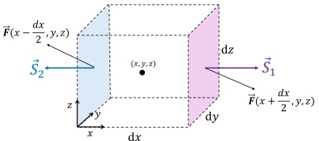

321 以图中相对的两个面  $ \vec{S}_{1} $ 和  $ \vec{S}_{2} $ 为例， $ \vec{F} $ 在这两个面上的通量之和为：

 $$ \begin{aligned}\iint_{\vec{S}_{1}+\vec{S}_{2}}\vec{F}\cdot\mathrm{d}\vec{S}&=\vec{F}(x+\frac{\mathrm{d}x}{2},y,z)\cdot\vec{S}_{1}+\vec{F}(x-\frac{\mathrm{d}x}{2},y,z)\cdot\vec{S}_{2}\\&=F_{x}(x+\frac{\mathrm{d}x}{2},y,z)\mathrm{d}y\mathrm{d}z-F_{x}(x-\frac{\mathrm{d}x}{2},y,z)\mathrm{d}y\mathrm{d}z\\&=\left[F_{x}(x+\frac{\mathrm{d}x}{2},y,z)-F_{x}(x-\frac{\mathrm{d}x}{2},y,z)\right]\mathrm{d}y\mathrm{d}z\\&=\left[\frac{\partial F_{x}}{\partial x}\mathrm{d}x\right]\mathrm{d}y\mathrm{d}z\\&=\frac{\partial F_{x}}{\partial x}\mathrm{d}V\end{aligned} $$ 

322 同理可得，前后和上下两个面的  $ \vec{F} $ 的通量之和将分别为  $ \frac{\partial F_{y}}{\partial y}dV $ 和  $ \frac{\partial F_{z}}{\partial z}dV $，因此， $ \vec{F} $ 在该长方体的六个表面组成的闭合曲面 S 上的总通量为：

 $$ \begin{aligned}\oint_{S}\vec{F}\cdot\mathrm{d}\vec{S}&=\frac{\partial F_{x}}{\partial x}\mathrm{d}V+\frac{\partial F_{y}}{\partial y}\mathrm{d}V+\frac{\partial F_{z}}{\partial z}\mathrm{d}V\\&=\left(\frac{\partial F_{x}}{\partial x}+\frac{\partial F_{y}}{\partial y}+\frac{\partial F_{z}}{\partial z}\right)\mathrm{d}V\\&=(\nabla\cdot\vec{F})\mathrm{d}V\end{aligned} $$ 

324 因此，1.58式关于  $ \vec{F} $ 的散度的定义可以写成：

 $$ \begin{aligned}\mathrm{div}\vec{F}&=\lim_{\mathrm{d}V\rightarrow0}\frac{\oint_{S}\vec{F}\cdot\mathrm{d}\vec{S}}{\mathrm{d}V}\\&=\lim_{\mathrm{d}V\rightarrow0}\frac{(\nabla\cdot\vec{F})\mathrm{d}V}{\mathrm{d}V}\\&=\nabla\cdot\vec{F}\end{aligned} $$ 

325 这就得到了1.57式关于  $ \vec{F} $ 的散度的定义。

326 上面的关于散度的两种定义以及证明过程也告诉我们，对于足够小的体积 V 以及其外表面对应的闭合曲面 S，我们有下面等式：

 $$ \lim_{V\to0}\left(\iint_{S}\vec{F}\cdot\mathrm{d}\vec{S}-\iiint_{V}\nabla\cdot\vec{F}\mathrm{d}V\right)=0 $$ 

328 实际上，上面这个等式对于任意大小的体积及其外表面对应的闭合曲面都是成立的，而这一结论也被称为高斯定理：

定理 1.2 高斯定理

矢量场  $ \vec{F} $ 在任意闭合曲面 S 上的总通量，等于该矢量场的散度  $ \nabla \cdot \vec{F} $ 在 S 所包围的体积 V 内的体积分：

 $$ \iint_{S}\vec{F}\cdot\mathrm{d}\vec{S}=\iiint_{V}\nabla\cdot\vec{F}\mathrm{d}V $$ 

## 331 证明：

如图所示，对一任意闭合曲面 S 及其包围的体积 V，用一个曲面  $ S' $ 将该体积分成两部分，将这两部分的体积分别记为  $ V_{A} $ 和  $ V_{B} $， $ S' $ 也同时将闭合曲面 S 分成了两部分  $ S_{A} $ 和  $ S_{B} $。于是，矢量场  $ \vec{F} $ 在闭合曲面 S 上的总通量可以写成：

 $$ \iint_{S}\vec{F}\cdot\mathrm{d}\vec{S}=\iint_{\vec{S}_{A}}\vec{F}\cdot\mathrm{d}\vec{S}+\iint_{\vec{S}_{B}}\vec{F}\cdot\mathrm{d}\vec{S} $$ 

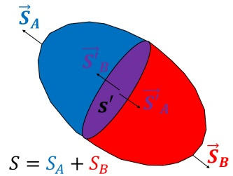

333 曲面  $ S' $ 有两个方向相反的法向  $ (\vec{S}_{A}^{\prime} $ 和  $ \vec{S}_{B}^{\prime}) $，且有：

 $$ \iint_{\vec{S}_{A}^{\prime}}\vec{F}\cdot\mathrm{d}\vec{S}+\iint_{\vec{S}_{B}^{\prime}}\vec{F}\cdot\mathrm{d}\vec{S}=0 $$ 

334 因此，1.64式可以写成：

 $$ \begin{aligned}\oint_{S}\vec{F}\cdot\mathrm{d}\vec{S}&=\iint_{\vec{S}_{A}}\vec{F}\cdot\mathrm{d}\vec{S}+\iint_{\vec{S}_{B}}\vec{F}\cdot\mathrm{d}\vec{S}+\left(\iint_{\vec{S}_{A}^{\prime}}\vec{F}\cdot\mathrm{d}\vec{S}+\iint_{\vec{S}_{B}^{\prime}}\vec{F}\cdot\mathrm{d}\vec{S}\right)\\&=\left(\iint_{\vec{S}_{A}}\vec{F}\cdot\mathrm{d}\vec{S}+\iint_{\vec{S}_{A}^{\prime}}\vec{F}\cdot\mathrm{d}\vec{S}\right)+\left(\iint_{\vec{S}_{B}}\vec{F}\cdot\mathrm{d}\vec{S}+\iint_{\vec{S}_{B}^{\prime}}\vec{F}\cdot\mathrm{d}\vec{S}\right)\\&=\iint_{\vec{S}_{A}+\vec{S}_{A}^{\prime}}\vec{F}\cdot\mathrm{d}\vec{S}+\iint_{\vec{S}_{B}+\vec{S}_{B}^{\prime}}\vec{F}\cdot\mathrm{d}\vec{S}\end{aligned} $$ 

也就是说，我们把矢量场  $ \vec{F} $ 在体积 V 的外表面这个闭合曲面 S 的通量，写成了  $ \vec{F} $ 在两个子体积  $ V_{A} $ 和  $ V_{B} $ 各自的外表面的闭合曲面  $ S_{A} + S_{A}^{\prime} $ 和  $ S_{B} + S_{B}^{\prime} $ 的通量之和，我们可以用同样的方法，继续对这两个子体积进行细分，直到将 V 细分成多个足够小的体积  $ V_{i} $ ( $ i = 1, 2, 3, \ldots, N $) 之和，且对每个  $ V_{i} $，我们可以使用1.62式：

 $$ \begin{aligned}\iint_{S}\vec{F}\cdot\mathrm{d}\vec{S}&=\sum_{i=1}^{N}\iint_{S_{i}}\vec{F}\cdot\mathrm{d}\vec{S}\\&=\sum_{i=1}^{N}\iiint_{V_{i}}\nabla\cdot\vec{F}\mathrm{d}V\\&=\iiint_{V}\nabla\cdot\vec{F}\mathrm{d}V\end{aligned} $$ 

339 这就证明了上述高斯定理（1.63式）。

由高斯定理我们知道，如果在闭合曲面内部矢量场的散度  $ \nabla \cdot \vec{F} $ 为 0（或者其体积分为 0），那么该矢量场在这个闭合曲面上的通量也为 0，也就是说从这个闭合曲面流出的场线和流入的场线是相同的，从这个角度来说，我们可以把散度  $ \nabla \cdot \vec{F} $ 理解为矢量场  $ \vec{F} $ 的“源”，即无源的地方场线既不会聚也不发散，有源的地方才存在场线的会聚或者发散。

#### 1.3.3 旋度

345 让我们再从数学上回到一个矢量场  $ \vec{F} $ 随空间的变化可能有的 9 个偏微分量：

 $$ \frac{\partial F_{x}}{\partial x},\quad\frac{\partial F_{x}}{\partial y},\quad\frac{\partial F_{x}}{\partial z} $$ 

 $$ \frac{\partial F_{y}}{\partial x},\quad\frac{\partial F_{y}}{\partial y},\quad\frac{\partial F_{y}}{\partial z} $$ 

 $$ \frac{\partial F_{z}}{\partial x},\quad\frac{\partial F_{z}}{\partial y},\quad\frac{\partial F_{z}}{\partial z} $$ 

346 在定义散度时，我们使用了上面对角线上的三个偏微分量  $ \frac{\partial F_{x}}{\partial x} $， $ \frac{\partial F_{y}}{\partial y} $， $ \frac{\partial F_{z}}{\partial z} $，这三个偏微分量表征的都是矢量场的各个分量在对应的分方向上的变化，最终得到的散度的定义物理上表示的也是矢量场的场线在空间中某点的发散（或会聚）程度。上述 9 个偏微分量中，除去  $ \frac{\partial F_{x}}{\partial x} $， $ \frac{\partial F_{y}}{\partial y} $， $ \frac{\partial F_{z}}{\partial z} $ 之外的剩下 6 个偏微分量描述的都是  $ \vec{F} $ 的各个分量在它们垂直方向上的变化，比如  $ \frac{\partial F_{x}}{\partial y} $ 描述的是  $ \vec{F} $ 的 x 方向上的分量在 y 方向的变化。

为了直观地理解矢量场的各个分量在其对应的垂直方向上发生变化时是怎样的物理图像，我们不妨考虑下面这样一个在 x-y 平面上的二维矢量场  $ \vec{F} $：如右图所示，假设  $ \frac{\partial F_{x}}{\partial y} > 0, \frac{\partial F_{y}}{\partial x} < 0 $，则从图中的 A 点沿着 B, C 到 D 点的这条路径上， $ F_{x} $ 逐渐增大， $ F_{y} $ 逐渐减小，而两者合成之后的矢量场  $ \vec{F} $ 的大小则基本上保持不变，但是  $ \vec{F} $ 的方向在发生变化，且其方向的变化使得  $ \vec{F} $ 看上去一直与从 A 到 D 的圆弧相切，即  $ \vec{F} $ 这个矢量场从 A 到 D 的变化像是沿顺时针方向在“旋转”。

事实上，在上面这种二维的情况下，如果我们定义一个量  $ A=\frac{\partial F_{y}}{\partial x}-\frac{\partial F_{x}}{\partial y} $，如果 A<0，那么  $ \vec{F} $ 在这一点的变化趋势就是类似于上面这个图像的顺时针旋转，反之，若 A>0，则  $ \vec{F} $ 的变化趋势就是逆时针旋转。如果我们进一步给 A 这个量加上一个方向，使得它沿着 z 轴的方向，把 +z 方向定义为逆时针旋转，把 -z 的方向定义为顺时针方向，那么矢量  $ \vec{A} $ 可以定义为：

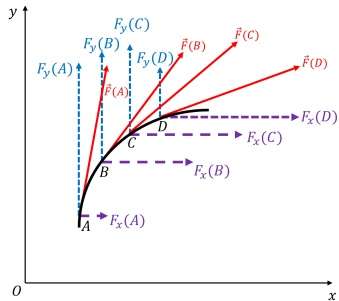

 $$ \vec{A}=\left(\frac{\partial F_{y}}{\partial x}-\frac{\partial F_{x}}{\partial y}\right)\hat{z} $$ 

356 这样我们就在二维的情况下利用矢量场  $ \vec{F} $ 的各个分量在其对应的垂直方向上的变化的偏微分量，定义了一个新的矢量  $ \vec{A} $， $ \vec{A} $ 能够表征  $ \vec{F} $ 随着空间的变化而“旋转”的情况。

上面提到的关于矢量场的“旋转”的图像，很容易让人联想到在第1.2节学习矢量场的线积分，比如对于上面提到的这种从 A 到 D 点  $ \vec{F} $ 向右旋转且  $ \vec{F} $ 的方向在各个地方都大致与路径的切线方向平行的情况， $ \vec{F} $ 从 A 到 D 的线积分必然将与个点的  $ A = \frac{\partial F_y}{\partial x} - \frac{\partial F_x}{\partial y} $ 这个量有关。为了定量的理解上面定义的  $ \vec{A} $ 矢量与  $ \vec{F} $ 的线积分的联系，我们不妨取右图中这样一个以  $ (x, y) $ 为中心，长宽分别为  $ dx, dy $ 的很小的长方形组成的闭合曲线，则  $ \vec{F} $ 在这一闭合曲线上的线积分为：

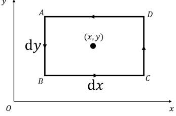

 $$ \begin{aligned}\oint_{ABCD}\vec{F}\cdot\mathrm{d}\vec{r}=&\int_{AB}\vec{F}\cdot\mathrm{d}\vec{r}+\int_{BC}\vec{F}\cdot\mathrm{d}\vec{r}+\int_{CD}\vec{F}\cdot\mathrm{d}\vec{r}+\int_{DA}\vec{F}\cdot\mathrm{d}\vec{r}\\=&\Big(-F_{y}(x-\frac{\mathrm{d}x}{2},y)\mathrm{d}y\Big)+\Big(F_{x}(x,y-\frac{\mathrm{d}y}{2})\mathrm{d}x\Big)+\\&\Big(F_{y}(x+\frac{\mathrm{d}x}{2},y)\mathrm{d}y\Big)+\Big(-F_{x}(x,y+\frac{\mathrm{d}y}{2})\mathrm{d}x\Big)\\=&\Big(F_{y}(x+\frac{\mathrm{d}x}{2},y)-F_{y}(x-\frac{\mathrm{d}x}{2},y)\Big)\mathrm{d}y-\Big(F_{x}(x,y+\frac{\mathrm{d}y}{2})-F_{x}(x,y-\frac{\mathrm{d}y}{2})\Big)\mathrm{d}x\\=&\Big(\frac{\partial F_{y}}{\partial x}\mathrm{d}x\Big)\mathrm{d}y-\Big(\frac{\partial F_{x}}{\partial y}\mathrm{d}y\Big)\mathrm{d}x\\=&\Big(\frac{\partial F_{y}}{\partial x}-\frac{\partial F_{x}}{\partial y}\Big)\mathrm{d}x\mathrm{d}y=\Big(\frac{\partial F_{y}}{\partial x}-\frac{\partial F_{x}}{\partial y}\Big)\mathrm{d}S\end{aligned} $$ 

359 结合上面我们关于矢量  $ \vec{A} $ 的定义，我们可以把上式进一步写成：

 $$ \oint_{C}\vec{F}\cdot\mathrm{d}\vec{r}=\iint_{S}\vec{A}\cdot\mathrm{d}\vec{S}\quad(S\rightarrow0) $$ 

360 或者写成：

 $$ A=\vec{A}\cdot\hat{z}=\frac{\partial F_{y}}{\partial x}-\frac{\partial F_{x}}{\partial y}=\frac{\oint_{C}\vec{F}\cdot\mathrm{d}\vec{r}}{\mathrm{d}S}\quad(\mathrm{d}S\rightarrow0) $$ 

61 即：上面在二维平面上定义的表征二维矢量场  $ \vec{F} $ 旋转程度的矢量  $ \vec{A} $，其在某处的大小等于  $ \vec{F} $ 在以该处为中心的一个小的闭合曲线上的线积分，除以该闭合曲线包围的曲面的面积，而其符号（方向）则与线积分的符号相同，即正号表示  $ \vec{F} $ 在该点是逆时针“旋转”（线积分为正）。

对于一般情况下的三维情况下的矢量场  $ \vec{F} $，我们可以类似地定义一个表征  $ \vec{F} $ 的“旋转”程度的矢量，我们称之为  $ \vec{F} $ 的旋度（Curl）：

 $$ \mathrm{curl}\vec{F}=\left(\frac{\partial F_{z}}{\partial y}-\frac{\partial F_{y}}{\partial z}\right)\hat{\boldsymbol{x}}+\left(\frac{\partial F_{x}}{\partial z}-\frac{\partial F_{z}}{\partial x}\right)\hat{\boldsymbol{y}}+\left(\frac{\partial F_{y}}{\partial x}-\frac{\partial F_{x}}{\partial y}\right)\hat{\boldsymbol{z}}=\nabla\times\vec{F} $$ 

与上述二维情况的分析情况类似，我们可以得出矢量场的旋度与其线积分的关系，即，如果在空间某点附近取一个无穷小的闭合曲线 C，则  $ \vec{F} $ 在 C 上的线积分除以 C 所包围的曲面的面积，等于  $ \vec{F} $ 的旋度在该曲面的法向上的投影：

 $$ \vec{n}_{S}\cdot\mathrm{curl}\vec{F}=\lim_{\mathrm{d}S\rightarrow0}\frac{\oint_{C}\vec{F}\cdot\mathrm{d}\vec{r}}{\mathrm{d}S} $$ 

上面的1.70式也可以写成如下等式：

 $$ \oint_{C}\vec{F}\cdot\mathrm{d}\vec{r}=\iint_{S}(\nabla\times\vec{F})\cdot\mathrm{d}\vec{S}\quad(S\rightarrow0) $$ 

372 事实上，上式中的  $ S \rightarrow 0 $ 这个条件也可以去掉，即上式对于一般的有限大的曲面及其对应的闭合曲线也是成立的，这就是下面的斯托克斯 (Stokes) 定理：

定理 1.3 斯托克斯定理

矢量场  $ \vec{F} $ 在任意闭合曲线 C 上的线积分，等于该矢量场的旋度  $ \nabla \times \vec{F} $ 在 C 所包围的曲面 S 内的面积分：

 $$ \oint_{C}\vec{F}\cdot\mathrm{d}\vec{r}=\iint_{S}(\nabla\times\vec{F})\cdot\mathrm{d}\vec{S} $$ 

上述定理的证明方法与上一节中高斯定理的证明方法非常类似，即将一个大的曲面分成多个足够小的小曲面，相邻曲面间共享的路径上  $ \vec{F} $ 的路径积分刚好抵消（如右图所示），于是最终可以将  $ \vec{F} $ 在 C 上的线积分写成多个小的闭合曲面上的线积分之和，而这些小的线积分又可以由1.70式写成多个面积分的和，最终得出1.75式。

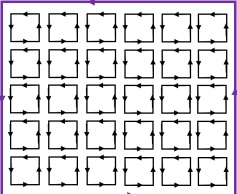

## 习题

377 1.1: 请证明：对于任意矢量场  $ \vec{F} $ 和标量场  $ \Phi $，有以下恒等式：

 $$ \nabla\cdot(\nabla\times\vec{F})=0 $$ 

 $$ \nabla\times\nabla\Phi=0 $$ 

 $$ \nabla\times(\nabla\times\vec{F})=\nabla(\nabla\cdot\vec{F})-\nabla^{2}\vec{F} $$ 

378 1.2: 请证明矢量叉乘形式的高斯定理:

 $$ \iiint_{V}\nabla\times\vec{F}\mathrm{d}V=-\iint_{\vec{S}}\vec{F}\times\mathrm{d}\vec{S}=-\iint_{\vec{S}}\vec{F}\times\vec{n}\mathrm{d}S $$ 

1.3: 卜式左右两边分别是真空中麦克斯韦方程组的微分形式和积分形式，请从微分形式推出积分形式，以及从积分形式推出微分形式。

381

 $$ \nabla\cdot\vec{E}=\frac{\rho}{\varepsilon_{0}} $$ 

 $$ \iint_{S}\vec{E}\cdot\mathrm{d}\vec{S}=\iiint_{V}\frac{\rho}{\varepsilon_{0}}\mathrm{d}V $$ 

 $$ \nabla\times\vec{E}=-\frac{\partial\vec{B}}{\partial t} $$ 

 $$ \oint_{L}\vec{E}\cdot\mathrm{d}\vec{l}=-\iint_{S}\frac{\partial\vec{B}}{\partial t}\cdot\mathrm{d}\vec{S} $$ 

 $$ \nabla\cdot\vec{B}=0 $$ 

 $$ \nabla\times\vec{B}=\mu_{0}\vec{J}+\mu_{0}\varepsilon_{0}\frac{\partial\vec{E}}{\partial t} $$ 

 $$ \iint_{S}\vec{B}\cdot\mathrm{d}\vec{S}=0 $$ 

 $$ \oint_{L}\vec{B}\cdot\mathrm{d}\vec{l}=\mu_{0}\iint_{S}\vec{J}\cdot\mathrm{d}\vec{S}+\mu_{0}\varepsilon_{0}\iint_{S}\frac{\partial\vec{E}}{\partial t}\cdot\mathrm{d}\vec{S} $$ 

382 1.4: 对于矢量算符  $ \nabla $，我们已经学过它在直角坐标系中的表达式为：

 $$ \nabla=\hat{\mathbf{x}}\frac{\partial}{\partial x}+\hat{\mathbf{y}}\frac{\partial}{\partial y}+\hat{z}\frac{\partial}{\partial z} $$ 

383 现在，请你根据直角坐标系和柱坐标系的转换关系，证明上述  $ \nabla $ 在柱坐标系中的表达式为：

 $$ \nabla=\hat{\boldsymbol{r}}\frac{\partial}{\partial\boldsymbol{r}}+\hat{\phi}\frac{1}{r}\frac{\partial}{\partial\phi}+\hat{\boldsymbol{z}}\frac{\partial}{\partial z} $$ 

84（提示：将直角坐标系中  $ \nabla $ 的各个元素转换到柱坐标系中，比如用  $ r, \phi, z $ 和  $ \hat{r}, \hat{\phi}, \hat{z} $ 来表示  $ \hat{x}, \hat{y}, \hat{z} $，再利用链式法则将  $ \frac{\partial}{\partial x} $ 写成  $ \frac{\partial r}{\partial x} \frac{\partial}{\partial r} + \frac{\partial \phi}{\partial x} \frac{\partial}{\partial \phi} + \frac{\partial z}{\partial x} \frac{\partial}{\partial z} $ 的形式并进一步展开）

1.5: 现在，我们换一种方法来推导矢量算符  $ \nabla $ 在柱坐标系中的表达式：结合标量场  $ \Phi $ 的梯度的物理意义，即方向与等势面的切线方向垂直，大小等于  $ \Phi $ 在等势面法向方向的导数  $ \frac{d\Phi}{d\vec{r}} $，通过结合求解标量场的梯度在柱坐标系中的表达式的形式求出柱坐标系中的矢量算符  $ \nabla $ 的表达式。

1.6: 利用习题1.4得到的  $ \nabla $ 算符在柱坐标系中的表达式，证明：在柱坐标系中，标量场  $ \Phi $ 的梯度，矢量场  $ \vec{F} = F_r \hat{r} + F_\phi \hat{\phi} + F_z \hat{z} $ 的散度和旋度分别为：

 $$ \nabla\Phi=\hat{\boldsymbol{r}}\frac{\partial\Phi}{\partial\boldsymbol{r}}+\hat{\boldsymbol{\phi}}\frac{\partial\Phi}{\boldsymbol{r}\partial\phi}+\hat{\boldsymbol{z}}\frac{\partial\Phi}{\partial z} $$ 

 $$ \nabla\cdot\vec{\boldsymbol{F}}=\frac{1}{r}\frac{\partial(r F_{r})}{\partial r}+\frac{1}{r}\frac{\partial F_{\phi}}{\partial\phi}+\frac{\partial F_{z}}{\partial z} $$ 

 $$ \nabla\times\vec{\boldsymbol{F}}=\hat{\boldsymbol{r}}\bigg(\frac{1}{r}\frac{\partial F_{z}}{\partial\phi}-\frac{\partial F_{\phi}}{\partial z}\bigg)+\hat{\phi}\bigg(\frac{\partial F_{r}}{\partial z}-\frac{\partial F_{z}}{\partial r}\bigg)+\hat{\boldsymbol{z}}\frac{1}{r}\bigg(\frac{\partial(r F_{\phi})}{\partial r}-\frac{\partial F_{r}}{\partial\phi}\bigg) $$ 

391（提示：推导过程中可能会用到： $ \frac{\partial\hat{r}}{\partial\phi}=\hat{\phi} $ 等结论。）

392 1.7: 用与习题1.4类似的方法，证明矢量算符  $ \nabla $ 在球坐标系中的表达式为：

 $$ \nabla=\hat{\boldsymbol{r}}\frac{\partial}{\partial r}+\hat{\boldsymbol{\theta}}\frac{1}{r}\frac{\partial}{\partial\theta}+\hat{\phi}\frac{1}{r\sin\theta}\frac{\partial}{\partial\phi} $$ 

1.8: 用与习题1.5类似的方法，证明矢量算符  $ \nabla $ 在球坐标系中的表达式为：

 $$ \nabla=\hat{\boldsymbol{r}}\frac{\partial}{\partial r}+\hat{\boldsymbol{\theta}}\frac{1}{r}\frac{\partial}{\partial\theta}+\hat{\phi}\frac{1}{r\sin\theta}\frac{\partial}{\partial\phi} $$ 

394 1.9: 利用习题1.7得到的  $ \nabla $ 算符在球坐标系中的表达式，证明：在球坐标系中，标量场  $ \Phi $ 的梯度，矢量场  $ \vec{F} = F_r \hat{r} + F_\theta \hat{\theta} + F_\phi \hat{\phi} $ 的散度和旋度分别为：

 $$ \begin{aligned}\nabla\Phi&=\hat{\boldsymbol{r}}\frac{\partial\Phi}{\partial r}+\hat{\boldsymbol{\theta}}\frac{1}{r}\frac{\partial\Phi}{\partial\theta}+\hat{\phi}\frac{1}{r\sin\theta}\frac{\partial\Phi}{\partial\phi}\\\nabla\cdot\vec{\boldsymbol{F}}&=\frac{1}{r^{2}}\frac{\partial(r^{2}F_{r})}{\partial r}+\frac{1}{r\sin\theta}\frac{\partial(F_{\theta}\sin\theta)}{\partial\theta}+\frac{1}{r\sin\theta}\frac{\partial F_{\phi}}{\partial\phi}\\\nabla\times\vec{\boldsymbol{F}}&=\hat{\boldsymbol{r}}\frac{1}{r\sin\theta}\Big(\frac{\partial(F_{\phi}\sin\theta)}{\partial\theta}-\frac{\partial F_{\theta}}{\partial\phi}\Big)+\hat{\boldsymbol{\theta}}\frac{1}{r}\Big(\frac{1}{\sin\theta}\frac{\partial F_{r}}{\partial\phi}-\frac{\partial(rF_{\phi})}{\partial r}\Big)+\hat{\phi}\frac{1}{r}\Big(\frac{\partial(rF_{\theta})}{\partial r}-\frac{\partial F_{r}}{\partial\theta}\Big)\end{aligned} $$ 

396 1.10: 某标量场 U 在球坐标系下的表达式为： $ U(\vec{r})=\frac{1}{r} $

求： $ \nabla U, \nabla \times (\nabla U) \quad (r \neq 0) $

1.11: 某矢量场  $ \vec{F} $ 在柱坐标系下的表达式为： $ \vec{F}(\vec{r}) = \frac{\phi}{r} $

求： $ \nabla \cdot \vec{F} $， $ \nabla \times \vec{F} $ ( $ r \neq 0 $)

1.12: 某矢量场  $ \vec{F} $ 在直角坐标系下的表达式为： $ \vec{F}(x,y,z) = y\hat{x} - x\hat{y} $

画出  $ \vec{F} $ 在 x-y 平面上的场线，并求： $ \nabla \cdot \vec{F} $， $ \nabla \times (\vec{F}) $

1.13: 证明以下链式法则 ( $ \phi $ 为标量场):

 $$ \nabla\cdot(\phi\vec{\mathbf{a}})=\phi\nabla\cdot\vec{\mathbf{a}}+(\nabla\phi)\cdot\vec{\mathbf{a}} $$ 

 $$ \nabla\times(\phi\vec{\boldsymbol{a}})=(\nabla\phi)\times\vec{\boldsymbol{a}}+\phi(\nabla\times\vec{\boldsymbol{a}}) $$ 

1.14: 计算面积分  $ \iint_{S}(x-2y+z)dS $，其中 S 是曲面  $ z=4-x $ ( $ 0\leq x\leq4 $,  $ 0\leq y\leq3 $)。

1.15: 计算线积分  $ \int_{C}(y-x)\mathrm{d}x+(2x-y)\mathrm{d}y $，其中 C 是抛物线  $ y=x^{2}-2x\left(0\leq x\leq3\right) $。

## 第二章 真空中的静电场

物理学中某个理论的创立过程，往往是起源于某个新现象的发现，随着新现象的发现，物理学家们通过定量观察这一现象总结出新的物理规律，并在这些物理规律的基础上进行简化、猜想和数学推演，创造出系统的理论，进而根据这一新的理论预言新的物理现象，而后物理学家们又根据这些新的预言去进行新的观测来验证这个理论。

电磁学的发展也是这样，历史上人们对电和磁的认识来源于生活中常见的诸如闪电、摩擦起电等现象，而后库仑、安培等人通过实验总结出了这些现象所表现出的物理规律，最后由麦克斯韦将这些规律总结出了麦克斯韦方程组，后人又根据麦克斯韦方程组预言并验证了电磁波的存在，从而验证了这一迄今为止电磁学最重要的理论。本书将从一些简单的电磁现象开始，回顾我们是如何从这一生活中简单的现象开始逐步总结出电磁现象的一般性理论。

本章是电磁学学习的起始章节，我们将从人类已经认识了几千年的静电现象开始，首先从生活中的静电现象中抽象出电荷这一基本概念，并学习库仑为我们总结出的电荷之间的相互作用的规律-库仑定律，在此基础上，我们将进一步认识这一相互作用的本质，即现代观点认为的不是超距相互作用而是由于电荷产生的电场的存在带来的近距相互作用，我们将在库仑定律的基础上从数学上总结真空中的静电场的一些定理，如高斯定理和环路定理，并学习电荷相互作用对应的势-电势，对高斯定理、环路定理以及电势的应用将在很多情况下简化对电荷系统产生的静电场的计算过程，相关的实例我们也将在本章中做一些介绍。

### 2.1 电荷

汉语中，“电”这个汉字最早见于甲骨文，其本义是闪电，甲骨文的“电”这个字也是和闪电的形状很相似的一个象形文字，后来，随着汉字的演化，我们在“电”上面加了“雨”字以表示闪电多与雨天相伴的气象特征，到了近代，汉字的简化去掉了多加的这个“雨”字头，事实上也让“电”这个字不仅仅局限在描述闪电这一现象。

<table border=1 style='margin: auto; word-wrap: break-word;'><tr><td style='text-align: center; word-wrap: break-word;'>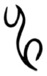</td><td style='text-align: center; word-wrap: break-word;'></td></tr><tr><td style='text-align: center; word-wrap: break-word;'>甲骨文</td><td style='text-align: center; word-wrap: break-word;'>金文</td></tr><tr><td style='text-align: center; word-wrap: break-word;'></td><td style='text-align: center; word-wrap: break-word;'></td></tr><tr><td style='text-align: center; word-wrap: break-word;'>篆文</td><td style='text-align: center; word-wrap: break-word;'></td></tr></table>

现在我们知道，闪电的发生，是由于空气中电荷的累积在局部产生很高的电势差从而击穿空气，一般来说闪电里涉及到的累积电荷量和形成的电势差远高于我们日常生活中能接触到的电荷和电压值。事实上，除去闪电这种极端的电荷之间相互作用情形外，自然界中的电荷相互作用现象往往都非常微弱，大多数时候这些相互作用都是“无声”地存在万物之中。在古代，人们对于生活中的“可观测”的电现象的认识大多来源于摩擦起电现象，很长一段时间内物理学家们研究电现象的主要实验手段也是通过摩擦来产生电。

早在东汉时期，思想家和哲学家王充在其所著的《论衡》中就有关于摩擦起电的记载，该书中写道：“顿牟掇芥，磁石引针”，其中顿牟就是琥珀，意思是琥珀经过摩擦之后，会吸引像草芥一样的轻小的物体，并且他在这里还将这种起电现象跟磁石吸引铁针的现象做类比。在西方，公元前6世纪，希腊的哲学家泰勒斯（Thales of Miletus）就记载了摩擦起电的现象：当时人们发现，琥珀摩擦猫毛以后会吸引像羽毛一类的轻微物体。在希腊语中，琥珀这个词是elektron，这也是“电”的英文单词 electric 的来源。后来，人们观察到了更多的能够摩擦起电的物体，并且发现了下面这些规律：

1. 摩擦不同的物体产生的电荷不相同，共有两种电荷，一种是丝绸摩擦过的玻璃棒（“玻璃电”），另一种是毛皮摩擦过的橡胶棒或琥珀（“树脂电”）。

2. 两种电荷都会吸引微小的物体。

3. 电荷与电荷之间也会相互作用，但是不同电荷之间的相互作用的特点不一样，比如：“玻璃电”与“玻璃电”相互排斥，“玻璃电”与“树脂电”相互吸引，“树脂电”与“树脂电”也会相互排斥。

后来，人们认为上述提到的这两种电荷（“玻璃电”和“树脂电”）是两种不同的流体，通过摩擦的动作可以将这两种电分离，通过合并的动作可以相互中和对方。18世纪，美国科学家本杰明·富兰克林（Benjamin Franklin，1706-1790）提出了电的单流体学说，他认为电不能被创造，只能在物体间转移，摩擦起电就是由于两种物体相互摩擦使电从一个物体转移到了另一个物体上，导致一个物体带过量的电，另一个物体带不足的电，他把这两种情况分别称为带正电和带负电，并且规定丝绸摩擦过的玻璃棒是带正电的，而毛皮摩擦过的橡胶棒是带负电的，后来这一定义就被一直保留到了今天。富兰克林还通过实验发现了电荷守恒定律，即在一个孤立系统里面，电荷的总量是不变的。

### 2.1 电荷

要想理解上述观察到的摩擦起电及相关的相互作用的现象的本质，我们需要进入到亚原子层面的微观世界：电荷（charge）是构成物质的基本粒子的一种基本属性，原子中的核外电子带负电，原子核内的质子带正电，中子不带电。带有电荷的粒子称为带电粒子，净电荷不为零的物体称为带电物体。电荷的单位是库仑，符号是 C，迄今为止的实验表明，所有基本粒子所带的电荷都是基本电荷的整数倍 $ ^{1,2} $，即电荷是量子化的，基本电荷所带的电量为  $ e = 1.6 \times 10^{-19} \text{C} $，这一数值的首次测量是 1909 年由美国物理学家罗伯特·密立根（Robert Millikan，1868-1953，1923 年诺贝尔物理学奖）通过带电油滴实验测得的。

电荷从一个物体转移到另一个物体的本质是带电粒子在物体间的转移，其总数并不会发生变化；此外，实验同时还表明，当粒子之间发生反应使得反应前后粒子数量和种类不相同时，反应前后的总电荷数是相等的，比如一个光子转换成一个正负电子对的电子对效应，或者一个正负电子对通过湮灭变成一个光子的过程，这就是电荷守恒定律：

### 定律 2.1 电荷守恒定律 (law of charge conservation)

在任意空间区域 V 内电荷量的变化，等于通过该区域的表面 S 流入该区域的电荷总量，即：

 $$ \iiint_{V}\frac{\partial\rho}{\partial t}\mathrm{d}V+\iint_{S}\vec{\boldsymbol{J}}\cdot\mathrm{d}\vec{\boldsymbol{S}}=0 $$ 

或写成微分形式：

 $$ \frac{\partial\rho}{\partial t}+\nabla\cdot\vec{J}=0 $$ 

其中， $ \rho $ 是空间中的电荷密度的标量场， $ \vec{J} $ 是电流密度矢量场。

从基本粒子所带电荷的角度，就能很好地理解上面提到的摩擦起电及相关现象了：当两种物体相互摩擦时，原子核外的电子会获得额外的能量，从而有可能导致核外电子从一个物体转移到另一个物体，使得失去电子的物体的净电荷为正，得到电子的物体的净电荷为负。当我们将丝绸和玻璃棒相互摩擦时，由于玻璃棒对核外电子的束缚能力比丝绸弱，因此电子从玻璃棒转移到了丝绸中，最终玻璃棒会带正电荷。

当我们将带正电荷的玻璃棒靠近一个不带电的物体（如上文中提到的羽毛、草芥等轻小物体）时，玻璃棒中的正电荷会吸引不带电的物体中的电子，最终的结果是不带电的物体在靠近玻璃棒的一侧有负电荷聚集，在远离玻璃棒的一侧则有正电荷聚集，也就是电荷在物体内部进行了重新分布，或者说物体某种程度上被“极化”了（在第四章我们会进一步学习这一现象）。由于距离越近，电荷之间的相互作用越大，因而玻璃棒与不带电物体之间的相互吸引力大于排斥力，最终我们将观察到带电的玻璃棒会吸引轻小的物体。

### 2.2 库仑定律

对于摩擦起电以及电荷与电荷之间的相互作用，人类在很长一段时间内只是能够定性地知道电荷之间的相互作用力与电荷的量和电荷之间的距离有关，即电荷量越大、电荷之间距离越小，相互作用力就越强。对于这种相互作用的定量研究直到最近两三百年才开始出现，这其中的一个原因，就是因为我们日常生活中能够获得的电荷（主要是靠摩擦起电获得）产生的相互作用力往往非常的微弱，几百年前对这种微弱的相互作用力进行测量在技术上存在较大的困难。这一技术困难，一直到18世纪扭秤实验（torsion balance）的发明，才得到了改变。

右图是扭秤实验的基本原理图，一根木棍两端放了两个球，木棍中间被一根细丝吊起，当其中一个球受到外力  $ \vec{F} $ 时，木棍会以细丝所在的轴发生旋转，直到外力给木棍施加的力矩等于细丝由于被扭转给木棍施加的反力矩。通过测量木棍旋转的角度  $ \theta $，就可以推算细丝被扭转的力矩  $ M = k\theta $（其中  $ k $ 为扭转系数，可以通过测量简谐旋转的周期来测量），而从而可以计算出球受到的外力大小  $ F = M/l = k\theta/l $。当使用的细丝的扭转系数足够小时，只需要很小的力  $ F $ 就可以使得木棍发生较大的转动，从而具有很高的对力的测量灵敏度，比如18世纪当时物理学家们发明的扭秤（如库仑和卡文迪许使用的扭秤等）的灵敏度可达  $ 10^{-8}N $ 的量级。

1784 年，法国物理学家夏尔·库仑（Charles-Augustin de Coulomb，1736-1806）就是使用他设计的扭秤首次定量研究了电荷之间的相互作用的规律。首先通过与带电体接触使扭秤上的木棍一端的金属球带上已知电荷量的电荷，而后将另一带电体靠近这个金属球，金属球在电荷之间的作用力下将发生旋转，通过上面所说的测量旋转角度的方法可以精确测量金属球受到的电荷间相互作用力。通过改变外来带电体的电荷量和带电体与金属球之间的距离，便可以定量地测量电荷之间的相互作用与电荷大小以及距离的关系。其中，距离的改变很简单，而电荷的改变也不难，只需要将一个带电金属球和一个相同尺寸的不带电的金属球接触便可将原本的电荷量一分为二，这样便可以定量的研究相互作用力与电荷量之间的关系。

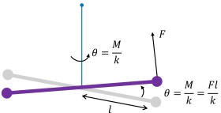

Maa: de 14. R. der 3. An. ybS. Pog. 396. P. 138.

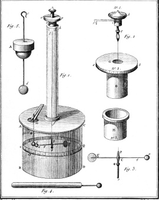

库仑通过上述扭秤实验，总结出了电荷之间相互作用的规律，我们把它称之为库仑定律：

### 定律 2.2 库仑定律 (Coulomb's law)

真空中，两个静止点电荷之间的相互作用力，与两个电荷量的乘积成正比，与两个点电荷之间距离的平方成反比：

 $$ \vec{F}_{12}=k\frac{q_{1}q_{2}}{r_{12}^{2}}\hat{\boldsymbol{r}}_{12}=k\frac{q_{1}q_{2}}{|\vec{r}_{2}-\vec{r}_{1}|^{3}}(\vec{r}_{2}-\vec{r}_{1})=-\vec{F}_{21} $$ 

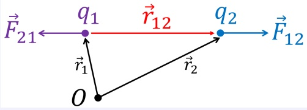

在上述2.3式中，力的单位是 N，电荷的单位是 C，距离的单位是 m，而 k 为比例常数，也被称为库仑常数，其值为：

其中  $ \varepsilon_{0} $ 为真空介电常数，其值为  $ \varepsilon_{0} = 8.85 \times 10^{-12} C^{2}/N \cdot m^{2} $

 $$ k=\frac{1}{4\pi\varepsilon_{0}}=8.99\times10^{9}N\cdot m^{2}/C^{2} $$ 

需要指出的是，库仑定律只适用于点电荷，即要求带电体的尺度远小于带电体之间的距离，且只适用于真空中两个相对静止或者低速运动的点电荷的情况（也称为静电力）。

库仑力与万有引力一样，其大小与距离的平方成反比。由于这种力的大小随着距离的增加衰减得不是很迅速，因而力的作用范围比较大（比如遥远的天体之间的万有引力），我们也把这种相互作用力称之为长程力。与之相对的是短程力，比如强相互作用力，它的大小随距离成指数衰减，因而力的作用范围极为有限。

### 例 2.1

比较氢原子中的质子和电子之间的库仑力  $ F_{e} $ 和引力  $ F_{g} $ 的大小。

解:

根据库仑定律和万有引力定律，我们有：

 $$ \begin{aligned}F_{e}=&\frac{kq_{1}q_{2}}{r^{2}}=\frac{8.99\times10^{9}\times(1.6\times10^{-19})^{2}}{r^{2}}\\F_{g}=&\frac{Gm_{1}m_{2}}{r^{2}}=\frac{6.7\times10^{-11}\times(9.1\times10^{-31})\times(1.7\times10^{-27})}{r^{2}}\\F_{e}/F_{g}=&\frac{kq_{1}q_{2}}{Gm_{1}m_{2}}\\=&\frac{8.99\times10^{9}\times(1.6\times10^{-19})^{2}}{6.7\times10^{-11}\times(9.1\times10^{-31})\times(1.7\times10^{-27})}\\\approx&10^{39}\end{aligned} $$ 

即库仑力是万有引力的约  $ 10^{39} $ 倍！从上面的例子我们可以看出，基本带电粒子间的库仑力远大于万有引力。事实上，电磁相互作用力是原子核与核外电子结合成原子以及原子与原子结合组成我们现实世界中的各种物质的最主要的相互作用力，因此，我们现实生活中所接触到的物质世界的许多现象背后都是由电磁相互作用在起主导作用。而在更大的尺度，比如宇宙中的天体与天体之间，由于宇宙中大部分天体的单位质量所带的净电荷非常小，因此天体之间的库仑力将远小于万有引力。以地球和火星为例，这两个天体所带的净电荷都约为 40 万库仑，根据这个我们可以推算出，地球和火星之间的万有引力是库仑力的约  $ 10^{17} $ 倍。

### 例 2.2

如图所示，一个运动的重带电粒子（质量 m，电荷 ze，速度  $ v \ll $ 光速 c）在经过物质中的一个原子时，会与核外电子（质量  $ m_{0} \ll m $，电荷  $ -e $）通过库仑力作用使电子获得能量而引起原子的电离或激发。如图，求带电粒子从负无穷远处入射到正无穷远处的这一过程中，带电粒子损失的能量  $ \Delta E $。

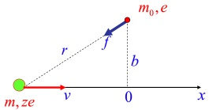

计算时可使用以下简化假设条件：

1. 入射带电粒子在物质中的轨迹近似为直线（由于  $ m \gg m_{0} $，重带电粒子的速度几乎不变）；

2. 入射带电粒子的速度远大于核外电子的初始轨道运动速度（即核外电子初始状态可以看成静止）；

3. 轨道电子在此过程中获得的能量远大于其在原子中的激发能，即轨道电子可以看成自由电子；

4. 由于  $ v \ll c $，可以假定库仑定律在此低速运动情况下适用。

511 解:

如图所示，由库仑定律，可知在任意时刻核外电子受到来自入射带电粒子的库仑力为：

 $$ \vec{f}=k\frac{ze^{2}}{r^{2}}\hat{r} $$ 

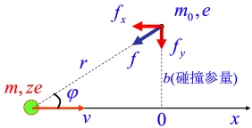

513 由牛顿第二定律  $ (\vec{f} = d\vec{P}/dt) $，在 dt 时间内，核外电子获得的动量为： $ d\vec{P} = \vec{f}dt $

514 因此，整个过程电子获得的总动量为； $ \vec{P}=\int_{-\infty}^{+\infty}\vec{f}\mathrm{d}t $

515 我们先来求上述  $ \vec{P} $ 在 x 轴方向的分量  $ P_{x} $ :

 $$ P_{x}=\int_{-\infty}^{+\infty}f_{x}\mathrm{d}t=\int_{-\infty}^{+\infty}f_{x}\frac{\mathrm{d}t}{\mathrm{d}x}\mathrm{d}x=\frac{1}{v}\int_{-\infty}^{+\infty}f_{x}\mathrm{d}x $$ 

516 如下图所示，由对称性可知， $ f_{x}(x)=-f_{x}(-x) $，因此上述积分  $ P_{x}=\frac{1}{v}\int_{-\infty}^{+\infty}f_{x}\mathrm{d}x=0 $

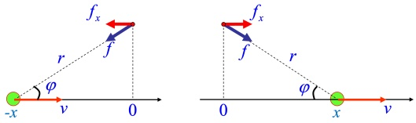

517

518 因此，所求  $ P = P_{y} $

 $$ \begin{aligned}P=&P_{y}=\int_{-\infty}^{+\infty}f_{y}\mathrm{d}t=\int_{-\infty}^{+\infty}k\frac{ze^{2}}{r^{2}}\sin(\varphi)\mathrm{d}t\\=&\int_{-\infty}^{+\infty}k\frac{ze^{2}}{r^{2}}\frac{b}{r}\frac{\mathrm{d}x}{v}=\frac{kze^{2}b}{v}\int_{-\infty}^{+\infty}\frac{\mathrm{d}x}{(\sqrt{x^{2}+b^{2}})^{3}}\end{aligned} $$ 

519 在上述积分中，将 x 用  $ b\tan\theta $ 代替，可得：

 $$ \int_{-\infty}^{+\infty}\frac{\mathrm{d}x}{(\sqrt{x^{2}+b^{2}})^{3}}=\int_{-\pi/2}^{+\pi/2}\frac{b/\cos^{2}\theta\mathrm{d}\theta}{(\sqrt{b^{2}\tan^{2}\theta+b^{2}})^{3}}=\frac{1}{b^{2}}\int_{-\pi/2}^{+\pi/2}\cos\theta\mathrm{d}\theta=\frac{2}{b^{2}} $$ 

520 代入2.6式，可得，核外电子获得的动量为：

 $$ P=\frac{2k z e^{2}}{b v} $$ 

521 考虑到可以忽略核外电子的初始速度，因此这也是核外电子的最终的动量，其对应的动能为：

 $ E_{0}=\frac{P^{2}}{2m_{0}} $

由能量守恒，可知整个过程中入射重带电粒子损失的能量为：

 $$ \Delta E=E_{0}=\frac{P^{2}}{2m_{0}}=\frac{2k^{2}z^{2}e^{4}}{m_{0}b^{2}v^{2}} $$ 

仔细观察2.8式我们可以发现，对于这样一种由重带电粒子入射导致的原子的电离的情况，入射粒子损失的能量与入射粒子的电荷 z 和速度 v 有很大的关系：

1. 入射粒子电荷 z 越大，损失的能量也就越大。这是因为，电荷越大，库仑力也就越大，因此在此过程中入射粒子对核外电子做的功也就越多。事实上，上文中提到截止目前仍有一些国际大型实验在寻找带非整数倍电荷的新粒子（ $ z \ll 1 $），对于这种粒子的寻找，就依赖于我们这道例题里推导出的能量损失与 z 的关系，因为这类 z 很小的粒子相比我们一直的带整数倍电荷的粒子在穿过探测器的物质时，其由于电离导致的能量损失很小，因而可以在探测器中飞行很长一段距离，利用这一特征我们便可以将这类新粒子与已知的粒子进行甄别。

2. 入射粒子的速度 v 越大，损失的能量就越小。这是因为，速度越大，入射粒子经过核外电子所需要的时间越短，因而传递给核外电子的动量也就越少，所损失的能量也就越小。这一特征，同样被广泛应用于现代粒子物理实验的带电粒子的探测和甄别中：对于高能带电粒子，我们现有的探测手段往往只能测量带电粒子的动量和电荷，无法直接测量带电粒子的质量，因而对于一些电荷相同的重带电粒子，比如质子和介子（ $ \pi/K $ 等介子），要想将

它们区分开来需要额外的实验手段，其中一种方法就是利用本道例题得出的结论，对于不同质量的重带电粒子，当它们动量相等时，其速度会有所区别，因而它们在探测器的物质中的能量损失也会有所不同，通过对比它们在运动过程中损失的能量，我们便可以将电荷相同但质量不同的重带电粒子进行区分。

上文中提到，库仑定律只适用于单个点电荷与另一个点电荷之间的相互作用力，对于复杂的带电体系，要想计算它们之间的相互作用力，我们就需要分别计算带电体系内所有点电荷对另一个带电体系的作用力，并进行矢量叠加，而这一过程，便用到了下面的线性叠加原理：

### 原理 2.1 库仑力的叠加原理

多个静止点电荷  $ (q_{1}, q_{2}, \ldots, q_{N}) $ 对一个静止点电荷  $ q_{0} $ 的库仑力  $ \vec{F} $，等于各个静止点电荷  $ q_{i} $ 单独存在时对  $ q_{0} $ 的库仑力  $ \vec{F}_{i} $ 的矢量和：

 $$ \vec{F}=\sum_{i=1}^{N}\vec{F}_{i}=\sum_{i=1}^{N}\frac{k q_{0}q_{i}}{|\vec{r}_{0}-\vec{r}_{i}|^{3}}(\vec{r}_{0}-\vec{r}_{i}) $$ 

上述叠加原理之所以对库仑力适用，其本质原因是因为库仑力与其源（电荷）之间的线性关系，且力是个矢量，矢量的加法满足线性叠加原理。此外，这一原理也被大量的实验所验证。利用叠加原理，我们便可以计算出点电荷与带电体系的相互作用力，以及带电体系与带电体系之间的相互作用力。比如，对于任意两个带电体系之间的相互作用，我们可以通过如下积分进行计算：

 $$ \vec{F}_{12}=\iiint_{V2}\iiint_{V1}\frac{k\rho_{1}(\vec{r}_{1})\rho_{2}(\vec{r}_{2})}{|\vec{r}_{2}-\vec{r}_{1}|^{3}}(\vec{r}_{2}-\vec{r}_{1})\mathrm{d}V_{1}\mathrm{d}V_{2}=-\vec{F}_{21} $$ 

551

### 例 2.3

我们把一对靠得很近的等量异号点电荷对（+q 和 -q）称为电偶极子（electric dipole），如右图所示，设两个点电荷之间的距离为  $ \vec{l} $ （方向从负到正），且我们定义电偶极矩矢量（electric dipole moment）  $ \vec{p} = q\vec{l} $ 。求电偶极子的中垂线上的点电荷 Q 受到的库仑力  $ \vec{F} $ 。

解:

由叠加原理，Q 受到的总库仑力等于 +q 和 -q 对 Q 的库仑力的矢量和：

 $$ \vec{F}=\vec{F}_{+}+\vec{F}_{-} $$ 

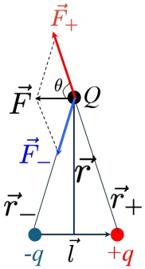

由对称性可知，竖直方向合力为 0，水平方向的合力大小为：

 $$ \begin{aligned}F_{//}&=F_{+//+}+F_{-//-}=-2F_{+}\cos\theta\\&=-2\frac{kqQ}{r_{+}^{2}}\frac{l/2}{r_{+}}=-\frac{kqQl}{(r^{2}+l^{2}/4)^{3/2}}\end{aligned} $$ 

552 负号表示与  $ \vec{l} $ 方向相反，因此：

 $$ \vec{F}=-\frac{kqQ\vec{l}}{(r^{2}+l^{2}/4)^{3/2}}=-\frac{kQ\vec{p}}{(r^{2}+l^{2}/4)^{3/2}} $$ 

553 当  $ r \gg l $ 时，上式可简化为：

 $$ \vec{F}=-\frac{k Q\vec{p}}{r^{3}} $$ 

即：电偶极子在远处对其他电荷的库仑力与距离的三次方成反比，这比点电荷的距离的平方反比衰减得要快，相对来说是偏短程的相互作用。在本书的后续章节，我们还将继续讨论电偶极子的一些特征以及诸多应用。

需要指出的是，本节中所学习的库仑定律和叠加原理，是静电学的基石，本书后续静电学章节的所有内容都可以从库仑定律和叠加原理得出。

### 2.3 电场和电场强度

历史上，人们对于电荷之间的相互作用力的本质经历了很长一段时间的讨论，与日常生活中我们常见的依靠接触产生的力不同，电荷之间能在一定距离之外产生相互作用，所以，很长一段时间内，人们认为这是一种不需要媒介就能产生的相互作用力，电荷之间的相互作用力也是瞬时的，描述这些相互作用的时候也是从距离的角度来描述（比如库仑定律），即所谓的“超距作用”（action at a distance）。这种观点和处理方法对于描述静电学的现象确实是没什么问题的，但是，当我们在第九章开始学习电磁波的时候我们会发现，当我们开始考虑其中一个电荷在运动的时候，另一个电荷感受到的作用力的变化并不是瞬时的，而是在时间上有延迟的，这一延迟靠超距作用的观点是无法解释的，这就需要我们这一节将要介绍的“电场”（electric field）这一媒介来解释电荷之间的相互作用力。

从电荷直接“超距作用”的观点到“电场”观点的确认，是一个逐渐发展的过程。电场（以及我们后面章节要讲到的磁场）的概念最早是由迈克尔·法拉第（Michael Faraday，1791-1867）在观察带电体和磁体的周围空间的时候提出的，法拉第发现带电体和磁体产生的力的可以通过场的力线来描述（比如可以通过铁粉等可视化方式展现场的力线），这些力线分布在空间中。法拉第提出，电荷之间的相互作用力不是直接发生的，而是通过电荷产生的电场来传递的，场的存在改变了空间的状态，进而对空间中的另一个电荷产生作用力。法拉第还通过实验总结出了“磁场的改变产生电场”这个我们在第八章将要学习的电磁感应定律。电场和磁场的概念后来被詹姆斯·麦克斯韦（James Maxwell，1831-1879）数学化，并通过其总结出的麦克斯韦方程组系统地描述了电场和磁场如何在空间传播，并预测了电磁波的存在。

让我们回到电场这个概念，电场是存在于电荷周围的、能传递电荷与电荷之间相互作用的物理场。任何电荷都会产生电场，电荷在电场中会受到库仑力。数学上，我们定义一个电场强度  $ \vec{E} $ 这个物理量来表示电场的强度和方向。空间中任意一点的电场强度，可以由在该处放置一个静止的检验点电荷  $ q_{0} $ 来确定，若检验电荷受到的库仑力是  $ \vec{F} $，则该点的电场强度为：

582

 $$ \vec{E}=\frac{\vec{F}}{q_{0}} $$ 

根据电场强度的定义和库仑定律，我们可以很容易求出真空中静止点电荷产生的电场：

 $$ \vec{E}=\frac{q}{4\pi\varepsilon_{0}r^{2}}\hat{\boldsymbol{r}} $$ 

可知，点电荷产生的电场其强度与距离  $ r^{2} $ 成反比，方向与  $ \vec{r} $ 同向（负电荷为反向），即这是一个有心力场。

电场与库仑力一样，也满足矢量叠加原理，即 N 个点电荷在空间某点产生的总电场强度，等于每个电荷单独在该点产生的电场强度的矢量和：

 $$ \vec{E}(\vec{r})=\sum_{i=1}^{N}\vec{E}_{i}(\vec{r})=\frac{1}{4\pi\varepsilon_{0}}\sum_{i=1}^{N}\frac{q_{i}}{|\vec{r}-\vec{r}_{i}|^{3}}(\vec{r}-\vec{r}_{i}) $$ 

588 有了电场的叠加原理，我们便可以计算任意带电体系产生的电场。下面我们选取几个典型的常见带电体系，来分析它们产生的电场有什么特征。

590

例 2.4

求电偶极子在远点  $ P(\vec{r}) $ 处  $ (r \gg l) $ 产生的电场  $ \vec{E}(\vec{r}) $。

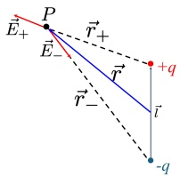

解:

由叠加原理， $ P(\vec{r}) $ 点的电场强度等于正负电荷在该点产生的电场强度的矢量和：

 $$ \begin{aligned}\vec{E}(\vec{r})&=\vec{E}_{+}(\vec{r})+\vec{E}_{-}(\vec{r})\\&=\frac{q}{4\pi\varepsilon_{0}}\bigg[\frac{\vec{r}_{+}}{r_{+}^{3}}-\frac{\vec{r}_{-}}{r_{-}^{3}}\bigg]\end{aligned} $$ 

591 其中：

 $$ \vec{r}_{+}=\vec{r}-\frac{\vec{l}}{2},\quad\vec{r}_{-}=\vec{r}+\frac{\vec{l}}{2} $$ 

592

 $$ r_{+}^{-3}=\left[\left(\vec{r}-\frac{\vec{l}}{2}\right)\cdot\left(\vec{r}-\frac{\vec{l}}{2}\right)\right]^{-3/2}=\left(r^{2}+\frac{l^{2}}{4}-\vec{r}\cdot\vec{l}\right)^{-3/2}=r^{-3}\Biggl(1+\frac{l^{2}}{4r^{2}}-\frac{\vec{r}\cdot\vec{l}}{r^{2}}\Biggr)^{-3/2} $$ 

593 由于  $ r \gg l $，上式可通过泰勒展开只保留 l/r 的一次项：

 $$ r_{+}^{-3}=r^{-3}\bigg(1+\frac{l^{2}}{4r^{2}}-\frac{\vec{r}\cdot\vec{l}}{r^{2}}\bigg)^{-3/2}\approx r^{-3}\bigg(1-\frac{\vec{r}\cdot\vec{l}}{r^{2}}\bigg)^{-3/2}\approx r^{-3}\bigg(1+\frac{3}{2}\frac{\vec{r}\cdot\vec{l}}{r^{2}}\bigg) $$ 

594 类似可得：

 $$ r_{-}^{-3}\approx r^{-3}\bigg(1-\frac{3}{2}\frac{\vec{r}\cdot\vec{l}}{r^{2}}\bigg) $$ 

595 代入2.18可得：

 $$ \begin{aligned}\vec{E}(\vec{r})&=\frac{q}{4\pi\varepsilon_{0}r^{3}}\bigg[\vec{r}_{+}\bigg(1+\frac{3}{2}\frac{\vec{r}\cdot\vec{l}}{r^{2}}\bigg)-\vec{r}_{-}\bigg(1-\frac{3}{2}\frac{\vec{r}\cdot\vec{l}}{r^{2}}\bigg)\bigg]\\&=\frac{q}{4\pi\varepsilon_{0}r^{3}}\bigg[(\vec{r}_{+}-\vec{r}_{-})+(\vec{r}_{+}+\vec{r}_{-})\frac{3}{2}\frac{\vec{r}\cdot\vec{l}}{r^{2}}\bigg]\end{aligned} $$ 

596 其中， $ \vec{r}_{+}-\vec{r}_{-}=-\vec{l},\vec{r}_{+}+\vec{r}_{-}=2\vec{r} $，因此：

 $$ \begin{aligned}\vec{E}(\vec{r})&=\frac{q}{4\pi\varepsilon_{0}r^{3}}\bigg[-\vec{l}+3(\frac{\vec{r}\cdot\vec{l}}{r^{2}})\vec{r}\bigg]\\&=\frac{-\vec{p}+3(\hat{\boldsymbol{r}}\cdot\vec{p})\hat{\boldsymbol{r}}}{4\pi\varepsilon_{0}r^{3}}\end{aligned} $$ 

上述结果分两部分，第一部分与  $ \vec{l} $ 平行，是横向场，第二部分与  $ \vec{r} $ 平行，是径向场。

• 当 P 点位于电偶极子的中垂线上时，径向场等于零，2.24式可化简为：

 $$ \vec{E}(\vec{r})=\frac{-\vec{p}}{4\pi\varepsilon_{0}r^{3}} $$ 

这与上一节中例2.3计算得出的结果是一致的。

• 当 P 点位于电偶极子的连线上时，2.24式可化简为

 $$ \vec{E}(\vec{r})=\frac{2\vec{p}}{4\pi\varepsilon_{0}r^{3}} $$ 

自然界中有很多带电体系都可以看成是电偶极子模型，比如有很多分子（或原子）的电子的重心与原子核并不重合，因而正负电荷中心不重合，这种情况下该分子（或原子）就可以看成一个电偶极子，它们会产生电偶极场，我们把它们称为有极分子（或有极原子），由于电偶极场的存在它们会更容易“亲和”（溶解）其他有极分子（或有极原子）。关于有极分子（或有极原子）在本书后面第四章我们还会进一步讨论。

606

### 例 2.5

求如图所示的电四极子在远点  $ P(\vec{r}) $ 处  $ (r \gg l) $ 产生的电场  $ \vec{E}(\vec{r}) $。

解:

该电四极子产生的电场可以看成是两个电偶极子产生的电场的矢量和，使用上一个例题的结论，可得：

 $$ \begin{aligned}\vec{E}(\vec{r})&=\vec{E}_{1}(\vec{r})+\vec{E}_{2}(\vec{r})\\&=\frac{1}{4\pi\varepsilon_{0}}\bigg[\frac{-q\vec{l}}{(r+\frac{l}{2})^{3}}+\frac{q\vec{l}}{(r-\frac{l}{2})^{3}}\bigg]\end{aligned} $$ 

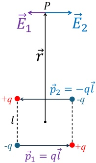

607 通过泰勒展开只保留 l/r 的一次项，可得：

 $$ \begin{aligned}\vec{E}(\vec{r})&=\frac{q\vec{l}}{4\pi\varepsilon_{0}r^{3}}\left[\frac{-1}{(1+\frac{l}{2r})^{3}}+\frac{1}{(1-\frac{l}{2r})^{3}}\right]\\&=\frac{q\vec{l}}{4\pi\varepsilon_{0}r^{3}}\left[-\left(1-\frac{3l}{2r}\right)+\left(1+\frac{3l}{2r}\right)\right]\\&=\frac{q\vec{l}}{4\pi\varepsilon_{0}r^{3}}\frac{3l}{r}\\&=\frac{3q l^{2}\hat{l}}{4\pi\varepsilon_{0}r^{4}}\end{aligned} $$ 

608 可见，电四极子产生的电场随空间成  $ r^{-4} $ 的速度衰减，比电偶极子的衰减更快。

609

例 2.6

求如图所示的均匀带电细圆环（半径 R，总电荷 q）在其轴线上任意一点  $ P(z) $ 处的电场强度。

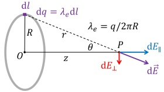

解:

如图所示，把带电圆环分成无限多点电荷 dq，设 dq 在 P 点产生的电场强度为 dE。由对称性，所有的 dE⊥ 相互抵消，P 点的电场只剩下各 dE∥ 之和：

 $$ E=\int\mathrm{d}E_{||} $$ 

612 其中，

 $$ \begin{aligned}\mathrm{d}E_{\parallel}&=\mathrm{d}E\cos\theta\\&=\frac{1}{4\pi\varepsilon_{0}}\frac{\mathrm{d}q}{r^{2}}\frac{z}{r}\end{aligned} $$ 

613 定义线电荷密度  $ \lambda_{e}=\frac{q}{2\pi R} $，上式中  $ r=\sqrt{R^{2}+z^{2}} $，代入上式可得：

 $$ \mathrm{d}E_{\parallel}=\frac{1}{4\pi\varepsilon_{0}}\frac{\lambda_{e}\mathrm{d}l}{R^{2}+z^{2}}\frac{z}{\sqrt{R^{2}+z^{2}}} $$ 

614 因此，

 $$ \begin{aligned}E&=\int\mathrm{d}E_{\parallel}=\int_{0}^{2\pi R}\frac{1}{4\pi\varepsilon_{0}}\frac{\lambda_{e}}{R^{2}+z^{2}}\frac{z}{\sqrt{R^{2}+z^{2}}}\mathrm{d}l\\&=\frac{2\pi R\lambda_{e}z}{4\pi\varepsilon_{0}(R^{2}+z^{2})^{3/2}}\\&=\frac{qz}{4\pi\varepsilon_{0}(R^{2}+z^{2})^{3/2}}\\ \end{aligned} $$ 

615 根据上述结果可知，当  $ z \gg R $ 时，电场可以近似为：

 $$ E\approx\frac{q}{4\pi\varepsilon_{0}z^{2}} $$ 

616 即这种情况下变成了点电荷的电场。

617

### 例 2.7

求如图所示的均匀带电圆盘（半径 R，面电荷密度  $ \sigma_{e} $）在其轴线上任意一点  $ P(z) $ 处的电场强度。

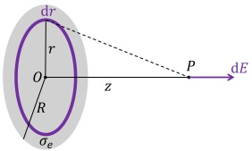

解:

618 如图所示，可以将带电圆盘切成很多带电圆环，利用上一例题的结果，可知半径为 r 宽度为 dr 的圆环上的电荷在 P 点产生的电场强度为：

 $$ \begin{aligned}\mathrm{d}E&=\frac{z\mathrm{d}q}{4\pi\varepsilon_{0}(r^{2}+z^{2})^{3/2}}\\&=\frac{z\sigma_{e}2\pi r\mathrm{d}r}{4\pi\varepsilon_{0}(r^{2}+z^{2})^{3/2}}\\&=\frac{z\sigma_{e}r\mathrm{d}r}{2\varepsilon_{0}(r^{2}+z^{2})^{3/2}}\end{aligned} $$ 

620 因此，P 点的电场强度为：

 $$ \begin{aligned}E&=\frac{z\sigma_{e}}{2\varepsilon_{0}}\int_{0}^{R}\frac{r\mathrm{d}r}{(r^{2}+z^{2})^{3/2}}\\&=\frac{z\sigma_{e}}{2\varepsilon_{0}}\frac{-1}{\sqrt{r^{2}+z^{2}}}\bigg|_{0}^{R}\\&=\frac{\sigma_{e}}{2\varepsilon_{0}}\bigg(1-\frac{z}{\sqrt{z^{2}+R^{2}}}\bigg)\end{aligned} $$ 

621 由上述结果可知：

1. 当  $ z \ll R $ 时:

 $$ E\approx\frac{\sigma_{e}}{2\varepsilon_{0}} $$ 

这种情况相当于无穷大带电平板产生的电场，其电场强度与 z 无关（即： $ E \propto z^{0} $）。

2. 当  $ z \gg R $ 时:

 $$ E\approx\frac{\sigma_{e}}{2\varepsilon_{0}}\left[1-\left[1-\frac{1}{2}(\frac{R}{z})^{2}\right]\right]=\frac{\pi R^{2}\sigma_{e}}{4\pi\varepsilon_{0}z^{2}}=\frac{q}{4\pi\varepsilon_{0}z^{2}} $$ 

即这种情况下变成了点电荷的电场。

626

### 例 2.8

求如图所示的均匀带电细线（长度 l，线电荷密度  $ \lambda_{e} $）在其中垂线上  $ P(r) $ 点产生的电场强度。

解:

如图，将电荷分成无限多点电荷  $ \lambda dx $ 。由对称性可知，P 点水平方向电场强度为 0，竖直方向的电场强度为：

 $$ \mathrm{d}E=2\mathrm{d}E_{1}\cos\theta=2\frac{\lambda_{e}\mathrm{d}x}{4\pi\varepsilon_{0}r^{\prime2}}\frac{r}{r^{\prime}} $$ 

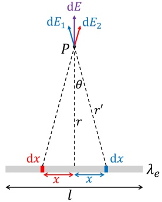

其中， $ r'=\sqrt{r^{2}+x^{2}} $，因此：

 $$ E=\int\mathrm{d}E=\frac{2\lambda_{e}r}{4\pi\varepsilon_{0}}\int_{0}^{l/2}\frac{\mathrm{d}x}{(x^{2}+r^{2})^{3/2}} $$ 

令  $ x = r \tan \theta $，则  $ \mathrm{d}x = \frac{r \mathrm{d}\theta}{\cos^{2}\theta} $，上述积分可化为：

 $$ \begin{aligned}E&=\frac{2\lambda_{e}r}{4\pi\varepsilon_{0}}\int_{0}^{\arctan(l/2r)}\frac{r}{\cos^{2}\theta}\frac{\cos^{3}\theta}{r^{3}}\mathrm{d}\theta\\&=\frac{2\lambda_{e}r}{4\pi\varepsilon_{0}}\int_{0}^{\arctan(l/2r)}\frac{\cos\theta}{r^{2}}\mathrm{d}\theta\\&=\frac{2\lambda_{e}r}{4\pi\varepsilon_{0}}\frac{1}{r^{2}}\sin\theta\bigg|_{0}^{\arctan(l/2r)}\\&=\frac{2\lambda_{e}r}{4\pi\varepsilon_{0}}\frac{1}{r^{2}}\frac{l}{\sqrt{4r^{2}+l^{2}}}\\&=\frac{2\lambda_{e}}{4\pi\varepsilon_{0}r}\frac{l}{\sqrt{4r^{2}+l^{2}}}\\ \end{aligned} $$ 

628 由上述结果可知：

1. 当  $ r \ll l $ 时（即无限长线电荷）：

 $$ E\approx\frac{2\lambda_{e}}{4\pi\varepsilon_{0}r} $$ 

可知，此时  $ E \propto r^{-1} $，其随距离的衰减速度比点电荷要慢。

2. 当  $ r \gg l $ 时:

 $$ E\approx\frac{2\lambda_{e}}{4\pi\varepsilon_{0}r}\frac{l}{2r}=\frac{\lambda_{e}l}{4\pi\varepsilon_{0}r^{2}}=\frac{q}{4\pi\varepsilon_{0}r^{2}} $$ 

即这种情况下变成了点电荷的电场。

从上述几个例题中，我们可以总结出几种典型的带电体系产生的电场 E 随距离 r 的关系：

1. 无限大面电荷： $ E \propto r^{0} $

2. 无限长线电荷： $ E \propto r^{-1} $

3. 点电荷： $ E \propto r^{-2} $

637 4. 电偶极子： $ E \propto r^{-3} $

638 5. 电四极子： $ E \propto r^{-4} $

可以看出，以点电荷的电场  $ E \propto r^{-2} $ 为参考，诸如电偶极子和电四极子等存在正电荷和负电荷之间有“内耗”的情况会使得产生的场更不容易向远处传播（长程变短程）；而诸如线电荷和面电荷等同类电荷的排布会使得产生的场随距离衰减得更慢（“团结就是力量”），这种增强效应有些类似于影院中使用的呈一条直线排布的柱形音响（音柱），这类音响常被作为远距离声音传播设备。

643

### 例 2.9

求如图所示的均匀带电球（半径 R，体电荷密度  $ \rho_{e} $）在其球外距离球心 z 处的一点  $ P(z) $ 处的电场强度。

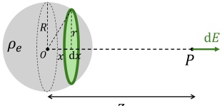

解:

645 如图所示，将带电球切分为无穷个与 OP 垂直的均匀带电圆盘，在2.35式中，用  $ \rho dx $ 代替  $ \sigma_{e} $，用  $ \sqrt{R^{2}-x^{2}} $ 代替 R，用 z-x 代替 z，可得在 x 处厚度为 dx 的圆盘在 P 处产生的电场强度为：

 $$ \begin{aligned}\mathrm{d}E&=\frac{\rho_{e}\mathrm{d}x}{2\varepsilon_{0}}\Big[1-\frac{z-x}{\sqrt{R^{2}-x^{2}+(z-x)^{2}}}\Big]\\&=\frac{\rho_{e}\mathrm{d}x}{2\varepsilon_{0}}\Big[1-\frac{z-x}{\sqrt{R^{2}+z^{2}-2z x}}\Big]\\&=\frac{\rho_{e}\mathrm{d}x}{2\varepsilon_{0}}\Big[1-\frac{z-x}{\sqrt{2z}\sqrt{\frac{R^{2}+z^{2}}{2z}-x}}\Big]\end{aligned} $$ 

令  $ a=\frac{z^{2}+R^{2}}{2z} $， $ b=z-a=\frac{z^{2}-R^{2}}{2z} $，可得：

 $$ \begin{aligned}\mathrm{d}E&=\frac{\rho_{e}\mathrm{d}x}{2\varepsilon_{0}}\left[1-\frac{a-x+b}{\sqrt{2z}\sqrt{a-x}}\right]\\&=\frac{\rho_{e}\mathrm{d}x}{2\varepsilon_{0}}\frac{1}{\sqrt{2z}}\left[\sqrt{2z}-\sqrt{a-x}-\frac{b}{\sqrt{a-x}}\right]\end{aligned} $$ 

649 于是：

 $$ \begin{aligned}E&=\int\mathrm{d}E=\frac{\rho_{e}}{2\varepsilon_{0}}\frac{1}{\sqrt{2z}}\int_{-R}^{R}\left[\sqrt{2z}-\sqrt{a-x}-\frac{b}{\sqrt{a-x}}\right]\mathrm{d}x\\&=\frac{\rho_{e}}{2\varepsilon_{0}}\frac{1}{\sqrt{2z}}\Big[\sqrt{2z}x+\frac{2}{3}(a-x)^{3/2}+2b\sqrt{a-x}\Big]\Big|_{-R}^{R}\\&=\frac{\rho_{e}}{2\varepsilon_{0}}\frac{1}{\sqrt{2z}}\Big[\sqrt{2z}\cdot2R-\frac{2}{3}[(a+R)^{3/2}-(a-R)^{3/2}]-2b[\sqrt{a+R}-\sqrt{a-R}]\Big]\end{aligned} $$ 

650 其中，

 $$ a+R=\frac{(z+R)^{2}}{2z},a+R=\frac{(z-R)^{2}}{2z} $$ 

 $$ (a+R)^{3/2}-(a-R)^{3/2}=\frac{(z+R)^{3}-(z-R)^{3}}{2z\sqrt{2z}}=\frac{2(R^{3}+3z^{2}R)}{2z\sqrt{2z}} $$ 

 $$ \sqrt{a+R}-\sqrt{a-R}=\frac{2R}{\sqrt{2z}} $$ 

651 因此，

 $$ \begin{aligned}E&=\frac{\rho_{e}}{2\varepsilon_{0}}\frac{1}{\sqrt{2z}}\Big[\sqrt{2z}\cdot2R-\frac{2}{3}\cdot\frac{2(R^{3}+3z^{2}R)}{2z\sqrt{2z}}-2b\frac{2R}{\sqrt{2z}}\Big]\\&=\frac{\rho_{e}}{2\varepsilon_{0}}\frac{1}{\sqrt{2z}}\Big[\sqrt{2z}\cdot2R-\frac{2}{3}\cdot\frac{(R^{3}+3z^{2}R)}{z\sqrt{2z}}-\frac{z^{2}-R^{2}}{z}\frac{2R}{\sqrt{2z}}\Big]\\&=\frac{\rho_{e}}{2\varepsilon_{0}}\frac{1}{\sqrt{2z}}\frac{12z^{2}R-2(R^{3}+3z^{2}R)-6(z^{2}-R^{2})R}{3z\sqrt{2z}}\\&=\frac{\rho_{e}}{2\varepsilon_{0}}\frac{4R^{3}}{6z^{2}}\\&=\frac{\rho_{e}\cdot\frac{4}{3}\pi R^{3}}{4\pi\varepsilon_{0}z^{2}}\\&=\frac{q}{4\pi\varepsilon_{0}z^{2}}\\ \end{aligned} $$ 

652 从上面的结果可以看出，电荷量 q 的均匀带电球在球外的电场，等价于位于球心的电荷量为 q 的点电荷在球外产生的电场。

为了直观的显示电场的方向和大小，我们往往会使用电场线：电场线是一堆带箭头的曲线，这些曲线上每一点的切线方向和该点的电场强度方向一致，而且垂直电场线的横截面积上场线的条数（即电场线的“密度”）与电场强度的大小成正比。静电场的电场线是连续的，且从正电荷（或无穷远处）出发，进入负电荷（或无穷远处）；且由于电场力是保守力（我们接下来的章节会学习），我们还知道电场线是不闭合的。下面是常见带电体系的电场线示意图：（1）正电荷；（2）负电荷；（3）电偶极子。

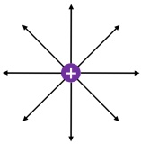

(1)

(2)

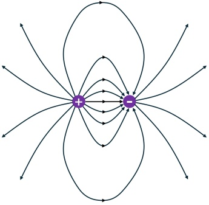

(3)

### 2.4 高斯定理

661

### 2.4 高斯定理

从上一节的几个例题我们可以看出，计算带电体系产生的电场往往需要用到复杂的积分，而对于一些存在对称性的电荷分布（比如上一节例题中计算过的带电球、无穷大面电荷、无穷长线电荷等）产生的电场，我们又发现其最终计算结果往往又非常简洁且具有很强的对称性。对于这种存在对称性分布的电荷体系，本节将讨论一种极为有效的计算方法，即利用静电场的高斯定理来计算。

本章中所学习的电场，是一个矢量场，它与我们在第一章学习的一般的矢量场一样，电场 $ \vec{E} $也有线积分、面积分（即电场的通量），以及散度和旋度。本节将讨论并计算电场的通量和散度以及它们的物理意义。

670 首先我们来看一下电场的散度，即  $ \nabla \cdot \vec{E} $，由于电场的叠加原理，以及计算散度时有  $ \nabla \cdot (\vec{E}_1 + \vec{E}_2) = \nabla \cdot \vec{E}_1 + \nabla \cdot \vec{E}_2 $ 这一分配律，因此我们只需要计算点电荷的电场的散度就可以计算出任意带电体系的电场的散度：

 $$ \nabla\cdot\vec{E}(\vec{r})=\nabla\cdot\sum_{i=1}^{N}\vec{E}_{i}(\vec{r})=\sum_{i=1}^{N}\nabla\cdot\vec{E}_{i}(\vec{r})=\frac{1}{4\pi\varepsilon_{0}}\sum_{i=1}^{N}q_{i}\nabla\cdot\frac{\vec{r}-\vec{r}_{i}}{|\vec{r}-\vec{r}_{i}|^{3}} $$ 

673 或者写成连续电荷分布的积分形式：

 $$ \nabla\cdot\vec{E}(\vec{r})=\frac{1}{4\pi\varepsilon_{0}}\nabla\cdot\iiint_{V}\rho(\vec{r}_{0})\frac{\vec{r}-\vec{r}_{0}}{|\vec{r}-\vec{r}_{0}|^{3}}\mathrm{d}^{3}\vec{r}_{0}=\frac{1}{4\pi\varepsilon_{0}}\iiint_{V}\rho(\vec{r}_{0})\nabla\cdot\frac{\vec{r}-\vec{r}_{0}}{|\vec{r}-\vec{r}_{0}|^{3}}\mathrm{d}^{3}\vec{r}_{0} $$ 

最终我们需要计算的，是形如  $ \frac{\vec{r}-\vec{r}_{i}}{|\vec{r}-\vec{r}_{i}|^{3}} $ 的矢量场的散度，由于矢量场的散度与坐标系的选取无关，因此这里可以选取以  $ \vec{r}_{i} $ 为原点的坐标系进行散度的计算，即

 $$ \nabla\cdot\frac{\vec{r}-\vec{r}_{i}}{|\vec{r}-\vec{r}_{i}|^{3}}=\nabla\cdot\frac{\vec{r}}{r^{3}} $$ 

676 利用上一章里习题1.9的结论，即散度在球坐标系中的表达式：

 $$ \nabla\cdot\vec{F}=\frac{1}{r^{2}}\frac{\partial(r^{2}F_{r})}{\partial r}+\frac{1}{r\sin\theta}\frac{\partial(F_{\theta}\sin\theta)}{\partial\theta}+\frac{1}{r\sin\theta}\frac{\partial F_{\phi}}{\partial\phi} $$ 

677 可得：

 $$ \nabla\cdot\frac{\vec{r}}{r^{3}}=\frac{1}{r^{2}}\frac{\partial(r^{2}\frac{1}{r^{2}})}{\partial r}+0+0=\frac{1}{r^{2}}\times0=0\qquad(\vec{r}\neq0) $$ 

678 需要注意的是，上式  $ \nabla \cdot \frac{\vec{r}}{r^3} = 0 $ 只对  $ \vec{r} \neq 0 $ 的点成立，因为，当  $ \vec{r} = 0 $ 时，根据散度的定义：

 $$ \nabla\cdot\frac{\vec{r}}{r^{3}}=\lim_{\mathrm{d}V\rightarrow0}\frac{\oint_{\vec{S}}\frac{\vec{r}}{r^{3}}\cdot\mathrm{d}\vec{S}}{\mathrm{d}V} $$ 

679 以原点为中心，取半径为 r 的球，球面  $ \vec{S} $，dV 为球的体积，则由对称性可计算上面的面积分：

 $$ \begin{aligned}\nabla\cdot\frac{\vec{r}}{r^{3}}&=\lim_{\mathrm{d}V\rightarrow0}\frac{\oint_{\vec{S}}\frac{\vec{r}}{r^{3}}\cdot\mathrm{d}\vec{S}}{\mathrm{d}V}\\&=\lim_{r\rightarrow0}\frac{\frac{r}{r^{3}}4\pi r^{2}}{\frac{4}{3}\pi r^{3}}\\&=\lim_{r\rightarrow0}\frac{3}{r^{3}}\\&=\infty\end{aligned} $$ 

680 即：

 $$ \nabla\cdot\frac{\vec{r}}{r^{3}}=\begin{cases}0,&\vec{r}\neq0,\\\infty,&\vec{r}=0.\end{cases} $$ 

681 此外，根据矢量场的高斯定理（定理1.2），我们还有：

 $$ \iiint_{V}\nabla\cdot\frac{\vec{r}}{r^{3}}\mathrm{d}V=\iint_{\vec{S}}\frac{\vec{r}}{r^{3}}\mathrm{d}\vec{S} $$ 

682 令  $ \vec{S} $ 为以原点为球心的球面，则：

 $$ \iiint_{V}\nabla\cdot\frac{\vec{r}}{r^{3}}\mathrm{d}V=\frac{r}{r^{3}}4\pi r^{2}=4\pi $$ 

683 数学上，我们用 δ 函数来表达类似于 ∇· $ \frac{\vec{r}}{r^{3}} $ 的函数，三维空间中的 δ 函数定义如下：

 $$ \delta(\vec{\boldsymbol{r}})=\begin{cases}0,&\vec{\boldsymbol{r}}\neq0,\\\infty,&\vec{\boldsymbol{r}}=0.\end{cases} $$ 

684 且：

 $$ \iiint_{\mathrm{all-space}}\delta(\vec{\boldsymbol{r}})\mathrm{d}V=1 $$ 

685  $ \delta $ 函数还有一个筛分性，即：

 $$ \iiint_{\mathrm{all-space}}f(\vec{\boldsymbol{r}})\delta(\vec{\boldsymbol{r}}-\vec{\boldsymbol{r}}_{0})\mathrm{d}^{3}\vec{\boldsymbol{r}}=f(\vec{\boldsymbol{r}}_{0}) $$ 

686 因此， $ \nabla\cdot\frac{\vec{r}}{r^{3}} $ 也可以写成：

 $$ \nabla\cdot\frac{\vec{r}}{r^{3}}=4\pi\delta(\vec{r}) $$ 

687 现在，我们再回到电场的散度，即2.50式，该式可以写成：

 $$ \nabla\cdot\vec{E}(\vec{r})=\frac{1}{4\pi\varepsilon_{0}}\sum_{i=1}^{N}q_{i}\nabla\cdot\frac{\vec{r}-\vec{r}_{i}}{|\vec{r}-\vec{r}_{i}|^{3}}=\frac{1}{4\pi\varepsilon_{0}}\sum_{i=1}^{N}q_{i}4\pi\delta(\vec{r}-\vec{r}_{i})=\sum_{i=1}^{N}\frac{q_{i}}{\varepsilon_{0}}\delta(\vec{r}-\vec{r}_{i}) $$ 

### 2.4 高斯定理

688 因此，将矢量场的高斯定理应用到电场中，我们有：

 $$ \begin{aligned}\iint_{\vec{S}}\vec{E}\cdot\mathrm{d}\vec{S}&=\iiint_{V}\nabla\cdot\vec{E}(\vec{r})\mathrm{d}V\\&=\iiint_{V}\sum_{i=1}^{N}\frac{q_{i}}{\varepsilon_{0}}\delta(\vec{r}-\vec{r}_{i})\mathrm{d}V\\&=\sum_{i=1}^{N}\frac{q_{i}}{\varepsilon_{0}}\iiint_{V}\delta(\vec{r}-\vec{r}_{i})\mathrm{d}V\\&=\frac{1}{\varepsilon_{0}}\sum_{\vec{r}_{i}\text{in}V}q_{i}\\&=\frac{1}{\varepsilon_{0}}Q_{\text{in}}\end{aligned} $$ 

689 其中， $ Q_{in} $ 是闭合曲面  $ \vec{S} $ 内部电荷总量。

对于连续分布的电荷的情况，类似的我们有：

 $$ \nabla\cdot\vec{E}(\vec{r})=\frac{1}{4\pi\varepsilon_{0}}\iiint_{V}\rho(\vec{r}_{0})\nabla\cdot\frac{\vec{r}-\vec{r}_{0}}{|\vec{r}-\vec{r}_{0}|^{3}}\mathrm{d}^{3}\vec{r}_{0}=\frac{1}{4\pi\varepsilon_{0}}\iiint_{V}\rho(\vec{r}_{0})4\pi\delta(\vec{r}-\vec{r}_{0})\mathrm{d}^{3}\vec{r}_{0}=\frac{\rho(\vec{r})}{\varepsilon_{0}} $$ 

691 对应的矢量场的高斯定理为：

 $$ \begin{aligned}\iint_{\vec{S}}\vec{E}\cdot\mathrm{d}\vec{S}&=\iiint_{V}\nabla\cdot\vec{E}(\vec{r})\mathrm{d}V\\&=\iiint_{V}\frac{\rho(\vec{r})}{\varepsilon_{0}}\mathrm{d}V\\&=\frac{1}{\varepsilon_{0}}Q_{\mathrm{in}}\end{aligned} $$ 

692 这样，我们便得到了电场的高斯定理：

### 定理 2.1 电场的高斯定理

真空中的静电场  $ \vec{E} $ 通过任意闭合曲面  $ \vec{S} $ 的通量，等于该闭合曲面所包围的体积内的电荷量的代数和的  $ \frac{1}{\varepsilon_{0}} $ 倍，即：

 $$ \Phi_{\vec{E}}=\iint_{\vec{S}}\vec{E}\cdot\mathrm{d}\vec{S}=\frac{Q_{\mathrm{in}}}{\varepsilon_{0}} $$ 

上式对应的微分形式为：

 $$ \nabla\cdot\vec{E}(\vec{r})=\frac{\rho(\vec{r})}{\varepsilon_{0}} $$ 

也就是说，只有闭合曲面内部的电荷对总通量有贡献，闭合曲面外部的电荷产生的电场在闭合曲面上的净通量永远为 0。这一特点，是由电场强度的平方反比形式（即  $ \frac{\vec{r}}{r^3} $）决定的，由于这一平方反比与计算面积时出现的  $ r^2 $ 刚好抵消，导致点电荷产生的电场在任意曲面上的通量只跟这个曲面对点电荷所张开的立体角大小有关（即  $ \iint_S \frac{\vec{r}}{r^3} d\vec{S} = d\Omega $），而跟这个曲面的位置无关。当点电荷位于闭合曲面外部时，闭合曲面刚好有两个相对点电荷所张开立体角相等但法向

方向相反的曲面组成，因而点电荷产生的电场在这个闭合曲面的电场净通量为 0.

高斯定理是库仑定律和叠加原理的必然结果，也是麦克斯韦方程组的第一个方程。实际应用中，我们常用高斯定理来计算具有对称性电荷体系所产生的电场。

702

### 例 2.10

求均匀带电球（半径 R，总电荷 q）产生的电场  $ \vec{E}(\vec{r}) $。

解:

如图，令  $ \vec{S} $ 为以 O 为球心、半径为 r 的球面。由对称性， $ \vec{S} $ 上所有的点的电场的大小相同，且方向与  $ \vec{S} $ 的法向平行。由高斯定理：

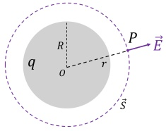

 $$ \begin{aligned}&\iint_{\vec{S}}\vec{E}\cdot\mathrm{d}\vec{S}=\frac{Q_{\mathrm{in}}}{\varepsilon_{0}}\\ &\Rightarrow4\pi r^{2}E=\frac{Q_{\mathrm{in}}}{\varepsilon_{0}}\\ &\Rightarrow E=\frac{Q_{\mathrm{in}}}{4\pi\varepsilon_{0}r^{2}}\\ \end{aligned} $$ 

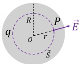

1. 当  $ r \geq R $ 时， $ Q_{\mathrm{in}} = q $，

 $$ E=\frac{q}{4\pi\varepsilon_{0}r^{2}} $$ 

2. 当 r < R 时，

 $$ \begin{aligned}&Q_{in}=q\frac{r^{3}}{R^{3}}\\ &E=\frac{q\frac{r^{3}}{R^{3}}}{4\pi\varepsilon_{0}r^{2}}=\frac{qr}{4\pi\varepsilon_{0}R^{3}}\\ \end{aligned} $$ 

例 2.11

求均匀带电球面产生的电场  $ \vec{E}(\vec{r}) $ （球面半径为 R，总电荷量为 q）

解:

取以带电球面的球心为球心、半径为 r 的球面 S。由对称性， $ \vec{S} $ 上各点的电场大小相等，方向与  $ \vec{S} $ 的法向平行。由高斯定理：

 $$ \begin{aligned}&\iint_{\vec{S}}\vec{E}\cdot\mathrm{d}\vec{S}=\frac{Q_{in}}{\varepsilon_{0}}\\ &\Rightarrow4\pi r^{2}E=\frac{Q_{in}}{\varepsilon_{0}}\\ &\Rightarrow E=\frac{Q_{in}}{4\pi\varepsilon_{0}r^{2}}\\ \end{aligned} $$ 

### 2.4 高斯定理

712 1. 当 r < R 时， $ Q_{\mathrm{in}} = 0, E = 0 $

713 2. 当 r > R 时， $ Q_{\mathrm{in}} = q $，

 $$ E=\frac{q}{4\pi\varepsilon_{0}r^{2}} $$ 

714 3. 当  $ r \rightarrow R + $ 时（即在无限贴近球面外表面的地方），

 $$ E\rightarrow\frac{q}{4\pi\varepsilon_{0}R^{2}}=\frac{\sigma_{e}}{\varepsilon_{0}} $$ 

715 我们注意到两个有趣的现象：

1. 球的外表面附近的电场值为无穷大带电平板附近的电场强度的两倍（无限大带电平板电场为  $ E = \frac{\sigma_{e}}{2\varepsilon_{0}} $，见上一节例2.7）。为了直观的理解这个结论，可以像右图那样想象在一个维度上将一条直线逐渐弯成一个圆圈，在逐渐弯成圆圈的过程中，直线两端的电荷在 P 点产生的电场相互抵消的部分越来越少，即在水平方向分量越来越大，因此圆圈相比直线在 P 点产生的电场要大，同样的道理，球面（或者下一例题要讲的柱面）要比平面在 P 点产生的电场要大。

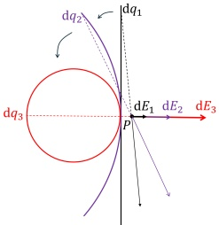

2. 在球面内外两侧电场强度发生了跳跃，是不连续的，这是理想面电荷产生的电场的普遍特征，本质上是因为在点电荷附近电场不连续（方向发生反向）。由于我们把面电荷当成理想的点电荷在一个平面上铺开一层，因此跨过这个平面之后电场就会反向。事实上，如果我们在 P 点附近的球面上挖掉一个小洞，那在这个小洞两侧的电场就是连续的，因为这种情况下不需要跨过点电荷。

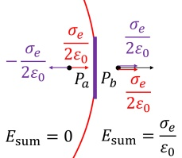

如右图所示，P 点的电场可以看成小洞里原本的电荷产生的电场与剩余电荷产生的电场的和，而当 P 点无限接近小洞时，挖掉的小洞里的电荷在 P 点产生的电场可以看成无限大带电平板产生的电场，其在内外两侧的电场大小相等符号相反（± $ \frac{\sigma_{e}}{2\varepsilon_{0}} $），而除去小洞之外的电荷在两侧产生的电场都是向外且大小相等（ $ \frac{\sigma_{e}}{2\varepsilon_{0}} $），两者相加之后导致内侧总电场为 0 而外侧总电场是无限大平板电场的两倍。

722

### 例 2.12

求无限长均匀带电圆柱面（半径 R，电荷面密度  $ \sigma_{e} $）产生的电场  $ \vec{E}(\vec{r}) $。

解:

如图，过 P 点取与带电圆柱面共轴、半径为 r 、高度为 h 的圆柱，设该圆柱的所有外表面为  $ \vec{S} $ :

 $$ \vec{S}=\vec{S}_{\mathrm{u p}}+\vec{S}_{\mathrm{d o w n}}+\vec{S}_{\mathrm{s i d e}} $$ 

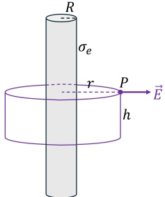

723 由对称性，上下表面（ $ \vec{S}_{up}, \vec{S}_{down} $）上的电场方向与表面的法向垂直，侧面（ $ \vec{S}_{side} $）上各点的电

724 场大小相等且方向与  $ \vec{S}_{side} $ 法向平行。因此，由高斯定理：

 $$ \begin{aligned}&\iint_{\vec{S}}\vec{E}\cdot\mathrm{d}\vec{S}=\iint_{\vec{S}_{\mathrm{up}}+\vec{S}_{\mathrm{down}}}\vec{E}\cdot\mathrm{d}\vec{S}+\iint_{\vec{S}_{\mathrm{side}}}\vec{E}\cdot\mathrm{d}\vec{S}=\frac{Q_{\mathrm{in}}}{\varepsilon_{0}}\\ &\Rightarrow0+2\pi r h E=\frac{Q_{\mathrm{in}}}{\varepsilon_{0}}\\ &\Rightarrow E=\frac{Q_{\mathrm{in}}}{2\pi\varepsilon_{0}r h}\\ \end{aligned} $$ 

1. 当 r < R 时， $ Q_{in} = 0 $，E = 0

2. 当 r > R 时， $ Q_{\mathrm{in}} = 2\pi Rh\sigma_{e} $

 $$ E=\frac{2\pi R h\sigma_{e}}{2\pi\varepsilon_{0}r h}=\frac{\sigma_{e}R}{\varepsilon_{0}r} $$ 

3. 当  $ r \rightarrow R + $ 时（即在无限贴近圆柱面外表面的地方），

 $$ E\rightarrow\frac{\sigma_{e}}{\varepsilon_{0}} $$ 

该结果与带电球面的外表面附近的电场强度一致。电场在圆柱面内外两侧发生了从 0 到  $ \frac{\sigma_{e}}{\varepsilon_{0}} $ 的突变。

730

### 例 2.13

求无限大带电平板（电荷面密度  $ \sigma_{e} $）产生的电场  $ \vec{E}(z) $

解:

由对称性，平板外任意一点的电场的方向应当与平板垂直，且在与平板平行的平面上各点的电场强度应当相等。如图，以 P 点为原型作平行于平板的一个圆 S，并以 S 为底作一个高度为 2z 的圆柱，圆柱的另一个底面在平板的另一侧。对圆柱体表面应用高斯定理：

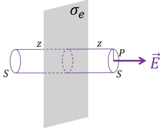

 $$ \begin{aligned}&\iint\vec{E}\cdot\mathrm{d}\vec{S}=\iint_{\vec{S}_{left}}\vec{E}\cdot\mathrm{d}\vec{S}+\iint_{\vec{S}_{right}}\vec{E}\cdot\mathrm{d}\vec{S}+\iint_{\vec{S}_{side}}\vec{E}\cdot\mathrm{d}\vec{S}=\frac{Q_{in}}{\varepsilon_{0}}\\ &\Rightarrow ES+ES+0=\frac{\sigma_{e}S}{\varepsilon_{0}}\\ &\Rightarrow E=\frac{\sigma_{e}}{2\varepsilon_{0}}\\ \end{aligned} $$ 

732 即：

 $$ \vec{E}(z)=\begin{cases}\frac{\sigma_{e}}{2\varepsilon_{0}}\hat{z},&z>0,\\-\frac{\sigma_{e}}{2\varepsilon_{0}}\hat{z},&z<0.\end{cases} $$ 

733 该电场在 z = 0 处不连续。

734

### 例 2.14

均匀带电球体（半径 R，体电荷密度  $ \rho_{e} $）内挖掉一个半径为 r 的空腔，求空腔内的电场。

解:

如图所示，由叠加原理，该带电体系可以看成一个完整的半径为 R、体电荷密度  $ \rho_{e} $ 的大带电球和一个半径为 r、体电荷密度  $ -\rho_{e} $ 的小带电球的叠加。

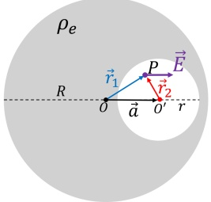

由例2.10可知，均匀带电球在其内部的电场为：

 $$ \vec{E}=\frac{q\vec{r}}{4\pi\varepsilon_{0}R^{3}}=\frac{\rho_{e}\vec{r}}{3\varepsilon_{0}} $$ 

736 因此，大带电球和小带电球在 P 点产生的电场分别为：

 $$ \vec{E}_{+}=\frac{\rho_{e}\vec{r}_{1}}{3\varepsilon_{0}} $$ 

 $$ \vec{E}_{-}=\frac{-\rho_{e}\vec{r}_{2}}{3\varepsilon_{0}} $$ 

737 两者矢量叠加便得到了 P 点总的电场强度：

 $$ \vec{E}=\vec{E}_{+}+\vec{E}_{-}=\frac{\rho_{e}\vec{r}_{1}}{3\varepsilon_{0}}+\frac{-\rho_{e}\vec{r}_{2}}{3\varepsilon_{0}}=\frac{\rho_{e}(\vec{r}_{1}-\vec{r}_{2})}{3\varepsilon_{0}}=\frac{\rho_{e}\vec{a}}{3\varepsilon_{0}} $$ 

即：空腔内的电场是均匀电场，方向与两圆心组成的矢量同向（ $ \vec{a}=O\vec{O}' $），大小是  $ \frac{\rho_{e}a}{3\varepsilon_{0}} $。

上述结论也可以应用到两个半径相同、带等量异号的电荷的球有部分重叠的情况，如下图左图所示，两球的重叠部分净电荷密度为 0，该部分的空间内的电场为：

 $$ \vec{E}=\frac{\rho_{e}\vec{a}}{3\varepsilon_{0}} $$ 

当两个球之间的距离逐渐缩小时，重叠部分（电荷空腔）的体积逐渐增大，此时空腔内的电场依然是均匀场。当两个球无限靠近后近似变成一个球时，这个时候只有球的表面有电荷分布，球内部没有电荷且电场为均匀场。如下面右图所示，球表面带电部分的“壁厚”与该处的θ角的关系是 $ d = a \cos \theta $，即这个时候如果简化成面电荷分布，那面电荷密度将呈现 $ \cos \theta $的分布。也就是说，对于一个表面电荷分布为形如 $ \cos \theta $的球面电荷系统，其在球内部产生的电场是一个均匀电场。

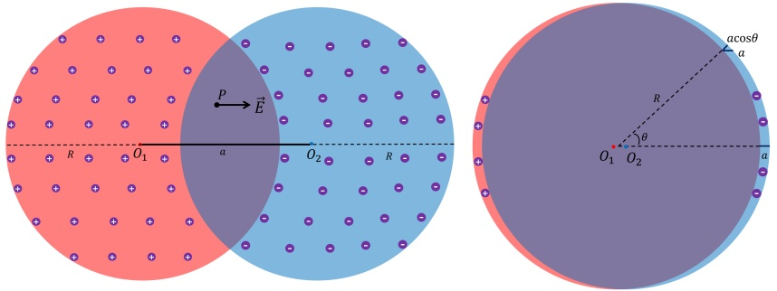

### 2.5 环路定理

上一节中，我们计算了电场的面积分及其散度，这一节我们将要计算并讨论静电场的线积分和旋度及它们的物理意义。

首先我们来看一下电场的线积分，即  $ \vec{E} $ 沿着某一路径 C 的线积分：

 $$ \int_{C}\vec{E}\cdot\mathrm{d}\vec{r} $$ 

752 现任，我们设想有一个电量为 q 的试探电荷，沿着路径 C 从一端运动到另一端，那么，在这个过程中，电场对电荷做的功为：

 $$ \begin{aligned}&A=\int_{C}\vec{F}\cdot\mathrm{d}\vec{r}=\int_{C}q\vec{E}\cdot\mathrm{d}\vec{r}\\ &\Rightarrow\int_{C}\vec{E}\cdot\mathrm{d}\vec{r}=\frac{A}{q}\\ \end{aligned} $$ 

754 即：静电场沿某一路径 C 的积分，等于电场对沿该路径运动的单位正电荷做的功。

如果路径 C 为闭合路径, 那么我们称电场在 C 上的路径积分为静电场的环量 (circulation):

 $$  环量 \equiv\oint_{C}\vec{E}\cdot\mathrm{d}\vec{r}=\frac{A}{q} $$ 

由于此处涉及到矢量场在闭合曲线上的线积分，因此我们在第一章所学习的矢量场的斯托克斯定理（定理1.75）对电场同样成立：

 $$ \oint_{C}\vec{E}\cdot\mathrm{d}\vec{r}=\iint_{\vec{S}}(\nabla\times\vec{E})\cdot\mathrm{d}\vec{S} $$ 

760 下面，我们来计算任意带电体系产生的静电场的旋度：

 $$ \nabla\times\vec{E}(\vec{r})=\nabla\times\left[\frac{1}{4\pi\varepsilon_{0}}\iiint_{V}\rho(\vec{r}_{0})\frac{\vec{r}-\vec{r}_{0}}{|\vec{r}-\vec{r}_{0}|^{3}}\mathrm{d}^{3}\vec{r}_{0}\right]=\frac{1}{4\pi\varepsilon_{0}}\iiint_{V}\rho(\vec{r}_{0})\nabla\times\frac{\vec{r}-\vec{r}_{0}}{|\vec{r}-\vec{r}_{0}|^{3}}\mathrm{d}^{3}\vec{r}_{0} $$ 

761 问题转换成了形如  $ \frac{\vec{r}-\vec{r}_{0}}{|\vec{r}-\vec{r}_{0}|^{3}} $ 的矢量场的旋度的计算：

 $$ \nabla\times\frac{\vec{r}-\vec{r}_{0}}{\left|\vec{r}-\vec{r}_{0}\right|^{3}} $$ 

762 由于旋度的计算结果与坐标系的选取无关，因此可以将坐标系平移至以  $ \vec{r}_{0} $ 为中心，即：

 $$ \nabla\times\frac{\vec{r}-\vec{r}_{0}}{\left|\vec{r}-\vec{r}_{0}\right|^{3}}=\nabla\times\frac{\vec{r}}{r^{3}} $$ 

763 根据上一章中习题1.9得出的旋度在球坐标系中的表达式：

 $$ \nabla\times\vec{\boldsymbol{F}}=\hat{\boldsymbol{r}}\frac{1}{r\sin\theta}\bigg(\frac{\partial(F_{\phi}\sin\theta)}{\partial\theta}-\frac{\partial F_{\theta}}{\partial\phi}\bigg)+\hat{\phi}\frac{1}{r}\bigg(\frac{\partial F_{r}}{\partial\phi}-\frac{\partial(r F_{\phi})}{\partial r}\bigg)+\hat{\boldsymbol{z}}\frac{1}{r}\bigg(\frac{\partial(r F_{\theta})}{\partial r}-\frac{\partial F_{r}}{\partial\theta}\bigg) $$ 

764 我们可以得出：

 $$ \nabla\times\frac{\vec{r}}{r^{3}}=\hat{\boldsymbol{r}}\frac{1}{r\sin\theta}(0-0)+\hat{\phi}\frac{1}{r}(0-0)+\hat{z}\frac{1}{r}(0-0)=0 $$ 

765 因此，2.88式变成：

 $$ \nabla\times\vec{E}(\vec{r})=\frac{1}{4\pi\varepsilon_{0}}\iiint_{V}\rho(\vec{r}_{0})\nabla\times\frac{\vec{r}-\vec{r}_{0}}{|\vec{r}-\vec{r}_{0}|^{3}}\mathrm{d}^{3}\vec{r}_{0}=\frac{1}{4\pi\varepsilon_{0}}\iiint_{V}\rho(\vec{r}_{0})\cdot0\cdot\mathrm{d}^{3}\vec{r}_{0}=0 $$ 

766 从而我们可以把电场的斯托克斯定理（2.87式）写成：

 $$ \oint_{C}\vec{E}\cdot\mathrm{d}\vec{r}=\iint_{\vec{S}}(\nabla\times\vec{E})\cdot\mathrm{d}\vec{S}=0 $$ 

767 从而我们便得出了静电场的环路定理：

### 定理 2.2 静电场的环路定理

静电场沿任意闭合路径的积分等于零：

 $$  环量 =\oint_{C}\vec{E}\cdot\mathrm{d}\vec{r}=0 $$ 

该式的微分形式为：

 $$ \nabla\times\vec{E}=0 $$ 

需要指出的是，环路定理同样也是库仑定律和叠加原理的必然结果。由于静电场沿任意闭合路径的积分等于零，根据我们第一章学习的保守场的讨论，我们知道，静电场的这一性质表明静电场是保守场，即静电场对电荷做的功与电荷的运动路径无关，只与电荷运动的起始和结束点有关。

 $$ 772 $$ 

实际上，关于静电场是保守场的结论，我们也可以直接通过计算静电场对电荷的做功得出。如图所示，在点电荷 q 产生的电场中，让试探电荷  $ q_{0} $ 从 P 点运动到 Q 点，在这个过程中，q 产生的电场对  $ q_{0} $ 做的功为：

 $$ \begin{aligned}A_{PQ}&=\int_{P}^{Q}q_{0}\vec{E}\cdot\mathrm{d}\vec{l}\\&=\int_{P}^{Q}\frac{q q_{0}}{4\pi\varepsilon_{0}r^{2}}\hat{\boldsymbol{r}}\cdot\mathrm{d}\vec{l}\end{aligned} $$ 

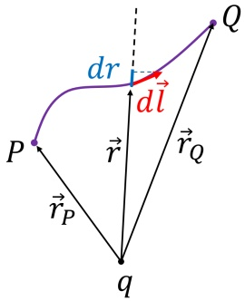

由图中几何关系可知， $ \hat{r} \cdot \mathrm{d}\vec{l} = \mathrm{d}r $，因此：

 $$ A_{PQ}=\int_{P}^{Q}\frac{qq_{0}}{4\pi\varepsilon_{0}r^{2}}\mathrm{d}r=\frac{qq_{0}}{4\pi\varepsilon_{0}}\left(\frac{1}{r_{P}}-\frac{1}{r_{Q}}\right) $$ 

774 可知结果只与试探电荷的起始和结束位置有关，与路径无关，因而点电荷产生的电场是保守场。

775 再根据电场的叠加原理，可知一般带电体系的电场也是保守场。

### 2.6 电势

777 在第一章学习梯度定理的时候我们也学习了梯度定理的逆定理，即保守场一定可以写成一个标量场的梯度的形式。上一节我们知道，电荷产生的静电场  $ \vec{E}(\vec{r}) $ 是保守场，因此我们也可以定义一个标量场  $ \Phi(\vec{r}) $，使得  $ \vec{E}(\vec{r}) = \nabla \Phi(\vec{r}) $，例如，我们可以将  $ \Phi(\vec{r}) $ 定义为：

 $$ \Phi(\vec{r})=\int_{\infty}^{\vec{r}}\vec{E}\cdot\mathrm{d}\vec{r} $$ 

780 即： $ \vec{E}(\vec{r}) $ 在从无穷远处到  $ \vec{r} $ 的任意一条曲线上的线积分，由于  $ \vec{E}(\vec{r}) $ 是保守场，因此上述定义是唯一的，与选取哪条路径无关。根据积分的定义，我们有：

 $$ \mathrm{d}\Phi(\vec{r})=\vec{E}\cdot\mathrm{d}\vec{r} $$ 

782 同时，根据梯度的定义，我们有：

 $$ \mathrm{d}\Phi(\vec{r})=\nabla\Phi\cdot\mathrm{d}\vec{r} $$ 

783 由上述两式可得：

 $$ \vec{E}\cdot\mathrm{d}\vec{r}=\nabla\Phi\cdot\mathrm{d}\vec{r} $$ 

上式对任意  $ d\vec{r} $ 都成立，因而  $ \vec{E}(\vec{r}) = \nabla \Phi(\vec{r}) $。

下面，我们来试图理解一下上述定义的  $ \Phi(\vec{r}) $ 的物理意义，为此，我们不妨再来看一下从点

### 2.6 电势

786 P 到点 Q 电场对试探电荷 q 所做的功：

 $$ A_{PQ}=\int_{P}^{Q}q\vec{E}\cdot\mathrm{d}\vec{r}=q\int_{P}^{Q}\nabla\Phi(\vec{r})\cdot\mathrm{d}\vec{r}=q\int_{P}^{Q}\mathrm{d}\Phi=q\Phi(Q)-q\Phi(P) $$ 

787 由能量守恒，电场力对点电荷做的功，必然等于这个系统某种能量的减少，对于保守场，其做功的能量来源是保守场的势能 W，即：

 $$ A_{PQ}=W(P)-W(Q) $$ 

789 比较2.103式和2.104式我们发现，我们可以把势能函数定义为：

 $$ W(\vec{r})=-q\Phi(r)=-q\int_{\infty}^{\vec{r}}\vec{E}\cdot\mathrm{d}\vec{r}=q\int_{\vec{r}}^{\infty}\vec{E}\cdot\mathrm{d}\vec{r} $$ 

790 需要注意的是，上述定义我们实际上是把无穷远处定义为势能为零的地方，实际上势能为零的地方可以任意选取，因为讨论势能的绝对大小是没有意义的，只有势能的改变才具有实际意义，实际应用或研究电路问题时，我们常常把大地或者仪器外壳等处定义为势能为零的地方。势能不仅与电场的性质有关，还与试探电荷本身的电荷大小有关。为了表征电场本身的“势”，我们定义一个只跟电场有关的量，叫电势  $ U(\vec{r}) $，其定义为：

 $$  电势 \quad U(\vec{r})\equiv\int_{\vec{r}}^{\infty}\vec{E}\cdot\mathrm{d}\vec{r} $$ 

796 写成微分形式，上式等价于：

 $$ \vec{E}(\vec{r})=-\nabla U(\vec{r}) $$ 

797 电势的单位是 V（伏特）。有了电势的定义，电荷 q 在电场中的势能便可以写成：

 $$ W(\vec{\mathbf{r}})=q U(\vec{\mathbf{r}}) $$ 

798 2.103式也可以写成：

 $$ A_{PQ}=\int_{P}^{Q}q\vec{E}\cdot\mathrm{d}\vec{r}=q\Big[U(P)-U(Q)\Big] $$ 

799 即：电场力做正功，等于势能的减少。

800 根据点电荷电场的形式及2.106，很容易计算出点电荷 q 产生的电场的电势为：

 $$ U(\vec{\bf r})=\frac{q}{4\pi\varepsilon_{0}r} $$ 

801 由电场的叠加原理，可得电势的叠加原理，即带电体系产生的电场在某点的电势为各点电荷在该点的电势的代数和：

 $$ U(\vec{\mathbf{r}})=\sum_{1}^{N}U_{i}(\vec{\mathbf{r}})=\sum_{1}^{N}\frac{q_{i}}{4\pi\varepsilon_{0}|\vec{\mathbf{r}}-\vec{\mathbf{r}}_{i}|} $$ 

803 对连续分布的带电体系则有：

 $$ U(\vec{\mathbf{r}})=\iiint_{V^{\prime}}\mathrm{d}U_{\vec{\mathbf{r}}^{\prime}}(\vec{\mathbf{r}})=\iiint_{V^{\prime}}\frac{\rho(\vec{\mathbf{r}}^{\prime})\mathrm{d}V^{\prime}}{4\pi\varepsilon_{0}|\vec{\mathbf{r}}-\vec{\mathbf{r}}^{\prime}|} $$ 

空间中电势相等的平面称为电场的等势面。在第一章学习标量场的梯度的时候我们提到， $ \nabla U $ 的方向平行于等势面的法向，因此，电场的方向与等势面的法向是平行的（方向相反），且电场的大小等于电势 U 在等势面法向方向的导数的负数。

在求解一个带电系统的电场或电势时，可以通过叠加原理先计算电场然后通过积分得到电势，也可以通过叠加原理先计算电势然后通过微分得到电场。

809

例 2.15

同例2.6，求如图所示的均匀带电细圆环（半径 R，总电荷 q）在其轴线上任意一点  $ P(z) $ 处的电场强度。

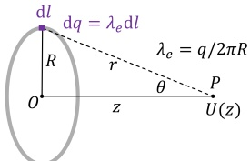

解:

810 如图所示，将带电圆环分成无限个点电荷 dq，该点电荷的电场在 P 点的电势为：

 $$ \mathrm{d}U(z)=\frac{\mathrm{d}q}{4\pi\varepsilon_{0}r} $$ 

811 因此，整个带电圆环产生的电场在 P 点的电势为：

 $$ U(z)=\int\mathrm{d}U=\int_{0}^{q}\frac{\mathrm{d}q}{4\pi\varepsilon_{0}r}=\frac{q}{4\pi\varepsilon_{0}r}=\frac{q}{4\pi\varepsilon_{0}\sqrt{R^{2}+z^{2}}} $$ 

812 由对称性，P 点的电场方向指向 z 方向，且：

 $$ E_{z}=-\frac{\partial U}{\partial z}=\frac{qz}{4\pi\varepsilon_{0}(R^{2}+z^{2})^{3/2}} $$ 

813 该结果与例2.6中直接通过叠加原理求电场得到的结果相同。

814

例 2.16

求电偶极子在远点的电势。

解:

如图所示，由叠加原理，电偶极子在 P 点的电势等于正负电荷在 P 点的电势之和：

 $$ \begin{aligned}U(\vec{\mathbf{r}})&=U_{+}(\vec{\mathbf{r}})+U_{-}(\vec{\mathbf{r}})\\&=\frac{q}{4\pi\varepsilon_{0}}\bigg(\frac{1}{r_{+}}-\frac{1}{r_{-}}\bigg)\end{aligned} $$ 

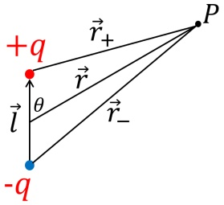

### 2.6 电势

815 将  $ r_{+} $,  $ r_{-} $用三角函数表示，并取  $ l/r \ll 1 $ 时的泰勒展开后的一次项，可得：

 $$ \begin{aligned}U(\vec{r})&=\frac{q}{4\pi\varepsilon_{0}}\Big[(r^{2}+(\frac{l}{2})^{2}-rl\cos\theta)^{-\frac{1}{2}}-(r^{2}+(\frac{l}{2})^{2}+rl\cos\theta)^{-\frac{1}{2}}\Big]\\&=\frac{q}{4\pi\varepsilon_{0}r}\Big[(1+(\frac{l}{2r})^{2}-\frac{l}{r}\cos\theta)^{-\frac{1}{2}}-(1+(\frac{l}{2r})^{2}+\frac{l}{r}\cos\theta)^{-\frac{1}{2}}\Big]\\&\approx\frac{q}{4\pi\varepsilon_{0}r}\Big[(1-\frac{l}{r}\cos\theta)^{-\frac{1}{2}}-(1+\frac{l}{r}\cos\theta)^{-\frac{1}{2}}\Big]\\&\approx\frac{q}{4\pi\varepsilon_{0}r}\Big[(1+\frac{l}{2r}\cos\theta)-(1-\frac{l}{2r}\cos\theta)\Big]\\&=\frac{ql\cos\theta}{4\pi\varepsilon_{0}r^{2}}\\&=\frac{\vec{p}\cdot\vec{r}}{4\pi\varepsilon_{0}r^{2}}\\ \end{aligned} $$ 

816 其中  $ \vec{p}=q\vec{l} $ 为电偶极矩。

在讨论高斯定理和环路定理的时候，我们都提到过这两个定理是库仑定律和叠加原理的直接结果。实际上，从数学上这个逻辑反过来也是可以推导出来的，即如果已知高斯定理和环路定理，那么我们便可以得出电场的平方反比规律（即库仑定律的形式）和叠加原理的结论。其推导过程也并不复杂，首先，由环路定理的微分形式：

 $$ \nabla\times\vec{E}=0 $$ 

821 我们可以得出：

 $$ \vec{E}=-\nabla U $$ 

822 再代入高斯定理的微分形式：

 $$ \nabla\cdot\vec{E}=\frac{\rho}{\varepsilon_{0}} $$ 

823 可得：

 $$ \nabla\cdot\nabla U=\nabla^{2}U=-\frac{\rho}{\varepsilon_{0}} $$ 

824 上述方程，也被称为静电场的泊松方程，其中  $ \nabla^{2} $ 称为拉普拉斯算符，有时也用  $ \Delta $ 来表示：

 $$ \nabla^{2}=\Delta=\frac{\partial^{2}}{\partial x^{2}}+\frac{\partial^{2}}{\partial y^{2}}+\frac{\partial^{2}}{\partial z^{2}} $$ 

825 求解泊松方程（边界条件  $ U(\infty)=0 $），便可得到 U 的表达式：

 $$ U(\vec{\mathbf{r}})=\frac{1}{4\pi\varepsilon_{0}}\iiint_{V_{0}}\frac{\rho(\vec{\mathbf{r}}_{0})}{|\vec{\mathbf{r}}-\vec{\mathbf{r}}_{0}|}\mathrm{d}V_{0} $$ 

826 已知该电势，便可使用2.119求出电场：

 $$ \vec{E}=-\nabla U=\frac{1}{4\pi\varepsilon_{0}}\iiint_{V_{0}}\frac{\rho(\vec{r}_{0})(\vec{r}-\vec{r}_{0})}{|\vec{r}-\vec{r}_{0}|^{3}}\mathrm{d}V_{0} $$ 

827 而上式，便是库仑定律和叠加原理。

## 习题

2.1: 如图所示，在例2.2的基础上，假设物质中的原子数密度为 N，原子数为 Z，求带电粒子经过单位厚度的物质时损失的能量  $ \frac{dE}{dx} $ （提示：注意思考图中的  $ b_{\min} $ 和  $ b_{\max} $ 该如何取值）。

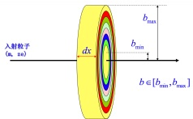

830 2.2: 在粒子对撞机中，我们一般通过磁场将大量的带电粒子会聚到一个小的束团中，而后与831 另一个反方向运动的束团发生对撞。如图所示，设有两团质子发生对撞，假设每一团质子都是832 均匀分布在半径为 R 的球体中，忽略相对论效应（即假定库仑定律适用），求当两团质子刚好833 发生接触时：

834 1) 求在 z 轴上何处的质子受到的电场力最大?

2) 假设  $ R = 10\mu m $，每一团质子中有  $ 10^{11} $ 个质子，求上一问中 z 轴上受力最大的质子受到多大的电场力？

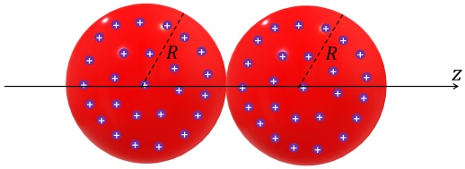

838 2.3: 求电偶极子在远点的电场的  $ \vec{r} $ 方向的分量  $ E_{r} $ 和垂直于  $ \vec{r} $ 方向的分量  $ E_{\theta} $ 。

2.4: 计算下图中所示的电四极子在其轴线上一点  $ P(x) $ 的电场强度  $ (x \gg l) $。

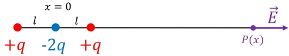

2.5: 求两个带等量异号（面电荷密度  $ \pm\sigma $）的无限大平行带电平板产生的电场分布。

2.6: 在一个半径为 R、高度为 2R 的圆柱的中心放置一个电荷为 q 的点电荷，求通过圆柱侧面的电场强度通量。

344 2.7: 如图所示，在原点放置一个正电荷 +Q，在 y 轴上距离原点 d 处放置一负点电荷 -q，已知 Q > q，求：

1) 空间中任意一点  $ P(x, y, z) $ 的电势（以无穷远处为电势零点）；

2）求电势为零的点组成的等势面，证明该等势面为一球面，并求出半径和球心位置。

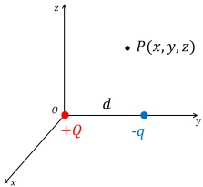

845 2.8: 求一个半径为 R 的均匀带电球壳（球壳总电荷为 Q）上的一个带电量为 dq 的小面元受到的电场力。

847 2.9: 将一个半径为 R 的均匀带电球壳（球壳总电荷为 Q）切成两半，若还要将这两半球壳拼在一起，需要给每个半球壳施加多大的外力？

849 2.10: 求一个半径为 R 的无限长均匀带电圆柱体（体电荷密度  $ \rho_{e} $）产生的电场。

850 2.11: 求均匀带电细线（位于 x 轴上，长度 l，线电荷密度  $ \lambda_{e} $）在其所在直线上（即 x 轴）各处的电场强度分布，并画出电场 E 随 x 的变化曲线。根据你的计算，假如该带电细线是理想导体（即电荷可以自由移动），你认为电荷会聚集在何处？

853 2.12: 如图所示，有一带电半圆环，圆环上任意一点 P 的线电荷密度为  $ \lambda_{0} \sin \theta $，证明：直径 AB 上任意一点的电场与直径 AB 垂直。

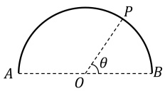

854 2.13: 如图所示，用高能质子源（质子质量为 m，带电量为 e）不断轰击一半径为 R 的导体球使其不断积累电荷。已知质子源的最高能量为  $ E_{m} $，则导体球最多能积累多少电荷？

←

855 2.14: 求无限长均匀带电直线（线电荷密度  $ \lambda $）产生的电场的电势。

2.15: 请使用先计算电势再用微分计算电场的方法求均匀带电细线（长度 l，线电荷密度  $ \lambda_{e} $）在其中垂线上  $ P(r) $ 点产生的电场。

8 2.16: 一个长为 2f 的均匀线电荷位于 z 轴上（线电荷密度为  $ \lambda $），两端分别位于 z = -f 和 z = f，求：

1）空间中任意一点  $ P(x,y,z) $ 的电势（以无穷远处为电势零点）；

1 2) 证明：该线电荷产生的等势面满足  $ r_{1} + r_{2} = $ 常数，其中  $ r_{1} $ 和  $ r_{2} $ 分别为等势面上的点到线电荷两个端点的距离。这个等势面是个什么曲面？

## 第三章 有导体时的静电场

在上一章研究摩擦起电的时候我们提到，摩擦后带电的玻璃棒（或橡胶棒）会吸引轻小的不带电的物体，当时我们给出的解释是当玻璃棒靠近不带电的物体的时候，玻璃棒中的正电荷会吸引不带电的物体中的电子，最终的结果是不带电的物体在靠近玻璃棒的一侧会有部分负电荷聚集，而在远离玻璃棒的一侧会有正电荷聚集。由于库仑定律的距离平方反比关系，靠近玻璃棒的负电荷与玻璃棒之间的相互吸引力会大于远离玻璃棒的正电荷与玻璃棒之间的相互排斥力，因此最终玻璃棒会吸引不带电的物体。

我们注意到，在上述过程中，由于玻璃棒中的电荷产生的电场，原本电中性的物质中的正负电荷进行了重新分布，而且重新分布的结果往往是新分布的电荷产生的电场与原本外加的电场方向相反，也就是说物质中的电场强度被“削弱”了。从这一章开始，我们就要研究这种外加电场对原本电中性的物质中的电荷的重新分配的规律，并试图定量计算有物质的情况下的电场分布。学习在物质中的电场的规律，不仅有利于帮助我们更深入地理解电场的行为（比如与我们后续要学习的导体中的电流及其相关的电磁现象息息相关），同时也是我们解决工程和科学领域中的许多技术问题的基础（比如电场屏蔽、通信技术等）。

要想研究静电场中的物质，我们首先需要弄明白能够运动的电荷（大部分情况下是电子）在物质中的运动规律，即有多少电荷能够运动，运动的速度有多快等，而这些正是表征物质导电性能的关键参数。因此，本章将先带大家一起回顾学习一下物质中的电子分布和运动规律，以及对应的物质的导电性质。根据导电性质的不同，物质可以分为导体、半导体和绝缘体。在此基础上，本章将学习静电场中的导体在达到静电平衡后的电荷、电势、电场等特征，下一章我们将学习静电场中的绝缘体的特征。

定量研究静电场中的物质往往很困难，这是因为在静电场中，一般的计算办法都是给定电荷分布求电场。但是在有物质（比如导体）时，电荷分布是未知的，往往我们只能先猜测最终电场或电势分布，然后去验证我们的猜测。那我们如何来验证我们的猜测是否正确呢？本章将要学习的静电场的唯一性定理将会给我们提供一个思路。在大部分情况下，我们的猜测可能往往都是错误的，因此对一般情况我们往往只能借助计算机等手段进行多次猜测直到无限接近正确答案。对于一些简单的导体情况，本章将介绍一个简单的行之有效的我们手工能够进行的猜测方法，也就是所谓的电镜像法，这个方法是基于我们上一章所学的一些常见带电体系的电场的特征，来进行猜测并求解一些有导体存在时的电场。

### 3.1 物质的导电性质

我们日常生活中接触到的物质的很多性质，诸如导电性、磁性、导热性、光学性能等，都来源于组成物质的原子这一基本单元的一些性质。原子与原子之间可以有规律地结合在一起组成各种宏观物体，通过化学反应，我们可以很轻易地让不同的原子进行重新组合形成成千上万种不同的宏观物质，但是我们却没法改变组成物质的原子本身。

原子是由带正电的原子核和若干个带负电的核外电子组成的，对于固体而言，原子内部的原子核在宏观上是不会从固体的一侧移动到另一侧的，唯一有可能发生宏观运动进而引起电荷的重新分配的只能是核外电子。电子是自旋为 1/2 的费米子，满足泡利不相容原理，即不同核外电子应处于不同的量子态。表征核外电子的量子态有 4 个量子数，即主量子数 n、角量子数 l、磁量子数  $ m_l $、自旋量子数  $ m_s $。泡利不相容原理表明在同一体系中，不存在四个量子数完全相同的电子。主量子数 n 相同的电子分布在一个电子层中，根据离原子核的距离分别是第 1, 2, 3, 4, 5, 6, 7 层，第 n 层中最多能容纳  $ 2n^2 $ 个电子（即有  $ 2n^2 $ 个量子态）；电子层根据角量子数 l 又可以再细分为 n 个不同的亚层（ $ l = 0, 1, ..., n - 1 $，分别记作  $ s, p, d, f\ldots $），同一亚层中的电子具有相同的能量（即处于同一能级），一个亚层（即同一能级）中有  $ (2l + 1) $ 个电子轨道，每个电子轨道最多容纳两个自旋相反的电子。例如，一个铜原子中有 29 个电子，这 29 个电子所在的能级及每个能级所包含的电子数目如下：

894

 $$ 1s^{2}\quad2s^{2}\quad2p^{6}\quad3s^{2}\quad3p^{6}\quad3d^{10}\quad4s^{1} $$ 

其中， $ 1s^{2} $ 表示 n = 1, l = 0 的亚层中有两个电子（即已经填满了），依此类推，直到 3d 能级的所有亚层都占满了电子，而 4s 能级中有一个电子（它能容纳两个电子），其余亚层则都空着。根据这些亚层的能量大小和间隙，我们可以画出这 29 个电子的能级分布如右图所示。铜原子中的任何一个核外电子，如果想脱离它所在的能级，则必须：

1. 要么获得足够的能量彻底脱离铜原子成为自由电子，要么获得或失去能量去一个能量更高或更低的能级。

2. 所去的那个能级必须是没有被占满的能级，比如一个 3d 能级上的电子在 4s 能级还未被占满的情况下可以在获得足够能量时跳跃到 4s 能级上。

现实生活中我们接触到的物质都是由许多的原子组成的，例如，1cm³的铜里面约有N = 10²³个铜原子。对于一般固体而言，原子与原子之间是紧密排布，比如相邻铜原子之间的距离与一个铜原子的大小（直径）是相当的，在这种情况下，铜原子中的电子将感知到旁边另一个铜原子的存在，也就是说，不同铜原子之间的电子的波函数是重叠的，而且外层电子的波函数比内层电子的波函数重叠得更加严重。对于由很多个铜原子组成的一个N原子系统，泡利不相容原理仍然适用，也就是说要求29N个电子都占据不同的量子态，这29N个不同的量子态将对应不同的能量。如下图所示，如果将这N个铜原子的电子能级从小到大进行排列，我们将看到若干个不同的能带，比如原本一个铜原子对应的3p能级将变成很多个靠得非常近的能级形

成一个能带，且这个能带中不同的量子态将全部被电子占满；而最高能级 4s 对应的能带则将对应的变成另一个能量更高的能带，与 3s 对应的能带不同的是，4s 对应的这个能带中的能级还有一大半是空着没被占据的。由于这些未被占满的能级的存在，4s 中的电子很容易运动到另一个原子旁边的未被占满的 4s 能级，而且这一运动的速度非常的快（对应的是费米速度，约  $ 1.6 \times 10^6 \, \text{m/s} $）。像铜的 4s 对应这种存在大量未被占据的能级的能带，我们称之为导带，而导带下面的那个能带（如 3d 对应的能带）所有的能级都已经被电子占满了，我们把这种能带称为价带。由于铜的导带中同时也被大量的电子占据，这些电子能够轻易的跳到导带中的其他能级，它们能够像气体中的分子那样在样品的整个体积内几乎自由地运动，因此铜便成了很好的导体。

916 开个是所有的固体都像铜这样，在 N 原子系统组成能带后，导带中的很多能级被电子所占据；有些固体，比如硅、金刚石等，在温度为绝对零度的时候它们的导带中的能级是全空的，比如单个硅原子的最外层的 3s 和 3p 能级在 N 原子系统中（由于  $ sp^{3} $ 轨道杂化）将被分成两个能带，能量较低的那个能带（价带）会被全部占满，而较高的那个能带（导带）则没有任何电子占据，导带和价带之间相差了 1.12eV。由于价带中的能级已经被全部占满了，泡利不相容原理不允许其中的任何一个电子跳到价带中的其他已经被占满的能级，这些电子如果想脱离它所属的原子那它只能跳转到能量比它高  $ E_{g} = 1.12eV $ 的导带中，而光靠电子的热运动是很难满足，比如，对于温度为 T 的这类物体，其导带上的能级被来自价带的电子占据的概率由费米-狄拉克统计给出：

 $$ p=\frac{1}{e^{\frac{E-E_{F}}{kT}}+1}\approx e^{-\frac{E-E_{F}}{kT}}\approx e^{-\frac{E_{g}}{2kT}} $$ 

925 其中  $ E_{F} $ 是费米能级，对硅来说处在能带间隙的中间；对于室温， $ kT \approx 0.026eV $，因此：

 $$ p=e^{-\frac{E_{g}}{2kT}}\approx e^{-\frac{1.12eV}{2\times0.026eV}}=4.4\times10^{-10} $$ 

这是一个很小的概率，但是对于有多达  $ 10^{23} $ 个原子  $ 1\,cm^{3} $ 的硅来说，就算是上面这么小的概率也会导致可观数量的电子在导带中占据着，只不过要远小于诸如铜这类导体中导带中的电子罢了。我们把这类在绝对零度时导带中完全没有电子占据，但是在室温下有一定数量的电子占据的物体，称为半导体。

930 值得注意的是，3.2式对能带间隙  $ E_{g} $ 的大小是非常敏感的，比如，对于金刚石， $ E_{g}=5.5eV $，931 因此该概率就变成：

 $$ p=e^{-\frac{E_{g}}{2kT}}\approx e^{-\frac{5.5eV}{2\times0.026eV}}=1.2\times10^{-46} $$ 

这是一个极其小的概率，室温下就算是多达  $ 10^{23} $ 个原子也没有 1 个电子会处在导带中，我们把这类物体称为绝缘体。下图给出了导体、半导体和绝缘体的能带结构以及不同能带中的电子数量示意图。

通过上面的分析我们知道，在导体中存在大量的可以自由运动的电子，而且电子运动的速度很快，宏观上从物体的一端运动 1cm 到另一端只需要约 ns 级别的很短的时间；而在绝缘体中，所有电子都严格地被束缚在其所属的原子周围，没法自由跳转到其他的原子附近，因而理想的绝缘体中不存在能够自由运动的电荷。本章和下一章将分别研究在这两种不同的物质中施加外加电场的情况下其电荷分布及电场的特征。

### 3.2 静电场中的导体

#### 3.2.1 静电平衡

上一节中提到，导体中存在很多（近似成“无穷多”）能够快速运动的自由电荷（比如固体中的电子），当给导体施加一个外加电场的时候，导体中的电荷会在电场力的作用下发生定向移动，而这一定向移动又会导致导体内电荷分布的改变，从而改变导体内的电场强度，而电场强度的改变又会影响自由电荷的运动，如此进入一个带有反馈机制的循环中。如果导体所处的外部环境是一个静电场，也就是外加电场不随时间改变，那么在经过一段时间的上述循环后（这一时间往往非常短，在 ns 级别），导体内的自由电荷将不再发生定向移动，我们称在这种情况下，电场和导体之间达到了静电平衡（electrostatic equilibrium）。

处于静电平衡时的导体，具有如下特征：

1. 导体内部电场处处为零，导体表面电场与表面垂直。

这是因为，如果导体内部电场不为零，那么导体内的自由电荷将继续因为受到电场力而发生定向移动，因此静电平衡时导体内部无电场。

至于导体表面的电场，如果导体表面存在与表面平行的电场，那么在导体表面的自由电荷将会继续沿着导体表面移动，也不满足静电平衡，只有当表面电场与表面垂直时，导体表面的电荷才无法继续移动，此时，导体表面的电荷除了受到外加电场的作用力外，还会受到来自导体本身的吸引力（比如原子核对电子的吸引力）而达到受力平衡。

958

当然，我们也可以通过静电场的环路定理来证明导体表面电场与表面垂直，如右图所示，沿导体表面取一个无穷窄的长条形环路 C，其中长边与导体表面平行（长度为 l），则根据环路定理：

 $$ 0=\oint_{C}\vec{E}\mathrm{d}\vec{l}=E_{\parallel 内 }l-E_{\parallel 外 }l $$ 

由于导体内部电场处处为零，因此  $ E_{\parallel内}=0 $，从而有  $ E_{\parallel外}=0 $，即导体表面电场的切向分量为零。

2. 导体是个等势体，导体表面是个等势面。

这个也很好理解，由于导体内部没有电场，因此导体上任意两点之间的在导体内部的路径上的电场的路径积分为零，也就是电势差为零，因而导体是个等势体，导体的表面也是个等势面。

3. 导体内部体电荷密度  $ \rho_{e} $ 处处为零，电荷只分布在导体表面。

导体内部的体电荷密度，可以由高斯定理的微分形式给出：

 $$ \rho_{e}=\varepsilon_{0}\nabla\cdot\vec{E} $$ 

由于导体内部电场处处为零，因而  $ \rho_{e}=0 $

#### 3.2.2 导体表面电场强度

上面提到，处于静电平衡的导体，其表面电场的切向分量为零，那么表面电场的垂直分量是多大呢？为了计算电场的垂直分量，我们可以取如右图所示的圆柱面作为高斯面，该圆柱面的侧面与导体表面垂直，其中一个底面位于导体内部，则由高斯定理：

 $$ \begin{aligned}&\iint_{\vec{S}}\vec{E}\cdot\mathrm{d}\vec{S}=\frac{Q_{\mathrm{in}}}{\varepsilon_{0}}\\\Rightarrow&E_{ 外 }S+E_{ 内 }S+\iint_{ 侧面 }\vec{E}\cdot\mathrm{d}\vec{S}=\frac{\sigma_{e}S}{\varepsilon_{0}}\end{aligned} $$ 

其中，由静电平衡我们知道导体内部电场  $ E_{内} = 0 $，此外我们再令这个圆柱面的高无限小，则有  $ \iint_{侧面} \vec{E} \cdot d\vec{S} = 0 $，因此：

 $$ E_{ 外 }S=\frac{\sigma_{e}S}{\varepsilon_{0}} $$ 

970 即导体表面的电场强度为：

 $$ \vec{E}=\frac{\sigma_{e}}{\varepsilon_{0}}\vec{n} $$ 

注意到该电场强度有以下一些有趣的现象：

1. 导体表面某一处的电场强度，应该是外加电场加上导体上所有表面电荷共同叠加的结果，

但是上式由高斯定理给出的结果却表明电场的值只跟这一点的面电荷密度有关。之所以有这个结论，就是因为导体能够提供“无穷多”的电荷，使得无论外加电场多大，以及无论导体原本带多少电，导体表面的电荷分布最终都会使得导体内部电场为零，且外表面只有垂直场，且垂直场的场强与该点的面电荷密度存在简单的正比关系。

2. 该电场强度的值与上一章中我们计算得到的无穷大带电平板产生的电场强度类似，但是导体表面的电场强度是相同面电荷密度的无穷大带电平面产生的电场强度的两倍。这也是由于导体上其他的表面电荷在该点产生的电场叠加后的结果。事实上，如果我们把无穷大带电平面变成无穷大的具有一定厚度的带电导体板，那么在这种情况下，上式3.7依然成立。如下图所示，假设无限大的带电导体板的厚度为 d，在没有外加电场的情况下，导体板两侧的面电荷相同（假设为  $ \sigma_{e} $），由3.7式，可知导体板表面电场强度为：

 $$ E=\frac{\sigma_{e}}{\varepsilon_{0}} $$ 

当导体板厚度 d 足够小时，它可以等价为一个无限大带电平面，面电荷密度为  $ 2\sigma_{e} $，由上一章的结论，该无限大带电平面产生的电场强度为：

 $$ E=\frac{2\sigma_{e}}{2\varepsilon_{0}}=\frac{\sigma_{e}}{\varepsilon_{0}} $$ 

986 可知两种模型给出的结论是一致的。

#### 3.2.3 导体表面电荷分布

我们知道，处于静电平衡的导体，其电荷只分布在表面上，那表面电荷的分布有什么规律呢？

我们不妨先看最简单的孤立导体的情况，也就是不存在外加电场或其他导体，在这种情况下，导体上的电荷将会如何分布在其表面呢？为了研究这个问题，我们不妨来看下面这种简单的情况：如图所示，有两个半径分别为  $ r_{1} $ 和  $ r_{2} $ 的导体球通过导线相连，两个球相距无限远，假设两个球表面的面电荷密度分别是  $ \sigma_{1} $ 和  $ \sigma_{2} $，求  $ \sigma_{1} $ 和  $ \sigma_{2} $ 之间的关系。

995

996 上面这个问题可以通过静电平衡时导体是个等势体来求解。由于两个球之间通过导线相连，所以两个球是个等势体，其中球 1 的电势等于球 1 和球 2 上的电荷产生的电场在球 1 处的电势，由于两球相隔无穷远，所以球 2 的电荷产生的电场在球 1 的电势为零，即球 1 处的电势为球 1 上的电荷在球 1 处产生的电势：

 $$ U_{1}=\frac{1}{4\pi\varepsilon_{0}}\frac{Q_{1}}{r_{1}} $$ 

1000 同理，球 2 的电势为：

 $$ U_{2}=\frac{1}{4\pi\varepsilon_{0}}\frac{Q_{2}}{r_{2}} $$ 

1001 由  $ U_{1}=U_{2} $ 可得：

 $$ \frac{Q_{1}}{r_{1}}=\frac{Q_{2}}{r_{2}} $$ 

1002 即：

 $$ \frac{4\pi r_{1}^{2}\sigma_{1}}{r_{1}}=\frac{4\pi r_{2}^{2}\sigma_{2}}{r_{2}} $$ 

1003 从而有：

 $$ \frac{\sigma_{1}}{\sigma_{2}}=\frac{r_{2}}{r_{1}} $$ 

即半径小（或曲率大）的球其面电荷密度更大。这一结论对于任意形状的孤立导体都是成立的，也就是说电荷更容易聚集在孤立导体的尖端部位（曲率大）。这个现象也可以通过对表面电荷受力分析来理解，如右图所示的一个孤立导体，在其曲率小和曲率大的地方分别取 A, B, C, D 四个点，处在这四个点上的表面电荷，它们主要受到两类力，一类是来自导体给的吸引力（主要来自原子对电子的束缚力，方向垂直于导体表面指向导体内部，防止电荷脱离导体表面），另一类是来自其他表面电荷的排斥力。

图中标出了不同位置的电荷受到的来自其他表面电荷的排斥力的示意图，由图可知，在表面平坦处的 A, B 两点，电荷附近的其他表面电荷给它的排斥力主要是沿着表面的切向，而在切向没有与之抗衡的来自导体中的原子的力，因此在这个排斥力的作用下自由电荷很容易沿表面切向发生移动，不容易达到静电平衡；而在表面很尖的 C, D 两点，电荷受到的来自其他表面电荷的排斥力有很大一部分是沿着导体表面的法线方向，而在这个方向刚好有来自导体的吸引力与之抗衡，因而更容易达到静电平衡，因而在这些尖端处更容易聚集表面电荷。由于这个原因，在导体表面的尖端处往往电场比较强，更容易使附近的空气电离而产生放电现象，这一现象也被称为导体的尖端放电现象。比如避雷针往往是由建筑物顶端的一个尖尖的金属做成，就是利用了这个现象，在雷雨天气，使建筑物附近的空气在避雷针附近提前电离和放电，将空气中累积的电荷通过避雷针释放到大地中。

对于一般情况下静电平衡中的导体（比如存在不止一个导体、存在其他电荷、存在空腔、导体接地或者存在外场等），很多时候我们只能运用电荷守恒、静电平衡特征、高斯定理等定量地分析一些简单情况下的电荷分布情况，对一般情况往往不存在解析解（如本章开头提到的利用计算机进行循环猜测和修正得到数值解）。下面，我们通过几个例题，来分析一下几种常见情况下的导体表面电荷分布。

### 例 3.1

一个面电荷密度为  $ \sigma_{0} $ 的无限大绝缘板旁边，放置了一个与之平行的无限大的原本不带电的导体平板。

1. 求静电平衡后导体板两个表面上的面电荷密度。

2. 若导体平板接地，静电平衡后其两个表面上的电荷又该如何分布？

## 1025 解:

1\. 如右图所示，由对称性，静电平衡后导体平板两侧的电荷一定是均匀分布，设两侧面电荷密度分别为  $ \sigma_{1} $ 和  $ \sigma_{2} $ 。由于导体板原本不带电，由电荷守恒，有：

 $$ \sigma_{1}+\sigma_{2}=0 $$ 

1026 此外，由静电平衡，我们知道导体内部电场为 0，而导体内部的电场是面电荷  $ \sigma_{0}, \sigma_{1}, \sigma_{2} $ 在导体内部产生的电场的和，即：

 $$ 0=E_{0}+E_{1}+E_{2}=\frac{\sigma_{0}}{2\varepsilon_{0}}+\frac{\sigma_{1}}{2\varepsilon_{0}}-\frac{\sigma_{2}}{2\varepsilon_{0}} $$ 

1028 联合求解上述两式，可得：

 $$ \sigma_{1}=-\frac{\sigma_{0}}{2},\quad\sigma_{2}=\frac{\sigma_{0}}{2} $$ 

1029 2. 如右图所示，若导体板接地，则接地的作用有两个：一是地球可以给导体板提供无穷多的电荷，因此上面提到的由电荷守恒而得出的导体板两侧面电荷密度之和为零的结论不再成立；二是接地之后导体板的电势与地的电势相等，即电势为零。由对称性，导体板两侧的电荷分布依然是均匀分布，设为  $ \sigma_{1} $ 和  $ \sigma_{2} $，因此，导体板右侧空间的电场是均匀电场。

1030 此外，由于导体电势与无穷远处电势相等，电场在从导体出发向右到无穷远处这条路径上的线积分也必然为零，因而可知导体板右侧空间的电场必然为零，即：

 $$ 0=\frac{\sigma_{0}}{2\varepsilon_{0}}+\frac{\sigma_{1}}{2\varepsilon_{0}}+\frac{\sigma_{2}}{2\varepsilon_{0}} $$ 

1032 此外，由于静电平衡，导体内部电场依然为零，即3.16式依然成立，联合3.16和3.18式，可得：

 $$ \sigma_{1}=-\sigma_{0},\quad\sigma_{2}=0 $$ 

### 例 3.2

034 如下图所示，将一个不带电的导体球放入一个均匀外场  $ \vec{E} $ 中，求静电平衡后导体球表面电荷分布。

1036

1037 解:

由静电平衡，我们知道导体球内部电场为零，而其内部电场等于外场  $ \vec{E} $ 和其自身的表面电荷产生的电场的矢量和，这意味着表面电荷在球内产生的电场为  $ -\vec{E} $，是个均匀电场。那什么样的球面电荷分布会在球内部产生均匀电场呢？在第二章中的例2.14的讨论中我们提到，对于形如  $ \cos\theta $ 的球面电荷分布，其在球内部产生的电场是一个均匀电场。不妨假设球面电荷的面电荷密度分布为：

 $$ \sigma_{e}(\vec{\boldsymbol{r}})=\sigma_{0}\cos\theta $$ 

1043 我们来计算一下这样一个面电荷在球心产生的电场强度。由电荷分布的对称性，球心的电场强度必然与 z 轴（即  $ \vec{E} $ 所在的轴）平行，球面上一个面元在球心产生的电场在 z 轴的分量为：

 $$ \mathrm{d}E_{z}=-\frac{\mathrm{d}q}{4\pi\varepsilon_{0}r^{2}}\cos\theta=-\frac{\sigma\mathrm{d}S}{4\pi\varepsilon_{0}r^{2}}\cos\theta $$ 

1045 其中：

 $$ \sigma=\sigma_{0}\cos\theta,\quad\mathrm{d}S=r^{2}\sin\theta\mathrm{d}\theta\mathrm{d}\phi $$ 

1046 因此，

 $$ \mathrm{d}E_{z}=-\frac{\sigma\mathrm{d}S}{4\pi\varepsilon_{0}r^{2}}\cos\theta=-\frac{\sigma_{0}}{4\pi\varepsilon_{0}}\cos^{2}\theta\sin\theta\mathrm{d}\theta\mathrm{d}\phi $$ 

1047 积分可得：

 $$ \begin{aligned}E_{z}&=\int_{0}^{2\pi}\int_{0}^{\pi}-\frac{\sigma_{0}}{4\pi\varepsilon_{0}}\cos^{2}\theta\sin\theta\mathrm{d}\theta\mathrm{d}\phi\\&=2\pi\int_{0}^{\pi}-\frac{\sigma_{0}}{4\pi\varepsilon_{0}}\cos^{2}\theta\sin\theta\mathrm{d}\theta\\&=\frac{\sigma_{0}}{2\varepsilon_{0}}\int_{0}^{\pi}\cos^{2}\theta\mathrm{d}\cos\theta\end{aligned} $$ 

1048 令  $ x = \cos \theta $，可得：

 $$ E_{z}=\frac{\sigma_{0}}{2\varepsilon_{0}}\int_{1}^{-1}x^{2}\mathrm{d}x=-\frac{\sigma_{0}}{3\varepsilon_{0}} $$ 

1049 静电平衡时球内总电场强度为零，意味着上式  $ E_{z} = -E $，可得：

 $$ \sigma_{0}=3\varepsilon_{0}E $$ 

1050 即球面电荷密度分布为：

 $$ \sigma_{e}(\vec{\boldsymbol{r}})=3\varepsilon_{0}E\cos\theta $$ 

1051 例 3.3

一导体内部有一空腔，求静电平衡后导体内表面的总电荷  $ Q_{in} $ 及面电荷密度  $ \sigma_{in} $，以及空腔内部的电场强度  $ \vec{E} $。

## 1054 解:

如右图所示，在导体内部取一高斯面 S 使其包围导体内表面，静电平衡时导体内部电场强度处处为零，因此，由高斯定理：

 $$ Q_{\mathrm{i n}}=\varepsilon_{0}\iint_{S}\vec{E}\cdot\mathrm{d}\vec{S}=0 $$ 

即导体内表面总电荷为零。

下面我们再来分析空腔内部的电场，我们判定，空腔内部电场强度必定处处为零，这是因为，空腔内没有任何电荷，而电场线只能从正电荷或无穷远处出发，到负电荷或无穷远处，因此，如果空腔内有场强不为零的电场，其电场线必定穿过整个空腔从导体内表面的一点 A 到导体内表面的另一个点 B，如果这样一条电场线存在，那么点 A 的电势必定大于点 B 的电势： $ U_A - U_B = \int \vec{E} \cdot d\vec{l} > 0 $，这与静电平衡时导体是个等势体矛盾，因此空腔内部电场强度处处为零。

由于空腔内和导体内电场强度都处处为零，因而导体的内表面的面电荷密度也必然处处为零。这是因为，在导体内表面上取任意一个面元  $ dS_{0} $，取一个穿过  $ dS_{0} $ 的上下底面分别等于  $ dS_{0} $ 的面积的圆柱体，设该圆柱体的表面为 S，则由高斯定理：

 $$ \sigma_{in}\mathrm{d}S_{0}=\mathrm{d}q_{0}=\varepsilon_{0}\iint_{S}\vec{E}\cdot\mathrm{d}\vec{S}=0 $$ 

1064 由于  $ dS_{0} $ 可以任意取，因此  $ \sigma_{in} $ 必定为零。

值得注意的是，上面的分析过程，完全与导体所处的外部电场环境无关，也就是说，不管外部电场环境如何，导体内部以及空腔内部电场为零、导体内表面无电荷这些结论依然成立，也就是导体的外表面的电荷在导体外表面以内的空间产生的电场完美地与外界电场相互抵消了。这一现象，也被称为静电屏蔽现象。利用这一现象，我们经常在一些需要被保护免受外界电场干扰的物体上，

1069 扰的仪器外面加上金属罩子，也称为法拉第笼（Farady cage）。

1070

### 例 3.4

如图所示，一导体内部有一空腔，空腔内有一电荷 Q，求静电平衡后导体内表面的总电荷  $ Q_{in} $。

解:

如图取一个在导体内的闭合曲面 S 使其包围导体内表面，静电平衡时导体内部电场强度处处为零，因此，由高斯定理：

 $$ Q_{\mathrm{i n}}+Q=\varepsilon_{0}\iint_{S}\vec{E}\cdot\mathrm{d}\vec{S}=0 $$ 

1071 即：导体内表面的总电荷为  $ Q_{in} = -Q $

在上一个例题中，我们提到，一个带有空腔的导体，其外表面的电荷分布完美地与外界电场相互抵消，可以起到对导体内部的一个静电屏蔽效果；其实，这个结论反过来说也是成立的，也就是本例题中，带空腔的导体的内表面上的电荷分布在其外部产生的电场完美地与空腔内部电荷产生的电场互相抵消了，在内表面以外的空间，由空腔内的电荷和内表面上的电荷产生的总电场的场强是处处为零的。这个结论在我们将在下一节学习完静电场唯一性定理之后很简单就能证明。由于这个现象，我们很容易知道，如果空腔内的电荷 Q 位置发生移动，那么导体外表面的电荷分布以及导体外的电场是完全不受影响的。因此，带空腔的导体壳同样也可以屏蔽其空腔内的电荷对外界的影响，同样起到了一个静电屏蔽的作用。

不过，需要指出的是，由于电荷守恒，在本例题中，如果导体原本不带电，那么由于导体内部电荷 Q 的存在，导体的外表面会有相应的数量为 Q 的电荷分布，这种情况下在导体外是存在电场的，只不过，由于上面提到的静电屏蔽，导体外的电场不会因为空腔内部电荷 Q 的位置的改变而改变，但是会因为 Q 的大小的改变而改变。为了彻底消除空腔内部电荷对导体外的空间的影响，可以将导体接地，这样导体外表面就不会因为电荷守恒而带数量为 Q 的电荷（导体外表面的电荷跑到大地里去了），由于这个时候导体电势为零，在没有外场的情况下导体外表面无电荷，导体外的空间也无电场，且完全不受空腔内部电荷 Q 的大小和位置的影响。

1087

### 3.3 静电场唯一性定理

上一节提到，对于一般情况而言，当静电场中出现导体时，要想直接求解获得导体中的电荷分布是很难做到的，而没有了电荷分布就无法从库仑定律出发求解电场，这个时候，我们往往只能像例3.2那样依靠经验或者通过计算机循环验证来猜测电荷或电场分布，本节需要回答的一个问题，是我们如何来验证我们的猜测是正确的，或者说如何确保我们通过猜测求解出来的电场就是唯一解。

首先让我们回到我们需要求解的问题本身，如果没有导体，在给定空间电荷分布的情况下，

1094 静电场的问题就是在给定边界条件下求解泊松方程：

 $$ \nabla^{2}U=-\frac{\rho_{e}}{\varepsilon_{0}} $$ 

例如，在  $ U(\infty)=0 $ 的边界条件下，上述泊松方程的解为：

 $$ U(\vec{\mathbf{r}})=\frac{1}{4\pi\varepsilon_{0}}\iiint_{V_{0}}\frac{\rho(\vec{\mathbf{r}}_{0})}{|\vec{\mathbf{r}}-\vec{\mathbf{r}}_{0}|}\mathrm{d}V_{0} $$ 

当存在导体时，上式必须加上导体中的电荷，而导体中的电荷分布往往是未知而且与空间电场分布有关的，这是问题的难点所在。为了求解这个问题，我们让导体将整个空间划分成除导体以外的若干个区域，而我们关心的，就是这些若干个区域内部的电场求解，在除掉导体之后，这些区域的电荷分布是已知的，而这些区域的边界就是由一个个导体组成的导体表面（包括内表面和外表面）。比如，如右图所示的带空腔的导体将整个空间分成了两个区域：

1. 区域 A：已知其中电荷分布  $ \rho_{e}(A) $；边界是导体的内表面。

2. 区域 B：已知其中的电荷分布  $ \rho_{e}(B) $；边界是导体的外表面和无穷远。

在定义了区域之后，我们的问题是，在牵涉到导体作为区域的边界之一时，我们需要给出什么样的边界条件，才能唯一确定在这个区域内的电场呢？换句话说，在牵涉到导体作为边界时，如果我们前面说的“猜测”出了某个满足区域内电荷分布和其他边界条件的电场解，我们的解满足了导体作为边界的什么条件才能确定这个解是唯一解呢？

为了寻找这样一个关于由导体表面组成的边界条件, 我们不妨假设, 在某个区域, 有两个电势（或电场）解符合这个区域内的电荷分布  $ \rho_{e}(\vec{r}) $ （即泊松方程）, 设这两个解为  $ U_{1}(\vec{r}) $ 和  $ U_{2}(\vec{r}) $:

 $$ \nabla^{2}U_{1}=-\frac{\rho_{e}}{\varepsilon_{0}},\qquad\nabla^{2}U_{2}=-\frac{\rho_{e}}{\varepsilon_{0}} $$ 

1106 并且  $ U_{1}(\vec{r}) $ 和  $ U_{2}(\vec{r}) $ 都同时满足区域边界上的“某个”边界条件。那么，由叠加原理，可以定

1107 又一个新的电势（及与之对应的电场）， $ U(\vec{r})=U_{1}(\vec{r})-U_{2}(\vec{r}) $，则由上述泊松方程，我们知道

1108 在该区域内， $ U(\vec{r}) $ 满足：

 $$ \nabla^{2}U=0 $$ 

即  $ U(\vec{r}) $ 对应的场，是由该区域内没有电荷分布的“假想情况”产生的。如果上面我们说的“某个”边界条件会让区域内的电场唯一确定，那么我们必须要求在  $ U_{1}(\vec{r}) $ 和  $ U_{2}(\vec{r}) $ 都同时满足区域边界上的“某个”边界条件时，会推出在整个区域内  $ U_{1}(\vec{r}) $ 和  $ U_{2}(\vec{r}) $ 都完全相同（或相差一个常数）才行，也就是  $ U(\vec{r}) $ 在这个区域内要处处为零（或者为常数）。

1113 现在的问题变成了，在一个没有电荷分布的区域的“假想情况”中，什么样的边界会使得1114这个区域内部 $ U(\vec{r}) $处处为零呢？一个很显然的特征就是，如果 $ U(\vec{r}) $在某个区域内处处为零，那么这个区域内肯定没有电场，否则电场的存在会使得电场线上任意两点的电势不一样，自然

 $ U(\vec{r}) $ 就不可能处处为零。这句话反过来讲同样也是成立的，即如果电场强度处处为零，那么电势也处处为零（或者为常数）。

现在的问题又进一步变成了，在区域内部处处没有电荷的情况下，什么样的边界条件，会使得这个区域内部的电场处处为零呢？我们不妨先反过来问一下，如果电场强度处处为零，那么边界会是什么样子的呢？至少有下面一些特征：

1. 边界肯定电势处处为零（或等势），因为从边界的任意一点 A 经过区域到达 B 的这条路径上没有电场

2. 边界上肯定没有面电荷，否则的话导体表面的面电荷会在区域内部靠近面电荷的地方产生大小为  $ \sigma_{e}/\varepsilon_{0} $ 的电场。

那么，我们现在把逻辑反过来，也就是，在区域内处处没有电荷的情况下，如果边界上电势处处相等，或者边界上处处无面电荷，那么区域内电场强度是否处处为零呢？答案是肯定的，理由如下：

1. 已知边界上电势处处为零（或等势）：如果此时区域内存在非零电场，由于电场线又只能从有电荷的地方产生，而区域内部处处本身没有电荷，那么电场线只能从边界上的一点 A 穿过区域跑到边界上的另一点 B，这种情况下 A 的电势必然大于 B，因此在边界处处等势的情况下区域内不可能有非零电场。注意这个边界条件对所有边界都适用，不要求边界是由导体表面组成的。

2. 已知边界是由等势面组成（如导体表面）且边界上处处无面电荷（或者组成边界的导体总面电荷为零）：如果此时区域内存在非零电场，与上一个分析相同，这个电场线只能从边界上的一点 A 穿过区域跑到边界上的另一点 B，而由于边界是由等势面组成，因此 A 和 B 必然属于两个的等势面（如两个不同的导体的表面），且 A 所属的导体电势大于 B 所属的导体，也就是说组成这个区域的边界的各个导体电势不是完全相同，那必然存在电势最大的那个导体，设为导体 1，则在这个区域内，所有的电场线必然是从导体 1 出发，指向其他导体，也就是说导体 1 表面只有正电荷而没有负电荷，这与区域的边界上处处无面电荷（或者组成边界的导体总面电荷为零）矛盾。

让我们来总结一下我们上面的分析过程，我们证明，在一个电荷处处为零的区域内，如果已知区域的边界上电势处处为零，或者边界上处处没有面电荷（或者组成边界的导体总面电荷为零），那么这个区域内的电场强度必定处处为零，或者说电势处处相等。据此，我们知道，对于我们上面通过叠加原理定义的  $ U(\vec{r}) = U_1(\vec{r}) - U_2(\vec{r}) $，如果产生的区域  $ U(\vec{r}) $ 处处无电荷，且已知边界上  $ U(\vec{r}) $ 处处为零或者边界上处处无面电荷（或者组成边界的导体总面电荷为零），那么  $ U(\vec{r}) $ 在整个区域必定处处为零，也就是说：如果对于给定电荷分布的一个区域，如果存在两个解  $ U_1(\vec{r}) $ 和  $ U_2(\vec{r}) $，这两个解都满足区域内的泊松方程（即满足电荷分布），且  $ U_1(\vec{r}) $ 和  $ U_2(\vec{r}) $ 都满足如下任意一个边界条件：

### 1. 给定边界上的电势

2. 给定边界上的面电荷分布（或者组成边界的导体的总面电荷）

1151 那么， $ U_{1}(\vec{r}) $ 和  $ U_{2}(\vec{r}) $ 在这个区域内必然处处相等（或相差一个常数），而这，就是静电场的唯一性定理：

设在给定的区域内电荷分布确定，则给定下列边界条件之一，区域内的静电场的解就是唯一的：

1. 给定边界上的电势分布；

2. 已知各边界面为等势面（如导体表面），且给定边界面上电势法向导数分布  $ \frac{\partial U}{\partial n} $ 或者电荷面密度分布  $ \sigma_{e} $，或者如果某个边界面是导体的表面的情况下给定导体的表面电荷总数 Q；

### 定理 3.1 静电场的唯一性定理

3. 一部分边界按 1 给出，另一部分边界按 2 给出。

利用唯一性定理，我们便能更加容易理解上一节中讲到的静电屏蔽现象。比如，对于一个存在空腔的导体：

1. 对于空腔内部这个区域，其边界是导体的内表面，在区域内的电荷分布给定的情况下，由高斯定理可以确定导体内表面的总电荷，也就是给定了上述唯一性定理的第 2 个边界条件，由唯一性定理，此时空腔内的电场就唯一确定了，空腔内表面以外的任何电荷/外加电场都不会影响空腔内部这个区域的边界条件，因此空腔内部的电场不受外面的影响，从而达到了屏蔽外界电场对空腔内的影响的作用。

2. 对于导体外部这个区域，其边界是导体的外表面和无穷远处，其中无穷远处这个边界的边界条件由电势为零给出，而导体外表面的边界条件取决于导体球是否接地：如果导体球不接地，那么导体外表面的总电荷是这个边界的边界条件，此时只要空腔内部的总电荷数量不变，那么无论空腔内部电荷位置分布发生怎样的变化都不会影响这个边界条件，由唯一性定理，导体外面这个区域的电场都不发生改变；如果导体球接地，那么导体外表面的电势为零是这个边界的边界条件，此时无论导体内部电荷总数或者电荷分布发生怎样的变化都不会影响这个边界条件，导体外面这个区域的电场都不会发生改变，从而达到了屏蔽空腔内部电场对导体外的影响的作用。

### 3.4 电镜像法

对于空间中的某个区域，若这个区域的边界是导体的表面，那么由于导体表面是个等势面，对该区域的电场的求解问题就变成了求解一个电场，使得它在区域内有电荷的地方满足泊松方程、同时电场在给定的特定形状的边界是个等势面。只要我们能够找到这样一个电场，那么由唯一性定理，我们找到的这个电场就是唯一解。现实世界中，导体的表面形状千奇百怪，要想找到一个具有特定形状的等势面的电场不是一件简单的工作，但是对于一些特殊形状的等势面，我们可以利用在第二章中已经求解过的一些带电体系的等势面的特征来进行猜测。比如，下面这样一个简单例子：

1177

### 例 3.5

如图，点电荷 q 位于 x = a 处，在 x = 0 的平面上有一块无穷大的接地导体平板，求：

1. x > 0 的空间各处的电场强度。

2. 导体平板上各处的面电荷密度及总电荷。

解:

1. 这里我们关心的区域，是 x > 0 的所有三维空间，也就是从导体平板到无穷远处。这个区域由导体平板和无穷远处作为边界，边界上电势处处为零。现在我们需要找的，是从点电荷 q 发出的一个电场，使得电场在 x = 0 处电势为零。如果我们回想一下在第二章计算过的带电体系的电场，去寻找存在一个等势面为平面的情况，会发现电偶极子的中垂面刚好是一个等势面。如下面的左图，假如在 x = -a 处有一个电荷为 -q 的电荷，并且我们把 x = 0 处的导体平面去掉，那么由 -q 和 q 这对电荷产生的电场  $ \vec{E} $ 为：

 $$ \vec{E}(\vec{r})=\frac{1}{4\pi\varepsilon_{0}}\bigg(\frac{q(\vec{r}-\vec{a})}{|\vec{r}-\vec{a}|^{3}}-\frac{q(\vec{r}+\vec{a})}{|\vec{r}+\vec{a}|^{3}}\bigg) $$ 

其中， $ \vec{a}=(a,0,0) $。我们注意到，这样一个电场，它在 x=0 处刚好是一个等势面且 U=0 （无穷远处为电势零点）。也就是说，下面左图中的电场，在 x>0 这个区域，完全满足右图中 x>0 区域的电荷分布，而且满足其边界条件（即 x=0 是等势面且与无穷远处电势相等）。

1187

因此，我们上面通过猜测得到的电场分布（即3.35式），对于题目中所求的 x > 0 这个区域，满足了其给定的电荷分布和边界条件，由唯一性定理，我们找到的这个电场分布，就是这个区域的唯一解。

1191 2. 下面我们求导体平面上的面电荷密度。由3.8式可知，导体平面上任意一点  $ \vec{r} $ 的面电荷密度为：

 $$ \sigma_{e}(\vec{r})=\varepsilon_{0}E\bigg|_{x=0}=\varepsilon_{0}\frac{1}{4\pi\varepsilon_{0}}\bigg(\frac{-2q}{r^{2}+a^{2}}\frac{a}{\sqrt{r^{2}+a^{2}}}\bigg)=\frac{-qa}{2\pi(r^{2}+a^{2})^{3/2}} $$ 

1193 总电荷为：

 $$ Q=\int\sigma_{e}\mathrm{d}S=\int_{0}^{\infty}\frac{-qa}{2\pi(r^{2}+a^{2})^{3/2}}2\pi r\mathrm{d}r=qa\frac{1}{\sqrt{r^{2}+a^{2}}}\bigg|_{0}^{\infty}=-q $$ 

通过上面这个例子我们可以看到，我们通过联想到已知的带电体系的等势面的形状，来给我们感兴趣的区域内的电荷匹配一个（或多个）额外的电荷（我们称之为“镜像电荷”），这些镜像电荷的引入，最终使得：

2. 镜像电荷与区域内的电荷组成的带电体系产生的电场的等势面，与区域的导体边界的形状和位置完全重合，且电势等于导体边界的电势

通过这种方法引入镜像电荷之后，我们计算得出的镜像电荷与区域内的电荷组成的带电体系产生的电场，满足了该区域内的唯一性定理的条件，也就是说，我们为该区域的电场找到了一个解，且这个解是唯一解。我们把这种求解有导体存在时的电场分布的方法，称为电镜像法。这种方法的本质，是借用一个待求解区域之外的一个镜像电荷，来代替区域边界上导体表面的未知电荷对区域内电场的影响，其理论依据便是上一节学习的静电场的唯一性定理。只要引入的镜像电荷不改变待求解区域内的电荷分布，且引入镜像电荷之后能满足待求解区域的边界条件，那就能通过这个方法求解出电场。

1. 不改变区域内的电荷分布（即镜像电荷位置不在我们感兴趣的区域内）；

关于上面这个例题，我们不妨再来想象另一个情形，假如有一个无限大的导体板曲面，其形状和位置如下面的右图所示，我们将该导体板曲面接上一个直流电源使其电势相对无穷远（或大地）是 1V，并且该导体板的形状和位置与下面的左图中电偶极子产生的电场的 1V 的等势面的形状和位置完全一样，那么在这种情况下，我们依然可以使用位于 x = -a 处的电荷 -q 来代替导体板上的电荷对其右侧区域的电场的贡献。

1212

1213 例 3.6

同上述例3.5，但是导体板不接地，且净电荷为零，请分析导体板两侧电荷分布情况。

1215 解:

1216 若导体板不接地，为了使导体板所在的平面处于等势面，依然需要如上述例题中求得的感

1217 应负电荷：

 $$ \sigma_{e}(\vec{\mathbf{r}})=\frac{-q a}{2\pi(r^{2}+a^{2})^{3/2}} $$ 

1218 其总量为 -q，且这些感应负电荷分布在导体板靠近 q 的一侧，这些感应负电荷与 q 形成的带

1219 电体系产生的电场在导体板上电势为零。

但是，由于导体板不接地且净电荷为零，所以必然有另外总量为 q 的正电荷分布在导体板两侧。这些正电荷在导体板接地时会被 “排斥” 到大地中去；在导体板不接地时，正电荷的分布应该使得正电荷产生的电场在导体内部是个等势体，很显然这要求正电荷在导体板两侧对称分布，且由于导体外面的电荷 q 的排斥作用，导体板上的正电荷面密度应该是中间小外围大，此时，若导体板面积无限大，正电荷的面电荷密度趋近于零。

因而，若导体板不接地且净电荷为零，其两侧面电荷分布将如下图所示，其等价于上一例题求解得出的右侧的负电荷分布，加上左右对称的正电荷分布。

1227

通过上面的例子我们也可以看出，只有极特殊的情况（特殊的边界形状和电势值），我们才能找到镜像电荷来代替导体板上的电荷对电场的贡献。有时候我们往往是先知道了某些带电体系产生的电场的等势面是什么形状，才会反过来联想到对于某些形状的导体我们能够采用相应的镜像电荷使用电镜像法进行求解。比如，在上一章的习题2.7中，我们曾经证明过，两个符号相反、电荷量绝对值不相等的电荷组成的系统，它们的电势为零的等势面是一个球面，且球面刚好将两个电荷隔开（一个在球内，一个在球外）。利用这一个结论，我们便能够对点电荷附近放一个球形导体的情况使用电镜像法进行求解：

1235

### 例 3.7

如图，在一个半径为 R 的接地导体球外距离球心为 a 的地方有一个点电荷 Q。

1. 求导体球外的电场；

2. 求导体球面的面电荷密度和总电荷；

3. 若导体球不接地且总电荷为零，球外电场、球面电荷又如何分布？

1236 解:

1. 上文提到，两个符号相反、电荷量绝对值不相等的电荷系统的电势为零的等势面是一个球面，为此，我们取一镜像电荷 q，如右图所示，设它位于球心与 Q 的连线上且与球心的距离为 b，则由 Q 和 q 产生的电场在 P 点的电势为：

 $$ U=\frac{1}{4\pi\varepsilon_{0}}\bigg(\frac{Q}{r_{a}}+\frac{q}{r_{b}}\bigg) $$ 

其中， $ r_{a}, r_{b} $ 分别为 P 到 Q, q 的距离。令 U = 0，得：

 $$ \frac{Q}{r_{a}}+\frac{q}{r_{b}}=0 $$ 

1237 将任意两个特殊点代入上式（如 P 位于 x 轴上的两个点），可得：

 $$ \frac{Q}{a-R}+\frac{q}{R-b}=0 $$ 

 $$ \frac{Q}{a+R}+\frac{q}{R+b}=0 $$ 

1238 解得：

 $$ b=\frac{R^{2}}{a},\quad q=-\frac{R}{a}Q $$ 

1239 事实上，将上述 b, q 的值代入 U = 0 的等势面的表达式（3.40式），可得：

 $$ \begin{aligned}&\frac{Q}{\sqrt{(x-a)^{2}+y^{2}+z^{2}}}-\frac{R}{a}\frac{Q}{\sqrt{(x-b)^{2}+y^{2}+z^{2}}}=0\\&\Rightarrow a\sqrt{(x-b)^{2}+y^{2}+z^{2}}=R\sqrt{(x-a)^{2}+y^{2}+z^{2}}\\&\Rightarrow a^{2}\Big[(x-b)^{2}+y^{2}+z^{2}\Big]=R^{2}\Big[(x-a)^{2}+y^{2}+z^{2}\Big]\\&\Rightarrow(a^{2}-R^{2})(x^{2}+y^{2}+z^{2})-R^{2}(a^{2}-R^{2})=0\\&\quad\Rightarrow x^{2}+y^{2}+z^{2}=R^{2}\end{aligned} $$ 

1244 也就是说，我们已经得到，由3.43式定义的镜像电荷和 Q 组成的电荷系统产生的 U = 0 的等势面是一个以原点为球心，半径为 R 的球面。

1246 导体外任意一点 P 的电场为：

 $$ \vec{E}=\frac{Q}{4\pi\varepsilon_{0}}\bigg(\frac{\vec{r}_{a}}{|\vec{r}_{a}|^{3}}-\frac{R}{a}\frac{\vec{r}_{b}}{|\vec{r}_{b}|^{3}}\bigg) $$ 

1247 其中  $ \vec{r}_{a}, \vec{r}_{b} $ 分别是 Q, q 到 P 的位移矢量。

1248

2. 导体球面面电荷密度为：

 $$ \sigma_{e}(\vec{r})=-\varepsilon_{0}\frac{\partial U}{\partial n}\bigg|_{r=R}=-\varepsilon_{0}\frac{\partial U}{\partial r}\bigg|_{r=R} $$ 

1249 其中，电势 U 在球坐标系中的表达式为：

 $$ \begin{aligned}U(\vec{r})&=\frac{1}{4\pi\varepsilon_{0}}\Big(\frac{Q}{r_{a}}+\frac{q}{r_{b}}\Big)\\&=\frac{1}{4\pi\varepsilon_{0}}\Big(\frac{Q}{\sqrt{r^{2}+a^{2}-2ar\cos\theta}}-\frac{R}{a}\frac{Q}{\sqrt{r^{2}+b^{2}-2br\cos\theta}}\Big)\end{aligned} $$ 

1250 因此，

 $$ \begin{aligned}\sigma_{e}(\vec{r})&=-\varepsilon_{0}\frac{\partial U}{\partial r}\bigg|_{r=R}\\&=-\frac{Q}{4\pi}\bigg(-\frac{R-a\cos\theta}{(R^{2}+a^{2}-2aR\cos\theta)^{3/2}}+\frac{R}{a}\frac{R-b\cos\theta}{(R^{2}+b^{2}-2bR\cos\theta)^{3/2}}\bigg)\\&=-\frac{Q}{4\pi}\bigg(-\frac{R-a\cos\theta}{(R^{2}+a^{2}-2aR\cos\theta)^{3/2}}+\frac{R}{a}\frac{R-(R^{2}/a)\cos\theta}{(R^{2}+(R^{2}/a)^{2}-2(R^{2}/a)R\cos\theta)^{3/2}}\bigg)\\&=-\frac{Q}{4\pi}\bigg(-\frac{R-a\cos\theta}{(R^{2}+a^{2}-2aR\cos\theta)^{3/2}}+\frac{R}{a}\frac{R-(R^{2}/a)\cos\theta}{(R^{2}/a^{2})^{3/2}(R^{2}+a^{2}-2aR\cos\theta)^{3/2}}\bigg)\\&=-\frac{Q(a^{2}-R^{2})}{4\pi R(R^{2}+a^{2}-2aR\cos\theta)^{3/2}}\\ \end{aligned} $$ 

1251 总电荷为：

 $$ \begin{aligned}q_{e}&=\int\sigma_{e}\mathrm{d}S\\&=\int_{0}^{\pi}-\frac{Q(a^{2}-R^{2})}{4\pi R(R^{2}+a^{2}-2aR\cos\theta)^{3/2}}2\pi R^{2}\sin\theta\mathrm{d}\theta\\&=\frac{Q(a^{2}-R^{2})}{2a}\frac{1}{\sqrt{R^{2}+a^{2}-2aR\cos\theta}}\bigg|_{0}^{\pi}\\&=-\frac{R}{a}Q\\ \end{aligned} $$ 

1252 当然，计算球面总电荷时，也可以利用球心处电势为零来计算，注意到球面上的电荷在球心产生的电势与电荷具体在球面上何处无关，所以球心处的总电势为：

 $$ 0=U_{O}=\frac{Q}{4\pi\varepsilon_{0}a}+\frac{q_{e}}{4\pi\varepsilon_{0}R} $$ 

1254 可得：

 $$ q_{e}=-\frac{R}{a}Q $$ 

3. 若导体球不接地且总电荷为零，此时导体球面仍然为一个等势体，但是电势不一定为零。此时，可以引入两个镜像电荷，其中一个是第1问中的位于 $ R^{2}/a $处的负电荷 $ -\frac{R}{a}Q $，另一个是位于球心处的正电荷 $ \frac{R}{a}Q $，注意到引入的负镜像电荷与Q产生的电场在球面是个等势面，而引

入的正镜像电荷产生的电场在球面仍然是个等势面，因此两个镜像电荷加上 Q 在球面产生的电场依然是个等势面。此外，引入的负镜像电荷等价于总量为  $ -\frac{R}{a}Q $ 的负电荷以3.47式的形式分布在球面，而引入的正镜像电荷等价于总量为  $ \frac{R}{a}Q $ 的正电荷均匀分布在球面，球面上的总电荷刚好为零，满足了唯一性定理的边界条件（给定导体的总电荷量），得到的解便是唯一解。

此时，球外电场分布为两个镜像电荷和 Q 三者产生的电场的叠加：

 $$ \begin{aligned}\vec{E}&=(\vec{E}_{-}+\vec{E}_{Q})+\vec{E}_{+}\\&=\frac{Q}{4\pi\varepsilon_{0}}\bigg(\frac{\vec{r}_{a}}{|\vec{r}_{a}|^{3}}-\frac{R}{a}\frac{\vec{r}_{b}}{|\vec{r}_{b}|^{3}}\bigg)+\frac{RQ\vec{r}}{4\pi\varepsilon_{0}a|\vec{r}|^{3}}\end{aligned} $$ 

1263 球面的总面电荷分布等于负电荷分布和正电荷分布的叠加，如下图所示，

1264

1265 面电荷密度分布的具体值为：

 $$ \begin{aligned}\sigma_{e}(\vec{r})&=\sigma_{e-}(\vec{r})+\sigma_{e+}(\vec{r})\\&=-\frac{Q(a^{2}-R^{2})}{4\pi R(R^{2}+a^{2}-2aR\cos\theta)^{3/2}}+\frac{Q}{4\pi R a}\end{aligned} $$ 

## 习题

1266

3.1: 如图，带电导体球 A（带电量 q）与带电导体球壳 B（带电量 Q）同心，求：

1) 各表面上的电荷；

2）导体球 A 的电势；

3）如果将球壳 B 接地，求各表面电荷分布；

4）将 B 的地线拆掉后，再将 A 接地后各表面电荷分布。

1268 3.2: 接地导体球壳内有一点电荷，球壳内表面半径为 R，点电荷离圆心距离为 a，求球壳内电场分布。

1270 3.3: 利用电镜像法，计算均匀电场中放置一原本不带电的导体球时球外任意一点的电场。(提示：利用两个相隔无限远的点电荷在其中心点处产生的电场来模拟均匀电场)

1272 3.4: 如图，在两个正交的无限大接地导体平板附近放置一点电荷 q，q 与两个导体平面的距离分别是 a，b，求 q 所在的区域的电场分布，以及两个导体平板上的面电荷分布。

273 3.5: 与上一题类似，只不过此时两个导体板之间的夹角变成  $ 60^{\circ} $，且 a = b，请分析所有像电荷的大小和位置并简要说明理由，同时计算点电荷 q 所受到的电场力。

3.6: 在无限大接地导体平板上方有两个点电荷 +q 和 -q，它们与平板的距离均为 a，且两点电荷之间相距 2a，求 +q 受到的电场力，以及导体平板上的面电荷分布（计算时，取导体平板所在平面为 z = 0 平面，+q 和 -q 两个点电荷的坐标分别为  $ (a, 0, a) $ 和  $ (-a, 0, a) $。

3.7: 有一朵距离地球表面高度为 h 的带电云，假设云带的电荷为 q，在云的正下方的地表上测得电场为 E，求 q（假定除云以外周围没有其他电荷）。如果此时该云的正上方相距 d 处又飘来一朵带电量为 -q 的云，那在它们正下方的地表处测得的电场将会变成原来的多少倍？

1281 3.8: 在一个半径为 r 的接地导体球外对称的两个位置放置两个电荷相同的点电荷，两个点电荷距离 a 为多大时两个点电荷受到的电场力均为零？计算时可以忽略 r/a 的高阶项（4 阶及以上）。

3.9: 如图，在两个无限大接地的平行导体板中间放置一个点电荷 q，求 q 所在的区域的电场分布，以及两个导体平板上的面电荷分布。

3.10: 半径为 R 的无限长接地导体圆柱体外面有一根线电荷密度为  $ \lambda $ 的无限长线电荷，线电荷和圆柱体的轴线平行，且两者相距 a，求圆柱体外的空间任意一点的电势。

3.11: 有一半径为 R 的原本净电荷为零的不接地导体球，与其球心相距 a 处  $ (a > R) $ 有一正点电荷 Q，请问，为了让导体球表面上面电荷密度处处为正值，至少应该给这个导体球增加多少电荷？

## 第四章 电介质

我们不妨再次回顾一下摩擦起电现象中，摩擦后带电的玻璃棒（或橡胶棒）能够吸引轻小物体这一现象，实验中我们观察到，这类带电物体能够吸引的既包括能够导电的导体，也包括不能导电的绝缘体。在上一章，我们已经学习了导体在静电场中的一些规律，通过上一章的学习我们知道，当正电荷靠近导体时，由于导体中的载流子（自由电子）可以自由移动，导体中靠近正电荷的一侧将会聚集负电荷，远离正电荷的一侧会聚集正电荷，因而导体和电荷之间会有相互吸引力。通过上一章的学习，我们也知道，绝缘体中没有可以自由移动的载流子，当外界电荷靠近绝缘体的时候绝缘体内部的电荷分布并不会自由的重新发生分配，那带电的玻璃棒或者橡胶棒靠近绝缘体（比如碎纸片）的时候为什么能够吸引它们呢？

为了回答上面这个问题，我们本章将讨论绝缘体中的电荷分布在电场的作用下发生局部微小改变的现象，也就是电介质的极化现象。我们会定义极化强度矢量这个量去定量地表征这一现象，并且将极化强度矢量与我们熟知的电荷密度、极化电荷产生的电场等宏观可观测量进行联系，去定量的研究电介质的存在对电场的改变。为了更好地求解有电介质存在时的电场分布，我们还会定义电位移矢量这一辅助物理量，使我们在一些简单情况下能够应用我们所学习的高斯定理直接从自由电荷分布得出最终的电场分布，跳过分析极化电荷产生的电场这一中间环节。由于电介质引入了极化面电荷，而在之前的章节中我们学习到面电荷的存在往往意味着电场的不连续性，因此我们还将学习在电介质中的边值关系，从而给出完整的在整个区域求解电场的微分方程和边界条件。

### 4.1 电介质及其极化

在上一章的第3.1节我们了解到，对绝缘体而言，原子核外的所有电子都处在全部被占满的价带及更低的能带中，而且价带与导带之间的间隙非常大，以至于室温下电子依靠热运动跳转到导带的概率非常小，就算是高达 $ 10^{23} $个量级的电子也没有1个电子会处在导带中。同时由于价带及更低的能带已经被占满，而泡利不相容原理不允许电子离开它所属的能级跳转到相邻能级中，因此电子会被牢牢的固定在它所属的原子的轨道中，无法发生宏观移动，即绝缘体中没有自由电子。

那么，如果我们把绝缘体放在外加电场中，绝缘体中的电子能否因受到外加电场的作用而脱离原子核从而产生宏观定向移动呢？答案是否定的，这是因为，电子受到来自原子核的强大的电场力，而这一来自原子核的电场往往远远大于一般实验室中能够制造的外加电场，因此在

1310 一般外加电场存在的情况下绝缘体中的电子依然不会发生宏观定向移动。比如，氢原子的半径为  $ r \approx 5.29 \times 10^{-11} $ m，因此原子核在电子轨道处的电场强度的大小为：

 $$ E=k\frac{e}{r^{2}}=8.99\times10^{9}\times\frac{1.6\times10^{-19}}{(5.29\times10^{-11})^{2}}\mathrm{V/m}=5.14\times10^{11}\mathrm{V/m} $$ 

这一数值远大于一般实验室中我们能够制造的外加电场（一般为小于  $ 10^{6} $ V/m 量级，极少数极端情况比如超快激光可以实现高于这个强度的电场）。因此，相比原子核产生的电场力，外加电场对电子的作用力可以看作是很小的微扰，该作用力也只会轻微地改变电子在核外的运动轨迹 $ ^{1} $。在这一微扰作用力下，绝缘体中的正电荷（即原子核）和负电荷（即核外电子）的分布也将发生轻微的改变：

1. 如果物质中的分子的原本的正电荷中心与负电荷中心是重合的，这种情况下分子本身没有“电极性”，我们称之为无极分子，例如  $ CO_{2} $、 $ CH_{4} $、 $ O_{2} $ 等分子。当无极分子受到来自外加电场的微扰作用力时，分子中的正电荷中心和负电荷中心不再重合，而是会产生微小的偏离，这种情况下原本的无极分子变成了一个电偶极子。在弱电场情况下，对于线性介质（linear medium），单个分子产生的电偶极矩与外加电场存在线性关系：

 $$ \vec{p}=\alpha\cdot\vec{E} $$ 

1322 其中  $ \alpha $ 是一个  $ 3 \times 3 $ 矩阵，也叫分子极化率张量，它表征不同方向的电场分量对电偶极矩分量的贡献：

 $$ \boldsymbol{\alpha}=\begin{pmatrix}\alpha_{xx}&\alpha_{xy}&\alpha_{xz}\\\alpha_{yx}&\alpha_{yy}&\alpha_{yz}\\\alpha_{zx}&\alpha_{zy}&\alpha_{zz}\end{pmatrix} $$ 

对于非线性介质，电偶极矩不仅与电场的一次项有关，还与电场的高次项有关，这不在本书的讨论范围之内。对于某些无极分子，不同方向的外加电场对分子的正负电荷的位移作用是不一样的，比如  $ CO_{2} $ 的三个原子在一个轴上，对于单个分子而言垂直于这个轴的电场和平行于这个轴的电场对该分子的作用显然是不同的，上式的极化率张量就能够表征这一各个方向不同的特征，我们说这类分子的极化系数不是各向同性的；只不过对于一般的气态和液态  $ CO_{2} $，由于多个  $ CO_{2} $ 分子的取向是完全随机的，所以宏观上它的极化系数是各向同性的 $ ^{2} $。对于各向同性线性介质（isotropic medium），它的物理性质在各个方向上都是相同的，这就要求上述极化率张量是一个常数（ $ \alpha $）乘以一个单位矩阵，即：

 $$ \vec{p}=\alpha\boldsymbol{I}\cdot\vec{E}=\alpha\vec{E} $$ 

1332 也就是说，对于各向同性线性介质，电偶极矩的方向与外加电场方向相同，且其大小正比于外加电场的大小，我们把比例系数  $ \alpha $ 称为分子的极化率。一般常见分子的极化率大多

在  $ 10^{-40} $C·m²·V⁻¹ 量级（有些特殊物质，如大分子或聚合物，极化率可以高多个量级），因而对于例如  $ 10^6 $V/m 量级的电场单个分子产生的电偶极矩约在  $ 10^{-34} $C·m 量级。

对于线性介质，由于每个分子的电偶极矩都与外加电场存在线性关系，如果外加电场是个均匀场（或在宏观足够小微观足够大的区域是个均匀场），那么宏观上多个分子的电偶极矩之和将变成：

 $$ \sum_{i}^{N}\vec{p}_{i}=\sum_{i}^{N}\alpha_{i}\vec{E}_{i}=\left(\sum_{i}^{N}\alpha_{i}\right)\vec{E} $$ 

可知多个分子的电偶极矩之和仍然与外加电场存在线性关系，而且其值往往不为零，也就是介质在外加电场中变成了宏观有极。如果介质中不同位置处的分子的极化率都相同，那我们把这种介质称为均匀介质（uniform medium）。对于各向同性线性均匀介质（linear, isotropic and uniform medium，本书后文也简称 LIU 介质），上式可以写成：

 $$ \sum_{i}^{N}\vec{p}_{i}=\left(\sum_{i}^{N}\alpha_{i}\right)\vec{E}=N\alpha\vec{E} $$ 

我们把这种由于外加电场的作用使得物质产生了宏观电偶极矩的现象称之为物质的极化，对于由原本无极分子组成的物质，这一极化的原因是无极分子在外加电场的作用下正负电荷中心发生了位移从而产生电偶极矩，我们把这种极化称为位移极化。

2. 如果物质中的分子原本的正电荷中心与负电荷中心就不重合，也就是分子本身就是一个电偶极子，具有非零的固有电偶极矩，我们把这种分子称为有极分子，例如 H₂O、CO、HCl 等分子。一般分子的固有电偶极矩大小约在 10⁻³⁰C·m 量级（由分子的尺寸和正负电荷量决定），比如水分子的固有电偶极矩约为 6.2 × 10⁻³⁰C·m，这一数值一般远大于上文中提到的无极分子由于外加电场导致的位移极化产生的电偶极矩。

虽然有极分子存在固有电偶极矩，但是对于大多数物质，在没有外加电场的情况下，热运动会使得各个分子的电偶极矩方向杂乱无章，宏观上多个分子的电偶极矩之和为零，没有产生宏观极化。当有极分子处于外加电场中时，分子的电偶极矩的方向会倾向于沿电场的方向，只不过由于热运动，单个分子的电偶极矩不一定平行于外场 $ ^{3} $，同时从宏观上来讲，多个分子的电偶极矩的和（或者平均电偶极矩）此时也不再是零，而是倾向于与电场方向平行。此时，外加电场越大，平均电偶极矩也越大；温度越低（热能越低），平均电偶极矩也越大。通过热力学中学习的玻尔兹曼分布，我们可以知道电偶极矩与电场方向不同夹角的概率，进而可以计算出有外场存在时分子的平均电偶极矩，对于本身电偶极矩为  $ \vec{p}_{0} $ 的有极分子，当外场为弱场时  $ (p_{0}E \ll k_{B}T) $，各向同性的线性介质中单个分子的平均电偶极矩可以近似为：

 $$ \vec{p}_{ 平均 }=\frac{p_{0}^{2}\vec{E}}{3k_{B}T} $$ 

由上述公式, 可以计算出水在室温下在例如  $ 10^{6} $ V/m 量级的电场中单个分子的平均电偶极矩约为  $ 3 \times 10^{-33} $ C·m。

我们把这种由于外加电场的作用使得物质中的有极分子的电偶极矩的方向发生改变而趋

向于外加电场方向，从而使物质产生了宏观电偶极矩的现象称为物质的取向极化。

需要指出的是，有极分子同样存在位移极化，即在外加电场的作用下，有极分子的正负电荷中心会被进一步拉开，从而改变其电偶极矩；只不过，对于有极分子，由位移极化导致的宏观电偶极矩一般要远小于由取向极化导致的宏观电偶极矩。以水为例，水的极化率为 $ 1.45 \times 10^{-40} \text{C} \cdot \text{m}^2 \cdot \text{V}^{-1} $，由此可以算出在 $ 10^6 \text{V/m} $量级的外加电场下位移极化导致的电偶极矩为 $ 1.45 \times 10^{-34} \text{C} \cdot \text{m} $，这一数值比上文中计算得出的同样电场下由取向极化导致的宏观平均电偶极矩 $ 3 \times 10^{-33} \text{C} \cdot \text{m} $小约一个数量级。

当然，对于有些由有极分子组成的物质，由于它们特殊的晶体结构，使得它们即使在没有外加电场的情况下各个分子的电偶极矩也存在有规律的排列，其宏观电偶极矩也不为零，我们把这类存在自发宏观极化特征的物体称为铁电体（Ferroelectric Materials），常见的铁电体有钛酸钡（BaTiO₃）等。在没有外加电场时，铁电体本身的极化电荷也会在其内部和外部产生电场（类似于永久磁体自发产生磁场）。当有外加电场存在时，其宏观电偶极矩的方向也会发生改变，但不是简单的线性关系，而且其宏观电偶极矩的值还具有“记忆”（跟  $ \vec{E} $ 的变化历史有关），这一特性也被称为迟滞现象。

为了直观地从宏观上理解电介质（即绝缘体）在电场中的极化现象及其带来的宏观可观测量，我们可以如下图所示画出无极分子和有极分子在有无外加电场的情况下分子中正负电荷分布的示意图。从这个示意图中我们可以看到，电介质在极化后，其内部可以看成一系列首尾相连、排列较为整齐的电偶极子，这些排列整齐的电偶极子会产生的电场。与无外加电场时的情况不同的是，在有外加电场时，这些电偶极子产生的电场相互叠加后不会完全相互抵消，而是整体上趋向于与外加电场方向相反，我们把这种介质内部由于被外加电场极化而产生的电场称为退极化场，退极化场在介质内部会部分抵消外加电场，但是又不会完全抵消外加电场，这一点与上一章学习到的导体的行为是有区别的，因为导体上的电荷产生的电场会在导体内部会与外加电场完全抵消。因此，在介质内部，依然存在非零的电场。通过下面这张示意图我们也容易知道，被极化后的介质内部的电偶极子会改变介质内部和表面的电荷分布。而如何定量地来计算这些电荷分布以及有介质存在时的电场分布，将是我们本章接下来要学习的内容。

1390

### 4.2 极化强度矢量  $ \vec{P} $

定量计算有介质存在时的电场分布的关键在于计算极化产生的极化电荷的分布，下面我们以介质表面的面电荷密度为例，来推导极化面电荷密度与极化产生的分子的电偶极矩的关系。

如图所示，假设在物质的一个足够小的表面 d $ \vec{S} $ 内侧紧贴表面有 N 个分子，每个分子的平均电偶极矩为  $ \vec{p}=q\vec{L} $ 且都与 d $ \vec{S} $ 的法向平行，则 d $ \vec{S} $ 上的极化面电荷密度为：

 $$ \sigma_{e}^{\prime}=\frac{Nq}{\mathrm{d}S} $$ 

为了能将上式与分子的电偶极矩联系起来，我们可以在分子分母都乘以 L:

 $$ \sigma_{e}^{\prime}=\frac{Nq}{\mathrm{d}S}=\frac{NqL}{\mathrm{d}S\cdot L}=\left|\frac{\sum_{i=1}^{N}\vec{p}_{i}}{\mathrm{d}V}\right| $$ 

其中， $ \sum_{i=1}^{N}\vec{p}_{i} $ 为体积微元 dV 内的分子的总电偶极矩，即上式可以理解为，物质表面内侧单位体积内的电偶极矩的矢量和的大小就等于该表面的极化面电荷密度。

若分子的电偶极矩  $ \vec{p} $ 与  $ \mathrm{d}\vec{S} $ 的法向不平行，而是存在一个如右图所示的非零的角度  $ \theta $，则  $ \mathrm{d}V = \mathrm{d}S \cdot L \cos \theta $，因而：

 $$ \sigma_{e}^{\prime}=\frac{Nq}{\mathrm{d}S}=\frac{NqL}{\mathrm{d}S\cdot L}=\left|\frac{\sum_{i=1}^{N}\vec{p}_{i}}{\mathrm{d}V}\right|\cos\theta $$ 

如果我们将上式中单位体积内的电偶极矩的矢量和定义为一个新的矢量  $ \vec{P} $ :

 $$ \vec{P}=\frac{\sum_{i=1}^{N}\vec{p}_{i}}{\mathrm{d}V} $$ 

其中 dV 为微观足够大（比分子尺度大很多），宏观足够小（比宏观尺度小很多）的一个体积元。则物质表面的极化面电荷密度便可以写成：

 $$ \sigma_{e}^{\prime}=\vec{P}\cdot\vec{n} $$ 

其中  $ \vec{n} $ 为表面的法向矢量（从物质内部向外为正方向）。我们把上面定义的新的矢量  $ \vec{P} $，称为介质的极化强度矢量。由上式可知，极化强度矢量的量纲与面电荷密度的量纲相同，为  $ C/m^2 $。

由上面定义的极化强度矢量，我们也可以推导出极化体电荷密度的表达式。对于任意一个原本电中性的电介质，经过外加电场的极化之后，其表面总电荷为：

 $$ Q_{ 面 }^{\prime}=\iint_{S}\sigma_{e}^{\prime}\mathrm{d}S=\iint_{S}\vec{P}\cdot\vec{n}\mathrm{d}S=\iint_{\vec{S}}\vec{P}\cdot\mathrm{d}\vec{S} $$ 

1403 由电荷守恒，介质内部的体电荷总数应该为上述总表面电荷的负数：

 $$ Q_{ 体 }^{\prime}=\iiint_{V}\rho_{e}^{\prime}\mathrm{d}V=-Q_{ 面 }^{\prime}=-\iint_{\vec{S}}\vec{P}\cdot\mathrm{d}\vec{S} $$ 

1404 由高斯定理（定理1.63），上式可以写成：

 $$ \iiint_{V}\rho_{e}^{\prime}\mathrm{d}V=-\iint_{\vec{S}}\vec{P}\cdot\mathrm{d}\vec{S}=-\iiint_{V}\nabla\cdot\vec{P}\mathrm{d}V $$ 

由于绝缘体介质内部没有电荷的宏观移动，因此上述电荷守恒对介质内任意一个闭合表面及其围起来的体积都是成立的，也就是上式对任意体积 V 都成立，从而，我们可以得出，介质内部的极化体电荷密度为：

 $$ \rho_{e}^{\prime}=-\nabla\cdot\vec{P} $$ 

实际上，上面关于面电荷密度及体电荷密度与极化强度矢量的关系也可以通过直接叠加物质中各个电偶极子产生的电场推导出来。由2.16式，一个中心点位于  $ \vec{r}^{i} $ 的电偶极子产生的电场在远处  $ \vec{r} $ 的电势为：

 $$ U(\vec{\boldsymbol{r}})=\frac{\vec{\boldsymbol{p}}\cdot(\vec{\boldsymbol{r}}-\vec{\boldsymbol{r}}^{\prime})}{4\pi\varepsilon_{0}|\vec{\boldsymbol{r}}-\vec{\boldsymbol{r}}^{\prime}|^{3}} $$ 

1412 因此，在  $ \vec{r}' $ 附近一个大小为  $ dV' $ 的体积微元内所有电偶极子产生的电场在  $ \vec{r} $ 处的电势为：

 $$ \mathrm{d}U(\vec{\boldsymbol{r}})=\frac{\sum_{i}\vec{p}_{i}\cdot(\vec{\boldsymbol{r}}-\vec{\boldsymbol{r}}^{\prime})}{4\pi\varepsilon_{0}|\vec{\boldsymbol{r}}-\vec{\boldsymbol{r}}^{\prime}|^{3}} $$ 

1413 由极化强度矢量的定义（4.11式），上式可写成：

 $$ \mathrm{d}U(\vec{r})=\frac{\vec{P}\cdot(\vec{r}-\vec{r}^{\prime})\mathrm{d}V^{\prime}}{4\pi\varepsilon_{0}|\vec{r}-\vec{r}^{\prime}|^{3}} $$ 

1414 因此，对任意一个体积为  $ V' $ 的电介质，其极化电荷产生的电场在  $ \vec{r} $ 处的电势为：

 $$ \begin{aligned}U(\vec{r})&=\int\mathrm{d}U(\vec{r})\\&=\frac{1}{4\pi\varepsilon_{0}}\iiint_{V^{\prime}}\frac{\vec{P}\cdot(\vec{r}-\vec{r}^{\prime})\mathrm{d}V^{\prime}}{|\vec{r}-\vec{r}^{\prime}|^{3}}\end{aligned} $$ 

1415 我们注意到：

 $$ \nabla^{\prime}\bigg(\frac{1}{|\vec{r}-\vec{r}^{\prime}|}\bigg)=\frac{\vec{r}-\vec{r}^{\prime}}{|\vec{r}-\vec{r}^{\prime}|^{3}} $$ 

1416 代入4.20式并利用散度的乘积法则（即： $ \nabla \cdot (\phi \vec{F}) = \phi \nabla \cdot \vec{F} + (\nabla \phi) \cdot \vec{F} $，见习题1.13）以及高斯

1417 定理，可得：

 $$ \begin{aligned}U(\vec{r})&=\frac{1}{4\pi\varepsilon_{0}}\iiint_{V^{\prime}}\vec{P}\cdot\nabla^{\prime}\left(\frac{1}{\left|\vec{r}-\vec{r}^{\prime}\right|}\right)\mathrm{d}V^{\prime}\\&=\frac{1}{4\pi\varepsilon_{0}}\iiint_{V^{\prime}}\left[\nabla^{\prime}\cdot\left(\frac{\vec{P}}{\left|\vec{r}-\vec{r}^{\prime}\right|}\right)-\frac{\nabla^{\prime}\cdot\vec{P}}{\left|\vec{r}-\vec{r}^{\prime}\right|}\right]\mathrm{d}V^{\prime}\\&=\frac{1}{4\pi\varepsilon_{0}}\iiint_{V^{\prime}}\nabla^{\prime}\cdot\left(\frac{\vec{P}}{\left|\vec{r}-\vec{r}^{\prime}\right|}\right)\mathrm{d}V^{\prime}-\frac{1}{4\pi\varepsilon_{0}}\iiint_{V^{\prime}}\frac{\nabla^{\prime}\cdot\vec{P}}{\left|\vec{r}-\vec{r}^{\prime}\right|}\mathrm{d}V^{\prime}\\&=\frac{1}{4\pi\varepsilon_{0}}\iint_{S^{\prime}}\frac{\vec{P}}{\left|\vec{r}-\vec{r}^{\prime}\right|}\cdot\vec{n}\mathrm{d}S^{\prime}-\frac{1}{4\pi\varepsilon_{0}}\iiint_{V^{\prime}}\frac{\nabla^{\prime}\cdot\vec{P}}{\left|\vec{r}-\vec{r}^{\prime}\right|}\mathrm{d}V^{\prime}\end{aligned} $$ 

1418 而对于任意一个体积为  $ V' $ 的电介质，其极化电荷产生的电场在  $ \vec{r} $ 处的电势也等于极化面

1419 电荷和极化体电荷产生的电场的电势的叠加，即：

 $$ U(\vec{\mathbf{r}})=\frac{1}{4\pi\varepsilon_{0}}\iint_{S^{\prime}}\frac{\sigma_{e}^{\prime}(\vec{\mathbf{r}}^{\prime})}{|\vec{\mathbf{r}}-\vec{\mathbf{r}}^{\prime}|}\mathrm{d}S^{\prime}+\frac{1}{4\pi\varepsilon_{0}}\iiint_{V^{\prime}}\frac{\rho_{e}^{\prime}(\vec{\mathbf{r}}^{\prime})}{|\vec{\mathbf{r}}-\vec{\mathbf{r}}^{\prime}|}\mathrm{d}V^{\prime} $$ 

1420 由  $ V' $ 的任意性，对比上述两式可知，极化面电荷密度和体电荷密度分别为：

 $$ \sigma_{e}^{\prime}=\vec{P}\cdot\vec{n},\qquad\rho_{e}^{\prime}=-\nabla\cdot\vec{P} $$ 

田此，我们便通过新定义的极化强度矢量 P 这个量，将宏观层面的极化电荷分布与微观层面的单个分子的电偶极矩联系起来。那我们又要如何确定介质中各处的极化强度矢量呢？从  $ \vec{P} $ 的定义我们知道，我们需要计算的是单位体积内所有电偶极矩的矢量和。而在上一节中我们学习到，对于各向同性的线性介质，无论是有极分子还是无极分子，单个分子的平均电偶极矩都是正比于电场的，而且比例系数是一个常数，这个常数只与物质本身的性质有关（不受电场等因素影响）。而对于单个分子而言，它感受到的“电场”不仅包含外界施加给介质的电场，还包括介质产生的极化电荷产生的电场，即这里的“电场”是总电场  $ \vec{E} $。因此，对于各向同性的线性介质，介质中某一点极化强度矢量  $ \vec{P} $ 必然也正比于该点的总电场，且比例系数只与介质本身的性质有关：

 $$ \vec{P}=c\vec{E} $$ 

1430 其中 c 为常数，其量纲为  $  \mathrm{C}^{2} / (\mathrm{N} \cdot \mathrm{m}^{2})  $，与真空介电常数的量纲相同，因此，上式也可以写成：

 $$ \vec{P}=\chi_{e}\varepsilon_{0}\vec{E} $$ 

其中  $ \chi_{e} $ 是一个无量纲的量，我们把它称为电极化率（electric susceptibility）。它是一个大于零的正数，描述的是宏观物质在电场作用下的极化程度，其值越高，表示介质极化程度越高。对于均匀介质， $ \chi_{e} $ 处处相同；而对于不均匀介质， $ \chi_{e} $ 会随着空间的变化而变化。

1435

例 4.1

如图所示，有一在 z 方向均匀极化的介质球，其内部极化强度矢量为  $ \vec{P} $，求球表面的极化面电荷密度  $ \sigma_{e}^{\prime} $ 和球内各点的退极化场。

解:

球表面任意一点的极化面电荷密度为：

 $$ \sigma_{e}^{\prime}=\vec{P}\cdot\vec{n}=P\cos\theta $$ 

其中，θ 是该点在球坐标系中的 θ 坐标值。可知该面电荷分布为余弦分布，在例3.2我们曾经计算过，遵循余弦分布的球面面电荷其在球内产生的电场是个均匀场，因而我们可以直接套用例3.2的计算结果，该例题中  $ \sigma = 3\varepsilon_0E\cos\theta $ 的面电荷产生的均匀场的大小为 -E（负号表示沿 -z 方向）；因而本题中  $ \sigma_e' = P\cos\theta $ 的极化面电荷在球内产生的退极化场应为：

 $$ \vec{E}^{\prime}=-\frac{\vec{P}}{3\varepsilon_{0}} $$ 

1440 负号表示退极化场与极化强度矢量方向相反。

1441

### 例 4.2

如图所示，有一个半径为  $ R $ 的非均匀极化介质球，已知其内部的极化强度矢量大小处处相同，但是方向处处沿着  $ \hat{r} $ 方向，即： $ \vec{P} = P \hat{r} $，求球面极化面电荷密度  $ \sigma_e' $ 和球内极化体电荷密度  $ \rho_e' $，以及极化电荷在球内和球外产生的电场  $ \vec{E}' $。

解:

球表面任意一点的极化面电荷密度为：

 $$ \sigma_{e}^{\prime}=\vec{P}\cdot\vec{n}=P $$ 

1442 球内部任意一点的极化体电荷密度为：

 $$ \rho_{e}^{\prime}=-\nabla\cdot\vec{\boldsymbol{P}}=-P\nabla\cdot\hat{\boldsymbol{r}}=-P\left[\frac{1}{r^{2}}\frac{\partial(r^{2}\cdot1)}{\partial r}\right]=-\frac{2P}{r} $$ 

1443 下面我们计算极化电荷产生的电场。由对称性，极化电荷产生的电场在同一半径 r 处大小应该处处相等，且方向均与  $ \vec{r} $ 方向平行。因此，选取半径为 r 的球面作为高斯面，由高斯定理可得：

 $$ E(r)=\frac{Q^{\prime}}{4\pi\varepsilon_{0}r^{2}} $$ 

1445 其中  $ Q' $ 为半径为 r 的球内所有极化电荷的总量：

1. 当 r < R 时，

 $$ Q^{\prime}=\iiint\rho_{e}^{\prime}\mathrm{d}V=\int_{0}^{r}-\frac{2P}{r}4\pi r^{2}\mathrm{d}r=-4\pi r^{2}P\quad\Rightarrow\quad\vec{E}(\vec{r})=-\frac{\vec{P}}{\varepsilon_{0}} $$ 

2. 当 r > R 时，

 $$ Q^{\prime}=Q^{\prime}_{ 体 }+Q^{\prime}_{ 面 }=-4\pi R^{2}P+4\pi R^{2}P=0\qquad\Rightarrow\qquad\vec{E}(\vec{r})=0 $$ 

1448

### 例 4.3

如图所示，两带电平板上的电荷在其内部产生的均匀电场为  $ \vec{E}_{0} $，现在在其内部插入各向同性线性均匀电介质，已知电介质的电极化率为  $ \chi_{e} $，求插入平板后：电介质表面的面电荷密度  $ \sigma' $，极化强度矢量  $ \vec{P} $，退极化场  $ \vec{E}' $ 以及平板之间总电场  $ \vec{E} $。

解:

如图所示，由极化面电荷与  $ \vec{P} $ 的关系，可知介质右表面极化面电荷密度为正，左表面极化面电荷密度为负，且：

 $$ \sigma_{+}^{\prime}=-\sigma_{-}^{\prime}=P=\sigma^{\prime} $$ 

1449 由高斯定理易得出，该极化面电荷在介质内部产生的电场为：

 $$ \vec{E}^{\prime}=-\frac{\sigma^{\prime}}{\varepsilon_{0}}\hat{z}=-\frac{\vec{P}}{\varepsilon_{0}} $$ 

负号表示 E 与 P 方向相反。由于外加电场  $ E_0 $ 是均匀场，且介质为各向同性线性均匀介质，因此  $ \vec{P} $ 也是各处相等，因而介质内部极化体电荷密度  $ \rho' = -\nabla \cdot \vec{P} = 0 $。因此，上述  $ \vec{E}' $ 便是所有极化电荷产生的电场之和。根据极化强度矢量  $ \vec{P} $ 与总电场之间的关系，可知介质内  $ \vec{P} $ 为：

 $$ \vec{P}=\chi_{e}\varepsilon_{0}\vec{E}=\chi_{e}\varepsilon_{0}(\vec{E}_{0}+\vec{E}^{\prime})=\chi_{e}\varepsilon_{0}(\vec{E}_{0}-\frac{\vec{P}}{\varepsilon_{0}}) $$ 

1453 求解上式可得：

 $$ \vec{P}=\frac{\chi_{e}}{1+\chi_{e}}\varepsilon_{0}\vec{E}_{0} $$ 

1454 因而有：

 $$ \sigma^{\prime}=P=\frac{\chi_{e}}{1+\chi_{e}}\varepsilon_{0}E_{0} $$ 

 $$ \vec{E}^{\prime}=-\frac{\vec{P}}{\varepsilon_{0}}=-\frac{\chi_{e}}{1+\chi_{e}}\vec{E}_{0} $$ 

 $$ \vec{E}=\vec{E}_{0}+\vec{E}^{\prime}=\frac{1}{1+\chi_{e}}\vec{E}_{0} $$ 

1455 由于通常情况下  $ \chi_{e} > 0 $，因而由上式结果可知，由于电介质的存在，平行板之间的总电场被减

1456 弱了，即  $ E < E_{0} $

我们把  $ 1 + \chi_{e} $ 称为介质的相对介电常数，记作  $ \varepsilon_{r} $

 $$ \varepsilon_{r}=1+\chi_{e} $$ 

1458 则对于上述内部有介质的平行板电容器，其内部的电场为：

 $$ \vec{E}=\frac{\vec{E}_{0}}{\varepsilon_{r}} $$ 

1459 而介质的相对介电常数与真空介电常数的乘积，也称为介质的介电常数，记作  $ \varepsilon $

 $$ \varepsilon=\varepsilon_{r}\varepsilon_{0} $$ 

### 4.3 电位移矢量  $ \vec{D} $

在上一节，我们通过引入极化强度矢量，将极化电荷分布与分子的电偶极矩联系起来；而极化强度矢量又由介质的性质和介质中的总电场决定，从而我们可以得到极化电荷分布与总电场之间的关系。也就是说，如果我们知道介质中的总电场分布，我们便能知道介质中的极化电荷分布；而介质中的总电场，既包括外加的电场，也包括极化电荷产生的电场，因此要想知道介质中的总电场分布，又需要知道介质中的极化电荷分布。为了解决这一矛盾，我们往往需要通过求解方程组来得到极化电荷分布和总电场分布，正如上一节中的例4.3那样。在这种情况下，我们往往无法直接使用诸如静电场的高斯定理等直接求解电场，这是因为，当有电介质存在时，高斯定理中的电荷，既包括自由电荷，也包括极化电荷：

 $$ \nabla\cdot\vec{E}=\frac{\rho}{\varepsilon_{0}}=\frac{\rho_{0}+\rho^{\prime}}{\varepsilon_{0}} $$ 

1469 而在一般问题中，上式中的极化电荷密度  $ \rho' $ 往往是未知的，它由极化强度矢量决定：

 $$ \rho^{\prime}=-\nabla\cdot\vec{P} $$ 

1470 而极化强度矢量  $ \vec{P} $ 又跟介质的性质和总电场  $ \vec{E} $ 相关，比如，对于各向同性线性介质，其关系为：

 $$ \vec{P}=\chi_{e}\varepsilon_{0}\vec{E} $$ 

1472 即：实际求解过程往往是联合求解诸如上述三个方程，存在一定的不方便。为了简化这一计算

1473 过程，我们不妨尝试将4.45式代入4.44式：

 $$ \nabla\cdot\vec{E}=\frac{\rho_{0}-\nabla\cdot\vec{P}}{\varepsilon_{0}} $$ 

1474 对上式做如下变换：

 $$ \nabla\cdot(\varepsilon_{0}\vec{E}+\vec{P})=\rho_{0} $$ 

假设我们定义一个新的辅助物理量：

 $$ \vec{D}=\varepsilon_{0}\vec{E}+\vec{P} $$ 

1476 那么4.48式便可以写成：

 $$ \nabla\cdot\vec{D}=\rho_{0} $$ 

也就是说，此时，我们可以通过系统的自由电荷分布，利用上述形式的高斯定理求解得出  $ \vec{D} $ 的分布（尤其是在具有某些对称性的情况下求解起来非常简单），而后我们便可以通过  $ \vec{D} $ 的定义求解得出系统的电场分布。通过这样一个辅助物理量的引入，我们某种程度上理清了有介质存在时电场的求解步骤，即从系统已知的自由电荷分布出发，首先求解  $ \vec{D} $，而后通过  $ \vec{D} $ 与  $ \vec{E} $ 的关系求解电场  $ \vec{E} $。我们把此处引入的新的辅助物理量  $ \vec{D} $，称为电位移矢量（electric displacement），而上面的4.50式，便是  $ \vec{D} $ 的高斯定理的微分形式，其对应的积分形式为：

 $$ \iint_{\vec{S}}\vec{D}\cdot\mathrm{d}\vec{S}=\sum_{\mathrm{i n~}\vec{S}}q_{0}=Q_{0} $$ 

1484 其中  $ Q_{0} $ 是闭合曲面  $ Q_{0} $ 所包围的体积内的总自由电荷。

值得注意的是，由于电场  $ \vec{E} $ 由自由电荷和极化电荷共同决定，而极化电荷又由极化强度矢量  $ \vec{P} $ 决定，所以通过4.49式定义的  $ \vec{D} $ 虽然与  $ \vec{P} $（即极化电荷）有关；但是  $ \vec{D} $ 的散度（或者  $ \vec{D} $ 在闭合曲面的积分）则由于  $ \vec{E} $ 和  $ \vec{P} $ 的组合抵消了极化电荷的贡献，只与自由电荷密度（或闭合曲面内总自由电荷）有关。

对于各向同性线性介质， $ \vec{D} $ 和  $ \vec{E} $ 的关系还可以进一步简化：

 $$ \vec{D}=\varepsilon_{0}\vec{E}+\vec{P}=\varepsilon_{0}\vec{E}+\chi_{e}\varepsilon_{0}\vec{E}=(1+\chi_{e})\varepsilon_{0}\vec{E}=\varepsilon_{r}\varepsilon_{0}\vec{E}=\varepsilon\vec{E} $$ 

下面我们通过几个例题来展示电位移矢量的引入对于电介质中的静电场的求解带来的便利。

### 例 4.4

如图所示，一个半径为 R、带电量为 q 的金属球浸在（无穷大体积的）介质油中，已知介质油为各向同性线性均匀介质，介电常数为  $ \varepsilon $，求：金属球外的总电场  $ \vec{E} $ 分布，以及贴近金属球表面的油面上的极化面电荷密度  $ \sigma' $，以及油内的极化体电荷密度  $ \rho' $。

解:

如图所示，在金属球外取一半径为  $ r $ 、与金属球同心的球面  $ S $ ，由对称性，球面  $ S $ 上各点的电场  $ \vec{E} $ （及电位移矢量  $ \vec{D} $ ）大小处处相等，且方向均与  $ \vec{r} $ 方向平行，由  $ \vec{D} $ 的高斯定理：

 $$ q=\iint_{S}\vec{D}\cdot\mathrm{d}\vec{S}=4\pi r^{2}D $$ 

1494 得：

 $$ \vec{D}(\vec{r})=\frac{q}{4\pi r^{2}}\hat{\boldsymbol{r}} $$ 

1495 由于是各向同性线性介质，可知总电场强度为：

 $$ \vec{E}(\vec{r})=\frac{\vec{D}}{\varepsilon}=\frac{q}{4\pi\varepsilon r^{2}}\hat{\boldsymbol{r}} $$ 

1496 极化强度矢量  $ \vec{P} $ 为：

 $$ \vec{P}(\vec{r})=\chi_{e}\varepsilon_{0}\vec{E}=(\varepsilon_{r}-1)\varepsilon_{0}\vec{E}=(\varepsilon-\varepsilon_{0})\vec{E}=\frac{q\left(\varepsilon-\varepsilon_{0}\right)}{4\pi\varepsilon r^{2}}\hat{\boldsymbol{r}} $$ 

1497 贴近金属表面的油面上的极化面电荷密度为：

 $$ \sigma^{\prime}=\vec{P}(\vec{R})\cdot\vec{n}=\vec{P}(\vec{R})\cdot(-\hat{\boldsymbol{r}})=-\frac{q(\varepsilon-\varepsilon_{0})}{4\pi\varepsilon R^{2}} $$ 

1498 油内的极化体电荷密度为（参见2.63式）：

 $$ \rho^{\prime}=-\nabla\cdot\vec{\boldsymbol{P}}=-\frac{q(\varepsilon-\varepsilon_{0})}{4\pi\varepsilon}\nabla\cdot\frac{\hat{\boldsymbol{r}}}{r^{2}}=-\frac{q(\varepsilon-\varepsilon_{0})}{4\pi\varepsilon}4\pi\delta(\vec{\boldsymbol{r}})=-\frac{q(\varepsilon-\varepsilon_{0})}{\varepsilon}\delta(\vec{\boldsymbol{r}}) $$ 

1499 由于油内 r > 0，因而  $ \rho' = 0 $

1500

例 4.5

如图所示，一个半径为 R 的各向同性线性均匀介质球，其球心处有一个自由点电荷 q，求各处电场、介质球球面上的极化面电荷密度  $ \sigma' $ 、以及介质内部极化体电荷密度  $ \rho' $ 。

解：

如图所示，在取一半径为 r 、与介质球同心的球面 S ，由对称性及  $ \vec{D} $ 的高斯定理：

 $$ q=\iint_{S}\vec{D}\cdot\mathrm{d}\vec{S}=4\pi r^{2}D $$ 

1501 得：

 $$ \vec{D}(\vec{r})=\frac{q}{4\pi r^{2}}\hat{\boldsymbol{r}} $$ 

1502 由于是各向同性线性介质，可知总电场强度为：

 $$ \vec{E}(\vec{\boldsymbol{r}})=\begin{cases}\frac{\vec{D}}{\varepsilon}=\frac{q}{4\pi\varepsilon r^{2}}\hat{\boldsymbol{r}},&r<R,\\\frac{\vec{D}}{\varepsilon_{0}}=\frac{q}{4\pi\varepsilon_{0}r^{2}}\hat{\boldsymbol{r}},&r>R.\end{cases} $$ 

1503 介质球内的极化强度矢量为：

 $$ \vec{P}=(\varepsilon-\varepsilon_{0})\vec{E}=\frac{q(\varepsilon-\varepsilon_{0})}{4\pi\varepsilon r^{2}}\hat{\boldsymbol{r}} $$ 

1504 球面上的极化面电荷密度为：

 $$ \sigma^{\prime}=\vec{P}\cdot\vec{n}=\frac{q\left(\varepsilon-\varepsilon_{0}\right)}{4\pi\varepsilon R^{2}} $$ 

1505 介质内部极化体电荷密度为（参见2.63式）：

 $$ \rho^{\prime}=-\nabla\cdot\vec{\boldsymbol{P}}=-\frac{q(\varepsilon-\varepsilon_{0})}{4\pi\varepsilon}\nabla\cdot\frac{\hat{\boldsymbol{r}}}{r^{2}}=-\frac{q(\varepsilon-\varepsilon_{0})}{4\pi\varepsilon}4\pi\delta(\vec{\boldsymbol{r}})=-\frac{q(\varepsilon-\varepsilon_{0})}{\varepsilon}\delta(\vec{\boldsymbol{r}}) $$ 

### 4.4 电介质中静电场的边值关系

1507 通过上一节电位移矢量的引入，我们得到了有介质存在时的求解静电场的微分方程及物质方程：

 $$ \nabla\cdot\vec{D}=\rho_{0} $$ 

 $$ \nabla\times\vec{E}=0 $$ 

 $$ \vec{D}=\varepsilon_{0}\vec{E}+\vec{P} $$ 

1509 然而，要想在整个区域求解静电场，我们还需要知道每个区域的边界条件。而我们在第二章曾经分析过，面电荷产生的电场在表面两侧是不连续的。因此，被极化后的电介质，由于极化面电荷的产生，总电场在介质表面也是不连续的。下面，我们来分析  $ \vec{D} $ 和  $ \vec{E} $ 在介质表面两侧的大小关系。

我们先来看一下电场强度  $ \vec{E} $ 的边值关系。如下图所示，设在介质 1 和介质 2 的分界面某点处，电场强度在分界面的法向和切向分量分别是  $ E_{n1}, E_{\tau1}, E_{n2}, E_{\tau2} $。如下图所示跨过边界取一个长为 l，高为 h 的闭合曲线 C，当  $ h \to 0 $ 时，由静电场的环路定理：

1516

 $$ 0=\oint_{C}\vec{E}\cdot\mathrm{d}\vec{l}=(E_{\tau1}-E_{\tau2})l $$ 

1517 可知，

 $$ E_{\tau1}=E_{\tau2} $$ 

显然，由于极化面电荷的存在， $ E_{n1} \neq E_{n2} $，且由第二章中的结论我们知道，假设在分界面上总面电荷密度为  $ \sigma' = \sigma_0 + \sigma_1' + \sigma_2' $，其中  $ \sigma_0 $ 为总自由电荷面密度， $ \sigma_1' $ 和  $ \sigma_2' $ 分别为介质 1 和 2 中的极化面电荷面密度，则该面电荷将导致分界面两侧的法向电场相差值为（设上图中  $ \vec{E} $ 方

1522 向上为正值):

 $$ E_{n1}-E_{n2}=\frac{\sigma^{\prime}}{\varepsilon_{0}} $$ 

1523 即：

 $$ \varepsilon_{0}E_{n1}-\varepsilon_{0}E_{n2}=\sigma^{\prime}=\sigma_{0}+\sigma_{1}^{\prime}+\sigma_{2}^{\prime} $$ 

1524 而由面电荷密度与极化强度矢量的关系，我们有（设上图中  $ \vec{P} $ 方向向上为正）：

 $$ \sigma_{1}^{\prime}=-P_{n1},\qquad\sigma_{2}^{\prime}=P_{n2} $$ 

1525 代入4.71式，可得：

 $$ \varepsilon_{0}E_{n1}-\varepsilon_{0}E_{n2}=\sigma_{0}-P_{n1}+P_{n2} $$ 

1526 也即：

 $$ \left(\varepsilon_{0}E_{n1}+P_{n1}\right)-\left(\varepsilon_{0}E_{n2}+P_{n2}\right)=\sigma_{0} $$ 

1527 而上式左边括号中的两项，刚好是边界两侧的电位移矢量  $ \vec{D} $ 的法向分量，即：

 $$ D_{n1}-D_{n2}=\sigma_{0} $$ 

1528

29 当然，上式关于  $ \vec{D} $ 的边界关系也可以通过  $ \vec{D} $ 的高斯定理更简单地得出：如下图所示，在 30 介质表面取一个底面为  $ \Delta S $（平行于介质表面）、高度为 h（无限小）的圆柱面：

1531

1532 则由高斯定理：

 $$ \iint_{S}\vec{D}\cdot\mathrm{d}\vec{S}=q_{0} $$ 

 $$ \Rightarrow(D_{n1}-D_{n2})\Delta S=\sigma_{0}\Delta S $$ 

 $$ \Rightarrow D_{n1}-D_{n2}=\sigma_{0} $$ 

1533 当边界上没有自由电荷时， $ \vec{D} $ 的边界关系变成：

 $$ D_{n1}=D_{n2} $$ 

1534 此时，如果介质 1 和介质 2 均为各向同性线性介质，则上式可以进一步写成：

 $$ \varepsilon_{1}E_{n1}=\varepsilon_{2}E_{n2}\quad\Rightarrow\quad\frac{E_{n1}}{E_{n2}}=\frac{\varepsilon_{2}}{\varepsilon_{1}} $$ 

1535 结合4.69式，可得：

 $$ \frac{E_{\tau1}/E_{n1}}{E_{\tau2}/E_{n2}}=\frac{\varepsilon_{1}}{\varepsilon_{2}}\quad\Rightarrow\quad\frac{\tan\theta_{1}}{\tan\theta_{2}}=\frac{\varepsilon_{1}}{\varepsilon_{2}} $$ 

536 其中  $ \theta_{1} $ 和  $ \theta_{2} $ 分别是  $ \vec{E}_{1} $ 和  $ \vec{E}_{2} $ 与介质法向方向的夹角。虽然此处很容易让人联想到我们在光学中以及本书后文将要学习的光（即电磁波）的折射定律，但是上式的关系与光的折射有本质的区别。首先，静电场并不存在所谓的“折射”概念，因为静电场没有发生时间和空间的传播；其次，光的折射定律中的夹角，是指光（即电磁波）的传播方向与法向的夹角，而上式中的夹角是电场与法向的夹角，我们在后面的章节中会学习到，在电磁波中，电磁波的传播方向与电场的方向是不同的。

1542

## 习题

1543 4.1: 一相对介电常数为  $ \varepsilon_{r} $ 的各向同性线性均匀介质球放置在一个均匀外场  $ \vec{E}_{0} $ 中，求介质球内的总电场强度。

4.2: 请证明：在各向同性线性均匀介质中，自由电荷体密度  $ \rho_{0} $ 为零的地方其极化电荷体密度  $ \rho' $ 必然也为零。

1547 4.3: 如图所示，一同轴电缆里面导体的半径是  $ R_{1} $，外面导电圆筒的内半径为  $ R_{3} $，两导体间充满了两层各向同性线性均匀电介质，它们的分界面的半径是  $ R_{2} $，设内外两层电介质的相对介电常量分别为  $ \varepsilon_{r1} $ 和  $ \varepsilon_{r2} $。当内芯导线所带电荷的线密度为  $ \lambda_{0} $ 时，请分别求各分界面上（即  $ R_{1}, R_{2}, R_{3} $ 处）的总极化电荷面密度。

1551

4.4: 如图所示，半径为 r 的导体球壳带有电荷 Q，其外面有一与之同心的带电量为 -Q 的半径为 R 导体球壳，两球壳之间的空间被均分成两半，分别填充了各向同性线性均匀介质，相对介电常数分别为  $ \varepsilon_{r1} $ 和  $ \varepsilon_{r2} $，求两个质内的电场强度分布。

4.5: 如图所示，半径为  $ R_{1} $ 的导体球壳带有自由电荷 Q，其外面有一与之同心的半径为  $ R_{3} $ 的接地导体球壳，两球壳之间的空间被填充了两层各向同性线性均匀介质，相对介电常数分别为  $ \varepsilon_{r1} $ 和  $ \varepsilon_{r2} $，两介质的分界面是以 O 为球心的半径为  $ R_{2} $ 的球面，求：

1) 空间各处电场强度以及内球壳的电势；

2）各分界面处 $ \left(R_{1},R_{2},R_{3}\right) $的极化电荷密度。

1554 4.6: 点电荷 q 与一个半无限大各向同性线性均匀介质（相对介电常数为  $ \varepsilon_{r} $ ）相距 d，请利用 1555 介质表面两侧的电场边值关系求介质表面的极化电荷面密度分布，并由此求点电荷受到的电场力。

## 第五章 静电场的能量、电容

在第2.6节学习电势的时候我们提到，电荷在电场中运动时，它受到的电场力会对电荷做功，而能量守恒告诉我们这一做功必然意味着某种能量的减少，我们在第2.6节把这种能量定义为电荷在静电场中的势能，也就是说，能量以某种形式被储存在了电场和电荷体系中。系统地理解这一能量的本质，不仅有助于我们理解电场的基本性质，为本书后续章节学习电磁场中能量的守恒、转换和流动打下基础，而且还将为我们设计和优化能量存储容器（如电容等）提供指导。

本章我们将用两种观点来理解静电能：一种是认为能量储存在电荷体系中，我们将推导一般电荷体系的静电能的表达式；另一种是认为能量储存在电场中，我们将推导电场的能量密度表达式，并证明这两种观点来理解静电能的等价性。在此基础上，我们将介绍电容器这一常被用来储存静电能的容器，我们将认识电容器储存的能量与其储存的电荷之间的关系，认识几种常见的电容器，并学习如何计算它们的电容值。

### 5.1 电荷体系的能量

当电荷在电场中发生位移时，由于电荷受到电场的作用力，电场会对电荷做功，或者电荷需要克服电场力做功。比如，对于一个由两个正电荷组成的体系，当我们让正电荷  $ q_{1} $ 从无穷远处开始靠近正电荷  $ q_{2} $ 的时候，我们需要克服两个电荷之间相互排斥的库仑力做功，而所做的功则被转化到了这两个电荷组成的体系的静电能中。

69 假设  $ q_{2} $ 位于 Q 点，我们把  $ q_{1} $ 从无穷远处搬运到 P 点，PQ 之间距离为 r，则搬运  $ q_{1} $ 过 670 程中克服库仑力做的功为：

 $$ A_{1}=q_{1}U_{21}=q_{1}\frac{q_{2}}{4\pi\varepsilon_{0}r} $$ 

1571 其中， $ U_{21} $ 表示  $ q_{2} $ 在  $ q_{1} $ 处产生的电势。因此，这一过程中，这两个点电荷组成的电荷体系的静电能的增加量为：

 $$ \Delta W=q_{1}U_{21}=q_{1}\frac{q_{2}}{4\pi\varepsilon_{0}r} $$ 

1573 由于这里指的静电能，是电荷之间相互作用的结果，属于相互作用能；当两个电荷距离无限远时，相互作用为零，相应的相互作用能也为零。因此，当  $ q_{1} $ 和  $ q_{2} $ 距离为 r 时，电荷体系的静电能为：

 $$ W=q_{1}U_{21}=q_{1}\frac{q_{2}}{4\pi\varepsilon_{0}r} $$ 

我们注意到，由于力的作用是相互的，固定  $ q_{2} $ 在 Q 点、把  $ q_{1} $ 从无穷远搬到 P 点克服电场力做的功，与固定  $ q_{1} $ 在 P 点、把  $ q_{2} $ 从无穷远搬到 Q 点克服电场力做的功，是相等的，即：

 $$ q_{1}U_{21}=q_{2}U_{12}=\frac{q_{1}q_{2}}{4\pi\varepsilon_{0}r} $$ 

1578 也就是说，对于两个点电荷组成的电荷体系，它们之间的相互作用能（静电能）也可以写成：

 $$ W=\frac{1}{2}(q_{1}U_{21}+q_{2}U_{12}) $$ 

那么，对于一般情况，有 n 个点电荷组成的电荷体系，它们之间的相互作用能（静电能）又是多少呢？为此，我们不妨把所有 n 个点电荷都放到无穷远处，使得它们之间的距离为无穷大，则此时体系的静电能为零。而后，我们从  $ q_{1} $ 开始，逐渐将  $ q_{1} $ 移动到  $ \vec{r}_{1} $ 处，而后将  $ q_{2} $ 移动到  $ \vec{r}_{2} $ 处，将  $ q_{n} $ 移动到  $ \vec{r}_{n} $ 处，在此过程中克服电场力所做的总功，便是最终这 n 个电荷组成的电荷体系的静电能。而且由于力的作用是相互的，我们知道从无穷远处将这 n 个电荷逐一移动到  $ \vec{r}_{1}, \vec{r}_{2}, \ldots, \vec{r}_{n} $ 处克服电荷所需要做的功，与移动电荷的顺序是无关的，比如：

1. 首先，将  $ q_{1} $ 移动到  $ \vec{r}_{1} $ 处， $ q_{1} $ 受到的电场力为 0，克服电场力做功为 0；

2. 其次，将  $ q_{2} $ 移动到  $ \vec{r}_{2} $ 处， $ q_{2} $ 受到来自  $ q_{1} $ 的电场力，克服电场力做功为  $ q_{2}U_{12} $，其中  $ U_{12} $ 表示电荷  $ q_{1} $ 在  $ \vec{r}_{2} $ 产生的电势；

3. 然后，将  $ q_{3} $ 移动到  $ \vec{r}_{3} $ 处， $ q_{3} $ 受到来自  $ q_{1} $ 和  $ q_{2} $ 的电场力，由叠加原理，克服电场力做功为  $ q_{3}U_{13} + q_{3}U_{23} $;

5. 最后，将  $ q_{n} $ 移动到  $ \vec{r}_{n} $ 处， $ q_{n} $ 受到来自  $ q_{1}, q_{2}, \ldots, q_{n-1} $ 的电场力，克服电场力做功为  $ \sum_{i=1}^{n-1} q_{n} U_{in} $;

1593 将上述步骤所有做的功相加，可得该电荷体系的静电能为：

 $$ W=q_{2}U_{12}+\left(q_{3}U_{13}+q_{3}U_{23}\right)+\ldots+\sum_{i=1}^{n-1}q_{n}U_{in} $$ 

1594 与5.5类似，由力的作用是相互的，上式也可以写成：

 $$ \begin{align*}W&=\frac{1}{2}\Big[\big(q_{1}U_{21}+q_{2}U_{12}\big)+\big(q_{1}U_{31}+q_{2}U_{32}+q_{3}U_{13}+q_{3}U_{23}\big)+\ldots+\big(\sum_{i}^{n-1}q_{i}U_{ni}+\sum_{i=1}^{n-1}q_{n}U_{in}\big)\Big]\\&=\frac{1}{2}\sum_{i=1}^{n}q_{i}\sum_{j\neq i}U_{ji}=\frac{1}{2}\sum_{i=1}^{n}q_{i}U_{i}\tag{5.}\end{align*} $$ 

1595 其中， $ U_{i} $ 表示电荷体系除  $ q_{i} $ 外所有其他电荷在  $ \vec{r}_{i} $ 产生的电势。即，由 N 个点电荷组成的电荷体系的静电能为：

 $$ W=\frac{1}{2}\sum_{i=1}^{n}q_{i}U_{i} $$ 

对于连续分布的电荷体系，其静电能为：

 $$ W=\frac{1}{2}\int_{Q}U\mathrm{d}q=\frac{1}{2}\iiint_{V}U(\vec{\boldsymbol{r}})\rho(\vec{\boldsymbol{r}})\mathrm{d}V $$ 

00 其中，U 为电荷元 dq （或体积元 dV）处的电势，上式的积分范围为带电体系的所有电荷 Q （或全空间 V）。

1602

### 例 5.1

一半径为 R，带电量为 Q 的均匀带电球体，求其静电能。

解:

如图所示，将带电球体分成多个同心薄球壳，设半径为 r 处的电势为  $ U(r) $，内外半径为 r 和  $ r + dr $ 的球壳所带电荷为 dq，则该带电球体的静电能为：

 $$ W=\frac{1}{2}\iiint_{V}U(\vec{r})\rho(\vec{r})\mathrm{d}V $$ 

1603 下面我们来计算  $ U(r) $：由例2.10，我们知道，该均匀带电球产生的电场为：

 $$ \vec{E}(\vec{r})=\begin{cases}\frac{Qr}{4\pi\varepsilon_{0}R^{3}}\hat{\boldsymbol{r}},&r<R,\\\frac{Q}{4\pi\varepsilon_{0}r^{2}}\hat{\boldsymbol{r}},&r\geq R.\end{cases} $$ 

1604 因此，球内部半径为 r 处的电势为：

 $$ \begin{aligned}U(r)&=\int_{r}^{R}\vec{E}\cdot\mathrm{d}\vec{r}+\int_{R}^{\infty}\vec{E}\cdot\mathrm{d}\vec{r}\\&=\int_{r}^{R}\frac{Qr}{4\pi\varepsilon_{0}R^{3}}\mathrm{d}r+\int_{R}^{\infty}\frac{Q}{4\pi\varepsilon_{0}r^{2}}\mathrm{d}r\\&=\frac{Q(R^{2}-r^{2})}{8\pi\varepsilon_{0}R^{3}}+\frac{Q}{4\pi\varepsilon_{0}R}\\&=\frac{Q}{8\pi\varepsilon_{0}R^{3}}(3R^{2}-r^{2})\\ \end{aligned} $$ 

1605 代入5.10式可得：

 $$ \begin{aligned}W&=\frac{1}{2}\int_{0}^{R}\frac{Q}{8\pi\varepsilon_{0}R^{3}}(3R^{2}-r^{2})\frac{Q}{\frac{4}{3}\pi R^{3}}4\pi r^{2}\mathrm{d}r\\&=\frac{3Q^{2}}{20\pi\varepsilon_{0}R}\end{aligned} $$ 

1606

### 5.2 静电场的能量

上一节中我们讨论的静电能，其本质是电荷之间的相互作用的能量，也就是说这里的静电能存在的基础是电荷的存在，能量储存在了电荷体系中。这一观点，对于处理静电场是没有问题的，但是，这种观点在我们本书后续章节要学习的随时间变化的电场以及电磁波的传播时会失效，因为按照这种观点，在没有电荷的地方，是没有静电能的，因而能量自然也不会在没有电荷的空间进行传播，而这与我们后面将要学习到的电磁波中存在能量的流动是矛盾的。

另一种更加普适的观点，是认为能量储存在电场本身中，即有电场的地方就有电场能，其存在不依赖于电荷的存在与否，整个体系的总电场能等于全空间的电场的能量密度的积分。那么，假如我们认为静电能储存在电场中，对于上一节我们分析的源自于带电体系之间的相互作用的静电能，它所对应的电场的能量密度是怎样的形式呢？

我们不妨从5.9式出发，利用高斯定理 ( $ \rho = \varepsilon_0 \nabla \cdot \vec{E} $) 代替该式中的电荷密度  $ \rho $，可得：

 $$ \begin{aligned}W&=\frac{1}{2}\iiint_{V}U\rho\mathrm{d}V\\&=\frac{1}{2}\iiint_{V}U(\varepsilon_{0}\nabla\cdot\vec{E})\mathrm{d}V\\&=\frac{1}{2}\varepsilon_{0}\iiint_{V}U\nabla\cdot\vec{E}\mathrm{d}V\end{aligned} $$ 

1617 利用散度的乘积法则（即： $ \nabla \cdot (U \vec{E}) = U \nabla \cdot \vec{E} + (\nabla U) \cdot \vec{E} $）（见习题1.13），上式可写成：

 $$ W=\frac{1}{2}\varepsilon_{0}\iiint_{V}\nabla\cdot(U\vec{E})\mathrm{d}V-\frac{1}{2}\varepsilon_{0}\iiint_{V}(\nabla U)\cdot\vec{E}\mathrm{d}V $$ 

1618 利用高斯定理可以将上式的第一项写成面积分的形式：

 $$ W=\frac{1}{2}\varepsilon_{0}\iint_{\vec{S}}U\vec{E}\cdot\mathrm{d}\vec{S}-\frac{1}{2}\varepsilon_{0}\iiint_{V}\left(\nabla U\right)\cdot\vec{E}\mathrm{d}V $$ 

注意到上式积分的空间 V 是有电场存在的全空间，而  $ \bar{S} $ 则是全空间对应的闭合曲面，当电荷分布有界的时候，在  $ r \to \infty $ 时，

 $$ U(r)\propto\frac{1}{r},\quad E(r)\propto\frac{1}{r^{2}},\quad S\propto r^{2}\quad\Rightarrow\int_{\vec{S}}U\vec{E}\cdot\mathrm{d}\vec{S}\propto\frac{1}{r}\rightarrow0 $$ 

1621 因而，

 $$ W=-\frac{1}{2}\varepsilon_{0}\iiint_{V}\left(\nabla U\right)\cdot\vec{E}\mathrm{d}V=\frac{1}{2}\varepsilon_{0}\iiint_{V}\vec{E}\cdot\vec{E}\mathrm{d}V=\iiint_{V}\frac{1}{2}\varepsilon_{0}E^{2}\mathrm{d}V $$ 

即：若我们认为静电能储存在电场中，那么系统的总静电能为：

 $$ W=\iiint_{V}w_{e}\mathrm{d}V=\iiint_{V}\frac{1}{2}\varepsilon_{0}E^{2}\mathrm{d}V $$ 

其中， $ w_{e}=\frac{1}{2}\varepsilon_{0}E^{2} $ 为任意一点的电场能量密度。也就是说，电场强度越大的地方，能量密度也越大，这与我们的直觉是相符的。

1626

### 例 5.2

一半径为 R，带电量为 Q 的均匀带电球体，利用电场能量密度求其静电能。

解:

如图所示，任意一点电场的能量密度为：

 $$ w_{e}=\frac{1}{2}\varepsilon_{0}E^{2}=\begin{cases}\frac{1}{2}\varepsilon_{0}\left(\frac{Qr}{4\pi\varepsilon_{0}R^{3}}\right)^{2},&r<R,\\\frac{1}{2}\varepsilon_{0}\left(\frac{Q}{4\pi\varepsilon_{0}r^{2}}\right)^{2},&r\geq R.\end{cases} $$ 

1627 因此，总静电能为：

 $$ \begin{aligned}W&=\iiint_{V}w_{e}\mathrm{d}V\\&=\int_{0}^{R}\frac{1}{2}\varepsilon_{0}\left(\frac{Qr}{4\pi\varepsilon_{0}R^{3}}\right)^{2}4\pi r^{2}\mathrm{d}r+\int_{R}^{\infty}\frac{1}{2}\varepsilon_{0}\left(\frac{Q}{4\pi\varepsilon_{0}r^{2}}\right)^{2}4\pi r^{2}\mathrm{d}r\\&=\frac{Q^{2}}{8\pi\varepsilon_{0}}\Big(\int_{0}^{R}\frac{r^{4}}{R^{6}}\mathrm{d}r+\int_{R}^{\infty}\frac{1}{r^{2}}\mathrm{d}r\Big)\\&=\frac{Q^{2}}{8\pi\varepsilon_{0}}\Big(\frac{1}{5R}+\frac{1}{R}\Big)\\&=\frac{3Q^{2}}{20\pi\varepsilon_{0}R}\end{aligned} $$ 

1628 这与例5.1中通过  $ W = \frac{1}{2} \iiint_{V} U \rho \mathrm{d}V $ 计算得到的结果是一致的。

需要指出的是，无论是上一节讨论的能量储存在电荷体系的观点、还是本节里讨论的能量储存在电场中的观点，我们分析的都是相互作用能。我们并没有考虑一个孤立点电荷的静电能（也叫自能），或者把单个点电荷自身的静电能考虑到我们的静电能中，这是因为，讨论单个点电荷的静电能没有任何实际意义，因为没有与之对应的做功或者相互作用力，自然也就不存在功和能的转换。这一点，在5.8式中我们已经有所体现，即该式中的 $ U_i $是除 $ q_i $以外的其他电荷在 $ \vec{r}_i $产生的电势。事实上，如果我们不去除 $ q_i $本身在 $ \vec{r}_i $产生的电势，我们会发现对于理想点电荷（也就是体积无限小但是电荷有限大的电荷分布），其静电自能是无穷大的（其产生的电势 $ U $在其自身位置处为无穷大），或者说是发散的。

诸如点电荷这种带电体系静电自能为无穷大的本质原因，是因为点电荷这种理想带电体系在其自身所在的位置产生的电势为无穷大。只有当电荷体系在其自身电荷存在的位置产生的电势为有限值的时候，其静电自能才不会发散。例如，对于体电荷密度为  $ \rho $ 的球体，我们在例5.1时已经计算得出其电势在球内任意一点为有限值，因此，其静电自能不发散。事实上，在进行形如

 $$ W=\frac{1}{2}\iiint_{V}U(\vec{r})\rho(\vec{r})\mathrm{d}V $$ 

1641 的积分计算的时候，是否将电荷微元  $ \rho(\vec{r}) $ dV 自身产生的电势包含进  $ U(\vec{r}) $ 并不会影响  $ U(\vec{r}) $ 的

1642 计算结果，这是因为对于一个尺度为  $ \delta r $ 的电荷微元，其在自身处产生的电势为：

 $$ U_{self}\approx\frac{\delta q}{4\pi\varepsilon_{0}\delta r}\propto\frac{\rho(\delta r)^{3}}{4\pi\varepsilon_{0}\delta r}\propto(\delta r)^{2} $$ 

1643 当  $ \delta r \rightarrow 0 $ 的时候， $ U_{self} \rightarrow 0 $，因而

 $$ W_{self}=\frac{1}{2}\iiint_{V}U_{self}\rho(\vec{r})\mathrm{d}V=0 $$ 

同样的道理，对面电荷密度有限的面电荷体系，其静电自能也为零。而对于线电荷分布，其在自身电荷存在的地方电势为无穷大，例如，对于长度为 L、线电荷密度为  $ \lambda $ 的线电荷，其中心点的电势为：

 $$ U=\frac{2}{4}\pi\varepsilon_{0}\int_{0}^{L/2}\frac{\lambda\mathrm{d}x}{x}=\frac{2\lambda}{4\pi\varepsilon_{0}}\ln x\bigg|_{0}^{L/2}=\infty $$ 

1647 因而线电荷体系的静电自能也是发散的。

那么，对于点电荷这种静电自能发散的带电体系，我们能否用静电能储存在电场中这个观念得出的诸如5.19式来计算静电场的能量呢？很显然，对于孤立的点电荷，由5.19式计算得出的静电能为：

 $$ W=\iiint_{V}\frac{1}{2}\varepsilon_{0}E^{2}\mathrm{d}V=\int_{0}^{\infty}\frac{1}{2}\varepsilon_{0}\left(\frac{q}{4\pi\varepsilon_{0}r^{2}}\right)^{2}4\pi r^{2}\mathrm{d}r\propto\int_{0}^{\infty}\frac{1}{r^{2}}\mathrm{d}r=\infty $$ 

1651 即得到的能量也是发散的，这便是该孤立点电荷的静电自能。对于多个点电荷，由5.19式计算得出的静电能为：

 $$ \begin{aligned}W&=\iiint_{V}\frac{1}{2}\varepsilon_{0}\vec{E}\cdot\vec{E}\mathrm{d}V\\&=\frac{1}{2}\varepsilon_{0}\iiint_{V}(\sum_{i}\vec{E}_{i})\cdot(\sum_{i}\vec{E}_{i})\mathrm{d}V\\&=\frac{1}{2}\varepsilon_{0}\iiint_{V}\Big(\sum_{i}(\vec{E}_{i}\cdot\vec{E}_{i})+\sum_{i}\sum_{j\neq i}(\vec{E}_{i}\cdot\vec{E}_{j})\Big)\mathrm{d}V\\&=\sum_{i}\frac{1}{2}\varepsilon_{0}\iiint_{V}\vec{E}_{i}\cdot\vec{E}_{i}\mathrm{d}V+\sum_{i}\sum_{j\neq i}\frac{1}{2}\varepsilon_{0}\iiint_{V}\vec{E}_{i}\cdot\vec{E}_{j}\mathrm{d}V\\ \end{aligned} $$ 

其中， $ \vec{E}_i $ 表示电荷  $ q_i $ 产生的电场。很显然，上式中的  $ \frac{1}{2}\varepsilon_0\iiint_V \vec{E}_i \cdot \vec{E}_i \, \mathrm{d}V $ 项，是单个点电荷产生的电场的静电自能，是发散的；那么，剩下的  $ \varepsilon_0\iiint_V \vec{E}_i \cdot \vec{E}_j \, \mathrm{d}V $ 项，是否就跟  $ q_i U_{ji} $ 对应，是电荷  $ q_i $ 和  $ q_j $ 之间的相互作用能呢？为了回答这个问题，我们不妨令：

 $$ W_{ij}^{a}=q_{i}U_{ji}=\frac{q_{i}q_{j}}{4\pi\varepsilon_{0}\left|r_{i}-r_{j}\right|} $$ 

 $$ W_{ij}^{b}=\iiint_{V}\varepsilon_{0}\vec{E}_{i}\cdot\vec{E}_{j}\mathrm{d}V $$ 

1656 下面，我们来证明，上述两种方法计算得出的相互作用能，是相等的，即  $ W_{ij}^{a} = W_{ij}^{b} $ 。展开  $ W_{ij}^{b} $

1657 可得：

 $$ W_{i j}^{b}=\iiint_{V}\varepsilon_{0}q_{i}q_{j}\frac{\vec{\boldsymbol{r}}-\vec{\boldsymbol{r}}_{i}}{4\pi\varepsilon_{0}|\vec{\boldsymbol{r}}-\vec{\boldsymbol{r}}_{i}|^{3}}\cdot\frac{\vec{\boldsymbol{r}}-\vec{\boldsymbol{r}}_{j}}{4\pi\varepsilon_{0}|\vec{\boldsymbol{r}}-\vec{\boldsymbol{r}}_{j}|^{3}}\mathrm{d}^{3}\vec{\boldsymbol{r}} $$ 

令  $ \vec{a} = \vec{r}_{i} - \vec{r}_{j} $， $ \hat{a} $ 为  $ \vec{a} $ 的方向矢量，且令：

 $$ \vec{x}=\frac{\vec{r}-\vec{r}_{i}}{\left|\vec{r}_{i}-\vec{r}_{j}\right|}=\frac{\vec{r}-\vec{r}_{i}}{a} $$ 

1659 则，

 $$ \vec{r}-\vec{r}_{i}=a\vec{x},\quad\vec{r}-\vec{r}_{j}=a\vec{x}+\vec{r}_{i}-\vec{r}_{j}=a\vec{x}+\vec{a}=a(\vec{x}+\hat{a}) $$ 

1660 代入5.30式，可得

 $$ \begin{aligned}W_{ij}^{b}&=\iiint_{V}\varepsilon_{0}q_{i}q_{j}\frac{a\vec{x}}{4\pi\varepsilon_{0}a^{3}|\vec{x}|^{3}}\cdot\frac{a(\vec{x}+\hat{\mathbf{a}})}{4\pi\varepsilon_{0}a^{3}|\vec{x}+\hat{\mathbf{a}}|^{3}}a^{3}\mathrm{d}^{3}\vec{x}\\&=\frac{q_{i}q_{j}}{16\pi^{2}\varepsilon_{0}a}\iiint_{V}\frac{\vec{x}}{x^{3}}\cdot\frac{\vec{x}+\hat{\mathbf{a}}}{|\vec{x}+\hat{\mathbf{a}}|^{3}}\mathrm{d}^{3}\vec{x}\\&=-\frac{q_{i}q_{j}}{16\pi^{2}\varepsilon_{0}a}\iiint_{V}\frac{\vec{x}}{x^{3}}\cdot\nabla\frac{1}{|\vec{x}+\hat{\mathbf{a}}|}\mathrm{d}^{3}\vec{x}\\&=\frac{q_{i}q_{j}}{16\pi^{2}\varepsilon_{0}a}\iiint_{V}\Big(-\nabla\cdot\frac{\vec{x}}{x^{3}|\vec{x}+\hat{\mathbf{a}}|}+\frac{1}{|\vec{x}+\hat{\mathbf{a}}|}\nabla\cdot\frac{\vec{x}}{x^{3}}\Big)\mathrm{d}^{3}\vec{x}\\&=-\frac{q_{i}q_{j}}{16\pi^{2}\varepsilon_{0}a}\iint_{\vec{S}}\frac{\vec{x}}{x^{3}|\vec{x}+\hat{\mathbf{a}}|}\cdot\mathrm{d}\vec{S}+\frac{q_{i}q_{j}}{16\pi^{2}\varepsilon_{0}a}\iiint_{V}\frac{1}{|\vec{x}+\hat{\mathbf{a}}|}\nabla\cdot\frac{\vec{x}}{x^{3}}\mathrm{d}^{3}\vec{x}\\&=0+\frac{q_{i}q_{j}}{16\pi^{2}\varepsilon_{0}a}\iiint_{V}\frac{1}{|\vec{x}+\hat{\mathbf{a}}|}4\pi\delta^{3}(0)\mathrm{d}^{3}\vec{x}\\&=\frac{q_{i}q_{j}}{16\pi^{2}\varepsilon_{0}a}\frac{4\pi}{|0+\hat{\mathbf{a}}|}\\&=\frac{q_{i}q_{j}}{4\pi\varepsilon_{0}a}=\frac{q_{i}q_{j}}{4\pi\varepsilon_{0}|\vec{r}_{i}-\vec{r}_{j}|}\end{aligned} $$ 

1661 即  $ W_{ij}^{a} = W_{ij}^{b} $。因此，使用电场能量密度计算多个点电荷组成的带电体系的静电能时， $ \varepsilon_{0} \iiint_{V} \vec{E}_{i} \cdot \vec{E}_{j} \mathrm{d}V $ 项对应的便是点电荷  $ q_{i} $ 和  $ q_{j} $ 之间的相互作用能。

所幸的是，诸如点电荷这种带电体系是一个理想的电荷分布，真实世界的电荷都有一定的空间分布，其静电自能一般都为零，因而在使用诸如5.9式或者5.19式计算静电场的能量的时候我们一般都不必考虑是否要刻意去除静电自能。

1666

### 5.3 有介质存在时的静电能

当带电体系既存在自由电荷，又存在极化电荷时，我们依然可以用类似5.1节通过计算搬运电荷所做的功的办法来计算体系的静电能。此时，系统静电能为零的初始状态应该是所有自由电荷都在无穷远处，且互相间隔无穷远，介质所在的位置不存在外加电场；而后我们逐渐将自由电荷搬运到他们最终状态所属的位置。由能量守恒，我们整个过程搬运自由电荷需要对自由电荷做的功，便是这个体系的静电能。只不过由于介质的存在，这些静电能有一部分储存在

了介质中的极化电荷与电场的相互作用中。因此，我们只需要计算在搬运自由电荷的过程中克服自由电荷受到的电场力做的功，便能得出此时整个带电体系的总静电能。

假设在搬运自由电荷的过程中，某一时刻空间的电势分布为  $ U(\vec{r}) $ （该电势为自由电荷和极化电荷产生的总电势），此时，如果我们给这个体系增加自由电荷分布  $ \delta\rho_{0}(\vec{r}) $，则增加这部分自由电荷需要克服静电力做的功为：

 $$ \delta W=\iiint_{V}\delta\rho_{0}(\vec{r})U(\vec{r})\mathrm{d}V $$ 

1677 由上述5.34式，利用电位移矢量的高斯定理  $ \left(\rho_{0}=\nabla\cdot\boldsymbol{D}\right) $，并利用散度计算的乘积法则，可得：

 $$ \begin{aligned}\delta W&=\iiint_{V}(\nabla\cdot\delta\vec{D})U\mathrm{d}V\\&=\iiint_{V}(\nabla\cdot(U\delta\vec{D})-\delta\vec{D}\cdot(\nabla U))\mathrm{d}V\\&=\iiint_{V}\nabla\cdot(U\delta\vec{D})\mathrm{d}V-\iiint_{V}\delta\vec{D}\cdot(\nabla U)\mathrm{d}V\\&=\oint_{\vec{\mathbf{S}}}U\delta\vec{D}\cdot\mathrm{d}\vec{\mathbf{S}}+\iiint_{V}\delta\vec{D}\cdot\vec{E}\mathrm{d}V\\&=\lim_{r\rightarrow\infty}\frac{r^{2}}{r^{3}}+\frac{1}{2}\iiint_{V}\delta(\vec{D}\cdot\vec{E})\mathrm{d}V\\&=\frac{1}{2}\iiint_{V}\delta(\vec{D}\cdot\vec{E})\mathrm{d}V\end{aligned} $$ 

1679 因此，将所有的自由电荷从无穷远处搬运到最终所处位置需要克服静电力做的总功为：

 $$ W=\int\mathrm{d}W=\frac{1}{2}\iiint_{V}\vec{D}\cdot\vec{E}\mathrm{d}V $$ 

事实上，我们也可以证明，上述总静电能也可以写成如下电势和自由电荷密度积分的形式：

 $$ W=\frac{1}{2}\iiint_{V}\rho_{0}(\vec{r})U(\vec{r})\mathrm{d}V=\frac{1}{2}\iiint_{V}\vec{D}\cdot\vec{E}\mathrm{d}V $$ 

1681 证明如下：利用电位移矢量的高斯定理  $ (\rho_0 = \nabla \cdot \vec{D}) $，并利用散度计算的乘积法则，可得：

 $$ \begin{aligned}\frac{1}{2}\iiint_{V}\rho_{0}(\vec{r})U(\vec{r})\mathrm{d}V&=\frac{1}{2}\iiint_{V}(\nabla\cdot\vec{D})U\mathrm{d}V\\&=\frac{1}{2}\iiint_{V}(\nabla\cdot(U\vec{D})-\vec{D}\cdot(\nabla U))\mathrm{d}V\\&=\frac{1}{2}\iiint_{V}\nabla\cdot(U\vec{D})\mathrm{d}V-\frac{1}{2}\iiint_{V}\vec{D}\cdot(\nabla U)\mathrm{d}V\\&=\frac{1}{2}\iint_{\vec{S}}U\vec{D}\cdot\mathrm{d}\vec{S}+\frac{1}{2}\iiint_{V}\vec{D}\cdot\vec{E}\mathrm{d}V\\&=\lim_{r\rightarrow\infty}\frac{r^{2}}{r^{3}}+\frac{1}{2}\iiint_{V}\vec{D}\cdot\vec{E}\mathrm{d}V\\&=\frac{1}{2}\iiint_{V}\vec{D}\cdot\vec{E}\mathrm{d}V\end{aligned} $$ 

1682 利用  $ \vec{D} = \varepsilon_{0}\vec{E} + \vec{P} $，上式也可以写成：

 $$ W=\frac{1}{2}\iiint_{V}\vec{D}\cdot\vec{E}\mathrm{d}V=\iiint_{V}\frac{1}{2}\varepsilon_{0}E^{2}\mathrm{d}V+\iiint_{V}\frac{1}{2}\vec{P}\cdot\vec{E}\mathrm{d}V $$ 

1683

相对应的，有介质的情况下静电场的能量密度为：

 $$ w_{e}=\frac{1}{2}\vec{D}\cdot\vec{E}=\frac{1}{2}\varepsilon_{0}E^{2}+\frac{1}{2}\vec{P}\cdot\vec{E} $$ 

上式中，第一项  $ \frac{1}{2}\varepsilon_0E^2 $ 是纯电场的能量密度，储存在了电场本身之中；而第二项  $ \frac{1}{2}\vec{P} \cdot \vec{E} $ 储存在了极化电荷中，我们把它称为极化能密度，其本质是极化电荷与电场之间的相互作用。由于极化强度矢量  $ \vec{P} $ 是单位体积的电偶极矩，所以  $ \frac{1}{2}\vec{P} \cdot \vec{E} $ 这一极化能密度也表明介质中单个电偶极子  $ \vec{p} $ 在电场中储存的极化能为  $ \frac{1}{2}\vec{P} \cdot \vec{E} $。而这一结论，也可以直接从在外场建立的过程中（即前面说的逐渐搬运自由电荷的过程中，这一过程电场逐渐加大）电场对电偶极子做的功直接得到：

以位移极化为例，如下图所示，假设  $ t $ 时刻，电偶极子间距为  $ \vec{l} $，电场强度为  $ \vec{l} $；到  $ t + dt $ 时刻，电偶极子间距为  $ \vec{l} + d\vec{l} $，电场强度为  $ \vec{E} + d\vec{E} $。则  $ dt $ 这一时间段内，电场对电偶极子做的功为：

 $$ \mathrm{d}W=\vec{F}_{+}\cdot\mathrm{d}\vec{l}_{+}+\vec{F}_{-}\cdot\mathrm{d}\vec{l}_{-} $$ 

其中， $ \vec{d}\vec{l}_{+} $， $ \vec{d}\vec{l}_{-} $分别是 +q 和 -q 电荷在这一时间段内的位移，且  $ \vec{d}\vec{l}_{+}-\vec{d}\vec{l}_{-}=\vec{d}\vec{l} $； $ \vec{F}_{+}=1696\quad q\vec{E} $， $ \vec{F}_{-}=-q\vec{E} $ 分别为两个电荷受到的电场力。因此：

 $$ \begin{aligned}&\xrightarrow{\vec{E}}\\&-q\bullet\xrightarrow{\vec{l}}\bullet\bullet q\\&t 时刻 \end{aligned}\quad\begin{aligned}&\xrightarrow{\vec{E}+\mathrm{d}\vec{E}}\\&-q\bullet\xrightarrow{\vec{l}+\mathrm{d}\vec{l}}\bullet q\\&t+\mathrm{d}t 时刻 \end{aligned} $$ 

1697

 $$ \begin{aligned}\mathrm{d}W&=q\vec{E}\cdot\mathrm{d}\vec{l}_{+}-q\vec{E}\cdot\mathrm{d}\vec{l}_{-}\\&=q\vec{E}\cdot(\mathrm{d}\vec{l}_{+}-\mathrm{d}\vec{l}_{-})\\&=q\vec{E}\cdot\mathrm{d}\vec{l}\\&=\vec{E}\cdot\mathrm{d}\vec{p}\end{aligned} $$ 

其中， $ \mathrm{d}\vec{p}=q\mathrm{d}\vec{l} $ 为 dt 时间段内电偶极矩的变化，由极化率的定义  $ \vec{p}=\alpha\vec{E} $ 可知  $ \mathrm{d}\vec{p}=\alpha\mathrm{d}\vec{E} $，因此：

 $$ \mathrm{d}W=\alpha\vec{E}\cdot\mathrm{d}\vec{E} $$ 

1700 因此，在电场逐渐建立的过程中，电偶极子在外场中被极化获得的能量为：

 $$ W=\int\mathrm{d}W=\int\alpha\vec{E}\cdot\mathrm{d}\vec{E}=\frac{1}{2}\alpha\vec{E}\cdot\vec{E}=\frac{1}{2}\vec{p}\cdot\vec{E} $$ 

1701 这便是介质中单个电偶极子在电场中由于极化所储存的静电能。

事实上，如果用能量储存在电荷体系中的观点来表示有介质存在时的静电能，与5.39式对应的表达式为：

 $$ W=\iiint_{V}\frac{1}{2}\rho_{0}U\mathrm{d}V=\iiint_{v}\frac{1}{2}(\rho_{0}+\rho^{\prime})U\mathrm{d}V+\iiint_{V}\frac{1}{2}(-\rho^{\prime})U\mathrm{d}V $$ 

704 其中， $ \rho_{0} $， $ \rho' $ 分别为自由电荷密度和极化电荷密度，U 为所有电荷产生的电势。也可以很容易证明，上式的第一项和第二项分别对应的是纯电场的静电能和极化能。

1706

### 5.4 电容

通过本章前面几节的学习我们知道，将电荷从各处分散的无穷远处搬运到特定位置建立一个带电体系的过程，就是我们克服电场力做功将能量储存在电荷体系（或者电场中）的过程。由本章第5.1节我们知道，克服电场力做的功，不仅取决于搬运电荷的数量，还取决于电荷最终所在位置的电势，电势越高，我们搬运单位电荷所需要做的功也就越多，也就是说搬运电荷的难度也就越大。我们把能够储存电荷的容器称为电容器（capacitor），比如一个导体等。由库仑定律，我们知道，一个电容器上的电势正比于上面的电荷的数量。为了表征将电荷搬运到容器上的难易程度（或者说表征该容器储存电荷的能力），我们定义一个新的物理量，叫电容（capacitance），它等于电容器上储存的电荷与该容器上的电势的比值：

 $$ C=\frac{Q}{U} $$ 

16 电容的单位为法拉（Farad），简称 F，1F = 1C/V。电容越大，表示搬运单位电荷到该电容器上所需做功越少，或者说该电容器储存电荷的能力越强。反过来讲，对于相同的电势，电容越高，电容器上储存的电荷也就越多，因而电容器储存的静电能也越多。

比如，对于一个半径为 R 的球形导体，我们知道该导体的电势与其电荷之间的关系为：

 $$ U=\frac{Q}{4\pi\varepsilon_{0}R} $$ 

1720 因此，该导体的电容为：

 $$ C=\frac{Q}{U}=4\pi\varepsilon_{0}R $$ 

1721 很明显，导体半径越大，电容也越大，这是因为导体半径大的时候，同样数量的电荷可以更加分散地分布在这个导体上，因而电荷之间的相互作用力便减少了，搬运电荷到导体上所需做的功自然也减少了。

有时候，电容器并不是由单一的一块等势体（导体）组成的，比如平行板电容器是由两块平行的等势体组成的，两块平板各储存了正负两种电荷。对于这种情况，我们把从其中一块等势体上搬运电荷 Q 到另一块等势体上后会导致的两等势体之间存在电势差  $ \Delta U $，我们把 Q 和  $ \Delta U $ 的比值定义为这种情况下的电容。比如，对于距离为 d、面积为 S、中间充满介电常数为  $ \varepsilon $ 的介质的平行板电容器，当两板上的自由电荷分别为  $ \pm Q $ 的时候，两板之间的电势差为：

 $$ \Delta U=Ed=\frac{\sigma_{0}}{\varepsilon}d=\frac{Q}{S\varepsilon}d $$ 

1729 因此，该平行板电容器的电容为：

 $$ C=\frac{Q}{\Delta U}=\frac{S\varepsilon}{d} $$ 

1730 可见，两板间的介质的  $ \varepsilon $ 越大，平行板电容器的电容也越大，其储存电荷的能力也越强。对于 1731 相同的电压差，加了介质之后其储存的电荷也越多，因而储存的静电能也越多。

下面，我们再来计算一些典型的电容器的电容值。

例 5.3

求单位长度的同轴电缆的电容。已知电缆内芯导线的半径为  $ R_{1} $，外层导电圆筒的内径为  $ R_{2} $，中间填充了各向同性均匀电介质，介电常数为  $ \varepsilon $。

1736 解:

假设单位长度的内芯导线所带电荷为  $ \lambda $，则由高斯定理可知，两层导体之间的电场强度为：

 $$ E=\frac{\lambda}{2\pi\varepsilon r} $$ 

1738 因此，内芯导线和外层导电圆筒之间的电势差为：

 $$ \Delta U=\int_{R_{1}}^{R_{2}}E\mathrm{d}r=\frac{\lambda}{2\pi\varepsilon}\ln\frac{R_{2}}{R_{1}} $$ 

1739 所以，单位长度的同轴电缆的电容为：

 $$ C=\frac{\lambda}{\Delta U}=\frac{2\pi\varepsilon}{\ln\frac{R_{2}}{R_{1}}} $$ 

1740 例 5.4

已知平行板电容器的电容为 C，求两板间电势差为 U 时电容器储存的能量。

解:

则给电容器充电的过程是将正电荷逐渐从负极搬运到正极的过程，在此过程中，两板之间的电势差逐渐增加，电源做的总功为：

 $$ W=\int_{0}^{Q}u\mathrm{d}q=\int_{0}^{Q}\frac{q}{C}\mathrm{d}q=\frac{Q^{2}}{2C}=\frac{1}{2}QU=\frac{1}{2}CU^{2} $$ 

1745 上述电源做的功，便是该电容器储存的能量。该值也与直接使用5.8式计算的结果是一致的。

实际工程中，电容器除了用来作为能量储存容器外，还被大量用于几乎所有的电路板和电子设备上，作为传感器、显示设备、内存、运算单元、滤波电路元器件等被广泛应用。

1748

## 习题

5.1: 求带电量为 Q、半径为 R 的均匀带电球面的静电能。

5.2: 在典型的现代 CMOS 技术节点（如 130nm 技术）中，栅极（gate）与沟道（channel）组成了一个平行板电容器，它们之间的氧化物（oxide）绝缘层的厚度通常为 2nm 左右，其相对介电常数通常在 3.9 左右。求每  $ \mu m^{2} $ 的栅极和沟道之间的电容。

5.3: 使用球形导体制作 1F 的电容，需要导体球的半径是多大?

5.4: 假设平行板电容器之间的介质的相对介电常数为 1000，且假设我们可以通过使表面变粗糙等办法使一个 cm 尺度的电容拥有  $ 1 \, m^2 $ 量级的有效表面积，求要想制作一个 1F 的电容，两极板间的间距应该多大？

757 5.5: 如图所示，一同轴电缆里面导体的半径是  $ R_{1} $，外面导电圆筒的内半径为  $ R_{3} $，两导体间充满了两层各向同性线性均匀电介质，它们的分界面的半径是  $ R_{2} $，设内外两层电介质的相对介电常量分别为  $ \varepsilon_{r1} $ 和  $ \varepsilon_{r2} $。求单位长度的电缆的电容。

761 5.6: 同轴电缆的外面导电圆筒的内半径为  $ R_{2} $，内外导体间为空气（击穿电场强度为  $ E_{b} $），请问如何选择内导电圆柱的半径  $ R_{1} $，使得在不击穿空气介质的前提下：

1763 1) 单位长度电缆的储存的能量最大?

1764 2) 内外导体间的电势差最大?

1765 5.7: 通过将两个导体互相接触，来用导体 A 给导体 B 充电。已知初始时导体 A 和 B 的带电量分别为 Q 和 0，第一次接触后导体 B 带电量为 q；接触后又将两个导体断开，并重新给导体 A 充电使之带电量变回 Q，而后再将两个导体接触，如此反复进行。请问最终导体 B 上的电荷是多少？

1769 5.8: 已知基态时氢原子中的电子云的电荷分布为  $ \rho(r) = -\frac{e}{\pi a^{3}} e^{-\frac{2}{a} r} $，其中  $ a = 5.29 \times 10^{-11} $ m 是波尔半径，求：

1771 1) 核外电子在原子核产生的电场中的势能；

1772 2) 已知基态时氢原子的电子的总能量（结合能）是 -13.6 eV，根据这一信息以及上一问的结果，求电子的动能。

1774 5.9: 将一个点电荷 q 从无穷远处移动到一个不带电的导体球壳的球心处（通过球壳上的一个 1775 小孔移入），外力对点电荷做功是正值还是负值？具体值是多少？已知导体球壳的内外半径分别为 r 和 R。

## 第六章 静磁场

与电现象类似，人们对于磁现象的观察和利用的书面记载可以追溯到几千年前，但是直到近两百年前，我们对于这一现象的本质依然知之甚少。打开这一黑暗领域大门的，是两百年前丹麦物理学家奥斯特意外观察到的电流使磁针偏转的实验。也正是这一现象的观测，使我们人类第一次将电现象和磁现象联系了起来，并在短时间内迅速引发了一系列对于这两种现象之间联系的定量实验观测和理论总结，开启了现代电磁学的新篇章。

本章将从奥斯特的实验观测出发，介绍毕奥、萨伐尔等人如何通过定量实验总结出电流产生磁场的实验规律，学习毕奥-萨伐尔定律这一静磁学中最基本的定律。在此定律的基础上，我们将从数学上推导出磁场的散度、旋度，面积分、线积分等静磁场的基本定理和方程。此外，我们还将类比静电场中的电势，引入跟磁场相关的一个矢量势这一概念，并利用磁矢势来求解磁场。最后，我们将学习磁力这一与磁场相关的作用力，比如磁场对电流的作用力、磁场对带电粒子的作用力，以及载流线圈在磁场中受到的力矩，并认识磁偶极子及与之对应的磁偶极矩。

### 6.1 毕奥-萨伐尔定律

人们对于磁现象的认识，最早来源于自然界中存在的磁石以及磁石吸引铁的现象。早在战国时期的《管子》一书（约公元前4世纪）中就写道：“上有慈石者，下有铜金”，这里的“铜金”指的是金属矿藏，尤其是铁矿，所以这句话的意思便是如果地表有磁石（慈石），那么地下可能有铁矿；在西方，公元前6世纪，希腊的哲学家泰勒斯（Thales of Miletus）也记载了磁石吸引铁的现象。后来，中国在公元前2世纪的汉朝时期发明了指南针用来进行导航。

从这之后的近两千年的时间里，人们对磁现象的认识一直停留在磁石及磁石之间的相互作用中。例如，人们发现磁石（或磁铁）有两极，且与电荷类似存在同极相斥、异极相吸的现象。磁铁的两极分别被称为南极（S极）和北极（N极），S极和N极总是在磁铁中成对存在，其中在自由状态下能指向地球北方的一端叫N极，另一端叫S极。如果把地球看作一个巨大的磁铁，那么这个磁铁的N极（也叫地磁N极）在地球南极附近，而地磁S极在地球北极附近。与电场线类似，人们用磁感线（或者磁力线）表示磁场的大小和方向，磁感线从N极出发，指向S极。

此外，人们类比点电荷提出了点磁荷的概念，并根据与电荷间相互作用的类比提出了点磁

1798 荷间相互作用的库仑定律：

 $$ \vec{F}=k\frac{q_{m1}q_{m2}}{r^{2}}\hat{\pmb r} $$ 

其中， $ q_{m1} $， $ q_{m2} $ 分别是两个磁极的强度，或者两个点磁荷的大小。只不过，迄今为止，我们人类尚未在实验上观察到磁荷或者单独存在的某一磁极（也叫磁单极子，magnetic monopole），比如，当我们把磁石切成两块的时候，每一块依然拥有两极。事实上，即使在近代物理框架内，磁单极子依然有可能存在，而且即使到现在物理学界依然在继续寻找磁单极子；1931 年，英国物理学家狄拉克从量子力学出发预言了磁单极子的存在，并且磁单极子的存在能够证明电荷的量子化；遗憾的是，理论预言的磁单极子的质量远远大于当前人造加速器所能达到的能量，因此人们只能寄希望于在宇宙线中继续寻找磁单极子。

虽然早期人们曾将磁现象和电现象进行过上述的类比，但是在 19 世纪之前，人们一直认为电和磁是两个完全不同的现象，也没有实际观察到这两种现象之间存在本质联系的确凿证据。这一现状在 1820 年被丹麦物理学家汉斯·克里斯蒂安·奥斯特（Hans Christian Ørsted）在实验中观察到的直流电流使磁针偏转的现象所打破，从此之后人们在短短几十年之内便迅速建立起了对电和磁的统一理论。

1811 下图是奥斯特的实验示意图，奥斯特在他于 1820 年 7 月 21 日写的《关于电冲击对磁针影响的实验》(Experiments on the Effect of a Current of Electricity on the Magnetic Needle) 一文中详细描述了他的实验过程、观测结果以及推理和结论，其论文的主要内容有：

1. 电流使磁针偏转这一现象的确认：如上图所示，当通上了直流电流的导线位于磁针的正上方，且电流的方向为南北方向（即与磁针方向平行）时，磁针的 N 极会向西偏转。

2. 影响偏转角度和方向的因素的研究：奥斯特发现，随着导线与磁针的距离的增加，磁针偏转的角度会相应地减小；当导线位于磁针的下方时，磁针的偏转方向会发生改变（N 极向东偏转）；当导线在水平方向向东或者向西整体移动时，磁针的偏转方向不会发生改变，只是偏转角度发生了变化；此外，奥斯特还发现，在导线和磁针之间加入玻璃、金属、木材、水、树脂、陶器、石头等物质并不会隔绝导线中的电流与磁针之间的相互作用力。

3. 对该作用力本质的解释：奥斯特根据这些观察提出了“电冲突”（conflict of electricity）的概念，他认为实验中观察到的磁针偏转是来自电流产生的“电冲突”作用在物质的磁性粒子上，而且通过上面这些实验观测他还总结出，电冲突不仅存在于导体中，而是广泛分布在电流周围的空间中，而且还推断出这种“电冲突”是以圆形的方式发生的，也就是说这是一种新型的横向作用力。

在奥斯特实验的启发下，欧洲各国的物理学家们迅速开始了大量的对于这种电流对磁针作

1828 用力的研究，其中，首次定量给出这种作用力的公式的，是法国物理学家让-巴蒂斯特·毕奥（Jean-Baptiste Biot）和费利克斯·萨伐尔（Félix Savart）。

1830 如右图 (a) 所示，毕奥和萨伐尔等人的目的，是定量地通过实验得出与 P 点相距为 r 、夹角为  $ \alpha $ 的电流元 Idl 对 P 点的磁针的作用力 dF 与 I, dl, r,  $ \alpha $ 之间的关系，即：

 $$ \mathrm{d}F=\mathrm{d}F(I,\mathrm{d}l,r,\alpha) $$ 

而现实中，足够小的孤立电流元往往不容易获取而且其对磁针的作用力也很微弱不容易测量。实际实验中我们能够测量的，往往是如右图 (b) 所示的一段近似于无限长的直线载流导线对 P 点的磁针的作用力  $ F(I, r) $。

那载流导线对磁针的作用力 F 具体是如何测量的呢？如右图 (c) 所示，假设在磁针处，磁针的 N 极受到来自电流的力  $ \vec{F} $ 方向向右，那么 S 极受到的力则方向向左。若一开始磁针已经处于水平方向，那它将保持静止不动，也就是说水平方向是磁针的平衡方向；如果一开始磁针的方向与水平方向有一个小的夹角  $ \theta $，那么在力  $ \vec{F} $ 的作用下，磁针将以水平方向为中心做周期运动，其周期运动的微分方程可以写成：

 $$ M=I\ddot{\theta} $$ 

其中，I 为磁针围绕其转轴的转动惯量，M 是磁针受到的力矩，设磁针的长度为 l，则：

(a)

(b)

 $$ M=-Fl\sin\theta\approx-Fl\theta $$ 

(c)

 $$ I\ddot{\theta}+Fl\theta=0 $$ 

1831 因此，

1832 求解该方程，可得磁针周期运动的角频率为：

 $$ \omega=\sqrt{\frac{lF}{I}} $$ 

1833 测量该角频率，便可求出对应的磁针受到的来自导线的作用力：

 $$ F=\frac{I}{l}\omega^{2} $$ 

在解决了如何测量 F 的问题之后，我们再回到最初的那个问题，我们如何从测量长直导线给磁针的力  $ F(I,r) $，反推出电流元对磁针的力  $ \mathrm{d}F(I,\mathrm{d}l,r,\alpha) $ 呢？显然，这里最起码还需要角度这个变量，为了研究这个变量，毕奥和萨伐尔的做法是将无限长导线在其中间弯折。如右图所示，设弯折后任意一个导线与转折点到 P 点之间连线的夹角是  $ \alpha $，毕奥和萨伐尔通过控制变量法得到了这根弯折的导线对 P 点的磁针的作用力与 I,r, $ \alpha $ 之间的关系  $ F(I,r,\alpha) $：

1835 1. 改变 I，可得到 F 与 I 之间的关系，结果为： $ F \propto I $

2. 改变 r，可得到 F 与 r 之间的关系，结果为： $ F \propto \frac{1}{r} $

3. 改变  $ \alpha $，可得到 F 与  $ \alpha $ 之间的关系，结果为： $ F \propto \tan \frac{\alpha}{2} $

1838 综上，毕奥和萨伐尔的实验结果为：

 $$ F(I,r,\alpha)=k\frac{I}{r}\tan\frac{\alpha}{2} $$ 

1839 很显然，上面得到的弯折的导线对 P 点的磁针的作用力，可以分解成大小相等的上下两段半无限长的导线对 P 点的磁针的作用力，也就是说，夹角为  $ \alpha $ 的一个半无限长的导线对 P 点的磁针的作用力也遵循6.8式的关系。

1842 那么，得到了半无限长的导线产生的力  $ F(I,r,\alpha) $ 后，我们如何进一步推导出电流元 Idl 对 P 点的磁针产生的作用力  $ \mathrm{d}F(I,\mathrm{d}l,r,\alpha) $ 呢？如右图所示，我们不妨想象一下，给半无限长的导线加上一小段长度为  $ dl $ 的电流微元，则在加上这一小段电流微元之后，P 点的磁针受到的力的变化（也即我们最终想求解的加上的这一小段电流元对 P 点的磁针的作用力）为：

 $$ \begin{aligned}\mathrm{d}F(I,\mathrm{d}l,r,\alpha)&=F(I,r+\mathrm{d}r,\alpha+\mathrm{d}\alpha)-F(I,r,\alpha)\\&=\frac{\partial F}{\partial r}\mathrm{d}r+\frac{\partial F}{\partial\alpha}\mathrm{d}\alpha\\&=\frac{\partial F}{\partial r}\frac{\mathrm{d}r}{\mathrm{d}l}\mathrm{d}l+\frac{\partial F}{\partial\alpha}\frac{\mathrm{d}\alpha}{\mathrm{d}l}\mathrm{d}l\\&=\left(\frac{\partial F}{\partial r}\frac{\mathrm{d}r}{\mathrm{d}l}+\frac{\partial F}{\partial\alpha}\frac{\mathrm{d}\alpha}{\mathrm{d}l}\right)\mathrm{d}l\end{aligned} $$ 

1843 其中，我们可以通过图中的几何关系得到  $ \frac{dr}{dl} $ 和  $ \frac{d\alpha}{dl} $ :

 $$ \mathrm{d}l\sin\alpha=(r+\mathrm{d}r)\sin(\mathrm{d}\alpha)\approx r\mathrm{d}\alpha\quad\Rightarrow\quad\frac{\mathrm{d}\alpha}{\mathrm{d}l}=\frac{\sin\alpha}{r} $$ 

1844

 $$ \mathrm{d}l\cos\alpha=r-(r+\mathrm{d}r)\cos(\mathrm{d}\alpha)\approx-\mathrm{d}r\quad\Rightarrow\quad\frac{\mathrm{d}r}{\mathrm{d}l}=-\cos\alpha $$ 

1845 代入6.9可得：

 $$ \begin{aligned}\mathrm{d}F(I,\mathrm{d}l,r,\alpha)&=\left(\frac{\partial F}{\partial r}\frac{\mathrm{d}r}{\mathrm{d}l}+\frac{\partial F}{\partial\alpha}\frac{\mathrm{d}\alpha}{\mathrm{d}l}\right)\mathrm{d}l\\&=\left((-k\frac{I}{r^{2}}\tan\frac{\alpha}{2})(-\cos\alpha)+(k\frac{I}{2r}\frac{1}{\cos^{2}\frac{\alpha}{2}})(\frac{\sin\alpha}{r})\right)\mathrm{d}l\\&=k\frac{I}{r^{2}}(\tan\frac{\alpha}{2}\cos\alpha+\frac{\sin\alpha}{2\cos^{2}\frac{\alpha}{2}})\mathrm{d}l\\&=k\frac{I}{r^{2}}\sin\alpha\mathrm{d}l\end{aligned} $$ 

上式便是毕奥和萨伐尔通过实验和数学推导得到的电流元 Idl 产生的磁场对 P 点处的磁针的相互作用力的定量公式，通过该公式，便可以很容易通过积分求出任意形状的电流产生的磁场对磁针的作用力。

如右图所示，写成矢量的形式，上述6.12式便成为：

 $$ \mathrm{d}\vec{F}=k\frac{I\mathrm{d}\vec{l}\times\hat{\boldsymbol{r}}}{r^{2}} $$ 

1820 年 10 月，毕奥和萨伐尔在《法国科学院院刊》正式公布了上述实验结果。上述6.12式，也被称为毕奥-萨伐尔定律。

1850 对于这一作用力的本质，法国物理学家安培首先给出了分子电流的猜想，即磁针中存在有序排列的分子电流，磁针会受到导线中电流的作用力的本质是磁针中的分子电流受到了导线中的电流的作用力。安培在毕奥-萨伐尔定律的基础上，通过进一步实验和推导，得到了稳恒电流  $ I_{1} \mathrm{d} \vec{l}_{1} $ 对稳恒电流元  $ I_{2} \mathrm{d} \vec{l}_{2} $ 的作用力  $ \vec{F}_{12} $ 公式（也被称为安培力）：

 $$ \mathrm{d}\vec{F}_{12}=\frac{\mu_{0}I_{1}I_{2}\mathrm{d}\vec{l}_{2}\times(\mathrm{d}\vec{l}_{1}\times\hat{\boldsymbol{r}}_{12})}{4\pi r_{12}^{2}} $$ 

1854 其中， $ \mu_{0} $ 为真空磁导率，其值为  $ 4\pi \times 10^{-7} N/A^{2} $

现在我们知道，这一作用力的本质，是由于导线中的电流在其周围产生了磁场，而磁场中的另一个电流会受到磁场的作用力。与电场强度类似，我们定义磁感应强度  $ \vec{B} $ 这个物理量，其定义为：磁场对垂直于  $ \vec{B} $ 方向放置的电流元  $ I d \vec{l} $ 的作用力 dF 与  $ I d l $ 的比值：

 $$ B=\frac{\mathrm{d}F}{I\mathrm{d}l} $$ 

1858  $ \vec{B} $ 的单位在国际单位制中是特斯拉（Tesla），符号为 T，1 T = 1  $ \frac{N}{A \cdot m} $。通过这个定义，我们知道，上述安培力也可以写成：电流元  $ I d \vec{l} $ 在磁场  $ \vec{B} $ 中受到的力，等于  $ I d \vec{l} $ 与  $ \vec{B} $ 的叉乘：

 $$ \mathrm{d}\vec{F}=I\mathrm{d}\vec{l}\times\vec{B} $$ 

而毕奥-萨伐尔定律，也可以写成对应的磁感应强度的形式：

### 定律 6.1 毕奥-萨伐尔定律

真空中，电流元  $ I d \vec{l} $ 在任意一点 P 产生的磁场的磁感应强度  $ d \vec{B} $ 为：

 $$ \mathrm{d}\vec{B}=\frac{\mu_{0}I\mathrm{d}\vec{l}\times\hat{\mathbf{r}}}{4\pi r^{2}} $$ 

其中， $ \vec{r} $ 为从电流元到 P 点的位移矢量。

与电场类似，磁场也满足叠加原理，即多个电流元产生的总磁场的磁感应强度，等于单个电流元产生的磁感应强度的矢量和。比如，对于细导线：

 $$ \vec{B}(\vec{r})=\int\mathrm{d}\vec{B}=\int\frac{\mu_{0}I\mathrm{d}\vec{l}^{\prime}\times(\vec{r}-\vec{r}^{\prime})}{4\pi|\vec{r}-\vec{r}^{\prime}|^{3}} $$ 

1865 而对于横截面上各处电流密度不同的粗导线： $ \int Id\vec{l} = \int (\int_S \vec{J} dS') d\vec{l} = \int_V \vec{J}(\vec{r}') dV' $

 $$ \vec{B}(\vec{r})=\int_{V^{\prime}}\frac{\mu_{0}\vec{J}(\vec{r}^{\prime})\times(\vec{r}-\vec{r}^{\prime})}{4\pi|\vec{r}-\vec{r}^{\prime}|^{3}}\mathrm{d}V^{\prime} $$ 

下面，我们通过几个例题，来利用毕奥-萨伐尔定律求解常见载流导线产生的磁场。

例 6.1

如右图所示，求有限长载流直线导体在 P 点产生的磁场。

解：

如图，由毕奥-萨伐尔定律，电流元  $ I d \bar{l} $ 在 P 点产生的磁感应强度为：

 $$ \mathrm{d}\vec{B}=\frac{\mu_{0}I\mathrm{d}\vec{l}\times\hat{\boldsymbol{r}}}{4\pi r^{2}} $$ 

d $ \vec{B} $ 的方向为垂直纸面向里，大小为：

 $$ \mathrm{d}B=\frac{\mu_{0}I\mathrm{d}l\sin\theta}{4\pi r^{2}}=\frac{\mu_{0}I\mathrm{d}(-r_{0}/\tan\theta)\sin\theta}{4\pi(r_{0}/\sin\theta)^{2}}\mathrm{d}\theta=\frac{\mu_{0}I\sin\theta}{4\pi r_{0}}\mathrm{d}\theta $$ 

1868 因此，

 $$ B=\int\mathrm{d}B=\int_{\theta_{1}}^{\theta_{2}}\frac{\mu_{0}I\sin\theta}{4\pi r_{0}}\mathrm{d}\theta=\frac{\mu_{0}I}{4\pi r_{0}}(\cos\theta_{1}-\cos\theta_{2}) $$ 

1869 对于无限长直线电流， $ \theta_{1}=0,\quad\theta_{2}=\pi $，因而：

 $$ B=\frac{\mu_{0}I}{2\pi r_{0}} $$ 

1870 可见，无限长线电流产生的磁场与距离成反比，这与无限长线电荷产生的电场随距离的衰减速

1871 度一样。而对于半无限长直线电流， $ \theta_{1}=0,\quad\theta_{2}=\pi/2 $，因而：

 $$ B=\frac{\mu_{0}I}{4\pi r_{0}} $$ 

1872

例 6.2

如右图所示，求半径为 R 的圆形载流导线在其轴线上 P 点产生的磁场。

1873 解:

如图，电流元  $ I d\vec{l} $ 在 P 点产生的磁场为：

 $$ \mathrm{d}\vec{B}=\frac{\mu_{0}I\mathrm{d}\vec{l}\times\vec{r}}{4\pi r^{3}}=\mathrm{d}\vec{B}_{\perp}+\mathrm{d}\vec{B}_{\parallel}=\frac{\mu_{0}I\mathrm{d}\vec{l}\times\overrightarrow{O P}}{4\pi r^{3}}+\frac{\mu_{0}I\mathrm{d}\vec{l}\times\overrightarrow{Q O}}{4\pi r^{3}} $$ 

1875因而，

 $$ \vec{B}=\vec{B}_{\perp}+\vec{B}_{\parallel}=\int\mathrm{d}\vec{B}_{\perp}+\int\mathrm{d}\vec{B}_{\parallel} $$ 

1876 由对称性，垂直方向分量  $ d\vec{B}_{\perp} $ 在圆周上相对的两处互相取消，即  $ \vec{B}_{\perp} = \int d\vec{B}_{\perp} = 0 $，因此：

 $$ B=B_{\parallel}=\int\frac{\mu_{0}I\mathrm{d}\vec{l}\times\overrightarrow{Q\vec{O}}}{4\pi r^{3}}=\int\frac{\mu_{0}IR\mathrm{d}l}{4\pi r^{3}}=\frac{\mu_{0}IR^{2}}{2r^{3}}=\frac{\mu_{0}IR^{2}}{2(R^{2}+z^{2})^{3/2}} $$ 

1877  $ \vec{B} $ 的方向与 z 轴的方向相同（与电流方向成右手螺旋关系）。

1. 在圆电流的中心，即 z = 0 时，

 $$ B=\frac{\mu_{0}I}{2R} $$ 

2. 当  $ z \gg R $ 时，

 $$ B\approx\frac{\mu_{0}IR^{2}}{2z^{3}}=\frac{\mu_{0}IS}{2\pi z^{3}} $$ 

其中，S 为电流回路的面积。可见，圆形电流在远处产生的磁场与距离的三次方成反比。这与电偶极子产生的电场随距离的衰减速度一样。

我们把载有电流的圆形回路称为磁偶极子（magnetic dipole），与电偶极子的电偶极矩类似，对磁偶极子，我们也定义它的磁偶极矩（magnetic dipole moment），用符号  $ \vec{m} $（有时也用  $ \vec{p}_{m} $）表示：

 $$ \vec{m}=I\vec{S} $$ 

1885 其中  $ \vec{S} $ 为圆形回路的面积，其方向与电流的方向成右手螺旋关系。根据这一定义，磁偶极子在 1886 远处其中轴线上产生的磁场为：

 $$ \vec{B}=\frac{\mu_{0}\vec{m}}{2\pi z^{3}} $$ 

1887

### 例 6.3

如右图所示为亥姆霍兹（Helmholtz）线圈示意图，它由一对间距等于半径的同轴载流圆线圈组成。求其轴线上的磁场，并分析该线圈产生的磁场在轴线中心附近的变化。

解:

该线圈在轴线上产生的磁场为两个圆形电流产生的磁场的叠加，由上一例题结果，可知：

 $$ B=B_{1}+B_{2}=\frac{\mu_{0}IR^{2}}{2[R^{2}+(x+\frac{a}{2})^{2}]^{3/2}}+\frac{\mu_{0}IR^{2}}{2[R^{2}+(x-\frac{a}{2})^{2}]^{3/2}} $$ 

1889 为分析其在轴线中心附近的变化情况，将 B 对 x 求导数：

 $$ \frac{\mathrm{d}B}{\mathrm{d}x}=-\frac{3\mu_{0}IR^{2}}{2}\left[\frac{x+\frac{a}{2}}{[R^{2}+(x+\frac{a}{2})^{2}]^{5/2}}+\frac{x-\frac{a}{2}}{[R^{2}+(x-\frac{a}{2})^{2}]^{5/2}}\right] $$ 

1890 将 x = 0 代入，可得：

 $$ \left(\frac{\mathrm{d}B}{\mathrm{d}x}\right)_{x=0}=0 $$ 

1891 二阶导数为：

 $$ \frac{\mathrm{d}^{2}B}{\mathrm{d}x^{2}}=-\frac{3\mu_{0}IR^{2}}{2}\bigg[\frac{R^{2}-4(x+\frac{a}{2})^{2}}{[R^{2}+(x+\frac{a}{2})^{2}]^{7/2}}+\frac{R^{2}-4(x-\frac{a}{2})^{2}}{[R^{2}+(x-\frac{a}{2})^{2}]^{7/2}}\bigg] $$ 

1892 将 x = 0 代入，可得：

 $$ \left(\frac{\mathrm{d}^{2}B}{\mathrm{d}x^{2}}\right)_{x=0}=-3\mu_{0}IR^{2}\frac{R^{2}-a^{2}}{(R^{2}+a^{2}/4)^{7/2}} $$ 

1893 注意到对亥姆霍兹线圈，a = R，因此：

 $$ \left(\frac{\mathrm{d}^{2}B}{\mathrm{d}x^{2}}\right)_{x=0}=0 $$ 

1894 三阶导数为：

 $$ \frac{\mathrm{d}^{3}B}{\mathrm{d}x^{3}}=\frac{3\mu_{0}IR^{2}}{2}\bigg[\frac{(x+\frac{a}{2})[15R^{2}-20(x+\frac{a}{2})^{2}]}{[R^{2}+(x+\frac{a}{2})^{2}]^{9/2}}+\frac{(x-\frac{a}{2})[15R^{2}-20(x-\frac{a}{2})^{2}]}{[R^{2}+(x-\frac{a}{2})^{2}]^{9/2}}\bigg] $$ 

1895 将 x = 0 代入，可得：

 $$ \left(\frac{\mathrm{d}^{3}B}{\mathrm{d}x^{3}}\right)_{x=0}=0 $$ 

1896 即  $ B(x) $ 的一、二、三阶导数在 x=0 处都为零，意味着  $ B(x) $ 在 x=0 处无极值，且其附近的磁场变化只有四阶以上高次项小量：

1897

 $$ B(x)=B(0)+\frac{x^{4}}{4!}\bigg(\frac{\mathrm{d}^{4}B}{\mathrm{d}x^{4}}\bigg)_{x=0} $$ 

1898 其变化的相对值非常小。实际计算后发现，我们可以用  $ (B(x)-B(0))/B(0)\sim-x^{4}/R^{4} $ 来近似计算四阶项的大小：当 x=R/2 时， $ (B(x)-B(0))/B(0)\sim-6\% $; 当 x=R/4 时， $ (B(x)-B(0))/B(0)\sim-6\% $;

 $ B(0))/B(0) \sim -0.4\% $。因此该磁场在 x = 0 附近是个非常均匀的磁场（实际上在线圈内部轴线上大部分地方都是很均匀的磁场）。

1902

### 例 6.4

如图所示为一个半径为 R 的密绕长直螺线管，其单位长度有 n 匝线圈，求其轴线上任意一点 O 的磁感应强度。

解:

螺线管在 O 点产生的磁场可以看成多个圆线圈产生的磁场的叠加。如图所示，以 O 点为轴线 z 轴的原点，则由例6.2，位于 z 处长为 dz 的圆线圈在 O 点产生的磁场为：

 $$ \mathrm{dB}=\frac{\mu_{0}IR^{2}n\mathrm{d}z}{2(R^{2}+z^{2})^{3/2}} $$ 

1903 因此，O 点的总磁场为：

 $$ B=\int\mathrm{d}B=\frac{\mu_{0}IR^{2}n}{2}\int_{-l_{1}}^{l_{2}}\frac{\mathrm{d}z}{(R^{2}+z^{2})^{3/2}} $$ 

1904 令  $ z = R / \tan \theta $，则上式积分可化为：

 $$ B=\frac{\mu_{0}IR^{2}n}{2}\int_{\theta_{1}}^{\theta_{2}}\frac{-R\mathrm{d}\theta/\sin^{2}\theta}{R^{3}/\sin^{3}\theta}=\frac{n\mu_{0}I}{2}(\cos\theta_{2}-\cos\theta_{1}) $$ 

1. 对无限长螺线管， $ \theta_{1}=\pi,\quad\theta_{2}=0 $ ，因此：

 $$ B=\mu_{0}n I $$ 

2. 对半无限长螺线管， $ \theta_{1}=\pi/2,\quad\theta_{2}=0 $，因此：

 $$ B=\mu_{0}n I/2 $$ 

这是无限长螺线管产生的磁场的一半。

对于总长度远大于半径的螺线管，其轴线上中心的磁场可以近似成无限长螺线管的磁场，而其管口上的磁场则可以看成半无限长螺线管的磁场，管口处的磁感应强度是中心处的一半。

### 6.2 静磁场的基本定理

上一节中我们学习的毕奥-萨伐尔定律加上叠加原理，是静磁学的基石，甚至可以说是全部内容。其他所有跟静磁学相关的基本定理，都可以从毕奥-萨伐尔定律和叠加原理推导得出。下面，我们将从这两个定律/原理出发，推导出  $ \vec{B} $ 这一矢量场的基本方程（即散度、旋度，面积

1914 分、线积分)。

我们先来计算一下磁场  $ \vec{B} $ 的散度，由6.19式，我们有：

 $$ \nabla\cdot\vec{B}(\vec{r})=\nabla\cdot\int_{V^{\prime}}\frac{\mu_{0}\vec{J}(\vec{r}^{\prime})\times(\vec{r}-\vec{r}^{\prime})}{4\pi|\vec{r}-\vec{r}^{\prime}|^{3}}\mathrm{d}V^{\prime}=-\frac{\mu_{0}}{4\pi}\nabla\cdot\int_{V^{\prime}}\vec{J}(\vec{r}^{\prime})\times\nabla\frac{1}{|\vec{r}-\vec{r}^{\prime}|}\mathrm{d}V^{\prime} $$ 

1916 利用旋度链式法则  $ \nabla \times (\phi \vec{a}) = (\nabla \phi) \times \vec{a} + \phi (\nabla \times \vec{a}) $ （见习题1.13），上式可写成：

 $$ \nabla\cdot\vec{B}(\vec{r})=\frac{\mu_{0}}{4\pi}\nabla\cdot\int_{V^{\prime}}\Big(\nabla\times\frac{\vec{J}(\vec{r}^{\prime})}{|\vec{r}-\vec{r}^{\prime}|}-\frac{\nabla\times\vec{J}(\vec{r}^{\prime})}{|\vec{r}-\vec{r}^{\prime}|}\Big)\mathrm{d}V^{\prime}=\frac{\mu_{0}}{4\pi}\nabla\cdot\nabla\times\int_{V^{\prime}}\frac{\vec{J}(\vec{r}^{\prime})}{|\vec{r}-\vec{r}^{\prime}|}\mathrm{d}V^{\prime} $$ 

1917 由恒等式  $ \nabla \cdot \nabla \times \vec{a} = 0 $ （见习题1.1），可知：

 $$ \nabla\cdot\vec{B}=0 $$ 

1919 其对应的积分形式为：

 $$ \iint_{\vec{S}}\vec{B}\cdot\mathrm{d}\vec{S}=0 $$ 

1921 上述公式也被称为磁场的高斯定理。

1922 下面我们求磁场  $ \vec{B} $ 的旋度。由类似于上文6.46和6.47式的过程，我们有：

 $$ \nabla\times\vec{B}(\vec{r})=\frac{\mu_{0}}{4\pi}\nabla\times\int_{V^{\prime}}\nabla\times\frac{\vec{J}(\vec{r}^{\prime})}{|\vec{r}-\vec{r}^{\prime}|}\mathrm{d}V^{\prime}=\frac{\mu_{0}}{4\pi}\int_{V^{\prime}}\nabla\times(\nabla\times\frac{\vec{J}(\vec{r}^{\prime})}{|\vec{r}-\vec{r}^{\prime}|})\mathrm{d}V^{\prime} $$ 

1923 利用矢量恒等式  $ \nabla \times (\nabla \times \vec{a}) = \nabla (\nabla \cdot \vec{a}) - \nabla^2 \vec{a} $ (见习题1.1) 及链式法则  $ \nabla \cdot (\phi \vec{a}) = \phi \nabla \cdot \vec{a} + (\nabla \phi) \cdot \vec{a} $ (见习题1.13)，可知：

 $$ \nabla\times(\nabla\times\frac{\vec{J}(\vec{r}^{\prime})}{|\vec{r}-\vec{r}^{\prime}|})=\nabla(\nabla\cdot\frac{\vec{J}(\vec{r}^{\prime})}{|\vec{r}-\vec{r}^{\prime}|})-\nabla^{2}\frac{\vec{J}(\vec{r}^{\prime})}{|\vec{r}-\vec{r}^{\prime}|} $$ 

1925 由于  $ \vec{J}(\vec{r}^{\prime}) $ 不含  $ \vec{r} $ 坐标，因此，

 $$ \nabla\times(\nabla\times\frac{\vec{J}(\vec{r}^{\prime})}{|\vec{r}-\vec{r}^{\prime}|})=\nabla(\nabla\cdot\frac{\vec{J}(\vec{r}^{\prime})}{|\vec{r}-\vec{r}^{\prime}|})-\vec{J}(\vec{r}^{\prime})\nabla^{2}\frac{1}{|\vec{r}-\vec{r}^{\prime}|} $$ 

1926 再利用  $ \nabla^{2}\frac{1}{|\vec{r}-\vec{r}^{\prime}|}=-\nabla\cdot\frac{\vec{r}-\vec{r}^{\prime}}{|\vec{r}-\vec{r}^{\prime}|^{3}}=-4\pi\delta(\vec{r}-\vec{r}^{\prime}) $，可知，

 $$ \nabla\times(\nabla\times\frac{\vec{J}(\vec{r}^{\prime})}{|\vec{r}-\vec{r}^{\prime}|})=\nabla(\nabla\cdot\frac{\vec{J}(\vec{r}^{\prime})}{|\vec{r}-\vec{r}^{\prime}|})+4\pi\delta(\vec{r}-\vec{r}^{\prime})\vec{J}(\vec{r}^{\prime}) $$ 

1927 再利用链式法则  $ \nabla \cdot (\phi \vec{a}) = \phi \nabla \cdot \vec{a} + (\nabla \phi) \cdot \vec{a} $，可得，

 $$ \nabla\cdot\frac{\vec{J}(\vec{r}^{\prime})}{|\vec{r}-\vec{r}^{\prime}|}=\frac{\nabla\cdot\vec{J}(\vec{r}^{\prime})}{|\vec{r}-\vec{r}^{\prime}|}+\vec{J}(\vec{r}^{\prime})\cdot\nabla\frac{1}{|\vec{r}-\vec{r}^{\prime}|} $$ 

1928 由于  $ \vec{J}(\vec{r}^{\prime}) $ 不含  $ \vec{r} $ 坐标，因此  $ \nabla \cdot \vec{J}(\vec{r}^{\prime}) = 0 $，可得：

 $$ \nabla\cdot\frac{\vec{J}(\vec{r}^{\prime})}{|\vec{r}-\vec{r}^{\prime}|}=\vec{J}(\vec{r}^{\prime})\cdot\nabla\frac{1}{|\vec{r}-\vec{r}^{\prime}|} $$ 

1929 再利用  $ \nabla\frac{1}{\left|\vec{r}-\vec{r}^{\prime}\right|}=-\nabla^{\prime}\frac{1}{\left|\vec{r}-\vec{r}^{\prime}\right|} $，其中  $ \nabla^{\prime} $ 表示对  $ \vec{r}^{\prime} $ 坐标求微分，可得，

 $$ \nabla\cdot\frac{\vec{J}(\vec{r}^{\prime})}{|\vec{r}-\vec{r}^{\prime}|}=-\vec{J}(\vec{r}^{\prime})\cdot\nabla^{\prime}\frac{1}{|\vec{r}-\vec{r}^{\prime}|} $$ 

1930 继续使用链式法则  $ \nabla \cdot (\phi \vec{a}) = \phi \nabla \cdot \vec{a} + (\nabla \phi) \cdot \vec{a} $，可得，

 $$ \nabla\cdot\frac{\vec{J}(\vec{r}^{\prime})}{|\vec{r}-\vec{r}^{\prime}|}=-\nabla^{\prime}\cdot\frac{\vec{J}(\vec{r}^{\prime})}{|\vec{r}-\vec{r}^{\prime}|}+\frac{\nabla^{\prime}\cdot\vec{J}(\vec{r}^{\prime})}{|\vec{r}-\vec{r}^{\prime}|} $$ 

1931 由电荷守恒，有  $ \nabla' \cdot \vec{J} (\vec{r}') = -\frac{\partial \rho (\vec{r}')}{\partial t} $，因此，

 $$ \nabla\cdot\frac{\vec{J}(\vec{r}^{\prime})}{|\vec{r}-\vec{r}^{\prime}|}=-\nabla^{\prime}\cdot\frac{\vec{J}(\vec{r}^{\prime})}{|\vec{r}-\vec{r}^{\prime}|}-\frac{\partial}{\partial t}\frac{\rho(\vec{r}^{\prime})}{|\vec{r}-\vec{r}^{\prime}|} $$ 

1932 代入6.53式，可得：

 $$ \begin{aligned}\nabla\times(\nabla\times\frac{\vec{J}(\vec{r}^{\prime})}{|\vec{r}-\vec{r}^{\prime}|})&=-\nabla\bigg(\nabla^{\prime}\cdot\frac{\vec{J}(\vec{r}^{\prime})}{|\vec{r}-\vec{r}^{\prime}|}+\frac{\partial}{\partial t}\frac{\rho(\vec{r}^{\prime})}{|\vec{r}-\vec{r}^{\prime}|}\bigg)+4\pi\delta(\vec{r}-\vec{r}^{\prime})\vec{J}(\vec{r}^{\prime})\\&=-\nabla\bigg(\nabla^{\prime}\cdot\frac{\vec{J}(\vec{r}^{\prime})}{|\vec{r}-\vec{r}^{\prime}|}\bigg)-\frac{\partial}{\partial t}\rho(\vec{r}^{\prime})\nabla\frac{1}{|\vec{r}-\vec{r}^{\prime}|}+4\pi\delta(\vec{r}-\vec{r}^{\prime})\vec{J}(\vec{r}^{\prime})\\&=-\nabla\bigg(\nabla^{\prime}\cdot\frac{\vec{J}(\vec{r}^{\prime})}{|\vec{r}-\vec{r}^{\prime}|}\bigg)+\frac{\partial}{\partial t}\rho(\vec{r}^{\prime})\frac{\vec{r}-\vec{r}^{\prime}}{|\vec{r}-\vec{r}^{\prime}|^{3}}+4\pi\delta(\vec{r}-\vec{r}^{\prime})\vec{J}(\vec{r}^{\prime})\end{aligned} $$ 

1933 因此，

 $$ \begin{aligned}\nabla\times\vec{B}(\vec{r})=&-\frac{\mu_{0}}{4\pi}\nabla\int_{V^{\prime}}\nabla^{\prime}\cdot\frac{\vec{J}(\vec{r}^{\prime})}{|\vec{r}-\vec{r}^{\prime}|}\mathrm{d}V^{\prime}+\frac{\mu_{0}}{4\pi}\int_{V^{\prime}}\frac{\partial}{\partial t}\rho(\vec{r}^{\prime})\frac{\vec{r}-\vec{r}^{\prime}}{|\vec{r}-\vec{r}^{\prime}|^{3}}\mathrm{d}V^{\prime}\\&+\frac{\mu_{0}}{4\pi}\int_{V^{\prime}}4\pi\delta(\vec{r}-\vec{r}^{\prime})\vec{J}(\vec{r}^{\prime})\mathrm{d}V^{\prime}\\=&-\frac{\mu_{0}}{4\pi}\nabla\iint_{S^{\prime}}\frac{\vec{J}(\vec{r}^{\prime})}{|\vec{r}-\vec{r}^{\prime}|}\cdot\mathrm{d}\vec{S}^{\prime}+\mu_{0}\varepsilon_{0}\frac{\partial\vec{E}(\vec{r})}{\partial t}+\mu_{0}\vec{J}(\vec{r})\end{aligned} $$ 

1934 其中， $ \vec{S}' $ 为无穷大空间的表面，当电流分布有界时， $ \vec{J}(\vec{r}') $ 在无穷远处为 0，因此，

 $$ \nabla\times\vec{B}(\vec{r})=\mu_{0}\varepsilon_{0}\frac{\partial\vec{E}(\vec{r})}{\partial t}+\mu_{0}\vec{J}(\vec{r}) $$ 

1935 对静磁场，其产生的源为稳恒电流，对应的电场分布（或者电荷分布）不随时间变化，因此，

1936

 $$ \nabla\times\vec{B}=\mu_{0}\vec{J} $$ 

1937 对应的积分形式为：

 $$ \oint_{C}\vec{B}\cdot\mathrm{d}\vec{l}=\mu_{0}\iint_{\vec{S}}\vec{J}\cdot\mathrm{d}\vec{S}=\mu_{0}I $$ 

1938

其中，C 为任意闭合曲线，I 为穿过该闭合曲线所围的曲面  $ \bar{S} $ 的所有电流的代数和，I 的正值的方向与闭合路径成右手螺旋。上述公式也被称为安培环路定理。

至此，我们便从毕奥-萨伐尔定律和叠加原理出发，推导出了真空中静磁场的基本方程：

定理 6.1 真空中静磁场的基本定理（高斯定理 + 安培环路定理）

 $$ \nabla\cdot\vec{B}=0 $$ 

 $$ \iint_{\vec{S}}\vec{B}\cdot\mathrm{d}\vec{S}=0 $$ 

1942

 $$ \nabla\times\vec{B}=\mu_{0}\vec{J}(\vec{r})\quad\oint_{C}\vec{B}\cdot\mathrm{d}\vec{l}=\mu_{0}I $$ 

与静电场中的高斯定理和环路定理类似，在有对称性的情况下，利用静磁场的高斯定理和环路定理可以使很多磁场的计算变得简洁许多，下面我们将举几个常见的例子来进行分析。

1945

### 例 6.5

求无限大平面电流产生的磁场分布（面电流密度为  $ \vec{K} $）。

解:

如图所示，对空间中任意一点 P，过 P 做垂直于电流平面的直线，作为 x 轴，在电流平面上以垂直电流方向为 y 轴。在 y 轴上取关于 O 点对称的两个点  $ O_{1} $ 和  $ O_{2} $，则由无限长线电流产生的磁场的特征易知过  $ O_{1} $ 和  $ O_{2} $ 的两个线电流在 P 点产生的磁场  $ \vec{B}_{1} $ 和  $ \vec{B}_{2} $ 的矢量和沿 y 轴方向，即：

 $ B_{x}=B_{z}=0. $

由对称性， $ B_{y} $ 在电流平面两侧对称的位置应该大小相等，方向相反。如图取一个垂直于电流的矩形回路，该矩形回路关于电流平面对称，长为 l，高为 h，则由安培环路定理：

 $$ \oint\vec{B}\cdot\mathrm{d}\vec{l}=2B_{y}l=\mu_{0}I=\mu_{0}K l\quad\Rightarrow\quad B_{y}=\frac{\mu_{0}K}{2} $$ 

1946 即：无限大平面电流在其两侧产生的磁场为均匀磁场，且在电流平面两侧大小相等，方向相反（± $ \hat{y} $方向），其值为：

 $$ B=\frac{\mu_{0}K}{2} $$ 

1948 例 6.6

求半径为 R 的无限长圆柱形导线产生的磁场（导线内为均匀电流，电流密度为  $ \vec{J} $）。

1950 解:

如图所示，在垂直于电流方向的截面上，取一以圆柱轴线所在位置为圆心的半径为 r 的圆，由对称性，导线内的电流产生的磁场在该圆上各点处处大小相等，且方向沿各点处的圆的切线方向。

1954

1955 由安培环路定理：

 $$ \oint\vec{B}\cdot\mathrm{d}\vec{l}=2\pi r B=\mu_{0}I_{ 内 }\quad\Rightarrow\quad B=\frac{\mu_{0}I_{ 内 }}{2\pi r} $$ 

1956 当 r < R 时:

 $$ B=\frac{\mu_{0}I_{ 内 }}{2\pi r}=\frac{\mu_{0}J\pi r^{2}}{2\pi r}=\frac{\mu_{0}Jr}{2} $$ 

1957 当 r > R 时:

 $$ B=\frac{\mu_{0}I_{ 内 }}{2\pi r}=\frac{\mu_{0}J\pi R^{2}}{2\pi r}=\frac{\mu_{0}I}{2\pi r} $$ 

1958 这与例6.1中通过直接使用毕奥-萨伐尔定律积分得出的6.23式是一致的。

例 6.7

半径为 R 的无限长圆柱形导线其内部挖掉了一个半径为 r 的小圆柱空腔，如图所示为其截面示意图，导线内电流密度为  $ \vec{J} $ 。求空腔内的磁场分布。

解:

该电流产生的磁场可以看成是半径为 R、电流密度为  $ \vec{J} $ 的圆柱电流产生的磁场与半径为 r、电流密度为  $ -\vec{J} $ 的圆柱电流产生的磁场的矢量和。

由上一例题，圆柱形电流在其内部产生的磁场由6.69式给出，该式也可以写成：

 $$ \vec{B}=\frac{\mu_{0}}{2}\vec{J}\times\vec{r} $$ 

1963 因此，空腔内任意一点的磁场为：

 $$ \vec{B}=\vec{B}_{\vec{j}}+\vec{B}_{-\vec{j}}=\frac{\mu_{0}}{2}\vec{J}\times\vec{r}_{1}-\frac{\mu_{0}}{2}\vec{J}\times\vec{r}_{2}=\frac{\mu_{0}}{2}\vec{J}\times(\vec{r}_{1}-\vec{r}_{2})=\frac{\mu_{0}}{2}\vec{J}\times\vec{a} $$ 

1964 注意到上式给出的  $ \vec{B} $ 在空腔内部处处大小相等、方向相同，即在空腔中的磁场为均匀磁场。

例 6.8

如图所示为一个半径为 R、长度为 L 的密绕长直螺线管，其单位长度有 n 匝线圈，线圈中的电流为 I，求其中心点所在的横截面上任意一点的磁感应强度。

解:

由例6.4，该螺线管轴线中心点处的磁感应强度为：

 $$ \vec{B}_{0}=n\mu_{0}I\cos\theta\hat{z} $$ 

1967 其中， $ \theta=\arctan\frac{2R}{L} $

下面求横截面上其他各处的磁场。首先我们可以证明，该横截面上各处的磁感应强度都与该横截面垂直（即只有 z 方向分量），这是因为，截面两侧的电流元，均互相以截面为镜面存在镜面对称，而我们可以证明，镜面对称的电流系统在镜面处产生的磁感应强度与该镜面垂直。

为了证明上述结论，我们取如右图所示镜面对称的两个电流元  $ I_{d}\vec{l} $ 和  $ I_{d}\vec{l} $，镜面为与 x 轴垂直的一个平面，这两个电流元在镜面上任意一点 P 产生的磁场的矢量和为：

 $$ \begin{aligned}\vec{B}_{ 总 }&=\vec{B}+\vec{B}^{\prime}\\&=\frac{\mu_{0}I\mathrm{d}\vec{l}\times\vec{r}}{r^{3}}+\frac{\mu_{0}I\mathrm{d}\vec{l}^{\prime}\times\vec{r}^{\prime}}{r^{\prime3}}\\&=\frac{\mu_{0}I}{r^{3}}(\mathrm{d}\vec{l}\times\vec{r}+\mathrm{d}\vec{l}^{\prime}\times\vec{r}^{\prime})\end{aligned} $$ 

令  $ \vec{d} = (\mathrm{d}l_{x}, \mathrm{d}l_{y}, \mathrm{d}l_{z}), \vec{r} = (r_{x}, r_{y}, r_{z}), $ 则  $ \vec{d} = (-\mathrm{d}l_{x}, \mathrm{d}l_{y}, \mathrm{d}l_{z}), \vec{r} = (-r_{x}, r_{y}, r_{z}), $ 因此：

 $$ \left.\mathrm{d}\vec{l}\times\vec{r}\right|_{x}=\left.\mathrm{d}\vec{l}^{\prime}\times\vec{r}^{\prime}\right|_{x},\quad\left.\mathrm{d}\vec{l}\times\vec{r}\right|_{y}=-\left.\mathrm{d}\vec{l}^{\prime}\times\vec{r}^{\prime}\right|_{y},\quad\left.\mathrm{d}\vec{l}\times\vec{r}\right|_{z}=-\left.\mathrm{d}\vec{l}^{\prime}\times\vec{r}^{\prime}\right|_{z} $$ 

1973 因此， $ B_{总,y}=0,B_{总,z}=0 $，即镜面上任意一点的总磁场  $ \vec{B}_{总} $ 与镜面垂直。

根据上面这个结论，我们知道，所求横截面上任意一点的磁感应强度  $ \vec{B} $ 只有 z 方向的分量。下面，我们先来看在螺线管内部任意一点的  $ \vec{B} $ 的大小，为此，我们作如右图所示的矩形闭合曲线，其上下两边长度为 l，左右两边高度为 h，则由安培环路定理：

 $$ 0=\oint\vec{B}\cdot\mathrm{d}\vec{l}=B_{ 上 ,z}l-B_{ 下 ,z}l+B_{ 左 ,y}h-B_{ 右 ,y}h $$ 

1975 其中， $ B_{左,y}=B_{右,y}=0 $，因此，

 $$ B_{ 上 ,z}=B_{ 下 ,z}\quad\Rightarrow\quad B_{ 上 }=B_{ 下 } $$ 

1976 因此，在所求横截面上，螺线管内部磁感应强度处处相等，均等于  $ \vec{B}_{0} $。

下面，我们再来看在螺线管外部任意一点的  $ \bar{B} $ 的大小，为此，我们作如右图所示的矩形闭合曲线，其上下两边长度为 l，左右两边高度为 h，则由安培环路定理：

 $$ \oint\vec{B}\cdot\mathrm{d}\vec{l}=B_{ 内 }l-B_{ 外 }l=n\mu_{0}I l $$ 

1978 其中， $ B_{内}=B_{0}=n\mu_{0}I\cos\theta $，因此，

 $$ B_{ 外 }=n\mu_{0}I(\cos\theta-1) $$ 

1979 该值为负值，表示方向为指向 -z 轴方向。

综上所述，长直螺线管的中心横截面上各处的磁感应强度为：

 $$ \vec{B}_{ 内 }=n\mu_{0}I\cos\theta\hat{z},\quad\vec{B}_{ 外 }=n\mu_{0}I(\cos\theta-1)\hat{z} $$ 

1981 注意到，对于无限长直螺线管， $ \cos\theta=1 $，因此：

 $$ \vec{B}_{ 内 }=n\mu_{0}I\hat{z},\quad\vec{B}_{ 外 }=0 $$ 

2 且对无限长螺线管而言，任意一个横截面都可以看成是中心处的横截面（即上文说的镜面），也就是说，上式对无限长直螺线管内外任意一点的磁感应强度都适用，即内部为均匀场，B 的大小为  $ \mu_{0}nI $，外部磁感应强度为 0。

1985 对于一般情况，即不是无限长的螺线管，但是  $ L \gg R $ 的情况，我们可以计算一下螺线管内外的磁感应强度之比，由6.80式，我们有：

 $$ \frac{B_{ 外 }}{B_{ 内 }}=1-\frac{1}{\cos\theta}=1-\frac{\sqrt{R^{2}+(L/2)^{2}}}{L/2}\approx1-\left(1+\frac{1}{2}4\frac{R^{2}}{L^{2}}\right)=-2\frac{R^{2}}{L^{2}} $$ 

还有一个明显的问题，那就是上式6.79表明所求横截面上螺线管外部所有的点的磁感应强度都是该常数值，这显然对于无限远处是不成立的，因为无限远处磁感应强度显然应该为零，之所以出现这一矛盾，是因为在推导该式的过程中，我们假定了在所取的矩形闭合回路上，左右两边处的磁感应强度近似与这两条边垂直（当l不是很大的时候），这一假定在靠近螺线管表面的地方是没问题的，但是在远处，磁感应强度在横截面附近的方向变化较大，已经不能使用该近似条件了。因此，螺线管外部，在该横截面上，只有靠近螺线管表面的区域的磁感应强度是近似为均匀的，在远离螺线管表面的地方磁感应强度应该逐渐衰减到零。

1994

### 例 6.9

如图所示，有一个半径为 r 的密绕环形螺线管（toroidal solenoid），总匝数为 N，电流为 I，求其内部和外部的磁感应强度。

解:

管内和管外的磁场均存在轴对称分布，在以垂直于纸面过 O 的轴线上任意一点为圆心的圆周上各点  $ \vec{B} $ 大小相等，且方向沿圆周的切线方向。

由安培环路定理：

 $$ B=\frac{\mu_{0}\sum I}{2\pi r} $$ 

可知，管内磁感应强度为：

 $$ B=\frac{\mu_{0}NI}{2\pi r} $$ 

若令  $ n=\frac{N}{2\pi r} $，则上式与上一例题求得的无穷长螺线管内部的磁感应强度一致。管外磁感应强度为：

 $$ B=0 $$ 

### 6.3 磁矢势

通过毕奥-萨伐尔定律和叠加原理直接计算电流系统产生的磁场时，我们往往会被复杂的矢量积分所难住，这一点与静电学中通过库仑定律直接计算带电体系产生的电场时遇到的困难类似，只不过，在毕奥-萨伐尔定律中，我们需要积分的不仅仅是单纯的位置矢量，而是形如  $ I\mathrm{d}\vec{l} \times (\vec{r} - \vec{r}^{\prime}) $ 的矢量叉乘，这进一步增加了计算的难度。因此，我们往往只能对少数存在对称性的问题给出解析解。

在静电学中，一种避开对矢量进行积分的办法是通过引入电势，我们从点电荷产生的电势出发，通过对电势这个标量进行积分计算电荷体系的产生的总电势，而后通过电场与电势的关

2007 系求出总电场：

 $$ \begin{aligned}&U(\vec{\mathbf{r}})=\iiint_{V^{\prime}}\frac{\rho(\vec{\mathbf{r}}^{\prime})\mathrm{d}V^{\prime}}{4\pi\varepsilon_{0}|\vec{\mathbf{r}}-\vec{\mathbf{r}}^{\prime}|}\\ &\vec{E}(\vec{\mathbf{r}})=-\nabla U(\vec{\mathbf{r}})\\ \end{aligned} $$ 

2008 那么，对于静磁场，是否存在于静电场类似的“磁势”呢？为了回答这个问题，我们不妨先回顾以下我们迄今总结出的磁场的基本定理：

 $$ \nabla\cdot\vec{B}=0,\qquad\nabla\times\vec{B}=\mu_{0}\vec{J}(\vec{r}) $$ 

2010 很显然，我们不能将  $ \vec{B} $ 写成某个标量的梯度（即形如  $ \vec{B} = \nabla U $ 的形式），否则由一下恒等 2011 式（见第一章习题1.1）：

 $$ \nabla\times\nabla\Phi=0 $$ 

2012 我们可知：

 $$ \nabla\times\vec{B}=\nabla\times\nabla U=0 $$ 

2013 这显然与上述6.87式矛盾。

2014 我们还注意到第一章习题1.1中的另一个恒等式：

 $$ \nabla\cdot(\nabla\times\vec{F})=0 $$ 

2015 此时，如果我们将  $ \vec{B} $ 写成某个矢量的旋度的形式（例如，令  $ \vec{B} = \nabla \times \vec{A} $），那上述恒等式正好与6.87式中的  $ \nabla \cdot \vec{B} = 0 $ 符合。

问题是，对任意的磁场  $ \vec{B} $，这样的矢量  $ \vec{A} $ 一定存在吗？

2018 答案是肯定的。不过，为了证明这一结论，我们有必要借助一下矢量分析中的一个常用定理，叫亥姆霍兹定理：

### 定理 6.2 亥姆霍兹定理

任意足够光滑、快速衰减（衰减速度大于  $ 1/r $）的三维矢量场  $ \vec{F}(\vec{r}) $ 可分解为一个标量场的梯度和一个矢量场的旋度的和：

 $$ \vec{F}(\vec{r})=-\nabla U(\vec{r})+\nabla\times\vec{A}(\vec{r}) $$ 

我们先来看一下如何证明上面这个定理。证明这个定理最直接的办法，就是从6.91式出发，去寻找一组能够满足定理中等式的  $ U(\vec{r}) $ 和  $ \vec{A}(\vec{r}) $。由于实际的  $ \vec{F}, U, \vec{A} $ 等场都涉及到空间的叠加，为此，我们不妨先用  $ \delta $ 函数把  $ \vec{F}(\vec{r}) $ 写成空间积分的形式：

 $$ \vec{F}(\vec{r})=\iiint_{V^{\prime}}\vec{F}(\vec{r}^{\prime})\delta(\vec{r}-\vec{r}^{\prime})\mathrm{d}V^{\prime}=\iiint_{V^{\prime}}\vec{F}(\vec{r}^{\prime})\bigg(-\frac{1}{4\pi}\nabla^{2}\frac{1}{|\vec{r}-\vec{r}^{\prime}|}\bigg)\mathrm{d}V^{\prime} $$ 

2024 由于  $ \vec{F}(\vec{r}^{\prime}) $ 不依赖于  $ \vec{r} $ 坐标，因此，

 $$ \vec{F}(\vec{r})=-\frac{1}{4\pi}\nabla^{2}\iiint_{V^{\prime}}\frac{\vec{F}(\vec{r}^{\prime})}{|\vec{r}-\vec{r}^{\prime}|}\mathrm{d}V^{\prime} $$ 

2025 利用矢量恒等式  $ \nabla \times (\nabla \times \vec{a}) = \nabla (\nabla \cdot \vec{a}) - \nabla^2 \vec{a} $，上式可写成：

 $$ \vec{F}(\vec{r})=-\frac{1}{4\pi}\nabla\iiint_{V^{\prime}}\nabla\cdot\frac{\vec{F}(\vec{r}^{\prime})}{|\vec{r}-\vec{r}^{\prime}|}\mathrm{d}V^{\prime}+\frac{1}{4\pi}\nabla\times\iiint_{V^{\prime}}\nabla\times\frac{\vec{F}(\vec{r}^{\prime})}{|\vec{r}-\vec{r}^{\prime}|}\mathrm{d}V^{\prime} $$ 

2026 由于  $ \vec{F}(\vec{r}') $ 不依赖与  $ \vec{r} $ 坐标，由链式法则  $ \nabla \cdot (\phi \vec{a}) = \phi \nabla \cdot \vec{a} + (\nabla \phi) \cdot \vec{a} $ 和  $ \nabla \times (\phi \vec{a}) = 2027 (\nabla \phi) \times \vec{a} + \phi (\nabla \times \vec{a}) $，我们可得，

 $$ \begin{aligned}\vec{F}(\vec{r})&=-\frac{1}{4\pi}\nabla\iiint_{V^{\prime}}\vec{F}(\vec{r}^{\prime})\cdot\nabla\frac{1}{|\vec{r}-\vec{r}^{\prime}|}\mathrm{d}V^{\prime}-\frac{1}{4\pi}\nabla\times\iiint_{V^{\prime}}\vec{F}(\vec{r}^{\prime})\times\nabla\frac{1}{|\vec{r}-\vec{r}^{\prime}|}\mathrm{d}V^{\prime}\\&=-\frac{1}{4\pi}\nabla\iiint_{V^{\prime}}\vec{F}(\vec{r}^{\prime})\cdot\frac{\vec{r}-\vec{r}^{\prime}}{|\vec{r}-\vec{r}^{\prime}|^{3}}\mathrm{d}V^{\prime}-\frac{1}{4\pi}\nabla\times\iiint_{V^{\prime}}\vec{F}(\vec{r}^{\prime})\times\frac{\vec{r}-\vec{r}^{\prime}}{|\vec{r}-\vec{r}^{\prime}|^{3}}\mathrm{d}V^{\prime}\end{aligned} $$ 

2028 由于积分空间  $ V' $ 为全空间，要想让上式两个积分在  $ r' \to \infty $ 时不发散，需要  $ F(\vec{r}') $ 的值在 2029  $ r' \to \infty $ 时趋于零，且衰减速度比  $ 1/r' $ 快；此时，可以根据上式定义定理所需要的  $ U(\vec{r}) $ 和 2030  $ \vec{A}(\vec{r}) $：

 $$ U(\vec{\mathbf{r}})=\frac{1}{4\pi}\iiint_{V^{\prime}}\vec{\mathbf{F}}(\vec{\mathbf{r}}^{\prime})\cdot\nabla\frac{1}{|\vec{\mathbf{r}}-\vec{\mathbf{r}}^{\prime}|}\mathrm{d}V^{\prime} $$ 

2031

 $$ \vec{A}(\vec{r})=-\frac{1}{4\pi}\iiint_{V^{\prime}}\vec{F}(\vec{r}^{\prime})\times\nabla\frac{1}{|\vec{r}-\vec{r}^{\prime}|}\mathrm{d}V^{\prime} $$ 

2032 利用  $ \nabla\frac{1}{|\vec{r}-\vec{r}^{\prime}|}=-\nabla^{\prime}\frac{1}{|\vec{r}-\vec{r}^{\prime}|} $，上述两式可以分别写成：

 $$ U(\vec{\mathbf{r}})=-\frac{1}{4\pi}\iiint_{V^{\prime}}\vec{F}(\vec{r}^{\prime})\cdot\nabla^{\prime}\frac{1}{|\vec{r}-\vec{r}^{\prime}|}\mathrm{d}V^{\prime} $$ 

 $$ \vec{A}(\vec{r})=\frac{1}{4\pi}\iiint_{V^{\prime}}\vec{F}(\vec{r}^{\prime})\times\nabla^{\prime}\frac{1}{|\vec{r}-\vec{r}^{\prime}|}\mathrm{d}V^{\prime} $$ 

2033 再利用链式法则  $ \nabla \cdot (\phi \vec{a}) = \phi \nabla \cdot \vec{a} + (\nabla \phi) \cdot \vec{a} $ 和  $ \nabla \times (\phi \vec{a}) = (\nabla \phi) \times \vec{a} + \phi (\nabla \times \vec{a}) $，上述两式

2034 可进一步写成：

 $$ U(\vec{\mathbf{r}})=\frac{1}{4\pi}\iiint_{V^{\prime}}\frac{\nabla^{\prime}\cdot\vec{F}(\vec{r}^{\prime})}{|\vec{r}-\vec{r}^{\prime}|}\mathrm{d}V^{\prime}-\frac{1}{4\pi}\iiint_{V^{\prime}}\nabla^{\prime}\cdot\frac{\vec{F}(\vec{r}^{\prime})}{|\vec{r}-\vec{r}^{\prime}|}\mathrm{d}V^{\prime} $$ 

 $$ \vec{A}(\vec{r})=\frac{1}{4\pi}\iiint_{V^{\prime}}\frac{\nabla^{\prime}\times\vec{F}(\vec{r}^{\prime})}{|\vec{r}-\vec{r}^{\prime}|}\mathrm{d}V^{\prime}-\frac{1}{4\pi}\iiint_{V^{\prime}}\nabla^{\prime}\times\frac{\vec{F}(\vec{r}^{\prime})}{|\vec{r}-\vec{r}^{\prime}|}\mathrm{d}V^{\prime} $$ 

2035 由高斯定理（包括习题1.2的叉乘形式的高斯定理），上述两式可写成：

 $$ U(\vec{\mathbf{r}})=\frac{1}{4\pi}\iiint_{V^{\prime}}\frac{\nabla^{\prime}\cdot\vec{F}(\vec{\mathbf{r}}^{\prime})}{|\vec{\mathbf{r}}-\vec{\mathbf{r}}^{\prime}|}\mathrm{d}V^{\prime}-\frac{1}{4\pi}\iiint_{\vec{S}^{\prime}}\frac{\vec{F}(\vec{\mathbf{r}}^{\prime})}{|\vec{\mathbf{r}}-\vec{\mathbf{r}}^{\prime}|}\cdot\mathrm{d}\vec{S}^{\prime} $$ 

 $$ \vec{A}(\vec{r})=\frac{1}{4\pi}\iiint_{V^{\prime}}\frac{\nabla^{\prime}\times\vec{F}(\vec{r}^{\prime})}{|\vec{r}-\vec{r}^{\prime}|}\mathrm{d}V^{\prime}+\frac{1}{4\pi}\iiint_{\vec{S}^{\prime}}\frac{\vec{F}(\vec{r}^{\prime})}{|\vec{r}-\vec{r}^{\prime}|}\times\mathrm{d}\vec{S}^{\prime} $$ 

2036 其中  $ \vec{S}' $ 为包围无穷大空间的闭合曲面。由于 F 衰减速度大于 1/r，因此在无穷远处上述两式中的面积分近似为：

 $$ \lim_{r\to\infty}\frac{F(r)}{r}r^{2}=0 $$ 

2038 因此，

 $$ U(\vec{\mathbf{r}})=\frac{1}{4\pi}\iiint_{V^{\prime}}\frac{\nabla^{\prime}\cdot\vec{\mathbf{F}}(\vec{\mathbf{r}}^{\prime})}{|\vec{\mathbf{r}}-\vec{\mathbf{r}}^{\prime}|}\mathrm{d}V^{\prime},\qquad\vec{A}(\vec{\mathbf{r}})=\frac{1}{4\pi}\iiint_{V^{\prime}}\frac{\nabla^{\prime}\times\vec{F}(\vec{\mathbf{r}}^{\prime})}{|\vec{\mathbf{r}}-\vec{\mathbf{r}}^{\prime}|}\mathrm{d}V^{\prime} $$ 

上述亥姆霍兹定理表明，静磁场  $ \vec{B} $ 一定可以写成如下形式：

 $$ \vec{B}=-\nabla U+\nabla\times\vec{A} $$ 

2041 而静磁场的基本定理要求：

 $$ 0=\nabla\cdot\vec{B}=-\nabla\cdot\nabla U+\nabla\cdot(\nabla\times\vec{A})=-\nabla\cdot\nabla U $$ 

2042 另一方面，我们还有恒等式：

 $$ \nabla\times\nabla U=0 $$ 

2043 也就是说，∇U 的散度和旋度都为零，那 ∇U 只能是常数且与无穷远处相等，而无穷远处  $ \vec{B}=0 $

2044 因而 ∇U=0，因此，任意静磁场都能写成如下形式：

 $$ \vec{B}=\nabla\times\vec{A} $$ 

2045 我们把  $ \vec{A} $ 称为磁场的矢量势，也称为磁矢势。

注意到，满足上述6.108式的  $ \vec{A} $ 理论上存在无穷多可能，因为假设某个  $ \vec{A} $ 使得  $ \vec{B} = \nabla \times \vec{A} $，那对  $ \vec{A} $ 加上任意标量场的梯度  $ \vec{A}' = \vec{A} + \nabla \Phi $（也被称为“规范变换”）依然不会改变磁场  $ \vec{B} $，即  $ \vec{B}' = \nabla \times \vec{A}' = \nabla \times \vec{A} + \nabla \times \nabla \Phi = \nabla \times \vec{A} = \vec{B} $。另一方面，数学上，只给出  $ \vec{A} $ 的旋度并不能唯一确定该矢量，还需要约束  $ \vec{A} $ 的散度，才能唯一确定  $ \vec{A} $。而最简单的约束是：

 $$ \nabla\cdot\vec{A}=0 $$ 

2050 这一约束也被称为库仑规范（Coulomb gauge）。由上述约束以及磁场的环路定理，我们有：

 $$ \mu_{0}\vec{J}=\nabla\times\vec{B}=\nabla\times\nabla\times\vec{A}=\nabla(\nabla\cdot\vec{A})-\nabla^{2}\vec{A}=-\nabla^{2}\vec{A} $$ 

2051 即，我们得到了  $ \vec{A} $ 满足的微分方程：

 $$ \nabla^{2}\vec{A}=-\mu_{0}\vec{J} $$ 

2052 这个微分方程跟静电场的电势所满足的微分方程（泊松方程）是一致的，只不过这是个矢量方程，每个分量的方程便是一个泊松方程，其解也跟静电场的电势类似：

 $$ \vec{A}(\vec{r})=\frac{\mu_{0}}{4\pi}\iiint_{V^{\prime}}\frac{\vec{J}(\vec{r}^{\prime})}{|\vec{r}-\vec{r}^{\prime}|}\mathrm{d}V^{\prime} $$ 

事实上，上式关于电流系统产生的磁场的矢量势的公式我们早在证明亥姆霍兹定理的时候就已经得到了，即由证明过程中得到的6.104式加上  $ \nabla \times \vec{B} = \mu_0 \vec{J} $ 便可得到上式。

有了磁矢势的定义，我们便可以通过电流分布先计算磁矢势，然后对磁矢势求旋度来计算磁感应强度分布。与毕奥-萨伐尔定律中需要先对两个矢量做叉乘再积分不同的是，通过电流元计算磁矢势只有单个矢量的体积分，在有些情况下有可能会给我们计算带来一定的简化。此外，由6.112式可知，电流体系产生的  $ \vec{A} $ 的方向趋向于与电流的方向一致，比如，直线电流的  $ \vec{A} $ 也为直线状，而环形电流的  $ \vec{A} $ 也为环形状……

2062

### 例 6.10

用磁矢势的方法，求电流环在远处任意一点产生的磁场。

解:

如图所示建立坐标系，其中，电流环位于 xy 平面，圆心位于坐标原点；P 点位于 xz 平面。则 P 点的  $ \vec{A} $ 为：

 $$ \vec{A}(\vec{r})=\frac{\mu_{0}}{4\pi}\iiint_{V^{\prime}}\frac{\vec{J}\mathrm{d}V^{\prime}}{|\vec{r}-\vec{r}^{\prime}|}=\frac{\mu_{0}I}{4\pi}\int_{\vec{r}^{\prime}}\frac{\mathrm{d}\vec{r}^{\prime}}{|\vec{r}-\vec{r}^{\prime}|} $$ 

2063 在直角坐标系中：

2064

 $$ \begin{aligned}\vec{\boldsymbol{r}}&=(r\sin\theta,0,r\cos\theta)\\\vec{\boldsymbol{r}}^{\prime}&=(R\cos\phi^{\prime},R\sin\phi^{\prime},0)\\|\vec{\boldsymbol{r}}-\vec{\boldsymbol{r}}^{\prime}|&=\sqrt{r^{2}+R^{2}-2rR\sin\theta\cos\phi^{\prime}}\\\mathrm{d}\vec{\boldsymbol{r}}^{\prime}&=(-\sin\phi^{\prime},\cos\phi^{\prime},0)R\mathrm{d}\phi^{\prime}\end{aligned} $$ 

2066

2067 因此，

 $$ A_{x}(\vec{r})=\frac{\mu_{0}IR}{4\pi}\int_{-\pi}^{\pi}\frac{-\sin\phi^{\prime}\mathrm{d}\phi^{\prime}}{\sqrt{r^{2}+R^{2}-2rR\sin\theta\cos\phi^{\prime}}} $$ 

2068 所积函数关于  $ \phi' $ 是奇函数，因此  $ A_{x}(\vec{r})=0 $，即  $ \vec{A}(\vec{r}) $ 只有 y 方向分量：

 $$ A_{y}(\vec{r})=\frac{\mu_{0}IR}{4\pi}\int_{-\pi}^{\pi}\frac{\cos\phi^{\prime}\mathrm{d}\phi^{\prime}}{\sqrt{r^{2}+R^{2}-2rR\sin\theta\cos\phi^{\prime}}} $$ 

2069 当  $ r \gg R $ 时，上式可以近似为：

 $$ \begin{aligned}A_{y}(\vec{r})&\approx\frac{\mu_{0}IR}{4\pi}\int_{-\pi}^{\pi}\frac{\cos\phi^{\prime}}{\sqrt{r^{2}+R^{2}}}(1+\frac{rR}{r^{2}+R^{2}}\sin\theta\cos\phi^{\prime})\mathrm{d}\phi^{\prime}\\&=\frac{\mu_{0}IR}{4\pi\sqrt{r^{2}+R^{2}}}(0+\frac{rR}{r^{2}+R^{2}}\pi\sin\theta)\\&\approx\frac{\mu_{0}IR^{2}\sin\theta}{4r^{2}}\end{aligned} $$ 

2070 由于 P 点位于 xz 平面，且 P 点的  $ \vec{A} $ 只有 y 方向分量，这也意味着在球坐标系中 P 点的  $ \vec{A} $ 只有  $ \phi $ 方向分量，即：

 $$ A_{\phi}(r,\theta,\phi=0)=\frac{\mu_{0}IR^{2}\sin\theta}{4r^{2}} $$ 

2072 代入  $ \vec{B} = \nabla \times \vec{A} $，可得：

 $$ B_{r}=\frac{1}{r\sin\theta}\frac{\partial(\sin\theta A_{\phi})}{\partial\theta}=\frac{\mu_{0}IR^{2}\cos\theta}{2r^{3}} $$ 

 $$ B_{\theta}=-\frac{1}{r}\frac{\partial(r A_{\phi})}{\partial r}=\frac{\mu_{0}IR^{2}\sin\theta}{4r^{3}} $$ 

 $$ B_{\phi}=0 $$ 

2073 写成矢量形式， $ \vec{A} $ 和  $ \vec{B} $ 分别为：

 $$ \vec{A}=\frac{\mu_{0}}{4\pi}\frac{\vec{m}\times\vec{r}}{r^{3}} $$ 

 $$ \vec{B}=\frac{\mu_{0}}{4\pi}\frac{3(\vec{m}\cdot\hat{\boldsymbol{r}})\hat{\boldsymbol{r}}-\vec{m}}{r^{3}} $$ 

2075 上述磁偶极子在远处任意点产生的磁矢势和磁感应强度，与电偶极子在远处任意点产生的电势（2.117式）和电场强度（2.24式），形式上非常相似。

在静磁学中，磁矢势的意义主要在于数学上的计算的意义，其物理意义并不明显（历史上诸如赫兹等多位物理学家曾认为  $ \vec{A} $ 没有物理意义或者物理实在）， $ \vec{A} $ 通过  $ \vec{B} $ 间接体现其物理意义；但是，在量子力学以及量子场论中， $ \vec{A} $ 是电磁场量子化的基础，光子（电磁场的量子）与  $ \vec{A} $ 直接相关， $ \vec{A} $ 具有深刻的物理意义。

### 6.4 磁力、磁力矩

从本章介绍的静磁学的发展历程我们知道，人们对于磁现象的认识，最直接的手段便是观测与磁场相关的相互作用力，比如，毕奥-萨伐尔通过定量测量得出了电流元对磁针的相互作用力，后来，安培把这种作用力的本质解释为电流元与电流元之间的相互作用力，即认为磁针里面存在分子电流，磁针中的分子电流受到了导线中的电流产生的磁场的作用力，也就是我们在本章第1节学习的安培力公式：

 $$ \mathrm{d}\vec{F}=I\mathrm{d}\vec{l}\times\vec{B} $$ 

我们正是通过这一安培力，来定义磁感应强度矢量这一物理量。本节将在这一公式的基础上，具体分析常见的几种电流形式在磁场中的受力情况。

我们知道，电流的本质是运动的电荷，因此，电流在磁场中受力的本质是运动电荷在磁场中受力。根据电流的定义，上述6.123式也可以写成：

 $$ \mathrm{d}\vec{F}=\frac{\mathrm{d}Q}{\mathrm{d}t}\mathrm{d}\vec{l}\times\vec{B}=\mathrm{d}Q\frac{\mathrm{d}\vec{l}}{\mathrm{d}t}\times\vec{B}=\mathrm{d}Q\vec{v}\times\vec{B} $$ 

2091 其中 dQ 为电流元 Idī 中的总电荷，而 ∇ 为电流元中的电荷的运动速度。若电流元中只有一个

2092 电荷量为 q、运动速度为 v 的电荷，则上式便对应成运动电荷在磁场中的受力：

 $$ \vec{F}=q\vec{v}\times\vec{B} $$ 

这种运动电荷在磁场中受到的力，也被称为洛伦兹力（Lorentz Force）。洛伦兹力的概念由荷兰物理学家洛伦兹提出，并且它既包含磁场对带电粒子的作用力，也包含电场对带电粒子的作用力：

 $$ \vec{F}=q\vec{E}+q\vec{v}\times\vec{B} $$ 

由6.125式可知我们也可以用运动的带电粒子作为探针，通过带电粒子在磁场中的受力来定义（或测量）磁感应强度；通过该式定义的磁感应强度与通过安培力定义的磁感应强度是等价的。

由6.125式，可知洛伦兹力的方向与带电粒子的运动方向垂直，因此该力不对粒子做功，只使带电粒子运动轨迹发生偏转。在与磁场垂直的平面内，粒子做圆周运动，其圆周运动的半径为：

 $$ F=qv_{\perp}B=m\frac{v_{\perp}^{2}}{R}\quad\Rightarrow\quad R=\frac{mv_{\perp}}{qB} $$ 

可知，带电粒子的运动半径与垂直磁场的速度有关，速度越大，半径越大，此外，带电粒子越重，其圆周运动的半径也越大；通过这一原理，现代很多高能粒子探测器往往在高速带电粒子的运动轨迹上施加磁场，通过测量带电粒子的运动轨迹的圆周半径来测量带电粒子的动量。

虽然洛伦兹力对带电粒子不做功，并不会改变粒子的能量，但是磁场在现代高能粒子加速器中发挥了极其重要的作用，比如：

1. 由6.127式，可知粒子圆周运动的周期为：

 $$ T=\frac{2\pi R}{v}=\frac{2\pi m}{qB} $$ 

可知其周期与粒子的运动速度无关，利用这一特征，美国物理学家劳伦斯(Ernest Lawrence)发明了回旋加速器，利用磁场使粒子循环地做圆周运动（回旋），且通过交变电场在其路径上每隔半个周期安排一小段电场加速。

2. 所有的环形结构的粒子加速器，都以磁场对带电粒子的运动轨迹进行偏转，以使之沿着环形轨道运动。

3. 为了使一簇带相同电荷的粒子在运动过程中不因电荷相同和互相排斥分散开，现代加速器都设计了复杂的磁场以实现对粒子束的“聚焦”。

接下来，我们再来看另一种常见形式的电流在磁场中的受力，那就是闭合载流线圈。在均匀磁场中，对任意形状的闭合载流线圈，它受到的来自磁场的合力为：

 $$ \vec{F}=-\oint_{L}I\vec{B}\times\mathrm{d}\vec{l}=I(\oint_{L}\mathrm{d}\vec{l})\times\vec{B}=0 $$ 

2117 可知，任意闭合载流线圈在均匀磁场中受到的合力都为零。不过，需要注意的是，这个结论只对均匀磁场适用，对于不均匀磁场，闭合线圈受到的合力不一定为零，而这也是两块磁铁靠近

时会相互吸引或排斥的原因（同极相斥、异极相吸）。感兴趣的读者，不妨分析一下两个同轴的圆形电流之间，其中一个圆形电流产生的磁场对另一个圆形电流的作用力。

矩形电流在均匀磁场中所受磁场的合力为零，是否意味着载有矩形电流的线圈在均匀磁场中就静止不动呢？为了分析这个问题，我们不妨以最简单的矩形线圈为例。如右图所示，假定矩形线圈 ABCD 的 BC 和 DA 两边与磁场垂直，另外两边与磁场方向在同一平面，则由安培力公式，可知各边受到的磁场力关系如下：

 $$ \vec{F}_{AB}=-\vec{F}_{CD},\qquad\vec{F}_{BC}=-\vec{F}_{DA} $$ 

取与磁场垂直的  $ OO' $ 轴，则由图可知， $ F_{AB} $ 和  $ F_{CD} $ 均与  $ OO' $ 平行，且它们在一条直线上，如果线圈是刚体的话，这一对力不会产生任何运动学作用。而  $ \vec{F}_{BC} $ 和  $ \vec{F}_{DA} $ 则均与  $ OO' $ 垂直，但是它们不在一条直线上，因此这一对力虽然合力为零，但是它们组成了一个绕  $ OO' $ 轴的力矩，使得线圈绕  $ OO' $ 轴做转动。设线圈所在平面与  $ \vec{B} $ 的夹角为  $ \theta $，则绕  $ OO' $ 轴的力矩的大小为：

 $$ M=F_{1}d_{1}\cos\theta+F_{2}d_{2}\cos\theta=IBh(d_{1}+d_{2})\cos\theta=IBhd\cos\theta $$ 

2126 注意到，上式对应的矢量形式的力矩刚好为：

 $$ \vec{M}=\vec{m}\times\vec{B} $$ 

2127 其中， $ \vec{m} $ 为线圈的磁偶极矩  $ (m = Ihd) $。

上面利用矩形线圈计算得出的闭合电流在均匀磁场中受到的力矩，对任意形状的平面线圈是否也适用呢？答案是肯定的。如右图所示，设有如图所示的任意形状的平面线圈。我们沿着  $ \vec{B} $ 的方向，将这个线圈切割成无数对电流元，选取其中的一对电流元 DA 和 BC，我们注意到，这两段电流元受到的磁场力的与  $ OO' $ 垂直方向的分量正好大小相等，方向相反，大小为：

 $$ \mathrm{d}F=IB\mathrm{d}h $$ 

2129 其中，dh 为 AB 至 DC 之间的距离。因此，这两段电流元受到的总力矩为：

 $$ \mathrm{d}M=\mathrm{d}F\mathrm{d}\cos\theta=IB\mathrm{d}\mathrm{d}h\cos\theta $$ 

2130 其中，d 为 AB 之间的距离，注意到  $ ddh = dS = S_{ABCD} $，因此，

 $$ \mathrm{d}M=IB\cos\theta\mathrm{d}S $$ 

2131 积分可得整个平面线圈受到的总力矩：

 $$ M=\int\mathrm{d}M=IBS\cos\theta $$ 

2132 写成矢量形式为：

 $$ \vec{M}=\vec{m}\times\vec{B} $$ 

## 习题

6.1: 位于瑞士和法国交界处的大型强子对撞机 (LHC) 上其中一个大型粒子探测器叫 CMS (Compact Muon Solenoid)，该探测器的最大特色就是它的一个巨大的直螺线管 (如图 a 所示)，该螺线管产生的强磁场被用来偏转运动带电粒子以达到对其动量的测量等目的。如图 b 所示，该螺线管长 12m，半径是 3m，共 2000 匝。问：

1) 如图 c 为电子在螺线管横截面内飞行示意图，实际测量电子的动量时，是通过电子飞行的轨迹的圆弧的 “矢” (英文 sagitta，即图中的 s) 来推算电子的动量的。由于对电子的轨迹的测量有一定的误差，因此需要 s 尽可能大以减少对其动量测量的误差。假设电子的能量为 30 GeV (1 GeV = 1.6 × 10⁻¹⁰ J)，且假定图 c 中磁场近似为均匀磁场且与纸面垂直，若要求图中的 s > 4.5 cm，所需的磁场 B 至少要多大？

2）对于如图 b 所示的真实的有限长螺线管，如果要在螺线管中心点产生第 1）问中所需的磁场值，需要在线圈中通多大的电流？

a. 螺线管照片

 $ L = 12 \, m $

b. 螺线管尺寸示意图

c. 电子在螺线管横截面内飞行

6.2: 位于瑞士和法国交界处的大型强子对撞机 (LHC) 上最大的粒子探测器叫 ATLAS，该探测器依靠强磁场改变运动的带电粒子的轨迹以达到测量粒子的动量等目的。在该探测器的磁场系统中，有一个大型环形螺线管 (Toroid)，如图 a 所示，该环形螺线管由 8 个超大的矩形电流环组成，现在我们来研究单个矩形电流环产生的磁场情况：

1) 如图 b 所示，每个矩形电流环有 100 匝导线，每匝导线是长 25m 宽 5m 的矩形，每匝导线中的电流为 20000A，求该线圈在其中心点 O 产生的磁感应强度 B 的值。

2）如图 c 所示，若每匝导线的横截面是一个小圆，100 匝导线均匀缠绕之后其总横截面的包络线近似是一个半径为 10cm 的圆。若不考虑矩形顶点附近（即电流拐弯处）的磁场变化情况，请分析这个矩形线圈产生的磁场 B 在什么位置最强，并具体计算磁感应强度 B 的最大值。

a. 螺线管照片

b. 矩形电流环尺寸示意图

c. 线圈截面示意图

59 6.3: 一个半径为  $ R $ 的均匀带电球面，电荷面密度为  $ \sigma $，球面绕  $ z $ 轴旋转，角速度为  $ \omega $，求其在球内外各点产生的磁矢势  $ \vec{A}(\vec{r}) $，及在球面内部各点的磁感应强度  $ \vec{B}(\vec{r}) $。

161 6.4: 有两根平行的长直载流导线，电流分别为  $ I_{1} $ 和  $ I_{2} $ （方向相同），导线间的距离为 d，求空间任意一点的磁感应强度。

163 6.5: 有两根平行的长直载流导线，电流分别为  $ I_{1} $ 和  $ I_{2} $，导线间的距离为 d，分别求两电流方向相同和相反时，其中一根导线上单位长度的导线受到的另一根导线的作用力。

2165 6.6: 有三根共面且相互平行的等间距（d）分布的长直载流导线，每根导线载有大小和方向相同的电流 I，求：

2167 1) 空间中磁感应强度为零的位置；

2) 若将中间那根载流导线向两边的其中一根导线移动一个很小的距离 x，请问此时中间这根导线将怎样运动。

2170 6.7: 如图所示，载流直线导线有一段被弯成半圆形，圆的半径为 r，电流为 I，求圆心处的磁感应强度。

6.8: 有一无限长圆柱形带电球面，半径为 r，表面电荷密度为  $ \sigma $。现让该圆柱面绕其轴线以角速度  $ \omega $ 旋转，求空间磁感应强度分布。

2175 6.9: 有一无限长圆柱形电介质，半径为  $ R $，其内部任意一点的极化强度矢量为  $ \vec{P} = p_0 \vec{r} / 2 $，其中  $ \vec{r} $ 为从轴线到该点的位移矢量且  $ \vec{r} $ 垂直于轴线。求：

1) 电介质内部的体极化电荷密度  $ \rho_{e}^{\prime} $ 和介质表面的面极化电荷密度  $ \sigma_{e}^{\prime} $

2）若该圆柱绕其轴线以角速度  $ \omega $ 旋转，求空间磁感应强度分布。

2179 6.10: 有一半径为 R 的均匀带电圆盘，带电量为 q，圆盘绕着过其圆心且垂直于圆面的轴线以角速度  $ \omega $ 旋转，求：

2181 1) 圆盘中心处的磁感应强度；

2182 2) 若此时存在一个大小为 B、方向平行于圆盘所在平面的均匀外加磁场，求圆盘所受到的力矩。

2183

## 第七章 磁介质

从日常现象到基本规律，静磁学与静电学存在非常多的相似点。与电荷会吸引轻小物体类似，磁铁也会与原本不具备磁性的物质之间存在相互作用力，比如，生活中常见的磁铁吸引铁一类的物质的现象。与静电现象不太一样的是，并不是所有的物质都会被磁铁吸引，比如，电动悬浮类磁悬浮列车，列车上原本没有磁性的超导体会被轨道产生的磁场排斥而悬浮起来。本章的主要目的，就是试图从微观和数学上去理解这些常见的磁场与物质的相互作用。

我们将首先从微观层面分析磁场中的物质的磁化规律，借助物质中的带电粒子在外加磁场中由于圆周运动等原因产生磁偶极矩这一图像，去理解不同种类的物质（逆磁物质、顺磁物质）中的磁偶极矩产生的磁场与外加电场的关系。与静电学中的极化强度矢量类似，我们将定义磁化强度矢量  $ \vec{M} $ 这个量去定量表征物质的磁化现象，并将磁化强度矢量与我们熟知的电流密度及其对应的磁场等宏观可观测量进行联系，去定量地研究物质的存在对磁场的改变。为了方便求解有物质存在时的磁感应强度分布，我们还会定义磁场强度  $ \vec{H} $ 这一物理量，使我们在某些简单情况下能直接从传导电流出发得出最终的磁感应强度分布，跳过分析物质中的磁偶极矩对应的磁场这一中间环节。由于磁化面电流的存在，在物质分界面的两侧存在磁感应强度  $ \vec{B} $ 和磁场强度  $ \vec{H} $ 的不连续性，因此我们还将学习在介质中的静磁场的边值关系，从而在整个区域求解磁场。

### 7.1 物质的磁化规律

在物质的微观层面，物质内部能够产生磁场的基本源头主要有两个：

1. 一个是电荷（如物质中的核外电子）的运动，比如，电子做圆周运动（可以是绕原子核做圆周运动也可以是自由电子的圆周运动）可以等效为一个环形电流，根据圆周运动的速度和半径可以计算出相应的磁偶极矩  $ m = IS = qv\pi R^2 $，从而可以计算出该磁偶极矩产生的磁场。比如，核外电子在其轨道中围绕原子核运动，其对应的磁偶极矩被称为轨道磁矩（orbital magnetic dipole moment），从经典电磁学角度可以理解为电子运动可以等效为一个环形电流对应的磁矩；而从量子力学角度，其轨道磁矩与轨道角动量成正比，即  $ \vec{\mu}_l = -\frac{e}{2m_e} \vec{l} $，轨道磁矩的总大小为  $ \mu_l = \sqrt{l(l+1)}\mu_B $，轨道磁矩在某一方向上的投影的平均值为  $ \mu_{l,z} = -m_l\mu_B $，其中  $ l, m_l $ 分别为角量子数和磁量子数， $ \mu_B = \frac{e\hbar}{2m_e} = 9.27 \times 10^{-24} \, \text{A} \cdot \text{m}^2 $ 为玻尔磁矩。

2. 另一个是像质子、电子这类费米子因自旋而产生的自旋磁矩（spin magnetic dipole mo-

ment)，基本粒子的自旋磁矩与其自旋角动量成正比，磁矩的方向完全取决于自旋的方向。例如，电子的自旋磁矩  $ \vec{\mu}_s = -2\frac{e}{2m_e}\vec{s} $，其自旋磁矩的总大小为  $ \mu_s = \sqrt{3}\mu_B $，电子自旋磁矩在某一方向上的投影的平均值为  $ \mu_{s,z} = \pm\mu_B $。

在没有外加磁场时，由于上述固有磁矩方向的任意性，绝大部分物质中的宏观磁偶极矩都是零，因而绝大部分物质本身都不带磁性，正如绝大部分物质都不带净电荷一样。这其中有一类物质是特殊的例外，那就是铁磁性物质（ferromagnetic materials）。与铁电体存在自发宏观极化电偶极矩类似，铁磁性物质的自旋磁矩会自发的平行排列，形成磁性很强的磁化区域，存在自发的宏观磁偶极矩，这就是我们常见的永久磁铁具有自发磁性的原因。

那么，对于绝大部分不存在自发宏观磁偶极矩的物质，它们处于外加磁场中时，其内部的磁矩会发生怎样的变化呢，变化后的磁矩产生的磁场与外加磁场之间又存在怎样的关系呢？

我们先来分析由电荷（如电子）的运动导致的磁矩在外加磁场中的变化。首先，最简单的一种情况，是诸如导体中的自由电子（即脱离原子核而自由运动），在外加磁场的作用下，这类原本做热运动的自由电子会在磁场中做圆周运动 $ ^{1} $。

如右图所示，假设外加磁场 B 垂直纸面向里，自由电子在纸面内在外加磁场的作用下由原本的无规则热运动改为做顺时针圆周运动。在这种情况下，自由电子的圆周运动形成的环形电流的磁偶极矩显然是垂直纸面向外的，这一磁偶极矩产生的磁场  $ \vec{B}^{\prime} $ 显然也是垂直纸面向外，即  $ \vec{B}^{\prime} $ 与外加磁场  $ \vec{B} $ 反向。我们把这种在外加磁场的磁化作用下在物质内部产生与外加磁场方向相反的磁场的性质称为物质的逆磁性（diamagnetism），对应的物质也称为逆磁性物质（diamagnetic materials）。

在导体中，由于有大量的自由电子，这些自由电子在外加磁场的作用下都会有磁场诱发的圆周运动，因而会产生宏观的逆磁效应。想象一下给导体施加外加磁场的是一个永磁体，那么由于逆磁效应，在靠近永磁体 N 极的地方物质会变成 N 极，因而物质与靠近的永磁体之间会有一定的排斥力。这其中，一个极端的例子便是超导体，超导体由于逆磁效应产生在其内部产生的磁场会与外加磁场完全抵消（正如导体在外加电场中在其内部产生的极化电场与外加电场完全抵消一样），这一现象于 1933 年被德国人迈斯纳（Walther Meissner）首先发现，因此也被称为迈斯纳效应。由于这一效应，如果在超导体下方放置一块磁铁，超导体会悬浮于磁铁上方，有些磁悬浮列车就是根据这一原理来工作的。

实际上，即使是围绕原子核做轨道运动的轨道电子，也会产生一定程度的逆磁性。想象一个原本围绕原子核在纸面做顺时针轨道运动的电子，我们知道其轨道磁偶极矩应该是垂直纸面向外，此时，如果施加一个垂直纸面向内的外加磁场，那么外加磁场施加给电子的洛伦兹力将指向圆心，即电子的向心力增加了，此时若轨道半径不变，那电子的运动速度必然增加，从而会增加原本就垂直纸面向外的磁偶极矩，即电子的磁偶极矩的变化  $ \Delta \vec{m} $ 与外加磁场方向相反；同理，若外加磁场的方向是垂直纸面向外，那么电子会减少原本垂直纸面向外的磁偶极矩，或者说电子的  $ \Delta \vec{m} $ 与外加磁场方向相反。由于这个原因，所有的物质都存在不同程度的逆磁性。

当然，这并不是物质中磁偶极矩在外加磁场中变化的全貌。对于总固有磁矩（所有电子的轨道磁矩和自旋磁矩的矢量和）不为零（通常是由于核外有未成对的电子）的分子，在外加磁场的作用下，分子的磁偶极矩的方向会随着随外加磁场的存在而发生变化。为了从经典的物理图像来理解这一现象，我们不妨再以闭合平面线圈在均匀磁场中受到的力矩为例进行分析。如右图所示，假设外加均匀磁场  $ \vec{B} $ 方向向右，则在安培力的作用下，矩形线圈将围绕  $ OO' $ 轴转动，AD 边转向纸面内侧、BC 边转向纸面外侧，直到矩形线圈所在平面与  $ \vec{B} $ 垂直（即矩形电流对应的磁偶极矩  $ \vec{m} $ 与  $ \vec{B} $ 平行且方向相同）时矩形线圈受的力矩将变为零（即处于平衡态）。

由以上通过经典物理图像的分析，我们知道，在外加磁场的力矩的作用下，闭合平面线圈的磁偶极矩  $ \vec{m} $ 的方向会趋向于最终与外加磁场  $ \vec{B} $ 平行且同向，这本质上是因为当  $ \vec{m} $ 与  $ \vec{B} $ 同向时其在磁场中的势能最低；事实上，这一结论对于原子中电子的轨道磁矩和自旋磁矩同样适用，即：如果分子的总固有磁矩不为零，则当有外加磁场存在时，分子的磁矩方向将会倾向于变成与外加磁场同向。当分子的磁矩的方向倾向于与外加磁场方向同向时，其磁矩产生的磁场  $ \vec{B}^{\prime} $ （也被称为磁化场）将与外加磁场  $ \vec{B} $ 方向相同，因而物质内部的磁感应强度将增大，我们把这种性质称为物质的顺磁性（paramagnetism），对应的物质也称为顺磁性物质（paramagnetic materials）。

对于大部分材料而言，其顺磁或者逆磁效应都很微弱（小于1%），例如，奥斯特在发现电流对磁针的作用力的实验中曾经尝试过在导线和磁针之间加入玻璃、金属、木头、水、树脂、石头等各种物质，均不影响作用力的大小。在诸多的物质中，有一类物质对外磁场有较强的响应，这类物质便是上文中提到的铁磁物质。铁磁物质属于顺磁性物质，这类物质的典型组成元素为铁、钴、镍等，这三种元素的原子的外层都存在若干个不配对的电子，因此存在非零的自旋磁矩。铁磁性物质在没有外加磁场的情况下就存在宏观局部的磁偶极矩（磁畴），在外加磁场的作用下，这些磁畴的排列更加规则（且磁矩往往变成与外加磁场方向相同），最终的作用往往是在物质内部实现磁场的大大增强。铁磁物质在它又分为硬磁性物质和软磁性物质，其中硬磁性物质能在没有外加磁场的情况下自发产生强磁场，而软磁性物质在外加磁场的作用下能极大增强其材料内部的磁场，并接受外加磁场的“操纵”。

### 7.2 磁化强度矢量  $ \vec{M} $

与第四章我们在分析有介质存在时计算极化电场一样，当介质位于外加磁场  $ \vec{B}_0 $ 中时，我们的一个核心任务，就是计算介质被磁化后产生的磁化场  $ \vec{B}' $，从而能够计算出有介质存在时的新的磁场分布  $ (\vec{B} = \vec{B}_0 + \vec{B}') $。在第四章，我们计算退极化场的方法是通过定义极化强度矢量  $ \vec{P} $ 将极化电荷分布与微观层面的电偶极矩联系起来，而后通过极化电荷分布来计算退极化场；同样的道理，为了计算磁化场  $ \vec{B}' $，我们也需要先知道物质被磁化后产生的磁化电流分布。那我们能否像极化强度矢量一样，定义一个跟磁化产生的磁偶极矩有关的类似的量，将宏观层面的磁化电流分布与微观层面的磁偶极矩联系起来呢？

我们先来看物质表面的磁化电流，即磁化面电流密度如何计算。如右图所示，假设在物质的表面某处附近，其内部的磁偶极矩  $ \vec{m} $ 的方向为平行表面向上的方向，则我们可以知道在物质表面有水平方向向右的表面电流。假设表面电流的面电流密度为  $ \vec{K}' $，设在表面高度为 h 的区域附近有 N 个磁偶极矩为  $ \vec{m} = I\vec{S} $ 的磁偶极子，则  $ \vec{K}' $ 的大小为：

 $$ K^{\prime}=\frac{NI}{h}=\frac{Nm}{Sh} $$ 

注意到，上式中的分子 Nm 为底面积 S、高度 h 的体积内的所有磁偶极子的总磁偶极矩，而分母 Sh 为对应的体积，因此，如果我们定义单位体积内的磁偶极矩这样一个物理量  $ \vec{M} $：

 $$ \vec{M}=\frac{\sum_{i}\vec{m}_{i}}{\Delta V} $$ 

则上面所求的面电流密度的大小刚好等于上面定义的这个  $ \vec{M} $ 的大小，我们把上式定义的这个物理量  $ \vec{M} $ 称为磁化强度矢量。

容易看出，对于一般情况，即物质表面附近其内部的磁偶极矩  $ \vec{m} $ 不与物质表面平行的情况下，面电流密度的大小为

 $$ K^{\prime}=M\sin\theta $$ 

2266 其中， $ \theta $ 为磁偶极矩与物质表面的法向的夹角，写成矢量形式，上式对应为：

 $$ \vec{K}^{\prime}=\vec{M}\times\vec{n} $$ 

2267 其中， $ \vec{n} $ 为物质表面的法向方向的单位矢量。

下面，我们再来分析磁化体电流密度。如下图所示，假设我们想计算在 yz 平面上穿过 ABCD 这个面元 dydz 的磁化电流 I，则我们需要知道该处的磁化体电流密度  $ \vec{J}' $ 的 x 方向的分量：

 $$ I^{\prime}=J_{x}^{\prime}\mathrm{d}y\mathrm{d}z $$ 

现在的问题是，如何根据上文中定义的磁化强度矢量，来计算出物质中任意一点的磁化体电流密度  $ \vec{J}' $。让我们依然回到上面这张图，我们知道，只有 z 方向和 y 方向的磁偶极矩所对应的电流环有可能穿过在 yz 平面上的面元  $ dydz $。如上图的左图所示，我们以 z 方向上的磁偶极矩  $ \vec{m}_z $ 为例：假如  $ \vec{m}_z $ 在面元内处处相等，那么我们可知有多少电流向外穿出面元就会有多少电流向内穿进这个面元，也就是说，只有  $ \vec{m}_z $ 在不同的 y 处大小不相等时，才有可能有净电流

2277 穿出这个面元。如上图所示，假设  $ \vec{m}_{z} $ 在  $ y + dy $ 处的值大于其在 y 处的值，则垂直纸面穿出这 2278 个面元的电流为：

 $$ I^{\prime}=K^{\prime}_{y}(y+\mathrm{d}y)\mathrm{d}z-K^{\prime}_{y}(y)\mathrm{d}z=(M_{z}(y+\mathrm{d}y)-M_{z}(y))\mathrm{d}z=\frac{\partial M_{z}}{\partial y}\mathrm{d}y\mathrm{d}z $$ 

类似的，对于 y 方向上的磁偶极矩  $ \vec{m}_{y} $ 对穿过这个面元的电流的贡献，我们可以看上图的右图的示意图，可知垂直纸面穿出这个面元的电流为：

 $$ I^{\prime}=K_{z}^{\prime}(z+\mathrm{d}z)\mathrm{d}y-K_{z}^{\prime}(z)\mathrm{d}y=(-M_{y}(z+\mathrm{d}z)+M_{y}(z))\mathrm{d}y=-\frac{\partial M_{y}}{\partial z}\mathrm{d}y\mathrm{d}z $$ 

2281 穿出面元 dydz 的总电流为  $ \vec{m}_{y} $ 和  $ \vec{m}_{z} $ 的贡献之和：

 $$ I^{\prime}=\frac{\partial M_{z}}{\partial y}\mathrm{d}y\mathrm{d}z-\frac{\partial M_{y}}{\partial z}\mathrm{d}y\mathrm{d}z=(\frac{\partial M_{z}}{\partial y}-\frac{\partial M_{y}}{\partial z})\mathrm{d}y\mathrm{d}z $$ 

2282 结合7.5式，可知：

 $$ J_{x}^{\prime}=\frac{\partial M_{z}}{\partial y}-\frac{\partial M_{y}}{\partial z} $$ 

2283 同样的方法，我们可以计算出 y, z 方向的体电流密度：

 $$ J^{\prime}_{y}=\frac{\partial M_{x}}{\partial z}-\frac{\partial M_{z}}{\partial x} $$ 

 $$ J_{z}^{\prime}=\frac{\partial M_{y}}{\partial x}-\frac{\partial M_{x}}{\partial y} $$ 

2284 写成矢量的形式为：

 $$ \vec{J}^{\prime}=\nabla\times\vec{M} $$ 

由此，我们便通过定义的磁化强度矢量 M，将微观层面的由外加磁场使物质内部磁化产生的磁偶极矩与宏观层面的磁化电流联系了起来。而且，与物质在电场中极化很类似的是，对于各向同性线性均匀介质，物质的磁化强度矢量  $ \vec{M} $ 将正比于总磁感应强度  $ \vec{B} $：

 $$ \vec{M}\propto\vec{B} $$ 

而且该比例系数为常数，且只与物质本身的性质有关（不受磁场等因素影响），因此，对于这类各向同性线性均匀介质，可以通过联合求解如下两个方程来计算有外加磁场存在的情况下（即给定传导电流分布  $ \vec{J}_{0} $）的磁场分布：

 $$ \nabla\times\vec{B}=\mu_{0}(\vec{J}_{0}+\vec{J}^{\prime})=\mu_{0}(\vec{J}_{0}+\nabla\times\vec{M}) $$ 

 $$ \vec{M}\propto\vec{B} $$ 

### 7.3 磁场强度  $ \vec{H} $

在上一节中，通过磁化强度矢量  $ \vec{M} $ 的引入，我们将微观层面的磁偶极矩和宏观层面的磁化电流联系了起来，并得到了有介质存在时磁场的安培环路定理：

 $$ \nabla\times\vec{B}=\mu_{0}(\vec{J}_{0}+\nabla\times\vec{M}) $$ 

2295 其中， $ \vec{B} $ 为总磁感应强度， $ \vec{J}_{0} $ 为传导电流密度（即外加磁场的源）。上式也可以写成：

 $$ \nabla\times(\frac{1}{\mu_{0}}\vec{B}-\vec{M})=\vec{J}_{0} $$ 

如果我们定义一个新的辅助物理量  $ \vec{H} $

 $$ \vec{H}=\frac{1}{\mu_{0}}\vec{B}-\vec{M} $$ 

2299 则上述安培环路定理也可以写成：

 $$ \nabla\times\vec{H}=\vec{J}_{0} $$ 

2301 其对应的积分形式为：

 $$ \oint_{C}\vec{H}\cdot\mathrm{d}\vec{l}=\oint_{\vec{S}}\vec{J}_{0}\cdot\mathrm{d}\vec{S}=I_{0} $$ 

我们把7.16式定义的辅助物理量  $ \vec{H} $，称为磁场强度（magnetic density）。上式关于  $ \vec{H} $ 的环路定理对任何介质都是成立的，由该环路定理，可知在磁场分布存在对称性的情况下我们很容易由传导电流分布得出磁场强度的分布。

2306 对于各向同性线性均匀介质，由于  $ \vec{M} $ 与总磁感应强度  $ \vec{B} $ 成正比，因此  $ \vec{M} $ 也与  $ \vec{H} $ 成正比：

 $$ \vec{M}=\chi_{m}\vec{H} $$ 

2308 我们把比例系数  $ \chi_{m} $ 称为该介质的磁极化率，根据这一系数，可知  $ \vec{B} $ 与  $ \vec{H} $ 之间的关系为：

 $$ \vec{B}=\mu_{0}(\vec{H}+\vec{M})=\mu_{0}(1+\chi_{m})\vec{H} $$ 

2309 我们定义  $ \mu_{r}=1+\chi_{m} $ 为介质的相对磁导率，则：

 $$ \vec{B}=\mu_{0}\mu_{r}\vec{H}=\mu\vec{H} $$ 

其中，$\mu = \mu_0 \mu_r$ 称为介质的磁导率。根据我们本章第 1 节对于顺磁性和逆磁性物质的讨论，我们知道，对于逆磁性物质，$\vec{M}$ 与 $\vec{B}$ 反向，因此 $\chi_m < 0$，$\mu_r < 1$；对于顺磁性物质，$\vec{M}$ 与 $\vec{B}$ 同向，因此 $\chi_m > 0$，$\mu_r > 1$；而对于铁磁性物质，其 $\mu_r \gg 1$，且由于迟滞现象其 $\mu_r$ 还与外加磁场有关，例如：纯铁的 $\mu_r$ 约为 $10^3$ 量级，镍的 $\mu_r$ 约为 $10^2$ 量级，而铁镍合金（也称为坡莫合金，常见成分为 80% 镍和 20% 铁）可达到 $10^4 - 10^5$ 量级。

由此，对于各向同性线性均匀介质，我们可以先根据传导电流分布求出磁场强度  $ \vec{H} $ 的分布，而后根据介质的磁导率得到对应的总磁感应强度分布，从而省去了上一节最后提到的通过  $ \vec{M} $ 求解方程组得到有介质存在时的磁场分布的繁琐过程。

2318

### 例 7.1

有一个无限长的半径为  $ R $ 的圆柱形磁介质，介质的相对磁导率为  $ \mu_r > 1 $；介质内有沿轴向（ $ z $ 轴）的均匀传导电流，传导电流密度为  $ \vec{J}_0 $，求圆柱内外的  $ \vec{B}, \vec{H}, \vec{M} $，以及圆柱内部的磁化体电流密度  $ \vec{J}' $ 和圆柱表面的磁化面电流密度  $ \vec{K}' $。

解:

由对称性，离轴线距离为 r 处的  $ \vec{H} $ 大小相等，且方向为该处的圆周的切线方向。由对半径为 r 的圆周应用  $ \vec{H} $ 的环路定理：

 $$ \oint_{L}\vec{H}\cdot\mathrm{d}\vec{l}=\sum I_{0}\qquad\Rightarrow\qquad H=\frac{\sum I_{0}}{2\pi r} $$ 

2319 因此，

 $$ H(\vec{r})=\begin{cases}\frac{\pi r^{2}J_{0}}{2\pi r}=\frac{J_{0}r}{2},&r<R,\\\frac{\pi R^{2}J_{0}}{2\pi r}=\frac{J_{0}R^{2}}{2r},&r>R.\end{cases} $$ 

2320 对应的：

 $$ M(\vec{\mathbf{r}})=\chi_{m}H=\begin{cases}(\mu_{r}-1)\frac{J_{0}r}{2},&r<R,\\0,&r>R.\end{cases} $$ 

2321

 $$ B(\vec{\mathbf{r}})=\mu H=\begin{cases}\mu_{0}\mu_{r}\frac{J_{0}r}{2},&r<R,\\\mu_{0}\frac{J_{0}R^{2}}{2r},&r>R.\end{cases} $$ 

2322 可见，由于顺磁介质的存在，圆柱内的磁感应强度被增加了，其值是真空情况下的磁感应强度的  $ \mu_{r} $ 倍；而圆柱外的磁感应强度与真空情况下是一样的。

介质内的体磁化电流密度和面磁化电流密度分别为:

 $$ \vec{\boldsymbol{J}}^{\prime}(\vec{\boldsymbol{r}})=\nabla\times\vec{\boldsymbol{M}}=\chi_{m}\nabla\times\vec{\boldsymbol{H}}=\chi_{m}\vec{\boldsymbol{J}}_{0}=\begin{cases}(\mu_{r}-1)\vec{\boldsymbol{J}}_{0},&r<R,\\0,&r>R.\end{cases} $$ 

 $$ \vec{K}^{\prime}=\vec{M}(r=R)\times\vec{n}=-(\mu_{r}-1)\frac{J_{0}R}{2}\hat{z} $$ 

2325 易知，介质内的总磁化电流为零，即：

 $$ I_{s u m}^{\prime}=\iiint\vec{\boldsymbol{J}}^{\prime}\mathrm{d}S+\oint\vec{\boldsymbol{K}}^{\prime}\mathrm{d}l=(\mu_{r}-1)J_{0}\pi R^{2}-(\mu_{r}-1)\frac{J_{0}R}{2}2\pi R=0 $$ 

各物理量的方向如图中示意图所示。

如图所示，有一个半径为 r 的密绕环形螺线管（toroidal solenoid），总匝数为 N，电流为 I，线圈内部有相对磁导率为  $ \mu_{r} $ 的各向同性线性均匀磁介质，求其内部和外部的磁感应强度。

### 例 7.2

解:

管内和管外的磁场均存在轴对称分布，在以垂直于纸面过 O 的轴线上任意一点为圆心的圆周上各点  $ \vec{H} $ 大小相等，且方向沿圆周的切线方向。由安培环路定理：

 $$ H=\frac{\sum I_{0}}{2\pi r} $$ 

可知，管外的磁场强度  $ \vec{H} $ 和磁感应强度  $ \vec{B} $ 均为零。管内磁场强度为：

 $$ H=\frac{NI}{2\pi r} $$ 

对应的管内磁感应强度为：

 $$ B=\mu_{0}\mu_{r}H=\frac{\mu_{0}\mu_{r}NI}{2\pi r} $$ 

可知，管内的磁感应强度被增加。

由上面的例子可以看出，如果我们在有传导电流的螺线管中装入顺磁性物质，那么螺线管内的总磁感应强度一定会增加，这是因为顺磁性物质被磁化出的磁化电流产生的磁场将与传导电流产生的磁场方向相同。对于相对磁导率很高的介质（如软铁磁性材料），当它处于外加磁场中时，由于介质内部的磁感应强度被增强，使得它附近的磁感应线都被集中到介质内部，在这种情况下，如果使用这种高磁导率的介质为墙壁做成一个空腔，则当空腔处于外加磁场中时，空腔内部几乎没有磁场，而在空腔的墙壁内部磁场则被显著增强，从而能够达到对空腔内部进行“磁屏蔽”的作用。

需要指出的是，对于各向同性线性均匀介质，当没有自由电流（或没有外场）时，其  $ \vec{M} $ 也为零，因而不会有相对应的磁化电流，从而其磁场  $ \vec{B} $ 和  $ \vec{H} $ 也为零，因此，对于各向同性线性均匀介质，只有当外加磁场（即传导电流）存在时，才具备讨论这类介质的磁场的意义。而对于硬铁磁性物质（即永磁介质），它们在没有外加磁场的情况下自身也会产生磁场，因此很显然硬铁磁性物质不是各向同性线性均匀介质，上述关于  $ \vec{B} $， $ \vec{H} $， $ \vec{M} $ 之间的线性关系（即  $ \vec{M} = \chi_m \vec{H} $， $ \vec{B} = \mu \vec{H} $）自然也就不成立。

为了进一步理解不同性质的介质其内部的磁场与外加磁场的关系，我们可以做一个简单的磁化实验：以上一例题分析过的密绕环形螺线管（或者密绕无限长直螺线管）为例，我们将待磁化的介质放入螺线管内，螺线管外有密绕线圈。当线圈内电流为零且介质还未被初始磁化时，介质内部的磁感应强度为零，此时，若逐渐增加线圈内的电流，介质内的磁感应强度 B 也应该相应的增加，且对于顺磁性介质，当电流较小时 B 增加的速度应该大于真空情形下 B 增加的

速度，直到介质内所有可用的磁偶极矩均被磁化成与外加磁场平行为止，此时介质内部 M 将达到饱和不再进一步增加，且其内部的 B 的增加将趋于平缓（速度类似于真空情形）；此时，若逐渐开始降低线圈内的电流，介质内的 B 也会相应的降低，但是不同点在于，当线圈内电流降为零时，硬铁磁性介质将会有较大 B 的残留（由于“磁畴”在前述过程被磁化了），此时该类介质便实现了永久磁化变成了永磁体，而软铁磁性介质内部残存的 B 很小，而对于其他非铁磁性介质的各向同性线性均匀介质，B 将恢复到零。下图中的 a、b、c 三张示意图表示的便是这三种不同的介质内部的 B 随线圈中的电流的关系曲线（也可以等价成与介质内部的 H 的关系曲线，因为密绕环形螺线管或长直螺线管中 H 与传导电流成正比）。以 a 图为例，从 0 点到 1 点便是上面说的初始磁化阶段；当电流从点 1 开始降到零时，B 将变为点 2 处的值，此时，若继续降低电流（即将电流反向），B 和 I 的关系曲线将沿着  $ 2 \rightarrow 3 \rightarrow 4 $ 这条曲线，直到介质内部的 M 达到反向饱和为止；此时若降低反向电流直到将电流变为正向，该曲线又将沿着  $ 4 \rightarrow 5 \rightarrow 6 \rightarrow 1 $ 的曲线回到正向饱和点 1。我们把类似该图的从  $ 1 \rightarrow 2 \rightarrow 3 \rightarrow 4 \rightarrow 5 \rightarrow 6 \rightarrow 1 $ 的这条闭合曲线，称为介质的磁滞回线。

a. 硬铁磁性介质

b. 软铁磁性介质

c. 各向同性线性均匀介质

那对于永磁介质，我们如何来计算其产生的磁场呢？首先，不管是何种介质， $ \vec{H} $ 的定义以及  $ \vec{H} $， $ \vec{B} $ 满足的微分方程是不变的：

 $$ \vec{H}=\frac{\vec{B}}{\mu_{0}}-\vec{M},\quad 或 \quad\vec{B}=\mu_{0}(\vec{H}+\vec{M}) $$ 

 $$ \nabla\times\vec{H}=\vec{J}_{0} $$ 

 $$ \nabla\cdot\vec{B}=0 $$ 

2370 将7.31式代入7.33式，可得：

 $$ \nabla\cdot\vec{H}=-\nabla\cdot\vec{M} $$ 

2371 当没有传导电流时，7.32式中的  $ \vec{J}_{0}=0 $，因此，在没有传导电流的情况下， $ \vec{H} $ 满足如下方程：

 $$ \nabla\times\vec{H}=0 $$ 

 $$ \nabla\cdot\vec{H}=-\nabla\cdot\vec{M} $$ 

2372 对于永磁介质，如果我们已知其内部的磁化强度矢量  $ \vec{M} $，我们便可以根据上式求解得出各处的  $ \vec{H} $ 分布，进而求出各处的磁感应强度分布。同时，我们也注意到，上式两个方程跟静电场  $ \vec{E} $ 满足的方程非常像（可以把  $ \rho_m = -\nabla \cdot \vec{M} $ 类比成体电荷密度，也称“束缚磁荷”），求解时也可参

2375 考静电场的一些方法和结论。事实上，由于上述  $ \vec{H} $ 的方程与静电场  $ \vec{E} $ 方程的类似性，我们也可以跟静电场一样，给  $ \vec{H} $ 引入一个标量势，也叫磁标势  $ \psi $：

 $$ \vec{H}=-\nabla\psi $$ 

2377 而  $ \psi $ 满足跟电势类似的泊松方程：

 $$ \nabla^{2}\psi=\nabla\cdot\vec{M}=-\rho_{m} $$ 

2378 例 7.3

有一根无限长永磁棒，其内部磁化强度矢量  $ \vec{M} $ 为常数且方向与轴向相同（已知），求永磁棒内外的  $ \vec{H} $ 和  $ \vec{B} $。

2381 解:

2382 由7.36式，可知空间各处  $ \vec{H} $ 满足如下方程：

 $$ \nabla\times\vec{H}=0 $$ 

2383

 $$ \nabla\cdot\vec{H}=-\nabla\cdot\vec{M}=0 $$ 

2384 即  $ \vec{H} $ 的散度和旋度都为零， $ \vec{H} $ 相当于没有“源”，因此  $ \vec{H} $ 处处为零。永磁棒内部的磁感应强度为：

 $$ \vec{B}=\mu_{0}(\vec{H}+\vec{M})=\mu_{0}\vec{M} $$ 

2386 永磁棒外部的  $ \vec{B}=0 $。

由此可知，当永磁棒的  $ \vec{M} $ 与无穷长螺线管的 nI 相等时，永磁棒产生的  $ \vec{B} $ 与无穷长螺线管产生的  $ \vec{B} $ 在各处都等价，两者主要区别在于管内的  $ \vec{M} $ 和  $ \vec{H} $ 不同：永磁棒内有  $ \vec{M} $ 无  $ \vec{H} $，而无穷长螺线管内有  $ \vec{H} $ 无  $ \vec{M} $。

若永磁棒长度有限，则类似于有限长螺线管  $ B < n\mu_0I $，有限长永磁棒内部的磁感应强度  $ B $ 也小于  $ \mu_0M $。由7.41式，可知在永磁棒内部的周线上  $ \vec{H} $ 必然与  $ \vec{M} $ 和  $ \vec{B} $ 方向相反。而在有限长永磁棒外部， $ \vec{B} \neq 0 $， $ \vec{M} = 0 $， $ \vec{H} = \vec{B}/\mu_0 $，即永磁棒外部  $ \vec{H} $ 与  $ \vec{B} $ 同向。注意到，对于有限长的永磁棒，其内部  $ \nabla \cdot \vec{M} $ 依然为零，因此  $ \vec{H} $ 的散度和旋度在永磁棒内部和外部依然为零，只不过，在永磁棒的端面， $ \nabla \cdot \vec{M} $ 不为零，因而端面的  $ \nabla \cdot \vec{M} $ 可以看作是  $ \vec{H} $ 不为零的源头。

### 7.4 介质中静磁场的边值关系

与静电场类似，当有介质存在时，要在全部空间求解静磁场，除了知道介质内部静磁场的基本规律之外，我们还需要知道在介质与介质之间的边界上磁场的边值关系。当有介质存在时，

由于磁化面电流的出现，会导致磁场在表面两侧不连续。下面，我们来分析  $ \vec{B} $ 和  $ \vec{H} $ 在介质表面两侧的大小关系。

我们先来看一下磁感应强度  $ \vec{B} $ 在介质分界面两侧的边值关系。如下图所示，在介质 1 和介质 2 的分界面处，设  $ \vec{B} $ 的法向分量和切向分量分别为  $ B_{n1}, B_{\tau1}, B_{n2}, B_{\tau3} $，如下图所示跨过边界取一个底面为  $ \Delta S $（平行于介质表面）、高度为 h（无限小）的圆柱面：

2403

2404 由  $ \vec{B} $ 的高斯定理：

 $$ 0=\iint_{S}\vec{B}\cdot\mathrm{d}\vec{S}=B_{n1}\Delta S-B_{n2}\Delta S=(B_{n1}-B_{n2})\Delta S $$ 

2405 上式对于任何大小的圆柱面  $ \Delta S $ 都是成立的，因此：

 $$ B_{n1}=B_{n2} $$ 

2407 对应的，对各向同性线性均匀介质，由  $ \vec{B} $ 和  $ \vec{H} $ 的线性关系  $ \vec{B} = \mu \vec{H} $，可得：

 $$ \frac{H_{n1}}{H_{n2}}=\frac{\mu_{2}}{\mu_{1}} $$ 

关于  $ \vec{H} $ 的切向分量的边值关系，我们可以通过  $ \vec{H} $ 的环路定理得出，如下图所示，跨越介质表面取一个闭合矩形：

2411

2412 当介质表面没有传导电流时，我们有：

 $$ 0=\oint_{L}\vec{H}\mathrm{d}\vec{l}=H_{\tau1}l-H_{\tau2}l $$ 

因此，

 $$ H_{\tau1}=H_{\tau2} $$ 

2415 相应的，对各向同性线性均匀介质，有：

 $$ \frac{B_{\tau1}}{B_{\tau2}}=\frac{\mu_{1}}{\mu_{2}} $$ 

当介质表面存在传导电流时，同样由环路定理，我们可得：

 $$ H_{\tau2}-H_{\tau1}=K_{0\perp} $$ 

其中  $ K_{0\perp} $ 为分界面上垂直于  $ \tau $ 方向的传导电流的面电流密度。

由上面的分析可知，当各项同性线性均匀介质表面没有传导电流时，介质的分界面两侧的 $ \vec{H} $的切向分量连续， $ \vec{B} $的法向分量也连续。在介质分界面两侧，当一侧的 $ \vec{B} $与介质表面存在一定角度时，分界面两侧的 $ \vec{B} $将由于法向分量且切向分量不连续而出现类似“折射”的现象；同理对 $ \vec{H} $也存在类似的折射现象。但是，当分界面其中一侧的 $ \vec{B} $与分界面平行或者垂直的时候，另一侧的 $ \vec{B} $必然也将与分界面平行或者垂直，不存在方向上的改变。利用这一特征，我们可以分析介质分界面与原本外加磁场平行或者垂直的情况下分界面两侧总磁场的方向变化。比如，若介质分界面与外加磁场 $ \vec{B}_{0} $平行，则加入介质后的总磁场将依然与介质分界面平行，这是因为磁化产生的 $ \vec{M} $将与 $ \vec{B}_{0} $平行，因而分界面上的磁化面电流也将垂直于 $ \vec{B}_{0} $，因此磁化面电流产生的磁场 $ \vec{B}^{\prime} $将与 $ \vec{B}_{0} $平行，因此总磁场依然平行于 $ \vec{B}_{0} $（即介质分界面），也就是说这种情况下所谓的“折射”现象并不会改变磁场的方向；若介质分界面与外加磁场垂直，则加入介质后的总磁场也将依然与介质分界面垂直，这是因为，这种情况下磁化产生的 $ \vec{M} $将与 $ \vec{B}_{0} $平行，也就是与介质分界面垂直，因此介质分界面上没有磁化面电流，也就不会在与 $ \vec{B}_{0} $垂直的方向上产生 $ \vec{B}^{\prime} $，因而总磁场依然垂直于介质分界面。此外，根据这种情况下分界面两侧的 $ \vec{H} $的切向分量连续以及 $ \vec{B} $的法向分量也连续的特征，有时候可以联合多个介质内的方程组求解有介质存在时的整个区域的磁场分布。下面，我们将利用这些结论，来求解一些有多个介质存在形成分区时的磁场分布。

### 例 7.4

如图，半径为  $ R_{1} $ 和  $ R_{3} $ 的无限长共轴圆柱面上分别有沿轴向的大小为 I、方向相反的传导电流，在  $ R_{1} $ 圆柱面内部充满了磁导率为  $ \mu_{1} $ 的各向同性线性均匀介质， $ R_{1} $ 和  $ R_{3} $ 之间充满了两层磁导率分别为  $ \mu_{2} $ 和  $ \mu_{3} $ 的各向同性线性均匀磁介质（两介质之间的分界面的半径为  $ R_{2} $），求空间各处的磁感应强度  $ \vec{B} $ 和磁场强度  $ \vec{H} $，以及各介质分界面处的磁化面电流密度  $ K' $。

解:

设任意一点 P 到轴线的距离为 r，则当介质不存在时（即全部换成真空），P 点的  $ \vec{B} $ 和  $ \vec{H} $ 均与该点所在的圆周的切线平行；由于所加的介质的分界面与真空情况下的磁感应强度平行，因此加入介质后 P 点的  $ \vec{B} $ 和  $ \vec{H} $ 仍然与该点所在的圆周的切线平行（事实上，本题由简单的电流分布的对称性就可以得出  $ \vec{B} $ 和  $ \vec{H} $ 处处与该点所在圆周切线平行且同一圆周上大小处处相等这一结论）。

由  $ \vec{H} $ 的环路定理，有：

 $$ H(\vec{r})=\frac{\sum I_{0}}{2\pi r}=\begin{cases}0,&r<R_{1} 或 r>R_{3},\\\frac{I}{2\pi r},&R_{1}<r<R_{2},\\\frac{I}{2\pi r},&R_{2}<r<R_{3}.\end{cases} $$ 

 $ \vec{H} $ 的方向与  $ R_{1} $ 处的 I 的方向满足右手定则。由  $ \vec{B} $ 和  $ \vec{H} $ 之间的线性关系，有：

 $$ B(\vec{r})=\mu H=\begin{cases}0,&r<R_{1} 或 r>R_{3},\\\frac{\mu_{2}I}{2\pi r},&R_{1}<r<R_{2},\\\frac{\mu_{3}I}{2\pi r},&R_{2}<r<R_{3}.\end{cases} $$ 

2450 为了求磁化面电流密度，先求各处的磁化强度矢量：

 $$ M(\vec{r})=\chi_{m}H=(\frac{\mu}{\mu_{0}}-1)H=\begin{cases}0,&r<R_{1} 或 r>R_{3},\ $ \frac{\mu_{2}}{\mu_{0}}-1)\frac{I}{2\pi r},&R_{1}<r<R_{2},\ $ \frac{\mu_{3}}{\mu_{0}}-1)\frac{I}{2\pi r},&R_{2}<r<R_{3}.\end{cases} $$ 

假设  $ R_1 $ 处传导电流  $ I $ 的方向为正  $ z $ 方向  $ \hat{z} $，则：以  $ R_1 $ 处的磁化面电流密度  $ \vec{K}_1' $ 为例， $ \vec{K}_1' $ 为介质 1 的  $ \vec{M}_1 $ 产生的  $ \vec{K}_{11}' $ 和介质 2 的  $ \vec{M}_2 $ 产生的  $ \vec{K}_{21}' $ 的和，其中：

1. 介质 1 在  $ R_{1} $ 处的表面法向  $ \vec{n}_{11} $ 垂直轴线向外， $ \vec{K}_{11}^{\prime}=\vec{M}_{1}(R_{1})\times\vec{n}_{11}=0 $;

2. 介质 2 在  $ R_2 $ 处的表面法向  $ \vec{n}_{21} $ 垂直轴线向内， $ \vec{K}_{21}' = \vec{M}_2(R_1) \times \vec{n}_{21} = (\frac{\mu_2}{\mu_0} - 1)\frac{I}{2\pi R_1} \hat{z} $ 因此，在  $ R_1 $ 分界面处的磁化面电流密度为：

 $$ \vec{K}_{1}^{\prime}=\vec{K}_{11}^{\prime}+\vec{K}_{21}^{\prime}=(\frac{\mu_{2}}{\mu_{0}}-1)\frac{I}{2\pi R_{1}}\hat{z} $$ 

2456 类似的，在  $ R_{2} $ 分界面处的磁化面电流密度为：

 $$ \begin{aligned}\vec{\boldsymbol{K}}_{2}^{\prime}&=\vec{\boldsymbol{K}}_{22}^{\prime}+\vec{\boldsymbol{K}}_{32}^{\prime}=\vec{\boldsymbol{M}}_{2}(R_{2})\times\vec{\boldsymbol{n}}_{22}+\vec{\boldsymbol{M}}_{3}(R_{2})\times\vec{\boldsymbol{n}}_{32}\\&=-(\frac{\mu_{2}}{\mu_{0}}-1)\frac{\boldsymbol{I}}{2\pi R_{2}}\hat{\boldsymbol{z}}+(\frac{\mu_{3}}{\mu_{0}}-1)\frac{\boldsymbol{I}}{2\pi R_{2}}\hat{\boldsymbol{z}}\\&=\frac{\mu_{3}-\mu_{2}}{\mu_{0}}\frac{\boldsymbol{I}}{2\pi R_{2}}\hat{\boldsymbol{z}}\end{aligned} $$ 

2457 同理，在  $ R_{3} $ 分界面处的磁化面电流密度为：

 $$ \vec{K}_{3}^{\prime}=\vec{K}_{33}^{\prime}=\vec{M}_{3}(R_{3})\times\vec{n}_{33}=-(\frac{\mu_{3}}{\mu_{0}}-1)\frac{I}{2\pi R_{3}}\hat{z} $$ 

### 2458 例 7.5

如图，半径为  $ R_{1} $ 和  $ R_{2} $ 的无限长共轴圆柱面上分别有沿轴向的大小为 I、方向相反的传导电流，柱面间的空间被均分成四份，其间填充了四种各向同性线性均匀介质，介质分界面与轴线平行，求空间各处的磁感应强度  $ \vec{B} $ 和磁场强度  $ \vec{H} $，以及各分界面处的磁化面电流密度  $ K' $ 和传导面电流密度  $ \vec{K}_{0} $。

2464 解:

设任意一点 P 与轴线的距离为 r，则当介质不存在时（即全部换成真空），P 点的  $ \vec{B} $ 和  $ \vec{H} $ 均与该点所在的圆周的切线平行；由于所加的介质的分界面与真空情况下的磁感应强度垂直，因此加入介质后 P 点的  $ \vec{B} $ 和  $ \vec{H} $ 仍然与该点所在的圆周的切线垂直。

由于  $ \vec{B} $ 的法向分量在介质分界面连续，因此在同一 r 处的圆柱面各点上四种介质内的  $ \vec{B} $

2469 处处大小相等（设值为  $ B(\vec{r}) $），由  $ \vec{H} $ 的环路定理，有：

 $$ \sum I=\oint_{L}\vec{H}\cdot\mathrm{d}\vec{l}=\sum_{i}\frac{B(\vec{r})}{\mu_{i}}\frac{1}{2}\pi r $$ 

2470 得：

 $$ B(\vec{\mathbf{r}})=\frac{2\sum I}{\pi r\sum\frac{1}{\mu_{i}}}=\begin{cases}0,&r<R_{1} 或 r>R_{2},\\\frac{2I}{\pi r\sum_{i}\frac{1}{\mu_{i}}},&R_{1}<r<R_{2}.\end{cases} $$ 

2471 对应的各区域的磁场强度为：

 $$ H_{i}(\vec{r})=B(\vec{r})/\mu_{i}=\begin{cases}0,&r<R_{1} 或 r>R_{2},\\\frac{2I}{\pi r\mu_{i}\sum_{j}\frac{1}{\mu_{i}}},&R_{1}<r<R_{2}.\end{cases} $$ 

2472  $ \vec{B} $ 和  $ \vec{H} $ 的方向与  $ R_{1} $ 处的 I 的方向满足右手定则。为了求各分界面的磁化面电流密度，先求各处的磁化强度矢量：

 $$ M_{i}(\vec{\mathbf{r}})=(\frac{\mu_{i}}{\mu_{0}}-1)H_{i}(\vec{\mathbf{r}})=\begin{cases}0,&r<R_{1} 或 r>R_{2},\ $ \frac{\mu_{i}}{\mu_{0}}-1)\frac{2I}{\pi r\mu_{i}\sum_{j}\frac{1}{\mu_{j}}},&R_{1}<r<R_{2}.\end{cases} $$ 

 $ \vec{M}_i(\vec{r}) $ 的方向与该处圆周的切线方向平行，因此，在四个介质之间的分界面上， $ \vec{K}' = \vec{M} \times \vec{n} = 0 $，只有在介质与真空的分界面上有磁化面电流。

在  $ r = R_{1} $ 处:

 $$ \vec{\boldsymbol{K}}_{i}^{\prime}(R_{1})=M_{i}(R_{1})\hat{\boldsymbol{z}}=(\frac{\mu_{i}}{\mu_{0}}-1)\frac{2\boldsymbol{I}}{\pi R_{1}\mu_{i}\sum_{j}\frac{1}{\mu_{j}}}\hat{\boldsymbol{z}} $$ 

在  $ r = R_{2} $ 处:

 $$ \vec{K}_{i}^{\prime}(R_{2})=-M_{i}(R_{2})\hat{z}=-(\frac{\mu_{i}}{\mu_{0}}-1)\frac{2I}{\pi R_{2}\mu_{i}\sum_{j}\frac{1}{\mu_{j}}}\hat{z} $$ 

由  $ \vec{H} $ 的边值关系，可知在  $ r = R_{1} $ 和  $ r = R_{2} $ 处的传导面电流密度为：

 $$ \vec{K}_{0,i}(R_{1})=H_{i}(R_{1})\hat{z}=\frac{2I}{\pi R_{1}\mu_{i}\sum_{j}\frac{1}{\mu_{j}}}\hat{z} $$ 

 $$ \vec{\mathbf{K}}_{0,i}(R_{2})=-H_{i}(R_{2})\hat{\mathbf{z}}=\frac{2I}{\pi R_{2}\mu_{i}\sum_{j}\frac{1}{\mu_{j}}}\hat{\mathbf{z}} $$ 

容易验证，各分界面处的总面电流密度相等，即：

 $$ \vec{\boldsymbol{K}}_{1}^{\prime}(R_{1})+\vec{\boldsymbol{K}}_{0,1}(R_{1})=\vec{\boldsymbol{K}}_{2}^{\prime}(R_{1})+\vec{\boldsymbol{K}}_{0,2}(R_{1})=\vec{\boldsymbol{K}}_{3}^{\prime}(R_{1})+\vec{\boldsymbol{K}}_{0,3}(R_{1})=\vec{\boldsymbol{K}}_{4}^{\prime}(R_{4})+\vec{\boldsymbol{K}}_{0,4}(R_{1}) $$ 

 $$ \vec{\boldsymbol{K}}_{1}^{\prime}(R_{2})+\vec{\boldsymbol{K}}_{0,1}(R_{2})=\vec{\boldsymbol{K}}_{2}^{\prime}(R_{2})+\vec{\boldsymbol{K}}_{0,2}(R_{2})=\vec{\boldsymbol{K}}_{3}^{\prime}(R_{2})+\vec{\boldsymbol{K}}_{0,3}(R_{2})=\vec{\boldsymbol{K}}_{4}^{\prime}(R_{2})+\vec{\boldsymbol{K}}_{0,4}(R_{2}) $$ 

因此，这也进一步验证了同一 r 处 B 与圆周的切线平行且大小处处相等这一结论。

## 习题

7.1: 证明：在各向同性线性均匀磁介质中，无传导电流处也无磁化电流。

7.2: 有一均匀磁化的介质球，球内部的磁化强度矢量为  $ \vec{M} $，求球内部各处的  $ \vec{H} $ 和  $ \vec{B} $。

486 7.3: 有一各向同性均匀线性磁介质球，相对磁导率为  $ \mu_{r} $，将其放入一个均匀磁场  $ \vec{B}_{0} $ 中，求 487 球内部各处的  $ \vec{M} $、 $ \vec{H} $ 和  $ \vec{B} $。

2488 7.4: 已知均匀载流无限大厚平板，厚度为 d，其内部的传导电流密度为  $ \vec{J}_{0} $，方向沿 -z 方向，平板的相对磁导率为  $ \mu_{r} $，求空间各处的磁感应强度，以及平板内的磁化体电流密度  $ \vec{J}' $ 和平板表面的磁化面电流密度  $ \vec{K}' $。

191 7.5: z = 0 的无限大平面将两个各向同性线性均匀介质隔开 (z > 0 和 z < 0 的区域的磁导率分别为  $ \mu_1 $ 和  $ \mu_2 $)，在分界面上的  $ y = \pm a $ 处分别有两个无限长直导线，两根导线中的电流方向相反（分别为  $ \pm x $ 方向），大小均为 I，求空间各处的  $ \vec{B} $。

7.6: 如图所示，一边长为 l 的矩形电磁铁有一个宽为 d 的空气间隙，磁铁绕有 N 匝导线，导线内电流为 I，磁铁内的介质的磁导率为  $ \mu $，假设空气间隙中没有漏磁，求空气间隙中的磁感应强度。

## 第八章 电磁感应

1820 年奥斯特关于电流对磁针的作用力的发现使人类第一次证实电现象和磁现象之间存在紧密的联系，在这一现象发现的当年，大量的物理学家对电流产生磁场这一现象进行了研究。随后的几年中，物理学家们一直在试图寻找电和磁之间的另一种反向联系，即磁场是否能够产生电流。这一问题的答案直到 1831 年才由法拉第发现的电磁感应现象给出。

本章将回顾法拉第关于变化的磁场产生电流这一电磁感应现象的发现，并定量得出变化的磁场产生的对电荷运动的驱动力及与之对应的非静电力场，也就是所谓的感应电动势和感生电场。通过感生电场的引入，我们将进一步完善我们对电场的基本规律的认识（也即下一章要学习的麦克斯韦方程组的其中两个方程）。在此基础上，我们还将具体分析由于线圈中电流的变化导致的其自身或者附近的另一个线圈中产生的感应电动势这一具体案例，也就是所谓的自感和互感现象，并认识电感器这一常见的电子元器件。最后，我们还将借助感应电动势做功这一现象来分析线圈中的能量，并推导出磁场的能量和能量密度的一般表达式。

### 8.1 电动势

在学习法拉第发现的由于磁场的变化驱动电荷运动从而产生电流这一电磁感应现象之前，我们有必要先定量的来表述电流形成的驱动力。为此，我们不妨以下图所示的由一个电源和一个电阻构成的一个简单电路为例来分析这一驱动力。

2505

2506 我们知道，在上面这个电路中，电流的方向是从电源的正极出发，经过电阻 R，回到电源负极，

而后在电源内部电流的方向是从电源负极到电源正极；与之对应的，电路中的电子的运动方向，则是从电源负极出发，经过电阻 R，回到电源正极，而在电源内部则是从电源正极运动到电源的负极。那么，使电子进行上述定向运动的驱动力是什么呢？

2510 显然，在电源外部，即从电源正极经过电阻 R 到电源负极这一段，电子运动的驱动力是静电场  $ \vec{E} $ 。比如，在上图中的电阻 R 内部， $ \vec{E} $ 的方向是从图中的 b 点指向 a 点，对应的，电子的运动方向是从 a 点向 b 点运动。在稳恒电路中，电子受到的来自  $ \vec{E} $ 的电场力将与它受到阻力（比如与原子发生碰撞）平衡，因而平均来看电子发生的是速度恒定的定向漂移运动，其速度或者与之对应的电流 I 或电流密度  $ \vec{J} $ 可以用欧姆定律来描述：

 $$ U=IR $$ 

2515 或者写成微分形式：

 $$ \vec{E}=\vec{J}\rho $$ 

2516 其中，R 为电阻， $ \rho $ 为对应的电阻率。

那么，在电源内部，电子运动的驱动力是什么呢？显然，在电源内部，静电力非但不是电子运动的驱动力，反而是阻碍电子运动的阻力，因为电子在电源内部是从正极运动到负极的，电子受到的静电力与运动方向相反。因此，在电源内部必然存在一个能与静电力（以及与电源内阻有关的阻力）抗衡的非静电力，使电子发生从正极到负极的定向运动；相应的，在电源内部，电子从正极运动到负极的过程中，这一非静电力必然需要给电子做功，其做功总量  $ A_{ne} $，等于电子的静电势能的增加量以及电子克服碰撞阻力做的功：

 $$ A_{\mathrm{ne}}=qU+qJ\rho_{r}L=qU+qIr $$ 

2523 其中，r 为电源内阻， $ \rho_{r} $ 为对应的电阻率，I 为电源内部的电流，并且我们假定这里是电源放电时的情况（对于电源充电的情况，电源内部电流方向为从正极到负极，上式中的 I 应该为负值，下同），U 为电源的正负极之间的电势差：

 $$ U=U_{+}-U_{-}=\int_{+}^{-}\vec{E}\cdot\mathrm{d}\vec{l} $$ 

2526 与静电场  $ \vec{E} $ 相对应，我们把这一静电力对应的场，称为电源中的非静电场  $ \vec{E}_{ne} $，因此，电荷 q 在电源内部的受力为：

 $$ \vec{F}_{ 合 }=q(\vec{E}+\vec{E}_{ne}-\vec{J}\rho_{r}) $$ 

2528 对于稳恒电流，其内部电荷受到的合力为零，即：

 $$ \vec{E}_{\mathrm{n e}}=\vec{J}\rho_{r}-\vec{E} $$ 

与静电场的电势这一物理量相对应，我们把电源的这一非静电驱动力对单位负电荷从正极搬到负极做的功（或者对单位正电荷从负极搬运到正极做的功），定义为电源的电动势 $ ^{1} $，记为

2532 E:

 $$ \mathcal{E}=\frac{\mathrm{d}A_{\mathrm{ne}}}{\mathrm{d}q}=U+I r=\int_{-}^{+}\vec{E}_{\mathrm{ne}}\cdot\mathrm{d}\vec{l} $$ 

根据这个定义，我们知道，电动势的正方向是从负极到正极，也就是电源的电势升高的方向，这与电源的电势的正方向刚好相反。对应的，其非静电场  $ \vec{E}_{ne} $ 的方向也是从电源的负极指向正极，这与电源中静电场  $ \vec{E} $ 的方向刚好相反。

2537 电源中的非静电刀，对不同类型的电源可以有不同源头，比如对电池来说是化学反应造成的，而我们日常生活中还有一种常见的非静电力来源，那就是发电机里的洛伦兹力。如下图所示是发电机的原理示意图，其通过机械能，使导线切割磁感线运动，假设导线运动方向与磁场方向垂直，速度为  $ \vec{v} $，则导线内电荷 q 受到的洛伦兹力为：

2541

 $$ \vec{F}_{\mathrm{L o r e n t z}}=q\vec{v}\times\vec{B} $$ 

2542 该洛伦兹力的作用，便是搬运导线中的电荷，比如上图中，该洛伦兹力会将负电荷从正极搬运到负极，而这正是我们上文中提到的电源中的非静电力做的事情，因此，这里的洛伦兹力，便是发电机这个电源对应的非静电力，其对应的非静电场为：

 $$ \vec{E}_{\mathrm{ne}}=\frac{\vec{F}_{\mathrm{Lorentz}}}{q}=\vec{v}\times\vec{B} $$ 

2545 对应的电动势为：

 $$ \mathcal{E}=\int_{-}^{+}\vec{E}_{\mathrm{n e}}\cdot\mathrm{d}\vec{l}=\int_{-}^{+}(\vec{v}\times\vec{B})\cdot\mathrm{d}\vec{l} $$ 

2546 我们把这种由于导线在磁场中切割磁感线的运动产生的电动势，称为动生电动势（motion emf）。

2547

例 8.1

如图所示，有一半径为 R 的导体圆盘，绕其圆心在垂直磁场  $ \vec{B} $ 的平面做角速度为  $ \omega $ 的匀速转动。若将圆盘的圆心和圆盘的最外围作为电源的两极，求该电源的电动势。

解:

图中，圆盘的圆心为电源负极，外围为电源正极，其电动势为：

 $$ \mathcal{E}=\int_{-}^{+}(\vec{v}\times\vec{B})\cdot\mathrm{d}\vec{l}=\int_{0}^{R}v(r)B\mathrm{d}r=\int_{0}^{R}\omega r B\mathrm{d}r=\frac{1}{2}\omega B R^{2} $$ 

### 8.2 法拉第电磁感应定律

在法拉第的发现之前，当时研究电磁学的科学家就已经发现了一些电磁感应的早期迹象，这其中比较著名的是法国物理学家阿拉果设计的阿拉果圆盘实验：在一个可以绕其中心轴自由旋转的导体圆盘下方或上方，放置一个磁铁，当磁铁保持不动时，圆盘不会旋转，但是当磁铁开始旋转时，圆盘也会跟着旋转，而且圆盘旋转的方向与磁铁旋转的方向相同（类似的，旋转圆盘时，磁铁也会跟着旋转）。这一实验让当时的科学家们意识到，磁场与运动的导体之间存在某种相互作用，这种作用与传统的磁力吸引或排斥不同（因为圆盘本身没有磁性且没有主动给它通电使之产生磁场）。

实际上，通过上一节学习的动生电动势，我们其实已经找到了磁场产生电流的一种方法，那就是让导线在磁场中做切割磁感线运动。只不过，历史上，洛伦兹力是19世纪末才由荷兰物理学家洛伦兹提出来的，而法拉第首次发现磁场产生电流的电磁感应定律，是在1831年，在法拉第的发现之前人们还没有认识到导线切割磁感线可以产生电流的这一方法。

在 1820 年奥斯特发现电流能产生磁场之后，英国物理学家迈克尔·法拉第（Michael Faraday，1791-1861）受此启发，花了十余年的时间尝试寻找磁场产生电流的方法。最终，在 1831 年，法拉第通过一系列关键性实验，发现了变化的磁场能在导体中产生感应电流这一现象。

1831 年 11 月，法拉第在英国皇家学会宣读了他的实验研究报告，题目为《电学实验研究》，该报告系统阐述了他通过一系列实验研究发现的电磁感应现象：

1. 一个线圈中有随时间变化的电流（比如突然接通或断开电路）时，旁边的另一个线圈中会产生感应电流；

2. 运动的磁铁会使旁边的线圈产生感应电流；

3. 他还进一步研究了阿拉果圆盘实验，将圆盘的圆心和边缘连接到电流计上，发现当圆盘在磁铁中旋转时，电流计会有持续的电流（即上一节例8.1提到的圆盘，也叫法拉第圆盘）。

1832 年，法拉第通过进一步实验，总结得出：感应电流是由与导体性质无关的感应电动势（induced emf）产生的，即使不形成导体回路、不存在感应电流，但感应电动势却仍然有可能存在，而且，感应电动势产生的原因是回路的磁力线根数发生变化：

### 定律 8.1 法拉第电磁感应定律

当穿过闭合导体回路 L 所限定的面积  $ \vec{S} $ 的磁通量发生变化时，回路中将产生感应电流，其对应的感应电动势的大小为：

 $$ |\mathcal{E}|=|\frac{\mathrm{d}\Phi}{\mathrm{d}t}| $$ 

2575 其中，磁通量（magnetic flux）的定义为：

 $$ \Phi=\iint_{S}\vec{B}\cdot\mathrm{d}\vec{S} $$ 

2576 感应电动势的方向，可以由楞次定律来确定：感应电流的方向，总是使它所产生的磁场来阻碍引起感应电流的磁通量的变化。因此，上式也可以写成：

 $$ \mathcal{E}=-\frac{\mathrm{d}\Phi}{\mathrm{d}t}=-\frac{\mathrm{d}}{\mathrm{d}t}\iint_{S}\vec{B}\cdot\mathrm{d}\vec{S} $$ 

2579 其中，L 的正方向与  $ \vec{S} $ 的正方向成右手螺旋关系。

容易看出，上述定律中的闭合回路所对应的曲面  $ \vec{S} $ 的选取是任意的，只要曲面  $ \vec{S} $ 是以 L 为周线就可以，而之所以这一选取具有任意性，是因为磁场  $ \vec{B} $ 满足高斯定理，即对任意两个满足以 L 为周线的曲面  $ \vec{S}_1 $ 和  $ \vec{S}_2 $，让它们组成一个闭合曲面  $ \vec{S} = \vec{S}_1 - \vec{S}_2 $（负号表示  $ \vec{S} $ 的法向与  $ \vec{S}_2 $ 法向相反），则由高斯定理：

 $$ 0=\iint_{\vec{S}}\vec{B}\cdot\mathrm{d}\vec{S}=\iint_{\vec{S}_{1}}\vec{B}\cdot\mathrm{d}\vec{S}-\iint_{\vec{S}_{2}}\vec{B}\cdot\mathrm{d}\vec{S}\quad\Rightarrow\quad\iint_{\vec{S}_{1}}\vec{B}\cdot\mathrm{d}\vec{S}=\iint_{\vec{S}_{2}}\vec{B}\cdot\mathrm{d}\vec{S} $$ 

当回路中存在多匝线圈串联时，产生的总感应电动势是每匝线圈的感应电动势的和，即：

 $$ \mathcal{E}=\sum_{i}\mathcal{E}_{i}=-\frac{\mathrm{d}}{\mathrm{d}t}\sum_{i}\Phi_{i} $$ 

上式中的总磁通量  $ \sum_{i} \Phi_{i} $，通常被称为通过线圈的磁链（magnetic flux linkage）  $ \Psi = \sum_{i} \Phi_{i} $

当回路静止，磁场随时间变化时，我们把这种情况下产生的感应电动势称为感生电动势（transformer emf）：

 $$ \mathcal{E}_{ 感生 }=-\frac{\mathrm{d}}{\mathrm{d}t}\iint_{S 固定 }\vec{B}\cdot\mathrm{d}\vec{S}=-\iint_{S 固定 }\frac{\partial\vec{B}}{\partial t}\cdot\mathrm{d}\vec{S} $$ 

上一节提到，与电动势对应的，是驱动导体中电荷运动的一个非静电力场。对于与感生电动势对应的非静电力场，麦克斯韦预言它的本质是一种电场，并且把它称为感生电场（induced electric field），记为  $ \vec{E}_{感} $。由法拉第电磁感应定律， $ \vec{E}_{感} $ 是由变化的磁场在其周围空间激发的。 $ \vec{E}_{感} $ 的存在与导体或者闭合回路的存在与否无关；同时，与静电场类似， $ \vec{E}_{感} $ 可以由检验电荷、一小段导体等手段检测出来。此外，与静电场不同的是， $ \vec{E}_{感} $ 是一个涡旋状的有旋场，根据8.13式，当回路 L 静止时，该式可以写成  $ \vec{E}_{感} $ 在环路 L 上的线积分：

 $$ \mathcal{E}_{ 感生 }=\oint_{L}\vec{E}_{ 感 }\cdot\mathrm{d}\vec{l}=-\frac{\mathrm{d}}{\mathrm{d}t}\iint_{S 固定 }\vec{B}\cdot\mathrm{d}\vec{S}=-\iint_{S 固定 }\frac{\partial\vec{B}}{\partial t}\cdot\mathrm{d}\vec{S} $$ 

2594 根据斯托克斯定理，上式可以写成：

 $$ \iint_{S}(\nabla\times\vec{E}_{ 感 })\cdot\mathrm{d}\vec{S}=-\iint_{S}\frac{\partial\vec{B}}{\partial t}\cdot\mathrm{d}\vec{S} $$ 

因此，感生电场的旋度为：

 $$ \nabla\times\vec{E}_{ 感 }=-\frac{\partial\vec{B}}{\partial t} $$ 

由于  $ \overrightarrow{E}_{感} $ 是一个涡旋场，其场线为闭合的环路，没有起点或终点，因而也就不存在发散或汇聚的点，其散度为零：

 $$ \nabla\cdot\vec{E}_{ 感 }=0 $$ 

我们注意到，上面两个公式给出的感生电场  $ \vec{E}_{感} $ 的散度和旋度方程，与磁失势所满足的散度和旋度方程类似（即  $ \nabla \times \vec{A} = \vec{B} $，以及库仑规范  $ \nabla \cdot \vec{A} = 0 $），因而感生电场也可以写成：

 $$ \vec{E}_{ 感 }=-\frac{\partial\vec{A}}{\partial t} $$ 

我们把变化的磁场激发的感生电场  $ \vec{E}_{感} $，和由电荷产生的静电场  $ \vec{E}_{静} $，统称为电场  $ \vec{E} $：

 $$ \vec{E}=\vec{E}_{ 感 }+\vec{E}_{ 静 } $$ 

其中， $ \vec{E}_{感} $ 无散度， $ \vec{E}_{静} $ 无旋度。根据亥姆霍兹定理，任何电场  $ \vec{E} $ 都可以分解成一个无散度的场  $ \vec{E}_{旋} $ 和一个无旋度的场  $ \vec{E}_{势} $，而这刚好与上式中的  $ \vec{E}_{感} $ 和  $ \vec{E}_{静} $ 对应。

结合感生电场的基本规律（8.19和8.20式）和真空中静电场的基本规律：

 $$ \nabla\times\vec{E}_{ 静 }=0,\qquad\nabla\cdot\vec{E}_{ 静 }=\frac{\rho}{\varepsilon_{0}} $$ 

2607 我们很容易得出真空中电场的基本规律：

 $$ \nabla\times\vec{E}=-\frac{\partial\vec{B}}{\partial t} $$ 

 $$ \nabla\cdot\vec{E}=\frac{\rho}{\varepsilon_{0}} $$ 

2609 而这便是下一章我们将要学习的麦克斯韦方程组的其中两个方程。同时，由静电场和感应电场的势，可以将总电场写为：

 $$ \vec{E}=-\nabla U-\frac{\partial\vec{A}}{\partial t} $$ 

2611

### 例 8.2

如图所示，有一无限长直线电流，其电流随时间变化的关系为  $ I = I_{0} \sin \omega t $，其中  $ I_{0} $ 和  $ \omega $ 为常数，I > 0 的方向如图中箭头所示竖直向上。在与该直线相距 d 处有一个 N 匝矩形回路，矩形回路与直线电流共面，长和高分别为 a 和 h。求该回路 L 中的感应电动势（顺时针方向为 L 的正方向）。

解:

2612

如图所示进行面积分，可得 t 时刻穿过回路 L 的磁链为：

 $$ \Psi(t)=N\iint_{S}\vec{B}\cdot\mathrm{d}\vec{S}=N\int_{d}^{d+a}\frac{\mu_{0}I}{2\pi x}h\mathrm{d}x=\frac{N\mu_{0}I_{0}h\sin\omega t}{2\pi}\ln\frac{d+a}{d} $$ 

2613 因此，回路 L 中的感应电动势为：

 $$ \mathcal{E}=-\frac{\mathrm{d}\Psi(t)}{\mathrm{d}t}=-\frac{N\mu_{0}I_{0}h\omega\cos\omega t}{2\pi}\ln\frac{d+a}{d} $$ 

2614

### 例 8.3

如图所示，在半径为 R 的区域内有一垂直纸面向内的均匀磁场  $ \vec{B} $，其大小随时间以恒定速率变化，求纸面上任意一点 P 的感生电场  $ \vec{E}_{感} $。

解:

设 P 点与圆心 O 的距离为 r，以 O 为圆心取一半径为 r 的圆周 L，则由法拉第电磁感应定律：

 $$ \oint_{L}\vec{E}_{ 感 }\cdot\mathrm{d}\vec{l}=2\pi rE_{ 感 }=-\frac{\mathrm{d}\Phi}{\mathrm{d}t} $$ 

2615 得：

 $$ E_{ 感 }=-\frac{1}{2\pi r}\frac{\mathrm{d}\Phi}{\mathrm{d}t}=\begin{cases}-\frac{1}{2\pi r}\pi r^{2}\frac{\mathrm{d}B}{\mathrm{d}t}=-\frac{r}{2}\frac{\mathrm{d}B}{\mathrm{d}t},&r<R,\\-\frac{1}{2\pi r}\pi R^{2}\frac{\mathrm{d}B}{\mathrm{d}t}=-\frac{R^{2}}{2r}\frac{\mathrm{d}B}{\mathrm{d}t},&r>R.\end{cases} $$ 

2616  $ \vec{E}_{感} $ 的方向：当  $ \frac{dB}{dt} > 0 $ 时， $ \vec{E}_{感} $ 沿逆时针方向，反之为顺时针方向。

2617

### 例 8.4

如图所示为电子感应加速器（Betatron）的原理示意图，磁场 $ \vec{B} $ 垂直纸面向内且 B 随时间逐渐增大，电子在纸面内顺时针做圆周运动，由于 B 随时间增大，在电子所在位置产生与电子速度方向相反的感生电场 $ \vec{E}_{感} $，电子在运动的过程中被 $ \vec{E}_{感} $ 加速。问：若要使电子在被加速的过程中其圆周运动的半径保持不变，磁场B 的空间分布应该满足什么条件？

2618 解:

由洛伦兹力公式，电子做圆周运动应该满足：

 $$ mv=qB(R)R $$ 

其中， $ B(R) $ 表示半径为 R 处的磁感应强度大小。电子被  $ \vec{E}_{感} $ 加速满足牛顿第二定律：

 $$ \frac{\mathrm{d}(mv)}{\mathrm{d}t}=q\vec{E}_{ 感 }=q\frac{1}{2\pi R}\frac{\mathrm{d}\Phi}{\mathrm{d}t}=q\frac{1}{2\pi R}\frac{\mathrm{d}}{\mathrm{d}t}\int_{0}^{R}2\pi rB(r)\mathrm{d}r $$ 

定义半径 R 的圆形区域内的平均磁感应强度:

 $$ \bar{B}(R)=\frac{\int_{0}^{R}2\pi rB(r)\mathrm{d}r}{\pi R^{2}} $$ 

当电子运动半径保持不变时（即  $ \frac{dR}{dt}=0 $），将8.31式和8.33式代入8.32式，可得：

 $$ qR\frac{\mathrm{d}B(R)}{\mathrm{d}t}=\frac{qR}{2}\frac{\mathrm{d}\bar{B}(R)}{\mathrm{d}t} $$ 

即：

 $$ \frac{\mathrm{d}B(R)}{\mathrm{d}t}=\frac{1}{2}\frac{\mathrm{d}\bar{B}(R)}{\mathrm{d}t} $$ 

当产生磁场的线圈的几何形状不随时间变化时，这意味着任意时刻：

 $$ B(R)=\frac{\bar{B}(R)}{2} $$ 

即：要想在电子被加速过程中其圆周运动的半径保持不变，我们要求半径为 R 处的磁感应强度是以 R 为半径的圆内的平均磁感应强度的一半，也即磁感应强度从圆心向外应该逐渐降低。容易验证，其中一个可能的选择是让  $ B \propto \frac{1}{r} $。实际设计的电子感应加速器，往往让电子在上下两个磁体之间的水平面上做圆周运动，且上下两个磁体之间的距离被设计成中间小、两边

2629 大，使得中间的磁感应强度大、外围的磁感应强度小。

2630 另外，有一点值得注意，那就是当电子的运动方向是顺时针方向、B 垂直纸面向里时，只有 B 随时间增大电子才会被加速，当 B 随时间减小时电子会被减速。因此，这类加速器的一个特点是电子不可能长时间被加速（因为磁感应强度不可能无限制一直增加），如果磁场是由交流电驱动，那么电子只会在 1/4 个周期内被加速（对应于  $ \vec{B} $ 垂直纸面向内且 B 随时间增大的时间窗口），而后就应该被立即引出加速器送往需要高能电子的仪器中被使用。此外，电子能够被加速到的最高速度（或最高能量）取决于磁感应强度最高能达到多高，而一般实验室中能实现的磁感应强度是有限的，大多在  $ \mathcal{O}(1\ T) $ 量级。例如，根据8.31式，假设半径 R 处的磁感应强度最高能达到  $ B_{\text{max}} $，则电子能被加速到的最大动量为：

 $$ p_{\max}=qB_{\max}R $$ 

2638 假设  $ B_{max}=1\ T $，电子圆周运动的半径为 1 m，则：

 $$ p_{max}=1.6\times10^{-19}\times1\times1kg\cdot m/s=300MeV/c $$ 

此外，对于如此高能量的电子，在做半径 1 m 这种量级的圆周运动时，其向心加速度会使得电子以发出辐射光的形式损失大量能量，因此实际电子能获得的最高能量将小于上面计算所得。要想显著减少这种能量损失，必须极大地增加电子的拐弯半径（km 量级），而显然在更大尺度范围内实现强磁场的全覆盖是不太现实的。因此，若想将电子加速到更高能量（GeV 量级甚至更高），一般采用其他类型的加速器，比如直线加速器或者同步加速器（Synchrotron）。其中，同步加速器与第六章提到的回旋加速器有一定的相似性，都是利用静电场对粒子进行加速，而后利用磁场改变粒子的运动方向；不同点在于，同步加速器中粒子的运动轨道是固定的，而做到这一点的关键在于使用变化的磁场而不是回旋加速器中恒定的磁场，随着粒子能量的提高，加速电场和偏转磁场都做相应的改变，以使得粒子每次经过电场时都得到最佳的加速、每次经过磁场时偏转的半径都一致。这种用分段的不同设备分别对电子进行加速和偏转，也方便对辐射损失进行调节。当前世界上最大的粒子加速器大型强子对撞机（LHC）及其前身大型正负电子对撞机（LEP），以及中国科学家提出的计划在中国建造的环形正负电子对撞机（CEPC）都是使用了同步加速器这一基本设计思路。

### 8.3 电感器与电感

法拉第电磁感应定律，除了广泛被应用于发电机中外，另一个非常常见的应用便是通过两个线圈之间的相互感应制作成的变压器。要想理解变压器等器件的工作原理，我们需要分析两个线圈中由于其中一个线圈的电流的变化对另一个线圈或其自身产生的影响，而这便是本节将要学习的线圈的互感现象和自感现象。

如下图所示，假设有两个靠得比较近的线圈 1 和 2，它们中的电流分别为  $ I_{1} $ 和  $ I_{2} $，由磁矢势，我们可以计算出线圈 1 产生的磁场在线圈 2 中的总磁通量（磁链）：

2659

 $$ \begin{aligned}\Psi_{21}&=N_{2}\iint_{S2}\vec{B}_{1}\cdot\mathrm{d}\vec{\boldsymbol{S}}=N_{2}\iint_{S2}\left(\nabla\times\vec{A}_{1}\right)\cdot\mathrm{d}\vec{\boldsymbol{S}}=N_{2}\oint_{L2}\vec{A}_{1}\cdot\mathrm{d}\vec{\boldsymbol{r}}_{2}\\&=N_{2}\oint_{L2}\left(\oint_{L1}\frac{\mu_{0}N_{1}I_{1}\mathrm{d}\vec{r}_{1}}{4\pi|\vec{r}_{2}-\vec{r}_{1}|}\right)\cdot\mathrm{d}\vec{\boldsymbol{r}}_{2}=\frac{\mu_{0}N_{2}N_{1}I_{1}}{4\pi}\oint_{L2}\oint_{L1}\frac{\mathrm{d}\vec{r}_{1}\cdot\mathrm{d}\vec{r}_{2}}{|\vec{r}_{2}-\vec{r}_{1}|}\end{aligned} $$ 

2660 可知，当线圈 1 中的电流变化时，线圈 2 中的磁通量也会发生相应的变化，因而会在线圈 2661 中产生感应电动势：

 $$ \mathcal{E}_{21}=-\frac{\mathrm{d}\Psi_{21}}{\mathrm{d}t}=-\frac{\mu_{0}N_{2}N_{1}}{4\pi}\oint_{L2}\oint_{L1}\frac{\mathrm{d}\vec{r}_{1}\cdot\mathrm{d}\vec{r}_{2}}{\left|\vec{r}_{2}-\vec{r}_{1}\right|}\frac{\mathrm{d}I_{1}}{\mathrm{d}t} $$ 

2662 令：

 $$ M_{21}=\frac{\mu_{0}N_{2}N_{1}}{4\pi}\oint_{L2}\oint_{L1}\frac{\mathrm{d}\vec{r}_{1}\cdot\mathrm{d}\vec{r}_{2}}{\left|\vec{r}_{2}-\vec{r}_{1}\right|} $$ 

2663 则：

 $$ \Psi_{21}=M_{21}I_{1} $$ 

2664

 $$ \mathcal{E}_{21}=-M_{21}\frac{\mathrm{d}I_{1}}{\mathrm{d}t} $$ 

2665 即，一个线圈中电流的变化，会在另一个线圈中产生感应电动势，我们把这种现象，称为互感现象，产生的电动势，称为互感电动势。在线圈 2 中产生的感应电动势的大小，与线圈 1 中的电流随时间变化的速率成正比。而上式中的比例系数  $ M_{21} $，称为线圈 1 对线圈 2 的互感系数（mutual inductance）。

类似的，可以得出，当线圈 2 中电流变化时，线圈 1 中产生的互感电动势为：

 $$ \mathcal{E}_{12}=-M_{12}\frac{\mathrm{d}I_{2}}{\mathrm{d}t} $$ 

2670 其中，

 $$ M_{12}=\frac{\mu_{0}N_{1}N_{2}}{4\pi}\oint_{L1}\oint_{L2}\frac{\mathrm{d}\vec{r}_{2}\cdot\mathrm{d}\vec{r}_{1}}{|\vec{r}_{2}-\vec{r}_{1}|} $$ 

2671 可以看出， $ M_{12} $ 和  $ M_{21} $ 都只跟两个线圈的形状、大小、匝数、相对位置等有关，与线圈中

2672 的电流无关 $ ^{2} $。而且，由积分顺序可交换，很容易看出：

 $$ M_{12}=M_{21}=M $$ 

### 2673 例 8.5

674 如图所示，一个长直螺线管内部放有一个半径为 r 的圆环，圆环与螺线管的横截面在同一平面，且圆环的圆心位于螺线管的轴线上。求螺线管与圆环之间的互感系数。

2676

2677 解:

2678 螺线管产生的磁场在圆环中的磁通量为：

 $$ \Phi=B\pi r^{2}=\mu_{0}n I\pi r^{2} $$ 

2679 因此，两者之间的互感系数为：

 $$ M=\frac{\Phi}{I}=\mu_{0}n\pi r^{2} $$ 

2680

### 例 8.6

如图所示为一个理想变压器的示意图，初级线圈和次级线圈的匝数分别为  $ N_{p} $ 和  $ N_{s} $。假定铁芯不漏磁（即铁芯任意两个横截面上的磁通量都相等），请证明：初级线圈两端电压  $ U_{p} $ 和次级线圈两端电压  $ U_{s} $ 的关系为：

 $$ \frac{U_{p}}{U_{s}}=\frac{N_{p}}{N_{s}} $$ 

2681 证明：

假设任意时刻，铁芯中的磁通量为  $ \Phi(t) $，则初级和次级线圈中的总磁通量分别为：

 $$ \Psi_{p}(t)=N_{p}\Phi(t),\qquad\Psi_{s}(t)=N_{s}\Phi(t) $$ 

2683 理想情况下，假设线圈内如 r = 0，则线圈两端的电压的大小等于线圈产生的电动势的大小（见8.6式），即：

 $$ U_{p}=|\mathcal{E}_{p}|=|\frac{\mathrm{d}\Psi_{p}(t)}{\mathrm{d}t}|=N_{p}|\frac{\mathrm{d}\Phi(t)}{\mathrm{d}t}| $$ 

2685

 $$ U_{s}=|\mathcal{E}_{s}|=|\frac{\mathrm{d}\Psi_{s}(t)}{\mathrm{d}t}|=N_{s}|\frac{\mathrm{d}\Phi(t)}{\mathrm{d}t}| $$ 

2686 上面两式相除，可得：

 $$ \frac{U_{p}}{U_{s}}=\frac{N_{p}}{N_{s}} $$ 

2687 一个线圈中的电流产生的磁场，不仅会在周围其他线圈中有磁通量，它在它自身中也会有磁通量，且与上述结果类似，其在自身中产生的总磁通量也与其电流成正比：

 $$ \Psi=L I $$ 

2689 当线圈中的电流发生变化时，它自身中的磁通量也会发生变化，相应的，也会在其自身中产生感应电动势:

2690

 $$ \mathcal{E}=-\frac{\mathrm{d}\Psi}{\mathrm{d}t}=-L\frac{\mathrm{d}I}{\mathrm{d}t} $$ 

2691 我们把这个比例系数 L，称为线圈的自感系数（self-inductance），或简称自感，大多数时候我们也直接称之为电感（inductance）。

例 8.7

求半径为 r 的长直螺线管的单位长度的自感系数。

2695 解:

螺线管内部的磁感应强度为：

 $$ B=\mu_{0}n I $$ 

2697 因此，长度为 l 的螺线管的总磁通量为：

 $$ \Psi=n l\Phi=n l B S=n l\mu_{0}n I\pi r^{2} $$ 

2698 得单位长度的螺线管的自感系数为：

 $$ L_{0}=\frac{1}{l}\frac{\Psi}{I}=n^{2}\mu_{0}\pi r^{2} $$ 

例 8.8

有一同轴电缆，内芯和外壳通有大小相等、方向相反的电流，内芯和外壳的半径分别为  $ R_{1} $

和  $ R_{2} $ 。假设内芯只有导体表面有电流（高频近似），且外壳厚度忽略不计，求单位长度电缆的自感系数。

解:

如下图所示，截取长度为 l 的一段电缆进行计算：

该无限长电缆可以想象成内芯和外壳在无穷远处相连接组成闭合回路，由题目的假定条件可知内芯内部和外壳外部都没有磁场，因此，闭合回路所限定的面积中有磁通量的部分，只是是电缆的轴线所在的任意一个平面与  $ R_{1} $ 和  $ R_{2} $ 之间围成的矩形这部分。在所截取的长度为 l 这一段，则对应一个长为 l、宽为  $ R_{2}-R_{1} $ 的矩形。下面求穿过这个矩形的磁通量。

首先，由安培环路定理，可以求出两柱面间任意一点的磁感应强度：

 $$ B(r)=\frac{\mu_{0}I}{2\pi r} $$ 

其方向与  $ \hat{z} $ 成右手螺旋关系。在上述所截取的长度为 l 这段距离对应的矩形内， $ \vec{B} $ 处处垂直于矩形所在的平面，因而，其磁通量为：

 $$ \Phi=\iint_{S}\vec{B}\cdot\mathrm{d}\vec{S}=\int_{R_{1}}^{R_{2}}B(r)l\mathrm{d}r=\int_{R_{1}}^{R_{2}}\frac{\mu_{0}I}{2\pi r}l\mathrm{d}r=\frac{\mu_{0}I l}{2\pi}\ln\frac{R_{2}}{R_{1}} $$ 

根据自感系数的定义，有：

 $$ L=\frac{\Phi}{I}=\frac{\mu_{0}l}{2\pi}\ln\frac{R_{2}}{R_{1}} $$ 

2714 因此，单位长度的自感系数为：

 $$ L_{0}=\frac{L}{l}=\frac{\mu_{0}}{2\pi}\ln\frac{R_{2}}{R_{1}} $$ 

### 8.4 磁场中的能量

法拉第电磁感应定律中，磁通量的变化产生了电动势，如果此时有导体存在，那最终的效果便是产生的电动势对应的非静电力对导体中的电荷做功。而做功必然涉及到能量的转化，那这一能量经历了怎样的转化过程呢？比如，发电机中，我们将机械能转化成了电能，变压器中，我们将初级线圈所在的电路中的能量转化到了次级线圈中，而这些转化都要经过磁场来进行，也就是说，磁场充当了传递能量的类似“中间商”的角色。那么，作为“中间商”的磁场，是瞬时将能量传递完成，还是自身可以长时间储存能量呢？

为了分析磁场自身是否可以储存能量，我们可以用电感的放电过程来说明。如下图所示的电路，当开关 K 从 1 处拨向 2 处之后，电感 L（或电阻 R）中的电流 I 会如何随时间变化呢？

显然，由于电感的自感电动势  $ \varepsilon = -L \frac{dI}{dt} $ 不能无穷大，因而 I 不能突变到 0，只能逐渐减小。在 I 减小的过程中，L 两端产生的电动势与 R 两端的电势差应该相等：

 $$ IR=\mathcal{E}=-L\frac{\mathrm{d}I}{\mathrm{d}t} $$ 

2727 求解上述方程，可得：

 $$ I(t)=I_{0}e^{-\frac{R}{L}t} $$ 

也就是说，当开关 K 从 1 处拨向 2 处之后，由 L 和 R 串联组成的电路中存在一个随时间逐渐减小的电流。很显然，这个电流会在 R 中产生焦耳热，因这一焦耳热的能量来源，就是储存在线圈 L 的磁场中的能量。

那如何定量地计算磁场中储存的能量呢？在上面这个例子中，有一个很显然的办法，那就是计算电感放电的整个过程中电阻 R 产生了多少焦耳热，而后由能量守恒便可得出磁场中储存的能量。电阻 R 中产生的焦耳热为：

 $$ W_{ 热 }=\int_{0}^{\infty}I^{2}(t)R\mathrm{d}t=\int_{0}^{\infty}I_{0}^{2}Re^{-\frac{2R}{L}t}\mathrm{d}t=\frac{1}{2}LI_{0}^{2} $$ 

2734 其中  $ I_{0} $ 为波动开关的那一刻线圈 L 中的电流，可知，电流为 I 的线圈产生的磁场中的能量为：

 $$ W_{m}=\frac{1}{2}LI^{2} $$ 

当然，我们也可以从线圈产生的电动势对应的非静电力做功的角度来计算线圈中储存的能

2736 量，在 dt 时间内，非静电力做功为：

 $$ \mathrm{d}A_{m}=\mathcal{E}_{L}I\mathrm{d}t=-L\frac{\mathrm{d}I}{\mathrm{d}t}I\mathrm{d}t=-L I\mathrm{d}I $$ 

2737 因此，线圈中的磁场能量为：

 $$ W_{m}=\int\mathrm{d}A_{m}=-\int_{I}^{0}L I\mathrm{d}I=\frac{1}{2}L I^{2} $$ 

上式中我们得到的，是线圈产生的磁场的总能量。与电场类似，该总能量分布在所有磁场存在的空间，那我们能否像静电场的  $ w_e = \frac{1}{2} \vec{D} \cdot \vec{E} $ 那样，找出磁场的能量密度呢？我们不妨计算最简单的情形，即单个线圈（即单个闭合电流回路）产生的磁场对应的能量密度，对于单个闭合电流回路产生的磁场，我们可以用这个闭合回路的磁通量  $ \Phi $ 代替上式中的  $ LI $，可得：

 $$ W_{m}=\frac{1}{2}\Phi I $$ 

2742 将  $ \Phi $ 写成磁场面积分的形式，可得：

 $$ W_{m}=\frac{1}{2}I\iint_{S}\vec{B}\cdot\vec{S} $$ 

2743 利用  $ \vec{B} = \nabla \times \vec{A} $，上式可写成：

 $$ W_{m}=\frac{1}{2}I\iint_{S}(\nabla\times\vec{A})\cdot\vec{\boldsymbol{S}}=\frac{1}{2}\oint_{L}\vec{A}\cdot I\mathrm{d}\vec{l} $$ 

2744 将  $ I d \vec{l} $ 写成电流密度体积分  $ \vec{J} d V $ 的形式，可得：

 $$ W_{m}=\frac{1}{2}\iiint_{V}\vec{A}\cdot\vec{J}\mathrm{d}V $$ 

2745 将  $ \nabla \times \vec{B} = \mu_0 \vec{J} $ 代入上式，可得：

 $$ W_{m}=\frac{1}{2\mu_{0}}\iiint_{V}\vec{A}\cdot(\nabla\times\vec{B})\mathrm{d}V $$ 

2746 利用散度的叉乘恒等式  $ \nabla \cdot (\vec{A} \times \vec{B}) = \vec{B} \cdot (\nabla \times \vec{A}) - \vec{A} \cdot (\nabla \times \vec{B}) $，上式可写成：

 $$ \begin{aligned}W_{m}&=\frac{1}{2\mu_{0}}\Big[\iiint_{V}\vec{B}\cdot(\nabla\times\vec{A})\mathrm{d}V-\iiint_{V}\nabla\cdot(\vec{A}\times\vec{B})\mathrm{d}V\Big]\\&=\frac{1}{2\mu_{0}}\Big[\iiint_{V}\vec{B}\cdot\vec{B}\mathrm{d}V-\iint_{S}(\vec{A}\times\vec{B})\cdot\mathrm{d}\vec{S}\Big]\end{aligned} $$ 

2747 其中 S 为包围体积 V 的闭合曲面，由于积分空间在全空间，因此 S 为包围全空间的闭合曲面，即  $ r \to \infty $，当  $ r \to \infty $ 时， $ \vec{A} \times \vec{B} $ 的衰减速度快于  $ 1/r^2 $，因而上式第二项积分为零，即：

 $$ W_{m}=\frac{1}{2\mu_{0}}\iiint_{V}B^{2}\mathrm{d}V $$ 

2749 即，对应的磁场能量密度可以写成：

 $$ w_{m}=\frac{B^{2}}{2\mu_{0}} $$ 

当存在介质时，由上述推导过程，易得：

 $$ w_{m}=\frac{1}{2}\vec{B}\cdot\vec{H} $$ 

对于多个闭合回路（多个线圈）产生的磁场的能量，由叠加原理易知上述8.77式依然成立，只要把式中的  $ \vec{B} $ 和  $ \vec{H} $ 换成空间中的总磁感应强度和磁场强度就行。

而如果我们要利用类似8.68式的形式求多个线圈的能量，我们依然可以用类似让通电的线圈同时放电并求解它们产生的电动势做的功的方法来求解总能量，此时，每个线圈产生的电动势不仅包含自身电流变化产生的电动势，也包含其他线圈的电流变化产生的电动势，即需要同时考虑自感和互感，最终可得总磁场能量为：

 $$ W_{m}=\frac{1}{2}\sum_{i}L_{i}I_{i}^{2}+\frac{1}{2}\sum_{i}\sum_{j\neq i}M_{i j}I_{i}I_{j}=\frac{1}{2}\sum_{i}I_{i}\Phi_{i} $$ 

这与静电能的  $ W_{e} = \frac{1}{2} \sum_{i} q_{i} U_{i} $ 类似。

### 例 8.9

有一同轴电缆，内芯和外壳通有大小相等、方向相反的电流，内芯和外壳的半径分别为  $ R_{1} $ 和  $ R_{2} $。假设外壳厚度忽略不计，但是不做高频近似（即内芯处处有均匀体电流密度分布），求单位长度电缆的自感系数。

2764 解:

2765 如下图所示，截取长度为 l 的一段电缆进行计算：

我们用先计算磁场能量的方法来进行计算自感，即：

 $$ W_{m}=\frac{1}{2}LI^{2}\quad\Rightarrow\quad L=\frac{2W_{m}}{I^{2}} $$ 

显然，在  $ r > R_{2} $ 处，磁感应强度为零，对应的磁场能量也为零。由安培环路定理，容易计

2769 算出在  $ r < R_{1} $ 和  $ R_{1} < r < R_{2} $ 区域（记作区域 1 和 2）的磁感应强度分别为：

 $$ B_{1}=\frac{\mu_{0}Ir}{2\pi R_{1}^{2}} $$ 

2770

 $$ B_{2}=\frac{\mu_{0}I}{2\pi r} $$ 

2771 因此，这两个区域的总磁场能量分别为：

 $$ W_{m1}=\frac{1}{2\mu_{0}}\iiint_{V}B_{1}^{2}\mathrm{d}V=\frac{1}{2\mu_{0}}\int_{0}^{R_{1}}2\pi r l\left(\frac{\mu_{0}I r}{2\pi R_{1}^{2}}\right)^{2}\mathrm{d}r=\frac{\mu_{0}I^{2}l}{16\pi} $$ 

2772

 $$ W_{m2}=\frac{1}{2\mu_{0}}\iiint_{V}B_{2}^{2}\mathrm{d}V=\frac{1}{2\mu_{0}}\int_{R_{1}}^{R_{2}}2\pi r l\left(\frac{\mu_{0}I}{2\pi r}\right)^{2}\mathrm{d}r=\frac{\mu_{0}I^{2}l}{4\pi}\ln\frac{R_{2}}{R_{1}} $$ 

2773 因此，单位长度的电缆的总磁能为：

 $$ W_{m}=\frac{W_{m1}+W_{m2}}{l}=\frac{\mu_{0}I^{2}}{16\pi}+\frac{\mu_{0}I^{2}}{4\pi}\ln\frac{R_{2}}{R_{1}} $$ 

2774 因此，电缆的自感为：

 $$ L=\frac{2W_{m}}{I^{2}}=\frac{\mu_{0}}{8\pi}+\frac{\mu_{0}}{2\pi}\ln\frac{R_{2}}{R_{1}} $$ 

注意到，上述结果中的第二项与例8.8通过磁通量计算自感（且忽略1区的磁场）的结果是一致的。

2777

## 习题

8.1: 同轴电缆的特征阻抗是描述其电磁特性和信号传输性能的核心参数，在高频近似下，同轴电缆的特征阻抗可以写成：

 $$ Z_{0}=\sqrt{\frac{L}{C}} $$ 

其中 L 和 C 分别是单位长度的电感和电容。假设同轴电缆的内芯和外层导电壳之间填充的绝缘材料的相对介电常数  $ \varepsilon_{r}=4 $，相对磁导率为  $ \mu_{r}=1 $，若想制造一个特征阻抗为 50  $ \Omega $ 的同轴电缆，其外壳和内芯的半径之间的比值应该为多少？

2783 8.2: 有一无限长圆柱形带电面，半径为 R，表面电荷密度为  $ \sigma $。现让该圆柱面绕其轴线以角速度  $ \omega = kt $ 旋转，求圆柱内电场强度分布。

8.3: 如图所示，一半径为 R 的圆形导线绕其直径 AB 以角速度  $ \omega $ 旋转，圆心处有一磁矩为  $ \vec{M} $ 的小磁体， $ \vec{M} $ 的方向与 BA 方向平行。求沿着圆弧从 A 到 C（1/4 个圆）的感应电动势。

786 8.4: 两个单匝圆形线圈半径分别为 r, R, 且  $ r \ll R $，两线圈所在平面互相平行，且两个圆心所在的直线与两线圈所在的平面垂直，两圆心的距离为 d，求两线圈间的互感系数。

8.5: 两平行载流导线距离为 d，载有大小相等、方向相反的电流 I，I 以  $ \frac{dI}{dt} $ 的速率随时间变化。在它们所在的平面上有一个边长为 d 的正方形线圈，线圈的其中两个边与导线平行，且靠近导线的一个边与其中一根导线相距 d，求线圈内的感生电动势。

8.6: 有两个同心圆形线圈，半径分别为  $ r_{1} $， $ r_{2} $，且  $ r_{1} \ll r_{2} $。大圆环中通有电流 I，小圆环的电阻为 R，现在让小圆环绕其一条直径以角速度  $ \omega $ 转动，求 t 时刻小圆环受到的磁力矩。

## 第九章 电磁波

1784 年发现的库仑定律打开了我们定量研究静电场的序幕，而后于 1820 年发现的毕奥·萨伐尔定律奠定了静磁学的基础，由这两个定律出发得出的静电场和静磁场的四个基本方程（电场、磁场的散度和旋度），正是静电场和静磁场情况下的麦克斯韦方程组。随后于 1831 年发现的法拉第电磁感应定律，首次实验上证实了电场和磁场的直接联系，并定量给出了变化的磁场产生电场（感生电场）的形式，进一步完善了电场和磁场的四个基本方程。电磁感应定律使得人们意识到空间中新的电场的产生可以不依赖于电荷这一传统意义上的来源，而是还可以来源于空间中变化的磁场；此时，如果变化的电场也能够在空间中产生磁场，那么空间中新的磁场的产生也可以不依赖于传导电流（运动的电荷）这一传统意义上的来源，而这，正是本章要介绍的麦克斯韦对位移电流的假设。通过位移电流的引入，麦克斯韦建立了麦克斯韦方程组，统一了电场和磁场（称为电磁场），使得这电场和磁场的基本方程具有高度对称性，且这两种场可以相互转化，进而预言了可以在空间中传播的电磁波的存在。

本章将首先介绍麦克斯韦的位移电流的假设，并推导出位移电流的具体表达式。在此基础上，我们将介绍完整描述电磁场的麦克斯韦方程组，解读该方程组蕴含的丰富物理信息。而后我们将从麦克斯韦方程组出发，推导出电磁波的波动方程，并分析电磁波传播的一些基本性质。电磁波的传播伴随着能量的传播，对此，我们将分析电磁场的能量、能流和动量，以及包括电磁波的传播在内的多种情形下的电磁场的能量流动特征。除此之外，我们还将分析赫兹发现电磁波的实验，并以偶极子的振荡为例定性介绍电磁场的产生和辐射机制，并从实际工程和通信的角度分析如何发射和接收电磁波。最后，我们还将分析电磁波在导体和介质中的传播，并分析电磁波在介质表面的反射和折射，从麦克斯韦方程组出发推导出光学中涉及到的诸多定律。

### 9.1 位移电流

其实，早在第六章我们推导静磁场的基本定理，试图从毕奥·萨伐尔定律和电荷守恒定律出发推导出磁感应强度的旋度的时候，我们便推导得出了如下等式（见6.61式）：

 $$ \nabla\times\vec{B}=\mu_{0}\varepsilon_{0}\frac{\partial\vec{E}}{\partial t}+\mu_{0}\vec{J}_{0}=\mu_{0}\Big(\varepsilon_{0}\frac{\partial\vec{E}}{\partial t}+\vec{J}_{0}\Big) $$ 

只不过，由于当时我们研究的是稳恒电流产生的磁场，而稳恒电流产生的电场不随时间变化，因而上式中的  $ \frac{\partial \vec{E}}{\partial t} $ 为零。而当电场随时间变化时，我们注意到，由电荷守恒定律推出的上式中磁场

的源除了传导电流  $ \vec{J}_{0} $ 外，还多了一项量纲与电流密度相同的一项， $ \varepsilon_{0}\frac{\partial E}{\partial t} $。1862 年，英国物理学家詹姆斯·克拉克·麦克斯韦（James Clerk Maxwell，1831-1879）把这一多出来的项，解释为“以太的弹性移动”（类似于传导电流是电荷的移动），并把它称为位移电流密度（displacement current density）：

 $$ \vec{J}_{d}=\varepsilon_{0}\frac{\partial\vec{E}}{\partial t} $$ 

2815 在各向同性线性介质中，可以用同样的推导方法证明，上述9.1式变为：

 $$ \nabla\times\vec{H}=\frac{\partial\vec{D}}{\partial t}+\vec{J}_{0} $$ 

2816

2817 对应的位移电流密度为：

 $$ \vec{J}_{d}=\frac{\partial\vec{D}}{\partial t} $$ 

与传导电流密度  $ \vec{J}_{0} $ 和传导电流 I 的关系类似，通过某个面积的位移电流密度的积分，则被称为位移电流（displacement current）：

 $$ I_{d}=\iint_{S}\vec{J}_{d}\cdot\mathrm{d}\vec{S}=\iint_{S}\frac{\partial\vec{D}}{\partial t}\cdot\mathrm{d}\vec{S} $$ 

2821 例 9.1

铜导线中通有频率为 50 Hz 的交流电  $ I = I_{0} \cos \omega t $，求位移电流和传导电流的比值。

2823 解:

2824 由欧姆定律，可知导线中的电场强度的大小为：

 $$ E=J\rho=\frac{I\rho}{S} $$ 

2825 因此，导线中的位移电流为：

 $$ I_{d}=\iint_{S}\vec{J}_{d}\cdot\mathrm{d}\vec{S}=S\varepsilon_{0}\frac{\partial E}{\partial t}=S\varepsilon_{0}\frac{\rho}{S}\frac{\mathrm{d}I}{\mathrm{d}t}=\varepsilon_{0}\rho\omega I_{0}\cos(\omega t+\frac{\pi}{2}) $$ 

2826 可知，位移电流与传导电流相位相差 90 度。位移电流和传导电流的振幅之比为：

 $$ \frac{I_{d0}}{I_{0}}=\varepsilon_{0}\rho\omega $$ 

2827 将  $ \omega = 2\pi \times 50Hz $，铜的电阻率  $ \rho = 1.68 \times 10^{-8}\Omega \cdot m $ 代入，可得：

 $$ \frac{I_{d0}}{I_{0}}=\varepsilon_{0}\rho\omega=8.85\times10^{-12}\times1.68\times10^{-8}\times2\pi\times50=4.7\times10^{-17} $$ 

### 9.1 位移电流

由上述计算结果可知，一般情况下，如果电场的变化频率不是很高时，导体内的位移电流与传导电流相比是微不足道的。当传导电流存在时，想通过观测由位移电流产生的额外的磁场是几乎不可能的，这也是为什么奥斯特发现电流产生磁场的现象后的几十年（直到麦克斯韦提出位移电流的假设）一直没人从实验上发现位移电流（或者说观测到由位移电流产生的磁场）的主要原因。

 $$ \oint\vec{B}\cdot\mathrm{d}\vec{l}=\mu\Big(\frac{\partial\vec{D}}{\partial t}+\vec{J}_{0}\Big) $$ 

上述9.3式包含位移电流的磁场基本定理，写成对应的积分形式为：

2834 而这便是包含位移电流的安培定律。事实上，虽然上面的计算表明大多数情况下位移电流远小于传导电流，但是位移电流与传导电流的最大区别在于位移电流可以在没有导体的自由空间中存在，即只要有随时间变化的电场的地方就有位移电流，这一最明显的区别在某些情况下使得我们不得不借助位移电流才能使安培定律得以成立，比如下面这个平板电容器的充放电过程的例子：

### 2839 例 9.2

如图所示，稳恒电流 I 给半径为 R 的圆形平行板电容器充电，在两电容极板中间的平行于极板的一个平面上取一环路 C，取环路 C 所包围的两个曲面  $ S_{1} $ 和  $ S_{2} $，其中  $ S_{1} $ 位于平行于电容极板的平面上，而右侧导线穿过  $ S_{2} $，求：

1. 设穿过  $ S_{1} $ 的传导电流  $ I_{01} $ 和位移电流  $ I_{d1} $，穿过  $ S_{2} $ 的传导电流  $ I_{02} $ 和位移电流  $ I_{d2} $，求  $ I_{01}, I_{02}, I_{d1}, I_{d2} $，并证明： $ I_{01} + I_{d1} = I_{02} + I_{d2} $，并由此说明安培环路定理只有在包含位移电流的情况下才成立；

2. 求电容极板间与两极板距离相等的平面上任意一点 P 的磁感应强度  $ \vec{B} $

2847

2848 解:

1. 由图可知，穿过  $ S_{1} $ 曲面没有传导电流，即：

 $$ I_{01}=0 $$ 

设电容极板的面积为 S，且忽略边缘效应（即：极板间为均匀电场，其之外的空间无电场），则穿过  $ S_{1} $ 的位移电流为：

 $$ I_{d1}=\varepsilon_{0}S\frac{\partial E}{\partial t}=\frac{\partial(\varepsilon_{0}S E)}{\partial t} $$ 

2852 而平板电容器之间的电场强度与极板上的电荷 Q 之间的关系为：

 $$ E=\frac{\sigma_{e}}{\varepsilon_{0}}=\frac{Q}{S\varepsilon_{0}}\quad\Rightarrow\quad Q=\varepsilon_{0}S E $$ 

代入9.12式可得：

由于极板之间以外的空间没有电场，因此，穿过  $ S_{2} $ 的位移电流为零：

 $$ I_{d1}=\frac{\partial Q}{\partial t}=I $$ 

 $$ I_{d2}=0 $$ 

由图可知，右侧导线穿过了  $ S_{2} $，因此穿过  $ S_{2} $ 的传导电流为：

 $$ I_{02}=I $$ 

综合上述结果，可得：

 $$ I_{01}+I_{d1}=I_{02}+I_{d2}=I $$ 

由于  $ S_{1} $ 和  $ S_{2} $ 同为闭合曲线 C 所包围的曲面，因此安培环路定理要求穿过这两个曲面的电流应该相等（均等于  $ \vec{H} $ 在环路 C 上的线积分），包含了位移电流的上式显然符合这一要求；假如不包含位移电流，则穿过  $ S_{1} $ 和  $ S_{2} $ 的电流分别为：

 $$ \Sigma I_{1}=I_{d1}=0,\quad\Sigma I_{2}=I_{d2}=I $$ 

这与安培定理的要求矛盾，因此安培定理只有在包含位移电流的情况下才成立。

2. 如图所示，忽略边缘效应，电容极板间的位移电流为均匀分布的电流，位移电流密度为：

 $$ J_{d}=\frac{I_{d1}}{S}=\frac{I}{S}=\frac{I}{\pi R^{2}} $$ 

设与两极板距离相等的平面与极板的轴线的交点为 O，设 P 与 O 点之间的距离为 r，则以 O 为圆心，以 r 为半径，在该平面上做圆  $ C_{1} $，则由对称性，该圆上的任意一点的磁感应强度大小相等，方向平行于圆周的切线方向。因此，P 点的磁感应强度可由安培定理给出：

 $$ \oint_{C_{1}}\vec{B}\cdot\mathrm{d}\vec{l}=2\pi r B=\mu_{0}\iint\vec{J}_{d}\cdot\mathrm{d}\vec{S}=\begin{cases}\frac{r^{2}}{R^{2}}\mu_{0}I,&r<R,\\ \mu_{0}I,&r>R.\end{cases} $$ 

2866 因此：

 $$ B=\begin{cases}\frac{\mu_{0}I r}{2\pi R^{2}},&r<R,\\\frac{\mu_{0}I}{2\pi r},&r>R.\end{cases} $$ 

### 9.2 麦克斯韦方程组

麦克斯韦总结了库仑、安培和法拉第等人的电磁学研究成果，将真空中的电场和磁场的基本规律（电场的高斯定理、包含感应电场的环路定理，磁场的高斯定理、包含位移电流的环路定理）总结成了四个基本方程，我们把这四个方程，称为麦克斯韦方程组：

 $$ \nabla\cdot\vec{E}=\frac{\rho}{\varepsilon_{0}} $$ 

 $$ \nabla\times\vec{E}=-\frac{\partial\vec{B}}{\partial t} $$ 

 $$ \nabla\cdot\vec{B}=0 $$ 

 $$ \nabla\times\vec{B}=\mu_{0}\bigg(\vec{J}+\varepsilon_{0}\frac{\partial\vec{E}}{\partial t}\bigg) $$ 

上述方程组对应的积分形式为：

 $$ \iint_{S}\vec{E}\cdot\mathrm{d}\vec{S}=\iiint_{V}\frac{\rho}{\varepsilon_{0}}\mathrm{d}V $$ 

 $$ \oint_{L}\vec{E}\cdot\mathrm{d}\vec{l}=-\iint_{S}\frac{\partial\vec{B}}{\partial t}\cdot\mathrm{d}\vec{S} $$ 

 $$ \iint_{S}\vec{B}\cdot\mathrm{d}\vec{S}=0 $$ 

 $$ \oint_{L}\vec{B}\cdot\mathrm{d}\vec{l}=\mu_{0}\iint_{S}\left(\vec{J}+\varepsilon_{0}\frac{\partial\vec{E}}{\partial t}\right)\cdot\mathrm{d}\vec{S} $$ 

麦克斯韦通过上述方程组，统一了电场和磁场，完善了宏观的电磁场理论。上述四个微分方程，加上电场和磁场在分界面上的边值关系，以及电场和磁场在介质内的介质方程，联合求解便可以解决电磁场的一般问题：

1. 边值关系：

 $$ E_{\tau1}=E_{\tau2} $$ 

 $$ D_{n1}-D_{n2}=\sigma_{0} $$ 

 $$ H_{\tau1}-H_{\tau2}=(\vec{K}_{0}\times\vec{n})\cdot\hat{\tau} $$ 

 $$ B_{n1}=B_{n2} $$ 

2. 介质方程：

 $$ \vec{D}=\varepsilon\vec{E} $$ 

 $$ \vec{B}=\mu\vec{H} $$ 

 $$ \vec{E}=\rho\vec{J}_{0} $$ 

此外，麦克斯韦方程组表明，变化的磁场可以产生电场，变化的电场也可以产生磁场，也就是说电场和磁场可以相互转换，这一对称性揭示了电场和磁场本质上是同一种场，即电磁场。通过下一节的推导我们也可以证明，这一电场和磁场在真空中的相互转换也预言了电磁波的存在，电磁波在空间中可以不依赖于产生它们的电荷或电流而在真空中进行传播。而且我们还将从麦克斯韦方程组中得出，电磁波的传播速度与参考系无关（即光速不变性），这一重要事实推动了爱因斯坦相对论的诞生。因此，麦克斯韦方程组是19世纪物理学的里程碑，对物理学和现代科技的发展产生了深远影响。

2884

### 9.3 电磁波及其基本性质

在力学中，我们曾经学过机械波这一现象，即机械波是物质的机械振动状态在空间中的传播现象。比如，一列以速度 v 向 +x 轴传播的机械波，被传播的物理量 u（比如质点的位移）在坐标为 x 处、t 时刻的值应该满足下述形式的方程：

 $$ u(x,t)=f(t-\frac{x}{v})=f(\alpha) $$ 

这是因为，满足上述方程的 u，其在 t 时刻、x 处的值，与在  $ t + \Delta t $ 时刻、 $ x + v\Delta t $ 处的值相等，即物理量 u 的值经过  $ \Delta t $ 时间从 x 传播到了  $ x + v\Delta t $ 处：

 $$ u(x+v\Delta t,t+\Delta t)=f(t+\Delta t-\frac{x+v\Delta t}{v})=f(t-\frac{x}{v})=u(x,t) $$ 

2890 根据9.37式，将 u 对 x 和 t 求导，可得：

 $$ \frac{\partial^{2}u}{\partial x^{2}}=\frac{1}{v^{2}}\frac{\partial^{2}f}{\partial\alpha^{2}} $$ 

 $$ \frac{\partial^{2}u}{\partial t^{2}}=\frac{\partial^{2}f}{\partial\alpha^{2}} $$ 

2891 可知：

 $$ \frac{\partial^{2}u}{\partial x^{2}}-\frac{1}{v^{2}}\frac{\partial^{2}u}{\partial t^{2}}=0 $$ 

而这便是描述经典波动过程的普遍方程，我们也把它称为波动方程。

从麦克斯韦方程组的微分方程出发，在没有电流  $ \vec{J} $ 和电荷源  $ \rho $ 的情况下，四个微分方程变

2895 为：

 $$ \nabla\cdot\vec{E}=0 $$ 

 $$ \nabla\times\vec{E}=-\frac{\partial\vec{B}}{\partial t} $$ 

 $$ \nabla\cdot\vec{B}=0 $$ 

 $$ \nabla\times\vec{B}=\mu_{0}\varepsilon_{0}\frac{\partial\vec{E}}{\partial t} $$ 

2896 我们发现  $ \vec{E} $ 和  $ \vec{B} $ 具有高度对称性，对9.43式求旋度并将9.45式代入，可得：

 $$ \nabla\times(\nabla\times\vec{E})=-\nabla\times\frac{\partial\vec{B}}{\partial t}=-\frac{\partial(\nabla\times\vec{B})}{\partial t}=-\mu_{0}\varepsilon_{0}\frac{\partial^{2}\vec{E}}{\partial t^{2}} $$ 

2897 由矢量旋度恒等式  $ \nabla \times (\nabla \times \vec{E}) = \nabla (\nabla \cdot \vec{E}) - \nabla^2 \vec{E} $（见习题1.1），以及上述  $ \rho = 0 $ 的麦克斯韦方程组中的  $ \nabla \cdot \vec{E} = 0 $，可得：

 $$ \nabla\times(\nabla\times\vec{E})=\nabla(\nabla\cdot\vec{E})-\nabla^{2}\vec{E}=-\nabla^{2}\vec{E}=-\mu_{0}\varepsilon_{0}\frac{\partial^{2}\vec{E}}{\partial t^{2}} $$ 

2899 即：

 $$ \nabla^{2}\vec{E}-\mu_{0}\varepsilon_{0}\frac{\partial^{2}\vec{E}}{\partial t^{2}}=0 $$ 

同理，我们可以得到  $ \vec{B} $ 的类似方程：

 $$ \nabla^{2}\vec{B}-\mu_{0}\varepsilon_{0}\frac{\partial^{2}\vec{B}}{\partial t^{2}}=0 $$ 

对比上面我们提到的波动方程9.41式，我们发现，在  $ \vec{J}_{0}=0 $ 和  $ \rho=0 $ 时，从麦克斯韦方程组出发，电场  $ \vec{E} $ 和  $ \vec{B} $ 这两个物理量也满足波动方程的形式（即上述9.48和9.49式），即  $ \vec{E} $ 和  $ \vec{B} $ 均会以波动的形式在真空中传播，我们把这种波，称为电磁波。

由9.48和9.49式可知，电磁波的传播速度为：

 $$ v=\frac{1}{\sqrt{\mu_{0}\varepsilon_{0}}} $$ 

由于真空介电常数  $ \varepsilon_{0} $ 和真空磁导率  $ \mu_{0} $ 均为常数，因而我们发现真空中电磁波的传播速度是一个常数（与参考系无关）。将  $ \varepsilon_{0} $ 和  $ \mu_{0} $ 的数值代入上式，我们还发现该速度的值正好是我们熟知的真空中的光速 c:

 $$ c=\frac{1}{\sqrt{\mu_{0}\varepsilon_{0}}}\approx3\times10^{8}m/s $$ 

也就是说，麦克斯韦通过麦克斯韦方程组，预言了一种可以在真空中传播（而不依赖于传统机械波传播所需要的媒介）的电磁波，而且其传播速度等于真空中的光速，即光也是一种电磁波。

下面，我们以平面电磁波为例来分析电磁波的一些性质，即假定空间中任意一点的  $ \vec{E} $ 和  $ \vec{B} $ 均分别以单一角频率  $ \omega_{E} $ 和  $ \omega_{B} $ 随时间做简谐变化，且假设波矢分别为  $ \vec{k}_{E} $ 和  $ \vec{k}_{B} $ （波的传播方向为波矢的方向）。则上述关于  $ \vec{E} $ 和  $ \vec{B} $ 的波动方程的解（即波函数），可以用复指数的形式来表示，即任意一点  $ \vec{r} $ 、任意时刻 t 的  $ \vec{E} $ 和  $ \vec{B} $ 的值可以写成：

 $$ \vec{E}=\vec{E}(\vec{r},t)=\vec{E}_{0}e^{i(\vec{k}_{E}\cdot\vec{r}-\omega_{E}t+\phi_{E})} $$ 

 $$ \vec{B}=\vec{B}(\vec{r},t)=\vec{B}_{0}e^{i(\vec{k}_{B}\cdot\vec{r}-\omega_{B}t+\phi_{B})} $$ 

2918 其中， $ \vec{E}_{0} $ 和  $ \vec{B}_{0} $ 均为实数振幅， $ \phi_{E} $ 和  $ \phi_{B} $ 分别为  $ \vec{E} $ 和  $ \vec{B} $ 的初始相位因子。

根据上述波函数，可以得出  $ \vec{E} $ 的散度、旋度以及对时间的偏微分，分别为：

 $$ \nabla\cdot\vec{E}=i\vec{k}_{E}\cdot\vec{E}_{0}e^{i(\vec{k}_{E}\cdot\vec{r}-\omega_{E}t+\phi_{E})}=i\vec{k}_{E}\cdot\vec{E} $$ 

 $$ \nabla\times\vec{E}=i\vec{k}_{E}\times\vec{E}_{0}e^{i(\vec{k}_{E}\cdot\vec{r}-\omega_{E}t+\phi_{E})}=i\vec{k}_{E}\times\vec{E} $$ 

 $$ \frac{\partial\vec{E}}{\partial t}=-i\omega_{E}\vec{E}_{0}e^{i(\vec{k}_{E}\cdot\vec{r}-\omega_{E}t+\phi_{E})}=-i\omega_{E}\vec{E} $$ 

2920 同理：

 $$ \nabla\cdot\vec{B}=i\vec{k}_{B}\cdot\vec{B} $$ 

 $$ \nabla\times\vec{B}=i\vec{k}_{B}\times\vec{B} $$ 

 $$ \frac{\partial\vec{B}}{\partial t}=-i\omega_{B}\vec{B} $$ 

2921 首先，我们来看一下  $ \bar{E} $ 和  $ \bar{B} $ 的振动角频率  $ \omega_{E} $ 和  $ \omega_{B} $ 之间的关系：将上述各式，代入麦克斯韦方程组（9.43式），可得：

 $$ \nabla\times\vec{E}=-\frac{\partial\vec{B}}{\partial t}\quad\Rightarrow\quad i\vec{k}_{E}\times\vec{E}=i\omega_{B}\vec{B} $$ 

2923 即：

 $$ i\vec{k}_{E}\times\vec{E}_{0}e^{i(\vec{k}_{E}\cdot\vec{r}-\omega_{E}t+\phi_{E})}=i\omega_{B}\vec{B}_{0}e^{i(\vec{k}_{B}\cdot\vec{r}-\omega_{B}t+\phi_{B})} $$ 

2924 上式对任意时刻 t 都成立，这就要求等式两边的角频率必须相等，即：

 $$ \omega_{E}=\omega_{B}=\omega $$ 

我们再来看一下  $ \vec{E} $ 和  $ \vec{B} $ 的波矢  $ \vec{k}_{E} $ 和  $ \vec{k}_{B} $ 之间的关系：将  $ \nabla \cdot \vec{E} = i \vec{k}_{E} \cdot \vec{E} $ 代入麦克斯韦方程组中的  $ \nabla \cdot \vec{E} = 0 $，可得：

 $$ \vec{k}_{E}\cdot\vec{E}=0 $$ 

2928 即：任意一点的矢量  $ \vec{k}_{E} $ 与该点的  $ \vec{E} $ 垂直，而由9.60可知  $ \vec{E} $ 和  $ \vec{B} $ 垂直且  $ \vec{B} $ 和  $ \vec{k}_{E} $ 垂直，因此任意一点的  $ \vec{k}_{E} $、 $ \vec{E} $、 $ \vec{k}_{B} $ 三者两两互相垂直且由右手法则确定。同理，对于  $ \vec{B} $，我们可知：

 $$ \nabla\cdot\vec{B}=0\quad\Rightarrow\quad i\vec{k}_{B}\cdot\vec{B}=0 $$ 

 $$ \begin{array}{r l r}{\nabla\times\vec{B}=\mu_{0}\varepsilon_{0}\frac{\partial\vec{E}}{\partial t}}&{{}\Rightarrow}&{i\vec{k}_{B}\times\vec{B}=-i\mu_{0}\varepsilon_{0}\omega_{E}\vec{E}}\end{array} $$ 

可知，任意一点的  $ \vec{k}_{B} $、 $ \vec{E} $、 $ \vec{k}_{B} $ 三者两两互相垂直且由右手法则确定。因此，我们可以确定， $ \vec{E} $ 和  $ \vec{B} $ 的波矢  $ \vec{k}_{E} $ 和  $ \vec{k}_{B} $ 必定方向相同，且与  $ \vec{E} $ 和  $ \vec{k}_{B} $ 成右手法则关系。至于  $ \vec{k}_{E} $ 和  $ \vec{k}_{B} $ 的大小，由于  $ \vec{E} $ 和  $ \vec{B} $ 的速度均为光速，可知：

 $$ c=v_{E}=\frac{\omega}{k_{E}}=v_{B}=\frac{\omega}{k_{B}} $$ 

2933 因此  $ \vec{k}_{E} $ 和  $ \vec{k}_{B} $ 大小也相同，即：

 $$ \vec{k}=\vec{k}_{E}=\vec{k}_{B} $$ 

最后，我们来看一下  $ \vec{E} $ 和  $ \vec{B} $ 的初始相位  $ \phi_{E} $ 和  $ \phi_{B} $ 之间的关系。将  $ \vec{k}_{E} = \vec{k}_{B} = \vec{k} $ 和  $ \omega_{E} = \omega_{B} = \omega $ 代入9.61式，可得：

 $$ \vec{\pmb{k}}\times\vec{\pmb{E}}_{0}e^{i(\vec{\pmb{k}}\cdot\vec{\pmb{r}}-\omega t+\phi_{E})}=\omega\vec{\pmb{B}}_{0}e^{i(\vec{\pmb{k}}\cdot\vec{\pmb{r}}-\omega t+\phi_{B})} $$ 

2937 化简上式可得：

 $$ \vec{k}\times\vec{E}_{0}e^{i(\phi_{E}-\phi_{B})}=\omega\vec{B}_{0} $$ 

2938 上式左右两边实部和虚部都应该相等，而右边为实数，因而左边的虚部也应该为零，即：

 $$ \phi_{E}=\phi_{B} $$ 

也就是说  $ \vec{E} $ 和  $ \vec{B} $ 在任一相同位置的任意时刻都是同相位的， $ \vec{E} $ 取最大值时  $ \vec{B} $ 也取最大值。

综上，电磁波的  $ \vec{E} $ 和  $ \vec{B} $ 的波函数可以写成：

 $$ \vec{E}=\vec{E}(\vec{r},t)=\vec{E}_{0}e^{i(\vec{k}\cdot\vec{r}-\omega t+\phi)} $$ 

 $$ \vec{B}=\vec{B}(\vec{r},t)=\vec{B}_{0}e^{i(\vec{k}\cdot\vec{r}-\omega t+\phi)} $$ 

由上述分析和证明，可以总结出平面电磁波有如下特征：

• 电磁波的传播方向与  $ \vec{E} $ 和  $ \vec{B} $ 的方向都垂直，表明电磁波是横波；

•  $ \vec{E} $、 $ \vec{B} $、 $ \vec{k} $ 三个矢量且成右手螺旋关系；

•  $ \vec{E} $ 和  $ \vec{B} $ 同相位；

• 真空中电磁波的传播速度（相速度）为：

 $$ v=\frac{\omega}{k}=\frac{1}{\sqrt{\mu_{0}\varepsilon_{0}}}=c $$ 

2948 介质中电磁波的传播速度（相速度）为：

 $$ v=\frac{1}{\sqrt{\mu\varepsilon}}=\frac{c}{n} $$ 

其中  $ n = \sqrt{\mu_r \varepsilon_r} $ 为折射率。

•  $ \vec{E} $ 和  $ \vec{B} $ 的振幅之间的关系为（可由9.69式得出）：

 $$ \frac{E}{B}=\frac{\omega}{k}=v=\frac{1}{\sqrt{\mu\varepsilon}} $$ 

或者写成：

 $$ \varepsilon E^{2}=\frac{B^{2}}{\mu} $$ 

 $ \vec{E} $、 $ \vec{B} $ 的方向和相位，以及它们和电磁波的传播方向之间的关系可以用如下示意图来表示。

### 9.4 电磁场的能量和动量

在学习机械波的时候我们知道，波的传播的本质，是运动状态和能量通过介质在空间中的传播，对机械波而言，传播的能量是机械能。在第五章和第八章我们学习到，电场和磁场都能够储存能量，且空间中某点的电场和磁场的能量密度与电场和磁场强度的关系为：

 $$ w_{e}=\frac{1}{2}\vec{D}\cdot\vec{E}=\frac{1}{2}\varepsilon E^{2} $$ 

 $$ w_{m}=\frac{1}{2}\vec{B}\cdot\vec{H}=\frac{1}{2}\frac{B^{2}}{\mu} $$ 

2958 空间中电磁场（电场和磁场）的总能量密度为：

 $$ w=w_{e}+w_{m}=\frac{1}{2}\vec{D}\cdot\vec{E}+\frac{1}{2}\vec{B}\cdot\vec{H}=\frac{1}{2}\varepsilon E^{2}+\frac{1}{2}\frac{B^{2}}{\mu} $$ 

当空间中某一点有随时间变化的电场或磁场时, 该点的电磁场能量密度也会随时间变化。而由能量守恒, 当空间中一闭合表面 S 所包围的体积 V 内的总电磁能随时间发生变化时, 那就意味着会有能量从这个闭合表面流入或者流出, 亦或者是电磁场对体积 V 内的带电粒子做功:

1. 体积 V 内的总电磁能随时间的变化率为：

 $$ \iiint_{V}\frac{\partial w}{\partial t}\mathrm{d}V $$ 

2. 电磁场对体积 V 内的带电粒子做功的功率为：

 $$ \iiint_{V}n\vec{F}\cdot\vec{v}\mathrm{d}V=\iiint_{V}n q\vec{E}\cdot\vec{v}\mathrm{d}V=\iiint_{V}\rho\vec{E}\cdot\vec{v}\mathrm{d}V=\iiint_{V}\vec{E}\cdot\vec{J}_{0}\mathrm{d}V $$ 

3. 为了表征能量从闭合表面 S 的流出，我们定义能流密度矢量  $ \vec{S} $，其大小为单位时间内通过能量传播方向流动的单位面积的能量，其方向为能量流动的方向。因此，单位时间从闭合表面 S 流出的总能量为：

 $$ \iint_{S}\vec{S}\cdot\mathrm{d}\vec{\sigma}=\iiint_{V}\nabla\cdot\vec{S}\mathrm{d}V $$ 

2967 由能量守恒，上述三个量之间的关系为：

 $$ -\iiint_{V}\frac{\partial w}{\partial t}\mathrm{d}V=\iiint_{V}\vec{E}\cdot\vec{J}_{0}\mathrm{d}V+\iiint_{V}\nabla\cdot\vec{S}\mathrm{d}V $$ 

2968 写成微分形式为：

 $$ \nabla\cdot\vec{S}+\frac{\partial w}{\partial t}=-\vec{E}\cdot\vec{J}_{0} $$ 

上式也被称为坡印廷定理（Poyning's theorem），能量密度矢量  $ \vec{S} $ 也称为坡印廷矢量。

下面，我们将进一步推导，得出坡印廷矢量  $ \vec{S} $ 的具体表达式。首先，由9.79式，可知：

 $$ \frac{\partial w}{\partial t}=\varepsilon\vec{E}\cdot\frac{\partial\vec{E}}{\partial t}+\frac{\vec{B}}{\mu}\cdot\frac{\partial\vec{B}}{\partial t} $$ 

2972 其次，由麦克斯韦方程组，可将9.84式中的  $ \vec{E} \cdot \vec{J}_{0} $ 写成：

 $$ \vec{E}\cdot\vec{J}_{0}=\vec{E}\cdot(\nabla\times\vec{H}-\varepsilon\frac{\partial\vec{E}}{\partial t}) $$ 

 $$ =\vec{E}\cdot\nabla\times\vec{H}-\varepsilon\vec{E}\cdot\frac{\partial\vec{E}}{\partial t} $$ 

2973 由链式法则  $ \nabla \cdot (\vec{E} \times \vec{H}) = \vec{H} \cdot (\nabla \times \vec{E}) - \vec{E} \cdot (\nabla \times \vec{H}) $，可知：

 $$ \vec{E}\cdot\vec{J}_{0}=\vec{H}\cdot(\nabla\times\vec{E})-\nabla\cdot(\vec{E}\times\vec{H})-\varepsilon\vec{E}\cdot\frac{\partial\vec{E}}{\partial t} $$ 

 $$ -\vec{H}\cdot\frac{\partial\vec{B}}{\partial t}-\nabla\cdot(\vec{E}\times\vec{H})-\varepsilon\vec{E}\cdot\frac{\partial\vec{E}}{\partial t} $$ 

2974 将9.85式代入上式，可得：

 $$ \vec{E}\cdot\vec{J}_{0}=-\frac{\partial w}{\partial t}-\nabla\cdot(\vec{E}\times\vec{H}) $$ 

2975 上式代入9.84式，可得：

 $$ \nabla\cdot\vec{\boldsymbol{S}}=-\frac{\partial w}{\partial t}-\vec{\boldsymbol{E}}\cdot\vec{\boldsymbol{J}}_{0}=-\frac{\partial w}{\partial t}+\frac{\partial w}{\partial t}+\nabla\cdot(\vec{\boldsymbol{E}}\times\vec{\boldsymbol{H}})=\nabla\cdot(\vec{\boldsymbol{E}}\times\vec{\boldsymbol{H}}) $$ 

2976 可知，若取：

 $$ \vec{S}=\vec{E}\times\vec{H} $$ 

则  $ \vec{S} $ 将满足由能量守恒要求得到的上述9.91式。

根据9.92式，我们可以分析常见的电路元器件中电磁场的能量流动的方向，下图列出了几种常见元器件的  $ \vec{E} $ 、 $ \vec{B} $ 和  $ \vec{S} $ 的方向示意图：

电池放电

电阻

电容充电

电感充电(I增加)

- 对处于放电状态的电池： $ \vec{E} $ 方向与电池内的电流方向相反， $ \vec{B} $ 方向由电流方向根据右手螺旋决定， $ \vec{S} $ 指向电池外，即电磁场能量从电池内部向电池外部流动。

- 对于流有电流的电阻， $ \vec{E} $ 方向与电流方向同向， $ \vec{B} $ 方向由电流方向根据右手螺旋决定， $ \vec{S} $ 指向电阻内，即电磁场能量从电阻外部流向电阻内部，而后在电阻内转化为焦耳热。

- 对于处于充电状态的电容， $ \vec{E} $ 方向为从正极板指向负极板， $ \vec{B} $ 方向由位移电流方向根据右手螺旋决定， $ \vec{S} $ 指向电容器内部，即电磁场能量从外部流向电容器内被储存起来。

- 对于流有电流且电流在增加的线圈（即处于充电状态的电感），在线圈内部附近， $ \vec{B} $ 方向为图中方向向上，此时变化的磁场产生的感生电场  $ \vec{E} $ 的方向与电流方向相反， $ \vec{S} $ 垂直于线圈的轴线指向电感内部，即电磁场能量从外部流向电感内被储存起来。

对于本章中讨论的平面电磁波而言，根据上一节的结论，平面电磁波的波矢  $ \vec{k} $ 的方向（即电磁波的传播方向）与  $ \vec{E} $ 和  $ \vec{B} $ 成右手法则关系，因而空间中任意一点的能流密度矢量  $ \vec{S} = \vec{E} \times \vec{H} $ 的方向与电磁波的传播方向相同，又由平面电磁波中  $ \vec{E} $ 和  $ \vec{B} $ 的关系（9.75），可知  $ \vec{S} $ 的大小为：

 $$ S=EH=\frac{E^{2}}{v\mu}=\varepsilon vE^{2} $$ 

2994 对于单一频率的电磁波，其  $ \vec{E} $ 和  $ \vec{B} $ 均随时间做简谐变化，我们把上述能流密度矢量的大小在

2995 时间上的平均值，称为该点的光强 I:

 $$ I=<S>=<\varepsilon v E^{2}>=\frac{1}{2}\varepsilon v E_{0}^{2} $$ 

2996 其中， $ E_{0} $ 为该点的  $ \vec{E} $ 的振幅。

此外，由上一节推导得出的电磁波中  $ \vec{E} $ 和  $ \vec{B} $ 的振幅的关系（9.76式），可知电磁波中上式给出的电场和磁场能量密度相等，即电磁场的能量被均分到电场能和磁场能中。空间中任意一点的电磁场能量密度为：

 $$ w=w_{e}+w_{m}=2w_{e}=2w_{m}=\varepsilon E^{2}=\frac{B^{2}}{\mu} $$ 

3000 将9.75式代入上式，还可以进一步写成：

 $$ w=\varepsilon E^{2}=\varepsilon vEB=\varepsilon\mu vEH=\frac{EH}{v} $$ 

3001 可知，电磁波的能量密度和能流密度矢量之间的关系为：

 $$ \vec{S}=w\vec{v} $$ 

3002 电磁波除了有能量，它还有动量。为了直观地理解电磁场的动量，我们可以分析带电粒子在电磁场中运动时动量在电磁场和带电粒子之间的传递。如下图所示，当电磁波射向导体中的自由电荷时，电荷会受到电场的作用力在  $ \vec{E} $ 方向运动，最终由于电场力和电阻力的平衡，其电流密度方向始终与电场  $ \vec{E} $ 方向相同（欧姆定律），平均来看  $ \vec{E} $ 的方向在图中上下震荡，因而电荷在  $ \vec{E} $ 方向的平均动量为零；同时，由于带电粒子在  $ \vec{E} $ 方向的运动，它会受到磁场的洛伦兹力  $ \vec{F} = q \vec{v} \times \vec{B} $，由下图可知该洛伦兹力的方向时钟与  $ \vec{k} $ 方向相同，因而带电粒子也会获得在  $ \vec{k} $ 方向的动量，而这一动量必然来自电磁波，也就是说电磁场具有  $ \vec{k} $ 方向的动量。

下面我们来分析电磁波的动量的大小。以真空中的电磁波为例，由狭义相对论，质量为零的粒子其能量和动量的关系为：

 $$ p=\frac{E}{c} $$ 

3012 因此，电磁波的动量密度（单位体积内的动量） $ \vec{g} $ 的大小为：

 $$ g=\frac{w}{c}=\frac{EH}{c^{2}} $$ 

3013 上文的分析我们得出， $ \vec{g} $ 的方向与  $ \vec{k} $ 方向相同，也即和  $ \vec{S} $ 的方向相同，因此：

 $$ \vec{g}=\frac{\vec{E}\times\vec{H}}{c^{2}}=\frac{\vec{S}}{c^{2}}=\vec{D}\times\vec{B} $$ 

由于电磁波有动量，当电磁波入射到物体表面而被反射或者被吸收时，电磁波的动量将发生改变，而由牛顿第二定律：

 $$ \vec{F}=\frac{\mathrm{d}\vec{p}}{\mathrm{d}t} $$ 

电磁波动量的改变意味着电磁波会受到来自物体表面的一个作用力，或者说物体表面会受到电磁波的一个作用力。如右图所示，假设电磁波垂直入射物体表面，而后发生反射，则在 $ \Delta S $的表面面积、 $ \Delta t $时间内，电磁波的动量改变为：

 $$ \Delta p=2\bar{g}\Delta S c\Delta t $$ 

3018 其中， $ \bar{g} $ 为电磁波的动量密度随时间的平均值。对应的， $ \Delta S $ 的面积物体表面受到的力为：

 $$ F=\frac{\Delta p}{\Delta t}=2\bar{g}\Delta S c $$ 

3019或者说，物体表面受到来自电磁波的压强为：

 $$ p_{r}=\frac{F}{\Delta S}=2\bar{g}c=\frac{2\bar{S}}{c}=\frac{2I}{c} $$ 

3020 我们把物体表面受到的这个压强，称为电磁波的辐射压强，也称为光压。

例 9.3

一个半径为 r 的尘埃（密度  $ \rho $ 取  $ 3g/cm^{3} $）在太阳系中，其受到的来自太阳的万有引力和太阳光的光压力之比是多大？当 r 为多大时，这两个力大小相等？

3024 解:

假设尘埃与太阳之间的距离为 R，太阳质量为 M，则尘埃受到的万有引力为：

 $$ F_{g}=\frac{GMm}{R^{2}}=\frac{4GM\rho\pi r^{3}}{3R^{2}} $$ 

3026 太阳的辐射总功率为  $ P_{0}=3.8\times10^{26}W $，则尘埃受到的光的压力为（假设光全部吸收）：

 $$ F_{r}=p_{r}\pi r^{2}=\frac{S\pi r^{2}}{c}=\frac{P_{0}\pi r^{2}}{4\pi R^{2}c} $$ 

3027 万有引力和光压力之比为：

 $$ \frac{F_{g}}{F_{r}}=\frac{16GM\rho\pi cr}{3P_{0}} $$ 

3028 可知该比值与尘埃所在的位置无关。尘埃半径越大，光压力相比万有引力越小。两者相等时，尘埃半径应等于：

 $$ \frac{F_{g}}{F_{r}}=1\quad\Rightarrow\quad r=\frac{3P_{0}}{16GM\rho\pi c} $$ 

3030 代入可得：

 $$ r=\frac{3\times3.8\times10^{26}}{16\times6.674\times10^{-11}\times2\times10^{30}\times3\times10^{3}\times\pi\times3\times10^{8}}m=0.19\mu m $$ 

3031 也就是说，当尘埃的半径小于  $ 0.19\mu m $ 时，其受到的来自太阳光的光压将大于来自太阳的万有引力。比如，当彗星靠近太阳时，由于温度升高，彗星中的挥发性物质会升华而放出许多半径在纳米至微米量级的尘埃，这些尘埃由于半径足够小，其受到的太阳光的光压比引力大，会被推向远离太阳的方向形成很长的彗星尾巴。

3035

### 9.5 电磁波的产生和辐射

麦克斯韦在 1865 年通过麦克斯韦方程组预言了电磁波的存在，而最终首次实验证实这一预言是由德国物理学家海因里希·鲁道夫·赫兹（Heinrich Rudolf Hertz，1857—1894）于 1886 至 1889 年期间完成的。赫兹在这一期间的主要发现和论文收集在于他于 1893 年出版的《电波》 $ ^{1} $一书中，该书系统总结了赫兹从最开始的意外发现到系统研究电磁波的性质的过程。赫兹的发现始于他观察到的一个电感通过空气间隙高压放电会使得旁边的一个由空气间隙组成的回路产生放电的现象。

3042 

3043 接它们的金属杆组成，每根金属杆一端连着金属板，另一端接一个金属小球，两个金属小球之间存在一个约 0.75cm 的空气间隙，当  $ AA' $ 两端分别与处于高压高频放电状态的电感线圈连接时，两个小球之间的空气间隙会被高压击穿而电离，电离使空气间隙形成了一个导电通道，此时电感中的高频信号会使得发射端上的电子在 A 和  $ A' $ 之间来回做高频振荡（频率约为数百 MHz）。接收端由一个带空气间隙的金属圆环 B 组成，金属圆环位于 yz 平面，圆心位于坐标原点，可以绕着 x 轴旋转使得空气间隙位于不同的位置（如图中的  $ a, a', b, b' $ 四个点），且金属圆环与  $ AA' $ 存在一定的距离。当旋转金属圆环时，赫兹发现空气间隙位于 b 或者  $ b' $ 位置附近时，接收端的空气间隙里会跟随着发射端  $ AA' $ 产生明显的火花，而当空气间隙位于 a 或者  $ a' $ 位置附近时，接收端的火花会消失。

赫兹还通过在上述装置附近放置大块的导体或者绝缘体来观察对上述放电现象的影响，他发现周围有大块导体或者绝缘体存在时，接收端的空气间隙的最强放电位置也会发生相应的改变。这说明导体或者绝缘体的存在改变了空间电磁场的分布，从而改变了接收端的最佳接收位置。

此后，赫兹又通过一系列的进一步实验，非常有说服力地证明了这一现象就是由麦克斯韦方程组得出的电磁波在空间中的传播，以充分的实验证据全面证实了电磁波和光波的同一性，这其中主要包括：

- 利用电磁波与经金属表面反射回来的电磁波叠加产生驻波测量了电磁波的波长和传播速度；

- 利用棱镜、金属栅等证明了电磁波与光波一样具有折射、干涉、衍射、偏振等性质。

下面，我们将通过一些简单的情形，来分析上述赫兹实验里的振荡电路是如何产生可以在空间中传播的电磁波的，严谨的数学推导，需要在后期的《电动力学》课程里面结合相对论求解非齐次波动方程得到。

首先，根据本章前两节对电磁波的基本性质的分析，我们可以得出，要想产生能够在空间中传播的电磁波，对其辐射源应该有如下两个基本要求：

- 假设辐射源位于坐标原点，由于电磁波的传播方向以及能流的方向与  $ \vec{E} $ 和  $ \vec{B} $ 垂直，因此，要想让电磁波沿径向  $ \vec{r} $ 方向传播（即能量从源点传播到远处），其辐射源产生的电场和磁场要与  $ \vec{r} $ 方向垂直，也就是说，源点需要产生横向电场和磁场；

- 要想让电磁波能量能够传播到远处，其能流密度矢量  $ \vec{S} $ 随  $ r $ 的衰减速度不能快于  $ 1/r^2 $，由于  $ \vec{S} = \vec{E} \times \vec{B} $，因此要求辐射源产生的电场和磁场的强度随距离的一次方成反比；

- 辐射源在空间中任意一点产生的电场和磁场必须随时间会发生变化，否则此时的场变成了静电场和静磁场，自然也就不存在随时间的变化和在空间的传播。

很显然，我们熟悉的静止电荷产生的静电场不满足上述两个基本要求，比如静止电荷产生的电场为径向场，不满足横向电场的要求，而且静止电荷产生的电场在空间中任意一点的强度不随时间变化，不会产生波的传播。

78 那如果让电荷运动起来呢？如果是匀速运动的电荷，设电荷 q 在惯性系 F 中以速度 v 匀速运动，我们很容易知道在相对运动电荷静止的另一惯性系  $ F' $ 内电场依然由库仑定律给出  $ \left(\hat{r}' / r'^{2}\right)^{79} $ 的形式），而后通过相对论中的惯性参考系转换，我们可以得出惯性系 F 中的电场形式，设 v 沿 x 轴方向，则我们有（推导略）：

 $$ E_{x}=\frac{\gamma qx}{4\pi\varepsilon_{0}[(\gamma x)^{2}+y^{2}+z^{2}]^{3/2}} $$ 

 $$ E_{y}=\frac{\gamma q y}{4\pi\varepsilon_{0}[(\gamma x)^{2}+y^{2}+z^{2}]^{3/2}} $$ 

 $$ E_{z}=\frac{\gamma qz}{4\pi\varepsilon_{0}[(\gamma x)^{2}+y^{2}+z^{2}]^{3/2}} $$ 

3082 其中， $ \gamma $ 为洛伦兹因子  $ \gamma = \frac{1}{\sqrt{1 - v^{2}/c^{2}}} $。上式也可以写成：

 $$ \vec{E}=\frac{\gamma q\vec{r}}{4\pi\varepsilon_{0}[(\gamma x)^{2}+y^{2}+z^{2}]^{3/2}} $$ 

也就是说，匀速运动的电荷产生的电场依然是径向电场。如下图所示，一个以速度 v 向右运动的电场，在任意时刻，空间中任意一点的电场均为从电荷出发指向该点。因此，显然匀速运动的电荷不满足上述产生电磁波的要求（需要横向电场）。

如果电荷不是做匀速运动，而是做加速或减速运动呢？此时，我们不能用简单的惯性参考系的洛伦兹变换的方法来计算电荷产生的电场，但是，我们可以用相对论中信息的传递速度不能超过光速这一结论来推断出电场强度在空间中分布的大致形状。如下图所示，假设电荷在 t = 0 时刻位于 x = 0 的  $ P_0 $ 点，且此时电荷的速度为  $ v_0 $，假设此时电荷开始减速，直到  $ t = \tau $ 时刻电荷速度为零，此时电荷位于  $ P_1 $ 位置（假设匀减速，则  $ x = \frac{1}{2}v_0\tau $），此后电荷保持静止不动。现在我们来计算  $ t = T \gg \tau $ 时刻空间中任意一点观察者测量得到的电场强度。我们可以确定的是，以  $ P_0 $ 为圆心，半径为  $ cT $ 的圆圈外部（图中蓝色圈），在  $ t = T $ 时刻还未接收到“电荷开始做减速运动”这一信息，即在这一区域观察者还认为电荷一直在做速度为  $ v_0 $ 的匀速运动，即认为此时的电场应当为指向以图中  $ P_2 $（位置  $ x = v_0T $）为圆心的径向场。另一方面，我们可以确定的是，以  $ P_1 $ 为圆心，半径为  $ c(T - \tau) $ 为半径的圆圈内部（图中红色圈），在  $ t = T $ 时刻已经接收到“电荷已经停止运动”这一信息了，即在这一区域观察者认为电场是指向  $ P_1 $ 的径向场。而在上述蓝色圆圈和红色圆圈中间的区域则为过渡区，根据电场线的连续性的要求，我们可以大致画出在过渡区的电场线，如图中紫色线条所示。可以看出，在这一过渡区内，电场线发生

3100 了较大的 “扭曲”，而这一区域内的电场强度，正好包含了上述产生电磁波要求的横向电场。

3101

102 产生上述 “扭曲” 电场的原因，本质上是因为当电荷通过加速或者减速运动到达某一点 P 时，在靠近 P 位置处已经感知到了电荷此时位于该点，电场线从 P 点出发，但是在与 P 相距较远的地方的电场线，会认为电荷是从上一时刻到现在一直在做匀速运动，即认为电荷此时在另一个地方，这些地方的电场线的延长线是从另一个地方出发的，因而在距离 P 由近及远的地方电场线会不自然的发生扭曲。

3107 通过上图中的几何关系，我们可以计算出过渡区域的横向电场的大小  $ E_{A} $ 为：

 $$ \frac{E_{\theta}}{E_{r}}=\frac{v_{0}T\sin\theta}{c\tau} $$ 

 $$ \Rightarrow E_{\theta}=\frac{v_{0}T\sin\theta}{c\tau}E_{r}=\frac{qv_{0}T\sin\theta}{4\pi\varepsilon_{0}c\tau r^{2}} $$ 

3108 将  $ r = cT, a = \frac{v_{0}}{\tau} $ 代入上式，可得：

 $$ E_{\theta}=\frac{qa\sin\theta}{4\pi\varepsilon_{0}c^{2}r} $$ 

令人惊喜的是，我们不仅找到了横向电场，而且该横向电场还以1/r的速度衰减，刚好满足我们前面提到的产生电磁波的两个基本条件！至于要求电场随时间变化这一条件，根据上式，我们只需要让电荷的加速度a随时间变化即可实现，比如，做简谐振动的电荷，假设其位置为：

 $$ x=x_{0}\cos(\omega t) $$ 

3113 则：

 $$ a=-\omega^{2}x_{0}\cos(\omega t) $$ 

3114 代入上述9.116，便可得到一个随时间做周期性变化的电场。

下面，我们用类似的“扭曲”电场的方法，来分析与赫兹实验相关的电偶极子振荡产生的电磁波。假设电偶极子中的正负电荷以它们的中点为平衡点做周期为  $ T = 2\pi / \omega $ 的简谐振动，如

3117 下图所示，假设 t = 0 时刻正负电荷间的距离最远，则其电偶极矩可以写成：

 $$ \vec{p}=\vec{p}_{0}\cos(\omega t) $$ 

上图中，最左边的图表示 t = 0 时刻的某一条从正电荷出发，指向负电荷的电场线。当 0 < t < T/4 时，正负电荷均加速向平衡点运动，此时，由于上文中提到的电场线“扭曲”效应，上述这条电场线将在空间中发生扭曲，其最终形状是从近处静止电荷产生的电场到远处还未收到“电荷在加速运动”这一信息导致的认为电荷此刻还在其他位置的电场的结合。当 t = T/4 时，正负电荷均到达平衡点，此时，若是在静电场中（正负电荷静止且重合），空间中应当没有电场线，但是由于“扭曲”效应，此时上文中提到的那条电场线将形成一个闭环，正如上图中的第二张图所示。当 t > T/4 时，正负电荷将做减速运动，此时，上文中提到的那条闭合电场线将被“推”向远离偶极子的位置，而在偶极子附近将重新产生一条新的类似电场线。上图中从左到右表示随着时间的推移，电偶极子在不同时刻的位置、速度，以及它们周围的某条电场线及其演化情况。直到 t = T 时，空间中远离偶极子的地方将出现两个闭合电场线，正如上图中的最后一张图所示。

3130 将偶极子中每个电荷的位置及其加速度代入9.116式，并做线性叠加，在远场近似情况下  $ (r \gg l, r \gg \lambda) $，考虑到波函数中的  $ t - r/c $ 项，可以推测出振荡偶极子在空间中产生的横向辐射场为：

 $$ \vec{E}=-\frac{p_{0}\omega^{2}\sin\theta\cos(\omega(t-r/c))}{4\pi\varepsilon_{0}c^{2}r}\hat{\theta} $$ 

其中，上式中的  $ \theta $ 角，是空间中某点到坐标原点（即偶极子中心点）之间的连线和偶极子运动方向之间的夹角。由于上述辐射电场随时间做周期性变化，因而由麦克斯韦方程组可知周期性变化的电场会产生周期性变化的磁场，即此时在空间中存在电磁波的传播，空间中任意一点的磁场方向与电场方向垂直（ $ \hat{\phi} $ 方向），其大小可由电磁波中  $ \vec{E} $ 和  $ \vec{B} $ 的振幅关系得出（9.75式）：

 $$ \vec{B}=\frac{E_{\theta}}{c}\hat{\phi}=-\frac{p_{0}\omega^{2}\sin\theta\cos(\omega(t-r/c))}{4\pi\varepsilon_{0}c^{3}r}\hat{\phi} $$ 

卜图是根据上文中的讨论，定性画出的振荡偶极子产生的辐射场的示意图。其产生的电场和磁场相互垂直，且均与  $ \vec{r} $ 方向垂直，电磁波的传播方向为  $ \vec{r} $ 方向。

由9.120和9.121式，可计算出振荡偶极子产生的电磁波的能流密度矢量为：

 $$ \vec{S}=\frac{1}{\mu_{0}}\vec{E}\times\vec{B}=\frac{1}{\mu_{0}c}\left[\frac{p_{0}\omega^{2}\sin\theta}{4\pi\varepsilon_{0}c^{2}r}\right]^{2}\cos^{2}(\omega(t-r/c))\hat{\mathbf{r}}=\frac{\mu_{0}p_{0}^{2}\omega^{4}}{16\pi^{2}c}\frac{\sin^{2}\theta}{r^{2}}\cos^{2}(\omega(t-r/c))\hat{\mathbf{r}} $$ 

其中， $ \theta $ 角为上图中任意一点 P 与 O 的连线和 z 轴之间的夹角。能流密度矢量的周期平均值为：

 $$ <\vec{S}>=\frac{\mu_{0}p_{0}^{2}\omega^{4}}{32\pi^{2}c}\frac{\sin^{2}\theta}{r^{2}}\hat{r} $$ 

 $$ 
=\oint<\vec{S}>\cdot\mathrm{d}\vec{\sigma}=\int_{0}^{2\pi}\int_{0}^{\pi}\frac{\mu_{0}p_{0}^{2}\omega^{4}}{32\pi^{2}c}\frac{\sin^{2}\theta}{r^{2}}r^{2}\sin\theta\mathrm{d}\theta\mathrm{d}\phi=\frac{\mu_{0}p_{0}^{2}\omega^{4}}{12\pi c} $$ 

偶极子的辐射总功率为：

由上述能流密度和辐射总功率公式可知：

• 电偶极子的辐射功率与频率的四次方成正比，频率越高，功率越大；

- 根据能流密度矢量与角度  $ \theta $ 的关系，可知在垂直于电偶极子运动方向的位置能流密度最大，因此，在类似赫兹实验使用的装置中，电磁波的接收端应当放置在发射端的金属杆（即天线）的中垂线面效果最佳。

事实上，除了振荡偶极子，任何加速或减速运动的电荷都能产生电磁波。比如，X 光机中，通过高速电子轰击靶减速而产生 X 射线（这类辐射也叫韧致辐射），环形加速器中带电粒子由于向心加速度而产生的辐射（这类辐射也叫同步辐射）等。而自然界中常见的可见光这一电磁波，则大多数是由于带电粒子的热运动而产生的辐射（也叫热辐射），比如，太阳光的产生、物体燃烧产生的火光等。

赫兹通过实验发现的电磁波，推开了现代无线通信的大门。赫兹实验中用到的用来发射电磁波的金属杆，现在通常被称为天线。类似于赫兹实验中用到的两根存在空气间隙的金属杆这种造型的天线，也叫偶极子天线。事实上，这类偶极子天线在现代社会依然被广泛应用。

如下图所示是使用偶极子天线发射和接收电磁波的原理示意图，左侧为发射端，随时间变

化的电压信号通过偶极子天线以辐射电磁波的形式发射出去；右侧是接收端，接收端的偶极子天线所在的直线与该处电场  $ \vec{E} $ 的方向平行（或者说与该处的电磁波传播方向  $ \vec{k} $ 垂直），随着天线位置处的  $ \vec{E} $ 随时间变化，天线两极的电压差也会随着时间变化，这一电压差被后续负载电路所探测，最终得到与发射端相同的时变信号。

一般对偶极子天线我们要求天线的总长度 L 为电磁波波长的一半（即每一极的导线长度为  $ \lambda/4 $）。当  $ L = \lambda/2 $ 时，天线上的电流分布呈现出中间大、两头小的对称分布  $ I(z) = I_0 \sin\left(\frac{2\pi}{\lambda}\left(\frac{L}{2} - |z|\right)\right) $，类似于驻波，天线会达到谐振状态，其发射和吸收电磁波的效率最高。比如，对于生活中常见的 2.4GHz 的蓝牙信号，其波长为 12.5cm，如果使用偶极子天线，其天线总长度应该为 6.25cm 最佳。

除了偶极子天线，现代通信设备中还有很多其他类型的天线。比如，下图中的单极子天线也是常见的一种，其长度只有偶极子天线的一半  $ (L = \lambda/4) $，通过与之垂直的接地平面，由镜像法可以等效于一个长度为  $ \lambda/2 $ 的偶极子天线。

### 9.6 导体中的电磁波

在9.3节我们在推导电磁波的波动方程时，有一个假设是没有传导电流  $ \vec{J}_{0} $ 和电荷源  $ \rho $ 的存在。当电磁波在导体中传播时，由于电场的存在会使得导体中存在被诱发的传导电流，且传导电流和电场满足欧姆定律：

 $$ \vec{J}_{0}=\sigma\vec{E} $$ 

3177 其中， $ \sigma $ 为导体的电导率，其值与电阻率  $ \rho $ 互为倒数。传导电流  $ \dot{J}_{0} $ 不为零但是净电荷密度  $ \rho $ 为零时，麦克斯韦方程组变为：

 $$ \nabla\cdot\vec{E}=0 $$ 

 $$ \nabla\times\vec{E}=-\frac{\partial\vec{B}}{\partial t} $$ 

 $$ \nabla\cdot\vec{B}=0 $$ 

 $$ \nabla\times\vec{B}=\mu_{0}\varepsilon_{0}\frac{\partial\vec{E}}{\partial t}+\mu_{0}\vec{J}_{0}=\mu_{0}\varepsilon_{0}\frac{\partial\vec{E}}{\partial t}+\mu_{0}\sigma\vec{E} $$ 

3179 刘9.121式水旋度开将9.129式代入，并利用  $ \nabla \times (\nabla \times \vec{E}) = \nabla (\nabla \cdot \vec{E}) - \nabla^2 \vec{E} = -\nabla^2 \vec{E} $，可得：

 $$ -\nabla^{2}\vec{E}=\nabla\times(\nabla\times\vec{E})=-\frac{\partial(\nabla\times\vec{B})}{\partial t}=-\mu_{0}\varepsilon_{0}\frac{\partial^{2}\vec{E}}{\partial t^{2}}-\mu_{0}\sigma\frac{\partial\vec{E}}{\partial t} $$ 

3180 即：

 $$ \nabla^{2}\vec{E}=\mu_{0}\varepsilon_{0}\frac{\partial^{2}\vec{E}}{\partial t^{2}}+\mu_{0}\sigma\frac{\partial\vec{E}}{\partial t} $$ 

3181 类似的，可得：

 $$ \nabla^{2}\vec{B}=\mu_{0}\varepsilon_{0}\frac{\partial^{2}\vec{B}}{\partial t^{2}}+\mu_{0}\sigma\frac{\partial\vec{B}}{\partial t} $$ 

可知，E 和 B 满足同样的波动方程，只不过上述波动方程与真空中电磁场满足的波动方程不同点在于多了一项对时间的一次求导项。我们不妨假设上述两个方程的解是与真空中电磁波的波函数类似的复指数形式：

 $$ \vec{E}=\vec{E}(\vec{r},t)=\vec{E}_{0}e^{i(\vec{k}_{E}\cdot\vec{r}-\omega_{E}t+\phi_{E})} $$ 

 $$ \vec{B}=\vec{B}(\vec{r},t)=\vec{B}_{0}e^{i(\vec{k}_{B}\cdot\vec{r}-\omega_{B}t+\phi_{B})} $$ 

3185 通过与9.3节类似的方法，我们可以分析出， $ \vec{k}_E = \vec{k}_B = \vec{k} $， $ \omega_E = \omega_B = \omega $，但是两者的相位  $ \phi_E $ 和  $ \phi_B $ 不一定相等，因为，将上式代入9.129式后：

 $$ i\vec{k}\times\vec{B}=-i\omega\mu_{0}\varepsilon_{0}\vec{E}+\mu_{0}\varepsilon_{0}\vec{E} $$ 

3187或者说：

 $$ i\vec{k}\times\vec{B}+i\omega\mu_{0}\varepsilon_{0}\vec{E}=\mu_{0}\varepsilon_{0}\vec{E} $$ 

3188 若  $ \vec{E} $ 和  $ \vec{B} $ 相位相同，则上式可化为：

 $$ i\vec{k}\times\vec{B}_{0}+i\omega\mu_{0}\varepsilon_{0}\vec{E}_{0}=\mu_{0}\varepsilon_{0}\vec{E}_{0} $$ 

3189 很显然，上式中，等式左边为虚数，右边为实数，两者不会相等。因此， $ \vec{E} $ 和  $ \vec{B} $ 的相位不相等：

 $$ \vec{E}=\vec{E}(\vec{r},t)=\vec{E}_{0}e^{i(\vec{k}\cdot\vec{r}-\omega t+\phi_{E})} $$ 

 $$ \vec{B}=\vec{B}(\vec{r},t)=\vec{B}_{0}e^{i(\vec{k}\cdot\vec{r}-\omega t+\phi_{B})} $$ 

3190 将上式代入波动方程9.131，可得：

 $$ -k^{2}\vec{E}=-\mu_{0}\varepsilon_{0}\omega^{2}\vec{E}-i\omega\mu_{0}\sigma\vec{E} $$ 

3191 即：

 $$ k^{2}=\mu_{0}\varepsilon_{0}\omega^{2}+i\omega\mu_{0}\sigma $$ 

3192 我们发现，满足上述方程的解，是一个复数，即波矢 k 存在虚部。我们假设 k 可以写成：

 $$ k=k_{r}+ik_{i} $$ 

3193 则实部和虚部的解分别为：

 $$ k_{r}=\omega\sqrt{\frac{\varepsilon_{0}\mu_{0}}{2}}\bigg[\sqrt{1+(\frac{\sigma}{\varepsilon_{0}\omega})^{2}}+1\bigg]^{1/2} $$ 

 $$ k_{i}=\omega\sqrt{\frac{\varepsilon_{0}\mu_{0}}{2}}\left[\sqrt{1+(\frac{\sigma}{\varepsilon_{0}\omega})^{2}}-1\right]^{1/2} $$ 

3194 对于一般良导体， $ \sigma \gg \varepsilon_{0}\omega $，则上式可以写成：

 $$ k_{r}=k_{i}=\sqrt{\frac{\mu_{0}\sigma\omega}{2}} $$ 

当  $ \vec{k} $ 为复数时，电磁场的波函数可以写成：

 $$ \vec{E}=\vec{E}(\vec{r},t)=\vec{E}_{0}e^{-\vec{k}_{i}\cdot\vec{r}}e^{i(\vec{k}_{r}\cdot\vec{r}-\omega t+\phi_{E})} $$ 

 $$ \vec{B}=\vec{B}(\vec{r},t)=\vec{B}_{0}e^{-\vec{k}_{i}\cdot\vec{r}}e^{i(\vec{k}_{r}\cdot\vec{r}-\omega t+\phi_{B})} $$ 

3196 至于  $ \vec{E} $ 和  $ \vec{B} $ 的相位差，将上式代入9.127式可得：

 $$ \begin{array}{r l r}{i\vec{\pmb{k}}\times\vec{\pmb{E}}=i\omega\vec{\pmb{B}}}&{{}\Rightarrow}&{B=\frac{k}{\omega}E=\frac{k}{\omega}E_{0}e^{-\vec{\pmb{k}}_{i}\cdot\vec{\pmb{r}}}e^{i(\vec{\pmb{k}}_{r}\cdot\vec{\pmb{r}}-\omega t+\phi_{E})}}\end{array} $$ 

3197 即  $ \vec{B} $ 和  $ \vec{E} $ 的相位差等于波矢 k 的相位，对于良导体，由9.145式我们可知，这是个 45° 角。

即，导体中，电场和磁场的波函数分别为：

 $$ \vec{E}=\vec{E}(\vec{r},t)=\vec{E}_{0}e^{-\vec{k}_{i}\cdot\vec{r}}e^{i(\vec{k}_{r}\cdot\vec{r}-\omega t+\phi_{E})} $$ 

 $$ \vec{B}=\vec{B}(\vec{r},t)=\frac{\vec{k}\times\vec{E}_{0}}{\omega}e^{-\vec{k}_{i}\cdot\vec{r}}e^{i(\vec{k}_{r}\cdot\vec{r}-\omega t+\phi_{B})} $$ 

由上述波函数，我们可知，在导体中，由于传导电流的存在，会使得波动方程中多了一项电磁场对时间的一次求导，而这一项的存在会使得电磁波的波函数中的电场和磁场的振幅中出现了一个衰减项：

 $$ e^{-\vec{k}_{i}\cdot\vec{r}} $$ 

203 比如，当电磁波的传播方向与导体表面垂直时（比如真空中的电磁波射入导体内），电磁波在射入导体后其电场和磁场的振幅会随着进入导体的深度的增大而减小，当深度变为：

 $$ \delta=\frac{1}{k_{i}} $$ 

时，振幅已经衰减为原来的 1/e，我们把上述特征深度，称为电磁波的趋肤深度。对于良导体，其趋肤深度为：

 $$ \delta=\frac{1}{k_{i}}=\sqrt{\frac{2}{\mu_{0}\sigma\omega}} $$ 

3207 可见，电磁波频率越高，其趋肤深度越小，即电场强度在导体内衰减得越快。比如，对于铜中的 3208 1GHz 的电磁波，其趋肤深度为：

 $$ \delta=\sqrt{\frac{2}{\mu_{0}\sigma\omega}}=\sqrt{\frac{2}{\left(4\pi\times10^{-7}\right)\times\left(5.8\times10^{7}\right)\times\left(2\pi\times1\times10^{9}\right)}}\approx2\mu\mathrm{m} $$ 

3209 这一深度对于一般导线的半径（cm 量级）来说通常可以忽略不计，这一效应，也被称为“趋肤效应”。我们也可以由此推断，当导体上载有高频信号时，电流只分布在导体表面，其导体内部（趋肤深度以内的部分）没有传导电流，也没有电场分布。

3212 由于趋肤效应，当导线被用于传输高频信号时，电流被集中在导体表面，相当于有效电阻3213 被增大（导体内部没起到作用），因此，现实生活中，我们会看到有些导线是用空心的导体管而不是实心的线以节省材料，或者有时候会做成多股线，这样在相同横截面的情况下可以增加导线的总表面积从而降低导线的电阻。

### 3216 例 9.4

同轴电缆中通有高频信号，请分析电缆中电场和磁场的方向，以及电磁波的传播方向。

3218 解:

在介质内部，由于内芯导体和外围导体之间存在随时间变化的电压差（与被传输信号的电压差对应），因此，从横截面这个平面上看，介质内存在随时间变化的径向电场（从圆心指向外或从外指向圆心）；同时，由于内芯导线流有随时间变化的电流（方向为图中的  $ \hat{z} $ 方向），因此介质内存在随时间变化的环形磁场，磁场方向由右手法则确定。上图的左图画出了某一时刻介

质内的电场和磁场方向示意图。

可见，介质内存在随时间变化的电场和磁场，且电场和磁场互相垂直，也就是有电磁波在电缆的介质内传播。根据  $ \vec{S} = \vec{E} \times \vec{H} $，可知电磁波的传播方向为导线的轴线所在的方向（即图中  $ \hat{z} $ 方向），即从同轴电缆的一端传播到另一端。

此外，由于趋肤效应，我们还可以分析出，同轴电缆内部的电磁场不会穿过外围导体传播到电缆外部空间，也就是信号只限于在电缆内部传输，可以避免信号在传输过程中由于向外部空间辐射导致的衰减；同样的，外部空间任何的其他电磁波，也无法穿过外围导体进入同轴电缆内部的介质中，这样能很好地保护电缆内部信号在传输过程中不被外界电磁波干扰。由于这个原因，同轴电缆被广泛应用于高频信号的高质量传输中。

### 9.7 电磁波在介质表面的反射和折射

在学习几何光学的时候，我们学习过光在介质表面的反射定律和折射定律。通过本章的学习我们知道，光是一种电磁波，通过我们在本书前面几章学习的电场和磁场在介质表面的边值关系，我们可以推导出电磁波在介质表面的反射和折射的一系列结论，包括入射波、反射波和折射波之间的角度、振幅和相位等关系。

首先，我们知道，在没有传导电流和自由电荷的介质表面，电磁场的边值关系为：

 $$ E_{\tau1}=E_{\tau2} $$ 

 $$ D_{n1}=D_{n2} $$ 

 $$ H_{\tau1}=H_{\tau2} $$ 

 $$ B_{n1}=B_{n2} $$ 

如下图所示，假设介质表面为 xy 平面，入射波从介质 1 中以  $ \theta $ 角射向介质表面，假设入射波、反射波、折射波的波矢分别为  $ \vec{k}, \vec{k}_{r}, \vec{k}_{t} $，并假设入射、反射、折射波的电场分量的振幅分别为  $ \vec{E}_{0}, \vec{E}_{r0}, \vec{E}_{t0} $，则三个波的电场波函数分别为：

3244

 $$ \vec{E}=\vec{E}_{0}e^{i(\vec{k}\cdot\vec{r}-\omega t)} $$ 

 $$ \vec{E}_{r}=\vec{E}_{r0}e^{i(\vec{k}_{r}\cdot\vec{r}-\omega_{r}t)} $$ 

 $$ \vec{E}_{t}=\vec{E}_{t0}e^{i(\vec{k}_{t}\cdot\vec{r}-\omega_{t}t)} $$ 

3245 同时，由电磁波中  $ \vec{B}=\frac{\vec{k}\times\vec{E}}{\omega} $，有：

 $$ \vec{B}=\frac{1}{\omega}\vec{k}\times\vec{E}_{0}e^{i(\vec{k}\cdot\vec{r}-\omega t)} $$ 

 $$ \vec{B}_{r}=\frac{1}{\omega_{r}}\vec{k}\times\vec{E}_{r0}e^{i(\vec{k}_{r}\cdot\vec{r}-\omega_{r}t)} $$ 

 $$ \vec{B}_{t}=\frac{1}{\omega_{t}}\vec{k}\times\vec{E}_{t0}e^{i(\vec{k}_{t}\cdot\vec{r}-\omega_{t}t)} $$ 

3246 下面，我们开始利用边界条件来分析三个电磁波的波矢、频率、振幅等之间的关系。首先，3247 由  $ E_{\tau1}=E_{\tau2} $，可知，在 z=0 处的任意一点，任意时刻，均有：

 $$ \left.\vec{E}_{\tau1}\right|_{z=0}+\left.\vec{E}_{r,\tau1}\right|_{z=0}=\left.\vec{E}_{t,\tau1}\right|_{z=0} $$ 

3248 即：

 $$ \left.E_{0\tau}e^{i(\vec{\pmb{k}}\cdot\vec{\pmb{r}}-\omega t)}\right|_{z=0}+E_{r0\tau}e^{i(\vec{\pmb{k}}_{r}\cdot\vec{\pmb{r}}-\omega_{r}t)}\bigg|_{z=0}=E_{t0\tau}e^{i(\vec{\pmb{k}}_{t}\cdot\vec{\pmb{r}}-\omega_{t}t)}\bigg|_{z=0} $$ 

3249 要想让上式对任意 x, y 和 t 都成立，必须有：

 $$ \left.E_{0\tau}\right|_{z=0}+\left.E_{r0\tau}\right|_{z=0}=\left.E_{t0\tau}\right|_{z=0} $$ 

 $$ \left.\vec{\boldsymbol{k}}\cdot\vec{\boldsymbol{r}}-\omega t\right|_{z=0}=\left.\vec{\boldsymbol{k}}_{r}\cdot\vec{\boldsymbol{r}}-\omega_{r}t\right|_{z=0}=\left.\vec{\boldsymbol{k}}_{t}\cdot\vec{\boldsymbol{r}}-\omega_{t}t\right|_{z=0} $$ 

3250 此时，必然有：

 $$ k_{x}x+k_{y}y-\omega t=k_{r x}x+k_{r y}y-\omega_{r}t=k_{t x}x+k_{t y}y-\omega_{t}t $$ 

3251 要求上式对任意 x, y, t 都成立，因此，必然有：

 $$ \omega=\omega_{r}=\omega_{t} $$ 

 $$ k_{x}=k_{r x}=k_{t x} $$ 

 $$ k_{y}=k_{r y}=k_{t y} $$ 

3252 即：

入射波、反射波和折射波的频率相同。

现在，假设入射波的波矢在 xz 平面（接下来都使用这个假设），即  $ k_{y}=0 $，此时，根据9.172式，我们有：

 $$ k_{r y}=k_{t y}=k_{y}=0 $$ 

3256 也就是说，反射波和折射波也在 xz 平面，即：

 $$  入射波、反射波和折射波的波矢在同一平面。 $$ 

下面，我们来看反射角和入射角之间的关系。由于反射波和入射波在同一介质内，波的传播速度相同，即：

 $$ v_{1}=\frac{\omega}{k}=\frac{\omega_{r}}{k_{r}}=\frac{\omega}{k_{r}}\quad\Rightarrow\quad k=k_{r} $$ 

3260 由9.171式：

 $$ k_{r x}=k_{x}\quad\Rightarrow\quad k_{r}\sin\theta_{r}=k\sin\theta\quad\Rightarrow\quad\frac{\sin\theta}{\sin\theta_{r}}=\frac{k_{r}}{k}=1 $$ 

3261 也就是说：

 $$  入射角 = 反射角 ( 反射定律 )。 $$ 

我们再来看折射角和入射角之间的关系。由9.171式：

 $$ k_{tx}=k_{x}\quad\Rightarrow\quad k_{t}\sin\theta_{t}=k\sin\theta\quad\Rightarrow\quad\frac{\sin\theta}{\sin\theta_{t}}=\frac{k_{t}}{k} $$ 

3264 再由两种介质内的波速：

 $$ k=\frac{\omega}{v_{1}},\quad k_{t}=\frac{\omega}{v_{2}}\quad\Rightarrow\quad\frac{k_{t}}{k}=\frac{v_{1}}{v_{2}}=\frac{\sqrt{\mu_{2}\varepsilon_{2}}}{\sqrt{\mu_{1}\varepsilon_{1}}} $$ 

3265 结合上述两式可得下面的折射定律：

 $$ \frac{\sin\theta}{\sin\theta_{t}}=\frac{v_{1}}{v_{2}}=\frac{\sqrt{\mu_{2}\varepsilon_{2}}}{\sqrt{\mu_{1}\varepsilon_{1}}}=\frac{n_{2}}{n_{1}} $$ 

接下来，我们来分析反射波、折射波和入射波的振幅（或者强度）之间的关系。为了推导出这些关系，我们必须使用上文中所有的四个边值条件。同时，为了便于分析，我们根据入射波的电场方向和入射面的关系分两种情况讨论：

• 一种是入射波中的  $ \vec{E} $ 与入射面（即 xz 平面）垂直的情况；

• 另一种是入射波中的  $ \vec{E} $ 与入射面（即 xz 平面）平行的情况。

可以严格证明，当入射波中的的 E 与入射面（即 xz 平面）垂直时，反射波和折射波的  $ \vec{E} $ 也必然会与入射面（即 xz 平面）垂直。对于一般情况，我们可以把  $ \vec{E} $ 分解成垂直于入射面和平行于入射面两个分量，分别计算反射波和折射波的电磁场在两个方向上的分量而后进行叠加。

首先，假设入射波  $ \vec{E} $ 与入射面垂直，不妨假设  $ \vec{E} $ 垂直纸面向里，如下图所示：

3277

3278 由边值关系：

 $$ E_{\tau1}=E_{\tau2}\quad\Rightarrow\quad E_{0}+E_{r0}=E_{t0} $$ 

3279

 $$ H_{\tau1}=H_{\tau2}\quad\Rightarrow\quad\frac{B_{0}}{\mu_{1}}\cos\theta-\frac{B_{r0}}{\mu_{1}}\cos\theta=\frac{B_{t0}}{\mu_{2}}\cos\theta_{t}\quad\Rightarrow\quad\frac{E_{0}}{v_{1}\mu_{1}}\cos\theta-\frac{E_{r0}}{v_{1}\mu_{1}}\cos\theta=\frac{E_{t0}}{v_{2}\mu_{2}}\cos\theta_{t} $$ 

3280 也即：

 $$ \sqrt{\frac{\varepsilon_{1}}{\mu_{1}}}(E_{0}\cos\theta-E_{r0}\cos\theta)=\sqrt{\frac{\varepsilon_{2}}{\mu_{2}}}E_{t0}\cos\theta_{t} $$ 

3281 联合求解9.179和9.181式，可得：

 $$ \frac{E_{r0}}{E_{0}}=\frac{\sqrt{\frac{\varepsilon_{1}}{\mu_{1}}}\cos\theta-\sqrt{\frac{\varepsilon_{2}}{\mu_{2}}}\cos\theta_{t}}{\sqrt{\frac{\varepsilon_{1}}{\mu_{1}}}\cos\theta+\sqrt{\frac{\varepsilon_{2}}{\mu_{2}}}\cos\theta_{t}} $$ 

 $$ \frac{E_{t0}}{E_{0}}=\frac{2\sqrt{\frac{\varepsilon_{1}}{\mu_{1}}}\cos\theta}{\sqrt{\frac{\varepsilon_{1}}{\mu_{1}}}\cos\theta+\sqrt{\frac{\varepsilon_{2}}{\mu_{2}}}\cos\theta_{t}} $$ 

3282 对于一般介质， $ \mu_{1}\approx\mu_{1}\approx\mu_{0} $，因此：

\[\frac{E_{r0}}{\pi}=\frac{\cos\theta-\sqrt{\frac{\varepsilon_{2}}{\varepsilon_{1}}\cos\theta_{t}}}{\sqrt{\frac{\varepsilon_{1}}{\varepsilon_{2}}}}=\frac{\cos\theta-\frac{\sin\theta}{\sin\theta_{t}}\cos\theta_{t}}{\frac{\sin\theta}{\sin\theta_{t}}}=-\frac{\sin(\theta-\theta_{t})

 $$ E_{0}\quad\cos\theta+\sqrt{\frac{\varepsilon_{2}}{\varepsilon_{1}}}\cos\theta_{t}\quad\cos\theta+\frac{\sin\theta}{\sin\theta_{t}}\cos\theta_{t}\quad\sin(\overline{\theta+\theta_{t}}) $$ 

 $$ \frac{E_{t0}}{E_{0}}=\frac{2\cos\theta}{\cos\theta+\sqrt{\frac{\varepsilon_{2}}{\varepsilon_{1}}}\cos\theta_{t}}=\frac{2\cos\theta\sin\theta_{t}}{\sin(\theta+\theta_{t})} $$ 

3283 即，当入射波中的  $ \vec{E} $ 与入射面垂直时，反射波和折射波中的  $ \vec{E} $ 的振幅分别为：

 $$ \frac{E_{\perp r0}}{E_{\perp0}}=-\frac{\sin(\theta-\theta_{t})}{\sin(\theta+\theta_{t})} $$ 

 $$ \frac{E_{\perp t0}}{E_{\perp0}}=\frac{2\cos\theta\sin\theta_{t}}{\sin(\theta+\theta_{t})} $$ 

3284

当入射波中的  $ \vec{E} $ 与入射面平行时，不妨假设此时入射波的  $ \vec{B} $ 垂直纸面向外，如下图所示：

3286

3287 由边值关系：

 $$ E_{\tau1}=E_{\tau2}\quad\Rightarrow\quad E_{0}\cos\theta-E_{r0}\cos\theta=E_{t0}\cos\theta_{t} $$ 

3288

 $$ H_{\tau1}=H_{\tau2}\quad\Rightarrow\quad\sqrt{\frac{\varepsilon_{1}}{\mu_{1}}}(E_{0}+E_{r0})=\sqrt{\frac{\varepsilon_{2}}{\mu_{2}}}E_{t0} $$ 

3289 解得：

 $$ \frac{E_{r0}}{E_{0}}=\frac{\sqrt{\varepsilon_{2}\mu_{1}}\cos\theta-\sqrt{\varepsilon_{1}\mu_{2}}\cos\theta_{t}}{\sqrt{\varepsilon_{2}\mu_{1}}\cos\theta+\sqrt{\varepsilon_{1}\mu_{2}}\cos\theta_{t}} $$ 

 $$ \frac{E_{t0}}{E_{0}}=\frac{2\sqrt{\varepsilon_{1}\mu_{2}}\cos\theta}{\sqrt{\varepsilon_{2}\mu_{1}}\cos\theta+\sqrt{\varepsilon_{1}\mu_{2}}\cos\theta_{t}} $$ 

3290 对于一般介质， $ \mu_{1}\approx\mu_{1}\approx\mu_{0} $，因此：

 $$ \frac{E_{r0}}{E_{0}}=\frac{\sqrt{\frac{\varepsilon_{2}}{\varepsilon_{1}}}\cos\theta-\cos\theta_{t}}{\sqrt{\frac{\varepsilon_{2}}{\varepsilon_{1}}}\cos\theta+\cos\theta_{t}}=\frac{\frac{\sin\theta}{\sin\theta_{t}}\cos\theta-\cos\theta_{t}}{\frac{\sin\theta}{\sin\theta_{t}}\cos\theta+\cos\theta_{t}}=\frac{\sin(\theta-\theta_{t})\cos(\theta+\theta_{t})}{\sin(\theta+\theta_{t})\cos(\theta-\theta_{t})}=\frac{\tan(\theta-\theta_{t})}{\tan(\theta+\theta_{t})} $$ 

 $$ \frac{E_{t0}}{E_{0}}=\frac{2\cos\theta}{\sqrt{\frac{\varepsilon_{2}}{\varepsilon_{1}}}\cos\theta+\cos\theta_{t}}=\frac{2\cos\theta}{\frac{\sin\theta}{\sin\theta_{t}}\cos\theta+\cos\theta_{t}}=\frac{2\cos\theta\sin\theta_{t}}{\sin\theta\cos\theta+\sin\theta_{t}\cos\theta_{t}} $$ 

3291 即，当入射波中的  $ \vec{E} $ 与入射面平行时，反射波和折射波中的  $ \vec{E} $ 的振幅分别为：

 $$ \frac{E_{\parallel r0}}{E_{\parallel0}}=\frac{\tan(\theta-\theta_{t})}{\tan(\theta+\theta_{t})} $$ 

 $$ \frac{E_{\parallel t0}}{E_{\parallel0}}=\frac{2\cos\theta\sin\theta_{t}}{\sin\theta\cos\theta+\sin\theta_{t}\cos\theta_{t}} $$ 

上述我们从麦克斯韦方程组以及电磁场边值关系出发推导得出的9.186、9.187、9.194、9.195式，就是光学中的菲涅尔公式。

由上述菲涅尔公式，我们还可以看出几个有趣的光学现象：

- 反射波的半波损失：当入射波的  $ \vec{E} $ 与入射面垂直且  $ \theta > \theta_{t} $ (即由波疏介质射入波密介质) 时，由9.186式，反射波和入射波的振幅的符号相反，即两者相位相差  $ \pi $，好像差了半个波长，这种现象称为“半波损失”。

- 平行偏振反射波的消失：由9.194式，当  $ \theta + \theta_t = \pi/2 $ 时， $ E_{\parallel r0} = 0 $，即反射波消失。我们把满足  $ \theta + \theta_t = \pi/2 $ 的这一特殊入射角，称为布鲁斯特角  $ \theta_B $。根据折射定律，可以得出：

 $$ n_{21}=\frac{\sin\theta_{B}}{\sin\theta_{t}}=\frac{\sin\theta_{B}}{\sin(\pi/2-\theta_{B})}=\tan\theta_{B}\quad\Rightarrow\quad\tan\theta_{B}=\frac{1}{n_{21}} $$ 

一个任意偏振的波，总可以分为  $ \vec{E} $ 平行和垂直入射面的两个入射波。当平面波的入射角为布鲁斯特角时，反射波的  $ \vec{E} $ 只剩下了垂直入射面方向的分量。

下面，我们再来看一个简单情形，即入射波为垂直入射（入射波波矢与介质表明垂直）时的情况。此时，入射角、反射角和折射角都为 0，根据9.182、9.183、9.190和9.191式，我们有：

 $$ \frac{E_{\perp r0}}{E_{\perp0}}=\frac{1-\beta}{1+\beta} $$ 

 $$ \frac{E_{\perp t0}}{E_{\perp0}}=\frac{2}{1+\beta} $$ 

 $$ \frac{E_{\parallel r0}}{E_{\parallel0}}=\frac{\beta-1}{1+\beta} $$ 

 $$ \frac{E_{\parallel t0}}{E_{\parallel0}}=\frac{2}{1+\beta} $$ 

3305 其中，

 $$ \beta=\sqrt{\frac{\varepsilon_{2}\mu_{1}}{\varepsilon_{1}\mu_{2}}}=\frac{\sqrt{\mu_{1}/\varepsilon_{1}}}{\sqrt{\mu_{2}/\varepsilon_{2}}} $$ 

3306 如果我们对每一个介质，定义一个量：

 $$ Z=\sqrt{\frac{\mu}{\varepsilon}} $$ 

3307 即：

 $$ Z_{1}=\sqrt{\frac{\mu_{1}}{\varepsilon_{1}}},\quad Z_{2}=\sqrt{\frac{\mu_{2}}{\varepsilon_{2}}},\quad\beta=\frac{Z_{1}}{Z_{2}} $$ 

3308 则上述几个振幅关系可以写成：

 $$ \frac{E_{\perp r0}}{E_{\perp0}}=\frac{Z_{2}-Z_{1}}{Z_{1}+Z_{2}} $$ 

 $$ \frac{E_{\perp t0}}{E_{\perp0}}=\frac{2Z_{2}}{Z_{1}+Z_{2}} $$ 

 $$ \frac{E_{\parallel r0}}{E_{\parallel0}}=\frac{Z_{1}-Z_{2}}{Z_{1}+Z_{2}} $$ 

 $$ \frac{E_{\parallel t0}}{E_{\parallel0}}=\frac{2Z_{2}}{Z_{1}+Z_{2}} $$ 

3309 我们把9.202式定义的量，称为介质的阻抗。可以验证，阻抗 Z 具有电阻的单位（欧姆）。由 3310 上面的振幅关系可知，当  $ Z_{1}=Z_{2} $ 时：

 $$ E_{\perp r0}=0,\quad E_{\perp t0}=E_{\perp0},\quad E_{\parallel r0}=0,\quad E_{\parallel t0}=E_{\parallel0} $$ 

即，当  $ Z_{1}=Z_{2} $ 时，反射波振幅为零，折射波振幅等于入射波，我们把这种情况，称为“阻抗匹配”。

这里提到的“阻抗匹配”，即反射波消失的情形，在通信中电磁波的传输和接收中具有重要意义。当电磁波从一种介质传输到另一种介质时，比如，从空气中传输到天线上、从电缆中传输到接收设备（比如一个负载电阻上）时，为了最大化传输效率，并且避免反射波与入射波的叠加造成信号干扰，往往要求在两个介质中实现“阻抗匹配”，以消除反射波的存在。只不过，9.202式定义的阻抗，只适用于自由空间的平面电磁波（比如空气中）。比如，空气的阻抗为 $ Z=\sqrt{\frac{\mu_{0}}{\varepsilon_{0}}}=377\Omega $。对于电缆等电磁波被限制在有限空间中的情形，其阻抗需要通过求解电缆上的电压信号和电流信号并求它们的比值给出，比如，对于无损电缆（电阻R=0），其阻抗为：

 $$ Z_{0}=\sqrt{\frac{L}{C}} $$ 

3320 其中，L 和 C 分别为单位长度的电缆的电感和电容（在第五章和第八章我们均做过相关计算）。

若两种介质的相对磁导率都为 1，则：

 $$ \beta=\sqrt{\frac{\varepsilon_{2}}{\varepsilon_{1}}}=\frac{n_{2}}{n_{1}} $$ 

3322 此时，正入射的振幅关系可以写成：

 $$ \frac{E_{\perp r0}}{E_{\perp0}}=\frac{n_{1}-n_{2}}{n_{1}+n_{2}} $$ 

 $$ \frac{E_{\perp t0}}{E_{\perp0}}=\frac{2n_{1}}{n_{1}+n_{2}} $$ 

 $$ \frac{E_{\parallel r0}}{E_{\parallel0}}=\frac{n_{2}-n_{1}}{n_{1}+n_{2}} $$ 

 $$ \frac{E_{\parallel t0}}{E_{\parallel0}}=\frac{2n_{1}}{n_{1}+n_{2}} $$ 

3323 对应的反射波和折射波的强度与入射波的强度之比（分别称为反射比和折射比）为：

 $$ R=\frac{I_{r}}{I}=\frac{E_{r0}^{2}}{E_{0}^{2}}=\left(\frac{n_{1}-n_{2}}{n_{1}+n_{2}}\right)^{2} $$ 

 $$ T=\frac{I_{t}}{I}=\frac{E_{t0}^{2}}{E_{0}^{2}}=\left(\frac{2n_{1}n_{2}}{n_{1}+n_{2}}\right)^{2} $$ 

3324

## 习题

9.1: 如下图所示, 一平行板电容器由半径为 R 的两个圆形极板组成, 两极板间的距离为 d, 给板上加电压  $ V = V_{0} \cos \omega t $。P 点和 Q 点分别是靠近极板的极板两侧的两个点, 它们距离电容器的轴线的距离均为 r。忽略边缘效应, 求 P 点和 Q 点的电场强度和磁感应强度。E 和 B 在极板两侧是否连续? 如果不连续, 试分析其原因。

3329

3330 9.2: 真空中某电磁波的电场分量为： $ E_{x}=E_{z}=0,\ E_{y}=E_{0}\cos(\omega t-kx) $，已知电磁波的频率为1 GHz，求：

3332 1)  $ \omega $ 和 k 的值;

3333 2）求磁场各分量的波函数。

9.3: 某广播电台，要想在 100 公里外接收到的信号的电场分量的振幅不小于 0.1 V/m，其发射功率至少应该多大（假设电台发射的电磁波为球面波）？

9.4: 给某重原子所在位置施加一个时变电场  $ E = E_{0} \cos \omega t $，已知原子的极化率为  $ \alpha $，求原子辐射出的电磁波的电场和磁场的波函数。

9.5: 高速运动的带电粒子在穿过介质时，有可能会辐射产生光子（也叫 Cherenkov 光）。假设某带电粒子的速度为  $ v = \beta c $，介质的折射率为 n，请根据能量和动量守恒，求带电粒子辐射出的光子的出射角  $ \theta $（即光子的运动方向和带电粒子的运动方向之间的夹角）。计算时，可以认为带电粒子的能量远大于辐射出的光子的能量，且光子的能量和动量分别为： $ E_{\gamma} = h\nu $， $ p_{\gamma} = \frac{h}{\lambda} $。

根据你的计算结果，带电粒子的速度至少需要多少才能发出 Cherenkov 光？

## 习题参考答案

 $$ \begin{array}{r l}{{3345}}&{{1.1;}}\end{array} $$ 

 $$ \begin{array}{r l r l}{{3346}}&{{}1.2;\quad\dots}\end{array} $$ 

 $$ \begin{array}{r l r l}{{3347}}&{{}1.3;\quad\dots}\end{array} $$ 

 $$ \begin{array}{r l r l}{{3348}}&{{}1.4;\dots}&{\dots}&{{}}&{{}}\\ \end{array} $$ 

 $$ \begin{array}{r l}{{3349}}&{{1.5;\dots}}\end{array} $$ 

 $$ \begin{array}{r l r l}{{3350}}&{{1.6:}}&{{\ldots}}\end{array} $$ 

 $$ \begin{array}{r l r l}{{3351}}&{{1.7:}}&{\ldots}&{{}}\end{array} $$ 

 $$ \begin{array}{r l r l}{{3352}}&{{1.8;}}&{\ldots}&{{}}\end{array} $$ 

 $$ \begin{array}{r l r l}{{3353}}&{{}1.9;\quad\dots}\end{array} $$ 

 $$ \begin{array}{r l}{{3354}}&{{}1.10;}\end{array} $$ 

 $$ \nabla U=\frac{-\hat{\mathbf{r}}}{r^{2}}, $$ 

 $$ \nabla\times(\nabla U)=0\qquad(r\neq0) $$ 

 $$ \nabla\cdot\vec{F}=0,\nabla\times\vec{F}=0 $$ 

3357 1.12:

 $$ \nabla\cdot\vec{F}=0,\quad\nabla\times\vec{F}=-2\hat{z} $$ 

 $$ \begin{array}{r l r l}{{3359}}&{{}1.14;\quad}&{{}12\sqrt{2}}\end{array} $$ 

3360 1.15: 9

3361 2.1:

 $$ \left(\frac{\mathrm{d}E}{\mathrm{d}x}\right)_{\mathrm{ion}}=-\frac{4\pi N Z k^{2}z^{2}e^{4}}{m_{0}v^{2}}\ln\left(\frac{2m_{0}v^{2}}{I}\right)^{1/2} $$ 

3362 （提示： $ b_{min} $ 对应的是经典碰撞理论中的对心碰撞， $ b_{max} $ 对应的是电子获得的能量刚好够它激发或电离（即激发能级 I））

3364 2.2:

3365 1)  $ z = \pm 2R $ 处（即束团最外侧的质子）

3366 2)  $ F_{\text{max}} = 2.6 \times 10^{-7} \, \text{N} $

3367 2.3:

 $$ E_{r}=\frac{p\cos\theta}{2\pi\varepsilon_{0}r^{3}} $$ 

3368

 $$ E_{\theta}=\frac{p\sin\theta}{4\pi\varepsilon_{0}r^{3}} $$ 

3369 2.4:

 $$ \vec{E}(x)=\frac{6ql^{2}}{4\pi\varepsilon_{0}x^{4}} $$ 

3370 2.5: 两平板之间： $ E=\frac{\sigma}{\varepsilon_{0}} $，方向由正带电平板指向负带电平板；两平板外：E=0

3371 2.6:

 $$ \frac{q}{\sqrt{2}\varepsilon_{0}} $$ 

3372 2.7:

 $$ U(x,y,z)=\frac{Q}{4\pi\varepsilon_{0}\sqrt{x^{2}+y^{2}+z^{2}}}-\frac{q}{4\pi\varepsilon_{0}\sqrt{x^{2}+(y-d)^{2}+z^{2}}} $$ 

3374 2) 球心位置： $ (0,\frac{d}{1-(q/Q)^{2}},0) $，半径： $ \frac{d}{Q/q-q/Q} $

3375 2.8:

 $$ \mathrm{d}F=\frac{Q\mathrm{d}q}{8\pi\varepsilon_{0}R^{2}} $$ 

3376 方向向外

3377 2.9:

 $$ F=\frac{Q^{2}}{32\pi\varepsilon_{0}R^{2}} $$ 

3378 方向垂直于断面指向球心

3379 2.10: 使用柱坐标系，当 r > R 时， $ \vec{E}(\vec{r}) = \frac{\rho_e R^2}{2\varepsilon_0 r} \hat{r} $; 当  $ r \leq R $ 时， $ \vec{E}(\vec{r}) = \frac{\rho_e r}{2\varepsilon_0} \hat{r} $

3380 2.11: 设带电细线的中心在 x = 0 处，则当 x > l/2 时  $ E(x) = \frac{\lambda e}{4\pi \varepsilon_{0}} \frac{4l}{4x^{2} - l^{2}} $; 当 0 < x < l/2 时  $ E(x) = \frac{\lambda e}{4\pi \varepsilon_{0}} \frac{8x}{l^{2} - 4x^{2}} $; 当 x < 0 时  $ E(x) = -E(-x) $。电荷会向两端聚集。

3382 2.12: ...

3383 2.13:

 $$ Q_{m}=\frac{4\pi\varepsilon_{0}R(E_{m}-mc^{2})}{e} $$ 

3384 2.14:  $ U = \frac{\lambda}{2\pi\varepsilon_0} \ln \frac{r_0}{r} $，其中  $ r_0 $ 为电势为零的参考点离带电直线的距离（注意不能将无穷远或带电直线选为电势为零的参考点）。

3386 2.15: ...

3387 2.16:

3388 1)  $  U(x, y, z) = \frac{\lambda}{4\pi\varepsilon_0} \ln \frac{z + f + r_1}{z - f + r_2}  $

3389 2) 椭球面

3390 3.1:

3391 1) A: q; B 内表面: -q; B 外表面  $ Q + q $

3392 2) U_{A} =  $ \frac{1}{4\pi\varepsilon_{0}}\left(\frac{q}{R_{1}} + \frac{-q}{R_{2}} + \frac{Q+q}{R_{3}}\right) $

3393 3) A: q; B 内表面: -q; B 外表面 0

3394 4) A:  $ q' $; B 内表面:  $ -q' $; B 外表面  $ -q + q' $，其中：

 $$ 0=\frac{q^{\prime}}{R_{1}}+\frac{-q^{\prime}}{R_{2}}+\frac{-q+q^{\prime}}{R_{3}} $$ 

3395 3.2: 提示：利用习题2.7的结论寻找镜像电荷。

3396 3.3: ...

3397 3.4: ...

3398 3.5:

 $$ F=(-\frac{\sqrt{3}}{12}+\frac{5}{16})\frac{q^{2}}{4\pi\varepsilon_{0}a^{2}} $$ 

3399 3.6: ...

3400 3.7:

 $$ q=2\pi\varepsilon_{0}h^{2}E $$ 

3401

 $$ \frac{d^{2}+2dh}{(d+h)^{2}} $$ 

3402 3.8:

 $$ a\approx16r $$ 

3403 3.9: ...

3404 3.10:

 $$ U=\frac{\lambda}{2\pi\varepsilon_{0}}\ln(\frac{d_{2}}{d_{1}})-\frac{\lambda}{2\pi\varepsilon_{0}}\ln(\frac{R}{a}) $$ 

3405 其中  $ d_{1} $， $ d_{2} $ 分别为点到线电荷和镜像线电荷的距离；镜像线电荷距离圆柱轴距离为  $ R^{2}/a $，线电荷密度为  $ -\lambda $（提示：本题的难点在于如何推导出镜像线电荷的大小和位置）。

3407 3.11:

 $$ q>\frac{R^{2}(3a-R)}{a(a-R)^{2}}Q $$ 

3408 4.1:

 $$ \vec{E}=\frac{3}{2+\varepsilon_{r}}\vec{E}_{0} $$ 

3409 4.2: ...

3410 4.3: ...

3411 4.4:

 $$ \vec{E}_{1}=\vec{E}_{2}=\frac{Q\vec{r}^{\prime}}{2\pi(\varepsilon_{r1}+\varepsilon_{r2})\varepsilon_{0}r^{\prime3}} $$ 

3412 4.5: ...

3413 4.6:

 $$ F=-\frac{(\varepsilon_{r}-1)q^{2}}{16\pi\varepsilon_{0}(\varepsilon_{r}+1)d^{2}} $$ 

3414 负号表示为吸引力

3415 5.1:

 $$ W=\frac{Q^{2}}{8\pi\varepsilon_{0}R} $$ 

3416 5.2: 17 fF

3417 5.3:

 $$ 9\times10^{9}m $$ 

3418 5.4: 8.85 nm

3419 5.5: ...

3420 5.6:

3421

 $$ R_{1}=R_{2}/\sqrt{e} $$ 

 $$ R_{1}=R_{2}/e $$ 

3423 5.7:

 $$ q^{\prime}=\frac{Qq}{Q-q} $$ 

3424 5.8:

 $$ U=-\frac{e^{2}}{4\pi\varepsilon_{0}a}=-27.2eV $$ 

3426 2) 13.6 eV

3427 5.9: 负功,  $ W = \frac{q^{2}}{8\pi\varepsilon_{0}}\left(\frac{1}{R} - \frac{1}{r}\right) $

3428 6.1: ...

3429 6.2: ...

3430 6.3:

 $$ \vec{A}(\vec{r})=\begin{cases}\frac{\mu_{0}R\omega\sigma}{3}r\sin\theta\hat{\phi},&r\leq R,\\\frac{\mu_{0}R^{4}\omega\sigma}{3}\frac{\sin\theta}{r^{2}}\hat{\phi},&r>R.\end{cases} $$ 

3431 球内磁感应强度：

 $$ \vec{B}=\frac{2}{3}\mu_{0}\sigma R\vec{\omega} $$ 

3432 6.4:

 $$ B=\frac{\mu_{0}}{2\pi d_{1}d_{2}}\sqrt{(I_{1}+I_{2})(I_{1}d_{2}^{2}+I_{2}d_{1}^{2})-d^{2}I_{1}I_{2}} $$ 

3433 其中  $ d_{1} $ 和  $ d_{2} $ 分别是该点到两导线的距离。

3434 6.5: ...

3435 6.6:

3436 1）磁感应强度为零的点在三根导线所处平面上，与中间导线距离为  $ d/\sqrt{3} $

3437 2) 加速运动

3438 6.7:

 $$ B=\frac{\mu_{0}I}{4r} $$ 

3439 6.8: 内部： $ \vec{B} = \mu_0 \sigma r \vec{\omega} $; 外部  $ \vec{B} = 0 $

3440 6.9:

 $$ \rho_{e}^{\prime}=-p_{0},\ \sigma_{e}^{\prime}=\frac{p_{0}R}{2} $$ 

3442 2) 内部： $ \vec{B}=\frac{\mu_{0}p_{0}r^{2}}{2}\vec{\omega} $; 外部： $ \vec{B}=0 $

3443 6.10:

 $$ \vec{B}=\frac{\mu_{0}q}{2\pi R}\vec{\omega} $$ 

 $$ \vec{M}=\tfrac{1}{4}q\omega B R^{2}\hat{x} $$ 

3446 7.1: ...

3447 7.2:

 $$ \vec{H}=-\frac{\vec{M}}{3},\quad\vec{B}=\frac{2\mu_{0}\vec{M}}{3} $$ 

3448 提示：可借用习题6.3的结论。

3449 7.3:

 $$ \vec{M}=\frac{3(\mu_{r}-1)}{(\mu_{r}+2)\mu_{0}}\vec{B}_{0} $$ 

 $$ \vec{H}=\frac{3}{(\mu_{r}+2)\mu_{0}}\vec{B}_{0} $$ 

 $$ \vec{B}=\frac{3\mu_{r}}{\mu_{r}+2}\vec{B}_{0} $$ 

3452 7.4: ...

3453 7.5: ...

3454 7.6:

 $$ B=\frac{NI\mu\mu_{0}}{d(\mu-\mu_{0})+4l\mu_{0}} $$ 

3455 8.1:

 $$ Z_{0}=\frac{60}{\sqrt{\varepsilon_{r}}}\ln\frac{R_{2}}{R_{1}}\quad\Rightarrow\quad\frac{R_{2}}{R_{1}}=e^{5/3}=5.29 $$ 

3456 8.2:

 $$ \vec{E}=-\frac{\mu_{0}\sigma R k r}{2}\hat{\theta} $$ 

3457 8.3:

 $$ \mathcal{E}_{AC}=\frac{\mu_{0}M\omega}{4\pi R} $$ 

3458 8.4:

 $$ M=\frac{\pi\mu_{0}r^{2}R^{2}}{2(R^{2}+d^{2})^{3/2}} $$ 

3459 8.5:

 $$ \mathcal{E}=\frac{\mu_{0}d}{2\pi}\frac{\mathrm{d}I}{\mathrm{d}t}\ln\frac{4}{3} $$ 

3460 8.6: ...

9.1: P 的电场为  $ E = \frac{V_{0} \cos \omega t}{d} $，磁场为  $ B = \frac{\mu_{0} \varepsilon_{0} V_{0} \omega}{2d} r \sin \omega t $。

Q 的电场为零，磁场为  $ B = \frac{\mu_{0} \varepsilon_{0} R^{2} V_{0} \omega}{2 dr} \sin \omega t $。

463 E 和 B 在极板两侧都不连续，是因为极板上存在面电荷和面电流（可证明满足边值关系）。

464 9.2:

 $$ \omega=2\pi\times10^{9}s^{-1},k=\frac{20\pi}{3}m^{-1} $$ 

3466 2) Bx = By = 0, Bz = E0  $ \frac{\omega}{k} $  $ \cos(\omega t - kx) $

3467 9.3:

 $$ P=2\pi\varepsilon_{0}c R^{2}E_{0}^{2}\approx1.8\mathrm{M W} $$ 

3468 9.4:

 $$ \vec{E}=-\frac{\alpha E_{0}\omega^{2}\sin\theta\cos(\omega(t-r/c))}{4\pi\varepsilon_{0}c^{2}r}\hat{\theta} $$ 

 $$ \vec{B}=-\frac{\alpha E_{0}\omega^{2}\sin\theta\cos(\omega(t-r/c))}{4\pi\varepsilon_{0}c^{3}r}\hat{\phi} $$ 

3469 9.5:

 $$ \cos\theta=\frac{1}{n\beta} $$ 

 $$ v\geq\frac{c}{n} $$ 

