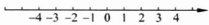

## 第 1 章 实数系与实数列的极限

微积分是在17世纪后半叶由科学家牛顿（Newton）和哲学家莱布尼茨（Leibniz）在前人成果的基础上创立的。在此后的近两个世纪中，微积分经历了一个飞速发展的时期，在许多科学领域里得到了广泛的应用，解决了许多过去认为是高不可攀的困难问题。然而这个时期的微积分却未能为自己的方法提供逻辑上坚实的基础，而只是借助于直观的“无穷小”来表述他们的卓越思想。这种逻辑上的缺陷招致了很多怀疑与批评，引起人们长达一个多世纪的误解与争论。直到19世纪上半叶，柯西（Cauchy）与维尔斯特拉斯（Weierstrass）等人建立了极限理论，为建立微积分坚实的理论基础向前迈进了一大步。又过了几十年时间，在19世纪下半叶，康托尔（Cantor）与戴德金（Dedekind）等人经过缜密的考察才发现，极限理论的一些基本原理，本质上依赖于实数系的一个非常关键的性质——实数的连续性。进而建立了实数理论，这样才使得微积分有了坚实的逻辑基础。为了方便读者的学习，在本章中我们主要指出关于实数系的一些基本事实与性质，进而给出实数列的极限理论。

### 1.1 实数系

微积分的主要研究对象是以实数为自变量的函数. 本节先来介绍实数系的相关知识.

在中学数学中,我们已经熟知,实数可以用数轴表示,且这种表示方法使得各实数之间的一些关系及运算具有几何直观性(图1.1.1).

任何两个实数间可以进行加、减、乘、除

(分母不为零)运算且运算结果仍为实数.

实数集还具有序关系：对任意两个实数

图 1.1.1

a,b,下列三种关系

 $$ a<b,\quad a=b,\quad a>b $$ 

有且只有一个成立．对任何三个实数 a, b, c，若  $ a \leqslant b $，则  $ a + c \leqslant b + c $，且当  $ c \geqslant 0 $ 时， $ ac \leqslant bc $.