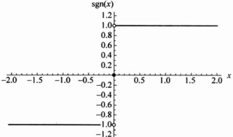

函数的实质就是描述自变量与因变量之间的对应关系.

我们只要知道对应规则 f 以及定义域  $ D(f) $，整个函数也就确定了，因此有时也称函数 f。这里应当注意，一般情况下  $ f(x) $ 表示一个函数，但有时  $ f(x) $ 是指函数 f 在 x 点的函数值，这要从上下文中加以区别。

对于函数  $ y = f(x) $，在几何上通常可以用 xOy 平面上的一条曲线来表示，即函数 f 的“图像”(图 2.1.2).

图 2.1.2

下子。

▶ 例 2.1.2 ……

符号函数(图 2.1.3):

 $$ \mathrm{sgn}(x)=\left\{\begin{aligned}&1,&x>0,\\ &0,&x=0,\\ &-1,&x<0.\end{aligned}\right. $$ 

图 2.1.3

