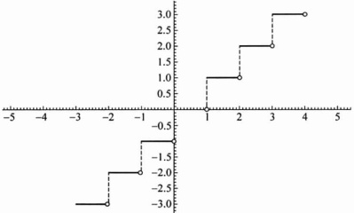

▶ 例 2.1.3 ……

取整函数： $ [x]=k $，当  $ x\in[k,k+1) $，而  $ k\in\mathbb{Z} $。其图像（图 2.1.4）为阶梯状的。

图 2.1.4

像例 2.1.2, 例 2.1.3 中这样分段表达的函数称为分段函数.

狄利克雷(Dirichlet)函数： $ D(x)=\begin{cases}1,&x \text{是有理数},\\0,&x \text{是无理数}.\end{cases} $

狄利克雷函数既“简单”，又“复杂”——它的值域中只有两个数：0 和 1，但是却无法描出它的图像。

#### 2.1.2 函数的运算

对于两个函数 f, g，在它们的公共定义域 D 上可以定义其和、差、积、商函数：

 $$ (f\pm g)(x)=f(x)\pm g(x),x\in D, $$ 

 $$ (f\cdot g)(x)=f(x)\cdot g(x),x\in D, $$ 

 $$ \Big(\frac{f}{g}\Big)(x)=\frac{f(x)}{g(x)},\quad x\in D(g(x)\neq0). $$ 

如果 g 的值域包含于 f 的定义域，则可以定义 f 与 g 的复合函数  $ f \circ g $：

 $$ (f\circ g)(x)=f(g(x)),\ x\in D(g). $$ 

▶ 例 2.1.5

(1) 函数  $ \sin^{2}x $ 为正弦函数  $ \sin u $ 与指数函数  $ e^{x} $ 的复合函数.

(2) 函数  $ 2^{\cos\sqrt{1+x^{2}}} $ 是三个函数  $ f(z)=2^{z} $， $ g(y)=\cos y $ 与  $ h(x)=\sqrt{1+x^{2}} $ 的复合函数.