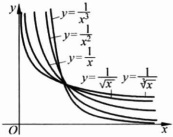

#### 2.1.3 初等函数

在中学中，已经学习过下列六类函数，这六类函数称为基本初等函数。

1) 多项式函数：

 $$ f(x)=a_{n}x^{n}+a_{n-1}x^{n-1}+\cdots+a_{1}x+a_{0},\quad x\in\mathbb{R}, $$ 

其中， $ a_{0}, a_{1}, \cdots, a_{n} $ 为  $ n+1 $ 个常数。特别地，当 n=0 时， $ f(x) = a_{0} (x \in \mathbb{R}) $ 为常值函数。

2）幂函数： $ f(x)=x^{p} $，其中p为常数.

当 p 是正整数时， $ f(x)=x^{p} $ 也是多项式函数，定义域是  $ \mathbb{R} $

当 p 是负整数时，幂函数  $ f(x)=x^{p} $ 的定义域是  $ \mathbb{R} \setminus \{0\} $;

对于所有的实数 p，幂函数  $ f(x)=x^{p} $ 的公共定义域是  $ (0,+\infty) $.

当 p 取不同值时，幂函数  $ f(x)=x^{p} $ 的图像如图 2.1.5 与图 2.1.6 所示.

图 2.1.5

图 2.1.6

3）指数函数： $ f(x)=a^{x} $，定义域是 $ \mathbb{R} $，其中底数a>0，且 $ a\neq1 $。图2.1.7与图2.1.8描绘了指数函数 $ f(x)=a^{x} $当底数a>1与a<1时的图像。

图 2.1.7

图 2.1.8

指数函数具有下列基本性质：设  $ a > 0, a \neq 1 $，则  $ \forall x, y \in \mathbb{R} $，

 $$ a^{x+y}=a^{x}\cdot a^{y};\quad(a^{x})^{y}=a^{xy}. $$ 

4）对数函数： $ f(x)=\log_{a}x $，定义域是 $ (0,+\infty) $，称为以a为底数的对数函数，其中底数a>0，且 $ a\neq1 $。当底数a=10时表示为： $ f(x)=\lg x $；当底数a=e时表示为： $ f(x)=\ln x $，称为自然对数（自然对数的底数e将在2.4节中介绍）。