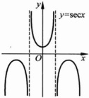

图 2.1.9 描绘了函数  $ f(x)=\ln x $ 的图像.

对数函数具有下列基本性质：设  $ a > 0, a \neq 1 $，则  $ \forall x, y > 0 $，

(1)  $ \log_{a}\frac{1}{x} = -\log_{a}x $;

(2)  $ \log_{a}(x \cdot y) = \log_{a}x + \log_{a}y $;

(3)  $ \log_a(x^p) = p \log_a x $ ( $ p \in \mathbb{R} $);

(4) $ \log_{a}1=0,a^{0}=1; $

图 2.1.9

(5) $ a^{\log_{a}x}=x,\log_{a}a^{x}=x; $

(6) $ \log_{b}x=\frac{\log_{a}x}{\log_{a}b} $ (b>0,b≠1).

5）三角函数：三角函数有正弦函数  $ \sin x (x \in \mathbb{R}) $，余弦函数  $ \cos x (x \in \mathbb{R}) $，正切函数  $ \tan x \left( x \in \mathbb{R} \setminus \left\{ k\pi + \frac{\pi}{2} \mid k \in \mathbb{Z} \right\} \right) $ 与余切函数  $ \cot x (x \in \mathbb{R} \setminus \left\{ k\pi \mid k \in \mathbb{Z} \right\}) $，有时也会用到两个相关的函数：正割函数  $ \sec x = \frac{1}{\cos x} \left( x \in \mathbb{R} \setminus \left\{ k\pi + \frac{\pi}{2} \mid k \in \mathbb{Z} \right\} \right) $，与余割函数  $ \csc x = \frac{1}{\sin x} \left( x \in \mathbb{R} \setminus \left\{ k\pi \mid k \in \mathbb{Z} \right\} \right) $。三角函数是应用非常广泛的一类函数。图 2.1.10～图 2.1.15 描绘了三角函数的图像。

图 2.1.10

图 2.1.11

图 2.1.12

图 2.1.13

熟知，三角函数之间有许多很有用的公式，为方便查阅，这里列出其中一部分.