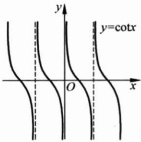

图 2.1.14

图 2.1.15

(1) $ \sin\left(\frac{\pi}{2}-x\right)=\cos x,\cos\left(\frac{\pi}{2}-x\right)=\sin x; $

(2) $ \sin^{2}x+\cos^{2}x=1 $;

(3)  $ \sin(x+y)=\sin x\cos y+\cos x\sin y; $

(4)  $ \cos(x+y)=\cos x\cos y-\sin x\sin y; $

(5) $ \sin2x=2\sin x\cos x,\cos2x=\cos^{2}x-\sin^{2}x; $

(6)  $ \sin x + \sin y = 2 \sin \frac{x + y}{2} \cos \frac{x - y}{2} $;

(7) $ \cos x+\cos y=2\cos\frac{x+y}{2}\cos\frac{x-y}{2}; $

(8)  $ \cos x - \cos y = -2 \sin \frac{x + y}{2} \sin \frac{x - y}{2} $;

(9)  $ \sin x \sin y = -\frac{1}{2} \left[ \cos(x + y) - \cos(x - y) \right] $;

(10)  $ \cos x \cos y = \frac{1}{2} \left[ \cos(x + y) + \cos(x - y) \right] $;

(11)  $ \sin x \cos y = \frac{1}{2} \left[ \sin(x + y) - \sin(x - y) \right] $;

(12)  $ \tan(x+y)=\frac{\tan x+\tan y}{1-\tan x\tan y} $;

(13)  $ \cot(x+y)=\frac{\cot x\cot y-1}{\cot x+\cot y} $

6) 反三角函数：反三角函数有反正弦函数  $ \arcsin x, x \in [-1, 1] $，值域为  $ \left[-\frac{\pi}{2}, \frac{\pi}{2}\right] $；反余弦函数  $ \arccos x, x \in [-1, 1] $，值域为  $ [0, \pi] $；反正切函数  $ \arctan x, x \in \mathbb{R} $，值域为  $ \left(-\frac{\pi}{2}, \frac{\pi}{2}\right) $；反余切函数  $ \operatorname{arccot} x, x \in \mathbb{R} $，值域为  $ (0, \pi) $。图 2.1.16～图 2.1.19 描绘了反三角函数的图像。