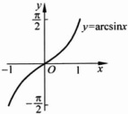
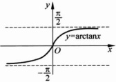

图 2.1.16

图 2.1.17

图 2.1.18

图 2.1.19

由上面列出的6类基本初等函数经过有限次的加减乘除(四则运算)与复合运算得到的函数称作初等函数.其他类型的函数称作非初等函数.

例如，例 2.1.2，例 2.1.3 与例 2.1.4 中的函数都是非初等函数。每个初等函数都有一个“自然的定义域”。

设  $ f(x)=\frac{\sqrt{1-x^{2}}}{\sin x}2^{x} $，其自然定义域是  $ [-1,0)\cup(0,1] $.

#### 2.1.4 几个常用的函数类

下面我们介绍几个常用的函数类.

### 1. 有界函数

设函数  $  f(x)  $ 在数集 A 上有定义. 如果  $ \exists M \in \mathbb{R} $ 使得  $ \forall x \in A $ 均有  $  f(x) \leqslant M  $，则称 f 在 A 上有上界. 类似地，可以定义 f 在 A 上有下界.

如果 f 在 A 上既有上界，又有下界，则称 f 在 A 上有界。否则称 f 在 A 上无界。

显然，f 在 A 上有界，当且仅当  $ \exists M \in \mathbb{R} $ 使得  $ \forall x \in A $ 均有  $ |f(x)| \leqslant M $。例如，函数  $ \sin x $ 与  $ \cos x $ 都在  $ \mathbb{R} $ 上有界，但  $ e^x $ 在  $ \mathbb{R} $ 上无界。