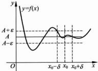

从函数  $ y=f(x) $ 的图像上看（如图 2.2.2），若极限  $ \lim_{x\to x_{0}}f(x)=A $，则对任意正数  $ \varepsilon $，存在  $ x_{0} $ 的某个空心邻域  $ U(x_{0},\delta) $，在此空心邻域内，曲线  $ y=f(x) $ 上的点都位于两水平直线  $ y=A+\varepsilon $ 与  $ y=A-\varepsilon $ 之间.

图 2.2.2

▶ 例 2.2.4 ……

对于符号函数

 $$ \mathrm{sgn}(x)=\left\{\begin{aligned}&1,&x>0,\\ &0,&x=0,\\ &-1,&x<0,\end{aligned}\right. $$ 

显然有  $ \lim_{x\to0^{-}}\mathrm{sgn}(x)=-1,\quad\lim_{x\to0^{+}}\mathrm{sgn}(x)=1. $ 进而知  $ \lim_{x\to0}\mathrm{sgn}(x) $ 不存在.

▶ 例 2.2.5

对于函数  $ f(x)=\mathrm{e}^{\frac{1}{x}} $， $ \lim_{x\to0^{-}}f(x)=0 $， $ \lim_{x\to0^{+}}f(x) $ 不存在.

▶ 例 2.2.6

求证：开区间 $ (a,b) $上的单调函数在每一点处的左右极限都存在.

证明 设 f 在  $ (a, b) $ 上单调递增， $ x_{0} \in (a, b) $，则  $ f(x) \leqslant f(x_{0})(x \in (a, x_{0})) $。于是数集  $ \{f(x) \mid x \in (a, x_{0})\} $ 非空有上界。记 A 为其上确界，则  $ f(x_{0}) \geqslant A $，且  $ \forall \varepsilon > 0 $，存在  $ x^{*} \in (a, x_{0}) $ 使得  $ f(x^{*}) > A - \varepsilon $。由于 f 单增，故对所有的  $ x \in (x^{*}, x_{0}) $ 都有

 $$ A-\varepsilon<f(x)\leqslant A, $$ 

所以  $ \lim_{x\to x_{0}}f(x)=A. $

完全类似地，数集 $ \{f(x)\mid x\in(x_{0},b)\} $非空有下界。记B为其下确界，则 $ f(x_{0})\leqslant B $，且

 $$ \lim_{x\to x_{0}^{+}}f(x)=B. $$ 

若 f 在  $ (a,b) $ 上单调递减， $ x_{0}\in(a,b) $，则同理可证：