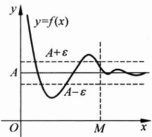

 $$ \lim_{x\to x_{0}^{-}}f(x)\geqslant f(x_{0})\geqslant\lim_{x\to x_{0}^{+}}f(x), $$ 

#### 2.2.2 函数在无穷远点的极限

(1) 设  $ f(\text{在 }(-\infty, -a) \cup (a, +\infty) $ ( $ a > 0 $) 内定义,  $ A \in \mathbb{R} $. 若  $ \forall \varepsilon > 0 $,  $ \exists M > 0 $, 当  $ |x| > M $ 时, 有  $ |f(x) - A| < \varepsilon $, 则称当  $ x \to \infty $ 时  $ f(x) $ 有极限 A. 记作  $ \lim_{x \to \infty} f(x) = A $;

(2) 设  $ f $ 在  $ (a, +\infty) $（或  $ (- \infty, a) $）内定义， $ A \in \mathbb{R} $。若  $ \forall \varepsilon > 0 $， $ \exists M > 0 $，当  $ x > M $（或  $ x < -M $）时，有  $ |f(x) - A| < \varepsilon $，则称当  $ x \to +\infty $（或  $ x \to -\infty $）时  $ f(x) $ 有极限  $ A $。记作  $ \lim_{x \to +\infty} f(x) = A $（或  $ \lim_{x \to -\infty} f(x) = A $）。

由上述定义不难验证： $ \lim_{x \to +\infty} f(x) = A $ 的充分必要条件是： $ \lim_{x \to +\infty} f(x) = A $ 与  $ \lim_{x \to -\infty} f(x) = A $ 同时成立。

图 2.2.3 说明了  $ \lim_{x\to+\infty}f(x)=A $ 几何上的直观意义： $ \forall\varepsilon>0 $，以直线 y=A 为中心线，作一个宽为  $ 2\varepsilon $ 的水平带形，则存在 M>0，使得在区间  $ (M,+\infty) $ 上，曲线  $ y=f(x) $ 完全落在这个带形之内.

图 2.2.3

设 a > 1，求证  $ \lim_{x \to +\infty} a^{-x} = 0 $.

证明  $ \forall\varepsilon>0, $ 为使  $ \left|a^{-x}-0\right|=a^{-x}<\varepsilon, $ 只需使  $ x>\log_{a}\frac{1}{\varepsilon}. $ 于是，若取正数  $ M\geqslant\log_{a}\frac{1}{\varepsilon} $，那么只要 x>M，就有

 $$ \left|a^{-x}-0\right|=a^{-x}<\varepsilon, $$ 

于是  $ \lim_{x\to+\infty}a^{-x}=0. $

求证  $ \lim_{x\to+\infty}\left[\ln(x+1)-\ln x\right]=0. $

证明 注意到  $ \left|\ln(x+1)-\ln x-0\right|=\ln\left(1+\frac{1}{x}\right)(x>0) $.  $ \forall\varepsilon>0 $, 为使  $ \ln\left(1+\frac{1}{x}\right)<\varepsilon $, 只需使  $ 1+\frac{1}{x}<\mathrm{e}^{x} $, 即  $ x>M=\frac{1}{\mathrm{e}^{x}-1} $. 于是  $ \lim_{x\to+\infty}\left[\ln(x+1)-\ln x\right]=0 $.