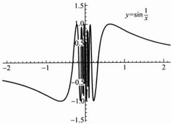

图 2.3.2

▶ 例 2.3.7 ……

求证：(1) $ \lim_{x\to x_{0}}e^{x}=e^{x_{0}} $; (2)当 $ x_{0}>0 $时, $ \lim_{x\to x_{0}}\ln x=\ln x_{0} $

证明 （1）根据例1.2.4，对于任取的点列 $ \{x_{n}\} $，当 $ x_{n}\rightarrow x_{0} $时，便有 $ \lim_{n\to\infty}e^{x_{n}}=e^{x_{0}} $，应用定理2.3.4即得 $ \lim_{n\to\infty}e^{x}=e^{x_{0}} $.

类似地可证得(2).

▶ 例 2.3.8 .....

设  $ \lim_{x\to x_{0}}u(x)=a>0,\quad\lim_{x\to x_{0}}v(x)=b $ , 则  $ \lim_{x\to x_{0}}u(x)^{v(x)}=a^{b} $

证明 由例 2.2.4, $ \lim_{n\to\infty}lnx=\ln a $. 应用定理 2.3.3 便知

 $$ \lim_{x\to x_{0}}\ln u(x)=\ln a, $$ 

于是

 $$ \lim_{x\to x_{0}}v(x)\ln u(x)=\lim_{x\to x_{0}}v(x)\lim_{x\to x_{0}}\ln u(x)=b\ln a, $$ 

再由例 2.3.7， $ \lim_{u\to u_{0}}e^{u}=e^{u_{0}} $，若在定理 2.3.3 中取  $ f(u)=e^{u} $， $ g(x)=v(x)\ln u(x) $，

即得

 $$ \lim_{x\to x_{0}}u\left(x\right)^{v(x)}=\lim_{x\to x_{0}}e^{\left\lbrack v(x)\ln u(x)\right\rbrack}=e^{b\ln u}=a^{b}. $$ 

不难看出，例 2.3.8 中的极限过程  $ x \rightarrow x_{0} $ 也可以换成其他五种极限过程的任一种.

▶ 例 2.3.9 ……

设  $ a \neq 0 $，求极限  $ \lim_{x \to +\infty} \left( \frac{x + a}{x - a} \right)^x $.

解 注意到