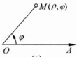

所确定. 这里需要假定  $ x=\varphi(t) $ 在参变量 t 的某个区间上连续且严格单调，从而其反函数  $ t=\varphi^{-1}(x) $ 存在且连续. 将  $ t=\varphi^{-1}(x) $ 代入  $ y=\psi(t) $ 即得

 $$ y=f(x)=\psi(\varphi^{-1}(x)). $$ 

所以，若  $ x=\varphi(t) $ 与  $ y=\psi(t) $ 都可导，则  $ t=\varphi^{-1}(x) $ 也可导。应用复合函数与反函数的求导法则便得到

 $$ \frac{\mathrm{d}y}{\mathrm{d}x}=\frac{\mathrm{d}y}{\mathrm{d}t}\bullet\frac{\mathrm{d}t}{\mathrm{d}x}=\frac{\mathrm{d}y}{\mathrm{d}t}\bullet\frac{1}{\frac{\mathrm{d}x}{\mathrm{d}t}}=\frac{\psi^{\prime}(t)}{\varphi^{\prime}(t)}. $$ 

设函数  $ y = f(x) $ 由数参方程  $ \left\{\begin{aligned} x &= t + e^{t}, \\ y &= t^{2} + e^{2t} \end{aligned}\right. $ 确定，求  $ \frac{dy}{dx} $.

解  $ \frac{\mathrm{d}y}{\mathrm{d}x}=\frac{y^{\prime}(t)}{x^{\prime}(t)}=\frac{2(t+\mathrm{e}^{2t})}{1+\mathrm{e}^{t}}. $

下面介绍一种常用的与极坐标相关联的参数方程. 首先介绍极坐标的概念.

在平面上取一点 O 及以 O 为起点的射线 OA（如图 3.2.1(a)），点 O 称为极点，射线 OA 称为极轴，由点 O 向任一点 M 作连线  $ \overrightarrow{OM} $，记  $ \rho = \overrightarrow{OM} $，由极轴 OA 按逆时针方向转向  $ \overrightarrow{OM} $ 的转角记为  $ \varphi $（若按顺时针方向，则  $ \varphi < 0 $）。称  $ (\rho, \varphi) $ 为点 M 的极坐标， $ \rho $ 称为极径， $ \varphi $ 称为极角。

显然，点 M 的极角  $ \varphi $ 不唯一：若  $ \varphi $ 是点 M 的极角，则  $ \varphi + 2n\pi $ ( $ n \in \mathbb{Z} $) 也是点 M 的极角。为了保持极角  $ \varphi $ 的确定性，通常取  $ \varphi \in [0, 2\pi] $ 或  $ \varphi \in [-\pi, \pi] $。

(b)

图 3.2.1

如果取极点 O 为直角坐标系的原点，极轴为正半 x 轴（如图 3.2.1(b)），则点 M 的直角坐标  $ (x, y) $ 与极坐标  $ (\rho, \varphi) $ 之间的关系是

 $$ x=\rho\cos\varphi,y=\rho\sin\varphi. $$ 

用极坐标表示的平面曲线方程

 $$ \rho=\rho(\varphi) $$ 

称为极坐标方程. 它也可以表示成下列以极角  $ \varphi $ 为参数的参数方程：

 $$ x=\rho(\varphi)\cos\varphi,\quad y=\rho(\varphi)\sin\varphi. $$ 